# 3GPP TR 38.885; V16.0.0; Study on NR Vehicle-to-Everything(V2X)

## 4. Introduction

V2V 및 V2X 서비스에 대한 지원은 3GPP 플랫폼을 자동차 산업으로 확장하기 위해 릴리스 14 및 15 동안 LTE에 도입되었습니다. 이러한 작업 항목은 차량 애플리케이션에 적합한 LTE SL과 셀룰러 인프라에 대한 보완적인 개선 사항을 정의했습니다.
이 작업 외에도 SA WG1은 향상된 V2X 사용 사례를 지원하기 위한 1단계 요구 사항을 정의했으며, 이는 4개의 사용 사례 그룹으로 광범위하게 배열됩니다.

1) 차량 군집주행은 차량들이 동적으로 함께 이동하는 군집을 형성할 수 있게 합니다. 소대의 모든 차량은 이 소대를 관리하기 위해 선두 차량으로부터 정보를 얻습니다. 이러한 정보를 통해 차량은 같은 방향으로 가고 함께 이동하면서 조정된 방식으로 평소보다 더 가깝게 운전할 수 있습니다.
2) Extended Sensors는 차량, 도로 사이트 단위, 보행자 장치 및 V2X 애플리케이션 서버 간에 로컬 센서 또는 라이브 비디오 이미지를 통해 수집된 원시 또는 처리된 데이터의 교환을 가능하게 합니다. 차량은 자체 센서가 감지할 수 있는 것 이상으로 주변 환경에 대한 인식을 높이고 지역 상황에 대해 보다 광범위하고 전체적인 관점을 가질 수 있습니다. 높은 데이터 속도는 주요 특징 중 하나입니다.
3) Advanced Driving은 반자동 또는 완전 자동 운전을 가능하게 합니다. 각 차량 및/또는 RSU는 로컬 센서에서 얻은 자체 인식 데이터를 근접한 차량과 공유하고 이를 통해 차량이 궤적이나 기동을 동기화하고 조정할 수 있습니다. 각 차량은 근접한 차량과도 운전 의도를 공유합니다.
4) 원격 운전은 원격 운전자 또는 V2X 애플리케이션이 스스로 운전할 수 없는 승객이나 위험한 환경에 있는 원격 차량을 위해 원격 차량을 작동할 수 있도록 합니다. 대중교통과 같이 변동이 적고 경로를 예측할 수 있는 경우에는 클라우드 컴퓨팅 기반의 운전을 사용할 수 있습니다. 높은 안정성과 짧은 대기 시간이 주요 요구 사항입니다.

TSG RAN에서 NR에 대한 해당 5G RAN 요구 사항 세트, 채널 모델 등은 TR 38.913 및 TR 37.885에 정의되어 있습니다.
이 연구는 3GPP 플랫폼에서 V2X 지원의 3단계로 NR에서 이러한 고급 사용 사례 및 요구 사항을 지원하는 RAN 측면을 조사합니다. 이 TR은 다음에 대한 연구 결과를 보고합니다. V2X용 NR SL 디자인; 고급 V2X 사용 사례를 위한 Uu 개선 사항 LTE 및 NR에 의한 Uu 기반 SL 자원 할당/구성 RAT 및 인터페이스 선택; QoS 관리; 및 NR과 LTE SL 사이의 비동채널 공존. 이 연구는 6GHz 이하, 즉 FR1 (Frequency Range 1) 및 FR2 (Frequency Range 2), 최대 52.6GHz의 주파수 범위에서 허가되지 않은 ITS(Intelligent Transport System) 대역 및 허가된 대역을 다룹니다. 이러한 측면에서 볼 수 있듯이 NR V2X는 고급 V2X 서비스를 위해 LTE V2X를 보완하고 LTE V2X와의 연동을 지원할 것입니다.
이 문서의 나머지 부분에서는 NR SL 또는 LTE SL을 구체적으로 언급할 수 있습니다. RAT가 표시되지 않으면 NR SL을 의미합니다.

### 4.1 Operation scenarios

연구에서 고려된 시나리오는 다음 그림과 같습니다. 시나리오는 아키텍처와 관련하여 독립형 시나리오와 MR-DC (Multi-Radio Dual Connectivity) 시나리오로 분류할 수 있습니다. 이 연구는 시나리오 1, 2, 3에 우선순위를 두었고, 시나리오 1, 2, 3에서 각각 다루는 시나리오 4, 5, 6에서 NR SL과 LTE SL을 모두 제어/구성하는 MN(Master Node)에 우선순위를 두었습니다.
그림 4.1-1, 그림 4.1-2 및 그림 4.1-3은 V2X SL 통신을 지원하는 독립형 시나리오를 보여줍니다. 특히:
1) 시나리오 1에서 gNB는 LTE SL 및 NR SL 모두에서 UE의 V2X 통신을 위한 제어/구성을 제공합니다.
2) 시나리오 2에서 ng-eNB는 LTE SL 및 NR SL 모두에서 UE의 V2X 통신을 위한 제어/구성을 제공합니다.
3) 시나리오 3에서 eNB는 LTE SL 및 NR SL 모두에서 UE의 V2X 통신을 위한 제어/구성을 제공합니다.

- Figure 4.1-1: Scenario 1

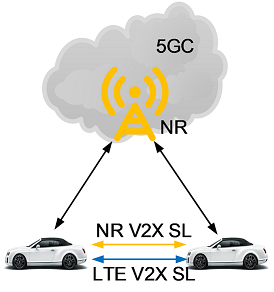

- Figure 4.1-2: Scenario 2


- Figure 4.1-3: Scenario 3

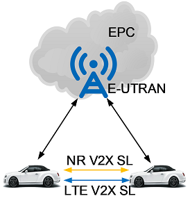


그림 4.1-4, 그림 4.1-5 및 그림 4.1-6은 V2X SL 통신을 지원하기 위한 MR-DC 시나리오를 보여줍니다. 특히:
1) 시나리오 4에서, LTE SL 및 NR SL에서 UE의 V2X 통신은 UE가 NE-DC (NR-E-UTRA Dual Connetivity)로 구성되는 동안 Uu에 의해 제어/구성됩니다.
2) 시나리오 5에서, LTE SL 및 NR SL에서 UE의 V2X 통신은 UE가 NGEN-DC (NG-RAN E-UTRA-NR Dual Connectivity)에서 구성되는 동안 Uu에 의해 제어/구성됩니다.
3) 시나리오 6에서 LTE SL 및 NR SL에서의 UE의 V2X 통신은 UE가 EN-DC에서 구성되는 동안 Uu에 의해 제어/구성된다.

- Figure 4.1-4: Scenario 4

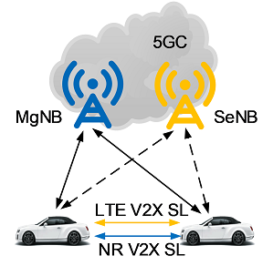

- Figure 4.1-5: Scenario 5

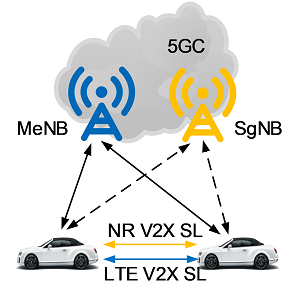

- Figure 4.1-6: Scenario 6

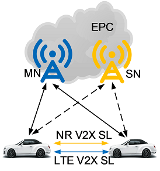

## 5. Sidelink (PC5) aspects

### 5.1 NR sidelink unicast, groupcast, and broadcast design

SL 브로드캐스트, 그룹캐스트 및 유니캐스트 전송은 커버리지 내, 커버리지 외 및 부분 커버리지 시나리오에 대해 지원됩니다.
PC5 인터페이스의 제어 평면에 대한 AS 프로토콜 스택은 최소한 RRC, PDCP, RLC 및 MAC 하위 계층과 물리 계층으로 구성됩니다. PC5-C의 프로토콜 스택은 그림 5.1-1에 나와 있습니다.

- Figure 5.1-1: PC5 control plane (PC5-C) protocol stack

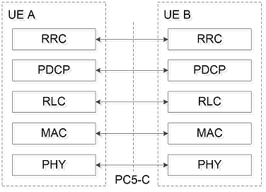

PC5 인터페이스의 사용자 평면에 대한 AS 프로토콜 스택은 SDAP, PDCP, RLC 및 MAC 하위 계층과 물리 계층으로 구성됩니다. PC5-U의 프로토콜 스택은 그림 5.1-2에 나와 있습니다.

- Figure 5.1-2: PC5 user plane (PC5-U) protocol stack

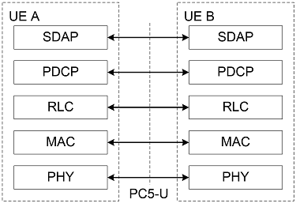

물리 계층 분석을 위해 상위 계층이 특정 데이터 전송에 유니캐스트, 그룹캐스트 또는 브로드캐스트 전송을 사용할지 여부를 결정하고 이에 따라 물리 계층에 알린다고 가정합니다. 유니캐스트 또는 그룹캐스트 전송을 고려할 때, UE는 전송이 속한 유니캐스트 또는 그룹캐스트 세션을 설정할 수 있고 다음 정보가 물리 계층에 알려져 있다고 가정합니다.
- IDs:
    + SCI로 전달되는 레이어 1 소스 및 대상 ID
    + 적어도 HARQ 피드백이 사용 중일 때 수신에서 결합될 수 있는 전송을 식별하기 위한 목적으로 PSCCH를 통해 전달되는 추가 레이어-1 ID(섹션 5.1.2.2 참조)
    + HARQ 프로세스 ID

계층 2 분석을 위해 상위 계층(즉, AS 위)이 특정 데이터 전송에 대한 유니캐스트, 그룹캐스트 또는 브로드캐스트 전송인지에 대한 정보를 제공한다고 가정합니다. SL의 유니캐스트 및 그룹캐스트 전송을 위해 다음 정보가 레이어 2에 알려져 있습니다.
- IDs:
    + 유니캐스트: 대상 ID, 소스 ID
    + Groupcast: 대상 그룹 ID, 소스 ID

그룹 대상 계층 2 ID를 수신하도록 구성된 모든 UE는 상위 계층에서 제공하는 "최소 통신 범위" 내에 있든 없든 그룹캐스트 전송을 수신할 수 있습니다.
유니캐스트의 AS 수준 링크 관리를 위해 SL RLM/RLF 선언이 지원됩니다. SL 유니캐스트의 RLC AM의 경우, 최대 재전송 횟수에 도달했다는 RLC의 표시에 의해 RLF 선언이 트리거됩니다. AS 레벨 링크 상태(예: 장애)는 상위 계층에 알려야 합니다. 유니캐스트에 대한 RLM 절차와 다른 그룹캐스트에 특정한 RLM 설계는 고려되지 않습니다. 그룹캐스트를 위해 그룹 구성원 간에 RLM/RLF 선언이 필요하지 않습니다.
유니캐스트 및 그룹캐스트 전송을 위한 탐색 절차 및 관련 메시지는 상위 계층에 있습니다.

#### 5.1.1 Physical layer structures

본 절에서는 PSCCH(Physical SL Control Channel), PSSCH(Physical SL Shared Channel), PSFCH(Physical SL Feedback Channel)의 설계 및 기타 물리계층 구조와 관련된 사항들을 다룹니다. 이 TR에서 논의된 것 외에도 적어도 변조, 스크램블링, RE 매핑 및 속도 일치와 관련된 측면이 표준 작업에 포함될 것입니다. 물리 SL 브로드캐스트 채널(PSBCH)의 설계는 5.2절을 참조합니다.
연구에서 지원하는 파형은 CP-OFDM입니다.

##### 5.1.1.1 Subcarrier spacing and cyclic prefix

FR1에서 15kHz, 30kHz 및 60kHz SCS는 일반 CP로 지원되고 60kHz SCS는 확장 CP로도 지원됩니다. FR2에서는 일반 CP로 60kHz 및 120kHz SCS를 지원하고 확장 CP로 60kHz SCS를 지원합니다. 주어진 반송파에서, UE는 SCS와 CP의 둘 이상의 조합으로 SL 전송을 동시에 수신하거나 둘 이상의 SCS와 CP 조합으로 SL 전송을 동시에 전송할 필요가 없습니다. [수비학](https://ai-com.tistory.com/entry/NR-%EC%A0%84%EC%86%A1-%EA%B5%AC%EC%A1%B0-1-Numerology) 구성은 SL BWP 구성의 일부입니다(섹션 5.1.1.3 참조).

##### 5.1.1.2 Channel coding
NR Uu에서 데이터 및 제어를 위해 정의된 채널 코딩은 각각 NR SL에서 데이터 및 제어를 위한 시작점입니다.

##### 5.1.1.3 SL bandwidth parts and resource pools
BWP는 SL에 대해 정의되며 동일한 SL BWP가 송수신에 사용됩니다. 사양 측면에서 라이선스 캐리어에서 SL BWP는 Uu BWP와 별도로 정의되고 별도의 구성 신호를 갖습니다. 하나의 SL BWP는 캐리어에서 RRC IDLE 및 커버리지 밖 NR V2X UE에 대해 (사전) 구성됩니다. RRC_CONNECTED 모드에 있는 UE의 경우 하나의 SL BWP가 캐리어에서 활성화됩니다. SL BWP의 활성화 또는 비활성화를 위해 SL을 통해 신호가 교환되지 않습니다.
캐리어에서는 UE에 대해 하나의 SL BWP만 구성되며 UE는 SL BWP에서 활성 UL BWP와 다른 수비학을 동시에 사용할 것으로 예상되지 않습니다.
리소스 풀은 SL 전송 및/또는 수신에 사용할 수 있는 시간-주파수 리소스 집합입니다. UE 관점에서 리소스 풀은 SL BWP 내에서 UE의 대역폭 내부에 있으며 단일 수비학을 갖습니다. 리소스 풀의 시간 도메인 리소스는 비연속적일 수 있습니다. 다중 자원 풀은 캐리어의 UE에 (사전) 구성될 수 있습니다.

##### 5.1.1.4 Resource arrangements
NR V2X는 ITS 서비스 전용 캐리어 또는 셀룰러 서비스와 공유되는 캐리어에 배치될 수 있습니다. 따라서, 슬롯의 모든 심볼이 SL에 대해 이용 가능하고 슬롯 내의 연속적인 심볼의 서브셋(동적으로 표시되지 않음)만이 SL에 대해 이용 가능하도록 리소스가 배치됩니다. 표준 사양 작업에서 향후 호환성 문제를 찾지 못한 경우, 셀룰러 서비스와 공유되는 캐리어에 배치되는 것은 ITS 스펙트럼에서 사용하기 위한 것이 아닙니다.
PSSCH를 위한 자원할당은 주파수 영역에서의 부채널 개념을 기반으로 하며, 단말은 반송파 상의 슬롯에서 송신 또는 수신을 수행한다. TB(Transport Block)의 블라인드 재전송이 지원되며 자원 할당 모드 2(섹션 5.3.1 참조)는 적어도 이러한 블라인드 재전송을 위해 SL 리소스 예약을 지원합니다.
PSFCH(섹션 5.1.2.2 참조)는 최소한 슬롯에서 SL에 사용할 수 있는 마지막 심볼(들)을 사용하는 형식을 지원합니다.

##### 5.1.1.5 Reference signals
PSSCH와 관련된 DM-RS(Demodulation Reference Signal)는 시간 영역에서 가능한 여러 패턴 중 하나로 전송됩니다. FR2에서는 PSSCH용 PT-RS도 지원한다.
다른 후보 참조 신호는 CSI-RS(CSI 절차에 대해서는 섹션 5.1.2.3 참조), SRS 및 AGC 훈련 신호입니다.

#### 5.1.2 Physical layer procedures
이 섹션에서는 물리 계층 절차에 대해 설명합니다. SL 동기화에 관한 절차는 5.2절을 참조하십시오.

#### 5.1.2.1 Multiplexing of physical channels
PSSCH는 PSCCH가 PSSCH를 디코딩하는 데 필요한 최소한의 SCI를 전달할 때 PSCCH에 "연결"되었다고 합니다. PSCCH 및 연관된 PSSCH의 다중화를 위한 다음 옵션이 연구됩니다.
옵션 1: PSCCH 및 연관된 PSSCH는 비중첩 시간 자원을 사용하여 전송됩니다.
- 옵션 1A: 두 채널에서 사용하는 주파수 자원이 동일합니다.
- 옵션 1B: 두 채널이 사용하는 주파수 자원이 다를 수 있습니다.
옵션 2: PSCCH 및 관련 PSSCH는 전송에 사용되는 모든 시간 자원에서 비중첩 주파수 자원을 사용하여 전송됩니다. 두 채널이 사용하는 시간 리소스는 동일합니다.
옵션 3: 일부 PSCCH 및 연관된 PSSCH는 비중첩 주파수 자원에서 중첩 시간 자원을 사용하여 전송되지만, 연관된 PSSCH의 다른 일부 및/또는 PSCCH의 다른 일부는 비중첩 시간 자원을 사용하여 전송됩니다.

- Figure 5.1-3: Illustration of multiplexing options for PSCCH and associated PSSCH

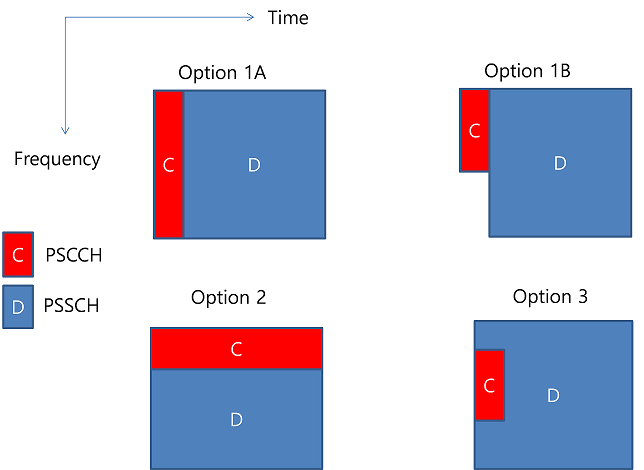

위에서 설명한 옵션 중 적어도 옵션 3이 지원됩니다. (편집자 주: 이것은 RAN1의 가정임)

##### 5.1.2.2 HARQ procedures

###### 5.1.2.2.1 General HARQ procedure
SL 유니캐스트 및 그룹캐스트의 경우 물리적 계층에서 HARQ 피드백 및 HARQ 결합이 지원됩니다. PSSCH에 대한 HARQ-ACK 피드백은 자원 할당 모드 1 및 2에서 PSFCH를 통해 SFCI 형식으로 전달됩니다.
유니캐스트에 대해 SL HARQ 피드백이 활성화된 경우 CBG(Codeblock Group)가 아닌 경우 수신기 UE는 해당 TB(Transport Block)를 성공적으로 디코딩하면 HARQ-ACK를 생성합니다. 수신기 UE를 대상으로 하는 관련 PSCCH를 디코딩한 후 해당 TB(Transport Block)를 성공적으로 디코딩하지 못하면 HARQ-NACK을 생성합니다.
그룹캐스트에 대해 SL HARQ 피드백이 활성화되면 HARQ 피드백 전송 여부를 결정할 때 TX-RX 거리 및/또는 RSRP(Reference Signal Received Power)를 사용하도록 지원됩니다. 비 CBG 작업의 경우 두 가지 옵션이 지원됩니다. (편집자 주: 이것은 RAN1의 가정임 )
- 옵션 1: Receiver UE는 연관된 PSCCH를 디코딩한 후 해당 TB(Transport Block)를 디코딩하지 못하면 PSFCH(Physical SL Feedback Channel)를 통해 HARQ-NACK을 전송합니다. 그렇지 않으면 PSFCH에서 신호를 전송하지 않습니다.
- 옵션 2: 수신자 UE는 해당 TB(Transport Block)를 성공적으로 디코딩하면 PSFCH를 통해 HARQ-ACK를 전송한다. 수신 UE를 타겟으로 하는 관련 PSCCH를 디코딩한 후 해당 TB(Transport Block)를 성공적으로 디코딩하지 못하면 PSFCH를 통해 HARQ-NACK을 전송합니다.

###### 5.1.2.2.2 HARQ procedure details for Mode 1 resource allocation
PSSCH와 PSFCH에서 HARQ 피드백 전송 사이의 시간은 (미리) 구성됩니다. 유니캐스트 및 그룹캐스트의 경우 SL에서 재전송이 필요한 경우 PUCCH를 사용하여 인커버리지 UE가 이를 gNB에 알릴 수 있습니다. 전송기 UE가 HARQ ACK/NACK 형식이 아니라 SR/BSR과 같은 형식으로 서빙 gNB에 표시를 보내는 것이 지원됩니다.
이 연구에서는 수신자 UE가 HARQ ACK/NACK으로 표시를 서빙 gNB에 전송하고 BS 간 통신이 없다고 가정하는 추가 옵션을 고려했습니다.
SL 재전송 리소스는 이러한 표시를 수신하지 않고도 gNB에서 예약할 수도 있습니다.

###### 5.1.2.2.3 HARQ procedure details for Mode 2 resource allocation
PSSCH와 PSFCH에서 HARQ 피드백 전송 사이의 시간은 (미리) 구성됩니다.

##### CSI acquisition
V2X를 위한 CSI(Channel State Information) 정보의 예로는 CQI(Channel Quality Indicator), PMI(Precoding Matrix Indicator), RI(Rank Indication), RSRP(Reference Signal Received Power), RSRQ(Reference Signal Received Quality), 경로이득/경로손실, SRI(Service Request Indicator), CRI(CSI-RS Resource Indicator), 간섭 조건, 차량 움직임 등이 있다. 유니캐스트 통신의 경우, CQI, RI 및 PMI 또는 이들 중 일부는 4개 이하의 안테나 포트를 가정하는 비 서브밴드 기반 비주기적 CSI 보고로 지원됩니다. CSI 절차는 '독립형' RS(Reference Symbol)에 의존하지 않습니다. CSI 보고는 구성에 따라 활성화 및 비활성화할 수 있습니다. 

##### 5.1.2.4 Power control
개방 루프 전력 제어 절차는 SL에 대해 지원됩니다. 전송 UE가 커버리지에 있을 때 gNB는 전송 UE와 서빙 gNB 간의 경로 손실을 기반으로 유니캐스트, 그룹캐스트 또는 브로드캐스트 전송을 위해 OLPC(Open Loop Power Control)를 활성화할 수 있습니다. 이는 gNB의 UL 수신에 대한 간섭을 완화하기 위함입니다. 추가적으로, 적어도 유니캐스트의 경우, (사전)구성은 송신 UE와 수신 UE 사이의 경로 손실을 사용하는 것도 가능하게 할 수 있습니다. 송신 UE는 수신 UE에 의해 보고된 SL RSRP로부터 경로 손실 추정을 도출합니다.
OLPC를 지원하기 위해 적어도 유니캐스트에 대해 SL에서 L3 필터링과 같은 장기 측정이 지원됩니다.
SL은 TPC(Transmit Power Control) 명령을 지원하지 않습니다.

##### 5.1.2.5 Beam management
RAN1은 빔 관리에 대한 제한된 연구를 수행했으며 SL에 유익하다는 결론을 내렸습니다. FR1에서는 SL 빔 관리 없이 V2X 사용 사례를 지원하는 것이 가능합니다. FR2에서는 일부 시나리오에서 SL 빔 관리 없이 일부 V2X 사용 사례를 지원하는 것이 가능합니다. FR2에서 통신 범위를 개선하려면 패널 선택이 필요합니다.

### 5.2 Synchronization
V2X SL 동기화에는 다음이 포함됩니다.
- SL 동기 신호: SL 1차 동기 신호(S-PSS; Sidelink Primary Synchronization Signal), SL 2차 동기 신호(S-SSS; Sidelink Secondary Synchronization Signal)
- 물리 SL 브로드캐스트 채널(PSBCH)
- SL 동기화 소스 및 절차 

참조 신호 및 PSCCH/PSSCH와 같은 SL 동기화를 위한 다른 SL 신호 및 채널의 사용도 연구됩니다.

#### 5.2.1 S-PSS, S-SSS, PSBCH
S-PSS, S-SSS 및 PSBCH는 주기적 전송을 지원하는 블록 형식(S-SSB; Sidelink Synchronization Signal Block)으로 구성됩니다. S-SSB는 반송파의 PSCCH/PSSCH와 동일한 수비학(즉, SCS 및 CP 길이)을 가지며, 전송 대역폭은 (사전)구성된 SL BWP 내에 있고, 주파수 위치는 (사전)구성되어 있습니다. 이는 UE가 반송파에서 S-SSB를 찾기 위해 주파수에서 가설 검출을 수행할 필요가 없게 합니다.
S-PSS에 대한 시퀀스는 m-시퀀스이고 S-SSS에 대한 시퀀스는 골드 시퀀스입니다. 이들은 각각 PSS 및 SSS와 동일한 유형의 시퀀스입니다.

#### 5.2.2 Synchronization procedure
SL 동기화 소스는 GNSS, gNB, eNB, NR UE이며, 표 5.2.2-1과 같이 각각 동기화 우선순위와 연관됩니다.

|Priority level | GNSS-based synchronization | gNB/eNB-based synchronization |
|:--- |:--- |:--- |
|P0 |GNSS |gNB/eNB |
|P1 |All UEs directly synchronizaed to GNSS | All UEs directly synchronizaed to gNB/eNB |
|P2 |All UEs indirectly synchronized to GNSS | All UEs indirectly synchronized to gNB/eNB |
|P3 |Any other UE |GNSS |
|P4 |N/A |All UEs directly synchronized to GNSS |
|P5 |N/A |All UEs indirectly synchronized to GNSS |
|P6 |N/A |Any other UE |

(편집자 주: 이것은 RAN1의 가정임)

GNSS 기반 또는 gNB/eNB 기반 동기화 사용 여부는 (미리) 구성됩니다. 단일 반송파 동작에서 UE는 가장 높은 우선 순위를 가진 사용 가능한 동기화 기준에서 전송 타이밍을 도출합니다.
eNB는 LTE Uu/PC5 또는 LTE Uu를 지원하는 NR UE에 대해서만 동기 소스가 될 수 있습니다. NR SL이 LTE SL과 동기화될 때의 동작과 NR 및 LTE SL 동기화 절차가 독립적으로 동작하는 동작은 표준 사양 작업과 관련이 있습니다.
셀룰러 네트워크가 존재하지 않는 비인가(ITS) 통신 사업자에서는 동기화 목적으로 SL RS를 사용하는 것도 지원됩니다. 그러한 RS는 S-PSS/S-SSS의 일부가 아니며 특별히 이 목적을 위해 전송되거나 설계되지도 않습니다.

### 5.3 Resource allocation
이 연구는 적어도 다음 두 가지 SL 리소스 할당 모드를 정의합니다.
- Mode 1: BS는 SL 전송(들)을 위해 UE에 의해 사용될 SL 자원(들)을 스케줄링한다. 섹션 6.2.1을 참조하십시오.
- Mode 2: UE는 BS(Base Station)/네트워크에 의해 구성된 SL 자원 또는 미리 구성된 SL 자원 내에서 SL 전송 자원(들)을 결정합니다. 즉, BS는 스케줄하지 않습니다. 섹션 5.3.1을 참조하십시오.

SL 리소스 할당 모드 2의 정의는 다음을 다룹니다.

- a) UE는 전송을 위해 자율적으로 SL 자원을 선택합니다.
- b) UE는 a), c), d)의 일부일 수 있는 기능인 다른 UE(들)에 대한 SL 자원 선택을 지원합니다.
- c) UE는 SL 전송을 위해 NR 구성된 승인(유형 1 유사)으로 구성됨
- d) UE는 다른 UE의 SL 전송을 스케줄링합니다.

#### 5.3.1 Resource allocation Mode 2
자원 할당 모드 2는 최소한 블라인드 재전송을 위해 SL 자원 예약을 지원합니다.

```text
LTE-V2X에서는 Broadcast만 지원하기 때문에, Feedback-based HARQ없이 2번까지 재전송할 수 있게 설계함 (Blind-Retransmission)으로써, Reliability를 높이도록 하였다. 
```

##### 5.3.1.1 Sensing and resource (re-selection)
센싱 및 자원 (재)선택 관련 절차는 자원 할당 모드 2를 위해 지원됩니다.
고려되는 감지 절차는 다른 UE 및/또는 SL 측정으로부터 SCI(들)를 디코딩하는 것으로 정의됩니다. 이 절차에서 SCI(들)의 디코딩은 적어도 SCI를 전송하는 UE에 의해 지시된 SL 자원에 대한 정보를 제공합니다. 센싱 절차는 해당 SCI가 디코딩될 때 SL DMRS(Demodulation Reference Signal)에 기반한 L1 SL RSRP 측정을 사용합니다.
고려되는 자원 (재)선택 절차는 센싱 절차의 결과를 사용하여 SL 전송을 위한 자원(들)을 결정합니다.

##### Mode 2(a)
이 연구에서는 모드 2(a)에 대한 SL 감지 및 자원 선택 절차를 서로 다른 TB의 다중 전송에 대해 자원(들)이 선택되는 반영구적 방식과 각 TB(Transport Block) 전송을 위해 자원(들)이 선택되는 동적 방식의 맥락에서 고려합니다.
점유된 SL 리소스를 식별하기 위해 다음 기술을 연구합니다.
- SL 제어 채널 전송 디코딩
- SL 측정
- SL 전송 감지
SL 자원 선택을 위해 다음과 같은 측면을 연구합니다.
- UE가 PSCCH 및 PSSCH 전송(및 정의된 다른 SL 물리 채널/신호)을 위한 자원을 선택하는 방법
- 자원 선택 절차를 위해 UE가 사용하는 정보

##### 5.3.1.3 Mode 2(c)
범위 외 운용의 경우 모드 2(c)는 각 SL 리소스 풀에 정의된 단일 또는 다중 SL 전송 패턴의 (사전) 구성을 가정합니다. 커버리지 내 작동의 경우 모드 2(c)는 gNB 구성이 각 SL 리소스 풀에 정의된 단일 또는 다중 SL 전송 패턴을 나타낸다고 가정합니다. 송신 단말에게 설정된 단일 패턴이 있는 경우 단말은 센싱 절차를 수행하지 않으며, 여러 패턴이 설정된 경우 센싱 절차가 있을 가능성이 있다.
'패턴'은 리소스의 크기와 위치, 시간 및 빈도, 리소스 수로 정의됩니다.

##### 5.3.1.4 Mode 2(d)
그룹 기반 SL 통신의 맥락에서 UE-A가 그룹의 멤버 UE-B, UE-C 등에 대해 서빙 gNB에 알리고 gNB가 개별 리소스 풀 구성 및/또는 UE-A를 통해 각 그룹 구성원에 대한 개별 자원 구성을 제공할 수 있도록 합니다. UE-A는 구성을 수정할 수 없으며 멤버 UE와 gNB 간에 직접 연결이 필요하지 않습니다. 상위 계층 전용 신호는 구성을 제공하는 데 사용됩니다. 이러한 기능은 UE 기능에 달려 있습니다.

### 5.4 L2/L3 protocols
V2X SL 통신은 RRC_CONNECTED, RRC_IDLE 및 (NR에서) RRC_INACTIVE 모드의 UE에 대해 지원됩니다.
RRC_INACTIVE 또는 RRC_IDLE에 있는 UE는 V2X에 특정한 SIB(s)에 포함된 셀 특정 구성을 사용하여 V2X SL 통신을 수행합니다.

#### 5.4.1 MAC
MAC sublayer는 SL에 대해 다음과 같은 기능을 제공합니다.
- Layer 2 패킷 필터링(최소한 브로드캐스트용, L1 제어 정보에서 전체 식별이 사용되지 않는다고 결론이 난 경우)
- 적어도 브로드캐스트를 위한 SL 캐리어/자원 (재)선택;
- 적어도 브로드캐스트를 위한 HARQ 피드백 및 SL 프로세스가 없는 SL HARQ 전송;
- 적어도 브로드캐스트를 위한 SL 특정 논리 채널 우선순위 지정;
- 브로드캐스트, 그룹캐스트 및 유니캐스트용 SL 스케줄링 요청
- 브로드캐스트, 그룹캐스트 및 유니캐스트용 SL 버퍼 상태 보고
- 브로드캐스트, 그룹캐스트 및 유니캐스트를 위한 UL/SL TX 우선 순위 지정.
이 연구는 또한 SR 절차/구성, MAC PDU 형식, 그룹캐스트 및 유니캐스트를 위한 HARQ/CSI 피드백/절차, MAC를 위한 구성된 SL 그랜트 전송을 향상시킬 것인지 여부와 방법을 조사합니다.

#### 5.4.2 RLC
RLC sublayer는 SL에 대해 다음과 같은 기능을 제공합니다.
- 브로드캐스트, 그룹캐스트 및 유니캐스트를 위한 RLC SDU의 분할 및 재조립
- 브로드캐스트, 그룹캐스트 및 유니캐스트를 위한 RLC SDU 폐기 기능

UM RLC(Unacknowledge Mode RLC) 엔터티는 SL 브로드캐스트, 그룹캐스트 또는 유니캐스트의 사용자 패킷에 대한 RLC PDU를 제출/수신하도록 구성됩니다. SBCCH가 SL에 사용되는 경우(물리 계층 동기화에 대해서는 섹션 5.2 참조), TM(Transparent Mode) RLC 엔터티는 제어 정보에 대한 RLC PDU를 제출/수신하도록 구성됩니다. RLC AM(Ackknowledge Mode)은 SL 유니캐스트에 대해 지원되며 SL 브로드캐스트 및 그룹캐스트에 대해서는 지원되지 않습니다.

#### 5.4.3 PDCP
PDCP sublayer는 SL 브로드캐스트, 그룹캐스트 및 유니캐스트에 대해 다음과 같은 기능을 제공합니다.
- 적어도 브로드캐스트 및 그룹캐스트를 위한 SL 패킷 복제 및 복제된 PDU 폐기
- 브로드캐스트, 그룹캐스트 및 유니캐스트를 위한 타이머 기반 SDU 폐기.

#### 5.4.4 RRC
RRC는 최소한 UE 능력과 AS 계층 구성을 교환하는 데 사용됩니다. UE 능력 전송의 경우, 정보 흐름은 직접 링크 설정을 위한 PC5-S 시그널링 도중 또는 이후에 트리거되며 예를 들어 그림 5.4.4-1과 같이 단방향 방식으로 수행되거나 예를 들어 그림 5.4.4-2와 같이 양방향 방식으로 수행될 수 있습니다.

- Figure 5.4.4-1 One-way information flow for UE capability transfer

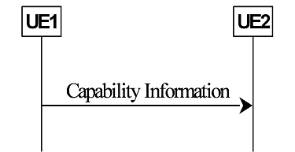

- Figure 5.4.4-2: Two-way information flow for UE capability transfer

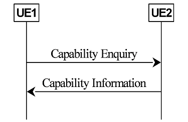

그룹캐스트를 위해 그룹 구성원 간에 일대다 PC5-RRC 연결 설정이 필요하지 않습니다.

#### 5.4.5 SDAP
SDAP 하위 계층은 상위 계층에서 3GPP TR 23.786에 설명된 흐름별 QoS 모델에 적용되는 SL 유니캐스트에 대해 다음과 같은 기능을 제공합니다.
- SL 유니캐스트를 위한 SLRB(Sidelink Radio Bearer) 매핑에 대한 QoS 흐름.
SDAP 하위 계층은 SL 브로드캐스트 또는 그룹캐스트에 적용되지 않습니다.

## 6 Uplink and downlink (Uu) aspects

### 6.1 Advanced V2X use cases over Uu interfaces

#### 6.1.1 LTE Uu
LTE Rel-15는 10<sup>-5</sup> BLER(Block Error Rate)로 1ms 무선 인터페이스 지연 시간 내에 32바이트 패킷을 전달할 수 있다는 목표를 달성하기 위해 sTTI(short Transmission Time Interval) 프레임 구조를 기반으로 설계된 HRLLC(Higher-Reliability and Low-Latency Communication) 기능을 도입했습니다. HRLLC 기능은 동일한 자원 할당, MCS 및 HARQ 프로세스로 신뢰성을 향상시키기 위해 K개의 연속적인 서브슬롯 기반 PDSCH 전송을 지원하며, 여기서 K∈{1, 2, 3, 4 또는 6}이며 단일 DCI(Downlink Control Information)에 표시됩니다. UE는 초기 전송 디코딩이 실패하면 대기 시간 예산 내에서 재전송을 기대하지 않습니다.
또한 HRLLC 기능에 반복 기능이 있는 업링크 SPS(Semi-Persistent Scheduling)를 도입하여 안정성을 개선하고 대기 시간을 줄였습니다. 반복 횟수 K는 주기성 길이 P를 초과하지 않아야 하지만, 새로운 데이터가 도착하여 반복 윈도우 내에서 첫 번째 전송 기회를 놓치면 UE는 전송 윈도우의 다음 첫 번째 sTTI를 기다려야 합니다. 따라서 지연을 줄이기 위해 사양에서는 동일한 서빙 셀에서 여러 SPS 구성이 활성화되도록 허용합니다.
위의 설명은 HRLLC 기능의 기초를 보여주지만 사양에는 더 높은 성능을 달성할 수 있는 방법도 포함되어 있습니다.
다운링크의 경우, UE는 초기 전송 실패 시 재전송을 기대할 수 있으며 LTE Uu 인터페이스를 통해 원격 운전을 지원하기 위해 재전송과 초기 전송을 합하여 주어진 무선 인터페이스 대기 시간 예산(3ms)이 LTE HRLLC로 가정하여 1ms보다 더 크다는 점을 감안할 때 성능을 향상시킬 수 있습니다. 이는 사양에 영향을 미치지 않습니다.
업링크의 경우, 원격 구동의 5220바이트의 업링크 패킷 크기가 32바이트보다 훨씬 크기 때문에 업링크에 캐리어 집적을 사용하면 큰 패킷 크기 전송을 지원할 수 있습니다. 최대 컴포넌트 캐리어 수가 증가하지 않는다고 가정하면 사양에 영향을 미치지 않습니다.
일반적으로 Rel-15 NR URLLC에서 소개되고 Rel-16 NR URLLC에서 논의되고 있는 기술은 Uu 향상으로 LTE에 잠재적으로 적용 가능한 것으로 간주될 수 있습니다. 그러나 이러한 개선에는 상당한 LTE 사양 변경이 필요합니다.
LTE Uu 인터페이스를 통해 고급 V2X 사용 사례를 지원하는 측면에서 사양에 영향을 미치지 않는 옵션이 있으므로 사양에 영향을 미치는 옵션은 필요하지 않습니다.

#### 6.1.2 NR Uu
NR은 주어진 셀의 주어진 BWP에서 다수의 활성 UL 구성 승인을 갖는 것을 지원하며, 그 중 하나 이상이 UE에 의한 전송을 위해 동시에 사용되지 않습니다. DCI는 활성화 또는 비활성화할 유형 2 UL 구성 승인을 식별하는 데 사용됩니다.
UE는 위치와 같은 적어도 UE 관련 지리적 정보로 구성되는 지원 정보를 gNB에 보고할 수 있으며 적어도 주기적인 트래픽의 경우 Uu 및 SL V2X 트래픽 주기성, 타이밍 오프셋 및 메시지 크기에 대한 보고를 할 수 있습니다.
Rel-15 NR은 Uu 인터페이스를 통한 멀티캐스트/브로드캐스트를 지원하지 않습니다. 이전에 3GPP에는 Uu 멀티캐스트/브로드캐스트를 위한 두 가지 기술이 있습니다. 멀티미디어 브로드캐스트 단일 주파수 네트워크(MBSFN) 및 단일 셀 점대다점(SC-PTM)이며 둘 다 LTE에서 지원됩니다. NR Uu 멀티캐스트/브로드캐스트는 일부 시나리오에서 V2X 사용 사례에 대한 리소스 활용 측면에서 적어도 유익합니다.

### 6.2 Uu-based SL resource allocation/configuration
이 연구는 NR 및 LTE Uu 인터페이스가 SL 리소스 할당을 제어/구성하는 데 사용되는 방법을 고려합니다. V2X 사이드링크 통신을 수행하는 UE에 대해 MR-DC(Multi-Radio Dual Connectivity)가 구성된 경우 SN은 SL 자원을 제어/구성할 수 없습니다.

#### 6.2.1 Control of NR SL by NR
이 연구는 NR Uu가 (i) NR Uu와 NR SL 간에 공유되는 허가된 캐리어의 경우에 대해 NR SL 리소스를 할당할 수 있는 방법을 고려합니다. 그리고 (ii) NR SL 전용 캐리어. 리소스 할당 모드 1에는 다음 기술이 지원됩니다.
- 동적 자원 할당
- 구성 부여 유형 1 및 유형 2
상기에서, 예를 들어 UE가 다른 파라미터(예를 들어, MCS) 및/또는 정확한 전송 자원을 선택할 수 있는지 여부 및 선택이 자율적인지 여부와 같은 네트워크 제어 수준도 연구됩니다.

##### 6.2.1.1 RRC
V2X SL 통신을 지원하기 위해 RRC 계층은 Uu에서 최소한 다음과 같은 기능을 제공합니다.
- V2X 특정 SIB(s) 획득
- V2X SL 통신을 위한 RRC 연결 설정: V2X SL 통신을 전송하도록 상위 계층에 의해 설정되고 전송할 데이터가 있는 UE의 경우, 적어도 UE가 SL 통신을 위해 전송하도록 설정된 주파수 이상인 경우 RRC 연결이 설정됩니다. 해당 주파수에 대한 전송 자원 풀을 포함하지 않고 V2X 특정 SIB(들)에 포함됩니다.
- SL에서 V2X 통신을 위한 자원 할당 모드 구성:
    + 자원 할당 모드 1과 모드 2는 UE에 대해 동시에 구성될 수 있습니다.
    + 네트워크는 UE가 브로드캐스트 시스템 정보 및/또는 전용 시그널링을 통해 '사이드링크 유니캐스트/그룹캐스트/브로드캐스트'에 대한 사이드링크 그랜트를 자율적으로 선택하는 리소스 풀을 제공할 수 있습니다.
    + 모드 2 자원 구성은 UE가 유효 영역 내에서 이동하는 동안 새로운 모드 2 자원 구성을 획득할 필요가 없는 주어진 유효 영역에 대해 적어도 이 구성이 SIB에 의해 제공될 때 제공될 수 있습니다(예: NR SIB의 유효 영역 재사용). );
- 이동성 관리:
    + 핸드오버 동안 V2X SL 통신의 송수신은 최소한 핸드오버 명령에서 제공되는 핸드오버 동안 UE가 사용할 수 있는 예외적인 전송 자원 풀과 타겟 셀의 수신 자원 풀의 구성을 기반으로 수행됩니다. ;
    + V2X SL 통신을 위한 셀 선택 및 재선택은 최소한 다음 기준 및 구성에 따라 수행됩니다.
        * V2X SL 자원 구성 또는 주파수 간 구성을 제공할 수 있는 반송파 주파수는 (사전) 구성될 수 있습니다.
        * 주파수 간 V2X SL 구성을 제공하는 주파수는 셀 (재)선택 중에 우선 순위가 지정됩니다.
        * 셀 재선택 동안 V2X SL 송수신의 중단을 최소화하는 방법은 UE 구현에 달려 있습니다.
- UE SL 정보 보고
- 다음을 포함한 SL 관련 측정 및 보고:
    + CBR 측정 및 보고
    + 위치정보의 신고
- 적어도 주기적 트래픽에서 트래픽 패턴(주기성, 오프셋 및 패킷 크기)에 대한 UE 지원 정보 보고.

##### 6.2.1.2 MAC
V2X SL 통신을 지원하기 위해 MAC 계층은 Uu에서 최소한 다음 기능을 제공합니다.
- 일정 요청:
    + UL 및 SL에 대한 별도의 SR 리소스 및 구성
    + 서로 다른 SL 논리 채널에 대한 여러 SR 리소스 및 구성
- Sidelink 버퍼 상태 보고:
    + SL BSR MAC CE에는 적어도 목적지 정보, LCG 정보, SL Buffer Size가 포함된다.

#### 6.2.2 Control of NR SL by LTE
LTE는 NR SL 자원 할당 모드 1 및 모드 2에 필요한 반-정적(semi-static) 구성을 제공할 수 있습니다. 모드 1의 경우 구성은 LTE Uu 인터페이스에서 추가 기능이나 절차 없이 시간-주파수 자원 및 주기성으로 제한되는 구성으로 Type 1 구성 승인입니다.

#### 6.2.3 Control of LTE SL by NR
NR은 LTE SL 모드 4에 필요한 semi-static 구성을 제공할 수 있습니다. 
UE가 관련 기능을 가지고 있을 때 LTE SL SPS(Semi-Persistent Scheduling) 전송 제어를 위해 NR과 LTE 모듈 간의 조정을 위한 충분한 시간이 있다는 전제 하에 Uu-RRC(DCI 아님)가 SPS 부여 설정을 전달 및 해제하는 것이 물리 계층 관점에서 제공됩니다. 표준 작업에서 LTE SL 모드 3 승인 콘텐츠 및 타이밍을 포함하는 메시지의 Uu-RRC를 통한 수신을 지원하려면 LTE로의 사양 변경이 필요합니다.

## 7 QoS management
QoS 관리는 리소스 할당, 혼잡 제어, 장치 내 공존, 전력 제어 및 SLRB(Sidelink Radio Bearer) 구성에서의 사용 맥락에서 V2X와 관련이 있습니다. QoS 관리와 관련된 물리적 계층 매개변수는 전달되는 트래픽의 우선 순위, 대기 시간, 안정성 및 최소 요구 통신 범위(상위 계층에서 정의됨)입니다. 데이터 속도 요구 사항도 AS에서 지원됩니다. SL 혼잡 메트릭과 적어도 자원 할당 모드 2에서는 혼잡 제어를 위한 메커니즘이 필요합니다. SL 혼잡 메트릭을 gNB에 보고하는 것이 좋습니다.
SL 유니캐스트, 그룹캐스트 및 브로드캐스트의 경우 V2X 패킷의 QoS 매개변수는 상위 계층에서 AS로 제공됩니다. SL 유니캐스트의 경우 SLRB(Sidelink Radio Bearer)는 그림 7-1 및 7-2에 표시된 신호 흐름 및 절차를 기반으로 (미리) 구성됩니다. 3GPP TR 23.786에서 설명한 흐름별 QoS 모델은 상위 계층에서 가정합니다.

- Figure 7-1: SLRB configuration for SL unicast (UE-specific)

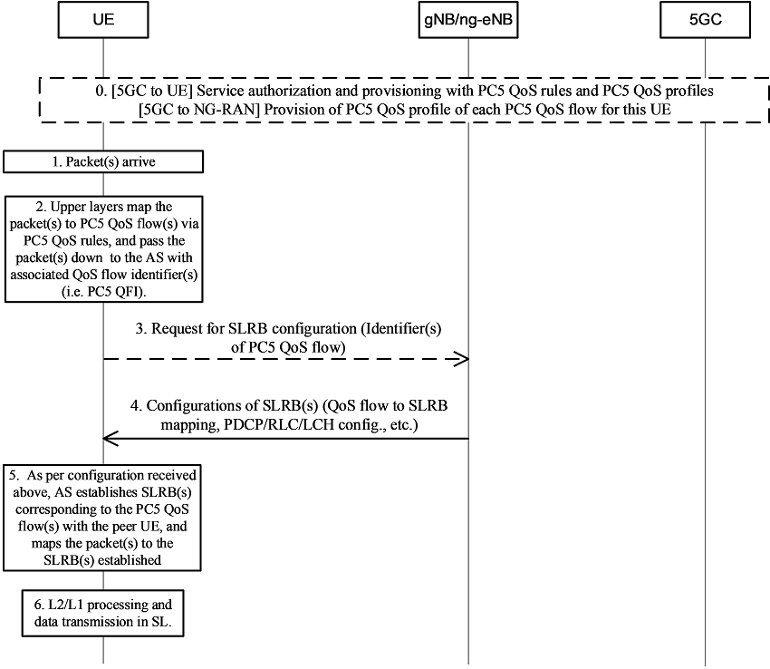

그림 7-1의 Step 0에서 PC5 QoS 프로파일, 즉 특정 PC5 QoS 매개변수의 집합과 각 PC5 QoS 흐름에 대한 PC5 QoS 규칙은 3GPP TR 23.786과 같은 서비스 권한 부여 및 프로비저닝 절차에 의해 사전에 UE에 프로비저닝됩니다. 유사하게 각 QoS 흐름에 대한 PC5 QoS 프로파일도 사전에 gNB/ng-eNB에 프로비저닝됩니다. 그런 다음 패킷(들)이 도착하면 UE는 먼저 0단계에서 구성된 PC5 QoS 규칙을 기반으로 연관된 PC5 QoS 흐름(들)의 식별자(즉, PC5 QFI)를 도출할 수 있고, 도출된 PC5 QFI(s) 3단계에서 gNB/ng-eNB로 전송합니다. gNB/ng-eNB는 0단계에서 5GC의 프로비저닝을 기반으로 보고된 이러한 PC5 QFI의 QoS 프로필을 도출할 수 있으며, 4단계에서 RRC 전용 시그널링을 통해 보고된 PC5 QFI(s) UE와 관련된 SLRB(들)의 구성 신호를 보낼 수 있습니다. 이러한 SLRB 구성에는 SLRB 매핑에 대한 PC5 QoS 흐름, SDAP/PDCP/RLC/LCH 구성 등이 포함될 수 있습니다. 5단계에서, AS(Access Stratum)의 UE는 gNB/ng-eNB 구성에 따라 peer UE와 함께 패킷(들)의 PC5 QFI(들)와 연관된 SLRB(들)을 설립하고 사용 가능한 패킷(들)을 설립된 SLRB(들)에 매핑합니다. 그러면 SL 유니캐스트 전송을 할 수 있습니다. (NOTE: PC5 QFI 정의는 SA2 WG2에서 담당)

- Figure 7-2: SLRB configuration for SL unicast (pre-configuration based)

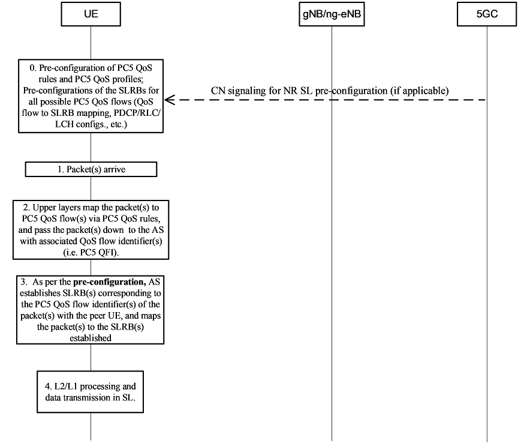

그림 7-2에서 필터링을 위해 상위 계층에서 사용되는 PC5 QoS 규칙과 AS 계층의 각 PC5 QoS 흐름에 대한 SLRB 구성은 모두 Step 0에서와 같이 사전 구성됩니다(CN 신호를 통하거나 UICC에서 또는 ME에서 사전 구성됨). 단계 1-3에서 UE는 도착하는 패킷에 대한 연관된 PC5 QoS 흐름(들)의 식별자를 유도하고, 사전 구성에 따라 피어 UE와 연관된 SLRB(들)을 자율적으로 설정하고 관련 PC5 QoS 흐름 식별자를 기반으로 한 해당 SLRB(들)로 패킷(들)을 매핑합니다. 이후 SL 유니캐스트를 전송할 수 있습니다.

NR SL 유니캐스트의 경우, SLRB 매핑에 대한 PC5 QoS 흐름은 UE의 SDAP 계층에서 수행됩니다. 유니캐스트를 위한 일부 SLRB 구성(최소한 SN 길이, RLC 모드 및 각 SLRB와 관련된 PC5 QoS 프로필 포함)은 UE에서 (사전)구성될 때 하나의 UE가 SL의 피어 UE에 알려야 합니다.

SL 그룹캐스트 및 브로드캐스트에서 V2X 사이드링크 전송을 위해 SLRB 구성은 아래 그림 7-3, 그림 7-4 및 그림 7-5에 표시된 신호 흐름 및 절차를 기반으로 (사전)구성됩니다. SL 그룹캐스트 및 브로드캐스트의 경우 3GPP TR 23.786에 설명된 패킷당 QoS 모델이 상위 계층에서 가정됩니다. 특히, PQI(PC5 QoS Identifier) 및 기타 잠재적인 QoS 매개변수(있는 경우)는 AS에 제출된 각 V2X 패킷에 태그되는 패킷당 PC5 QoS 매개변수 세트, 즉 PC5 QoS 프로파일을 나타내기 위해 UE의 상위 계층에 의해 설정됩니다.

- Figure 7-3: SLRB configuration for SL groupcast and broadcast (UE-specific)

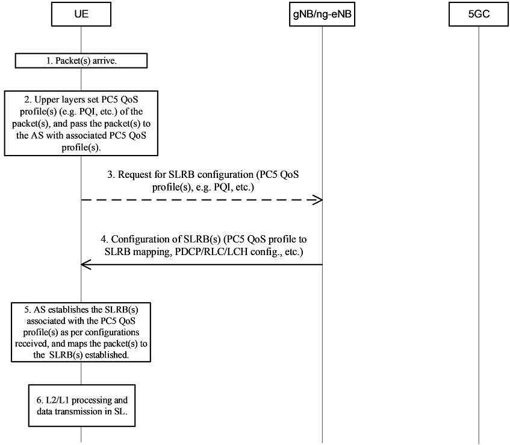

그림 7-3의 1-2단계에서 도착하는 각 V2X 패킷의 PC5 QoS 프로파일은 상위 계층에서 설정되어 AS에 제출됩니다. 단계 3에서 UE는 패킷(들)의 PC5 QoS 프로파일(들)을 gNB/ng-eNB에 보고하고, 보고된 이러한 PC5 QoS 프로파일(들)과 관련된 SLRB(들)의 구성을 요청할 수 있습니다. 이에 대한 응답으로 gNB/ng-eNB는 RRC 전용 시그널링을 통해 보고된 PC5 QoS 프로파일(들)과 관련된 SLRB(들)의 구성을 시그널링할 수 있습니다. 이러한 SLRB 구성에는 PC5 QoS 프로파일 대 SLRB 매핑, PDCP/RLC/LCH 구성 등이 포함될 수 있습니다. 단계 5에서 AS의 UE는 gNB/ng-eNB 구성을 설정하고 패킷을 설정된 SLRB에 매핑합니다. 그러면 SL 그룹캐스트 또는 브로드캐스트를 전송할 수 있습니다.

- Figure 7-4: SLRB configuration for SL groupcast and broadcast (cell-specific)

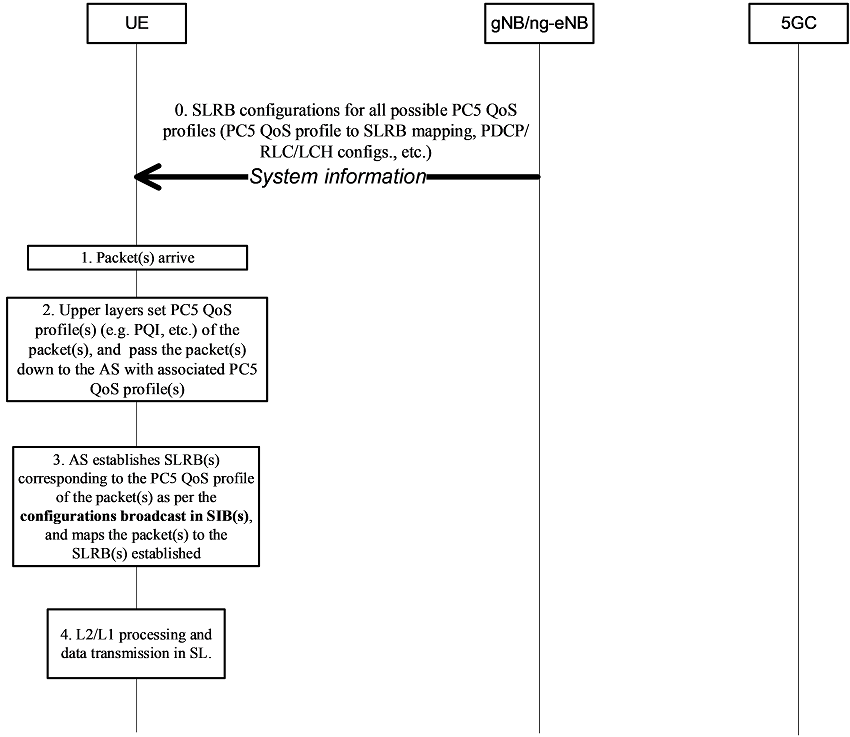

그림 7-4의 0단계에서 gNB/ng-eNB는 V2X 특정 SIB를 사용하여 가능한 각 PC5 QoS 프로파일과 관련된 SLRB 구성을 브로드캐스트합니다. 1-2단계에서 특정 PC5 QoS 프로파일을 가진 패킷(들)이 도착하면 UE는 SIB로 브로드캐스트 되는 셀 특정 구성에 따라 이들 QoS 프로파일(들)에 대응하는 SLRB(들)을 설정하고 패킷(들)을 설정된 SLRB(들)에 매핑한다.

- Figure7-5: SLRB configuration for SL groupcast and broadcast (pre-configuration based)

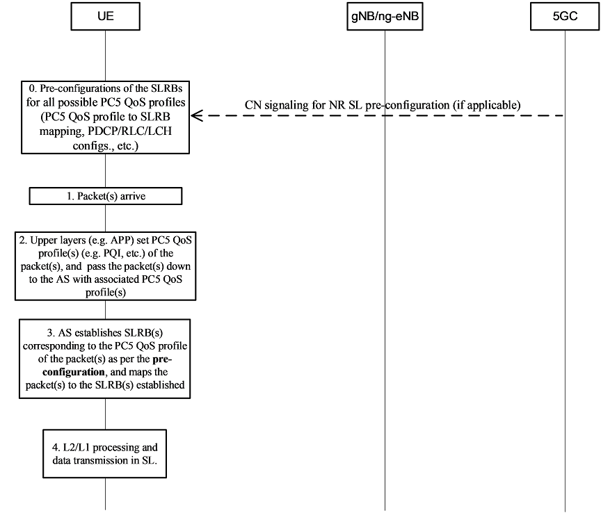

그림 7-5의 0단계에서와 같이 모든 PC5 QoS 프로파일과 관련된 SLRB는 UE에 미리 구성됩니다(CN 신호나 UICC나 ME에서 미리 구성된 것을 통해). 이후 단계에서 UE는 도착 패킷(들)의 PC5 QoS 프로파일(들)과 연관된 SLRB(들)를 자율적으로 설정하고 패킷(들)을 사전 구성을 기반으로 설정된 연관된 SLRB에 매핑합니다.

## 8 RAT and interface selection
SL 전송을 위한 후보 RAT(Radio Access Technology)(들)은 상위 계층에 의해 서비스 유형과 연관되어 있다고 가정한다. 주어진 V2X 서비스 유형은 1) LTE RAT만, 2) NR RAT만, 3) LTE 또는 NR RAT, 또는 4) LTE 및 NR RAT와 연관될 수 있다. RAT 선택은 상위 계층에서 수행되며 V2X SL 브로드캐스트 전송에만 적용됩니다. V2X SL 유니캐스트 및 그룹캐스트 전송은 NR을 통해서만 수행할 수 있습니다. Tx 프로필 기반 접근 방식은 SL RAT 선택의 기준선입니다.

Uu/PC5 인터페이스 선택을 위해 UE AS는 UE 상위 계층에 Uu/PC5 가용성 정보를 신호하고 UE 상위 계층은 무선 인터페이스를 선택합니다.

특히, Uu 인터페이스의 경우 UE in-coverage/out-of-coverage 상태를 기준으로 사용하여 V2X 통신을 위한 Uu 인터페이스 가용성/비가용성을 결정합니다. UE AS가 Uu 인터페이스 가용성/비가용성 정보를 UE 상위 계층에 어떻게 시그널링하는지, 즉 언제 시그널링이 트리거되고 시그널링의 내용이 무엇인지는 UE 구현에 달려 있습니다.

## 9 Coexistence
UE 관점에서 LTE V2X와 NR V2X SL 간의 공존은 LTE와 NR 간에 조정된 절차가 있고 반이중(half-duplex) 제약이 가정되는 시나리오에서 연구됩니다. LTE 및 NR SL에는 조정 절차가 없습니다.
LTE와 NR SL 사이의 TDM 또는 FDM 기반 솔루션이 연구의 초점입니다. TDM 솔루션은 중첩 또는 동시 NR 및 LTE V2X SL 전송을 포함하는 솔루션입니다. FDM 솔루션은 동시 NR 및 LTE V2X SL 전송을 수반하는 솔루션이며 둘 사이에 전체 전력을 공유하기 위한 솔루션을 정의합니다. 솔루션은 다음과 같은 경우에 대해 연구됩니다.
- 잠재적인 LTE V2X 전송 및 NR V2X 전송
- 잠재적인 LTE V2X 전송 및 NR V2X 수신
- 잠재적인 LTE V2X 수신 및 NR V2X 전송

### 9.1 TDM solutions
이 섹션에서는 LTE 및 NR V2X SL이 어느 정도 동기화되어 있다고 가정합니다. SL 사이의 서브프레임 경계 정렬이 필요하며 두 SL은 모두 예를 들어 LTE SL의 DFN(Direct Frame Number)과 같은 상대방의 시간 리소스 인덱스를 인식합니다. 아래의 것들이 가능합니다:

1. LTE 및 NR V2X 시간의 잠재적인 전송이 정적으로/준정적으로 결정되는 장기 시간 척도 조정, 또는
2. LTE 및 NR V2X 시간의 전송이 각 RAT에 알려진 단기 시간 규모 조정.

장기간의 시간 조정을 위해 LTE 사양을 수정할 필요 없이 시간 영역에서 겹치지 않는 리소스 풀을 (사전) 구성하여 물리적 계층 관점에서 공존이 가능합니다. 이는 일부 V2X 애플리케이션의 대기 시간, 안정성 및 데이터 속도 요구 사항에 영향을 미칠 수 있습니다.
단기 시간 척도 조정의 경우, 두 RAT의 SL 전송이 겹치거나 한 RAT의 전송이 다른 RAT의 수신과 겹치는 경우 각 발생에서 RAT 중 하나에 우선 순위를 지정하여 SPS 스케줄링을 사용하여 NR SL과 LTE SL 간에 공존이 가능합니다. 이를 위해서는 LTE와 NR의 트래픽 부하가 허용 가능한 수준 이하여야 하며 SL 간 UE 내 정보 교환이 필요합니다. 우선 순위 지정에 대한 표준 작업은 높은 수준의 우선 순위 지정 원칙을 다루는 반면 세부 사항은 UE 구현에 맡길 것으로 예상됩니다.

### 9.2 FDM solutions
동적 및 반정적(semi-static) 전력 할당 솔루션의 경우 물리 계층 목적을 위해 대역 내 경우(intra-band cases)에서 NR과 LTE V2X SL 간에 동기화가 가정됩니다. 
각 반송파에 대한 P<sub>c, max</sub>의 정적 전력 할당이 있는 대역 간(inter-band) FDM 공존의 경우 SL 간의 동기화가 가정되지 않습니다. 이러한 조건에서 두 RAT의 SL 전송이 중첩될 때 대역 간(inter-band) FDM 공존이 가능합니다. 하나의 SL로부터의 전송이 다른 SL에 대한 수신과 중첩될 때, 상기 조건에서 대역 간(inter-band) FDM 공존은 대역 간 분리(inter-band separation)가 충분히 크면 가능하지만 그렇지 않으면 불가능하다.
동적 전력 공유가 있는 대역 간(inter-band) 및 대역 내(intra-band) FDM 공존의 경우, NR 및 LTE 전송이 시간 도메인에서 완전히 중첩된다고 가정합니다. 즉, NR 전송은 전체 LTE TTI에 걸쳐 있으므로 전송의 총 전력은 일정합니다. 또한, LTE와 NR SL 사이에 서브프레임 경계 정렬이 있고 두 SL 모두 각 반송파에서 시간 자원 인덱스(예를 들어 LTE용 DFN)를 알고 있다고 가정합니다. 이러한 조건에서 두 RAT의 SL 전송이 중첩될 때 대역 간 및 대역 내 FDM 공존이 가능합니다. 우선 순위 지정에 대한 표준 작업은 높은 수준의 우선 순위 지정 원칙을 다루는 반면 세부 사항은 UE 구현에 맡길 것으로 예상됩니다.
대역 간 및 대역 내 FDM 공존의 경우, 두 RAT에 대한 SL 수신이 겹칠 때 공존이 가능하며, 우선순위 지정에 대한 규범적 작업이 높은 수준의 원칙을 다룰 것으로 예상되지만 세부 사항은 UE 구현에 맡겨집니다.

## 10 Network aspects

### 10.1 V2X service authorization
LTE에서와 유사한 원칙에 따라 V2X 서비스 인증 정보는 5GC에서 NG 인터페이스를 통해 NG-RAN 노드로 전달되고 이동성 이벤트 동안 NG-RAN 노드 간에 Xn에서 제공됩니다. V2X 서비스 인증 정보는 PC5 RAT에 따라 다릅니다. 교차 RAT PC5 제어 인증 정보(암시적 또는 명시적)도 필요합니다.

### 10.2 UE SL aggregate maximum bit rate
UE SL AMBR(Aggregate Maximum Bit Rate)의 할당은 LTE에서와 유사한 원칙을 따르며 5GC에 의해 NG 인터페이스를 통해 NG-RAN 노드로 전달되고 이동성 이벤트 동안 Xn 인터페이스에 의해 NG-RAN 노드 간에 제공됩니다. UE SL AMBR(Aggregate Maximum Bit Rate)은 PC5 RAT에 따라 다릅니다.

### 10.3 Impacts on the F1 interface
F1 인터페이스에 미치는 영향은 사이드 링크 통신을 위한 리소스 풀이 gNB-CU 또는 gNB-DU에 구성되어 있는지 여부입니다. 자원 할당 모드 1(동적 경우)의 경우 gNB-DU가 사이드링크 자원의 스케줄링을 담당합니다. gNB-DU는 V2X SL 구성 정보를 gNB-CU로 전송하고 gNB-CU는 이를 사용하여 RRC 메시지를 생성하고 UE에게 전달합니다.

### 10.4 Slicing aspects
NR V2X는 NG-RAN과 유사하게 슬라이싱 사용을 지원해야 합니다. 즉, 3GPP TR 38.800에 캡처된 것과 동일한 일반 원칙이 적용됩니다.

### 10.5 Resource coordination
NG(Next Generation)-RAN 노드(예: ng(next generation)-eNB 및 gNB) 간의 리소스 풀 조정은 유익한 것으로 간주됩니다.