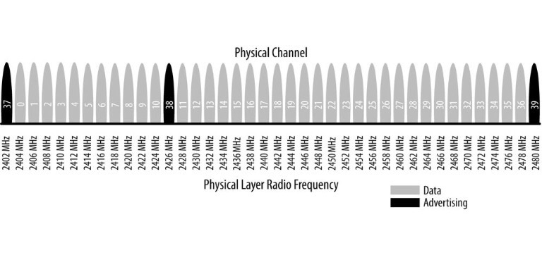
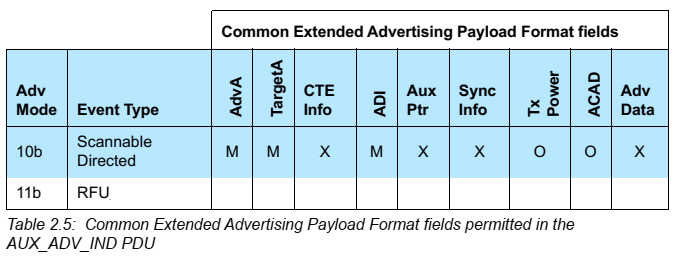
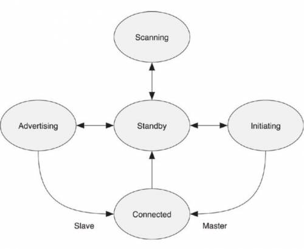
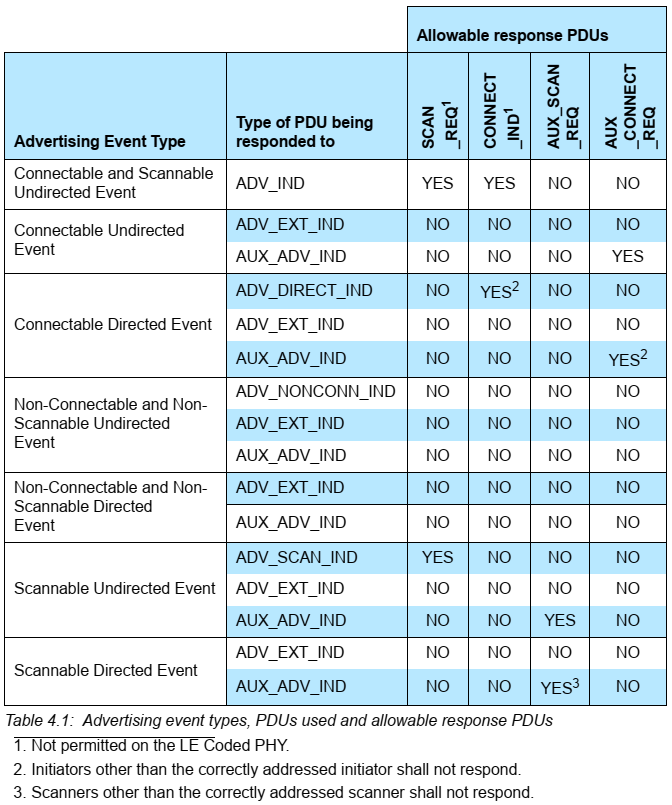
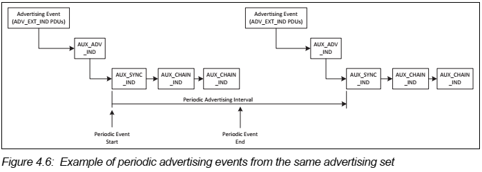

# Bluetooth Low Energy

# Core system architecture


# Part A: Physical Layer Specification


표준은 frequency hopping spread spectrum 이라고 부르는 기술을 이용하는데, 이 기술에서 radio는 각 연결 이벤트에서 채널들 사이를 다음의 식을 이용하여 뛰어다닌다.

$$channel=(curr\_channel + hop)\mod{37}$$

여기에서 *hop* 은 매번 새로운 연결이 구축될 때마다 다른 값으로 통신 된다. 이럼으로써 WiFi와 이전 버전의 Bluetooth와 같이 2.4GHz 밴드를 사용하는 radio의 방해를 효과적으로 최소화 할 수 있다.

변조 기술로는 다른 저전력 무선 통신에서와 같이 Gaussian Frequency Shift Keying(GFSK) 을 사용하기 때문에 전송 속도가 1Mbit/s로 제한되게 되었다. 그러나 실제로는 프로토콜 스택에 의한 오버헤드로 application에서 얻어지는 throughput은 훨씬 적어진다.


Link Layer의 channels와 Wi-Fi channel 간에 위의 그림과 같이 공존할 수 있도록 구성되어 있어서 advertising channel이 Wi-Fi에 의해 방해 받지 않을 수 있다.

# 3. Transmitter Characteristics
## 3.1. Modulation Characteristics
### 3.1.1 Stable modulation index {u5.0}
stable modulation index를 가진 송신 LE 장치는 feature support 메키니즘을 통해 이 fact를 갖고 있는 수신 LE 장치에 그 정보를 알릴 수 있다.
modulation index는 0.495에서 0.505 사이의 값이다. stable modulation index가 없는 송신 장치는 표준 modulation index를 갖고 있다고 말할 수 있다.

표준 moduleation index는 0.45에서 0.55 값이다.

## 3.2. Spurious emissions
### 3.2.2 In-band spurious emission {u5.0}
LE 1M나 LE Coded PHYs를 위한 1 Msym/s modulation을 쓸 때는 Table3.3의 명세를 따르고 LE 2M PHY를 위한 2Msym/s modulation 송신을 할 대는 Table 3.4의 명세를 따른다.


# 4. Receiver Characteristics
## 4.1. Actual Sensitivity Level {u5.0}
    "-70보다 작거나 같다"에서 아래의 테이블과 같이 변경


## 4.2. Interference Performance {u5.0}
    간섭에 대한 퍼포먼스가 단일 테이블에서 각각의 PHY에 따라 변경


## 4.4 Intermodulation Characteristics {u5.0}
    BER<=0.1%의 actual sensitivity performance에서 만족해야 할 조건으로 LE 2M 와 LE Coded PHY를 위한 조건이 아래와 같이 추가됨


## 4.6. Reference Signal Definition {u5.0}
LE 2M PHY와 LE Coded PHY의 추가로 아래와 같은 비트레이트가 추가됨
* 2 Mb/s (+/-)1 ppm for the LE 2 M PHY
* 125 kb/s (+/-)1 ppm for the LE Coded PHY when using S=8 coding
* 500 kb/s (+/-)1 ppm for the LE Coded PHY when using S=2 coding
    
## 4.7. Stable Modulation Index {u5.0}
LE device는 Feature support로 지원 가능한지 알림으로서 Stable Modulation Index를 제공할 수 있다.

# 5. Antenna Switching {u5.1}
스위치로 제어할 수 있는 두 개 이상의 안테나로 구성된 안테나 배열을 지원할 수 있다. 이 안테나들은 AoA에서 패킷의 Constant Tone Extension을 받거나 AoD에서 패킷의 Constant Tome Extension을 보내는 동안 스위치 될 수 있다. 안테나 스위치는 Switch Slots이라고 불리는 시간 동안 이루어진다. 처음 4us는 guard period이고 다음 8us는 reference period라고 부른다. reference period 중 IQ sample들을 받고 그 기간을 sample slots이라고 부른다.

# Part B: Link Layer Specification
Link layer는 복잡한 프로토콜을 감추고 실시간 성을 유지하기 위해 하드웨어 벤더가 쉽게 구현할 수 있는 부분을 독립 시킨 계층이다. 이 계층은 흔히 다음과 같은 기능들을 포함한다.
* Packtizer(Preamble, Access Address, and air protocol framing)
* CRC generation and verification
* Data whitening
* Random number generation
* AES encryption

Link Layer는 다음과 같은 역할들을 정의한다.
* Advertiser: A device sending advertising packets
* Scanner: A device scanning for advertising pakcets
* Master: A device that initiates a connection and manages it later
* Slave: A device that accepts a connection request and follows the master's timing

# 1. General Description
## 1.1. Link Layer States {u5.1}
    Standby, Advertising, Scanning, Initiating, Connection State에 Synchronization State가 추가됨


Synchronization State에서는 특정 디바이스가 송출하는 주기적인 ADV train으로 구성된 주기적인 채널 패킷을 수신한다.

### 1.1.1. Permitted State Role Combination Restrictions {u5.0/u5.1}
    제목은 5.0에서 변경됨 (core 4.2: 1.1.1 State and Role Combination Restrictions)
    5.1에서 내용이 더 단순하고 명확하게 정리됨.
Link Layer는 선택적으로 다중 상태 머신을 지원할 수 있다. Link Layer가 다중 상태 머신을 지원한다면 여러 상태와 role의 조합들이 제공될 수 있다. 특별히 Link layer는 Master와 Slave role이 Connection State에 중복될 수 있다 (piconet과 scatternet을 지원한다). 그러나 두 장치간에 하나 이상의 connection이 있어서는 안된다.

### 1.1.2. Devices supporting only some states {u5.0}
 디바이스가 몇 개의 Link Layer state만 지원하거나 Connection state에서 두 Role 중 하나만 지원할 경우 'supported features'에서 지원되지 않음을 알릴 수 있다.

## 1.2. Bit Ordering
## 1.3. Device Address
Device address는 48비트로 이루어져 있다.
```c
device_address {
  bit address[48];
};
```
이 address를 전달하는 PDU의 헤더에 의해 지시되는 address의 type은 두 가지로, public address이거나 random address이다.
```c
// determination between public or random address
if (type_flag==0) {
    address = { // public IEEE 802-2001 MAC address
        u8 command_assigned[3];
        u8 companny_id[3];
    };
} else if (type_flag==1) {
    address = {
        bit random_device_address[46];
        bit flag[2];
    };
}
```
public address IEEE 802-2001 MAC address의 형식을 따르고 random_address는 다음과 같이 다시 3가지의 형식으로 구분된다.
```c
// determination between static or private random address
if (flag == '00b') {
    random_device_address = {
        // random part of non-resolvable address
        bit nonresolvable_address[46];
    };
} else if (flag == '01b') {
    random_device_address = {
        bit hash[24]; // hash=ah(IRK, prand)
        bit prand[22]; // random part of prand
    };
} else if (flag == '11b') {
    random_device_address = {
        // random part of static address
        bit static_address[46];
    };
}
```
static_address는 전원이 켜질 때 처음 만들어져서 전원이 꺼질 때까지 유지되는 정적인 address로, 만약에 연결되었던 디바이스 중 하나의 전원이 꺼졌다가 켜져서 그 디바이스의 static_address가 바뀐다면 이전의 연결은 더이상 유효하지 않게 된다.
나머지 두 개의 device address를 private address라고 부르는데, 각각은 다시 non-resolvable private address, resolvable private address로 부른다.
non-resolvable address는 random address로 모든 비트가 0으로 되어 있거나 1로 되어 있어서는 안되고 public address와 동일하지 않기만 하면 된다.
resolvable address는 prand 부분과 hash 부분으로 이루어져 있다. 다만 prand 부분은 MSB로, hash는 LSB로 구성하여 concatenating(결합) 한다.

### 1.3.1 Public Device Address {u5.0}
    Inquiry가 없으므로 LAP 값의 제한이 당연히 없으나, 명시적으로 LAP 제한이 없다고 함

### 1.3.2. Random device address
#### 1.3.2.2. Private Device Address Generation {u5.0}
    non-resolvable private address에서 "random part의 모든 비트가 0이거나 1이면 안된다"에서 "random part의 비트 중 적어도 한 비트는 0이거나 1이어야 한다"로 바뀜.
    resolvable private address에서 "prand의 random part의 모든 비트가 0이거나 1이면 안된다"에서 "prand의 random part 중 적어도 한 비트는 0이거나 1이어야 한다"로 바뀜.

## 1.4. Physical Channel
### 1.4.1. Advertising and Data Channel Indices {u5.0}
    Primary/Secondary Advertising channel 명명


# 2. Air Interface Packets {u5.0}
    AoA/AoD를 위한 Constant Tone Extension이 포함된 Uncoded PHY와 Coded PHY로 Packet format이 크게 바뀜.

## 2.1/2 Packet Format {u5.0/u5.1}

### Packet
BLE는 오직 하나의 패킷 형식과 두 타입의 패킷 만을 가지고 있다. 두 타입은 패킷은 advertising packet과 data packet이다. 패킷 형식은 다음과 같다.
```c
packet {
    u8 preamble;
    u8 access_address[4];
    u8 header[2];
    u8 payload[header.length];
    u8 crc[3];
}
```

| Version | Packet forma                   |
|:-------:|:-------------------------------:|
| 4.2 |     |
| 5.0 |<br><br>    |
| 5.1 | |

### 2.1.1/2.2.1 Preamble {u5.0}
#### Preamble
* Preamble은 0101010이나 10101010이다.
* Access address의 첫 비트가 0이면 01010101 시퀀스가 이용되고,
* access address의 첫 비트가 1이면 10101010 시퀀스가 이용된다.
* 이것은 패킷의 첫 9비트가 101010101이든 010101010이든 항상 교차 비트(alternating bit)가 된다는 것이다.
이것으로 입력 신호 세기를 판단하여 auto gain control에 이용할 수 있다.

| Version | Preamble                        |
|:-------:|:-------------------------------|
| 4.2 | 뒤따르는 Access Address의 첫 비트가 0이냐 1이냐에 따라<br/><ul align=left><li>10101010b</li><li>01010101b</li></ul> |
| 5.0 | <ul align=left><li>Uncoded PHY</li><li></li><li>Coded PHY : 80 Symbols 만큼 '00111100'을 10번 반복하여 구성</li></ul> |

### 2.1.2 Access Address {u5.0}
두 디바이스 간의 각 Link Layer connection과 각 periodic advertisement는 모두 다른 Access Address를 가지도록 의도되었다. 
* 현재 디바이스에 이미 있는 Link Layer connection에서 사용 중인 Access Address와 동일한 Access Address를 이용해서는 안된다.
* 동작 중인 periodic advertising에서 사용 중인 Access Address와 동일한 Access Address를 이용해서는 안된다.
#### Access Address
* Advertising access address: 0x8E89BED6(01101011011111011001000101110001b)
* Data access address
    * 0이나 1이 6개 이상 연속되지 않아야 한다.
    * advertising channel packet의 access address가 아니어야 한다.
    * 적어도 한 비트 이상 advertising access address와 달라야 한다.
    * 각 8비트들은 반복된 패턴(같은 값)이면 안된다.
    * alternating bit sequence의 사용을 멈추기 때문에 24번 이상의 비트 전환이 있어서는 안된다.
    * 마지막 여섯 비트 중에 적어도 두 번의 비트 전환이 있어야만 한다.
    * 위 조건들에 따라 약 2^31  개의 random access address가 가능하다.
    * 이런 random access address 때문에 공격자가 연결 중인 두 개의 디바이스를 이 주소를 수신하는 것 만으로 특정 지을 수 없어서 연결 기간 동안 디바이스의 프라이버시를 보장하는 기능도 있다.

### 2.1.5 Constant Tone Extension {u5.1} 
Uncoded PHY에서 CRC 뒤에 Constant Tone Extension이 붙고, CRC나 MIC 계산에 포함되지 않는 필드이다. 자세한 내용은 Chapter 2.5에서 따로 다룬다.

### 2.2.3 Coding Indicator {u5.0}


### 2.2.6 TERM1 and TERM2
각 FEC block이 끝에 있는 termination field이다. FEC 계산에 사용된다.

### Header
header는 packet의 종류에 따라 advertising header와 data header로 구분된다.

### Length
payload의 길이를 octet 값으로 표현한다.
* Advertising Packet Length
    * 6 bits로 구성
    * 6 ~ 37의 값
* Data packet Length
    * 8 bits로 구성
    * 0 ~ 255의 값

### Cyclic Redundancy Check
* header, length, payload field를 계산한다.
* noisy 한 환경이므로 16-bit CRC는 신뢰성이 떨어지고,
* 32-bit CRC는 BLE에서 전송할 수 있는 데이터 크기 중 6 비트 데이터의 에러를 검증할 수 없다.

## 2.3 Advertising Physical Channel PDU {u5.0}
    advertising_packet_header의 rfu가 2비트에서 1비트가 되었고, ChSel field가 1비트 생김

### 2.3.1. Advertising PDU {u5.0}
    payload는 6~37 octets에서 1~255 octets으로 변경
    
```c
advertising_packet {
    u8 preamble;
    u8 access_address[4];
    advertising_packet_header header;  
    u8 payload[header.length]; // 1~255 octets
    u8 crc[3];
}
```

Advertising packet은 다음과 같은 목적에 이용된다.
* 완전한 연결 구축의 오버헤드를 필요로 하지 않는 어플리케이션을 위해 데이터를 방송하기 위해,
* Slave를 발견할 수 있게 하고, 그 Slave에 연결할 수 있게 하기 위해 (여기에서 Slave는 아직 Advertiser임)

#### Advertising Packet Header

```c
advertising_packet_header {
    bit advertising_packet_type[4];
    bit rfu; // reserved for future
    bit ch_sel; // {u5.0}
    bit tx_add;
    bit rx_add;
    u8 length;
}
```

##### Advertising Packet Type {u5.0}
|Packet Name |Value |Description |
|:----------:|:----:|:------------|
|ADV_IND|0000b|General advertising indication|
|ADV_DIRECT_IND|0001b|Direct connection indication|
|ADV_NONCONN_IND|0010b|Nonconnectable indication|
|SCAN_REQ|0011b|Active scanning request|
|SCAN_RSP|0100b|Active scanning response|
|CONNECT_REQ|0101b|Connection request|
|ADV_SCAN_IND|0110b|Scannable indication|
|Reserved|0111b~1111b|Reserved for future|

###### Description and Example

|PDU|Description|Example|
|:--|:----------|:------|
|ADV_IND|connectable undirected advertising event|“Hello, I'm Steve “|
|ADV_DIRECT_IND|connectable directed advertising event  |“Hello Robin, I'm Steve”|
|ADV_NONCONN_IND    |non-connectable undirected advertising event|“Hello, I'm Steve”|
|ADV_SCAN_IND|scannable undirected advertising event    |“Hello, I'm Steve”|

이 PDUs은 Advertiser가 보내고 Scanner나 Initiator가 받습니다.

    Core 5.0에서 아래와 같이 추가되었음


##### ch_sel, tx_add, rx_add
tx_add, rx_add 필드들은 Advertising Packet Type에 따라 정의되는데, 만약 주어진 Type에 따라 정의되어 있지 않다면 나중을 위해 예약된 필드로 본다.

#### 2.3.1.1. ADV_IND
이 PDU에서 advertiser의 device address가 public이면 advertising header의 tx_add는 0, random이면 tx_add는 1이다.
```c
payload {
    u8 advertiser_address[6];
    u8 advertising_data[]; // size of data is 0 to 31 octets
}
```

#### 2.3.1.2. ADV_DIRECT_IND
이 PDU에서 advertiser_address가 public이면 advertising header의 tx_add는 0, random이면 tx_add는 1이고, initiator_address가 public이면 rx_add는 0, random이면 rx_add는 1이다.

```c
payload {
    u8 advertiser_address[6];
    u8 initator_address[6];
}
```

#### 2.3.1.3. ADV_NONCONN_IND
이 PDU도 마찬가지로 advertiser_address가 public이면 advertising header의 tx_add는 0, random이면 tx_add는 1이다.

```c
payload {
    u8 advertiser_address[6];
    u8 advertising_data[]; // size of data is 0 to 31 octets
}
```

#### 2.3.1.4. ADV_SCAN_IND
이 PDU도 또한 advertiser_address가 public이면 advertising header의 tx_add는 0, random이면 tx_add는 1이다.

```c
payload {
    u8 advertising_address[6];
    u8 advertising_data[]; // size of data is 0 to 31 octets
}
```

#### 2.3.1.5. ADV_EXT_IND {u5.0}
ADV_EXT_IND는 Common Extended Advertising Payload Format을 사용한다.


#### 2.3.1.6. AUX_ADV_IND {u5.0}
AUX_ADV_IND는 Common Extended Advertising Payload Format을 사용한다.



#### 2.3.1.7. AUX_SYNC_IND {u5.0}
AUX_SYNC_IND는 Common Extended Advertising Payload Format을 사용한다.


#### 2.3.1.8. AUX_CHAIN_IND {u5.0}
AUX_CHAIN_IND는 Common Extended Advertising Payload Format을 사용한다.


#### Advertising and Scan Response Data format
	BT 5.2. Vol3, Part C Generic Access Profile 중 11 장 정리


AD Type은 [SIG의 Assigned Number 중 GAP 관련 페이지](https://www.bluetooth.com/specifications/assigned-numbers/generic-access-profile/)에 정의되어 있다.

| Name                            | Actual data length in bytes | Description                                                                                                                  |
| :------------------------------ | :-------------------------- | :--------------------------------------------------------------------------------------------------------------------------- |
| Flags                           | 1(extensible)               | Used to set limited or general discovery mode, as described in Discovery                                                     |
| Local Name                      | variable                    | Partial or complete user-readable local name in UTF-8                                                                        |
| Appearance                      | 2                           | A 16-bit value describing the type of device sending the advertising packet                                                  |
| TX Power Level                  | 1                           | The power level in dBm used to transmit the advertising packet, useful to calculate path loss at the observer or central end |
| Service UUID                    | variable                    | A complete or partial list of GATT services offered by the device sending the packet (as a GATT server)                      |
| Slave Connection Interval Range | 4                           | A suggestion to the central about the connection interval range that best fits this peripheral                               |
| Service Solicitation            | variable                    | A list of GATT services supported by the device sending the packet (as a GATT client)                                        |
| Service Data                    | variable                    | A UUID representing a GATT service and its associated data                                                                   |
| Manufacturer Specific Data      | variable                    | Freely formattable data, to be used at the discretion of the implementation                                                  |

* Advertising data는 advertising event나 periodic advertising event로 전송된다.
* Host Advertising data는 아래 패킷의 AdvData field에 실린다.
	* ADV_IND
	* ADV_NONCONN_IND
	* ADV_SCAN_IND
	* AUX_ADV_IND
	* AUX_CHAIN_IND
* Additional Controller Advertising Data는 아래 패킷의 ACAD field에 실린다.
	* AUX_ADV_IND
	* AUX_SYNC_IND
	* AUX_SCAN_RSP
* Periodic Advertising data는 아래 패킷의 AdvData field에 실린다.
	* AUX_SYNC_IND
	* AUX_CHAIN_IND
* Scan Response data는 아래 field에 실린다.
	* SCAN_RSP 패킷의 ScanRspData field
	* AUX_SCAN_RSP의 AdvData field
* 만약 AUX_ADV_IND, AUX_SYNC_IND나 AUX_SCAN_RSP의 AdvData field에 데이터가 모두 들어가지 않는다면 AUX_CHAIN_IND 패킷이 남은 데이터를 보내기 위해 이용된다.

### 2.3.2. Scanning PDUs
다음과 같은 PDUs을 scanning PDUs라고 부른다.

| PDU      | Description                   | Example                                                              |
| :------- | :---------------------------- | :------------------------------------------------------------------- |
| SCAN_REQ | scanner가 보내고 advertiser가 받는다. | “Hello Steve, I'm Robin. Could you please give me your information?” |
| SCAN_RES | advertiser가 보내고 scanner가 받는다. | “Hello Robin, I'm Steve. This is my resume, Mom wrote for me.”       |

#### 2.3.2.1. SCAN_REQ
scanner_address가 public이면 advertising header의 tx_add가 0, random이면 tx_add가 1이고, advertiser_address가 public이면 header의 rx_add가 0, random이면 x_add가 1이다.

```c
payload {
    u8 scanner_address[6];
    u8 advertiser_address[6];
}
```

#### 2.3.2.2. SCAN_RSP
advertiser_address가 public이면 advertising header의 tx_add가 0, random이면 tx_add가 1이다.

```c
payload {
    u8 advertiser_address[6];
    u8 scan_response_data[]; // size of data is 0 to 31
}
```

#### 2.3.2.3. AUX_SCAN_RSP {u5.0}
AUX_SCAN_RSP는 Common Extended Advertising Payload Format을 사용한다.


### 2.3.3. Initiating PDUs
Initiating PDU는 CONNECT_REQ PDU만을 이야기 한다. 이 PDU는 initator가 advertiser에게 보내는 PDU이다.

#### 2.3.3.1. CONNECT_IND {u5.0}
    CONNECT_REQ가 CONNECT_IND/AUX_CONNECT_REQ로 분화
payload의 initiator_address가 public이면 header의 tx_add는 0, random이면 tx_add는 1이고, advertiser_address가 public이면 header의 rx_add는 0이고 random이면 rx_add는 1이다.

    CONNECT_IND의 header.ch_sel는 supported feature에 의해 LE Channel Selection Algorithm #2 feature가 enable되었을 때 1이고, AUX_CONNECT_REQ에서는 header.ch_sel 필드를 사용하지 않는다.
    
```c
payload {
    u8 initiator_address[6];
    u8 advertiser_address[6];
    u8 link_layer_data[22];
}

link_layer_data {
    u8 access_address[4];
    u8 crc_init[3];
    u8 window_size;
    u8 window_offset[2];
    u8 interval[2];
    u8 latency[2];
    u8 timeout[2];
    u8 channel_map[5];
    bit hop[5];
    bit sleep_clock_accuracy[3];
}
```

link_layer_data의 각 필드는 다음과 같다.

| Field                | Symbol    | Description                                                                                                                                                                                                                                                             |
| :------------------- | :-------- | :---------------------------------------------------------------------------------------------------------------------------------------------------------------------------------------------------------------------------------------------------------------------- |
| access_address       | AA        | Link Layer의 access address. 한 Master가 여러 개의 Slave와 연결 될 때, 각기 다른 random access address를 사용한다.                                                                                                                                                                           |
| crc_init             | CRCInit   | Link Layer 연결을 위한 CRC 계산의 초기값. 같은 공간에 두 개의 Master가 같은 access address를 사용하여 서로 다른 Slave와 통신할 수 있는 작은 가능성을 배제하기 위해, Connection Request를 Master가 보낼 때 Random CRCInit 값도 함께 보낸다. 같은 access address이면서 같은 CRCInit 값을 사용하는 것은 불가능하지는 않지만 CRCInit 값이 없을 때보다는 통신이 꼬일 확률이 훨씬 적다. |
| window_size          | WinSize   | transmitWindowSize를 구하기 위한 값. transmitWindowSize = window_size x 1.25 ms                                                                                                                                                                                                |
| window_offset        | WinOffset | transmitWindowOffset을 구하기 위한 값. transmitWindowOffset=window_offset x 1.25 ms                                                                                                                                                                                            |
| interval             | Interval  | connInterval을 구하기 위한 값. connInterval=interval x 1.25 ms                                                                                                                                                                                                                 |
| latency              | Latency   | connSlaveLatency를 구하기 위한 값. connSlaveLatency = latency                                                                                                                                                                                                                  |
| timeout              | Timeout   | connSupervisionTimeout을 구하기 위한 값. connSupervisionTimeout = Timeout x 10ms                                                                                                                                                                                               |
| channel_map          | ChM       | 사용되고 사용되지 않는 채널을 가리킨다. LSB로 표현되고 37th, 38th, and 39th bit position은 예약되어(RFU) 있다.                                                                                                                                                                                       |
| hop                  | Hop       | hopIncrement를 구하기 위한 값. 5~16의 범위에 있는 랜덤 값.                                                                                                                                                                                                                              |
| sleep_clock_accuracy | SCA       | 가장 나쁜 경우의 Master sleep clock accuracy를 결정하기 위해 사용되는 masterSCA를 구하기 위한 값.                                                                                                                                                                                                |

master SCA는 다음과 같이 결정할 수 있다.

| SCA | masterSCA         |
| :-- | :---------------- |
| 0   | 251 ppm ~ 500 ppm |
| 1   | 151 ppm ~ 250 ppm |
| 2   | 101 ppm ~ 150 ppm |
| 3   | 76 ppm ~ 100 ppm  |
| 4   | 51 ppm ~ 75 ppm   |
| 5   | 31 ppm ~ 50 ppm   |
| 6   | 21 ppm ~ 30 ppm   |
| 7   | 0 ppm ~ 20 ppm    |

#### 2.3.3.2. AUX_CONNECT_RSP {u5.0}
AUX_CONNECT_RSP는 Common Extended Advertising Payload Format을 사용한다.


### 2.3.4. Common Extended Advertising Payload Format {u5.0}
	이 절은 BT 5.0에서 처음 등장

Common Extended Advertising Payload Format 은 아래의 패킷들에서 사용된다.
* ADV_EXT_IND
* AUX_ADV_IND
* AUX_SCAN_RSP
* AUX_SYNC_IND
* AUX_CHAIN_IND
* AUX_CONNECT_RSP

#### Extended Advertising Payload
```c
payload {
    bit extended_header_length[6];
    bit advertisement_mode[2];
    extended_header ext_header[extended_header_length]; // 0~63 octets
    u8 advertisement_data[advertising_packet.header.length - (extended_header_length+1)]; //0~254 octets
}
```

#### Extended Header
```c
extended_header {
    u8 extended_header_flag;
    u8 adv_address[6];
    u8 target_address[6];
    u8 rfu;
    u8 adv_data_info[2];
    u8 aux_ptr[3];
    u8 sync_info[18];
    u8 tx_power;
    u8 additional_controller_advertising_data[extended_header_length-(1+(additional field size as specified))];
}
```

#### Extended Header Flag
| bit | Extended Header         |
| :-- | :---------------------- |
| 0   | adv_address             |
| 1   | target_address          |
| 2   | Reserved for future use |
| 3   | adv_data_info           |
| 4   | aux_ptr                 |
| 5   | sync_info               |
| 6   | tx_power                |
| 7   | Reserved for future use |

#### 2.3.4.4. AdvDataInfo (adv_data_info) 
```c
adv_data_info {
    bit advertising_data_id[12];
    bit advertising_set_id[4];
}
```
* **advertising_set_id**: advertising set을 구별하기 위한 ID
* **advertising_data_id**: AdvData 내의 데이터 콘텐츠가 이전에 보낸 AdvData와 중복되는지 여부를 구분하는 ID

#### 2.3.4.5. AuxPtr (aux_ptr)
```c
aux_ptr {
    bit channel_index[6];
    bit clock_accuracy;
    bit offset_unit;
    bit aux_offset[13];
    bit aux_phy[3];
}
```

##### offset_unit
| Value | Units |
| :---- | :---- |
| 0     | 30us  |
| 1     | 300us |

##### aux_phy
| Value     | PHY used                |
| :-------- | :---------------------- |
| 000b      | LE 1M                   |
| 001b      | LE 2M                   |
| 010b      | LE Coded                |
| 011b~111b | Reserved for future use |

##### clock_accuracy
| CA Value | Advertiser's Clock Accuracy |
| :------- | :-------------------------- |
| 0        | 51ppm ~ 500ppm              |
| 1        | 0ppm ~ 50ppm                |

#### 2.3.4.6 SyncInfo
SyncInfo 필드가 있다면 AUX_SYNC_IND PDU를 사용하는 Periodic Advertisement라는 의미이다.

```c
sync_info {
    bit sync_packet_offset[13];
    bit offset_units;
    bit rfu[2];
    u8 interval[2];
    bit channel_map[37];
    bit sleep_clock_accuracy[3];
    u8 access_address[4];
    u8 crc_init[3];
    u8 event_counter[2];
}
```
SyncInfo에서 지시하는 타이밍에 따른 AUX_SYNC_IND 전송 윈도 


##### offset_unit
| Value | Units |
| :---- | :---- |
| 0     | 30us  |
| 1     | 300us |

#### 2.3.4.8. ACAD (Additional Controller Advertising Data) field
ACAD는 여러 개의 ADV packet으로 나누어 전송 될 수 없다.

#### 2.3.4.9 Host Adverising Data
Host에서 설정한 advertising data. Fragmention을 지원하고 fragmentation 이전의 데이터가 1650 octets을 초과해서는 안된다.

## 2.4. Data Channel PDU

```c
data_packet {
    u8 preamble;
    u8 access_address[4];
    u8 header[2];
    u8 payload[header.length]; // 0~251 octets, if mic is present.
    u8 mic[4]; // optional
    u8 crc[3];
}
```

### MIC(Message Integrity Check)
* 암호화 되지 않은 Link Layer 연결에서는 mic field가 필요 없고, 이 경우에는 payload의 크기는 0 ~ 255 octets만큼 가질 수 있다.
* 암호화 된 Link Layer 연결에서 Payload의 크기가 0인 경우에도 mic field가 필요 없다.
* MIC는 AES-128 CCM mode를 사용하여 계산한다.

### Data Packet Header

```c
data_packet_header {
    bit link_layer_identifier[2];
    bit next_sequence_no;
    bit sequence_no;
    bit more_data;
    bit rfu[3];
    u8 length;
}
```

#### link_layer_identifier
| Value | Description                          |
| :---- | :----------------------------        |
| 01b   | 상위 계층 패킷의 연속                     |
| 10b   | 상위 계층 패킷의 시작이거나 완료 패킷        |
| 11b   | Link Layer 제어 패킷, 연결 관리에 사용된다 |


#### sequence_no, next_sequence_no, more_data
Data packet의 flow control에 이용된다.

### 2.4.1. LL Data PDU
* LL Data PDUsms L2CAP data를 보내는데 이용되는 data channel PDU이다.
* LLID 필드는 01b나 10b로 셋팅되어야 한다.
* LLID 필드가 01b로 셋팅되어 있고, Length가 0인 PDU를 empty PDU라고 부른다.
* LLID 필드가 10b로 셋팅되어 있으면 Length가 0인 PDU를 보낼 수 없다.

### 2.4.2 LL Control PDU {u5.0/u5.1}
```c
payload {
    u8 opcode;
    u8 control_data[]; // size of data is 0 to 26 octets as defined by opcode
}
```

* LL Control PDU를 위한 Length 필드는 0이 될 수 없다.
* 모든 LL Control PDU는 opcode에 따라 고정된 길이를 갖는다.

#### opcode
Opcode는 다음과 같다.

| Opcode     | Control PDU name         |
| :--------- | :----------------------- |
| 0x00       | LL_CONNECTION_UPDATE_IND |
| 0x01       | LL_CHANNEL_MAP_IND       |
| 0x02       | LL_TERMINATE_IND         |
| 0x03       | LL_ENC_REQ               |
| 0x04       | LL_ENC_RSP               |
| 0x05       | LL_ENC_START_ENC_REQ     |
| 0x06       | LL_ENC_START_ENC_RSP     |
| 0x07       | LL_UNKNOWN_RSP           |
| 0x08       | LL_FEATURE_REQ           |
| 0x09       | LL_FEATURE_RSP           |
| 0x0A       | LL_PAUSE_ENC_REQ         |
| 0x0B       | LL_PAUSE_ENC_RSP         |
| 0x0C       | LL_VERSION_IND           |
| 0x0D       | LL_REJECT_IND            |
| 0x0E       | LL_SLAVE_FEATURE_REQ     |
| 0x0F       | LL_CONNECTION_PARAM_REQ  |
| 0x10       | LL_CONNECTION_PARAM_RSP  |
| 0x11       | LL_REJECT_EXT_IND        |
| 0x12       | LL_PING_REQ              |
| 0x13       | LL_PING_RSP              |
| 0x14       | LL_LENGTH_REQ            |
| 0x15       | LL_LENGTH_RSP            |
| 0x16       | LL_PHY_REQ               |
| 0x17       | LL_PHY_RSP               |
| 0x18       | LL_PHY_UPDATE_IND        |
| 0x19       | LL_MIN_USED_CHANNELS_IND |
| 0x1A       | LL_CTE_REQ               |
| 0x1B       | LL_CTE_RSP               |
| 0x1C       | LL_PREIODIC_SYNC_IND     |
| 0x1D       | LL_CLOCK_ACCURACY_REQ    |
| 0x1E       | LL_CLOCK_ACCURACY_RSP    |
| all others | Reserved for future use  |

#### 2.4.2.1. LL_CONNECTION_UPDATE_IND
```c
control_data {
    u8 window_size;
    u8 window_offset[2];
    u8 interval[2];
    u8 latency[2];
    u8 timeout[2];
    u8 instant[2];
}
```

|Field|Symbol|Description|
|:--|:--|:--|
|window_size|WinSize|transmitWindowSize를 구하기 위한 값.      transmitWindowSize = window_size x 1.25 ms|
|window_offset|WinOffset|transmitWindowOffset을 구하기 위한 값. transmitWindowOffset=window_offset x 1.25 ms|
|interval|Interval|connInterval을 구하기 위한 값. connInterval=interval x 1.25 ms|
|latency|Latency|connSlaveLatency를 구하기 위한 값. connSlaveLatency = latency|
|timeout|Timeout|connSupervisionTimeout을 구하기 위한 값. connSupervisionTimeout = Timeout x 10ms|
|instant|Instant|connInstant값|


#### 2.4.2.2. LL_CHANNEL_MAP_IND
```c
control_data {
    u8 channel_map[5];
    u8 instant[2];
}
```

현재 연결이 나쁘거나, 호스트가 현재 나쁜 채널이 다시 좋아졌다고 판단할 때 LL_CHANNEL_MAP_IND를 통해 channel_map을 update 할 수 있다.

#### 2.4.2.3. LL_TERMINATE_IND
```c
control_data {
    u8 error_code;
}
```

LL_TERMINATE_IND를 보내지 않고 연결을 종료하는 경우는 다음과 같다.
* Supervision timeout
* MIC Failure

#### 2.4.2.4. LL_ENC_REQ
```c
control_data {
    u8 rand[8];
    u8 encrypted_diversifier[2];
    u8 session_key_diversifier_master[2];
    u8 initial_vector_master[2];
}
```

#### 2.4.2.5. LL_ENC_RSP
```c
control_data {
    u8 session_key_diversifier_slave[8];
    u8 initial_vector_slave[4];
}
```

#### 2.4.2.6. LL_START_ENC_REQ
control_data field 없음

#### 2.4.2.7. LL_START_ENC_RSP
control_data field 없음

#### 2.4.2.8. LL_UNKNOWN_RSP
```c
control_data {
    u8 unknown_type;
}
```

unknown_type은 LL Control PDU로 받은 잘못된 opcode 값이다.

#### 2.4.2.9. LL_FEATURE_REQ
```c
control_data {
    u8 feature_set[8];
}
```

feature_set에는 master의 Link Layer에서 지원하는 feature들의 모음을 포함해야 한다.

#### 2.4.2.10. LL_FEATURE_RSP
```c
control_data {
    u8 feature_set[8];
}
```

feature_set에는 master나 slave의 Link Layer에서 사용하는 feature들의 모음을 포함해야 한다.

#### 2.4.2.11. LL_PAUSE_ENC_REQ
control_data field가 없음

#### 2.4.2.12. LL_PAUSE_ENC_RSP
control_data field가 없음

#### 2.4.2.13. LL_VERSION_IND
```c
control_data {
    u8 vers_nr;
    u8 company_id[2];
    u8 sub_vers_nr[2];
}
```

디버깅 목적으로 이용된다. 약 10 번의 연결에 한 번 씩 주고 받으면 문제가 있을 때 대응하기가 좋다.

#### 2.4.2.14. LL_REJECT_IND
```c
control_data {
    u8 error_code;
}
```

요청 거절의 이유를 보낸다.

#### 2.4.2.15. LL_SLAVE_FEATURE_REQ
```c
control_data {
    u8 feature_set[8];
}
```

feature_set에는 slave의 Link Layer에서 지원하는 feature들의 모음을 포함해야 한다.

#### 2.4.2.16. LL_CONNECTION_PARAM_REQ
```c
control_data {
    u8 interval_min[2];
    u8 interval_max[2];
    u8 latency[2];
    u8 timeout[2];
    u8 preferred_periodicity;
    u8 reference_connection_event_count[2];
    u8 offset0[2];
    u8 offset1[2];
    u8 offset2[2];
    u8 offset3[2];
    u8 offset4[2];
    u8 offset5[2];
}
```

#### 2.4.2.17. LL_CONNECTION_PARAM_RSP
```c
control_data {
    u8 interval_min[2];
    u8 interval_max[2];
    u8 latency[2];
    u8 timeout[2];
    u8 preferred_periodicity;
    u8 reference_connection_event_count[2];
    u8 offset0[2];
    u8 offset1[2];
    u8 offset2[2];
    u8 offset3[2];
    u8 offset4[2];
    u8 offset5[2];
}
```

#### 2.4.2.18. LL_REJECT_EXT_IND
```c
control_data {
    u8 reject_opcode;
    u8 error_code;
}
```

이 PDU는 원격 Link Layer가 Extended Reject Indication feature를 지원할 때에만 보내질 수 있다. 만약 그 feature를 지원하지 않는다면, LL_REJECT_IND를 대신 보낸다.

#### 2.4.2.19. LL_PING_REQ
control_data field 없음

#### 2.4.2.20. LL_PING_RSP
control_data field 없음

#### 2.4.2.21. LL_LENGTH_REQ and LL_LENGTH_RSP {u5.0}
    limitation 값 변경

```c
control_data {
    u8 max_rx_octets[2];
    u8 max_rx_time[2];
    u8 max_tx_octets[2];
    u8 max_tx_time[2];
}
```

|Field|Description|
|:--|:--|
|max_rx_octets|보내는 Link Layer의 connMaxRxOctets 값 (27 octets 이상)|
|max_rx_time|보내는 Link Layer의 connMaxRxTime 값 (328 us 이상)|
|max_tx_octets|보내는 Link Layer의 connMaxTxOctets 값 (27 octets 이상)|
|max_tx_time|보내는 Link Layer의 connMaxTxTime 값 (328 us 이상)|

#### 2.4.2.22. LL_PHY_REQ and LL_PHY_RSP {u5.0} 

```c
control_data { 
    u8 tx_phys; 
    u8 rx_phys; 
} 
```
 

* tx_phys와 rx_phys는 아래의 값을 사용한다. 

|Bit number |Meaning |
|:----------|:-------|
|0|다른 것도 가능하지만 송신 디바이스는 LE 1M PHY를 선호한다| 
|1|다른 것도 가능하지만 송신 디바이스는 LE 2M PHY를 선호한다| 
|2|다른 것도 가능하지만 송신 디바이스는 LE Coded PHY를 선호한다| 
|others|Reserved for future use| 

#### 2.4.2.23. LL_PHY_UPDATE_IND {u5.0} 

```c
control_data { 
    u8 m_to_s_phy; 
    u8 s_to_m_phy; 
    u8 instant[2]; 
} 
```

* m_to_s_phy와 s_to_m_phy는 아래의 값을 사용한다. 

|Bit number|Meaning|
|:--|:--|
|0|다른 것도 가능하지만 송신 디바이스는 LE 1M PHY를 선호한다| 
|1|다른 것도 가능하지만 송신 디바이스는 LE 2M PHY를 선호한다| 
|2|다른 것도 가능하지만 송신 디바이스는 LE Coded PHY를 선호한다| 
|others|Reserved for future use| 

#### 2.4.2.24. LL_MIN_USED_CHANNELS_IND {u5.0} 

```c
control_data { 
    u8 phys; 
    u8 min_used_channels; 
} 
```

* phys는 아래의 값을 사용한다. 

|Bit number|Meaning|
|:-- |:-- |
|0|다른 것도 가능하지만 송신 디바이스는 LE 1M PHY를 선호한다| 
|1|다른 것도 가능하지만 송신 디바이스는 LE 2M PHY를 선호한다| 
|2|다른 것도 가능하지만 송신 디바이스는 LE Coded PHY를 선호한다| 
|others|Reserved for future use| 

* min_used_channels는 2~37의 값을 갖는다. 

#### 2.4.2.25. LL_CTE_REQ {u5.1} 

```c
control_data { 
bit min_cte_len_req[5]; 
bit rfu; 
bit cte_type_req[2]; 
} 
```

|Field |Description |
|:-- |:-- |
|min_cte_len_req |Constant Tone Extension의 최소 길이, 8us 단위, 범위는 2~2 |
|cte_type_req |Constant Tone Extension의 type |

##### Constant Tone Extension Type 

|Value |Meaning |
|:-- |:-- |
|0 |AoA Constant Tone Extension |
|1 |AoD Constant Tone Extension with 1us slots |
|2 |AoD Constant Tone Extension with 2us slots |
|3 |Reserved for future use |

#### 2.4.2.26. LL_CTE_RSP {u5.1} 
    control_data field 없음 
 
#### 2.4.2.27. LL_PERIODIC_SYNC_IND {u5.1} 

```c
control_data { 
u8 ID[2]; 
u8 sync_info[18]; 
u8 conn_event_count[2]; 
u8 last_pa_event_counter[2]; 
bit sid[4]; 
bit a_type; 
bit sca[3]; 
u8 phy; 
u8 adv_address[6]; 
u8 sync_conn_event_counter[2]; 
} 
```
 
#### 2.4.2.28. LL_CLOCK_ACCURACY_REQ and LL_CLOCK_ACCURACY_RSP 

```c
control_data { 
u8 sca; 
} 
```
 
## 2.5. Constant Tone Extension And IQ Sampling {u5.1}

### 2.5.1. Constant Tone Extension structure and types {u5.1} 


### 2.5.4. IQ Sampling


# 3. Bit Stream Processing {u5.0} 
    LE Coded PHY를 위한 bit stream processing 도식도가 추가되었음


Frequency shift keying 알고리즘은 같은 값의 비트 시퀀스가 매우 길면 문제가 생긴다. 예를 들어 0000000b나 1111111b와 같은 비트 스트림이 송신 되면 수신기는 송신기의 center frequency가 왼쪽으로 이동 되었다고 가정을 하고 이것은 frequency lock을 놓쳤다고 판단하는 결과를 초래해서 (frequency shift하여 다시 lock을 했을 때) 다음 1비트를 잃어버리게 된다. 그래서 Data whitening(7-bit linear feedback shift register, polynomial
x7+x4+1)을 통해 같은 값으로 반복되는 스트림을 제거해준다.

## 3.3. Coding {u5.0} 
    Forward Error Correction(FEC)를 위한 LE Coded PHY가 추가되었다. 
    보통 MPEG 등에서 Reed-Solomon FEC를 쓰는데 BLE에서는 보다 단순화 한 FEC기법을 사용하는 것으로 보인다. 추가 스터디가 필요하다.  
 
# 4. Air Interface Protocol 

## 4.1. Frame Space {u5.0} 
    Minimum AUX Frame Space가 추가되면서 Frame Space 장으로 통합되었음 

### 4.1.1. Inter Frame Space 
같은 channel index에서 두 개의 연속된 패킷 사이의 interval time을 Inter Frame Space라고 부르고 이 시간을 T_IFS라고 하며 150us여야 한다. 

### 4.1.2. Minimum AUX Frame Space {u5.0}  
AuxPtr을 포함하는 패킷이 Auxiliary 패킷을 이끌 때 그 패킷과 Auxiliary 패킷 간의 최소 간격과 Auxiliary 패킷들 간의 최소 간격을 Minimum AUX Frame Space라고 부르고 T_MAFS라고 쓰며 그 값은 300us여야 한다. 


## 4.2. Timing Requirements 
Link Layer에서는 하나 또는 두 개의 clock 정밀도를 사용하는데, 패킷 전송(연결 상태)을 위한 active clock accuracy와 advertising event, connection event 사이의 대기 시간과 관련된 sleep clock accuracy가 있다.

### 4.2.2. Sleep Clock Accuracy {u5.1}  
    LL_CLOCK_ACCURACY_REQ/LL_CLOCK_ACCURACY_RSP에 대한 언급. 확실한 이해를 위해 추후 업데이트 필요

### 4.2.3. Range Delay {u5.0}  
    내용이 이해가 안되어서 나중에 업데이트


### 4.2.4. Window Widening {u5.1} 
    BT 4.2에서는 4.5. Connection State의 하위 챕터로 있었으나 BT 5.1에서 4.2. Timing Requirements의 하위 챕터로 옮겨지고 상황에 따라 좀 더 복잡하게 운용하도록 수정됨. 그 이유는 Sleep Clock Accuracies 때문이라고 함. 

#### BT 4.1 
Sleep Clock Accuracy들 때문에 Slave가 정확한 Master의 anchor point를 놓칠 수 있다. 그래서 CRC의 매칭 여부와 관계없이 Master의 Packet을 받으면 Slave는 anchor point를 업데이트 해야만 한다. 
이 업데이트로 증가된 listening time을 window widening이라고 한다. window widening은 다음과 같이 구할 수 있다.

* windowWidening = ((masterSCA + slaveSCA) / 1000000) x timeSinceLastAnchor 
* windowWidening < ((connInterval / 2) - T_IFS us)

#### BT 5.1 
* windowWidening=((txSCA+rxSCA)/1000000) x (receiveWindowEnd-timneOfLastSync)+32us 


## 4.3. Link Layer Device Filtering {u5.1} 
    Synchronization State와 관련된 Periodic Sync Establishment State에 대한 내용이 추가됨. 

Device filtering은 연결이 가능한 디바이스에서 디바이스 필터링 기능을 사용하여 연결 관리를 할 수 있다. 
 
### 4.3.1. White List {u5.0} 
    White List에 저장될 새로운 "Anonymous" type으로 device address 와 관계 없이 보내진 모든 advertisement에 해당하는 type이 추가됨 

* White List는 device address와 device address type(public or random)을 저장한다. 
* 디바이스를 껐다 켜면(reset) white list는 지워진다. 
* 호스트에 의해 설정된다 
* 이 설정으로 연결 어떤 연결과 관련된 요청에 호스트를 깨우지 않고 Link Layer가 동작될 수 있다. 
 
### 4.3.2. Advertising Filter Policy 
Link Layer가 Connectable Directed Advertising을 이용하고 있을 때, advertising filter policy는 무시된다. 그렇지 않다면 다음과 같이 호스트의 설정에 의해 advertising filter policy mode들을 따라야 한다. 
* white list에 있는 디바이스의 Scan, Connection 요청만 처리한다. 
* white list를 쓰지 않는다면(reset 직후) 모든 디바이스의 scan, connection 요청을 처리해야 한다. 
* 모든 디바이스의 scan 요청을 처리하고 white list에 있는 디바이스의 connection 요청만 처리해야 한다. 
* 모든 디바이스의 connection 요청을 처리하고 white list에 있는 디바이스의 scan 요청만 처리해야 한다. 
* 한 번에 오직 하나의 advertising filter policy만 적용 될 수 있다. 
 
### 4.3.3. Scanner Filter Policy {u5.1}

    Extended Scanner Filter policy 부분 삭제

* white list에 있는 디바이스로부터 온 advertising packet만 처리해야 한다. scanner의 device address가 없는 connectable Directed advertising packet은 무시해야 한다. 
* white list를 쓰지 않는다면(reset 직후) 모든 디바이스의 advertising packet을 처리해야 한다. scanner의 device address가 없는 connectable Directed advertising packet은 무시해야 한다. ~~Link Layer가 Extended Scanner Filter policy들을 지원한다면 다음의 mode들도 지원해야 한다.~~ 
* ~~white list에 있는 디바이스로부터 온 advertising packet만 처리해야 한다. Connectable Directed advertising packet의 Initiator Device Address가 Resolvable Private Address라면 무시하지 말아야 한다.~~
* ~~white list를 쓰지 않는다면(reset 직후) 모든 디바이스의 advertising packet을 처리해야 한다. Connectable Directed advertising packet의 Initiator Device Address가 Resolvable Private Address라면 무시하지 말아야 한다.~~

한 번에 오직 하나의 scanner filter policy만 적용될 수 있다. 

### 4.3.4. Initiator Filter Policy

* white list에 있는 디바이스로부터 온 connectable advertising packet은 모두 처리해야 한다. 
* 호스트에 의해 정의된 특정한 디바이스로부터 온 connectable advertising packet은 white list에 관계없이 처리되어야 한다. 
* 한 번에 오직 하나의 initiator filter policy만 적용될 수 있다. 
 
### 4.3.5. Periodic Sync Establishment Filter Policy {u5.1} 
Periodic Sync Establishment Filter Policy는 Scanner의 Link Layer가 Periodic advertising train 에 동기화를 시도할 때 advertising 패킷들을 처리하는 방법을 결정한다. 
Link Layer는 Host가 설정한 아래의 mode 중 하나를 이용해야 한다. 
* Link Layer는 Periodic Advertiser List를 무시하고 host가 지정한 특정한 한 디바이스로부터 온 advcertising 패킷들을 처리한다. 
* Link Layer는 Periodic Advertiser List에 등록된 모든 디바이스로부터 온 advertising 패킷들을 처리한다. 
 
## 4.4. Non-Connected States

### BT 4.2 State machine 


### BT 5.1 State Machine 


### 4.4.1. Standby State
Link Layers에 전원이 들어가면 Standby State에서 시작하고, Host layers가 무얼 시킬 때까지 계속 그 상태에 머무른다. 다른 모든 상태에서 돌아올 수 있는 Standby State는 아무 일도 하지 않지만 매우 중요한 상태이다.

### 4.4.2. Advertising State {u5.0}
Link Layer가 advertising packet을 전송할 수 있도록 한다. 또, Scan Request에 대하여 Scan Response로 응답할 수 있다. 디바이스가 Discoverable 하거나 Connectable 하기를 원한다면 이 상태여야 한다. 또 디바이스가 다른 디바이스들에게 데이터를 broadcast 하기 위해서도 이 상태여야 한다. 이 상태가 되기 위해서, 디바이스는 송신기를 달고 있어야 한다. 수신기도 함께 가지고 있어도 된다. Advertising을 멈춤으로써 Standby State로 돌아갈 수 있고, Initiate State에 있던 디바이스의 Connect Request를 받으면 Connect State로 갈 수도 있다.
Advertising event는 다음의 타입 중 하나이다.

* {u5.0} a connectable and scannable undirected event
* a connectable undirected event
* a connectable directed event
* {u5.0} a non-connectable and non-scannable undirected event
* {u5.0} a non-connectable and non-scannable directed event
* a scannable undirected event
* {u5.0} a scannable directed event

#### BT 4.2
|Advertising Event Type|Related PDU|Allowable response PDU| |
|:-- |:-- |:-- |:-- |
| | |SCAN_REQ|CONNECT_REQ|
|Connectable Unidirected Event|ADV_IND|Yes|Yes|
|Connectable Directed Event|ADV_DIRECT_IND|No|Yes|
|Non-connectable Undirected Event|ADV_NONCONN_IND|No|No|
|Scannable Undirected Event|ADV_SCAN_IND|Yes|No|

#### BT 5.0


#### 4.4.2.1. Advertising Channel Index Selection {u5.0}
	AUX_ADV_IND와 AUX_CHAIN_IND는 Secondary Advertising Channel Index를 사용.

#### 4.4.2.2. Advertising Events {u5.0}
	Extended Advertising Event 챕터와 Periodic Advertising Event 챕터가 추가되면서 Adverting Interval이 Advertising Events 챕터 하위로 묶임.

##### 4.4.2.2.1. Advertising Interval
T_advEvent = advInterval + advDelay
* advInterval은 20ms부터 10.24s 까지의 범위에서 0.625ms의 배수로 정의 된다.
* advertising event type이 scannable undirected event이거나 non-connectable undirected event이면, advInterval은 100ms보다 작아야 한다.
* advertising event type이 connectable undirected event이거나 low duty cycle mode의 connectable directed event이면, advInterval은 20ms 이상일 수 있다.
* advDelay는 각 advertising event마다 생성되는 0ms부터 10ms 사이의 pseudo-random 값이다.


##### 4.4.2.2.2. Extended Advertising Event {u5.0}
Extended Advertising Event는 Advertising event(ADV_EXT_IND)와 그 하위의 event(AUX_ADV_IND)들의 합으로 구성된다.


##### 4.4.2.2.3. Periodic Advertising Events {u5.0}
Periodic Advertising Interval이 있어서 Periodic Event의 끝을 지시할 수 있다. 이 값은 1.25ms의 배수이며 7.5ms에서 81.81875s의 범위를 가진다.



#### 4.4.2.3. Connectable and Scannable Undirected Event Type {u5.0}
	CONNECT_REQ에서 CONNECT_IND로 이름이 바뀜
	
* connectable undirected advertising event(ADV_IND)는 scanner와 initiator에게 scan request(SCAN_REQ)나 connect request(CONNECT_IND)를 응답하게 한다.
* Advertiser가 SCAN_REQ를 받았을 때, SCAN_REQ를 보낸 scanner가 advertising filter policy에 적합하다면 SCAN_REQ를 받은 것과 같은 advertising channel로 SCAN_RSP를 보낸다.
* SCAN_RSP를 보냈거나, SCAN_REQ를 보낸 scanner가 advertising filter policy에 부적합했다면 다음 advertising channel을 사용하여 ADV_IND를 보내거나 advertising event를 끝낸다.
* Advertiser가 CONNECT_REQ를 받았을 때, CONNECT_REQ를 보낸 initiator가 advertising filter policy에 적합하다면 State를 connection State로 전환하고 Slave 역할을 수행한다.
* CONNECT_IND를 보낸 initiator가 advertising filter policy에 부적합했다면 다음 advertising channel을 사용하여 ADV_IND를 보내거나 advertising event를 끝낸다.

Connectable undirected advertising event(ADV_IND)의 타이밍은 다음 그림과 같다.

- ADV_IND만 있는 경우


- ADV_IND의 응답이 있는 경우


#### 4.4.2.4. Connectable Directed Event Type {u5.0}
* connectable directed event(ADV_DIRECT_IND)는 ADV_DIRECT_IND에서 지시된 device address의 initiator에게 connection request(CONNECT_REQ)를 응답하게 한다.
* ADV_DIRECT_IND를 보낸 advertiser는 같은 advertising channel로 CONNECT_REQ만 기다리고, SCAN_REQ는 무시한다.
* 이 advertiser가 CONNECT_REQ를 받으면 State를 Connection State로 바꾸고 Slave 역할을 수행한다.
* 그렇지 않다면 다음 advertising channel로 가서 ADV_DIRECT_IND를 보내거나 advertising event를 끝낸다.

##### Low Duty Cycle Directed Advertising


##### High Duty Cycle Directed Advertising


#### 4.4.2.5. Scannable Undirected Event Type {u5.0} 

	Scannable Undirected (ADV_EXT_IND) packet이 소개됨.
	Scannable Undirected event로 ADV_SCAN_IND나 ADV_EXT_IND를 선택하여 사용할 수 있으나, 동시에 둘을 함께 쓸 수는 없음. 
	ADV_EXT_IND는 secondary channel로 AUX_ADV_IND를 이끌 수 있음. 

##### 4.4.2.5.1. Scannable Undirected Event Type using ADV_SCAN_IND {u5.0} 

	하위 챕터로 분리됨 

* scannable undirected event(ADV_SCAN_IND)는 scanner에게 추가적인 정보를 advertiser에게서 얻기 위해 scan requenst(SCAN_REQ)를 보내게 한다.
* ADV_SCAN_IND를 보낸 advertiser는 ADV_SCAN_IND를 보낸 advertising channel에서 SCAN_REQ를 기다린다.
* SCAN_REQ를 보낸 scanner의 device address가 advertising filter policy에 적합하다면 SCAN_RSP를 보낸다.
* SCAN_RSP를 보냈거나 SCAN_REQ를 보낸 scanner의 device address가 advertising filter policy에 부적합했다면 다음 advertising channel에서 ADV_SCAN_IND를 보내거나 advertising event를 끝낸다.

ADV_SCAN_IND를 보내는 타이밍은 아래의 그림과 같다.


ADV_SCAN_IND에 대한 응답으로 SCAN_REQ를 받고 SCAN_RSP를 다시 보낼 때의 타이밍은 아래의 그림과 같다.


##### 4.4.2.5.2. Scannable Undirected Event Type using ADV_EXT_IND {u5.0}
	BT 5.0에 추가됨

* ADV_EXT_IND PDU를 사용한 scannable undirecte event는 secondary channel로 Scan Request에 응답할 수 있도록 한다.
* ADV_EXT_IND의 AdvMode field는 Scannable로 셋팅되어야 하고, ADI field도 있어야 하지만, AdvA field는 없어야 한다.
* AuxPtr field는 AUX_ADV_IND PDU를 가리켜야 하고, AUX_ADV_IND의 AdvA와 ADI field가 있어야 한다. 
* ADV_EXT_IND와 AUX_ADV_IND의 ADI field는 같아야 한다.
* Scanner는 ADV_EXT_IND로 가리켜진 AUX_ADV_IND를 받는 채널과 동일한 secondary advertising channel index로 AUX_SCAN_REQ를 보낼 수 있다.
* AUX_ADV_IND를 보낸 뒤 Advertiser는 AUX_SCAN_REQ를 기다려야 한다. AUX_CONNECT_REQ PDU를 받으면 무시해야 한다.

AUX_ADV_IND 타이밍은 아래와 같다.


AUX_ADV_IND에 대한 응답으로 AUX_SCAN_REQ를 받고 AUX_SCAN_RSP를 다시 보낼 때의 타이밍은 아래와 같다.


#### 4.4.2.6. Non-connectable and non-scannable undirected event type {u5.0}
	Secondary channel에서 AUX_ADV_IND, AUX_CHAIN_IND를 보낼 수 있도록 추가됨

Non-connectable Undirected Event를 Broadcasting이라고 부르고 데이터를 방송하는데 사용된다.


