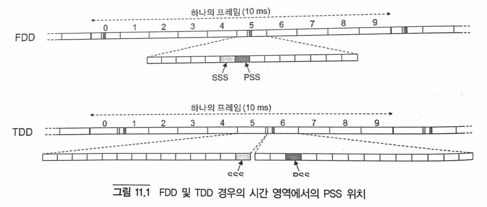
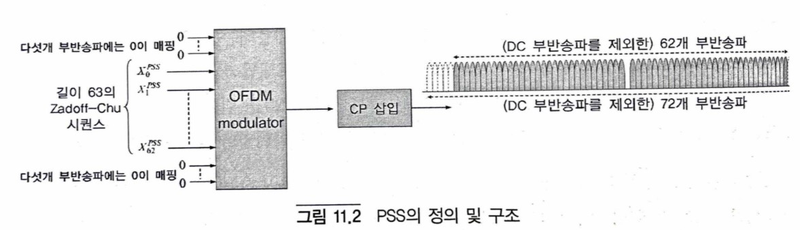
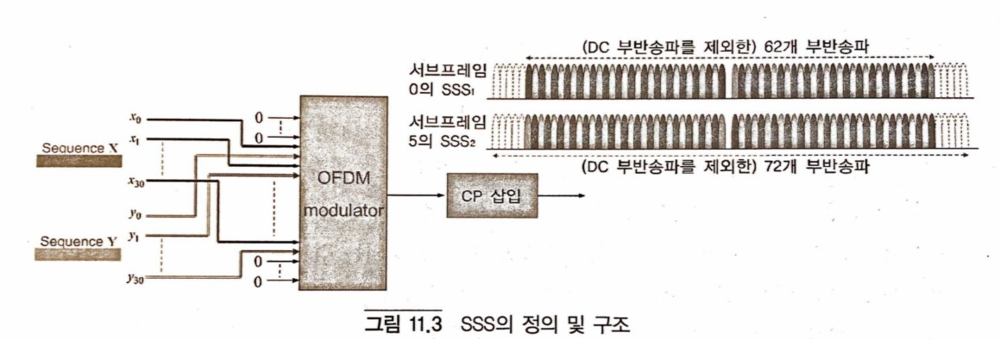
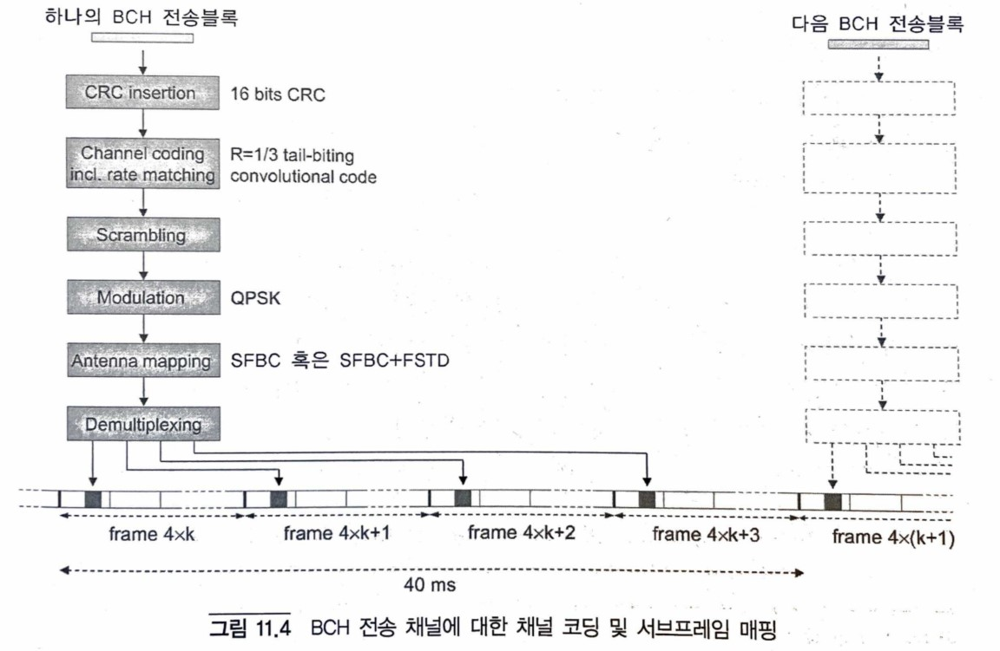
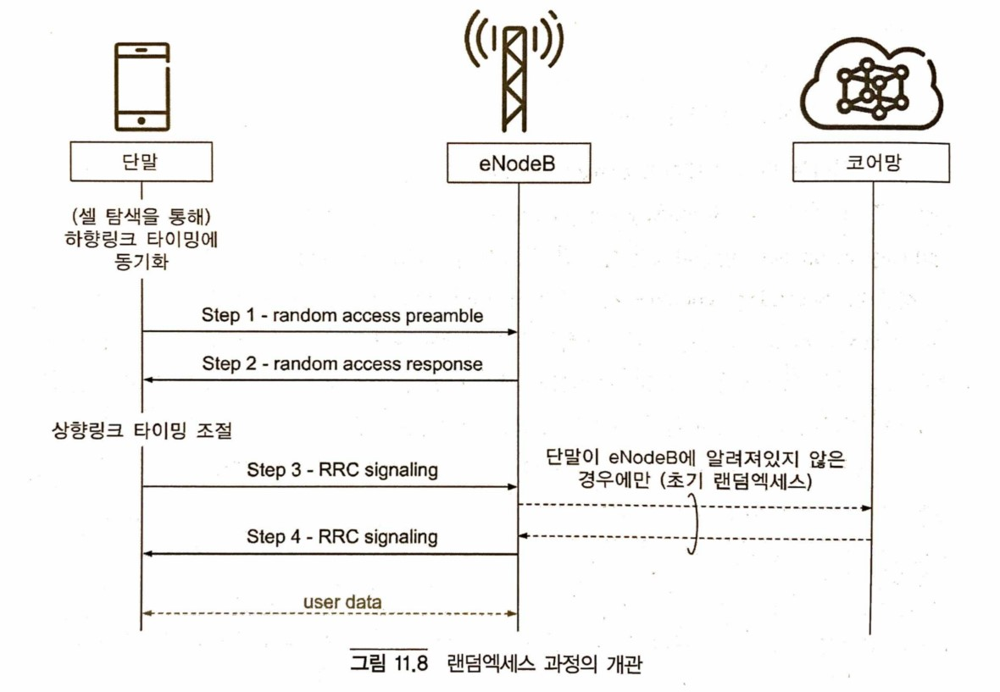

# Book: 4G LTE-Advanced Pro and The Road to 5G
Erik Dahlman, Stefan Parkvall, Johan Skold

## Chapter 11. Access procedures
### Acquisition and Cell search
LTE 단말은 LTE network과 통신하기 이전에 다음의 과정을 수행해야 한다.
- 네트웍 내의 셀(cell)을 찾고 셀과의 동기 획득
- 셀 시스템 정보 (cell system information)라고 불리는, 셀 내에서 통신을 하며 적절하게 동작하는데 필요한 정보의 수신 및 디코딩

시스템 정보가 정확하게 디코딩 되면 단말은 랜덤 액세스 과정을 통해 셀에 접속할 수 있다.

The LTE terminal must perform the following procedure before communicating with the LTE network.
- Find a cell in the network and acquire synchronization with the cell
- Reception and decoding of information necessary to properly operate and communicate within a cell, called cell system information

When the system information is correctly decoded, the UE can access the cell through a random access process.

#### Overview of LTE Cell searching
단말은 처음에 전원을 켜고 최초로 시스템에 접속할 때만 셀 탐색을 수행하는 것은 아니다. 이동성을 지원하기 위하여 이웃하는 셀에 대하여 지속적으로 동기를 찾고 수신 품질을 추정해야 한다. 현재 셀의 수신 품질에 대비하여 이웃하는 셀의 수신 품질을 평가하므로써 이를 핸드 오버(단말이 RRC Connected 모드일 때)나 셀 재선택 (단말이 RRC Idle 모드 일 때)을 수행하는 데 사용한다. 
LTE 셀 탐색은 다음의 기본적인 부분으로 구성되어 있다.
- 셀에 대한 주파수 및 심볼 동기 획득
- 셀의 프레임 동기 획득, 즉 하향 링크 프레임의 시작 시점 획득
- 셀의 물리 계층 셀 ID 결정

셀 탐색을 도와주기 위하여 LTE의 각 하향 링크 component 반송파에는 PSS(Primary Synchronization Signal)와 SSS(Secondary Synchronization Signal)와 같이 2개의 특수한 신호가 전송된다. 비록 구조는 동일하지만, 셀이 FDD로 동작하는지 TDD로 동작하는지에 따라 프레임 내 동기 신호의 시간 영역 상의 위치는 약간 다르다.

The UE does not perform cell search only when initially turning on the power and accessing the system for the first time. In order to support mobility, it is necessary to continuously find synchronization for neighboring cells and estimate reception quality. By evaluating the reception quality of a neighboring cell in relation to the reception quality of the current cell, it is used to perform handover (when the UE is in RRC Connected mode) or cell reselection (when the UE is in RRC Idle mode).
LTE cell discovery consists of the following basic parts.
- Acquire frequency and symbol synchronization for cells
- Acquire the frame synchronization of the cell, that is, acquire the start time of the downlink frame
- Determination of the cell's physical layer cell ID

Two special signals such as a Primary Synchronization Signal (PSS) and a Secondary Synchronization Signal (SSS) are transmitted to each downlink component carrier of LTE to help cell search. Although the structure is the same, the position in the time domain of the sync signal within a frame is slightly different depending on whether the cell operates in FDD or TDD.

일단 단말이 프레임 타이밍과 물리 계층 셀 ID를 획득하면, 해당하는 셀-특정 reference 신호가 무엇인지 알 수 있다. 이것이 RRC_IDLE 모드의 단말이 수행하는 최초 셀 탐색인지 아니면 인접 셀 측정의 목적을 위한 셀 탐색인지에 따라서 약간 다른 동작을 보인다. 
- 최초 셀 탐색의 경우, 즉 단말 상태가 RRC_IDLE 모드인 경우에는 reference 신호는 채널 추정 및 시스템 정보 중 가장 기본적인 부분을 획득하기 위한 뒤따르는 BCH 전송 채널의 디코딩에 사용된다.
- 이동성을 위한 측정의 경우, 즉 단말이 RRC_CONNECTED 모드인 경우에는 단말은 reference 신호의 수신 전력을 측정한다. 만약 측정 값이 설정된 조건을 만족할 경우에는 RSRP (reference signal received power) 측정 보고가 네트웍으로 전송된다. 이러한 측정 보고를 바탕으로 네트웍은 핸드 오버를 해야 할지의 여부를 결정한다. RSRP 보고는 추가적인 component 반송파를 설정해야 할지 아니면 primary component 반송파를 재설정해야 할지의 여부를 결정하는 것과 같이 component 반송파 관리에도 사용될 수 있다. 

Once the UE obtains the frame timing and the physical layer cell ID, it can know what the corresponding cell-specific reference signal is. A slightly different operation is shown depending on whether this is the first cell search performed by the UE in the RRC_IDLE mode or the cell search for the purpose of measuring a neighboring cell.
- In case of initial cell search, that is, when the UE state is RRC_IDLE mode, the reference signal is used for channel estimation and decoding of a subsequent BCH transport channel to obtain the most basic part of system information.
- In the case of measurement for mobility, that is, when the terminal is in RRC_CONNECTED mode, the terminal measures the received power of the reference signal. If the measurement value satisfies the set condition, a reference signal received power (RSRP) measurement report is transmitted to the network. Based on these measurement reports, the network decides whether to perform a handover or not. RSRP report can also be used for component carrier management, such as determining whether to configure additional component carriers or to reconfigure primary component carriers.

#### PSS structure

#### SSS structure

### System Information
기본적인 셀 탐색 절차를 통하여 단말은 셀과 동기를 잡고 물리 계층 ID를 획득하며, 셀 프레임 타이밍을 찾아낸다. 일단 이에 성공하면 단말은 셀 시스템 정보를 획득하여야 한다. 이는 네트웍에 의해 반복적으로 브로드캐스팅 되는 정보로서, 단말이 셀에 접속하기 위하여 그리고 일반적으로 네트웍 내에서 및 특정 셀 내에서 적절하게 동작하기 위하여 알아야 하는 정보이다. 시스템 정보는 Down-link 및 Up-link 셀 대역폭, TDD의 경우는 Down-link/Up-link 설정, 랜덤 엑세스 관련한 세부 파라미터, Up-link 전력 제어 등의 정보를 포함하고 있다.
LTE에서는 시스템 정보가 두 개의 서로 다른 전송 채널을 통하여 두 가지 방식으로 전달된다.

- MIB(Master Information Block)라 불리는 제한된 양의 시스템 정보는 BCH를 이용하여 전송된다.
- 서로 다른 SIB(System Information Block)에 해당되는 시스템 정보의 주요 부분은 DL-SCH를 이용하여 전송된다.

MIB와 SIB의 시스템 정보는 모두 BCCH 논리 채널에 해당됨에 유의한다. 따라서 BCCH는 실제 BCCH의 내용에 따라 BCH와 DL-SCH로 매핑될 수 있다.

Through the basic cell search procedure, the UE synchronizes with the cell, obtains a physical layer ID, and finds the cell frame timing. Once this is successful, the UE must acquire cell system information. This is information that is repeatedly broadcast by the network, and is information that a terminal needs to know in order to access a cell and to operate properly in a network and a specific cell in general. The system information includes information such as down-link and up-link cell bandwidth, down-link/up-link configuration in case of TDD, detailed parameters related to random access, and up-link power control.
In LTE, system information is transmitted in two ways through two different transport channels.

- A limited amount of system information called MIB (Master Information Block) is transmitted using BCH.
- A main part of system information corresponding to different SIB (System Information Block) is transmitted using DL-SCH.

Note that both the system information of the MIB and the SIB correspond to the BCCH logical channel. Therefore, the BCCH may be mapped to the BCH and the DL-SCH according to the contents of the actual BCCH.

#### Transmit MIB/BCH
MIB는 다음의 정보를 포함하고 있다.
- Down-link 셀 대역폭에 대한 정보. MIB 내에서 3 비트가 Down-link 대역폭을 가리키는 데 사용된다. 따라서, 각 주파수 대역에 대하여, 자원 블록의 개수로 정해지는 8 개까지 서로 다른 대역폭을 정의할 수 있다.
- 셀의 PHICH 설정에 대한 정보. 단말은 PDCCH 상의 L1/L2 제어 시그널링을 수신하기 위해서는 PHICH 설정을 알고 있어야 한다. 이 PDCCH 정보는 DL-SCH 상으로 전송되는 나머지 시스템 정보를 획득하기 위해서도 필요하다. 따라서 PHICH 설정에 대한 정보(3비트)는 MIB에 포함되어 있어 BCH를 이용하여 전송되므로, PDCCH를 수신하기 이전에 먼저 수신 및 디코딩 될 수 있다.
- SFN(System Frame Number), 보다 구체적으로는 SFN의 마지막 두 개의 LSB(least significant bit)를 제외한 비트가 MIB에 포함되어 있다. 단말은 BCH 디코딩으로부터 SFN의 LSB 2 비트를 간접적으로 획득할 수 있다.

MIB contains the following information.
- Information on down-link cell bandwidth. 3 bits in the MIB are used to indicate the down-link bandwidth. Accordingly, for each frequency band, up to eight different bandwidths determined by the number of resource blocks may be defined.
- Information about the cell's PHICH settings. The UE needs to know the PHICH configuration in order to receive L1/L2 control signaling on the PDCCH. This PDCCH information is also required to acquire the remaining system information transmitted on the DL-SCH. Therefore, since information (3 bits) on the PHICH configuration is included in the MIB and transmitted using the BCH, it can be received and decoded before receiving the PDCCH.
- SFN (System Frame Number), more specifically, bits except for the last two least significant bits (LSB) of the SFN are included in the MIB. The UE may indirectly obtain LSB 2 bits of SFN from BCH decoding.

#### System Information Block
서로 다른 SIB(system Information Block)들에 포함되어 있는 시스템 정보의 주요 부분들은 DL-SCH를 사용하여 전송된다. 서브프레임 내에서 DL-SCH 상 시스템 정보의 존재 여부는 특수한 SI-RNTI(System Information RNTI)로 표시된 해당 PDCCH의 전송에 의해 알려진다. 일반적인 DL-SCH 전송을 위한 스케쥴링 할당을 제공하는 PDCCH와 마찬가지로, 이 PDCCH 역시 시스템 정보 전송에 사용되는 전송 포맷과 물리 자원(자원 블록들)을 알려준다.

- SIB1은 주로 단말이 해당 셀을 이용할 수 있는지의 여부에 따라 관련된 정보를 포함한다. 이는 해당 셀의 사업자(들)의 정보, 만약 어떤 사용자들이 해당 셀에 접속하는데 제약이 있으면 그러한 정보 등을 포함한다. SIB1은 TDD의 경우에는 Down-link/Up-link에 대한 서브프레임의 할당 및 특수 서브프레임의 설정에 대한 정보를 포함하낟. 마지막으로, SIB1은 나머지 SIB들의 시간 영역 상의 스케쥴링에 대한 정보를 가지고 있다.
- SIB2는 단말이 셀에 접속하기 위해 필요한 정보를 포함한다. 이는 Up-link 셀 대역폭, 랜덤 엑세스 파라미터, Up-link 전력 제어와 관련된 파라미터 등에 관한 정보를 포함한다.
- SIB3는 주로 셀-재선택과 관련된 정보를 포함한다.
- SIB4-SIB8은 같은 반송파 위의 이웃하는 셀, 다른 방송파 위의 이웃하는 셀, WCDMA/HSPA, GSM 및 CDMA2000 셀과 같은 LTE 셀이 아닌 이웃하는 셀 등, 주로 이웃하는 셀에 관련된 정보를 포함한다.
- SIB9는 home eNodeB의 이름을 담고 있다.
- SIB10-12는 예를 들면 지진 경보와 같은 공공 경보 메시지를 담고 있다.
- SIB13은 MBMS 수신을 위해 필요한 정보를 담고 있다.
- SIB14은 개선된 접속 제한을 지원하는 데 사용되며, 단말이 셀에 접속하는 것을 제어한다.
- SIB15은 인접한 반송파 주파수의 MBMS 수신에 필요한 정보를 담고 있다.
- SIB16은 GPS 시간과 UTC(Coordinated Universal Time) 관련 정보를 담고 있다.
- SIB17은 LTE와 WLAN 사이의 상호 연동에 관한 정보를 담고 있다.
- SIB18과 SIB19는 단말 간 직접 통신을 위한 sidelink에 관련된 정보를 담고 있다.
- SIB20은 단일 셀 point-to-multipoint에 관련된 정보를 담고 있다.

Main parts of system information included in different system information blocks (SIBs) are transmitted using DL-SCH. The presence or absence of system information on the DL-SCH in the subframe is known by transmission of a corresponding PDCCH indicated by a special SI-RNTI (System Information RNTI). Like the PDCCH providing scheduling assignment for general DL-SCH transmission, this PDCCH also informs the transmission format and physical resources (resource blocks) used for system information transmission.

- SIB1 mainly includes information related to whether the UE can use the corresponding cell. This includes information of the operator(s) of the cell, and if there are restrictions on some users accessing the cell, such information and the like. In the case of TDD, SIB1 includes information on allocation of subframes for Down-link/Up-link and setting of special subframes. Finally, SIB1 has information about scheduling in the time domain of the remaining SIBs.
- SIB2 includes information necessary for the terminal to access the cell. This includes information on up-link cell bandwidth, random access parameters, parameters related to up-link power control, and the like.
- SIB3 mainly contains information related to cell-reselection.
- SIB4-SIB8 contains information mainly related to neighboring cells, such as neighboring cells on the same carrier, neighboring cells on different broadcasts, and non-LTE cells such as WCDMA/HSPA, GSM and CDMA2000 cells. do.
- SIB9 contains the name of the home eNodeB.
- SIB10-12 contains public warning messages, for example earthquake warnings.
- SIB13 contains information necessary for MBMS reception.
- SIB14 is used to support the improved access restriction, and controls the access of the UE to the cell.
- SIB15 contains information necessary for MBMS reception of adjacent carrier frequencies.
- SIB16 contains information related to GPS time and UTC (Coordinated Universal Time).
- SIB17 contains information on interworking between LTE and WLAN.
- SIB18 and SIB19 contain information related to sidelink for direct communication between terminals.
- SIB20 contains information related to single-cell point-to-multipoint.

### Random Access
LTE에서 랜덤 엑세스는 다음과 같은 몇 가지 목적으로 사용된다.
- 초기 접속으로서 무선 링크를 형성하려는 목적(RRC_IDLE에서 RRC_CONNECTED로 이동.)
- 무선 링크 실패 이후 무선 링크를 재형성하려는 목적
- 핸드 오버에서 새로운 셀과 Up-link를 동기화 하려는 목적
- 단말이 RRC_CONNECTED 상태에 있으나 Up-link는 동기화 되지 않았을 때, Up-link 혹은 Down-link 데이터가 도달하는 경우 Up-link를 동기화 하려는 목적
- Up-link 측정을 기반으로 한 위치 측정 방식을 사용할 경우 위치 측정의 목적
- PUCCH 상으로 지정된 스케쥴링 요청 자원이 없는 경우에 스케쥴링을 요청하려는 목적

최초로 무선 링크를 형성할 때(즉, RRC_IDLE에서 RRC_CONNECTED로 이동할 때), 랜덤 엑세스 과정은 단말에 유일한 식별자인 C-RNTI를 할당하는 목적도 수행한다.

랜덤 엑세스는 목적에 따라 경쟁-기반 혹은 비경쟁-기반의 방식이 사용될 수 있다. 경쟁-기반 랜덤 엑세스는 앞서 설명한 모든 목적에 사용할 수 있으나, 비경쟁-기반 랜덤 엑세스는 Down-link 데이터 도착에 따른 Up-link 동기를 다시 형성하는 경우, secondary component 반송파의 Up-link 동기, 핸드 오버, 포지셔닝에만 사용할 수 있다.

In LTE, random access is used for several purposes:
- The purpose of establishing a radio link as an initial connection (moving from RRC_IDLE to RRC_CONNECTED.)
- The purpose of re-establishing the radio link after radio link failure
- Purpose of synchronizing up-link with new cell in handover
- Purpose of synchronizing up-link when up-link or down-link data arrives when the UE is in RRC_CONNECTED state but up-link is not synchronized
- The purpose of location measurement when using a location measurement method based on up-link measurement
- Purpose of requesting scheduling when there is no scheduling request resource specified on PUCCH

When forming a radio link for the first time (ie, moving from RRC_IDLE to RRC_CONNECTED), the random access process also serves the purpose of allocating C-RNTI, which is a unique identifier, to the UE.

Random access may use a contention-based or non-competition-based scheme depending on the purpose. Contention-based random access can be used for all of the above-described purposes, but contention-based random access is used for up-link synchronization of secondary component carriers, handover, It can only be used for positioning.

그림 11.8에 있는 랜덤 엑세스의 기본은 다음 4가지 단계로 이루어져 있다.
1. 첫번째 단계는 eNodeB가 단말의 전송 타이밍을 추정할 수 있도록 단말이 랜덤 엑세스 프리앰블을 전송하는 단계이다. Up-link 동기는 단말이 데이터를 보내려면 반드시 필요하며, Up-link 동기가 되지 않은 상태에서 단말은 어떠한 Up-link 데이터도 전송할 수 없다.
2. 두번째 단계는 첫번째 단계에서의 타이밍 추정을 기반으로 단말이 전송 타이밍을 조절할 수 있도록 네트웍이 timing advance 명령을 전송하는 단계이다. Up-link 동기를 형성하는 것과 함께, 두번째 단계에서는 랜덤 엑세스 과정의 세번째 단계에서 사용되는 Up-link 자원을 단말에 할당한다.
3. 세번째 단계는 단말이 자신의 identity를 네트웍으로 전송하는 단계로서, 실제 전송은 일반적인 데이터 스케쥴링과 유사한 방식으로 UL-SCH를 사용하여 이루어진다. 이 시그널링 내의 정확한 내용은 단말의 상태, 특히 단말이 이전에 네트웍에 알려져 있는지의 여부에 따라 달라진다.
4. 마지막 네번째 단계는 DL-SCH 상으로 네트웍에서 단말로 경쟁-해소 메시지가 전송되는 단계이다. 이 단계는 동일한 랜덤 엑세스 자원을 사용하여 시스템에 접속하려고 시도하는 복수 개의 단말에 의한 경쟁을 해소한다.

The basis of random access in Figure 11.8 consists of the following four steps.
1. The first step is a step in which the UE transmits a random access preamble so that the eNodeB can estimate the transmission timing of the UE. Up-link synchronization is absolutely necessary for the UE to transmit data, and the UE cannot transmit any up-link data in a state where the up-link synchronization is not performed.
2. The second step is a step in which the network transmits a timing advance command so that the terminal can adjust the transmission timing based on the timing estimation in the first step. In addition to forming up-link synchronization, in the second step, the up-link resource used in the third step of the random access process is allocated to the UE.
3. The third step is a step in which the UE transmits its identity to the network, and the actual transmission is performed using the UL-SCH in a manner similar to general data scheduling. The exact content of this signaling depends on the state of the terminal, in particular whether the terminal has previously been known to the network.
4. Finally, the fourth step is a step in which the contention-resolving message is transmitted from the network to the UE over the DL-SCH. This step resolves contention by a plurality of terminals attempting to access the system using the same random access resource.

#### Step 1: Transmit Random Access Preamble
랜덤 엑세스 과정의 첫단계는 랜덤 엑세스 프리앰블의 전송이다. 프리앰블 전송의 주요 목적은 기지국에 랜덤 엑세스 시도가 있음을 알리고 기지국이 단말과 기지국 사이의 지연을 추정할 수 있어야 한다. 지연에 대한 추정은 2단계에서 Up-link 타이밍을 조절하는데 사용된다.
랜덤 엑세스 프리앰블이 전송되는 시간-주파수 자원을 PRACH(Physical Random Access Channel)라 부른다. 네트웍은 어떤 시간-주파수 자원이 랜덤 엑세스 프리앰블 전송에 사용될 수 있는지를(즉, 어디가 PRACH 자원인지를) 모든 단말에 브로드캐스트 한다(SIB-2). 

The first step of the random access process is transmission of a random access preamble. The main purpose of the preamble transmission is to inform the base station that there is a random access attempt, and the base station should be able to estimate the delay between the terminal and the base station. The estimate of the delay is used to adjust the up-link timing in step 2.
A time-frequency resource through which the random access preamble is transmitted is called a Physical Random Access Channel (PRACH). The network broadcasts which time-frequency resource can be used for random access preamble transmission (ie, where the PRACH resource is) to all terminals (SIB-2).

#### Step 2: Random Access Response
랜덤 엑세스 과정의 두번째 단계로서, eNodeB는 검출된 랜덤 엑세스 시도에 대한 응답으로 다음의 정보를 포함하는 메시지를 DL-SCH 상으로 전송하게 된다.
- 네트웍이 검출한 랜덤 엑세스 프리앰블 시퀀스의 인덱스. 즉, 해당 응답이 유효한 프리앰블 시퀀스 인덱스.
- 랜덤 엑세스 프리앰블 수신기에서 계산된 타이밍 보정값.
- 3단계에서 단말이 메시지 전송에 사용할 자원을 지시하는 스케쥴링 승인.
- 단말과 네트웍 사이에서 추가적인 통신을 위해 사용되는 임시적인 identity인 TC-RNTI.

As the second step of the random access process, the eNodeB transmits a message including the following information on the DL-SCH in response to the detected random access attempt.
- Index of the random access preamble sequence detected by the network. That is, the preamble sequence index for which the corresponding response is valid.
- The timing correction value calculated by the random access preamble receiver.
- Scheduling approval indicating a resource to be used by the UE for message transmission in step 3.
- TC-RNTI, a temporary identity used for additional communication between the terminal and the network.

#### Step 3: Identify terminals
두번째 단계 이후, 단말의 Up-link는 시간 동기가 맞춰진다. 그러나, 사용자 데이터가 단말로 또는 단말로부터 전송되기 이전에 C-RNTI라는 셀 내 유일한 신원이 단말에 할당 되어야 한다. 또한, 단말의 상태에 따라서 연결을 설정하기 위해 추가적인 메시지 교환이 필요할 수도 있다.
Up-link 메시지의 주요 부분 중 하나는 단말의 신원이다. 왜냐하면, 이것이 네번째 단계에서 경쟁 해소 방식에 사용되기 때문이다. 단말이 RRC_CONNECTED 상태에 있어서 이미 셀에 연결되어 있고 C-RNTI가 할당되어 있는 경우라면, 이 C-RNTI가 Up-link 메시지에서 단말의 신원으로 사용된다. 다른 경우에는 코어 망의 단말 신원이 사용되며, 이에 따라 eNodeB는 3단계에서 수신된 Up-link 메시지에 응답을 하기 이전에 코어 망과 교신을 하여야 한다.

After the second step, the up-link of the terminal is time-synchronized. However, before user data is transmitted to or from the terminal, a unique identity in the cell called C-RNTI must be assigned to the terminal. In addition, additional message exchange may be required to establish a connection depending on the state of the terminal.
One of the main parts of the up-link message is the identity of the UE. Because it is used in the competition resolution method in the fourth stage. If the UE is already connected to the cell in the RRC_CONNECTED state and a C-RNTI is assigned, this C-RNTI is used as the UE identity in the Up-link message. In other cases, the terminal identity of the core network is used, and accordingly, the eNodeB must communicate with the core network before responding to the up-link message received in step 3.

#### Step 4: Contention Resolution
랜덤 엑세스 과정의 마지막 단계는 경쟁 해소를 위한 Down-link 메시지로 구성되어 있다. 첫번째 단계에서 동일한 프리앰블 시퀀스를 사용하여 동시에 랜덤 엑세스 시도를 수행한 여러 단말은 두번째 단계에서 동일한 응답 메시지를 수신하고 따라서 동일한 임시 신원을 갖고 있음에 유의한다. 따라서, 랜덤 엑세스 과정의 네번째 단계는 단말이 다른 단말의 신원을 잘못 사용하는 일이 없도록 하는 경쟁 해소 단계이다. 경쟁 해소 방식은 단말이 이미 C-RNTI의 형태의 유효한 신원을 가지고 있는지의 여부에 따라서 약간 달라진다. 세번째 단계에서 수신되는 Up-link 메시지를 통하여 네트웍은 단말이 유효한 C-RNTI를 가지고 있는지의 여부를 알 수 있음에 유의한다.
만약 단말이 이미 할당된 C-RNTI를 가지고 있다면, 경쟁 해소는 C-RNTI를 사용하는 단말을 PDCCH 상에 표시해주면 된다. 즉, PDCCH 상에서 자신의 C-RNTI를 검출함에 따라서, 단말은 랜덤 엑세스 시도가 성공했음을 선언하게 되며, DL-SCH 상으로는 경쟁 해소에 관계된 별도의 정보가 필요하지 않는다. C-RNTI는 해당 단말의 유일한 것이므로, 그 단말이 아닌 다른 단말은 이 PDCCH 전송을 무시하게 된다.
만약 단말이 아직 C-RNTI를 할당받지 못했다면, 경쟁 해소 메시지는 TC-RNTI를 사용하게 되며 해당 PDCCH에 의해 어드레싱 되는 DL-SCH는 경쟁 해소 메시지를 포함하게 된다. 단말은 이 메시지 내의 신원과 세번째 단계에서 전송되었던 신원을 비교하게 된다. 세번째 단계에서 전송된 신원과 네번째 단계에서 수신된 신원이 맞는 단말만이 랜덤 엑세스 과정이 성공했음을 선언하고, 두번째 단계에서 받은 TC-RNTI를 C-RNTI로 승격시킨다. 이미 Up-link 동기가 형성되어 있으므로 이 단계의 Down-link 시그널링에는 HARQ가 적용된다. 또한 세번째 단계에서 전송된 신원과 네번째 단계에서 수신된 메시지의 신원이 맞는 단말은 Up-link에서 HARQ acknowledgement를 전송한다.
자신들의 C-RNTI를 가진 PDCCH 전송을 수신하지 못한 단말 및 세번재 단계에서 전송된 신원과 네번째 단계에서 수신된 신원이 맞지 않는 단말은 랜덤 엑세스 과정이 실패한 것으로 간주하여 첫단계부터 다시 시작한다. 또한 세번째 단계의 Up-link 메시지 전송으로부터 특정 시간 내에 네번째 단계의 Down-link 메시지를 수신하지 못한 단말도 랜덤 엑세스 과정이 실패했음을 선언하고 첫단계부터 다시 시작한다.

The last stage of the random access process consists of a down-link message for contention resolution. Note that multiple UEs that have simultaneously performed random access attempts using the same preamble sequence in the first step receive the same response message in the second step and thus have the same temporary identity. Therefore, the fourth step of the random access process is a contention resolution step to prevent the terminal from using the identity of another terminal erroneously. The contention resolution method is slightly different depending on whether the UE already has a valid identity in the form of C-RNTI. Note that the network can know whether the terminal has a valid C-RNTI through the up-link message received in the third step.
If the UE already has an assigned C-RNTI, contention resolution may be performed by indicating the UE using the C-RNTI on the PDCCH. That is, upon detecting its C-RNTI on the PDCCH, the UE declares that the random access attempt has been successful, and separate information related to contention resolution is not required on the DL-SCH. Since the C-RNTI is the only one of the corresponding terminal, a terminal other than the terminal ignores this PDCCH transmission.
If the UE has not yet been allocated a C-RNTI, the contention resolution message uses the TC-RNTI, and the DL-SCH addressed by the corresponding PDCCH includes the contention resolution message. The terminal compares the identity in this message with the identity transmitted in the third step. Only the UE whose identity transmitted in the third step matches the identity received in the fourth step declares that the random access process has succeeded, and promotes the TC-RNTI received in the second step to C-RNTI. Since up-link synchronization is already formed, HARQ is applied to down-link signaling in this stage. Also, the terminal whose identity transmitted in the third step matches the identity of the message received in the fourth step transmits HARQ acknowledgment in the uplink.
A UE that has not received a PDCCH transmission with its own C-RNTI and a UE whose identity transmitted in the third step and the ID received in the fourth step do not match are regarded as having failed the random access process and start over from the first step. Also, the UE that does not receive the down-link message of the fourth stage within a specific time from the transmission of the up-link message of the third stage declares that the random access process has failed and starts over from the first stage.

### Paging
Paging은 단말이 RRC_IDLE에 있을 때 network-initiated 연결 설정에 사용된다. 효율적인 페이징 과정은, 단말이 네트웍으로부터 페이징 정보를 관찰하기 위해 미리 정해진 구간에만 잠시 깨어나고 나머지 대부분의 시간에는 수신기 프로세싱 없이 sleep 할 수 있도록 해야 한다. LTE에서는, DL-SCH 상의 일반적인 Down-link 데이터 전송과 동일한 방식이 페이징 전송에도 사용되고, 단말은 페이징에 관련된 Down-link 스케쥴링 할당을 찾기 위해 L1/L2 제어 시그널링을 관찰한다. 단말의 위치는 일반적으로 셀 레벨로는 알려지지 않기 때문에, 페이징 메시지는 일반적으로 소위 tracking area 내의 복수 개의 셀에 걸쳐서 전송된다.
단말이 페이징에 사용되는 그룹 신원(P-RNTI)을 검출하면, 단말은 PCH 상으로 전송되는 해당 Down-link 페이징 메시지를 처리한다. 페이징 메시지에는 페이징 되는 단말(들)의 신원이 포함되어 있으며 자신의 신원을 찾지 못한 단말은 수신된 정보를 폐기하고 DRX 주기에 따라 sleep 한다. 
Idle 모드의 단말은 C-RNTI를 할당받지 않은 상태이므로 단말의 가입과 연관되어 있는 IMSI를 페이징을 위한 단말의 신원으로 사용한다.
페이징은 RRC_IDLE 및 RRC_CONNECTED 모드에  있는 단말에 시스템 정보가 바뀌었음을 알려주는데 사용될 수도 있다. 

Paging is used to establish a network-initiated connection when the UE is in RRC_IDLE. For an efficient paging process, the terminal needs to wake up only for a predetermined period to observe paging information from the network and sleep most of the time without receiver processing. In LTE, the same method as for general down-link data transmission on DL-SCH is also used for paging transmission, and the UE observes L1/L2 control signaling to find a down-link scheduling assignment related to paging. Since the location of the UE is generally not known at the cell level, the paging message is generally transmitted over a plurality of cells within a so-called tracking area.
When the terminal detects a group identity (P-RNTI) used for paging, the terminal processes a corresponding down-link paging message transmitted on the PCH. The paging message includes the identity of the terminal(s) being paged, and the terminal that does not find its identity discards the received information and sleeps according to the DRX cycle.
Since the terminal in idle mode is not assigned a C-RNTI, the IMSI associated with the terminal's subscription is used as the identity of the terminal for paging.
Paging may be used to inform the UE in the RRC_IDLE and RRC_CONNECTED modes that system information has changed.