# Book: 4G LTE-Advanced Pro and The Road to 5G
Erik Dahlman, Stefan Parkvall, Johan Skold

## Chapter 4. 무선 인터페이스 구조

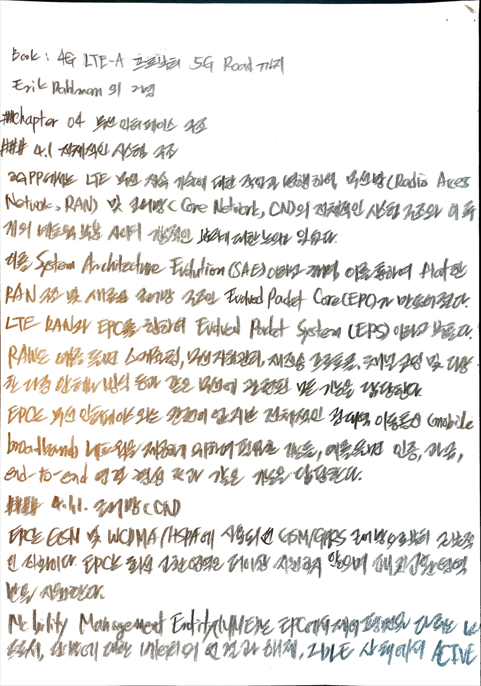

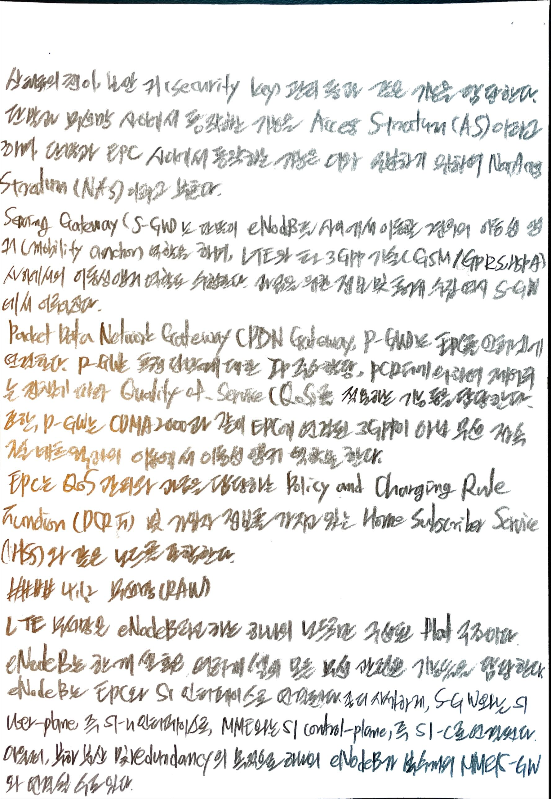

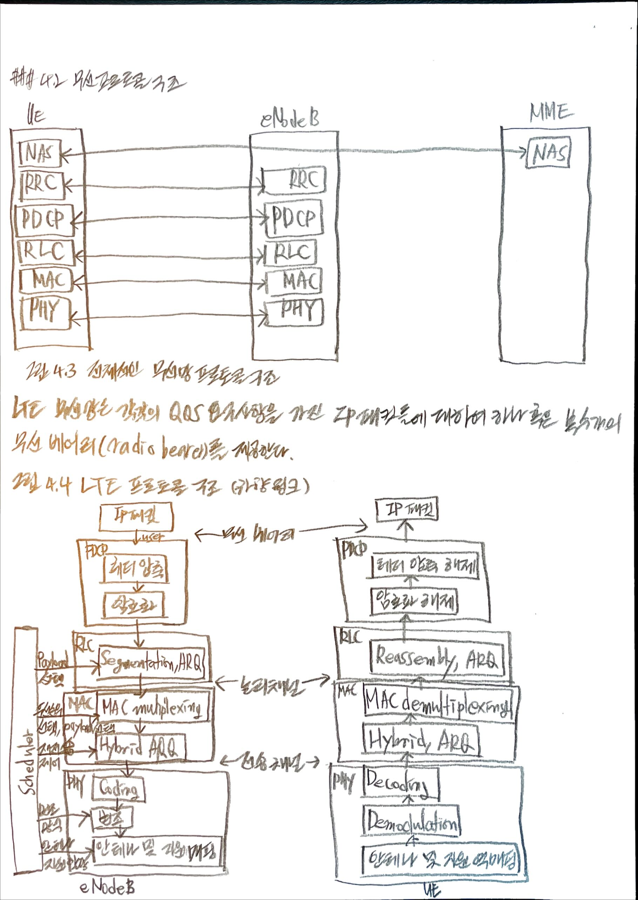

## Chapter 11. Access procedures
### Acquisition and Cell search
LTE 단말은 LTE network과 통신하기 이전에 다음의 과정을 수행해야 한다.
- 네트웍 내의 셀(cell)을 찾고 셀과의 동기 획득
- 셀 시스템 정보 (cell system information)라고 불리는, 셀 내에서 통신을 하며 적절하게 동작하는데 필요한 정보의 수신 및 디코딩

시스템 정보가 정확하게 디코딩 되면 단말은 랜덤 액세스 과정을 통해 셀에 접속할 수 있다.

#### Overview of LTE Cell searching
단말은 처음에 전원을 켜고 최초로 시스템에 접속할 때만 셀 탐색을 수행하는 것은 아니다. 이동성을 지원하기 위하여 이웃하는 셀에 대하여 지속적으로 동기를 찾고 수신 품질을 추정해야 한다. 현재 셀의 수신 품질에 대비하여 이웃하는 셀의 수신 품질을 평가하므로써 이를 핸드 오버(단말이 RRC Connected 모드일 때)나 셀 재선택 (단말이 RRC Idle 모드 일 때)을 수행하는 데 사용한다. 
LTE 셀 탐색은 다음의 기본적인 부분으로 구성되어 있다.
- 셀에 대한 주파수 및 심볼 동기 획득
- 셀의 프레임 동기 획득, 즉 하향 링크 프레임의 시작 시점 획득
- 셀의 물리 계층 셀 ID 결정

셀 탐색을 도와주기 위하여 LTE의 각 하향 링크 component 반송파에는 PSS(Primary Synchronization Signal)와 SSS(Secondary Synchronization Signal)와 같이 2개의 특수한 신호가 전송된다. 비록 구조는 동일하지만, 셀이 FDD로 동작하는지 TDD로 동작하는지에 따라 프레임 내 동기 신호의 시간 영역 상의 위치는 약간 다르다.

일단 단말이 프레임 타이밍과 물리 계층 셀 ID를 획득하면, 해당하는 셀-특정 reference 신호가 무엇인지 알 수 있다. 이것이 RRC_IDLE 모드의 단말이 수행하는 최초 셀 탐색인지 아니면 인접 셀 측정의 목적을 위한 셀 탐색인지에 따라서 약간 다른 동작을 보인다. 
- 최초 셀 탐색의 경우, 즉 단말 상태가 RRC_IDLE 모드인 경우에는 reference 신호는 채널 추정 및 시스템 정보 중 가장 기본적인 부분을 획득하기 위한 뒤따르는 BCH 전송 채널의 디코딩에 사용된다.
- 이동성을 위한 측정의 경우, 즉 단말이 RRC_CONNECTED 모드인 경우에는 단말은 reference 신호의 수신 전력을 측정한다. 만약 측정 값이 설정된 조건을 만족할 경우에는 RSRP (reference signal received power) 측정 보고가 네트웍으로 전송된다. 이러한 측정 보고를 바탕으로 네트웍은 핸드 오버를 해야 할지의 여부를 결정한다. RSRP 보고는 추가적인 component 반송파를 설정해야 할지 아니면 primary component 반송파를 재설정해야 할지의 여부를 결정하는 것과 같이 component 반송파 관리에도 사용될 수 있다. 

#### PSS structure

#### SSS structure

### System Information
기본적인 셀 탐색 절차를 통하여 단말은 셀과 동기를 잡고 물리 계층 ID를 획득하며, 셀 프레임 타이밍을 찾아낸다. 일단 이에 성공하면 단말은 셀 시스템 정보를 획득하여야 한다. 이는 네트웍에 의해 반복적으로 브로드캐스팅 되는 정보로서, 단말이 셀에 접속하기 위하여 그리고 일반적으로 네트웍 내에서 및 특정 셀 내에서 적절하게 동작하기 위하여 알아야 하는 정보이다. 시스템 정보는 Down-link 및 Up-link 셀 대역폭, TDD의 경우는 Down-link/Up-link 설정, 랜덤 엑세스 관련한 세부 파라미터, Up-link 전력 제어 등의 정보를 포함하고 있다.
LTE에서는 시스템 정보가 두 개의 서로 다른 전송 채널을 통하여 두 가지 방식으로 전달된다.

- MIB(Master Information Block)라 불리는 제한된 양의 시스템 정보는 BCH를 이용하여 전송된다.
- 서로 다른 SIB(System Information Block)에 해당되는 시스템 정보의 주요 부분은 DL-SCH를 이용하여 전송된다.

MIB와 SIB의 시스템 정보는 모두 BCCH 논리 채널에 해당됨에 유의한다. 따라서 BCCH는 실제 BCCH의 내용에 따라 BCH와 DL-SCH로 매핑될 수 있다.

#### Transmit MIB/BCH
MIB는 다음의 정보를 포함하고 있다.
- Down-link 셀 대역폭에 대한 정보. MIB 내에서 3 비트가 Down-link 대역폭을 가리키는 데 사용된다. 따라서, 각 주파수 대역에 대하여, 자원 블록의 개수로 정해지는 8 개까지 서로 다른 대역폭을 정의할 수 있다.
- 셀의 PHICH 설정에 대한 정보. 단말은 PDCCH 상의 L1/L2 제어 시그널링을 수신하기 위해서는 PHICH 설정을 알고 있어야 한다. 이 PDCCH 정보는 DL-SCH 상으로 전송되는 나머지 시스템 정보를 획득하기 위해서도 필요하다. 따라서 PHICH 설정에 대한 정보(3비트)는 MIB에 포함되어 있어 BCH를 이용하여 전송되므로, PDCCH를 수신하기 이전에 먼저 수신 및 디코딩 될 수 있다.
- SFN(System Frame Number), 보다 구체적으로는 SFN의 마지막 두 개의 LSB(least significant bit)를 제외한 비트가 MIB에 포함되어 있다. 단말은 BCH 디코딩으로부터 SFN의 LSB 2 비트를 간접적으로 획득할 수 있다.

#### System Information Block
서로 다른 SIB(system Information Block)들에 포함되어 있는 시스템 정보의 주요 부분들은 DL-SCH를 사용하여 전송된다. 서브프레임 내에서 DL-SCH 상 시스템 정보의 존재 여부는 특수한 SI-RNTI(System Information RNTI)로 표시된 해당 PDCCH의 전송에 의해 알려진다. 일반적인 DL-SCH 전송을 위한 스케쥴링 할당을 제공하는 PDCCH와 마찬가지로, 이 PDCCH 역시 시스템 정보 전송에 사용되는 전송 포맷과 물리 자원(자원 블록들)을 알려준다.

- SIB1은 주로 단말이 해당 셀을 이용할 수 있는지의 여부에 따라 관련된 정보를 포함한다. 이는 해당 셀의 사업자(들)의 정보, 만약 어떤 사용자들이 해당 셀에 접속하는데 제약이 있으면 그러한 정보 등을 포함한다. SIB1은 TDD의 경우에는 Down-link/Up-link에 대한 서브프레임의 할당 및 특수 서브프레임의 설정에 대한 정보를 포함하낟. 마지막으로, SIB1은 나머지 SIB들의 시간 영역 상의 스케쥴링에 대한 정보를 가지고 있다.
- SIB2는 단말이 셀에 접속하기 위해 필요한 정보를 포함한다. 이는 Up-link 셀 대역폭, 랜덤 엑세스 파라미터, Up-link 전력 제어와 관련된 파라미터 등에 관한 정보를 포함한다.
- SIB3는 주로 셀-재선택과 관련된 정보를 포함한다.
- SIB4-SIB8은 같은 반송파 위의 이웃하는 셀, 다른 방송파 위의 이웃하는 셀, WCDMA/HSPA, GSM 및 CDMA2000 셀과 같은 LTE 셀이 아닌 이웃하는 셀 등, 주로 이웃하는 셀에 관련된 정보를 포함한다.
- SIB9는 home eNodeB의 이름을 담고 있다.
- SIB10-12는 예를 들면 지진 경보와 같은 공공 경보 메시지를 담고 있다.
- SIB13은 MBMS 수신을 위해 필요한 정보를 담고 있다.
- SIB14은 개선된 접속 제한을 지원하는 데 사용되며, 단말이 셀에 접속하는 것을 제어한다.
- SIB15은 인접한 반송파 주파수의 MBMS 수신에 필요한 정보를 담고 있다.
- SIB16은 GPS 시간과 UTC(Coordinated Universal Time) 관련 정보를 담고 있다.
- SIB17은 LTE와 WLAN 사이의 상호 연동에 관한 정보를 담고 있다.
- SIB18과 SIB19는 단말 간 직접 통신을 위한 sidelink에 관련된 정보를 담고 있다.
- SIB20은 단일 셀 point-to-multipoint에 관련된 정보를 담고 있다.

### Random Access
LTE에서 랜덤 엑세스는 다음과 같은 몇 가지 목적으로 사용된다.
- 초기 접속으로서 무선 링크를 형성하려는 목적(RRC_IDLE에서 RRC_CONNECTED로 이동.)
- 무선 링크 실패 이후 무선 링크를 재형성하려는 목적
- 핸드 오버에서 새로운 셀과 Up-link를 동기화 하려는 목적
- 단말이 RRC_CONNECTED 상태에 있으나 Up-link는 동기화 되지 않았을 때, Up-link 혹은 Down-link 데이터가 도달하는 경우 Up-link를 동기화 하려는 목적
- Up-link 측정을 기반으로 한 위치 측정 방식을 사용할 경우 위치 측정의 목적
- PUCCH 상으로 지정된 스케쥴링 요청 자원이 없는 경우에 스케쥴링을 요청하려는 목적

최초로 무선 링크를 형성할 때(즉, RRC_IDLE에서 RRC_CONNECTED로 이동할 때), 랜덤 엑세스 과정은 단말에 유일한 식별자인 C-RNTI를 할당하는 목적도 수행한다.

랜덤 엑세스는 목적에 따라 경쟁-기반 혹은 비경쟁-기반의 방식이 사용될 수 있다. 경쟁-기반 랜덤 엑세스는 앞서 설명한 모든 목적에 사용할 수 있으나, 비경쟁-기반 랜덤 엑세스는 Down-link 데이터 도착에 따른 Up-link 동기를 다시 형성하는 경우, secondary component 반송파의 Up-link 동기, 핸드 오버, 포지셔닝에만 사용할 수 있다.

그림 11.8에 있는 랜덤 엑세스의 기본은 다음 4가지 단계로 이루어져 있다.
1. 첫번째 단계는 eNodeB가 단말의 전송 타이밍을 추정할 수 있도록 단말이 랜덤 엑세스 프리앰블을 전송하는 단계이다. Up-link 동기는 단말이 데이터를 보내려면 반드시 필요하며, Up-link 동기가 되지 않은 상태에서 단말은 어떠한 Up-link 데이터도 전송할 수 없다.
2. 두번째 단계는 첫번째 단계에서의 타이밍 추정을 기반으로 단말이 전송 타이밍을 조절할 수 있도록 네트웍이 timing advance 명령을 전송하는 단계이다. Up-link 동기를 형성하는 것과 함께, 두번째 단계에서는 랜덤 엑세스 과정의 세번째 단계에서 사용되는 Up-link 자원을 단말에 할당한다.
3. 세번째 단계는 단말이 자신의 identity를 네트웍으로 전송하는 단계로서, 실제 전송은 일반적인 데이터 스케쥴링과 유사한 방식으로 UL-SCH를 사용하여 이루어진다. 이 시그널링 내의 정확한 내용은 단말의 상태, 특히 단말이 이전에 네트웍에 알려져 있는지의 여부에 따라 달라진다.
4. 마지막 네번째 단계는 DL-SCH 상으로 네트웍에서 단말로 경쟁-해소 메시지가 전송되는 단계이다. 이 단계는 동일한 랜덤 엑세스 자원을 사용하여 시스템에 접속하려고 시도하는 복수 개의 단말에 의한 경쟁을 해소한다.

#### Step 1: Transmit Random Access Preamble
랜덤 엑세스 과정의 첫단계는 랜덤 엑세스 프리앰블의 전송이다. 프리앰블 전송의 주요 목적은 기지국에 랜덤 엑세스 시도가 있음을 알리고 기지국이 단말과 기지국 사이의 지연을 추정할 수 있어야 한다. 지연에 대한 추정은 2단계에서 Up-link 타이밍을 조절하는데 사용된다.
랜덤 엑세스 프리앰블이 전송되는 시간-주파수 자원을 PRACH(Physical Random Access Channel)라 부른다. 네트웍은 어떤 시간-주파수 자원이 랜덤 엑세스 프리앰블 전송에 사용될 수 있는지를(즉, 어디가 PRACH 자원인지를) 모든 단말에 브로드캐스트 한다(SIB-2). 

#### Step 2: Random Access Response
랜덤 엑세스 과정의 두번째 단계로서, eNodeB는 검출된 랜덤 엑세스 시도에 대한 응답으로 다음의 정보를 포함하는 메시지를 DL-SCH 상으로 전송하게 된다.
- 네트웍이 검출한 랜덤 엑세스 프리앰블 시퀀스의 인덱스. 즉, 해당 응답이 유효한 프리앰블 시퀀스 인덱스.
- 랜덤 엑세스 프리앰블 수신기에서 계산된 타이밍 보정값.
- 3단계에서 단말이 메시지 전송에 사용할 자원을 지시하는 스케쥴링 승인.
- 단말과 네트웍 사이에서 추가적인 통신을 위해 사용되는 임시적인 identity인 TC-RNTI.

#### Step 3: Identify terminals
두번째 단계 이후, 단말의 Up-link는 시간 동기가 맞춰진다. 그러나, 사용자 데이터가 단말로 또는 단말로부터 전송되기 이전에 C-RNTI라는 셀 내 유일한 신원이 단말에 할당 되어야 한다. 또한, 단말의 상태에 따라서 연결을 설정하기 위해 추가적인 메시지 교환이 필요할 수도 있다.
Up-link 메시지의 주요 부분 중 하나는 단말의 신원이다. 왜냐하면, 이것이 네번째 단계에서 경쟁 해소 방식에 사용되기 때문이다. 단말이 RRC_CONNECTED 상태에 있어서 이미 셀에 연결되어 있고 C-RNTI가 할당되어 있는 경우라면, 이 C-RNTI가 Up-link 메시지에서 단말의 신원으로 사용된다. 다른 경우에는 코어 망의 단말 신원이 사용되며, 이에 따라 eNodeB는 3단계에서 수신된 Up-link 메시지에 응답을 하기 이전에 코어 망과 교신을 하여야 한다.

#### Step 4: Contention Resolution
랜덤 엑세스 과정의 마지막 단계는 경쟁 해소를 위한 Down-link 메시지로 구성되어 있다. 첫번째 단계에서 동일한 프리앰블 시퀀스를 사용하여 동시에 랜덤 엑세스 시도를 수행한 여러 단말은 두번째 단계에서 동일한 응답 메시지를 수신하고 따라서 동일한 임시 신원을 갖고 있음에 유의한다. 따라서, 랜덤 엑세스 과정의 네번째 단계는 단말이 다른 단말의 신원을 잘못 사용하는 일이 없도록 하는 경쟁 해소 단계이다. 경쟁 해소 방식은 단말이 이미 C-RNTI의 형태의 유효한 신원을 가지고 있는지의 여부에 따라서 약간 달라진다. 세번째 단계에서 수신되는 Up-link 메시지를 통하여 네트웍은 단말이 유효한 C-RNTI를 가지고 있는지의 여부를 알 수 있음에 유의한다.
만약 단말이 이미 할당된 C-RNTI를 가지고 있다면, 경쟁 해소는 C-RNTI를 사용하는 단말을 PDCCH 상에 표시해주면 된다. 즉, PDCCH 상에서 자신의 C-RNTI를 검출함에 따라서, 단말은 랜덤 엑세스 시도가 성공했음을 선언하게 되며, DL-SCH 상으로는 경쟁 해소에 관계된 별도의 정보가 필요하지 않는다. C-RNTI는 해당 단말의 유일한 것이므로, 그 단말이 아닌 다른 단말은 이 PDCCH 전송을 무시하게 된다.
만약 단말이 아직 C-RNTI를 할당받지 못했다면, 경쟁 해소 메시지는 TC-RNTI를 사용하게 되며 해당 PDCCH에 의해 어드레싱 되는 DL-SCH는 경쟁 해소 메시지를 포함하게 된다. 단말은 이 메시지 내의 신원과 세번째 단계에서 전송되었던 신원을 비교하게 된다. 세번째 단계에서 전송된 신원과 네번째 단계에서 수신된 신원이 맞는 단말만이 랜덤 엑세스 과정이 성공했음을 선언하고, 두번째 단계에서 받은 TC-RNTI를 C-RNTI로 승격시킨다. 이미 Up-link 동기가 형성되어 있으므로 이 단계의 Down-link 시그널링에는 HARQ가 적용된다. 또한 세번째 단계에서 전송된 신원과 네번째 단계에서 수신된 메시지의 신원이 맞는 단말은 Up-link에서 HARQ acknowledgement를 전송한다.
자신들의 C-RNTI를 가진 PDCCH 전송을 수신하지 못한 단말 및 세번재 단계에서 전송된 신원과 네번째 단계에서 수신된 신원이 맞지 않는 단말은 랜덤 엑세스 과정이 실패한 것으로 간주하여 첫단계부터 다시 시작한다. 또한 세번째 단계의 Up-link 메시지 전송으로부터 특정 시간 내에 네번째 단계의 Down-link 메시지를 수신하지 못한 단말도 랜덤 엑세스 과정이 실패했음을 선언하고 첫단계부터 다시 시작한다.

### Paging
Paging은 단말이 RRC_IDLE에 있을 때 network-initiated 연결 설정에 사용된다. 효율적인 페이징 과정은, 단말이 네트웍으로부터 페이징 정보를 관찰하기 위해 미리 정해진 구간에만 잠시 깨어나고 나머지 대부분의 시간에는 수신기 프로세싱 없이 sleep 할 수 있도록 해야 한다. LTE에서는, DL-SCH 상의 일반적인 Down-link 데이터 전송과 동일한 방식이 페이징 전송에도 사용되고, 단말은 페이징에 관련된 Down-link 스케쥴링 할당을 찾기 위해 L1/L2 제어 시그널링을 관찰한다. 단말의 위치는 일반적으로 셀 레벨로는 알려지지 않기 때문에, 페이징 메시지는 일반적으로 소위 tracking area 내의 복수 개의 셀에 걸쳐서 전송된다.
단말이 페이징에 사용되는 그룹 신원(P-RNTI)을 검출하면, 단말은 PCH 상으로 전송되는 해당 Down-link 페이징 메시지를 처리한다. 페이징 메시지에는 페이징 되는 단말(들)의 신원이 포함되어 있으며 자신의 신원을 찾지 못한 단말은 수신된 정보를 폐기하고 DRX 주기에 따라 sleep 한다. 
Idle 모드의 단말은 C-RNTI를 할당받지 않은 상태이므로 단말의 가입과 연관되어 있는 IMSI를 페이징을 위한 단말의 신원으로 사용한다.
페이징은 RRC_IDLE 및 RRC_CONNECTED 모드에  있는 단말에 시스템 정보가 바뀌었음을 알려주는데 사용될 수도 있다. 

## 21. D2D 연결
### 21.1 개요
LTE는 두 가지 타입의 D2D 연결을 구분한다.

- D2D 통신: 단말간 직접적으로 사용자 데이터 교환을 의미한다. LTE release 13을 기준으로 한 시점에서 D2D 통신은 공공안전 사용 사례만을 대상으로 한다. NR 릴리즈 15는 직접 단말간 통신을 지원하지 않지만 향후 후보 아이템이 될 것으로 보인다.
- D2D 발견(discovery) 단말이 신호를 전송하여 인접 지역의 다른 단말에 의해 직접 탐지될 수 있도록 하는 기능을 의미한다.

D2D 직접 무선 링크에 대하여 하향 링크 및 상향 링크 전송 방향의 개념은 당연히 적용되지 않는다. 대신 3GPP는 D2D 직접 링크를 설명하기 위해 사이드 링크(sidelink)라는 용어를 도입하였다.

#### 21.1.1 사이드링크 전송

Paired 주파수의 경우, 사이드링크 연결은 주파수의 상향링크 부분에서 발생한다. FDD 주파수에서 사이드링크 연결이 상향링크 대역에서 일어나는 데는 몇가지 이유가 있다.
- 규제적인 규칙은 일반적으로 단말이 무엇을 어떻게 송신하는지에 주안점을 두지만 단말이 무엇을 어떻게 수신하는지는 제한하지 않는다. 규제 관점에서 볼 때 사이드링크 연결을 하향링크에 두게 되면 네트워크가 전송하는 것에 사용하도록 가정된 주파수에서 단말이 전송을 하는 것을 의미하므로 사이드링크 연결을 상향링크 주파수로 하는 것이 훨씬 간단하다.
- 단말 구현 관점에서 사이드링크 연결이 하향링크 대역에 있있으면 해당 대역에 송신기 기능을 추가해야 하지만 사이드링크 연결이 상향링크 대역에 있으면 수신기 기능을 추가하는 것(해당 상향링크 대역에서 수신지원)이 덜 복잡하다.

유사하게 TDD 주파수의 경우 사이드링크 연결은 상향링크 서브프레임에서 발생한다고 가정한다.

사이드링크 연결은 근본적으로 단방향(unidirectional)이라는 점에 유의한다. 이는 현재 모든 LTE 사이드링크 전송은 기본적으로 반대 방향에서 전송되어 오는 연관된 제어 시그널링이 없는 브로드캐스트 전송이라는 의미이다.

사이드링크 연결은 기본적인 상향링크 전송구조는 PUCH 전송의 기본구조를 재사용한다. 사이드링크 동기신호(sidelink synchronization signal, SLSS)를 제외한 모든 사이드링크 전송은 그림 21.1에서 설명된 서브프레임 구조를 갖는 DFT-확산 OFDM을 기반으로 한다.

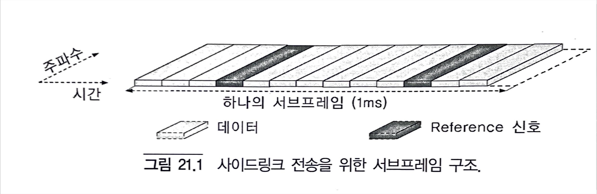

사이드링크 송신의 경우 서브프레임의 마지막 OFDM 심볼은 전송되지 않음에 유의한다. 이는 사이드링크 송신/수신과 일반적인 상향링크 전송사이의 스위칭 뿐만아니라 사이드링크 송신과 사이드링크 수신 사이의 스위칭에 필요한 보호 시간을 확보하기 위해서다.

#### 21.1.2 커버리지 내 사이드링크 연결 및 수신 커버리지 외 사이드링크 연결

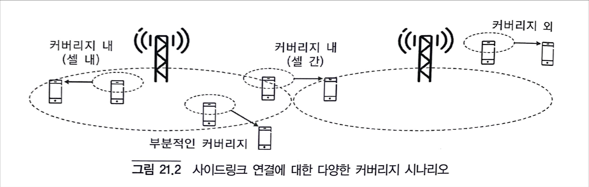

#### 21.1.3 사이드링크 동기화
단말이 사이드링크 연결을 설정하기 전에, 이들은 서로 간에 네트웍과 어느 정도 동기화가 잘 되어 있어야 한다.
그 이유 중 하나는 사이드링크 전송이 의도된 시간-주파수 자원 내에서만 발생하도록 하여 동일한 대역의 다른 사이드링크 및 사이드링크가 아닌 (셀룰러) 전송에 대한 제어되지 않은 간섭을 주는 위험을 줄이기 위해서이다.

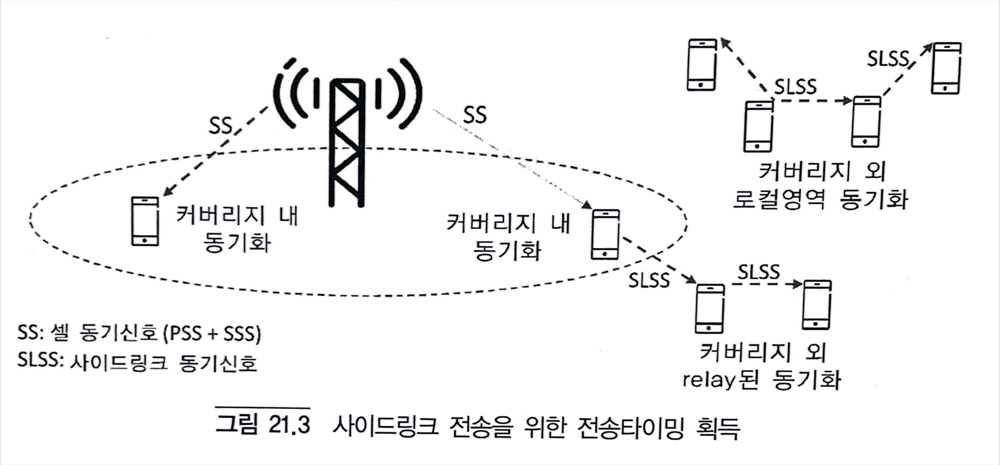

그림 21.3과 같이 네트웍 커버리지 내에 있는 단말은 서빙 셀(RRC_CONNECTED 상태) 또는 단말이 캠핑 중인 셀 (RRC_IDLE 상태)의 일반적인 셀 동기 신호(PSS/SSS)를 사이드링크 전송을 위한 타이밍 기준으로 사용해야 한다.
그러나 전송 타이밍에 대한 네트웍 제어를 직접적인 네트웍 커버리지가 미치지 않는 곳까지 하기 위해, LTE 사이드링크 연결에는 단말이 특수한 사이드링크 동기신호(SLSS)를 전송할 수도 있도록 하였다. 네트웍 커버리지 내의 단말은 네트웍으로부터 획득된 전송 타이밍에 따라 SLSS를 전송할 수 있다. 이 신호는 네트웍 커버리지에서는 벗어나있지만 SLSS를 송신한 단말과는 근처에 있는 단말에 의하여 수신되어 사이드링크 송신에 대한 타이밍 기준으로 사용될 수 있다. 그런 다음 이러한 단말은 다른 커버리지 외의 단말이 타이밍 기준으로 사용할 수 있는 자체 SLSS를 전송할 수 있다. 이렇게 함으로써 단말은 커버리지가 존재하는 네트웍에 동기되고 여기에서 전송 타이밍을 도출하며, 이는 직접적인 네트웍 커버리지 영역을 넘어서 더욱 확대될 수 있다.
네트웍 커버리지 내에 있지 않고 충분히 강한 SLSS를 탐지하지 못한 단말은, 자발적으로 SLSS를 전송하게 되며, 이는 또 다른 커버리지의 단말에 의해 검출되고 포워딩 될 수 있다. 이러한 방식으로 네트웍이 존재하는 커버리지 외 단말 사이에서도 로컬 영역 동기화가 달성될 수 있다.
SLSS는 커버리지 외 단말에 대한 사이드링크 송신을 위한 타이밍 기준 이외에도, 사이드링크 수신을 위한 타이밍 기준으로 작용할 수 있다. 
사이드링크 전송의 수신을 용이하게 하기 위해 수신단말은 수신될 신호의 타이밍에 대해 잘 알고 있는 것이 바람직하다. 예를 들어 동일한 서빙 셀을 갖는 커버리지 내의 단말들과 같이 동일한 전송 타이밍 기준을 사용하는 단말들 사이의 사이드링크 연결에서는, 수신 단말은 자신의 전송 타이밍을 수신에도 사용할 수 있다.
예를 들어 시간이 정렬되지 않은 서로 다른 셀에 있는 단말을 포함한 사이드링크 연결과 같이 전송 타이밍에 동일한 기준을 사용하지 않는 단말 사이의 사이드링크 연결을 가능하게 하기 위해, 단말은 다른 사이드링크 송신과 병렬로 SLSS를 전송할 수 있다. 이러한 동기신호는 수신 단말이 수신 타이밍의 기준으로 사용할 수 있다. 이에 대한 예가 그림 21.4에 나와있다.

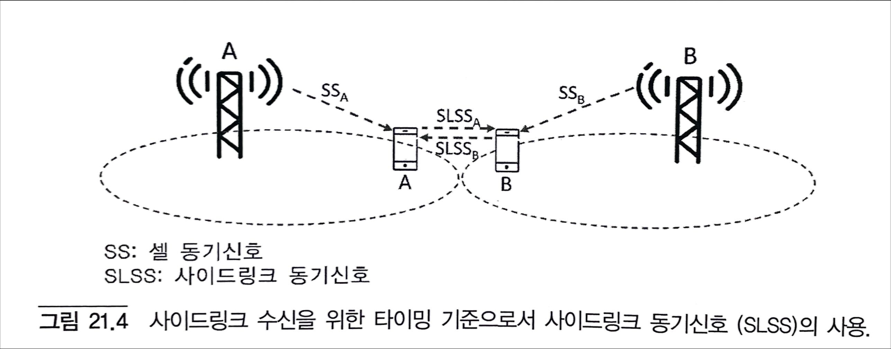

#### 21.1.4 사이드링크 연결을 위한 설정
단말은 사이드링크 연결에 참여하기 전에 바르게 설정되어야 한다. 이러한 설정은 서로 다른 타입의 사이드링크 전송에 이용 가능한 자원집합 (서브프레임 및 자원 블록)을 정의하는 파라미터를 포함한다.

사이드링크 관련 설정 파라미터를 위해 두 개의 새로운 SIB가 도입되었다.

- SIB18: 사이드링크 통신과 관련된 설정 파라미터
- SIB19: 사이드링크 발견과 관련된 설정 파라미터

현재 커버리지 외의 동작은 공공안전에 대한 사용 사례만을 대상으로 함에 유의한다. 따라서 커버리지 외 동작은 일반적으로 특수한 단말 및 특수한 가입과 관련된다.

#### 21.1.5 사이드링크를 위한 구조

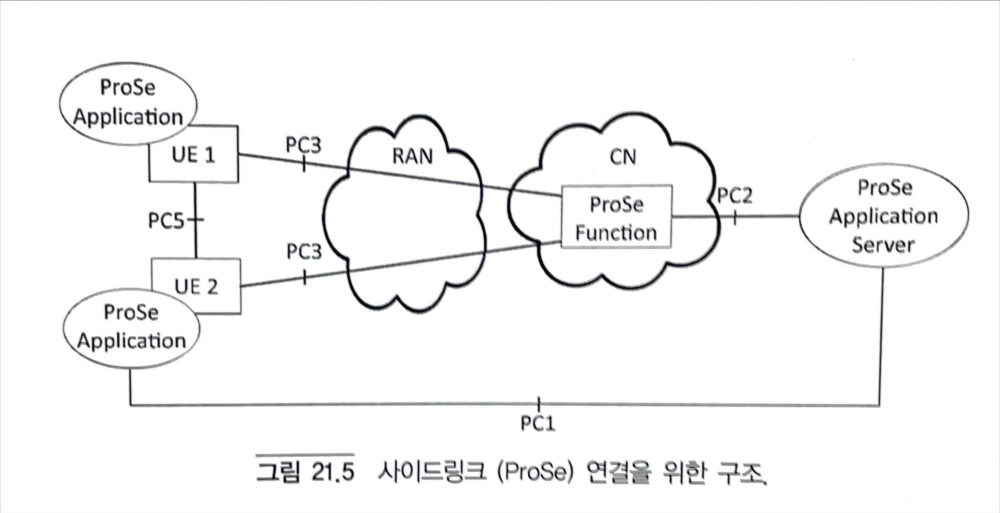

그림 21.5는 사이드링크 연결과 관련된 네트웍 구조를 보여준다. 사이드링크 연결을 지원하기 위해 몇몇 새로운 네트웍 인터페이스와 함께 ProSe 기능이 코어망에 도입되었다. 이러한 인터페이스 중 PC5는 단말 간 직접 링크에 해당하며 PC3은 사이드링크-가능 단말과 ProSe(Proximity Service; 근접 서비스) 기능 간의 인터페이스이다.

ProSe 기능은 코어망 내의 모든 사이드링크 기능을 담당한다. 예를 들어 이 기능은 사이드링크 연결(발견 또는 통신)을 설정하는 데 필요한 파라미터를 단말에 제공한다. 또한 ProSe 기능은 발견 메시지(discovery message) 코드와 실제 발견 메시지 간의 매핑을 제공한다.

#### 21.1.6 사이드링크 채널 구조

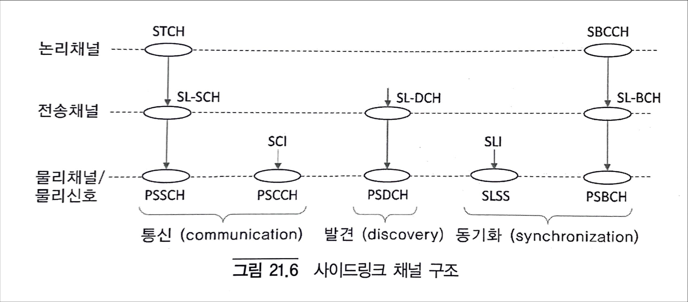

그림 21.6은 논리 채널, 전송 채널 및 물리 채널/신호를 포함하는 사이드링크 연결에 관련된 채널 구조를 보여준다.
STCH(sidelink traffic channel)는 사이드링크 통신을 위한 사용자 데이터를 운반하는 논리채널이다. 이는 SL-SCH(sidelink shared channel) 전송 채널에 매핑되고, 이어서 PSSCH(physical sidelink shared channel)에 매핑된다. PSSCH와 병렬로 수신단말이 PSSCH를 적절하게 검출하고 디코딩할 수 있게 사이드링크 제어정보(sidelink control informaiton, SCI)를 운반하는 PSCCH(physical sidelink control channel)가 있다.

SL-DCH(sidelink discovery channel)은 발견되었음을 알리는데 사용되는 전송 채널이다. 이는 물리 계층에서 PSDCH(physical sidelink discovery channel)에 매핑된다. 사이드링크 발견에 관련된 논리 채널이 없다는 것에 유의한다. 즉, 발견 메시지(discovery message)는 MAC 계층 상의 SL-DCH 전송 블록에 직접 삽입된다. 따라서 사이드링크 발견을 위한 RLC 및 PDCP 계층은 없다.

마지막으로 사이드링크 동기화는 두 개의 신호/채널을 기반으로 한다.

- 이미 언급한 SLSS는 특정한 사이드링크 identity (SLI)와 연관되어 있다.
- S-BCCH(sidelink broadcast control channel)은 SL-BCH(sidelink broadcast channel) 전송 채널로 매핑되며, 이어서 PSBCH(physical sidelink broadcast channel) 물리 채널로 매핑된다. 이 채널은 단말 사이에서 사이드링크 MIB(SL-MIB)라고 불리는 매우 기본적인 사이드링크 관련 시스템 정보를 전달하는 데 사용된다.

### 21.2 사이드링크 통신
사이드링크 통신은 근접 단말 간에 사용자 데이터를 직접 교환하는 것을 의미한다. Release 12에서는 사이드링크 통신은 그룹 통신(group communication)으로 제한된다. 실제로 이는

- 사이드링크 전송은 특정 수신 단말과 관한 링크 특성에 대한 가정 없이 단말에 의해 브로드캐스팅 된다.
- 사이드 링크 전송은 수신 단말 부근의 임의의 사이드링크 통신이 가능한 단말에 의해 수신 및 디코딩 될 수 있다.
- 사이드링크 전송의 제어 부분에 포함된 그룹 ID는 수신 단말이 자신이 이 데이터의 목표 수신자 중 하나인지를 결정하게 해준다.

사이드링크 통신은 2개의 물리 채널을 기반으로 한다:
- PSSCH: 실제 전송 채널(SL-SCH) 데이터를 운반한다.
- PSCCH: 수신 단말이 PSSCH를 적절하게 검출 및 디코딩 할 수 있게 제어 정보를 전달한다.

PSCCH는, 수신 단말이 하향 링크 전송 채널 데이터를 운반하는 PDSCH를 적절히 검출 및 디코딩 할 수 있게 제어 정보를 운반하는 PDCCH/EPDCCH와 유사한 목적을 수행한다.

#### 21.2.1 자원풀 및 전송 자원 할당/선택

사이드링크 통신(및 사이드링크 발견)을 위하여 자원풀(resource pool)의 개념이 도입되었다. 간단히 말해 자원 풀이란, 실제로 서브프레임과 자원 블록의 물리적 자원의 집합으로서, 사이드링크 전송을 위해 단말이 사용할 수 있다. 특정한 사이드링크 전송을 위해 사용되는 정확한 자원의 집합은 자원 풀로부터 할당/선택된다.

자원풀을 가지고 단말을 설정하는 방법에는 여러가지가 있다.
- RRC_CONNECTED 모드의 단말에 대해서는 전용 RRC 시그널링을 통해 자원풀을 개별적으로 설정할 수 있다.
- 공통 자원풀은 사이드링크-특정 시스템 정보(사이드링크 통신의 경우에는 SIB18)를 통해 제공될 수 있다.
- 커버리지 외 단말에서 사용될, 사전에 설정된 자원풀이 있을 수 있다.

사이드링크 통신에 대하여 각 자원풀은 다음과 같이 구성된다.
- PSCCH 서브프레임 풀: PSCCH 전송을 위해 가용한 서브프레임을 정의한다.
- PSCCH 자원 블록 풀: PSCCH 서브프레임 풀 내에서 PSCCH 전송을 위해 가용한 자원 블록을 정의한다.
- PSCCH 서브프레임 풀: PSSCH 전송에 가용한 서브프레임을 정의한다.
- PSSCH 자원 블록 풀: PSSCH 서브프레임 풀 내에서 PSSCH 전송을 위해 가용한 자원 블록들을 정의한다.

사이드링크 통신에는 두가지 타입 또는 모드가 있다. 두가지 모드는 단말이 설정된 자원풀에서 사이드링크 전송에 사용할 정확한 자원을 어떻게 할당받는지 혹은 선택하는지에 따라 다르다. 여기에는 PSSCH를 사용하여 실제 데이터 (전송 채널) 전송을 위한 자원뿐 아니라 PSCCH 전송을 위한 자원도 포함된다.

- 사이드링크 통신 모드 1의 경우 네트웍으로부터 수신한 스케쥴링 승인을 통해 PSCCH/PSSCH 자원의 특정 집합이 명시적으로 할당된다.
- 사이드링크 통신 모드 2의 경우 단말 자체가 PSCCH/PSSCH 자원을 선택한다.

네트웍에 의해 제공되는 명시적인 스케쥴링 승인에 의존하기 때문에 사이드링크 통신 모드 1은 커버리지 내 RRC_CONNECTED 상태의 단말에 대해서만 가능하다. 대조적으로 사이드링크 통신 모드 2는 커버리지 내 및 커버리지 외, RRC_IDLE 및 RRC_CONNECTED 상태 모두에서 가능하다.

#### 21.2.2 PSCCH 주기

시간 영역에서 사이드링크 통신은 소위 PSCCH 주기에 기반한다. 1024 프레임 또는 10240 서브프레임으로 이루어진 각 SFN 주기는 동일한 길이의 PSCCH 주기로 나누어진다.
FDD의 경우 PSCCH 주기는 40, 80, 160 또는 320 서브프레임으로 설정될 수 있다. TDD의 경우 PSCCH 주기로 가능한 길이는 하향링크/상향링크 설정에 따라 달라진다.

#### 21.2.3 사이드링크 제어 정보/PSCCH 전송

PSCCH는 매 PSCCH 주기마다 한번 전송된다. PSCCH는 이미 언급한 바와 같이 수신 단말이 PSSCH 상의 데이터 전송을 적절히 검출하고 디코딩 할 수 있게 사이드링크 제어 정보(SCI)를 운반한다. SCI는 PSSCH 전송에 사용되는 시간-주파수 자원(서브프레임들 및 자원블록들)에 관한 정보를 포함한다.

PSCCH 서브프레임 풀, 즉 각 PSSCH 주기 내에서 PSCCH 전송에 사용할 수 있는 서브프로엠 집합은 사이드링크 설정의 일부로 제공된 서브프레임 비트맵에 의해 제공된다. FDD 주파수에서 사이드링크 연결의 경우, 비트맵의 길이는 40이다. TDD의 경우 비트맵의 길이는 하향링크/상향링크 설정에 따라 다르다.

PSCCH 자원 블록 풀, 즉 서브프레임 풀 내에서 PSCCH 전송에 사용할 수 있는 자원 블록 집합은 두 개의 동일한 크기의 주파수 상에 연속된 자원 블록으로 구성된다.

#### 21.2.4 SL-SCH/PSSCH 전송

실제 전송 채널(SL-SCH) 데이터는 PSSCH 물리 채널 상에 전송 블록 형태로 전송된다. 각 전송 블록은 PSSCH 서브프레임 풀 내의 4개의 연속적인 서브프레임을 통해 전송된다. 따라서 PSCCH 주기 내에서 M개의 전송 블록을 전송하기 위해서는 4M 개의 서브프레임이 필요하다. PSCCH 상의 단일 SCI는 전체 PSCCH 주기 동안 PSSCH 전송에 관련된 제어 정보를 운반한다는 사실에 유의한다.

SL-SCH에 대한 채널 코딩 및 변조는 상향링크 전송(UL-SCH)과 동일한 방식으로 행해지며 다음 단계로 구성된다.
- CRC 삽입
- 코드 블록 분할 및 코드 블록 당 CRC 삽입
- 코딩률 1/3 터보 코드
- Rate matching (물리 계층 HARQ 기능에 기반함)
- 비트 레벨 스크램블링
- 데이터 변조(QPSK/16QAM)

Rate matching은 변조 방식을 고려하여 코딩된 비트를 전송 블록 전송하기 위해 할당/선택된 물리 자원의 크기와 매칭 시킨다. SL-SCH를 위한 HARQ는 없다. 그러나 4개의 연속적ㅇ니 서브프레임을 통해 전송된다. 따라서 PSCCH 주기 내에서 M개의 저송 블록을 전송하기 위해서는 4M 개의 서브프레임에 대한 코딩된 전송 블록의 rate matching 및 매핑은 HARQ 재전송을 위한 redundancyh 버전의 선택과 동일한 방식으로 수행된다.

비트 레벨 스크램블링은 그룹 ID, 즉 사이드링크 전송이 목표로 하는 그룹의 ID를 따른다.

PSSCH 데이터 변조는 QPSK 및 16QAM으로 제한된다. 네트웍은 사이드링크 설정의 일부로서 PSSCH 전송을 위해 특정 변조 방식을 강제할 수 있다. 네트웍이 특정 변조 방식을 강제하지 않으면 송신 단말은 자율적으로 변조 방식을 선택한다. 할당/선택된 변조 방식에 관한 정보는 SCI의 일부로서 수신 단말에 제공된다.

사이드링크 통신 모드 1의 경우, PSSCH 서브프레임 풀 즉, PSCCH 전송에 사용 가능한 서브프레임 집합은 PSCCH 서브프레임 풀의 마지막 서브프레임 이후의 모든 상향링크 서브프레임으로 구성된다.

PSCCH 주기 내에서 PSSCH 전송을 위해 사용되는 정확한 서브프레임은 스케줄링 승인의 일부로서 제공되는 TRPI(time repetition pattern index)에 의해 주어진다. TRPI는 LTE 규격에서 명시적으로 정의된 TRP 테이블 내의 특정 TRP를 가리킨다. 지시된 TRP의 주기적 확장이 PSSCH 전송에 할당된 상향링크 서브프레임을 제공한다.

그 다음 TRPI는 PSSCH가 전송되는 서브프레임의 집합에 관하여 수신 단말에 알려주기 위해 SCI에 포함된다.

사이드링크 통신 모드2의 경우, PSSCH 서브프레임 풀, 즉 PSSCH 전송에 가용한(상향링크) 서브프레임은 모드1 서브프레임 풀의 부분집합으로 이루어진다. 보다 구체적으로 사이드링크 설정에 정의된 비트맵의 주기적인 확장은 PSSCH 서브프레임 풀에 어떤 서브프레임이 포함되는지를 나타낸다. 네트웍은 이러한 방식으로 특정 서브프레임이 PSSCH 전송에 사용되지 않을 것임을 보장할 수 있다.

그 다음, 단말은 TRP 테이블로부터 무작위로 TRP를 선택함으로써 PSSCH 전송을 위해 사용할 정확한 서브프레임 집합을 자율적으로 결정한다. 수신 단말은 사이드링크 통신 모드 1과 유사하게 SCI에 포함된 해당 TRPI를 통하여 선택된 TRP에 대해 알게 된다.

사이드링크 통신 모드 2의 경우에는, PSSCH 서브프레임 풀의 일부인 서브프레임 집합에 대한 제한 이외에도 TRP 선택에도 제한이 있다.

일반적으로 TRP 테이블은 PSSCH 전송을 위해 할당된 서로 다른 서브프레임 부분에 대응하는 서로 다른 개수의 1을 갖는 TRP로 이루어진다. 예를 들어 특정 단말로부터의 PSSCH 전송을 위해 PSSCH 풀의 모든 서브프레임을 할당하는 것에 대응하는 all-1 TRP도 포함한다. 그러나 사이드링크 통신 모드 2의 경우, TRP 선택은 제한된 수의 1을 가진 TRP로 제한되고, 따라서 PSSCH 전송의 듀티 사이클을 제한한다. 예를 들어 FDD의 경우, TRP 선택은 최대 4개의 1을 가진 TRP로 제한되며, 이는 PSSCH 전송에 대한 50% 듀티 사이클에 해당된다.
단말은 또한 서브프레임 집합에 추가로 PSSCH 전송에 사용될 정확한 자원 블록의 집합도 알아야 한다.

네트웍이 사이드링크 통신을 위해 사용되는 자원을 할당하는 사이드링크 통신 모드 1의 경우, PSCCH 전송을 위해 사용되는 자원 블록에 관한 정보는 네트웍에 의해 제공되는 스케쥴링 승인에서 주어진다. 자원의 구조와 시그널링 되는 방식은 기본적으로 상향링크(PUSCH) 전송을 위한 단일-클러스터(single-cluster) 할당과 동일하다. 따라서 자원 승인은 1비트 주파수 호핑 flag 및 시스템 대역폭에 따라 크기가 변하는 자원 블록 할당을 포함한다. 연속적인 자원 블록 집합이어야 한다는 점을 제외하면, 어떤 자원 블록이 할당될 수 있는 지에 대한 제한이 없다. 즉, 사이드링크 통신 모드 1의 경우, PSSCH 자원 블록 풀은 반송파 대역폭 내의 모든 자원 블록으로 구성된다.

사이드링크 통신 모드 2의 경우, PSSCH 전송을 위해 어떤 자원 블록이 가용한지에 대한 제약이 있다. 이 PSSCH 자원 블록 풀은 PSCCH 자원 블록 풀과 동일한 구조를 갖는다. 즉, 이는 3개의 파라미터 S1, S2 및 M으로 정의된 두 개의 주파수 상에 연속적인 자원 블록 집합으로 구서오딘다. PSSCH 자원 블록 풀을 정의하는 파라미터는 PSCCH 자원 블록 풀을 정의하는 파라미터와는 별도로 설정됨에 유의한다. 사이드링크 통신 모드 2에서 동자갛도록 설정된 단말은 PSSCH 자원 블록 풀로부터 일련의 연속적인 자원 블록을 자율적으로 선택할 것이다.
자원 블록 집합의 할당/선택에 관한 정보는 SCI의 일부로서 수신 다말에 제공된다.

#### 21.2.5 사이드링크 제어 정보 내용

- TRPI는 PSSCH 전송에 사용되는 서브프레임의 집합을 나타낸다.
- 주파수 호핑 flag는 주파수 호핑이 PSSCH 전송을 위해 사용되는지의 여부를 나타낸다.
- 자원 블록 및 호핑 자원 할당은 TRPI가 알려주는 서브프레임 내에서 어떤 자원 블록이 PSSCH 전송을 위해 사용되는지를 나타낸다.

마지막 파라미터는 기본적으로 DCI(Downlink Control Information) 포맷 0의 상향링크 스케줄링 승인 내 대응하는 파라미터와 동일하다.

또한 SCI는 다음 사항을 포함한다.

- PSCCH 전송에 사용된 변조 및 코딩 방식(MCS)에 대한 5비트 지시자
- 사이드링크 통신이 목표로 하는 그룹을 나타내는 8비트 그룹 목적지(group destination) ID
- 11비트의 timing advance 지시자

#### 21.2.6 스케줄링 승인 및 DCI 포맷 5

사이드링크 스케줄링 승인은 새로운 DCI 포맷 5를 사용하는 PDCCH/EPDCCH를 통해 제공된다.
DCI 포맷 5에는 다음과 같은 정보가 포함된다.
- PSCCH가 전송될 물리자원 (서브프레임과 자원 블록)을 나타내는 파라미터 nPSCCH
- PSSCH 서브프레임 풀 내의 어떤 서브프레임이 PSSCH 전송을 위해 사용되는지를 나타내는 TRP
- PSSCH 전송을 위해 주파수 호핑을 적용해야 하는지를 나타내는 주파수 호핑 flag
- TRPI에 의해 지시된 서브프레임 내에서 어떤 자원 블록이 PSSCH 전송을 위해 사용되어야 하는지를 가리키는 자원 블록과 호핑 자원 할당

또한 DCI 포맷 5는 PSCCH 및 PSSCH 모두에 적용되는 1비트 송신 전력 제어(TPC) 명령을 포함한다.

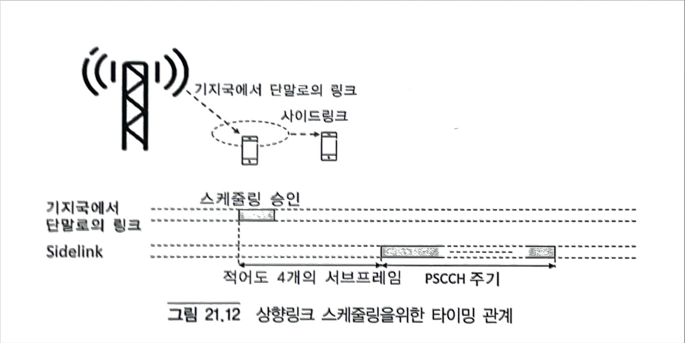

그림 21.12와 같이 사이드링크 스케줄링 승인은 스케줄링 승인이 도착한 후 적어도 네 개의 서브프레임 이후에 시작하는 다음 PSCCH 주기에 유효하다. 이는 일반적인 상향 링크(PUSCH) 전송과 같이, 스케줄링 승인으로부터 실제 스케줄링된 전송까지 동일한 양의 시간을 제공한다는 것에 유의한다.
사이드링크 통신을 위한 스케줄링 승인의 전송은 사이드링크 통신에 관련된 단말에 의해 네트웍에 제공되는 버퍼 상태 보고(BSR)의 도움을 받는다. 상향링크 버퍼 상태 보고와 마찬가지로 사이드링크 BSR은 MAC 제어 요소로 전달되며 단말에서 전송하려는 데이터의 양을 나타낸다.

#### 21.2.7 수신 자원풀
수신 자원풀은 단말이 사이드링크 통신에 관련된 전송을 수신할 것으로 예상할 수 있는 자원집합(서브프레임 및 자원 블록)을 나타낸다. 특히 수신 자원풀의 PSCCH 부분은 단말이 PSCCH 전송을 탐색해야 하는 자원 집합을 나타낸다. 또한 자원의 PSSCH 부분 역시 수신기가 SCI 내의 자원 정보를 적절하게 해석하는 데 필요하다.
단말이 복수 개의 수신풀로 설정되는 이유는 단말이 여러 단말로부터 사이드링크 통신을 수신할 수 있으며, 이러한 단말이 서로 다른 전송풀로 설정될 수 있기 때문이다. 이는 단말이 동일 셀 내에 있는지 또는 서로 다른 셀 내에 있는지에 상관없다. 원칙적으로 단말의 수신풀은 단말이 통신하고 있는 단말의 전송 자원풀의 합집합으로 설정되어야 한다고 말할 수 있다. 실제 이는 관련된 단말의 전송풀을 공동으로 커버하는 복수 개의 수신풀로 단말을 설정함으로써 실형된다.
사이드링크 통신에 대한 수신풀은 커버리지 내 단말에 대해서는 사이드링크 관련 시스템 정보(SIB18)로 제공되며 커버리지 외 단말에 대해서는 사전에 설정된다.

### 21.3 사이드링크 발견

사이드링크 발견(sidelink discovery)은 주변에 있는 단말에 의해 직접 탐지 ("발견")될 수 있는 짧은 고정 크기의 메시지를 반복적으로 방송하는 단말에 관한 것이다.
실제로 전달하고자 하는 메시지는 브로드캐스트 메시지에 명시적으로 포함되지 않는 것에 유의한다. 대신 브로드캐스트 메시지는 사용자 ID와 메시지 코드로 구성된다. 메시지 코드에서 실제 메시지로의 매핑은 네트웍 ProSe 기능에 의해 제공된다.
21.1.6절에서 설명한 바와 같이, 발견 메시지는 SL-DCH 전송 채널 상의 전송 블록의 형태로 전송되며, 이는 다시 PSDCH 물리 채널에 매핑된다. 따라서 사이드링크 통신과는 대조적으로 전송을 위한 별도의 물리 채널 상에 운반되는 관련 제어 정보를 갖는 PSCCH/PSSCH 구조가 없다.

- PSCCH와 유사하게 PSDCH payload(SL-DSCH 전송 블록)는 고정 크기 232비트이다.
- 수신 장치에서 PSDCH는 PSCCH와 유사하게 수신풀에서 "검색(search)＂ 하지만, PSSCH 수신을 위해서는 SCI에 의하여 정확한 자원을 통지 받는다.

#### 21.3.1 자원풀 및 전송 자원의 선택/할당
시간 영역에서 사이드링크 발견은 사이드링크 통신에 사용되는 PSCCH 주기와 비슷한 동일 크기의 발견 주기(discovery period)를 기반으로 한다.
사이드링크 통신과 유사하게 사이드링크 발견을 위해 단말은 발견 메시지(PSDCH) 전송에 이용 가능한 자원을 정의하는 하나 또는 다수의 자원풀이 설정된다. 사이드링크 발견의 경우 각 자원풀은 다음과 같이 설정된다.

- PSDCH 서브프레임 풀: 사이드링크 발견 전송을 위해 이용 가능한 서브프레임 집합을 정의
- PSDCH 자원 블록 풀: 서브프레임 풀 내에서 사이드링크 발견 전송에 이용 가능한 자원 블록 집합을 정의

PSDCH 서브프레임 풀은 PSCCH 서브프레임 풀과 유사하게 서브프레임 비트맵에 의해 제공된다. 그러나 비트맵이 PSCCH 서브프레임 풀을 직접 제공하는 반면 발견 서브프레임 풀은 서브프레임 비트맵의 주기적인 반복에 의해 제공된다.

사이드링크 발견 자원 블록 풀은 3개의 파라미터 S1, S2, M에 의해 정의된 두 개의 주파수 상 연속적인 자원 블록 집합으로 설정된다. 즉 PSCCH 자원 블록 풀과 동일한 구조이다.

사이드링크 통신과 유사하게 단말이 PSDCH 전송을 위한 자원을 할당받는지/선택하는지에 따라 두 가지 타입 또는 모드가 있다.

- 사이드링크 발견 타입 1의 경우 단말은 설정된 자원풀에서 발견 전송에 사용할 실제 자원 집합을 스스로 선택한다.
- 사이드링크 발견 타입 2B의 경우 단말은 RRC 시그널링을 통해 설정된 자원풀에서 발견 전송에 사용할 자원 집합을 명시적으로 할당받는다.

발견 타입 1은 RRC_IDLE 및 RRC_CONNECTED 상태 모두에서 단말이 사용할 수 있지만, 발견 타입 2B는 RRC_CONNECTED 상태에서만 가능하다.

발견 타입 2B에서는 발견 자원의 할당이 RRC 시그널링에 의해 행해진다는 것에 유의한다. 할당은 명시적으로 변경되기 전까지 유효하다. 이는 PDCCH/EPDCCH 상의 스케줄링 승인(DCI 포맷 5)에 의하여 전송 자원이 동적으로 할당되고 PSCCH 주기 동안만 유효한 사이드링크 통신 모드 1과는 대조적이다. 또한 사이드링크 통신의 경우에는 (RRC 시그널링에 의해) 자원풀이 우선 단말에 설정된 후에, PDCCH/EPDCCH 상의 DCI에 의해 사이드링크 전송에 사용할 특정 자원이 동적으로 할당되는 것에 대비하여, 사이드링크 발견은 자원풀의 설정과 발견 메시지 전송에 사용할 정확한 자원의 할당 사이드링크 설정의 일부로 공동으로 수행된다.

발견 타입 1의 경우, 즉 단말이 발견 전송에 사용할 정확한 자원 집합을 선택하는 경우 각 단말은 여러 개의 자원풀로 설정될 수 있으며, 각 자원풀은 특정 RSRP 범위와 연관된다. 여기서 RSRP는 기본적으로 특정 셀에 대한 경로 감쇄의 척도이다. 단말은 현재 셀에 대해 측정된 RSRP를 기반으로 발견 자원을 선택할 자원풀을 선택한다. 이는 현재 셀에 대한 경로 감쇄에 따라 즉, 간접적으로는 단른 셀의 거리에 따라 단말을 서로 겹치지 않는 자원풀로 분리할 수 있다.

#### 21.3.2 사이드링크 발견 전송

Discovery message(SL-DSCH 전송 블록)는 232비트의 고정 크기이다. SL-DCH에 대한 채널 코딩 및 변조는 상향링크(UL-SCH) 전송과 동일한 방식으로 이루어지며 다음의 단계로 구성된다.

- CRC 삽입
- 코드 블록 분할 및 코드 블록 당 CRC 삽입
- 코딩률 1/3 터보 코드
- Rate matching
- 사전에 정의된 Seed(510)을 사용한 비트 레벨 스크램블링
- 데이터 변조(QPSK만 지원)

그 다음, DFT-프리코딩이 적용되고 PSDCH 전송을 위해 선택/할당된 시간-주파수 자원으로 매핑된다.
각 SL-DCH 전송 블록은 Discovery Subframe pool 내에서 NRT+1 개의 서브프레임을 통해 전송되며 여기서 재전송 회수는 NRT는 네트웍에 의해 제공되는 설정의 일부이다.

각 서브프레임 내에서 자원 블록 풀 2개의 주파수 상 연속적인 자원 블록이 발견 전송을 위해 사용되며 자원 블록은 각 서브프레임마다 변한다.

#### 21.3.3 수신자원 풀
사이드링크 통신과 마찬가지로 사이드링크 발견에 대해서도 사이드링크 관련 시스템 정보의 일부(즉 발견의 경우 SIB19)이며 단말에 제공되는 공통의 수신 자원 풀 집합이 있다. 사이드링크 통신과 유사하게 사이드링크 발견 메시지를 수신하는 단말은 설정된 자원 풀 집합 내에서 PSDCH 전송을 찾는다.

### 21.4 사이드링크 동기화

사이드링크 동기화의 목적은 사이드링크 수신 및 송신을 위한 타이밍 기준을 제공하는 것이다.

일반적으로 커버리지 내 단말은 서빙 셀(RRC_CONNECTED 상태의 단말의 경우) 또는 단말이 캠핑 중인 셀(RRC_IDLE 상태의 단말의 경우)의 동기 신호(PSS+SSS)를 사이드링크 전송에 대한 타이밍 기준으로 사용해야 한다.

커버리지 이외의 단말은 다른 단말에 의해 전송된 특수한 SLSS로부터 전송 타이밍을 획득할 수 있다. 앞에서 SLSS를 전송한 단말은 커버리지 내에 있을 수 있으며, 이는 그 단말의 전송 타이밍 및 SLSS 전송 타이밍이 네트웍으로부터 직접 도출된다는 것을 의미한다. 그러나 그러한 단말들도 역시 커버리지 바깥에 있을 수 있으며 이는 그들의 전송 타이밍이 또 다른 단말의 SLSS 전송으로부터 도출되었거나 혹은 자율적으로 선택되었음을 의미한다.

사이드링크 송신을 위한 타이밍 기준으로서 SLSS를 선택하는 것은 LTE 규격에서는 동기화 기준 단말을 선택하는 것이나 SyncRef UE를 선택하는 것으로 언급된다.

'SyncRef UE'라고 부르긴 하지만 단말이 타이밍 기준으로 선택하는 것은 단말 자체가 아니라 수신된 SLSS임에 유의한다. 단순한 표현의 차이로 보일 수 있지만 중요한 차이점이다. 커버리지 외의 특정 클러스터 내에서 여러 단말이 동일한 SLSS를 전송할 수 있다. 따라서 타이밍 기준으로 SLSS를 사용하는 단말은 특정 단말의 SLSS 전송이 아니라 여러 단말에 해당하는 합쳐진 SLSS와 동기화된다.

SLSS는 커버리지 이외의 단말 및 커버리지 내 단말에 의하여 사이드링크 수신을 위한 타이밍 기준으로도 사용될 수 있다. 이러한 수신 타이밍 기준은 단말이 상이한 전송 타이밍 기준을 갖는 단말로써 다른 서빙 셀을 갖는 커버리지 내 단말로부터 발생하는 사이드링크 전송을 수신할 때 필요하다. 각 수신풀은 특정 동기화 설정, 즉 실제 특정한  SLSS과 연관된다. 특정 수신풀에 따라 사이드링크 전송을 수신할 때 단말은 해당 SLSS를 수신을 위한 타이밍 기준으로 사용해야 한다.

#### 21.4.1 사이드링크 ID 및 사이드링크 동기신호의 구조

서로 다른 셀 ID에 대응하는 셀 동기신호와 유사하게 SLSS는 Sidelink Identity(SLI)와 연관된다. 총 336개의 서로 다른 SLI가 두 개의 그룹으로 나뉘며 각 그룹에는 168개의 SLI가 있다.

- SLI 번호 0-167로 구성된 첫번째 그룹은 커버리지 내에 있거나 커버리지 이외에 있지만 커버리지 내에 있는 단말에 해당하는 SyncRef UE를 갖는 단말에 사용된다. 이를 커버리지 내 (in-coverage) 그룹으로 지칭한다.
- SLI 번호 168-335로 구성된 두번째 그룹은 커버리지 바깥의 단말을 SyncRef UE로 가지는 커버리지 바깥의 단말 혹은 아예 SyncRef UE가 없는 커버리지 바깥의 단말에서 사용된다. 이를 커버리지 이외의 (out-of-coverage) 그룹으로 지칭한다.

336 SLI를 SLI pair로 그룹화할 수 있다. 여기서 하나의 pair는 커버리지 내 그룹으로부터 하나의 SLI와 커버리지 이외의 그룹에 상응하는 SLI로 구성된다. 셀 동기신호와 비교하면, 각각 2개의 SLI를 가진 168개의 SLI pair는 각각 3개의 셀 ID로 구성된 168개의 셀 ID 그룹에 해당된다고 볼 수 있다.

셀 동기 신호와 마찬가지로 SLSS는 실제로 primary 사이드링크 동기신호 (P-SLSS)와 secondary 사이드링크 동기신호(S-SLSS) 두 요소로 구성된다.

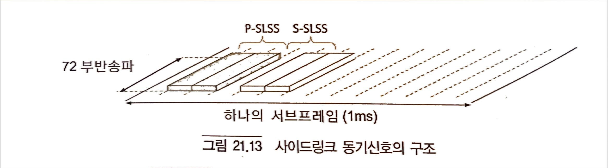

그림 21.13에서 설명한것처럼 P-SLSS는 서브프레임의 두번째 및 세번재 심볼 내에서 전송되는 2개의 OFDM 심볼로 구성되는 반면, S-SLSS는 다섯번째 및 여섯번째 심볼 내에서 전송되는 2개의 OFDM 심볼로 구성된다. 셀 동기신호와 유사하게 각 SLSS는 반송파 가운데 72개의 부반송파를 커버한다. 하향링크 반송파와 달리 사이드링크 반송파에는 전송되지 않는 DC 반송파가 없다.

두 개의 P-SLSS 심볼은 동일하며 PSS와 동일한 방식으로 생성된다. 3개의 다른 Zadoff-Chu(ZC) 시퀀스에서 파생된 3개의 서로 다른 PSS가 있다. (Zadoff-Chu 시퀀스는 복소수 집합으로 신호를 생성할 수 있는 수학 모델이다.) 각 PSS는 168개의 셀 ID 그룹 각각의 특정 셀 ID에 해당한다. 같은 방식으로 2개의 서로 다른 ZC 시퀀스(PSS의 ZC 시퀀스와는 다름)에서 파생된 2개의 서로 다른 P-SLSS가 있다. 이 2개의 서로 다른 P-SLSS는 각각 커버리지 내 그룹 및 커버리지 이외의 그룹의 SLI에 해당한다.

두 개의 S-SLSS 심볼도 동일하며 SSS와 동일한 방식으로 생성된다. 총 168개의 서로 다른 S-SLSS가 있으며, 이는 서로 다른 168개의 SLI pair에 해당된다.

SLSS는 매 40번째 서브프레임에 해당하는 특수한 SLSS 서브프레임에서만 전송될 수 있다. SLSS 서브프레임들의 정확한 집합은 SFN=0인 프레임의 첫번째 서브프렝미에 대하여 SLSS 서브프레임을 위치시키는 서브프레임 오프셋에 의해 주어진다. 커버리지 내 단말에 대한 서브프레임 오프셋은 사이드링크 관련 시스템 정보의 일부분으로 제공된다.(사이드링크 통신에 관련된 단말은 SIB18, 사이드링크 발견에 관련된 단말은 SIB19), 커버리지 이외의 단말에 대해서 두 개의 서로 다른 SLSS 서브프레임 집합에 해당하는 두 개의 오프셋이 있으며, 이는 사전에 설정되어 제공된다. 두 개의 오프셋을 제공하는 이유는, 커버리지 이외의 단말이 동일한 40ms 기간에 SLSS를 송신 및 수신할 수 있도록 하기 위해서이다.

SLSS는 SLSS 서브프레임에서만 전송될 수 있다. 그러나 단말이 반드시 모든 SLSS 서브프레임에서 SSS를 전송하는 것은 아니다. 어떤 SLSS 서브프레임에서 SLSS를 전송하는 지는 무엇이 SLSS 전송을 트리거하는지의 여부에 따라 다르며 또한 단말이 사이드링크 통신에 관여하는지 아니면 사이드링크 발견에 관여하는지 여부에 따라 다르다.

#### 21.4.2 SL-BCH 및 사이드링크 MIB

가능한 동기원(synchronization source)으로서 작동하는 단말, 즉 SLSS를 송신하는 단말은 PSBCH에 매핑된 SL-BCH을 송신할수도 있다. SL-BCH는 커버리지 외 단말이 사이드링크 연결을 설정하는데 필요한 사이드링크 MIB(SL-MIB)에 포함되는 몇가지 매우 기본적인 정보를 전달한다. 보다 구체적으로 SL-MIB는 다음의 정보를 전달한다.

- SL-MIB를 전송하는 단말이 가정한 반송파 대역폭에 대한 정보
- SL-MIB를 전송하는 단말이 가정한 TDD 설정에 대한 정보
- SL-BCH가 전송되는 프레임번호(SFN) 및 서브프레임 프레임 번소에 대한 정보. 이를 통해, 단말은 프레임/서브프레임 레벨에서도 서로 간에 동기화를 할 수 있다.
- 커버리지 내 지시자(In-Coverage Indicator): 이는 SL-BCH를 전송하는 단말이 네트웍 커버리지 내에 있는지의 여부를 나타낸다. 커버리지 내 지시자는 커버리지 외 단말이 SyncRef UE를 선택할 때 사용된다.

컨볼루션 코딩 및 변조(QPSK) 이후 PSBCH 는 SLSS 전송에 사용된 것과 동일한 서브프레임 및 자원 블록에서 전송된다.

커버리지 이외의 단말은 SLSS를 획득한 후 해당 SL-BCH를 디코딩하고 SL-MIB를 획득한다. SL-MIB 내의 커버리지 내 지시자에 기반하여, 단말은 획득된 SLSS를 동기화의 기준, 즉 SyncRef UE로서 사용할지를 결정한다. 이렇게 경정할 경우, 단말은 뒤따르는 사이드링크 전송에 대해서 나머지 SL-MIB 정보(반송파 대역폭, TDD 설정, SFN/서브프레임 번호)를 사용한다.

#### 21.4.3 SYNCREF UE 선택

커버리지 이외의 단말이 어떻게 SyncRef UE를 선택하는지, 즉 사이드링크 전송을 위한 타이밍 기준을 선택하는 방법에 잘 정의된 규칙이 있다 (그림 21.14)

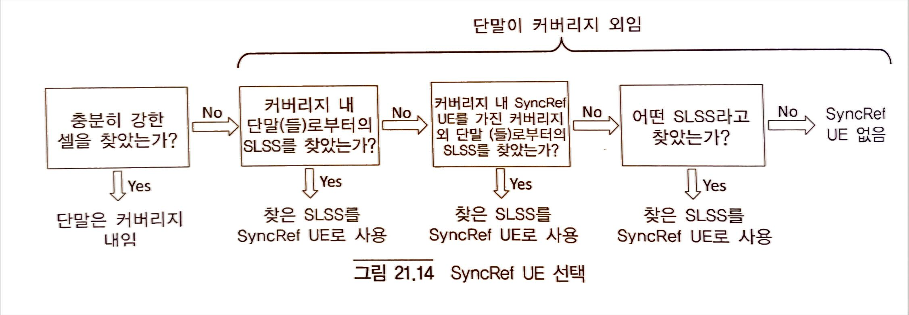

- 단말은 충분히 강한 셀이 발견되지 않으면 커버리지 외임을 의미하고, 먼저 그 네트웍 커버리지 내에 있는 단말에 해당하는 SLSS를 검색해야 한다. 충분히 강한 SLSS가 발견되면, 단말은 그 SLSS를 SyncRef UE로서 사용해야 한다.
- 그러한 SLSS가 발견되지 않는다. 대신 단말은 커버리지 외부 단말이지만 SyncRef UE로 커버리지 내의 단말을 가지고 있는 단말에 해당하는 SLSS를 검색해야 한다. 충분히 강한 SLSS가 발견되면 단말은 그 SLSS를 SyncRef UE로서 사용해야 한다.
- 그러한 SLSS가 발견되지 않는다면 단말은 어떤 SLSS라도 검색해야 한다. 충분히 강한 SLSS가 발견되면 단말은 그 SLSS를 SyncRef UE로서 사용해야 한다.
- 어떤 SLSS도 발견되지 않으면, 단말은 자율적으로 전송 타이밍을 결정한다. 즉, 이 단말은 SyncRef UE를 가지지 않는다.

이 절차는 단말이 다음 사항들을 결정할 수 있다고 가정한다.
- 발견된 SLSS가 네트웍 커버리지에 속하는 단말인지의 여부
- 발견된 SLSS가 커버리지 이외의 단말에 해당하지만 커버리지 내 SyncRef UE를 가지고 있는 지의 여부

이것은 SL-BCH 상의 커버리지 내 지시자 및 커버리지 이외의 단말이 자신의 사이드링크 ID(SLI)를 선택된 SyncRef UE의 SLI에 따라서 결정하는 규칙의 조합을 통해 가능하다.

#### 21.4.4 사이드링크 동기 신호의 전송

##### 21.4.4.1 커버리지 내 단말

커버리지 내 단말에 의한 SLSS 전송은 다음과 같이 서로 다른 방법으로 시작될 수 있다.
- RRC_CONNECTED 상태의 단말은 SLSS를 전송하도록 네트웍에 의해 명시적으로 설정될 수 있다.
- SLSS를 전송하도록 명시적으로 설정되지 않은 경우, SLSS의 전송은 현재 셀의 측정된 수신 신호 강도(RSRP)가 특정 임계값보다 낮으면 트리거될 수 있다. 해당 임계값은 사이드링크-특정 시스템 정보(사이드링크 통신에 대하여 SIB18 및 사이드링크 발견에 대하여 SIB19)에서 제공된다.

SLSS가 언제 어떻게 전송되는지는 어떻게 SLSS 전송이 트리거되었는지와 단말이 사이드링크 발견을 위해 설정되었거나 아니면 사이드링크 통신을 위해 설정되었는지 여부에 따라 다르다.

사이드링크 발견의 경우, SLSS 전송이 명시적으로 설정되거나 RSRP 측정에 의해 트리거되는지 여부에 관계없이 발견 메시지가 전송하려고 하는 서브프레임 풀의 첫번째 서브프레임과 가장 가까운 SLSS 서브프레임에서 단일 SLSS가 전송된다. Release 12의 사이드링크 발견은 오직 커버리지 내에서만 발생함에 유의한다. 따라서 사이드링크 발견과 관련된 단말에 의한 SLSS의 전송은 사이드링크 수신을 위한 타이밍 기준을 제공하기 위해서만 수행된다. 이는 Release 13에서 변경되었고 21.5.1절에서 다시 논의한다.

사이드링크 통신의 경우, SLSS 전송이 명시적으로 설정되면 실제 사이드링크 통신이 PSCCH 주기 내에서 수행되는지에 관계없이 단말은 매 SLSS 서브프레임에서 SLSS를 전송한다. 반면 RSRP 측정에 의해 SLSS 전송이 트리거되면 단말은 실제 사이드링크 통신이 수행될 PSCCH 주기 내에 포함된 SLSS 서브프레임에서만 SLSS를 전송할 것이다.

정확히 어떤 SLSS가 전송하는지 즉 SLI는 사이드링크 관련 시스템 정보로 제공된다.

##### 21.4.4.2 커버리지 이외의 단말

커버리지 외 단말은 선택된 SyncRef UE를 가지고 있지 않거나 선택된 SyncRef UE의 RSRP가 특정 임계값 아래인 경우 SLSS를 전송해야 한다. 이때, 임계값은 미리 설정된 정보로서 제공된다.

일반적으로 선택된 SyhncRef UE를 갖는 단말은 SyncRef UE와 동일한 SLI를 사용하거나 아니면 SLI pair 내에서 대응하는 값(SyhncREf UE의 SLI가 커버리지 내 그룹에 속해 있으면 커버리지 이외 그룹으로부터 상응하는 SLI)을 사용해야 한다.

또한 일반적으로 SLSS는 사전 설정의 일부로서 제공되는 2개의 서로 다른 SLSS 서브프레임 오프셋 중 하나를 가정하여 전송되어야 한다. 보다 구체적으로 단말은 전송된 SLSS가 수신된 SyncRef UE의 SLSS의 수신과 충돌하지 않도록 오프셋을 선택해야 한다.

SLI를 선택하고 SL-MIB의 커버리지 내 지시자를 설정하는 규칙은 다음과 같다.(표 21.1)

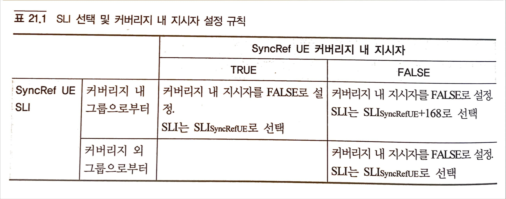

- 커버리지 내 지시자가  TRUE로 설정된 SyncREF UE를 가진 커버리지 이외 단말은 SyncRef UE SLI와 관계없이 SyncRef UE와 동일한 SLI를 사용하고, SL-MIB 내의 커버리지 내 지시자를 FALSE로 설정한다.
- 커버리지 내 지시자는 FALSE로 설정되고 커버리지 내 그룹으로부터 SLI를 가진 SyncRef UE를 가진 커버리지 이외의 단말은 커버리지 외 그룹으로부터의 상응하는 SLI(SLISyncRefUE+168)를 사용하고 SL-MIB 내의 커버리지 내 지시자를 FALSE로 설정한다.
- 커버리지 내 지시자는 FALSE로 설정되고 커버리지 외 그룹으로부터 SLI를 가진 SyhncRef UE를 가진 커버리지 외 단말은 SyncRef UE와 동일한 SLI를 사용하고 SL-MIB 내의 커버리지 내 지시자를 FALSE로 설정한다.

단말을 SyncRef UE의 커버리지 내 지시자와 SLI로부터 후보 SyncRef UE의 커버리지 내/외 상태를 결정할 수 있다 (그림 21.15)

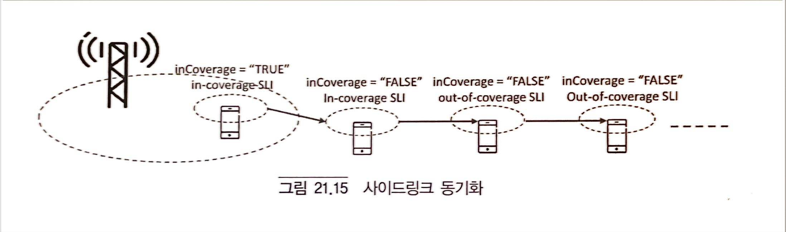

- 커버리지 내 지시자가 TRUE이면 후보 SyncRef UE는 SyncRef UE의 SLI에 관계없이 커버리지 내에 있다.
- 커버리지 내 지시자가 FALSE이고 SLI가 커버리지 내 그룹에서 온 경우 후보 SyncRef UE는 커버리지 외에 있지만 커버리지 내에 있는 SyncRef UE를 가지고 있다.
- 커버리지 내 지시자가 FALSE이고 SLI 커버리지 외 그룹에서 온 경우 후보 SyncRef UE는 커버리지 외에 있으며 커버리지 외에 있는 SyncRef UE를 가지고 있다.

### 21.5 LTE Release 13에서의 D2D의 확장

이전 절들에서의 초점은 Release 12의 LTE 사이드링크 기능이었다. 사이들이크 기능은 Release 13에서 아래의 주요 기능과 함께 더욱 확장되었다.
- 네트웍 커버리지 내에 있지 않은 단말에 대해서도 사이드링크 발견을 지원
- 단말을 통한 Layer-3 기반 relay를 통한 네트웍 커버리지 확장

#### 21.5.1 커버리지 외의 발견

Release 13의 커버리지 외의 발견은 공공안전 사용사례를 대상으로 한다. 비록 사이드링크 발견 타입 1만으로 제한되지만 Release 12 커버리지 내의 발견과 동일한 방식을 사용한다. 즉, 이 타입에서는 미리 설정된 자원풀에서 발견 메시지 전송에 사용할 자원을 단말이 자율적으로 선택한다.

커버리지 외의 발견은 SLSS(즉, 사이드링크 동기 채널) 및 SL-BCH와 사이들이크 MIB 전송에도 영향을 준다.

Release 12의 경우, 사이드링크 발견에 있어서 SLSS 전송의 유일한 작업은, 예를 들어 인접 셀들 내의 단말에 의한 사이드링크 발견 전송을 수신하기 위해 수신에 대한 타이밍 기준을 제공하는 것이었다. 결과적으로 사이드링크 발견에서는 SLSS는 실제 사이드링크 발견 전송과 직접 결합해야만 전송된다.

이는 SLSS가 커버리지 외의 단말에 대한 사이드링크 전송에 대한 타이밍 기준을 제공하는데에도 사용되는 사이드링크 통신과는 대조적이다. 따라서 사이들이크 통신을 위해 설정된 단말은 전송할 실제 데이터가 없는 경우에도 SLSS를 전송하도록 설정될 수 있다.

Release 13의 경우 사이들이크 발견을 위해 설정된 단말에도 동일한 능력이 적용될 수 있다. 또한 Release 13에서 사이드링크 발견을 위해 설정된 단말은 SL-MIB 정보를 제공하는 SL-BCH도 커버리지 외의 단말에 전송할 수 있다.

#### 21.5.2 Layer-3 Relay

Layer-3 relay의 도입은 이미 Release 12에서 도입된 사이드링크 통신 및 사이드링크 발견의 기능에 크게 의존하기 때문에 실제 무선 접속 규격에 거의 영향을 미치지 않는다.
Layer-3 relay로 기능할 수 있는 단말은 사이드링크 발견 메커니즘을 사용하여 이를 알린다. Relay의 D2D 링크는 사이드링크 통신 방식에 의존하는 반면 Relay 단말과 네트웍 사이의 통신은 일반적인 LTE 셀룰러 방식에 의존한다. 무선 규격에 대한 Layer-3 relay 기능의 유일한 영향은 Relay 단말을 설정하는 기능과 같은 RRC 기능이다.