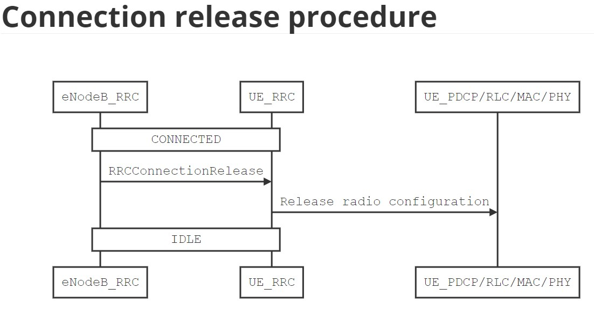

# Book: 5G LTE Narrowband Internet of Things (NB-IoT)
Writer: Hossam Fattah

## Chapter 3. Radio Resource Control Sublayer

### 3.2. Signalling and Data Radio Bearer
Signalling Radio Bearers (SRBs) are the Radio Bearers(RBs) that are used by UE for transmitting and receiving RRC messages with the eNodeB. For NB-IoT UE, only the following radio bearers are defined:
- SRB0: Used for carrying RRC signalling message during transmit and receive. It is used for the exchanging of the RRCConnectionRequest, RRCConnectionSetup, RRCConnectionResumeRequest, RRCConnectionReject, RRCConnectionReestablishmentRequest, and RRCConnectionReestablishment messages with eNodeB.
- SRB1bis: Established implicitly when establishing SRB1 after the UE receives the RRCConnectinoSetup. SRB1bis is the same as SRB1 except that it bypasses the PDCP layer. SRB1bis is used as long as security is not activated. If security is activated, SRB1bis is not used but only SRB1 is used.
- SRB1: Used for RRC signalling message transfer after the security is activated. SRB0 is used before Access Stratum(AS) security is activated and only SRB1 is supported after AS security is activated.
- DRB0 and DRB1: A maximum of two data radio bearers are used for exchanging data messages with the eNodeB. For a UE to support two DRBs, it must have its multi-DRB capability enabled; otherwise, UE supports only a single DRB.

### 3.3. RRC Modes of Operation

- (1): Power On / USIM inserted
- (2): RRCConnectionRequest / RRCConnectionSetup
- (3): RRCConnectionRelease

### 3.6. UE behavior in IDLE Mode

- (1): Power On / PLMN selected, No PLMN selected, USIM inserted, No USIM
- (2): No suitable cell found
- (3): Suitable cell found
- (4): Registration on selected PLMN is rejected
- (5): Srxlev <= SnonintrasearchP or Srxlev <= SintrasearchP
- (6): Suitable cell found
- (7): No suitable cell found
- (8): leaving IDLE state
- (9): Leaving CONNECTED state
-  Srxlev = Qrxlevmeas - Qrxlevmin
-  Qrxlevmeas: Measured cell Rx level value (RSRP) by UE
-  Qrxlevmin: Minimum required Rx level in the cell (dBm). Other values exist in SIB3-NB and SIB5-NB for intra- and inter-frequency Cell (Re)selection evaluation
-  SnonintrasearchP: Threshold Rx level value (RSRP) that triggers cell (Re)selection for Inter-frequency
-  SintrasearchP: Threshold Rx level value (RSRP) that triggers cell (Re)selection for Intra-frequency

### 3.7. RRC Procedures and Behavior in CONNECTED Mode

#### MIB-NB Parameters
|Parameter |Size(bits) |Meaning |
|:--       |:--        |:--     |
|systemFrameNumber-MSB |4 |4 most-significant bits of the 10 bits representing SFN |
|hyperSFN-LSB |2 |2 least significant bits of hyper SFN. The remaining bits are present in SIB1-NB |
|systemInfoValueTag |5 |A value that is incremented if any of the SIB contents have changed |
|schedulingInfoSIB1 |4 |An index value that is used to determine how SIB1-NB is scheduled |
|ab-Enabled |1 |If true, indicates that access barring to this eNodeB is enabled |
|operationModeInfo |7 |Determine whether the cell operates in one of the following mode: <ul><li>-**Inband (SamePCI)**: NB-IoT and LTE cell share the same physical cell ID</li><li>-**Inband (DifferentPCI)**: NB-IoT and LTE cell have different physical cell ID</li><li>-**Gaurdband**: a guardband deployment</li><li>-**Standalone**:a standalone deplyment</li></ul> |
|Spare |11 |For future extension |

#### SIB1-NB Parameters
|Parameter |Size(Bits) |Meaning |
|:--       |:--        |:--     |
|hyperSFN-MSB |8 |8 MSB of hyper-SFN. The 2 LSB are indicated in MIB-NB. This constructs a 10 bit Hyper SFN. Hyper-SFN is incremented by one when the SFN wraps around |
|plmn-IdentityList |List |A list of PLMN ID where this cell belongs to. PLMN ID consist of a 3-digit MCC(Mobile Country Code) and 2 or 3-digit MNC(Mobile Network Code) |
|trackingAreaCode |16 |A Tracking Area Code (TAC) that is common to all PLMNs in the list |
|cellIdentity |28 |A cell ID that is unique within a PLMN |
|cellBarred |1 |Whether this cell is barred or not |
|si-WindowLength |3 |Size of SI Window in milliseconds where only one SI is scheduled within the Window |
|si-TB |3 |Indicates transport block size, in bits, for each SI message |
|schedulingInfoList |List |A list that contains scheduling information about SIB2-NB to SIB22-NB |
|systemInfoValueTagList |List |A list of SystemInfoValueTagSI for each SIB that indicates if the corresponding SIB has its content changed by eNodeB |

#### Optional System Information Blocks
|System Information Block |Purpose |
|:--                      |:--     |
|SystemInformationBlockType2-NB (SIB2-NB) |Contains radio resource configuration for PDCP, RLC, MAC, and PHY sub-layers that are common for all UEs. It also contains information about the network support for CIoT optimization, random access and DRX power saving parameters. |
|SystemInformationBlockType3-NB (SIB3-NB) |Contains common cell (Re)selection information for intra- and inter-frequency cell (Re)selection other than for neighboring cells. |
|SystemInformationBlockType4-NB (SIB4-NB) |Contains neighboring cell related information relevant only for intra-frequency cell (Re)selection. |
|SystemInformationBlockType5-NB (SIB5-NB) |Contains neighboring cell related information relevant only for inter-frequency cell (Re)selection. |
|SystemInformationBlockType14-NB (SIB14-NB) |Contains Access Barring parameters |
|SystemInformationBlockType15-NB (SIB15-NB) |Used if UE supports MBMS. This SIB indicates MBMS Service Area Identities (SAI) of the current and neighboring carrier frequencies |
|SystemInformationBlockType16-NB (SIB16-NB) |Contains information related to GPS time and Coordinated Universal Time (UTC) |
|SystemInformationBlockType20-NB (SIB20-NB) | Used if UE supports MBMS. It contains information to acquire SC-MCCH |
|SystemInformationBlockType22-NB (SIB22-NB) | Used if UE supports Paging and RACH on non-anchor carriers |

#### RRC connection establishment

#### RRCConnectionRequest Message
|Parameter |Size(Bits) |Meaning |
|:--       |:--        |:--     |
|ue-Identity |40 |S-TMSI or 40 bits random value identification of the UE |
|establishmentCause |3 |Indicates type of access (Mobile terminated access, Mobile originating signalling, or data, or Exceptional data, Delay tolerant access) |
|multiToneSupport |1 |If presents, indicates that the UE supports UL multi-tone transmissions on NPUSCH |
|multiCarrierSupport |1 |If presents, indicates that the UE supports multi-carrier |

#### RRCConnectionSetup Message
|Parameter |Size(Bits) |Meaning |
|:--       |:--        |:--     |
|RadioResourceConfigDedicated |Variable |Includes all dedicated configurations for all sub-layers; PDCP, RLC, MAC, and PHY. contains also SRBs and DRBs to be established |

#### RRCConnectionSetupComplete Message
|Parameter |Size(Bits) |Meaning |
|:--       |:--        |:--     |
|s-TMSI |40 |Assigned S-TMSI of the UE |
|dedicatedInfoNAS |Variable |Carries NAS information piggybacked with this RRC message |
|up-CIoT-EPS-Optimization |1 |If presents, indicates if the UE supports User plan CIoT Optimization or S1-U data transfer |

#### Initial security activation

#### SecurityModeCommand Message
|Parameter |Size(Bits) |Meaning |
|:--       |:--        |:--     |
|cipheringAlgorithm |4 |Indicates cipher algorithm to be used for ciphering signalling and data RB |
|integrityProtAlgorithm |4 |Integrity algorithm to be used for protecting signalling RB |

#### RRC connection resume

#### RRCConnectionResumeRequest message
|Parameter |Size(Bits) |Meaning |
|:--       |:--        |:--     |
|resumeID |40 |An ID to identify the AS context of the UE |
|resumeCause |3 |Indicates type of access (Mobile terminated access, Mobile originating signalling, Data, Exception data, or Delay tolerant access) |
|shortResumeMAC-I |16 |MAC-I used to identify and verify the UE |

#### RRCConnectionResume Message
|Parameter |Size(Bits) |Meaning |
|:--       |:--        |:--     |
|RadioResourceConfigDedicated |Variable |Includes all dedicated configurations for all sub-layers: PDCP, RLC, MAC, and PHY. Contains also SRBs and DRBs to be resumed |

#### RRCConnectionResumeComplete Message
|Parameter |Size(Bits) |Meaning |
|:--       |:--        |:--     |
|selectedPLMNIdentity |3 |Indicates index of the PLMN selected by the UE from the plmnIdentityList included in SIB1-NB |
|dedicatedInfoNAS |Variable |Carries NAS information piggybacked with this RRC message |

#### RRC connection reconfiguration

#### RRCConnectionReconfiguration Message
|Parameter |Size(Bits) |Meaning |
|:--       |:--        |:--     |
|dedicatedInfoNAS |Variable |Carries NAS information piggybacked with this RRC message |
|RadioResourceConfigDedicated |Includes all dedicated configurations for all sub-layers: PDCP, RLC, MAC, and PHY. Contains also SRBs and DRBs to be reconfigured |

#### RRC connection re-establishment

#### RRCConnectionReestablishmentRequest Message
|Parameter |Size(Bits) |Meaning |
|:--       |:--        |:--     |
|ReestablishmentCause |2 |Indicates the failure cause that triggered the re-establishment procedure. Possible values are {reconfigurationFailure, otherFailure} |
|ue-Identity |S-TMSI |UE identity included to retrieve UE context and at the eNodeB to facilitate contention resolution by lower layers |

#### RRCConnectionReestablishment Message
|Parameter |Size(Bits) |Meaning |
|:--       |:--        |:--     |
|RadioResourceConfigDedicated |Variable |Includes all dedicated configurations for all sub-layers: PDCP, RLC, MAC, and PHY. It also contains SRB and DRB to be established |

#### RRC Connection release

#### RRCConnectionRelease Message
|Parameter |Size(Bits) |Meaning |
|:--       |:--        |:--     |
|releaseCause |2 |Indicates the reason for releasing the RRC connection. Possible values are {rrc-Suspend, other} |
|resumeIdentity |40 |An ID to identify the AS context of the UE |
|redirectedCarrierInfo | 24 |Indicates the carrier frequency and the offset where the UE can search for a suitable cell |

#### DL information transfer

#### DLInformationTransfer Message
|Parameter |Size(Bits) |Meaning |
|:--       |:--        |:--     |
|dedicatedInfoNAS |Variable |Carries NAS information piggybacked with this RRC message |

#### UL information transfer

#### ULInformationTransfer Message
|Parameter |Size(Bits) |Meaning |
|:--       |:--        |:--     |
|dedicatedInfoNAS |Variable |Carries NAS information piggybacked with this RRC message |

#### UE capability transfer

#### UECapabilityInformation Message
|Parameter |Size(Bits) |Meaning |
|:--       |:--        |:--     |
|accessStratumRelease |4 |Indicates the release of the protocol stack. Possible values are {rel13, rel14} |
|ue-Category-NB |1 |If present, defines UE category NB1 |
|multipleDRB |1 |If presents, indicates the UE supports multiple DRBs. This parameter is only applicable if the UE supports Data-plane CIoT EPS Optimization. If a UE supports multiple DRBs, the UE shall support two simultaneous DRBs |
|supportedROHCProfiles |7 |List of supported packet header compression (RoHC) profiles |
|multiTone |1 |If presents, indicates the UE supports UL multi-tone transmissions on NPUSCH |
|multiCarrierNPRACH |1 |If presents, indicates the UE supports NPRACH on non-anchor carrier |
|twoHARQProcesses-r14 |1 |If presents, indicates the UE supports two HARQ processes operation in the DL or UL |
|supportedBandList |List |Indicates the list of radio frequency bands supported by the UE |
|multiCarrierPaging |1 |If presents, indicates the UE supports paging on non-anchor carrier |

### 3.11. Power Saving Mode (PSM)

#### T3324 and T3412 extended timer information element
|Parameter |Size(Bits) |Meaning |
|:--       |:--        |:--     |
|Timer information element ID |8 |Timer Information ID |
|Length of timer contents |8 |Length of timer content of the timer information element |
|Unit |3 |Can be any of the follow for T3324 Timer: <ul><li>000 value is incremented in multiples of 2 seconds</li><li>001 value is incremented in multiples of 1 minute</li><li>010 value is incremented in multiples of decihours</li><li>111 value indicates that the timer is deactivated</li></ul> Can be any of the follow for T3412: <ul><li>000 value is incremented in multiples of 10 minutes</li><li>001 value is incremented in multiples of 1 hour</li><li>010 value is incremented in multiples of 10 hours</li><li>011 value is incremented in multiples of 2 seconds</li><li>100 value is incremented in multiples of 30 seconds</li><li>101 value is incremented in multiples of 1 minute</li><li>110 value is incremented in multiples of 320 hours</li><li>111 value indicates that the timer is deactivated</li></ul>|
|Timer Value |5 |Binary coded timer value |

## Chapter 4. Packet Data Convergence Protocol Sublayer
PDCP is a thin sublayer that is used for both control- and data-plane. Its main functionality is to provide integrity and security protections to control- and data-plane PDUs.

- Assigning a sequence number to the transmitted PDCP SDU and handling the sequence number of the received PDCP SDU.
- Header compression and decompression, using RoHC protocol, for upper layer packets (e.g., IP layer).
- Ciphering and deciphering of control- and data-plane PDUs.
- Integrity protection and verification for control-plane PDUs only.
- Re-ordering, in-order delivery, and duplicate detection of received SDUs before forwarding to upper layer.

### 4.1. PDCP Architecture

UE that only supports control-plane CIoT EPS optimization, as defined in [3GPP Std. 24.301](https://www.etsi.org/deliver/etsi_ts/124300_124399/124301/15.08.00_60/ts_124301v150800p.pdf), has its PDCP sublayer bypassed. For an NB-IoT UE that supports both control-plane CIoT EPS optimization and data-plane CIoT EPS optimization, as defined in [3GPP Std. 24.301](https://www.etsi.org/deliver/etsi_ts/124300_124399/124301/15.08.00_60/ts_124301v150800p.pdf), PDCP is also bypassed (i.e., not used) until AS security is activated.

### 4.2. RRC Configuration Parameters
|Parameter |Size(bits) |Meaning |
|:--       |:--        |:--     |
|esp-BearerIdentity |4 |Indicates the EPS bearer ID |
|drb-Identity |5 |Indicates the DRB ID used for each DRB established |
|cipheringAlgorithm |4 |Cipher algorithm to be used for ciphering signalling and data RB |
|integrity-ProtAlgorithm |4 |Integrity algorithm to be used for protecting signalling RB |
|discardTimer |3 |Indicates the discard timer in milliseconds. Possible values are {ms5120, ms10240, ms20480, ms40960, ms81920, infinity} |
|headerCompression |10 |If presents, indicates the packet header compression (RoHC) profile used with a PDCP entity. |

### 4.3. PDCP Entity
Figure 4.2 and 4.3 illustrate the structure for a PDCP entity that is used for either the control-plane or data-plane, respectively.

The PDCP PDU consists of the PDCP SDUand PDCP header as shown in Figure 4.4.

Figure 4.6 shows the PDCP data PDU format that carries data PDU. and Figure 4.7 shows a PDCP control PDU that contains a control PDU.

PDCP PDU header fields are summarized in below table.

|Field |Meaning |
|:--   |:--     |
|D/C |If 1, indicates data PDU; If 0, indicates control PDU. |
|SN |Indicates sequence number. It is 5 bits for SRB and 7 bits for DRB. |
|Type |If 001, indicates Interspersed RoHC feedback packet. |
|R |Reserved |

### 4.4. Ciphering and Deciphering
Ciphering and deciphering refers to the process of encrypting or decrypting the PDCP PDU. Ciphering is activated by RRC sublayer when receiving RRC SecurityModeCommand PDU. The parameters used for ciphering and deciphering include the following:
- KEY: Both the keys, KRRCenc and KUPenc, are driven by RRC and used for ciphering signalling or data-plane PDU, respectively. Keys are 128 bit long.
- BEARER: 5 bit bearer ID.
- COUNT: 32-value that is the concatenation of HFN and PDCP PDU SN.
- DIRECTION: 0 for uplink and 1 for downlink.

### 4.5. Integrity Protection and Verification
Integrity refers to the process of adding a hash value to the PDCP PDU to verify its integrity and detect any tampering with the PDU. Integrity is activated by RRC sublayer because of SecurityModeCommand procedure. The parameters used for integrity protection and verification includes the following:
- KEY: The key, KRRCint, that is driven by RRC and used for integrity protecting signalling PDU. Key is 128 bit long.
- BEARER: 5 bit bearer ID.
- COUNT: 32-value that is the concatenation of HFN and PDCP PDU SN.
- DIRECTION: 0 for uplink and 1 for downlink.

### 4.6. Header Compression and Decompression
Each PDCP entity supports header compression and decompression according to the RoHC framework. There are different compression algorithms or profiles depending on which protocols the network layer is using.
RRC sublayer configures the PDCP and each PDCP entity to which profile ID to be used for its header compression algorithm.
Header compression or decompression applies only to data-plane PDUs.

#### Table 4.3. Header Compression and Decompression Algorithms
|Profile ID |Transport/Network Layer Protocols |Reference |
|:--        |:--                               |:--       |
|0x0000 |No compression |RFC 5795 |
|0x0002 |UDP/IP         |RFC 3095, RFC 4815 |
|0x0003 |ESP/IP         |RFC 3095, RFC 4815 |
|0x0004 |IP             |RFC 3843, RFC 4815 |
|0x0006 |TCP/IP         |RFC 6846 |
|0x0102 |UDP/IP         |RFC 5225 |
|0x0103 |ESP/IP         |RFC 5225 |
|0x0104 |IP             |RFC 5225 |

### 4.7. PDCP Transmission
PDCP sublayer receives packets from upper layer (i.e., PDCP SDU), assigns an SN to it, integrity- and cipher-protecting those packets and forward them to RLC sublayer.

#### Table 4.4. State Variables Maintained by a PDCP Entity when Transmitting Data on Uplink
|State Variable |Initial Value |Meaning |
|:--            |:--           |:--     |
|Next_PDCP_TX_SN |0 |Indicates SN to be assigned to the next PDCP PDU to be transmitted for a given PDCP entity |
|TX_HFN | 0 |Indicates the HFN used for generation of the COUNT value for a given PDCP entity |

### 4.8. PDCP Reception
#### 4.8.1. Data radio bearer reception on downlink RLC AM
Each PDCP entity maintains a reordering Window which is always half of the SN space. The purpose of this reordering Window is to receive PDCP PDUs that falls within the window, and then to reorder them according to the COUNT value and deliver them in-order to upper layer. When a PDCP PDU is received that falls outside the window, it is discarded.

PDCP SN wraps around and if a received PDCP SN falls within the window, it will be further processed; otherwise, it is discarded. If the PDCP is not discarded, the RX_HFN and state variables are updated according to Figure 4.14.

##### Table 4.5. State Variables of a PDCP Entity for DRB Mapped to RLC AM
|State Variable |Initial Value |Meaning |
|:--            |:--           |:--     |
|Last_Submitted_PDCP_RX_SN |127 |The SN of PDCP PDU last submitted to upper layer (IP layer) for a given PDCP entity |
|Next_PDCP_RX_SN |0 |The SN of next expected PDCP PDU to be received for a given PDCP entity |
|PDCP SN |0 |The SN of PDCP PDU that is received for a given PDCP entity |
|RX_HFN |0 |HFN used for the generation of the COUNT value for the received PDCP PDU for a given PDCP entity |

#### 4.8.2. Data radio bearer reception on downlink RLC UM
DRB used with RLC UM are used for receiving multicast data and signalling PDUs on SC-MTCH or SC-MCCH, respectively. This is because RLC UM is only supported for SC-MCCH and SC-MTCH. PDCP entity mapped to RLC UM does not use reordering Window.

#### 4.8.3. Signalling radio bearer reception on downlink
Signalling PDUs reception on the downlink is shown in Figure 4.16 and does not have a reordering Window.

## Chapter 5. Radio Link Control Sublayer
RLC is an important sublayer in the LTE NB-IoT protocol stack. It is responsible for the reliable and guaranteed transfer of control- and data-plane PDUs to the receiver side. The RLS sublayer provides the following functionalities:
- Reliable transfer of RLC PDUs with the other peer.
- Flow control and error handling through ARQ.
- Segmentation or concatenation of RLC SDUs.
- Reassembly, reordering, or duplicate detection of received RLC PDUs.

### 5.1. RLC Architecture
Similar to the PDCP sublayer architecture, each signalling or data radio bearer has and is associated with a single RLC entity. A transmitter and a receiver both have a peer-to-peer RLC entity at each of them that is exchanging RLC PDUs. The payload of an RLC PDU is typically the PDCP or RRC PDU passed from or to PDCP or RRC sublayer, respectively.

RLC entity can be one of the three modes: Transparent Mode(TM), Unacknowledgement Mode(UM), or Acknowledgement Mode(AM). RLC entity of TM is an unidirectional entity which means that the entity is for one direction only, either transmitting (i.e., UL) or receiving (i.e., DL). RLC mode, Unacknowledged Mode(UM), is used only to receive multicast traffic. RLC UM is used for SC-MCCH and SC-MTCH traffic. RLC entity of an AM mode is bidirectional which means that the RLC entity is used for both transmitting and receiving.

### 5.2. RRC Configuration Parameters

### 5.3. RLC Entity
Remind The NB-IoT protocol stack.

#### 5.3.1. Transparent mode

#### 5.3.2. Unacknowledgement mode

RLC UM is used only by a UE for receiving multicast traffic on SC-MCCH and SC-MTCH. The multicast traffic is always flowing from eNodeB to UE, and thus, the UE acts always as a receiver and not as an RLC UM transmitter.

#### 5.3.3. Acknowledgement mode

An RLC PDU in this mode can be one of the four SDUs: a single RLC SDU, a concatenated RLC SDUs, a segment of an RLC SDU, or a segment of an RLC SDU segment [^NOTE_20210910_00].

If an RLC SDU is received from the PDCP sublayer, it is queued in the transmission buffer until a transmission opportunity is received from the MAC sublayer. The transmission opportunity can be of any size. That is, if the transmission opportunity is smaller than the queued RLC SDU, the RLC SDU is segmented and the RLC PDU segment is transmitted to the MAC sublayer. If the transmission opportunity is big enough to hold one or more RLC SDU, a single RLC SDU or a number of RLC SDUs concatenated together are transmitted in a single RLC PDU.

### 5.5. RLC Transmission and Reception
#### 5.5.1. RLC TM

#### 5.5.2. RLC UM
For the RLC receiver, in order to process RLC PDUs that can arrive out-of-order or are duplicates to previously received RLC PDUs, RLC employs a sliding window protocol. This sliding window is implemented as a reordering Window scheme in RLC UM.

##### Table 5.2. RLC UM State Variables

| State Variable | Usage | Initial Value | Meaning |
|:--             |:--    |:--            |:--      |
|UM_Window_Size |Window Size |0  |It is zero for SC-MCCH, SC-MTCH |
|VR(UH) |Highest received |0 |Indicates the value of the SN following the SN of the RLC PDU with the highest SN among received RLC PDUs, and it serves as the higher edge of the reordering window |
|VR(UR) |Receive |0 |Indicates the value of the SN of the earliest RLC PDU that is still considered for reordering |
|VR(UX) |t-Reordering |0 |Indicates the value of the SN following the SN of the RLC PDU which triggered t-Reordering |

Figure 5.8. explains the RLC UM receiver behavior. 

- All buffered RLC PDUs are reordered, striped from the RLC header, and delivered to PDCP sublayer in ascending order of the RLC PDU SN.
- If x equals to VR(UR), VR(UR) is set to the SN of the RLC PDU that has not been received yet. All buffered RLC PDUs, with SN < VR(UR), are reordered, striped from the RLC header, and delivered to PDCP sublayer.
- If VR(UH) is greater than VR(UR), VR(UX) is set equal to VR(UH), VR(UR) is set to the SN >= VR(UX), and all buffered RLC PDUs, with SN < VR(UR), are reordered, striped from RLC header, and delivered to PDCP sublayer.

#### 5.5.4. RLC AM transmitting side
RLC AM entity maintains a number of state variables for both transmitting and receiving operations as in Table 5.3.

##### Table 5.3. RLC AM State Variables for Transmitter
| State Variable | Usage | Initial Value | Meaning |
|:--             |:--    |:--            |:--      |
|AM_Window_Size |Window Size |512, 32768 |Determines the transmit window size, a lower edge of VT(A) and an upper edge equal to VT(MS) {"[VT(A) VT(MS)["}, where VT(MS)=VT(A) + AM window size |
|VT(A) |Acknowledgement |0 |Value of the SN of the next RLC PDU for which a positive ACK is to be received in-sequence. It serves as the lower edge of the transmitting window |
|VT(MS) |Maximum send |- |Set to VT(A)+AM_Window_Size, and it serves as the higher edge of the transmitting window |
|VT(S) |Send |0 |Value of the SN to be assigned for the next newly generated RLC PDU |
|POLL_SN |Poll send state |0 |Holds the value of VT(S)=1 upon the most recent transmission of an RLC data PDU with the poll bit set to 1 |

RLC AM entity uses a sliding window protocol in order to manage flow control, segmentation, reassembly, and in-order delivery. Both transmitter and receiver maintain a window of size AM_Window_Size.

When the RLC receives an indication from the MAC sublayer about an uplink opportunity to transmit uplink RLC PDU, RLC schedules RLC SDU(s) for transmission in the following strict order:
- RLC Control PDU.
- Retransmission of an RLC SDU from ReTransmission (ReTx) queue
- Transmission of an RLC SDU from Transmission (Tx) queue

The transmitter can receive the ARQ feedback from the receiver. That is, transmitter receives an ACK or NACK for its transmission in the form of a control RLC PDU called RLC STATUS PDU. The flow chart illustrating the receiver behavior when an RLC STATUS PDU is received is shown in Figure 5.13. If an RLC PDU with its SN PDU equal to VT(A) is positively ACKed by the receiver, the transmitter window, a lower edge of VT(A) and an upper edge equal to VT(MS), slides to a new value where VT(A) is set to the smallest SN of an RLC PDU that is yet to be ACKed.

#### 5.5.5. RLC AM retransmitting side
When an RLC PDU is transmitted, all its SDUs are moved to the Retransmission (ReTx) queue in case the receiver requests this RLC PDU to be re-transmitted. Each SDU can be retransmitted a limited number of times and if the number of retransmission exceeds this limit, the SDU is dropped from the ReTransmission(ReTx) queue and not transmitted any more. It is up to upper layer (TCP or IP) to detect such a PDU loss and requests the retransmission of the TCP/IP packet again.

#### 5.5.6. RLC AM transmitting side for polling RLC STATUS PDU
The transmit side can poll the receiver so that the latter can send an RLC STATUs PDU to the transmitter about which RLC PDU is being ACKed or NACKed. Transmitter can poll the receiver if any of the following conditions it met:
- If either the Transmission (Tx) or the ReTransmission (ReTx) queues will become empty after transmitting an RLC PDU.
- If the transmit window will be stalled after transmitting an RLC PDU and no more RLC PDU transmission is possible.

#### 5.5.7. RLC AM receive side
Table 5.4. shows the state variables used at RLC AM entity acting as a receiver.

##### Table 5.4. RLC AM State Variables for Receiver

| State Variable | Usage | Initial Value | Meaning |
|:--             |:--    |:--            |:--      |
|AM_Window_Size |Window size |512, 32768 |Determines the receive window size, a lower edge of VR(R) and an upper edge equal to VR(MR), where VR(MR)=VR(R)+AM window size |
|VR(R) |Receive |0 |Value of the SN following the last in-sequence completely received RLC PDU, and it serves as the lower edge of the receiving window |
|VR(MR) |Maximum acceptable receive |0 |Set to VR(R)+AM_Window_Size, and it holds the value of the SN of the first AMD PDU that is beyond the receiving window and serves as the higher edge of the receiving window |
|VR(H) |Highest received |0 |Value of the SN following the SN of the RLC PDU with the highest SN among received RLC data PDUs |
|VR(MS) |Maximum STATUS transmit |0 |Holds the highest possible value of the SN which can be indicated by ACK_SN when a STATUS PDU needs to be sent from Rx to Tx |
|VR(X) |t_Reordering |0 |Holds the value of the SN following the SN of the RLC data PDU which triggered t-Reordering |
|t-Reordering |Timer |0 |A timer value that when expired triggers reordering of received RLC PDU and delivering them to PDCP |

The receiving window and the state variables can be illustrated as in Figure 5.21. The receiving window can slide indicating the expected range of SNs to be received.

Figure 5.22 explains the RLC AM receiver behavior. A received RLC PDU, with SN=x, that has not been received before is stored in the reception (Rx) buffer. Upon storing the RLC in the reception (Rx) buffer, the state variables are first updated according to the following order:
- if x > VR(H), update VR(H) to x+1
- if x == VR(MS), update VR(MS) to the SN of the first RLC PDU, with SN > VR(MS) which has not been received yet. This also applies to received RLC PDU with SN=x if it is a segment.
- if x == VR(R), udpate VR(R) to the SN of the first RLC PDU, with SN > VR(R) which has not been received yet and update VR(MR) to VR(R)+AM_Window_Size. This also applies to received RLC PDU with SN=x if it is a segment. if VR(R) is updated, this slides the receiving window to a new position a lower edge of VR(R) and an upper edge equal to VR(MR)

#### 5.5.8. RLC STATUS PDU transmission by receive side
The receive side are due to generate and send an RLC STATUs PDU to the transmitter to inform the latter which RLC PDU is ACKed or NACKed. A receiver transmits RLC STATUs PDU to the transmitter either directly or after an amount of time if any of the following  condition is met:
- An RLC PDU with P field in its header is set to 1 and it falls outside the receiving window. If the RLC PDU falls in the receiving window, RLC STATUS PDU transmission is delayed until RLC PDU falls outside the receiving window.
- An RLC PDU is detected to be failed reception or if indicated by MAC sublayer. This is only applicable if the enableStatusReportSN-Gap flag is enabled.
- After a reception of an RLC PDU that creates a gap in the SN expected to be received (ie., indicates a missing RLC PDU). this condition occurs if VR(H) > VR(R).

#### 5.5.9. RLC SDU discard
The PDCP sublayer can request to discard an PDCP PDU or its RLC SDU. In such a case, the RLC can silently discard this RLC SDU if the SDU nor a segment of it has been transmitted yet to the receiver.

#### Table 5.5. RLC PDU Header Fields for UM and AM

| Field | Value | Meaning |
|:--    |:--    |:--      |
|D/C |0, 1 |Indicates whether the RLC PDU is an RLC data PDU or RLC control PDU (e.g., STATUS PDU) |
|RF |0, 1 |Re-segmentation Flag. Indicates whether the RLC PDU contains a single RLC SDU or a segment of an RLC SDU |
|P |0, 1 |Polling bit. If set, indicates that the transmitter requests an RLC STATUS PDU report from the receiver |
|FI |00, 01, 10, 11 |Framinf Info. Indicates whether an RLC SDU is segmented at beginning, middle, or end of RLC SDU: <ul><li>00: segment is exactly  the same as the RLC SDU</li><li>01:segment is the beginning segment of an RLC SDU</li><li>10: segment is the middle segment of an RLC SDU</li><li>11: segment is the end segment of an RLC SDU</li></ul> |
|E |0, 1|<ul><li>0: Data field follows RLC header</li><li>1: A set of E field and LI field follows RLC header</li></ul> |
|SN |[0-31], [0-1023], [0-65535] |Sequence Number. Indicates the SN of the corresponding RLC SDU. For UM, SN is 5 bits. For AM, SN is 10 bits or 16 bits. For an RLC SDU segment, the SN field indicates the SN of the original RLC SDU from which the RLC SDU segment was constructed from. |
|LI |[0-2047], [0-32767] |Length in bytes of the corresponding Payload field present in the RLC PDU. LI can be 11 bit for RLC UM or 15 bits for RLC AM |
|LSF |0, 1 |Last Segment Flag. Indicates whether this is the last segment of an RLC SDU or not |
|SO |[0-32767], [0-65535] |Segment Offset. Indicates the offset of a segment in bytes from the beginning of the original RLC SDU. SO can be 15 bits or 16 bits |
|CPT |000, 0001 |Control PDU Type indicates the type of the RLC control PDU (RLC STATUS PDU or others) |
|ACK_SN |[0-1023], [0-65535] |The SN of the next not received RLC PDU which is not reported as missing in the STATUS PDU |
|E1 |0, 1 |Extension bit 1. Indicates whether a set of NACK_SN, E1, and E2 follows or not |
|E2 |0, 1 |Extension bit 2. Indicates whether a set of SOstart, SOend follows the NACK_SN or not |
|NACK_SN |[0-1023], [0-65535] |Indicates the SN of the RLC PDU or a segment of RLC SDU that has been detected as lost at the receiver |
|SOstart |[0-32767], [0-65535] |The first byte of a segment of an RLC SDU with SN=NACK_SN that has been detected as lost at the receiver |
|SOend |[0-32767], [0-65535] |The last byte of a segment of an RLC SDU with SN=NACK_SN that has been detected as lost at the receiver |
