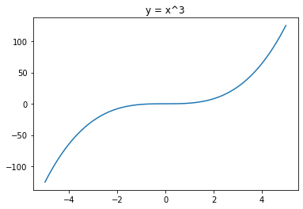

# book: 이해하는 미적분 수업The Calculus Story: A Mathematical Adventure

## 그림 5.5 몇 가지 기본적인 미분

- $\cfrac{d}{dx}(상수) = 0$

- $\cfrac{d}{dx}(x) = 1$

- $\cfrac{d}{dx}(x^2) = 2x$

- $\cfrac{d}{dx}(x^3) = 3x^2$

## 유용한 두 가지 미분 공식

- **공식 1:** $\cfrac{d}{dx}(u+v) = \cfrac{d}{dx}(u) + \cfrac{d}{dx}(v)$
- **공식 2:** 만약 c가 상수라면, $\cfrac{d}{dx}(cy) = c\cfrac{d}{dx}(y)$

## 라이프니츠 규칙

- 합의 미분

$$
\cfrac{d}{dx}(u+v) = \cfrac{du}{dx} + \cfrac{dv}{dx}
$$

- 곱의 미분

$$
\cfrac{\delta(uv)}{\delta x} = u\cfrac{\delta v}{\delta x} + v\cfrac{\delta u}{\delta x} + \cfrac{\delta u \delta v}{\delta x}
$$

- 비(ratio)의 미분

$$
\cfrac{d}{dx}(\cfrac{u}{v}) = \cfrac{v \cfrac{du}{dx} - u \cfrac{dv}{dx}}{v^2}
$$

## 최소 시간 문제

미적분학은 빛이 두 매질 사이의 경계면에서 굴절될 때, 빛이 주어진 두 점 사이의 가장 빠른 경로로 이동한다는 것을 보여준다. 아마도 몇몇 사람은 "도대체 빛은 어떻게 항상 가장 빠른 경로를 알 수 있는 것일까?"라고 궁금해할지도 모른다. 이 질문에 대해 물리학자인 리처드 파인먼Richard Feynman은 장난스럽지만 양자역학 전문가답게 다음과 같이 말했다. "빛이 어떻게 한 번에 알겠어? 모든 길을 다 가보고 가장 빠른 경로를 찾았겠지."

## 연쇄법칙chain rule

$$
\cfrac{dy}{dt} = \cfrac{dy}{dx}\cdot\cfrac{dx}{dt}
$$

연쇄법칙을 이용하면 복잡한 함수를 손쉽게 미분할 수 있다. 예를 들어 $y = (t^2 + 1)^3$ 을 t로 좀 더 쉽게 미분하려면, 우선 $t^2 + 1$ 을 x로 치환하여 주어진 식을 $y = x^3$ 으로 바꿔 쓴다. 그러면 $\cfrac{dy}{dx} = 3x^2$ 이고 $\cfrac{dx}{dt} = 2t$ 이므로 연쇄법칙에 따라 $\cfrac{dy}{dt} = \cfrac{dy}{dx}\cdot\cfrac{dx}{dt} = 3x^2 \cdot 2t = 3(t^2 + 1)^2 \cdot 2t = 6t(t^2 + 1)^2$ 을 얻을 수 있다.

## 적분

$$
\int x^n dx = \cfrac{x^{n+1}}{n+1}+c\quad (n \neq -1, \text{c는 상수})
$$

## 라이프니츠 무한급수 구하기

라이프니츠 급수의 우변에 있는 무한급수가 어떻게 나왔는지 여섯단계로 나누어 설명한다.

- 1단계. 다음 식을 미분한다.

$$
x = \cfrac{\sin{\theta}}{\cos{\theta}}
$$

삼각함수 미분법과 비의 미분 공식을 사용해 미분하면 다음과 같은 미분 결과를 얻을 수 있다.

$$
\cfrac{dx}{d\theta} = \cfrac{\cos{\theta}\cos{\theta}-\sin{\theta}(-\sin{\theta})}{(\cos{\theta})^2}
$$

- 2단계. 1단계의 미분 결과에서 우변을 $x=\cfrac{\sin{\theta}}{\cos{\theta}}$ 를 사용해 x에 관한 식으로 다음과 같이 나타낸다.

$$
\cfrac{dx}{d\theta} = 1 + x^2
$$

- 3단계. 2단계에서 구한 식을 연쇄 법칙을 사용해 다음과 같이 바꿔 쓴다.

$$
\cfrac{d\theta}{dx} = \cfrac{1}{1+x^2}
$$

1단계에서는 x가 $\theta$ 의 함수였으나 이제는 반대로 $\theta$ 를 x의 함수로 생각할 수 있다.

- 4단계. 10강에서 다루었던 무한급수에서 x를 $x^2$ 으로 바꾼 후 3단계에서 얻은 식에 적용하면 다음과 같은 식을 얻을 수 있다. (TODO: 이해가 안됨)

$$
\cfrac{d\theta}{dx} = 1 - x^2 + x^4 - x^6 + \cdots
$$

위의 식은 $x^2<1$ 일 때 성립한다.

- 5단계. 4단계에서 얻은 $1 - x^2 + x^4 - x^6 + \cdots$ 을 x로 적분하면, 다음과 같은 식을 얻을 수 있다.

$$
\theta = x - \cfrac{x^3}{3} + \cfrac{x^5}{5} - \cfrac{x^7}{7} + \cdots
$$

위 식에서 $\theta=0$ 이면 x는 0이므로 적분 상수는 0이다.

- 6단계. $\theta=\cfrac{\pi}{4}$ 면 x는 1이다. 5단계에서 얻은 식에 $\theta=\cfrac{\pi}{4}$ 와 x = 1 을 각각 대입하면, $\pi$ 와 홀수의 관계를 나타내는 라이프니츠 무한급수를 얻을 수 있다.

$$
\cfrac{\pi}{4} = 1 - \cfrac{1}{3} + \cfrac{1}{5} - \cfrac{1}{7} + \cdots
$$