# book: ARM Cortex-M3 definitive guide (Joseph Yiu)
ARM Cortex-M3 완벽가이드, 임희연 옮김

예전에 공부하며 OneNote에 정리했던 내용을 옮겨 적고, 이어서 공부하는 내용을 정리한다.

## chapter 01. 소개

### ARM Cortex-M3 프로세서란 무엇인가?
2006년 ARM에서 출시된 프로세서의 첫번째 Cortex 세대인 ARM Cortex-M3 프로세서는 기본적으로 32비트 마이크로프로세서 시장을 타깃으로 설계되었다. Cortex-M3 프로세서는 ARM7 프로세서의 성공 위에서, 프로그래밍과 디버깅은 더 쉽지만, 처리 능력은 더 향상되도록 만들어졌다. 또한 마이크로 컨트롤러 어플리케이션의 특정 요구사항을 만족시켜 주는 많은 특징들과 기술들을 소개하고 있다. 그 특징으로는 크리티컬한 태스크들을 위해 마스킹할 수 없는 인터럽트 지원, 높은 결정성을 갖는 중첩 벡터 인터럽트 지원, 단일 비트 조작 가능, 선택 가능한 메모리 보호 장치등을 들 수 있다.

### ARM 아키텍처 버전
- A 형 (ARMv7-A): 심비안, 리눅스, 윈도우 임베디드 등의 하이-엔드 임베디드 운영체제와 같은 복잡한 어플리케이션을 동작시켜야 하는 어플리케이션 프로세서. 이는 높은 전력 소모, 메모리 관리장치(MMU)를 지원하는 가상 메모리 시스템, 선택 가능한 진보된 자바 지원, 보안 프로그램 실행 환경을 필요로 한다. 제품 예로는 하이-엔드 모바일 폰과 금융 거래를 위한 전자 지갑 등이 있다.
- R 형 (ARMv7-R): 실시간 시장의 하이-엔드 제품을 기본으로 타겟팅하고 있는 실시간, 고성능 프로세서 – 이 시장에는 하이-엔드 브레이크 시스템과 하드 드라이브 컨트롤러와 같은 어플리케이션들이 있으며, 이 어플리케이션들은 낮은 전력 소모와 높은 신뢰성이 필수적이고, 낮은 지연 시간이 매우 중요시 된다.
- M형(ARMv7-M): 처리 효율이 중요하고 비용, 전력 소모, 낮은 인터럽트 지연시간, 사용의 편의성에 매우 크리티컬한 저가 어플리케이션과 실시간 제어 시스템을 포함한 산업 제어 어플리케이션들을 타겟으로 하는 프로세서들

## chapter 02. Cortex-M3의 개요

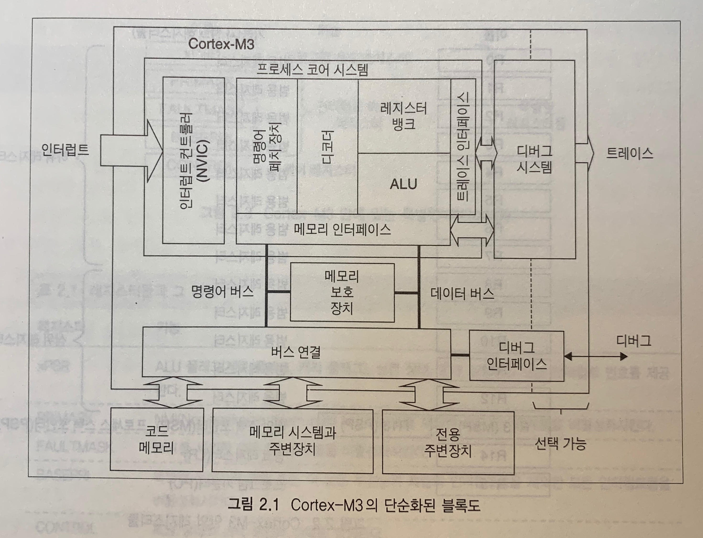

Cortex-M3는 32비트 마이크로 프로세서이다. 따라서 32비트의 데이터 경로와 32비트 레지스터 뱅크 그리고 32비트 메모리 인터페이스를 가지고 있다. 프로세서는 하버드 아키텍처를 갖는데, 이것은 분리된 명령어 버스와 데이터 버스를 가지고 있다는 것을 의미한다. 이 아키텍처에서는 명령어와 데이터에 동시에 접근하는 것이 가능하다. 이런 이유로 데이터 접근이 명령어 파이프라인에 영향을 주지 않기 때문에, 프로세서 성능이 향상된다. 하지만 실제적으로 명령어 버스와 데이터 버스는 동일한 메모리 공간(통합된 메모리 시스템)을 공유한다. 다시 말하면, 분리된 버스 인터페이스를 가지고 있기 때문에, 8GB 이상의 메모리 공간을 가질 수 없다.

### 레지스터

#### R0-R12: 범용 레지스터
R0에서 R12는 데이터 동작을 위한 32비트 범용 레지스터이다. 16비트 Thum 명령어들은 이 레지스터들의 일부(하위 레지스터, R0-R7)에만 접근할 수 있다.

#### R13: 스택 포인터
Cortex-M3는 두 개의 스택 포인터, R13을 포함하고 있다. 그것들은 한번에 하나만 보이도록 뱅크되어 있다.
- 메인 스택 포인터(MSP) : 디폴트 스택 포인터; OS 커널과 익셉션 핸들러에 의해 사용된다.
- 프로세스 스택 포인터(PSP) : 사용자 어플리케이션 코드에 의해 사용된다.
스택 포인터의 최하위 두 비트는 항상 0인데, 이는 그것들이 항상 워드 정렬되어 있다는 것을 의미한다.

#### R14: 링크 레지스터
서브 루틴이 호출될 때, 리턴 주소가 링크 레지스터에 저장된다.

#### R15: 프로그램 카운터
프로그램 카운터는 현재 프로그램의 주소이다. 이 레지스터는 프로그램 흐름을 제어하기 위해 쓰여질 수 있다.

#### 특별한 레지스터
- 프로그램 상태 레지스터 (PSR)
- 인터럽트 마스크 레지스터(PRIMASK, FAULTMASK, BASEPRI)
- 제어 레지스터(CONTROL)

이 레지스터들은 특별한 기능을 가지고 있으며 특별한 명령어들에 의해서만 접근될 수 있다.

### 동작모드

Cortex-M3 프로세서는 두 개의 모드와 두 개의 특권 레벨을 가지고 있다. 동작 모드(operation modes, 스레드 모드와 핸들러 모드)는 프로세서가 보통의 프로그램을 실행하고 있는지 아니면 인터럽트 핸들러나 시스템 익셉션 핸들러와 같은 익셉션 핸들러를 실행하고 있는지를 결정한다. 특권 레벨(privilege levels, 특권 레벨과 사용자 레벨)은 기본적인 보호 모델을 제공할 뿐만 아니라 크리티컬한 영역으로의 메모리 접근을 보호하기 위한 메커니즘을 제공한다.

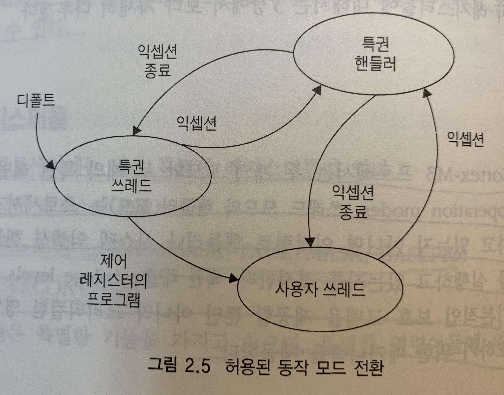

### 내장된 중첩 벡터 인터럽트 컨트롤러
Cortex-M3 프로세서는 중첩 벡터 인터럽트 컨트롤러(Nested Vectored Interrupt Controller: NVIC)라고 불리는 인터럽트 컨트롤러를 포함하고 있다. 이것은 프로세서 코어에 가까이 접해 있으며 많은 특징들을 제공하고 있다.

- 중첩 인터럽트 지원 : 인터럽트가 발생할 때, NVIC는 이 인터럽트의 우선순위와 현재 실행하고 있는 우선순위 레벨을 비교한다. 만약 새로운 인터럽트의 우선순위가 현재 레벨보다 높으면, 새로운 인터럽트의 인터럽트 핸들러는 현재 실행하고 있는 태스크보다 우선적으로 실행될 것이다.
- 벡터 인터럽트 지원 : 인터럽트가 받아들여지면, 인터럽트 서비스 루틴(ISR)의 시작 주소는 메모리의 벡터 테이블에 위치한다.
- 동적 우선순위 변경 지원 : 인터럽트들의 우선순위 레벨은 런타임 동안 소프트웨어에 의해 변경될 수 있다.
- 인터럽트 지연시간 감소 : 일부 레지스터 내용들을 자동으로 저장하고 복원하는 작업과 한 ISR에서 또 다른 ISR로 전환할 때 지연시간을 줄여주는 작업, 그리고 늦은 인터럽트 도착을 처리하는 작업이 있다.
- 인터럽트 마스킹 : 크리티컬한 태스크가 인터럽트 없이 제 시간 안에 완료될 수 잇도록 보장하기 위해 사용

### 메모리 맵
Cortex-M3는 미리 정의된 메모리 맵을 가지고 있다.

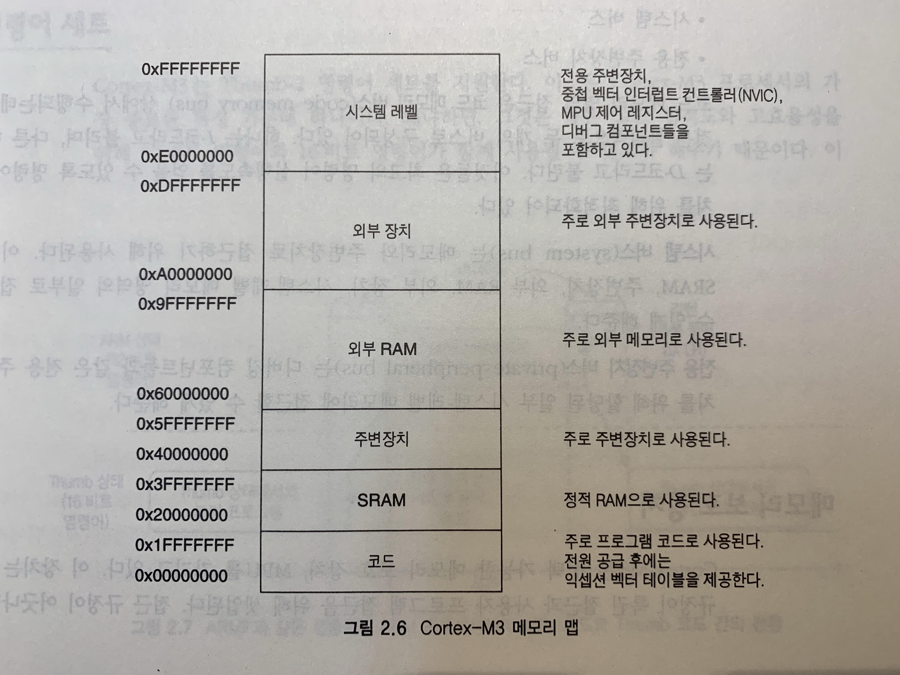

### 버스 인터페이스
- 코드 메모리 버스: 코드 메모리 영역을 접근하는데 이용. 물리적으로 두 개의 버스로 구성되어 있다. 하나는 I-코드라고 불리며, 다른 하나는 D-코드라고 불린다. 이것들은 최고의 명령어 실행속도를 얻기 위해 최적화 되어 있다.
- 시스템 버스 : 메모리와 주변장치로 접근하기 위해 사용된다.
- 전용 주변장치 버스 : 디버깅 컴포넌트들과 같은 전용 주변장치를 위해 할당된 일부 시스템-레벨 메모리에 접근할 수 있게 해준다.

### 메모리 보호 장치 (Memory Protection Unit)
이 장치는 접근 규정이 특권 접근과 사용자 프로그램 접근을 위해 셋업된다. 접근 규정이 어긋나면 결함 익셉션이 발생한다. MPU 특징은 선택 가능하며, 마이크로컨트롤러 또는 SoC 설계의 구현 단계에서 결정된다.

### 명령어 세트
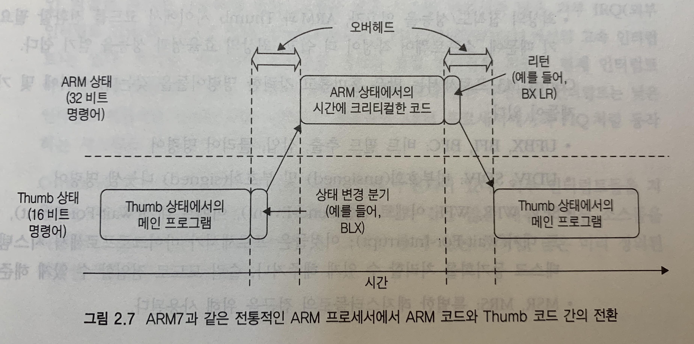

이전의 ARM 프로세서에서는 두 개의 동작 상태를 가지고 있었다. 32비트 ARM 상태와 16비트 Thumb 상태가 바로 그것이다. 두 개의 동작 상태로 인해 위의 그림과 같은 오버헤드가 발생하게 되었다. 그러나 ARM cortex-M3에서 도입된 Thumb-2 명령어 세트로 인해 두 상태의 전환이 불필요하게 되었다.

### 인터럽트와 익셉션
Cortex-M3에는 FIQ(ARM 7/9/10/11에서의 고속 인터럽트)는 없다. 하지만, 인터럽트 우선순위 처리와 중첩 인터럽트를 지원하고 전통적인 ARM 프로세서의 FIQ처럼 동작하는 시스템을 구성하기가 쉽다.

|익셉션 번호 | 익셉션 종류 | 우선순위 (프로그램 가능한 경우, 디폴트는 0) | 설명 |
|:-- |:-- |:-- |:-- |
|0   |N/A |N/A |어떤 익셉션도 실행되고 있지 않은 경우 |
|1   |리셋  |-3(최상위) |리셋 |
|2   |NMI |-2  |마스킹이 불가능한 인터럽트 (외부 NMI 입력) |
|3   |하드 결함   |-1  |모든 결함 조건, 그에 상응하는 결함 핸들러가 활성화 되어 있지 않은 경우|
|4   |MemManage |결함    |프로그래밍 가능    |메모리 관리 결함; MPU 침해 또는 허락되지 않은 위치로의 접근|
|5   |버스 결함   |프로그래밍 가능    |버스 오류(Prefetch Abort 또는 Data Abort)|
|6   |사용 결함   |프로그래밍 가능    |프로그램 오류로 인한 익셉션|
|7-10    |Reserved    |N/A |예약됨|
|11  |SVCall  |프로그래밍 가능    |시스템 서비스 호출|
|12  |디버그 모니터 |프로그래밍 가능    |시스템 장치를 위한 펜딩 가능한 요청|
|13  |Reserved    |N/A |예약됨|
|14  |PendSV  |프로그래밍 가능    |시스템 장치를 위한 펜딩 가능한 요청|
|15  |SYSTICK |프로그래밍 가능    |시스템 틱 타이머|
|16  |IRQ #0  |프로그래밍 가능    |외부 인터럽트 #0|
|17  |IRQ #1  |프로그래밍 가능    |외부 인터럽트 #1|
|…   |…   |…   |…|
|255 |IRQ #239    |프로그래밍 가능    |외부 인터럽트 #239|

외부 인터럽트 입력의 수는 칩 제조사에 의해 정의된다. 최대 240개의 외부 인터럽트 입력이 지원될 수 있다. 추가로 Cortex-M3는 NMI 입력을 갖는다. NMI 인터럽트가 발생하면, NMI 인터럽트 서비스 루틴이 무조건 실행된다.

## chapter 03. Cortex-M3 기본

### 레지스터

#### 범용 레지스터
- R0-R7: 하위 레지스터, 모든 16비트 thumb 명령어드로가 모든 32비트 thumb-2 명령어들에 의해 접근될 수 있다.
- R8-R12: 상위 레지스터, 모든 32비트 thumb-2 명령어들에 의해 접근 가능하지만, 모든 16비트 thumb 명령어에 의해서는 접근할 수 없다.

#### 스택 포인터 R13
- 메인 스택 포인터(MSP) 또는 SP_main: 기본 스택 포인터, OS 커널 익셉션 핸들러, 특권 접근을 요구하는 모든 어플리케이션 코드에 의해 사용된다.
- 프로세스 스택 포인터(PSP) 또는 SP_process: (익셉션 핸들러를 실행할 때가 아닌) 베이스 레벨 어플리케이션 코드에 의해 사용된다.

#### 링크 레지스터 R14
생략

#### 프로그램 카운터 R15
Cortex-M3 프로세서의 파이프라인 특성으로 인해 이 레지스터의 값은 실행하고 있는 명령어의 위치보다 4만큼 크다. 명령어 주소는 하프워드 정렬되어 있기 때문에, 프로그램 카운터를 읽은 값의 LSB(비트0)는 항상 0이다. 하지만 PC에 값을 쓰거나 분기 명령어를 사용하여 분기를 할 때, 타깃 주소의 LSB는 항상 1로 설정되어야 한다. 왜냐하면 그것은 Thumb 상태에서 동작하고 있다는 것을 가리키기 위해 사용되기 때문이다. 마약 LSB가 0이면, 그것은 ARM 상태로 전환하고자 한다는 것을 의미하는데, Cortex-M3에서는 결함 익셉션을 야기할 것이다. (ARM 상태는 지원 안하나? 안함. Thumb과 Thumb-2만 지원)

#### 특별한 레지스터

##### 프로그램 상태 레지스터

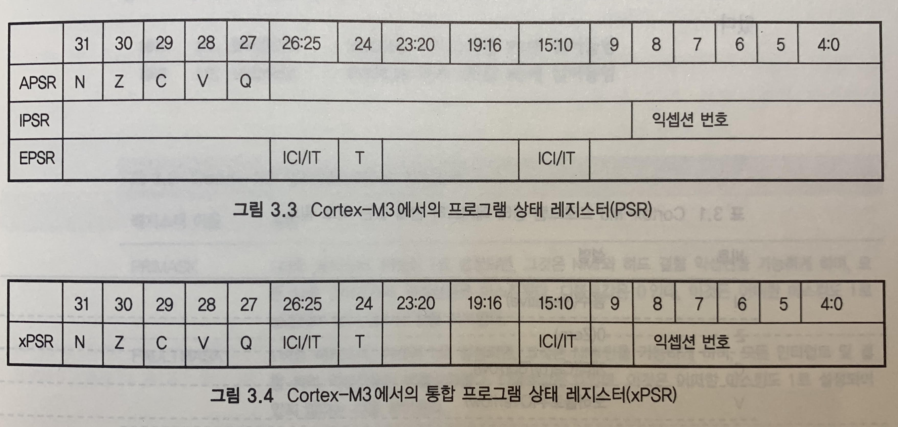

|비트  |설명|
|:-- |:-- |
|N   |음수(Negative)|
|Z   |0(Zero)|
|C   |캐리(Carry/Borrow)|
|V   |오버플로우(Overflow)|
|Q   |포화 플래그(Sticky Saturation Flag)|
|ICI/IT  |인터럽트-연속 가능한 명령어(ICI) 비트, IF-TEHN 명령어 상태 비트|
|T   |Thumb 상태, 항상 1이다; 이 비트를 0으로 클리어 하는 것은 결함 익셉션을 야기할 것이다.
익셉션 번호  프로세서가 어떤 익셉션을 처리하고 있는지를 가리킨다.|

##### PRIMASK, FAULTMASK, BASEPRI 레지스터
익셉션들을 비활성화 하기 위해 PRIMASK, FAULTMASK, BASEPRI 레지스터들이 사용된다. 사용자 접근 레벨에서는 설정될 수 없다.

|레지스터 이름 |설명|
|:-- |:-- |
|PRIMASK |1비트 레지스터. 이것이 1로 설정되면, 그것은 NMI와 하드 결함 익셉션을 가능하게 하며, 모든 다른 인터럽트와 익셉션들은 마스킹 된다. 디폴트 값은 0인데, 이것은 어떠한 마스킹도 1로 설정되더 있지 않다는 것을 의미한다.|
|FAULTMASK   |1비트 레지스터. 이것이 1로 설정되면, 그것은 NMI만을 가능하게 하며, 모든 인터럽트 및 결함 처리 익셉션들은 비활성화 된다. 디폴트 값은 0인데, 이것은 어떠한 마스킹도 1로 설정되어 있지 않다는 것을 의미한다.|
|BASEPRI | 9비트(우선순위 레벨을 위해 구현된 비트 대역에 따라 다르다)로 구성된 레지스터. 마스킹 우선순위 레벨을 정의한다. 1로 설정되면 동일한 우선순위나 그보다 낮은 우선순위의 모든 인터럽트들을 비활성화 한다. 더 높은 우선순위 인터럽트는 허용. 0으로 설정되면(디폴트) 마스킹 함수는 비활성화 된다.|

##### CONTROL 레지스터
CONTROL 레지스터는 특권 레벨과 스택 포인터 선택을 정의하기 위해 사용된다.
|비트  |기능|
|:-- |:-- |
|CONTROL[1]  |스택 상태: 1=대체 스택이 사용된다; 0=디폴트 스택(MSP)이 사용된다; 만약 그것이 쓰레도 또는 베이스 레벨 안에 있다면, 대체 스택은 PSP이다. 핸들러 모드를 위해서는 대체 스택이 없다. 그래서 프로세서가 핸들러 모드 안에 있을 때, 이 비트는 0이어야 한다.|
|CONTROL[0]  |0=쓰레드 모드 안에 있는 특권 상태; 1=쓰레드 모드 안에 있는 사용자 모드 상태; 만약 그것이 (쓰레드 모드가 아니라) 핸들러 모드 안에 있다면, 프로세서 특권 모드에서 동작한다.|

- CONTROL[1] 비트는 핸들러 모드 안에서 항상 0이다. 이 비트는 코더아 쓰레드 모드와 특권 레벨 안에 있을 때에만 쓰기가 가능하다.
- CONTROL[0]는 특권 상태에서만 쓰기가 가능하다. 사용자 모드 상태에서는 인터럽트를 발생시킨 다음에 익셉션 핸들러에서 이것을 변경하는 것이 유일한 방법이다.

#### 동작 모드
사용자 접근 레벨(쓰레드 모드)에서 시스템 제어 공간(System Control Space; 설정 레지스터와 디버깅 컴포넌트들을 위한 메모리 영역의 일부)으로의 접근은 차단된다. 그리고 APSR에 접근할 때를 제외하면 MSR과 같은 특별한 레지스터들로 접근하는 명령어는 사용될 수 없다.
특권 접근 레벨에서 CONTROL 레지스터를 사용하여 사용자 접근 레벨로 전환(CONTROL[1]=1)하고, 익셉션이 발생할 때 특권 상태로 전환할 수 있으며, 익셉션 핸들러가 종료되면 이전 상태로 돌아간다. 항상 특권 상태를 유지하려면 CONTROL[1]=0으로 셋팅한다.CONTROL[1]은 CONTROL 레지스터의 1번 비트

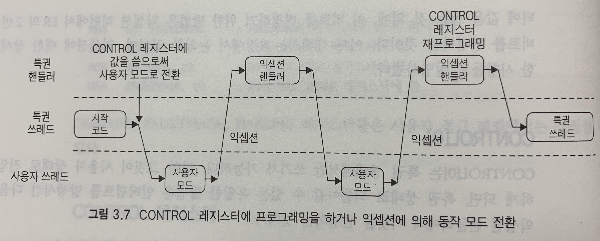

#### 익셉션과 인터럽트
Cortex-M3 마이크로컨트롤러에서의 인터럽트 입력의 수는 설계에 따라 다르나 일반적으로 16개 또는 32개를 쓴다.

#### 벡터 테이블
벡터 테이블은 익셉션 핸들러의 시작 주소를 결정하기 위해 사용된다. 리셋 후 벡터 테이블의 위치는 0x00000000이다.

##### 리셋 후 벡트 테이블 정의
|익셉션 종류  |주소 오프셋  |익셉션 벡터|
|:-- |:-- |:-- |
|18~255  |0x48~0x3FF  |IRQ #2~239|
|17  |0x44    |IRQ #1|
|16  |0x40    |IRQ #0|
|15  |0x3C    |SYSTICK|
|14  |0x38    |PendSV|
|13  |0x34    |예약됨|
|12  |0x30    |디버그 모니터|
|11  |0x2C    |SVC|
|7~10    |0x1C~0x28   |예약됨|
|6   |0x18    |사용 결함|
|5   |0x14    |Bus Fault|
|4   |0x10    |MemManage 결함|
|3   |0x0C    |하드 결함|
|2   |0x08    |NMI|
|1   |0x04    |리셋|
|0   |0x00    |MSP의 시작|

#### 스택 메모리 동작
스택 PUSH와 POP이 동작은 소프트웨어에 의해 실행 되기도 하고 익셉션/인터럽트 핸들러에 진입하거나 나올 때에 자동으로 수행되기도 한다.

##### 스택의 기본적인 동작
PUSH 명령은 레지스터의 값을 스택 메모리에 저장하고, POP 명령은 스택 TOP의 값을 레지스터로 읽어들인다. 이 때 스택 포인터 SP는 자동으로 변경된다. PUSH와 POP 명령어 쌍은 항상 동일한 개수여야만 한다.

##### Cortex-M3 스택 구현

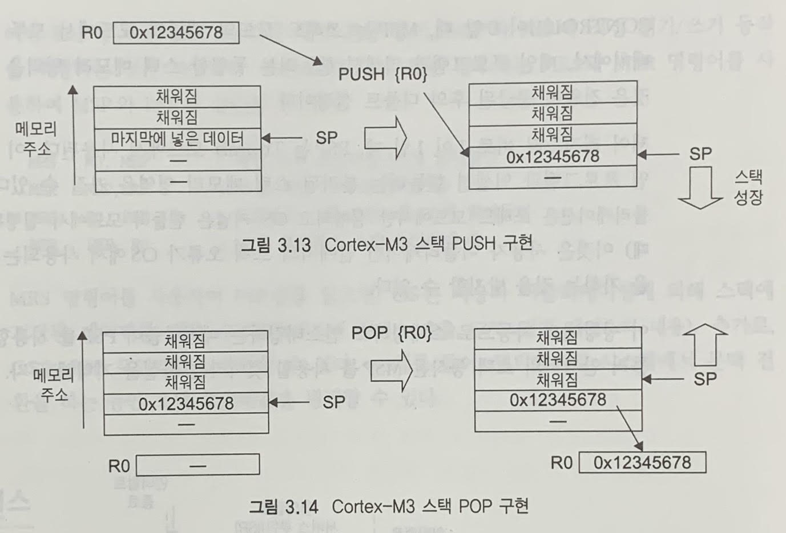

#### 리셋 시퀀스
프로세서가 리셋이 되면, 메모리에서 다음의 주소를 읽어들인다.
- 0x00000000: R13의 시작 주소(MSP)
- 0x00000004: 리셋 벡터(프로그램의 시작 주소), LSB는 항상 1(Cortex-M3는 Thumb 모드밖에 없으므로)

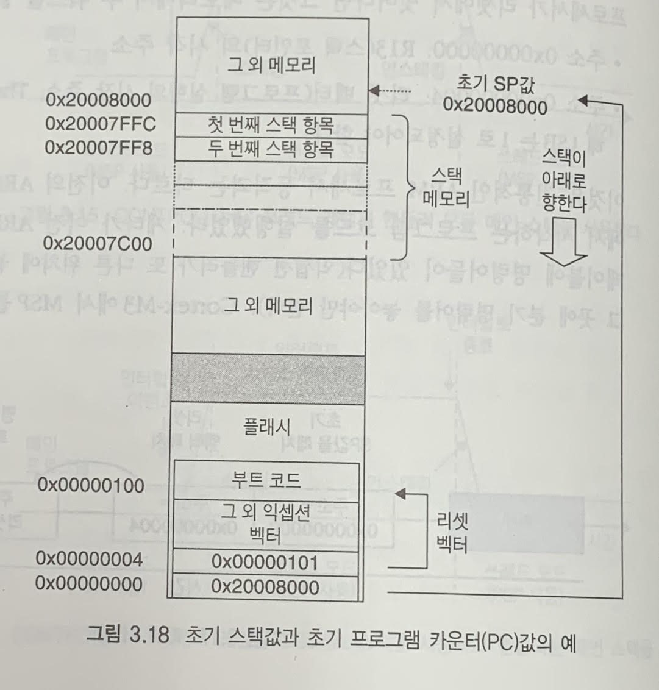

## chapter 04. 명령어 세트
### 어셈블리 기초

#### 어셈블리어: 기본적인 표기법
어셈블러 코드에서는 다음과 같은 명령어 형식이 일반적으로 사용된다.

```text
label
    opcode oprand1, oprand2, ... ; comments
```

여기서 label은 옵션이다. 명령어들의 주소가 라벨을 사용하여 지정될 수 있도록 어떤 명령어들은 그 맨 앞에 라벨을 갖는다. 그 다음에는 opcde가 나오고, 그 뒤에 많은 operand들이 나온다. 명령어의 operand 수와 데이터의 저장 방향성(source/destination)은 명령어의 종류에 따라 다르다. operand에 올 수 있는 데이터의 형식(레지스터, 상수 등)도 달라질 수 있다.
```text
    MOV R0, #0x12    ;R0 = 0x12로 설정
    MOV R1, #'A'     ;R1 = ASCII 문자 A로 설정
```
각 세미콜론(;) 뒤에 나오는 문자는 주석이다.
상수는 EQU를 사용하여 정의하여 사용할 수 있다.

```
NVIC_IRQ_SETEN0     EQU 0xE000E100
NVIC_IRQ0_ENABLE    EQU 0x1

    LDR R0, =NVIC_IRQ_SETEN0     ; R0에 PC로부터의 상대적 오프셋 값으로 표현된 NVIC_IRQ_SETEN0의 값이 
                                 ; 위치한 주소를 저장
    MOV R1, #NVIC_IRQ0_ENABLE    ; 0x1 상수 값을 R1에 저장
    STR R1, [R0]                 ; R1에 저장된 값을 R0의 값(주소)이 가르키는 메모리 위치에 저장, 
                                 ; 즉 0xE000E100 IRQ가 high가 됨
```

DCI는 명령어를 기계어로 직접 작성할 때 사용한다.
```
DCI 0xBE00    ; 브레이크 포인트 (BKPT 0), 16비트 명령어
```
코드 내에 상수를 정의하기 위해 바이트 크기의 상수는 DCB 명령어를 사용하고 워드 크기의 상수는 DCD를 사용한다.

```
    LDR R3, =MY_NUMBER        ; MY_NUMBER의 주소를 R3에 저장
    LDR R4, [R3]              ; R3가 가르키는 주소의 값을 R4에 저장
    LDR R0, =HELLO_TEXT       ; HELLO_TEXT의 주소를 R0에 저장
    BL PrintTest              ; R0를 첫번째 인수로 PrintTest 함수를 호출

MY_NUMBER
    DCD 0x12345678

HELLO_TEXT
    DCB "Hello\n", 0          ; null 문자로 종료되는 문자열
```

어셈브럴 표기법은 사용하고 있는 어셈블러에 따라 달라진다는 점을 기억해두자. 여기서는 ARM 어셈블러 형식이 소개되어 있다.

#### 어셈블러: 접미사의 사용
ARM 프로세서를 사용하는 어셈블러 명령어들은 다음의 접미사가 뒤에 붙을 수 있다.

|접미사 |설명|
|:-- |:-- |
|S   |APSR(플래그) 업데이트, 예를들면 다음과 같다.<br/>ADDS R0, R1    ; R0=R0+R1을 한 뒤 APSR 플래그를 업데이트|
|EQ, NE, LT, GT 등    |조건부 실행; EQ=Equal, NE=Not Equal, LT=Less Than, GT=Greater Than 등. 예를 들면 다음과 같다.<br/>BEQ <label>    ; APSR Z 플래그가 1(Equal)이면 label로 jump|

#### 어셈블리어: 통합된 어셈블리어
통합된 어셈블리어(Unified Assembler Language: UAL)는 16비트 명령어와 32비트 명령어들을 선택할 수 있도록 지원하여 ARM 코드와 Thumb 코드가 함께 포함된 어플리케이션 포팅을 쉽게 만들었다.

```
    ADD  R0, R1        ; R0=R0+R1, 전통적인 Thumb 표기법
    ADD  R0, R0, R1    ; UAL 표기법을 사용한 동일한 명령어
    ADDS R0, R0, R1    ; UAL 표기법이 사용되면 명령어가 플래그를 변경시킬지 아닐지는 S 접미사에 의존적이다
```

UAL에서는 접미사를 추가함으로써 원하는 명령어가 어떤 명령어인지를 규정할 수 있다.

```
    ADDS R0, #1 
    ADDS.N R0, #1    ;16비트 Thumb 명령어를 사용함 (N=narrow)
    ADDS.W R0, #1    ;32비트 Thumb-2 명령어를 사용함 (W=wide)
```

.W(wide) 접미사는 32비트 명령어를 의미한다. 만약 접미사가 없다면 어셈블러 툴은 둘 중 어떤 명령어든 선택할 수 있지만 보통은 코드 크기를 줄이기 위해 16비트 Thumb 명령어를 디폴트로 사용한다.
32비트 Thumb-2 명령어들은 하프워드(half word)로 정렬될 수 있다.

```
0x1000:    LDR r0, [r1]    ;16비트 명령어
0x1002:    RBIT.W r0       ;32비트 Thumb2 명령어
```

16비트 명령어의 대부분은 레지스터 R0에서 R7까지만 접근 가능하다. 32비트 명령어 Thumb-2 명령어에서는 이러한 제한이 없지만 어떤 명령어는 PC(R15)의 사용이 허락되지 않을 수 있다.

## chapter 05. 메모리 시스템

### 메모리 맵
Cortex-M3는 고정된 메모리 맵을 가지고 있어서 Cortext-M3 제품에서 다른 제품으로 소프트웨어를 쉽게 포팅할 수 있게 만들어준다.

Cortex-M3 프로세서는 전체 4GB의 주소 공간을 갖는다. 프로그램 코드는 코드 영역, SRAM 영역, 또는 외부 RAM 영역에 위치할 수 있다. 하지만, 여기서 코드 영역에 프로그램 코드를 넣는 것이 가장 좋다. 왜냐하면 두 개의 분리된 버스 인터페이스를 통해 명령어 페치와 데이터 접근을 동시에 수행할 수 있기 때문이다(?).

0.5GB의 다른 주소 범주 블록은 온-칩 주변장치에 할당된다. SRAM과 유사하게 이 영역은 비트-대역 앨리어스를 지원하며, 시스템 버스 인터페이스를 통해 접근된다. 하지만, 이 영역에서의 명령어 실행은 허용되지 않는다.

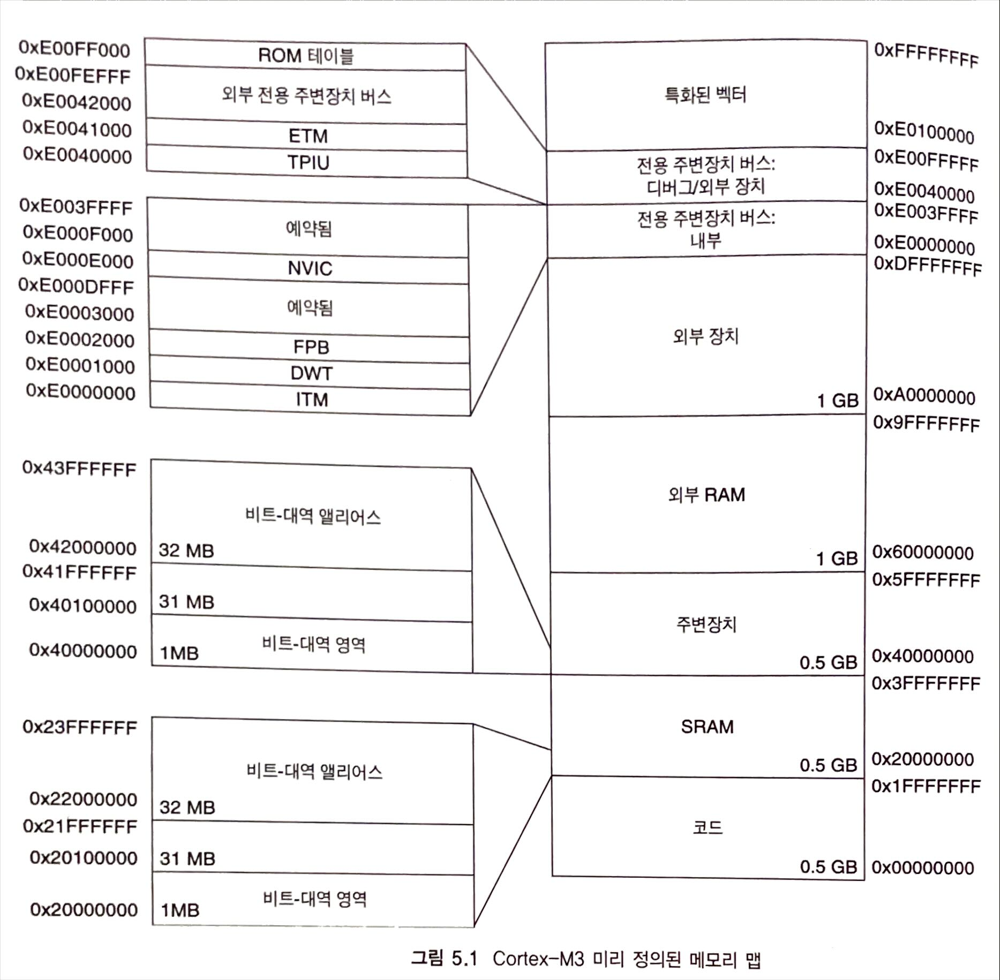

### 메모리 접근 속성
Cortex-M3 프로세서에서 찾아볼 수 있는 메모리 속성은 다음과 같다.
- 버퍼 가능
- 캐시 가능
- 실행 가능
- 공유 가능

각 영역에 대한 설명;
- 코드 메모리 영역: 이 영역은 실행 가능하며, 캐시 속성은 WT(Write Through)이다. 이 영역에는 데이터 메모리도 넣을 수 있다. 이 영역이 데이터 영역으로 사용된다면 데이터 버스 인터페이스를 통해 접근할 수 있다. 이 영역은 쓰기 버퍼 영역이다.
- SRAM 메모리 영역: 이 영역은 온-칩 RAM을 위해 만들어졌다. 이 영역은 쓰기 버퍼 영역이며 캐시 속성은 WB-WB(Write Back, Write Allocated)이다. 이 영역은 실행 가능하기 때문에 프로그램 코드를 쓰고 실행할 수 있다.
- 주변 장치 영역: 이 영역은 주변장치를 위해 만들어졌다. 캐시 불가능 영역이며, 이 영역에서는 명령어 코드를 실행할 수 있다.
- 외부 RAM 영역(0x60000000-0x7FFFFFFF): 이 영역은 온-칩 또는 오프-칩 메모리를 위해 만들어졌다. 캐시 가능 영역(*WB-WA*)이며, 이 영역에서는 코드를 실행할 수 있다.
- 외부 RAM 영역(0x80000000-0x9FFFFFFF): 이 영역은 온-칩 또는 오프-칩 메모리를 위해 만들어졌다. 캐시 가능 영역(*WT*)이며, 이 영역에서는 코드를 실행할 수 있다.
- 외부 장치(0xA0000000-0xBFFFFFFF): 이 영역은 순차적이면서 버퍼 기능이 없는 접근을 요구하는 외부 장치들과 공유 메모리를 위해 만들어졌다. 이 영역은 실행 불가능한 영역이다.
- 외부 장치(0xC0000000-0xDFFFFFFF): 이 영역은 순차적이면서 버퍼 기능이 없는 접근을 요구하는 외부 장치들과 공유 메모리를 위해 만들어졌다. 이 영역은 실행 불가능한 영역이다.
- 시스템 영역(0xE0000000-0xFFFFFFFF): 이 영역은 전용 주변장치와 특정 벤더 장치를 위해 만들어졌다. 캐시 불가능 영역이며, 전용 주변장치 버스 메모리 범위 하에서 순차적으로 접근이 이루어진다(캐시 불가능, 버퍼 불가능). 특정 벤더 메모리 영역을 위해서는 버퍼 가능하지만 캐시 불가능한 영역이다.

### 엔디안 모드
Cortex-M3에서는 프로세서가 리셋에서 나올 때 엔디안 모드가 설정된다. 엔디안 ㅗㅁ드는 그 이후에는 변경될 수 없다(동적 엔디안 전환은 없으면 SETEND 명령어는 지원되지 않는다). 데이터 접근은 설정 제어 메모리 공간(NVIC, FPB 등)과 외부 PPB 메모리 범위 안에서 이루어지기 때문에 명령어 페치는 항상 리틀 엔디안이다(0xE0000000-ExE00FFFFF까지의 메모리 공간은 항상 리틀 엔디안이다).

## chapter 06. Cortex-M3 구현 개요
### 파이프라인

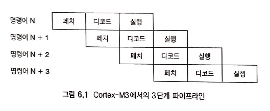

프로세서의 파이프라인 특성과 프로그램 코드가 Thumb 코드와 호환된다는 것을 보장하고 있기 때문에, 명령어 실행 동안 프로그램 카운터를 읽으면, 그 읽은 값은 주소에 4를 더한 값이 된다. 이 오프셋은 16비트 Thumb 명령어와 32비트 Thumb-2 명령어의 조합과 독립적인 상수이다. 이것으로 Thumb와 Thumb-2 사이의 일치를 보장한다.

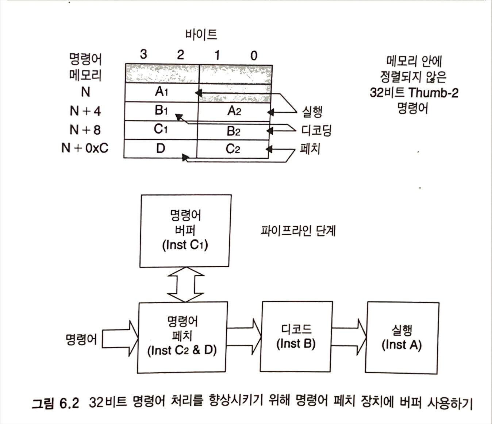

### 상세한 블록 다이어그램

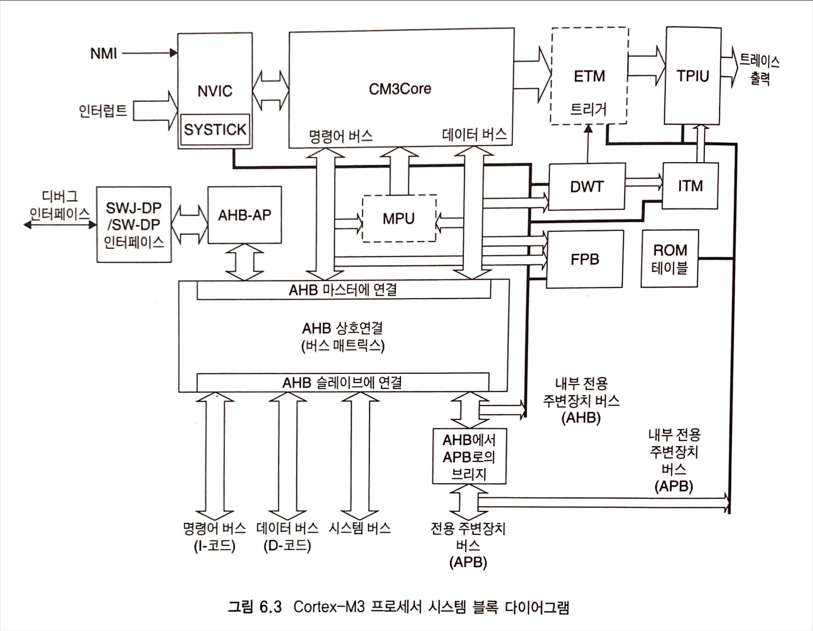

- CM3Core: Coretex-M3 프로세서의 중앙처리장치
- NVIC: 중첩 벡터 인터럽트 컨트롤러
- SYSTICK 타이머: 운영체제에 의해 사용될 수 있는 간단한 타이머
- MPU: 메모리 보호 장치(선택 가능)
- CM3BusMatrix: 내부 AHB 상호 연결
- AHB에서 APB: AHB에서 APB로 변환하기 위한 버스 브리지
- SW-DP/SWJ-DP 인터페이스: 시리얼-와이어/시리얼-와이어 JTAG 디버그 포트(DP) 인터페이스: 시리얼-와이어 프로토콜이나 전통적인 JTAG 프로토콜(SWJ-DP를 위한)을 사용하여 구현된 디버그 인터페이스 연결
- AHB-AP: AHB 접근 포트: 시리얼-와이어/SWJ 인터페이스로부터의 명령어를 AHB 전송으로 변환
- ETM: 임베디드 트레이스 매크로셀: 디버깅을 위해 명령어 트레이스를 처리하는 모듈
- DWT: 데이터 와치포인트 및 트레이스 장치: 디버그를 위해 데이터 와치포인트 기능을 처리하는 모듈
- ITM: 인스트루먼트 트레이스 매크로셀
- TPIU: 트레이스 포트 인터페이스 장치: 디버그 데이터를 외부 트레이스 캡쳐 하드웨어로 전송하기 위한 인터페이스 블록
- FPB: 플래시 패치 및 브레이크 포인트 장치
- ROM 테이블: 설정 정보를 저장하는 작은 룩업 테이블

### 외부 전용 주변장치 버스

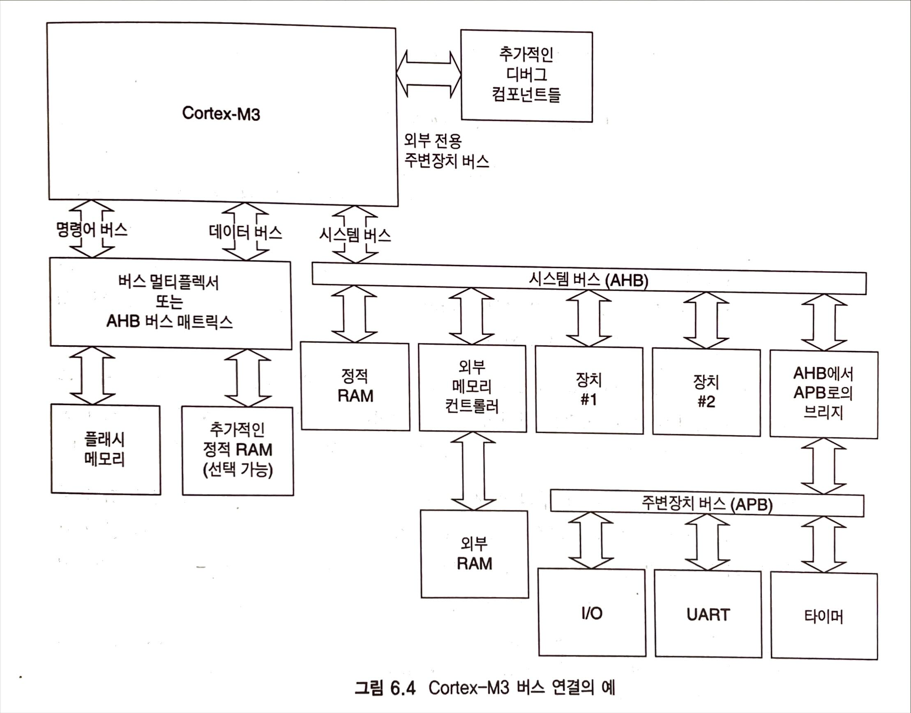

### 리셋 신호

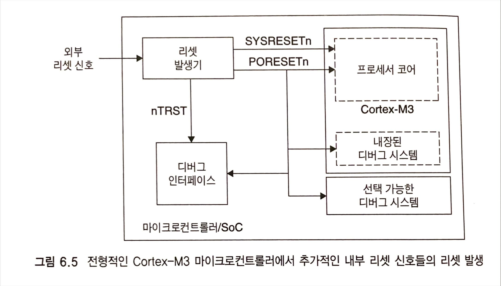

- 파워 온 리셋(PORESETn): 소자에 전원이 인가되었을 때 발생하는 리셋. 프로세서 코어와 디버깅 시스템 모두를 리셋한다
- 시스템 리셋(SYSRESETn): 시스템 리셋. 프로세서 코어, NVIC(디버그 제어 레지스터 제외), MPU에 영향을 주지만, 디버깅 시스템에는 영향을 주지 않는다.
- 테스트 리셋(nTRST): 디버깅 시스템을 리셋한다.

# chapter 07. 익셉션

### 익셉션 유형

#### 시스템 익셉션
|익셉션 번호  |익셉션 유형  |우선순위    |설명|
|:-- |:-- |:-- |:-- |
|1   |리셋  |-3(최상위) |리셋|
|2   |NMI |-2  |마스킹이 불가능한 인터럽트(외부 NMI 입력)|
|3   |하드 결함   |-1  |모든 결함 조건, 만약 그에 상응하는 결함 핸들러가 활성화되어 있지 않은 경우|
|4   |MemManage 결함    |프로그램 가능 |메모리 관리 결함, MPU 침해 또는 허용되지 않은 위치로의 접근|
|5   |버스 결함   |프로그램 가능 |버스 오류, AHB 인터페이스가 버스 슬레이브로부터 오류 반응을 얻을 때 발생(만약 명령어 페치인 경우, prefetch abort이라고 불리며, 데이터 접근인 경우 data abort이라고 불린다)|
|6   |사용 결함   |프로그램 가능 |프로그램 오류 또는 코프로세서로의 접근을 시도할 때 발생하는 익셉션(Cortex-M3는 코프로세서를 지원하지 않는다)|
|7-10    |reserved    |N/A |-|
|11  |SVCall  |프로그램 가능 |시스템 서비스 호출|
|12  |디버그 모니터 |프로그램 가능 |디버그 모니터(브레이크 포인트, 와치 포인트 또는 외부 디버그 요청)|
|13  |reserved    |N/A |-|
|14  |PendSV  |프로그램 가능 |시스템 장치를 위한 펜딩 가능한 요청|
|15  |SYSTICK |프로그램 가능 |시스템 틱 타이머|

#### 외부 인터럽트 리스트
|익셉션 번호  |익셉션 유형  |우선순위|
|:-- |:-- |:-- |
|16  |외부 인터럽트 #0  |프로그램 가능|
|17  |외부 인터럽트 #1  |프로그램 가능|
|... |... |...|
|255 |외부 인터럽트 #239    |프로그램 가능|

현재 실행되는 익셉션의 값은 특별한 레지스터 IPSR 또는 NVIC로의 인터럽트 제어 상태 레지스터(VECTACTIVE 필드)에서 규정할 수 있다. 여기서 인터럽트 번호(예를 들어 인터럽트 #0)는 Cortex-M3 NVIC로의 인터럽트 입력을 가리킨다. 실제 SoC에서는 외부 인터럽트 입력 핀 번호가 NVIC 상의 인터럽트 입력 번호와 일치하지 않을 수도 있다. 예를 들어, 처음 몇 개의 인터럽트 입력들 중 일부는 내부 주변장치로 할당될 수 있다.

#### 어플리케이션 인터럽트 및 리셋 제어 레지스터(주소 0xE000ED0C)
|비트  |이름  |종류  |리셋 값    |설명|
|:-- |:-- |:-- |:-- |:-- |
|31:16   |VECTKEY |R/W |-   |접근 키, 이 레지스터에 값을 쓰기 위해서는 0x05FA가 이 필드에 쓰여져야 한다. 그렇지 않으면 그 쓰기는 무시될 것이다. 상위 절반 워드를 읽으면 그 값은 0xFA05가 된다.|
|15  |ENDIANNESS  |R   |-   |데이터를 위한 엔디안을 가리킨다. 빅 엔디안(BE8)을 위해서는 1이, 리틀 엔디안을 위해서는 0이 된다. 이것은 오직 리셋 후에만 변경될 수 있다.|
|10:8    |PRIGROUP    |R/W |0   |우선 순위 그룹|
|2   |SYSRESETREQ |W   |-   |리셋을 발생시키기 위해 칩 제어 로직을 요청한다.|
|1   |VECTCLRACTIVE   |W   |-   |익셉션을 위해 모든 활성화 상태 정보를 0으로 클리어 한다. 보통은 시스템 오류로부터 시스템이 복원될 수 있도록 디버그 또는 OS에서 사용된다(리셋이 더 안전하다).|
|0   |VECTRESET   |W   |-   |(디버그 로직 외에) Cortex-M3 프로세서를 리셋한다. 하지만 이것은 프로세서 밖의 회로들은 리셋하지 않을 것이다.|

인터럽트들에 대한 예기치 못한 우선순위 레벨 변화를 피하기 위해. 어플리케이션 인터럽트 및 리셋 제어 레지스터에 값을 쓸 때에는 주의를 기울여야 한다. 대부분의 경우 우선순위 그룹이 설정된 이후 리셋을 발생시킬 때를 제외하고 이 레지스터를 사용할 필요가 없다.

### 벡터 테이블
익셉션이 발생하여 Cortex-M3에 의해 처리될 때 프로세서는 익셉션 핸들러의 시작 주소를 알아야 한다. 이 정보는 벡터 테이블 안에 저장된다. 디폴트로 벡터 테이블은 주소 0x00000000에서 시작되며 익셉션 번호의 4배씩 벡터 주소가 배정된다.

|주소  |익셉션 번호  |값(워드 크기)|
|:-- |:-- |:-- |
|0x00000000  |-   |MSP 초기값|
|0x00000004  |1   |리셋 벡터(프로그램 카운터 초기값)|
|0x00000008  |2   |NMI 핸들러 시작 주소|
|0x0000000C  |3   |하드 결함 핸들러 시작 주소|
|... |... |다른 핸들러 시작 주소|

동작 중에 벡터 테이블 핸들러를 변경할 수 있도록 하기 위해 RAM이 위치한 RAM 영역 또는 코드 내의 다른 메모리 위치로 재배치 될 수 있다. 이것은 벡터 테이블 오프셋 레지스터(주소 0xE000ED08)라고 불리는 NVIC 안의 레지스터를 설정함으로써 수행된다. 그 주소 오프셋은 벡터 테이블 크기로 정렬되어야 하며, 2의 승스로 확장되어야 한다. 예를 들어 32개의 IRQ 입력이 있다면 익셉션의 전체 수는 32+16(시스템 익셉션) = 48개가 될 것이다. 그것을 2의 승수로 확대하면 64가 될 것이다. 그것에 4를 곱하면 256(0x100)이 된다. 그러므로 벡터 테이블 오프셋은 0x0, 0x100, 0x200 등으로 프로그래밍 될 수 있다.

#### 벡터 테이블 오프셋 레지스터 (주소 0xE000ED08)
|비트  |이름  |종류  |리셋 값    |설명|
|:-- |:-- |:-- |:-- |:-- |
|29  |TBLBASE |R/W |0   |코드(0) 또는 RAM(1) 안에 있는 테이블 베이스|
|28:7    |TBLOFF  |R/W |0   |코드 영역 또는 RAM 영역에서의 테이블 오프셋 값|

### 결함 익셉션
#### 버스 결함
- 명령어 페치, 보통 prefetch abort이라고 불린다.
- 데이터 읽기/쓰기, 보통 data abort이라고 불린다.
- 인터럽트 처리 전에 스택 push, 스태킹 오류(stacking error)라고 불린다.
- 인터럽트 처리 끝에서 스택 pop, 언스태킹 오류(unstacking erro)라고 불린다.
- 프로세서가 인터럽트 처리 과정을 시작할 때 인터럽트 벡터 주소(벡터 페치)를 읽는 동안 발생한다.

이런 종류의 버스 결함이 발생할 때, 만약 버스 결함 핸들러가 활성화 되어 있고, 동일하거나 더 높은 우선순위를 가진 다른 익셉션이 동작하고 있지 않다면, 버스 결함 핸들러가 실행될 것이다. 만약 버스 결함 핸들러가 활성화 되어 있지만, 코어가 더 높은 우선순위를 갖는 또 다른 익셉션 핸들러를 동시에 받아들였다면, 버스 결함 핸들러는 펜딩 될 것이다. 마지막으로 버스 결함 핸들러가 활성화 되어 있지 않거나, 버스 결함보다 더 높거나 동일한 우선순위를 갖는 익셉션 핸들러에서 버스 결함이 발생할 때에는 대신 하드 결함 핸들러가 실행될 것이다. 만약 하드 결함 핸들러가 실행되고 있는 동안 또 다른 버스 결함이 발생한다면, 코어는 락업 상태로 진입할 것이다.
프로세서가 버스 결함 핸들러에 진입할 때, 잘못된 것을 어떻게 확인할 수 있을까? NVIC는 결함 상태 레지스터를 가지고 있다. 그것들 중 하나는 버스 결함 상태 레지스터(BFSR)이다. 이 레지스터로부터 버스 결함 핸들러는 결함이 데이터/명령어에 의해 야기되었는지, 인터럽트 스태킹 또는 언스태킹 동작에 의해 발생한 것인지를 알 수 있다.
정확한 버스 결함을 위해서는 스택에 저장된 프로그램 카운터에 의해 추가적인 명령어가 위치할 수 있다. 만약 BFSR 안에 있는 BFARVALID 비트가 1로 설정되면, 버스 결함을 야기했던 메모리 위치를 결정하는 것도 가능하다. 이것은 버스 결함 주소 레지스터(BFAR)라고 불리는 또 다른 NVIC 레지스터를 읽어서도 알 수 있다. 하지만 부정확한 버스 결함에 대해서는 동일한 정보를 사용할 수 없다. 왜냐하면, 프로세서가 오류를 알게 될 때 쯤, 프로세서는 이미 많은 다른 명령어를 수행하기 때문이다.

#### 버스 결함 상태 레지스터 (0xE000ED29)
|비트  |이름  |종류  |리셋값 |설명|
|:-- |:-- |:-- |:-- |:-- |
|7   |BFARVALID   |-   |0   |BFAR이 유효하다는 것을 가리킴|
|6:5 |-   |-   |-   |-|
|4   |STKERR  |R/Wc    |0   |스태킹 오류|
|3   |UNSTKERR    |R/Wc    |0   |언스태킹 오류|
|2   |IMPREISERR  |R/Wc    |0   |부정확한 데이터 접근 침해|
|1   |PRECISERR   |R/Wc    |0   |정확한 데이터 접근 침해|
|0   |IBUSERR |R/Wc    |0   |명령어 접근 침해|

#### 일반적인 버스 결함의 원인
- 유효하지 않은 메모리 영역으로의 접근 (예를 들어, 연결된 메모리가 없는 메모리 위치)
- 전송을 받아들일 장치가 준비되지 않을 경우 (예를 들어, SDRAM 컨트롤러를 초기화 하지 않고 SDRAM으로 접근을 시도하는 경우)
- 타깃 장치에 의해 지원되지 않는 전송 크기를 가지고 전송을 수행하고자 할 때 (예를 들어, 워드로 접근되어야 하는 주변장치 레지스터에 바이트 접근을 할 때)
- 장치가 여러가지 이유로 전송을 받아들이지 않을 때 (예를 들어, 특권 접근 레벨에서만 프로그래밍 되어야 하는 주변장치)

#### 메모리 관리 결함
- MPU 설정에서 정의되지 않은 메모리 영역으로의 접근
- 읽기 전용 영역으로의 쓰기
- 특권 접근만 가능하도록 정의된 영역에 사용자 상태에서 접근할 때

메모리 관리 결함이 발생할 때, 메모리 관리 결함 핸들러가 실행될 것이다. 만약 더 높은 우선 순위의 익셉션과 동시에 결함이 발생하면, 다른 익셉션이 먼저 처리되고 메모리 관리 결함은 지연될 것이다. 만약 프로세서가 동일하거나 더 높은 우선순위의 익셉션 핸들러를 이미 실행하고 있거나 메모리 관리 결함 핸들러가 활성화 되어 있지 않다면, 하드 결함 핸들러가 대신 실행될 것이다. 만약 메모리 관리 결함이 하드 결함 핸들러 또는 NMI 핸들러 안에서 발생한다면 프로세서는 락업 상태에 진입할 것이다.
NVIC는 메모리 관리 결함의 원인을 가리키기 위해 메모리 관리 결함 상태 레지스터(MFSR)를 포함하고 있다. 만약 상태 레지스터가 결함이 데이터 접근 침해(DACCVIOL) 또는 명령어 접근 침해(IACCVIOL)라는 것을 가리키고 있다면, 스택에 저장된 프로그램 카운터에 의해 추가적인 코드가 배치될 수 있다. 만약 MFSR 안에 있는 MMARVALID 비트가 1로 설정되면, NVIC 안에 있는 메모리 관리 주소 레지스터(MMAR)에서 결함을 야기한 메모리 주소 위치를 결정하는 것도 가능하다.

#### 메모리 관리 결함 상태 레지스터(0xE000ED28)
|비트  |이름  |종류  |리셋값 |설명|
|:-- |:-- |:-- |:-- |:-- |
|7   |MMARVALID   |-   |0   |MMAR이 유효하다는 것을 가리킴|
|6:5 |-   |-   |-   |-|
|4   |MSTKERR |R/Wc    |0   |스태킹 오류|
|3   |MUNSTKERR   |R/Wc    |0   |언스태킹 오류|
|2   |-   |-   |-   |-|
|1   |DACCVIOL    |R/Wc    |0   |데이터 접근 침해|
|0   |IACCVIOL    |R/Wc    |0   |명령어 접근 침해|

#### 사용 결함
사용 결함의 원인
- 정의되지 않은 명령어
- 코프로세서 명령어
- ARM 상태로의 전환을 시도
- 유효하지 않은 인터럽트 리턴
- 다중 로드/스토어 명령어를 사용할 때, 정렬되지 않은 메모리 접근