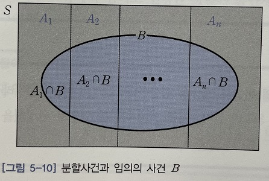
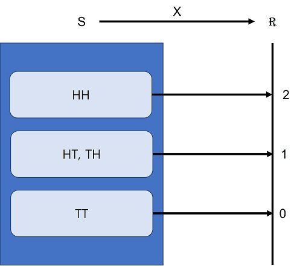
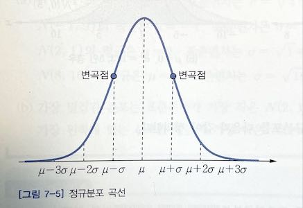
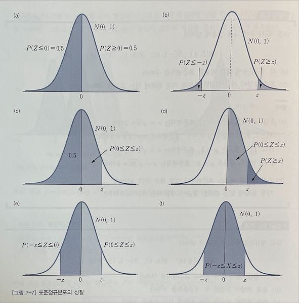
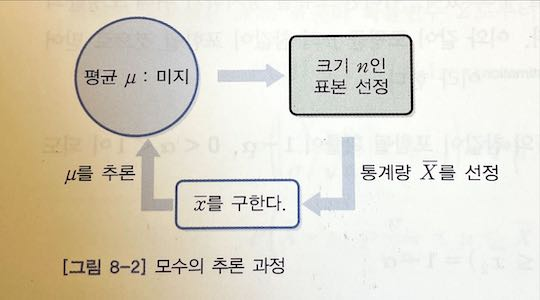
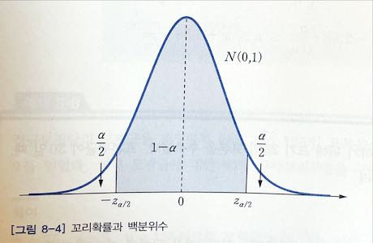

# book: 확률과 통계 입문 (Basic probability & statistics)
- 이재원 지음, 한빛아카데미

## Chapter 01 집합과 함수

### 1.3 경우의 수
- https://www.youtube.com/watch?v=QrFIYXjsckQ&list=PLkg061KdVddg79J_Dwm4LXbeUq_YOVrLF

#### 합의 법칙

두 사건 A, B가 동시에 일어나지 않을 때, 사건 A가 일어나는 경우의 수를 m, 사건 B가 일어나는 경우의 수를 n이라고 하면,
** 사건 A 또는 사건 B가 일어나는 경우의 수는 m+n **

#### 순열

서로 다른 n개에서 r개를 선택하여 순서대로 나열하는 방법을 **순열permutation** 이라 하고, 순열의 수를 $_ nP_r$ 로 나타낸다. 예를 들어, 서로 다른 4개 중에서 2개를 선택하여 순서대로 나열하는 방법의 수는 $_ 4P_2 = 4 \times 3 = 12$ 이다.

이제 서로 다른 n개에서 r개를 선택하는 순열의 수 $_ nP_r$을 구하기 위해 상자 r개를 생각해보자. 그러면 첫번째 상자에 넣을 수 있는 경우의 수는 n가지이고, 이 중에서 어느 하나를 넣었다면 두번재 상자에 넣을 수 있는 경우의 수는 n-1 가지이다. 그리고 세번재 상자에 넣을 수 있는 경우의 수는 처음 두 상자에 넣은 것을 제외한 n-2 가지이다. 이와 같이 반복하여 마지막 r 번째 상자에 넣을 수 있는 경우의 수는 n-r+1가지이다. 따라서 서로 다른 n개에서 r개를 선택하는 순열의 수 $_ nP_r$ 은 곱의 법칙에 의해 다음과 같다.

$$
_ nP_r = n(n-1)(n-2) \cdots (n-r+1)
$$

특히 r=n이면 $_ nP_n = n!$ 이다. 한편, 순열의 수는 계승factorial을 이용하여 다음과 같이 나타낼 수 있다.

$$
_ nP_r = n(n-1)(n-2) \cdots (n-r+1) = \cfrac{n(n-1)\cdots(n-r+1)(n-1)(n-r-1)\cdots2\times1}{(n-r)(n-r-1)\cdots2\times1} = \cfrac{n!}{(n-r)!}
$$

또한 $0! = 1$ 로 약속했으므로, 이 식에서 $r = 0$ 이라 하면 $_ nP_0=1$ 이다. 그러므로 순열의 수는 다음과 같이 간단히 나타낼 수 있따.

$$
_ nP_r = \cfrac{n!}{(n-r)!}, \quad r=0,1,\cdots,n
$$

##### $_ nP_r$ 의 성질

$r=1,2,\cdots,n$ 에 대해 다음이 성립한다.

- (1) $n \times _ {n-1}P_{r-1} = _ nP_r$
- (2) $_ {n-1}P_r + r \times _ {n-1}P_{r-1} = _ nP_r$

#### 조합

서로 다른 n개 중에서 r개를 선택하는 조합의 수는 다음과 같다. 이 때 $_ nC_0 = 1$로 정의한다.

$$
_ nC_r = \cfrac{_ nP_r}{r!} = \cfrac{n!}{r!(n-r)!}
$$

##### $_ nC_r$ 의 성질

- (1) $r = 0,1,\cdots,n$ 에 대해 $_ nC_r = _ nC_{n-r}$ 이다.
- (2) $r = 1,\cdots,n-1$ 에 대해 $_ {n-1}C_r + _ {n-1}C_{r-1} = _ nC_r$ 이다.

##### 이항정리binomial theorem

자연수 n에 대해 다음이 성립한다.

$$
(a+b)^n\\\ \
= _ nC_0a^nb^0 + _ nC_1a^{n-1}b+_ nC_2a^{n-2}b^2+\cdots+_ nC_{n-1}ab^{n-1}+_ nC_na^0b^n\\\ \
= _ nC_na^nb^0 + _ nC_{n-1}a^{n-1}b+_ nC_{n-2}a^{n-2}b^2+\cdots+_ nC_1ab^{n-1}+_ nC_0a^0b^n
$$

## Chapter 04 자료의 수치적 특성

### 4.1 대표값representative value

도수히스토그램의 중심위치를 나타내는 수치를 **중심위치의 척도measure of centrality** 또는 **대표값representative value** 이라 한다.

#### 평균

가장 널리 사용하는 대표값은 평균이며, 모집단과 표본의 평균은 다음과 같이 정의한다.

- **모평균population mean** : N개로 구서오딘 모집단의 각 자료값을 모두 더해 N으로 나눈 수치 $\mu = \cfrac{1}{N}\sum_{i=1}^{N}x_i$
- **표본평균sample mean** : n개로 구성된 표본의 각 자료값을 모두 더해 n으로 나눈 수치 $\overline{x} = \cfrac{1}{n}\sum_{i=1}^{n}x_i$

#### 중앙값

평균은 특이값의 유무에 따라 차이가 크게 나타난다. 이 특이값에 영향을 받지 않는 대표값을 생각할 수 있다.

- 중앙값: 자료를 작은 수부터 크기 순으로 나열하여 가장 가운데 놓이는 수를 **중앙값median** 이라 하며, $M_e$ 로 나타낸다.

$$
M_e = \begin{cases}
x_{\left(\frac{n+1}{2}\right)}, \quad \text{n이 홀수인 경우}\\\
\cfrac{1}{2}{\left(x_{\left(\frac{n}{2}\right)}+x_ {\left(\frac{n}{2}+1\right)}\right)}, \quad \text{n이 짝수인 경우}
\end{cases}
$$

중앙값은 자료의 수가 홀수이면 크기 순으로 나열하여 가장 가운데 놓이는 측정값이고, 자료의 개수가 짝수이면 가장 가운데 놓이는 두 측정값의 평균이다.

#### 최빈값mode

두 번 이상 발생하는 자료값 중에서 가장 많은 도수를 가지는 (빈도가 높은) 자료값을 **최빈값mode** 이라 하며, $M_0$로 나타낸다.

### 4.2 산포도

수집한 자료의 분포 상태를 충분히 설명하기 위해 대표값 이외에 자료가 흩어져 있는 정도에 대한 척도가 필요하고, 이것을 **산포도measure of dispersion** 라 한다.

#### 범위

수집한 자료의 가장 큰 측정값과 가장 작은 측정값의 차이 $R = x_{(n)}-x_{(1)}$ 을 **범위range** 라 한다.

#### 평균편차

각 자료의 측정값과 평균과의 편차에 대한 절대값들의 평균을 **평균편차mean deviation** 라고 한다.

$$
M.D = \cfrac{1}{n}\sum_{i=1}^{n}|x_i-\overline x|
$$

#### 분산
- **모분산population variance** : 모집단을 구성하는 모든 자료값과 모평균의 편차제곱에 대한 평균 $\sigma^2 = \cfrac{1}{N}\sum_{i=1}^{N}(x_i-\mu)^2$
- **표본분산sample variance** : 표본을 구성하는 모든 자료값과 표본 평균의 편차의 제곱합을 n-1로 나눈 수치 $s^2 = \cfrac{1}{n-1}\sum_{i=1}^{n}(x_i-\overline x)^2$

#### 표준편차
분산은 개개의 자료값에 대한 평균편차의 제곡에 의해 정의된다. 그러므로 분산의 단위는 자료값의 단위를 제곱한 단위이다. 예를 들어, 키의 단위로 cm를 사용하면 분산의 단위는 $cm^2$ 이 되고, 이 단위는 통상적으로 넓이를 나타내므로 자료의 특성을 분석할 때 혼란이 생기게 된다. 따라서 자료값의 단위와 동일한 척도를 이용할 필요가 있으며, 이를 위해 분산의 양의 제곱근을 택한다.

- **모표준편차population standard deviation** : 모분산의 양의 제곱근 $\sigma = \sqrt{\cfrac{1}{N}\sum_{i=1}^{N}{(x_i-\mu)^2}}$
- **표본표준편차sample standard deviation** : 표본의 양의 제곱근 $s = \sqrt{\cfrac{1}{n-1}\sum_{i=1}^{n}{(x_i-\overline x)^2}}$

#### 변동계수
표준편차는 평균을 중심으로 자료가 밀집되거나 흩어진 정도를 절대적인 수치로 나타낸 산포도이다. 그러나 측정 단위가 서로 다른 몸무게와 키에 대한 산포를 비교하거나 코끼리의 몸무게와 강아지의 몸무게와 같이 측정 단위가 동일하더라도 평균의 차이가 극심한 경우에 산포도를 절대적인 수치로 비교하는 것은 곤란하다. 따라서 두 자료 집단의 산포도를 상대적으로 비교하는 산포도가 필요하다.

- 표준편차를 평균으로 나눈 백분율을 **변동계수coefficient of variation** 라 한다.
    + 모집단의 변동계수: $C.V_p = \cfrac{\sigma}{\mu} \times 100(\%)$
    + 표본의 변동계수: $C.V_s = \cfrac{s}{\overline x} \times 100(\%)$

## Chapter 05 확률

### 5.1 시행과 사건
#### 시행
- 동일한 조건 아래서 반복할 수 있으며, 그 결과가 우연에 의해 달라질 수 있는 실험 또는 관찰을 **시행trial** 이라 한다.
- 동일한 조건에서 어떤 시행을 반복할 때, 각 시행의 결과가 이전 시행의 결과에 영향을 받지 않는 시행을 **독립시행independent trial** 이라 한다.

#### 사건
- **표본공간sample space** : 어떤 시행 결과로 기록되거나 관찰될 수 있는 모든 결과들의 집합
- **원소element**  또는 **표본점sample point** : 시행에서 나타날 수 있는 개개의 결과
- 표본공간의 부분집합을 **사건event** 이라 한다.
- **근원사건elementary event** : 단 하나의 원소로 구성된 사건
- **공사건empty event** $(\phi)$ : 원소가 하나도 들어있지 않은 사건

### 5.2 확률
- 어떤 시행에서 표본공간 S 안의 모든 원소가 일어날 가능성이 동등하다고 할 때, 사건 A가 일어날 확률은 다음과 같이 정의하며, 이를 **수학적 확률mathematical probability** 이라 한다. $P(A) = \cfrac{n(A)}{n(S)}$
- 어떤 시행을 n번 반복했을 때 사건 A가 일어난 횟수를 $r_n$이라고 하면, n이 충분히 커짐에 따라 상대도수 $p_n = \cfrac{r_n}{n}$ 은 일정한 값 p에 가까워진다. 이때 p를 사건 A의 **통계적 확률statistical probability** 이라 하고, $P(A) = p$ 로 나타낸다.
- 어떤 사건 A가 발생할 확률은 경험에 의해 다음과 같이 정의하며, 이를 **경험적 확률empirical probability** 이라 한다. $P(A) = \cfrac{\text{사건 A의 도수}}{\text{총 관찰도수}}$
- 다음 세가지 공리를 만족하는 표본공간 S에서 실수로 대응하는 함수 P(A)를 사건 A의 **공리적 확률axiomatic probability** 이라 한다.
    + 공리 1: $P(S) = 1$
    + 공리 2: $A \subset S$ 이면 $0 \leq P(A) \leq 1$ 이다.
    + 공리 3: 쌍마다 배반인 사건 $A_n, \quad n=1,2,3,\cdots$ 에 대해 다음이 성립한다.
        * $P(A_1 \cup A_2 \cup \cdots) = P(A_1) + P(A_2) + \cdots$

#### 확률의 성질
##### 기본 성질
공사건의 경우에 원소가 하나도 없으므로 수학적 확률의 정의에 의해 다음이 성립한다.

$$
P(\phi) = \cfrac{n(\phi)}{n(S)} = \cfrac{0}{n{S}} = 0
$$

그리고 표본공간 S에 대해 전체에 대한 확률은 $P(S) = \cfrac{n(S)}{n(S)} = 1$ 이다. 따라서 표본공간과 공사건에 대해 다음 성질을 얻는다.

$$
P(S)=1, P(\phi)=0
$$

##### 확률의 덧셈법칙addition rule
- 임의의 두 사건 A와 B가 배반이면 $P(A \cup B) = P(A)+P(B)$ 이다.
- 임의의 두 사건 A와 B가 배반이 아니면 $P(A \cup B) = P(A)+P(B)-P(A \cap B)$ 이다.

##### 여사건의 확률
임의의 사건 A와 여사건 $A^c$ 에 대해 $P(A^c) = 1 - P(A)$ 가 성립한다.

##### 부분사건의 확률
$A \subset B$ 인 임의의 두 사건 A와 B에 대해 다음이 성립한다.

- $P(B-A) = P(B) - P(A)$
- $P(A) \leq P(B)$

### 5.3 조건부 확률
#### 조건부 확률의 정의
$P(A) > 0$인 어떤 사건 A가 주어졌다고 할 때, 사건 B가 나타날 확률은 **조건부 확률conditional probability** 이라 하며, $P(B|A)$ 로 나타낸다.

#### 곱의 법칙
조건부 확률의 정의로부터 $P(A)>0, P(B)>0$ 이면 다음이 성립한다.

$$
P(B|A) = \cfrac{P(A \cap B)}{P(A)}\\\ \
P(A|B) = \cfrac{P(A \cap B)}{P(B)}
$$

따라서 두 사건 A와 B의 곱사건 $A \cap B$ 의 확률 $P(A \cap B)$ 는 다음과 같이 조건부 확률을 이용하여 표현할 수 있으며, 이를 **곱의 법칙multiplication law** 이라 한다.

$$
P(A \cap B) = P(A)P(B|A), \quad P(A) > 0\\\ \
= P(B)P(A|B), \quad P(B) > 0
$$

곱의 법칙은 세 개 이상의 사건에 적용할 수 있으며, 특히 사건 A, B, C에 적용하면 다음과 같다.

$$
P(A \cap B \cap C) = P(A)P(B|A)P(C|A \cap B), \quad p(A \cap B) > 0
$$

#### 독립과 종속
- **독립사건independent events** : 어느 한 사건의 발생 여부가 다른 사건이 일어날 확률에 영향을 주지 않는 두 사건 A와 B
- **종속사건dependent events** : 독립이 아닌 두 사건 A와 B
- 독립성: $P(A)>0, P(B)>0$ 인 두 사건 A와 B가 독립일 필요충분조건은 다음과 같다.
    + $P(A \cap B) = P(A)P(B)$
    + $P(A^c \cap B) = P(A^c)P(B)$
    + $P(A \cap B^c) = P(A)P(B^c)$
    + $P(A^c \cap B^c) = P(A^c)P(B^c)$

### 5.4 베이즈 정리

#### 전확률 공식formula of total probability

확률이 0이 아닌 사건 $A_1, A_2, \cdots, A_n$ 을 표본공간 S의 분할이라 하면, 다음을 만족한다.

- $A_i \cap A_j = \phi,\quad i \neq j,\quad i,j = 1,2,\cdots, n$
- $S = A_1 \cup A_2 \cup \cdots \cup A_n$

이때 임의의 사건을 B라 하면, 그림 5-10과 같이 사건 B를 쌍마다 배반인 사건 $B \cap A_1$ , $B \cap A_2$ , \cdots, B \cap A_n$ 으로 분할할 수 있다. 따라서 사건 B의 확률은 다음과 같이 분할된 사건의 확률은 합한 것과 같다.

$$
P(B) = P(B \cap A_1) + P(B \cap A_2) + \cdots + P(B \cap A_n)
$$ 

한편, 곱의 법칙을 이용하여 분할 사건 $B \cap A_i, i = 1,2,\cdots,n$ 의 확률을 구하면 다음과 같다.

$$
P(B \cap A_i) = P(A_i) P(B|A_i)
$$

그러면 사건 B의 확률을 정리 5-21과 같이 구할 수 있다.

##### 정리 5-21 전환률 공식

확률이 0이 아닌 사건 $A_1, A_2, \cdots, A_n$ 을 표본 공간 S의 분할이라 하면, 임의의 사건 B의 확률은 다음과 같다.

$$
P(B) = \sum_{i=1}^{n}P(A_i)P(B|A_i)
$$

#### 베이즈 정리Bayes' theorem

확률이 0이 나닌 사건 $A_1, A_2, \cdots, A_n$ 을 표본공간 S의 분할이라 하고 사건 B의 확률이 0이 아니라고 하자. 이 때 사건 B가 주어졌다는 조건 아래서 사건 $A_i$ 의 조건부 확률 $P(A_i|B)$ 는 다음과 같다.

$$
P(A_i|B) = \cfrac{P(A_i \cap B)}{P(B)}
$$

그러면 곱의 법칙과 전환률 공식을 이용하여 다음을 얻는다.

$$
P(A_i|B) = P(A_i)P(B|A_i)
$$

따라서 사건 B가 주어졌다고 할 때, 조건부 확률 $P(A_i|B)$ 는 다음과 같이 구할 수 있다.

##### 정리 5-22 베이즈정리

사건 $A_1, A_2, \cdots, A_n$ 을 표본공간 S의 분할이라 하고 $P(B)>0$ 인 어떤 사건 B가 발생했을 때, 사건 $A_i$ 의 조건부 확률은 다음과 같다.

$$
P(A_i|B) = \cfrac{P(A_i)P(B|A_i)}{\sum_{j=1}^{n}P(A_j)P(B|A_j)}
$$

이때 사건 B의 발생 원인을 제공하는 확률 $P(A_i)$ 를 **사전확률prior probability** 이라 하고, 사건 B가 발생한 이후의 확률 $P(A_i|B)$ 를 **사후확률posterior probability** 이라 한다.

## Chapter 06 확률 변수 (Random variable)

### 6.1 이산확률변수

#### 이산확률변수의 의미

동전을 두 번 던지는 게임에서 앞면이 나온 횟수를 X로 나타내면, X를 이용하여 앞면이 나온 횟수라는 특성에 따라 구분된 사건을 다음과 같이 간단히 표현할 수 있다.

$$
\begin{aligned}
\\{HH\\} &\Leftrightarrow X = 2\\\ \
\\{HT, TH\\} &\Leftrightarrow X = 1\\\ \
\\{TT\\} &\Leftrightarrow X = 0
\end{aligned}
$$

그러므로 앞면이 나온 횟수인 X는 그림 6-1과 같이 표본공간 S에서 실수 전체의 집합 R 로의 함수로 생각할 수 있다. 이 때 앞면이 나온 횟수인 X를 확률 변수라 한다.

- 그림 6-1 확률 변수의 의미

##### 정의 6-1 확률 변수(Random variable)

표본공간 S 안의 원소에 실수를 대응시키는 함수를 **확률변수random variable** 라 하며, 보통 X와 같이 대문자로 나타낸다.

##### 정의 6-2 이산확률변수(Discrete random variable)

확률변수 X에 대한 상태공간을 구성하는 원소의 수가 유한개이거나 무수히 많더라도 셀 수 있는 경우에 X를 **이산확률변수discrete random variable** 라 한다.

#### 확률질량함수

##### 정의 6-3 확률 질량 함수

X의 상태공간 $S_x$ 안에 있는 각각의 x에 대해 $f(x) = P(X=x)$ 이고, $S_x$ 안에 있지 않은 모든 실수 x에 대해 $f(x) = 0$ 으로 정의한 함수 $f(x)$ , 즉 다음과 같이 정의되는 함수 $f(x)$ 를 이산확률변수 X의 **확률질량함수probability mass function** 라 한다.

$$
f(x) = \begin{cases} P(X=x), \quad x \in S_x\\\ \
0, \quad x \notin S_x \end{cases}
$$

그러면 확률 질량함수 f(x)는 다음 성질을 갖는 것을 쉽게 확인할 수 있다.
- (1) 임의의 실수 x에 대해 $0 \leq f(x) \leq 1$
- (2) $\sum_{모든 x}f(x)=1$

#### 이산 확률 변수의 분포함수

##### 정의 6-4 이산 확률 변수의 분포 함수

임의의 실수 x에 대해 다음과 같이 정의되는 함수 F(x)를 이산확률변수 X의 **분포함수distribution function** 라 한다.

$$
F(x) = P(X \leq x) = \sum_{u \leq x }f(u)
$$

그러면 임의의 두 수 a, b(a < b)에 대해 분포함수를 이용하여 다음과 같이 확률을 구할 수 있다.

- $P(a < X \leq b) = F(b) - F(a)$
- $P(a \leq X \leq b) = F(b) - F(a) + P(X=a)$
- $P(X \geq a) = 1 - F(a) + P(X=a)$
- $P(X=a) = F(a) - F(a-1)$

### 6.2 연속확률변수

#### 연속확률변수의 의미

##### 정의 6-5 연속 확률 변수

확률 변수 X의 상태공간이 유한구간 [a, b], (a, b) 또는 무한구간 [0, $\infty$], (-$\infty$, $\infty$)인 확률변수를 **연속확률변수continuous random variable** 라 한다.

#### 확률밀도함수

##### 정의 6-6 확률 밀도 함수

다음 조건을 만족하는 음이 아닌 함수 f(x)를 연속확률변수 X의 **확률밀도함수probability denstiy function** 라 한다.

$$
\int_{-\infty}^\infty f(x)dx = 1
$$

연속확률변수 X가 취하는 구간의 경계값은 확률 계산에 아무런 영향을 미치지 않으며, 연속확률변수 X에 대해 다음 성질이 성립한다.

- $P(X \geq a) = P(X > a)$
- $P(X \leq a) = P(X < a)$
- $P(a \leq X \leq b) = P(a < X \leq b) = P(a \leq X < b) = P(a < X < b)$
- $P(a \leq X \leq b) = P(X \leq b) - P(X \leq a)$

#### 연속확률변수의 분포함수

##### 정의 6-7 연속확률변수의 분포함수

연속확률변수 X에 대한 분포함수를 다음과 같이 정의한다.

$$
F(x) = P(X \leq x) = \int_{-\infty}^{\infty}f(u)du
$$

연속 확률 변수 X의 확률 밀도 함수 f(x)와 분포함수 F(x) 사이에 다음 관계가 성립한다.

$$
f(x) = \cfrac{d}{dx}F(x)
$$

### 6.3 확률변수의 평균과 분산

#### 확률변수의 평균

- 표 6-4 이산 확률 변수 X에 대한 확률 분포표

<table>
    <tr>
        <td>$X$</td>
        <td>$x_1$</td>
        <td>$x_2$</td>
        <td>$\cdots$</td>
        <td>$x_n$</td>
        <td>합계</td>
    </tr>
    <tr>
        <td>$f(x)$</td>
        <td>$P_1$</td>
        <td>$P_2$</td>
        <td>$\cdots$</td>
        <td>$P_n$</td>
        <td>1</td>
    </tr>
</table>

이산확률 변수 X의 확률 변수 X의 확률 분포가 표 6-4와 같을 때 X의 평균은 다음과 같다.

$$
\overline{x} = x_1P_1 + x_2P_2 + \cdots + x_nP_n = \sum_{i=1}^n x_iP_i
$$

즉, 이산확률변수 X의 평균은 이 확률변수가 취할 수 있는 모든 값과 그에 대응하는 확률의 곱을 더하여 얻는다. 이와 마찬가지로 연속확률변수 X의 평균은 이 확률변수가 취할 수 있는 모든 값과 그에 대응하는 확률 밀도 함수의 곱을 적분하여 얻는다. 이 때 확률변수의 평균을 기댓값이라 한다.

##### 정의 6-8 기댓값

확률변수 X에 대해 다음과 같이 정의되는 수치 $\mu = E(X)$ 를 X의 **기댓값expected value** 또는 **평균mean** 이라 한다.

$$
\mu = E(x) = \begin{cases}\sum_{모든 x}xf(x), \quad \text{X가 이산확률변수인 경우}\\
\int_{-\infty}^{\infty}xf(x)dx, \quad \text{X가 연속확률변수인 경우}\end{cases}
$$

#### 확률변수의 분산

##### 정의 6-9 확률변수의 분산과 표준편차

- **분산variance** : 확률변수 X의 평균 $\mu = E(X)$ 에 대해 평균 편차의 제곱 $(X-\mu)^2$ 에 대한 평균 $E[(X-\mu)^2], \sigma^2$ 또는 $Var(X)$ 로 나타낸다.
- **표준편차standard deviation** : 분산의 양의 제곱근 $\sqrt{Var(X)}$

- 표 6-5 확률 X의 평균편차 제곱과 확률

<table>
    <tr>
        <td>$X$</td>
        <td>$x_1$</td>
        <td>$x_2$</td>
        <td>$\cdots$</td>
        <td>$x_n$</td>
    </tr>
    <tr>
        <td>$(X-\mu)^2$</td>
        <td>$(x_1-\mu)^2$</td>
        <td>$(x_2-\mu)^2$</td>
        <td>$\cdots$</td>
        <td>$(x_n-\mu)^2$</td>
    </tr>
    <tr>
        <td>$f(x)</td>
        <td>$P_1$</td>
        <td>$P_2$</td>
        <td>$\cdots$</td>
        <td>$P_n$</td>
    </tr>
</table>

그러면 X의 분산은 확률 변수 X와 평균 $\mu$ 의 편차 제곱 $(X-\mu)^2$ 의 평균이므로 다음을 얻는다.

$$
\begin{aligned}
Var(x) = E[(X-\mu)^2] &= \sum_{i=1}^n (x_i-\mu)^2 P_i\\\ \
&= \sum_{i=1}^n (x_i^2P_i - 2\mu x_iP_i + \mu^2 P_i)\\\ \
&= \sum_{i=1}^n x_i^2P_i - 2\mu\sum_{i=1}^n x_iP_i + \mu^2 \sum_{i=1}^n P_i
\end{aligned}
$$

이때 $\mu$ 는 이산확률변수 X의 평균이고 $P_i,\quad i=1,2,\cdots,n$ 는 X가 취할 수 있는 각 경우의 확률이므로 다음을 얻는다.

$$
E(X^2) = \sum_{i=1}^n x_i^2 P_i,\quad \mu=\sum_{i=1}^n x_iP_i,\quad \sum_{i=1}^n P_i = 1
$$

따라서 이산확률변수 X의 분산은 $Var(X) = E(X^2)-\mu^2$ 이다. 이는 연속 확률 변수에 대해서도 동일하게 적용된다. 그러므로 다음과 같이 분산을 쉽게 구할수 있다.

$$
Var(X) = E(X^2)-\mu^2
$$

그러면 기댓값의 성질과 분산의 정의로부터 다음의 성질을 쉽게 얻을 수 있다. 단 a, b는 상수이다.

1. $Var(a) = 0$
2. $Var(aX) = a^2 Var(X)$
3. $Var(aX+b) = a^2 Var(X)$

특히 확률변수 X의 평균 $\mu$ 와 표준편차 $\sigma$ 에 대해 확률 변수 $Z = \cfrac{X - \mu}{\sigma}$ 를 X의 표준화 확률 변수(standardized random variable)라 한다. 그러면 표준화 확률 변수의 평균과 분산은 각각 다음과 같다.

$$
E(Z) = 0,\quad Var(Z) = 1
$$

## Chapter 07 확률분포

### 7.1 이산 확률 분포

#### 베르누이 분포

동전 던지기의 앞면과 뒷면, 생산한 제품의 양호와 불량, 그리고 설문조사의 YES와 NO 등과 같이 실험 결과가 두가지인 확률 실험을 **베르누이 실험Bernoulli experiment** 이라 한다. 이 실험에서 관심의 대상이 되는 실험 결과를 성공, 그렇지 않은 경과를 실패라 하고, 성공의 확률 p를 **성공률rate of success** 이라 한다. 성공률이 p인 베르누이 실험에서 성공이면 X=1, 실패이면 X=0이라 할 때, 확률변수 X의 확률분포를 모수 p인 **베르누이 분포Bernoulli distribution** 라 한다. 이 때 X의 확률질량 함수를 나타내면 다음과 같다.

$$
f(x) = \begin{cases}
1-P, \quad x=0\\
p, \quad x=1\\
0, \quad \text{다른곳에서}
\end{cases}
$$

특히 성공률 p인 베르누이 실험을 독립적으로 반복하여 시행하는 과정을 **베르누이 시행Bernoulli trial** 이라 한다.

#### 이항분포

매회 성공률이 p인 베르누이 실험을 독립적으로 n번 반복 할 때, 성공한 횟수(X)의 확률분포를 모수 n과 p인 **이항분포binorminal distribution** 라 하고, X ~ B(n, p) 로 나타낸다.

### 7.2 연속 확률 분포

#### 정규 분포

연속확률변수 X의 확률밀도함수 f(x)가 다음과 같을 때, 확률번수 X는 모수 $\mu$ 와 $\sigma^2$ 인 **정규분포normal distribution** 를 따른다 하고, X ~ N($\mu, \sigma^2$) 으로 나타낸다.

$$
f(x) = \cfrac{1}{\sqrt{2\pi}\sigma}\exp\left(-\cfrac{(x-\mu)^2}{2\sigma^2}\right), \quad -\infty < x \infty
$$

##### 표준정규분포
평균 $\mu = 0$ , 분산 $\sigma^2 = 1$ 인 정규분포를 **표준정규분포standard normal distribution** 라고 하고, Z ~ N(0,1) 로 나타낸다.

#### 표준정규분포의 성질

#### 이항분포의 정규근사

확률변수 X가 이항분포 B(n,p)를 따를 때, n이 충분히 크면 X는 정규분포 N(np, npq)에 근사한다. 단, q = 1-p이다.

## Chapter 08 표본분포와 통계적 추정

### 8.1 모집단과 표본

#### 모집단 분포와 표본분포

- **모집단 분포population distribution** : 어떤 통계적인 목적 아래 수집한 모든 자료가 갖는 확률분포
- **모수parameter** : 모집단의 특성을 나타내는 수치
- 모평균: $\mu = \cfrac{1}{N}\sum_{i=1}^{N}X_i$
- 모분산: $\sigma^2 = \cfrac{1}{N}\sum_{i=1}^{N}(X_i-\mu)^2$
- 모표준편차: $\sigma = \sqrt{\cfrac{1}{N}\sum_{i=1}{N}(X_i-\mu)^2}$
- 모비율: $p = \cfrac{X}{N}, \quad \text{X는 특정한 성질을 갖는 자료의 수}$

#### 표본분포와 통계량

- **통계량statistics** : 표본의 특성을 나타내는 통계적인 양
- **표본분포sampling distribution** : 표본으로부터 얻은 통계량의 확률 분포
- 표본평균: $\overline X = \cfrac{1}{n}\sum_{i=1}^{n}X_i$
- 표본분산: $S^2 = \cfrac{1}{n}\sum_{i=1}^{n}(X_i-\overline x)^2$
- 표본표준편차: $S = \sqrt{\cfrac{1}{n}\sum_{i=1}{n}(X_i-\overline x)^2}$
- 표본비율: $\hat p = \cfrac{X}{n}, \quad \text{X는 특정한 성질을 갖는 자료의 수}$

### 8.2 모평균의 추정

모집단으로부터 선정한 표본을 통해 얻은 정보를 이용하여 미지의 모수를 추측하는 것을 **추정estimate** 이라 한다. 이 때 모집단이 정규 분포를 따르면 표본의 크기 n에 관계없이 표본평균 $\overline X$ 는 정규분포를 따른다. 그리고 모집단 분포가 정규분포가 아닌 경우에도 표본의 크기 n이 충분히 크면 표본평균 $\overline X$ 가 근사적으로 정규분포를 따른다.

#### 모평균의 점추정

모분산 $\sigma^2$ 이 알려져있는 정규모집단 $N(\mu, \sigma^2)$ 에서 모평균 $\mu$ 를 추정하기 위해서는 [그림 8-2]와 같이 선정한 표본의 표본평균 $\overline x$ 를 이용한다. 이 때 표본 ${X_1, X_2, \cdots, X_n}$ 의 관찰값인 $x_1, x_2, \cdots, x_n$ 의 평균 $\overline x$ 를 이용하여 모평균 $\mu$ 를 추정하는 과정을 **점추정point estimate** 이라 한다. 그리고 표본평균 $\overline X$ 를 모평균 $\mu$ 에 대한 **점추정량point estimator** 이라 하고, 관찰값의 평균 $\overline x$ 를 $\mu$ 에 대한 **점추정값value of point estimate** 이라 한다.

#### 모평균의 신뢰구간

모평균의 점추정은 모집단으로부터 표본을 어떻게 선정하느냐에 따라 점추정값이 다르게 나타날 뿐만 아니라 모평균의 참값을 왜곡하는 경우가 발생할 수도 있다. 이러한 오류를 방지하기 위해 모평균의 참값이 포함될 것으로 믿어지는 구간을 추정한다. 이와 같이 모평균 $\mu$ 의 참값이 포함될 것으로 믿어지는 구간을 추정하는 방법ㅈ을 **구간추정interval estimation** 이라 한다.

모평균 $\mu$ 에 대한 구간추정을 구하기 ㅜ이해서는 $\mu$ 의 참값이 포함될 확률이 $1 - \alpha, 0 < \alpha < 1$ 이 되도록 추정값 $\overline x_1$ 과 $\overhine x_2$ 를 구한다.

$$
P(\overline x_1 \leq \mu \leq \overline x_2) = 1 - \alpha
$$

그러면 모평균 $\mu$ 의 참값을 포함하는 구간 $(\overline x_1, \overline x_2)$ 를 $100(1-\alpha)\%$ **신뢰구간confidence interval** 이라 하며, 모수의 참값이 이 구간에 포함될 것으로 믿어지는 확신의 정도인 $100(1-\alpha)\%$ 를 **신뢰도degree of confidence** 라 한다. 이 때 $\alpha = 0.1, 0.05, 0.01$ 인 경우, 즉 90%, 95%, 99% 신뢰도를 사용하여 신뢰구간의 중심은 표본평균 $\overline x$ 를 이용한다. 특히 신뢰도가 커질수록 신뢰구간은 커진다. 한편, 8.1절에서 살펴본 바와 같이 모집단이 정규분포 $N(\mu, \sigma^2)$ 를 따르면, 표본평균 $\overline X$ 는 근사적으로 $N\left(\mu, \cfrac{\sigma^2}{n}\right)$ 를 따른다. 따라서 $\overline X$ 를 표준화한 확률 변수 $Z = \cfrac{\overline X - \mu}{\sigma \over \sqrt{n}}$ 는 표준 정규분포 N(0, 1)을 따른다. 그리고 표준정규분포에서 양쪽 꼬리확률이 각각 $\alpha \over 2$ 인 임계점은 [그림 8-4]와 같이 각각 $-z_{\alpha \over 2}$ 와 $z_{\alpha \over 2}$ 이다.

따라서 표본평균 $\overline X$ 의 표준화 확률변수 Z로부터 다음을 얻는다.

$$
P(|Z| \leq z_{\alpha \over 2}) = 1 - \alpha\\
P \left(\left|\cfrac{\overline X - \mu}{\sigma \over \sqrt{n}} \right| \leq z_{\alpha \over 2} \right) = P \left(|\overline X - \mu| \leq z_{\alpah \over 2} \cfrac{\sigma}{\sqrt{n}} \right) = 1 - \alpha\\
P \left( \overline X - z_{\alpha \over 2} \cfrac{\sigma}{\sqrt{n}} \leq \mu \leq \overline X - z_{\alpha \over 2} \cfrac{\sigma}{\sqrt{n}} \right) = 1 - \alpha
$$

이때 표본평균 $\overline X$ 의 관찰값을 $\overline x$ 라 하면, 모평균 $\mu$ 에 대한 $100(1-\alpha)\%$ 신뢰구간은 다음과 같다.

$$
\overline x - z_{\alpha \over 2}\cfrac{\sigma}{\sqrt{n}} \leq \mu \leq \overline x + z_{\alpha \over 2}\cfrac{\sigma}{\sqrt{n}}
$$

