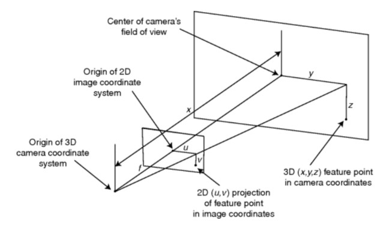

# book: Bayesian Estimation and Tracking

- Anton J. Haug

I will refer this book for designing my Kalman filter.
In chatper 20, there is sensor fusion example using photogrammetric and inertial measurement.

It fuses two sensor data(image processing and IMU) for tracking a rigid body.

## Chapter 19. Tracking a falling rigid body using photogrammetry

### 19.1 Introduction

Photogrammetry is the mathematical science of estimating an object's pose (three-dimensional position and orientation) and kinematic properties (translational and rotational velocities and accelerations) from a set of object features observed in a series of two-dimensional video image frame data from multiple cameras. Many approaches to this estimation problem have been applied, with the most common prior to the 1990s using a nonlinear least squres (NLLSQ) approach. These early NLLSQ method, at each time step, the residuals between the predicted video images and the actual current video images are used in an iterative NLLSQ procedure to arrive at a local residual error minimum producing an estimate of the rigid body state. Alternate, more modern, Bayesian estiamtion extended Kalman filter(EKF) methods were introduced by Iu and Wohn and Gennery with excellent results. These were followed by a single-constraint-at-a-time (SCAAT) EKF method introduced by Welch.

All of the above-mentioned methods had some drawbacks that affect the rigid body state estimation performance. The NLLSQ methods assumes a dynamic model without noise, is not recursive in time, and requires the computation of a Jacobian (matrix of partial derivatives) at each iternation. The observation set consists of video frame images and all image frames are reprocessed during each iteration, making the method very time consuming. In addition, because the NLLSQ, as used in photogrammetry, is a "single time-step at a time" method, translational velocities and angular rates are not estimated in the NLLSQ but have to be calculated separately using a postprocessing smoothing step.

The EKF methods are also difficult to implement because the Jacobians of both the nonlinear observation and dynamic transition models have to be calculated at each time step in order to linearize the observation and dynamic transition models have to be calculated at each time step in order to linearize the observation process (see chapter 7). This analytical linearization has proven to be inadequate for many highly nonlinear problems.

In this case study, for the purpose of safety evaluation, we address the specific problem of estimating and tracking the time-varing pose of a rigid body store (a bomb-like object) dropped from an airplane pylon. We use image sequences that are recorded from multiple high-speed image sensors attached to a reference object. The image sensors or cameras are specifically oriented to reliably observe the track object's rigid body state trajectory. Multiple feature points are affixed to both the reference and rigid body object as shown in figures 19.1 and 19.2. There are 19 cameras attached to the aircraft, including four cameras on each wingtip, four under the tail, and a camera under the aircraft's nose. The position of the feature points in the image frame of each camera are recorded in a temporal image sequence that is used in the estimation of the trajectory of the tracked object. Each image sensor has its own unique image sequence as a record of the object's motion from a particular point of view. Each image sequence must be properly combined with the image sequences from other cameras to compute the best track estimate of the trajectory at each time step. The track object's trajectory can then be used to perform miss distance analysis for safety purposes, or for validation and refinement of predictions made by other types of modeling and simulation. Since image sensors estimate the time-varying position and orientation of a rigid body object in the 3D world, photogrammetric estimation is a logical first choice for accurate close range tracking.

In our estimation process we introduce two new methods that use an unscented Kalman filter (UKF) or a generalized UKF particle filter (see chapter 9 and 17, respectively, for a complete derivation and discussion of these filters). These filters offer improved performance over both the EKF and the NLLSQ because they have the capability of estimating the full rigid body state kinematics including Cartesian and angular velocities and accelerations without the need to compute Jacobians.

In section 19.2, we present a dynamic model of motion for a falling rigid body object including translational and rotational motion. This section also contains a discussion of the dynamic noise terms that are introduces to account for any small motion deviations from the dynamic model. The observation model introduced in section 19.3 begins by calculating the location of the feature points on the rigid body surface, transforming (rotating and translating) these 3D feature points on the rigid body from the body's coordinate system into the reference (aircraft's) coordinates, then transforming the 3D points into a camera's coordinate system and projecting the 3D proints into the camera's 2D image plane.

This is followed in section 19.4 with a discussion of the estimation methods used, beginning with the NLLSQ in section 19.4.1, the UKF in section 19.4.2, and the UKF combination particle filter in section 19.4.3. Initialization for all of these filters is presented in section 19.4.5.

For performance analysis purposes, we have developed a synthetic rigid body model along with a synthetic motion model that emulates the motion of a rigid body store as it is released from an airplane pylon. This model and a method for using it to generate synthetic image frame data is contained in section 19.5. The relative performance of all of the estimation methods along with a summary of important results is presented in section 19.6.

### 19.2 The process (dynamic) model for rigid body motion

Our motion model will describe the translational and rotational motion of a rigid body as a function of time. Consider an instantaneous state vector $\mathrm{x}(t) = [\mathbf{p}^T(t), a^T(t)]^T$ that defines both the translation of the center of mass of a rigid body relative to a fixed reference Cartesian coordinate frame, $\mathbf{p}(t) = [x(t) ,y(t), z(t)]^T$ , and the orientation of the body with respect to the reference frame given as an axis-angle vector $a(t) = [a_x(t), a_y(t), a_z(t)]^T$ . Under certain conditions the vector **a** can become numerically unstable (specifically when $\\|a\\| = 2\pi n$ where n is a positive integer), so instead we use a unit quaternion $\mathbf{q} = [q_s, q_x, q_y, q_z]^T$ that when combined with **a** represents the orientation. We discuss the need for **q** in more detail in section 19.2.2 and in appendix 19.A.2. In addition, in the dynamic (process) models developed below, we will modify the state vector to include rate vectors, acceleration vectors, and jerk (third time derivative) terms governing both translational and rotational motion.

Since the translational motion of a rigid body is independent of its rotational motion, we will treat the two separately. In the sections below we will develop the dynamic transition equations that take the rigid body state vector, defined above, from som time $t_{n-1}$ to a later time $t_n$ . First, in section 19.2.1 we address the transition equations governing the translational part of the state vector, while in section 19.2.2 we consider the transition equations for the orientation part of the state vector. In general, we can write the total transition equation in the form 

- 19.1

$$
\mathrm{x}_ n = f(\mathrm{x}_ {n-1}, \mathrm{v}_ {n-1})
$$

where $\mathrm{v}_ {n-1}$ is considered the noise driving the process. In all cases we will take the noise to be Gaussian and additive so that (19.1) becomes

- 19.2

$$
\mathrm{x}_ n = f(\mathrm{x}_ {n-1}) + \mathrm{v}_ {n-1}
$$

In section 19.2.3, this composite pose transition model is discussed in more detial. In section 19.2.4, we will discuss the properties of several noise models for $\mathrm{v}_ {n-1}$ .

#### 19.2.1 Dynamic transition of the translational motion of a rigid body

Let $\mathbf{p}_ n$ be a three-dimensional vector that represents the Cartesian position of the center of gravity (cg) of a rigid body at time $t_n$ , that is, $\mathbf{p}_ n = [x_n, y_n, z_n]^T$ . Expanding $\mathbf{p}(t_n)$ in a temporal Taylor series about some prior time $t_{n-1}$ we can write

- 19.3

$$
\mathbf{p}_ n = \mathbf{p}_ {n-1} + \left[\cfrac{d\mathbf{p}(t)}{dt}\right]_ {t=t_{n-1}} (t_n - t_{n-1})+\left[\cfrac{d^2\mathbf{p}(t)}{dt^2}\right]_ {t=t_{n-1}}\cfrac{(t_n - t_{n-1})^2}{2!} + \left[\cfrac{d^3\mathbf{p}(t)}{dt^3}\right]_ {t=t_{n-1}}\cfrac{(t_n - t_{n-1})^3}{3!} + \cdots
$$

- 19.4

$$
= \mathbf{p}_ {n-1} + T_n\dot{\mathbf{p}}_ {n-1} + \cfrac{T_n^2}{2}\ddot{\mathbf{p}}_ {n-1} + \cfrac{T_n^3}{6}\dddot{\mathbf{p}}_ {n-1} + \cdots
$$

where $\dot{\mathbf{p}}, \ddot{\mathbf{p}}, \dddot{\mathbf{p}}$ represent the first three temporal derivatives of position and $T_n \triangleq t_n - t_{n-1}$ . For this case study, all observing cameras are assumed to record their images in a synchronous fashion, so we will assume that $T_n$ is a constant T. Keeping only terms to third order, we can rewrite 19.3 as the tird-order Taylor polynomial

- 19.5

$$
\mathbf{p}_ n = \mathbf{p}_ {n-1} + T\dot{\mathbf{p}}_ {n-1} + \cfrac{T^2}{2}\ddot{\mathbf{p}}_ {n-1} + \cfrac{T^3}{6}\dddot{p}_ {n-1}
$$

For a constant position model, $\dot{\mathbf{p}}, \ddot{\mathbf{p}},$ and $\dddot{\mathbf{p}}$ are all zero so we define the rigid-body zeroth-order three-dimensional state vector containing only position components as $\mathbf{p}_ n^{(0)} = \mathbf{p}_ n = [x(t), y(t), z(t)]^T$ and 19.5 becomes 

- 19.6

$$
\mathbf{p}_ n^{(0)} = \mathbf{p}_ {n-1}^{(0)} + \nu_{n-1}^{(0)}
$$

where we have added a zeroth-order process velocity noise term $\nu_{n-1}^{(0)}$ . Process noise is added to account for slight deviations of the objects positiono from our model due to unmodeled effects such as wind, friction, and so on.

For a constant velocity assumption, if we define a six-dimensional state vector having both position and velocity compoenents, that is $\mathbf{p}_ n^{(0)} = [\mathbf{p}_ n^T, \dot{\mathbf{p}}_ n^T]^T$ , 19.5 becomes the first-order process model

- 19.7

$$
\mathbf{p}_ n^{(1)} = \mathbf{F}^{(1)}\mathbf{p}_ {n-1}^{(1)} + \nu_ {n-1}^{(1)}
$$

where

- 19.8

$$
\mathbf{F}^{(1)} = \begin{bmatrix}
    \mathbf{I_3} & T\mathbf{I_3}\\\ \
    \mathbf{0_3} & \mathbf{I_3}
\end{bmatrix}
$$

with $\mathbf{I_3}$ and $\mathbf{0_3}$ defined as the three-dimensional identity and zero matrices, respectively. $\nu_{n-1}^{(1)}$ is the first-order acceleration process noise.

In a similar manner, for a constant acceleration model 19.5 the nine-dimensional state vector is $\mathbf{p}_ n^{(2)} = [\mathbf{p}_ n^T, \dot{\mathbf{p}}_ n^T, \ddot{\mathbf{p}}_ n^T]^T$ and the process model becomes

- 19.9

$$
\mathbf{p}_ n^{(2)} = \mathbf{F}^{(2)}\mathbf{p}_ {n-1}^{(2)} + \nu_{n-1}^{(2)}
$$

with

- 19.10

$$
\mathbf{F}^{(2)} = \begin{bmatrix}
    \mathbf{I_3} & T\mathbf{I_3} & \cfrac{T^2}{2}\mathbf{I_3}\\\ \
    \mathbf{0_3} & \mathbf{i_3} & T\mathbf{I_3}\\\ \
    \mathbf{0_3} & \mathbf{0_3} & \mathbf{I_3}
\end{bmatrix}
$$

$\nu_{n-1}^{(2)}$ is the second-order jerk 12-dimensional model, $\mathbf{p}_ n^{(3)} = [\mathbf{p}_ n^T, \dot{\mathbf{p}}_ n^T, \ddot{\mathbf{p}}_ n^T, \dddot{\mathbf{p}}_ n^T]^T$ resulting in the process model

- 19.11

$$
\mathbf{p}_ n^{(3)} = \mathbf{F}^{(3)}\mathbf{p}_ {n-1}^{(3)}+\nu_{n-1}^{(3)}
$$

with

- 19.12

$$
\mathbf{F}^{(3)} = \begin{bmatrix}
    \mathbf{I_3}&T\mathbf{I_3}&\cfrac{T^2}{2}\mathbf{I_3}&\cfrac{T^3}{6}\mathbf{I_3}\\\ \
    \mathbf{0_3}&\mathbf{I_3}&T\mathbf{I_3}&\cfrac{T^2}{2}\mathbf{I_3}\\\ \
    \mathbf{0_3}&\mathbf{0_3}&\mathbf{I_3}&T\mathbf{I_3}\\\ \
    \mathbf{0_3}&\mathbf{0_3}&\mathbf{0_3}&\mathbf{I_3}
\end{bmatrix}
$$

and $\nu_{n-1}^{(1)}$ is the third-order snap (or jounce) fourth derivative process noise.

#### 19.2.2 Dynamic transition of the rotational motion of a rigid body

The instantaneous orientation of a rigid body can be expressed in multiple ways. The orientation can be expressed as a set of Euler rotation angles relative to the three Cartesian reference frame axis. The right-handed Cartesian reference frame we choose is a frame with the x-axis pointing forward, the y-axis pointing to the right (startboard) looking forward, and the z-axis pointing down. The three orientation angles are $\\{\phi, \theta, \psi\\}$, with $\phi$ (roll) representing a counterclockwise (CCW) rotation about the x-axis, $\theta$ (pitch) representing a CCW rotation about  the y-axis, and lastly $\psi$ (yaw) a CCW rotation about the z-axis, respectively. Unfortunately, using Euler angles to describe rigid body orientation can result in singularities under certain circumstatnces.

##### 19.2.2.1 Conversions between rotation representations

Let $a = [a_x, a_y, a_z]^T \in \mathbb{R}^3$ be used as an axis-angle representation of rotation where the direction of a specifies the axis of rotation and $\\|a\\| = \sqrt{a_x^2+a_y^2+a_z^2}$ specifies the magnitude of rotation (in radians).

Let $\mathbf{q} = [q_s, q_x, q_y, q_z]^T \in \mathbf{H}$ , where **H** is the space of quaternions, be used as a unit quaternion representation of rotaiton, where $q_s$ is real, $q_x, q_y, q_z$ are coefficients of distinct imaginary numbers, and $\sqrt{q_s^2+q_x^2+q_y^2+q_z^2} = 1$ .

Let $\mathbf{M} \in \mathbb{R}^3 \times \mathbb{R}^3$ be a $3 \times 3$ orthonormal rotation matrix.

To convert from an axis-angle vector **a** to a unit quaternion **q**, we define the function $\mathcal{Q}: \mathbb{R}^3 \to \mathbf{H}$ as

- 19.13

$$
\mathbf{q} = \mathcal{Q}_ a(a) = \left[\cos\cfrac{\\|a\\|}{2}, \cfrac{\sin\cfrac{\\|a\\|}{2}}{\\|a\\|}[a_x, a_y, a_z]\right]^T
$$

To convert from a unit quaternion **q** to an axis-angle vector **a** we define the function $\mathcal{A}_ q : \mathbf{H} \to \mathbb{R}^3$ as

- 19.14

$$
\mathbf{a} = \mathcal{A}_ q(\mathbf{q}) = \cfrac{2\cos^-1q_s}{\sqrt{1-q_s^2}}[q_x, q_y, q_z]^T
$$

##### 19.2.2.2 Quaternion multiplication

Let $q_1, q_2,$ and $q_3$ be quaternions. Then the quaternion multiplication $q_3 = q_1q_2$ is defined as

- 19.15

$$
\mathbf{q_3} = \begin{bmatrix}
    q_{3,s}\\\ \
    q_{3,x}\\\ \
    q_{3,y}\\\ \
    q_{3,z}
\end{bmatrix} = \begin{bmatrix}
    q_{1,s} & -q_{1,x} & -q_{1,y} & -q_{1,z}\\\ \
    q_{1,x} & q_{1,s} & -q_{1,z} & q_{1,y}\\\ \
    q_{1,y} & q_{1,z} & q_{1,s} & -q_{1,x}\\\ \
    q_{1,z} & -q_{1,y} & q_{1,x} & q_{1,s}
\end{bmatrix} = \begin{bmatrix}
    q_{2,s}\\\ \
    q_{2,x}\\\ \
    q_{2,y}\\\ \
    q_{2,z}
\end{bmatrix}
$$

##### 19.2.2.3 Dynamic model for orientation

To express the dynamic temporal transition of the rigid body's orientation, we will use the axis-angle representation. The axis-angle orientation vector, $a_n,$ represents a small rotation relative to the prior orientation, that is, the rotation from time $t_{n-1}$ to time $t_n.$ This small axis-angle rotaiton is added (via a rotation) into an unambiguous external quaternion representation, $q_{n-1},$ which contains the full rotation at time $t_{n-1}$ for use in the observation model. Note that **a** and its derivatives $\dot{a}, \ddot{a},$ and $\dddot{a}$ (when present) are all with respect to the reference coordinate frame and not the body frame, thus **q** does not need to appear in the dynamic model.

We will define the orientation state vector in terms of the axis-angle vector **a** and its derivatives. For a constant orientation model, $\dot{a}, \ddot{a},$ and $\dddot{a}$ are all zero, so consider the state vector for this zeroth-order model to be the 3D axis-angle vector $\mathbf{a}^{(0)}$ so that

- 19.16

$$
\mathbf{a}_ n^{(0)} = \mathbf{a}_ {n-1}^{(0)} + \rho_{n-1}^{(0)}
$$

where $\rho_{n-1}^{(0)}$ represents the three-dimensional zeroth-order angular velocity noise in the orientation.

For a constant rotation-rate model, we choose a six-dimensional state vector of the form $\mathbf{a}_ n^{(1)} \triangleq [\mathbf{a}_ n^T, \dot{\mathbf{a}}_ n^T]^T$ resulting in the first-order porcess model

- 19.17

$$
\mathbf{a}_ n^{(1)} = \mathbf{g}_ {n-1}^{(1)}(\mathbf{a}_ {n-1}^{(1)}) + \rho_ {n-1}^{(1)}
$$

where $\rho_ {n-1}^{(1)}$ represents the three-dimensional first-order angular velocity noise in the orientation. To propagate the axis-angle vector a forward over the time interval $T = t_n - t_{n-1}$ we cannot simply add $T\dot{a}_ {n-1}$ to $\mathbf{a}_ {n-1}$ to get a new vector $a_n$ because adding together (or combining) two 3D rotations cannot be accomplished using vector addition of their axis-angle representations. Instead, we must convert the axis-angle vectors to unit quaternions, multiply them together (while remembering to reverse their order), and convert the results back into an axis-angle vector (alternatively, we could use rotation matrices instead of unit quaternions.) Specifically, let $\triangle \mathbf{a}$ be the incremental change to orientation produced by a constant rotation rate over the time interval T so that

- 19.18

$$
\triangle \mathbf{a} = \int_{t_{n-1}}^{t_n}\dot{\mathbf{a}}dt = T\dot{\mathbf{a}}
$$

Define $\mathbf{q}_ {a_{n-1}}$ and $\mathbf{q}_ {\triangle a}$ as

- 19.19

$$
\mathbf{q}_ {a_{n-1}} = \mathcal{Q}_ a(a_{n-1})
$$

- 19.20

$$
\mathbf{q}_ {\triangle a} = \mathcal{Q}_ a(\triangle a) = \mathcal{Q}_ a(T\dot{a})
$$

Now, we can multiply the two quanternions, taking care to reverse their order, and convert the results back into the axis-angle vector $\mathbf{a}_ n$

- 19.21

$$
\mathbf{a}_ n = \mathcal{A}_ q(\mathbf{q}_ {\triangle a}\mathbf{q}_ {a_{n-1}})
$$

Since we are assuming constant rotation rate, it follows immediately that

- 19.22

$$
\dot{a}_ n = \dot{a}_ {n-1}
$$

Now, using 19.19 through 19.22, 19.17 becomes

- 19.23

$$
a_n^{(1)} = \begin{bmatrix}
    a_n\\\ \
    \dot{a}_ n
\end{bmatrix} = \begin{bmatrix}
    \mathcal{A}_ q(\mathcal{Q}_ n(T\dot{a}_ {n-1})\mathcal{Q}_ n(a_{n-1}))\\\ \
    \dot{a}_ {n-1}
\end{bmatrix} + \rho_{n-1}^{(1)}
$$

For a constant rotational-acceleration model, we choose the nine-dimensional orientational state vector $a_n^{(2)} \triangleq [a_n^T, \dot{a}_ n^T, \ddot{a}_ n^T]^T$ resulting in the second-order process model

- 19.24

$$
a_n^{(2)} = g_{n-1}^{(2)}(a_{n-1}^{(2)})+\rho_{n-1}^{(2)}
$$

where $\rho_{n-1}^{(2)}$ represents the three-dimensional second-order angular velocity noise in the orientation. For this mode, the incremental chane to orientation over the time interval T is given by

- 19.25

$$
\triangle a = \int_{t_{n-1}}^{t_n}(\dot{a}+t\ddot{a})dt = T\dot{a}+\cfrac{T^2}{2}\ddot{a}
$$

Since $\dot{a}$ and $\ddot{a}$ are proper vectors, we can write

 - 19.26

 $$
 \dot{a}_ n = \dot{a}_ {n-1} + T\ddot{a}_ {n-1}
 $$

 - 19.27

 $$
 \ddot{a}_ n = \ddot{a}_ {n-1}
 $$

 so that

- 19.28

$$
\begin{bmatrix}
    a_n\\\ \
    \dot{a}_ n\\\ \
    \ddot{a}_ n
\end{bmatrix} = g_{n-1}^{(2)}(a_{n-1})^{(2)}+\rho_{n-1}^{(2)} = \begin{bmatrix}
    \mathcal{A}_ q(\mathcal{Q}_ a(T\dot{a}_ {n-1}+\cfrac{T^2}{2}\ddot{a}_ {n-1})\mathcal{Q}_ a(a_{n-1}))\\\ \
    \dot{a}_ {n-1}+ T\ddot{a}_ {n-1}\\\ \
    \ddot{a}_ {n-1}
\end{bmatrix} + \rho_{n-1}^{(2)}
$$

Finally, for a constant rotational-jerk model, we choose a 12-dimentional state vector $a_n^{(3)} \triangleq [a_n^T, \dot{a}_ n^T, \ddot{a}_ n^T, \dddot{a}_ n^T]^T$ resulting in the process model

- 19.29

$$
a_n^{(3)} = g_{n-1}^{(3)}(a_{n-1}^{(3)})+\rho_{n-1}^{(3)}
$$

where $\rho_{n-1}^{(3)}$ is the 12-dimensional angular noise for this model and

$$
g_{n-1}^{(3)}(a_{n-1}^{(3)}) = \begin{bmatrix}
    \mathcal{A}_ q\left(\mathcal{Q}_ a\left(T\dot{a}_ {n-1}^T+\cfrac{T^2}{2}\ddot{a}_ {n-1}^T+\cfrac{T^3}{6}\dddot{a}_ {n-1}^T\right)\mathcal{Q}_ a(a_{n-1})\right)\\\ \
    \dot{a}_ {n-1}^T + T\ddot{a}_ {n-1}^T + \cfrac{T^2}{2}\dddot{a}_ {n-1}^T\\\ \
    \ddot{a}_ {n-1}^T+T\dddot{a}_ {n-1}^T\\\ \
    \dddot(a)_ {n-1}^T
\end{bmatrix}
$$

#### 19.2.3 Combined dynamic process model

The translational and orientational process models can be combined into a single, more general, process model. First, define a combined state vector as

- 19.31

$$
\mathrm{x}_ n^{(i)} = \begin{bmatrix}
    \mathbf{p}_ n^{(i)}\\\ \
    \mathbf{a}_ n^{(i)}
\end{bmatrix}
$$

and a state noise model as

- 19.32

$$
\mathrm{v}_ n^{(i)} = \begin{bmatrix}
    \nu_n^{(i)}\\\ \
    \rho_n^{(i)}
\end{bmatrix}
$$

Now we can write the full dynamic model as

- 19.33

$$
\mathrm{x}_ n^{(i)} = f_{n-1}^{(i)}\left(\mathrm{x}_ {n-1}^{(i)}\right) + \mathrm{v}_ {n-1}^{(i)}
$$

where

- 19.34

$$
f_{n-1}^{(i)}\left(\mathrm{x}_ {n-1}^{(i)}\right) = \begin{bmatrix}
    \mathbf{F}^{(i)}\mathbf{p}_ {n-1}^{(i)}\\\ \
    \mathbf{g}^{(i)}\left(\mathbf{a}_ {n-1}^{(i)}\right)
\end{bmatrix}
$$

#### 19.2.4 The dynamic process noise models

The noise is assumed to be zero-mean Gaussian so we can consider the noise to be of the form

- 19.35

$$
\mathrm{v}_ n^{(i)} \sim \mathcal{N}\left(\mathbf{0}_ {3(i+3)}, \mathbf{Q}^{(i)}\right),\quad i=0,1,2,3
$$

where $\mathbf{0_{3(i+3)}}$ is a $3(i+3) \times 3(i_3)$ matrix of zeros.

From [3,7], we find that for the constant position/orientation model the noise term represents velocity white noise, which for a continuous process reduces to 

- 19.36

$$
\mathbf{Q}^{(0)} = \begin{bmatrix}
    q_t^{(0)}T\mathbf{I_3} & \mathbf{0_3}\\\ \
    \mathbf{0_3} & q_r^{(0)}T\mathbf{I_3}
\end{bmatrix}
$$

where $q_t^{(0)}$ and $q_r^{(0)}$ are related to the standard deviation of translational and rotational velocity noise, respectively.

for constant velocity models, the noise covariance is given by [3, 7]

- 19.37

$$
\mathbf{Q}^{(1)} = \begin{bmatrix}
    q_t^{(1)}\mathbf{Q}_ 1 & \mathbf{0_6}\\\ \
    \mathbf{0_6} & q_r^{(1)}\mathbf{Q}_ 1
\end{bmatrix}
$$

with 

- 19.38

$$
\mathbf{Q}_ 1 = \begin{bmatrix}
    \cfrac{T^3}{3}\mathbf{I} & \cfrac{T^2}{2}\mathbf{I}\\\ \
    \cfrac{T^2}{2}\mathbf{I} & T\mathbf{I}
\end{bmatrix}
$$

For the higher order position equations, the constant acceleration dynamic noise model can be written [3, 7]

- 19.39

$$
\mathbf{Q}^{(2)} = \begin{bmatrix}
    q_t^{(2)}\mathbf{Q}_ 2 & \mathbf{0_9}\\\ \
    \mathbf{0_9} & q_r^{(2)}\mathbf{Q}_ 2
\end{bmatrix}
$$

with 

- 19.40

$$
\mathbf{Q}_ 2 = \begin{bmatrix}
    \cfrac{T^5}{20}\mathbf{I_3} & \cfrac{T^4}{8}\mathbf{I_3} & \cfrac{T^3}{6}\mathbf{I_3}\\\ \
    \cfrac{T^4}{8}\mathbf{I_3} & \cfrac{T^3}{3}\mathbf{I_3} & \cfrac{T^2}{2}\mathbf{I_3}\\\ \
    \cfrac{T^3}{6}\mathbf{I_3} & \cfrac{T^2}{2}\mathbf{I_3} & \mathbf{T}\mathbf{I_3}
\end{bmatrix}
$$

and from [8] we the constant jerk noise covariance is given by 

- 19.41

$$
\mathbf{Q}^{(3)} = \begin{bmatrix}
    q_t^{(3)}\mathbf{Q}_ 3 & \mathbf{0_12}\\\ \
    \mathbf{0_12} & q_r^{(2)}\mathbf{Q}_ 2
\end{bmatrix}
$$

with

- 19.42

$$
\mathbf{Q}_ 3 = \begin{bmatrix}
    \cfrac{T^7}{252}\mathbf{I_3} & \cfrac{T^6}{72}\mathbf{I_3} & \cfrac{T^5}{30}\mathbf{I_3} & \cfrac{T^4}{24}\mathbf{I_3}\\\ \
    \cfrac{T^6}{72}\mathbf{I_3} & \cfrac{T^5}{20}\mathbf{I_3} & \cfrac{T^4}{8}\mathbf{I_3} & \cfrac{T^3}{6}\mathbf{I_3}\\\ \
    \cfrac{T^5}{30}\mathbf{I_3} & \cfrac{T^4}{8}\mathbf{I_3} & \cfrac{T^3}{3}\mathbf{I_3} & \cfrac{T^3}{3}\mathbf{I_3}\\\ \
    \cfrac{T^4}{24}\mathbf{I_3} & \cfrac{T^3}{6}\mathbf{I_3} & \cfrac{T^2}{2}\mathbf{I_3} & \mathbf{T}\mathbf{I_3}
\end{bmatrix}
$$

### 19.3 Components of the observation model

Assume that there are J cameras used to gather data on the state of the rigid body and that they observe feature points designated by markers placed around the surface of the rigid body. The location of each feature point relative to the body center of mass is known to within very tight tolerances due to prior calibrations. Let $\\{\mathbf{s}_ i = [s_{i,x}, s_{i, y}, s_{i, z}]^T; i=1,\cdots,N_s\\}$ be a set of fixed 3D time-invariant locations of the feature points in the body coordinate system. Because each camera is placed so that it has a different field of view, each camera will view a different subset of markers. For th jth camera at time $t_n,$ let the number of viewed feature points be $k_{j,n}$ and let the individual visible feature points for that camera be designed $k_{1,j,n}, k_{2,j,n}, \cdots, k_{k_{j,n},j,n}$ so that each $k_{i,j,n}$ refers to the point $s_{k_{i,j,n}} \in \mathbf{S},$ where $1 \leq k_{i,j,n} \leq N_s$ . Assume that all of the image frames across all cameras are synchronized so that the cameras each record an image frame simultaneously every 0.005s. Also assume that the position and orientation of all cameras is calibrated for every frame and that the association of marker images for each camera image frame with predictions of those marker iamge positions is managed manually. Figure 19.3 shows the coordinates systems that depict the projection of a feature point onto a camera's image plane.

The observation vector $z_n,$ at time $t_n,$ will therefore consist of a total of $M_n = \sum_{j=1}^J K_{j,n}$ two-dimensional pixel image marker locations $(u, \nu)$ and $z_n$ can be written as

- 19.43

$$
\mathrm{z_n} = [z_{1,1,u,n}, z_{1,1,\nu,n}, z_{2,1,u,n}, z_{2,1,\nu,n},\cdots, z_{i,j,u,n}, z_{i,j,v,n}, \cdots, z_{\mathcal{K}_ {J,n},J,u,n}, z_ {\mathcal{K}_ {J,n}, J, \nu, n}]^T
$$

The task now is to define the functional dependence of the components of the $2M_n$ -dimensional observation vector to the state vector $x_n$ . If we include observation noise, the observation can be written in terms of the state vector as 

- 19.44

$$
\mathrm{z}_ n = \mathbf{h}_ n(\mathrm{x}_ n) + \mathrm{w}_ n
$$

where $\mathbf{h}_ n(\mathrm{x}_ n)$ can be written as

- 19.45

$$
\mathbf{h}_ n(\mathrm{x}_ n) = [\mathbf{h}_ {1,1,n}^T(\mathrm{x}_ n), \mathbf{h}_ {2,1,n}^T(\mathrm{x}_ n), \cdots, \mathbf{h}_ {i,j,n}^T(\mathrm{x}_ n), \cdots, \mathbf{h}_ {\mathcal{K}_ {J, n}, J, n}^T(\mathrm{x}_ n)]^T
$$

so that the task that remains is to define the individual subfunctions.

The observation noise is assumed to be a zero-mean Gaussian process, so $\mathrm{w}_ n \sim \mathcal{N}(\mathbf{0}, \mathbf{R}),$ with **R** defined as the diagonal noise covariance matrix of image pixel measurement variances given by 

- 19.46

$$
\mathbf{R} = \sigma_{pix}^2\mathbf{I}_ {2M_n}
$$

where $\mathbf{I}_ {2M_n}$ is a $2M_n \times 2M_n$ identity matrix.

Note that $\mathrm{z_n}, \mathbf{h_n},$ and $\mathrm{w_n}$ are of dimension $2M_n,$ the dimension of $\mathrm{x_n}$ depends on the order of the dynamic model, and $M_n$ and $\mathbf{h_n}$ are time-dependent because the number of features observed by each camera can change with time. For simplicity, the measurement noise variance, $\sigma_{pix}^2,$ of each pixel component, is assumed to be the same for each feature marker measurement.

Recall the difference between a point rotation and a frame rotation (see Appendix 19.A). To rotate and translate $\mathbf{S}_ {\mathcal{K}_ {i, j, n}} from the rigid body's coordinate system into the reference coordinate system, we perform a point rotation, then a translation

- 19.47

$$
\mathbf{S}_ {\mathcal{K}_ {i,j,n}}^{(ref)} = \mathbf{M}_ {ref}\mathbf{S}_ {\mathcal{K}_ {i,j,n}} + \mathbf{p}_ n
$$

where $\mathbf{p}_ n$ is the position vector of the center of mass at time $t_n$ . The rotation matrix $\mathbf{M}_ {ref}$ can be obtained by recalling that the rotation of a feature marker opint is a two step process. In the first step, the axis-angle adjustment to the rotation $\mathbf{a_n}$ is combined with the external quaternion $\mathbf{q_{n-1}}$ that represents the prior rotation. The axis-angle vector $\mathbf{a_n}$ is first converted to a rotation matrix $\mathbf{M}_ {a_n}$ using the funciton $\mathcal{M}_ a$ defined by 19.164

- 19.48

$$
\mathbf{M}_ {a_n} = \mathcal{M}_ a(\mathbf{a}_ n)
$$

and the external quaternion $\mathbf{q_{n-1}}$ is converted to a rotation matrix $\mathbf{M_{q_{n-1}}}$ using the function $\mathcal{M}_ a$ defined by 19.163

- 19.49

$$
\mathbf{M_{q_{n-1}}} = \mathcal{M}_ a(a_n)
$$

then the two matrices are multiplied to produce $\mathbf{M_{ref}}$

- 19.50

$$
\mathbf{M}_ {ref} = \mathbf{M}_ {a_n}\mathbf{M}_ {q_{n-1}}
$$

To rotate and translate $\mathbf{S}_ {\mathcal{K}_ {i,j,n}}^{(ref)}$ from reference coordinates into the jth camera's coordinate system, we define $\mathbf{p}_ {C_j, n}, \mathbf{q}_ {C_j, n},$ and $f_{C_j, n}$ to be the calibrated position, orientation, and focal length, in pixels, of camera $C_j$ and we then perform a negative translation followed by a frame rotation.

- 19.51

$$
\mathbf{S}_ {\mathcal{K}_ {i,j,n}}^{(C_j)} = \mathbf{M}_ {C_{j,n}}^T \left(\mathbf{S}_ {\mathcal{K}_ {i,j,n}}^{(ref)} - \mathbf{p}_ {C_{j,n}}\right)
$$

where $\mathbf{M}_ {C_j} = \mathcal{M}_ q(\mathbf{q}_ {C_j})$

Finally as shown in figure 19.3, the 3D $\mathbf{S}_ {\mathcal{K}_ {i,j,n}}^{(C_j)}$ is projected into the 2D image plane with 

- 19.52

$$
\mathbf{S}_ {\mathcal{K}_ {i,j,n}}^{(image)} = \left(\cfrac{f_{C_{j,n}}}{\mathbf{S}_ {\mathcal{K}_ {i,j,n}, x}^{(C_j)}}\right)\begin{bmatrix}
    0 & 1 & 0\\\ \
    0 & 0 & 1
\end{bmatrix} \mathbf{S}_ {\mathcal{K}_ {i,j,n}}^{(C_j)}
$$

and $(u, \nu)$ are image coordinates in pixels. Equation 19.53 represents the image pixel location of the ith feature point for one camera. Since the observation vector consists of a total of $M_N$ feature point sets from J cameras, full observation vector becomes

- 19.54

$$
\mathrm{z}_ n = [\mathrm{z}_ {1,1,n}^T, \mathrm{z}_ {2,1,n}^T, \cdots, \mathrm{z}_ {i,j,n}^T, \cdots, \mathrm{z}_ {\mathcal{K}_ {J,n}, J,n}^T]^T
$$

with the noise free $\mathrm{z}_ {i,j,n} = \mathbf{h}_ {i,j,n}(\mathrm{x}_ n)$ given by the combination of 19.47 through 19.53.

### 19.4 Estimation methods

Several estimation methods can be used for the recursive estimation of the state vector and its covariance matrix. In the sections below, we discuss the three specific methods that we applied to this photogrammetry tracking problem, including an NLLSQ solver, a Gaussian UKF, and an unscented combination particle filter that we call the unscented Gaussian particle filter (UGPF). Applicaiton of these three estimation methods are presented in this section and their performance will be compared in section 19.6.

#### 19.4.1 A nonlinear least squares estimation method

The standard method used in the past for estimation of the position and orientation of a rigid body based on video image data has been the NLSSQ method that assumes a noise-free dynamic equation and produces an estimate that minimizes the mean squared difference between an actual measurement set and a prediction of that measurement set. In our implementation, the state vector is taken as only the pose of the rigid body at time $t_n$ . We will drop all time indices because the pose is estimated anew for each time step, as will be shown below.

From 19.31, we define the NLSSQ state vector as

- 19.55

$$
\mathrm{x} = [\mathbf{p}^T, \mathbf{a}^T]^T
$$

and we recall that the rigid body's orientation is represented by a combination of both **a** and the quaternion **q** that represents the prior (or initial) orientation.

The observation vector is shown in 19.54. The dependence of the observation vector on the state vector can be written as

- 19.56

$$
\mathrm{z} = \mathbf{h}(\mathrm{x}) + \mathrm{w}
$$

with $\mathbf{h}(\mathrm{x})$ decomposed into components $\mathbf{h_{i,j}}(\mathrm{x})$ as in 19.45, where each $\mathbf{h_{i,j}}(\mathrm{x})$ is given by the combination of 19.47 through 19.53 for each $\mathrm{z_{i.j}}$ component of **z**. We will assum that $\mathrm{w} \sim \mathcal{N}(\mathbf{0}, \mathbf{R})$ and there are $M = \sum_{j=1}^JK_j$ feature marker two-dimensional image measurements, making **R** a $2M \times 2M$ diagonal covariance matrix where the same variance is used for all image pixel location variances. Thus we can write

- 19.57

$$
\mathbf{R} = \sigma_{pix}^2\mathbf{I}_ {2M}
$$

The NLSSQ method essentially uses a weighted least-squares estimator of **x** given measurements **z** by minimizing the cost function

- 19.58

$$
q(x) = [\mathrm{z} - \mathbf{h}(\mathrm{x})]^T\mathbf{R}^{-1}[\mathrm{z}-\mathbf{h}(\mathrm{x})]
$$

Thus, an estimate of **x**, written as $\hat{x}$, can be obtained from

- 19.59

$$
\nabla_{\mathrm{x}}q(\mathrm{x}) = -2[\nabla_{\mathrm{x}}\mathbf{h}(\mathrm{x})^T]\mathbf{R}^{-1}[\mathrm{z}-\mathbf{h}(\mathrm{x})] = \mathbf{0}
$$

Define **H** as

- 19.60

$$
\mathbf{H} \triangleq \nabla_{\mathrm{x}}\mathbf{h}^T(\mathrm{x}) = \nabla_{\mathrm{x}}[\mathbf{h}_ {1,1}(\mathrm{x}), \mathbf{h}_ {2,1}(\mathrm{x}), \cdots, \mathbf{h}_ {\mathcal{K}_ {J,J}}(\mathrm{x})] = \begin{bmatrix}
    \cfrac{\partial h_{1,1}}{\partial p_x} & \cfrac{\partial h_{2,1}}{\partial p_x} \cdots \cfrac{\partial h_{\mathcal{K}_ {J,J}}}{\partial p_x}\\\ \
    \cfrac{\partial h_{1,1}}{\partial p_y} & \cfrac{\partial h_{2,1}}{\partial p_y} \cdots \cfrac{\partial h_{\mathcal{K}_ {J,J}}}{\partial p_y}\\\ \
    \vdots & \vdots & \ddots & \vdots\\\ \
    \cfrac{\partial h_{1,1}}{\partial a_x} & \cfrac{\partial h_{2,1}}{\partial a_x} \cdots \cfrac{\partial h_{\mathcal{K}_ {J,J}}}{\partial a_x}\\\ \
\end{bmatrix}
$$

with $h_{i,j}$ the nonlinear function that transforms **x** into the i-th marker's location in camera J's image to produce $z_{i,j}$ . Now 19.59 can be rewritten as

- 19.61

$$
\mathbf{HR}^{-1}[\mathrm{z} - \mathbf{h}(\mathrm{x})] = \mathbf{0}
$$

Given some initial estimate (guess) of the state, $\hat{\mathrm{x}}_ 0,$ the nonlinear function **h(x)** can be expanded in a Taylor series about $\hat{\mathrm{x}}_ 0$

- 19.62

$$
\mathbf{h}(\mathrm{x}) = \mathbf{h}(\hat{\mathrm{x}}_ 0) + [\nabla_x\mathbf{h}^T(\mathrm{x})]_ {\mathrm{x}=\hat{\mathrm{x}}}^T[\mathrm{x}-\hat{\mathrm{x}}_ 0]+\cdots,
$$

or keeping just the linear terms of the series

- 19.63

$$
\mathbf{h}(\mathrm{x}) = \mathbf{h}(\hat{\mathrm{x}}_ 0) + \mathbf{H}_ 0[\mathrm{x} - \hat{mathrm{x}}_ 0]
$$

where

- 19.64

$$
\mathbf{H}_ 0 \triangleq [\nabla_{\mathrm{x}}\mathbf{h}^T(\mathrm{x})]_ {\mathrm{x}= \hat{\mathrm{x}}_ 0}^T
$$

Equation 19.61 now becomes

- 19.65

$$
\mathbf{HR}^{-1}[\mathrm{z}-\mathbf{h}(\hat{\mathrm{x}}_ 0)-\mathbf{H}_ 0[\mathrm{x}-\hat{\mathrm{x}}_ 0]] = \mathbf{0}
$$

Solving for $\hat{\mathrm{x}}_ 1 = \mathrm{x}$ and letting $\mathbf{H} \to \mathbf{H}_ 0$ yields

- 19.66

$$
\hat{\mathrm{x}}_ 1 = \hat{\mathrm{x}}_ 0 + [\mathbf{H}_ 0\mathbf{R}^{-1}\mathbf{H}_ 0^T]^{-1}\mathbf{H}_ 0\mathbf{R}^{-1}[\mathrm{z}-\mathbf{h}(\hat{\mathrm{x}}_ 0)]
$$

The process is repeated using the new estimate of $\mathrm{x}$ as the initial estimate and iterating, until after $p$ iterations, we obtain the Gauss-Newton normal equations

- 19.67

$$
\hat{\mathrm{x}}_ p = \hat{\mathrm{x}}_ {p-1} + [\mathbf{H}_ {p-1}\mathbf{R}^{-1}\mathbf{H}_ {p-1}^T]^{-1}\mathbf{H}_ {p-1}\mathbf{R}^{-1}[\mathrm{z}-\mathbf{h}(\hat{\mathrm{x}}_ {p-1})]
$$

It follows immediately that the covariance of $\hat{\mathrm{x}}_ p$ is given by

- 19-68

$$
\mathbf{P}_ p = [\mathbf{H}_ {p-1}\mathbf{R}^{-1}\mathbf{H}_ {p-1}^T]^{-1}
$$

From 19.57 we see that $\mathbf{R}$ is a diagonal matrix and these last two equations reduce to

- 19.69

$$
\hat{\mathrm{x}}_ p = \hat{\mathrm{x}}_ {p-1} + [\mathbf{H}_ {p-1}\left(\sigma_{pix}^2\mathbf{I}_ {2M}\right)^{-1}\mathbf{H}_ {p-1}^T]^{-1}\mathbf{H}_ {p-1}\left(\sigma_{pix}^2\mathbf{I}_ {2M}\right)^{-1}[\mathrm{z}-\mathbf{h}(\hat{\mathrm{x}}_ {p-1})] = \hat{\mathrm{x}}_ {p-1} + (\mathbf{H}_ {p-1}^T)^{-1}[\mathrm{z}-\mathbf{h}(\hat{\mathrm{x}}_ {p-1})]
$$

and

- 19.70

$$
\mathbf{P}_ p = \sigma_{pix}^2[\mathbf{H}_ {p-1}\mathbf{H}_ {p-1}^T]^{-1}
$$

The process is repeated until $\mathrm{e}_ p \triangleq \hat{\mathrm{x}}_ p - \hat{\mathrm{x}}_ {p-1}$ is below a vector of threshold values.

Thus, at each time step $t_n,$ a new set of images $\mathrm{z}_ n$ are obtained and this procedure is recalculated to generate an estimate $\hat{\mathrm{x}}_ n = \hat{\mathrm{x}}_ {p, n}$ having an estimated covariance $\mathbf{P}_ {p, n}$ . Note that in Matlab, this NLSSQ method is available as the subroutine "lsqnonlin" that takes the function 19.58 and the variable $\mathbf{x}$ as inputs and outputs a value $\hat{\mathrm{x}}$ that minimizes the function. Although this function does not estimate the covariance matrix, certain forms of the function also return the Jacobian $\mathbf{H}_ {p-1},$ allowing the covariance matrix estimate to be calculated.

Since this formulation of the NLSSQ is iterative but not recursive (in time), a dynamic model is not used, and the observations depend only on the position and orientation of the rigid body, only the position and orientation can be estimated. In order to estimate any of the time derivatives of position and orientation, some form of smoothing filter or finite difference filter must be used as a post processor in order to obtain the time derivatives of **x**.

As an alternative for future implementations, one could include a dynamic model and take several successive-in-time measurement sets augmenting them to the vector **h(x)**. This reformulation would allow the state vector to include derivative terms that could then be included in the estimation procedure. However, that would increase the size of both **h(x)** and **H** increasing the computational burden.

#### 19.4.2 An unscented Kalman filter method

The UKF is part of a class of sigma point Kalman filters that require all noise densities to be Gaussian. For an i-th-order model, the dynamic equation is nonlinear and is given by 19.33. The observation model is also nonlinear and is shown in 19.44. Both the dynamic and observation noise densities are assumed to be Gaussian. As shown in Part II of this book, if one makes an affine transformation of the nonlinear functions, and then expands them in a general polynomial, the Gaussian-weighted moment integrals reduce to a sum over a weighted set of sigma points, where the weights and sigma points depend on the sigma point filter chosen. We present the formulation of the general sigma point Kalman filter for estimation of the state vector and its covariance matrix tha tis based on a sccuessive-in-time set of image feature marker observations.

The filter is started with an initial estimate for the state vector $\hat{\mathrm{x}}_ 0 = [\hat{\mathbf{p}}_ 0^T, \hat{\mathbf{a}}_ 0^T]^T,$ its associated quaternion $\mathbf{q_0}$ (as described in section 19.4.4.2) and its covariance $\mathbf{P}_ 0^{\mathrm{xx}}$ . The dimensions of $\mathrm{x}, \mathbf{P}^{mathrm{xx}},$ and **Q** will be dependent on the model order chosen, as described in section 19.2.1 and 19.2.4.

the state sigma points are calculated from

- 19.71

$$
\mathcal{X}_ {n-1|n-1}^{(j)} = \hat{\mathrm{x}}_ {n-1|n-1} + \mathbf{D}_ {n-1|n-1}\mathbf{c}^{(j)},\quad j=0,1,\cdots,N_s
$$

where $\hat{\mathrm{x}}_ {n-1|n-1} \to \hat{\mathrm{x}}_ 0$ and $\mathbf{P}_ {n-1|n-1}^{\mathrm{xx}} \to \mathbf{P}_ {0}^{\mathrm{xx}} for the initial set of sigma points and $\mathbf{D}_ {n-1|n-1}$ is defined by

- 19.72

$$
\mathbf{P}_ {n-1|n-1}^{\mathrm{xx}} = \mathbf{D}_ {n-1|n-1}\mathbf{D}_ {n-1|n-1}^T
$$

Also, $N_s$ is the number of sigma points and $c^{(j)}$ is the j-th sigma point. The set $\\{w_j, c^{(j)}\\},$ used by the sigma point filters, are dependent on the size of the state vector and the sigma point filter to be implemented. They can be generated using the subroutines presented in listings 13.1 and 13.2.

From chapter 13, the state prediction equations for all sigma point Kalman filters are given by

- 19.73

$$
\mathcal{X}_ {n|n-1}^{(j)} = \mathbf{f}\left(\mathcal{X}_ {n-1|n-1}^{(j)}\right)
$$

- 19.74

$$
\hat{\mathrm{x}}_ {n|n-1} = \sum_{j=0}^{N_s}w_j\mathcal{X}_ {n|n-1}^{(j)}
$$

- 19.75

$$
\mathbf{P}_ {n|n-1}^{\mathbf{xx}} = \sum_{j=0}^{N_s}w_j\left(\mathcal{X}_ {n|n-1}^{(j)}-\hat{\mathrm{x}}_ {n|n-1}\right)\left(\mathcal{X}_ {n|n-1}^{(j)}-\hat{\mathrm{x}}_ {n|n-1}\right)^T + \mathbf{Q}
$$

The observation prediction equations are

- 19.76

$$
\hat{\mathrm{z}}_ {n|n-1} = \sum_{j=0}^{N_s}w_j\mathbf{h}\left(\mathcal{X}_ {n|n-1}^{(j)}\right)
$$

- 19.77

$$
\mathbf{P}_ {n|n-1}^{\mathrm{zz}} = \sum_{j=0}^{N_s}w_j\left[\mathbf{h}\left(\mathcal{X}_ {n|n-1}^{(j)}\right) - \hat{\mathrm{z}}_ {n|n-1}\right]\left[\mathbf{h}\left(\mathcal{X}_ {n|n-1}^{(j)}\right) - \hat{\mathrm{z}}_ {n|n-1}\right]^T + \mathbf{R}
$$

- 19.78

$$
\mathbf{P}_ {n|n-1}^{\mathrm{xz}} = \sum_{j=0}^{N_s}w_j\left[\mathcal{X}_ {n|n-1}^{(j)} - \hat{\mathrm{x}}_ {n|n-1}\right]\times\left[\mathbf{h}\left(\mathcal{X}_ {n|n-1}^{(j)}\right) - \hat{\mathrm{z}}_ {n|n-1}\right]^T
$$

And finally, the state update equations are

- 19.79

$$
\mathbf{K}_ n \triangleq \mathbf{P}_ {n|n-1}^{\mathrm{xz}}\left(\mathbf{P}_ {n|n-1}^{\mathrm{zz}}\right)^{-1}
$$

- 19.80

$$
\hat{\mathrm{x}}_ {n|n} = \hat{\mathrm{x}}_ {n|n-1} + \mathbf{K}_ n(\mathrm{z}_ n^o - \hat{\mathrm{z}}_ {n|n-1})
$$

- 19.81

$$
\mathbf{P}_ {n|n}^{\mathrm{xx}} = \mathbf{P}_ {n|n-1}^{\mathrm{xx}} - \mathbf{K}_ n\mathbf{P}_ {n|n-1}^{\mathrm{zz}}\mathbf{K}_ n^T
$$

where $\mathrm{z}_ n^o$ is the observation at time $t_n$ . Once the state vector $\hat{\mathrm{x}}_ {n|n} = [\hat{\mathbf{P}}_ {n|n}^T,\hat{\mathbf{a}}_ {n|n}^T]^T$ has been obtained at the end of a filter iteration, a new unit quaternion $q_n$ is produced from $\hat{\mathbf{a}}_ {n|n}$ and $q_{n-1}$ after which $\hat{\mathbf{a}}_ {n|n}$ is reset according to 

- 19.82

$$
q_n = \mathcal{Q}_ a(\hat{\mathbf{a}}_ {n|n})q_{n-1}
$$

- 19.83

$$
\hat{\mathbf{a}}_ {n|n} \to [0, 0, 0]^T
$$

For higher order models and for a large number of feature marker image dimensions, the UKF is the best sigma point Kalman filter because the number of sigma points required goes as $N_s = 2n + 1,$ where n is is the dimension of the state vector. For all applications of this filter, we always choose $w_0 = 0,$ so $N_s = 2n$ and $w_j = 1/2n,\quad j=1,\cdots,2n.$ In addition, $c^{(j)} = \sqrt{n}\mathrm{r}^{(j)} = \sqrt{n}[1] \in \mathbb{R}^n$ (see Section 2.2 for an explanation of this notation.) The spherical simplex Kalman filter (SSKF) has fewer points $(N_s = n + 1)$  and we examined its performance briefly and discovered that it has performance results that are similar to those of the UKF but such results will not be presented here.

#### 19.4.3 Estimation using the unscented combination particle filter

In Chapter 17 we introduced the combination particle filter, a particle filter method that does not require resampling. We use it here as another alternative to the NLSSQ. The process block diagram for a combination particle filter that uses an UKF to generate the importance samples is shown in Figure 17.3. In our application of this filter to the photogrammetry rigid body pose estimation problem, the likelihood function for each particle, $\mathbf{p}(\mathrm{z}_ n|\mathrm{x}_ n^{(i)}),$ is Gaussian because 19.44 can be rewritten as

- 19.84

$$
\mathrm{w}_ n^{(i)} = \mathrm{z}_ n^o - \mathbf{h}_ n(\mathrm{x}_ n^{(i)})
$$

Now $\mathbf{p}(\mathrm{z}_ n| \mathrm{x}_ n^{(i)}) = \mathcal{N}([\mathrm{z}_ n^o - \mathbf{h}_ n(\mathrm{x}_ n^{(i)})], \mathbf{R}),$ and we can write the particle likelihood function as

- 19.85

$$
\mathbf{p}(\mathrm{z}_ n|\mathrm{x}_ n^{(i)}) = c \exp \left\\{ -\cfrac{1}{2} \left[\mathrm{z}_ n^o - \mathbf{h}_ n\left(\mathrm{x}_ n^{(i)}\right)\right]^T\mathbf{R}^{-1}\left[\mathrm{z}_ n^o - \mathbf{h}_ n\left(\mathrm{x}_ n^{(i)}\right)\right] \right\\}
$$

The normalization c need not be included unless it is needed for numerical stability, since it will be canceled out when the weights are normalized during the weight update step. For our application of this filter, we used 20,000 particles. Since the full procedure is presented in Figure 17.3, we will not reiterate it here.

#### 19.4.4 Initializing the estimator

All of the estimation methods described above require an initial estimate $\hat{\mathrm{x}}$ and some also require an initial estimate of $\mathbf{P}^{mathrm{xx}}.$ There are, however,
some differences in what the initial estimate represents between the NLLSQ estimator and all other estimators. In the subsections below, we address these issues.

##### 19.4.4.1 Initializing the NLLSQ

Since the NLLSQ, is an iterative filter (one that loops through a set of code until an error tolerance limit is reached), it must be reinitialized at every time step. For time steps prior to the store release event, the rigid body is at rest, so the position and orientation initial estimates can be taken as

- 19.86

$$
\hat{\mathrm{x}}_ 0 = \left[\hat{p}_ 0^T,\hat{\mathbf{a}}_ 0^T\right]^T = [0,0,0,0,0,0]^T
$$

Therefore, the initial estimate for $\hat{\mathbf{q}}_ 0$ is the quaternion

- 19.87

$$
\hat{\mathbf{q}}_ 0 = (1,0,0,0)
$$

which represents a zero angle. For other situations that differ from our synthetic test, $\hat{\mathbf{p}}_ 0^T$ and $\hat{\mathbf{q}}_ 0$ might take on some nominal nonzero value, while $\hat{\mathbf{a}}_ 0$ should still be set to $\hat{\mathbf{a}}_ 0^T = [0,0,0]^T.$

After the store release event, the rigid body is undergoing translation and rotation from one time step to the next, so the final estimate of position and rotation from the previous time step can be used to initialize the state vector for the current time step. Let $\hat{\mathrm{x}}_ n^{+T}, \hat{\mathbf{a}}_ n^{+T}]^T$ be the posterior estimate from frame n, and let $\hat{\mathbf{q}}_ {n-1}$ represent the entire rotation from frame n -1. Then $\hat{\mathbf{q}}_ n$ and $\hat{\mathbf{a}}_ n$ should be set according to

- 19.88

$$
\hat{\mathbf{q}}_ n = \mathcal{Q}(\hat{\mathbf{a}}_ n^{+})\hat{\mathbf{q}}_ {n-1}
$$

- 19.89

$$
\hat{\mathbf{a}}_ n = [0,0,0]^T
$$

The prior initial estimate for frame n +1 should be set as $\hat{\mathrm{x}}_ {n+1}^- = [\hat{\mathbf{p}}_ {n+1}^{-T}, \hat{\mathbf{a}}_ {n+1}^{-T}]^T,$ where

- 19.90

$$
\hat{\mathbf{{P}}}_ {n+1}^- = \hat{\mathbf{P}}_ n^+
$$

- 19.91

$$
\hat{\mathbf{a}}_ {n+1}^- = \hat{\mathbf{a}}_ n^+ = [0, 0, 0]^T
$$

For all filters other than the NLLSQ, initial value are needed for $\hat{\mathrm{x}}_ 0, \mathbf{P}_ 0^{\mathrm{xx}},$ and $\hat{\mathbf{q}}_ 0.$ For consistency, we will use the same initialization for all of the filters. However, the required initialization will change from one dynamic model order to another. So, we will need different initialization for
the different model orders: constant position/orientation, constant velocity, constant acceleration, and constant jerk. Since each lower order model can be thought of as a degenerative case of the next higher order model, we need only initialize the highest (third) order model variables $\hat{\mathrm{x}}_ 0^{(3)}, \mathbf{P}_ 0^{(3)},$ and $\hat{\mathbf{q}}_ 0,$  then  truncate if needed to initialize a lower order model. Since the rigid body is initially at rest, the initial estimate of $\hat{\mathrm{x}}_ 0^{(3)}$ is 

- 19.92

$$
\hat{\mathrm{x}}_ 0^{(3)} = \begin{bmatrix}
    \hat{\mathbf{P}}_ 0^{(3)}\\\ \
    \hat{\mathbf{a}}_ 0^{(3)}
\end{bmatrix} = \mathbf{0}
$$

where **0** is a vector of 24 zeros.

The initial esitmate of $\hat{\mathbf{q}}_ 0$ for the synthetic test is the identity quaternion 

- 19.93

$$
\hat{\mathbf{q}}_ 0 = (1,0,0,0)
$$

which represents a zero angle. For other situations that differ from our synthetic test, $\hat{\mathbf{p}}_ 0$ and $\hat{\mathbf{q}}_ 0$ might take on some nominal nonzero value,
while $\hat{\mathbf{a}}_ 0$ should still be set to $\hat{\mathbf{a}}_ 0 = [0, 0, 0]^T$ . Since normally the body is at rest, the derivatives of $\hat{\mathbf{p}}_ 0$ and $\hat{\mathbf{a}}_ 0$ should be still set to zero.

To initialize $\mathbf{P}_ 0^{\mathrm{xx}},$ let $\sigma_p, \sigma_{\dot{p}}, \sigma_{\ddot{p}},$ and $\sigma_{\dddot{p}}$ be the standard deviation in translational position, velocity, acceleration, and jerk, respectively. Also let $\sigma_a, \sigma_{\dot{a}}, \sigma_{\ddot{a}},$ and $\sigma_{\dddot{a}}$ be the standard deviation in angular position, velocity, acceleration, and jerk, respectively. We set the standard deviations to

- 19.94

$$
\sigma_p = 1, \sigma_{\dot{p}} = 5, \sigma_{\ddot{p}} = 1000, \sigma_{\dddot{p}} = 5000
$$

- 19.95

$$
\sigma_a = 1, \sigma_{\dot{a}} = 1, \sigma_{\ddot{a}} = 50, \sigma_{\dddot{a}} = 2000
$$

where the translational units are inches and seconds and the angular units are degrees and seconds. Now, the initial translational covariance submatrix is

- 19.96

$$
\mathbf{P}_ {0, trans}^{\mathrm{xx}(3)} = \begin{bmatrix}
    \sigma_p^2\mathbf{I}_ 3 & 0_3 & 0_3 & 0_3\\\ \
    0_3 & \sigma_{\dot{p}}^2\mathbf{I}_ 3 & 0_3 & 0_3\\\ \
    0_3 & 0_3 & \sigma_{\ddot{p}}^2\mathbf{I}_ 3 & 0_3\\\ \
    0_3 & 0_3 & 0_3 & \sigma_{\dddot{p}}^2\mathbf{I}_ 3
\end{bmatrix}
$$

and the initial angular covariance submatrix is

- 19.97

$$
\mathbf{P}_ {0, ang}^{\mathrm{xx}(3)} = C_{d2r}\begin{bmatrix}
    \sigma_a^2\mathbf{I}_ 3 & 0_3 & 0_3 & 0_3\\\ \
    0_3 & \sigma_{\dot{a}}^2\mathbf{I}_ 3 & 0_3 & 0_3\\\ \
    0_3 & 0_3 & \sigma_{\ddot{a}}^2\mathbf{I}_ 3 & 0_3\\\ \
    0_3 & 0_3 & 0_3 & \sigma_{\dddot{a}}^2\mathbf{I}_ 3
\end{bmatrix}
$$

where $C_{d2r} = \pi/180$ converts degrees to radians. The two submatrices are combined to form the initial covariance matrix

- 19.98

$$
\mathbf{P}_ 0^{\mathrm{xx(3)}} = \begin{bmatrix}
    \mathbf{P}_ {0, trans}^{\mathrm{xx}(3)} & 0_12\\\ \
    0_12 & \mathbf{P}_ {0, ang}^{\mathrm{xx}(3)}
\end{bmatrix}
$$

The Bayesian estimators are rarely reinitialized after the filtering process has begun, so the above initialization is the only one considered.

### 19.5 The generation of synthetic data

In order to evaluate the performance of the various tracking filter methods, we developed a synthetic rigid body and created synthetic trajectories indicative of the store release event. This gives us a synthetic "truth" trajectory that allows us to create synthetic observation sets as seen from synthetic cameras by adding Monte Carlo sets of pixel noise. The synthetic camera measurements can then be used to perform Monte Carlo RMS error analysis comparisons of the estimation (solver) methods.

### 19.5 The generation of synthetic data

In order to evaluate the performance of the various tracking filter methods, we developed a synthetic rigid body and created synthetic trajectories indicative of the store release event. This gives us a synthetic "truth" trajectory that allows us to create synthetic observation sets as seen from synthetic cameras by adding Monte Carlo sets of pixel noise. The synthetic camera measurements can then be used to perform Monte Carlo RMS error analysis comparisons of the estimation (solver) methods.

#### 19.5.1 Synthetic rigid body feature points

We first construct a rigid body with eight feature points out of a unit cube by constructing a 3 × 8 matrix S, where the i-th column of S is the feature point $s_i = (s_{i,x}, s_{i,y}, s_{i,z})$

- 19.99

$$
\mathbf{S} = \begin{bmatrix}
    -1 & 1 & -1 & 1 & -1 & 1 & -1 & 1\\\ \
    -1 & -1 & 1 & 1 & -1 & -1 & 1 & 1\\\ \
    -1 & -1 & -1 & -1 & 1 & 1 & 1 & 1
\end{bmatrix}
$$

Then we apply an affine transformation that makes the cube long and thin

- 19.100

$$
\mathbf{S} = \mathbf{TS}
$$

where

- 19.101

$$
\mathbf{T} = \begin{bmatrix}
    200 & 0 & 0\\\ \
    0 & 30 & 0\\\ \
    0 & 0 & 30
\end{bmatrix}
$$

#### 19.5.2 Synthetic trajectory

To build a synthetic trajectory we first generate a sequence of times **t**, where

- 19.102

$$
t = {t_n = 0.005 \times n,\quad n = 0,1,2,\cdots,200}
$$

Then we define a damped sinusoidal function (damped harmonic oscillator)

- 19.103

$$
f(t_n, \alpha, \beta, \gamma) = \begin{cases}
    \alpha e^{-\beta(t_n-t_r)} \\{\cos[\gamma(t_n-t_r)]-1\\},\quad t_n \geq t_r\\\ \
    0,\quad t_n < t_r
\end{cases}
$$

where $t_r$ is the store release time (set to $t_r$ = 0.1) and the constants $\alpha, \beta,$ and $\gamma$ represent the amplitude, damping factor, and frequency, respectively. Prior to time $t_r$ the body is motionless and after time $t_r$ the body is falling.

The first two derivatives of $f(t_n, \alpha, \beta, \gamma)$ are given by

- 19.104

$$
\dot{f}(t_n, \alpha, \beta, \gamma) = \begin{cases}
    -\alpha e^{-\beta(t_n-t_r)}\\{\beta\cos[\gamma(t_n-t_r)]-\beta+\gamma\sin[\gamma(t_n-t_r)]\\},\quad t_n \geq t_r\\\ \
    0,\quad t_n < t_r
\end{cases}
$$

and

- 19.105

$$
\ddot{f}(t_n, \alpha, \beta, \gamma) = \begin{cases}
    -\alpha e^{-\beta(t_n-t_r)}\\{(\beta^2-\gamma^2)\cos[\gamma(t_n-t_r)]-\beta^2+2\beta\gamma\sin[\gamma(t_n-t_r)]\\},\quad t_n \geq t_r\\\ \
    0,\quad t_n < t_r
\end{cases}
$$

Using the damped sinusoidal signal, we generate six sequences, one for each of the six parameters $(x, y, z, \phi, \theta, \varphi)$, where $\phi, \theta ,$ and $\phi$ are the Euler angles roll, pitch, and yaw, and $t_n \in t$

- 19.106

$$
x(t_n) = f(t_n, \alpha_x, \beta_x, \gamma_x); (\alpha_x, \beta_x, \gamma_x) = (100, 2, 2)
$$

- 19.107

$$
y(t_n) = f(t_n, \alpha_y, \beta_y, \beta_y); (\alpha_y, \beta_y, \beta_y) = (-200, 3, 1)
$$

- 19.108

$$
z(t_n) = f(t_n, \alpha_z, \beta_z, \gamma_z); (\beta_z, \gamma_z) = (-2000, 1.5, 0.5)
$$

- 19.109

$$
\phi(t_n) = f(t_n, \alpha_\phi, \beta_phi, \gamma_\phi); (\alpha_\phi, \beta_phi, \gamma_\phi) = (-10, 2, 10)
$$

- 19.110

$$
\theta(t_n) = f(t_n, \alpha_\theta, \beta_\theta, \gamma_\theta); (\alpha_\theta, \beta_\theta, \gamma_\theta) = (-10,2,10)
$$

- 19.111

$$
\varphi(t_n) = f(t_n, \alpha_\varphi, \beta_\varphi, \gamma_\varphi); (\alpha_\varphi, \beta_\varphi, \gamma_\varphi) = (15, 0.8, 14)
$$

We next generate $\dot{x}(t_n), \dot{y}(t_n), \dot{z}(t_n), \dot{\phi}(t_n), \dot{\theta}(t_n),$ and $\dot{\varphi}(t_n)$ as well as $\ddot{x}(t_n), \ddot{y}(t_n), \ddot{z}(t_n), \ddot{\phi}(t_n), \ddot{\theta}(t_n),$ and $\ddot{\varphi}(t_n)$ according to 19.104 and 19.105.

We can now easily construct the translational components of our synthetic trajectory.

- 19.112

$$
\mathbf{p}_ {n, true} = [x(t_n), y(t_n), z(t_n)]^T
$$

- 19.113

$$
\dot{\mathbf{p}}_ {n, true} = [\dot{x}(t_n), \dot{y}(t_n), \dot{z}(t_n)]^T
$$

- 19.114

$$
\ddot{\mathbf{p}}_ {n, true} = [\ddot{x}(t_n), \ddot{y}(t_n), \ddot{z}(t_n)]^T
$$

For the rotational components, we must construct the axis-angle $a_{n, true},$ and the unit quaternion $q_{n, true}$ . For $a_{n, true},$ we write

- 19.115

$$
a_{n, true} = [0,0,0]^T,\quad \forall n
$$

To construct $q_{n, true},$ we first introduce the conversion function $\mathcal{Q}_ {Euler}(\phi, \theta, \varphi): \mathbb{R}^3 \to \mathbf{H}$ that converts Euler angles $(\phi, \theta, \varphi)$ into a unit quaternion

- 19.116

$$
\mathcal{Q}_ {Euler}(\phi, \theta, \varphi) = \mathbf{q}_ {\phi}\mathbf{q}_ {\theta}\mathbf{q}_ {\varphi}
$$

where $\mathbf{q}_ {\phi}, \mathbf{q}_ {\theta},$ and $\mathbf{q}_ {\varphi}$ are the quaternions that represent each of the three Euler angles by themselves

- 19.117

$$
\mathbf{q}_ {\phi} = \left[\cos\cfrac{\phi}{2},\sin\cfrac{\phi}{2},0,0\right]^T
$$

- 19.118

$$
\mathbf{q}_ {\theta} = \left[\cos\cfrac{\theta}{2}, 0, \sin\cfrac{\theta}{2},0\right]^T
$$

- 19.119

$$
\mathbf{q}_ {\varphi} = \left[\cos\cfrac{\varphi}{2}, 0, 0, \sin\cfrac{\varphi}{2}\right]^T
$$

Now $q_{n, true}$ can be defined as

- 19.120

$$
\mathbf{q}_ {n, true} = \mathcal{Q}_ {Euler}(\phi(t_n), \theta(t_n), \varphi(t_n)) = \mathbf{q}_ {\phi}\mathbf{q}_ {\theta}\mathbf{q}_ {\varphi}
$$

where the "n, true" portion of the subscripts have been omitted for brevity and a quaternion multiplication from (19.15) is implied. Now, we set

- 19.121

$$
x_ {n, true} = [\mathbf{p}_ {n, true}^T, \mathbf{a}_ {n, true}^T]^T = [\mathbf{p}_ {n, true}^T, [0,0,0]^T]^T
$$

To construct truth data for the purpose of comparison against $\dot{a}_ n$ and $\ddot{a}_ n$ we must express synthetic first and second derivatives of rotation. We do so in body-reference coordinates rather than in the fixed reference frame because we judge that using a body-referenced coordinate system for derivatives is more intuitive for humans. We shall call the body-referenced angular derivatives $\dot{a}_ {n, true}^{(Body)}$ and $\ddot{a}_ {n, true}^{(Body)}$ . 

We begin by recalling the well-known quaternion differentiation formula [9]

- 19.122

$$
\dot{\mathbf{q}} = \cfrac{1}{2}\omega \mathbf{q}
$$

where q is a unit quaternion and the quaternion $\omega = [0, \omega_x, \omega_y, \omega_z]^T$ is a body referenced rotation rate vector converted to a pure quaternion (“pure” because its scalar component is 0). The relationship between $\mathbf{q}, \dot{\mathbf{q}},$ and $\omega$ for a frame rotation is specified by (19.122), whereas $\mathbf{q}_ {n,true}$ is a
point rotation. If $\mathbf{q}$ is a frame rotation, and $\mathbf{q}_ {n, true}$ is the equivalent point
rotation, then $\mathbf{q}_ {n, true} = \mathbf{q}^* $ , where $\mathbf{q}^* $ is the quaternion conjugate of $\mathbf{q}$. That is, if $\mathbf{q} = [q_s, q_x, q_y, q_z]^T$ , then $\mathbf{q}^* = [q_s, -q_x, -q_y, -q_z]^T$ . Before taking the conjugate of both sides of (19.124), recall three facts from quaternion algebra. First, if $\mathbf{w}$ is a pure quaternion (where the scalar component $w_s = 0$ ), then $w^* = −w$ . Second, for the product of quaternions, $q-1$ and $q_2, (q_1q_2)^* = q_2^* q_1^* $. Third, conjugating a quaternion twice yields the original quaternion, that is, $(q^* )^* = q$ . Substituting $q_{n, true}^ * $ for $q$ and $-\omega_{n, true}$ for $\omega$ in (19.122) yields

- 19.123

$$
\dot{\mathbf{q}}_ {n, true}^* = -\cfrac{1}{2}\omega_{n, true}\mathbf{q}_ {n, true}^*
$$

Solving for $\omega_{n, true}$ we have

- 19.124

$$
\begin{aligned}
\omega_{n, true} &= -2\dot{\mathbf{q}}_ {n, true}^* (\mathbf{q}_ {n, true}^* )^{-1}\\\ \
&= -2\dot{\mathbf{q}}_ {n, true}^* \cfrac{(\mathbf{q}_ {n, true}^* )}\\\{\mathbf{q}_ {n, true}\\\}\\\ \
&= -2\dot{\mathbf{q}}_ {n, true}^* \mathbf{q}_ {n, true}
\end{aligned}
$$

where we have used the fact that $q_{n, true} is a unit quaternion.

Now, taking the conjugate of both sides of (19.124) yields

- 19.125

$$
\omega_{n, true}^* = -\omega_{n, true} = -2(\dot{\mathbf{q}}_ {n, true}^* \mathbf{q}_ {n, true})^* = -2\mathbf{q}_ {n, true}^* \dot{\mathbf{q}}_ {n, true}
$$

so that

- 19.126

$$
\omega_{n, true} = 2\mathbf{q}_ {n, true}^* \dot{\mathbf{q}}_ {n, true}
$$

To evaluate $\omega_{n, true}$ we must find $\dot{\mathbf{q}}_ {n, true}.$ To do so, differentiate (19.120)
using the product rule

- 19.127

$$
\dot{\mathbf{q}}_ {n, true} = \cfrac{d}{dt}(\mathbf{q}_ \varphi \mathbf{q}_ \theta \mathbf{q}_ \phi) = \dot{\mathbf{q}}_ \varphi \mathbf{q}_ \theta \mathbf{q}_ \phi + \mathbf{q}_ \varphi \dot{\mathbf{q}}_ \theta \mathbf{q}_ \phi + \mathbf{q}_ \varphi \mathbf{q}_ \theta \dot{\mathbf{q}}_ \phi
$$

where $\dot{\mathbf{q}}_ \varphi, \dot{\mathbf{q}}_ \theta,$ and $\dot{\mathbf{q}}_ \phi$ are obtained by differentiating (19.117) through (19.119) resulting in

- 19.128

$$
\dot{\mathbf{q}}_ {\phi} = \cfrac{\dot{\phi}}{2}\left[-\sin\cfrac{\phi}{2},\cos\cfrac{\phi}{2},0,0\right]^T
$$

- 19.129

$$
\dot{\mathbf{q}}_ {\theta} = \cfrac{\dot{\theta}}{2}\left[-\sin\cfrac{\theta}{2}, 0, \cos\cfrac{\theta}{2},0\right]^T
$$

- 19.130

$$
\dot{\mathbf{q}}_ {\varphi} = \cfrac{\dot{\varphi}}{2}\left[-\sin\cfrac{\varphi}{2}, 0, 0, \cos\cfrac{\varphi}{2}\right]^T
$$

Inserting (19.127) into (19.126) yields

- 19.131

$$
\omega_{n, true} = 2\mathbf{q}_ {n, true}^* (\dot{\mathbf{q}}_ \varphi \mathbf{q}_ \theta \mathbf{q}_ \phi + \mathbf{q}_ \varphi \dot{\mathbf{q}}_ \theta \mathbf{q}_ \phi + \mathbf{q}_ \varphi \mathbf{q}_ \theta \dot{\mathbf{q}}_ \phi)
$$

Now, $\mathbf{a}_ {n, true}^{(Body)}$ can be written as

- 19.132

$$
\mathbf{a}_ {n, true}^{(Body)} = [\omega_{x,n,true}, \omega_{y,n,true}, \omega_{z,n,true}]^T
$$

In a similar manner, to generate $\ddot{\mathbf{a}}_ {n, true}^{(Body)}$ we must find $\dot{\omega}_ {n, true}$ by differentiating 19.126

- 19.133

$$
\begin{aligned}
\dot{\omega}_ {n, true} &= \cfrac{d}{dt}\omega_{n, true} = \cfrac{d}{dt}\left(2\mathbf{q})_ {n, true}^* \cfrac{d\mathbf{q}_ {n, true}}{dt}\right)\\\ \
&= 2\left[\cfrac{2\mathbf{q}_ {n, true}^* }{dt}\cfrac{d\mathbf{q}_ {n, true}}{dt} + \mathbf{q}_ {n, true}^* \cfrac{d^2\mathbf{q}_ {n, true}}{dt^2}\right]
\end{aligned}
$$

To evalute $\cfrac{d\mathbf{q}_ {n, true}}{dt}$ we observe that for all **q**, $\cfrac{d(\mathbf{q}\mathbf{q}^* )}{dt} = 0.$ Thus

- 19.134

$$
\cfrac{d}{dt}(\mathbf{q}\mathbf{q}^* ) = \cfrac{d\mathbf{q}^* }{dt}\mathbf{q}+\mathbf{q}^* \cfrac{d\mathbf{q}}{dt} = 0
$$

which leads to 

- 19.135

$$
\cfrac{d\mathbf{q}^* }{dt} = -\mathbf{q}^* \cfrac{d\mathbf{q}}{dt} \mathbf{q}^* = - \mathbf{q}^* \dot{\mathbf{q}}\mathbf{q}^*
$$

Using (19.135) in (19.133) yields

- 19.136

$$
\dot{\omega}_ {n, true} = 2[-\mathbf{q}_ {n, true}^* \dot{\mathbf{q}}_ {n, true}\mathbf{q}_ {n, true}^* 
\dot{\omega}_ {n, true} + \mathbf{q}_ {n, true}^* \ddot{\mathbf{q}}_ {n, true}] = 2\mathbf{q}_ {n, true}^* \ddot{\mathbf{q}}_ {n, true} - \omega_ {n, true}^2
$$

to obtain $\ddot{q}_ {n, true}$ we differentiate 19.127 resulting in

- 19.137

$$
\ddot{q}_ {n, true} = \ddot{\mathbf{q}}_ \varphi \mathbf{q}_ \theta \mathbf{q}_ \phi + \mathbf{q}_ \varphi \ddot{\mathbf{q}}_ \theta \mathbf{q}_ \phi + \mathbf{q}_ \varphi \mathbf{q}_ \theta \ddot{\mathbf{q}}_ \phi + 2\dot{\mathbf{q}}_ \varphi \dot{\mathbf{q}}_ \theta \mathbf{q}_ \phi + 2\dot{\mathbf{q}}_ \varphi \mathbf{q}_ \theta \dot{\mathbf{q}}_ \phi + 2\mathbf{q}_ \varphi \dot{\mathbf{q}}_ \theta \dot{\mathbf{q}}_ \phi
$$

where $\ddot{\mathbf{q}}_ \phi, \ddot{\mathbf{q}}_ \theta,$ and $\ddot{\mathbf{q}}_ \varphi$ are obtained by differentiating 19.128 through 19.130 resulting in

- 19.138

$$
\ddot{\mathbf{q}}_ \phi = \cfrac{\ddot{\phi}}{2}\left[-\sin\cfrac{\phi}{2},\cos\cfrac{\phi}{2},0,0\right]^T - \dot{\phi}\mathbf{q}_ \phi
$$

- 19.139

$$
\ddot{\mathbf{q}}_ {\theta} = \cfrac{\ddot{\theta}}{2}\left[-\sin\cfrac{\theta}{2}, 0, \cos\cfrac{\theta}{2},0\right]^T - \dot{\theta}\mathbf{q}_ \theta
$$

- 19.140

$$
\ddot{\mathbf{q}}_ {\varphi} = \cfrac{\ddot{\varphi}}{2}\left[-\sin\cfrac{\varphi}{2}, 0, 0, \cos\cfrac{\varphi}{2}\right]^T - \dot{\varphi}\mathbf{q}_ \varphi
$$

Now, using 19.137 in 19.136 yields

- 19.141

$$
\dot{\omega}_ {n, true} = 2\mathbf{q}_ {n, true}^* [(\ddot{\mathbf{q}}_ \varphi \mathbf{q}_ \theta \mathbf{q}_ \phi + \mathbf{q}_ \varphi \ddot{\mathbf{q}}_ \theta \mathbf{q}_ \phi + \mathbf{q}_ \varphi \mathbf{q}_ \theta \ddot{\mathbf{q}}_ \phi + 2\dot{\mathbf{q}}_ \varphi \dot{\mathbf{q}}_ \theta \mathbf{q}_ \phi + 2\dot{\mathbf{q}}_ \varphi \mathbf{q}_ \theta \dot{\mathbf{q}}_ \phi + 2\mathbf{q}_ \varphi \dot{\mathbf{q}}_ \theta \dot{\mathbf{q}}_ \phi) - \omega_{n, true}^2]
$$

and $\ddot{a}_ {n, true}^{(Body)}$ can be written as

- 19.142

$$
\ddot{a}_ {n, true}^{(Body)} = [\dot{\omega}_ {x, n, true}, \dot{\omega}_ {y, n, true}, \dot{\omega}_ {z, n, true}]^T
$$

#### 19.5.3 Synthetic cameras

To generate synthetic data, we assume that there are only two synthetic cameras by setting J = 2 and giving them the followwing positions, orientations (in degrees), and focal lengths (in pixels)

- 19.143

$$
(X_{C_1}, y_{C_1}, z_{C_1}) = (490, 100, 0)
$$

- 19.144

$$
(x_{C_2}, y_{C_2}, z_{C_2}) = (-490, 100, 0)
$$

- 19.145

$$
(\phi_{C_1}, \theta_{C_1}, \varphi_{C_1}, f_{C_1}) = (0, 0, -168, 2500)
$$

- 19.146

$$
(\phi_{C_2}, \theta_{C_2}, \varphi_{C_2}, f_{C_2}) = (0, 0, -12, 2500)
$$

and then we set $\mathbf{p}_ {C_1}, \mathbf{q}_ {C_1}, \mathbf{p}_ {C_2}, \mathbf{q}_ {C_2}$ as

- 19.147

$$
\mathbf{q}_ {C_1} = [x_{C_1}, y_{C_1}, z_{C_1}]^T
$$

- 19.148

$$
\mathbf{q}_ {C_1} = \mathcal{Q}_ {Euler}(\phi_{C_1}, \theta_{C_1}, \varphi_{C_1})
$$

- 19.149

$$
\mathbf{p}_ {C_2} = [x_{C_2}, y_{C_2}, z_{C_2}]^T
$$

- 19.150

$$
\mathbf{q}_ {C_2} = \mathcal{Q}_ {Euler}(\phi_{C_2}, \theta_{C_2}, \varphi_{C_2})
$$

## Chapter 20. Sensor fusion using photogrammetric and inertial measurements

### 20.1 Introduction

In chapter 19, we presented a method for tracking the pose trajectory (position and orientation as a function of time) of a rigid falling body using only external video camera sensors. In this method, video images from multiple cameras are used to view feature points positioned on the surface of the rigid body. Thus, the measurement set consists only of feature point positions viewed by the cameras, with feature point occulusions creating data dropouts for certain rigid body orientations. In addition, no velocity or acceleration measurements are directly obtainable, so estimates of higher order derivative terms related to the position and orientation of the rigid body have reduced accurach.

In this chapter, we examine the utility of adding additional bodymounted inertial sensors that include multiaxis accelerometers and gyroscopes which, when packaged together, are referred to as an inertial measurement unit(IMU). An IMU provides measurements of linear accelerations along the three body axes and angular velocities about the three body axes. This presents a requirement to fuse the temporal stream of IMU measurement data with the temporal stream of video image data to produce a tracking filter that utilizes both in an asynchronous measurement data stream.

Methods for tracking a rigid body using only successive temporal images of feature points from a single camera (monocular imaging) were first implemented in Refs (1), (2). In the paper by Iu and Wohn (1), they implemented a dynamic model that assumed a constant translational and rotational accelerations while Lee et al. (2) developed a dynamic model with constant translation and rotational velocities. Methods were advanced that used multiple camera images of feature points to calculate the pose of a rigid body at each time step in Refs (3-6). Gennery (3), Huang and Natravali (4), and Ude (5) all utilized a nonlinear least squares (NLLSQ) method for state vector estimation that assumes no dynamic noise. This method is not recursive in time, but is instead iterative at each time step. Halvorsen et al. proposed using an extended Kalman Filter (EKF) that was recursive in time and therefore could handle missing feature points in the video images from multiple cameras.

In Refs (8-12), methods for estimating the orientation of a rigid body using either an IMU or a magnetic, angular rate, and gravity (MARG) sensor were proposed. In Ref. (8), Algrain and Samiie use an accelerometer gyro linear Gaussian (AGLG) estimation technique that is essentially a linear least-squares iterative method that is not time recursive. A MARG sensor is used in Refs (9-12) in conjuction with an EKF to track the orientation of a rigid body. These four papers present slight modifications to the original method and are recursive in time methods for tracking human body hand or lib orientations.

Fusion of video and IMU data was the focus of the articles (13-15). In all cases the IMU is mounted next to the camera and the purpose of the fusion was for calibration of the camera. Since the IMU was not mounted external to the object being tracked, the IMU data was not used directly as measurement data in any of the object state estimation methods proposed in these papers.

In what follows we present an approach that includes an IMU mounted on the rigid body with external video cameras viewing feature points on the rigid body. Data from the rigid body mounted IMU is fused with the video image data to create a single stream of asynchronous data that is used in the update step of the tracking algorithm. In our approach, an unscented Kalman filter is used as the fusion tracking algorithm and its performance results are compared to those obtained from using either the video image or the IMU data alone.

### 20.2 The process (dynamic) model for rigid body motion

The dynamic motion model for the motion of a rigid body was described in Section 2 of ch. 19. We refer the reader to ch. 19 for a full description of those dynamic models. At the end of ch. 19, we showed that the best relative performance was achived using the second order constant acceleration model, where we modified the state vector to include rate and acceleration vectors governing both translational and rotational motion. We will use that model exclusively for the analysis in this chapter. Our motion model describes the translational and rotational motion of a rigid body as a function of time in terms of an instantaneous state vector $x(t) = [p^T(t), \dot{p}^T(t), \ddot{p}^T, a^T(t), \dot{a}^T(t), \ddot{a}^T]^T$ that, along with the external unit quaternion q(t), defines both the translation of the center of mass of a rigid body relative to a fixed reference Cartesian coordinate frame, $p(t) = [x(t), y(t), z(t)]^T$ , and the orientation of the body about the center of mass as given by the combination of the axis-angle vector, $a(t) = [a_x(t), a_y(t), a_z(t)]^T$ and the external unit quaternion $q(t) = [q_s(t), q_x(t), q_y(t), q_z(t)]^T$

In general, we can write the state vector temporal transition equation in the form

- 20.1 

$$
x_n = f(x_{n-1}) + v_{n-1}
$$

where $v_{n-1}$ is a noise that accounts for the uncertainty in the process. In all cases we will take the noise to be Gaussian and additive.

### 20.3 The sensor fusion observational model

The task is to define the functional dependence for the transformation of the state vector $x_n$ into the components of the sensor fusion observation vector $z_n$ . If the observation noise is included, this transformation can be written as

- 20.2

$$
z_n = h_n(x_n) + w_n
$$

where $w_n \sim \mathscr{N} (\mathbf{0}, \mathbf{R_n})$ . The observations consist of two separate components, the IMU components and the photogrammertric components, which must be fused together to provide an asynchronous stream of observation data.

#### 20.3.1 The inertial measurement unit component of the observation model.

The IMU package outputs data from three orthogonal accelerometers and threee orthogonal rate gyroscopes. the IMU observation vector at time $\mathbf{t_n}$ can be written as

- 20.3

$$
Z_{IMU, n} = [Z_{x, n}, Z_{y, n}, Z_{z, n}, Z_{\phi, n}, Z_{\theta, n}, Z_{\varphi, n}]^T
$$

where $Z_{x, n}, Z_{y, n}$ , and $Z_{z, n}$ are the accelerations (in G's) measured by the x-forwardd, y-right, and z-down accelerometers, respectively, and $Z_{\phi, n}, Z_{\theta, n}$ , and $Z_{\varphi, n}$ are rotation rates (in degrees) measrued by the roll (counterclockwise about the x-axis), pitch (counterclockwise about the y-axis), and yaw (counterclockwise about the z-axis) rate gyroscopes, respectively. Note that since the IMU package is attached to the rigid body, it rotates as the body rotates so that the measurements in $Z_{IMU, n}$ are taken with respect to the body coordinate system not with respect to the reference (aircraft) coordinate system.

We can now write the IMu observation vector in terms of the state vector by looking at the transformation equation

- 20.4

$$
Z_{IMU, n} = h_{IMU, n}(X_n) + W_{IMU, n}
$$

where $W_{IMU, n} \sim \mathscr{N}(\mathbf{0}, \mathbf{R_{IMU, n}})$ , with $\mathbf{R_{IMU, n}}$ defined as the diagonal noise covariance matrix of accelerometer and rate gyroscope measurement variances given by 

- 20.5

$$
\mathbf{R_{IMU, n}} = \begin{bmatrix}
    \sigma^2_{acc}\mathbf{I_3} & \mathbf{0_3}\\\ \
    \mathbf{0_3} & \sigma^2_{gyro}\mathbf{I_3}
\end{bmatrix}
$$

with $\sigma_{acc}$ and $\sigma_{gyro}$ defined as the standard deviation of the accelerometer and angular rate measurement standard deviations, respectively, $\mathbf{I_3}$ is a $3 \times 3$ identity matrix, and $\mathbf{0_3}$ is a $3 \times 3$ matrix of zeros.

To construct $h_{IMU, n}(X_n)$ , let us first define $g_{ref} = [g_{x, ref}, g_{y, ref}, g_{z, ref}]^T$ as the ambient acceleration (in G's) felt by the reference coordinate system. At the surface of the earth the gravity vector would be $g_{ref} = [0, 0, -1]^T$ . But since the reference aircraft is maneuvering and undergoing a G load, $g_{ref}$ will vary with time. But, since the aircraft is much more massive than the rigid body and has much greater inertia, we choose $g_{ref}$ to be constant since it will vary slowly with time compared to the rigid body being tracked. In addition, we also ignore any change in orientation that the reference coordinate system might be undergoing due to an aircraft maneuver. In future implementations, we may modify our procedure to take into account these small changes. We also assume that the IMU is located at the center of the rigid body's coordinate system (normally its center of gravity or CG). A lever-arm correction should be added that compensates for the centripetal and tangential linear accelerations caused by rotations of the accelerometers about the body's CG.

The rotation matrix $M_{ref}$ that represents the body's current orientation with respect to the reference coordinate system can now be constructed in a fashion identical to that of the observation model presented in Chapter 19. Using 19.48 through 19.50, we can write

- 20.6

$$
M_{ref} = M_{a_n} \cdot M_{q_{n-1}}
$$

where $M_{a_n} = \mathscr{M}_ a(a_n)$ and $M_{q_{n-1}} = \mathscr{M}_ q(q_{n-1})$ . Since the measurements in $Z_n$ are taken with respect to the body's coordinates system, the noiseless body-referenced rotation rates  $Z_{\phi, n}, Z_{\theta, n}$ , and $Z_{\varphi, n}$ can be produced as follows

- 20.7

$$
\begin{bmatrix}
    Z_{\phi, n}\\\ \
    Z_{\theta, n}\\\ \
    Z_{\varphi, n}
\end{bmatrix} = \dot{a}_ n^{(body)} = M_{ref}^T\dot{a}_ n
$$

The 3D acceleration measured by the x, y, and z accelerometers (in body-referenced coordinates) at time $t_n$ is

- 20.8

$$
g_n^{(body)} = \ddot{p}_ n^{(body)} + g_{ref}^{(body)}
$$

where $\ddot{p}_ n^{(body)}$ is the translational acceleration of the body's center of gravity and $g_{ref}^{(body)}$ is the acceleration felt by the reference coordinate system rotated into body coordinates. Now $\ddot{p}_ n^{(body)} + g_{ref}^{(body)}$ can be easily calculated from 

- 20.9

$$
\ddot{p}_ n^{(body)} + g_{ref}^{(body)} = M_{ref}^T\ddot{p}_ n + M_{ref}^Tg_{ref} = M_{ref}^T(\ddot{p}_ n + g_{ref})
$$

the noiseless body-referenced acceleration measurements can therefore be expressed as

- 20.10

$$
\begin{bmatrix}
    Z_{\phi, n}\\\ \
    Z_{\theta, n}\\\ \
    Z_{\varphi, n}
\end{bmatrix} = g_n^{(body)} = M_{ref}^T(\ddot{p}_ n + g_{ref})
$$

Using 20.7 through 20.10, we can now express $h_{IMU, n}(X_n)$ as

- 20.11

$$
\begin{aligned}
h_{IMU, n}(X_n) &= [Z_{x, n}, Z_{y, n}, Z_{z, n}, Z_{\phi, n}, Z_{\theta, n}, Z_{\varphi, n}]^T\\\ \
&= \begin{bmatrix}
    g_n^{(body)}\\\ \
    \dot{a}_ n^{(body)}
\end{bmatrix}
\end{aligned}
$$

#### 20.3.2 The photogrammetric component of the observation model

To define the photogrammetric component of the observation model, we simply recall the observation model exactly as described in section 3 of chapter 19. First, we must rename the components derived in chapter 19 as

- 20.12

$$
\mathrm{z}_ n \to \mathrm{z}_ {photo, n}
$$

- 20.13

$$
h_n(\mathrm{x}_ n) \to h_{photo, n}(\mathrm{x}_ n)
$$

- 20.14

$$
\mathrm{w}_ n \to \mathrm{w}_ {photo, n}
$$

- 20.15

$$
R_n \to R_{photo, n}
$$

Just as in chapter 19, note that $\mathrm{z}_ {photo, n}, h_{photo, n}(\mathrm{x}_ n), $ and $\mathrm{w}_ {photo, n}$ are of dimension $2M_n,$ and $R_{photo, n}$ is of dimension $2M_n \times 2M_n$ where $M_n$ is the number of feature points visible from all cameras. We observe that $h_{photo, n}$ and $M_n$ are time dependent because the number of feature points observed by each camera can change with time.

#### 20.3.3 The combined sensor fusion observation model

In order to indicate which type of measurement(s) are available at time $t_n$ , we define an observation flag $F_n$ as 

- 20 .16

$$
F_n = \begin{cases}
    1,\quad \text{Only IMU data is present}\\\ \
    2,\quad \text{Only photogrammetric data is present}\\\ \
    3,\quad \text{Both types of data are present}
\end{cases}
$$

The observation vector $\mathrm{z}_ n$ at time $t_n$ can now be written as

- 20.17

$$
\mathrm{z}_ n = \begin{cases}
    \mathrm{z}_ {IMU, n},\quad F_n = 1\\\ \
    \mathrm{z}_ {photo, n},\quad F_n = 2\\\ \
    \left[\mathrm{z}_ {IMU, n}^T, \mathrm{z}_ {photo, n}^T\right]^T,\quad F_n = 3
\end{cases}
$$

Similarly, the transformation function $h_n(\mathrm{x}_ n)$ can be written as

- 20.18

$$
h_n(\mathrm{x}_ n) = \begin{cases}
    h_{IMU, n}(\mathrm{x}_ n),\quad F_n = 1\\\ \
    h_{photo, n}(\mathrm{x}_ n),\quad F_n = 2\\\ \
    \left[h_{IMU, n}^T(\mathrm{x}_ n), h_{photo, n}^T(\mathrm{x}_ n)\right]^T,\quad F_n = 3
\end{cases}
$$

The observation noise, being a combination of its components, is also assumed to be the zero-mean Gaussian process $\mathrm{w}_ n \sim \mathscr{N}(\mathbf{0}, \mathbf{R_n}),$ with $\mathbf{R_n}$ defined as the diagonal noise covariance matrix

- 20.19

$$
\mathbf{R}_ n = \begin{cases}
    \mathbf{R}_ {IMU},\quad F_n = 1\\\ \
    \mathbf{R}_ {photo},\quad F_n = 2\\\ \
    \begin{bmatrix}
        \mathbf{R}_ {IMU} & \mathbf{0}_ {SF}\\\ \
        \mathbf{0}_ {SF} & \mathbf{R}_ {photo}
    \end{bmatrix},\quad F_n = 3
\end{cases}
$$

where $\mathbf{0}_ {SF}$ is a zero matrix of dimension $6 \times 2M_n$ .

Finally, if the IMU clock is not synchronized with the photogreammetric clock, the data from the IMU may be asynchronous with that of the photogrammetric data and the time difference between successive measurements may not be uniform. Thus, a time-dependent $T_n$ must be used in all tracking filters, with

- 20.20

$$
T_n = t_n - t_{n-1}
$$

### 20.4 The generation of synthetic data

In order to evaluate the performance of the various tracking methods, in chapter 19 we developed a synthetic rigid body and created a synthetic trajectory that is representative of a store release event. This gave us a synthetic "truth" trajectory that allowed us to create Monte Carlo sets of synthetic noisy observations as seen from a set of virtual cameras. The Monte Carlo synthetic measurement sets were then used in a variety of estimation (solver) methods and the root mean squared (RMS) track errors calculated from each estimation method allowed for comparative performance analysis.

The synthetic trajectories and Monte Carlo noisy camera observations sets from chapter 19 will be reused in this chapter, and we will add noisy measurements as felt by a virtual IMU's accelerometers and rate gyroscopes attached to the synthetic rigid body. Thus, we will be able to perform comparative analysis of various estimation methods and also analyze any improvements in performance due to the addition of IMU measurements.

#### 20.4.1 Synthetic trajectory

We shall use the same synthetic trajectory developed in section 19.5.2, except that we generate a sequence of times **t** that has a faster data rate

- 20.21

$$
\mathbf{t} = {t_n = 0.001 \times n,\quad n = 0, 1, 2, \cdots, 1000}
$$

Although, the IMU measurements are generated at the shorter period of 0.001 seconds, the image measurements are still generated at the solwer period of 0.005 s. To indicate this, we set the flag variable $F_n$ to be

- 20.22

$$
F_n = \begin{cases}
    3,\quad \\{n, \mod 5\\} = 0\\\ \
    1,\quad otherwise
\end{cases}
$$

the synthetic trajectory can now be constructed according to 19.106 through 19.111.

#### 20.4.2 Synthetic cameras

We construct two virtual cameras according to section 19.5.3.

#### 20.4.3 Synthetic measurements

##### 20.4.3.1 IMU measurements

For each $n = {0, 1, 2, \cdots, 1000}$ we generate the IMU synthetic measurement vector $\mathrm{z}_ {IMU, n, synth}^o$ as

- 20.23

$$
\mathrm{z}_ {IMU, n, synth}^o = \mathrm{h}_ {IMU, n}(\mathrm{x}_ {n, true})+\mathrm{w}_ {IMU, n, synth}
$$

where

- 20.24

$$
\mathrm{w}_ {IMU, n, synth} \sim \mathscr{N} (\mathbf{0}, \mathbf{R}_ {IMU, synth})
$$

with

- 20.25

$$
\mathbf{R}_ {IMU, n, synth} = \begin{bmatrix}
    \sigma_{acc}^2\mathbf{I_3} & \mathbf{0_3}\\\ \
    \mathbf{0_3} & \sigma_{gyro}^2\mathbf{I_3}
\end{bmatrix}
$$

Here, $\sigma_{acc}$ and $\sigma_{gyro}$ are set to 0.1G's and 5.0 deg/s, respectively.

##### 20.4.3.2 Camera measurements

Camera measurements are generated at every fifth point in the time sequence. For each $n = \\{0, 1, 2, \cdots, 200\\}$ we generate the camera synthetic measurement vector $\mathrm{z}_ {photo, 5n, synth}^o$ as

- 20.26 

$$
\mathrm{z}_ {photo, 5n, synth}^o = \mathrm{h}_ {photo, 5n}(\mathrm{x}_ {5n, true}) + \mathrm{w}_ {photo, 5n, synth}
$$

where

- 20.27

$$
\mathrm{w}_ {photo, 5n, synth} \sim \mathscr{N}(\mathbf{0}, \mathbf{R}_ {photo, 5n, synth})
$$

with

- 20.28

$$
\mathbf{R}_ {photo, 5, synth} = \sigma_{pixel}^2\mathbf{I}_ {2M_n} = \sigma_{pixel}^2\mathbf{I_32}
$$

Here, $\sigma_{pixel}$ is set to 2 pixels.

##### 20.4.3.3 Combined measurements

For eadh $n = \\{0,1,2,\cdots,1000\\}$ we generate the combined synthetic measurement vector $\mathrm{z}_ {n, synth}^o$ as

- 20.29

$$
\mathrm{z}_ {n, synth}^o = \begin{cases}
    \mathrm{h}_ {c, n}(\mathrm{x}_ {n, true})+\mathrm{w}_ {n, synth},\quad \\{n, mod5\\} = 0\\\ \
    \mathrm{h}_ {IMU, n}(\mathrm{x}_ {n, true})+\mathrm{w}_ {n, synth},\quad otherwise
\end{cases}
$$

where

- 20.30

$$
\mathrm{h}_ {c, n}(\mathrm{x}_ {n, true}) \triangleq \left[\mathrm{h}_ {IMU, n}^T(\mathrm{x}_ {n, true}), \mathrm{h}_ {photo, n}^T(\mathrm{x}_ {n, true})\right]^T
$$

with

- 20.31

$$
\mathrm{w}_ {n, synth} \sim \mathscr{N}(\mathbf{0}, \mathbf{R}_ {n, synth})
$$

and

- 20.32

$$
\mathbf{R}_ {n, synth} = \begin{cases}
    \begin{bmatrix}
        \mathbf{R}_ {IMU, synth} & \mathbf{0}_ {SF}\\\ \
        \mathbf{0}_ {SF} & \mathbf{R}_ {photo, 5n, synth}
    \end{bmatrix},\quad \\{n, mod5\\} = 0\\\ \
    \mathbf{R}_ {IMU, synth},\quad otherwise
\end{cases}
$$

Here, $\mathbf{0}_ {SF}$ is a zero matrix of dimensions $6 \times 32$ . Note that a new Monte Carlo sample is drawn from $\mathbf{R}_ {n, synth}$ for each time step.

### 20.5 Estimation methods

The estimation methods used for comparative analysis of the sensor fusion models include methods using photogrammetric data alone, methods that use IMu data alone and our method that fuses the video data with the IMU data. In chapter 19, we concluded that the second-order unscented kalman filter(UKF(2)) achieves the best performance of all of the solvers tested and provides a marked improvement over the standard zeroth-order NLLSQ solver when only photogrammetric video data is used. For completeness, the comparative performance analysis of section 20.6 will include performance results form both the UKF(2) and the NLLSQ when only photogrammetric observation data is used. When only IMU data is used as observations, a second-order Predictor-Corrector method and the UKF(2) are implemented as tracking filters. To do this, we set $F_n = 1$ , for $\forall n$ so that only IMU data is unsed as observations.

For a description of the NLLSQ and UKF(2) estimation processes when only photogrammetric video data is used, see sections 19.4.1 and 19.4.2, respectively. A description of these methods will not be repeated here. In section 20.5.1, we discuss the Predictor-Corrector estimation method used when only IMU data is being processed.

### References

- (1) : Iu SL, Wohn K. Estimation of General Rigid Body Motion from a long Sequence of Images. Technical Report, Department of Computer Science, University of Pennsylvania; 1990.
- (2) : Lee JW, Kim MS, Kweon IS. A Kalman filter based visual tracking algorithm for an object moving in 3D. IROS ’95 Proceedings International Conference on Intelligent Robots and Systems, Vol. 1; 1995.
- (3) : Gennery DB. Visual tracking of known three-dimensional objects. Int. J. Comput. Vision 1992;7(3): 243–270.
- (4) : Huang TS, Netravali AN. Motion and structure from feature correspondences: a review. Proc. IEEE 1994;82 (2): 252–268.
- (5) : Ude A. Filtering in a unit quaternion space for model-based object tracking. Robot. Autonom. Syst. 1999:20; 163–172.
- (6) : Halvorsen K, Söderström T, Stokes V, and Lanshammer H. Using an extended Kalman filter for rigid body pose estimation. J. Biomech. Eng. 2005:1
- (8) : Algrain MC, Saniie J. Estimation of 3D Angular motion using gyroscopes and linear accelerometers. IEEE Trans. Aero. Electron. Syst. 1991;27(6): 910–920.
- (9) :  Marins JL, Yun X, Bachmann ER, McGhee RB, and Zyda MJ. An extended Kalman filter for quaternion-based orientation estimation using MARG Sensors. In Proceedings of the 2001 International Conference on Intelligent Robots and Systems, 2001, pp. 2003–2011.
- (10) : Yun X, Lizarraga M, Bachmann ER, McGhee RB. An improved quaternion-based filter for real-time tracking of rigid body orientation. In©2022 O'REILLY MEDIA, INC. Proceedings of the 2003 International Conference on Intelligent Robots and Systems, 2003, pp. 1074–1079
- (11) : Sabatini AM. Quaternion-based extended Kalman filter for determining orientation by inertial and magnetic sensing. IEEE Trans. Biomech. Eng. 2006;53(7): 1346–1356.
- (12) : Yun X, Bachmann ER. Design, implementation, and experimental results of a quaternion-based Kalman filter for human body motion Tracking. IEEE Trans. Robot. 2006;22(6):1216–1227
- (13) : Kelly J, Sukhatme GS. Fast relative pose calibration for visual and inertial sensors. In, Proceedings of the 11 th International Symposium on Experimental Robotics (ROBIO ’08), 2008.
- (14) : Bleser G and Stricker D. Advanced tracking through efficient image processing and visual-inertial sensor fusion. Comput. Graphics 2009;33: 59–72.
- (15) : Jeon S, Tomizuka M, Katou T. Kinematic Kalman filter (KKF) for robot end-effector sensing. J. Dyn. Syst. Meas. Control 2009; 021010:8.
- (16) : Moler C. Numerical Computing with Matlab, 2 nd ed. SIAM; 2004
- (17) : Van Loan CF. Introduction to Scientific Computing, 2 nd ed. Prentice Hall; 2000