# book: 수식이 보이는 공학수학 (Engineering Mathematics)

## chapter 08 행렬과 행렬식 (Matrices and Determinant)
### 알아 두어야 할 개념과 공식
#### 1. 벡터, 스칼라
길이, 무게 등 크기만으로 정해지는 물리량을 스칼라(scalar)라고 한다. 이에 반해 힘, 속도 등과 같이 크기와 동시에 방향까지 생각해야 하는 물리량을 벡터(vector)라고 한다. 벡터는 흔히 화살표를 사용해 $\vec{A}$와 같이 표현하거나 문자를 굵게 하여 **A**와 같이 표현한다.

#### 2. 행렬의 상등
다음 식이 성립하는 경우에 행렬 A와 행렬 B가 같다고 한다.

$$
A=\begin{bmatrix} 
    a_{11} & a_{12} \\\ \
    a_{21} & a_{22}
\end{bmatrix}, \
B=\begin{bmatrix} 
    b_{11} & b_{12} \\\ \
    b_{21} & b_{22}
\end{bmatrix}
$$

일 때,

$$
A=B \Leftrightarrow \
\begin{bmatrix}\
a_{11} & a_{12} \\\ \
a_{21} & a_{22}
\end{bmatrix} \Leftrightarrow \
\begin{bmatrix}\
a_{11} & a_{12} \\\ \
a_{21} & a_{22} 
\end{bmatrix} \Leftrightarrow \
a_{11}=b_{11}, a_{12}=b_{12}, a_{21}=b_{21}, a_{22}=b_{22}
$$

#### 3. 정방행렬, 단위행렬, 스칼라행렬, 대각행렬, 삼각행렬
같은 수의 행과 열을 가진 행렬을 **정방행렬square matrix** 이라고 한다. 정방행렬에서 주대각 원소들은 1 값을 갖고, 나머지 원소들은 0값을 갖는 행렬을 **단위행렬unit matrix** 이라고 하고, 보통 **I** 로 나타낸다. 또한 주대각 원소들이 같은 값으로 이루어져 있으면 **스칼라 행렬scalar matrix** 이라고 한다. 주대각 원소만 0이 아닌 행렬을 **대각행렬diagnal matrix** 이라고 하며, 주대각선 아래쪽의 모든 원소들이 0인 경우를 **위삼각행렬upper triangular matrix** , 위쪽의 모든 원소들이 0인 경우를 **아래삼각행렬lower triangular matrix** 이라고 한다.

- 정방행렬 
$$
A=\begin{bmatrix}\
	a_{11} & a_{12} & \cdots & a_{1n} \\\ \
	a_{21} & a_{22} & \cdots & a_{2n} \\\ \
	\vdots & \vdots & \ddots & \vdots \\\ \
	a_{n1} & a_{n2} & \cdots & a_{nn}
\end{bmatrix}
$$
- 단위행렬
$$
I=\begin{bmatrix}\
	1 & 0 & \cdots & 0 \\\ \
	0 & 1 & \cdots & 0 \\\ \
	\vdots & \vdots & \ddots & \vdots \\\ \
	0 & 0 & \cdots & 1
\end{bmatrix}
$$
- 스칼라행렬
$$
S=\begin{bmatrix}\
	a & 0 & \cdots & 0 \\\ \
	0 & a & \cdots & 0 \\\ \
	\vdots & \vdots & \ddots & \vdots \\\ \
	0 & 0 & \cdots & a
\end{bmatrix}
$$
- 대각행렬
$$
D=\begin{bmatrix}\
	a_1 & 0 & \cdots & 0 \\\ \
	0 & a_2 & \cdots & 0 \\\ \
	\vdots & \vdots & \ddots & \vdots \\\ \
	0 & 0 & \cdots & a_n
\end{bmatrix}
$$
- 위삼각행렬
$$
U=\begin{bmatrix}\
	a_{11} & a_{12} & a_{13} \\\ \
	0 & a_{22} & a_{23} \\\ \
	0 & 0 & a_{33}
\end{bmatrix}
$$
- 아래삼각행렬
$$
L=\begin{bmatrix}\
	a_{11} & 0 & 0 \\\ \
	a_{21} & a_{22} & 0 \\\ \
	a_{31} & a_{32} & a_{33}
\end{bmatrix}
$$

### 8.1 행렬의 기본 개념
#### 8.1.1 행렬이란?
**행렬matrix** 이란 다음에 나타낸 식처럼 수나 함수들을 괄호 안에 행과 열로 배열해놓은 것을 말한다.
- 식(8.1)
$$
\begin{bmatrix}\
	1 & 2 & 3 \\\ \
	6 & 5 & 6
\end{bmatrix},
\begin{bmatrix}\
	a & b \\\ \
	c & d
\end{bmatrix},
\begin{bmatrix}\
	3 \\\ \
	1
\end{bmatrix},
\begin{bmatrix}\
	f(x) & g(x) & h(x)
\end{bmatrix}
$$ 
식(8.1)에서 괄호 안에 배열되어 있는 수나 함수들을 그 행렬의 **원소element** 라고 하며, 이와 같은 형태의 행렬을 일반적으로 다음과 같이 표기한다.
- 식(8.2)
$$
\begin{bmatrix}\
	a_{11} & a_{12} & \cdots & a_{1n} \\\ \
	a_{21} & a_{22} & \cdots & a_{2n} \\\ \
	\vdots & \vdots & \ddots & \vdots \\\ \
	a_{m1} & a_{m2} & \cdots & a_{mn}
\end{bmatrix}
$$
식(8.2)의 경우, 원소 $a_{11}$ 에서 $a_{1n}$ 까지 가로로 나열되어 있는 배열을 **행row** 이라고 하고, 원소 $a_{11}$ 에서 $a_{m1}$ 까지 세로로 나열되어 있는 배열을 **열column** 이라고 한다.
식(8.2)는 m개의 행과 n개의 열로 이루어져 있는 행렬인데, 이와 같은 경우 mxn이라고 쓰고, 'm by n'이라고 읽는다.
하나의 행이나 하나의 열로 표현되는 행렬을 벡터라고 부르기도 한다. 즉,
- 식(8.3)
$$
\begin{bmatrix}\
	a_1 & a_2 & \cdots & a_n
\end{bmatrix}
$$
과 같이 하나의 행으로 표현되어 있는 행렬을 **행벡터row vector** 라고 하고
- 식(8.4)
$$
\begin{bmatrix}\
	b_1 \\\ \
	b_2 \\\ \
	\vdots \\\ \
	b_n
\end{bmatrix}
$$
과 같이 하나의 열로 표현되어 있는 행렬을 **열벡터column vector** 라고 한다.

식(8.2)는 다음과 같이 나타낼 수도 있다.
- 식(8.5)
$$
A=
\begin{bmatrix}\
	a_{jk}
\end{bmatrix} =
\begin{bmatrix}\
	a_{11} & a_{12} & \cdots & a_{1n} \\\ \
	a_{21} & a_{22} & \cdots & a_{2n} \\\ \
	\vdots & \vdots & \ddots & \vdots \\\ \
	a_{m1} & a_{m2} & \cdots & a_{mn}
\end{bmatrix}
$$

$\begin{bmatrix} a_{jk} \\\ \end{bmatrix}$ 에서 사용한 아래첨자인 j와 k는 각각 행과 열을 나타낸다.

임의의 행렬에서의 대각선을 **주대각선principal diagonal** 이라고 한다. 주대각선에 있는 원소 $a_{11}, a_{12}, \cdots, a_{nn}$ 을 대각 원소라 한다.
#### 8.1.2 행렬의 기본 연산
지금부터 행렬의 합과 차를 구하는 연산과 행렬에 스칼라 값을 곱하는 연ㅅ나에 대해 살펴보자. 이를 위해 먼저 행렬의 상등에 대해 살펴볼 필요가 있다.

##### 행렬의 상등
행렬의 상등이란 두 행렬이 같다는 의미다. 다음과 같은 행렬 A와 행렬 B가 존재할 경우,
- 식(8.6)
$$
A=\begin{bmatrix} a_{jk} \end{bmatrix}=m \times n \text{행렬}, B= \begin{bmatrix} b_{jk} \end{bmatrix}=p \times q \text{행렬}
$$
$$
m=p, n=q, \begin{bmatrix} a_{jk} \end{bmatrix}=\begin{bmatrix} b_{jk} \end{bmatrix} \text(모든 j, k에 대해)
$$
식(8.6)을 만족할 때, 두 행렬 A와 B는 상등equl이라 하고, A=B로 나타낸다. 이 때 m=p, n=q이므로 두 행렬은 같은 크기size를 갖는다고 한다. 따라서 크기가 같아야만 행렬이 상등할 수 있다.

##### 행렬 간의 합과 차
행렬의 상등과 마찬가지로 행렬 간의 합과 차도 행렬의 크기가 같을 때에만 계산할 수 있다. 즉 크기가 2×3으로 똑같은 행렬
$$
A=\begin{bmatrix}\
    a_{11} & a_{12} & a_{13} \\\ \
    a_{21} & a_{22} & a_{23}
\end{bmatrix},
B=\begin{bmatrix}\
    b_{11} & b_{12} & b_{13} \\\ \
    b_{21} & b_{22} & b_{23}
\end{bmatrix}
$$
가 있을 때, 두 행렬의 합 A+B와 차 A-B는
$$
A+B=\begin{bmatrix}\
    a_{11} & a_{12} & a_{13} \\\ \
    a_{21} & a_{22} & a_{23}
\end{bmatrix}+
\begin{bmatrix}\
    b_{11} & b_{12} & b_{13} \\\ \
    b_{21} & b_{22} & b_{23}
\end{bmatrix}=
\begin{bmatrix}\
    a_{11}+b_{11} & a_{12}+b_{12} & a_{13}+b_{13} \\\ \
    a_{21}+b_{21} & a_{22}+b_{22} & a_{23}+b_{23}
\end{bmatrix}
$$
$$
A-B=\begin{bmatrix}\
    a_{11} & a_{12} & a_{13} \\\ \
    a_{21} & a_{22} & a_{23}
\end{bmatrix}-
\begin{bmatrix}\
    b_{11} & b_{12} & b_{13} \\\ \
    b_{21} & b_{22} & b_{23}
\end{bmatrix}=
\begin{bmatrix}\
    a_{11}-b_{11} & a_{12}-b_{12} & a_{13}-b_{13} \\\ \
    a_{21}-b_{21} & a_{22}-b_{22} & a_{23}-b_{23}
\end{bmatrix}
$$
와 같이 정의할 수 있다.

##### 행렬과 스칼라의 곱
행렬에 스칼라(상수)를 곱하는 것은 다음과 같이 정의할 수 있다. 크기가 m×n인 행렬 A와 스칼라 c의 곱은 cA로 나타내며, 행렬 A의 각 원소에 스칼라 c를 곱한 것이 cA의 원소가 된다. 행렬과 스칼라의 곱을 식으로 나타내면 다음과 같다.

- 식(8.7)
$$
cA=c \begin{bmatrix} a_{jk} \end{bmatrix}=\begin{bmatrix} ca_{jk} \end{bmatrix}
$$

즉, 다음과 같이 계산된다.

$$
cA=c \begin{bmatrix}\
    a_{11} & a_{12} & a_{13} \\\ \
    a_{21} & a_{22} & a_{23}
\end{bmatrix}=
\begin{bmatrix}\
    ca_{11} & ca_{12} & ca_{13} \\\ \
    ca_{21} & ca_{22} & ca_{23}
\end{bmatrix}
$$

#### 8.1.3 행렬의 전치
행렬의 **전치transposition** 란 임의의 행렬의 열과 행을 바꿔 새로운 행렬을 구성한다는 의미다. 즉 m×n 행렬 $A=\begin{bmatrix} a_{jk} \end{bmatrix}$를 
$$
A=\begin{bmatrix} a_{jk} \end{bmatrix}=
\begin{bmatrix}\
    a_{11} & a_{12} & \cdots & a_{1n} \\\ \
    a_{21} & a_{22} & \cdots & a_{2n} \\\ \
    \vdots & \vdots & \ddots & \vdots \\\ \
    a_{m1} & a_{m2} & \cdots & a_{mn}
\end{bmatrix}
$$
과 같이 나타낼 때, 열과 행을 서로 바꾼 새로운 행렬
- 식(8.8)
$$
A^T=\begin{bmatrix} a_{kj} \end{bmatrix}=
\begin{bmatrix}\
    a_{11} & a_{21} & \cdots & a_{m1} \\\ \
    a_{12} & a_{22} & \cdots & a_{m2} \\\ \
    \vdots & \vdots & \ddots & \vdots \\\ \
    a_{1n} & a_{2n} & \cdots & a_{mn}
\end{bmatrix}
$$

을 행렬 $A=\begin{bmatrix} a_{jk} \end{bmatrix}$의 **전치행렬transposed matrix** 이라 하고, $A^T=\begin{bmatrix} a_{kj} \end{bmatrix}$ 로 나타낸다.

행렬이 전치되는 과정에서 행과 열을 표시하는 아래첨자 jk가 kj로 바뀐 것을 보면 행과 열이 바뀌었음을 확인할 수 있따. 즉 행렬 A에서 'j행 k열'이었던 원소가 전치행렬 AT에서는 'k행 j열'에 있는 원소가 되는 것이다.

##### 대칭행렬과 반대칭행렬
전치행렬과 함께 생각할 수밖에 없는 행렬로 대칭행렬과 반대칭행렬이 있다. 먼저 다음 식과 같이
- 식(8.9)
$$
A^T(a_{kj})=A(a_{jk})
$$

를 만족하는 정방행렬을 **대칭행렬symmetric matrix** 이라고 한다. 한편, 다음과 같은 식
- 식(8.10)
$$
A^T(a_{kj})=-A(-a_{jk})
$$

와 같이 전치행렬이 원래 행렬의 음negative이 되는 정방행렬을 **반대칭행렬skew-symmetric matrix** 이라고 한다. 식(8.10)의 괄호 안의 내용을 비교하면 akj=-ajk가 되므로 k=j인 경우에 ajj=-ajj가 성립한다. 결과적으로 2ajj=0, 즉 ajj=0이 되기 때문에 반대칭행렬은 주대각선에 위치하는 원소들이 모두 0이 되는 성질을 갖는다.

### 8.2 행렬의 곱
#### 8.2.1 두 행렬 간의 곱
m×n 행렬 $A=\begin{bmatrix} a_{jk} \end{bmatrix}$와 p×q 행렬 $B=\begin{bmatrix} b_{jk} \end{bmatrix}$ 의 곱이 되는 행렬 C=AB가 정의되기 위해서는 n=p가 되어야 한다. 각각의 행렬 측에서 보면, 첫번째 행렬인 A의 열의 숫자와 두번째 행렬인 B의 행의 숫자가 같아야 한다는 것이다. 그런 조건이 성립할 때, 두 행렬의 곱인 C가 정의될 수 있고, 그 때 행렬 C의 크기는 행렬 A의 크기인 m×n과 행렬 B의 크기인 p×q(=n×q)가 곱해진 크기인 m×q가 된다.

- 식(8.11)
$$
c_{jk}=\sum_{l=1}^{n} {a_{jl} b_{lk}} = a_{j1}b_{1k}+a_{j2}b_{2k}+\cdots+a_{jn}b_{nk}
$$
$$
(j=1,2,\cdots,m \textrm{ 그리고 } k=1,2,\cdots,q)
$$

##### 벡터의 내적
벡터 a와 b의 **내적inner product** 은 다음과 같이 정의된다.
- 식(8.13)
$$
a \cdot b = a_1 b_1 + a_2 b_2 + \cdots + a_n b_n = \sum_{l=1}^{n} {a_l b_l}
$$

식(8.13)과 같은 벡터의 내적을 행렬의 관점으로 보면, 다음과 같이 행벡터 a와 열벡터 b의 곱으로 볼 수 있다.
- 식(8.14)
$$
a \cdot b = \begin{bmatrix}a_1 & \cdots & a_n \end{bmatrix} \cdot \begin{bmatrix}b_1 \\\ \vdots \\\ b_n \end{bmatrix} = a_1 b_1 + a_2 b_2 + \cdots + a_n b_n = \sum_{l=1}^{n} {a_l b_l}
$$

#### 행렬의 곱의 성질
##### 행렬의 곱이 수와 유사한 성질을 갖는 경우
행렬의 곱이 수와 비슷한 성질을 갖는 경우는 다음과 같은 식으로 나타낼 수 있다.
- 식(8.15)
$$
cAB=c(AB)=(cA)B=A(cB)
$$
- 식(8.16)
$$
ABC=A(BC)=(AB)C
$$
- 식(8.17)
$$
(A+B)C=AC+BC
$$
- 식(8.18)
$$
C(A+B)=CA+CB
$$

##### 행렬의 곱이 수와 다른 성질을 갖는 경우
행렬의 곱이 수와 다른 성질을 갖는 경우는 다음과 같다.
- 일반적으로 $AB \neq BA$ 다. 이러한 성질에 대해 행렬의 곱은 비가환적(not commutative)이라고 한다. 즉 행렬의 곱은 교환법칙이 성립하지 않는다.
- $AB=0$ 이 반드시 $A=0, B=0$ 이나 $BA=0$ 을 의미하는 것은 아니다.
- $AC=AD$ 가 반드시 $C=D$ 를 의미하는 것은 아니다. ( $A \neq B$ 인 경우 포함)

##### 행렬의 곱의 전치
행렬의 곱이 전치되는 경우는 다음과 같이 각 행렬의 전치행렬을 구하여 순서를 바꿔서 곱한 것과 같은 결과를 얻는다.
- 식(8.20)
$$
(AB)^T=B^T A^T
$$

### 8.3 행렬과 선형 연립방정식
#### 8.3.1 선형 연립방정식
n개의 변수 $x_1, x_2, \cdots, x_n$를 갖는 m개의 방정식으로 이루어진 선형 연립방정식linear system은 다음과 같이 나타낼 수 있다.
- 식(8.21)
$$
\begin{cases}
a_{11} x_1 + a_{12} x_2 + \cdots + a_{1n} x_n = r_1\\\ \
a_{21} x_1 + a_{22} x_2 + \cdots + a_{2n} x_n = r_2\\\ \
\vdots\\\ \
a_{m1} x_1 + a_{m2} x_2 + \cdots + a_{mn} x_n = r_m
\end{cases}
$$

여기서 $a_{11}, a_{12}, \cdots, a_{mn}$ 은 주어진 상수로, 선형 연립방정식의 계수다. $r_1, \cdots, r_m$ 역시 주어진 상수이며, $r_1, \cdots, r_m$ 모두가 0이면 제차 연립방정식homogeneous linear system 이라고 하고, 그 중 하나라도 0이 아니면 비체차 연립방정식non-homogeneous linear system 이라고 한다. 선형 연립방정식의 변수인 $x_1, x_2, \cdots, x_n$ 이 m개의 방정식을 모두 만족할 수 있는 수의 집합으로 얻어질 때, 그 수의 집합을 선형 연립방정식의 해solution 이라고 한다. 또 선형 연립방정식의 해가 되는 수의 집합을 원소로 하여 이루어진 벡터를 해벡터solution vector 라고 한다. 그러면 행렬의 곱과 행렬의 상등을 이용하여 식(8.21)의 선형 연립방정식을 다음과 같은 행렬로 표현할 수 있다.
- 식(8.22)
$$
\begin{bmatrix}\
    a_{11} & a_{12} & \cdots & a_{1n} \\\ \
    a_{21} & a_{22} & \cdots & a_{2n} \\\ \
    \vdots & \vdots & \ddots & \vdots \\\ \
    a_{m1} & a_{m2} & \cdots & a_{mn}
\end{bmatrix} \cdot
\begin{bmatrix}\
    x_1 \\\ \
    x_2 \\\ \
    \vdots \\\ \
    x_n
\end{bmatrix}=
\begin{bmatrix}\
    r_1 \\\ \
    r_2 \\\ \
    \vdots \\\ \
    r_m
\end{bmatrix}
$$

식(8.22)의 각각의 행렬을 다음과 같이 둘 수 있다.
$$
A=\begin{bmatrix}\
    a_{11} & a_{12} & \cdots & a_{1n} \\\ \
    a_{21} & a_{22} & \cdots & a_{2n} \\\ \
    \vdots & \vdots & \ddots & \vdots \\\ \
    a_{m1} & a_{m2} & \cdots & a_{mn}
\end{bmatrix},
x=\begin{bmatrix}\
    x_1 \\\ \
    x_2 \\\ \
    \vdots \\\ \
    x_n
\end{bmatrix},
r=\begin{bmatrix}\
    r_1 \\\ \
    r_2 \\\ \
    \vdots \\\ \
    r_m
\end{bmatrix}
$$

이때 A를 **계수행렬** 이라고 하는데, 계수행렬은 영행렬이 되어서는 안되며, x는 n개, r은 m개의 원소를 가진 행렬이라는 점에 유의해야 한다. 또 계수행렬 A의 마지막 열에 열행렬 r의 원소를 추가하여 이루어진 
$$
\widetilde{A}=\begin{bmatrix}\
    a_{11} & a_{12} & \cdots & a_{1n} & r_1\\\ \
    a_{21} & a_{22} & \cdots & a_{2n} & r_2\\\ \
    \vdots & \vdots & \ddots & \vdots & \vdots\\\ \
    a_{m1} & a_{m2} & \cdots & a_{mn} & r_m
\end{bmatrix}
$$

와 같은 형태의 행렬을 **첨가행렬augmented matrix** 이라고 한다. 첨가행렬은 선형 연립방정식이 가진 모든 수를 포함한 행렬을 말한다.

#### 8.3.2 가우스 소거법
가우스 소거법Gauss elimination 은 선형 연립방정식으로부터 첨가행렬을 추출하여 소거과정을 되풀이하면서 해를 구하는 방법이다. 여기에서는 한가지 예로 가우스 소거법을 사용하여 선형 연립방정식의 해를 구하는 과정을 살펴볼 것이다.

그러면 다음과 같은 선형 연립방정식과 그로부터 얻어진 첨가행렬을 나열한 후 가우스 소거법에 대해 논의하기로 하자.

$$
\begin{cases}
x_1 -  x_2 - 2 x_3 = 3\\\ \
2 x_1 - x_2 + x_3 = 5\\\ \
-3 x_1 + 2 x_2 -5 x_3 = 4
\end{cases}
$$

$$
\begin{bmatrix}\
    1 & -1 & -2 & 3 \\\ \
    2 & -1 & 1 & 5 \\\ \
    -3 & 2 & -5 & 4
\end{bmatrix}
$$

위의 연립방정식에서 첫번째 방정식을 **추축방정식pivot equation** 이라고 하고, 이때 x1의 계수를 **추축pivot** 이라고 한다.

$$
\begin{align}
x_1 - x_2 - 2 x_3 = 3\\\ \
2 x_1 - x_2 + x_3 = 5\\\ \
-3 x_1 + 2 x_2 -5 x_3 = 4
\end{align}
$$

$$
\begin{bmatrix}\
    \color{red}{1} & -1 & -2 & 3 \\\ \
    \color{blue}{2} & -1 & 1 & 5 \\\ \
    \color{blue}{-3} & 2 & -5 & 4
\end{bmatrix}
$$

위의 첨가행렬에 빨간색 원소가 추축에 해당되는 수이다. 즉, $x_1$ 의 계수가 1이란 의미다. 이때 먼저 해야할 일은 추축의 아래에 파란색 원소들인 나머지 방정식의 $x_1$ 항을 소거하는 것이다. 그렇게 하기 위해 다음과 같은 연산을 행하면

$$
(2)-2(1)\\\ \
\rightarrow (2 x_1 - x_2 + x_3)-2(x_1 - x_2 - 2 x_3) = 5 - 2 \times 3 \\\ \
\rightarrow x_2 + 5 x_3 = -1
$$

$$
(3)+3(1)\\\ \
\rightarrow (-3 x_1 + 2 x_2 -5 x_3) + 3(x_1 -  x_2 - 2 x_3) = 4 + 3 \times 3 \\\ \
\rightarrow -x_2 - 11 x_3 = 13
$$

과 같이 되고, $(2)-2(1)$ 와 $(3)+3(1)$ 로 계산한 식은 새로운 (2)와 (1)이 된다. 이와 같은 결과를 연립방정식과 첨가행렬에 반영하면 다음과 같이 된다.

$$
\begin{align}
x_1 - x_2 - 2 x_3 = 3\\\ \
x_2 + 5 x_3 = -1\\\ \
-x_2 - 11 x_3 = 13
\end{align}
$$

$$
\begin{bmatrix}\
    1 & -1 & -2 & 3 \\\ \
    0 & \color{red}{1} & 5 & -1 \\\ \
    0 & \color{blue}{-1} & -11 & 13
\end{bmatrix}
$$

위 식에서 새로운 추축은 첨가행렬에서 빨간색 원소인 1, 즉 $x_2$ 의 계수가 되고, 이를 기준으로 다음 식의 $x_2$ 를 소거하려면

$$
(6)+(5) \\\ \
\rightarrow (-x_2 - 11 x_3) + (x_2 + 5 x_3) = 13-1 \\\ \
\rightarrow -6 x_2 = 12
$$

와 같이 계산해야 하고, 이를 반영하면 다음과 같은 결과를 얻는다.

$$
\begin{align}
x_1 - x_2 - 2 x_3 = 3\\\ \
x_2 + 5 x_3 = -1\\\ \
-6 x_3 = 12
\end{align}
$$

$$
\begin{bmatrix}\
    1 & -1 & -2 & 3 \\\ \
    0 & 1 & 5 & -1 \\\ \
    0 & 0 & -6 & 12
\end{bmatrix}
$$

위의 연립방정식에서 (9)에서 (7)로 거슬러 올라가며 계산하면 $x_3, x_2, x_1$ 값을 순서대로 구할 수 있다. 즉, 다음과 같이 된다.

(9) $-6 x_3 = 12$ 를 풀면, $x_3 = -2$

(8) $x_2 + 5(-2)=-1$ 을 풀면, $x_2 = 9$

(7) $x_1 - 9 - 2(-2) = 3$ 을 풀면, $x_1 = 8$

이와 같이 가우스 소거법은 추축방정식과 추축을 정하고 소거를 통해 변수의 개수를 줄여가는 방법이다. 마지막으로 변수가 하나 남게 되면, 그 변수의 값을 알 수 있으므로 나머지 변수들의 값도 차례로 알 수 있다. 사실 앞에서 풀어본 연립방정식은 전통적인 방법으로 계산해도 풀 수 있을 정도로 규모가 작다. 하지만 변수가 상당히 많은 큰 규모의 방정식이라면 변수를 소거하는 체계가 잡혀있는 가우스 소거법으로 해를 구하는 것이 훨씬 간편할 것이다.

가우스 소거법에서 가능한 기본 연산에 대해 정리하면 다음과 같다.

1. 한 방정식에 0이 아닌 상수를 곱하는 것
1. 한 방정식의 상수배를 다른 방정식에 더하는 것
1. 두 방정식을 교환하는 것

위의 항목에서 3은 앞의 예에서 보지 못하 ㄴ것이다. 그러므로 가우스 소거법을 사용할 때 방정식의 순서를 교환하더라도 아무 상관이 없다는 점을 기억해 두는 것이 좋겠다.
또 첨가행렬에서 모순된 결과가 발생하면 해가 존재하지 않는 경우라는 것을 기억하자.

##### 가우스-조던 소거법 (Gauss-Jordan elimination)
가우스-조던 소거법은 가우스 소거법을 통해 만든 좌변의 위삼각행렬을 단위행렬이 될 때까지 계속 소거를 하는 방법을 말한다.

위의 예에서,

$$
\begin{bmatrix}\
    1 & -1 & -2 & 3 \\\ \
    0 & 1 & 5 & -1 \\\ \
    0 & 0 & -6 & 12
\end{bmatrix}
$$
의 행렬을 가우스 소거법과 동일한 방법으로 

$$
\begin{bmatrix}\
    1 & 0 & 0 & 8 \\\ \
    0 & 1 & 0 & 9 \\\ \
    0 & 0 & 1 & -2
\end{bmatrix}
$$
과 같이 만드는 것이다.

### 8.4 행렬식
#### 8.4.1 행렬식의 정의
##### 2차 행렬식
2×2 행렬에 대한 행렬식은 **2차 행렬식determinant** 이라고 하고, 다음과 같이 정의한다. 행렬식을 나타낼 때는 앞절에서 다룬 행렬과 달리 선분을 사용한다.

- 식(8.26)
$$
D = \det A = \begin{vmatrix}\
    a_{11} & a_{12} \\\ \
    a_{21} & a_{22}
\end{vmatrix} = a_{11} a_{22} - a_{12} a_{21}
$$

##### 3차 행렬식
3×3 행렬에 대한 행렬식을 3차 행렬식이라 하고, 다음과 같이 정의한다.

- 식(8.27)
$$
D = \begin{vmatrix}\
    a_{11} & a_{12} & a_{13}\\\ \
    a_{21} & a_{22} & a_{23}\\\ \
    a_{31} & a_{32} & a_{33}
\end{vmatrix} = 
a_{11} \begin{vmatrix}\
    a_{22} & a_{23}\\\ \
    a_{32} & a_{33}
\end{vmatrix} -
a_{21} \begin{vmatrix}\
    a_{12} & a_{13}\\\ \
    a_{32} & a_{33}
\end{vmatrix} +
a_{31} \begin{vmatrix}\
    a_{12} & a_{13}\\\ \
    a_{22} & a_{23}
\end{vmatrix}
$$

3차 행렬식을 기억하려면 (1) 부호가 +, -, + 순이라는 것과 (2) 각각의 2차 행렬식과 그 앞에 곱해진 원소와의 관계를 알아야 한다. 다음 행렬식을 보면 원소와 2차 행렬식의 관계에 대해 알 수 있다.

$$
\begin{vmatrix}\
    \color{red}{a_{11}} & a_{12} & a_{13}\\\ \
    a_{21} & \color{blue}{a_{22}} & \color{blue}{a_{23}}\\\ \
    a_{31} & \color{blue}{a_{32}} & \color{blue}{a_{33}}
\end{vmatrix},
\begin{vmatrix}\
    a_{11} & \color{blue}{a_{12}} & \color{blue}{a_{13}}\\\ \
    \color{red}{a_{21}} & a_{22} & a_{23}\\\ \
    a_{31} & \color{blue}{a_{32}} & \color{blue}{a_{33}}
\end{vmatrix},
\begin{vmatrix}\
    a_{11} & \color{blue}{a_{12}} & \color{blue}{a_{13}}\\\ \
    a_{21} & \color{blue}{a_{22}} & \color{blue}{a_{23}}\\\ \
    \color{red}{a_{31}} & a_{32} & a_{33}
\end{vmatrix}
$$

즉, 기준이 되는 원소가 $a_{11}, a_{21}, a_{31}$ 일 때, 각각의 원소에 따른 2차 행렬식은 그 원소가 속한 행과 열을 제외한 나머지 원소로 구성된다는 것이다. 이와 같이 원래의 행렬식에서 하나의 원소를 중심으로 구성되는 저차의 행렬식을 **소행렬식minor** 이라고 한다.

행렬 $A=\begin{bmatrix}a_{jk}\end{bmatrix}$에 대한 소행렬식은 원소 $a_{jk}$ 를 기준으로 할 때, $A_{jk}$ 와 같이 표현한다. 즉, 식(.8.27)을 소행렬식으로 표현하면 다음과 같이 나타낼 수도 있다.

$$
D = a_{11} \begin{vmatrix}\
    a_{22} & a_{23}\\\ \
    a_{32} & a_{33}
\end{vmatrix} -
a_{21} \begin{vmatrix}\
    a_{12} & a_{13}\\\ \
    a_{32} & a_{33}
\end{vmatrix} +
a_{31} \begin{vmatrix}\
    a_{12} & a_{13}\\\ \
    a_{22} & a_{23}
\end{vmatrix} =
a_{11} A_{11} - a_{21} A_{21} + a_{31} A_{31}
$$

위 식에서 부호가 바뀌는 것을 포함한 **여인자cofactor** 를 다음과 같이 정의할 수 있다.
- 식(8.28)
$$
C_{jk} = (-1)^{j+k} A_{jk}
$$

여인자를 사용하면 식(8.27)을 다음과 같이 나타낼 수 있다.
$$
D = a_{11} \begin{vmatrix}\
    a_{22} & a_{23}\\\ \
    a_{32} & a_{33}
\end{vmatrix} -
a_{21} \begin{vmatrix}\
    a_{12} & a_{13}\\\ \
    a_{32} & a_{33}
\end{vmatrix} +
a_{31} \begin{vmatrix}\
    a_{12} & a_{13}\\\ \
    a_{22} & a_{23}
\end{vmatrix} =
a_{11} C_{11} + a_{21} C_{21} + a_{31} C_{31}
$$

또한 식(8.27)의 3차 행렬식을 풀어쓰면 다음과 같이 된다.
- 식(8.29)
$$
\begin{vmatrix}\
    a_{11} & a_{12} & a_{13}\\\ \
    a_{21} & a_{22} & a_{23}\\\ \
    a_{31} & a_{32} & a_{33}
\end{vmatrix} = 
a_{11} a_{22} a_{33} - a_{11} a_{23} a_{32} + 
a_{21} a_{13} a_{32} - a_{21} a_{12} a_{33} +
a_{31} a_{12} a_{23} - a_{31} a_{13} a_{22}
$$

##### n차 행렬식
일반적인 경우인 n×n 정방행렬 $A = \begin{bmatrix} a_{jk} \end{bmatrix}$ 에 대한 행렬식을 **n차 행렬식** 이라 하고, 다음과 같이 정의한다.
- 식(8.30)
$$
D = \det A = \begin{vmatrix}\
    a_{11} & a_{12} & \cdots & a_{1n}\\\ \
    a_{21} & a_{22} & \cdots & a_{2n}\\\ \
    \vdots & \vdots & \ddots & \vdots \\\ \
    a_{n1} & a_{n2} & \cdots & a_{nn}
\end{vmatrix}
$$

$n \geq 2$ 의 경우에 대해 여인자를 활용하면, n차 행렬식은
- 식(8.31)
$$
D = a_{j1} C_{j1} + a_{j2} C_{j2} + \cdots + a_{jn} C_{jn}, (j=1,2,\cdots,n)
$$

과 같이 첨자 j를 선택하여 행(j)에 대해 전개할 수도 있다. 또한
- 식(8.32)
$$
D = a_{1k} C_{1k} + a_{2k} C_{2k} + \cdots + a_{nk} C_{nk}, (n=1,2,\cdots,n)
$$

와 같이 첨자 k를 선택하여 열(k)에 대해 전개할 수도 있다. 그 결과 식(8.31)과 식(8.32)는 각각 다음과 같이 나타낼 수 있다.
- 식(8.33)
$$
D = \sum_{k=1}^{n} a_{jk}C_{jk} = \sum_{k=1}^{n} (-1)^{j+k} a_{jk}A_{jk}, (j=1,2,\cdots,n)
$$
- 식(8.34)
$$
D = \sum_{j=1}^{n} a_{jk}C_{jk} = \sum_{j=1}^{n} (-1)^{j+k} a_{jk}A_{jk}, (k=1,2,\cdots,n)
$$

#### 8.4.2 행렬식의 성질
##### 행의 교환
행렬식에서 두 행을 교환하는 것은 그 행렬식의 값에 -1을 곱하는 것과 같다.

$$
A = \begin{vmatrix}\
    a & b \\\ \
    c & d
\end{vmatrix} = ad - bc,\\\ \
-B = - \begin{vmatrix}\
    c & d \\\ \
    a & b
\end{vmatrix} \ -(cb-ad) = ad-bc
$$

##### 행의 상수배 덧셈
행렬식에서 한 행의 상수배를 다른 행에 더해도 행렬식의 값은 변하지 않는다.

$$
\begin{vmatrix}\
    a & b \\\ \
    c & d
\end{vmatrix} = ad-bc,\\\ \
\begin{vmatrix}\
    a & b \\\ \
    c+2a & d+2b
\end{vmatrix} = a(d+2b)-(c+2a)b = ad+2ab-bc-2ab = ad-bc
$$

##### 행의 상수배
행렬식에서 한 행에 상수배를 한 것은 행렬식의 값을 상수배한 것과 같다.

$$
\begin{vmatrix}\
    2a & 2b \\\ \
    c & d
\end{vmatrix} = 2ad-2bc,\\\ \
2 \begin{vmatrix}\
    a & b \\\ \
    c & d
\end{vmatrix} = 2(ad-bc) = 2ad-2bc
$$

##### 전치와 행렬식
임의의 행렬과 그 전치행렬의 행렬식 값은 동일하다.

$$
A = \begin{bmatrix}\
    a & b \\\ \
    c & d
\end{bmatrix},\\\
\det A = \begin{vmatrix}\
    a & b \\\ \
    c & d
\end{vmatrix} = ad - bc,\\\ \
\det A^T = \begin{vmatrix}\
    a & c \\\ \
    b & d
\end{vmatrix} = ad - bc
$$

##### 영벡터와 행렬식
행렬에 0행이나 0열(영벡터)이 존재하면, 그 행렬식의 값은 0이 된다.

$$
\begin{vmatrix}\
    a & b & c \\\ \
    0 & 0 & 0 \\\ \
    d & e & f
\end{vmatrix} = 
a \begin{vmatrix} \
    0 & 0 \\\ \
    e & f
\end{vmatrix} - 
0 \begin{vmatrix}\
    b & c \\\ \
    e & f
\end{vmatrix} +
d \begin{vmatrix}\
    b & c \\\ \
    0 & 0
\end{vmatrix} = a(0-0)-0(bf-ec)+d(0-0) = 0,\\\ \
\begin{vmatrix}\
    g & 0 & j \\\ \
    h & 0 & k \\\ \
    i & 0 & l
\end{vmatrix} =
g \begin{vmatrix}\
    0 & k \\\ \
    0 & l
\end{vmatrix} -
h \begin{vmatrix}\
    0 & j \\\ \
    0 & l
\end{vmatrix} +
i \begin{vmatrix}\
    0 & j \\\ \
    0 & k
\end{vmatrix} = g(0-0)-h(0-0)+i(0-0) = 0
$$

##### 비례하는 행(열)과 행렬식
임의의 행이나 열과 비례하는 값을 가진 행이나 열이 존재하면 그 행렬식의 값은 -이 된다. 따라서 똑같은 행이나 열이 존재해도 행렬식의 값은 0이 된다.
$$
\begin{vmatrix}\
    a & b & c \\\ \
    2a & 2b & 2c \\\ \
    d & e & f
\end{vmatrix} = 
a \begin{vmatrix}\
    2b & 2c \\\ \
    e & f
\end{vmatrix} -
2a \begin{vmatrix}\
    b & c \\\ \
    e & f
\end{vmatrix} +
d  \begin{vmatrix}\
    b & c \\\ \
    2b & 2c
\end{vmatrix} = a(2bf-2ec)-2a(bf-ec)+d(2bc-2bc) = 0, \\\ \
\begin{vmatrix}\
    g & 2j & j \\\ \
    h & 2k & k \\\ \
    i & 2l & l
\end{vmatrix} =
g \begin{vmatrix}\
    2k & k \\\ \
    2l & l
\end{vmatrix} -
h \begin{vmatrix}\
    2j & j \\\ \
    2l & l
\end{vmatrix} +
i \begin{vmatrix}\
    2j & j \\\ \
    2k & k
\end{vmatrix} = g(2kl-2kl)-h(2jl-2jl)+i(2jk-2jk) = 0
$$

#### 8.4.3 크라메르의 법칙
##### 2개의 미지수를 가진 연립방정식
먼저 다음과 같이 2개의 미지수를 가진 연립방정식의 해를 구하는 방법에 대해 알아보자.
- 식(8.35)

$$
\begin{cases}
a_{11} x_1 + a_{12} x_2 = r_1\\\ \
a_{21} x_1 + a_{22} x_2 = r_2
\end{cases}
$$

위 식에 적당한 계수를 곱해,

$$
\begin{cases}
a_{22}(a_{11} x_1 + a_{12} x_2) = a_{22} r_1\\\ \
-a_{12}(a_{21} x_1 + a_{22} x_2) = -a_{12} r_2
\end{cases}
$$

두 방정식을 더해서 $x_2$ 를 소거하면,

$$
(a_{11} a_{22} - a_{12} a_{21})x_1 = a_{22} r_1 - a_{12} r_2
$$

와 같은 식을 얻을 수 있다. 같은 방법으로 $x_1$ 을 소거하면,

$$
(a_{11} a_{22} - a_{12} a_{21})x_2 = a_{11} r_1 - a_{12} r_2
$$

과 같은 식을 얻을 수 있다. $D=a_{11} a_{22} - a_{12} a_{21}$ 로 가정한 다음, 앞서 얻은 두 식을 D로 나눠보자. 이 때 D는 0이 아니어야 한다. 그러면,

- 식(8.36)

$$
\begin{cases}
x_1 = \cfrac{r_1 a_{22} - a_{12} r_2}{D} =\
\cfrac{\begin{vmatrix}\
    r1 & a_{12}\\\ \
    r2 & a_{22}
\end{vmatrix}}{D}\\\ \
x_2 = \cfrac{a_{11} r_2 - r_1 a_{21}}{D} =\
\cfrac{\begin{vmatrix}\
    a_{11} & r_1\\\ \
    a_{21} & r_2
\end{vmatrix}}{D}
\end{cases}
$$

와 같이 식(8.35)의 해를 구할 수 있다.

##### 3개의 미지수를 가진 연립 방정식
다음과 같이 3개의 미지수를 가진 선형 연립방정식의 해를 구하는 방법에 대해 알아보자.

- 식(8.37)

$$
\begin{cases}
a_{11} x_1 + a_{12} x_2 + a_{13} x_3 = r_1\\\ \
a_{21} x_1 + a_{22} x_2 + a_{23} x_3 = r_2\\\ \
a_{31} x_1 + a_{32} x_2 + a_{33} x_3 = r_3
\end{cases}
$$

2개의 미지수를 가진 선형 연립방정식에서 해를 구할 때 사용한 방법으로 식(8.37)의 해를 구해보자.

- 식(8.38)

$$
x_1 = \cfrac{\begin{vmatrix}\
    r_1 & a_{12} & a_{13}\\\ \
    r_2 & a_{22} & a_{23}\\\ \
    r_3 & a_{32} & a_{33}
\end{vmatrix}}{D},
x_2 = \cfrac{\begin{vmatrix}\
    a_{11} & r_1 & a_{13}\\\ \
    a_{21} & r_2 & a_{23}\\\ \
    a_{31} & r_3 & a_{33}
\end{vmatrix}}{D},
x_3 = \cfrac{\begin{vmatrix}\
    a_{11} & a_{12} & r_1\\\ \
    a_{21} & a_{22} & r_2\\\ \
    a_{31} & a_{32} & r_3
\end{vmatrix}}{D}
$$

여기서 $D$는 식(8.37)의 계수를 원소로 하는 계수행렬로부터 얻은 행렬식이다. 즉, 다음과 같다.

$$
D = \begin{vmatrix}\
    a_{11} & a_{12} & a_{13}\\\ \
    a_{21} & a_{22} & a_{23}\\\ \
    a_{31} & a_{32} & a_{33}
\end{vmatrix}
$$

그리고 식(8.38)에서 각각의 해의 분자를 다음과 같이 두면,
- 식(8.39)

$$
D_1 = \begin{vmatrix}\
    \color{blue}{r_1} & a_{12} & a_{13}\\\ \
    \color{blue}{r_2} & a_{22} & a_{23}\\\ \
    \color{blue}{r_3} & a_{32} & a_{33}
\end{vmatrix},
D_2 = \begin{vmatrix}\
    a_{11} & \color{blue}{r_1} & a_{13}\\\ \
    a_{21} & \color{blue}{r_2} & a_{23}\\\ \
    a_{31} & \color{blue}{r_3} & a_{33}
\end{vmatrix},
D_3 = \begin{vmatrix}\
    a_{11} & a_{12} & \color{blue}{r_1}\\\ \
    a_{21} & a_{22} & \color{blue}{r_2}\\\ \
    a_{31} & a_{32} & \color{blue}{r_3}
\end{vmatrix}
$$

선형 연립방정식의 해인 식(8.38)은 다음과 같이 쓸 수 있다.
- 식(8.40)

$$
x_1 = \cfrac{D_1}{D}, x_2 = \cfrac{D_2}{D}, x_3 = \cfrac{D_3}{D}
$$

여기서 한가지 유의할 점은 식(8.39)와 같이 근의 분모 역할을 하는 행렬식 안에어 원소를 배열하는 방법이다. 식(8.39)를 잘 살펴보면 알 수 있듯이, $D$의 첨자와 같은 수를 가진 계수 열을 연립방정식 $Ax=r$ 의 $r$ 에 해당되는 열로 치환하면 된다. 즉, $x_1$ 의 경우, 분자가 $D_1$ 이므로 계수행렬에서 1열 원소인 $a_{11}, a_{21}, a_{31}$ 을 $r$의 원소인 $r_1, R_2, r_3$ 로 바꾸면 된다. 이와 같은 원칙은 미지수의 개수에 상관없이 똑같이 적용된다.

##### n개의 미지수를 가진 연립방정식
지금까지 해를 유도한 방법을 일반화해보자. 미지수의 수를 n개라고 가정한 선형 연립방정식의 형태는 다음과 같다.

- 식(8.41)

$$
\begin{cases}
a_{11} x_1 + a_{12} x_2 + \cdots + a_{1n} x_n = r_1\\\ \
a_{21} x_1 + a_{22} x_2 + \cdots + a_{2n} x_n = r_2\\\ \
\vdots\\\ \
a_{n1} x_1 + a_{n2} x_2 + \cdots + a_{nn} x_n = r_n
\end{cases}
$$

이 때 식(8.41)의 계수행렬의 행렬식은 다음과 같다.

$$
D = \begin{vmatrix}\
    a_{11} & a_{12} & \cdots & a_{1n}\\\ \
    a_{21} & a_{22} & \cdots & a_{2n}\\\ \
    \vdots & \vdots & \ddots & \vdots \\\ \
    a_{n1} & a_{n2} & \cdots & a_{nn}
\end{vmatrix}
$$

$D \neq 0$ 이라는 가정 하에, 식(8.41)의 해는 다음과 같이 나타낼 수 있다.

- 식(8.42)

$$
x_1 = \cfrac{D_1}{D}, x_2 = \cfrac{D_2}{D}, \cdots, x_n = \cfrac{D_n}{D}
$$

여기서 근의 분자에 해당되는 $D_1, D_2, \cdots, D_n$ 은 다음과 같다.

$$
D_1 = \begin{vmatrix}\
    \color{blue}{r_1} & a_{12} & \cdots & a_{1n}\\\ \
    \color{blue}{r_2} & a_{22} & \cdots & a_{2n}\\\ \
    \color{blue}{\vdots} & \vdots & \ddots & \vdots \\\ \
    \color{blue}{r_n} & a_{n2} & \cdots & a_{nn}
\end{vmatrix},
D_2 = \begin{vmatrix}\
    a_{11} & \color{blue}{r_1} & \cdots & a_{1n}\\\ \
    a_{21} & \color{blue}{r_2} & \cdots & a_{2n}\\\ \
    \vdots & \color{blue}{\vdots} & \ddots & \vdots \\\ \
    a_{n1} & \color{blue}{r_n} & \cdots & a_{nn}
\end{vmatrix}, \cdots,
D_n = \begin{vmatrix}\
    a_{11} & a_{12} & \cdots & \color{blue}{r_1}\\\ \
    a_{21} & a_{22} & \cdots & \color{blue}{r_2}\\\ \
    \vdots & \vdots & \ddots & \color{blue}{\vdots} \\\ \
    a_{n1} & a_{n2} & \cdots & \color{blue}{r_n}
\end{vmatrix}
$$

식(8.42)는 **크라메르 법칙Cramer's rule** 에 따라 구한 선형 연립방정식의 일반적인 해의 형태를 나타낸 것이다.

### 8.5 역행렬
행렬 A에 대한 **역행렬inverse matrix** 은 $A^{-1}$ 로 표시하는데, 행렬과 그 역행렬과의 관계는 다음과 같이 정의한다.

- 식(8.43)

$$
AA^{-1} = A^{-1}A = I
$$

모든 행렬에 대한 역행렬이 존재하는 것은 아니다. 역행렬을 갖는 행렬을 **정칙행렬nonsingular matrix** , 역행렬을 갖지 못하는 행렬을 **특이행렬singular matrix** 이라고 한다. 이 절에서는 정방행렬의 역행렬에 대해서만 살펴볼 것이다.

#### 역행렬의 유일성
행렬이 역행렬을 갖는다면, 그 역행렬은 여러 개 존재할 수 없는 유일한 것이다.

행렬 B와 C가 행렬 A의 역행렬이라고 가정하면 다음과 같이 표현할 수 있다.

$$
AB = I, CA = I
$$

위의 등식을 이용하면 다음과 같은 등식이 성립함을 알 수 있다.

$$
B = IB = (CA)B = C(AB) = CI = C
$$

결과적으로 $B=C$ 가 된다. 이는 행렬 A의 역행렬이 두 개라는 말이 아니라 동일한 것을 다른 문자로 표현한 것일 뿐이다. 그러므로 역행렬은 여러 개 존재하지 않고, 유일하게 존재한다는 사실을 알 수 있다.

#### 역행렬의 계산
이제 역행렬을 계산하는 방법에 대해 알아보자. 먼저 다음과 같은 2×2 행렬이 있다고 가정해보자.

$$
A = \begin{bmatrix}\
    a_{11} & a_{12}\\\ \
    a_{21} & a_{22}
\end{bmatrix}
$$

행렬 A의 역행렬은 다음과 같이 계산한다.

$$
A^{-1} = \cfrac{1}{\det A} \begin{bmatrix}\
    a_{22} & -a_{12}\\\ \
    -a_{21} & a_{11}
\end{bmatrix}
$$

역행렬 계산을 n×n 행렬로 일반화하면 다음과 같이 나타낼 수 있다. 여기서 $C_{11}, \cdots, C_{nn}$ 으로 표현된 것은 8.4절에서 논의했던 여인자다.
- 식(8.45)

$$
A^{-1} = \cfrac{1}{\det A} \begin{bmatrix}\
    C_{11} & C_{21} & \cdots & C_{n1}\\\ \
    C_{12} & C_{22} & \cdots & C_{n2}\\\ \
    \vdots & \vdots & \ddots & \vdots \\\ \
    C_{1n} & C_{2n} & \cdots & C_{nn}
\end{bmatrix}
$$

식(8.43)을 이용하여 3×3 행렬의 역행렬을 구해보자. 먼저 3×3 행렬 A를 다음과 같이 두자.

$$
A = \begin{bmatrix}\
    a_{11} & a_{12} & a_{13}\\\ \
    a_{21} & a_{22} & a_{23}\\\ \
    a_{31} & a_{32} & a_{33}
\end{bmatrix}
$$

행렬 A의 역행렬은 다음과 같이 계산한다.

$$
A^{-1} = \cfrac{1}{\det A} \begin{bmatrix}\
    C_{11} & C_{21} & C_{31}\\\ \
    C_{12} & C_{22} & C_{32}\\\ \
    C_{13} & C_{23} & C_{33}
\end{bmatrix}
$$

식(8.43)을 잘 기억해 두면 모든 정방행렬의 역행렬을 계산할 수 있다. 특히 $n=2$ 인 경우인 2×2 행렬의 역행렬은 자주 쓰이므로 식(8.44)를 잘 기억해 두기 바란다.

##### 역행렬의 성질
역행렬의 성질은 다음과 같이 정리할 수 있다.

- $(A^{-1})^{-1} = A$
- $(A^{-1})^T = (A^T)^{-1}$
- $(AB)^{-1} = B^{-1}A^{-1}$
- 역행렬이 존재하기 위한 필요충분조건은 $\det A \neq 0$

위와 같은 역행렬의 성질을 잘 활용하면 행렬에 관한 계산을 좀 더 간편하게 할 수 있을 것이다.

## Chapter 09 벡터 미분법(Vector Differential Calculus)
### 알아 두어야 할 개념과 공식
#### 1. 벡터의 비교
벡터 a와 b가 존재할 때, 두 벤턱의 방향과 크기가 같다면 두 벡터는 '같다'고 하며, a=b로 표현한다. 따라서 위치가 다르더라도 방향과 크기만 같으면 두 벡터는 같다고 할 수 있다. 아래 그림에서 (a)의 경우가 이에 해당한다. (b)는 크기는 같지만 방향이 다른 벡터, (c)는 방향은 같지만 크기가 다른 벡터, (d)는 크기도 방향도 다른 벡터를 나타낸 것이다.

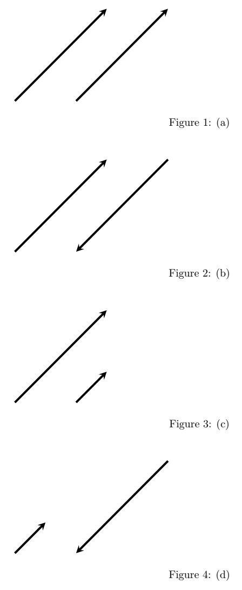

#### 2. 영벡터와 단위벡터
원점 (0,0,0)은 방향이 없고, 크기도 0이기 때문에 **영벡터zero vector** 라고 하고, 0으로 나타낸다. 그리고 크기가 1인 벡터를 **단위벡터unit vector** 라고 한다. 직교 좌표계에서 $x,y,z$ 의 방향으로 각각 크기가 1인 벡터를 $i,j,k$ 로 나타내는데, 이들이 바로 각각의 축 상에서의 단위 벡터다.

#### 3. 오른손 법칙과 오른손 좌표계
좌표축 위의 세 벡터 $a, b, c$ 의 방향을 그림과 같이 오른손을 폈을 때 엄지, 검지, 중지가 가리키는 방향이라 가정하자. 벡터 a를 벡터 b의 방향 $\theta$ 만큼 회전 시킬 때의 벡터 c의 방향은, 오른나사right-handed screw를 돌릴 때의 회전 방향에 따른 진행 방향과 일치한다. 이와 같이 오른손 법칙이 적용되는 좌표계를 오른손 좌표계라고 한다.

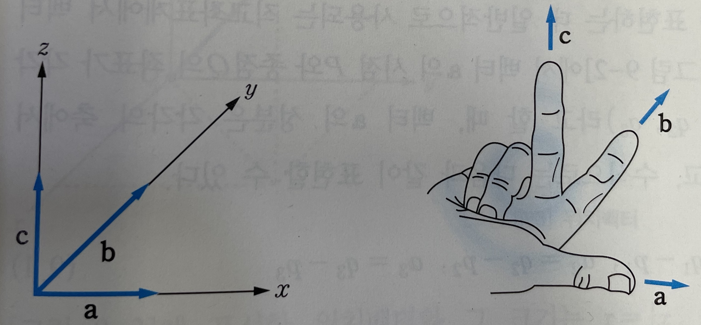

### 9.1 벡터의 기본 개념
**스칼라scalar** 는 크기에 의해서만 결정되는 양이고, **벡터vector** 는 크기와 방향에 의해 결정되는 양이다. 예를 들어, 질량과 속력은 스칼라이고, 힘과 속도는 크기와 방향을 가지므로 벡터에 해당된다.

#### 벡터의 표현
벡터는 화살표로 나타내는데, 벡터가 시작되는 화살표의 꼬리를 **시점initial point** 이라고 하고, 벡터의 마지막 부분인 화살표의 머리를 **종점terminal point** 이라고 한다. [그림 9-1]에서와 같이 어떤 도형이 평행이동한 경우, 벡터 a는 시점인 P에서 종점인 Q까지의 벡터이므로 벡터 $\overrightarrow{PQ}$ 로 나타내기도 한다. 이때 방향과는 상관없이 화살표의 길이만을 나타내는 양을 벡터 a의 **크기magnitude** 라 하고 $|a|$ 와 같이 나타낸다.

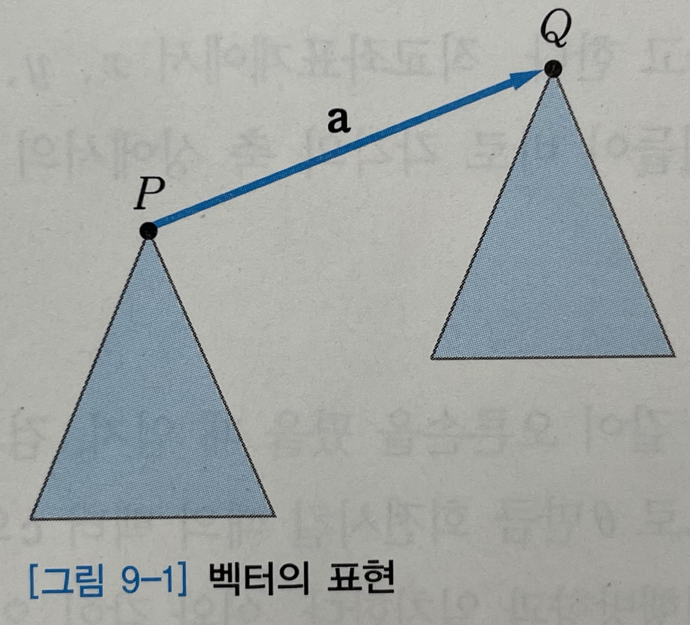

#### 벡터의 성분
[그림 9-2]는 공간을 표현하는데 일반적으로 사용되는 직교좌표계에서 벡터 a를 표현한 것이다. [그림 9-2]에서 벡터 a의 시점 P와 종점 Q의 좌표가 각각 $(p_1, p_2, p_3)$ 와 $(q_1, q_2, q_3)$ 라고 할 때, 벡터 a의 성분은 각각의 축에서 $a_1, a_2, a_3$ 로 나타나고, 수식으로는 다음과 같이 표현할 수 있다.

- 식(9.1)

$$
a_1 = q_1-p_1, a_2 = q_2-p_2, a_3 = q_3-p_3
$$

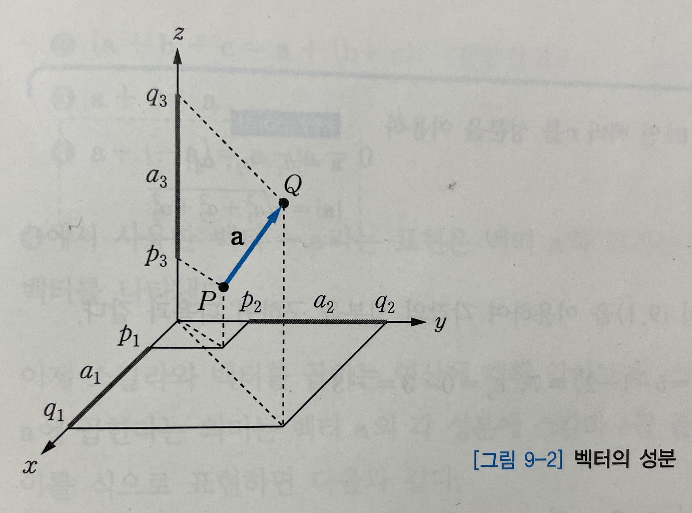

벡터 a는 다음과 같이 성분으로 표기할 수도 있다.

- 식(9.2)

$$
a = [a_1, a_2, a_3]
$$

앞에서 설명한 벡터 a의 크기를 성분으로 표시하면 다음과 같다.

- 식(9.3)

$$
|a| = \sqrt{a_1^2 + a_2^2 + a_3^2}
$$

시점이 좌표계의 원점 (0, 0, 0)인 벡터를 **위치벡터position vector** 라 한다. 그러므로 종점이 $A(a_1, a_2, a_3)$ 인 위치벡터 r을 도시하면 그림 9-3과 같으며, 이 벡터의 크기는 $|r| = \sqrt{a_1^2 + a_2^2 + a_3^2}$ 이다.

- [그림 9-3]
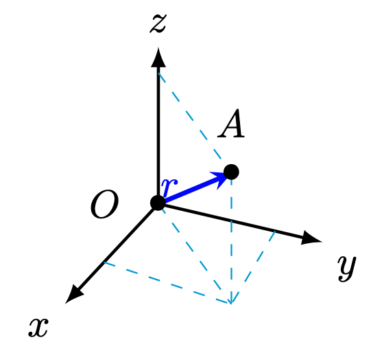

[그림 9-3]에 표시한 위치벡터와 그 크기는 $r = [x, y, z]$ 그리고 $|r| = \sqrt{x^2 + y^2 + z^2}$ 과 같이 위치벡터의 성분으로 나타낼 수 있다.

#### 벡터의 기본 연산
벡터의 기본적이 ㄴ연산법에 대해 살펴보자. 벡터 $a = [a_1, a_2, a_3]$ 와 $b = [b_1, b_2, b_3]$ 가 있을 때, 두 벡터의 합은 다음과 같이 각각의 성분의 합으로 정의한다.

- 식(9.4)

$$
a+b = [a_1+b_1, a_2+b_2, a_3+b_3]
$$

[그림 9-4]는 식(9.4)를 x, y평면에서 도시한 것이다.

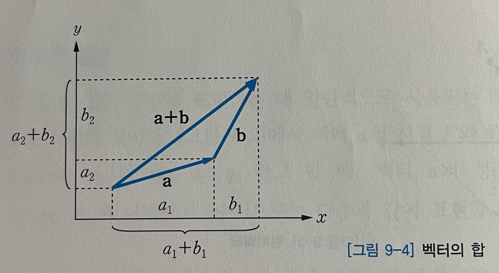

이 때 벡터의 합은 다음과 같은 성질을 갖는다.

- (1) 교환법칙: $a+b = b+a$
- (2) 결합법칙: $(a+b)+c = a+(b+c)$
- (3) $a+0=a$
- (4) $a+(-a) = a-a = 0$

(4)에서 사용한 벡터 $-a$ 라는 표현은 벡터 $a$ 와 크기는 같지만 방향이 반대인 벡터를 나타낸다.

이제 스칼라와 벡터를 곱하는 여산에 대해 알아보자. 스칼라량 c(실수)를 벡터 $a$ 에 곱한다는 의미는 벡터 $a$ 의 각 성분에 스칼라 c를 곱한다는 뜻이다. 따라서 이를 식으로 표현하면 다음과 같다.

- 식(9.5)

$$
ca = [c \textbf{a_1}, c \textbf{a_2}, c \textbf{a_3}]
$$

스칼라량을 벡터에 곱하는 연산은 다음과 같은 성질을 갖는다.

- (1) $c(a+b) = ca+cb$
- (2) $(c+d)a = ca + da$
- (3) $c(da) = (cd)a = cda$

각각의 축에서 크기가 1인 **단위벡터unit vector** i, j, k의 합을 이용하여 임의의 벡터를 표현할 수도 있다. 먼저 각각 x, y, z 축의 단위벡터인 i, j, k를 성분으로 나타내면

- 식(9.6)

$$
i = [1, 0, 0], j = [0, 1, 0], k = [0, 0, 1]
$$ 

이고, [그림 9-5]는 단위벡터 i, j, k를 도시한 것이다.

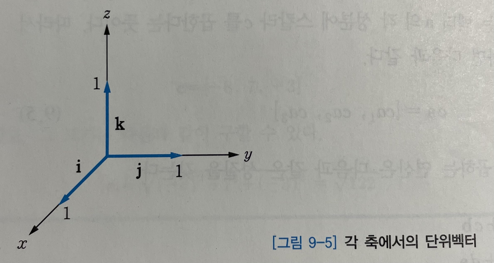

성분 $a_1, a_2, a_3$ 를 갖는 벡터 $a$ 는 식(9.6)을 이용하면 다음과 같이 나타낼 수 있다.

- 식(9.7)

$$
a = [a_1, a_2, a_3] = a_1 i + a_2 j + a_3 k
$$

### 9.2 벡터의 내적
벡터의 **내적inner product** 은 벡터의 곱이 스칼라량으로 산출되는 연산이다. 두 벡터 a와 b의 내적을 정의하면 다음과 같다.

- 식(9.8)

$$
a \cdot b = |a||b|\cos \theta
$$

식(9.8)에서 $\theta$ 는 두 벡터의 사잇각을 의미한다. 두 벡터가 모두 0이 나닌 경우의 사잇각이다. 왜냐하면 영벡터와의 사잇각은 정의되지 않기 때문이다.

두 벡터가 각각 $a=[a_1, a_2, a_3], b=[b_1, b_2, b_3]$ 이면 다음과 같이 벡터의 성분을 이용하여 내적을 표현할 수도 있다.

- 식(9.9)
$$
a \cdot b = a_1 b_1 + a_2 b_2 + a_3 b_3
$$

[그림 9-6]은 두 벡터의 내적과 사잇각과의 관계를 나타낸 것이다.

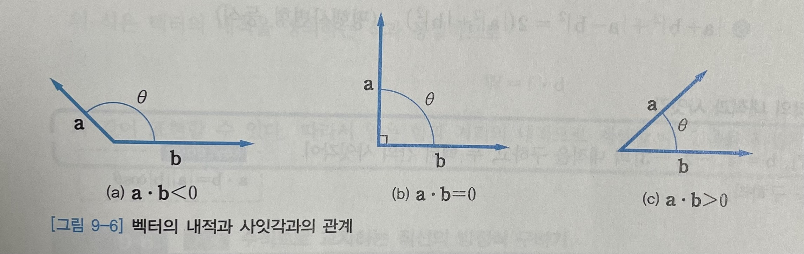

[그림 9-6]의 (b)와 같은 경우, 즉

- 식(9.10)

$$
a \cdot b = 0
$$

이 성립할 때 두 벡터 a와 b는 **직교orthogonal** 한다고 한다. 이와 같이 두 벡터가 직교하는 성질 (두 벡터의 내적이 0일 때)을 **직교성orthogonality** 이라고 한다.

식(9.8)에서의 두 벡터를 동일한 벡터 a라고 가정하면 벡터의 내적, 즉 자신과의 내적은 다음과 같이 정의한다.

- 식(9.11)

$$
a \cdot a = |a|^2
$$

따라서 다음과 같이 쓸 수 있다.

- 식(9.12)

$$
|a| = \sqrt {a \cdot a}
$$

또한 두 벡터의 사잇각에 대한 코사인 값은 다음과 같이 나타낼 수 있다.

- 식(9.13)

$$
\cos \theta = \cfrac{a \cdot b}{|a||b|} = \cfrac{a \cdot b}{\sqrt{a \cdot a} \sqrt{b \cdot b}}
$$

#### 벡터의 내적에 관한 성질
벡터 a, b, c로 내적에 대한 성질을 정리하면 다음과 같다. 이 때 m과 n은 스칼라량으로, 실수다.

- (1) 대칭성: $a \cdot b = b \cdot a$
- (2) 선형성: $(m \textbf{a}+n \textbf{b}) \cdot \textbf{c} = m \textbf{a \cdot b} + n \textbf{b \cdot c}$
- (3) 양의 정치성: $a \cdot a = |a|^2 = 0$ 이면 $a = 0$
- (4) 슈발츠 부등식: $|a \cdot b| \leq |a||b|$
- (5) 삼각형 부등식: $|a+b| \leq |a|+|b|$
- (6) 평행사변형 등식: $|a+b|^2+|a-b|^2 = 2(|a|^2+|b|^2)$

### 9.3 벡터의 외적
벡터 a와 b의 **외적cross product** 은 다음과 같이 정의된다.

- 식(9.14)

$$
v=a \times b
$$

벡터의 내적은 스칼라로 나타나는 데 비해, 벡터의 외적은 벡터로 나타난다는 사실을 알 수 있다.

식(9.14)에 표현한 벡터의 외적의 크기는 다음과 같다.

- 식(9.15)

$$
|v| = |a||b|\sin \theta
$$

식(9.15)는 벡터 a와 b로 이루어지는 평행사변형의 면적을 나타낸다. [그림 9-8]은 벡터 a와 b로 이루어지는 평행사변형과 그 외적 $a \times b$ 를 나타낸 것이다.

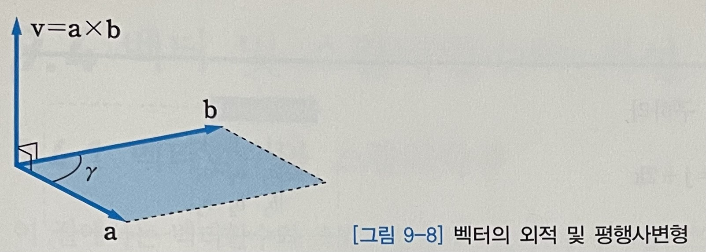

벡터의 외적 $a \times b$ 의 방향은 벡터 a와 b 모두에 수직인 방향(지면의 아랫방향)이다. 또 $a \times b$ 의 방향은 a, b, v의 순서대로 오른손 법칙을 만족한다.

벡터의 외적을 성분으로 표시하면 다음과 같다.

- 식(9.16)

$$
v = [v_1, v_2, v_3] = [a_2b_3 - a_3b_2, a_3b_1 - a_1b_3, a_1b_2 - a_2b_1]
$$

3차 행렬식을 이용하면 식(9.16)을 다음과 같이 나타낼 수 있다.

- 식(9.17)

$$
v = v_1 \textbf{i} + v_2 \textbf{j} + v_3 \textbf{k} = \begin{vmatrix}\
    \textbf{i} & \textbf{j} & \textbf{k}\\\ \
    a_1 & a_2 & a_3\\\ \
    b_1 & b_2 & b_3
\end{vmatrix}
$$

#### 벡터의 외적에 관한 성질
벡터 a, b, c를 사용하여 벡터의 외적에 대한 성질을 정리해보자.

- (1) $a \times (b + c) = (a \times b) + (a \times c)$
- (2) $(a+b) \times c = (a \times c) + (b \times c)$
- (3) $b \times a = -(a \times b)$
- (4) $a \times (b \times c) \neq (a \times b) \times c$

위 식에서 (1)과 (2)는 분배법칙이 성립한다는 사실을 나타내고 (3)과 (4)는 각각 교환법칙과 결합법칙이 성립하지 않는다는 사실을 나타낸 것이다.

### 9.4 벡터 및 스칼라 함수와 곡선
#### 9.4.1 벡터 함수와 스칼라 함수
이 절에서는 벡터함수와 스칼라함수의 미분법을 살펴볼 것이다. 먼저 벡터함수에 대해 논의하기 위해 9.1절에서 설명한 위치벡터를 이용할 것이다. 위치벡터를 단위벡터로 나타낸면 다음과 같이 쓸 수 있다.

- 식(9.18)

$$
r = [x, y, z] = x \textbf{i} + y \textbf{j} + z \textbf{k}
$$

위 식에서 성분 x, y, z를 임의의 변수를 가진 함수 $r_1(P), r_2(P), r_3(P)$ 라고 생각하면, 다음과 같이 나타낼 수 있다.

- 식(9.19)

$$
r = r(P) = [r_1(P), r_2(P), r_3(P)] = r_1(P)i + r_2(P)j + r_3(P)k
$$

식(9.19)는 벡터를 함수값으로 하고 있따. 따라서 $r(P)$ 와 같은 형태를 **벡터함수vector function** 라고 한다. 또 이와 같은 함수가 정의되어 있는 공간을 **벡터장vector field** 이라고 한다. 

식(9.19)에서 각각의 성분 $r_1(P), r_2(P), r_3(P)$ 는 점 P에서 함수값이 스칼라로 주어지는 함수를 의미한다. 이와 같은 함수는 직교좌표계에서

- 식(9.20)

$$
f = f(P) = f(x, y, z)
$$

와 같이 정의할 수 있으며, 이를 **스칼라함수scalar function** 라고 한다. 스칼라함수가 정의되어 있는 공간은 **스칼라장scalar field** 이라고 한다.

벡터함수를 직교좌표계에서 정의하면 다음과 같이 표현할 수도 있다.

- 식(9.21)

$$
r(P) = r(x, y, z) = [r_1(x, y, z) r_2(x, y, z), r_3(x, y, z)]
$$

공간상에 존재하는 임의의 곡선에서 각 점에서의 접선벡터가 벡터함수의 예다. 점의 위치에 따라 크기와 방향이 달라지기 때문이다. 반면, 고정된 점에서 임의의 점까지의 거리를 나타내는 함수는 스칼라함수다. 방향은 상관없이 크기(거리)만 달라지는 함수이기 때문이다.

##### 벡터함수의 미분
다음과 같은 벡터함수 r(t)가 존재할 때

- 식(9.22)

$$
r(t) = [r_1(t), r_2(t), r_3(t)] = r_1(t)i + r_2(t)j + r_3(t)k
$$

벡터함수 r(t)의 도함수 $r'(t)$ 는 다음과 같이 정의한다.

- 식(9.23)

$$
r'(t) = [r_1'(t), r_2'(t), r_3'(t)]
$$

벡터함수에서의 각 성분은 스칼라함수이므로 벡터함수의 비분법은 스칼라함수의 미분법과 동일하다.

다음은 벡터함수의 미분에 관한 법칙이다.

- (1) $(u+v)' = u' + v'$
- (2) $(u \cdot v)' = u' \cdot v + u \cdot v'$
- (3) $(u \times v)' = u' \times v + u \ times v'$
- (4) $(u v w)' = (u' v w) + (u v' w) + (u v w')$

벡터함수의 편도함수도 스칼라함수의 미분법과 똑같이 적용된다는 사실도 기억해 두자.

#### 9.4.2 벡터함수와 곡선
다음과 같은 벡터함수 r(t)는 3차원 공간에서 곡선 C를 나타내는 것으로 생각할 수 있다.

- 식(9.24)

$$
r(t) = [x(t), y(t), z(t)] = x(t)i + y(t)j + z(t)k
$$

그러므로 식(9.24)는 t를 매개변수로 하는 곡선의 방정식이 된다. 식(9.24)는 곡선의 방향을 나타내기도 하는데, t가 증가할 때 곡선이 향하는 방향을 곡선의 **양의 방향positive sense** , t가 감소할 때 곡선이 향하는 방향을 곡선의 **음의 방향negative sense** 이라고 한다.

##### 대표적인 곡선의 벡터함수 표현
[그림 9-9]와 같이 점 A를 지나고, 상수벡터 b의 방향으로 진행하는 직선은 다음과 같이 나타낸다.

- 식(9.25)

$$
r(t) = \textbf{a} + t \textbf{b} = [a_1 + tb_1, a_2 + tb_2, a_3 + tb_3]  
$$

식(9.25)에서 벡터 a는 점 A의 위치를 나타내는 위치벡터다.

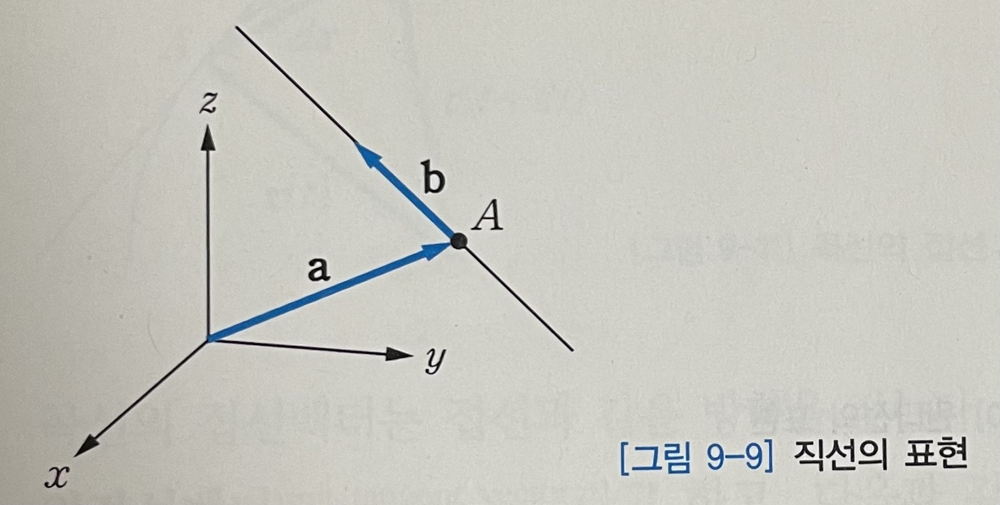

원점을 중심으로 하고, xy평면상에 존재하는 타원은 다음과 같이 나타낸다.

- 식(9.26)

$$
r(t) = a \cos t \textbf{i} + b \sin t \textbf{j} = [a \cos t, b \sin t, 0]
$$

식(9.26)에서 $x(t) = a \cos t, y(t) = b \sin t$ 이므로 

$$
\cos t = \cfrac{x}{a}, \sin t \ \cfrac{y}{b}
$$

이고, 각각 양변을 제곡하여 두 식을 더하면 다음과 같다.

$$
\cfrac{x^2}{a^2}+\cfrac{y^2}{b^2} = \cos^2t + \sin^2t
$$

이 때, $\cos^2t + \sin^2t = 1, z=0$ 이므로 다음과 같은 타원의 방정식이 된다.

$$
\cfrac{x^2}{a^2}+\cfrac{y^2}{b^2} = 1, z = 0
$$

위의 식에서 $a \eq b$ 이면

$$
x^2+y^2 = a^2, z=0
$$

과 같이 반지름이 a인 원의 방정식이 된다. [그림 9-10]과 같이 원기둥을 감으며 이동하는 곡선을 **원나선circular helix** 이라고 하며, 원나선은 다음과 같은 벡터함수로도 표현할 수 있다.

- 식(9.27)

$$
r(t) = a \cos t \textbf{i} + b \sin t \textbf{j} + ct \textbf{k} = [a \cos t, b \sin t, ct]
$$

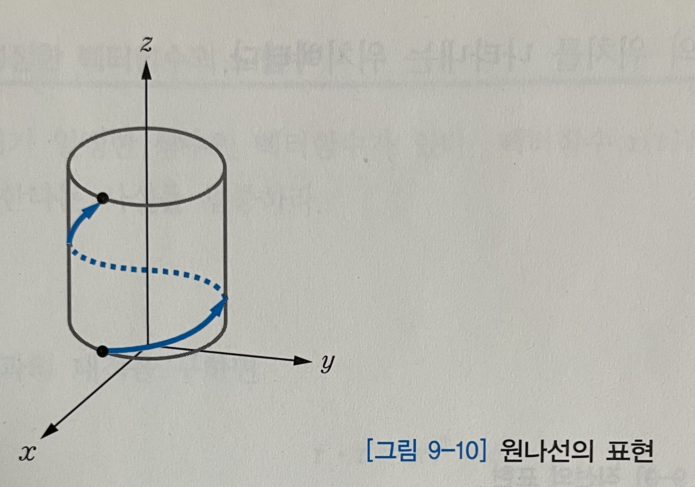

##### 곡선의 접선, 길이, 호의 길이
곡선 위에 있는 임의의 점 A에서 곡선의 양의 방향에 따라 이동하는 경우, 미소 변위 $d \textbf{r}$ 은 다음과 같이 표현할 수 있다. ([그림 9-11]).

- 식(9.28)

$$
d \textbf{r} = \textbf{r}(t +dt) - \textbf{r}(t)
$$

식(9.28)에서 $dt \rightarrow 0$ 이 되면 곡선에 접하는 벡터가 된다. 그러므로 곡선의 **접선벡터tangent vector** 는 다음과 같은 식으로 나타낼 수 있다.

- 식(9.29)

$$
\textbf{r}'(t) = \cfrac{d \textbf{r}(t)}{dt} = \cfrac{d}{dt}[\textbf{r}(t+dt)-\textbf{r}(t)]
$$

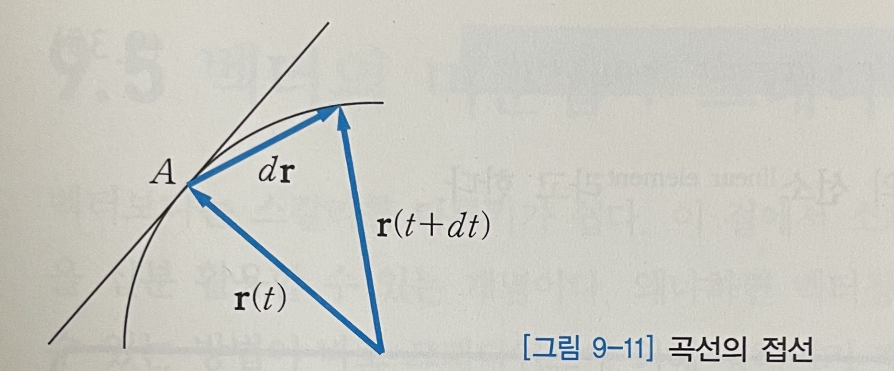

곡선의 접선벡터는 접선과 같은 방향을 갖는다. 또 $\textbf{r}'(t)$ 방향의 단위벡터를 **단위접선벡터unit tangent vector** 라고 하고, 다음과 같이 표현한다.

- 식(9.30)

$$
u = \cfrac{\,dr}{|dr|} = \cfrac{r'}{|r'|}
$$

구간 $t_0 \leq t \leq t_n$ 인 곡선 $r(t)$ 의 **길이length** 는 다음 식으로 구할 수 있다.

- 식(9.31)

$$
l = \int_{t_0}^{t_n} \sqrt{r'(t) \cdot r'(t)}dt
$$

식(9.31)의 적분구간에서 상한을 나타내는 상수 $t_n$ 을 변수인 t로 바꾸면, 다음과 같이 **호의 길이함수arc length function** 를 구할 수 있다.

- 식(9.32)

$$
s(t) = \int_{t_0}^{t} \sqrt{r'(t) \cdot r'(t)}d \tilde t
$$

식(9.32)에서 적분변수로 $\tilde t$ 를 사용한 이유는 적분의 상한으로 t를 사용했기 대문이다. 일반적으로 $t_0=0$ 으로 하는 경우가 많다.

식(9.32)를 미분하여 제곱하면 다음과 같은 식을 얻을 수 있다.

- 식(9.33)

$$
\left(\cfrac{ds}{dt}\right)^2 = \cfrac{d\textbf{r}}{dt}\cdot\cfrac{d\textbf{r}}{dt} = |\textbf{r}'(t)|^2 = \left(\cfrac{dx}{dt}\right)^2+\left(\cfrac{dy}{dt}\right)^2+\left(\cfrac{dz}{dt}\right)^2
$$ 

곡선의 벡터함수를 

$$
\textbf{r}(t) = [x(t), y(t), z(t)] = x(t)\textbf{i} + y(t)\textbf{j} + z(t)\textbf{k}
$$

와 같이 표현하므로 $d\textbf{r}$ 은 다음과 같이 쓸 수 있다.

- 식(9.34)

$$
d\textbf{r}(t) = [dx(t), dy(t), dz(t)] = dx(t)\textbf{i} + dy(t)\textbf{j} + dz(t)\textbf{k}
$$

그러므로

- 식(9.35)

$$
ds^2 = d\textbf{r} \cdot d\textbf{r} = dx^2 + dy^2 + dz^2
$$

이 되고, 위의 ds를 곡선의 **선소linear element** 라고 한다.

### 9.5 벡터의 미분법: 그래디언트
벡터보다는 스칼라를 다루기가 쉽다. 이 절에서 소개할 그래디언트는 그런 면을 십분 활용할 수 잇는 개념이다. 왜냐하면 벡터장을 스칼라장으로부터 얻을 수 있는 방법이 바로 그래디언트에 의해 정해지기 때문이다. 공간 변화율, 법선 벡터 등 벡터의 미분법에 해당되는 그래디언트는 유용하게 이용되는 면이 많다. 그러므로 여기서 소개되는 그래디언트의 개념을 확실히 이해하는 것은 매우 중요하다.

먼저 **그래디언트gradient** 의 정의부터 알아보자. 스칼라함수 $f(x,y,z)$ 의 그래디언트는 $grad f$ 또는 $\nabla f$ 라고 표기하며, 다음과 같은 벡터함수로 나타낸다.

- 식(9.36)

$$
grad f = \nabla f = \frac{\partial f}{\partial x}\textbf{i} + \frac{\partial f}{\partial y}\textbf{j} + \frac{\partial f}{\partial z}\textbf{k} = \left[\frac{\partial f}{\partial x}, \frac{\partial f}{\partial y}, \frac{\partial f}{\partial z}\right]
$$

이 때 미분연산자 $\nabla$ 만을 고려하면 다음과 같이 나타낸다.

- 식(9.37)

$$
\nabla = \cfrac{\partial}{\partial x}\textbf{i} + \cfrac{\partial}{\partial y}\textbf{j} + \cfrac{\partial}{\partial z}\textbf{k}
$$

#### 방향도함수
스칼라함수 $f$ 가 공간상에서 특정 방향에 따라 변화하는 비율을 알고자 하는 것이 **방향도함수directional derivative** 다. 공간상의 한 점 P에서 Q로 벡터 m이 진행되는 방향으로 f의 방향도함수는 다음과 같이 정의된다.

- 식(9.38)

$$
D_mf = \cfrac{df}{ds} = \lim_{s \to 0} \cfrac{f(Q)-f(P)}{s}
$$

식(9.38)에서 s는 점 P에서 Q까지의 거리다. 벡터 m을 단위벡터라고 가정하면 직선의 방정식은 다음과 같이 나타낼 수 잇다.

- 식(9.39)

$$
r(s) = x(s)i + y(s)j + z(s)k = p_0 + sm, (s \geq 0)
$$

식(9.39)에서 $P_0$ 는 점 P의 위치벡터다. 함수 f는 호의 길이 s에 대한 함수 $f[x(s), y(s), z(s)]$ 이므로, 사슬법칙을 이용하면 식 (9.38)은

$$
D_mf = \cfrac{df}{ds} = \cfrac{\partial f}{\partial x}\cfrac{dx}{ds} + \cfrac{\partial f}{\partial y}\cfrac{dy}{ds} + \cfrac{\partial f}{\partial z}\cfrac{dz}{ds}
$$

와 같이 되고, 결국

- 식(9.40)

$$
D_mf = \cfrac{df}{ds} = \cfrac{\partial f}{\partial x}x'(s) + \cfrac{\partial f}{\partial y}y'(s) + \cfrac{\partial f}{\partial z}z'(s)
$$

와 같이 표현할 수 있다. 식(9.39)를 미분하면

$$
\textbf{r}'(s) = x'(s)i+y'(s)j+z'(s)k = \cfrac{d}{ds} \left[\textbf{p}_ 0 + s \textbf{m}\right] = m
$$

이 된다. 또한 식(9.40)은

$$
D_mf = \cfrac{\partial f}{\partial x}x'(s) + \cfrac{\partial f}{\partial y}y'(s) + \cfrac{\partial f}{\partial z}z'(s) = (x'(s)i+y'(s)j+z'(s)k) \cdot \left(\cfrac{\partial f}{\partial x}\textbf{i} + \cfrac{\partial f}{\partial y}\textbf{j} + \cfrac{\partial f}{\partial z}\textbf{k} \right) = r' \cdot \nabla f
$$

가 된다. 결과적으로 방향도함수 $D_mf$ 는 

- 식(9.41)

$$
D_mf = \cfrac{df}{ds} = m \cdot \nabla f
$$

와 같이 표현할 수 있다. 또 단위 벡터가 아닌 일반 벡터 a가 진행되는 방향으로 방향도함수는 다음과 같이 나타낸다.

$$
D_af = \cfrac{df}{ds} = \cfrac{1}{|a|}a \cdot \nabla f
$$

#### 곡면법선벡터
공간 위엥서의 곡선이 다음과 같이 표현된다고 가정하자.

- 식(9.43)

$$
r(t) = [x(t), y(t), z(t)] = x(t)i + y(t)j + z(t)k
$$

이 곡선이 존재할 수 있는 곡면은 다음과 같이 나타난다.

- 식(9.44)
$$
f(x(t), y(t), z(t)) = c
$$

위 식에서 c는 상수다. 그리고 위에서 나타낸 곡선의 접선벡터는 식(9.29)를 이용하면 다음과 같이 나타낼 수 있다.

$$
r'(t) = x'(t)i + y'(t)j + z'(t)k
$$

한편, 곡면 위의 한 점에서는 많은 접선벡터를 생각할 수 있을 것이고, 그 접선벡터들은 하나의 면을 이루게 될 것이다. 그 평면을 **접평면tangent plane** 이라고 하며, 이 접평면에 대한 법선을 **곡면법선surface normal** , 곡면법선과 평행인 벡터를 **곡면법선벡터surface normal vector** 라고 한다.

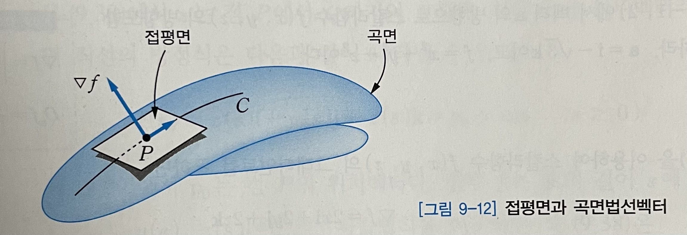

식(9.44)에 사슬법칙을 적용하여 t로 미분하면 다음과 같이 된다. 

$$
\cfrac{df}{dt} = \cfrac{\partial f}{\partial x}x'(t) + \cfrac{\partial f}{\partial y}y'(t) + \cfrac{\partial f}{\partial z}z'(t) = \left(\cfrac{\partial f}{\partial x}\textbf{i} + \cfrac{\partial f}{\partial y}\textbf{j} + \cfrac{\partial f}{\partial z}\textbf{k} \right) \cdot (x'i+y'j+z'k) = \nabla f \cdot r' = 0
$$

$\nabla f \cdot r' = 0$ 이 되는 것은 식(9.44)에서 나타낸 것처럼 f=c(상수)이기 때문이다. 결과적으로 벡터의 직교성에 의해 $\nabla f$ 는 모든 접선 벡터 r', 즉 접평면과 수직이라는 사실을 확인할 수 있다. 따라서 곡면을 나타내는 함수 f의 그래디언트인 $\nabla f$ 는 곡면법선벡터의 역할을 한다.

따라서 **단위곡면법선벡터unit surface normal vector** 는 다음과 같이 계산할 수 있다.

- 식(9.46)

$$
n = \cfrac{\nabla f}{|\nabla f|}
$$

### 9.6 벡터의 미분법: 발산, 회전

#### 9.6.1 벡터장의 발산
$v_1, v_2, v_3$를 성분으로 하는 벡터함수 v(x, y, z)가 존재할 때, v에 의해 정의되는 벡터장의 **발산divergence** 은 다음과 같이 정의한다.

- 식(9.47)

$$
div v = \nabla \cdot v = \cfrac{\partial v_1}{\partial x} + \cfrac{\partial v_2}{\partial y} + \cfrac{\partial v_3}{\partial z}
$$

v의 성분이 $v_1, v_2, v_3$ 이기 때문에 v를 다음과 같이 나타낼 수 있다.

$$
v(x,y,z) = [v_1, v_2, v_3] = v_1i + v_2j +v_3k
$$

그러므로 $\nabla \cdot v$ 는 ㅏ음과 같이 계산되는 것을 알 수 있다.

$$
\nabla \cdot v = \left(\cfrac{\partial}{\partial x}\textbf{i} + \cfrac{\partial}{\partial y}\textbf{j} + \cfrac{\partial}{\partial z}\textbf{k} \right) \cdot (v_1i+v_2j+v_3k)\\\ \
= \cfrac{\partial}{\partial x}v_1 + \cfrac{\partial}{\partial y}v_2 + \cfrac{\partial}{\partial z}v_3 = \cfrac{\partial v_1}{\partial x} + \cfrac{\partial v_2}{\partial y} + \cfrac{\partial v_3}{\partial z}
$$

이때 $\nabla f$ 는 벡터인데 반해, 발산 $\nabla \cdot v$ 는 스칼라라는 사실을 기억해 두자.

두 번 미분가능한 스칼라함수 f(x,y,z)가 있을 때, 그래디언트는

$$
\nabla f = \cfrac{\partial f}{\partial x}\textbf{i} + \cfrac{\partial f}{\partial y}\textbf{j} + \cfrac{\partial f}{\partial z}\textbf{k}
$$

와 같이 표현하므로, 그래디언트에 대한 발산은 식(9.47)에 의해 

$$
div (\nabla f) = \nabla \cdot (\nabla f) = \left(\cfrac{\partial}{\partial x}\textbf{i} + \cfrac{\partial}{\partial y}\textbf{j} + \cfrac{\partial}{\partial z}\textbf{k} \right) \cdot \left(\cfrac{\partial f}{\partial x}\textbf{i} + \cfrac{\partial f}{\partial y}\textbf{j} + \cfrac{\partial f}{\partial z}\textbf{k}\right) 
$$

가 된다. 그러므로 

- 식(9.48)

$$
div (\nabla f) = \nabla \cdot (\nabla f) = \cfrac{\partial^2 f}{\partial x^2} + \cfrac{\partial^2 f}{\partial y^2} + \cfrac{\partial^2 f}{\partial z^2}
$$

라는 식이 성립하게 되고, 결과적으로 다ㅡㅇㅁ과 같은 식을 얻게 된다.

- 식(9.49)

$$
div (\nabla f) = \nabla^2 f
$$

식(9.49)에서 $\nabla^2$ 을 **라플라스 연산자Laplace operator** 라고 하고, $\nabla^2 f = 0$ 을 라플라스 방정식이라고 한다.

발산의 값이 양이면 **소스source** , 음이면 **싱크sink** 가 주어진다고 한다. 소스는 물이 쏟아져 나오는 수도꼭지, 싱크는 물이 빠져 나가는 배수구와 유사한 역할이라고 생각하면 된다. 즉 발산의 값이 양이면 들어오는 것이 나가는 것보다 많다는 의미이고, 발산의 값이 음이면 들어오는 것보다 나가는 것이 더 많다는 의미다. 발산의 값이 0이라는 것은 유입량과 유출량이 동일하다는 의미다.

#### 9.6.2 벡터장의 회전
다음과 같이 $v_1, v_2, v_3$ 를 성분으로 하는 벡터 함수가 있다고 하자.

$$
v(x,y,z) = [v_1, v_2, v_3] = v_1i + v_2j +v_3k
$$

벡터함수 v에 의해 정의되는 벡터장의 **회전curl** 은 다음과 같이 정의한다.

- 식(9.50)

$$
curl \textbf{v} = \nabla \times v = \begin{vmatrix}\
    i & j & k\\\ \
    \frac{\nabla}{\nabla x} & \frac{\nabla}{\nabla y} & \frac{\nabla}{\nabla z}\\\ \
    v_1 & v_2 & v_3
\end{vmatrix}
$$

식(9.50)의 행렬식을 풀어서 다음과 같이 표현할 수 있다.

- 식(9.51)

$$
curl \textbf{v} = \nabla \times v = \left( \cfrac{\partial v_3}{\partial y} - \cfrac{\partial v_2}{\partial z} \right)i + \left( \cfrac{\partial v_1}{\partial z} - \cfrac{\partial v_3}{\partial x} \right)j + \left( \cfrac{\partial v_2}{\partial x} - \cfrac{\partial v_1}{\partial y} \right)k
$$

**그래디언트의 회전** 은 다음과 같은 결과를 낳는다.

- 식(9.52)

$$
curl (\nabla f) = \nabla \times (\nabla f) = 0
$$

위 식은 벡터함수가 스칼라함수의 그래디언트($\nabla f$ )라면, 그 벡터의 회전은 0(영벡터)이 된다는 사실을 나타낸다.

또한 **회전의 발산** 에 대해 확인해 보면

- 식(9.53)

$$
div (curl \textbf{v}) = \nabla \cdot (\nabla \times v) = 0
$$

과 같이 되는 것을 알 수 있다. 즉 벡터함수의 회전으로부터는 발산(들어오는 양과 나가는 양의 차이)이 발생하지 않는다는 결론을 내릴 수 있다.

## Chapter 10 벡터적분법 (Vector Integral Calculus)

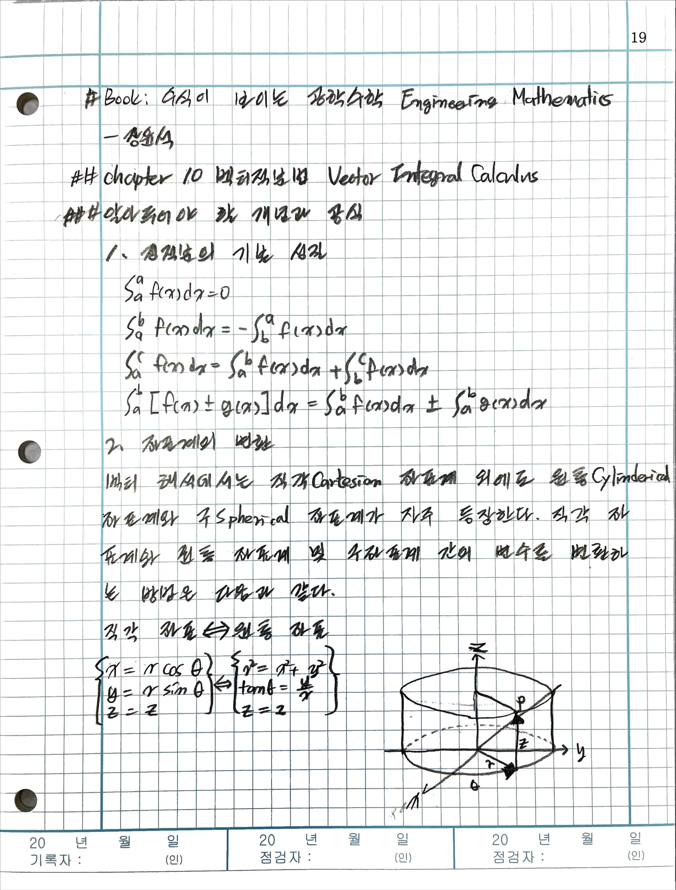