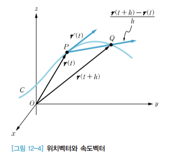
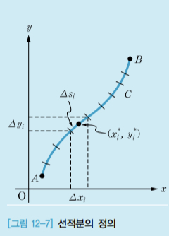
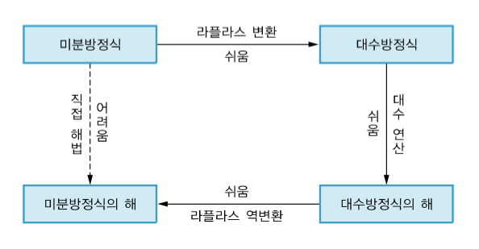

# book: 공학 핵심수학essential engineering mathmatics

- 함남우; 한빛아카데미

## Chapter 06 극한과 연속limit and continuity

### 6.1 함수의 극한

#### 함수의 극한

$y = f(x)$ 함수에서 접근 방법의 수학적 표기

- $x \to X$ : x가 X로 접근한다
- $x \to X^-$ : x가 $X < x$ 인 가장 큰 수로 접근한다
- $x \to X^+$ : x가 $X > x$ 인 가장 작은 수로 접근한다

##### 정의 6-1 함수의 극한

x가 a로 접근할 때 f(x)가 실수 L에 한없이 가까워지면, 실수 L을 x = a에서의 f(x)의 극한 또는 극한값이라 하고 다음과 같이 나타낸다.

$$
\lim_{x \to a}f(x) = L
$$

$\lim_{x \to a}f(x) = L$ 이면, x가 a로 접근할 때 f(x)는 L에 수렴한다converge고 말한다.

##### 정의 6-2 좌극한과 우극한

x가 a의 왼쪽에서 a로 접근할 때 f(x)가 실수 $L_1$ 에 한없이 가까워지면, $L_1$ 을 x = a에서의 f(x)의 좌극한이라 하고 다음과 같이 나타낸다

$$
\lim_{x \to a^-}f(x) = L_1
$$

x가 a의 오른쪽에서 a로 접근할 때 f(x)가 실수 $L_2$ 를 x = a에서의 f(x)의 우극한이라 하고 다음과 같이 나타낸다

$$
\lim_{x \to a^+}f(x) = L_2
$$

좌극한과 우극한의 값은 같을 수도 있고 다를 수도 있다.

#### 극한의 존재성 판정법

함수의 극한의 존재성은 좌극한과 우극한을 이용하여 판정한다.

##### 정리 6-1 극한의 존재성 판정법

1. L이 실수이고 $\lim_{x \to a^-}f(x) = \lim_{x \to a^+}f(x) = L$ 이면, $\lim_{x \to a}f(x) = L$ 이다.
2. $\lim_{x \to a^-}f(x) \neq \lim_{x \to a^+}f(x)$ 이면 $\lim_{x \to a}f(x)$ 는 존재하지 않는다.

##### 양의 무한대와 음의 무한대

어떤 값이 한없이 커질 때 이를 무한대 또는 양의 무한대라고 하고 $\infty$ 로 나타낸다. 또한 어떤 값이 음의 값이면서 한없이 작아질 때 이를 음의 무한대라고 하고 $-\infty$ 로 나타낸다.

$\lim_{x \to a}f(x) = \infty$ 이거나 $\lim_{x \to a}f(x) = -\infty$ 이면 x가 a로 접근할 때 f(x)는 발산한다고 한다.

### 6.2 극한의 기본 연산과 부정형

#### 극한의 기본 연산

##### 정리 6-2 극한의 기본 연산

A, B가 실수일 때, $\lim_{x \to a}f(x) = A$ 이고 $\lim_{x \to a}g(x) = B$ 이면 다음이 성립한다.

1. $\lim_{x \to a}(f(x)+g(x)) = A + B$
2. $\lim_{x \to a}(f(x)-g(x)) = A - B$
3. $\lim_{x \to a}f(x)g(x) = AB$
4. $\lim_{x \to a}\cfrac{f(x)}{g(x)} = \cfrac{A}{B}$
5. k가 실수일 때, $\lim_{x \to a}kf(x) = kA$

#### 부정형의 극한

$x \to a$ 또는 $x \to \pm\infty$ 일 때, 극한 결과가 $\cfrac{0}{0}, \cfrac{\infty}{\infty}, \infty - \infty, \infty \cdot 0$ 과 같은 꼴이 되는 것을 부정형indeterminate form이라 한다.

##### 정리 6-3 $\cfrac{0}{0}$ 꼴 부정형의 극한 계산법

1. 분수함수: 분자와 분모의 공통인수를 찾아 약분한 후 극한을 계산한다
2. 무리함수: 분자 또는 분모에 있는 근호를 유리화하여 약분한후 극한을 계산한다

##### 정리 6-4 $\cfrac{\infty}{\infty}$ 꼴 부정형의 극한 계산법

1. (분자의 차수) > (분모의 차수) 일 때,

$$ 
\lim_{x \to \infty}\cfrac{f(x)}{g(x)} = \infty 또는 \lim_{x \to \infty}\cfrac{f(x)}{g(x)} = -\infty
$$

이다. 이 때 극한은 f(x)의 최고차항의 부호와 g(x)의 최고차항의 부호에 의해 $\infty$ 또는 $-\infty$ 로 결정한다.

2. (분자의 차수) = (분모의 차수) 일 때,

$$
\lim_{x \to \infty}\cfrac{f(x)}{g(x)} = \cfrac{\text{(분자의 최고차항의 계수)}}{\text{(분모의 최고차항의 계수)}}
$$

이다.

3. (분자의 차수) < (분모의 차수) 일 때,

$$
\lim_{x \to \infty}\cfrac{f(x)}{g(x)} = 0
$$

이다.

### 6.3 초월함수의 극한

#### 지수함수와 로그함수의 극한

##### 정리 6-5 지수함수와 로그함수의 극한 계산법

로피탈의 법칙L'Hospital's theorem에 의하여, $x \to \infty$ 일 때 다음 함수의 순서로 더 빠르게 $\infty$ 로 발산한다.

$$
\text{로그함수} < \text{다항함수} < \text{지수함수}
$$

이를 이용하면 다음 결과를 얻을 수 있다.

1. $\lim_{x \to \infty}\cfrac{\text{로그함수}}{\text{다항함수}} = 0$
2. $\lim_{x \to \infty}\cfrac{\text{로그함수}}{\text{지수함수}} = 0$
3. $\lim_{x \to \infty}\cfrac{\text{다항함수}}{\text{로그함수}} = \pm\infty$
4. $\lim_{x \to \infty}\cfrac{\text{다항함수}}{\text{지수함수}} = 0$
5. $\lim_{x \to \infty}\cfrac{\text{지수함수}}{\text{로그함수}} = \pm\infty$
6. $\lim_{x \to \infty}\cfrac{\text{지수함수}}{\text{다항함수}} = \pm\infty$

##### 정리 6-6 무리수 e의 정의를 이용한 극한 계산법

$\lim_{x \to 0}f(x) = 0$ 이면 $\lim_{x \to 0}(1+f(x))^{\cfrac{1}{f(x)}} = e$ 이다.

#### 삼각함수의 극한

##### 정리 6-7 삼각함수의 극한 계산법

$\lim_{x \to 0}f(x) = 0$ 이면 다음이 성립한다.

1. $\lim_{x \to 0}\cfrac{\sin f(x)}{f(x)} = 1$
2. $\lim_{x \to 0}\cfrac{f(x)}{\sin f(x)} = 1$
3. $\lim_{x \to 0}\cfrac{\tan f(x)}{f(x)} = 1$
4. $\lim_{x \to 0}\cfrac{f(x)}{\tan f(x)} = 1$

##### 정리 6-8 조임정리squeeze theorem

L이 실수이고 x = a의 근방에 있는 모든 x에 대하여 $f(x) \leq g(x) \leq h(x)$ 이며

$$
\lim_{x \to a}f(x) = L = \lim_{x \to a}h(x)
$$

이면 $\lim_{x \to a}g(x) = L$ 이다.

### 6.4 함수의 연속

#### 한 점에서 연속

##### 정의 6-3 한 점에서 연속

f(x)가 다음 세 조건을 모두 만족하면, f(x)는 x = a에서 연속이라 한다.

1. $\lim_{x \to a}f(x)$가 존재한다.
2. f(a)가 존재한다.
3. $\lim_{x \to a} = f(a)$ 가 성립한다.

#### 구간에서 연속

##### 정의 6-4 구간에서 연속

f(x)가 구간 I의 모든 점에서 연속이면, f(x)는 구간 I에서 연속이라 한다.

##### 정리 6-9 유리함수가 연속인 점의 집합

유리함수가 연속인 점의 집합은 다음과 같다.

1. 다항함수: 실수 전체 집합인 $\mathbb{R}$ 에서 연속
2. 분수함수: $\mathbb{R} - \text{분모를 0으로 만드는 점}$ 에서 연속

##### 정리 6-10 무리함수가 연속인 점의 집합

무리함수가 연속인 점의 집합은 다음과 같다.

1. 홀수 근호를 갖는 무리함수: 근호 안 함수의 정의역에서 연속
2. 짝수 근호를 갖는 무리함수: 근호 안 함수가 음이 아닌 영역에서 연속

#### 중간값 정리

##### 정리 6-11 중간값 정리
f(x)가 폐구간 [a, b]에서 연속이고 f(a)f(b) < 0 이면, f(c) = 0 을 만족하는 c가 개구간 (a, b)에 적어도 하나 존재한다.

## Chapter 07 미분의 기초Basics of differentiation

### 7.1 미분계수와 도함수

#### 평균변화율

##### 정의 7-1 평균변화율

y = f(x) 이고 x가 a에서 b까지 변할 때,

1. $\Delta x = b - a$ 를 x의 증분이라 한다
2. $\Delta y = f(b) - f(a)$ 를 y의 증분이라 한다
3. $\cfrac{\Delta y}{\Delta x} = \cfrac{f(b) - f(a)}{b - a}$ 를 x가 a에서 b까지 변할 때 f(x)의 평균변화율이라 한다.

#### 순간변화율(미분계수)

##### 정의 7-2 순간변화율

x = a에서의 f(x)의 순간변화율은

$$
f'(a) = \lim_{h \to 0}\cfrac{f(a+h) - f(a)}{h} = \lim_{x \to a}\cfrac{f(x)-f(a)}{x-a}
$$

로 정의한다. x = a에서의 순간변화율을 x = a에서의 미분계수differential coefficient라고도 한다.

#### 도함수

##### 정의 7-3 도함수와 미분

y = f(x)에서 미분가능한 점들의 집합을 A라 할 때 $x \in A$ 에 대하여

$$
f'(x) = \lim_{h \to 0}\cfrac{f(x+h) - f(x)}{h}
$$

를 f(x)의 도함수라 하며 f'(x) 또는 y' 또는 $\cfrac{dy}{dx}$ 로 나타낸다. f(x)의 도함수를 구하는 것을 f(x)를 미분한다고 한다.

##### 정리 7-1 $x^p$ 의 도함수
p가 임의의 실수일 때, $f(x) = x^p$ 의 도함수는 다음과 같다.

$$
f'(x) = px^{p-1}
$$

#### 미분법의 기본 공식

##### 정리 7-2 미분법의 기본공식

미분가능한 두 함수 f(x), g(x)에 대하여 다음이 성립한다.

1. $(f(x)+g(x))' = f'(x) + g'(x)$
2. $(f(x)-g(x))' = f'(x) - g'(x)$
3. c가 상수일 때, $(cf(x))' = cf'(x)$
4. $(f(x)g(x))' = f'(x)g(x) + f(x)g'(x)$
5. $\left(\cfrac{f(x)}{g(x)}\right)' = \cfrac{f'(x)g(x) - f(x)g'(x)}{(g(x))^2}$

### 7.2 합성함수와 매개변수함수의 미분

#### 합성함수의 미분

두 함수 f(x)와 g(x)에 대하여 합성합수composite function는

$$
(g \circ f)(x) = g(f(x))\quad 또는\quad (f \circ g)(x) = f(g(x))
$$

이다.

##### 정리 7-3 연쇄법칙Chain Rule

미분가능한 두 함수 f(x)와 g(x)에 대하여 $F = g \circ f$ 이면, F는 미분가능한 함수이고 F의 도함수는

$$
F'(x) = g'(f(x))f'(x)
$$

이다.

##### 정리 7-4 합성함수의 미분법

1. $F(x) = (f(x))^n$ 이면, $F'(x) = n(f(x))^{n-1}\cdot f'(x)$ 이다.
2. $F(x) = \sqrt[n]{f(x)} = (f(x))^{\cfrac{1}{n}}$ 이면, $F'(x) = \cfrac{1}{n}(f(x))^{\cfrac{1}{n}-1}\cdot f'(x)$ 이다.

#### 매개변수함수의 미분

##### 정의 7-4 매개변수함수

x, y가 매개변수 t에 의해 

$$
x = f(t),\quad y = g(t)
$$

로 표현되면 이 함수를 매개변수함수라 한다.

##### 정리 7-5 매개변수함수의 미분법

$x=f(t)$, $y=g(t)$ 가 모두 t에 대하여 미분가능하고 $f'(t) \neq 0$ 이면

$$
\cfrac{dy}{dx} = \cfrac{\cfrac{dy}{dt}}{\cfrac{dx}{dt}} = \cfrac{g'(t)}{f'(t)}
$$

이다.

또 다른 방법으로 다음과 같다.

$$
\cfrac{dy}{dt} = \cfrac{dy}{dx}\cdot\cfrac{dx}{dt}
$$

연쇄법칙을 이용하면 복잡한 함수를 손쉽게 미분할 수 있다. 예를 들어 $y = (t^2 + 1)^3$ 을 t로 좀 더 쉽게 미분하려면, 우선 $t^2 + 1$ 을 x로 치환하여 주어진 식을 $y = x^3$ 으로 바꿔 쓴다. 그러면 $\cfrac{dy}{dx} = 3x^2$ 이고 $\cfrac{dx}{dt} = 2t$ 이므로 연쇄법칙에 따라 $\cfrac{dy}{dt} = \cfrac{dy}{dx}\cdot\cfrac{dx}{dt} = 3x^2 \cdot 2t = 3(t^2 + 1)^2 \cdot 2t = 6t(t^2 + 1)^2$ 을 얻을 수 있다.

### 7.3 지수함수와 로그함수의 미분

##### 정리 7-6 지수함수와 로그함수의 미분법

1. $y = e^x$ 이면, $y' = e^x$ 이다.
2. $y = \ln x$ 이면, $y' = \cfrac{1}{x}$ 이다.

##### 정리 7-7 연쇄법칙을 이용한 지수함수의 미분법

a가 1이 아닌 양수일 때, 지수함수의 미분법은 다음과 같다.

1. $y = e^{f(x)}$ 이면, $y' = e^{f(x)}\cdot f'(x)$ 이다.
2. $y = a^x$ 이면, $y' = a^x\cdot \ln a$ 이다.
3. $y = a^{f(x)}$ 이면, $y' = a^{f(x)}\cdot f'(x)\cdot \ln a$ 이다.

##### 정리 7-8 연쇄법칙을 이용한 로그함수의 미분법

a가 1이 아닌 양수일 때, 로그함수의 미분법은 다음과 같다.

1. $y = \ln f(x)$ 이면, $y' = \cfrac{1}{f(x)}\cdot f'(x)$ 이다.
2. $y = \log_a x$ 이면, $y' = \cfrac{1}{x}\cdot \cfrac{1}{\ln a}$ 이다.
3. $y = \log_a f(x)$ 이면, $y' = \cfrac{1}{f(x)}\cdot f'(x) \cdot \cfrac{1}{\ln a}$ 이다.

### 7.4 삼각함수의 미분

##### 정리 7-9 삼각함수의 미분법

1. $y = \sin x$ 이면 $y' = \cos x$ 이다.
2. $y = \cos x$ 이면 $y' = -\sin x$ 이다.
3. $y = \tan x$ 이면 $y' = \sec^2 x$ 이다.

##### 정리 7-10 연쇄법칙을 이용한 삼각함수의 미분법

1. $y = \sin f(x)$ 이면, $y' = \cos f(x)\cdot f'(x)$ 이다.
2. $y = \cos f(x)$ 이면, $y' = -\sin f(x)\cdot f'(x)$ 이다.
3. $y = \tan f(x)$ 이면, $y' = \sec^2 f(x)\cdot f'(x)$ 이다.

## Chapter 08 미분의 응용Application of differentiation

### 8.1 함수의 증가와 감소

#### 임계점

##### 정의 8-1 임계점

f(x)의 정의역에 속한 점 x = c 에서 $f'(c) = 0$ 이거나 f'(c) 가 존재하지 않을 때 x = c를 f(x)의 임계점critical point이라 한다.

#### 증가와 감소

##### 정의 8-2 함수의 증가와 감소

I가 구간이고, $f:I \to \mathbb{R}$ 이라 하자.

1. I에서 $x_1 < x_2$ 인 모든 $x_1$ , $x_2$ 에 대하여 $f(x_1) < f(x_2)$ 이면, f(x)는 I에서 증가한다고 한다.
2. I에서 $x_1 < x_2$ 인 모든 $x_1$ , $x_2$ 에 대하여 $f(x_1) > f(x_2)$ 이면, f(x)는 I에서 감소한다고 한다.

##### 정리 8-1 함수의 증가와 감소
I가 구간이고, $f:I \to \mathbb{R}$ 이라 하자.

1. I에 속한 모든 점 x에서 $f'(x) > 0$ 이면, f는 I에서 증가한다.
2. I에 속한 모든 점 x에서 $f'(x) < 0$ 이면, f는 I에서 감소한다.

##### 정리 8-2 증가 구간과 감소 구간 판별법

- 1단계. f(x)의 임계점을 모두 구한다.
- 2단계. 임계점을 이용하여 정의역을 소구간으로 나눈다.
- 3단계. 소구간에서 한 점을 선택하여 그 점에서 f'(x)의 값이 양수이면 소구간에서 함수가 증가한다고 판정하고, f'(x)의 값이 음수이면 소구간에서 함수가 감소한다고 판정한다.

### 8.2 함수의 극대값과 극소값

#### 극대값과 극소값

##### 정의 8-3 극대값과 극소값

$c \in D$ 이고, $f:D \to \mathbb{R}$ 이라 하자.

1. $c \in I \subset D$ 인 적당한 개구간 I가 존재하고 모든 $x \in I$ 에 대하여 $f(x) \leq f(c)$ 이면, f(x)는 x = c에서 극대값 f(c)를 갖는다고 한다.
2. $c \in I \subset D$ 인 적당한 개구간 I가 존재하고 모든 $x \in I$ 에 대하여 $f(x) \geq f(c)$ 이면, f(x)는 x = c에서 극소값 f(c)를 갖는다고 한다.

극대값과 극소값을 통틀어 극값local extreme value이라 한다.

##### 정리 8-3 극값 판정법

f(x)가 x = c에서 연속이고 x = c가 임계점이라 하자. x = c의 근방에서 

1. f'(x)의 부호가 양에서 음으로 바뀌면, f(x)는 x = c에서 극대값 f(c)를 갖는다.
2. f'(x)의 부호가 음에서 양으로 바뀌면, f(x)는 x = c에서 극소값 f(c)를 갖는다.
3. x = c의 근방에서 f'(x)의 부호가 바뀌지 않으면, f(x)는 x = c에서 극값을 갖지 않는다.

#### 최대값과 최소값

##### 정의 8-4 최대값과 최소값

$c \in D$ 이고, $f:D \to \mathbb{R}$ 이라 하자.

1. 모든 $x \in D$에 대하여 $f(x) \leq f(c)$ 이면, f(x)는 x = c에서 최대값 f(c)를 갖는다고 한다.
2. 모든 $x \in D$에 대하여 $f(x) \geq f(c)$ 이면, f(x)는 x = c에서 최소값 f(c)를 갖는다고 한다.

##### 정리 8-4 최대, 최소 정리

f(x)가 폐구간 [a, b]에서 연속이면, f(x)는 최대값과 최소값을 갖는다.

##### 정리 8-5 최대값과 최소값을 구하는 방법

- 1단계. f(x)가 폐구간 [a, b]에서 연속임을 확인한다
- 2단계. [a, b]에서 f(x)의 모든 임계점을 구한다.
- 3단계. {f(a), f(임계점), f(b)} 중 가장 큰 값이 최대값이고 가장 작은 값이 최소값이다.

### 8.3 평균값 정리

#### 롤의 정리

##### 정리 8-6 롤의 정리Rolle's theorem

f(x)가 폐구간 [a, b]에서 연속이고 개구간 (a, b)에서 미분가능하며 f(a) = f(b) 이면, f'(c) = 0 인 c가 (a, b)에 적어도 하나 존재한다.

#### 평균값 정리

##### 정리 8-7 평균값 정리

f(x)가 폐구간 [a, b]에서 연속이고 개구간 (a, b)에서 미분가능하면, 

$$
f'(c) = \cfrac{f(b) - f(a)}{b - a}
$$

인 c가 (a, b)에 적어도 하나 존재한다.

### 8.4 로피탈의 법칙

#### $\cfrac{0}{0}$ 꼴 부정형의 극한 계산

##### 정리 8-8 $\cfrac{0}{0}$ 꼴 부정형에 대한 로피탈의 법칙

$\lim_{x \to a}\cfrac{f(x)}{g(x)}$ 에 대하여,

- 1단계. $\lim_{x \to a}f(x) = 0$ 이고, $\lim_{x \to a}g(x) = 0$ 임을 확인한다.
- 2단계. $\lim_{x \to a}\cfrac{f'(x)}{g'(x)} = L$ 을 계산한다.
- 3단계. 2단계의 결과에 따라 $\lim_{x \to a}\cfrac{f(x)}{g(x)} = L$ 이다.

#### $\cfrac{\infty}{\infty} 꼴 부정형의 극한 계산

##### 정리 8-9 $\cfrac{\infty}{\infty} 꼴 부정형에 대한 로피탈의 법칙

$\lim_{x \to a}\cfrac{f(x)}{g(x)}$ 에 대하여,

- 1단계. $\lim_{x \to a}f(x) = \infty$ 이고, $\lim_{x \to a}g(x) = \infty$ 임을 확인한다.
- 2단계. $\lim_{x \to a}\cfrac{f'(x)}{g'(x)} = L$ 을 계산한다.
- 3단계. 2단계의 결과에 따라 $\lim_{x \to a}\cfrac{f(x)}{g(x)} = L$ 이다. 

#### $0\cdot \infty$ 꼴 부정형의 극한 계산

##### 정리 8-10 $0\cdot \infty$ 꼴 부정형에 대한 로피탈의 법칙

$\lim_{x \to a}f(x)g(x)$ 에 대하여,

- 1단계. $\lim_{x \to a}f(x) = 0$ 이고, $\lim_{x \to a}g(x) = \infty$ 임을 확인한다.
- 2단계. 주어진 극한을 $\lim_{x \to a}\cfrac{f(x)}{\cfrac{1}{g(x)}} = \cfrac{0}{0}$ 꼴로 변형하거나, $\lim_{x \to a}\cfrac{g(x)}{\cfrac{1}{f(x)}} = \cfrac{\infty}{\infty}$ 꼴로 변형한후 정리 8-8 또는 정리 8-9를 이용하여 극한을 계산한다.

## Chapter 09 적분의 기초Basics of integration

### 9.1 부정적분

#### 원시함수와 부정적분

##### 정의 9-1 원시함수

$D \subset \mathbb{R}$ 이고 $f:D \to \mathbb{R}$ 이라 하자. 모든 $x \in D$ 에 대하여 $F'(x) = f(x)$ 인 함수 F(x)가 존재하면 F(x)를 f(x)의 원시함수라 하고 $F(x) = \int f(x)dx$ 로 나타낸다.

##### 정의 9-2 부정적분

f(x)의 우너시함수 F(x)가 임의의 상수 C에 대하여 $(F(x)+C)' = f(x)$ 를 만족할 때 이 관계식을 $F(x) + C = \int f(x)dx$ 로 표현한다. 이 때 F(x)+C를 f(x)의 부정적분이라 하고, f(x)의 부정적분을 구하는 것을 f(x)를 적분한다고 한다.

f(x)를 피적분함수, x를 적분변수, C를 적분상수라 한다.

#### 부정적분의 기본 성질

##### 정리 9-1 부정적분의 기본 공식

1. $n \neq -1$ 일 때, $\int x^n dx = \cfrac{1}{n+1}x^{n+1}+C$
2. $\int x^{-1}dx = \int\cfrac{1}{x}dx = \ln{|x|}+C$
3. $\int e^x dx = e^x + C$
4. $a > 0, a \neq 1$ 일 때, $\int a^x dx = \cfrac{a^x}{\ln{a}}+C
5. $\int \sin xdx = -\cos x + C$
6. $\int \cos xdx = \sin x + C$
7. $\int \sec^2 xdx = \tan x + C$

##### 정리 9-2 부정적분의 성질

1. $\int (f(x)+g(x))dx = \int f(x)dx + \int g(x)dx$
2. $\int (f(x)-g(x))dx = \int f(x)dx - \int g(x)dx$
3. k가 실수일 때, $\int kf(x)dx = k \int f(x)dx$

### 9.2 치환적분과 부분적분

#### 치환적분

##### 정의 9-3 치환적분

F(x)가 f(x)의 한 원시함수일 때, 미분가능한 함수 g(x)에 대하여 t = g(x)로 놓으면 $\int f(g(x))g'(x)dx = \int f(t)dt = F(t)+C = F(g(x)) + C$ 이고, 이와 같은 적분을 치환적분이라 한다.

##### 정리 9-3 치환할 함수 g(x)를 정하는 방법

1. 피적분함수에 광호가 있는 경우 괄호 안의 함수를 g(x)로 놓는다.
2. 피적분함수에 $\sqrt{}$ 가 있는 경우 $\sqrt{}$ 안의 함수를 g(x)로 놓는다.
3. 피적분함수가 분수함수인 경우 분모의 전체 또는 일부를 g(x)로 놓는다.

#### 부분적분

##### 정의 9-4 부분적분
미분가능한 두 함수 f(x), g(x)에 대하여 $\int f(x)g'(x)dx = f(x)g(x) - \int f'(x)g(x)dx$ 이고, 이와 같은 적분을 부분적분이라 한다.

##### 정리 9-4 부분적분에서 f(x)와 g'(x)를 결정하는 방법

적분하기 어려운 함수 또는 미분하면 간단해지는 함수를 f(x)로 놓고 상대적으로 적분하기 쉬운 함수를 g'(x)로 놓는다.

### 9.3 삼각함수의 적분

##### 정리 9-5 기본적인 삼각함수 공식

1. $\sin^2 x + \cos^2 x = 1$
2. $1 + \tan^2 x = \sec^2 x$
3. $\sin^2 x = \cfrac{1 - \cos 2x}{2}$
4. $\cos^2 x = \cfrac{1 + \cos 2x}{2}$

#### $\int\sin^m x\cos^n xdx$ 의 계산

$\int\sin^m x\cos^n xdx$ 를 계산할 때는 m과 n이 홀수인지 짝수인지를 먼저 확인하고 적절한 적분 방법을 선택해야 한다.

##### m과 n이 모두 홀수인 경우

$\int\sin^m x\cos^n xdx$ 를 $\int\sin^m x\cos^{n-1} x\cos xdx$ 또는 $\int\sin^{m-1} x\cos^n x\sin xdx$ 로 변형한 후 치환적분을 이용한다.

###### $\int\sin^m x\cos^{n-1} x\cos xdx$

$\cos^2x = 1 - \sin^2 x$ 를 이용하여 $\cos^{n-1}x$ 를 사인함수로 나타낸 다음, $\sin x = t$ 로 치환하면 적분을 계산할 수 있다.

###### $\int\sin^{m-1} x\cos^n x\sin xdx$

$\sin^2x = 1 - \cos^2x$ 를 이용하여 $\sin^{m-1}x$ 를 코사인함수로 나타낸 다음, $\cos x = t$ 로 치환하면 적분을 계산할 수 있다.

##### m과 n 중 하나는 홀수, 나머지 하나는 짝수인 경우

지수가 홀수인 삼각함수를 변형하여 다음과 같이 부정적분을 계산한다.

###### m이 홀수, n이 짝수인 경우

$$
\int\sin^mx\cos^nxdx = \int\sin^{m-1}x\cos^nx\sin xdx
$$

###### m이 짝수, n이 홀수인 경우

$$
\int\sin^mx\cos^nxdx = \int\sin^mx\cos^{n-1}x\cos xdx
$$

##### m과 n이 모두 짝수인 경우

$\sin^2x = \cfrac{1 - \cos 2x}{2}$ 와 $\cos^2x = \cfrac{1 + \cos 2x}{2}$ 를 이용하여 삼각함수의 차수를 낮추어 부정적분을 계산한다.

#### $\int \sin mx \cos nx dx$ , $\int \sin mx \sin nxdx$ , $\int \cos mx \cos nxdx$ 의 계산

##### 정리 9-6 삼각함수의 곱을 합 또는 차로 표현하는 공식

1. $\sin mx \cos nx = \cfrac{1}{2}\left(\sin(m+n)x + \sin(m-n)x\right)$
2. $\sin mx \sin nx = -\cfrac{1}{2}\left(\cos(m+n)x - \cos(m-n)x\right)$
3. $\cos mx \cos nx = \cfrac{1}{2}\left(\cos(m+n)x + \cos(m-n)x\right)$

### 9.4 부분분수적분

##### f(x)의 차수가 g(x)의 차수보다 크거나 같은 경우

다항함수의 나눗셈을 이용하면 

$$
\cfrac{f(x)}{g(x)} = q(x) + \cfrac{r(x)}{g(x)}
$$

로 나타낼 수 있고, 위 식의 양변에 적분을 취한

$$
\int \cfrac{f(x)}{g(x)}dx = \int q(x)dx + \int \cfrac{r(x)}{g(x)}dx
$$

를 이용하여 부정적분을 계산한다.

##### f(x)의 차수가 g(x)의 차수보다 작은 경우

$\int \cfrac{f(x)}{g(x)}dx$ 를 계산할 때 f(x)의 차수가 g(x)의 차수보다 작은 경우, 분모인 g(x)를 인수분해한 다음, 인수 개수만큼 $\cfrac{f(x)}{g(x)}$ 를 부분분수로 나누어 다음 방법으로 부정적분을 계산한다.
$\int \cfrac{1}{x^2-3x+2}dx$ 를 구하는 과정은 다음과 같다.

- 1단계. 분자의 함수는 0차이고 분모의 함수는 2차이다.
- 2단계. 분모를 인수분해하면 $x^2-3x+2 = (x-1)(x-2)$ 이다.
- 3단계. 분모의 인수가 2개이므로, 피적분함수 $\cfrac{1}{x^2-3x+2}$ 을 분모가 $x-1$, $x-2$ 인 두 분수의 합으로 나타낸다.
- 4단계. 분모의 차수보다 1만큼 작은 차수의 다항함수를 분자에 둔다. $x-1$ 은 1차 다항함수이므로 분자에 상수함수인 A를 두고, $x-2$ 도 1차 다항함수이므로 분장에 상수함수인 B를 둔다. 이를 식으로 나타내면 다음과 같다.

$$
\cfrac{1}{x^2-3x+2} = \cfrac{1}{(x-1)(x-2)} = \cfrac{A}{x-1}+\cfrac{B}{x-2}
$$

- 5단계. 4단계의 마지막 식을 통분하고 항등식의 성질을 이용하여 A와 B를 구한다. 즉, 다음 식이 성립하려면 양변의 분자가 같아야 하므로 A+B = 0, -2A - B = 1 이어야 한다.

$$
\cfrac{1}{(x-1)(x-2)} = \cfrac{(A+B)x+(-2A-B)}{(x-1)(x-2)}
$$

연립방정식을 풀면 A = -1, B = 1 이다.

- 6단계. 5단계에서 구한 A와 B를 4단계의 식에 대입하여 부정적분을 계산한다.

$$
\int \cfrac{1}{x^2-3x+2}dx = \int \cfrac{-1}{x-1}dx + \cfrac{1}{x-2}dx = -\ln{|x-1|} +\ln{|x-2|} + C
$$

## Chapter 10 적분의 응용Application of integration

### 10.1 정적분

#### 정적분

##### 정의 10.1 정적분

구간 [a, b]를 길이가 $\Delta x = \cfrac{b-a}{n}$ 인 소구간으로 분할하고, 소구간의 끝점을 차례로 $x_0 = a, x_1, x_2, \cdots, x_{n-1}, x_n = b$ 라 놓는다. $1 \leq i \leq n$ 일 때 소구간 $[x_{i-1}, x_i]$ 에서 한 점 $w_i$ 를 선택한다. $f:[a, b] \to \mathbb{R}$ 이 구간 [a, b]에서 연속일 때, 

$$
\lim_{n \to \infty}\sum_{i=1}^n f(w_i)\Delta x
$$

를 구간 [a, b]에서 f(x)의 정적분이라 하고

$$
\int_a^b f(x)dx = \lim_{n \to \infty}\sum_{i=1}^n f(w_i)\Delta x
$$

로 나타낸다.

[정의 10.1]에서 a를 정적분의 적분 하한, b를 적분 상한이라 하고 구간 [a, b]를 적분 구간이라 한다.

##### 정리 10-1 시그마 공식

1. $\sum_{i=1}^n i = 1+2+3+\cdots+n = \cfrac{n(n+1)}{2}$
2. $\sum_{i=1}^n i^2 = 1^2+2^2+3^2+\cdots+n^2 = \cfrac{n(n+1)(2n+1)}{6}$
3. $\sum_{i=1}^n i^3 = 1^3+2^3+3^3+\cdots+n^3 = \left(\cfrac{n(n+1)}{2}\right)^2$

##### 정리 10-2 시그마의 기본 성질

1. $\sum_{i=1}^n (a_i + b_i) = \sum_{i=1}^n a_i + \sum_{i=1}^n b_i$
2. $\sum_{i=1}^n (a_i - b_i) = \sum_{i=1}^n a_i - \sum_{i=1}^n b_i$
3. c가 상수일 때, $\sum_{i=1}^n c = c \cdot n$
4. c가 상수일 때, $\sum_{i=1}^n ca_i = c \sum_{i=1}^n a_i$

##### 정리 10-3 정적분 표현 공식

1. $\lim_{n \to \infty}\sum_{i=1}^n f\left(\cfrac{1}{n}\right)\cfrac{1}{n} = \int_0^1 f(x)dx$
2. $\lim_{n \to \infty}\sum_{i=1}^nf\left(a+(b-a)\cfrac{1}{n}\right)\cfrac{(b-a)}{n} = \int_a^b f(x)dx$

##### 정의 10-2 적분 구간이 특별한 경우의 정적분

1. 적분 상한과 적분 하한이 같은 경우

$$
\int_a^a f(x)dx = 0
$$

2. 적분 상한과 적분 하한이 맞바뀌는 경우

$$
\int_a^b f(x)dx = -\int_b^a f(x)dx
$$

#### 정적분의 기본 성질

##### 정리 10-4 정적분의 기본 성질

f(x)와 g(x)가 구간 [a, b]에서 적분 가능할 때 다음이 성립한다.

1. $\int_a^b (f(x)+g(x))dx = \int_a^b f(x)dx + \int_a^b g(x)dx$
2. $\int_a^b(f(x)-g(x))dx = \int_a^b f(x)dx - \int_a^b g(x)dx$
3. k가 상수일 때, $\int_a^b kf(x)dx = k\int_a^b f(x)dx$
4. $\left|\int_a^b f(x)dx\right| \leq \int_a^b |f(x)|dx$
5. $c \in (a, b)$ 일 때, $\int_a^b f(x)dx = \int_a^c f(x)dx + \int_c^b f(x)dx$

### 10.2 미적분학의 기본정리

#### 미적분학의 제1 기본정리

##### 정리 10-5 미적분학의 제1 기본정리

f(x)가 폐구간 [a, b]에서 연속이고 $x \in [a, b]$에 대하여

$$
F(x) = \int_a^x f(t)dt
$$

이면 F'(x) = f(x)이다.

##### 정리 10-6 미적분학의 제1 기본정리의 확장

1. f(x)가 폐구간 [a, b]에서 연속이고, g(x)가 폐구간 [a, b]에서 미분가능하며 $x \in [a, b]$에 대하여 $F(x) = \int_a^{g(x)}f(t)dt$ 이면 F'(x) = f(g(x))g'(x) 이다.
2. f(x)가 폐구간 [a, b]에서 연속이고, g(x)와 h(x)가 폐구간 [a, b]에서 미분가능하며 $x \in [a, b]$ 에 대하여 $F(x) = \int_{h(x)}^{g(x)} f(t)dt$ 이면 $F'(x) = f(g(x))\cdot g'(x) - f(h(x))\cdot h'(x)$ 이다.

#### 미적분학의 제2 기본정리

##### 정리 10-7 미적분학의 제2 기본정리

f(x)가 폐구간 [a, b]에서 연속이고 F(x)가 f(x)의 원시함수이면

$$
\int_a^b f(x)dx = F(x)\bigg|_ a^b = F(b)-F(a)
$$
이다.

### 10.3 영역의 넓이

#### 함수와 x축 사이의 넓이

$y = f(x)$ 가 구간 [a, b]에서 연속일 때, 구간 [a, b]에서 함수 $y = f(x)$ 와 x 축 사이의 넓이는

$$
A = \int_a^b |f(x)|dx
$$

이다.

##### 정리 10-8 $\int_a^b |f(x)|dx$ 를 구하는 방법

- 1단계. 구간 [a, b]에서 f(x) = 0인 x를 모두 구한다.
- 2단계. 1단계에서 구한 x가 $\alpha$ , $\beta$ 이고 $\alpha < \beta$ 라 하자. 구간 [a, b]를 소구간 $[a, \alpha]$ , $[\alpha, \beta]$ , $[\beta, b]$ 로 나누고 각 소구간에서 하나의 x를 선택하여 f(x)의 부호를 판정한다.
- 3단계. f(x)가 양의 값을 갖는 구간에서는 f(x)를 적분하고, f(x)가 음의 값을 갖는 구간에서는 -f(x)를 적분한다.

구간 [a, b]에 f(x) = 0인 x가 없는 경우, 구간 내 하나의 x를 선택하여 f(x)의 부호를 판정한 후, 3단계를 수행한다.

##### 정리 10-9 $\int_{\alpha}^{\beta} |f(x) - g(x)|dx$ 를 구하는 방법

- 1단계. 구간 $[\alpha, \beta]$ 에서 f(x) = g(x)인 x를 모두 구한다.
- 2단계. 1단계에서 구한 x가 $\alpha$, $\gamma$, $\beta$ 이고 $\alpha < \gamma < \beta$ 라 하자. 구간 $[\alpha, \gamma]$ , $[\gamma, \beta]$ 에서 각각 하나의 x를 선택하여 f(x) - g(x)의 부호를 판정한다.
- 3단계. f(x) - g(x)가 양의 값을 갖는 구간에서는 f(x) - g(x)를 적분하고, f(x) - g(x)가 음의 값을 갖는 구간에서는 g(x) - f(x)를 적분한다.

##### 구간 [a, b]에서 두 함수 사이의 넓이

구간 [a, b]에서 두 함수 y = f(x)와 y = g(x) 사이의 넓이는 다음과 같다.

$$
\int_a^b |f(x) - g(x)|dx
$$

##### 정리 10-10 $\int_a^b |f(x)-g(x)|dx$ 를 구하는 방법

- 1단계. 구간 [a, b]에서 f(x) = g(x)인 x를 모두 구한다.
- 2단계. 1단계에서 구한 x가 $\alpha$ , $\beta$ 이고 $\alpha < \beta$ 라 하자. 소구간 $[a, \alpha]$ , $[\alpha, \beta]$ , $[\beta, b]$ 에서 각각 하나의 x를 선택하여 f(x)-g(x)의 부호를 판정한다.
- 3단계 f(x) - g(x)가 양의 값을 갖는 구간에서는 f(x) - g(x)를 적분하고, f(x) - g(x)가 음의 값을 갖는 구간에서는 g(x) - f(x)를 적분한다.

### 10.4 이상적분

미적분학의 기본정리를 이용하여 정적분 $\int_a^b f(x)dx$ 를 구하려면 다음 두 조건을 만족해야 한다.

- 적분 구간 [a, b]가 유한하다
- 피적분함수 f(x)가 연속이다

위의 두 조건을 만족하지 않을 때 사용할 수 있는 적분법을 세 가지로 나누어 살펴보자.

1. 적분 구간이 무한하고 피적분함수가 해당 구간에서 연속이다.
2. 적분 구간이 유한하고 피적분함수가 구간 내 어떤 x에서 발산한다.
3. 적분 구간이 무한하고 피적분함수가 구간 내 어떤 x에서 발산한다.

위의 세 가지 경우에 해당하는 적분을 이상적분improper integral 또는 특이적분이라 한다.

##### 적분구간이 무한하고 피적분함수가 연속일 때 이상적분

##### 정의 10-3 이상적분: 적분 구간이 무한하고 피적분함수가 연속

1. 구간 $[a, \infty)$ 에서 f(x) 연속일 때, 이상적분 $\int_a^{\infty} f(x)dx$ 는 

$$
\int_a^{\infty} f(x)dx = \lim_{t \to \infty} \int_a^t f(x)dx
$$

로 정의한다.

2. 구간 $(-\infty, b]$ 에서 f(x)가 연속일 때, 이상적분 $\int_{-\infty}^b f(x)dx$ 는

$$
\int_{-\infty}^b f(x)dx = \lim_{s \to \infty}\int_s^b f(x)dx
$$

로 정의한다.

3. 구간 $(-\infty, \infty)$ 에서 f(x)가 연속이 ㄹ때, 이상적분 $\int_{-\infty}^{\infty} f(x)dx$ 는 실수 c에 대하여

$$
\int_{-\infty}^{\infty} f(x)dx = \int_{-\infty}^c f(x)dx + \int_c^{\infty} f(x)dx = \lim_{s \to -\infty}\int_s^c f(x)dx + \lim_{t \to \infty}\int_c^t f(x)dx
$$

로 정의한다.

##### 적분 구간이 유한하고 피적분함수가 구간 내 어떤 x에서 발산할 때 이상적분

##### 정의 10-4  이상적분: 적분 구간이 유한하고 피적분함수가 구간 내 어떤 x에서 발산

구간 [a, b] 내의 x = c에서 $\lim_{x \to c^-}f(x) = \pm\infty$ 또는 $\lim_{x \to c^+}f(x) = \pm\infty$ 일 때, 이상적분 $\int_a^b f(x)dx$ 는

$$
\int_a^b f(x)dx = \lim_{s \to c^-}\int_a^s f(x)dx + \lim_{t \to c^+}\int_t^b f(x)dx
$$

로 정의한다.

##### 적분 구간이 무한하고 피적분함수가 구간 내 어떤 x에서 발산할 때 이상적분

##### 정의 10-5 이상적분: 적분 구간이 무한하고 피적분함수가 구간 내 어떤 x에서 발산

구간 $(-\infty, \infty)$ 내의 x = c에서 $\lim_{x \to c^-} f(x) = \pm \infty$ 또는 $\lim_{x \to c^+}f(x) = \pm\infty$ 일 때 이상적분 $\int_{-\infty}^{\infty}f(x)dx$ 는

$$
\int_{-\infty}^{\infty}f(x)dx = \lim_{t \to -\infty,\\\ s \to c^-}\int_t^s f(x)dx + \lim_{p \to c^+,\\\ q \to \infty}\int_p^q f(x)dx
$$

로 정의한다.

## Chapter 11 다변수함수의 미분과 적분Differentiation and integration of multivariate function

### 11.1 다변수 함수

일반적으로 n개의 독립변수 $x_1, x_2, \cdots, x_n$ 을 단 하나의 값 s에 대응하는 대응 규칙 f를 n 변수함수라 하고

$$
s = f(x_1, x_2, \cdots, x_n)
$$

으로 나타낸다. 또한 n이 2 이상의 자연수일 때의 n 변수함수를 다변수함수라 한다.

##### 정의 11-1 이변수함수

2개의 독립변수 x와 y를 단 하나의 실수 z에 대응하는 규칙을 z = f(x, y) 로 나타내고 f를 이변수함수function of two variables라 한다. 이 때 z를 종속변수dependent variable라 한다.

### 11.2 편도함수

#### 편도함수

##### 정의 11-2 편도함수

z = f(x, y)라 하자.

1. x에 대한 f의 편도함수partial derivative of f with respect to x는 다음과 같이 정의한다.

$$
f_x(x, y) = \lim_{h \to 0}\cfrac{f(x+h, y)-f(x, y)}{h}
$$

2. y에 대한 f의 편도함수partial derivative of f with repect to y는 다음과 같이 정의한다.

$$
f_y(x, y) = \lim_{h \to 0}\cfrac{f(x, y+h)-f(x, y)}{h}
$$

z = f(x, y)에 대하여, x에 대한 f의 편도함수를 다음과 같이 다양하게 표현할 수 있다.

$$
f_x,\quad f_x(x, y),\quad \cfrac{\partial f}{\partial x},\quad \cfrac{\partial}{\partial x}f(x, y),\quad z_x,\quad \cfrac{\partial z}{\partial x}
$$

##### 정리 11-1 이변수함수의 편도함수를 쉽게 구하는 방법
z = f(x, y)에 대하여

1. 편도함수 $f_x$ 는 y를 상수로 간주하고 x에 대해 미분하여 구한다.
2. 편도함수 $f_y$ 는 x를 상수로 간주하고 y에 대해 미분하여 구한다.

#### 2계 편도함수

z = f(x, y)에 대하여, $f_x$ 와 $f_y$ 는 f(x, y)를 한 번 편미분한 것으로 1계 편도함수라 한다. 1계 편도함수를 한 번 더 편미분하면 2계 편도함수 $f_{xx}, f_{xy}, f_{yx}, f_{yy}$ 를 얻을 수 있다.

##### 정리 11-2 2계 편도함수 표기법

z = f(x, y)일 때 2계 편도함수second order partial derivative는 다음과 같이 표기한다.

1. $f_{xx} = \cfrac{\partial}{\partial x}\left(\cfrac{\partial f}{\partial x}\right) = \cfrac{\partial^2f}{\partial x^2}$
2. $f_{xy} = \cfrac{\partial}{\partial y}\left(\cfrac{\partial f}{\partial x}\right) = \cfrac{\partial^2 f}{\partial y \partial x}$
3. $f_{yx} = \cfrac{\partial}{\partial x}\left(\cfrac{\partial f}{\partial y}\right) = \cfrac{\partial^2f}{\partial x \partial y}$
4. $f_{yy} = \cfrac{\partial}{\partial y}\left(\cfrac{\partial f}{\partial y}\right) = \cfrac{\partial^2 f}{\partial y^2}$

#### 전미분

##### 정의 11-3 전미분

z = f(x, y)일 때, 전미분total differential dz를 다음과 같이 정의한다.

$$
dz = f_x(x, y)dx + f_y(x, y)dy = \cfrac{\partial z}{\partial x}dx + \cfrac{\partial z}{\partial y}dy
$$

### 11.3 합성함수의 편미분법

##### x, y가 일변수함수인 경우

x, y가 모두 t에 대한 일변수함수일 때, z = f(x, y)를 편미분하려면 일변수함수와 마찬가지로 연쇄법칙을 적용해야 한다.

##### 정리 11-3 합성함수의 편미분법: x, y가 t에 대한 일변수함수인 경우

z = f(x, y)가 편미분가능하고 x = g(t), y = h(t)가 미분가능할 때 다음이 성립한다.

$$
\cfrac{dz}{dt} = \cfrac{\partial z}{\partial x}\cdot\cfrac{dx}{dt}+\cfrac{\partial z}{\partial y}\cdot\cfrac{dy}{dt}
$$

##### x, y가 이변수함수인 경우

##### 정리 11-4 합성함수의 편미분법: x, y가 t, s에 대한 이변수함수인 경우

z = f(x, y)가 편미분가능하고 x = g(t, s), y = h(t, s)가 모두 편미분가능할 때 다음이 성립한다.

$$
\cfrac{\partial z}{\partial t} = \cfrac{\partial z}{\partial x}\cdot\cfrac{\partial x}{\partial t} + \cfrac{\partial z}{\partial y}\cdot\cfrac{\partial y}{\partial t}\\\ \
\cfrac{\partial z}{\partial s} = \cfrac{\partial z}{\partial x}\cdot\cfrac{\partial x}{\partial s} + \cfrac{\partial z}{\partial y}\cdot\cfrac{\partial y}{\partial s}
$$

### 11.4 이중적분

##### 정의 11-4 이중적분

영역 $R \subset \mathbb{R}^2$ [^vector_space] 에서 z = f(x, y)의 적분은 

$$
\int_R f(x, y)dA = \iint_R f(x, y)dxdy = \iint_R f(x, y)dydx
$$

로 나타낸다. 이를 이중적분 또는 반복적분이라 한다.

#### 영역에 따른 이중적분

##### 직사각형 영역에서의 이중적분

##### 정리 11-5 이중적분: R이 직사각형 영역인 경우

영역 $R = \\{(x, y): a \leq x \leq b, c \leq y \leq d\\}$ 에서 z = f(x, y)의 이중적분은 다음과 같다.

$$
\int_R f(x, y)dA = \int_c^d\int_a^b f(x, y)dxdy = \int_a^b\int_c^d f(x, y)dydx
$$

여기에서 $\int_c^d\int_a^b f(x, y)dxdy = \int_c^d\left(\int_a^b f(x, y)dx\right)dy$ 이고 $\int_a^b\int_c^d f(x, y)dydx = \int_a^b\left(\int_c^d f(x, y)dy\right)dx$ 이다.

##### y의 적분 구간에서 변수가 있는 경우의 이중적분

##### 정리 11-6 이중적분: y의 적분 구간에 변수가 있는 경우

영역 $R = \\{(x, y): a \leq x \leq b, g_1(x) \leq y \leq g_2(x)\\}$ 에서 z = f(x, y)의 이중적분은 다음과 같다.

$$
\int_R f(x, y)dA = \int_a^b\int_{g_1(x)}^{g_2(x)}f(x, y)dydx
$$

##### x의 적분 구간에 변수가 있는 경우의 이중적분

##### 정리 11-7 이중적분: x의 적분 구간에 변수가 있는 경우

영역 $R = \\{(x, y):h_1(y) \leq x x \leq h_2(y), c \leq y \leq d\\}$ 에서 z = f(x, y)의 이중적분은 다음과 같다.

$$
\int_R f(x, y)dA = \int_c^d\int_{h_1(y)}^{h_2(y)}f(x, y)dxdy
$$

## Chapter 12 벡터 함수Vector function
Kreyszig 공업수학에서는 chapter 9에서 벡터함수가 나온다. Laplace 변환은 chpater 6에서 나오는 것을 보면, 이 책과 주제의 배치 순서가 다르다. 이 책에서는 Laplace 변환은 Chapter 14, 벡터함수는 chapter 12에 있다.

### 12.1 벡터와 벡터함수

##### 정리 12-1 성분을 이용한 벡터 a의 표현

1. 2차원 공간의 평면벡터 a는 $a = \<a_1, a_2\>$ 로 나타낸다.
    여기서 $a_1, a_2$ 를 a의 성분이라고 한다.
2. 3차원 공간의 공간벡터 a는 $a = \<a_1, a_2, a_3\>$ 로 나타낸다.
    여기서 $a_1, a_2, a_3$ 를 a의 성분이라고 한다.

성분을 이용하여 $a = \<a_1, a_2, a_3\>$ 의 크기를 나타내면 다음과 같다.

$$
\\|a\\| = \sqrt{a_1^2+a_2^2+a_3^2}
$$

##### 정의 12-1 단위벡터unit vector

$a = \<a_1, a_2, a_3\>$ 일 때 $\\|a\\| = 1$ 이면, a를 단위벡터라 한다.

3차원 공간에서 한 성분이 1이고 나머지 성분이 0인 다음의 세 단위벡터를 표준단위벡터라 한다.

$$
i = \<1, 0, 0\>,\quad j=\<0, 1, 0\>,\quad k=\<0, 0, 1\>
$$

##### 벡터의 내적

##### 정의 12-2 내적

두 벡터 $a = \<a_1, a_2, a_3\>,\quad b = \<b_1, b_2, b_3\>$ 에 대하여 a와 b가 이루는 각이 $\theta$ 일 때, a와 b의 내적inner product은 $a \cdot b$ 로 나타내고 다음과 같이 정의한다.

$$
a \cdot b = a_1b_1 + a_2b_2 + a_3b_3 = \\|a\\|\\|b\\|\cos\theta
$$

영벡터가 아닌 두 벡터 a, b가 이루는 각 $\theta$ 에 대하여 다음이 성립한다.

$$
\cos\theta = \cfrac{a \cdot b}{\\|a\\|\\|b\\|}
$$

#### 벡터함수

하나의 실수 t에 대하여 하나의 벡터가 대응하는 벡터함수에 대해 알아보자. 공학에서 가장 많이 사용하는 3차원 벡터함수 r(t)는 다음과 같다.

$$
r(t) = \<f(t), g(t), h(t)\> = f(t)i + g(t)j + h(t)k
$$

이 때 f(t), g(t), h(t)를 벡터함수 r(t)의 성분함수라 하고, t = a에서 r(t)의 함수값인 $r(a) = \<f(a), g(a), h(a)\>$ 를 t = a에서의 위치벡터라 한다.

##### 벡터함수의 정의역

벡터함수 r(t) = \<f(t), g(t), h(t)\> 가 정의되려면 f(t), g(t), h(t)가 모두 정의되어야 한다. 즉, r(t)의 정의역은 성분함수인 f(t), g(t), h(t)의 정의역의 교집합이다.

#### 벡터함수의 극한과 연속

##### 정의 12-3 벡터함수의 극한

r(t) = \<f(t), g(t), h(t)\> 일 때, t = a에서 r(t)의 극한은 다음과 같이 정의한다.

$$
\lim_{t \to a}r(t) = <\lim_{t \to a}f(t), \lim_{t \to a}g(t), \lim_{t \to a}h(t)>
$$

$lim_{t \to a}f(t), \lim_{t \to a}g(t), \lim_{t \to a}h(t)$ 중 어느하나라도 존재하지 않으면 $\lim_{t \to a}r(t)$ 는 존재하지 않는다고 판정한다.

##### 정의 12-4 벡터함수의 연속

벡터함수 r(t)가 다음 세 조건을 모두 만족하면 r(t)는 t = a에서 연속이라 한다.

1. $\lim_{t \to a} r(t)$ 가 존재한다
2. r(a)가 존재한다
3. $\lim_{t \to a}r(t) = r(a)$ 가 성립한다

#### 벡터함수의 미분과 적분

##### 정의 12-5 벡터함수의 도함수

벡터함수 r(t)의 도함수는 다음과 같이 정의한다.

$$
r'(t) = \lim_{h \to 0}\cfrac{r(t + h) - r(t)}{h}
$$

이 때 r'(t)를 r(t)의 접선벡터tangent vector라고도 한다.

##### 정리 12-2 벡터함수의 도함수를 구하는 방법

벡터함수 r(t) = \<f(t), g(t), h(t)\>의 도함수는 다음과 같다.

$$
r'(t) = \<f'(t), g'(t), h'(t)\>
$$

r(t)의 도함수의 r'(t)의 크기는 

$$
\\|r'(t)\\| = \sqrt{f'(t)^2+g'(t)^2+h'(t)^2}
$$

이며, 벡터함수의 도함수를 그 크기로 나눈 함수인

$$
T(t) = \cfrac{r'(t)}{\\|r'(t)\\|}
$$

를 단위접선벡터unit tangent vector라고 한다.

##### 정의 12-6 벡터함수의 정적분

r(t) = \<f(t), g(t), h(t)\> 일 때, 구간 [a, b]에서 벡터함수 r(t)의 정적분은 다음과 같이 정의한다.

$$
\int_a^b r(t)dt = \<\int_a^b f(t)dt, \int_a^b g(t)dt, \int_a^b h(t)dt\>
$$

r(t)의 부정적분은 $\int r(t)dt$ 로 나타낸다.

### 12.2 공간에서의 속도와 가속도

#### 속도벡터와 가속도벡터

물체의 위치를 원점에서 물체까지의 직선거리와 방향으로 나타낸 벡터를 위치벡터position vector라 한다. 다음 그림과 같이 공간에서 움직이는 어떤 물체의 위치벡터가 시간에 대한 벡터함수로 표현된다고 하자.

그림 12-4에서 물체는 시각 t일 때 점 P를 지나 곡선 C를 따라 운동하여 시각 t+h일 때 점 Q를 지난다. 평균속도average velocity란 시간에 대한 위치 변화량의 비율이므로 시각 t에서 t+h까지 물체의 평균속도를 다음과 같이 벡터로 나타낸다.

$$
\text{[t, t+h]에서 물체의 평균 속도} = \cfrac{r(t+h)-r(t)}{(t+h)-t} = \cfrac{r(t+h)-r(t)}{h}
$$

또한 시간 간격 h가 0에 가까워질수록 평균속도 $\cfrac{r(t+h)-r(t)}{h}$ 는 시각 t일 때의 순간 속도instantaneous velocity, 즉 접선 벡터 r'(t)에 가까워진다. 시각 t에 대한 속도벡터와 가속도 벡터는 다음과 같이 정의한다.

##### 정의 12-7 속도벡터와 가속도벡터

시각 t에 대한 위치벡터가 r(t)일 때, 속도벡터velocity vector v(t)와 가속도벡터acceleration vector a(t)는 다음과 같다.

$$
\begin{aligend}
v(t) &= \lim_{h \to 0}\cfrac{r(t+h)-r(t)}{h} = r'(t)\\\ \
a(t) &= \lim_{h \to 0}\cfrac{v(t+h)-v(t)}{h} = v'(t) = r''(t)
\end{aligend}
$$

#### 법선벡터

공간에서의 위치벡터 r(t)에 대하여 단위접선벡터 $T(t) = \cfrac{r'(t){\\|r'(t)\\|}}$ 는 $\\|T(t)\\| = 1$ 을 만족한다. 따라서 내적의 정의에 의해 $T(t)\cdot T(t) = 1$ 이고 이 식을 t에 대하여 미분하면

$$
T'(t) \cdot T(t) + T(t) \cdot T'(t) = 0
$$

이므로 $T(t)\cdot T'(t) = 0$ 이다. 따라서 벡터의 직교성에 의해 T(t)와 T'(t)는 서로 직교한다. 이 때 T'(t)를 T(t)의 법선벡터narmal vector라 하고

$$
N(t) = \cfrac{T'(t)}{\\|T'(t)\\|}
$$

를 단위법선벡터unit normal vector라 한다.

### 12.3 벡터장

##### 정의 12-8 벡터장의 정의

1. D가 $\mathbb{R}^2$ 의 부분집합일 때, D에 속하는 점 (x, y)를 평면벡터에 대응시키는 함수 F를 $\mathbb{R}^2$ 위의 벡터장vector field 이라 한다.
2. D가 $\mathbb{R}^3$ 의 부분집합일 때, D에 속하는 점 (x, y, z)를 공간벡터에 대응시키는 함수 F를 $\mathbb{R}^3$ 위의 벡터장이라 한다.

1에서 설명한 $\mathbb{R}^2$ 위의 벡터장은 다음과 같은 형태이다.

$$
F(x, y) = P(x, y)i + Q(x, y)j
$$

마찬가지로 2에서 설명한 $\mathbb{R}^3$ 위의 벡터장은 다음과 같은 형태이다.

$$
F(x, y, z) = P(x, y, z)i + Q(x, y, z)j + R(x, y, z)k
$$

##### 12-9 기울기 벡터장Gradient vector field 

1. f가 두 변수 x, y에 대한 스칼라함수일 때, f의 기울기 벡터장 또는 그래디언트 벡터장gradient vector field은 $\nabla f(x, y)$ [^Nabla] 로 나타내고 다음과 같이 정의한다. 

$$
\nabla f(x, y) = \<f_x(x, y), f_y(x, y)\> = \cfrac{\partial f}{\partial x}i + \cfrac{\partial f}{\partial y}j
$$

2. f가 세 변수 x, y, z에 대한 스칼라함수일 때, f의 기울기 벡터장 또는 그래디언트 벡터장은 $\nabla f(x, y, z)$ 로 나타내고 다음과 같이 정의한다.

$$
\nabla f(x, y, z) = \<f_x(x, y, z), f_y(x, y, z), f_z(x, y, z)\> = \cfrac{\partial f}{\partial x}i + \cfrac{\partial f}{\partial y}j + \cfrac{\partial f}{\partial z}k
$$

#### 벡터장의 회전

##### 정의 12-10 벡터장의 회전

벡터장 F = \<P, Q, R\> 에 대하여 벡터장

$$
\text{curl} F = \<R_y - Q_z, P_z-R_x, Q_x-P_z\>
$$

를 F의 회전curl 이라 한다.

#### 벡터장의 발산

##### 정의 12-11 벡터장의 발산

벡터장 F = \<P, Q, R\>에 대하여 스칼라함수

$$
\text{div} F = P_x + Q_y + R_z
$$

를 F의 발산divergence이라 한다.

벡터장 F의 발산은 다음과 같이 그래디언트와 F의 내적으로도 나타낼 수 있다.

$$
\text{div} F = \nabla \cdot F
$$

### 12.4 선적분

#### 선적분의 정의

정적분 $\int_a^b f(x)dx$ 는 기본적으로 선분 형태의 구간 [a, b]에서 정의한다. 이 적분을 임의의 곡선에 대해 일반화한 것이 선적분line integra이다. 

매개변수로 정의된 곡선 $C: \begin{cases}x = f(t)\\\ \ y = g(t)\end{cases},\quad a \leq t \leq b$ 에 대하여 f'(t)와 g'(t)가 폐구간 [a, b]에서 연속이고 개구간 (a, b)에서 그 값이 동시에 0이 아니면 C를 매끄러운 곡선smooth curve이라 한다. 이 때 f(a) = f(b)와 g(a) = g(b)를 만족하면 C를 폐곡선closed curve이라 한다.

##### 정의 12-12 선적분

$C: \begin{cases}x = f(t)\\\ \ y = g(t)\end{cases},\quad a \leq t \leq b$ 가 평면상의 매끄러운 곡선이고 F는 C를 포함한 평면 위에 정의된 x, y에 대한 이변수 함수라 하자. 또한 $x_i = f(t_i), y_i = g(t_i)\quad (0 \leq i \leq n)$ 라 하자.

매끄러운 곡선 C를 $a = t_0 < t_1 < \cdots < t_n = b$ 에 따라 호의 길이가 $\Delta s_i (0 \leq i \leq n)$ 인 n 개의 부분호로 분할하면 부분호의 x축과 y축에 해당하는 구간 길이는 각각 $\Delta x_i, \Delta y_i$ 이다. 이때 i번째 부분호에서 임의의 점 $(x_i^* , y_i^* )$ 를 선택한다.

1. 곡선 C를 따르는 x에 대한 함수 F의 선적분은 다음과 같다.

$$
\int_C F(x, y)dx = \lim_{n \to \infty} \sum_{i = 1}^n F(x_i^* , y_i^* )\Delta x_i
$$

2. 곡선 C를 따르는 y에 대한 함수 F의 선적분은 다음과 같다.

$$
\int_C F(x, y)dy = \lim_{n \to \infty}\sum_{i = 1}^n F(x_i^* , y_i^* )\Delta y_i
$$

3. 곡선 C를 따르는 호의 길이 s에 대한 함수 F의 선적분은 다음과 같다.

$$
\int_C F(x, y)ds = \lim_{n \to \infty}\sum_{i=1}^n F(x_i^* , y_i^* )\Delta s_i
$$

#### 곡선에 따른 선적분 방법

##### 정리 12-3 선적분 계산방법: 매개변수로 정의된 매끄러운 곡선

$C: \begin{cases}x = f(t)\\\ \ y = g(t)\end{cases},\quad a \leq t \leq b$ 로 정의된 매끄러운 곡선이면 선적분은 다음과 같이 계산한다.

1. $\int_C F(x, y)dx = \int_a^b F(f(t), g(t))f'(t)dt$
2. $\int_C F(x, y)dy = \int_a^b F(f(t), g(t))g'(t)dt$
3. $\int_C F(x, y)ds = \int_a^b F(f(t), g(t))\sqrt{(f'(t))^2+(g'(t))^2}dt$

##### 정리 12-4 선적분 계산방법: 양함수로 정의된 매끄러운 곡선

C가 양함수 $y = f(x),\quad a \leq x \leq b$ 로 정의된 매끄러운 곡선이면 선적분은 다음과 같이 계산한다.

1. $\int_C F(x, y)dx = \int_a^b F(x, f(x))dx$
2. $\int_C F(x, y)dy = \int_a^b F(x, f(x))f'(x)dx$
3. $\int_C F(x, y)ds = \int_a^b F(x, f(x))\sqrt{1+(f'(x))^2}dx

##### C가 폐곡선일 때의 선적분

C가 폐곡선일 때의 선적분 $\int_C Pdx + Qdy$ 는 $\oint_C Pdx + Qdy$ 로 나타낸다.

#### 선적분의 물리적 의미

매끄러운 곡선 C가 $C: \begin{cases}x = f(t)\\\ \ y = g(t)\end{cases},\quad a \leq t \leq b$ 일 때 벡터장을 $F(x, y) = \<P(x, y), Q(x, y)\>$ 라 하자. C를 따라 F(x, y)가 한 일 W는 다음과 같이 정의한다.

$$
W = \int_C P(x, y)dx + Q(x, y)dy = \int_C F \cdot dr = \int_C F \cdot r'(t)dt
$$

## Chapter 13 미분방정식의 기초Basics of differential equation

### 13.1 미분방정식

#### 미분방정식의 정의

##### 정의 13-1 미분방정식

하나 이상의 도함수가 포함된 방정식을 미분방정식이라 한다.

#### 미분방정식의 분류

##### 독립변수의 개수에 따른 미분방정식의 분류

미분 방정식은 독립 변수의 개수에 따라 상미분방정식과 편미분방정식으로 분류한다.

##### 정의 13-2 상미분방정식

독립변수가 단 하나뿐인 미분방정식을 상미분방정식이라 한다.

##### 정의 13-3 편미분방정식

독립변수가 두 개 이상인 미분방정식을 편미분방정식이라 한다.

##### 정리 13-1 미분방정식에서 'd'와 ' $\partial$ '의 차이점

1. $\cfrac{dy}{dx}$ 항이 있는 미분방정식은 독립변수 x만을 갖는 상미분방정식임을 의미한다.
2. $\cfrac{\partial y}{\partial x}$ 항이 있는 미분방정식은 x 이외에 적어도 하나 이상의 독립변수를 더 갖는 편미분방정식임을 의미한다.

##### 계수에 따른 미분방정식의 분류

y를 x에 대하여 한 번 미분한 $\cfrac{dy}{dx}$ 는 x에 대한 y의 1계 도함수라 한다. 1계 도함수를 x에 대하여 한 번 더 미분하면 이를 x에 대한 y의 2계 도함수라 하고 $\cfrac{d}{dx}\left(\cfrac{dy}{dx}\right) = \cfrac{d^2y}{dx^2}\quad \text{또는}\quad y''$ 으로 나타낸다. 같은 방법으로 n이 자연수일 때 y를 x에 대하여 n번 미분한 함수를 x에 대한 y의 n계 도함수라 하고 $\cfrac{d^ny}{dx^n}\quad\text{또는}\quad y^{(n)}$ 으로 나타낸다.

##### 정의 13-4 미분방정식의 계수

미분 방정식에서 각 항의 도함수의 계수 중 가장 큰 값을 그 미분방정식의 계수라 한다.

##### 정의 13-5 미분방정식의 차수

주어진 미분방정식에서 계수를 결정하는 도함수의 거듭제곱 횟수를 그 미분방정식의 차수라 한다.

정의 13-5에 의하여 미분방정식의 차수를 구하려면 우선 미분방정식의 계수를 결정하는 항을 찾은 후 그 항이 몇 번 곱해졌는가를 확인해야 한다. 예를 들어 미분방정식 $\left(\cfrac{dy^2y}{dx^2}\right)^3 + \left(\cfrac{dy}{dx}\right)^4 + 5y = 0$ 의 계수와 차수를 구해보자. 좌변에 있는 각 항의 도함수의 계수는 차례대로 2, 1, 0이므로 미분방정식의 계수는 2이고, 계수를 결정하는 항은 $\left(\cfrac{dy^2y}{dx^2}\right)^3$ 이므로 미분방정식의 차수는 3이다.

##### 선형성에 따른 미분방정식의 분류

##### 정의 13-6 선형 미분방정식

미분방정식

$$
a_n(x)\cfrac{d^n y}{dx^n} + a_{n-1}(x)\cfrac{d^{n-1}y}{dx^{n-1}}+\cdots +a_1(x)\cfrac{dy}{dx}+a_0(x)y = f(x)
$$

가 다음 두 조건을 모두 만족하면 주어진 미분방정식을 선형 미분방정식linear differential equation이라 한다.

1. $a_n(x),\quad a_{n-1}(x),\quad \cdots,\quad a_1(x),\quad a_0(x),\quad f(x)$가 모두 x만의 함수이다.
2. y와 도함수 $y',\quad y'',\quad, \cdots,\quad y^(n)$ 의 차수가 모두 1이다.

만일 두 조건 중 어느 하나라도 만족하지 않으면 주어진 미분방정식을 비선형 미분방정식nonlinear differential equation이라 한다.

### 13.2 미분방정식의 해

##### 정의 13-7 미분방정식의 해

구간 I에서 연속인 도함수를 갖는 함수 f에 대하여 f를 미분방정식에 대입하였을 때 미분방정식의 등식이 성립하면, f를 구간 I에서 미분방정식의 해라 부른다.

##### 정의 13-8 자명한 해와 비자명한 해

1. 구간 I에서 상수함수 y = 0이 미분방정식의 해가 되면 y = 0을 미분방정식의 자명한 해trivial solution라 한다.
2. 미분방정식의 자명한 해 y = 0이 아닌 해를 미분방정식의 비자명한 해nontrivial solution라 한다.

##### 정의 13-9 일반해와 특수해

1. 임의의 상수 c를 포함하는 미분방정식의 해를 그 미분방정식의 일반해라 한다.
2. 임의의 상수 c를 포함하지 않는 미분방정식의 해를 그 미분방정식의 특수해라 한다.

##### 정의 13-10 초기값 문제와 경계값 문제

a와 b가 서로 다른 상수이고 구간 I에 다음과 같은 2계 선형 미분방정식이 주어졌다고 하자. 

$$
a_2(x)\cfrac{d^2y}{dx^2}+a_1(x)\cfrac{dy}{dx}+a_0(x)y = f(x)
$$

1. $y(a) = \alpha_1, y'(a) = \alpha_2$ 와 같은 추가적인 조건을 초기조건이라 하고, 초기조건이 주어진 미분방정식의 해를 구하는 문제를 초기값 문제라 한다.
2. $y(a) = \beta_1, y(b) = \beta_2$ 와 같은 추가적인 조건을 경게조건이라 하고 경계조건이 주어진 미분방정식의 해를 구하는 문제를 경계값 문제라 한다.

### 13.3 완전 미분방정식

#### 변수분리형 미분방정식

1계 미분방정식 $y' = F(x, y)$ 에서 F(x, y)가 f(x)g(y) 꼴로 표현되면 1계 미분방정식이 분리가능하다 또는 변수분리가능하다고 한다.

##### 정의 13-11 변수분리형 미분방정식

y' = f(x)g(y) 꼴로 표현되는 미분방정식을 변수분리형 미분방정식이라 한다.

##### 정리 13-2 변수분리형 1계 미분방정식의 풀이법

변수분리형 미분방정식 $\cfrac{dy}{dx} = f(x)g(y)$ 의 해는 다음과 같이 구한다.

- 1단계. 주어진 미분방정식을 변형하여 양변에 각각 하나의 변수만 존재하도록 분리한다.

$$
\cfrac{dy}{g(y)} = f(x)dx
$$

- 2단계. 변수가 분리된 식의 양변을 적분하여 해를 구한다.

$$
\int \cfrac{dy}{g(y)} = \int f(x)dx
$$

#### 완전 미분방정식

##### 정의 13-12 완전 미분방정식
M(x, y)dx + N(x, y)dy 가 이변수함수 z = f(x, y)의 전미분일 때, M(x, y)dx + N(x, y)dy를 완전 미분exact differential이라 하고

$$
M(x, y)dx + N(x, y)dy = 0
$$

을 완전미분방정식이라 한다.

##### 정리 13-3 완전 미분방정식의 판정법

1계 편도함수가 연속인 두 함수 M(x, y), N(x, y)에 대하여 

$$
M(x, y)dx + N(x, y)dy = 0
$$

이 완전 미분방정식이 되기 위한 필요충분조건은

$$
\cfrac{\partial M}{\partial y} = \cfrac{\partial N}{\partial x}
$$

이다.

##### 정리 13-4 완전 미분방정식 풀이법

완전 미분방정식 M(x, y)dx + N(x, y)dy = 0의 해를 f(x, y)라 하자.

- 1단계. 주어진 미분방정식이 완전 미분방정식이므로 M, N을 다음과 같이 놓는다.

$$
M = \cfrac{\partial f(x, y)}{\partial x},\quad N = \cfrac{\partial f(x, y)}{\partial y}
$$

- 2단계. $M = \cfrac{\partial f(x, y)}{\partial x}$ 의 양변을 x에 대하여 적분하여 f(x, y)를 구한다. 이 때 적분 상수는 g(y)로 둔다.
- 3단계. $N = \cfrac{\partial f(x, y)}{\partial y}$ 의 양변을 y에 대하여 적분하여 f(x, y)를 구한다. 이 때 적분 상수는 h(x)로 둔다.
- 4단계. 2단계와 3단계에서 구한 f(x, y)가 같음을 이용해 g(y) 또는 h(x)를 구하여 완전 미분방정식의 해를 얻는다.

### 13.4 선형 미분방정식

##### 정의 13-13 동차 선형 미분방정식과 비동차 선형 미분방정식

$a(x) \neq 0$ 인 2계 선형 미분방정식

$$
a(x)\cfrac{d^2y}{dx^2} + b(x)\cfrac{dy}{dx} + c(x)y = f(x)
$$

가 주어졌을 때,

1. f(x) = 0이면 이 미분방정식을 동차homogeneous 선형 미분방정식이라 한다.
2. $f(x) \neq 0$ 이면 이 미분방정식을 비동차non-homogeneous 선형 미분방정식이라 한다.

##### 정리 13-5 계수가 상수인 2계 동차 선형 미분방정식의 일반해

계수가 상수인 2계 동차 선형 미분방정식

$$
a\cfrac{d^2y}{dx^2} + b\cfrac{dy}{dx} + cy = 0
$$

의 일반해를 보조방정식의 근에 따라 구하면 다음과 같다.

- 표 13-1 보조방정식의 근에 따른 계수가 상수인 2계 동차 선형 미분방정식의 일반해

<table>
    <tr>
        <th>보조방정식</th>
        <th>보조방정식의 판별식</th>
        <th>보조방정식의 근</th>
        <th>미분방정식의 일반해</th>
    </tr>
    <tr>
        <td rowspan="3">$ak^2+bk+c = 0$</td>
        <td>$b^2-4ac>0$</td>
        <td>$\alpha, \beta\quad\text{(실근)}$</td>
        <td>$y = c_1e^{\alpha x}+c_2e^{\beta x}$</td>
    </tr>
    <tr>
        <td>$b^2-4ac=0$</td>
        <td>$\alpha \text{(실근)}$</td>
        <td>$y=(c_1+c_2x)e^{\alpha x}$</td>
    </tr>
    <tr>
        <td>$b^2-4ac<0$</td>
        <td>$\alpha = p + qi,\\\ \ \beta = p - qi \text{(허근)}$</td>
        <td>$y = e^{px}(c_1\cos{qx}+c_2\sin{qx})$</td>
    </tr>
</table>

## Chapter 14 라플라스 변환Laplace transform

라플라스 변환을 이용하면 미분방정식을 비교적 간단한 대수방정식으로 바꿔 대수방정식의 해를 쉽게 구할 수 있다. 이렇게 구한 대수방정식의 해를 라플라스 역변환하면 원래 구하고자 한 미분방정식의 해를 구할 수 있다.

### 14.1 라플라스 변환

##### 정의 14-1 라플라스 변환

구간 $[0, \infty)$ 에서 정의된 함수 f(t)에 대하여 이상적분

$$
\int_0^{\infty} e^{-st}f(t)dt = \lim_{b \to \infty}\int_0^b e^{-st}f(t)dt = F(s)
$$

가 존재하면 F(s)를 함수 f(t)의 라플라스 변환이라 하며 $\mathscr{L}\\{f(t)\\}$ 로 나타낸다.

즉, 라플라스 변환은 t에 대한 함수 f를 s에 대한 함수 F로 변환하는 것이다. 라플라스 변환을 할 때, 적분 구간은 항상 $[0, \infty)$ 로 한다.

##### 정리 14-1 기본 함수의 라플라스 변환

1. $\mathscr{L}\\{1\\} = \cfrac{1}{s}$
2. $\mathscr{L}\\{t\\} = \cfrac{1}{s^2}$
3. $\mathscr{L}\\{t^n\\} = \cfrac{n!}{s^{n+1}}$
4. $\mathscr{L}\\{e^{at}\\} = \cfrac{1}{s-a}\quad (s>a)$
5. $\mathscr{L}\\{\sin bt\\} = \cfrac{b}{s^2+b^2}$
6. $\mathscr{L}\\{\cos bt\\} = \cfrac{s}{s^2+b^2}$

##### 정리 14-2 라플라스 변환의 선형성

두 함수 f(t), g(t)의 라플라스 변환이 존재할 때, 임의의 실수 a, b에 대하여 다음이 성립한다.

$$
\mathscr{L}\\{af(t)+bg(t)\\} = a\mathscr{L}\\{f(t)\\}+b\mathscr{L}\\{g(t)\\}
$$

##### 정의 14-2 지수적 차수 a의 함수

$T < t$ 인 모든 t에 대하여

$$
|f(t)| \leq Me^{at}
$$

을 만족하는 음이 아닌 상수 a와 $T > 0$ , $M > 0$ 이 존재하면, f(t)를 지수적 차수 a의 함수라 한다.

##### 정리 14-3 라플라스 변환의 존재성

f(t) 가 구간 $[0, \infty)$ 에서 조각 연속piecewise continuous이고 지수적 차수 a의 함수이면 $a < s$ 인 모든 s에 대하여 함수 f(t)의 라플라스 변환 $\mathscr{L}\\{f(t)\\}$ 가 존재한다.

### 14.2 라플라스 변환의 성질

##### 정리 14-4 제1이동정리first shifting theorem

함수 f(t)의 라플라스 변환이 존재하면

$$
\mathscr{L}\\{e^{at}f(t)\\} = F(s-a)\quad (s > a)
$$

##### 정리 14-5 n계 도함수의 라플라스 변환

n이 자연수일 때 n계 도함수 $f^{(n)}(t)$ 의 라플라스 변환은 다음과 같다.

$$
\mathscr{L}\\{f^{(n)}(t)\\} = s^n\mathscr{L}\\{f(t)\\} - s^{n-1}f(0) - s^{n-2}f'(0) - \cdots - sf^{(n-2)}(0) - f^{(n-1)}(0)
$$

##### 정리 14-6 라플라스 변환의 미분

n이 자연수일 때 함수 $t^nf(t)$ 의 라플라스 변환은 다음과 같다.

$$
\mathscr{L}\\{t^nf(t)\\} = (-1)^n\cfrac{d^nF(s)}{ds^n}
$$

### 14.3 라플라스 역변환

s에 대한 함수 F(s)가 $t \geq 0$ 에서 정의되는 함수 f(t) 사이에 $\mathscr{L}\\{f(t)\\} = F(s)$ 의 관계가 성립할 때 f(t)를 F(s)의 라플라스 역변환inverse Laplace transform이라 하고 다음과 같이 나타낸다.

$$
f(t) = \mathscr{L}^{-1}\\{F(s)\\}\quad \rightleftarrows\quad F(s) = \mathscr{L}\\{f(t)\\}
$$

##### 정리 14-7 기본함수의 라플라스 역변환

1. $\mathscr{L}^{-1}\left\\{\cfrac{1}{s}\right\\} = 1$
2. $\mathscr{L}^{-1}\left\\{\cfrac{1}{s^2}\right\\} = t$
3. $\mathscr{L}^{-1}\left\\{\cfrac{n!}{s^{n+1}}\right\\} = t^n\quad (n은 자연수)$
4. $\mathscr{L}^{-1}\left\\{\cfrac{1}{s-a}\right\\} = e^{at}\quad (s>a)$
5. $\mathscr{L}^{-1}\left\\{\cfrac{b}{s^2+b^2}\right\\} = \sin bt$
6. $\mathscr{L}^{-1}\left\\{\cfrac{s}{s^2+b^2}\right\\} = \cos bt$

##### 제1이동정리를 이용한 라플라스 역변환

정리 14-7을 이용할 수 없는 경우, 정리 14-4의 제1이동정리를 이용하여 라플라스 역변환을 구할 수 있다. 즉, $\mathscr{L}\\{e^{at}f(t)\\} = F(s-a)$ 와 $\mathscr{L}\\{e^{-at}f(t)\\} = F(s+a)$ 에 라플라스 역변환을 하면 다음이 성립한다.

$$
\begin{aligned}
\mathscr{L}^{-1}\\{F(s-a)\\} &= e^{at}f(t) = e^{at}\mathscr{L}^{-1}\\{F(s)\\}\\\ \
\mathscr{L}^{-1}\\{F(s+a)\\} &= e^{-at}f(t) = e^{-at}\mathscr{L}^{-1}\\{F(s)\\}
\end{aligned}
$$

이 관계를 이용하면 다음과 같이 라플라스 역변환을 쉽게 계산할 수 있다.

$$
\begin{aligned}
\mathscr{L}^{-1}\left\\{\cfrac{1}{(s-a)^n}\right\\} &= e^{at}\mathscr{L}^{-1}\left\\{\cfrac{1}{s^n}\right\\} = \cfrac{t^{n-1}e^{at}}{(n-1)!}\\\ \
\mathscr{L}^{-1}\left\\{\cfrac{1}{(s+a)^n}\right\\} &= e^{-at}\mathscr{L}^{-1}\left\\{\cfrac{1}{s^n}\right\\} = \cfrac{t^{n-1}e^{-at}}{(n-1)!}
\end{aligned}
$$

### 14.4 라플라스 변환의 응용

##### 정리 14-8 라플라스 변환을 이용한 미분방정식의 풀이법

함수 y(t)에 대한 미분방정식의 풀이법은 다음과 같다.

- 1단계. 라플라스 변환의 선형성을 이용하여 미분방정식의 각 항을 라플라스 변환한다.
- 2단계. $\mathscr{L}\\{y(t)\\} = Y(s)$ 로 두고 식을 정리한다.
- 3단계. Y(s)에 대한 라플라스 역변환을 계산하여 y(t)를 구한다.

## Chapter 15. 푸리에 급수와 푸리에 변환Fourier series and fourier transform

### 15.1 직교함수

##### 정의 15-1 함수의 내적

구간 [a, b]에서 정의된 두 함수 f와 g의 내적inner product을 다음과 같이 정의한다.

$$
(f, g) = \int_a^b f(x)g(x)dx
$$

##### 정의 15-2 함수의 직교성과 직교함수

구간 [a, b]에서 정의된 두 함수 f와 g의 내적이 0일 때, 즉

$$
(f, g) = \int_a^b f(x)g(x)dx = 0
$$

이면 구간 [a, b]에서 두 함수 f와 g는 직교한다orthogonal고 한다. 이 때 직교하는 두 함수 f와 g는 직교함수orthogonal function라 한다.

##### 정의 15-3 직교집합

$\\{\phi_0, \phi_1, \phi_2, \cdots \\}$ 가 구간 [a, b]에서 정의된 함수의 집합일 때, $m \neq n$ 인 모든 음이 아닌 정수 m과 n에 대하여

$$
(\phi_m, \phi_n) = \int_a^b \phi_m(x)\phi_n(x)dx = 0
$$

이면 $\\{\phi_0, \phi_1, \phi_2, \cdots \\}$ 를 구간 [a, b]에서의 직교집합이라 한다.

##### 정의 15-4 노름

구간 [a, b]에서 정의된 함수 f의 노름은 다음과 같이 정의한다.

$$
\|f\| = \sqrt{(f, f)}
$$

이 때 $(f, f) = \int_a^b f(x)\cdot f(x)dx$ 이다.

##### 정의 15-5 정규직교집합

구간 [a, b]에서 $\\{\phi_0, \phi_1, \phi_2, \cdots\\}$ 가 직교집합이고 모든 음이 아닌 정수 n에 대하여 $\|\phi_n\| = 1$ 이면 $\\{\phi_0, \phi_1, \phi_2, \cdots\\}$ 를 구간 [a, b]에서의 정규직교집합이라 한다.

### 15.2 푸리에 급수

#### 삼각함수의 급수

$p>0$ 일 때 구간 [-p, p]에서 정의된 함수에 대한 푸리에 급수를 정의하는 것이 일반적이다. 하지만 쉽게 이해할 수 있도록 구간을 $[-\pi, \pi]$ 로 한정하고 푸리에 급수를 유도해보자.

구간 $[-\pi, \pi]$ 에서 $\left\\{\cfrac{1}{\sqrt{2\pi}}, \cfrac{\sin x}{\sqrt{\pi}}, \cfrac{\cos x}{\sqrt{\pi}}, \cfrac{\sin 2x}{\sqrt{\pi}}, \cfrac{\cos 2x}{\sqrtl{\pi}}, \cfrac{\sin 3x}{\sqrt{\pi}}, \cfrac{\cos 3x}{\sqrt{\pi}}, \cdots\right\\}$ 는 정규직교집합이므로 집합 안의 서로 다른 두 함수는 직교한다. 구간 $[-\pi, \pi]$ 에서 정의된 함수 f를 다음 삼각함수의 급수로 전개할 수 있다고 가정하자.

- 식 15.1

$$
f(x) = \cfrac{a_0}{2}+\sum_{n = 1}^{\infty} (a_n \cos nx + b_n \sin nx)
$$

이제 식 15.1이 성립하도록 하는 계수 $a_0, a_1, a_2, \cdots, b_1, b_2, \cdots$ 를 구해보자

- 1단계. $a_0$ 구하기

식 15.1의 양변을 적분하면

- 식 15.2

$$
\int_{-\pi}^{\pi} fx(dx) = \int_{-\pi}^{\pi}\cfrac{a_0}{2}dx + \sum_{n = 1}^{\infty}\left(\int_{-pi}^{\pi}a_n\cos nxdx + \int_{-pi}^{pi}b_n \sin nxdx\right)
$$

이다. $\int_{-pi}^{pi}\cfrac{a+0}{2}dx = a_0\pi$ 이고 n이 자연수일 때

$$
\begin{aligned}
\int_{-\pi}^{\pi}a_n\cos nxdx &= \cfrac{a_n\sin nx}{n}\bigg|_ {-\pi}^{\pi} = 0,\\\ \
\int_{-\pi}^{\pi}b_n\sin nxdx &= -\cfrac{n_a\cos nx}{n}\bigg|_ {-\pi}^{\pi} = 0
\end{aligned}
$$

이므로 식 15.2로부터 다음 결과를 얻는다.

$$
a_0 = \cfrac{1}{\pi}\int_{-\pi}{\pi}f(x)dx
$$

- 2단계. 코사인 함수항의 계수 $a_n$ 구하기

구간 $[-\pi, \pi]$ 에서 $\left\\{\cfrac{1}{\sqrt{2\pi}}, \cfrac{\sin x}{\sqrt{\pi}}, \cfrac{\cos x}{\sqrt{\pi}}, \cfrac{\sin 2x}{\sqrt{\pi}}, \cfrac{\cos 2x}{\sqrtl{\pi}}, \cdots\right\\}$ 는 정규직교집합이므로 

$$
\int_{-\pi}^{\pi}\cfrac{\cos mx}{\sqrt{\pi}}\cdot\cfrac{\cos nx}{\sqrt{\pi}} = \begin{cases}0,\quad m \neq n\\\ \ 1,\quad m = n \end{cases}
$$

이다. 따라서 

$$
\int_{-\pi}^{\pi}\cos mx \cdot \cos nxdx = \begin{cases}0,\quad m \neq n\\\ \ \pi,quad m=n \end{cases}
$$

이다. 또한 모든 자연수 m, n에 대하여 

$$
\int_{-\pi}^{\pi}\cos mx \cdot \cos nxdx = 0
$$

이다. a_n을 구하기 위해 식 15.1의 양변에 $\cos mx$ 를 곱하고 적분하면

- 식 15.3

$$
\int_{-\pi}^{\pi} f(x)\cos mxdx = \int_{-\pi}^{\pi} \cfrac{a_0}{2} \cos mxdx + \sum_{n=1}^{\infty}\left(\int_{-\pi}^{\pi}a_n\cos mx \cdot \cos nxdx + \int_{-\pi}^{\pi} b_n \cos mx \cdot \sin nxdx \right)
$$

이다. $int_{-\pi}^{\pi}\cfrac{a_0}{2}\cos mxdx = 0$ 이고 $int_{-\pi}^{\pi}a_n \cos mx \cdot \cos nxdx = \begin{cases}0,\quad m \neq n\\\ \ a_n\pi,\quad m = n \end{cases}$ 이며 $int_{-\pi}^{\pi}b_n \cos mx \cdot \sin nxdx = 0$ 이므로 식 15.3으로부터 m = n 일 때 다음 결과를 얻는다.

$$
a_n = \cfrac{1}{\pi}\int_{-\pi}^{\pi}f(x)\cos nxdx
$$

- 3단계. 사인함수항의 계수 $b_n$ 구하기

구간 $[-\pi, \pi]$ 에서 $\left\\{\cfrac{1}{\sqrt{2\pi}}, \cfrac{\sin x}{\sqrt{\pi}}, \cfrac{\cos x}{\sqrt{\pi}}, \cfrac{\sin 2x}{\sqrt{\pi}}, \cfrac{\cos 2x}{\sqrtl{\pi}}, \cdots\right\\}$ 는 정규직교집합이므로 

$$
\int_{-\pi}^{\pi}\cfrac{\sin mx}{\sqrt{\pi}}\cdot\cfrac{\sin nx}{\sqrt{\pi}} = \begin{cases}0,\quad m \neq n\\\ \ 1,\quad m = n \end{cases}
$$

이다. 따라서

$$
\int_{-\pi}^{\pi}\sin mx \cdot \sin nxdx = \begin{cases}0,\quad m \neq n\\\ \ \pi,quad m=n \end{cases}
$$

이다. $b_n$ 을 구하기 위해 식 15.1의 양변에 $\sin mx$ 를 곱하고 적분하면

- 식 15.4

$$
\int_{-\pi}^{\pi} f(x)\sin mxdx = \int_{-\pi}^{\pi} \cfrac{a_0}{2} \sin mxdx + \sum_{n=1}^{\infty}\left(\int_{-\pi}^{\pi}a_n\cos nx \cdot \sin mxdx + \int_{-\pi}^{\pi} b_n \sin nx \cdot \sin mxdx \right)
$$

이다. $int_{-\pi}^{\pi}\cfrac{a_0}{2}\sin mxdx = 0$ 이고 $int_{-\pi}^{\pi}a_n \cos nx \cdot \sin mxdx = 0$ 이며 $int_{-\pi}^{\pi}b_n \sin nx \cdot \sin mxdx = \begin{cases}0,\quad m \neq n\\\ \ b_n\pi,\quad m = n \end{cases}$ 이므로 식 15.4으로부터 m = n 일 때 다음 결과를 얻는다.

$$
b_n = \cfrac{1}{\pi}\int_{-\pi}^{\pi}f(x)\sin nxdx
$$

#### 푸리에 급수의 정의

##### 정의 15-6 푸리에 급수의 정의

구간 $[-\pi, \pi]$ 에서 정의된 함수 f의 푸리에 급수Fourier series는 다음과 같이 정의한다.

$$
f(x) = \cfrac{a_0}{2}+\sum_{n = 1}^{\infty}(a_n\cos nx + b_n\sin nx)
$$

이때 다음과 같이 정의되는 $a_0, a_n, b_n$ 을 푸리에 계수Fourier coefficient라고 한다.

$$
\begin{aligned}
a_0 &= \cfrac{1}{\pi}\int_{-\pi}^{\pi}f(x)dx\\\ \
a_n &= \cfrac{1}{\pi}\int_{-\pi}^{\pi}f(x)\cos nxdx\\\ \
b_n &= \cfrac{1}{\pi}\int_{-\pi}^{\pi}f(x)\sin nxdx
\end{aligned}
$$

푸리에 계수를 구하는 문제는 치환적분과 부분적분을 이용해야 하는 복잡한 계산이므로 정적분과 관련된 연습을 많이 해야 한다.

##### 정리 15-1 푸리에 급수의 수렴성

만일 함수 f와 f'이 모두 구간 $[\pi, \pi]$ 에서 조각 연속이면 

1. f의 푸리에 급수는 연속인 점에서 f(x)에 수렴한다.
2. f의 푸리에 급수는 불연속인 점에서 $\cfrac{f(x^+)-f(x^-)}{2}$ 로 수렴한다.
    이 때 $f(x^+)$ 는 x에서의 우극한, $f(x^-)$ 는 x에서의 좌극한을 나타낸다.

### 15.3 푸리에 사인 급수와 코사인 급수

##### 정의 15-7 우함수와 기함수

1. $f(-x) = f(x)$ 이면 f를 우함수Even function라 한다.
2. $f(-x) = -f(x)$ 이면 f를 기함수Odd function라 한다.

##### 정리 15-2 우함수와 기함수의 성질

1. (기함수)x(기함수)는 (우함수)이다.
2. (기함수)x(우함수)는 (기함수)이다.
3. (우함수)x(우함수)는 (우함수)이다.
4. $a>0$ 이고 f가 우함수이면, $\int_{-a}^a f(x)dx = 2 \int_0^af(x)dx$ 이다.
5. $a>0$ 이고 f가 기함수이면, $\int_{-a}^a f(x)dx = 0$ 이다.

##### 정의 15-8 푸리에 사인 급수

구간 $[0, \pi]$ 에서 정의된 함수 f의 푸리에 사인 급수Fourier sine series는 다음과 같이 정의한다.

$$
f(x) = \sum_{n = 1}^{\infty}b_n\sin nx
$$

이때 계수 $b_n = \cfrac{2}{\pi}\int_0^{\pi}f(x)\sin nxdx$ 이다.

##### 정의 15-9 푸리에 코사인 급수

구간 $[0, \pi]$ 에서 정의된 함수 f의 푸리에 코사인 급수Fourier cosine series는 다음과 같이 정의한다.

$$
f(x) = \cfrac{a_0}{2} + \sum_{n = 1}^{\infty}a_n\cos nx
$$

이때 계수 $a_0 = \cfrac{2}{\pi}\int_0^{\pi}f(x)dx, a_n = \cfrac{2}{\pi}\int_0^{\pi}f(x)\cos nxdx$ 이다.

### 15.4 푸리에 변환

##### 정의 15-10 푸리에 변환

함수 f가 $\mathbb{R}$ 에서 적분 가능할 때, f의 푸리에 변환Fourier transform은 다음과 같이 정의한다.

$$
\mathscr{F}\\{f(t)\\} = \hat{f}(\omega) = \int_{-\infty}^{\infty}f(t)e^{-i\omega t}dt
$$

##### 정의 15-11 푸리에 역변환

$\omega$ 에 대한 함수 $\hat{f}(t)$ 가 주어질 때, 이 변환에 대응하는 시간 영역의 함수 f(t)를 $\hat{f}(\omega)$ 의 푸리에 역변환Inverse Fourier transform이라 하고 다음과 같이 나타낸다.

$$
f(t) = \mathscr{F}^{-1}\\{\hat{f}(\omega)\\} = \cfra{1}{2\pi}\int_{-\infty}^{\infty}\hat{f}(\omega) e^{i\omega t}d\omega
$$

## FOOT NOTE

[^vector_space]: Vector space; $\mathbb{R}^2 = \mathbb{R} x \mathbb{R}$ , [wiki](https://namu.wiki/w/%EB%B2%A1%ED%84%B0%20%EA%B3%B5%EA%B0%84)

[^Nabla]: The upside-down capital delta symbol $\nabla$ , also called 'del', used to denote the gradient and other vector derivatives. [wolfram](https://mathworld.wolfram.com/Nabla.html)