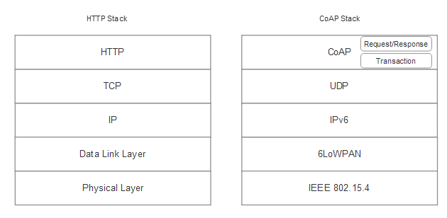
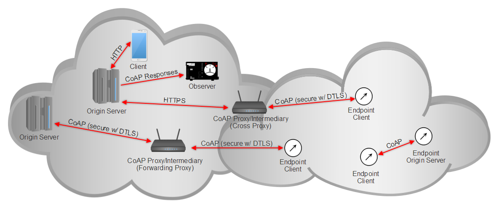
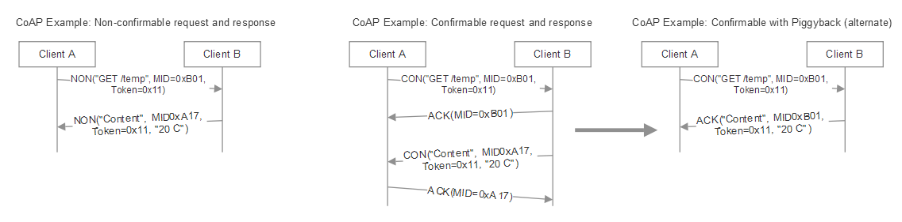
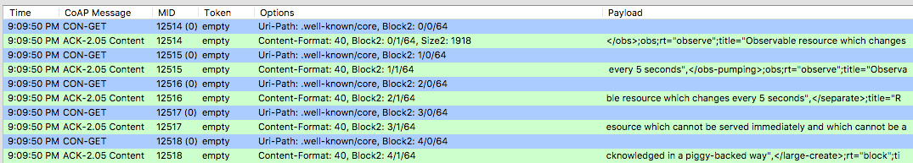
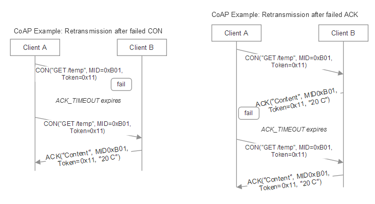
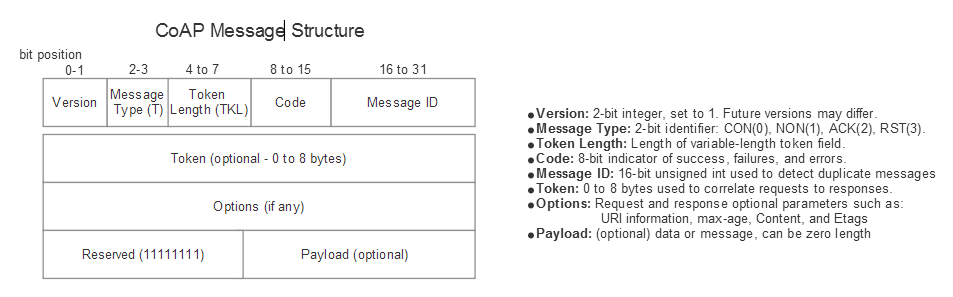
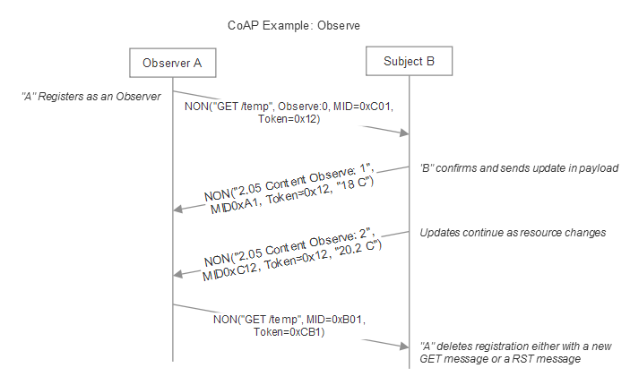

# Book: Internet of Things for Architects (Packt Publishing)
## Constrained Application Protocol
The Constrained Application Protocol (CoAP) is the product of the IETF (RFC7228). The IETF Constrained RESTful Environments (CoRE) working group created the first draft of the protocol in June 2014 but had worked for several years on its creation. It is specifically intended as a communication protocol for constrained devices. The core protocol is now based on RFC7252. The protocol is unique as it is first tailored for machine-to-machine (M2M) communication between edge nodes. It also supports mapping to HTTP through the use of proxies. This HTTP mapping is the on-board facility to get data across the internet.  

CoAP is excellent at providing a similar and easy structure of resource addressing familiar to anyone with experience of using the web but with reduced resources and bandwidth demands. A study performed by Colitti et. al demonstrated the efficiency of CoAP over standard HTTP (Colitti, Walter & Steenhaut, Kris & De, Niccolò. (2017). Integrating Wireless Sensor Networks with the Web). CoAP provides a similar functionality with significantly less overhead and power requirements.

Additionally, some implementations of CoAP perform up to 64x better than HTTP equivalents on similar hardware.

CoAP(Constrained Application Protocol)는 IETF(RFC7228)에서 만들어졌습니다. IETF CoRE(Constrained RESTful Environments) 작업 그룹은 2014년 6월에 프로토콜의 첫 번째 초안을 작성했지만 몇 년 동안 작성했습니다. 특히 제한된 장치를 위한 통신 프로토콜로 사용됩니다. 핵심 프로토콜은 이제 RFC7252를 기반으로 합니다. 이 프로토콜은 에지 노드 간의 M2M(Machine-to-Machine) 통신에 처음 맞춤화되었기 때문에 고유합니다. 또한 프록시를 사용하여 HTTP에 대한 매핑을 지원합니다. 이 HTTP 매핑은 인터넷을 통해 데이터를 가져오기 위한 온보드 기능입니다.

CoAP는 웹 사용 경험이 있는 사람이라면 누구에게나 친숙하지만 리소스와 대역폭 요구가 줄어든 유사하고 쉬운 리소스 주소 지정 구조를 제공하는 데 탁월합니다. Colitti et. al은 표준 HTTP에 비해 CoAP의 효율성을 보여주었습니다(Colitti, Walter & Steenhaut, Kris & De, Niccolò. (2017). Integrating Wireless Sensor Networks with the Web). CoAP는 훨씬 적은 오버헤드 및 전력 요구 사항으로 유사한 기능을 제공합니다.

또한 CoAP의 일부 구현은 유사한 하드웨어에서 HTTP에 상응하는 것보다 최대 64배 더 나은 성능을 제공합니다.

## CoAP architecture details
CoAP is based on the concept of mimicking and replacing heavy HTTP abilities and usage with a lightweight equivalent for the IoT. It is not an HTTP replacement as it does lack features; HTTP requires more powerful and service-orientated systems. CoAP features can be summarized as follows:

- HTTP-like
- Connection-less protocols
- Security through DTLS rather than TLS in a normal HTTP transmission
- Asynchronous message exchanges
- Lightweight design and resource requirements and low header overhead
- Support for URI and content-types
- Built upon UDP versus TCP/UDP for a normal HTTP session
- A stateless HTTP mapping allowing for proxies top bridge to HTTP sessions

CoAP has two basic layers:

- Request/Response layer: Responsible for sending and receiving RESTful-based queries. REST queries are piggybacked on CON or NON messages. A REST response is piggybacked on the corresponding ACK message.
- Transactional layer: Handles single message exchanges between endpoints using one of the four basic message types. The transaction layer also supports multicasting and congestion control:

CoAP는 무거운 HTTP 기능과 사용량을 IoT에 상응하는 경량으로 모방하고 대체한다는 개념을 기반으로 합니다. 기능이 없기 때문에 HTTP 대체가 아닙니다. HTTP에는 보다 강력하고 서비스 지향적인 시스템이 필요합니다. CoAP 기능은 다음과 같이 요약할 수 있습니다.

- HTTP 유사
- 연결 없는 프로토콜
- 일반 HTTP 전송에서 TLS가 아닌 DTLS를 통한 보안
- 비동기식 메시지 교환
- 경량 설계 및 리소스 요구 사항 및 낮은 헤더 오버헤드
- URI 및 콘텐츠 유형 지원
- 일반 HTTP 세션을 위한 UDP 대 TCP/UDP 기반
- HTTP 세션에 대한 프록시 상단 브리지를 허용하는 상태 비저장 HTTP 매핑

CoAP에는 두 가지 기본 계층이 있습니다.

- 요청/응답 계층: RESTful 기반 쿼리의 송수신을 담당합니다. REST 쿼리는 CON 또는 NON 메시지에 피기백됩니다. REST 응답은 해당 ACK 메시지에 적재됩니다.
- 트랜잭션 계층: 네 가지 기본 메시지 유형 중 하나를 사용하여 끝점 간의 단일 메시지 교환을 처리합니다. 트랜잭션 계층은 멀티캐스팅 및 혼잡 제어도 지원합니다.



CoAP shares context, syntax, and usage similarly to HTTP. Addressing in CoAP is also styled like HTTP. An address extends to the URI structure. As in HTTP URIs, the user must know the address beforehand to gain access to a resource. At the top-most level, CoAP uses requests such as GET, PUT, POST, and DELETE, as in HTTP. Similarly, response codes mimic HTTP, such as: 

- 2.01: Created
- 2.02: Deleted
- 2.04: Changed
- 2.05: Content
- 4.04: Not found (resource)
- 4.05: Method not allowed

CoAP는 HTTP와 유사하게 컨텍스트, 구문 및 사용법을 공유합니다. CoAP의 주소 지정도 HTTP처럼 스타일이 지정됩니다. 주소는 URI 구조로 확장됩니다. HTTP URI에서와 같이 사용자는 리소스에 대한 액세스 권한을 얻기 위해 미리 주소를 알아야 합니다. 최상위 수준에서 CoAP는 HTTP에서와 같이 GET, PUT, POST 및 DELETE와 같은 요청을 사용합니다. 마찬가지로 응답 코드는 다음과 같은 HTTP를 모방합니다.

- 2.01: 생성됨
- 2.02: 삭제
- 2.04: 변경됨
- 2.05: 콘텐츠
- 4.04: 찾을 수 없음(리소스)
- 4.05: 허용되지 않는 방법

The form of a typical URI in CoAP would be:

CoAP의 일반적인 URI 형식은 다음과 같습니다.

```coap://host[:port]/[path][?query]```

A CoAP system has seven main actors:

- Endpoints: These are the sources and destinations of a CoAP message. The specific definition of an endpoint depends on the transport being used. 
- Proxies: A CoAP endpoint that is tasked by CoAP clients to perform requests on its behalf. Reducing network load, access sleeping nodes, and providing a layer of security are some of the roles of a proxy. Proxies can be explicitly selected by a client (forward-proxying) or can be used as in-situ servers (reverse-proxying). Alternatively, a proxy can map from one CoAP request to another CoAP request or even translate to a different protocol (cross-proxying). A common situation is an edge router proxying from a CoAP network to HTTP services for cloud-based internet connections.
- Client: The originator of a request. The destination endpoint of a response.
- Server: The destination endpoint of a request. The originator of a response.
- Intermediary: A client acting as both a server and client towards an origin server. A proxy is an intermediary.  
- Origin servers: The server on which a given resource resides.
- Observers: An observer client can register itself using a modified GET message. The observer is then connected to a resource and if the state of that resource changes, the server will send a notification back to the observer. 

CoAP 시스템에는 7개의 주요 행위자가 있습니다.

- 엔드포인트: CoAP 메시지의 소스 및 대상입니다. 끝점의 특정 정의는 사용 중인 전송에 따라 다릅니다.
- 프록시: CoAP 클라이언트가 대신 요청을 수행하는 작업을 수행하는 CoAP 끝점입니다. 네트워크 부하를 줄이고 잠자는 노드에 액세스하고 보안 계층을 제공하는 것은 프록시의 역할 중 일부입니다. 프록시는 클라이언트에 의해 명시적으로 선택되거나(정방향 프록시) 현장 서버로 사용될 수 있습니다(역방향 프록시). 또는 프록시가 한 CoAP 요청에서 다른 CoAP 요청으로 매핑하거나 다른 프로토콜로 변환(교차 프록시)할 수도 있습니다. 일반적인 상황은 클라우드 기반 인터넷 연결을 위해 CoAP 네트워크에서 HTTP 서비스로 프록시하는 에지 라우터입니다.
- 클라이언트: 요청의 발신자. 응답의 대상 끝점입니다.
- 서버: 요청의 대상 엔드포인트. 응답의 작성자입니다.
- 중개자: 원본 서버에 대해 서버이자 클라이언트 역할을 하는 클라이언트. 프록시는 중개자입니다.
- 원본 서버: 주어진 리소스가 상주하는 서버입니다.
- 관찰자: 관찰자 클라이언트는 수정된 GET 메시지를 사용하여 자신을 등록할 수 있습니다. 그런 다음 관찰자는 리소스에 연결되고 해당 리소스의 상태가 변경되면 서버는 관찰자에게 알림을 다시 보냅니다.

Observers are unique in CoAP and allow a device to watch for changes to a particular resource. In essence, this is similar to the MQTT subscribe model where a node will subscribe to an event. 

관찰자는 CoAP에서 고유하며 장치가 특정 리소스의 변경 사항을 감시할 수 있도록 합니다. 본질적으로 이것은 노드가 이벤트를 구독하는 MQTT 구독 모델과 유사합니다.

Below is an example of CoAP architecture. Being a lightweight HTTP system allows for CoAP clients to communicate to one another or services in the cloud supporting CoAP. Alternatively, a proxy can be used to bridge to an HTTP service in the cloud. CoAP endpoints can establish relationships with each other, even at the sensor level. Observers allow for subscription-like attributes to resource that change in a similar manner to MQTT. The graphic also illustrates origin servers holding the resource being shared.

The two proxies allow for CoAP to perform HTTP translation or allow forwarding requests on behalf of a client. 

다음은 CoAP 아키텍처의 예입니다. 경량 HTTP 시스템은 CoAP 클라이언트가 서로 통신하거나 CoAP를 지원하는 클라우드의 서비스와 통신할 수 있도록 합니다. 또는 프록시를 사용하여 클라우드의 HTTP 서비스에 연결할 수 있습니다. CoAP 엔드포인트는 센서 수준에서도 서로 관계를 설정할 수 있습니다. 관찰자는 MQTT와 유사한 방식으로 변경되는 리소스에 대한 구독과 같은 속성을 허용합니다. 그래픽은 또한 공유되는 리소스를 보유하고 있는 원본 서버를 보여줍니다.

두 프록시를 통해 CoAP가 HTTP 변환을 수행하거나 클라이언트를 대신하여 요청을 전달할 수 있습니다.



CoAP makes use of port 5683. This port must be supported by a server that offers resources since the port is used for resource discovery. Port 5684 is used when DTLS is enabled.

CoAP는 포트 5683을 사용합니다. 이 포트는 리소스 검색에 사용되는 포트이므로 리소스를 제공하는 서버에서 지원해야 합니다. 포트 5684는 DTLS가 활성화된 경우 사용됩니다.

## CoAP Messaging Formats
Protocols based on UDP transport imply that the connection may not be inherently reliable. To compensate for reliability issues, CoAP introduces two message types that differ by either requiring acknowledgment or not. An additional feature of this approach is that messages can be asynchronous. 

In total there are only four messages in CoAP:

- Confirmable (CON): Requires an ACK. If a CON message is sent an ACK must be received within a random time interval between ACK_TIMEOUT and (ACK_TIMEOUT * ACK_RANDOM_FACTOR). If the ACK is not received, the sender transmits the CON message over and over at exponentially increasing intervals until it receives the ACK or a RST. This essentially is the CoAP form of congestion control. There is a maximum number of attempts set by MAX_RETRANSMIT. This is the resiliency mechanism to compensate for the lack of resiliency in UDP. 
- Non-confirmable (NON): Requires no ACK. Essentially a fire-and-forget message or broadcast.
- Acknowledgement (ACK): Acknowledges a CON message. The ACK message can piggyback along with other data.
- Reset (RST): Indicates that a CON message has been received but the context is missing. The RST message can piggyback along with other data.

UDP 전송 기반 프로토콜은 연결이 본질적으로 신뢰할 수 없음을 의미합니다. 안정성 문제를 보완하기 위해 CoAP는 승인 요구 여부에 따라 다른 두 가지 메시지 유형을 도입합니다. 이 접근 방식의 추가 기능은 메시지가 비동기식일 수 있다는 것입니다.

CoAP에는 총 4개의 메시지만 있습니다.

- 확인 가능(CON): ACK가 필요합니다. CON 메시지가 전송되면 ACK_TIMEOUT과 (ACK_TIMEOUT * ACK_RANDOM_FACTOR) 사이의 임의 시간 간격 내에 ACK를 수신해야 합니다. ACK가 수신되지 않으면 송신자는 ACK 또는 RST를 수신할 때까지 기하급수적으로 증가하는 간격으로 계속해서 CON 메시지를 전송합니다. 이것은 본질적으로 혼잡 제어의 CoAP 형태입니다. MAX_RETRANSMIT에 의해 설정된 최대 시도 횟수가 있습니다. 이것은 UDP의 복원력 부족을 보완하기 위한 복원력 메커니즘입니다.
- 비확인(NON): ACK가 필요하지 않습니다. 기본적으로  fire-and-forget 메시지 또는 브로드캐스트.
- 승인(ACK): CON 메시지를 승인합니다. ACK 메시지는 다른 데이터와 함께 적재할 수 있습니다.
- 리셋(RST): CON 메시지가 수신되었지만 컨텍스트가 누락되었음을 나타냅니다. RST 메시지는 다른 데이터와 함께 적재할 수 있습니다.

CoAP is a RESTful design using request/response messages piggybacked on CoAP messages. This allows for greater efficiency and bandwidth preservation, as shown in the following figure:

CoAP는 CoAP 메시지에 적재된 요청/응답 메시지를 사용하는 RESTful 설계입니다. 이를 통해 다음 그림과 같이 효율성과 대역폭 보존이 향상됩니다.



The graphic shows three examples of CoAP non-confirmable and confirmable request/response transactions. These are enumerated and described as follows:

- Non-confirmable request/response (left):  A message broadcast between client A and B using the typical HTTP GET construct. B reciprocates with Content data sometime later and returns the temperature of 20 degrees celsius. 
- Confirmable request/response (middle):  Included is the Message-ID, a unique identifier for each message. The Token represents a value that must match during the duration of the exchange. 
- Confirmable request/response (right): Here the message is confirmable. Both client A and B will wait for an ACK after each message exchange. To optimize communication, Client B can elect to piggyback the ACK with the returned data as shown in the far right.

그림은 CoAP 비확인 및 확인 요청/응답 트랜잭션의 세 가지 예를 보여줍니다. 이들은 다음과 같습니다.

- 확인 불가능한 요청/응답(왼쪽): 일반적인 HTTP GET 구성을 사용하여 클라이언트 A와 B 간에 브로드캐스트되는 메시지입니다. B는 나중에 콘텐츠 데이터로 보답하고 섭씨 20도의 온도를 반환합니다.
- 확인 가능한 요청/응답(가운데): 각 메시지의 고유 식별자인 Message-ID가 포함됩니다. 토큰은 교환 기간 동안 일치해야 하는 값을 나타냅니다.
- 확인 가능한 요청/응답(오른쪽): 여기에서 확인 가능한 메시지입니다. 클라이언트 A와 B 모두 각 메시지 교환 후 ACK를 기다립니다. 통신을 최적화하기 위해 클라이언트 B는 맨 오른쪽에 표시된 대로 반환된 데이터로 ACK를 편승하도록 선택할 수 있습니다.

The actual log of CoAP transactions can be seen in the Copper Firefox extension on Firefox version 55: 

CoAP 트랜잭션의 실제 로그는 Firefox 버전 55의 Copper Firefox 확장에서 볼 수 있습니다.



Copper CoAP log. Here we see several CON-GET client initiated messages to californium.eclipse.org:5683. The URI path points to coap://californium.eclipse.org:5683/.well-known/core. The MID increments with each message while the token is unused and optional. 

Copper CoAP 로그. 여기에서 californium.eclipse.org:5683에 대한 여러 CON-GET 클라이언트 시작 메시지를 볼 수 있습니다. URI 경로는 coap://californium.eclipse.org:5683/.well-known/core를 가리킵니다. MID는 토큰이 사용되지 않고 선택 사항인 동안 각 메시지와 함께 증가합니다.

The retransmission process is illustrated in the following figure:

재전송 프로세스는 다음 그림에 설명되어 있습니다.



CoAP retransmission mechanism. To account for the lack of resiliency in UDP, CoAP uses a timeout mechanism when communicating with confirmable messages. If the timeout expires, either sending a CON message or receiving the ACK, the sender will retransmit the message. The sender is responsible for managing the timeout and retransmitting up to a maximum number of retransmissions. Note the retransmission of the failed ACK reuses the same Message_ID.

CoAP 재전송 메커니즘. UDP의 복원력 부족을 설명하기 위해 CoAP는 확인 가능한 메시지와 통신할 때 시간 초과 메커니즘을 사용합니다. CON 메시지를 보내거나 ACK를 수신하는 타임아웃이 만료되면 발신자는 메시지를 재전송합니다. 발신자는 시간 초과를 관리하고 최대 재전송 횟수까지 재전송해야 합니다. 실패한 ACK의 재전송은 동일한 Message_ID를 재사용합니다.

While other messaging architecture requires a central server to propagate messages between clients, CoAP allows messages to be sent between any CoAP client including sensors and servers. CoAP includes a simple caching model. Caching is controlled through response codes in the message header. An option number mask will determine if it is a cache key. The Max_Age option is used to control cache element lifetimes and ensure freshness of the data. That is, Max_Age sets the maximum time a response can be cached for before it must be refreshed. Max_Age defaults to 60 seconds and can span up to 136.1 years. Proxies play a role in caching; for example, a sleeping edge sensor may use a proxy to cache data and to preserve power. 

다른 메시징 아키텍처에서는 클라이언트 간에 메시지를 전파하기 위해 중앙 서버가 필요하지만 CoAP에서는 센서와 서버를 포함한 모든 CoAP 클라이언트 간에 메시지를 보낼 수 있습니다. CoAP에는 간단한 캐싱 모델이 포함되어 있습니다. 캐싱은 메시지 헤더의 응답 코드를 통해 제어됩니다. 옵션 번호 마스크는 캐시 키인지 여부를 결정합니다. Max_Age 옵션은 캐시 요소 수명을 제어하고 데이터의 최신성을 보장하는 데 사용됩니다. 즉, Max_Age는 응답을 새로 고쳐야 하기 전에 응답을 캐시할 수 있는 최대 시간을 설정합니다. Max_Age의 기본값은 60초이며 최대 136.1년까지 확장할 수 있습니다. 프록시는 캐싱에서 역할을 합니다. 예를 들어, 절전 모드 센서는 프록시를 사용하여 데이터를 캐시하고 전력을 보존할 수 있습니다.

The CoAP message header is uniquely designed for maximum efficiency and bandwidth preservation. The header is four bytes in length with a typical request message taking only 10 to 20-byte headers. This is typically 10x smaller than an HTTP header. The structure consists of Message Type Identifiers (T), which must be included in each header along with an associated unique Message-ID. The Code field is used to signal errors or success states across channels. After the header, all other fields are optional and include variable length Tokens, Options, and Payload:

CoAP 메시지 헤더는 최대 효율성과 대역폭 보존을 위해 고유하게 설계되었습니다. 헤더의 길이는 4바이트이며 일반적인 요청 메시지는 10 ~ 20바이트 헤더만 사용합니다. 이것은 일반적으로 HTTP 헤더보다 10배 작습니다. 구조는 연관된 고유한 메시지 ID와 함께 각 헤더에 포함되어야 하는 메시지 유형 식별자(T)로 구성됩니다. 코드 필드는 채널 전반에 걸쳐 오류 또는 성공 상태를 알리는 데 사용됩니다. 헤더 뒤의 다른 모든 필드는 선택 사항이며 가변 길이 토큰, 옵션 및 페이로드를 포함합니다.



UDP also can cause duplicate messages to arrive for both CON and NON transmissions. If identical Message_IDs are delivered to a recipient within the prescribed EXCHANGE_LIFETIME, a duplicate is said to exist. This clearly can occur, as shown in the previous figures, when an ACK is missing or dropped and the client retransmits the message with the same Message_ID. The CoAP specification states the recipient should ACK each duplicate message it receives but should only process one request or response. This rule may be relaxed if a CON message transports a request that is idempotent.

UDP는 또한 CON 및 NON 전송 모두에 대해 중복 메시지가 도착하도록 할 수 있습니다. 동일한 Message_ID가 지정된 EXCHANGE_LIFETIME 내에 수신자에게 전달되면 중복이 존재한다고 합니다. 이는 앞의 그림과 같이 ACK가 누락되거나 삭제되고 클라이언트가 동일한 Message_ID로 메시지를 재전송할 때 분명히 발생할 수 있습니다. CoAP 사양은 수신자가 수신한 각 중복 메시지를 ACK해야 하지만 하나의 요청 또는 응답만 처리해야 한다고 명시합니다. 이 규칙은 CON 메시지가 멱등한 요청을 전송하는 경우 완화될 수 있습니다.

As mentioned, CoAP allows for the role of an observer in a system. This is unique as it allows CoAP to behave in a similar manner to MQTT. The observation process allows a client to register for observation and the server will notify the client whenever the resource being monitored changes state. The duration of observation can be defined during registration. Additionally, the observation relationship ends when the initiating client sends a RST or another GET message:

언급했듯이 CoAP는 시스템에서 관찰자의 역할을 허용합니다. 이는 CoAP가 MQTT와 유사한 방식으로 동작할 수 있도록 하기 때문에 고유합니다. 관찰 프로세스를 통해 클라이언트는 관찰을 등록할 수 있으며 서버는 모니터링되는 리소스가 상태를 변경할 때마다 클라이언트에 알립니다. 관찰 기간은 등록 중에 정의할 수 있습니다. 또한 시작 클라이언트가 RST 또는 다른 GET 메시지를 보낼 때 관찰 관계가 종료됩니다.



As mention previously, there is no inherent authentication or encryption in the CoAP standard, rather, the user must rely on DTLS to provide that level of security. If DTLS is used then an example URI would be:

앞서 언급했듯이 CoAP 표준에는 고유한 인증이나 암호화가 없으며 사용자는 해당 수준의 보안을 제공하기 위해 DTLS에 의존해야 합니다. DTLS가 사용되는 경우 예시 URI는 다음과 같습니다.

```text
    //insecure
    coap://example.net:1234/~temperature/value.xml

    //secure
    coaps://example.net:1234/~temperature/value.xml
```

CoAP offers resource discovery mechanisms as well. Simply sending a GET request to /.well-known/core will disclose a list of known resources on the device. Additionally, query strings can be used in the request for applying specific filters. 

CoAP는 리소스 검색 메커니즘도 제공합니다. /.well-known/core에 GET 요청을 보내기만 하면 장치의 알려진 리소스 목록이 공개됩니다. 또한 특정 필터를 적용하기 위한 요청에 쿼리 문자열을 사용할 수 있습니다.

## CoAP usage example
CoAP is lightweight and its implementation both on a client and server basis should take few resources. Here, we use the Python-based aiocoap library. More can be read on aiocoap in:  Amsüss, Christian, and Wasilak, Maciej. aiocoap: Python CoAP Library. Energy Harvesting Solutions, 2013–. http://github.com/chrysn/aiocoap/. Many other free CoAP clients and servers exist with several written in low-level C code for extremely constrained sensor environments. Here, we use a Python environment for brevity.

CoAP는 가벼우며 클라이언트와 서버 기반 모두에서 구현하는 데 리소스가 거의 필요하지 않습니다. 여기서는 Python 기반의 aiocoap 라이브러리를 사용합니다. Amsüss, Christian 및 Wasilak, Maciej의 iocoap에서 더 많은 것을 읽을 수 있습니다. aiocoap: Python CoAP 라이브러리. 에너지 하베스팅 솔루션, 2013–. http://github.com/chrysn/aiocoap/. 다른 많은 무료 CoAP 클라이언트와 서버는 극도로 제한된 센서 환경을 위해 저수준 C 코드로 작성된 몇 가지와 함께 존재합니다. 여기서는 간결함을 위해 Python 환경을 사용합니다.

The client implementation is:

클라이언트 구현은 다음과 같습니다.

```py
#!/usr/bin/env python3
import asyncio            #necessary for asynchronous processing in Python
from aiocoap import *     #using the aiocoap library
```

The following is main loop for the client. The client uses PUT to broadcast the temperature to known URI:

다음은 클라이언트의 메인 루프입니다. 클라이언트는 PUT을 사용하여 온도를 알려진 URI로 브로드캐스트합니다.

```py
async def main():
    context = await Context.create_client_context()

    await asyncio.sleep(2)                         #wait 2 seconds after initialization

    payload = b"20.2 C"
    request = Message(code=PUT, payload=payload)
 
    request.opt.uri_host = '127.0.0.1'             #URI for localhost address
    request.opt.uri_path = ("temp", "celcius")     #URI for path to /temp/celcius

    response = await context.request(request).response  
    print('Result: %s\n%r'%(response.code, response.payload))

if __name__ == "__main__":
    asyncio.get_event_loop().run_until_complete(main())
```

The server implementation is:

서버 구현은 다음과 같습니다.

```py
#!/usr/bin/env python3
import asyncio                         #necessary for asynchronous processing in Python
import aiocoap.resource as resource    #using aiocoap library
import aiocoap
```

The following code illustrates the services for PUT and GET methods:

다음 코드는 PUT 및 GET 메서드에 대한 서비스를 보여줍니다.

```py
class GetPutResource(resource.Resource):

    def __init__(self):
        super().__init__()
        self.set_content(b"Default Data (padded) ")

    def set_content(self, content):                #Apply padding
        self.content = content
        while len(self.content) &lt;= 1024:
            self.content = self.content + b"0123456789\n"
        async def render_get(self, request):            #GET handler
        return aiocoap.Message(payload=self.content)    
        async def render_put(self, request):            #PUT handler
        print('PUT payload: %s' % request.payload)
        self.set_content(request.payload)               #replaces set_content with received payload
        return aiocoap.Message(code=aiocoap.CHANGED, payload=self.content) #set response code to 2.04
```

The main loop is:

주요 루프는 다음과 같습니다.

```py
def main():
    root = resource.Site()        #root element that contains all resources found on server

    root.add_resource(('.well-known', 'core'),  #this is the typical .well-known/core
    resource.WKCResource(root.get_resources_as_linkheader)) #resource list for .well-known/core
    root.add_resource(('temp', 'celcius'), GetPutResource()) #adds the resource /tmp/celcius

    asyncio.Task(aiocoap.Context.create_server_context(root))

    asyncio.get_event_loop().run_forever()

if __name__ == "__main__":
    main()
```