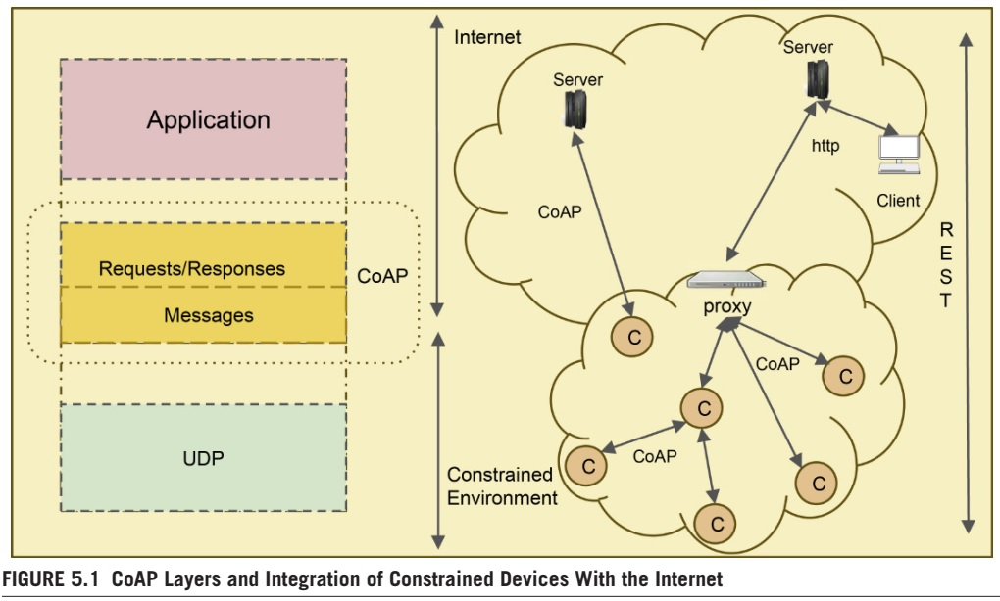

# Book: Internet of Things Principles and Paradigms (Morgan Kaufmann)

## CoAP
Since HTTP/TCP stack is known to be resource demanding on constrained devices, protocols such as Embedded Binary HTTP (EBHTTP) and Compressed HTTP Over PAN (CHoPAN) have been proposed. However, the issue of reliable communications still remains a concern. The IETF work group, Constrained RESTful Environments (CoRE), has developed a new web-transfer protocol called Constrained Application Protocol (CoAP), which is optimized for constrained power and processing capabilities of IoT. Although the protocol is still under standardization, various implementations are in use. CoAP in simpler terms is a two-layered protocol: a messages layer, interacting with the UDP, and another layer for request/response interactions using methods and response code, as done in HTTP. In contrast to HTTP, CoAP exchanges messages asynchronously and uses UDP.

HTTP/TCP 스택은 제한된 장치에서 리소스를 요구하는 것으로 알려져 있기 때문에 EBHTTP(Embedded Binary HTTP) 및 CHoPAN(Compressed HTTP Over PAN)과 같은 프로토콜이 제안되었습니다. 그러나 안정적인 통신 문제는 여전히 문제로 남아 있습니다. IETF 작업 그룹인 CoRE(Constrained RESTful Environments)는 IoT의 제한된 전력 및 처리 기능에 최적화된 CoAP(Constrained Application Protocol)라는 새로운 웹 전송 프로토콜을 개발했습니다. 프로토콜은 아직 표준화 중이지만 다양한 구현이 사용되고 있습니다. 간단히 말해서 CoAP는 2계층 프로토콜입니다. UDP와 상호 작용하는 메시지 계층과 HTTP에서 수행되는 것처럼 메서드 및 응답 코드를 사용하는 요청/응답 상호 작용을 위한 또 다른 계층입니다. HTTP와 달리 CoAP는 비동기적으로 메시지를 교환하고 UDP를 사용합니다.

The CoAP has four types of messages: Acknowledgement, Reset, Confirmable (CON), and NonConfirmable (NON). The non-confirmable messages are used to allow sending requests that may not require reliability. Reliability is provided by the message layer and will be activated when Confirmable messages are used. The Request methods are: GET, POST, PUT, and DELETE of HTTP. CoAP has been implemented on Contiki [20], which is an operating system for sensor networks and in TinyOS as Tiny-CoAP [21].

CoAP에는 Acknowledgement, Reset, Confirmable(CON) 및 NonConfirmable(NON)의 네 가지 유형의 메시지가 있습니다. 확인 불가능 메시지는 신뢰성이 필요하지 않은 요청을 보내는 데 사용됩니다. 신뢰성은 메시지 계층에 의해 제공되며 확인 가능한 메시지가 사용될 때 활성화됩니다. 요청 방법은 HTTP의 GET, POST, PUT 및 DELETE입니다. CoAP는 센서 네트워크용 운영 체제인 Contiki[20]에서 구현되었으며 TinyOS에서는 Tiny-CoAP[21]로 구현되었습니다.

Many approaches have been used to evaluate the performance of CoAP. A Total Cost of Ownership (TCO) model for applications in a constrained environment has been used to compare HTTP versus CoAP [22]. The major observations from the comparison are as follows:

CoAP의 성능을 평가하기 위해 많은 접근 방식이 사용되었습니다. 제한된 환경의 애플리케이션에 대한 TCO(총 소유 비용) 모델은 HTTP와 CoAP를 비교하는 데 사용되었습니다[22]. 비교를 통해 얻은 주요 관찰 사항은 다음과 같습니다.

- CoAP is more efficient for applications on smart objects, engaged in frequent communication sessions
- CoAP is cost-effective whenever the battery/power-source replacements prove costly
- Whenever the charges for the data communication are volume-based, CoAP is found to be more cost-effective
- CoAP has been found to be more beneficial cost-wise in push mode than in pull mode

- CoAP는 빈번한 통신 세션에 참여하는 스마트 개체의 응용 프로그램에 더 효율적입니다.
- CoAP는 배터리/전원 교체 비용이 많이 드는 것으로 판명될 때마다 비용 효율적입니다.
- 데이터 통신 요금이 볼륨 기반일 때마다 CoAP가 더 비용 효율적인 것으로 판명되었습니다.
- CoAP는 풀 모드보다 푸시 모드에서 비용면에서 더 유익한 것으로 밝혀졌습니다.

Fig. 5.1 illustrates the CoAP layers and the integration of constrained devices using CoAP with the Internet through a proxy.

그림 5.1은 CoAP 계층과 CoAP를 사용하는 제한된 장치와 프록시를 통한 인터넷의 통합을 보여줍니다.

For IoT/CoT, the advantages of CoAP can be summarized as follows.

IoT/CoT의 경우 CoAP의 장점은 다음과 같이 요약할 수 있습니다.

- A compact binary header (10–20 bytes), along with UDP, reduces the communication overhead, thereby reducing the delay and minimizing the power consumption due to data transmission.
- Since asynchronous data push is supported, it enables things to send information only when there is a change of observed state. This allows the things to sleep most of the time and conserve power.
- The minimal subset of REST requests supported by CoAP allows the protocol implementations to be less complex when compared to HTTP. This lowers the hardware requirements for the smartthings on which it executes.
- The M2M resource discovery is supported by CoAP to find a matching resource based on the CoRE link format.
- The draft CoAP proposal includes support for alternative non-IP messaging, such as Short Message Service (SMS) and transportation of CoAP messages over Bluetooth, ZigBee, Z-Wave, and so forth.

- UDP와 함께 Compact한 바이너리 헤더(10~20바이트)로 통신 오버헤드를 줄여 데이터 전송에 따른 지연을 줄이고 전력 소모를 최소화합니다.
- 비동기식 데이터 푸시를 지원하므로 관찰된 상태의 변화가 있을 때만 사물이 정보를 보낼 수 있습니다. 이렇게 하면 대부분의 시간을 잠자기 상태로 유지하고 전력을 절약할 수 있습니다.
- CoAP에서 지원하는 REST 요청의 최소 하위 집합을 통해 HTTP와 비교할 때 프로토콜 구현이 덜 복잡합니다. 이것은 그것이 실행되는 smartthings에 대한 하드웨어 요구 사항을 낮춥니다.
- CoAP는 M2M 자원 탐색을 지원하여 CoRE 링크 형식을 기반으로 일치하는 자원을 찾습니다.
- CoAP 제안 초안에는 SMS(Short Message Service) 및 Bluetooth, ZigBee, Z-Wave 등을 통한 CoAP 메시지 전송과 같은 대체 비 IP 메시징에 대한 지원이 포함됩니다.

MQ Telemetry Transport (MQTT) protocol is another communication protocol designed for M2M communication, based on TCP/IP. Both CoAP and MQTT are expected to be widely used in IoT communication infrastructure in the future.

MQTT(MQ Telemetry Transport) 프로토콜은 TCP/IP를 기반으로 하는 M2M 통신을 위해 설계된 또 다른 통신 프로토콜입니다. CoAP와 MQTT는 모두 향후 IoT 통신 인프라에서 널리 사용될 것으로 예상됩니다.