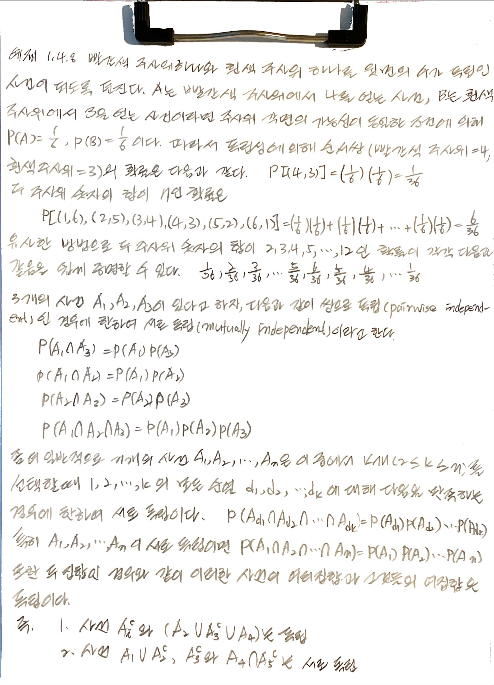
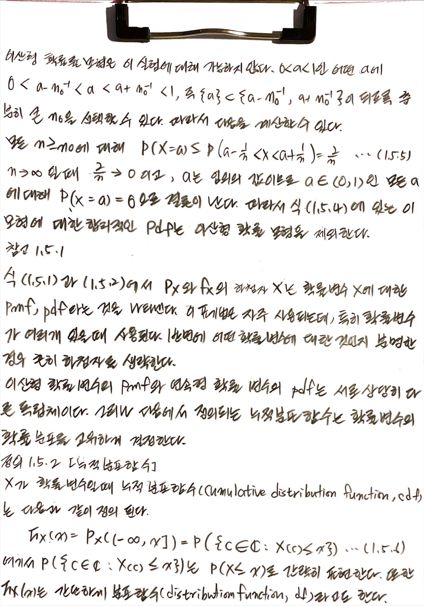

# book: introduction to mathmatical statistics
- Hogg, McKean, Craig
- 수리통계학 개론
- http://www.kocw.net/home/cview.do?cid=7c789810ade43386: 부산대 김충락 교수님 강의
- crkim.pusan.ac.kr
    + lecture: lecture notes
    + KOCW:
        * 수리통계학 mathematical statistics(1, 2), 
        * 회귀분석 regression analysis(1, 2), 
        * 수리통계학 math.stat(3), 
        * 생존분석 survival analysis, 
    + KMOOC: R을 활용한 통계학 개론

## 1. Probability and Distributions

### 1.1 Introduction

- Statistical(random) experiment: the outcome cannot be predicted with certainty prior to the performance of the experiment.
- Sample space: collection of every possible outcome from the random experiment, and denoted by $\mathscr{C}$ .
- Event: subset of sample, and denoted by A, B, C.
- Example 1.1.1. Consider tossing a coin, then $\mathscr{C}$ = {H, T}.
- Example 1.1.2. Consider tossing two die (one red, the other white), then $\mathscr{C}$ = {(1,1), ··· , (1,6), (2,1), ··· , (6,6)}.
- Example 1.1.3. Let C denote an event of sum seven when tossing two die, then $\mathscr{C}$ = {(1,6), (2,5), ··· , (6,1)}.
- Remark 1.1.1. Two types of probability 
    + (i) Relative frequancy approach.
    + (ii) Personal or subjective approach.

### 1.2 Set Theory

- Definition 1.2.1. If each element of set $C_1$ is also an element of set $C_2$, then $C_1$ is called subset of $C_2$, and denoted by $C_1 \subset C_2$ .
- Definition 1.2.2. If a set C has no elements, C is called the null(empty) set, and denoted by C = $\phi$ .
- Definition 1.2.3. The set of all elements that belong to at least one of $C_1$ and $C_2$ is called the union of $C_1$ and $C_2$, and denoted by $C_1 \cup C_2$ and it can be generalized to any number of sets. For example, $C_1 \cup C_2 \cup \cdots \cup C_n = \cup_{k=1}^{\infty}C_k$ .

## 1.3 The Probability Set Funciton

#### 1.3.1 셈규칙

#### 1.3.2 확률의 추가적 특성

### 1.4 조건부 확률과 독립성

#### 1.4.1 독립성

#### 1.4.2 시뮬레이션

### 1.5 확률 변수

### 1.6 이산형 확률 변수

#### 1.6.1 변환

### 1.7 연속형 확률 변수

#### 1.7.1 분위수

#### 1.7.2 변환

