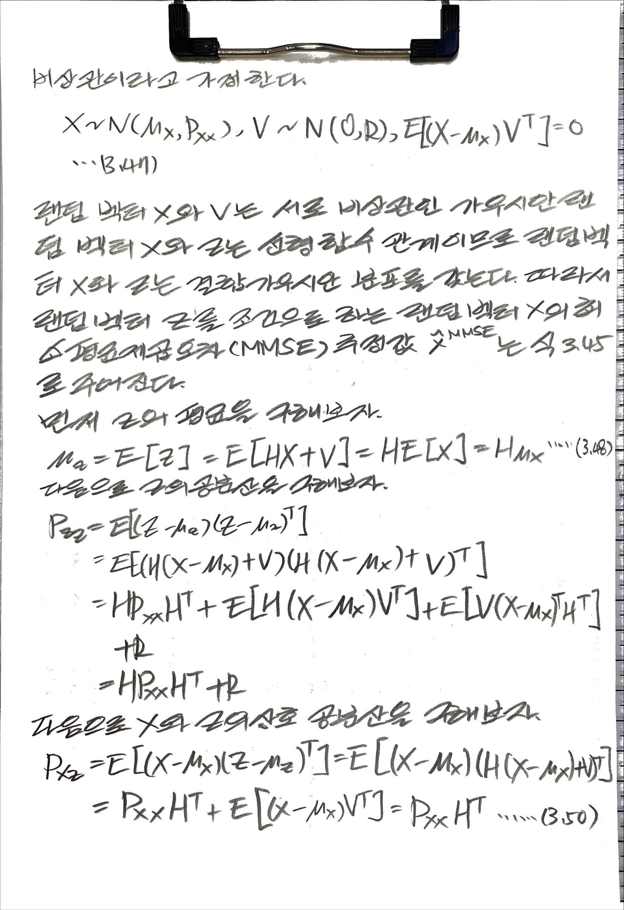
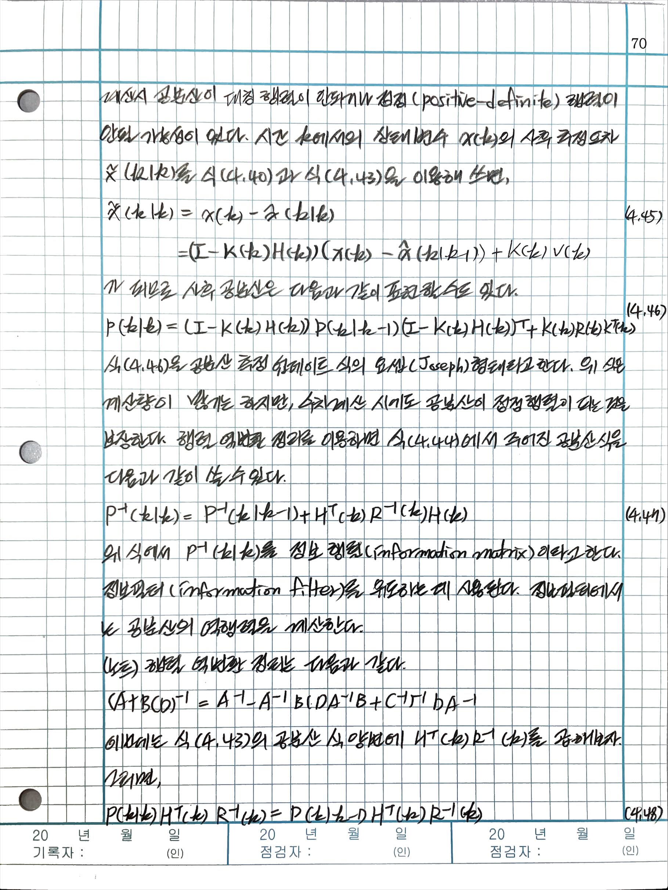
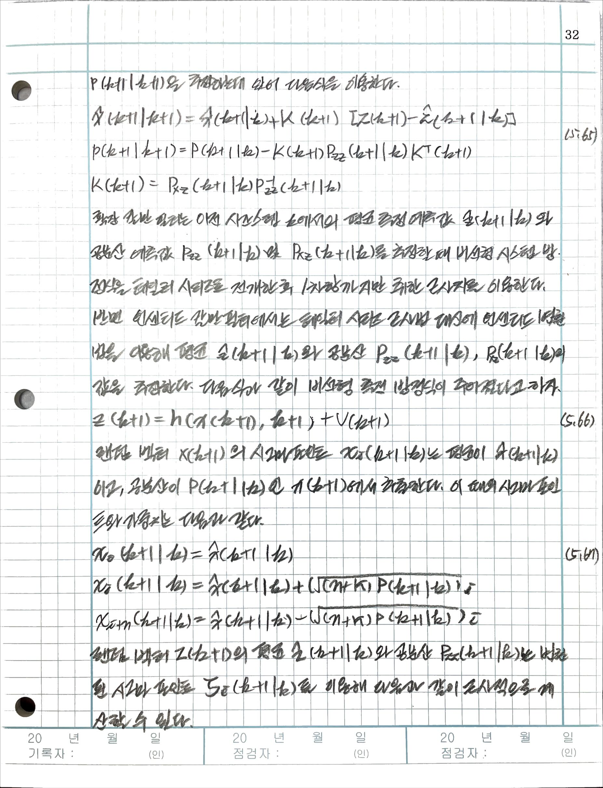

# book: 수학으로 풀어보는 칼만필터 알고리즘

- 박성수(SS, Park), 위키북스(Wikibooks)
- Kalman filter algorithm Mathmatically explained 

## 01 칼만필터 개요

칼만 필터(Kalman filter)는 루돌프 칼만(Rudolf E. Kalman, 1930 ~ 2016)이 1960년에 ASME 학술지에 발표한 논문 "A New Approach to Linear Filtering and Prediction Problems" 에 기원을 두고 있다. 칼만 필터는 시스템의 상태 공간 방정식을 이용한 추정기로서, 궤환(recursive) 구조를 갖는 최적 데이터 처리 알고리즘이다.

### 1.1 추정기

칼만필터는 추정기(estimator)다. 추정기는 가용 정보로부터 미지의 양(quantity)을 추정하는 알고리즘이다. 미지의 양은 일반적으로 상태변수(state variable)와 시스템 파라미터(parameter)로 표현한다. 보통 시스템의 상태변수는 외부 힘이나 어떤 작용에 의해 시간에 따라 그 값이 급격히 변화할 수 있는 변수를 말하고, 시스템의 파라미터는 시간에 따라 서서히 변화하는 변수 또는 변하지 않는 상수를 말한다. 하지만 필요에 따라 시스템 파라미터를 상태변수의 일부로 간주하기도 한다.

### 1.2 시스템 운동 모델

칼만필터의 가용 정보 중의 하나인 시스템의 운동 모델은 시간의 흐름에 따라 동적 시스템(dynamic system)의 운동 특성이 어떻게 변화하는지를 기술하는 수학모델이다.

시스템의 수학적 운동 모델은 다음과 같이 상태공간 방정식(state-space equation)의 형태로 만들 수 있다.

- 1.1

$$
\dot{x}(t) = f(x(t), u(t), w(t), t)
$$

여기서 $x(t)\in R^n$ 는 상태변수, $w(t)\in R^m$ 는 프로세스 노이즈, $u(t)\in R^q$ 는 시스템의 입력이다. $w(t)$ 는 시스템의 수학적 운동 모델에 내재된 불확실성을 확률적으로 표현하기 위해서 도입한 변수이다. $w(t)$ 의 확률적 특성을 모델링한 것을 노이즈 모델이라고 한다. $u(t)$ 는 제어 입력이라고도 하며 정확히 알고 있다고 가정한다.  $f(\cdot, t)$ 는 시스템 파라미터가 포함된 시변(time-varying) 비선형 함수다. 상태 변수 $x(t)$ 는 주어진 시간에서 시스템의 운동을 기술하는데 필요한 모든 관련 정보를 포함하고 있다고 가정한다.

칼만 필터는 물리적인 장치나 도구가 아닌 수학적인 도구로서 알고리즘 형태로 컴퓨터에 구현된다. 따라서 식 1.1과 같은 연속시간(continuous-time) 모델이 아닌 이산시간(discrete-time) 모델이 필요하다. 이산시간 모델은 측정값이 이산시간에 수집(샘플링)되고 시스템 입력이 샘플링 시간 동안 일정하게 유지되는 연속 시간 시스템 모델의 특수한 경우로서 다음과 같이 차분 방정식(difference equation)으로 표현된다.

- 1.2

$$
x(k+1) = f(x(k), u(k), w(k), k)
$$

여기서 k는 시간 인덱스이며 $x(k) = x(kT)$ 를 의미하고 T는 샘플링 시간을 나타낸다. 시스템 모델과 노이즈 모델에 관한 사항은 칼만 필터 알고리즘을 본격적으로 전개하는 4장에서 다시 논의한다.

칼만필터의 성능은 시스템 모델의 정확성에 크게 의존한다. 모델 개발은 일반적으로 칼만필터를 설계할 때 가장 어려운 작업이다. 칼만필터 알고리즘 자체는 이론적으로 잘 설며오대 있어서 사용하기 쉬운 편이다. 하지만 상태변수와 파라미터, 시스템 모델을 올바르게 선택하고 구축하려면 시스템에 대한 이해도가 높아야 하고, 모델 구축 시 선택할 수 있는 다양한 절충점을 이해할 수 있어야 한다.

### 1.3 시스템 측정 모델

칼만필터의 가용 정보 중 하나인 측정값은 실제 시스템의 운동을 관찰하기 위해 다양한 센서(또는 데이터 수집 도구)를 이용해 시스템의 출력을 측정해 획득한 데이터다. 측정값은 시스템의 상태 변수 및 파라미터와 함수 관계인 신호이며, 측정 모델은 이 함수 관계를 수학적으로 표현한 식이다.

시스템의 운동은 상태변수의 시간 변화를 이용해 설명할 수 있으므로 상태 변수를 측정해야 한다. 그러나 센서는 시스템의 상태변수에 대한 완벽한 데이터를 생성할 수 없다. 그 이유는 다음과 같다. 먼저 시스템의 상태변수는 해당 센서를 사용해 직접 측정할수 있는 경우도 있지만 물리적으로 그러한 센서를 고안할 수 없거나 경제적인 이유 등으로 인해 직접 측정이 불가능한 경우가 있다. 또한 센서는 자신이 측정하고자 하는 값을 정확하게 측정할 수 없다. 센서의 측정값은 노이즈 및 바이어스 등으로 인해 손상될 수 있기 때문이다.

이와 같이 센서가 시스템의 상태변수에 대한 완벽한 데이터를 생성할 수 없기 때문에 상태변수를 추정할 수 있는 수학적인 도구가 필요하다. 센서가 특정 상태변수를 직접 측정할 수 없는 경우에도 다수의 상이한 센서가 기능적으로 상태변수와 관련된 신호를 생성하고 부분적으로 중복되는 정보를 제공할 수 있다. 또한 시스템의 운동 모델에서 불확실성을 확률로 모델링했듯이 센서의 측정값에 내재된 오류 정도를 확률을 사용해 표현할 수 있다. 칼만 필터는 이와 같은 간접 측정과 노이즈로 손상된 측정 데이터를 이용해 측정되지 않은 상태 변수를 유추하기 위한 수학적 도구를 제공한다.

시스템의 측정 모델은 상태변수와 시스템 출력과의 함수 관계, 그리고 측정값에 섞여있는 노이즈의 확률적 특성을 표현한 수학 모델이다. 측정 모델은 측정값이 이산시간에 수집된다고 가정하고 다음과 같이 이산시간에서 표현한다.

- 1.3

$$
z(k) = h(x(k), k) + v(k)
$$

여기서 $z(k)\in R^p$ 는 측정값이며 $v(k)\in R^p$ 는 측정 노이즈로서 측정ㄱ밧에 내재된 오류를 확률적으로 표현하기 위해 도입한 변수다. $h(x(k), k)$ 는 시스템의 상태변수와 시스템의 출력 사이의 함수 관계를 표현하는 비선형 함수다.

### 1.4 칼만 필터의 응용

시스템은 제어 입력 이외에 외란 등 알지못하는 어떤 입력에 의해서도 작동한다. 또한 시스템의 상태 변수와 측정되는 시스템의 출력 사이에도 어느 정도의 불확실성이 내재돼 있다. 그리고 센서의 측정값도 노이즈 및 바이어스로 인해 손상돼 있다. 이와 같은 환경에서 칼만 필터는 사용 가능한 모든 측정 데이터와 시스템 운동 및 센서에 대한 지식, 시스템 모델의 불확실성 및 측정 오류에  대한 확률적 표현 그리고 상태 변수의 초기 조건에 관한 정보를 모두 결합해 추정 오차가 확률적으로 최소화되는 방식으로 상태 변수를 추정한다.

칼만 필터는 다양한 분야에서 응용된다.

- 표적추적

- 센서 융합

- 고장 검출

- 로컬라이제이션localization

## 02 확률과 랜덤 프로세스

### 2.1 확률과 랜덤 벡터

#### 2.1.1 확률

어떤 결과가 일어날 가능성이 있는지는 모두 알 수 있지만, 그 결과를 미리 알 수는 없는 실험을 확률 실험(random experiment)이라고 한다. 그리고 확률 실험의 결과(outcome)로 이루어진 집합을 사건(event)이라고 한다. 또한 확률 실험에서 일어날 가능성이 있는 모든 결과를 원소로 하는 집합을 사건 집합 또는 표본 공간(sample space)라고 한다.

표본 공간 S에서 A가 발생활 확률(probability) P{A}는 다음 3가지 공리(axiom)를 만족하는 어떤 수로 정의한다.

- 공리 1: 확률은 항상 0보다 크거나 같은 수다: $P\\{A\\} \geq 0$
- 공리 2: 표본 공간의 확률은 1이다: $P\\{S\\} = 1$
- 공리 3: 서로 배타적인 사건 A와 B의 경우, $P\\{A \cup B\\} = P\\{A\\} + P\\{B\\}$ 의 관계식이 성립한다. 여기서 배타적 사건이라 함은 $A \cap B = \varnothing$ 를 뜻하며, $\cup$ 와 $\cap$ 는 각각 합집합(union)과 교집합(intersection), 그리고 $\varnothing$ 는 공집합(empty)을 의미한다.

확률은 주어진 사건에 따라 정의된다. 따라서 위 3가지 공리로부터 $P\\{\varnothing\\}=0$ , $P\\{A\\} = 1 - P\\{\overline{A}\\}$ 가 성립함을 알 수 있다. 여기서 $\overline{A}$ 는 A의 여집합 사건(complementary event)이라고 한다.

#### 2.1.2 랜덤 변수[^랜덤변수]

랜덤 변수(random variable) $X \equiv X(e)$ 는 표본 공간을 구성하는 각 원소(e)에 하나의 실수값(real number)을 대응시키는 함수로 정의된다. 랜덤 변수는 대문자로 표기하며 랜덤 변수가 실제 취할 수 있는 값은 소문자로 표기한다. 랜덤 변수의 정의역(domain)은 표본 공간이며 치역(range)은 전체 실수 영역인 $-\infty \leq X \leq \infty$ 이다.

사건은 확률 실험의 결과인 e를 원소로 하는 집합이므로 사건 A마다 해당하는 실수 구간(interval) I가 존재한다. 따라서 사건 A의 확률이 $P\\{A\\}$ 라면 랜덤 변수 X가 해당 실수 구간에 속할 확률은 $P\\{X \in I\\} = P\\{A\\}$ 다. 표본 공간의 확률은 실수 영역 전체의 확률이므로 $\\{S\\} = P\\{X \leq \infty\\} = 1$ 이며, 공집합의 확률은 $P\\{\varnothing\\} = P\\{X=-\infty\\} = 0$ 이다.

랜덤 변수 X가 이산(discrete) 값을 취하면 이산 랜ㄹ덤 변수라고 하고 연속 값을 취하면 연속(continuous) 랜덤 변수라고 한다.

#### 2.1.3 확률 분포 함수와 확률 밀도 함수

$\\{X \leq x\\}$ 가 사건을 의미하므로 해당 사건에 대한 확률 $P\\{X \leq x\\}$ 를 계산할 수 있다. 랜덤 변수 X의 확률 분포 함수(probability distribution funciton) $F_x(x)$ 는 랜덤 변수 X가 x보다 같거나 작은 값을 가질 확률 $P\\{X \leq x\\}$ 로 정의한다. 즉, 

- 2.1

$$
F_x(x) = P\\{X \leq x\\}
$$

정의에 의하면 $F_x(-\infty)=0, F_x(\infty)=1$ 이 된다. 또한 $\Delta{x} > 0$ 일 때, $F_x(x+\Delta{x}) \geq F_x(x)$ 이 됨을 알 수 있다.

연속 랜덤 변수 X의 확률 밀도 함수(probability density function) $p_x(x)$ 는 다음 적분 식을 만족하는 함수로 정의한다.

- 2.2

$$
\int_{-\infty}^x p_x(x)dx = P\\{X \leq x\\} = F_x(x)
$$

위 정의로부터 확률 분포 함수가 미분 가능하다면 확률 밀도 함수를 다음과 같이 표현할 수 있다.

- 2.3

$$
\begin{aligned}
p_x(x) &= \cfrac{dF_x(x)}{dx}\\\ \
&= \lim_{\Delta{x} \to 0}\cfrac{F_x(x+\Delta{x})-F_x(x)}{\Delta{x}}\\\ \
&= \lim_{\Delta{x}\to 0}\cfrac{P\\{x < X \leq (x+\Delta{x})\\}}{\Delta{x}}
\end{aligned}
$$

랜덤 변수 X가 임의의 실수 구간 (a, b]에 속할 확률은 확률 밀도 함수를 이용하면 다음과 같이 계산할 수 있다.

- 2.4

$$
\begin{aligned}
P\\{a < X \leq b\\} &= F_x(X \leq b) - F_x(X \leq a)\\\ \
&= \int_a^b p_x(x)dx
\end{aligned}
$$

확률 밀도 함수의 정의에 의하면 $p_x(x) \geq 0, \int_{-\infty}^\infty p_x(x)dx = 1$ 이 된다.

이산 랜덤 변수 X에서는 확률 밀도 함수 대신에 확률 질량 함수(probability mass function) $w_x(x_i)$ 를 사용한다.

- 2.5

$$
w_x(x_i) = P\\{X=x_i\\},\quad i=1,\cdots,n
$$

여기서 $x_i, i=1,\cdots,n$ 는 표본 공간의 모든 원소다. 정의에 의하면 확률 질량 함수는 곧 확률임을 알 수 있다.

디렉 델타(Dirac delta) 함수 $\delta(x)$ 를 이용하면 확률 질량 함수를 확률 밀도 함수의 형태로 표시할 수 있다.

- 2.6

$$
p_x(x) = \sum_{i=1}^{n}w_x(x_i)\delta(x-x_i)
$$

디랙 델타 함수 $\delta(x)$ 는 다음과 같은 두 가지 성질을 만족하는 함수로 정의된다.

$$
\delta(x) = \begin{cases}
    \infty,\quad x=0\\\ \
    0,\quad x \neq 0
    \end{cases}\\\ \
\int_{-\infty}^\infty \delta(x)dx = 1
$$

디랙 델타 함수는 $x=0$ 에서만 무한대의 크기를 갖고 그 외에는 모두 0의 값을 갖는다. 하지만 함수의 면적은 1로 고정되어 있다.

#### 2.1.4 결합 확률 함수

랜덤 변수 X와 Y의 결합 확률 분포 함수(joint probability distribution function) $F_{xy}(x, y)$ 는 다음과 같이 결합 사건(joint event)의 확률로 정의한다.

- 2.7

$$
\begin{aligned}
F_{xy}(x, y) &= P\\{(X \leq x)\cap (Y \leq y)\\}
&= P\\{X \leq x, Y \leq y\\}
\end{aligned}
$$

결합 확률 밀도 함수 $p_{xy}(x, y)$ 는 결합 확률 분포 함수로부터 다음과 같이 정의한다.

- 2.8

$$
F_{xy}(x, y) = \int_{-\infty}^y \int_{-\infty}^x p_{xy}(x, y)dxdy
$$

$F_{xy}(x,y)$ 가 미분 가능하다면 결합 확률 밀도 함수를 다음과 같이 표현할 수 있다.

- 2.9

$$
\begin{aligned}
p_{xy}(x, y) &= \cfrac{\partial^2 F_{xy}(x,y)}{\partial x \partial y}\\\ \
&= \lim_{\Delta{x}, \Delta{y} \to 0}\cfrac{P\\{x < X \leq (x+\Delta x), y < Y \leq (y+\Delta y)\\}}{\Delta x \Delta y}
\end{aligned}
$$

$F_x(x) = F_{xy}(x, \infty)$ 가 성립하므로, 랜덤 변수 X와 Y의 결합 확률 밀도 함수로부터 X만의 확률 밀도 함수를 구할 수 있다. 이를 X의 한계 밀도 함수(marginal density function)라고 한다.

- 2.10

$$
p_x(x) = \int_{-\infty}^\infty p_{xy}(x, y)dy
$$

#### 2.1.5 조건부 확률 함수

사건 B가 주어진 조건에서 사건 A가 발생활 확률을 사건 A의 조건부 확률(conditional probability)이라고 하고 다음과 같이 정의한다.

- 2.11

$$
P\\{A|B\\} = \cfrac{P\\{A, B\\}}{P\\{B\\}}
$$

랜덤 변수 Y가 y로 주어진 X의 조건부 확률 밀도 함수(conditional probability density function) $p_{X|Y}(x|y)$ 는 다음과 같이 $Y=y$ 의 조건에서 사건 $\\{X \leq x\\}$ 가 발생할 조건부 확률과의 관계식으로 정의한다.

- 2.12

$$
P\\{X\leq x | Y=y\\} = \int_{-\infty}^x p_{X|Y}(x|y)dx
$$

여기서 사건 A는 $\\{X \leq x\\}$ 이고 $Y=y$ 를 Y 미소구간 $I_y = (y, y+dy]$ 에 속한다고 해석하면 사건 B는 $\\{y < Y \leq y+ dy\\}$ 에 해당한다. 따라서 $p_{X|Y}(x|y)$ 는 식 2.11로부터 

- 2.13

$$
p_{X|Y}(x|y) = \cfrac{p_{XY}(x, y)}{p_Y(y)}, p_Y(y) \neq 0
$$

이 된다. 랜덤 변수가 $X=x$ 로 주어진 조건에서 사건 A가 발생할 확률은

- 2.14

$$
P\\{A|x\\} = \cfrac{P\\{A, x\\}}{p_x(x)}, p_x(x) \neq 0
$$

으로 표현하고 반대로 사건 A가 주어진 조건에서 X의 조건부 확률 밀도 함수는 다음과 같이 표현한다.

- 2.15

$$
p_{X|A}(x|A) = \cfrac{P\\{A, x\\}}{P\\{A\\}}
$$

#### 2.1.6 독립 랜덤 변수

다음과 같이 사건 A와 B의 결합 사건의 확률이 각각의 확률의 곱과 같으면 두 사건 A와 B는 독립(independence)이라고 한다.

- 2.16

$$
P\\{A, B\\} = P\\{A\\}P\\{B\\}
$$

n개의 사건 $A_i, i=1,\cdots,n$ 의 결합 확률이 다음 식을 만족하면 n개 사건의 집합은 독립이라고 한다.

- 2.17

$$
P\\{\cap_{i=1}^n A_i\\} = \prod_{i=1}^n P\\{A_i\\}
$$

마찬가지로 랜덤 변수의 확률 밀도 함수가 다음 식과 같으면 n개의 랜덤 변수는 독립이다.

- 2.18

$$
p_{X_1X_2\cdots X_n}(x1, x2, \cdots, x_n ) \prod_{i=1}^np_{X_i}(x_i)
$$

두 랜덤 변수 X와 Y가 독립이면 조건부 확률 밀도 함수는 다음과 같이 조건과 무관한 확률 밀도 함수가 된다.

- 2.19

$$
P_{X|Y}(x|y) = p_X(x)\\\ \
P_{Y|X}(y|x) = p_Y(y)
$$

#### 2.1.7 랜덤 변수의 함수

랜덤 변수 Y가 랜덤 변수 X의 함수 $Y = g(X)$ 로 주어진다면, 사건 $\\{Y \leq y\\}$ 의 확률은 랜덤 변수 $X$ 가 $g(X) \leq y$ 를 만족하는 실수 구간 $\\{X \in I_x\\}$ 에 속할 확률과 같으므로 Y의 확률 분포 함수는 다음 식으로 계산할 수 있다.

- 2.20

$$
\begin{aligned}
F_Y(y) &= P\\{Y \leq y\\}\\\ \
&= P\\{g(X) \leq y\\}\\\ \
&= P\\{X \in I_x\\}
\end{aligned}
$$

예를 들어 다음과 같은 랜덤 변수 X와 Y의 함수 관계를 가정하자.

- 2.21

$$
Y = 2X + 3
$$

그러면 $Y=2X+3 \leq y$ 를 만족하는 X의 구간은 다음과 같이 구해지므로

- 2.22

$$
\begin{aligned}
F_Y(y) &= P\\{Y \leq y\\}\\\ \
&= P\\{X \leq \cfrac{y-3}{2}\\}\\\ \
&= F_X(\cfrac{y-3}{2})
\end{aligned}
$$

Y의 확률 밀도 함수를 다음과 같이 계산할 수 있다.

- 2.23

$$
p_Y(y) = \cfrac{dF_Y(y)}{dy} = \cfrac{d}{dy}\left[F_X\left(\cfrac{y-3}{2}\right)\right] = \cfrac{1}{2}p_X\left(\cfrac{y-3}{2}\right)
$$

이번에는 두 랜덤 변수의 합의 확률 밀도 함수를 구해보기로 한다. 다음과 같이 Z가 두 랜덤 변수의 합으로 주어졌다고 하자.

- 2.24

$$
Z = X+Y
$$

여기서 X와 Y의 결합 확률 밀도 함수 $p_{XY}(x, y)$ 가 주어졌다고 가정한다. 그러면 Z가 z보다 작은 값을 가질 확률은 $X+Y \leq z$ 인 영역의 확률과 같으므로 랜덤 변수 X와 Y가 그림 2.1의 음영 부분에 속할 확률과 같다.

따라서 Z의 확률 분포 함수는

- 2.25

$$
\begin{aligned}
F_Z(z) &= P\\{Z \leq z\\}\\\ \
&= P\\{X+Y \leq z\\}\\\ \
&= \int_{-\infty}^\infty \int_{-\infty}^{z-x}p_{xy}(x,y)dydx
\end{aligned}
$$

가 된다. 따라서 확률 밀도 함수는 

- 2.26

$$
p_Z(z) = \cfrac{dF_Z(z)}{dz} = \int_{-\infty}^\infty \cfrac{d}{dz} \int_{-\infty}^{z-x} p_{xy}(x,y)dydx
$$

다. 위 식에 라이프니츠(Leibniz) 법칙을 적용해 오른쪽 항을 풀면 다음과 같이 된다.

- 2.27

$$
p_Z(z) = \int_{-\infty}^\infty p_{XY}(x, z-x)dx
$$

비슷한 방법으로 위 식은 다음과 같이 쓸 수도 있다.

- 2.28

$$
p_Z(z) = \int_{-\infty}^\infty p_{XY}(z-y, y)dy
$$

- 라이프니츠 법칙 참고
    + https://kyoungseop.tistory.com/entry/%EB%AF%B8%EC%A0%81%EB%B6%84-%EB%9D%BC%EC%9D%B4%ED%94%84%EB%8B%88%EC%B8%A0-%EA%B7%9C%EC%B9%99-Leibniz-Rule
    + http://www.ktword.co.kr/test/view/view.php?no=5209
    + https://ko.wikipedia.org/wiki/%EA%B3%B1_%EA%B7%9C%EC%B9%99

X와 Y가 서로 돕립이라면, 위 식은 다음과 같이 컨볼루션(convolution)이 된다.

- 2.29

$$
p_Z(z) = \int_{-\infty}^\infty p_X(z-y)p_Y(y)dy = \int_{-\infty}^\infty p_X(x)p_Y(z-x)dx \equiv p_X(x) * p_Y(z)
$$

- 2.30 라이프니츠 적분 법칙

$$
\cfrac{d}{dx} \int_{a(x)}^{b(x)} f(x, t)dt = f(x, b(x))b'(x) - f(x, a(x))a'(x) + \int_{a(x)}^{b(x)} \cfrac{\partial}{\partial x}f(x, t)dt
$$

#### 2.1.8 샘플링(Sampling)

확률 밀도 함수가 $p_x(x)$ 인 랜덤 변수 X에서 추출된 샘플을 다음과 같이 표기한다.

- 2.35

$$
x ~ p_x(x)
$$

랜덤 변수 X에서 추출한 N개의 샘플 $\\{x_1, x_2, \cdots, x_N\\}$ 이라고 할 때, 각 샘플이 독립적이고 공평하게 추출됐다면 각 샘플이 추출될 확률은 다음과 같이 동일하다.

- 2.36

$$
\omega_X(x_i) = P\\{X = x_i\\} = \cfrac{1}{N},\quad i=1, 2, \cdots,N
$$

이와 같이 각 샘플이 어떤 확률적 특성을 갖는 모집단에서 독립적이고 공평하게 추출된 경우 추출된 샘플을 독립 동일 분포(iid, independent and identically distribute) 샘플이라고 한다. 식 2.6의 디렉 델타 함수 $\delta(x)$ 를 이용하면 확률 밀도 함수 $p_X(x)$ 를 다음과 같이 근사화 할 수 있다.

- 2.37

$$
p_X(x) \approx \sum_{i=1}^N \omega_X(x_i)\delta(x-x_i) = \cfrac{1}{N}\sum_{i=1}^N \delta (x - x_i)
$$

그러면 X가 구간 $(x, x+\Delta x]$ 에 속할 확률 $P\\{x < X \leq x+\Delta x \\}$ 를 다음과 같이 계산할 수 있다.

$$
\begin{aligned}
\int_x^{x+\Delta x}p_x(x)dx &\approx \int_x^{x+\Delta x} \cfrac{1}{N}\sum_{i=1}^N \delta(x-x_i)dx\\\ \
&= \cfrac{1}{N}\sum_{i=1}^N \int_x^{x+\Delta x} \delta(x-x_i)dx\\\ \
&= \cfrac{구간(x, x+\Delta x]\text{에 속한 샘플의 개수}}{N}
\end{aligned}
$$

따라서 임의의 구간(bin)에 속해 있는 샘플의 개수를 그림으로 표시한 히스토그램은 확률 밀도 함수 $p_x(x)$ 의 근사식과 그 모양이 같다. 확률 밀도 함수가 히스토그램과 다른 점은 확률 밀도 함수의 면적은 1이 돼야 한다는 것이다. 따라서 히스토그램의 면적을 1로 정규화 한다면 추출한 샘플의 히스토그램을 이용해 확률 밀도 함수 $p_x(x)$ 의 모양을 근사적으로 얻을 수 있다. 추출된 샘플의 개수 N이 클수록 좀 더 실제 값에 근접한 확률 밀도 함수를 얻을 수 있을 것이다.

### 2.2 기댓값과 분산

### 2.3 랜덤 벡터

#### 2.3.1 정의

랜덤 벡터(random vector)는 벡터를 구성하는 요소가 랜덤 변수인 벡터를 말한다. 다음과 같이 랜덤 벡터 X를 구성하는 요소가 랜덤 변수 $ X_1, X_2, \cdots, X_n$ 일 때 랜덤 벡터 X의 확률 분포 함수는 구성 요소인 랜덤 변수들의 결합 확률 분포 함수로서 다음과 같이 정의한다.

- 2.70

$$
F_{X_1, \cdots, X_n}(x_1, \cdots, x_n) = P\\{X_1 \leq x_1, \cdots, X_n \leq x_n\\}
$$

결합 확률분포함수는 다음과 같이 간략히 표기한다.

- 2.71

$$
F_X(x) = F_{X_1, \cdots, X_N}(x_1, \cdots, x_n)
$$

여기서

$$
X = \begin{bmatrix} X_1\\\ \
    X_2\\\ \
    \vdots\\\ \
    X_n
\end{bmatrix}, x = \begin{bmatrix} x_1\\\ \
    x_2\\\ \
    \vdots\\\ \
    x_n
\end{bmatrix}
$$

이다. 랜덤 벡터 X의 확률 밀도 함수 $p_X(x)$ 는 구성 요소인 랜덤 변수의 결합 확률 밀도 함수로 정의한다.

- 2.72

$$
\begin{aligned}
F_X(x) &= \int_{-\infty}^{x_1}\int_{-\infty}^{x_2}\cdots\int_{-\infty}^{x_n}p_{X_1 \cdots X_n}(x_1, x_2, \cdots, x_n)dx_1\cdots dx_n\\\ \
&= \int_{-\infty}^{x}p_X(x)dx
\end{aligned}
$$

여기서 $p_X(x)$ 는

- 2.73

$$
p_X(x) = p_{X_1 \cdots X_n}(x_1, x_2, \cdots, x_n)
$$

인 다변수(multi-variable) 함수다.

랜덤 벡터가 Y가 Y=y로 주어진 조건에서 랜덤 벡터 X의 조건부 확률 밀도 함수는 다음과 같이 정의한다.

- 2.74

$$
P\\{X \leq x | Y = y \\} = \int_{-\infty}^X p_{X|Y} (x|y)dx
$$

여기서

- 2.75

$$
\\{X \leq x\\} = \\{X_1 leq x_1, \cdots, X_n \leq x_n\\}\\\ \
\\{Y = y\\} = \\{Y_1 = y_1, \cdots, Y_m = y_m\\}\\\ \
p_{X|Y}(x|y) = p_{X_1, \cdots, X_n|Y_1, \cdots, Y_m}(x_1, \cdots, x_n|y_1, \cdots, y_m)
$$

을 의미하며 $p_{X|Y}(x|y)$ 는

- 2.76

$$
p_{X|Y}(x|y) = \cfrac{p_{XY}(x, y)}{p_Y(y)} = \cfrac{p_{X_1, \cdots, X_n, Y_1, \cdots, Y_m}(x_1, \cdots, x_n, y_1, \cdots, y_m)}{p_{Y_1, \cdots, Y_m}(y_1, \cdots, y_m)}
$$

인 다변수 함수이다.

#### 2.3.2 기댓값과 공분산 행렬

랜덤 벡터의 $X = [X_1, \cdots, X_n]^T$ [^transpose]의 기댓값 또는 평균은 랜덤 벡터 구성 요소 각각의 기댓값으로 정의한다. 즉, 

- 2.77

$$
E[X] = \begin{bmatrix} E[X_1]\\\ \
    \vdots\\\ \
    E[X_n]
\end{bmatrix} = \int_{-\infty}^{\infty} \begin{bmatrix} x_1\\\ \
    \vdots\\\ \
    x_n
\end{bmatrix} p_X(x)dx = \int_{-\infty}^{\infty}xp_X(x)dx
$$

여기서 $x = [x_1, \cdots, x_n]^T$ 이다. 랜덤 벡터 X의 함수 $g(X) = g(X_1, \cdots, X_n)$ 의 기댓값은 다음과 같다.

- 2.78

$$
E[g(X)] = \int_{-\infty}^{\infty}g(x)p_X(x)dx
$$

랜덤 벡터 $X = [X_1 \cdots X_n]^T$ 의 공분산 행렬 $Cov(X)$ 는 다음과 같은 대칭 행렬(symmetric matrix)로 정의한다. 즉,

$$
\begin{aligned}
Cov(X) &= E[(X-E[X])(X-E[X])^T]\\\ \
&= \int_{-\infty}^{\infty}(x-E[X])(x-E[X])^Tp_X(x)dx\\\ \
&= \begin{bmatrix} 
\sigma_{11} & \sigma_{12} & \cdots & \sigma_{1n}\\\ \
\sigma_{21} & \sigma_{22} & \cdots & \sigma_{2n}\\\ \
\vdots & \vdots & \ddots & \vdots\\\ \
\sigma_{n1} & \sigma_{n2} & \cdots & \sigma_{nn}
\end{bmatrix}
\end{aligned}
$$

여기서 $\sigma_{ij} = \sigma_{ji} = E[(X_i-E[X_i])(X_j-E[Xj])]$ 다.

랜덤 벡터 X와 Y의 상관 행렬은 다음과 같이 정의한다.

- 2.80

$$
E[XY^T] = \int_-{\infty}^{\infty} \int_{-\infty}^{\infty}xy^Tp_{XY}(x, y)dxdy
$$

랜덤 벡터 X와 Y의 상호 공분산 행렬은 다음과 같이 정의한다.

- 2.81

$$
E[(X-E[X])(Y-E[Y])^T] = \int_{-\infty}{\infty}\int_{-\infty}^{\infty}(x-E[X])(y-E[Y])^T p_{XY}(x, y)dxdy
$$

랜덤 벡터 X와 Y의 상호 공분산 행렬이 0이면 랜덤 벡터 X와 Y는 서로 비상관관계에 있다고 말한다. $E[X^TY] = 0$ 이면 랜덤 벡터 X와 Y는 서로 직각이라고 한다. 또한,

- 2.82

$$
p_{XY}(x, y) = p_X(x)p_Y(y)
$$

가 성립하면 두 랜덤 벡터는 독립이라고 한다.

랜덤 벡터 Y가 실수 벡터 y로 주어진 경우, 랜덤 벡터 X의 조건부 기댓값은 다음과 같이 정의한다.

- 2.83

$$
E[X|Y=y]=\int_{-\infty}^{\infty}xp_{X|Y}(x|y)dx
$$

또한, 랜덤 벡터 Y를 조건으로 하는 X의 조건부 기댓값은 다음과 같이 정의한다.

- 2.84

$$
E[X|Y] = \int_{-\infty}^{\infty}xp_{X|Y}(x|Y)dx
$$

$E[X|Y=y]$ 는 실수 벡터로서 y의 함수인 반면, $E[X|Y]$ 는 랜덤 벡터 Y의 함수인 랜덤 벡터가 된다는 사실에 주의해야 한다.

랜덤 벡터 Y를 조건으로 하는 X의 조건부 공분산 행렬은 다음과 같이 정의한다.

- 2.85

$$
\mathrm{Cov}(X|Y=y)=E[(X-E[X|Y=y])(X-E[X|Y==y])^T|Y=y]
$$

한편, 랜덤 벡터 Y자체를 조건으로 하는 X의 조건부 공분산 행렬은 다음과 같이 정의한다.

- 2.86

$$
\mathrm{Cov}(X|Y) = E[(X-E[X|Y])(X-E[X|Y])^T|Y]
$$

#### 2.3.3 특성 함수

랜덤 벡터의 X의 특성함수(characteristic function)는 다음과 같이 정의한다.

- 2.87

$$
\phi_\mathrm{x}(\omega) = E[e^{j\omega^{T}\mathrm{x}}]
$$

여기서 $\omega = [\omega_1, \omega_2, \cdots, \omega_n]^T$ 는 n차원 실수 벡터이며, n은 X의 차원(dimension)이다. 기댓값의 정의에 의해 위 식은 다음과 같이 쓸 수 있다.

- 2.88

$$
\phi_X(\omega) = \int_{-\infty}^{\infty}e^{j\omega^T\mathrm{x}}p_\mathrm{x}(\mathrm{x})dx
$$

식 2.88에 의하면 랜덤 벡터의 X의 특성 함수는 확률 밀도 함수의 다차원 푸리에 역변환(multi-dimensional inverse Fourier transform)인 것을 알 수 있다. 따라서 랜덤 벡터의 X의 확률밀도 함수는 특성함수를 다차원 푸리에 변환해 얻을 수 있다.

- 2.89

$$
p_\mathrm{x}(x) = \cfrac{1}{(2\pi)^n}\int_{-\infty}^{\infty}\phi_X(\omega)e^{-j\omega^T\mathrm{\mathrm{x}}}d\omega
$$

### 2.4 가우시안 분포

랜덤 변수 X의 가우시안(Gaussian) 확률밀도함수 또는 정규(normal) 분포는 다음과 같이 정의한다.

- 2.90

$$
p_\mathrm{x}(x) = N(x|\mu, \sigma^2) = \cfrac{1}{2\pi\sigma^2}\exp\left\\{-\cfrac{(x-\mu)^2}{2\sigma^2}\right\\}
$$

여기서 $\mu$ 는 가우시안 랜덤 변수의 기댓값이고 $\sigma^2$ 는 분산이다. 가우시안 확률밀도함수는 두 개의 확률 정보, 즉 기댓값과 분산만으로 확률밀도함수가 정의되기 때문에 수학적으로 다루기가 매우 간편한 함수다. 또한 실제 많은 신호가 가우시안 분포와 가깝기 때문에 다양한 사회적, 자연적 현상을 모델링하는데 자주 사용되는 확률밀도함수이기도 하다.

다음 그림은 몇가지 기댓값과 분산에 따른 가우시안 확률밀도함수의 모양을 그린 것이다. 종 모양을 하고 있으며, 기댓값을 중심으로 대칭형이다. 또한 분산이 클수록 종 모양의 폭이 넓게 퍼지는 것을 알 수 있다.

기댓값이 $\mu_x$ , 공분산이 $P_{XX}$ 인 가우시안 랜덤 벡터 X의 확률밀도함수는 다음과 같이 정의한다.

- 2.91

$$
p_{\mathrm{x}}(\mathrm{x}) = N(\mathrm{x}|\mu_{\mathrm{x}}) = \cfrac{1}{\sqrt{(2\pi)^n\det P_{\mathrm{xx}}}}\exp\left\\{-\cfrac{1}{2}(\mathrm{x}-\mu_{\mathrm{x}})^TP_{\mathrm{xx}}^{-1}(\mathrm{x}-\mu_{\mathrm{x}})\right\\}
$$

여기서 n은 X의 차원이고, $\det P_{\mathrm{xx}}$ 의 행렬식(determinant)을 나타낸다.

가우시안 랜덤 변수 X는 간단히 $X ~ N(x|\mu, \sigma^2)$ , 가우시안 랜덤벡터 X는 $X ~ N(\mathrm{x}|\mu_{\mathrm{x}}, P_{\mathrm{xx}})$ 로 표기하기도 한다. 

랜덤 벡터 X와 Z로 이루어진 랜덤 벡터 $Y = \begin{bmatrix}X\\\ \ Z \end{bmatrix}$ 가 가우시안 분포를 가지면 X와 Z를 결합 가우시안(joint Gaussian) 랜덤 벡터라고 한다. 이때, 결합 가우시안 확률밀도함수는 다음과 같다.

- 2.99

$$
p_{\mathrm{xz}}(x, z) = p_{\mathrm{y}}(y) = N(y|\mu_{\mathrm{y}}, P_{\mathrm{yy}})
$$

Y의 기댓값과 공분산을 X와 Z의 기댓값과 공분산으로 표현하면 다음과 같다.

- 2.100

$$
\mu_{\mathrm{y}} = \begin{bmatrix}\mu_{\mathrm{x}}\\\ \
    \mu_{\mathrm{z}} 
\end{bmatrix},\quad P_{\mathrm{yy}} = \begin{bmatrix} P_{\mathrm{xx}} & P_{\mathrm{xz}}\\\ \
    P_{\mathrm{zx}} & P_{\mathrm{zz}} 
\end{bmatrix}
$$

여기서, 

$$
P_{\mathrm{xx}} = E[(X-\mu_{\mathrm{x}})(X-\mu_{\mathrm{x}})^T],\quad P_{\mathrm{zz}} = E[(Z-\mu{\mathrm{z}})(Z-\mu_{\mathrm{z}})^T],\quad P_{\mathrm{xz}} = E[(X-\mu_{\mathrm{x}})(Z-\mu_{\mathrm{z}})^T] = P_{\mathrm{zx}}^T
$$

이다.

가우시안 랜덤 벡터는 다음과 같은 중요한 특성을 가지고 있다.

첫째, 가우시안 랜덤벡터의 선형변환도 가우시안 랜덤벡터가 된다. 즉, $X ~ N(\mathrm{x}|\mu_{\mathrm{x}}, P_{\mathrm{xx}})$ 이면

- 2.101

$$
Z = AX  ~ N(\mathrm{z}|A\mu_{\mathrm{x}}, AP_{\mathrm{xx}}A^T)
$$

이 된다. 여기서 A는 $m \times m \text{ 행렬 }(m \leq n)$ 이다.

둘째, 랜덤 벡터 X와 Z가 결합 가우시안 분포를 가지면 X와 Z도 각각 가우시안 랜덤 벡터가 된다. 즉, $p_{\mathrm{xz}}(x, z) = p_{\mathrm{y}} = N(\mathrm{y}|\mu_{\mathrm{y}}, P_{\mathrm{yy}})$ 이면

- 2.102

$$
X ~ N(\mathrm{x}|\mu_{\mathrm{x}}, P_{\mathrm{xx}}),\quad z ~ N(\mathrm{z}|\mu_{\mathrm{z}}, P_{\mathrm{zz}})
$$

이다.

셋째, 랜덤 벡터 X와 Z가 결합 가우시안 분포를 가질 때 두 랜덤 벡터가 비상관관계이면 서로 독립이다.

넷째, 두 가우시안 랜덤 벡터 X와 Z가 독립이면 두 벡터의 합도 가우시안 랜덤 벡터가 된다. 즉, $X ~ N(\mathrm{x}|\mu_{\mathrm{x}}, P_{\mathrm{xx}}), Z ~ N(\mathrm{z}|\mu_{\mathrm{z}}, P_{\mathrm{zz}})$ 이면,

- 2.103

$$
X + Z ~ N(\mu_{\mathrm{x}}+\mu_{\mathrm{z}}, P_{\mathrm{xx}}+P_{\mathrm{zz}})
$$

이다.

다섯째, 랜덤 벡터 X와 Z가 결합 가우시안 분포를 가지면 랜덤 벡터 X의 조건부 확률밀도함수 또는 랜덤 벡터 Z의 조건부 확률밀도 함수도 가우시안이다.

### 2.5 랜덤 프로세스 (확률과정)

#### 2.5.1 정의

랜덤변수 $X \equiv X(e)$ 는 확률 실험의 결과(e)에 실숫값을 대응시키는 함수로 정의했다. 랜덤 프로세스(random process)는 확률 실험의 결과에 시간 함수를 대응시키는 함수로 정의한다.

- 2.108

$$
X(t) \equiv X(t, e)
$$

벡터 랜덤 프로세스는 구성요소가 (스칼라) 랜덤 프로세스인 벡터다.

- 2.109

$$
X(t) \equiv X(t, e) = [X_1(t, e) X2(t, e) \cdots X_n(t, e)]^T
$$

벡터 랜덤 프로세스도 간략히 랜덤 프로세스라고 부른다. 랜덤 프로세스는 시간에 따라 변화하는 확률 실험을 모델링하는데 이용된다. 예를 들면, 시시각각으로 변하는 주식가격, 어떤 지점에서의 바람의 세기, 또는 센서의 노이즈 등이 있다.

랜덤 프로세스는 일반적으로 대문자로 쓰며 랜덤 프로세스가 실제 취할 수 있는 시간 함수에는 소문자를 쓴다. 즉, 확률 실험 결과인 e에 대응하는 랜덤 프로셋스가 갖는 시간 함수가  x(t)이면, $X(t, e) = x(t, e)$ 또는 $X(t) = x(t)$ 로 표기한다. x(t)는 시간 t에서 랜덤 프로세스의 상태(state)를 표시하며 샘플 함수(sample function)라고 한다.

랜덤 프로세스 X(t, e)는 시간(t)과 확률 실험 결과(e)라는 2개의 변수로 이루어진 함수다. 시간 t를 특정 시험 $t = t_1$ 으로 고정한다면 랜덤 프로세스는 랜덤 벡터 $X_1 = X(t_1, e)$ 가 된다. 또 다른 실험 결과 $e = e_2$ 에서는 랜덤 프로세스가 또 다른 샘플 함수 $X(t, e_2) = x(t, e_2)$ 가 된다. 샘플 함수는 확정적(deterministic) 함수이며 샘플 함수를 총칭해 앙상블(ensemble)이라고 한다.

시간이 연속적이지 않고 이산적(discrete)인 경우, 랜덤 프로세스를 이산시간(discrete-time) 랜덤 프로세스 도는 랜덤 시퀀스(random sequence)라고 한다.

- 2.110

$$
X(k) \equiv X(k, e) = [X_1(k, e) X_2(k, e) \cdots X_n(k, e)]T
$$

여기서 k는 시간 인덱스로서, 정숫값( $k=\cdots, -1, 0, 1, \cdots$ )을 갖는다.

#### 2.5.2 평균함수와 자기 상관함수

랜덤 프로세스의 확률밀도함수는 매시점 달라질 수 있기 때문에 시간의 함수다. 랜덤 프로세스의 확률밀도함수는 $p_x(x(t))$ 로 표시한다. 시점 $t=t_1$ 에서 랜덤 프로세스의 기댓값 또는 앙상블 평균 함수(mean function는 랜덤 벡터의 구성요소 각각의 기댓값으로 정의한다. 즉, 

- 2.111

$$
\mu_{\mathrm{x}}(t_1) = E[X(t_1)]
$$

시점 $t_1$ 과 $t_2$ 에서 두 랜덤 벡터는 결합 확률밀도함수 $p_{\mathrm{x}}(\mathrm{x}(t_1), \mathrm{x}(t_2))$ 를 갖는다. 랜덤 프로세스의 어느 시점과 다른 시점에서의 자기 상관도를 나타내기 위해 자기 상관함수(autocorrelation function) $ R_{\mathrm{xx}}(t_1, t_2)$ 를 다음과 같이 정의한다.

- 2.112

$$
R_{\mathrm{xx}}(t_1, t_2) = E[X(t_1) X^T(t_2)] = \begin{bmatrix}
    E[X_1(t_1) X_1(t_2)] & \cdots & E[X_1(t_1) X_n(t_2)]\\\ \
    \vdots & \ddots & \vdots\\\ \
    E[X_n(t_1) X_1(t_2)] & \cdots & E[X_n(t_1) X_n(t_2)]
\end{bmatrix}
$$

자기 공분산함수(auto-covariance function) $P_{\mathrm{xx}}(t_1, t_2)$ 는 다음과 같이 정의한다.

- 2.113

$$
P_{\mathrm{xx}}(t_1, t_2) = E[(X(t_1)-E[X(t_1)])(X(t_2)-E[X(t_2)])^T]
$$

랜덤 시퀀스의 평균, 공분산함수, 상관함수 등의 정의는 랜덤 프로세스의 경우와 동일하다.

#### 2.5.3 정상 프로세스

정상(stationarity)이란 랜덤 프로세스의 확률적 특성 일ㄹ부 또는 전부가 시불변(time-invariant)이라는 뜻이다. 정상 프로세스에는 엄밀한 의미의 정상(SSS, strict-sense stationary) 프로세스와 넓은 의미의 정상(WSS, wide-sense stationary) 프로세스로 두 가지 종류가 있다.

랜덤 프로세스 X(t)의 확률밀도함수에서 임의의 m개의 시점 $t_1 < t_2 < \cdots < t_m$ 을 취했을 때 $X(t_1), X(T_2), \cdots, X(t_m)$ 의 결합 확률밀도함수가 임의의 h>0에 대해

- 2.114

$$
p_{\mathrm{x}}(\mathrm{x}(t_1), \cdots, \mathrm{x}(t_m)) = p_{\mathrm{x}}(\mathrm{x}(t_1+h), \cdots, \mathrm{x}(t_m+h))
$$

가 성립하면, X(t)를 엄밀한 의미의 정상(SSS) 프로세스라고 말한다. X(t)가 SSS 프로세스이면 앙상블 평균은 상수가 되며, 임의의 두 시점에서의 랜덤 벡터 $X(t_1)$ 과 $X(t_2)$ 의 자기 상관함수 $R_{\mathrm{xx}}(t_1, t_2)$ 는 두 시점의 시간 차 ( $t_2 - t_1$ )의 함수가 된다. 즉,

- 2.115

$$
E[X(t)] = constant
$$

- 2.116

$$
R_{\mathrm{xx}}(t_1, t_2) = R_{\mathrm{xx}}(t_2-t_1) = R_{\mathrm{xx}}(\tau)
$$

여기서 $\tau = t_2 - t_1$ 이다.

랜덤 프로세스 X(t)의 앙상블 평균이 상수이고 $R_{\mathrm{xx}}(t_1, t_2) = R_{\mathrm{xx}}(t_2-t_1) = R_{\mathrm{xx}}(\tau)$ 이면 X(t)를 넓은 의미의 정상(WSS) 프로세스라고 말한다. X(t)가 SSS 프로세스이면 WSS 프로세스이지만, 그 역은 성립하지 않는다.

정상 랜덤 시퀀스의 정의도 랜덤 프로스세의 경우와 동일하다.

스칼라 WSS 프로세스인 경우, X(t)와 Y(t)의 자기 상관함수 $R_{\mathrm{xx}}(\tau)$ 의 특성은 다음과 같이 정리할 수 있다.

- 2.117

$$
E[X^2(t)] = R_{\mathrm{xx}}(0) \geq 0
$$

- 2.118

$$
R_{\mathrm{xx}}(\tau) = R_{\mathrm{xx}}(-\tau)
$$

- 2.119

$$
|R_{\mathrm{xx}}(\tau)| \leq R_{\mathrm{xx}}(0)
$$

즉, 자기 상관함수 $R_{\mathrm{xx}}(\tau)$ 는 $\tau = 0$ 일 때 최댓값을 가지며 우함수(even function)라는 것을 알 수 있다. 랜덤 시퀀스의 자기 상관함수 $R_{\mathrm{xx}}(n)$ 의 특성도 랜덤 프로세스의 경우와 동일하다. 여기서 n은 시간 인덱스의 차인 $n = k_2-k_1$ 을 의미한다.

WSS 프로세스 X(t)의 자기 상관함수 $R_{\mathrm{xx}}(\tau)$ 의 물리적 의미는 무엇일까? 그림 2.11의 (a)와 같이 $R_{\mathrm{xx}}(\tau)$ 값이 $\tau$ 에 댛ㅐ 급격히 감소하면 두 비교 시점의 시간 간격이 커질수록 두 시점의 랜덤 프로세스 값의 상관도가 급격히 떨어진다는 의미이고, 반대로 (b)와 같이 $\tau$ 에 대해 서서히 감소하면 비교 시점 간의 시간 간격이 커도 두 시점의 랜덤 프로세스 값의 상관도는 높다는 뜻이다. 따라서 $R_{\mathrm{xx}}(\tau)$ 는 시간 t에 대한 X(t)의 변화율의 척도로서 기능한다는 것을 알 수 있다. 즉 X(t)에 대한 일종의 주파수 응답과 같은 역할을 하는 것이다.

#### 2.5.4 파워스펙트럴밀도(PSD, power spectral density)

WSS 랜덤 프로세스의 파워스펙트럴밀도(PSD, power spectral density) $S_{\mathrm{xx}}(\omega)$ 는 자기 상관함수의 푸리에변환(Fourier transform)으로 정의한다.

- 2.120

$$
S_{\mathrm{xx}}(\omega) = \int_{-\infty}^{\infty}R_{\mathrm{xx}}(\tau)e^{-j\omega\tau}d\tau
$$

여기서 $\omega$ 는 단위가 $rad/sec$ 인 주파수다. 푸리에 역변환을 이용하면 파워스펙트럴밀도에서 자기 상관함수를 얻을 수 있다.

- 2.121

$$
R_{\mathrm{xx}}(\tau) = \cfrac{1}{2\pi}\int_{-\infty}^{\infty}S_{\mathrm{xx}}(\omega)e^{j\omega\tau}d\omega
$$

자기 상관함수는 시간 영역에서 랜덤 프로세스의 자기 상관도를 나타내고 주파수 영역에서는 그 프로세스가 포함하고 있는 파워(power) 또는 에너지의 분포를 나타내는 함수다. 랜덤 프로세스 X(t)의 파워는 자기 상관함수 또는 파워스펙트럴밀도로부터 다음과 같이 계산할 수 있다.

- 2.122

$$
E[X(t)X^T(t)] = R_{\mathrm{xx}}(0) = \cfrac{1}{2\pi}\int_{-\infty}^{\infty}S_{\mathrm{xx}}(\omega)d\omega
$$

WSS 랜덤 시퀀스의 파워스펙트럴밀도 $S_{\mathrm{xx}}(\hat{\omega})$ 는 자기 상관함수의 이산시간 푸리에 변환(discrete-time Frouier transform)으로 정의한다.

- 2.123

$$
S_{\mathrm{xx}}(\hat{\omega}) = \sum_{n=-\infty}^{\infty}R_{\mathrm{xx}}(n)e^{-j\hat{\omega}n}
$$

여기서 $\hat{\omega}$ 는 이산시간 주파수이며 범위는 $\hat{\omega} \in [-\pi, \pi]$ 다. 이산시간 푸리에 역변환을 이용하면 파워스펙트럴밀도에서 자기 상관함수를 얻을 수 있다.

- 2.124

$$
R_{\mathrm{xx}}(n) =  \cfrac{1}{2\pi}\int_{-\infty}^{\infty}S_{\mathrm{xx}}(\hat{\omega})e^{j\hat{\omega}n}d\hat{\omega}
$$

랜덤 시쿠컨스 X(k)의 파워는 자기 상관함수 또는 파워스펙트럼밀도로부터 다음과 같이 계산할 수 잇다.

- 2.125

$$
E[X(k)X^T(k)] = R_{\mathrm{xx}}(0)\int_{-\infty}^{\infty}S_{\mathrm{xx}}(\hat{\omega})d\hat{\omega}
$$

#### 2.5.5 화이트노이즈(white noise)

skip.

#### 2.5.6 에르고딕 프로세스(ergodic process)

임의의 확정적(deterministic) 함수 x(t)의 시간 평균(time average)은 다음과 같이 정의된다.

- 2.130

$$
\<\mathrm{x}(t)\> = \lim_{T \to \infty}\cfrac{1}{T}\int_{-T/2}^{T/2}x(t)dt
$$

또한, 함수 x(t)의 시간 상관도(time correlation)는 다음과 같이 정의된다.

- 2.131

$$
\<\mathrm{x}(t)x^T(t-\tau)\> = \lim_{T \to \infty}\cfrac{1}{T}\int_{-T/2}^{T/2}\mathrm{x}(t)\mathrm{x}^T(t+\tau)dt
$$

함수 x(t)가 정상 랜덤 프로세스 X(t)의 한 샘플 함수라고 할 때 X(t)의 앙상블 평균 E[X(t)]와 시간 평균 $\<\mathrm{x}(t)\>$ 가 같다면, 즉 $E[X(t)]=\<\mathrm{x}(t)\>$ 이면, 정상 랜덤 프로세스 X(t)를 평균적 에르고딕 프로세스(ergodic process in the mean)라고 한다. 또한 X(t)의 앙상블 자기 상관도 $E[X(t)X^T(t+\tau)]$ 와 시간 상관도 $\<\mathrm{x}(t)\mathrm{x}^T(t+\tau)\>$ 가 같다면 정상 랜덤 프로세스 X(t)를 상관적 에르고딕 프로세스라고 한다.

랜덤 시퀀스의 경우, 시간 평균은 다음과 같이 정의되고

- 2.132

$$
\<\mathrm{x}(k)\> = \lim_{N \to \infty}\cfrac{1}{2N+1}\sum_{k=-N}{N}\mathrm{x}(k)
$$

시간 상관도는 다음과 같이 정의된다.

- 2.133

$$
\<\mathrm{x}(k)\mathrm{x}^T(k+m)\> = \lim_{N \to \infty}\cfrac{1}{2N+1}\sum_{k-N}^{N}\mathrm{x}(k)\mathrm{x}^T(k+m)
$$

에르고딕 프로세스는 정상 랜덤 프로세스에서 추출한 임의의 샘플 함수 한 개가 랜덤 프로세스의 확률적 정보를 모두 포함하고 있는 프로세스라고 말할 수 있다. 실제 많ㅇ느 공학 문제에서 랜덤 프로세스의 확률밀도함수가 알려져있지 않고 샘플 함수도 수 개 정도 밖에 얻을 수 없는 점을 고려하면, 에르고딕 프로세스 가정은 제한된 샘플 함수를 가지고 랜덤 프로세스의 확률적 정보를 얻을 수 있는 근거가 되기 때문에 공학적으로 중요한 가정이다.

#### 2.5.7 독립동일분포 프로세스(iid, independent, identically distributed process)

랜덤 프로세스 X(t)를 구성하는 랜덤 벡터들이 모두 서로 독립이고 동일한 확률밀도함수를 가지면 X(t)를 독립동일분포(iid, independent, identically distributed) 프로세스라고 한다. 독립동일분포 시퀀스는 랜덤 시퀀스 X(k)를 구성하는 랜덤 벡터들이 모두 서로 독립이고 동일한 확률 밀도함수를 갖는 시퀀스로 정의한다.

#### 2.5.8 마르코프 프로세스(Markov process)

마르코프(Markov) 프로세스(또는 시퀀스)는 '현재의 확률 정보가 주어진 조건 하에서 미래와 과거는 무관한(또는 조건부 독립인)' 랜덤 프로세스(똔느 시퀀스)를 의미한다. 즉, 특정 시점 $t_1$ 에서 랜덤 프로세스 $X(t_1)$ 의 확률분포가 알려져 있을 대 시점 $t>t_1$ 에서 X(t)의 확률분포가 시점 $s < t_1$ 에서 X(s)의 확률분포에 무관하다면 랜덤 프로세스 X(t)를 마르코프 프로세스라고 정의한다. 확률밀도함수로 마르코프 프로세스를 표현하면 다음과 같다.

- 2.134

$$
p_{\mathrm{x}}(\mathrm{x}(t)|\mathrm{x}(s), s \leq t_1) = p_{\mathrm{x}}(\mathrm{x}(t)|\mathrm{x}(t_1)), \forall t > t_1
$$

마르코프 시퀀스의 정의도 마르코프 프로세스의 정의와 같다. 즉, 마르코프 시퀀스는 바로 한 단계 전의 확률분포에 의해서만 결정된다. 확률밀도함수를 이용해 마르코프 시퀀스 X(k)를 표현하면 다음과 같다.

- 2.135

$$
p_{\mathrm{x}}(\mathrm{x}(k)|\mathrm{x}(k-1), \mathrm{x}(k-2), \cdots, \mathrm{x}(0)) = p_{\mathrm{x}}(\mathrm{x}(k)|\mathrm{x}(k-1)), \forall k
$$

#### 2.5.9 랜덤 프로세스의 미분

랜덤 프로세스 X(t)가 다음 식을 만족하면 시간 $t = t_0$ 에서 평균제곱연속(continuity in the mean square sense)이라고 정의한다.

- 2.136

$$
\lim_{t \to t_0}E[(X(t)-X(t_0)^2)] = 0
$$

랜덤 프로세스가 $t = t_0$ 에서 평균제곱연속이면, 일반적인 확정적(deterministic) 함수와 마찬가지로 다음과 같이 간단히 표기한다.

- 2.137

$$
\lim_{t \to t_0} X(t) = X(t_0)
$$

랜덤 프로세스도 시간에 따라 변화하므로 미분이 가능하다. 랜덤 프로세스 X(t)의 미분 $\dot{X}(t)$ 는 다음 식을 만족하는 랜덤 프로세스로 정의한다.

- 2.139

$$
\lim_{h \to 0}E\left[\left(\cfrac{X(t+h)-X(t)}{h}-\dot{X}(t)\right)^2\right] = 0
$$

X(t)의 모든 샘플 함수가 미분 가능하다면 X(t)도 미분 가능하지만, 그 역이 반드시 성립하는 것은 아니다.

## 03 정적 시스템의 상태 추정

정적 추정(static estimation)은 시간에 따라 변하지 않는 상수 파라미터를 추정하는 것이고, 동적 추정(dynamic estimation)은 시간에 따라 변하는 상태 변수를 추정하는 것이다. 이 장에서는 상수 파라미터의 추정에 관한 이론에 대해 알아본다. 이 장에서 다루는 내용은 동적 추정기인 칼만 필터의 기초 배경이 될 것이다.

### 3.1 기본 개념

미지의 상수벡터 $X \in \mathbb{R}^n$ 와 측정벡터 $Z \in \mathbb{R}^p$ 가 주어졌다고 가정하자. Z는 X와 연관돼 있어서 Z를 측정하면 미지의 상수벡터 X에 관한 정보를 알 수 있다고 가정한다. 이를 일반적인 비선형 방정식으로 표현하면 다음과 같다.

- 3.1

$$
Z = h(X, V)
$$

여기서 V는 센서의 측정 노이즈를 나타내는 랜덤 벡터다. 덧셈형 측정 노이즈의 경우는 다음과 같이 표현된다.

- 3.2

$$
Z = h(X)+V
$$

X와 Z가 선형 관계인 경우는 다음과 같이 표현된다.

- 3.3

$$
Z = HX + V
$$

여기서 $H \in \mathbb{R}^{p \times n}$ 를 측정행렬(measurement matrix)이라고 한다. V가 랜덤 벡터이므로 Z도 랜덤벡터가 된다.

예컨대, 레이다로 어떤 물체의 2차원 위치를 측정하는 간단한 시스템을 생각해보자. 그림 3.1과 같이 물체는 미지의 위치(좌표계, x, y)에 고정돼 있고, 레이다는 물체까지의 거리(R)과 방위각( $\Psi$ )을 측정할 수 있다고 가정한다. 그러면 레이다가 측정하는 거리와 방위각은 다음과 같이 주어진다.

- 3.4

$$
R = \sqrt{x^2+y^2},\quad \Psi = \tan ^{-1}\left(\cfrac{y}{x}\right)
$$

센서에는 항상 측정 노이즈가 존재하기 마련이므로 실제 레이다가 산출하는 값은 노이즈가 섞여있는 거리와 방위각이 될 것이다. 따라서 측정 방정식은 다음과 같다.

- 3.5

$$
Z_1 - R + V_r = \sqrt{x^2+y^2} + V_r,\quad Z_2 = \Psi + V_{\Psi} = \tan ^{-1}\left(\cfrac{y}{x}\right) + V_{\Psi}
$$

여기서 $V_r$ 과 $V_{\Psi}$ 는 각각 거리와 방위각의 측정 노이즈다. 위 식을 벡터 형식으로 표현하면 다음과 같다.

- 3.6

$$
Z = \begin{bmatrix} Z_1\\\ \ Z_2 \end{bmatrix} = h(x) + V = \begin {bmatrix} \sqrt{x^2+y^2} \\\ \ \tan ^{-1}\left(\cfrac{y}{x}\right) \end{bmatrix} + \begin{bmatrix} V_r \\\ \ V_{\Psi} \end{bmatrix}
$$

여기서 $X = [x y]^T$ 이고 물체가 미지의 위치에 고정돼 있으므로 X는 상수 파라미터가 된다.

측정이 반복적으로 여러차례 이루어진다면 식 3.1의 측정방정식은 다음과 같이 표현할 수 있다.

- 3.7

$$
Z(k) = h(X, V(k), k)
$$

여기서 k는 측정 반복 횟수를 의미하지만, 시간 인덱스로 해석하는 것이 일반적이다. 식 3.2와 3.3에도 시간 인덱스를 포함하면 각각 다음과 같이 쓸 수 있다.

- 3.8

$$
Z(k) = h(X, k) + V(k) = H(k)X +V(k)
$$

측정 방정식 자체도 시간의 함수일 수도 있으므로 일반적으로 측정 방정식은 시간의 함수로 표현한다. 측정 노이즈도 측정할 때마다 다를 것이므로 역시 시간의 함수도. 또한 측정은 독립적으로 이루어지므로 측정 노이즈는 시간적으로 독립이거나 비상관(uncorrelated)이다.

k = 0부터 시간 k까지의 랜덤 측정벡터를 모두 모아놓은 측정벡터 집합을 다음과 같이 표기하기로 한다.

- 3.9

$$
Z_k = \\{Z(0), Z(1), \cdots, Z(k)\\}
$$

또한, 랜덤 측정 벡터가 취한 값(또는 실제 측정된 값, $Z(k) = z(k)$ )들의 집합을 다음과 같이 표기하기로 한다.

- 3.10

$$
z_{k} = \\{z(0), z(1), \cdots, z(k)\\}
$$

이때 $Z_k = z_k$ 가 의미하는 바는 다음 식과 같다.

- 3.11

$$
Z_k = z_k:\\{Z(0)=z(0), Z(1)=z(1), \cdots, Z(k)=z(k)\\}
$$

정적 추정 문제는 다음과 같이 측정벡터의 집합 $z_k$ 를 함수로 하는 상수벡터 X의 추정기(estimator)를 설계하는 문제다.

- 3.12

$$
\hat{x}(k) = g(z_k)
$$

측정벡터가 $Z_k = z_k$ 로 주어지면 추정값은 확정된 값(deterministic value)이지만, 측정벡터가 확정되지 않고 랜덤 벡터로 주어지면 추정값도 랜덤 벡터가 된다.

- 3.13

$$
\hat{X}(k) = g(Z_k)
$$

추정기는 미지의 상수벡터 X를 어떤 성격으로 규정하느냐에 따라 크게 베이즈 방법(Bayesian approach)과 비베이즈 방법(non-Bayesian approach)으로 나뉜다.

베이지 방법에서는 X를 랜덤 벡터로 본다. 따라서 X에 관한 사전(a priori) 확률정보를 알고 있다고 가정한다. 측정 벡터 Z는 X에 관한 화귤 정보를 좀 더 정확하게 보강해주는 역할을 한다. 베이즈 방법에는 최대 사후(MAP, maximum a posteriori) 추정기와 최소평균제곱오차(MMSE, minimum mean-square error) 추정기가있다.

반면,비베이즈 방법에서는 X를 미지의 확정된 값(deterministic value)으로 본다. 따라서 X에 관한 사전확률정보가 전혀 없으며 X에 관한 정보는 오로지 측정벡터 Z를 통해서만 얻을 수 있다고 갖어한다. 비베이즈 방법에는 최대빈도(ML, maximum likeligood) 추정기와 최소제곱(LS, least-sqares) 추정기가 있다.

추정기의 평가요소로는 추정값의 바이어스(bias) 여부, 실제와의 부합성, 추정오차의 공분산 등이 있다.

#### 3.1.1 바이어스

미지의 상수벡터 X가 랜덤 벡터이고 사전(a priori) 확률정보가 확률밀도함수 $p_x(x)$ 로 주어졌을 때, 다음과 같이 추정값의 기댓값과 상수벡터의 기댓값이 같은 추정기를 바이어스가 없는(unbiased) 추정기라고 한다.

- 3.14

$$
E[\hat{X}] = E[X]
$$

상수벡터 X가 미지의 확정된 값 x 일 때는 다음과 같이 추정값의 기댓값이 미지의 상수벡터의 실제값과 같은 추정기를 바이어스가 없는 추정기라고 한다.

- 3.15

$$
E[\hat{X}] = x
$$

$k \to \infty$ 일 때 식 3.14와 3.15가 성립한다면, 이때의 추정기를 점근적으로 바이어스가 없는(asymptotically unbiased) 추정기라고 한다.

#### 3.1.2 부합성

미지의 상수벡터 X가 랜덤 벡터일 때, 다음과 같이 추정값이 평균제곱(mean-square) 관점에서 실제값으로 수렴한다면 그때의추정기는 실제와 부합되는 (consistent) 추정기라고 한다.

- 3.16

$$
\lim_{k \to \infty} E[(X - \hat{X}(k))^T (X - \hat{X}(k))] = 0
$$

상수벡터 X가 미지의 확정된 값 x일 때는 다음과 같을 때의 추정기를 실제와부합되는추정기라고 한다.

- 3.17

$$
\lim_{k \to \infty} E[(x - \hat{X}(k))^T (x - \hat{X}(k))] = 0
$$

#### 3.1.3 추정오차의 공분산

그렇다면 어느 추정기가 산출한값이 상대적으로 좋은 추정값이라고 할 수 있을까? 추정값의 질(quality)은 일반적으로 추정오차의 공분산(covariance)으로 평가한다. 추정오차의 공분산 값이 작을수록 양질의 추정값으로 본다.

미지의 상수벡터 X가 랜덤 벡터일 때 바이어스가 없는 추정기의 추정오차 공분산은 다음과 같이 주어진다.

- 3.18

$$
E[(X - \hat{X})(X - \hat{X})^T]
$$

상수벡터 X가 미지의 확정된 값 x 일 때 추정오차 공분산은 다음과 같다.

- 3.19

$$
E[(x-\hat{X})(x-\hat{X})^T]
$$

### 3.2 최대사후(MAP) 추정기

베이즈 정리에 의하면 측정벡터 $Z_k = z_k$ 를 조건으로 하는 미지의 랜덤 벡터 X의 확률밀도함수는 다음과 같이 주어진다.

- 3.20

$$
p_{\mathrm{x}|\mathrm{z}_ k}(\mathrm{x}|\mathrm{z}_ k) = \cfrac{p_{\mathrm{z}_ k|\mathrm{x}}(\mathrm{z}_ k|\mathrm{x})p_{\mathrm{x}}(\mathrm{x})}{p_{\mathrm{z}_ k}(\mathrm{z}_ k)}
$$

여기서 $p_{\mathrm{x}}(\mathrm{x})$ 는 벡터 $Z_k$ 가 $\mathrm{z} _ k$ 로 측정되기 전인 사전(a priori)에 알고 있는 X의 확률밀도함수이고, $p_{\mathrm{z}_ k}(\mathrm{z}_ k)$ 는 측정벡터 집합 $Z_k$ 의 확률밀도함수로서 측정 과정의 확률 정보를 나타낸다. $p_{\mathrm{z}_ k|\mathrm{x}}(\mathrm{z}_ k|\mathrm{x})$ 는 $X = x$ 를 조건으로 하는 $Z_k$ 의 조건부 확률밀도함수로서, x에 따라 특정 측정벡터 집합 $\mathrm{z}_ k$ 가 얼마나 자주 나타나는가를 나타내는 빈도함수(likelihood function)다. 한편 $p_{\mathrm{x}|\mathrm{z}_ k}(\mathrm{x}|\mathrm{z}_ k)$ 는 $Z_k = \mathrm{z}_ k$ 로 측정이 이루어진 후(a posteriori)에 주어진 X의 조건부 확률밀도함수다.

최대사후(MAP, maximum a posteriori) 추정기는 미지의 랜덤 벡터 X의 조건부 확률밀도함수가 최댓값일 때의 x의 값(mode)을 X의 추정값으로 정의한다.

- 3.21

$$
\hat{X}^{MAP} = \text{argmax} p_{\mathrm{x}|\mathrm{z}_ k}(\mathrm{x}|\mathrm{z}_ k) = \text{argmax}[p_{\mathrm{z}_ k|\mathrm{x}}(\mathrm{z}_ k|\mathrm{x})p_\mathrm{x}(\mathrm{x})]
$$

### 3.3 최대빈도(ML) 추정기

비베이즈 추정기는 추정하고자 하는 벡터 X를 미지의 확정된 값으로 본다. 따라서 X는 랜덤 벡터가 아니고 사전 확률정보도 전혀 없는 확저오딘 벡터이므로 소문자 x로 표기하는 것이 타당하다.
측정벡터 z는 벡터 x값에 따라 달라질 것이므로 Z의 확률밀도함수는 미지의 벡터 x의 함수가 된다. 즉, $p_Z(\mathrm{z}(\mathrm{x}))$ 로 표기할 수 있다. 또한 측정 벡터 집합의 결합(joint) 확률밀도함수는 $p_{\mathrm{z}_ k}(\mathrm{z}_ k(\mathrm{x})$ 로 표기한다.

최대빈도(ML, maximum linklihood) 추정기는 측정벡터 집합 $Z_k$ 의 결합 확률밀도함수를 최대로 하는 x의 값을 추정값으로 정의한다. 즉,

- 3.22

$$
\hat{X}^{ML} = \text{argmax} p_{\mathrm{z}_ k}(\mathrm{z}_ k(\mathrm{x}))
$$

식 3.21과 3.22를 비교해보면 확률밀도함수를 최대로 하는 값을 추정값으로 정의한다는 점에서 최대빈도(ML) 추정기가 최대사후(MAP) 추정기의 비베이즈 버전임을 알 수 있다.

한편, 최대빈도(ML) 추정기를 정의할 때 최대사후(MAP) 추정기와의 표기의 일관성을 유지하기 위해 확률밀도함수 $p_{\mathrm{z}_ k}(\mathrm{z}_ k(\mathrm{x}))$ 를 다음과 같이 조건부 확률밀도함수의 형식으로 표현하는 것이 일반적이다. 즉,

- 3.23

$$
\hat{X}^{ML} = \text{argmax}p_{\mathrm{z}_ k|\mathrm{x}}(\mathrm{z}_ k|\mathrm{x})
$$

여기서 $p_{\mathrm{z}_ k|\mathrm{x}}(\mathrm{z}_ k|\mathrm{x})$ 는 X = x를 조건으로 하는 Z의 조건부 확률밀도함수로서, x에 따라 특정 측정벡터 집합 $\mathrm{z}_ k$ 가 얼마나 자주 나타나는가를 나타내는 빈도함수다. 이 표기법은 최대빈도(ML) 추정기의 정의를 명확하게 이해하는데 도움이 되고 표기의 일관성이 유지된다는 장점이 있다.

### 3.4 최소평균제곱오차(MMSE) 추정기

측정벡터 집합이 $Z_k = \mathrm{z}_ k$ 로 주어졌을 때. 최소평균제곱오차(MMSE, minimum mean-square error) 추정기는 다음과 같은 조건부 평균추정오차 또는 조건부 평균제곱오차를 최소로 하는 추정기로 정의한다.

- 3.24

$$
J = E[(X-\hat{\mathrm{x}})^T(X-\hat{\mathrm{x}})|Z_k = \mathrm{z}_ k] = \int_{-\infty}^{\infty}(\mathrm{x}-g(\mathrm{z}_ k))^T(\mathrm{x}-g(\mathrm{z}_ k))p_{\mathrm{x}|\mathrm{z}_ k}(\mathrm{x}|\mathrm{z}_ k)dx
$$

최소평균제곱오차(MMSE) 추정기는 다음과 같이 표현한다.

- 3.25

$$
\hat{\mathrm{x}}^{MMSE} = \text{argmin} E[(X - \hat{\mathrm{x}})^T (X - \hat{\mathrm{x}}) | Z_k = \mathrm{z}_ k]
$$

측정벡터가 $Z_k = \mathrm{z}_ k$ 로 주어지면 식 3.24에서 추정기 $\hat{x} = g(\mathrm{z}_ k)$ 는 확정적 값이 된다는 점에 유의하며 식 3.24의 오른쪽 항을 풀어써보자.

- 3.26

$$
J = E[X^TX - X^T\hat{\mathrm{x}} - \hat{\mathrm{x}}^T\hat{\mathrm{x}}|Z_k = \mathrm{z}_ k] = E[X^TX|Z_k = \mathrm{z}_ k] = 2\hat{\mathrm{x}}^TE[X|Z_k=\mathrm{z}_ k]+\hat{\mathrm{x}}^T\hat{\mathrm{x}}
$$

위 식에서 추정기 $\hat{\mathrm{x}} = g(\mathrm{z}_ k)$ 는 확정적 값이기 때문에 $E[\cdot]$ 연산자 밖으로 나올 수 있다. 평가함수 J의 최솟값을 구하기 위해 J를 $\hat{x}$ 로 미분하면 다음과 같다.

- 3.27

$$
\cfrac{\partial J}{\partial \hat{\mathrm{x}}} = -2E[X|Z_k = \mathrm{z}_ k]+2\hat{\mathrm{x}}
$$

평가 함수 J의 최솟값은 미분값이 0일 때 얻어지므로, 위 식을 풀면 최소평균제곱오차(MMSE) 추정기는 다음과 같이 된다.

- 3.28

$$
\hat{\mathrm{x}}^{MMSE} = E[X|Z_k = \mathrm{z}_ k]
$$

즉, 최소평균제곱오차(MMSE) 추정기는 측정벡터 집합이 $Z_k = \mathrm{z}_ k$ 로 주어졌을 때 X의 조건부 기댓값으로 주어진다. 베이즈 정리를 이용하면 MMSE 추정값을 다음과 같이 표현할 수 있다.

- 3.29

$$
\hat{x}^{MMSE} = E[X|Z_k = \mathrm{z}_ k] = \int_{-\infty}^{\infty}\mathrm{x}p_{\mathrm{x}|\mathrm{z}_ k}(\mathrm{x}|\mathrm{z}_ k)dx = \cfrac{\int_{-\infty}^{\infty}xp_{\mathrm{z}_ k|\mathrm{x}}(\mathrm{z}_ k|\mathrm{x})p_{\mathrm{x}}(\mathrm{x})dx}{\int_{-\infty}^{\infty}p_{\mathrm{z}_ k|\mathrm{x}}(\mathrm{z}_ k|\mathrm{x})p_{\mathrm{x}}(\mathrm{x})dx}
$$

측정벡터가 $Z_k = \mathrm{z}_ k$ 로 주어지면 최소평균제곱오차(MMSE) 추정값은 확정된 값이지만, 측정벡터가 확정되지 않고 랜덤 벡터로 주어지면 최소평균제곱오차(MMSE) 추정기는 다음과 같이 되어 추정값도 랜덤 벡터가 된다.

- 3.30

$$
\hat{X}^{MMASE} = E[X|Z_k]
$$

최소평균제곱오차(MMSE) 추정기의 성능을 알아보기 위해 다음과 같이 추정오차 $\tilde{X}$ 를 정의하라

- 3.31

$$
\tilde{X} = X - \hat{X}^{MMSE}
$$

이제 추정오차 $\tilde{X}$ 의 평균을 구해보자

- 3.32

$$
E[\tilde{X}] = E[X - \hat{X}^MMSE] = E[X] - E[e[X|Z_k]] = E[X] - E[X] = 0
$$

추정오차 $\tilde{X}$ 의평균이 0이므로 최소평균제곱오차(MMSE) 추정값의 기댓값은 미지의 랜덤 벡터 X의 기댓값과 같다는 것을 알 수 있다. 즉, 최소평균제곱오차(MMSE) 추정기는 바이어스가 없는 추정기임을 알 수 있다. 이번에는 추정오차 $\tilde{X}$ 의 공분산을 구해보자.

- 3.33

$$
P_{\tilde{X}\tilde{X}} = E[(\tilde{X}-E[\tilde{X}])(\tilde{X}-E[\tilde{X}])^T] = E[\tilde{X}\tilde{X}^T] = E[E[\tilde{X}\tilde{X}^T|Z_k]] = E[P_{XX|Z_k}]
$$

추정오차 $\tilde{X}$ 의 공분산은 측정벡터 집합 $Z_k$ 를 조건으로 하는 X의 조건부 공분산의 평균으로 주어진다. 만약 측정벡터가 $Z_k = \mathrm{z}_ k$ 로 주어지면 추정오차 $\tilde{X}$ 의 공분산은 다음과 같이 측정벡터 집합이 $Z_k = \mathrm{z}- k$ 로 주어졌을 때 X의 조건부 공분산으로 주어진다.

- 3.34

$$
P_{\tilde{X}\tilde{X}} = E[\tilde{X}\tilde{X}^T] = E[(X-E[X|Z_k = \mathrm{z}_ k])(X-E[X|Z_k = \mathrm{z}_ k])^T] = P_{XX|Z_k}
$$

직각법칙(orthogonality principle)에 의하면 최소평균제곱오차(MMSE) 추정오차는 측정변수로 구성되는 임의의 함수 $g_j()$ 와 항상 직각이다. 이를 수식으로 표현하면 다음과 같다.

- 3.35

$$
E[(X_i-\hat{X}_ i^{MMSE})g_j(Z)] = 0, \forall i, j
$$

여기서 $X_i$ 는 랜덤 벡터 X의 i번째 요소, $\hat{X}_ i^{MMSE}$ 는 최소평균제곱오차(MMSE) 추정벡터 $\hat{X}^{MMSE}$ 의 i번째 요소, $g_j(Z)$ 는 측정벡터 Z의 함수 g(Z)의 j번째 요소를 나타내고, 측정벡터는 확정되지 않고 랜덤 벡터로 주어진다. 식 3.35는 최소평균제곱오차(MMSE) 추정오차 벡터의 모든 요소가 측정벡터로 구서오디는 임의의 함수의 모든 요소와 직각임을 의미하는데, 이를 벡터 형식으로 쓰면 다음과 같다.

- 3.36

$$
E[(X-\hat{X}^{MMSE})g^T(Z)] = 0
$$

직각법칙인 식 3.36을 증명하기 위해 식 3.28을 이용해 식 3.36을 전개하면 다음과 같다.

- 3.37

$$
E[(X-\hat{X}^{MMSE})g^T(Z)] = E[Xg^T(Z)] - E[E[X|Z]g^T(Z)] = E[Xg^T(Z)] - E[E[Xg^T(Z)|Z]] = E[Xg^T(Z)] - E[Xg^T(Z)] = 0
$$

함수를 g(Z) = Z로 놓으면 식 3.37은 다음과 같이 된다.

- 3.38

$$
E[(X - \hat{X}^{MMSE})Z^T] = 0
$$

식 3.38에 의하면 최소평균제곱오차(MMSE) 추정값 $\hat{X}_ i^{MMSE}$ 는 랜덤 변수 $X_i$ 를 측정변수 $\\{Z_i, j=1, \cdots, m\\}$ 의 선형 조합으로 이루어진 공간9span)에 투사(projection)한 값으로 주어지며, 이때 추정오차 $X_i - \hat{X}_ i^{MMSE}$ 는 그 공간과 직각이다.

#### 3.4.1 결합 가우시안 MMSE 추정기

#### 3.4.2 선형 측정인 경우의 결합 가우시안 MMSE 추정기

#### 3.4.3 선형 MMSE 추정기

#### 3.4.4 선형 측정인 경우의 선형 MMSE 추정기

### 3.5 WLS 추정기

#### 3.5.1 궤환 WLS 추정기

### 3.6 추정기 설계 예제

### 3.7 추정기 비교

#### 3.7.1 MAP 추정기와 ML 추정기

#### 3.7.2 MAP 추정기와 MMSE 추정기

#### 3.7.3 MMSE 추정기와 WLS 추정기

#### 3.7.4 ML 추정기와 WLS 추정기

#### 3.7.5 결합 가우시안 MMSE 추정기와 선형 MMSE 추정기

### 3.8 표기법에 대해

## 4장 칼만필터

### 4.1 베이즈 필터

### 4.2 칼만 필터의 유도

#### 4.2.1 대상 모델

### 4.3 칼만필터 알고리즘

#### 4.3.1 기본 알고리즘

#### 4.3.2 칼만필터의 여러 형태

### 4.4 칼만필터의 특징

#### 4.4.1 최적 필터

#### 4.4.2 성능 예측 기능

#### 4.4.3 두 단계의 업데이트

## 5. 비선형 시스템의 칼만필터

### 5.1 비선형 시스템 모델

### 5.2 확장 칼만 필터

#### 5.2.1 시간 업데이트

#### 5.2.2 측정 업데이트

#### 5.2.3 확장 칼만 필터 알고리즘

#### 5.2.4 확장 칼만 필터의 한계

### 5.3 하이브리드 확장 칼만 필터

### 5.4 랜덤 벡터의 비선형 변환

#### 5.4.1 개요

#### 5.4.2 테일러 시리즈 근사법

#### 5.4.3 몬테카를로 시뮬레이션

#### 5.4.4 언센티트 변환

### 5.5 언센티드 칼만 필터

#### 5.5.1 시간 업데이트

#### 5.5.2 측정 업데이트

#### 5.5.3 언센티드 칼만 필터 알고리즘

#### 5.5.4 언센티드 칼만 필터의 특징

## References

- M. Grewal. and A. Andrews, Kalman Filtering: Theroy and Practice using Matlab, Wiley, 2015
- https://www.eng.ufl.edu/newengineer/in-memoriam/remembering-rudolf-e-kalman-1930-2016/

## FOOT NOTE

[^랜덤변수]: 경문사의 '이공계생을 위한 확률과 통계 (강혜정 지음)'에서는 **확률 변수**라고 부른다.
[^transpose]: Suddenly, the transpose was used. The following link explains why it uses the transpose: https://www.notion.so/af69fc724f344575b1f0ca0de8dc0a42