# Book: 칼만 필터<sup>Kalman filter</sup>는 어렵지 않아
김성필 지음, 한빛 아카데미

## Part 1 재귀필터<sup>Recursive filter</sup>

### Chapter 01 평균 필터<sup>Average filter</sup>

#### 1.1 평균의 재귀식

평균은 데이터의 총합을 데이터 개수로 나눈 값을 말합니다. 예를 들어 k개의 데이터 $(x_1, x_2, \cdots, x_k)$ 가 있을 때, 평균은 다음과 같이 계산한다.

- (1.1)

$$
\overline x_k = \cfrac{x_1, x_2, \cdots, x_k}{k}
$$

(1.1)처럼 데이터를 모두 모아서 한꺼번에 계산하는 식을 배치식<sup>batch expression</sup>이라고 합니다. 그런데 여기에 데이터가 하나 더 추가되면 어떻게 될까요? 평균의 정의대로 계산한다면, 모든 데이터를 다시 더한 후 k+1로 나눠야 합니다. 이 과정에서 앞서 계산한 평균은 전혀 써먹지 못합니다. 그러므로 이전 결과를 다시 활용하는 재귀식<sup>recursive expression</sup>이 필요합니다.

재귀식을 유도하는 과정에 필요한 k-1개의 평균 계산식을 써보겠습니다.

- (1.2)
$$
\overline x_{k-1} = \cfrac{x_1+x_2+\cdots+x_{k-1}}{k-1}
$$

(1.2) 식을 우변에 나타나도록 (1.1)을 전개하면 아래와 같습니다.

- (1.3)

$$
k \overline x_k = x_1, x_2, \cdots, x_k\\\ \
\rightarrow \cfrac{k}{k-1} \overline x_k = \cfrac{x_1, x_2, \cdots, x_k}{k-1} = \cfrac{x_1, x_2, \cdots, x_{k-1}}{k-1}+\cfrac{x_k}{k-1}\\\ \
\rightarrow \cfrac{k}{k-1}\overline x_{k} = \overline x_{k-1}+\cfrac{x_k}{k-1}\\\ \
\rightarrow \overline x_k = \cfrac{k-1}{k} \overline x_{k-1} + \cfrac{1}{k}x_k
$$

$\alpha = \cfrac{k-1}{k}$ 라고 정의하면 $\alpha$ 와 k 사이에는 다음과 같은 관계식이 성립합니다.

$$
\alpha = \cfrac{k-1}{k} = 1- \cfrac{1}{k}\\\ \
\rightarrow \cfrac{1}{k} = 1 - \alpha
$$

그러므로,

- (1.4)

$$
\overline x_k = \cfrac{k-1}{k} \overline x_{k-1} + \cfrac{1}{k}x_k
= \alpha \overline x_{k-1} + (1-\alpha)x_k
$$

### Chapter 02 이동평균 필터 <sup>Moving average filter</sup>

#### 2.1 이동평균의 재귀식

이동평균은 모든 측정 데이터가 아니라, 지정된 개수의 최근 측정값만 가지고 계산한 평균입니다.

n개의 데이터에 대한 이동평균을 수식으로 표현하면 다음과 같습니다.

- (2.1)

$$
\overline x_k = \cfrac{x_{k-n+1}+x_{k-n+2}+\cdots+x_k}{n}
$$

(2.1)을 재귀식으로 바꿔보겠습니다. 먼저 (2.1)을 참고해서 직전의 이동평균 $\overline x_{k-1}$ 의 정의를 써봅니다.

- (2.2)

$$
\overline x_{k-1} = \cfrac{x_{k-n}+x_{k-n+1}+\cdots+x_{k-1}}{n}
$$

이제 (2.1)에서 (2.2)를 빼서 정리해보겠습니다.

- (2.3)

$$
\overline x_k - \overline x_{k-1} = \cfrac{x_{k-n+1}+x_{k-n+2}+\cdots+x_k}{n}-\cfrac{x_{k-n}+x_{k-n+1}+\cdots+x_{k-1}}{n} = \cfrac{x_k-x_{k-n}}{n}\\\ \
\rightarrow \overline x_k = \overline x_{k-1}+\cfrac{x_k-x_{k-n}}{n}
$$

이 식이 이동평균 필터입니다.

이동평균을 구현해 보면 평균 필터와 달리 재귀식을 사용하는 이점이 별로 없습니다. 총합을 구하는 데이터 개수는 n개로 항상 일정하므로 계산량이 증가하지 않습니다. 또 최신 데이터를 포함해 n개의 최근 데이터가 모두 보관되어 있어야 하므로 저장 공간의 이점도 없는 셈 입니다.
따라서 이동평균은 굳이 재귀식을 이용하지 않는 편이 유리할 것 입니다.

### Chapter 03 저주파 통과 필터<sup>low pass filter</sup>
저주파 통과 필터는 이름 그대로 저주파 신호는 통과시키고 고주파 신호는 걸러내는 필터를 말합니다. 잡음 제거용으로 많이 쓰이는데, 대개 측정하려는 신호는 저주파이고 잡음은 고주파 성분으로 되어 있기 때문입니다. 이 장에서는 수많은 저주파 통과 필터 중에서 가장 간단한 1차<sup>first order</sup> 저주파 통과 필터만 다루겠습니다.

#### 3.1 이동평균의 한계

이동평균 필터를 실제로 사용해보면, 잡음을 제거하면서 변화 추이를 반영하는게 쉽지 않습니다. 평균에 동원되는 데이터 개수를 바꿔봐도 성능이 기대에 못미치는 경우가 종종 있습니다. 왜 그럴까요? 지금부터 그 이유를 알아보겠습니다. 먼저 (2.1)의 이동평균 정의를 별도의 항으로 풀어 쓰는 것부터 시작합니다.

$$
\overline x_k = \cfrac{x_{k-n+1}+x_{k-n+2}+\cdots+x_k}{n} = \cfrac{1}{n}x_{k-n+1}+\cfrac{1}{n}x_{k-n+2}+\cdots+\cfrac{1}{n}x_k
$$

이 식을 보면 이동평균은 모든 데이터에 동일한 가중치(1/n)를 부여합니다. 가장 최근의 데이터($x_k$)와 가장 오래된 데이터($x_{k-n+1}$)를 같은 비중으로 평균에 반영하는 것입니다. 이것은 움직이는 물체의 위치와 같은 데이터를 처리할 때 큰 문제를 일으킵니다. 특히 측정값의 변화가 클수록 그 문제는 더 두드러집니다. 그래서 이동평균 필터를 변화가 심한 신호에 적용하면, 잡음 제거와 변화 민감성을 동시에 달성하기 어렵습니다. 그렇다고 이동평균 필터가 쓸모없다는 뜻은 아닙니다. 사용할 필터의 장점과 한계를 정확히 알고 적재적소에 적용하는 것이 중요하다는 말 입니다.

#### 3.2 1차 저주파 통과 필터

- (3.1)

$$
\overline x_k = \alpha \overline x_{k-1} + (1-\alpha)x_k, \quad where \quad 0 < \alpha < 1
$$

(3.1)은 (1.4)의 평균 필터와 형태가 같습니다. 그러나 평균 필터는 $\alpha$ 를 임의로 지정할 수 없고, 데이터 개수에 따라 값이 결정되는 점이 다릅니다.

저주파 통과 필터의 $\overline x_k$ 는 평균과는 전혀 관련이 없는 값입니다. 따라서 지금부터는 평균이라는 단어 대신에 **추정값<sup>estimated value</sup>** 이라는 용어를 사용하겠습니다.

(3.1)에 의해 추정값 $\overline x_{k-1}$ 은 다음과 같이 계산됩니다.

- (3.2)

$$
\overline x_{k-1} = \alpha \overline x_{k-2} + (1-\alpha)x_{k-1}
$$

이 식을 (3.1)에 대입해서 정리해보면 다음과 같은 관계식이 유도됩니다.

- (3.3)

$$
\overline x_k = \alpha \overline x_{k-1} + (1-\alpha)x_k\\\ \
= \alpha \{\alpha\overline x_{k-2}+(1-\alpha)x_{k-1}\}+(1-\alpha)x_k\\\ \
= \alpha^2\overline x_{k-2}+\alpha(1-\alpha)x_{k-1}+(1-\alpha)x)k
$$

$\alpha$ 가 $0 < \alpha < 1$ 인 상수이므로 $(x_{k-1}, x_l)$ 의 두 계수는 $\alpha(1-\alpha) < 1-\alpha$ 인 관계가 성립합니다. 이 부등식과 (3.3)을 비교해보면 최근 측정값 $(x_k)$ 이 이전 측정값 $(x_{k-1})$ 보다 더 큰 가중치를 부여 받아 추정값에 반영되고 있음을 알 수 있습니다. 더 확실히 알아보겠습니다. (3.1)에 의해 $\overline x_{k-2}$ 는 다음과 같이 정의됩니다.

- (3.4)

$$
\overline x_{k-2} = \alpha \overline x_{k-3} + (1-\alpha)x_{k-2}
$$

이 식을 (3.3)에 대입해서 정리해보겠습니다.

- (3.5)

$$
\overline x_k = \alpha^2 \overline x_{k-2} + \alpha (1-\alpha)x_{k-1} + (1-\alpha)x_k\\\ \
= \alpha^2 \{\alpha\overline x_{k-3}+(1-\alpha)x_{k-2}\}+\alpha(1-\alpha)x_{k-1}+(1-\alpha)x_k\\\ \
= \alpha^3\overline x_{k-3} + \alpha^2(1-\alpha)x_{k-2} + \alpha(1-\alpha)x_{k-1} + (1-\alpha)x_k
$$

이제 $\alpha$ 의 지수가 더 분명하게 보입니다. $\alpha$ 는 1보다 작은 상수이므로 $\alpha$ 의 지수가 커질수록 그 값이 기하급수적으로 작아집니다. 따라서 측정 데이터의 계수 사이에는 다음과 같은 관계가 성립합니다.

$$
\alpha^2(1-\alpha) < \alpha(1-\alpha) < 1-\alpha
$$

(3.5)와 이 부등식을 통해 이전 측정 데이터일수록 더 작은 계수가 곱해진다는 사실을 확인했습니다. 다시 말해 이전 측정값일수록 추정값 계산에 반영되는 비중이 작아집니다.

(3.1)의 1차 저주파 통과 필터를 **지수 가중<sup>exponentially weighted</sup> 이동평균 필터** 라고도 부릅니다. 

편의상 (3.1)의 1차 저주파 통과 필터 수식을 옮겨 적습니다.

$$
\overline x_k = \alpha \overline x_{k-1} + (1-\alpha)x_k, \quad where \quad 0 < \alpha < 1
$$

$\alpha$ 가 작으면 $1-\alpha$ 값이 상대적으로 더 커집니다. 결국 추정값 계산에 측정값이 더 많이 반영되는 겁니다. 이렇게 되면 저주파 통과 필터는 잡음 제거보다는 측정값의 변화에 더 민감해집니다. 그래서 $\alpha$ 가 작을 때 추정값에 잡음이 더 많이 나타났던 겁니다. 반대로 $\alpha$ 가 커지면 직전 추정값의 비중이 더 커집니다. 결과적으로 추정값이 직전 추정값과 별로 달라지지 않게 되는 셈입니다. $\alpha$ 가 크면 잡음이 줄어들고 추정값 그래프의 변화가 무뎌지는 이유가 여기에 있습니다.

## Part 02 칼만 필터<sup>Kalman filter</sup>의 기초

### Chapter 04 칼만 필터<sup>Kalman filter</sup>

#### 4.1 칼만 필터 알고리즘

사실 칼만 필터는 [그림 4-1]대로 1 단계에서 4 단계로 나눴지만, 계산의 효율성이나 코드의 가독성 등을 고려해서 과정을 더 축약하거나 알고리즘 시작 단계를 다르게 하는 경우도 있습니다. 그래도 알고리즘은 본질적으로 동일합니다.

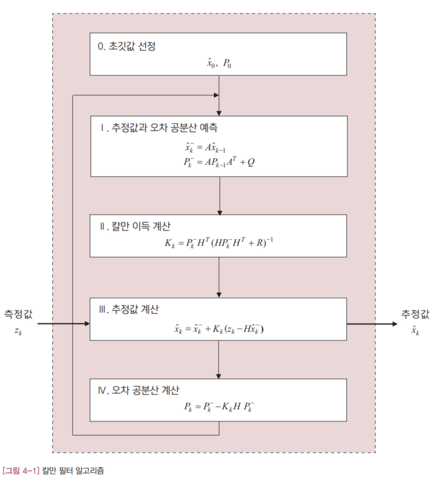

그림에서 점선으로 둘러싸인 부분이 칼만 필터 알고리즘입니다. 입력과 출력이 하나씩인 아주 간단한 구조로, 측정값$(z_k)$ 이 입력되면 내부에서 처리한 다음 추정값 $(\hat x_k)$ 을 출력합니다. 내부 계산은 총 네 단계에 걸쳐 이뤄집니다.

변수에 붙어있는 아래첨자 'k'에 지나치게 신경을 쓰지 않는게 좋습니다. 첨자 k는 칼만 필터 알고리즘이 반복해서 수행된다는 점을 명시하기 위해 붙였을 뿐, 그 이상의 의미는 없습니다. 만약 아래 첨자 k 때문에 수식을 보는데 헷갈리면 아예 무시해도 괜찮습니다. 반면에 위첨자 '-'의 의미는 중요합니다. 이 위첨자가 붙으면 이름이 같더라도 전혀 다른 변수를 의미합니다.

#### 4.2 칼만 필터 알고리즘의 계산과정

첫번째 단계는 예측 단계입니다. 이 단계에서는 2 ~ 4 단계에서 계속 사용하는 두 변수, $\hat x_k^- $ 와 $P_k^- $ 를 계산합니다. 위 첨자 '-'는 예측값을 의미합니다. 예측 단계의 계산식은 시스템 모델과 밀접하게 관련되어 있습니다.
2 단계에서는 칼만 이득 $(K_k)$을 계산합니다. 변수 $P_k^- $ 는 앞 단계에서 계산한 값을 사용합니다. 그리고 H와 R은 칼만 필터 알고리즘 밖에서 미리 결정되는 값 입니다.
3 단계에서는 입력된 측정값으로 추정값을 계산합니다. 아직 명확하게 드러나지 않았지만 이 단계의 계산식은 저주파 통과 필터와 관련 있습니다. 역시 뒤에서 자세히 설명하겠습니다. 참고로 변수 $\hat x_k^- $ 는 1단계에서 이미 계산한 값 입니다.
그 다음 4단계는 오차 공분산을 구하는 단계입니다. 오차 공분산은 추정값이 얼마나 정확한지를 알려주는 척도로 사용됩니다. 보통 오차 공분산을 검토해서 앞서 계산한 추정값을 믿고 쓸지 아니면 버릴지를 판단합니다.


- [표 4-1] 알고리즘에 등장하는 변수

<table>
<thead>
<tr>
<th align="left">변수 용도</th>
<th align="left">변수</th>
</tr>
</thead>
<tbody>
<tr>
<td align="left">외부 입력</td>
<td align="left">$$z_k (측정값)$$ </td>
</tr>
<tr>
<td align="left">최종 출력</td>
<td align="left">$$\hat x_k (추정값)$$ </td>
</tr>
<tr>
<td align="left">시스템 모델</td>
<td align="left">A, H, Q, R</td>
</tr>
<tr>
<td align="left">내부 계산용</td>
<td align="left">$$\hat x_k^- , P_k^- , P_k, K_k$$</td>
</tr>
</tbody>
</table>

[표 4-1]에서 시스템 모델과 관련된 네 개의 변수 A, H, Q, R은 칼만 필터를 구현하기 전에 미리 결정해야 합니다. 이 값들은 대상 시스템과 칼만 필터를 사용하는 목적에 따라 설계자가 사전에 확정합니다. 따라서 이 변수들은 이미 알고 있는 값으로 가정하면 됩니다.

[그림 4-1]의 칼만 필터 알고리즘의 계산 과정은 네 단계로 되어 있지만, 의미를 기준으로 나누면 크게 두 둔계로 분류됩니다.

##### 예측과정

1 단계가 여기애 해당됩니다. 직전 추정값 $(\hat x_{k-1})$ 과 오차 공분산 $(P_{k-1})$ 이 입력되면 최종 결과로 예측값 $(\hat x_k^- , P_k^- )$ 을 내놓습니다. 이 값들은 추정 과정에 사용됩니다. 이 단계에서 사용하는 시스템 모델 변수는 A와 Q입니다.

##### 추정과정

칼만 필터 2, 3, 4단계가 여기에 속합니다. 추정과정의 결과물은 추정값 $(\hat x_k)$ 과 오차 공분산 $(P_k)$ 입니다. 입력값으로는 예측과정의 예측값 $(\hat x_k^- , P_k^- )$ 뿐만 아니라, 측정값 $(z_k)$ 을 전달받아 사용합니다. 이 단계에서 사용하는 시스템 모델 변수는 H와 R입니다.

##### 정리

1. 시스템 모델 (A,Q)을 기초로 다음 시각에 상태와 오차 공분산이 어떤 값이 될지를 예측: $(\hat x_k^- , P_k^- )$
2. 측정값과 예측값의 차이를 보정해서 새로운 추정값을 계산: $\hat x_k, P_k$
3. 위의 두 과정을 반복

### Chapter 05 추정과정

#### 5.1 추정값 계산

- (5.1)

$$
\hat x_k = \hat x_k^-  + K_k (z_k - H \hat x_k^- )
$$

여기서 $z_k$ 는 측정값을 뜻하고, $\hat x_k^- $ 는 예측값을 의미합니다.

- (5.2)

$$
\hat x_k = \hat x_k^-  + K_k (z_k - H \hat x_k^- )\\\ \
= \hat x_k^-  + K_kz_k - K_k \hat x_k^- \\\ \
= (I-K_kH) \hat x_k^-  + K_kz_k
$$

H를 단위행렬<sup>identity matrix</sup> I로 가정하고 위의 식을 다시 써보겠습니다.

- (5.3)

$$
\hat x_k = (I-K_kH) \hat x_k^-  + K_kz_k\\\ \
= (I-K_kI) \hat x_k^-  + K_kz_k\\\ \
= (I-K_k) \hat x_k^-  + K_kz_k
$$

1차 저주파 통과 필터 수식(3.1)을 그대로 옮겨 써보겠습니다.

$$
\overline x_k = \alpha \overline x_{k-1} + (1-\alpha)x_k
$$

이제 이 식에 $\alpha = 1 - K$ 를 대입해서 다시 정리합니다.

$$
\overline x_k = \alpha \overline x_{k-1} + (1-\alpha)x_k\\\ \
= (1-K) \overline x_{k-1} + \{1-(1-K)\} x_k\\\ \
= (1-K) \overline x_{k-1} + K x_k
$$

이 식을 칼만 필터의 추정값 계산식인 (5.3)과 비교해 보겠습니다.

- 1차 저주파 통과 필터: $\overline x_k = (1-K) \overline x_{k-1} + K x_k$
- 칼만 필터: $\hat x_k = (I-K_k) \hat x_k^-  + K_kz_k$

두 식의 모양이 비슷합니다. 1차 저주파 통과 필터는 직전 추정값과 측정값에 가중치를 부여한 후 더해서 추정값을 계산합니다. 칼만 필터도 거의 비슷합니다. 예측값 $\hat x_k^- $ 과 측정값 $z_k$ 에 적절한 가중치를 곱한 다음 두 값을 더해서 최종 추정값을 계산합니다. 직전 추정값 대신 예측값을 사용한다는 점만 다를 뿐, 가중치를 부여하는 방식까지 똑같습니다.

#### 5.2 변하는 가중치

칼만 필터가 새로운 추정값을 계산하기 위해 필요한 값들이 무엇인지 검토해 봅니다.

$$
\hat x_k = \hat x_k^-  + K_k (z_k - H \hat x_k^- )
$$

예측값 $\hat x_k^- $ 과 새로운 측정값 $z_k$ 는 입력 받는 값 입니다. H는 시스템 모델과 관련있는 행렬로 칼만 필터를 설계하기 전에 미리 확정됩니다. $K_k$ 는 **칼만 이득<sup>Kalman gain</sup>** 이라고 불리는 변수인데, 이 값만 알면 새로운 추정값을 계산해 낼 수 있습니다.

- (5.4)

$$
K_k = P_k^-  H^T (HP_k^- H^T + R)^{-1}
$$

칼만 이득은 (5.4)에 의해 계산되는 가중치입니다.

#### 5.3 오차 공분산 계산

- (5.5)

$$
P_k = P_k^-  - K_k H P_k^- 
$$

오차 공분산은 칼만 필터의 추정값이 실제 참값과 얼마나 차이가 나는지를 보여주는 척도가 됩니다. $P_k$ 가 크면 추정 오차가 크고, 작으면 추정 오차도 작습니다. 이런 이유로 칼만 필터를 함수로 구현할 때는 추정값과 함께 오차 공분산도 출력으로 내보내는 경우가 종종 있습니다.

### Chapter 06 예측 과정

#### 6.1 예측값 계산

[그림 4-1]에 나와있는 1단계의 수식을 옮겨 써보겠습니다.

- (6.1) 추정값을 예측하는 식

$$
\hat x_{\overline k + 1} = A \hat x_k
$$

- (6.2) 오차 공분산을 예측하는 관계식

$$
P_{\overline k + 1} = A P_k A^T + Q
$$

여기서 $\hat x_k$ 와 $P_k$ 는 3, 4단계에서 계산한 값입니다. 그리고 A와 Q는 시스템 모델에 이미 정의되어 있습니다. 시스템 모델의 다른 변수인 H와 R은 쓰이지 않습니다. 참고로 추정과정에서는 H와 R만 사용되었습니다.


- [표 6-1] 추정값과 오차 공분산에 관련된 표기법과 의미

<table>
<thead>
<tr>
<th align="left">표기법</th>
<th align="left">의미</th>
</tr>
</thead>
<tbody>
<tr>
<td align="left">$$\hat x_k$$</td>
<td align="left">상태 변수 추정값</td>
</tr>
<tr>
<td align="left">$$\hat x_k^- $$</td>
<td align="left">상태 변수 예측값</td>
</tr>
<tr>
<td align="left">$$P_k$$</td>
<td align="left">오차 공분산 계산값</td>
</tr>
<tr>
<td align="left">$$P_k^- $$</td>
<td align="left">오차 공분산 예측값</td>
</tr>
</tbody>
</table>

#### 6.2 예측과 추정의 차이

예측과 추정이 어떻게 다른지 알아보겠습니다. 먼저 1차 저주파 통과 필터의 추정값 계산식을 다시 옮겨 써보겠습니다.

$$
\overline x_k = \alpha \overline x_{k-1} + (1 - \alpha)x_k
$$

중간에 별도의 단계를 거치지 않고, 새로운 추정값 계산에 직전 추정값 $(\overline x_{k-1})$ 을 바로 사용합니다. 즉, 시간 $t_{k-1}$ 에서 $t_k$ 로 이동할 때 직전 추정값에 어떤 변화도 주지 않습니다. [그림 6-1]에 이러한 과정을 그렸습니다.

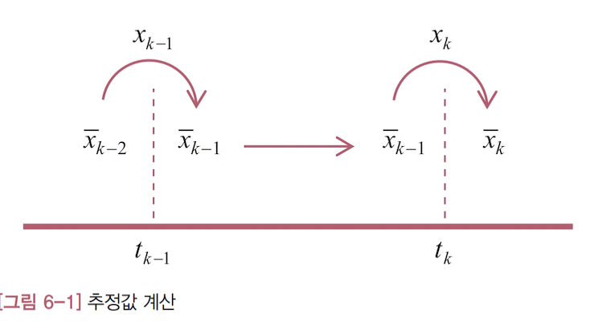

이제 칼만 필터의 추정값 계산식을 살펴보겠습니다.

$$
\hat x_k = \hat x_k^-  + K_k (z_k - H \hat x_k^- )
$$

직전 추정값 $(\hat x_{k-1})$ 은 전혀 보이지 않고 대신에 예측값 $(\hat x_k^- )$ 이 그 자리를 차지하고 있습니다. 그런데 이 예측값은 직전 추정값을 이용해 구한 값 입니다. 앞 절의 식 (6.1)을 보면 예측값 $(\hat x_k^- )$ 은 다음과 같이 구합니다.

$$
\hat x_k^-  = A \hat x_{k-1}
$$

이 식을 위의 추정값 계산식에 대입해 보겠습니다.

$$
\hat x_k = \hat x_k^-  + K_k (z_k - H \hat x_k^- )\\\ \
= A \hat x_{k-1} + K_k (z_k - HA \hat x_{k-1})
$$

이제야 직전 추정값이 보입니다. 이처럼 칼만 필터는 1차 저주파 통과 필터와 달리 추정값을 계산할 때 직전 추정값을 바로 쓰지 않고 예측 단계를 한 번 더 거칩니다. 이런 이유로 예측값을 사전 추정값<sup>priori estimate</sup>, 추정값을 사후 추정값<sup>posteriori estimate</sup> 이라고 부르기도 합니다.

예측과 추정 과정의 관계를 [그림 6-2]에 정리했습니다.

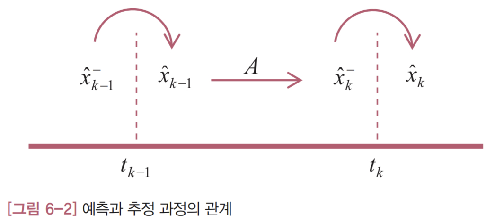

그림에서 같은 시각에 측정값을 받아 계산하는 과정(둥근 화살표)이 '추정'이고, 다음 시각으로 이동하면서 행렬 A를 거치는 과정(직선 화살표)이 '예측'입니다. 1차 저주파 통과 필터와 달리 예측 과정 때문에 직전 추정값이 다른 값으로 바뀝니다. 그 결과 같은 시각에 두 개의 값이 존재하는데, 추정 과정의 결과인 오른쪽에 있는 값이 칼만 필터의 최종 출력이 됩니다.

#### 6.3 추정값 계산식의 재해석

예측 단계의 계산식은 비교적 간단하지만, 칼만 필터의 성능에는 상당한 영향을 줍니다. 지금부터는 그 이유를 알아보겠습니다. 먼저 칼만 필터 추정값 계산식에서 우변의 마지막 항을 살펴보겠습니다.

$$
\hat x_k = \hat x_k^-  + K_k (z_k - H \hat x_k^- )
$$

이 식에서 $H \hat x_k^- $ 는 예측값으로 계산한 측정값을 뜻합니다. 즉 예측한 측정값을 의미합니다. 그렇다면 $(z_k - H \hat x_k^- )$ 는 실제 측정값과 예측한 측정값의 차이, 즉 측정값의 예측 오차가 됩니다. 이러한 분석을 토대로 위의 식을 해석하면, '칼만 필터는 측정값의 예측 오차로 예측값을 적절히 보정해서 최종 추정값을 계산한다'라고 할 수 있습니다. 이때 칼만 이득은 예측값을 얼마나 보정할지 결정하는 인자가 됩니다. 이런 해석은 1차 저주파 통과 필터와 연관지어 설명한, 앞 장의 접근 방식과는 상당히 다릅니다.

이처럼 추정값 계산식을 예측값의 보정 관점에서 보면, 추정값의 성능에 가장 큰 영향을 주는 요인은 예측값의 정확성입니다. 예측값이 부정확하면 아무리 칼만 이득을 잘선정한다고 해도 추정값이 부정확할 수 밖에 없기 때문입니다. 그런데 식(6.1)과 (6.2)의 예측 단계에서 사용되는 변수를 보며, 추정값과 시스템 모델의 A와 Q가 필요합니다.이 두 변수가 예측값에 결정적 영향을 끼칩니다. 시스템 모델의 A와 Q가 실제 시스템과 많이 다르면 예측값은 부정확하게 되고, 추정값도 엉뚱한 값을 갖게 됩니다. 따라서 칼만 필터의 성능은 시스템 모델에 달려있다고 할 수 있습니다.

### Chapter 07 시스템 모델

#### 7.1 시스템 모델

칼만 필터는 다음과 같은 선형 상태 모델을 대상으로 합니다. 물론 경우에 따라 이 형태에서 약간 변형될 수도 있습니다.

- (7.1)

$$
x_{k+1} = A x_k + w_k
$$

- (7.2)

$$
z_k = H x_k + v_k
$$

위의 식에서 시스템 모델에 잡음이 포함되어 있어야 한다는 점이 중요합니다. 각 변수는 다음과 같이 정의됩니다.

- $x_k$ : 상태 변수, (n×1) 열벡터<sup>column vector</sup>
- $z_k$ : 측정값, (m×1) 열벡터
- A : 시스템 행렬, (n×n) 행렬
- H : 출력 행렬, (m×n) 행렬
- $w_k$ : 시스템 잡음, (n×1) 열벡터
- $v_k$ : 측정 잡음, (m×1) 열벡터

상태 변수<sup>state variable</sup> 는 거리, 속도, 무게 등 우리가 관심있는 물리적 변수로 이해하면 쉽습니다. 그리고 칼만 필터에서는 잡음이 중요한 역할을 하는데, 모든 잡음을 백색 잡음<sup>white noise</sup> 으로 가정합니다. $w_k$ 는 시스템에 유입되어 상태 변수에 영향을 주는 잡음을 말하며, $v_k$ 는 센서에서 유입되는 측정 잡음을 의미합니다. 그리고 A와 H는 모든 성분이 상수인 행렬입니다. 여기서 행렬 A는 시간에 따라 시스템에 어떻게 움직이는지를 나타냅니다. 즉 시스템의 운동방정식을 담고 있습니다. 한편 행렬 H는 측정값과 상태변수의 관계를 나타냅니다. 즉 측정값에 각 상태 변수가 어떻게 반영되어 있는지를 이 행렬이 규정합니다.

(7.1)과 (7.2)와 같이 시스템의 운동 방정식을 상태 변수 벡터에 대해 1차 차분(또는 미분) 방정식으로 표현한 모델을 **상태 공간<sup>state space</sup> 모델** 이라고 합니다. 

이제는 [그림 4-1]의 칼만 필터 알고리즘에서 시스템 모델과 관련 있는 부분을 찾아보겠습니다. 두 군데가 있습니다. 첫번째는 1단계에 있는 추정값 예측식입니다.

- (7.3)

$$
\hat x_{\overline k+1} = A \hat x_k
$$

이 식은 시스템 모델의 식 (7.1)에서 유래한 것 입니다. 또 다른 한 곳은 3단계의 추정값 계산식에 포함되어 있는데, 아래 식에서 진하게 표시된 부분입니다.

- (7.4)

$$
\hat x_k = \hat x_k^-  + K_k (z_k - \bf{H \hat x_k^- })
$$

이 항은 시스템 모델 식 (7.2)와 관련이 있습니다. (7.3)과 (7.4)를 시스템 모델과 비교해 보면 잡음 항 $(w_k, v_k)$ 이 빠져있다는 점만 다를 뿐, 식 (7.3)과 (7.4)가 시스템 모델과 연관되어 있음을 쉽게 알 수 있습니다. 이 밖에도 H는 몇 군데에서 더 사용되지만, 따로 설명이 필요할 정도로 중요한 의미는 없습니다.

#### 7.2 잡음의 공분산

보통 잡음 신호는 다음에 어떤 값이 나올지 예측할 수 없고, 순전히 통계적인 추정만 가능합니다. 그래서 잡음을 표현할 때는 통계학을 이용합니다. 그런데 칼만 필터에서 잡음은 평균 0인 정규분포를 따른다고 가정하기 때문에 잡음의 분산<sup>variance</sup> 만 알면 됩니다. 이러한 이론적 기반에서 칼만 필터는 상태 모델의 잡음을 다음과 같은 공분산 행렬로 표현합니다.

- Q: $w_k$ 의 공분산 행렬, (n×n) 대각행렬
- R: $v_k$ 의 공분산 행렬, (m×m) 대각행렬

여기서 대각행렬<sup>diagonal matrix</sup>은 $(1,1), (2,2), \cdots, (n,n)$ 등 대각선 위치 외의 성분은 모두 0인 행렬을 말합니다.

한편 공분산 행렬은 변수의 분산으로 구성된 행렬로 정의됩니다. 예를 들어 n개의 잡음 $w_1, w_2, \cdots, w_n$ 이 있고, 각 잡음의 분산은 $\sigma^2_1, \sigma^2_2, \cdots, \sigma^2_n$ 이라고 하겠습니다. 그러면 공분산 행렬은 다음과 같이 쓸 수 있습니다. 측정잡음 $v_k$ 의 공분산 행렬 R도 같은 방식으로 구성합니다.

$$
Q = \begin{bmatrix} \sigma^2_1 & 0 & \cdots & 0\\\ \
0 & \sigma^2_2 & \cdots & 0\\\ \
\vdots & \vdots & \ddots & \vdots\\\ \
0 & 0 & \cdots & \sigma^2_n \end{bmatrix}
$$

행렬 Q와 R은 잡음의 특성을 정확히 반영해서 구성하는게 원칙이지만, 여러 오차가 복합적으로 작용하기 때문에 해석적으로 결정하는데는 한계가 있습니다. 해당 시스테멩 대한 경험을 바탕으로 어느 정도의 시행착오를 겪을 수밖에 없다는 말입니다. 즉, 잡음에 대한 지식을 최대한 활용하되, 이 두 행렬을 칼만 필터 설계 인자로 보고 시행착오 과정을 통해 보정하면서 적절한 값을 찾아야 합니다.

[그림 4-1]의 알고리즘에서 행렬 Q와 R이 어디에서 사용되는지 살펴보겠습니다. 먼저 행렬 R은 칼만 이득 계산식에 등장합니다.

$$
K_k = P_k^-  H^T (HP_k^- H^T + R)^{-1}
$$

행렬식으로는 감을 잡기 어렵습니다. 위의 식에서 모든 변수가 스칼라라고 가정하면, 역행렬 계산식은 나누기와 같게 됩니다. 따라서 위의 식은 다음과 같이 쓸 수 있습니다.

- (7.5)

$$
K_k = \cfrac{P_k^-  H^T}{HP_k^- H^T + R}
$$

이 식에서 R이 커지면 칼만 이득은 작아집니다. 그런데 칼만 이득이 작아지면 추정값에는 어떤 영향을 줄까요? 추정과정의 식(5.3)을 보시죠.

$$
\hat x_k = (1-K_k) \hat x_k^-  + K_kz_k
$$

칼만 이득이 작아지면 추정값 계산에 측정값이 반영되는 비율도 작아집니다. 반면 에측값의 반영 비율은 높아집니다. 즉 외부 측정값의 영향을 덜받게 되어 추정값의 변화가 줄어듭니다. 따라서 측정값의 영향을 덜받고 변화가 완만한 추정값을 얻고 싶다면 행렬 R을 키우면 됩니다.

이제 행렬 Q가 사용되는 수식을 찾아보겠습니다. 행렬 Q는 오차 공분산의 예측값 $(P_{k+1}^- )$ 계산 식에 등장합니다.

$$
P_{k+1}^-  = AP_kA^T + Q
$$

이 식에서 행렬 Q가 커지면 오차 공분산 예측값도 커집니다. 그럼 오차 공분산 예측값이 커지면 어떻게 될까요? 역시 모든 변수를 스칼라로 가정하고 다시 식 (7.5)를 보겠습니다.

$$
K_k = \cfrac{P_k^-  H^T}{HP_k^- H^T + R}
$$

여기에서 오차 공분산 예측값이 커지면 칼만 이득도 커짐을 알 수 있습니다. 분자 항으로 분자와 분모 모두를 나누어 보면 더 직관적으로 이해할 수 있을 것 입니다. 이와 같이 행렬 Q가 커지면 칼면 이득도 커집니다. 그런데 칼만 이득이 커질수록 (5.3)에서 측정값이 더 많이 반영됩니다. 따라서 측정값의 영향을 덜 받고 변화가 완만한 추정값을 얻고 싶다면 행렬 Q를 줄여야 합니다. 행렬 R과는 정반대입니다.


## Part 03 칼만 필터 응용

### Chapter 08 초간단 칼만 필터 예제

- 예제 8-1: 손칼만 연구원은 전기차의 배터리를 연구한다. 어느 날 손칼만 연구원이 새로 들어온 배터리의 전압을 측정하는데, 잡음이 심해서 잴 때마다 전압값이 달랐다. 그래서 칼만 필터로 측정 데이터의 잡음을 제거해보기로 했다. 전압은 0.2초 간격으로 측정한다.

#### 8.1 시스템 모델

칼만 필터를 설계하려면 가장 먼저 시스템 모델을 알아야 합니다.

- (8.1)

$$
\begin{cases}
x_{k+1} = x_k\\\ \
z_k = x_k + v_k\\\ \
x_0 = 14\\\ \
v_k = N(0, 2^2)
\end{cases}
$$

시스템 모델이 실제 시스템을 제대로 반영하고 있는지 확인해 보겠습니다.

첫번째 식은 배터리의 전압이 어떻게 변해가는지를 나타내는 식으로 배터리의 전압이 일정하게 유지되고 있으며 $(x_{k+1} = x_k)$ , 그 값은 14볼트 $(x_0 = 14)$ 라는 뜻입니다. 

두번째 식은 측정값인 전압에 잡음 $(v_k)$ 이 섞여 있다는 의미를 담고 있습니다. 그리고 측정 잡음의 특성을 표현한 $v_k = N(0, 2^2)$ 은 평균이 0이고 표준편차가 2인 정규분포를 따르는 신호라는 뜻입니다. 잡음의 특성이 정확한지는 신호와 센서를 분석해봐야 합니다. 만약 이런 해석적 접근이 여의치 않다면, 시스템 모델의 R을 설계 변수로 보고 값을 바꿔가면서 적절한 값을 선정하는 것도 한 방법입니다.

이제 칼만 필터를 구현해 보겠습니다. 제일 먼저 시스템 모델을 구성하는 A, H, Q, R을 구해야 합니다. (7.1)과 (7.2)의 시스템 모델 식을 (8.1)과 비교해보면 이 네 변수의 값은 쉽게 알 수 있습니다.

$$
\begin{cases}
A=1\\\ \
H=1\\\ \
Q=0\\\ \
R=4
\end{cases}
$$

여기서 Q가 0인 이유는 $w_k$ 가 없기 때문입니다. $w_k$ 가 없다는 말은 $w_k = 0$ 이라는 의미이므로 분산이 0인 것은 당연합니다.

다음으로 할 인은 초기 예측값을 정하는 것 ㅇ비니다. 초기값에 대한 정보가 전혀 없다면 오차 공분산을 크게 잡는 게 좋습니다.

여기에서는 다음과 같이 선정했습니다.

$$
\begin{cases}
\hat x_{\overline 0} = 14\\\ \
P_{\overline 0} = 6
\end{cases}
$$

#### 8.2 칼만 필터 함수

    ```matlab
    function volt = SimpleKalman(z)
    %
    %
    persistent A H Q R
    persistent x P
    persistent firstRun


    if isempty(firstRun)
        % initialize system model variables
        A = 1;
        H = 1;
        Q = 0;
        R = 4;

        % initialzie first prediction values
        x = 14;
        P = 6;

        firstRun = 1;
    end

    xp = A*x; % step 1: predict estimation value
    Pp = A*P*A' + Q; % predict error covariance

    K = Pp*H'/(H*Pp*H' + R); % step 2: calculate Kalman gain

    x = xp + K*(z - H*xp); % step 3: calculate estimation value
    P = Pp - K*H*Pp; % step 4: calculate error covariance 

    volt = x; % return the estimation value
    Px = P;
    ```

#### 8.3 테스트 프로그램

    ```matlab
    clear all

    dt = 0.2;
    t = 0:dt:10;

    Nsamples = length(t);

    Xsaved = zeros(Nsamples, 1);
    Zsaved = zeros(Nsamples, 1);

    for k=1:Nsamples
        z = GetVolt();
        volt = SimpleKalman(z); % invoking Kalman filter function

        Xsaved(k) = volt;
        Zsaved(k) = z;
    end

    figure
    plot(t, Xsaved, 'o-')
    hold on
    plot(t, Zsaved, 'r:*')
    ```

    ```matlab
    function z = GetVolt()
    %
    %
    w = 0 + 4*randn(1, 1);
    z = 14.4 + w;
    ```

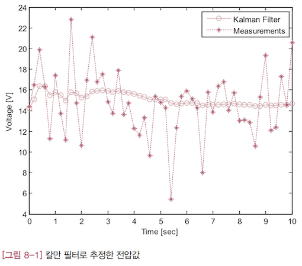

#### 8.4 오차 공분산과 칼만 이득

위의 예에서 오차 공분산과 칼만 이득 값을 확인해 보겠습니다.

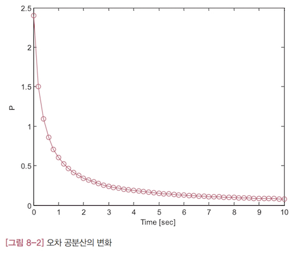

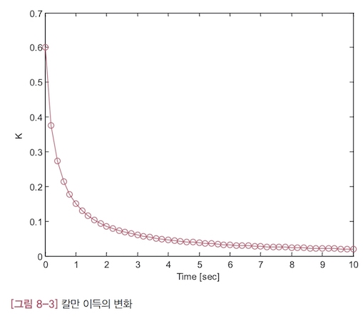

오차 공분산의 변화([그림 8-2])와 칼만 이득의 변화([그림 8-3])은 시간이 지나갈 수록 꾸준히 작아집니다. 처음에는 아주 빠른 속도로 줄어들다가 차츰 느려져서 나중에는 거의 줄어들지 않습니다.

오차 공분산이 줄어든다는 말은 추정값의 오차가 작아진다는 말과 같습니다. 오차가 줄어드는 속도가 느려지는 까닭은 추정값의 오차가 줄어들 만큼 줄어들었기 때문이라고 볼 수 있습니다. 이것은 더이상 줄어들 여지가 없는 상태로 수렴했다는 뜻이기도 합니다.

칼만 이득이 작아진다는 것이 어떤 의미인지를 알아보겠습니다. 먼저 칼만 필터의 추정값 계산식을 다시 옮겨 써보겠습니다.

$$
\hat x_k = \hat x_k^-  + K_k (z_k - H \hat x_k^- )
$$

위의 식에서 칼만 이득 $K_k$ 이 작으면 $K_k (z_k - H \hat x_k^- )$ 도 작은 값을 갖게 되어 추정값 계산에 거의 기여하지 못하게 됩니다. 반대로 예측값 $\hat x_k^- $ 이 추정값에 미치는 영향은 더 커지게 됩니다. 그런데 예측값은 이전 추정값에 비례하므로 $(\hat x_k^-  = A \hat x_{k-1})$ , 새로운 추정값에는 이전 추정값 $\hat x_{k-1}$ 이 주로 반영됩니다. 따라서 칼만 이득이 작아지면 추정값은 별로 변하지 않게 됩니다. 추정 오차가 충분히 작아져서 더이상 추정값이 변하지 않는 상태로 수렴한 것입니다.

### Chapter 09 위치로 속도 추정하기

- 예제 9-1: 손칼만 연구원은 요즘 신형 열차의 성능 시험으로 바쁘다. 시험 내용은 직선 선로에서 열차가 80m/s의 속도를 유지하는지 확인하는 것이다. 위치와 속도 정보는 0.1초 간격으로 측정해서 저장하도록 되어 있다. 그런데 시험 결과를 살펴보던 손칼만 연구원의 얼굴이 갑자기 사색으로 변했다. 속도 데이터가 모두 0으로 찍혀있는게 아닌가! 실험에 드는 비용과 시간이 만만치 않았는데, 이 사실을 위에서 알면 난리가 날게 뻔하다. 그나마 다행인 것은 위치 정보는 이상이 없어 보인다는 점이다. 우리의 손칼만 연구원을 이 위기에서 구해낼 방법은 없을까?

#### 9.1 시스템 모델

잘 알다시피 속도는 이동거리를 시간으로 나눈 값입니다. 따라서 짧은 시간 동안의 이동거리를 그 시간으로 나누면 그 구간의 속도를 구할 수 있습니다. 그런데 실제로 이 방법을 적용해보면 오차가 큽니다. 잡음때문에 측정 거리는 들쭉날쭉한데 분모인 시간은 아주 작아서, 나누면 값이 크게 튀기 때문입니다. 이러한 문제를 해결하기 위해 몇 개의 측정값을 평균 내서 이동 거리로 사용하거나(이동평균), 측정값을 다항식으로 근사한 다음 그 다항식을 미분하는 등의 방법을 동원하기도 합니다. 하지만 이런 해결책은 복잡할 뿐만 아니라, 잘 들어맞지도 않습니다. 칼만 필터는 바로 이런 유형의 문제에서 진가를 발휘합니다.

우리가 관심있는 물리량은 열차의 위치와 속도이므로 이 두 변수를 상태 변수로 정의합니다.

$$
x = \begin{Bmatrix}
위치\\\ \
속도
\end{Bmatrix}
$$

이 상태변수에 대해 예제의 시스템 모델을 다음과 같이 설정하겠습니다.

$$
\begin{aligned}
x_{k+1} &= Ax_k + w_k\\\ \
z_k &= Hx_k + v_k\\\ \
A &= \begin{bmatrix}
1 & \Delta t\\\ \
0 & 1
\end{bmatrix}\\\ \
H &= \begin{bmatrix}1 & 0 \end{bmatrix}
\end{aligned}
$$

그럼 이 시스템 모델이 예제의 내용을 제대로 반영하고 있는지 확인해 보겠습니다. 먼저 행렬 A를 시스템 모델에 대입해서 상태 변수 관계식을 풀어써봅니다.

$$
\begin{aligned}
x_{k+1} &= Ax_k + w_k\\\ \
&= \begin{bmatrix}
1 & \Delta t\\\ \
0 & 1
\end{bmatrix} x_k + w_k
\end{aligned}
$$

이 식에 상태변수의 정의를 대입해 정리하면 더 구체적인 의미를 알 수 있습니다.

$$
\begin{aligned}
\begin{bmatrix}
    위치\\\ \
    속도
\end{bmatrix}_ {k+1} &= \begin{bmatrix}
    1 & \Delta t\\\ \
    0 & 1
\end{bmatrix} \begin{bmatrix}
    위치\\\ \
    속도
\end{bmatrix}_ {k} + \begin{bmatrix}
    0\\\ \
    w_k
\end{bmatrix}\\\ \
&= \begin{bmatrix}
    위치+속도 \cdot \Delta t\\\ \
    속도+w
\end{bmatrix}_ {k}
\end{aligned}
$$

먼저 위치와 관련된 관계식만 따로 떼어내서 살펴보겠습니다.

$$
위치_ {k+1} = 위치_k + 속도_k \cdot \Delta t
$$

이 식은 '현재 위치 = 직전 위치 + 이동거리' 라는 물리 법칙을 수식으로 표현한 것입니다. 시스템 잡음이 관계식에 포함되지 않는 것은 이 때문입니다. 이제 속도 관계식도 따로 떼어내 살펴보겠습니다.

$$
속도_ {k+1} = 속도_k + w_k
$$

이 식이 의미하는 바는 열차 속도는 시스템 잡음 $(w_k)$ 의 영향만 받을 뿐, 다른 외부의 힘은 작용하지 않는다는 것입니다. 즉 속도가 일정하다는 말입니다. 여기서 시스템 잡음은 마찰, 엔진 제어기의 오차 등 열차 속도에 영향을 주는 모든 요인의 합을 의미합니다.

이제는 시스템 모델의 측정값 관계식을 살펴보겠습니다. 행렬 H를 측정값 관계식에 대입해서 정리합니다.

$$
\begin{aligned}
z_k &= Hx_k + v_k\\\ \
&= \begin{bmatrix}1&0 \end{bmatrix}_ k + v_k\\\ \
&= 위치_k + v_k
\end{aligned}
$$

이 식이 의미하는 바는, 측정값은 위치뿐인데 이 측정값에 잡음이 섞여 있다는 것입니다. 이러한 사실은 예제의 내용과 정확히 일치합니다.

마지막으로 잡음의 공분산 행렬(Q, R)만 결정하면 시스템 모델의 유도는 끝납니다. 측정 잡음 $(v_k)$ 의 오차 특성은 센서 제작사에서 제공하는 경우가 많습니다. 그렇지 않다면 실험과 경험을 통해 결정해야 합니다. 시스템 잡음 $(w_k)$ 의 모델링은 더 어려운데, 시스템에 대한 지식과 경험에 의존할 수밖에 없습니다. 만약 공분산 행렬(Q, R)을 논리적으로 구하기 어렵다면 두 행렬을 칼만 필터의 설계인자로 보고 시행착오를 거쳐 선정하는 것도 한 방법입니다. 이 예제에서는 두 잡음이 다음과 같은 특성을 갖는다고 가정합니다.

$$
Q = \begin{bmatrix}
    1 & 0\\\ \
    0 & 3
\end{bmatrix}, R = 10
$$

#### 9.2 칼만 필터 함수

시스템 모델을 구하는 작업은 모두 끝났으니, 이제 칼만 필터를 구현해보겠습니다.

DvKalman(z) 함수는 위치 측정값 z를 매개변수로 받아 위치 추정값과 속도 추정값을 반환합니다. 시스템 모델만 바뀌었을 뿐, 알고리즘 구현 코드는 앞 장의 예제와 거의 달라진게 없습니다.

예제의 계산식은 스칼라가 아니고 행렬 형태이기 때문에 C언어 등으로 구현하면 코드가 더 복잡해지기는 합니다. 하지만 알고리즘 내용이 달라지는 것은 전혀 없습니다.

- DvKalman.m

```matlab
function [pos, vel] = DvKalman(z)
%
%
persistent A H Q R
persistent x P
persistent firstRun

if isempty(firstRun)
    firstRun = 1;

    dt = 0.1;
    A = [1 dt;
         0 1];
    H = [1 0];

    Q = [1 0;
         0 3];
    R = 10;

    x = [0 20]';
    P = 4*eye(2);
end

xp = A*x;
Pp = A*P*A' + Q;

K = Pp*H' *inv(H*Pp*H' + R);

x = xp + K*(z - H*xp);
P = Pp - K*H*Pp;

pos = x(1);
vel = x(2);
```

#### 9.3 테스트 프로그램

- TestDvKalman.m

```matlab
clear all

dt = 0.1;
t = 0:dt:10;

Nsamples = length(t);

Xsaved = zeros(Nsamples, 2);
Zsaved = zeros(Nsamples, 1);

for k=1:Nsamples
    z = GetPos();
    [pos vel] = DvKalman(z);
    Xsaved(k, :) = [pos vel];
    Zsaved(k) = z;
end

figure 
hold on
plot(t, Zsaved(:), 'r.')
plot(t, Xsaved(:, 1))

figure
plot(t, Xsaved(:, 2))

```

- GetPos.m

```matlab
function z = GetPos()
%
%
persistent Velp Posp

if isempty(Posp)
    Posp = 0;
    Velp = 80;
end

dt = 0.1;

w = 0 + 10*randn;
v = 0 + 10*randn;

z = Posp + Velp*dt + v;

Posp = z-v; % true position
Velp = 80 + w; % true speed
```

[그림 9-1]에서 실선은 칼만 필터의 추정 위치를 나타내고, 점으로 표시된 데이터는 위치 측정값을 의미합니다. 측정 잡음을 효과적으로 제거하여 추정 위치의 궤적이 더 매끄러워졌고, 열차의 이동 경향도 잘 나타나 있습니다.

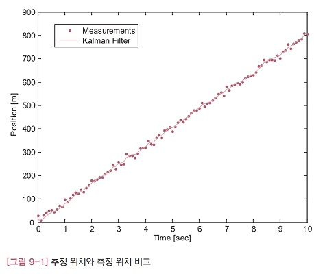

[그림 9-2]는 칼만 필터가 추정한 속도를 보여주는 그래프입니다. 그림에서 실선은 칼만 필터가 추정해낸 속도이고, 점선은 측정 잡음을 뺀 열차의 진짜 속도를 나타냅니다. 그림을 보면 추정 속도의 경향이 진짜 속도와 아주 비슷합니다. 처음에는 추정 속도 오차가 상당히 크게 나지만, 2초 정도 후부터는 비교적 정확하게 속도를 추정해내고 있습니다. 테스트 프로그램에서 초기에 속도를 20m/s라고 가정한 탓에 오차가 크게 났음에도 불구하고 정확한 값을 추정해냈습니다.

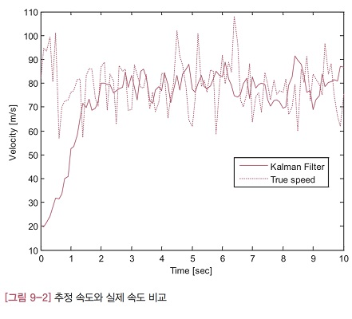

#### 9.4 속도로 위치 추정하기

측정값이 위치에서 속도로 변경되었으니 시스템 모델에서 행렬 H가 달라져야 합니다.

$$
H = \begin{bmatrix}0 & 1 \end{bmatrix}
$$

이 값을 시스템 모델에 대입해서 정리해보겠습니다. 행렬 H가 왜 이렇게 바뀌는지 이해가 되실겁니다.

$$
\begin{aligned}
z_k &= Hx_k +v_k\\\ \
&= \begin{bmatrix}0 & 1 \end{bmatrix} \begin{bmatrix}
    위치\\\ \
    속도
\end{bmatrix}_ k + v_k\\\ \
&= 속도_k + v_k
\end{aligned}
$$

측정값이 속도라는 시스템 변경 사항이 제대로 반영되었습니다. 그 밖에 시스템 모델에서 바뀌는 사항은 없습니다. 다음은 변경된 모델에 대한 칼만 필터 함수입니다.

- IntKalman.m

```matlab
function [pos, vel] = IntKalman(z)
%
%
persistent A H Q R
persistent x P
persistent firstRun

if isempty(firstRun)
    firstRun = 1;

    dt = 0.1;
    A = [1 dt;
         0 1];
    H = [0 1];

    Q = [1 0;
         0 3];
    R = 10;

    x = [0 20]';
    P = 5*eye(2);
end

xp = A*x;
Pp = A*P*A' + Q;

K = Pp*H' *inv(H*Pp*H' + R);

x = xp + K*(z - H*xp);
P = Pp - K*H*Pp;

pos = x(1);
vel = x(2);
```

- TestDvKalman.m

```matlab
clear all

dt = 0.1;
t = 0:dt:10;

Nsamples = length(t);

Xsaved = zeros(Nsamples, 2);
Zsaved = zeros(Nsamples, 1);

for k=1:Nsamples
    z = GetVel();
    [pos vel] = IntKalman(z);
    Xsaved(k, :) = [pos vel];
    Zsaved(k) = z;
end

figure
plot(t, Xsaved(:, 1))

figure 
hold on
plot(t, Zsaved(:), 'r.')
plot(t, Xsaved(:, 2))
```

- GetVel.m

```matlab
function z = GetVel()
%
%
persistent Velp Posp

if isempty(Posp)
    Posp = 0;
    Velp = 80;
end

dt = 0.1;

v = 0 + 10*randn;

Posp = Posp + Velp*dt; % true position
Velp = 80 + v; % true speed

z = Velp;
```

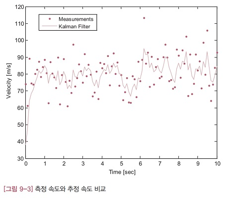

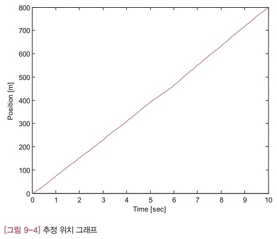

#### 9.5 초음파 거리계로 속도 추정하기

이 절에서는 속도가 일정하지 않은 경우에도 위치로 속도를 추정해낼 수 있는 알아보겠습니다.

먼저 칼만 필터의 시스템 모델을 선정해야 하는데, 앞의 예제와 동일한 모델을 사용하면 됩니다. 시스템의 기동은 많이 다르지만, 시스템 모델은 같습니다. 거리와 속도의 물리적 관계는 변하지 않기 때문입니다.

칼만 필터 함수도 9.2절의 DvKalman 함수를 그대로 사용합니다.

다음은 테스트 프로그램입니다. GetSonar 함수로 거리를 측정해서 칼만 필터에 입력한다는 점을 빼면, 앞 절의 테스트 프로그램과 거의 똑같습니다.

- TestDvKalman2.m

```matlab
clear all

Nsamples = 500;

Xsaved = zeros(Nsamples, 2);
Zsaved = zeros(Nsamples, 1);

for k=1:Nsamples
    z = GetSonar();
    [pos vel] = DvKalman(z);
    Xsaved(k, :) = [pos vel];
    Zsaved(k) = z;
end

dt = 0.02;
t = 0:dt:Nsamples*dt-dt;

figure 
hold on
plot(t, Zsaved(:), 'r.')
plot(t, Xsaved(:, 1))

figure
plot(t, Xsaved(:, 2))

```

- GetSonar.m

```matlab
function h = GetSonar()
%
%
persistent sonarAlt
persistent k firstRun

if isempty(firstRun)
    load SonarAlt
    k = 1;
    firstRun = 1;
end

h = sonarAlt(k);
k = k+1;
```

[그림 9-5]는 거리의 궤적을 비교한 그래프입니다. 칼만 필터의 추정값은 실선으로 그렸고, 측정 거리는 점으로 표시했습니다. 측정 잡음이 많이 제거되었고, 거리의 변화 추이도 잘 드러나 있습니다. 

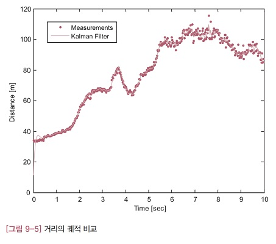

[그림 9-6]에는 칼만 필터가 추정한 속도를 그렸습니다. 그래프에서 실선은 추정 속도의 궤적이고, 점선은 추정 거리를 나타냅니다. 추정 속도와 같은 그래프에 그리기 위해 추정 거리에서 40미터를 빼고 크기를 반으로 줄였습니다. 추정 거리의 변화율과 추정 속도를 비교해 보면 추정 속도가 나름 타당하다는 것을 알 수 있습니다. 거리의 변화가 별로 없는 구간에서는 속도가 0에 가깝고 변화가 심한 구간에서는 속도값이 크게 나타납니다.

#### 9.6 효율적인 칼만 필터 함수

[그림 4-1]의 칼만 필터 알고리즘을 보면 칼만 이득을 계산할 때 역행렬을 한 번 계산해야 합니다. 역행렬은 보통 수치해석 기법으로 구하는데 계산 시간이나 안정성을 고려하면 그 방법은 되도록 피하는 게 좋습니다. 특히 빠르게 실행되는 실시간 시스템에 칼만 필터를 적용할 때는 어떻게든 계산 시간을 단축하는 것이 바람직합니다. 이 장의 예제와 같이 시스템 모델의 행렬이 작으면 행렬 계산식을 풀어 쓰는게 계산 시간과 오차를 줄이는데 도움이 됩니다. 그럼 칼만 이득을 계산하는 행렬식을 풀어써보겠습니다.

$$
K_k = P_k^- H^T(HP_k^- H^T+R)^{-1}
$$

먼저 반복해서 등장하는 $P^-_ kH^T$ 계산부터 시작하겠습니다. 행렬은 앞 절의 시스템 모델을 그대로 사용합니다.

$$
\begin{aligned}
P_k^-H^T &= \begin{bmatrix}
    P^-_ {11} & P^-_ {12}\\\ \
    P^-_ {21} & P^-_ {22} 
\end{bmatrix}
\begin{bmatrix} 
    1\\\ \
    0
\end{bmatrix}\\\ \
&= \begin{bmatrix}
    P_{11}^-\\\ \
    P_{21}^-
\end{bmatrix}
\end{aligned}
$$

이제 이 식을 활용해서 역행렬을 계산하는 행렬식 전체를 정리해 보겠습니다.

$$
\begin{aligned}
HP_k^-H^T + R &= \begin{bmatrix}
    1 & 0 
\end{bmatrix}
\begin{bmatrix}
    P_{11}^-\\\ \
    P_{21}^- \end{bmatrix} + R\\\ \
&= P_{11}^- + R
\end{aligned}
$$

상당히 간단해졌습니다. 더구나 풀어 써보니 행렬인줄 알았던 수식이 스칼라로 드러났습니다. 스칼라의 역행렬은 역수니까 계산도 굉장히 쉽습니다. 이상의 결과를 칼만 이득 계산식에 대입해서 정리해보겠습니다.

$$
\begin{aligned}
K_k &= P_k^-H^T(HP_k^{-}H^T + R)^{-1}\\\ \
&= \begin{bmatrix}
    P_{11}^-\\\ \
    P_{21}^-
\end{bmatrix} (P_{11}^{-} + R)^{-1}\\\ \
&= \cfrac{1}{P_{11}^{-}+R} \begin{bmatrix}
    P_{11}^-\\\ \
    P_{21}^-
\end{bmatrix}
\end{aligned}
$$

위의 식으로 칼만 이득을 계산하는 DeDvKalman 함수를 새로 작성했습니다.

```matlab
K = 1 / (Pp(1,1)+R) * [Pp(1,1) Pp(2,1)]'
```

### Chapter 10 영상 속의 물체 추적하기
이 장에서는 칼만 필터로 2차원 평면 위에서 움직이는 물체를 추적하는 방법에 대해 알아봅니다.

#### 10.1 시스템 모델
평면 상의 표적 추적에 칼만 필터를 적용하기 위해서는 앞 장에서 소개한 위치-속도 모델을 2차원으로 확장해야 합니다. 즉 상태 변수를 가로 방향(x축)의 위치, 속도와 세로 방향(y축)의 위치, 속도로 잡고 시스템 모델을 유도합니다.

$$
x = \begin{Bmatrix}
    위치_x\\\ \
    속도_x\\\ \
    위치_y\\\ \
    속도_y
\end{Bmatrix}
$$

여기서 상태변수의 순서는 중요하지 않습니다. 예를 들어 위치 변수 두 개를 먼저 쓰고, 속도는 속도끼리 모아도 됩니다. 어쨌든 상태 변수를 위와 같이 정의하면 시스템 모델은 다음과 같이 주어집니다.

- (10.1)

$$
\begin{aligned}
x_{k+1} &= Ax_k + w_k\\\ \
z_k &= Hx_k + v_k
\end{aligned}
$$

- (10.2)

$$
A = \begin{bmatrix}
    1 & \Delta t & 0 & 0\\\ \
    0 & 1 & 0 & 0\\\ \
    0 & 0 & 1 & \Delta t\\\ \
    0 & 0 & 0 & 1
\end{bmatrix},
H = \begin{bmatrix}
    1 & 0 & 0 & 0\\\ \
    0 & 0 & 1 & 0
\end{bmatrix}
$$

행렬 A를 식(10.1)에 대입해서 정리해보면, x축과 y축 방향으로 각각 다음과 같은 관계를 행렬식으로 표현하고 있음을 알 수 있습니다.

$$
\begin{Bmatrix}
    위치_{k+1}\\\ \
    속도_{k+1}
\end{Bmatrix} = \begin{Bmatrix}
    위치_k + 속도_k \cdot \Delta t\\\ \
    속도_k
\end{Bmatrix} + w_k
$$

그리고 행렬 H를 식(10.1)의 측정값 관계식에 대입해서 정리해보면, x축과 y축 방향의 위치만 측정하고 속도는 측정하지 않는다는 의미가 담겨 있습니다.

지금까지의 내용을 정리해보겠습니다. 평면 상의 물체를 추적하는 칼만 필터의 시스템 모델은 식(10.1), (10.2)와 같이 주어집니다. 이 모델은 위치와 속도 사이의 관계를 2차원 평면으로 확장한 것 입니다. 그리고 대상 표적의 위치는 영상 처리 알고리즘으로 찾아서 칼만 필터에 입력하지만, 속도는 측정하지 않습니다.

#### 10.2 칼만 필터 함수

다음은 앞 절의 시스템 모델에 대해 구현한 칼만 필터 함수의 코드입니다. TrackKalman 함수는 영상처리 알고리즘이 찾아낸 위치(xm, ym)를 인자로 받아, 추정위치(xh, yh)를 반환합니다.

코드의 구조와 내용은 앞에서 구현한 함수와 거의 비슷합니다. 코드의 마지막 줄에 상태 변수 추정값에서 위치만 따로 뽑아서 반환하는 코드가 있습니다. 만약 추정 속도도 필요하다면 변수 x의 두번째와 네번째 원소를 함께 반환하면 됩니다.

- TrackKalman.m

```matlab
function [xh, yh] = TrackKalman(xm, ym)
%
%
persistent A H Q R
persistent x P
persistent firstRun

if isempty(firstRun)
    dt = 1;
    A = [ 1 dt 0 0
          0 1  0 0
          0 0  1 dt
          0 0  0 1];
    H = [ 1 0 0 0
          0 0 1 0];
    Q = 1.0-*eye(4);
    R = [50 0
         0  50]
    x = [0, 0, 0, 0]';
    P = 100&eye(4);

    firstRun = 1;
end

xp = A*x;
Pp = A*P*A' + Q;
K = Pp*H' *inv(H*Pp*h' + R);

z = [xm ym]';
x = xp + K*(z - H*xp);
P = Pp - K*H*Pp;
xh = x(1);
yh = y(3);
```

#### 10.3 테스트 프로그램 1

[그림 10-1]과 같이 농구공이 오른쪽 상단에서 왼쪽 하단까지 대각선 방향으로 이동하는 상황을 고려합니다. 공의 이동 속도는 일정하고, 공의 이동 영상은 1초에 한번씩 촬영된다고 가정합니다.

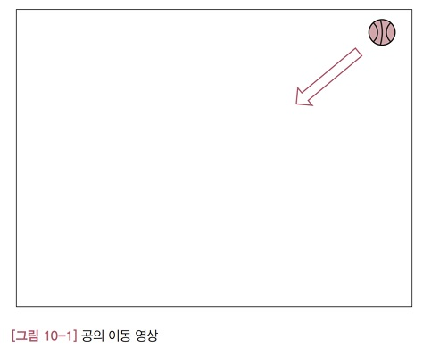

- TestTrackKalman.m

```matlab
clear all

NoOfImg = 24;

Xmsaved = zeros(2, NoOfImg);
Xhsaved = zeros(2, NoOfImg);

for k = 1:NoOfImg
    [xm, ym] = GetBallPos(k);
    [xh, yh] = TrackKalman(xm, ym);

    hold on
    plot(xm, ym, 'g*')
    plot(xh, yh, 'ys')
    pause(1)

    Xmsaved(:, k) = [xm ym]';
    Xhsaved(:, k) = [xh yh]';
end


figure
hold on
plot(Xmsaved(1,:), Xmsaved(2,:), '*')
plot(Xhsaved(1,:), Xhsaved(2,:), 's')
set(gca, 'yDir', 'reverse')
```

- GetBallPos.m

```matlab
function [xc, yc] = GetBallPos(index)
%
%
persistent imgBg
persistent firstRun

if isempty(firstRun)
    imgBg = imread('Img/bg.jpg')
    firstRun = 1;
end

xc = 0;
yc = 0;

imgWork = imread(['Img/', int2str(index), '.jpg']);
imshow(imgWork)

fore = imabsdiff(imgWork, imgBg);
fore = (fore(:,:,1)>10)|(fore(:,:,2)>10)|(fore(:,:,3)>10);

L = logical(fore);
stats = regionprops(L, 'area', 'centroid');
area_vector = [stats.Area];
[tmp, idx] = max(area_vector);

centroid = stats(idx(1)).Centroid;

xc = centroid(1) + 15*randn;
yc = centroid(2) + 15*randn;
```

촬영 영상에서 공의 위치를 찾아내는 알고리즘은 GetBallPos 함수에 구현되어 있습니다. 프로그램의 전체 구조는 앞장의 테스트 프로그램과 비슷합니다. GetBallPos 함수에서 공의 위치를 측정해서 칼만 필터에 입력하면, 칼만 필터는 추정 위치를 반환합니다.

GetBallPos 함수의 마지막 두 줄은 공의 중심 좌표를 반환하는 코드인데, 임의로 평균 15픽셀 정도의 잡음을 섞었습니다. [그림 10-3]에서 '⁕' 모양으로 표시된 지점은 GetBallPos 함수의 측정값이고, 네모 모양은 칼만 필터의 추정위치를 의미합니다. 칼만 필터의 추정위치가 대각선에 더 가깝게 배치되어 있습니다. 즉 칼만 필터가 측정 잡음을 효과적으로 제거해서 더 참값에 가까운 위치를 출력한 것 입니다. 그런데 그림의 오른쪽 상단에 한 점이 대각선에서 많이 벗어나 있는데, 그 이유는 초기의 위치 오차 때문입니다. TrackKalman 함수를 보면 초기 위치가 (0,0)으로 지정되어 있습니다. 즉 초기에 공이 왼쪽 상단에 있다고 가정하고 있습니다. 테스트 프로그램이 막 시작할 때는 칼만 필터가 충분히 수렴하기 전이라 오차가 크게 나타난 것 입니다.

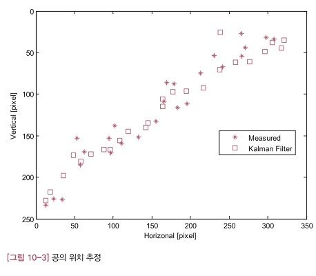

#### 10.4 테스트 프로그램 2

이 절에서는 행렬 Q와 R을 조율해서 칼만 필터의 성능을 개선하는 방법을 소개합니다. 앞 절의 예제에서 Q와 R을 바꿔가면서 추정 성능이 어떻게 달라지는지를 살펴보겠습니다.

행렬 Q와 R이 추정값에 미치는 영향을 알아보기 위해 TrackKalmanQR 이라는 함수를 추가했습니다. 테스트 프로그램에서는 이 함수와 TrackKalman 함수의 추정 결과를 비교합니다.

- TestTrackKalmanQR.m

```matlab
clear all
NoOfImg = 24;

Xmsaved = zeros(2, NoOfImg);
Xhsaved = zeros(2, NoOfImg);
Xqrsaved = zeros(2, NoOfImg);

for k=1:NoOfImg
    [xm, ym] = GetBallPos(k);
    [xh, yh] = TrackKalman(xm, ym);
    [xqr, yqr] = TrackKalmanQR(xm, ym);

    hold on
    plot(xm, ym, 'r*')
    plot(xh, yh, 'bs')
    plot(xqr, yqr, 'bo')

    pause(1)

    Xmsaved(:, k) = [xm ym]';
    Xhsaved(:, k) = [xh yh]';
    Xqrsaved(:, k) = [xqr, yqr];
end

figure
hold on
%plot(Xmsaved(1,:), Xmsaved(2,:), '*')
plot(Xhsaved(1,:), Xhsaved(2,:), 's')
plot(Xqrsaved(1,:), Xqrsaved(2,:), 'o')
```

[그림 10-4]에서는 원래의 행렬 Q일 때와, 행렬 Q의 크기를 1/100로 줄였을 때의 추정 결과를 비교했습니다. 그림을 보면 행렬 Q가 더 작은 칼만 필터의 추정값이 잘 움직이지 않는다는 사실을 알 수 있습니다. 앞에서 설명한 것처럼 측정값보다는 이전 추정값이 더 많이 반영되기 때문입니다. 행렬 R의 크기를 키워도 비슷한 경향을 보입니다. 참고로 두 칼만 필터의 경향을 비교하는데 방해가 될까봐 그림에 측정값을 함게 그리지 않았습니다. 필요한 경우, 테스트 프로그램의 주석(%)을 없애면 측정값도 함께 그려집니다.

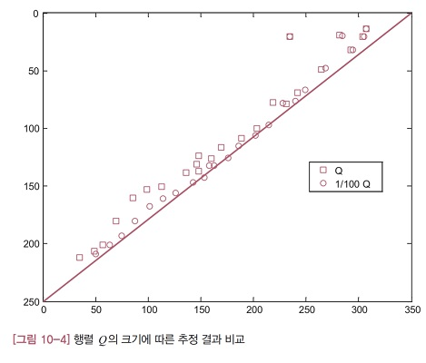

### Chapter 11 기울기 자세 측정하기

이 장에서는 칼만 필터의 센서 융합 능력을 소개합니다. 칼만 필터가 최초로 적용된 곳은 항공우주 분야였습니다. 칼만 필터는 개발된 직후에 바로 미국의 아폴로 달 탐사 프로그램에 적용되면서 일약 스타로 떠올랐습니다. 가장 많은 응용 사례가 있는 곳도 항공우주 분야입니다. 특히 항공기나 인공위성의 위치와 자세를 측정하는 항법<sup>navigation</sup> 분야에서는 그 영향력이 절대적이라고 할 만큼 칼만 필터가 많이 사용됩니다. 칼만 필터 없는 항법 시스템은 상상하기 어려울 정도입니다.
이 장에서 다룰 예제도 **가속도계<sup>accelerometer</sup>** 와 **자이로스코프<sup>gyroscope</sup>** 로 수평 자세를 찾는 간단한 항법 문제입니다.

#### 11.1 관성항법 센서

여기서 설명하는 내용은 보행 로봇 등 자이로와 가속도계로 수평 자세를 측정하는 모든 시스템에 적용 가능합니다. 문제를 더 자세히 분석해보겠습니다. 일반적으로 어떤 물체의 자세는 [그림 11-1]처럼 세 개의 각도(오일러 각도<sup>Euler angle</sup>)만 알면 정확히 표현할 수 있습니다. 따라서 헬기의 자세를 알아낸다는 말은 이 세 각도를 찾는다는 말과 같은 뜻 입니다. 이 예제에서는 수평 자세에만 관심있으므로 세 개의 각도 중에서 롤각( $\phi$ )과 피치각( $\theta$ )만 찾으면 됩니다. 요각( $\psi$ )은 수평면에 대한 헬기의 자세에는 전혀 영향을 주지 않습니다.

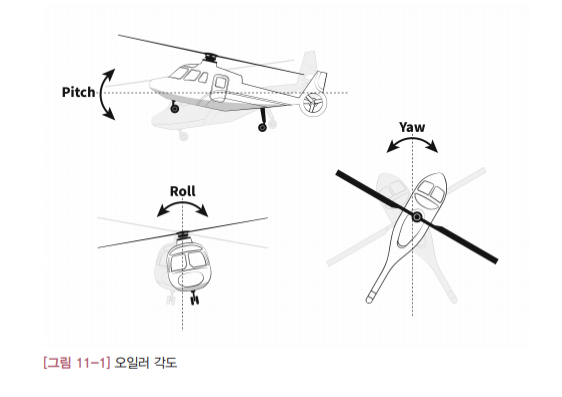

참고로 가속도계나 자이로는 관성<sup>inertial</sup> 좌표계(이동하거나 회전하지 않고 고정되더 있는 가상의 좌표계로, 뉴턴 역학의 기준 좌표계)에 대한 측정값을 출력한다고 해서 관성항법 센서라고 부릅니다. 그리고 관성항법은 자세뿐만 아니라 위치와 속도까지 다루는데, 여기서는 자세 추정만 고려합니다. 이 장에서 배워야 할 것은 관성항법이 아니라, 칼만 필터로 센서를 융합하는 방법이기 때문입니다.
여러 센서의 출력을 모아서 더 좋은 성능을 끌어내는 기법을 **센서 융합<sup>sensor fusion</sup>** 이라고 하며, '센서 결합'이라는 용어도 많이 씁니다. 그런데 센서를 융합한다고 해서 아무 센서나 조합하면 안됩니다. 센서 융합의 목적은 개별 센서로는 낼 수 없는 성능을 달성하겠다는 것인데, 센서 구성이 나쁘면 시너지 효과를 기대하기 어렵기 때문입니다.

융합용 센서를 구성할 때는 특성을 잘 분석해서 상호 보완이 되는 센서끼리 묶는 것이 중요합니다. 한 센서의 단점을 다른 센서의 장법으로 대체할 수 있도록 센서를 결합해야 한다는 뜻 입니다. 이렇게 최종 출력에는 각 센서의 장점만 담겠다는 것이 센서 융합의 기본 전략입니다. 융합이 성공하면 개별 센서를 뛰어넘는 성능이 나오는 이유가 바로 여기에 있습니다.

#### 11.2 자이로를 이용하여 자세 결정하기

자이로로 측정한 각속도를 바로 적분해서는 오일러 각도를 구할 수 없습니다. 자이로는 오일러 각도의 변화율( $\dot{\phi},\dot{\theta},\dot{\psi}$ )이 아니라, 헬기의 각속도(p, q, r)를 측정하기 때문입니다. 따라서 자이로의 측정값을 오일러 각도의 변화율로 바꿔서 적분해야 합니다. 동역학 분야에서는 오일러 각도와 각속도의 관계는 이미 잘 알려져 있습니다.

- 식 11.1
$$
\begin{bmatrix} 
    \dot{\phi}\\\ \
    \dot{\theta}\\\ \
    \dot{\psi}
\end{bmatrix} = 
\begin{bmatrix}
    1 & \sin{\phi}\tan{\theta} & \cos{\phi}\tan{\theta}\\\ \
    0 & \cos{\phi} & -\sin{\phi}\\\ \
    0 & \cfrac{\sin{\phi}}{\cos{\theta}} & \cfrac{\cos{\phi}}{\cos{\theta}}
\end{bmatrix} \begin{bmatrix}
    p\\\ \
    q\\\ \
    r
\end{bmatrix}
$$

이 식에 자이로에서 측정한 각속도 (p, q, r)를 대입하고 적분하면 현재 자세를 구할 수 있습니다. 물론 초깃값은 알고 있어야 합니다. 그런데 자이로의 측정값에는 오차가 섞여 있기 때문에 적분하여 구한 자세에도 오차가 포함될 수 밖에 없습니다. 따라서 이 방법은 자이로가 아주 정밀하거나 적분 시간이 짧지 않으면 실제로는 사용하기 어렵습니다.

#### 11.3 가속도계를 이용하여 자세 결정하기

가속도계로 측정한 가속도(f<sub>x</sub>,f<sub>y</sub>,f<sub>z</sub>)에는 중력 가속도와 속도의 크기나 방향이 바귈 때 생기는 가속도 등 다양한 종류의 가속도가 포함되어 있습니다. 이런 특성을 수식으로 표현하면 다음과 같습니다.

- 식 11.2

$$
\begin{bmatrix}
    f_x\\\ \
    f_y\\\ \
    f_z
\end{bmatrix} = 
\begin{bmatrix}
    \dot{u}\\\ \
    \dot{v}\\\ \
    \dot{w}
\end{bmatrix} + \begin{bmatrix}
    0 & w & -v\\\ \
    -w & 0 & u\\\ \
    v & -u & 0
\end{bmatrix} \begin{bmatrix}
    p\\\ \
    q\\\ \
    r
\end{bmatrix} + g \begin{bmatrix}
    \sin{\theta}\\\ \
    -\cos{\theta}\sin{\phi}\\\ \
    -\cos{\theta}\cos{\phi}
\end{bmatrix}
$$

여기서 u, v, w는 이동 속도를 의미하고, p, q, r은 회전 각속도를 뜻합니다. 그리고 g는 중력 가속도를 나타냅니다.

식 11.2의 우변에서 마지막 항을 보면 롤각( $\phi$ )과 피치각( $\theta$ )이 나옵니다. 따라서 나머지 항의 값을 모두 알면, 이 식으로 수평 자세를 계산할 수 있습니다. 그럼 하나씩 따져보겠습니다. 가속도(f<sub>x</sub>,f<sub>y</sub>,f<sub>z</sub>)와 각속도(p,q,r)는 측정값이라 알고 있습니다. 중력 가속도(g)도 이미 알고 있는 값입니다. 이제 남은 것은 이동 속도(u,v,w)와 이동속도( $\dot{u}, \dot{v}, \dot{w}$ ) 뿐입니다. 그런데 이 두 값은 아주 고가의 항법 센서가 아니면 측정할 수 없습니다. 따라서 평범한 항법 센서로는 식 11.2를 이용해 자세를 계산할 방법이 없습니다.
그렇다고 아주 불가능한 것은 아닙니다. 시스템이 정지해 있거나 일정한 속도로 직진하는 조건이라면 가능합니다. 먼저 시스템이 정지해 있을 때를 생각해보겠습니다. 움직이지 않으면 이동속도와 이동가속도는 모두 0이 됩니다. 일정한 속도로 직진하는 경우도 이동가속도와 각속도가 모두 0이 됩니다.

두 경우 모두 식 11.2에서 우변에 있는 첫번째 항과 두번째 항이 0이 됩니다. 그러면 식 11.2는 다음과 같이 간단한 형태가 됩니다.

- 식 11.3

$$
\begin{bmatrix}
    f_x\\\ \
    f_y\\\ \
    f_z
\end{bmatrix} = 
g \begin{bmatrix}
    \sin{\theta}\\\ \
    -\cos{\theta}\sin{\phi}\\\ \
    -\cos{\theta}\cos{\phi}
\end{bmatrix}
$$

이 식에서 다음과 같은 롤각과 피치각의 공식을 유도해낼 수 있습니다.

- 식 11.4

$$
\phi = \sin^{-1}{(\cfrac{-f_y}{g\cos{\theta}})}
$$

$$
\theta = \sin^{-1}{(\cfrac{f_x}{g})}
$$

움직이는 속도가 충분히 느리거나 속도의 크기와 방향이 빠르게 변하지 않는다면 식 11.4로 수평 자세를 구할 수 있습니다. 이 경우에 식 11.4는 근사식이 됩니다. 

#### 11.4 센서 융합을 통해 자세 결정하기

지금까지 자이로와 가속도계로 자세를 결정하는 방법과 결과를 분석해봤습니다. 그 결과 두 센서 모두 단독으로 사용하기에는 약점이 있었습니다. 물론 고가의 센서를 쓰면 그 약점을 극복할 수도 있지만 우리의 관심 사항은 아닙니다. 그런데 분석 결과를 찬찬히 검토해 보면, 두 센서가 상호 보완 관계임을 알 수 있습니다. 자이로로 구한 자세는 자세 변화를 잘 감지하지만, 시간이 지남에 따라 오차가 누적되어 발산하는 문제가 있었습니다. 반면 가속도계로 구한 자세는 시간이 지나도 그 오차가 커지지 않고 일정 범위로 제한되는 장점을 가지고 있습니다. 즉 단기적으로는 자이로 자세가 더 낫지만, 중장기적으로는 가속도 자세가 더 좋습니다. 그렇다면 자이로의 누적 오차 문제를 가속도계로 보정하면 좋지 않을까요?

그림 11-10은 자이로와 가속도계의 센서 융합 원리를 개념적으로 표현한 것입니다. 가속도계로 결정한 자세가 칼만 필터의 측정값이 됩니다. 칼만 필터는 이 값을 자이로의 각속도를 적분하여 계산한 자세와 비교하여 오차를 보정합니다.

- 그림 11-10

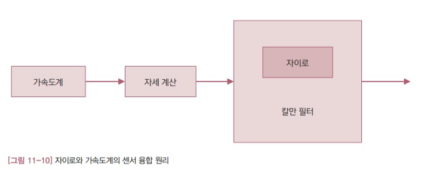

##### 시스템 모델

앞 장의 칼만 필터 예제를 보면, 문제가 달라도 알고리즘 자체는 바뀌지 않았습니다. 모델만 달라졌습니다. 마찬가지로 센서 융합 문제에서도 바뀌는 것은 모델이고, 칼만 필터 알고리즘은 똑같습니다. 그러므로 어떻게 모델을 선정하는지에 더 많은 관심을 두고 이 책의 내용을 읽어가는 것이 바람직합니다. 그래야 나중에 여러분의 문제에 칼만 필터를 응용할 능력이 생깁니다. 칼만 필터를 적용할 때 가장 중요한 것은 적합하고 정확한 시스템 모델을 찾아내는 일입니다.
그럼 자이로와 가속도계의 센서 융합에 필요한 시스템 모델을 유도해보겠습니다. 제대로 하려면 동역학에 대해 사전 지식이 좀 필요하지만, '숲을 보지 못하는' 잘못을 하지 않도록 결과 위주로 설명하겠습니다.

우리가 관심 있는 물리량은 자세입니다. 따라서 자세를 상태 변수로 잡는 것은 지극히 자연스러운 선택입니다.

$$
x = \begin{bmatrix}
    \phi\\\ \
    \theta\\\ \
    \psi
\end{bmatrix}
$$

예제에서는 수평 자세( $\phi, \theta$ )만 관심있다고 했기때문에 요각( $\psi$ )은 상태변수로 잡을 필요가 없지만, 수식을 설명하는데 필요해 그냥 놔뒀습니다. 구현할때는 요각에 아무 값이나 지정해도 상관없습니다.

이제 시스템 모델을 유도해보겠습니다. 앞에서 이미 자이로 각속도와 오일러 각도 사이의 관계식(식 11.1)을 소개한적이 있습니다.

$$
\begin{bmatrix} 
    \dot{\phi}\\\ \
    \dot{\theta}\\\ \
    \dot{\psi}
\end{bmatrix} = 
\begin{bmatrix}
    1 & \sin{\phi}\tan{\theta} & \cos{\phi}\tan{\theta}\\\ \
    0 & \cos{\phi} & -\sin{\phi}\\\ \
    0 & \cfrac{\sin{\phi}}{\cos{\theta}} & \cfrac{\cos{\phi}}{\cos{\theta}}
\end{bmatrix} \begin{bmatrix}
    p\\\ \
    q\\\ \
    r
\end{bmatrix}
$$

그런데 이 식을 시스템 모델로 삼기에는 심각한 문제가 있습니다. 시스템 모델이 되려면 다음과 같은 형태를 갖춰야 하는데, 식 11.1은 이렇게 표현할 수가 없습니다. 행렬 안에 있는 오일러 각도를 밖으로 빼낼 방법이 없기 때문입니다.

$$
x_{k+1} = Ax_k + w_k \iff \begin{bmatrix} 
    \dot{\phi}\\\ \
    \dot{\theta}\\\ \
    \dot{\psi}
\end{bmatrix} = \begin{bmatrix}
    \cdot
\end{bmatrix} \begin{bmatrix}
    \phi\\\ \
    \theta\\\ \
    \psi
\end{bmatrix}
$$

이럴 때는 어떻게 해야할까요? 고민할 것 없습니다. 칼만 필터를 쓰지 못합니다. 무슨 수를 쓰더라도 모양을 맞춰야 합니다. 이 때 쓸 수 있는 방법이 상태 변수를 다르게 잡아보는 것 입니다.

오릴러 각도 대신 쿼터니언<sup>quaternion</sup>을 상태 변수로 잡아보겠습니다. 우리의 관심은 쿼터니언이 아니므로, 이에 대한 상세한 설명은 생략합니다. 그냥 자세를 표현하는 방법 중 하나라고만 정리해 두겠습니다.

- 11.5

$$
x = \begin{bmatrix}
    q_1\\\ \
    q_2\\\ \
    q_3\\\ \
    q_4
\end{bmatrix}
$$

그런데 쿼터니언과 각속도의 관계는 이미 잘 알려져 있습니다.

- 오일러 각과 쿼터니언 회전: https://ally10.tistory.com/25
- 11.6

$$
\begin{bmatrix}
    \dot{q_1}\\\ \
    \dot{q_2}\\\ \
    \dot{q_3}\\\ \
    \dot{q_4}
\end{bmatrix} = \cfrac{1}{2} \begin{bmatrix}
    0 & -p & -q & -r\\\ \
    p & 0 & r & -q\\\ \
    q & -r & 0 & p\\\ \
    r & q & -p & 0
\end{bmatrix} \begin{bmatrix}
    q_1\\\ \
    q_2\\\ \
    q_3\\\ \
    q_4
\end{bmatrix}
$$

상태 변수만 바꿨을 뿐인데 칼만 필터의 시스템 모델에 필요한 요구조건을 만족합니다. 자세를 쿼터니언으로 표현하든 오일러 각도로 표현하든 물리적인 자세는 똑같습니다. 하지만 상태 변수를 어떻게 잡느냐에 따라 칼만 필터의 적용 여부는 이렇게 달라지기도 합니다.

식 11.6을 이산<sup>discrete</sup> 시스템으로 바꾸면, 다음과 같은 시스템 모델을 얻을 수 있습니다.

- 11.7

$$
\begin{bmatrix}
    \dot{q_1}\\\ \
    \dot{q_2}\\\ \
    \dot{q_3}\\\ \
    \dot{q_4}
\end{bmatrix}_ {k+1} = \left( I + \Delta t \cdot \cfrac{1}{2} \begin{bmatrix}
    0 & -p & -q & -r\\\ \
    p & 0 & r & -q\\\ \
    q & -r & 0 & p\\\ \
    r & q & -p & 0
\end{bmatrix} \right) \begin{bmatrix}
    q_1\\\ \
    q_2\\\ \
    q_3\\\ \
    q_4
\end{bmatrix}_ {k}
$$

위의 식에서 시스템 모델의 행렬 A는 다음과 같이 정의됩니다.

- 11.8

$$
A = I + \Delta t \cdot \cfrac{1}{2} \begin{bmatrix}
    0 & -p & -q & -r\\\ \
    p & 0 & r & -q\\\ \
    q & -r & 0 & p\\\ \
    r & q & -p & 0
\end{bmatrix}
$$

그런데 지금까지와는 달리 행렬 A의 원소가 상수가 아니며, 그 속엔 각속도가 포함되어 있습니다. 각속도에 다라 행렬 A도 바뀌는 것입니다.

이제 측정 관계식을 유도해보겠습니다. 가속도로 계산한 오일러 각도를 측정값으로 사용한다는 사실은 이미 이야기했습니다. 그런데 시스템 모델의 상태 변수는 쿼터니언입니다. 따라서 측정값도 쿼터니언으로 바꿔서 사용해야 합니다. 오일러 각도를 쿼터니언으로 바꾸는 공식은 다음과 같습니다.

- 11.9

$$
\begin{bmatrix}
    q_1\\\ \
    q_2\\\ \
    q_3\\\ \
    q_4
\end{bmatrix} = \begin{bmatrix}
    \cos{\cfrac{\phi}{2}}\cos{\cfrac{\theta}{2}}\cos{\cfrac{\psi}{2}} + \sin{\cfrac{\phi}{2}}\sin{\cfrac{\theta}{2}}\sin{\cfrac{\psi}{2}}\\\ \
    \sin{\cfrac{\phi}{2}}\cos{\cfrac{\theta}{2}}\cos{\cfrac{\psi}{2}} - \cos{\cfrac{\phi}{2}}\sin{\cfrac{\theta}{2}}\sin{\cfrac{\psi}{2}}\\\ \
    \cos{\cfrac{\phi}{2}}\sin{\cfrac{\theta}{2}}\cos{\cfrac{\psi}{2}} + \sin{\cfrac{\phi}{2}}\cos{\cfrac{\theta}{2}}\sin{\cfrac{\psi}{2}}\\\ \
    \cos{\cfrac{\phi}{2}}\cos{\cfrac{\theta}{2}}\sin{\cfrac{\psi}{2}} - \sin{\cfrac{\phi}{2}}\sin{\cfrac{\theta}{2}}\cos{\cfrac{\psi}{2}}
\end{bmatrix}
$$

가속도계로 결정한 자세를 위의 식에 대입하면 쿼터니언으로 표현된 측정값을 얻게 됩니다. 이 쿼터니언이 칼만 필터의 측정값( $z_k$ )이 됩니다. 이 말은 결국 모든 상태 변수(즉 쿼터니언)가 측정된다는 뜻입니다. 따라서 행렬 H는 단위행렬이 됩니다.

- 11.10

$$
H = \begin{bmatrix}
    1 & 0 & 0 & 0\\\ \
    0 & 1 & 0 & 0\\\ \
    0 & 0 & 1 & 0\\\ \
    0 & 0 & 0 & 1
\end{bmatrix}
$$

##### 센서 융합 칼만 필터

시스템 모델을 모두 구했으니 이제 칼만 필터 설계만 남았습니다. 잘 알다시피 시스템 모델이 있으면 칼만 필터의 구현은 기계적으로 따라 하기만 하면 됩니다.

잡음의 공분산 행렬 Q와 R은 시스템의 신호 특성과 관련 있는 값이라, 이론적으로 구하기는 어렵고 실제 데이터를 분석해봐야 합니다. 보통은 이 행렬을 설계인자로 보고, 이런 저런 값을 넣어 성능 변화의 추이를 보면서 결정합니다. 여기서는 아래와 같이 선정했습니다.

$$
Q = \begin{bmatrix}
    0.0001 & 0 & 0 & 0\\\ \
    0 & 0.0001 & 0 & 0\\\ \
    0 & 0 & 0.0001 & 0\\\ \
    0 & 0 & 0 & 0.0001
\end{bmatrix},
R = \begin{bmatrix}
    10 & 0 & 0 & 0\\\ \
    0 & 10 & 0 & 0\\\ \
    0 & 0 & 10 & 0\\\ \
    0 & 0 & 0 & 10
\end{bmatrix}
$$

상태 변수와 오차 공분산 행렬의 초깃값은 다음과 같이 선정했습니다. 상태 변수(쿼터니언) 초깃값의 물리적인 의미는 오일러 각도가 모두 0이라는 뜻 입니다.

$$
\hat{x^{-}_ 0} = \begin{bmatrix}
    q_1\\\ \
    q_2\\\ \
    q_3\\\ \
    q_4
\end{bmatrix} = \begin{bmatrix}
    1\\\ \
    0\\\ \
    0\\\ \
    0
\end{bmatrix},
P^{-}_ 0 = \begin{bmatrix}
    1 & 0 & 0 & 0\\\ \
    0 & 1 & 0 & 0\\\ \
    0 & 0 & 1 & 0\\\ \
    0 & 0 & 0 & 1
\end{bmatrix}
$$

## Part 04 칼만 필터와 비선형 시스템 (Kalman filter and descrete system)

### Chapter 12 확장 칼만 필터 (Extended Kalman Filter)

칼만 필터가 개발된 지는 반세기가 넘어가지만 칼만 필터는 여전히 인기있는 연구주제로, 아직도 많은 논문이 발표되고 있습니다. 주로 새로운 응용 사례를 다루는 연구가 많지만, 칼만 필터 알고리즘 자체를 개선하고 확장하는 이론 연구도 계속되고 있습니다. 이론적인 연구는 대부분 칼만 필터를 비선형 시스템에 적용하기 위한 시도라고 보면 틀림없습니다.

그런데 칼만 필터를 비선형 문제에 적용하려는 연구가 여전히 활발한 까닭은 무엇일까요? 그 이유는 우리 주변에 존재하는 시스템 대부분이 비선형이기 때문입니다. 칼만 필터는 선형 시스템을 가정하고 개발된 알고리즘이라 비선형 시스템에는 적용할 수 없습니다. 비선형 시스템에 칼만 필터를 쓸 수 없다면 칼만 필터의 활용 범위는 대단히 제한될 수 밖에 없습니다. 다행히 초기 연구자들은 칼만 필터의 이러한 한계를 잘 알았고, 그 해결책도 찾아냈습니다. 이 문제를 극복하지 못했다면 칼만 필터는 그냥 묻혀버렸거나 그 가치를 인정받는데 오랜 시간이 필요했을지도 모릅니다. 칼만 필터를 비선형 시스템까지 확장하는 방법이 개발된 덕분에 칼만 필터는 발표되자마자 급속히 확산되게 됩니다. 이 때 개발된 알고리즘이 확장칼만필터<sup>Extended Kalman Filter</sup> (이하 EKF)입니다.

세계 최초로 실제 문제에 구현된 칼만 필터도 선형 칼만 필터가 아니라 EKF였습니다. 그만큼 EKF의 역사는 깊습니다. 만약 비선형 시스템에 칼만 필터를 적용해야 한다면, 가장 먼저 EKF를 고려해보기 바랍니다. EKF는 오랜 세월 동안 검증되고 널리 알려져 왔기에 관련 자료가 많고 찾기도 쉽습니다. 그런데 EKF에는 큰 단점이 있ㅅ브니다. 바로 알고리즘이 발산할 위험이 있다는 점입니다. EKF를 적용할 때는 이 점에 유의해야 합니다. EKF 이후에 개발된 알고리즘은 대부분 이러한 문제를 극복하기 위한 시도라고 해도 과언이 아닙니다.

#### 12.1 선형화 칼만 필터<sup>Linearized Kalman Filter</sup>

EKF를 설명하기 전에 먼저 선형화 칼만 필터<sup>Linearized Kalman Filter</sup>를 소개하겠습니다. 선형화 칼만 필터는 [그림 4-1]에서 소개한 선형 칼만 필터 알고리즘과 완전히 동일합니다. 즉 선형 칼만 필터 설계와 전혀 다를게 없습니다. 그런데 왜 굳이 선형 칼만 필터라는 별개의 이름을 붙였을까요? 선형화 칼만 필터와 선형 칼만 필터는 시스템 모델에서 약간 차이가 있기 때문입니다.

선형 칼만 필터의 시스템 모델은 원래부터 선형인데 반해, 선형화 칼만 필터는 비선형 시스템을 하나의 기준점 주위에서 선형화시켜 얻은 선형 모델 A와 H를 사용합니다. 즉 비선형 모델을 선형화한 다음, 이 선형 모델에 대해 설계한 칼만 필터가 바로 선형화 칼만 필터입니다. 칼만 필터의 설계자 입장에서는 시스템 모델이 원래 선형이었는지 아니면 비선형 모델을 선형화시킨 모델인지는 전혀 중요치 않습니다. 두 경우 모두 칼만 필터를 설계하는 과정이 똑같기 때문입니다. 그래서 선형화 칼만 필터의 설계는 특별히 주의해야 할 사항이 없습니다.

하지만 선형화 칼만 필터를 실제 시스템에 적용할 때는 시스템의 운용 범위에 각별히 유의해야 합니다. 선형화 모델은 기준점 근처에서만 실제 시스템과 비슷한 특성을 보이기 때문입니다. 이 범위를 벗어나면 선형화 모델은 더이상 믿을 수 없게 됩니다. 선형화의 개념에 대해 생객해 보면 당연한 이야기입니다. 선형화 모델의 이런 한계를 무시하고 선형화 칼만 필터를 함부로 적용하면 제대로 된 성능을 내지 못하게 됩니다. 심하게 전체 시스템이 발산할 수도 있습니다. 선형화 칼만 필터를 선형 칼만 필터와 구분지어 설명하는 이유도 이 때문입니다.

결국 선형화 칼만 필터의 성공과 실패를 가르는 핵심 요소는 비선형 시스템의 선형화 모델입니다. 좋은 선형화 모델이 좋은 성능으로 이어집니다. 따라서 어떻게 선형화 모델을 구해낼지가 중요한데, 여기서는 이 문제를 따로 다루지 않습니다. 칼만 필터와는 다소 동떨어진 주제이고, 각 문제마다 적절한 선형화 방법이 다 다르기 때문입니다.

요약하면 선형화 칼만 필터의 경우 그 설계 과정에서는 특별한 점이 없지만, 실제 시스템에 적용할 때는 선형화 모델이 유효한 범위 내에서만 사용되어야 합니다. 그렇지 않으면 칼만 필터의 성능을 보장할 수 없습니다.

#### 12.2 EKF 알고리즘

이 절에서는 EKF의 알고리즘에 대해 알아봅니다. EKF와 [그림 4-1]의 선형 칼만 필터를 비교하여 두 알고리즘이 어떻게 다른지 설명하겠습니다. EKF는 칼만 필터를 비선형 시스템까지 확대 적용하는 대표적인 알고리즘으로, 오랜 세월 동안 이론과 실전에서 충분히 검증된 방법입니다. 따라서 수식 유도에 대해 고민할 필요없이 그냥 알고리즘대로 구현하면 됩니다.

##### 비선형 시스템 모델

먼저 시스템 모델을 알아보겠습니다. EKF 알고리즘은 다음과 같은 비선형 시스템 모델을 고려합니다.

- 12.1

$$
x_{k+1} = f(x_k) + w_k
$$

- 12.2

$$
z_k = h(x_k) + v_k
$$

위의 모델이 지금까지 봐온 선형 모델과 다른 점은 상태 변수 ( $x_k$ )와 계수를 따로 분리해서 쓰지 못한다는 점입니다. 위의 비선형 모델을 식 7.1과 7.2의 선형 모델과 비교해 보면, 아래와 같이 선형 행렬식이 비선형 함수로 바뀌었음을 알 수 있습니다. 그 밖에 다른 변수의 의미와 형태는 똑같습니다.

- 12.3

$$
Ax_k \Rightarrow f(x_k)\\\ \
Hx_k \Rightarrow h(x_k)
$$

##### EKF 알고리즘

그러면 EKF 알고리즘을 구체적으로 알아보겠습니다. [그림 12-1]에 EKF의 알고리즘을 정리했습니다. 알고리즘의 전체 과정은 [그림 4-1]의 선형 칼만 필터 알고리즘과 동일한데, 단계별 수식에서 약간 차이가 있습니다. 이미 익숙한 알고리즘이니 차이점응ㄹ 찾는 것은 그리 어렵지 않을 것입니다.

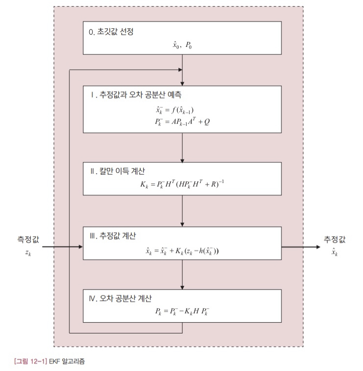

차근차근 하나씩 살펴보겠습니다. 먼저 I단계의 상태 변수 예측값을 비교해보겠습니다. 첫번째가 EKF의 관계식이고 두번째가 선형 칼만 필터의 식입니다.

$$
\hat{x}_ {k+1}^{-} = f(\hat{x}_ k)\\\ \
\hat{x}_ {k+1}^{-} = A\hat{x}_ k
$$

두 식을 비교해보면 우변이 서로 다릅니다.

- 12.4

$$
f(\hat{x}_ k) \iff A\hat{x}_ k
$$

마찬가지로 III 단계의 수식을 비교해보겠습니다. 처음 식이 EKF의 것이고, 두번째가 [그림 4-1]의 선형 칼만 필터 수식입니다.

$$
\hat{x}_ k = \hat{x}_ k^- + K_k \\{z_k-h(\hat{x}_ k^-) \\}\\\ \
\hat{x}_ k = \hat{x}_ k^- + K_k \\{z_k-H\hat{x}_ k^- \\}
$$

두 식을 비교해 보면 우변의 마지막 항만 다르고 나머지는 똑같습니다.

- 12.5

$$
h(\hat{x}_ k^-) \iff H\hat{x}_ k^-
$$

식 12.4와 식 12.5를 곰곰히 살펴보면 일정한 규칙을 찾을 수 있습니다. 선형 모델과 비선형 모델을 비교한 식 12.3을 다시 써보겠습니다.

이 식과 식 12.4, 식 12.5를 같이 놓고 비교해보시면 좀 더 쉽게 파악이 될 겁니다.

$$
Ax_k \Rightarrow f(x_k)\\\ \
Hx_k \Rightarrow h(x_k)
$$

그렇습니다. EKF는 선형 알고리즘의 모델식 $Ax_k$ 와 $Hx_k$ 자리에 비선형 모델의 관계식을 사용합니다. 사실 생각해보면 지극히 당연한 결과입니다. 시스템 모델이 달라졌는데, 알고리즘에서 사용하는 시스템 모델식도 따라 바뀌는게 당연하지 않겠습니까?

[그림 12-1]의 알고리즘을 보면 미리 결정되어 있어야 하지만 아직 모르는 변수가 있습니다. 시스템 행렬 A와 H입니다. 이 두 행렬은 시스템 모델에서 받아와야 합니다. 그런데 EKF의 시스템 모델인 식 12.1과 12.2에는 이 두 행렬이 보이지 않습니다. 따라서 식 12.1과 12.2의 비선형 모델을 이용해 어떻게든 선형 모델의 행렬 A와 H를 유도해야 합니다.

앞 절에서 설명한 선형화 칼만 필터는 비선형 모델의 선형화를 통해 이 문제를 해결했습니다. EKF도 마찬가지로 비선형 모델을 선형화시켜 얻은 선형 모델을 사용합니다. 그리고 선형화 방법도 아주 고전적인 기법을 그대로 이용합니다.

- 12.6

$$
A \equiv \cfrac{\partial{f}}{\partial{x}}\Bigg|_ {\hat{x}_ k}, H \equiv \cfrac{\partial{h}}{\partial{x}}\Bigg|_ {\hat{x}_ k^-}
$$

여기서 $\cfrac{\partial}{\partial{x}}$ 는 해당 함수를 변수 x에 대해 편미분한다는 뜻입니다. 따라서 $\cfrac{\partial{f}}{\partial{x}}$ 는 함수 f를 x에 대해 편미분한 결과를 의미합니다. 만약 f와 x가 벡터이면 이 값은 행렬이 됩니다 (이렇게 계산하는 행렬을 야코비안<sup>Jacobian</sup>이라고 합니다). 그리고 $\cfrac{\partial{f}}{\partial{x}}\Bigg|_ {\hat{x}_ k}$ 는 행렬 $\cfrac{\partial{f}}{\partial{x}}$ 에 $\hat{x}_ k$ 를 대입해서 계산한 값을 의미합니다.

이렇게 비선형 모델을 편미분해서 선형 행렬을 구하는 방법은 선형화의 대표적인 기법으로, EKF 만의 고유한 특성은 아닙니다. EKF가 선형화 과정을 거친다는 점은 선형화 칼만 필터와 같지만 EKF는 직전 추정값 $\hat{x}_ k$ 를 선형화의 기준으로 삼는다는 점에서 선형화 칼만 필터와 차이가 납니다. EKF를 적용할 때는 이 차이를 굳이 알지 못해도 상관없지만 알아두면 유용하게 쓰일 때가 있으니 간단히 설명하겠습니다. 특히 선형화 칼만 필터를 사용해야 할지 아니면 EKF를 써야할지를 판단할 때 이 내용이 도움이 됩니다.

EKF는 미리 결정된 선형화 기준을 사용하지 않고, 직전 추정값( $\hat{x}_ k$ )을 기준으로 삼아 매번 새로 선형 모델을 구합니다. 시스템의 실제 상태와 가장 가까운 값을 직전 추정값으로 보고 이 값을 기준으로 선형 모델을 계산하는 것입니다. 따라서 이 방식은 선형화의 기준점을 사전에 설정하기 어려운 시스템에 적합합니다. 반면 선형화의 기준을 이미 알고 있다면 굳이 이렇게 할 필요는 없습니다. 선형화 칼만 필터를 사용하면 됩니다. 일정 궤도를 도는 위성이나 궤적이 미리 정해져 있는 위성 발사체 등이 이런 경우에 해당됩니다.

핵심은 EKF에서는 행렬 A와 H를 식 12.6과 같이 계산한다는 점입니다.

지금까지의 설명을 정리해보겠습니다. EKF 알고리즘의 전체 과정은 선형 칼만 필터 알고리즘과 같습니다. 각 단계별 계산식은 약간 다른데 크게 두 가지 차이점이 있습니다. 먼저 EKF는 선형 모델식 $Ax_k$ 와 $Hx_k$ 자리에 비선형 시스템 모델식 $f(x_k)$ 와 $h(x_k)$ 를 사용합니다. 두번째로 EKF는 비선형 모델의 야코비안으로 행렬 A와 H를 구한다는 점입니다. 이때 야코비안 행렬은 직전 추정값( $\hat{x}_ k$ )을 기준으로 계산합니다. 그밖에 다른 계산식은 선형 칼만 필터 알고리즘과 동일합니다.

그럼 간단한 예제를 통해 EKF의 실제 구현에 대해 알아보겠습니다. 소개할 예제는 두 개입니다. 첫번째 예제는 레이다로 물체까지의 거리를 측정해서 이동속도와 고도를 추정해내는 문제입니다. 측정 모델이 비선형인 시스템에 EKF를 설계하는 방법을 소개합니다. 두번째로는 앞장에서 소개한 자이로와 가속도계를 융합해서 기울기 자세를 추정하는 문제를 EKF로 해결해 보겠습니다. 이 예제는 측정 모델은 선형인데 시스템 모델은 비선형인 시스템입니다.

#### 12.3 예제1: 레이다 추적

이 절에서는 EKF의 첫번째 예제로 물체까지의 직선거리를 측정해서 위치와 고도를 추정하는 문제를 소개합니다. 앞서 말한 것처럼 이 예제의 목적은 측정 모델이 비선형인 시스템에 대해 EKF를 설계하는 것입니다. 문제를 단순하게 하기 위해 물체는 2차원 평면상에서 일정한 고도와 속도를 유지하면서 움직인다고 가정하겠습니다. 물론 물체의 이동 속도와 고도는 모르는 값입니다. 다음 그림에서 $x_1$ 은 레이다에서 물체까지의 수평 거리를 $x_3$ 은 물체의 고도를 의미합니다.

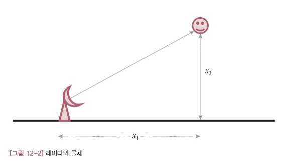

##### 시스템 모델

먼저 시스템의 상태 변수를 다음과 같이 정의합니다.

$$
x = \begin{bmatrix}
    수평거리\\\ \
    이동속도\\\ \
    고도
\end{bmatrix} \equiv \begin{bmatrix}
    x_1\\\ \
    x_2\\\ \
    x_3
\end{bmatrix}
$$

물체의 이동 속도와 고도는 일정하므로 시스템 모델은 다음과 같이 표현됩니다.

- 12.7

$$
\begin{bmatrix}
    \dot{x}_ 1\\\ \
    \dot{x}_ 2\\\ \
    \dot{x}_ 3
\end{bmatrix} = \begin{bmatrix}
    0 & 1 & 0\\\ \
    0 & 0 & 0\\\ \
    0 & 0 & 0
\end{bmatrix} \begin{bmatrix}
    x_1\\\ \
    x_2\\\ \
    x_3
\end{bmatrix} + \begin{bmatrix}
    0\\\ \
    w_1\\\ \
    w_2
\end{bmatrix} \equiv Ax + w
$$

이 시스템 모델이 의미하는 바는 간단합니다. 먼저 첫번째 식은 수평거리와 이동속도의 관계를 반영한 것입니다. 잘 알다시피 수평 거리의 변화율(미분)이 이동속도입니다.

$$
\dot{x}_ 1 = x_2
$$

두번째와 세번째 식은 이동속도와 고도가 일정하다는 가정을 수학적으로 표현한 식입니다. 이상적인 시스템이라면 변화율(미분값)이 0이 되어야 하지만 실제로는 여러 오차 요인이 있어 약간씩 값이 변합니다. 이러한 영향을 수학적으로 모델링한 것이 시스템 잡음 $w_1$ 과 $w_2$ 입니다.

$$
\dot{x}_ 2 = w_1\\\ \
\dot{x}_ 3 = w_2
$$

이제 측정 모델을 살펴보겠습니다. 레이다가 측정하는 값은 이동 물체까지의 직선 거리입니다. [그림 12-2]에서 직선 거리는 다음과 같이 정의됩니다.

- 12.8

$$
r = \sqrt{x_1^2 + x_3^2} + v \equiv h(x) + v
$$

식 12.8에서 r은 물체까지의 직선 거리를 듯하고, v는 레이다의 측정 잡음을 의미합니다.

이렇게 해서 식 12.7과 12.8의 시스템 모델을 모두 구했습니다. 두 식을 보면 식 12.7은 선형인데 식 12.8의 측정 모델은 비선형입니다. 따라서 이 예제에 선형 칼만 필터를 바로 적용하지는 못합니다.

##### EKF 함수

식 12.7의 시스템 모델은 선형이므로 EKF 알고리즘에서 상태 변수를 예측할 때 선형 칼만 필터의 수식을 사용합니다.

$$
\hat{x}_ {k+1}^- = f(\hat{x}_ k) \Rightarrow \hat{x}_ {k+1}^- = A\hat{x}_ k
$$

수식으로 써놓으니 뭔가 복잡해 보이지만 사실 위의 식은 아주 당연한 이야기를 어렵게 설명한 것에 불과합니다. 식 12.1과 12.7에서 함수 f(x)는 다음과 같이 정의되므로 위의 관계는 당연합니다.

- 12.9

$$
f(x) \equiv Ax
$$

마찬가지로 [그림 12-1]의 알고리즘에서 함수 f(x)의 야코비안 대신 A를 바로 사용합니다. 식 12.9를 보면 함수 f(x)의 야코비안이 바로 A가 되니 당연한 이야기입니다.

[그림 12-1]에 보인 EKF는 식 12.1과 12.2과 같은 이산 시스템에 대한 알고리즘입니다. 그런데 식 12.7의 시스템 모델은 이산 시스템이 아닙니다. 따라서 구현할 때는 시스템 모델을 이산 시스템으로 바꿔줘야 합니다. 식 12.7을 이산화 하면 시스템 행렬 A는 다음과 같이 주어집니다.

$$
A = I + \begin{bmatrix}
    0 & 1 & 0\\\ \
    0 & 0 & 0\\\ \
    0 & 0 & 0
\end{bmatrix} \times dt
$$

위의 이산 시스템 모델은 식 12.7을 오일러적분법으로 dt 시간동안 적분한 결과입니다. 필요하면 더 정밀한 수치적분법을 통해 실시간으로 계산하는 방법도 있습니다.

반면 측정 모델은 비선형 모델이므로 행렬 H는 다음과 같이 식 12.8의 야코비안을 계산해야 합니다.

- 12.10

$$
\begin{aligned}
H &= \begin{bmatrix}
    \cfrac{\partial{h}}{\partial{x_1}} & \cfrac{\partial{h}}{\partial{x_2}} & \cfrac{\partial{h}}{\partial{x_3}}
\end{bmatrix}\\\ \
&= \begin{bmatrix}
    \cfrac{x_1}{\sqrt{x_1^2 + x_3^2}} & 0 & \cfrac{x_3}{\sqrt{x_1^2 + x_3^2}}
\end{bmatrix}
\end{aligned}
$$

EFK는 선형 모델을 구할 때 현재의 추정값을 기준으로 선형 모델을 구합니다. 따라서 이 함수도 현재의 추정값을 인자로 받아야 합니다. 그런데 이 함수를 최초로 실행할 때 이 조건이 문제가 됩니다. 제일 처음에는 계산한 추정값이 없어 선형 모델을 계산하지 못하기 때문입니다. 선형 모델이 없으면 알고리즘을 수행해 추정값을 얻을 수 없습니다. 결국 EKF 알고리즘을 시작하지 못하는 문제가 생깁니다. 이러한 모순을 해결하려면 최초로 실행할 때에는 상태 변수의 초기 추정값( $\hat{x}_ 0$ )으로 선형 모델을 구할수밖에 없습니다. 
그런데 임의로 예측한 초기 추정값이 실제 상태와 많이 다르면 문제가 됩니다. 초깃값 오차가 크면 이 값으로 구한 선형 모델과 실제 시스템의 차이가 많이 나게 됩니다. 그런데 시스템 모델의 오차는 EKF의 추정값 오차를 키우고 다시 이 추정값으로 계산한 시스템 모델의 오차는 더 커집니다. 이런 식으로 반복되다보면 결국 알고리즘이 발산하게 됩니다. 이처럼 EKF는 초깃값에 민감하기 때문에 시스템을 충분히 연구해서 초깃값을 잘 선정하는 것이 매우 중요합니다. 이 문제에 대한 일반적인 해법은 없습니다. 대상 시스템을 잘 분석해서 최대한 정확한 초깃값을 찾는 수 밖에 없습니다.

#### 12.4 예제2: 기울기 자세 측정하기

이번에는 시스템 모델이 비선형인 문제를 다뤄보겠습니다. 상태 변수를 오일러 각도에서 쿼터니언으로 변환해야만 했던 11장의 자이로와 가속도계를 이용한 기울기 자세 측정 예제를 다시 한 번 살펴보겠습니다. 어떤 시스템인지는 이미 알고 있을테니 바로 본론으로 들어가겠습니다.

##### 시스템 모델

이 절에서 설계할 칼만 필터의 역할은 자이로 자세각의 누적 오차를 가속도계로 보정하는 것입니다. 시스템 모델의 상태 변수는 다음과 같이 오일러 각도로 지정합니다. 11장에서는 쿼터니언이 상태 변수였습니다.

$$
x = \begin{bmatrix}
    \phi\\\ \
    \theta\\\ \
    \psi
\end{bmatrix}
$$

수평면의 기울기 자세를 표현하는 데는 롤각( $\phi$ )과 피치각( $\theta$ )만 있으면 되지만 수식을 설명하는데에는 요각( $\psi$ )도 필요해서 요각도 상태변수에 포함했습니다.

그럼 시스템 모델을 먼저 보겠습니다. 앞 장의 식 11.1에서 이미 소개한 바 있는 식입니다.

- 12.11

$$
\begin{aligned}
\begin{bmatrix} 
    \dot{\phi}\\\ \
    \dot{\theta}\\\ \
    \dot{\psi}
\end{bmatrix} &= 
\begin{bmatrix}
    1 & \sin{\phi}\tan{\theta} & \cos{\phi}\tan{\theta}\\\ \
    0 & \cos{\phi} & -\sin{\phi}\\\ \
    0 & \sin{\phi}\sec{\theta} & \cos{\phi}\sec{\theta}
\end{bmatrix} \begin{bmatrix}
    p\\\ \
    q\\\ \
    r
\end{bmatrix} + w\\\ \
&= \begin{bmatrix}
    p+q\sin{\phi}\tan{\theta} + r\cos{\phi}\tan{\theta}\\\ \
    q\cos{\phi} - r\sin{\phi}\\\ \
    q\sin{\phi}\sec{\theta} + r\cos{\phi}\sec{\theta}
\end{bmatrix} + w\\\ \
&\equiv f(x) + w
\end{aligned}
$$

엄밀히 말하면 위의 식에서 함수 f는 각속도 (p,q,r)의 함수인데 편의상 표시하지 않았습니다. 식 12.11은 삼각함수가 있어서 이미 비선형인데 삼각함수끼리도 서로 곱해져 있는 등 상당히 심한 비선형 시스템입니다. 따라서 이 시스템에는 선형 칼만 필터를 적용할 수 없습니다.

이제 측정 모델식을 유도해보겠습니다. 예제의 시스템에서 보정용 측정값은 가속도계로부터 얻습니다. 그런데 가속도로는 요각을 계산해낼 수 없습니다. 따라서 측정 모델은 다음과 같이 쓸 수 있습니다.

- 12.12

$$
\begin{aligned}
z &= \begin{bmatrix}
    1 & 0 & 0\\\ \
    0 & 1 & 0
\end{bmatrix} \begin{bmatrix}
    \phi\\\ \
    \theta\\\ \
    \psi
\end{bmatrix} + v\\\ \
&= Hx + v
\end{aligned}
$$

이 식은 선형입니다. 따라서 [그림 12.1]의 알고리즘에서 야코비안 대신 행렬 H를 직접 사용하면 됩니다. 식 12.11과 12.12가 최종 시스템 모델식입니다. 앞 절의 예제와는 반대로 시스템 모델이 비선형인 시스템입니다.

##### EKF 함수

EKF를 구현하려면 먼저 식 12.11의 야코비안을 알아야 합니다. 식 12.11의 야코비안은 다음과 같이 정의됩니다.

- 12.13

$$
A = \begin{bmatrix}
    \cfrac{\partial{f_1}}{\partial{\phi}} & \cfrac{\partial{f_1}}{\partial{\theta}} & \cfrac{\partial{f_1}}{\partial{\psi}}\\\ \
    \cfrac{\partial{f_2}}{\partial{\phi}} & \cfrac{\partial{f_2}}{\partial{\theta}} & \cfrac{\partial{f_2}}{\partial{\psi}}\\\ \
    \cfrac{\partial{f_3}}{\partial{\phi}} & \cfrac{\partial{f_3}}{\partial{\theta}} & \cfrac{\partial{f_3}}{\partial{\psi}}
\end{bmatrix}
$$

이 정의에 식 12.11을 대입해서 미분하면 행렬 A의 수식이 나옵니다. 그런데 식 12.13은 이산 시스템의 야코비안이 아닙니다. 따라서 구현할 때는 이 행렬을 이산 시스템으로 변환해야 합니다.

이 예제에서는 미분식을 구하는 것이 그리 어렵지 않지만 복잡한 시스템인 경우에는 해석적인 미분식을 유도하는게 쉽지 않습니다. 이때는 수치해석 기법을 동원해서 야코비안을 계산해내는 수밖에 없는데 그 과정에서 오차가 발생할 여지가 많습니다.

### Chapter 13 무향 칼만 필터

이장에서 다룰 주제는 EKF의 대안으로 각광받고 있는 **무향 칼만 필터<sup>Unscented Kalman Filter</sup>** (이하 UKF) 입니다. UKF는 EKF가 독점하다시피 하던 비선형 필터 시장에 1990년대 중반에 홀연히 나타나 돌풍을 일으킨 유망주입니다.

EKF가 선형화를 통해 비선형 문제를 해결했다면 UKF는 발상을 전환해 아예 선형화 과정을 생략해버립니다. 그 결과 UKF는 선형 모델의 부정확성으로 인한 불안정성 문제에서 상대적으로 더 자유롭습니다.

반면 UKF의 알고리즘을 이해하고 구현하기는 더 복잡합니다. 기존의 칼만 필터 알고리즘과 달라서 더 그렇게 느껴집니다. 아무래도 처음에는 낯서니까 눈에 잘 들어오지 않겠지만 제대로 작동하는 예제 한두개 정도만 분석해 보면 쉽게 소화할 수 있는 수준입니다. 더구나 상태 변수와 오차 공분산을 예측하고 새로운 측정값으로 이 예측값들을 보정해서 최종 추정값을 구하는 칼만 필터의 큰 틀은 여전히 유효합니다.

참고로 'Unscented'라는 이름은 이 필터를 개발한 Uhlmann 박사가 혼자 연구실에 남아 일을 하다가 문득 동료의 책상에 놓인 방취제의 라벨에서 'unscented'라는 단어를 보고 착안한 이름이라고 합니다.

#### 13.1 UKF의 기본 전략

지금까지 살펴봤듯이 칼만 필터는 기본적으로 '예측'과 '추정'을 반복하는 알고리즘입니다. 예측 과정에서는 시스템 모델(f)을 이용해 현재의 상태 변수 예측값( $\hat{x}_ k^-$ )을 구합니다. 추정 과정에서는 현쟁의 측정값( $z_k$ )을 반영해 새로운 상태 변수를 추정합니다( $\hat{x}_ k$ ). 예측과 추정 과정에서는 상태 변수와 함께 오차 공분산 ( $P_k$ )도 예측하고 추정해야 합니다. 칼만 이득 계산에 오차 공분산이 쓰이기 때문입니다. 이 과정을 그림으로 그려보면 다음과 같습니다.

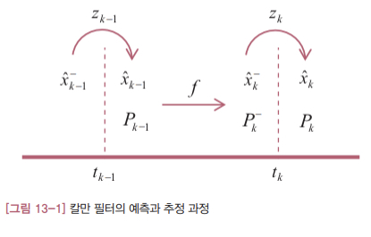

칼만 필터 알고리즘에서 상태 변수를 예측하고 추정하는 과정은 비선형 시스템이더라도 별 문제가 안됩니다. 시스템 모델과 주어진 공식에 따라 계산하면 됩니다. 문제는 오차 공분산의 예측값( $P_k^-$ )입니다. 일반적인 비선형 시스템에서는 이 값을 해석적으로 구할 방법이 없습니다.

앞에서 소개한 EKF는 오차 공분산의 예측값을 다음과 같은 공식으로 구했습니다.

$$
P_k^- = AP_{k-1}A^T + Q
$$

여기서 행렬 A는 다음과 같이 정의되는 시스템 모델 f(x)의 야코비안이었습니다.

$$
A \equiv \cfrac{\partial{f}}{\partial{x}} \Bigg|_ {\hat{x}_ k}
$$

이처럼 EKF는 오차 공분산의 에측에 선형화 모델을 사용합니다. 비선형 시스템에서 오차 공분산의 예측값을 해석적으로 구하지 못하는 문제를 선형화를 통한 근사화로 해결한 셈입니다. 그래서 EKF의 성능은 선형화 모델의 정확도가 관건입니다. EKF의 문제는 대부분 선형화 모델 때문에 생긴다고 해도 과언이 아닐 정도입니다.

이제 우리가 풀려는 문제를 다시 한번 정리해보겠습니다. 시각 $t_{k-1}$ 의 상태 변수 추정값( $\hat{x}_ {k-1}$ )과 오차 공분산( $P_{k-1}$ )이 주어졌을 때 현재 시각( $t_k$ )에서의 상태변수 예측값( $\hat{x}_ k^-$ )과 오차 공분산 예측값( $P_k^-$ )을 알아내야 합니다.

UKF는 이 문제를 풀기 위해 선형화를 통한 근사화 대신 샘플링을 통한 근사화 전략을 사용합니다. 즉 시스템 모델 수식을 직접 다루지 않고 시스템을 대표하는 몇 개의 데이터를 이용해 상태변수와 오차 공분산의 예측값을 계산합니다.

그럼 구체적으로 살펴보겠습니다. [그림 13-2]에 UKF의 작동 방식을 나타냈습니다.

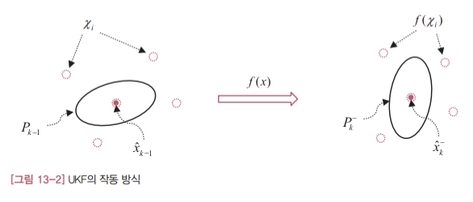

왼쪽에 있는 그림은 직전 시각( $t_{k-1}$ )의 상태를 나타내고 오른쪽에 있는 그림은 현재 시각( $t_k$ )의 상태를 나타냅니다. 시각 $t_{k-1}$ 에서의 추정값과 오차 공분산을 나타내는 몇 개의 대표 데이터( $\chi_i$ )가 존재한다고 가정해보겠습니다. 그러면 $t_k$ 에서 추정값과 오차 공분산의 예측값은 이 데이터들을 시스템 모델로 변환한 데이터 $f(\chi_i)$ 로부터 구할 수 있습니다. 이러한 변환을 **무향 변환<sup>unscented transform</sup>** (이하 UT)이라고 부릅니다.

이처럼 상태 변수와 오차 공분산의 예측값을 시스템 모델식으로부터 직접 계산하는 대신 몇 개의 대표값(시그마 포인트, $\chi_i$ )을 선정하고 이 값의 변환 데이터로부터 간접적으로 구하자는게 UKF의 핵심 전략입니다.

#### 13.2 UKF 알고리즘

이 절에서는 UT와 칼만 필터가 만나 탄생한 UKF 알고리즘을 살펴보겠습니다. 앞서 언급했듯이 UKF도 큰 틀에서는 기존의 칼만 필터 알고리즘과 같은 과정을 거쳐 추정값을 계산합니다. 따라서 칼만 필터의 전체 과정에 대한 개념을 확실히 잡고 있으면 UKF도 그리 어렵지 않게 이해할 수 있습니다. UKF 알고리즘이 EKF와 가장 크게 다른 점은 시스템 모델을 통한 예측이 필요한 곳마다 선형화 모델 대신 UT를 적절하게 활용한다는 정도입니다.

##### 비선형 시스템 모델

시스템 모델로는 12장의 EKF와 동일한 비선형 모델을 고려합니다. 각 변수의 의미도 모두 동일합니다.

- 13.1

$$
x_{k+1} = f(x_k) + w_k
$$

- 13-2

$$
z_k = h(x_k) + v_k
$$

위의 식보다 더 일반적인 형태의 비선형 모델이 수학적으로 더 가치가 있을 수는 있겠지만 실무에서 만나는 시스템은 대부분 위의 비선형 모델로 충분합니다. 그리고 시스템 모델이 간결할수록 설명하고 이해하기도 더 쉽습니다. 설렴ㅇ 다루는 시스템이 위의 모델로 표현되지 않는다고 해도 알고리즘을 제대로 이해하고 있다면 더 일반적인 비선형 모델로 확장하는 작업은 그리 어려운 일이 아닙니다. 그러므로 알고리즘을 설명하고 이해하는 것은 물론이고 실무에서도 대부분 식 13.1과 13.2의 시스템 모델로 충분합니다. 필요하면 조금 수정해서 확장하면 됩니다.

##### UKF 알고리즘

[그림 13-3]에서 UKF 알고리즘을 정리했습니다.

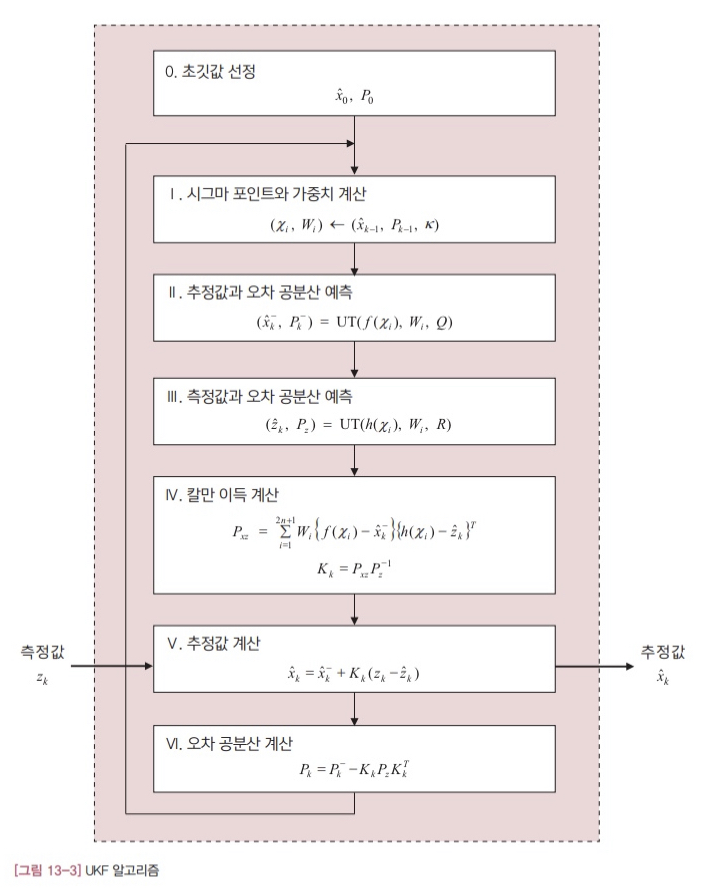

언뜻 보기에는 EKF 알고리즘보다 복잡해 보입니다. 하지만 막상 뜯어 놓고 분석해보면 지금까지 봐 온 칼만 필터와 개념이 비슷하다는 사실을 알게 될 겁니다. 계산식만 좀 달라졌을 뿐, '예측 -> 칼만 이득 계산 -> 추정'의 반복 구조는 그대로 남아있기 때문입니다.

가장 먼저 할 일은 직전 시각의 추정값과 오차 공분산을 대표하는 시그마 포인트와 가중치를 선정하는 작업입니다. 가중치는 UT에서 시그마 포인트와 함께 쓰이는 값이라는 정도로 일단 정리해두겠습니다.

II 단계에서는 현재 시각에서의 상태 변수와 오차 공분산의 예측값을 구합니다. 계산식은 다르지만 선형 칼만 필터의 예측 과정이 하는 역할과 동일합니다. 특이한 점은 상태 변수의 예측값을 구할 때 시스템 모델 f(x)를 직접 사용하지 않고 시그마 포인트와 UT를 통해 간접적으로 계산한다는 점입니다.

III 단계도 II 단계와 거의 비슷한 방식으로 계산합니다. EKF에서는 측정값의 오차 공분산( $P_z$ )은 따로 필요하지 않았지만 UKF에서는 이 값이 칼만 이득 계산에 쓰이기 때문에 이 값을 구해야 합니다. II 단계와 마찬가지로 측정값의 예측값( $\hat{z}_ k$ )을 시스템 모델로부터 직접 계산하지 않고 UT를 통해서 간접적으로 계산합니다.

IV 단계에서는 칼만 이득을 계산합니다. 계산 과정에서 필요한 $x_k$ 와 $z_k$ 의 공분산 행렬( $P_{xy}$ )을 먼저 계산합니다. 이 행렬을 계산할 때도 UT의 개념을 활용합니다.

- 13.3

$$
P_{xz} = \sum_{i=1}^{2n+1}W_i\\{f(\chi_i)-\hat{x}_ k^-\\}\\{h(\chi_i)-\hat{z}_ k\\}^T
$$

그런 후 $P_{xz}$ 와 측정값의 오차 공분산의 역행렬을 곱해 칼만 이득을 얻습니다. 나머지 V단계와 VI단계에서는 추정값과 오차 공분산을 추정합니다. EKF의 수식과 약간 다르지만 예측값을 보정해 추정값을 구하는 방식은 그대로입니다.

#### 13.3 무향 변환

UKF의 핵심 기반은 무향 변환(UT)입니다. UT를 이해하지 못하면 UKF 알고리즘도 완전히 이해하기는 어렵습니다. 그렇다고 이론적으로 증명까지 알아야 할 필요는 없습니다. UT 알고리즘의 기본 개념만 이해하면 됩니다.

##### UT 알고리즘

먼저 다음과 같이 평균이 $x_m$ 이고 분산이 $P_x$ 인 정규 분포를 따르는 상태 변수 x를 고려합니다.

$$
x \sim N(x_m, P_x)
$$

x에 대해 다음과 같은 시그마 포인트( $\chi_i$ )와 가중치( $W_i$ )를 정의합니다.

- 13.4

$$
\begin{aligned}
\chi_1 &= x_m\\\ \
\chi_{i+1} &= x_m + u_i\quad i=1,2,\cdots,n\\\ \
\chi_{i+n+1} &= x_m - u_i\quad i=1,2,\cdots,n
\end{aligned}
$$

- 13.5

$$
\begin{aligned}
W_1 &= \cfrac{\kappa}{n+\kappa}\\\ \
W_{i+1} &= \cfrac{1}{2(n+\kappa)}\quad i=1,2,\cdots,n\\\ \
W_{i+n+1} &= \cfrac{1}{2(n+\kappa)}\quad i=1,2,\cdots,n
\end{aligned}
$$

여기서 $u_i$ 는 다음과 같은 행렬 U의 행 벡터이고, $\kappa$ 는 임의의 상수입니다 ( $\kappa$ 는 $n+\kappa=3$ 이 되도록 선택하는게 가장 무난합니다).

$$
U^TU = (n+\kappa)P_x
$$

UT에서 시그마 포인트( $\chi_x$ )는 상태 변수의 확률 분포를 대표하는 샘플 데이터에 해당됩니다. 가중치( $W_i$ )는 평균과 공분산을 계산할 때 각 시그마 포인트의 비중을 결정하는 상수입니다. UT에서 정의하는 시그마 포인트와 가중치는 다음과 같은 특성을 만족합니다.

- 13.6

$$
\begin{aligned}
x_m &= \sum_{i=1}^{2n+1}W_i\chi_i\\\ \
P_x &= \sum_{i=1}^{2n+1}W_i\\{\chi_i-x_m\\}\\{\chi_i-x_m\\}^T
\end{aligned}
$$

위에서 첫번째 식은 시그마 포인트의 가중 평균<sup>weighted mean</sup>이 x의 원래 평균값과 같다는 의미입니다. 두번째는 시그마 포인트의 가중 공분산은 x의 공분산이 된다는 뜻입니다. 이 말은 수식이나 무수히 많은 샘플을 동원하지 않아도 2n+1개의 시그마 포인트와 가중치만 있으면 x의 통계적 특성(평균, 공분산)을 적절하게 표현할 수 있다는 것을 의미합니다. 이처럼 시그마 포인트와 가중치는 해당 상태 변수의 통계적 특성을 대표하도록 선정된 값들입니다.

[그림 13-4]에 지금까지 설명한 시그마 포인트와 가중치의 개념을 나타냈습니다. 상태 변수 x가 2차원 변수라고 가정했기 때문에 시그마 포인트는 5개가 됩니다( $2\times2+1$ ). 막대의 위치가 시그마 포인트이고 막대의 길이가 가중치를 나타냅니다. 이 다섯개의 시그마 포인트와 가중치로부터 원래 분포의 평균과 공분산을 계산해낼 수 있습니다.

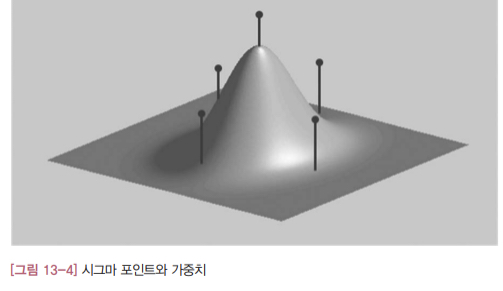

이제 함수 $y=f(x)$ 의 평균과 공분산은 다음과 같이 구할 수 있습니다. 즉 함수 f(x)로 변환한 상태 변수(y)의 분포를 변수 x의 분포를 나타내는 시그마 포인트( $\chi_i$ )와 가중치( $W_i$ )를 이용해 다음과 같이 구할 수 있습니다.

- 13.7

$$
\begin{aligned}
y_m &= \sum_{i=1}^{2n+1}W_if(\chi_i)\\\ \
P_y &= \sum_{i=1}^{2n+1}W_i\\{f(\chi_i)-y_m\\}\\{f(\chi_i)-y_m\\}^T
\end{aligned}
$$

위의 식 13.7을 더 자세히 살펴보겠습니다. 이 수식은 시그마 포인트를 f(x)로 변환한 $f(\chi_i)$ 의 가중 평균과 가중 공분산을 구하면 y의 평균과 공분산을 근사적으로 얻을 수 있다는 뜻 입니다. 이처럼 f(x)의 평균과 공분산을 직접 계산하는 대신 몇 개의 대표값(시그마 포인트)을 선정한 다음 이 값의 변환 결과로 평균과 공분산을 구한다는게 UT의 핵심 아이디어 입니다.

[그림 13-5]에 지금까지 설명한 UT의 개념을 요약했습니다. 먼저 x의 평균과 공분산에 맞춰 시그마 포인트 $\chi_i$ 를 선정합니다. 그리고 시그마 포인트들을 비선형 시스템 모델 f(x)로 변환시킵니다. 이렇게 변환된 데이터인 $f(\chi_i)$ 에 대해 각각 가중 평균과 가중 공분산을 계산합니다. 이 값이 바로 f(x)의 평균과 공분산의 근사값 즉 UKF에서 필요로 하는 상태 변수와 오차 공분산의 예측값입니다.

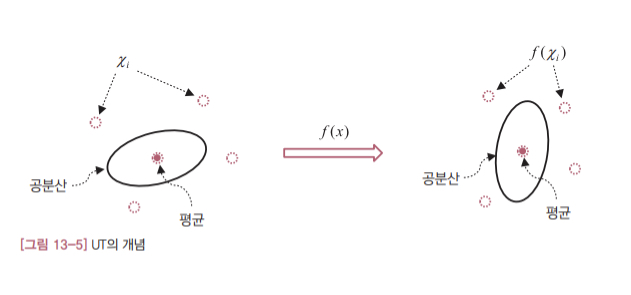

#### 13.5 예제2: 기울기 자세 측정하기

두번째로 살펴볼 예제는 12.4절에서 소개한 자이로와 가속도계를 융합하는 문제입니다. 시스템에 대해서는 앞에서 충분히 설명했으니 자세한 내용은 생략합니다.

##### 시스템 모델

시스템 모델의 상태 변수는 오일러 각도입니다.

$$
x = \begin{bmatrix}
    \phi\\\ \
    \theta\\\ \
    \psi
\end{bmatrix}
$$

그리고 시스템 모델은 12.4절과 똑같습니다.

- 13.10

$$
\begin{aligned}
\begin{bmatrix} 
    \dot{\phi}\\\ \
    \dot{\theta}\\\ \
    \dot{\psi}
\end{bmatrix} &= 
\begin{bmatrix}
    1 & \sin{\phi}\tan{\theta} & \cos{\phi}\tan{\theta}\\\ \
    0 & \cos{\phi} & -\sin{\phi}\\\ \
    0 & \sin{\phi}\sec{\theta} & \cos{\phi}\sec{\theta}
\end{bmatrix} \begin{bmatrix}
    p\\\ \
    q\\\ \
    r
\end{bmatrix} + w\\\ \
&= \begin{bmatrix}
    p+q\sin{\phi}\tan{\theta} + r\cos{\phi}\tan{\theta}\\\ \
    q\cos{\phi} - r\sin{\phi}\\\ \
    q\sin{\phi}\sec{\theta} + r\cos{\phi}\sec{\theta}
\end{bmatrix} + w\\\ \
&\equiv f(x) + w
\end{aligned}
$$

위에서 측정 모델식은 선형입니다. UKF 알고리즘에서는 임의의 함수를 가정하기 때문에 모델식이 선형이든 비선형이든 알고리즘의 구현에는 차이가 없습니다. 물론 시스템 모델이 모두 선형식이면 굳이 UKF를 사용할 이유가 없습니다.

UKF는 비선형 함수 자체를 모사하는 것보다는 이 함수의 확률 분포를 모사하는게 더 낫다는 전략에 따라 고안된 비선형 칼만 필터입니다. 다시 말해 비선형 함수를 근사화한 선형 ㅎ마수를 찾는 대신 비선형 함수의 평균과 공분산을 근사적으로 직접 구하는게 더 유리하다는 뜻입니다. 덕분에 UKF는 야코비안을 이용한 선형 모델이 불안정하거나 구현하기 어려운 경우에 EKF의 좋은 대안이 될 수 있습니다. 알고리즘 구현도 EKF와 비교해 그리 복잡하지 않아 실용적입니다.

그런데 비선형 시스템에 칼만 필터를 적용해야 할 때 EKF와 UKF 중에서 어느 쪽을 선택해야 할까요? 여기에 명확한 기준이 있는 것은 아닙니다. 시스템에 따라 둘 다 괜찮을 수도 있고 어느 한 쪽이 더 나을수도 있습니다. 대체로 야코비안을 해석적으로 쉽게 구할수 있으면 EKF가 계산 시간 측면에서 다소 유리합니다. 반대로 야코비안을 구하기 어렵거나 EKF가 발산할 염려가 있을 때는 UKF를 쓰는게 더 낫습니다. 그리고 두 필터 모두 근사적으로 예측값을 구하지만 UKF가 더 정확한 근사식을 사용한다는 점도 참고하시기 바랍니다.

### Chapter 14  파티클 필터<sup>Particle Filter</sup>

지금까지 다룬 EKF와 UKF는 시스템이 정규분포를 따른다고 가정했습니다. 반면 이 장에서 다룰 파티클 필터<sup>particle filter</sup>는 정규 분포를 따르지 않는 시스템에도 적용 가능한 비선형 필터입니다. 그만큼 파티클 필터는 적용 대상이 더 넓다는 장점이 있습니다.

UKF가 '시그마 포인트'를 통해 비선형 시스템의 확률 분포를 모사하는 것처럼 파티클 필터는 '파티클'을 통해 비선형 모델의 확률 분포를 모사합니다. 즉 파티클 필터도 선형화 과정을 거치지 않고 다수의 파티클을 통해 비선형 모델의 확률 분포를 예측합니다. 다만 UKF는 UT 변환이라는 고안된 과정을 활용했지만 파티클 필터는 별도의 처리 과정없이 무작위로 선정한 다수의 파티클을 이용한 통계적인 절차를 따른다는 점에서 차이가 있습니다.

그 결과 파티클 필터 알고리즘은 UKF에 비해 훨씬 단순하고 직관적입니다. 파티클 필터는 다수의 파티클을 통해 비선형 모델의 확률 분포를 예측하고 측정값으로 파티클들의 가중치를 보정해서 최종 추정값을 구하는 과정을 반복합니다. UKF에서 시그마 포인트를 활용해 예측 과정과 추정 과정을 운용하던 것과 거의 유사합니다. 참고로 파티클 필터의 파티클도 UKF의 시그마 포인트처럼 위치와 가중치를 갖는데 일반적으로 파티클 필터가 훨씬 더 많은 파티클을 운용합니다.

파티클 필터는 UKF와 비슷하면서 계산과정은 더 단순하기 때문에 이해하기 어렵지 않습니다. 유일하게 새로 등장하는 개념은 재샘플링<sup>resampling</sup> 정도입니다. 재샘플링은 파티클 필터가 실제 문제에서 성과를 낼 수 있게 만들어 준 핵심 과정으로 직관적으로 이해 가능한 개념입니다.

#### 14.1 파티클 필터의 기본 전략

지금까지 살펴본 칼만 필터는 기본적으로 상태 변수와 오차 공분산의 '예측'과 '추정' 과정을 반복했습니다. 예측 과정에서는 시스템 모델로 현재의 예측값을 구하고 추정 과정에서는 이 예측값과 현재의 측정값을 이용해 최종 상태 변수를 추정했습니다.

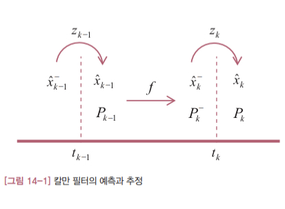

비선형 시스템의 경우에는 오차 공분산의 예측과 추정이 관건이었습니다. UKF는 선형화를 통한 근사화 대신 [그림 14-2]처럼 '시그마 포인트( $\chi_i$ )' 라는 샘플링을 통한 근사화 전략을 사용했습니다.

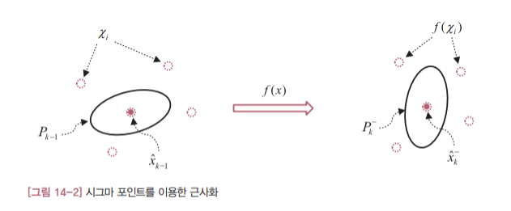

파티클 필터는 UKF의 시그마 포인트와 유사한 파티클<sup>particle</sup>이라는 다수의 데이터를 도입합니다. 예측 과정에서 파티클들을 시스템 모델에 통과시켜 각 파티클의 새로운 위치를 계산하는 점도 비슷합니다. 또한 UKF의 시그마 포인트처럼 각 파티클마다 가중치가 주어진다는 점도 흡사합니다. 하지만 파티클 필터는 EKF는 UKF와 달리 오차 공분산을 명시적으로 계산하지 않습니다. 상태 변수의 추정값을 계산할 때 칼만 이득을 사용하지 않기 때문입니다. 파티클 필터에서는 각 파티클의 가중치를 반영한 모든 파티클의 가중합이 상태 변수의 추정값이 됩니다.

이처럼 파티클 필터에서는 파티클만으로 시스템의 확률 분포와 상태 등을 모두 표현합니다. 앞서 살펴본 EKF와 UKF는 상태 변수와 오차 공분산 등의 예측값과 추정값 등을 명시적으로 계산하고 알고리즘에서 활용했지만 파티클 필터는 오직 파티클들의 위치와 가중치만을 유지합니다.

#### 14.2 파티클 필터 알고리즘

이 절에서는 파티클 필터 알고리즘을 살펴보겠습니다. 앞서 언급했듯이 파티클 필터도 큰 틀에서는 기존의 칼만 필터 알고리즘과 비슷하게 예측과 추정 과정을 거쳐 추정값을 계산합니다. 파티클 필터 알고리즘이 EKF나 UKF와 가장 크게 다른 점은 칼만 이득을 상용하지 않고 파티클들의 가중합으로 추정값을 계산한다는 사실입니다.

##### 비선형 시스템 모델

시스템 모델로는 12장의 EKF와 동일한 비선형 모델을 고려합니다. 각 변수의 의미도 모두 동일합니다.

- 14.1

$$
x_{k+1} = f(x_k) + w_k
$$

- 14.2

$$
z_k = h(x_k) + v_k
$$

위의 식에서 $w_k$ 와 $v_k$ 는 임의의 확률 분포를 따라도 됩니다. 즉 앞서 살펴본 EKF와 UKF의 시스템 모델과 달리 시스템 모델이 정규 분포를 따른다는 가정을 하지 않습니다.

##### 파티클 필터 알고리즘

[그림 14-3]에 파티클 필터 알고리즘을 정리했습니다.

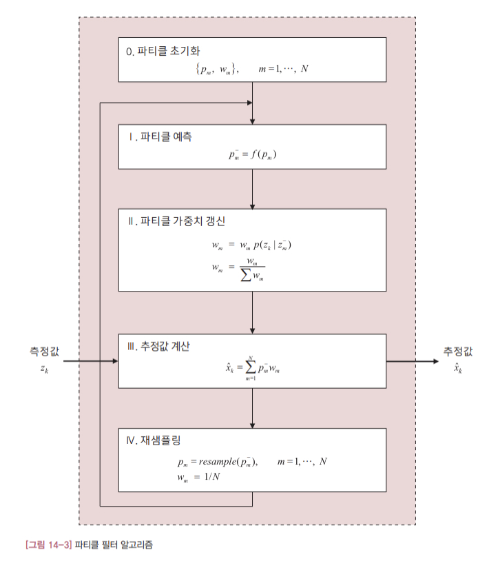

지금까지 봐 온 칼만 필터와 거의 비슷하게 '예측 -> 추정'의 반복 구조인데, 파티클 필터는 다수의 파티클만 운용하기 때문에 알고리즘은 훨씬 단순합니다. 엄밀하게 말하면 파티클 필터는 재샘플링이라는 단계가 추가되어 있어, '예측 -> 추정 -> 재샘플링'을 반복하는 알고리즘입니다.

우선 지정된 개수(N)의 파티클과 가중치를 초기화합니다. 파티클 필터는 칼만 필터의 기본과정인 '예측'과 '추정' 과정을 모두 이 파티클들과 각 파티클의 해당 가중치를 기반으로 진행합니다.

I단계는 예측과정입니다. 시스템 모델을 통해 각 파티클의 예측값을 모두 구합니다.
II단계에서는 각 파티클의 가중치를 갱신합니다. 가중치는 현재의 측정값과 각 파티클의 예측 측정값의 차이를 기반으로 갱신됩니다. 일단 측정값과 예측 측정값이 비슷할수록 해당 파티클의 가중치를 높여준다는 정도로만 정리해두겠습니다.
III단계는 추정과정입니다. 파티클 필터에서 추정값은 각 파티클의 가중치를 고려한 모든 파티클의 가중합으로 구합니다.
IV단계는 파티클 필터의 독특한 특징인 재샘플링 과정입니다. 재샘플링은 각 파티클의 가중치를 반영해 파티클을 새로 생성하는 과정이라고 이해하시면 됩니다. 새로 생성된 파티클들의 가중치는 모두 동일하게 1/N로 초기화됩니다. 재샘플링 과정이 없으면 파티클 필터가 제대로 동작하지 않을 정도로 이 과정은 성능에 중요한 영향을 미치는 절차입니다. 파티클 필터의 재샘플링 알고리즘은 다양한 형태가 있습니다. 여기서는 순차적 중요도 재샘플링<sup>sequential importance resampleing</sup>(이하 SIR)으로 알려진 알고리즘만 다루겠습니다.

#### 14.3 예제: 레이다 추적

이 절에서는 예제를 통해 파티클 필터를 실제로 설계하고 그 성능을 살펴보겠습니다. EKF, UKF와 비교해볼 수 있도록 12장의 첫번째 예제를 그대로 가져왔습니다. 12.3절에서 소개한 물체까지의 직선 거리를 측정해서 위치와 고도를 추정하는 문제입니다.

##### 시스템 모델

시스템의 상태 변수는 12장과 동일하게 정의합니다.

$$
x = \begin{bmatrix}
    수평거리\\\ \
    이동속도\\\ \
    고도
\end{bmatrix} \equiv \begin{bmatrix}
    x_1\\\ \
    x_2\\\ \
    x_3
\end{bmatrix}
$$

시스템 모델은 다음과 같이 표현됩니다. 이 시스템에서는 측정식이 비선형입니다.

- 14.3

$$
\begin{bmatrix}
    \dot{x}_ 1\\\ \
    \dot{x}_ 2\\\ \
    \dot{x}_ 3
\end{bmatrix} = \begin{bmatrix}
    x_2\\\ \
    0\\\ \
    0
\end{bmatrix} + \begin{bmatrix}
    0\\\ \
    w_1\\\ \
    w_2
\end{bmatrix} \equiv f(x) + w
$$

- 14.4

$$
z = \sqrt{x_1^2 + x_3^2} + v \equiv h(x) + v
$$

##### 파티클 필터 함수

각 파티클의 초기 위치는 상태 변수 초기값을 중심으로 정규 분포에 따라 배치했고 각 파티클의 가중치는 모두 동일하게 1/N 값을 주었습니다. 파티클 가중치들의 총합은 1이 되어야 하기 때문입니다.

파티클 필터 알고리즘의 첫번째 단계는 예측과정입니다. 파티클 필터의 예측 과정은 모든 파티클을 시스템 모델에 통과시켜 새로운 위치를 얻는게 전부입니다. UKF와 달리 부가적인 사전작업을 수행하지 않습니다.

예측 과정이 끝나면 새로운 측정값에 따라 각 파티클의 가중치를 바꿔줍니다. 실체 측정값과 각 파티클의 예측 측정값을 비교해서 해당 파티클의 가중치를 바꿔줍니다. 이렇게 모든 파티클들의 가중치를 조졸한 다음에는 다시 가중치의 총합이 1이 되도록 가중치를 정규화해줍니다.
끝으로 새로운 추정값은 모든 파티클의 가중 평균으로 구합니다. 각 파티클의 가중치가 정규화되어 있으므로 가중 합이 가중 평균이 됩니다.

이상의 과정을 정리해보면 다수의 파티클을 시스템 모델에 통과시켜 파티클의 위치를 새로 계산합니다(예측 과정). 측정값을 이용해 각 파티클의 가중치를 조정하는데 파티클의 예측 측정값이 실제 측정값과 가까울수록 가중치를 키웁니다. 최종 추정값은 모든 파티클의 가중 평균으로 계산합니다(추정 과정).

이처럼 파티클 필터의 알고리즘은 굉장히 직관적이면서 단순합니다. 하지만 이러한 과정만을 계속 반복하면 일부 파티클의 가중치만 커지고 나머지 파티클은 거의 역할을 못하게 됩니다. 이렇게 되면 다수의 파티클을 도입한 효과가 사라지게 됩니다. 따라서 파티클을 다음 예측 과정에서 사용하기 전에 재샘플링 과정을 거쳐야 합니다. 파티클 필터를 위한 재샘플링 알고리즘은 다양하게 개발되어 있는데 여기서는 SIR을 구현했습니다. SIR의 핵심 아이디어는 각 파티클의 가중치에 비례해 해당 파티클의 개수를 더 늘리거나 줄이는 방식으로 재샘플링하는 것입니다. 'A'라는 파티클의 가중치가 다른 파티클 'B'으ㅟ 가중치에 비해 10배 더 크다면 'A' 파티클의 위치에 10배만큼 많은 파티클이 위치하도록 재샘플링합니다. 재샘플링 후에는 파티클 'A'의 위치에 파티클이 더 배치된 만큼 가중치가 낮은 파티클들의 위치에는 파티클이 줄어들거나 아예 없어집니다. 재샘플링 전후의 파티클 개수는 동일하게 유지하기 때문입니다. 재샘플링된 다음에 각 파티클의 가중치는 모두 동일하게 1/N로 초기화합니다. 결국 재샘플링은 각 파티클의 가중치를 해당 파티클의 개수로 변환하는 과정이라고 볼 수 있습니다.

## Part 05 고주파 통과 필터와 상보 필터

### Chapter 15 고주파 통과 필터<sup>high-pass filter</sup>

이 장에서 소개하는 고주파 통과 필터<sup>high-pass filter</sup>는 3장의 저주파 통과 필터와는 반대로 입력신호에서 저주파 성분은 걸러내고 고주파 성분만 통과시킵니다. 예를 들어 측정 신호와 잡음이 섞인 입력이 들어오면 측정 신호는 걸러지고 잡음만 출력됩니다.

고주파 통과 필터가 많이 사용되는 대표적인 영역 중의 하나는 제어 분야입니다. 비행기의 경우를 예로 들어보겠습니다. 비행기 중에는 외부 바람 때문에 기수가 좌우로 많이 흔들릴 수 있습니다. 그런데 기수가 흔들리면 승객들의 탑승감이 매우 나빠집니다. 그래서 대부분의 여객기에는 기수의 흔들림을 자동으로 감지해서 막아주는 '요 댐퍼<sup>yaw damper</sup>'라는 자동 제어기가 장착돼 있습니다. 문제는 조종사가 조종간을 움직여 비행기의 기수를 바꾸려고 할 대도 요 댐퍼가 이를 기수의 흔들림으로 인식해서 자꾸 움직임을 막는다는 점입니다. 결국 조종사도 비행기의 기수를 바꾸기 어렵게 되는 셈입니다. 이 문제의 핵심은 비행기의 기수가 바뀔 때 이게 바람때문인지 조종사가 조종간을 움직인 것인지를 제어기가 구분하지 못한다는 점입니다. 따라서 두 입력을 구분하는 방법이 필요한데 이 때 바로 고주파 통과 필터가 요긴하게 쓰입니다. 보통 조종사가 조종간을 움직이는 주기는 매우 느립니다. 그래서 기수가 움직이는 주기도 느립니다. 반면 바람에 의한 기수 흔들림은 상대적으로 고주파입니다. 따라서 기수의 움직임을 측정하는 센서에 고주파 통과 필터를 붙여놓으면 바람에 의한 기수 흔들림만 출력됩니다. 이 출력 결과를 요 댐퍼에 입력하면 요 댐퍼는 바람에 의해 기수가 흔들릴 때만 작동하게 됩니다. 이처럼 입력 주파수의 특성에 따라 제어기의 작동 여부를 나누고 싶을 때 고주파 통과 필터가 유용하게 쓰입니다.

1부에서는 저주파 통과 필터를 나타내는 수식을 바로 제시하고 그 특성을 분석해봤습니다. 하지만 어떤 이론적 배경에서 관련 수식이 나왔는지는 설명하지 않았습니다. 여기서는 3장의 저주파 토오가 필터와 라플라스 변환이 어떻게 연관되어 있는지를 살펴보고 관련 수식의 의미를 라플라스 변환의 관점에서 해석해 보겠습니다.

#### 15.1 라플라스 변환과 필터

저주파 통과 필터나 고주파 토오가 필터처럼 주파수의 관점에서 설계하는 필터는 대부분 **라플라스 변환<sup>Laplace transform</sup>** 에 빚지고 있습니다. 필터를 설계하고 분석하는데 기준이 되는 필터의 수학식이 라플라스 변환에 기초하고 있기 때문입니다. 변환 결과를 얻기 위한 계산은 복잡할 수 있지만 라플라스 변환 자체는 매우 간단하게 정의됩니다. 다음 식은 임의의 함수 g(t)에 대한 라플라스 변환의 정의를 나타냅니다.

- 15.1

$$
G(s) = \int_0^\infty g(t)e^{-st}dt
$$

여기서 적분 결과인 G(s)가 함수 g(t)의 라플라스 변환입니다. 이 정의는 외우거나 이해할 필요없이 그냥 받아들이면 됩니다.

그런데 주파수 필터를 다룰 대 라플라스 변환을 활용하는 이유가 뭘가요? 이 질문에 대한 답은 식 15.1에 이미 나와있습니다. 시간에 대한 함수 g(t)에 라플라스 변환을 취하면 새로운 함수 G(s)는 더이상 시간 t의 함수가 아닙니다. 변수 s의 함수로 바뀝니다. 그런데 이 변수 s는 주파수와 관련있습니다. 즉 시간의 함수를 라플라스 변환하면 주파수의 함수로 바뀝니다. 주파수의 관점에서 필터를 설계하고자 할 대 주파수의 함수로 필터를 표현하는게 당연히 더 낫겠지요?

그럼 필터의 일반적인 작동 방식을 고려해보겠습니다. [그림 15-1]은 어떤 필터 g(t)에 신호 u(t)를 입력해ㅆ더니 y(t)가 출력되는 상황을 표현한 것입니다. 두번째 그림은 이 상황을 라플라스 변환을 통해 주파수 영역으로 옮긴 시스템을 나타냅니다.

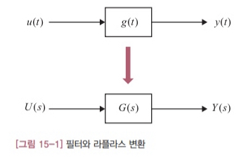

이 시스템의 모든 신호를 라플라스 변환하면 필터와 입력 신호, 출력 신호 사이에는 다음과 같은 관계가 성립합니다.

- 15.2

$$
\cfrac{Y(s)}{U(s)} = G(s)\\\ \
\therefore Y(s) = G(s)U(s)
$$

이 식에서 G(s)는 **전달함수<sup>transfer function</sup>** 라고 부릅니다. 식 15.2가 의미하는 바는 필터의 전달함수와 입력 신호를 곱하면 필터의 출력이 된다는 뜻입니다. 나름 중요한 의미를 가진 식인데 실제 시스템에서는 입력 신호가 수식으로 표현되는 경우가 드물기 대문에 식 15.2로 출력을 직접 계산할 일은 거의 없습니다. 어쨌든 여기서 꼭 기억해야 할 것은 어떤 시간의 함수를 라플라스 변환하면 주파수의 함수로 바뀐다는 사실입니다.

이제 라플라스 변환을 이용해 주파수 필터를 어떻게 표현하는지를 소개하겠습니다. 먼저 다음과 같은 간단한 전달함수를 고려합니다.

- 15.3

$$
G(s) = \cfrac{a}{s+a}
$$

여기서 a는 양의 상수입니다. 이 식은 가장 간단한 형태의 저주파 통과 필터를 수식으로 나타낸 것입니다. 그런데 이 필터의 주파수 특성은 어떻게 알 수 있을까요? 다시 말해 식 15.3이 저주파 통과 필터인지 고주파 통과 필터인지는 어떻게 알 수 있을까요? 방법은 간단합니다. 주파수 대역에 따라 이 식의 값이 어떻게 바뀌는지를 보면 됩니다. 즉 s가 커지고 작아짐에 따라 G(s)의 값이 어떻게 변하는지를 알아보는 것입니다.

먼저 입력 신호의 주파수가 높으면(s가 커지면) 식 15.3은 다음과 같이 0으로 수렴합니다.

- 15.4

$$
\lim_{s \to \infty} G(s) = \lim_{s \to \infty} \cfrac{a}{s+a} = 0
$$

그런데 식 15.2에서 G(s)가 0으로 수렴하면 필터의 출력 Y(s)도 0으로 수렴하게 됩니다. 이 말은 고주파 신호가 들어오면 이 필터를 통과하지 못한다는 뜻입니다.

반대로 입력 신호의 주파수가 낮으면(s가 작아지면) 분자와 분모가 같아져 G(s)가 1로 수렴합니다. 즉 입력 신호가 필터를 그대로 통과하게 됩니다.

- 15.5

$$
\lim_{s \to 0}G(s) = \lim_{s \to 0} \cfrac{a}{s+a} = 1
$$

이상에서 식 15.3의 필터는 저주파 통과 필터라는 사실을 확인했습니다. 이렇게 필터를 라플라스 변환해서 표현하면 주파수 특성을 쉽게 파악할 수 있습니다.

참고로 노파심에 말씀드리면 식 15.3이 저주파 통과 필터를 구현하는 유일한 방법은 아닙니다. 저주파 성분만 통과시키는 특성은 비슷하지만 필터의 표현 수식은 다른, 정말 다양한 형태의 저주파 통과 필터가 존재합니다.

내친김에 3장에서 소개한 저주파 통과 필터의 수식과 식 15.3에 표현된 저주파 통과 필터의 관계를 살펴보겠습니다. 편의상 식 3.1의 저주파 통과 필터를 아래에 옮겨 적습니다.

$$
\overline x_k = \alpha \overline x_{k-1} + (1-\alpha)x_k
$$

여기서 $\alpha$ 는 $0 < \alpha < 1$ 인 상수입니다. 이 식과 식 15.3의 가장 큰 차이는 수식이 표현된 영역이 다르다는 점입니다. 식 3.1은 시간 영역의 수식인데 반해 식 15.3은 주파수 영역의 함수입니다. 따라서 제대로 비교하려면 두 수식을 먼저 같은 영역으로 옮겨야 합니다. 여기서는 라플라스 역변환을 통해 식 15.3을 시간 영역으로 옮겨보겠습니다.

먼저 식 15.3의 우변을 a로 나누고 $\tau \equiv \cfrac{1}{a}$ 이라는 정의를 대입해서 정리합니다.

$$
\begin{aligned}
G(s) &= \cfrac{1}{\cfrac{1}{a}s+1}\\\ \
&= \cfrac{1}{\tau s+1}
\end{aligned}
$$

이제 식 3.1의 입출력 변수를 고려해서 식 15.2를 이 식에 대입합니다.

$$
\cfrac{Y(s)}{U(s)} = \cfrac{\overline X(s)}{X(s)} = \cfrac{1}{\tau s+1}
$$

양변의 분수식을 풀어서 정리하면 다음과 같은 수식이 나옵니다.

$$
(\tau s+1)\overline X(s) = X(s)
$$

이 식에 라플라스 역변환을 취해 시간 영역으로 옮깁니다.

- 15.6

$$
\tau \cfrac{d}{dt}\overline x(t) + \overline x(t) = x(t)
$$

여기서 s가 곱해진 함수를 라플라스 역변환하면 미분 함수가 된다는 점만 유의하면 특별한 내용은 없습니다. 식 15.6이 식 15.3의 전달함수를 시간 영역으로 변환한 최종 결과입니다. 그런데 식 15.6은 식 3.1과 달리 연속 시간 함수입니다. 두 식을 비교하려면 식 15.6을 이산 시간으로 바꿔야 합니다. 이를 위해 식 15.6의 미분을 아래와 같은 차분식으로 대체합니다.

$$
\cfrac{d}{dt}\overline x(t) = \cfrac{\overline x_k - \overline x_{k-1}}{\Delta t}
$$

여기서 $\Delta t$ 는 이산 시스템의 샘플링 시간 간격을 의미합니다. 이제 이 식을 식 15.6에 대입하고 나머지 변수도 이산 시간으로 표현을 바꾸면 아래와 같은 이산 시스템으로 바뀝니다.

$$
\tau \cfrac{\overline x_k - \overline x_{k-1}}{\Delta t} + \overline x_k = x_k
$$

이 식의 양변에 $\Delta t$를 곱해서 정리하면 다음과 같은 최종 관계식이 나옵니다.

$$
\overline x_k = \cfrac{\tau}{\tau+\Delta t}\overline x_{k-1} + \cfrac{\Delta t}{\tau+\Delta t}x_k
$$

이 식과 식 3.1을 비교해보면 식 3.1의 $\alpha$ 는 다음과 같은 관계를 만족합니다.

- 15.7

$$
\alpha \equiv \cfrac{\tau}{\tau+\Delta t}
$$

3장에서는 $\alpha$ 를 단순히 직전 추정값과 측정값의 가중치로만 이해했습니다. 그런데 $\alpha$ 에는 식 15.7과 같은 더 복잡한 의미가 담겨있었던 겁니다. 3장에서 식 3.1의 $\alpha$ 를 선정하는 방법에 대해서 이야기하지 않은 이유도 여기에 있습니다. 제대로 하려면 시스템의 주파수 특성과 필터의 요구 성능을 고려해 식 15.3의 a를 선정하고 필터의 수식을 이산화해야 합니다. 그러면 $\alpha$ 는 식 15.7에 따라 자동으로 결정됩니다. 시간 영역에서 $\alpha$ 를 설계하기는 쉽지 않ㅅ브니다.

이상의 결과를 요약해보면 이렇습니다. 3장의 식 3.1의 저주파 통과 필터는 사실 식 15.3의 저주파 통과 필터를 이산 시간으로 표현만 바꾼 것 입니다. 즉 식 3.1과 식 15.3은 같은 필터의 다른 표현일 뿐입니다. 그리고 주파수 필터를 개발할 때는 식 15.3과 같이 표현된 수식을 가지고 주파수 영역에서 설계 분석하고 구현할 때는 식 3.1과 같이 이산화된 수식으로 바꿉니다. 주파수 필터는 라플라스 변환을 이용해 주파수 영역에서 설계하고 분석하는게 바람집합니다. 실제 구현을 위한 이산 시간 수식은 라플라스 역변환을 통해 직접 유도하거나 소프트웨어 도구를 이용해 수치적으로 구하면 됩니다.

#### 15.2 고주파 통과 필터

이제 고주파 통과 필터에 대해 알아보겠습니다. 고주파 통과 필터는 말그대로 입력 신호에서 저주파 성분은 걸러내고 고주파 성분만 통과시키는 필터입니다.

- 15.8

$$
G(s) = \cfrac{s}{s+a}
$$

앞 절과 마찬가지로 이 필터의 주파수 특성은 변수 s가 커지고 작아짐에 따라 G(s)가 어떤 값에 수렴하는지를 따져보면 쉽게 알 수 있습니다.
먼저 s가 0에 가까워지면 전달함수도 0으로 수렴합니다. 즉 주파수가 낮으면 입력 신호가 통과하지 못합니다.

$$
\lim_{s \to 0}G(s) = \lim_{s \to 0} \cfrac{s}{s+a} = 0
$$

반대로 s가 커지면 (입력 신호의 주파수가 높으면) 전달함수가 1로 수렴합니다. 즉 입력 신호가 그대로 통과합니다.

$$
\lim_{s \to \infty}G(s) = \lim_{s \to \infty} \cfrac{s}{s+a} = 1
$$

이상에서 식 15.8이 고주파 통과 필터라는 사실을 확인했습니다.

그럼 지금부터는 식 15.8을 실제로 구현하는 방법을 소개하겠습니다. 앞에서 저주파 통과 필터를 시간 영역으로 옮기는 과정과 거의 비슷합니다. 먼저 식 15.8의 우변에서 분자와 분모를 a로 나누고 정리합니다.

$$
\begin{aligned}
G(s) &= \cfrac{s/a}{s/a + 1}\\\ \
&= \cfrac{\tau s}{\tau s + 1}
\end{aligned}
$$

여기서 $\tau \equiv \cfrac{1}{a}$ 입니다. 이제 식 15.2의 전달함수 G(s) 정의에 위의 식을 대입해서 양변을 정리하면 다음과 같은 식이 나옵니다.

$$
(\tau s + 1)Y(s) = \tau s \cdot U(s)
$$

이 식의 양변에 라플라스 역변환을 취하면 다음과 같은 미분방정식으로 바뀝니다.

$$
\tau \dot{y}(t) + y(t) = \tau \dot{u}(t)
$$

이제 이 식을 이산화합니다. 먼저 미분 대신 차분식을 대입하고 나머지 변수도 이산 시간으로 바꿉니다.

$$
\tau \cfrac{y_k - y_{k-1}}{\Delta t}+y_k = \tau \cfrac{u_k - u_{k-1}}{\Delta t}
$$

이 식의 양변에 $\Delta t$ 를 곱하고 정리하면 식 15.8을 이산 시간으로 표현한 관계식이 나옵니다.

- 15.9

$$
y_k = \cfrac{\tau}{\tau + \Delta t}y_{k-1} + \cfrac{\tau}{\tau+\Delta t}(u_k-u_{k-1})
$$

앞 절의 저주파 통과 필터와 비교해보면 현재의 입력값( $u_k$ ) 외에 직전 입력값( $u_{k-1}$ )이 필요하다는 점이 특이합니다.

### Chapter 16 상보 필터<sup>complementary filiter</sup>

센서 융합은 칼만 필터가 많이 응용되는 분야 중 하나입니다. 11장에서도 칼만 필터로 관성 항법 센서를 융합하는 예제를 소개한 적이 있습니다. 물론 칼만 필터가 이 분야에서 최강자이긴 하지만 꼭 칼만 필터만 사용해야 하는 것은 아닙니다. 이 장에서는 센서 융합에서 칼만 필터의 대안이 될 수 있는 **상보 필터<sup>complementary filter</sup>** 를 소개하겠습니다. 상보 필터는 칼만 필터보다 훨씬 단순하고 설계하기도 쉽습니다. 그리고 칼만 필터와 달리 발산할 염려도 없습니다. 대신 융합할 센서의 주파수 특성이 서로 보완적인<sup>complementary</sup> 특성을 갖는 경우에만 적용 가능하다는 한계가 있습니다. '상보'라는 단어도 이러한 특성에서 유래한 말입니다.

#### 16.1 상보 필터의 개념

상보 필터는 여러 개의 센서를 융합해서 더 나은 측정값을 얻고자 할 때 사용합니다. 여기서 더 나은 측정값이란 센서의 측정 잡음이 제거된 원래의 참값에 가까운 신호를 의미합니다. 그런데 상보 필터는 센서의 주파수 특성이 보완적일 대만 사용 가능합니다. 예를 들어 한 센서가 측정 물리량의 저주파 성분을 잘 감지한다면 다른 센서는 고주파 성분을 잘 측정해내는 식으로 서로 주파수 특성이 달라야 합니다. 상보 필터는 두 센서의 저주파 성분과 고주파 성분을 적절히 융합해서 개별 센서의 측정값보다 더 우수한 측정값을 얻어냅니다.
그럼 상보필터가 어떤 원리로 측정값을 융합해 내는지 그 원리를 알아보겠습니다. [그림 16-1]은 같은 물리량을 두 개의 센서를 이용하여 측정하는 시스템입니다. 그림에서 x(t)는 측정 물리량의 참값을 $n_1(t)$ 와 $n_2(t)$ 는 각 센서의 측정값에 포함된 잡음을 의미합니다. $G_1(s)$ 와 $G_2(s)$ 는 센서의 측정값을 입력받아 처리하는 필터이고 최종 측정 결과는 $z(t)$ 입니다.

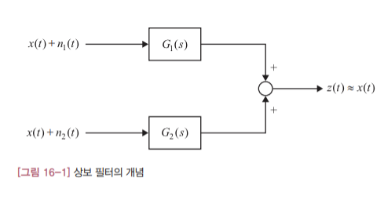

이 시스템의 목표는 각 측정값을 필터로 적절히 처리한 다음에 그 결과를 합쳤을 때 원래의 참값을 얻어내는 것입니다. 이를 위해서는 측정 잡음의 특성에 맞춰 측정값의 필터 $G_1(s)$ 와 $G_2(s)$ 를 잘 설계하는 것이 핵심입니다. 그런데 두 신호의 측정 잡음이 서로 상보적이라면 이 문제는 쉽게 해결할 수 있습니다. 다시 강조하지만 여기서 '상보적'이라는 말은 한 신호에는 고주파 잡음이 다른 측정값에는 저주파 잡음이 주로 들어있다는 뜻입니다.

상보 필터는 $G_1(s)$ 와 $G_2(s)$ 가 각각 다음과 같은 구조가 되도록 시스템을 구성합니다.

$$
\begin{aligned}
G_1(s) &= 1 - G(s)\\\ \
G_2(s) &= G(s)
\end{aligned}
$$

여기서 G(s)는 저주파 통과 필터나 고주파 통과 필터가 됩니다. 이 두 필터를 [그림 16-1]에 대입하면 [그림 16-2]와 같은 전형적인 구조의 상보 필터가 됩니다.

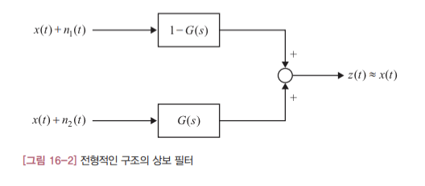

그럼 위와 같은 상보 필터에서 최종 출력은 어떻게 계산되는지를 알아보겠습니다. 잘 알다시피 시간 함수를 라플라스 변환하면 필터를 통과한 신호는 필터에 신호를 곱한 형태로 표현됩니다. 따라서 최종 출력은 다음과 같이 쓸 수 있습니다.

$$
\begin{aligned}
Z(s) &= \\{1-G(s)\\}\times\\{X(s)+N_1(s)\\}+G(s)\times\\{X(s)+N_2(s)\\}\\\ \
&= \\{1-G(s)\\}X(s)+\\{1-G(s)\\}N_1(s)+G(s)X(s)+G(s)N_2(s)\\\ \
&= X(s)-G(s)X(s)+\\{1-G(s)\\}N_1(s)+G(s)X(s)+G(s)N_2(s)\\\ \
&= X(s)+\\{1-G(s)\\}N_1(s)+G(s)N_2(s)
\end{aligned}
$$

여기서 대문자 기호는 각 소문자 신호의 라플라스 변환을 의미합니다. 이 결과에서 주목해야 할 점은 참값( $X(s)$ )은 필터( $G(s)$ )의 영향을 전혀 받지 않는다는 사실입니다. 즉 측정 물리량의 참값은 우리가 설계하는 필터에 의해 어떤 형태로도 변형되지 않습니다. 그리고 측정 물리량의 성질에 대해서도 어떤 조건을 달거나 제한하지 않습니다.

상보 필터의 영향을 받는 신호는 각 센서의 측정 잡음 $N_1(s)$ 와 $N_2(s)$ 뿐입니다. 따라서 $G(s)$ 를 잘 설계해서 두 측정 잡음을 모두 없애면 최종 출력 $Z(s)$ 에는 참값인 $X(s)$ 만 남게 됩니다. 그렇다면 측정 잡음을 모두 제거하는 필터를 설계하는게 항상 가능할까요? 불행히도 그렇지는 않습니다. 만약 이런 필터가 존재한다면 칼만 필터는 물론이고 대부분의 잡음 제거 필터가 필요없을 겁니다.

하지만 특수한 상황에서는 두 측정 잡음을 동시에 억제하는게 가능합니다. 예를 들어 잡음 $N_1(s)$ 는 저주파 잡음인데 $N_2(s)$ 는 고주파 잡음이라면 어떨까요? 필터 $G(s)$ 를 저주파 통과 필터로 설계하면 $G(s)N_2(S)$ 는 아주 작은 값을 갖게 됩니다. 반면 $1-G(s)$ 는 고주파 통과 필터가 되니까 $N_1(s)$ 도 걸러지게 됩니다. $\\{1-G(s)\\}N_1(s)$ 가 작은 값을 갖기 때문입니다. 그러면 최종 출력은 다음과 같이 원래의 참값에 가까워집니다. 이렇게 두 측정 잡음이 상보적인 경우에는 상보 필터로 센서를 융합하면 성능을 상당히 개선할 수 있습니다.

$$
\begin{aligned}
Z(s) &= X(s)+\\{1-G(s)\\}N_1(s)+G(s)N_2(s)\\\ \
&\cong X(s)
\end{aligned}
$$

그런데 측정 센서가 세 개 이상일 경우에 상보 필터를 적용하려면 어떻게 해야 할까요? 이때도 상보 필터를 구성하는 필터의 합이 1이 되도록 구성하면 상보 필터를 쉽게 확장할 수 있습니다. 예를 들어 측정 센서가 세 개인 경우에는 각 입력에 대해 다음과 같이 필터를 구성하면 됩니다.

$$
\begin{aligned}
G_1(s) &= \text{(측정값 1에 대한 필터의 전달함수)}\\\ \
G_2(s) &= \text{(측정값 2에 대한 필터의 전달함수)}\\\ \
1-G_1(s)-G_2(s) &= \text{(측정값 3에 대한 필터의 전달함수)}
\end{aligned}
$$

물론 이런 상보 필터가 구성되려면 $G_1(s)$ 와 $G_2(s)$ 가 측정 잡음 $N_1(s)$ 와 $N_2(s)$ 를 걸러내는 필터일 때 측정 잡음 $N_3(s)$ 는 $1-G_1(s)-G_2(s)$ 를 통과하지 못해야 합니다. 이 조건이 만족되지 않으면 상보 필터를 적용해서 잡음을 제거할 수 없습니다.

지금까지 설명한 내용을 정리해보겠습니다. 상보 필터는 동일한 물리량을 복수의 센서로 측정할 때 그 측정값을 융합하는데 유용합니다. 이 때 각 센서는 상보적인 특성을 가져야 합니다. 그렇지 않으면 상보 필터를 센서 융합에 이용할 수 없습니다. 그리고 상보 필터는 원래의 신호를 왜곡하지 않고 잡음만 효과적으로 제거해냅니다. 또한 되먹임 구조가 아닌 개회로<sup>open-loop</sup>구조라 알고리즘이 발산할 염려도 없습니다.