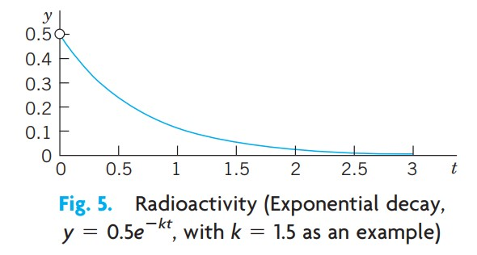

# book: Kreyszig 공업 수학advanced engineering mathmatics

## Chapter 1 1계 상미분방정식First-Order Ordinary Differential Eqation(ODE)

### 1.1 기본개념. 모델링

만약 공학문제(보통 물리적 성격의)를 풀려고 한다면 먼저 문제를 변수, 함수 그리고 방정식 등을 통하여 수학적 식으로 공식화해야 한다. 이와 같은 식은 주어진 문제의 수학적 모델(model)이라 알려져 있다. 모델을 세우고, 그것을 수학적으로 풀고, 그 결과를 물리적 또는 다른 견지에서 해석하는 과정을 수학적 모델링(mathematical modeling) 또는 간략하게 모델링(modeling)이라고 부른다.

그런데 속도나 가속도와 같은 많은 물리적 개념들이 도함수이므로 모델은 대부분 미지 함수의 도함수를 포함하는 방정식이 된다. 이와 같은 모델을 미분방정식(differential equation)이라 부른다. 물론 그 다음에 주어진 문제에서 물리시스템의 거동을 이해할 수 있도록 해(방정식을 만족하는 함수)를 구하고, 해의 특성을 조사하고, 해의 그래프를 그리고, 해의 값들을 구하고 물리적 견지에서 해를 해석하기를 원한다. 그러나 해법을 다루기 전에 먼저 이 장 전체에 걸쳐 필요한 몇 가지 기본 개념들을 정의해야 한다.

상미분방정식(ordinary differential equation; ODE)은 미지함수의 일계 또는 고계의 도함수를 포함하는 방정식인데 미지함수는 보통 y(x)[때로는 독립변수가 시간 t이면 y(t)]로 나타낸다. 미분방정식은 주어진 x(또는 t)의 함수, 상수뿐만 아니라 또한 y 자체를 포함하기도 한다. 예를 들면,

- 1

$$
y' = \cos{x}
$$

- 2

$$
y'' + 9y = e^{-2x}
$$

- 3

$$
y'y''' - \cfrac{3}{2}y'^2 = 0
$$

등은 상미분방정식이다. 미적분에서와 같이, 여기에서 $y'$ 는 $\cfrac{dy}{dx}$ 등이다. 상(ordinary)이라는 용어는 이 방정식들을 편미분방정식(partial differential equation; PDE)과 구별하는 것인데, 편미분방정식은 두 개 또는 그 이상의 변수를 가진 미지함수의 편도함수를 포함하는 방정식이다. 예를 들면

$$
\cfrac{\partial^2 u}{\partial x^2}+\cfrac{\partial^2 u}{\partial y^2} = 0
$$

는 두 개의 변수 x, y의 미지함수 u를 갖는 편미분방정식이다.
만약 미지함수 y의 n계 도함수가 방정식에서 가장 높은 계수의 도함수이면, 이 상미분 방정식은 n계(order n)라고 한다. 계의 개념은 1계 상미분방정식, 2계 상미분방정식 등으로 분류하는데 유용하게 사용된다. 따라서 식 1은 1계이고 식 2는 2계 그리고 식 3은 3계이다.

이 장에서는 1계 상미분방정식(first-order ODE)을 고려한다. 이와 같은 방정식은 단지 1계 도함수 $y'$ 만을 포함하고 y와 어떤 주어진 x의 함수들을 포함할 수 있다. 따라서 1계 상미분방정식은 

- 4

$$
F(x, y, y') = 0
$$

과 같이 쓸 수 있고, 종종

$$
y' = f(x, y)
$$

의 형태로 나타낼 수도 있다. 이것을 양형태(explicit form)라 부르는데, 이것은 식 4의 음형태(implicit form)와 대조된다. 예를 들면 음형태 상미분방정식 $x^{-3}y' - 4y^2 = 0, \quad x \neq 0$ 을 양형태로 $y' = 4x^3y^2$ 으로 쓸 수 있다.

#### 해의 개념

만약 함수 $h(x)$ 가 어떤 열린 구간 $a < x < b$ 에서 정의되고 미분 가능하며 $y$ 와 $y'$ 을 각각 $h$ 와 $h'$ 으로 대체할 때 식 4가 항등식이 되는 경우, 함수

$$
y = h(x)
$$

를 구간 $a < x < b$ 에서 주어진 상미분방정식 4의 해(solution)라 부른다. h의 곡선(그래프)은 해곡선(solution curve)이라 부른다.

여기서 열린 구간(open interval) $a < x < b$ 는 양 끝점 a와 b가 구간에 속하지 않는다는 것을 의미한다. 또한 $a < x < b$ 는 특수한 경우로서 무한구간(infinite interval) $-\infty < x < b,\quad a < x < \infty,\quad -\infty < x < \infty (실직선)$ 을 포함한다.

- 예제 1, 해의 증명

$y = c/x,\quad \text{(c는 임의의 상수)}$ 가 모든 $x \neq 0$ 에 대해 상미분 방정식 $xy' = -y$ 의 해임을 증명하라. 

실제로 $y = c/x$ 를 미분하면 $y' = -c/x^2$ 를 얻는다. 이것에 x를 곱하면 $xy' = -c/x$ 를 얻는데, 따라서 $xy' = -y$ 가 되고 이것이 주어진 상미분방정식이다.

- 예제 2, 미적분에 의한 해. 해곡선

상미분방정식 $y' = dy/dx = \cos{x}$ 는 양변을 적분함으로써 바로 풀 수 있다. 실제로 미적분을 이용하면 $y - \int\cos{x}dx = \sin{x} + c$ 를 얻는데, 여기서 c는 임의의 상수이다. 이것은 해의 모임(family of solutions)이다. 각각의 c 값, 예를 들어 2.75 또는 0 또는 -8 로부터 이 곡선들 중의 하나를 얻는다. 그림 3은 c = -3, -2, -1, 0, 1, 2, 3, 4에 대한 몇 개의 해곡선을 보여준다.

- 예제 3, (A) 지수적 증가, (B) 지수적 감소

(A) 미적분으로부터 $y = ce^{0.2t}$ 하는 도함수

$$
y' = \cfrac{dy}{dt} = 0.2e^{0.2t} = 0.2y
$$

를 갖는 것을 알고 있다. 따라서 y는 $y' = 0.2y$ 의 해이다(그림 4A). 이 상미분방정식은 $h' = ky$ 의 형태이다. k가 양의 상수이면 이 상미분방정식은 지수적 증가(exponential growth), 예를 들면 박테리아의 군체나 동물 개체군의 지수적 증가를 모델링할 수 있다. 이것은 또한 넓은 국토 내의 적은 인구(예를 들면 초기시대의 미국)에 대해서 인간에도 적용되는데, 이것은 Malthus의 법칙(Malthus's law)으로 알려져 있다.

(B) 유사하게 $y' = -0.2y$ (오른쪽에 음의 부호를 갖는)는 해 $y = ce^{-0.2t}$ 를 갖는데 (그림 4B), 이 상미분방정식의 지수적 감소(exponential decay), 예를 들면 방사능 물질의 지수적 감소를 모델링한다.

위의 예제들에서 각 상미분방정식이 임의의 상수 c를 포함하는 해를 갖는다는 것을 보았다. 임의의 상수 c를 포함하는 이와 같은 해를 상미분방정식의 일반해(general solution)라고 부른다. 때로는 c가 완전히 임의는 아니고, 해의 복소수의 식을 피하기 위해 어떤 구간으로 제한되어야 한다는 것을 알게 될 것이다.
이제 상미분방정식의 일반해를 (때에 따라 표기 방식을 제외하고는) 유일하게(uniquely) 얻는 방법을 개발할 것이다. 따라서 주어진 상미분방ㅈ어식의 [어떤 일반해(a general solution) 대신에] 일반해 (the general solution)라고 부를 것이다.
기하학적으로 상미분방정식의 일반해는 무한히 많은 해곡선의 모임인데, 상수 c의 각각의 값에 대해 한 개의 곡선이 대응한다. 만약 특정한 상수 c(예를 들어 c=6.45 또는 0 또는 -2.01)를 선택하면 상미분방정식의 특수해(particular solution)라고 부르는 해를 얻는다. 특수해는 어떤 임의의 상수도 포함하지 않는다.
대부분의 경우에 일반해가 존재하고, 임의의 상수를 포함하지 않는 모든 해는 c에 알맞은 값을 지정함으로써 특수해로서 얻어진다. 이 규칙의 예외는 존재하지만 응용에 있어서 그다지 중요한 관심사는 아니다.

#### 초기값 문제

대부분의 경우에 주어진 문제의 유일한 해인 특수해는 주어진 값 $x_0$ 와 $y_0$ 를 갖는 초기조건(initial condition) $y(x_0) = y_0$ 에 의해 일반해로부터 얻어지는데, 이 초기조건은 임의의 상수 c의 값을 결정하는데 사용된다. 기하학적으로 이 조건은 해곡선이 xy 평면에서 반드시 점 $(x_0, y_0)$ 을 지나가야 한다는 것을 의미한다. 이와 같은 초기조건을 갖는 상미분방정식을 초기값 문제(initial value problem)라고 한다. 따라서 만약 상미분방정식이 양형태 $y' = f(x, y)$ 이면 초기값 문제는

- 5

$$
y' = f(x, y),\quad y(x_0) = y_0
$$

의 형태이다.

- 예제 4, 초기값 문제

다음의 초기값 문제를 풀어라.

$$
y' = \cfrac{dy}{dx} = 3y,\quad y(0) = 5.7
$$

일반해는 $y(x) = ce^{3x}$ 이다. 이 해와 초기 조건으로부터 $y(0) = ce^0 = c = 5.7$ 을 얻는다. 따라서 초기값 문제는 해 $y(x) = 5.7e^{3x}$ 를 갖는다. 이 해는 특수해이다.

#### 모델링에 관한 추가 사항

공학자와 물리학자에게 있어서 모델링의 중요성은 이 절의 서두에서 강조하였다. 이제 모델링의 전형적 단계의 세부를 보여주는 기본적인 물리 문제를 고려할 것이다. 

- 1단계: 물리적 상태(물리 시스템)로부터 수학적 공식(수학적 모델)으로의 변환, 
- 2단계: 수학적 방법에 의한 풀이, 
- 3단계: 결과의 물리적 해석.

이러한 과정이 미분방정식과 그 으용ㅇ의 본질과 목적에 대한 첫번째 아이디어를 얻는 가장 쉬운 방법일 것이다.

- 예제 5, 방사능. 지수적 감쇠

방사능 물질의 양이 예를 들어 0.5g으로 주어졌을 때, 이후의 시간에 남은 양을 구하라.

물리적 정보. 실험에 의하면 방사능 물질은 매 순간 남아있는 물질의 양에 비례하는 속도로 분해되고 따라서 시간에 따라 감쇠한다.

1 단계. **물리적 과정의 수학적 모델 선정**

시간 t에서 남아있는 물질의 양을 $y(t)$ 로 나타내자. 물리적 법칙에 의하여 시간에 대한 변화율 $y'(t) = dy/dt$ 는 $y(t)$ 에 비례한다. 이것으로부터 1계 상미분 방정식

- 6

$$
\cfrac{dy}{dt} = -ky
$$

를 얻는데, 여기서 상수 k는 양수이고 따라서 음의 부호 때문에 감쇠하게 된다. k의 값은 여러가지 방사능 물질에 대해서 실험으로부터 알려져 있다. (예를 들면 라듐 $_ {88}^{266}Ra$ 에 대해서는 근사적으로 $k = -1.4 \cdot 10^{-11}sec^{-1}$ )

이제 주어진 초기의 양은 0.5g 이고 이에 해당되는 순간을 $t = 0$ 이라 부를 수 있다. 그러면 초기 조건 $y(0) = 0.5$ 를 얻는다. 이 순간이 과정의 관측이 시작되는 순간이고, 이것이 초기조건이라는 용어의 동기가 된다(그러나 독립변수가 시간이 아니거나 또는 $t=0$ 이 아닌 다른 t를 선택하는 경우에도 역시 초기조건이라는 용어를 사용한다). 따라서 물리적 과정의 수학적 모델은 **초기값 문제**

- 7

$$
\cfrac{dy}{dt} = -ky,\quad y(0) = 0.5
$$

가 된다.

2 단계. **수학적 풀이**

예제 3의 (B)에서와 같이 상미분방정식 6이 지수적 감소를 모델링하고 일반해(임의의 상수 c와 주어진 일정한 k를 갖는)

- 8

$$
y(t) = ce^{-kt}
$$

를 갖는다고 결론지을 수 있다. 이제 초기조건을 이용하여 c를 결정한다. 식 8로부터 $y(0) = c$ 이므로, 이것으로부터 $y(0) = c= 0.5$ 를 얻는다. 따라서 이 과정을 결정하는 특수해는

- 9

$$
y(t) = 0.5e^{-kt},\quad (k>0)
$$

이 된다(그림 5 참조).

**항상 결과를 검토하라** - 결과에는 사람 또는 컴퓨터의 실수가 수반될 수도 있다! 식 9의 해가 $y(0) = 0.5$ 와 식 7을 만족하는지 미분(연쇄법칙!)에 의해 확증하라.

$$
\cfrac{dy}{dt} = -0.5ke^{-kt} = -k\cdot 0.5e^{-kt} = -ky,\quad y(0) = 0.5e^0 = 0.5
$$

3 단계. **결과의 해석**

공식 9는 시간 t에서 방사능 물질의 양을 나타낸다. 이 값은 정확한 초기의 양에서 시작하여 k가 양수이기 때문에 시간에 따라 감소한다. $t \to \infty$ 일 때 y의 극한값은 0이다.

### 1.2 $y' = f(x,y)$ 의 기하학적 의미. 방향장, Euler의 방법

1계 상미분방정식

- 1

$$
y' = f(x, y)
$$

는 간단하게 기하학적으로 해석할 수 있다. 미적분으로부터 y(x)의 도함수 y'(x)는 y(x)의 기울기라는 것을 알고 있다. 따라서 점 $(x_0, y_0)$ 을 지나는 식 1의 해곡선은 그 점에서의 f의 값과 같은 기울기 $y'(x_0)$ 를 그 점에서 가져야 한다. 좀 더 정확히 말하면

$$
y'(x_0) = f(x_0, y_0)
$$

이 사실을 이용하여 상미분 방정식 1의 근사해를 얻는 그래픽 방법 또는 수치해법을 개발할 수 있다. 이것은 상미분방정식 1을 개념적으로 보다 더 잘 이해할 수 있도록 해준다. 더욱이 많은 상미분방정식들이 복잡한 해 공식을 갖거나 해 공식을 전혀 갖지 안혹, 그 때문에 수치해법을 필요로 하게 되므로 이와 같은 방법들은 실용적으로 매우 중요하다.

**방향장의 그래픽 방법. 그림 7에 설명된 실제적 예제**

xy 평면에 짧은 직선 선분[선 요소(lineal element)]을 그림으로써 상미분 방정식 1의 해곡선의 방향을 보일 수 있다. 이것으로부터 방향장(direction field)[또는 기울기장(slope field)]을 얻는데, (근사적인) 해곡선을 이 방향장에 맞춰 넣을 수 있다. 이것이 해의 전체 모임의 전형적인 특성을 보여줄 수도 있다.

그림 7은 CAS(Computer Algebra System)에 의해 얻어진 상미분방정식

- 2

$$
y' = y + x
$$

의 방향장을 보여주며, 몇 개의 근사적인 해곡선이 맞춰 넣어져 있다.

#### Euler의 수치해법

상미분방정식 1과 초기값 $y(x_0) = y_0$ 가 주어졌을 때, Euler의 방법(Euler's method)은 등거리의 x값 $x_0, x_1 = x_0 + h, x_2 = x_0+2h, \cdots$ 에서 근사적인 해 값을 산출한다. 

즉, 

$$
y_1 = y_0 + hf(x_0, y_0)\quad (그림 8)\\\ \
y_2 = y_1 + hf(x_1, y_1)
$$

이 된다. 일반적으로

$$
y_n = y_{n-1} + hf(x_{n-1}, y_{n-1})
$$

이 되는데, 여기서 계단폭 h는 예를 들어 0.1이나 0.2(표 1.1에서와 같이)와 같고 또는 보다 큰 정확도를 위해서는 보다 작은 값과 같게 한다.

표 1.1은 상미분방정식 2와 초기조건 $y(0) = 0$ 에 대하여 계단폭 h = 0.2로 하여 n = 5 단계의 계산을 보여주는데, 이것은 방향장에서 중간 곡선에 해당된다. 해곡선과 표 1.1의 값들이 그림 9에 나타나있다. 이 값들은 상당한 부정확하다. 오차 $y(x_n) - y_n$ 이 표 1.1과 그림 9에 나타나있다.

### 1.3 분리 가능 상미분방정식. 모델링

실제적으로 유용한 많은 상미분방정식이 단순한 대수적 조작에 의하여 

- 1

$$
g(y)y' = f(x)
$$

의 형태로 단순화될 수 있다. 그러면 x에 관하여 양변을 적분하여 

- 2

$$
\int g(y)y'dx = \int f(x)dx + c
$$

를 얻을 수 있다. 좌변에서 적분변수를 y로 전환할 수 있다. 미적분에서 $y'dx = dy$ 이므로

- 3

$$
\int g(y) dy = \int f(x)dx +c
$$

가 된다. 만약 f와 g가 연속함수이면 식 3의 적분들이 존재하고, 이 적분들을 계산하여 식 1의 일반해를 얻는다. 상미분방정식의 이와 같은 풀이 방법을 **변수분리법(separating variables)** 이라 부르고, 식 1을 **분리가능 방정식(separable equation)** 이라고 부르는데, 왜냐하면 식 3에서 변수들이 분리되어 방정식의 우변에는 x만이 나타나고 좌변에는 y만이 나타나기 때문이다.

- 예제 1, 분리가능 상미분방정식

상미분방정식 $y' = 1 + y^2$ 은 분리 가능한데 왜냐하면 

$$
\cfrac{dy}{1 + y^2} = dx
$$

로 쓸 수 있기 때문이다. 적분하면 $\arctan{y} = x + c$ 또는 $y = \tan{(x + c)}$ 가 된다. 적분을 행한 후에 바로 적분 상수를 도입하는 것이 매우 중요하다. 만약 $\arctan{y} = x$ 라고 쓰면 $y = \tan{x}$ 가 되는데, 그 다음에 c를 도입한다면 $y = \tan{x} + c$ 를 얻는데 이것은 해가 아니다( $c \neq 0$ 일 때 ).

- 예제 2, 분리가능 상미분방정식

상미분방정식 $y' = (x + 1)e^{-x}y^2$ 은 분리 가능한데, $y^{-2}dy = (x+1)e^{-x}dx$ 를 얻는다.

적분하면 $-y^{-1} = -(x+2)e^{-x} + c$ 이고, $y = \cfrac{1}{(x+2)e^{-x}-c}$ 이 된다.

- 예제 3, 초기값 문제. 종 모양의 곡선

$y' = -2xy,\quad y(0) = 1.8$ 을 풀어라.

변수분리하고 적분하면

$$
\cfrac{dy}{y} = -2xdx,\quad \ln{y} = -x^2 + \tilde{c},\quad y = ce^{-x^2}
$$

이 된다. 이것은 일반해이다. 이 해와 초기조건으로부터 $y(0) = ce^0 = c = 1.8$ 을 얻는다. 따라서 초기값 문제의 해는 $y = 1.8e^{-x^2}$ 이다. 이것은 특수해인데 종 모양의 곡선을 나타낸다(그림 10).

#### 모델링

모델링의 주요성은 1.1절에서 강조하였는데, 분리가능 방정식은 다양하게 유용한 모델을 제공한다. 몇 개의 전형적인 예제들을 통해 이것을 논의하자.

- 예제 4, 방사성 탄소 연대측정법(radio carbon dating)

1991년 9월에 신석기 시대의 미이라인 유명한 빙하인간(Oetzi)이 오스트리아와 이탈리아 국경 근처의 남부 Tyrolia의 Oetztal 알프스(그래서 이름이 "Oetzi"임)에서 발견되어 과학적 인기를 불러일으켰다. 만약 이 미라의 탄소 $_ 6^{12}C$ 에 대한 탄소 $_ 6^{14}C$ 의 비율이 살아있는 유기체의 52.5%라면 Oetzi는 대략 언제쯤 살다가 죽었을까?

물리적 정보: 대기 중과 살아있는 유기체에서 보통의 탄소 $_ 6^{12}C$ 에 대한 방사성 탄소 $_ 6^{14}C$ (우주선에 의해 방사성이 된)의 비율은 일정하다. 유기체가 죽으면, 호흡과 식사에 의한 $_ 6^{14}C$ 의 흡수 작용은 끝나게 된다. 따라서 화석의 방사성 탄소의 비율을 대기 중의 방사성 탄소의 비율과 비교하여 화석의 나이를 추정할 수 있다. 이렇게 하기 위해서는 $_ 6^{14}C$ 의 반감기를 알아야 하는데, 그 반감기는 5715년이다.

풀이: 모델링. 방사능 감쇠는 상미분방정식 $y' = ky$ 에 의해 결정된다. 변수분리하고 적분하면(여기서 t는 시간이고 $y_0$ 는 $_ 6^{12}C$ 에 대한 $_ 6^{14}C$ 의 초기 비율)

$$
\cfrac{dy}{y} = kdt,\quad \ln{|y|} = kt + c,\quad y = y_0e^{kt}\quad (y_0 = e^c)
$$

가 된다. 다음에 k를 결정하기 위해 반감기 H = 5715를 사용한다. t = H 일 때 원래 물질의 반이 여전히 존재한다. 따라서

$$
y_0e^{kH} = 0.5y_0,\quad e^{kH} = 0.5,\quad k = \cfrac{\ln{0.5}}{H} = \cfrac{0.693}{5715} = -0.0001213
$$

이 된다. 마지막으로 Otezi가 죽은(실제적으로는 살해된) 시간 t를 구하기 위해 비율 52.5%를 사용하면

$$
e^{kt} = e^{-0.0001213t} = 0.525,\quad t = \ln{0.525}{-0.0001213} = 5312
$$

을 얻는다.

다른 측정법들에 따르면 방사성 탄소 연대측정법에 의한 값이 일반적으로 너무 작다는 것을 보여준다. 최근의 연구에 따르면 이것은 산업공해와 핵 실험 같은 다른 요인으로 인한 탄소 비율의 변동에 기인한다.

- 예제 5, 혼합문제

혼합문제는 화학 공업에서 매우 자주 나타난다. 여기서 한 개의 탱크에 관련된 기본적인 모델을 푸는 방법을 설명한다. 초기에 그림 11의 탱크에 100lb의 소금이 용해된 1000gal의 물이 들어있다. 소금물이 분당 10gal의 속도로 흘러들어오는데, 이 소금물에는 갤런당 5lb의 소금이 용해되어 있다. 탱크 안의 혼합용액은 잘 휘저어져서 균질하게 유지된다. 이 소금물이 분당 10gal의 속도로 흘러나간다. 시간 t에서 탱크 안의 소그므이 양 y(t)를 구하라.

풀이:

1단계. 모델의 설정. 시간 t에서의 탱크 안의 소금의 양을 y(t)로 표기하자. 이것의 시간에 대한 변화율은 

$$
y' = \text{소금의 유입률} - \text{소금의 유출률}\quad \text{:균형법칙(Balance law)}
$$

이다. 5lb에 10gal을 곱해보면 소금의 유입량은 50lb가 된다. 이제 유출량은 10gal의 소금물이다. 이것은 탱크 안의 총 소금물 용량의 10/1000 = 0.01 = (1%) 이고 따라서 소금의 용량 y(t)의 0.01, 즉 0.01 y(t)가 소금의 유출량이다. 따라서 모델은 상미분방정식

- 4

$$
y' = 50 - 0.01y = -0.01(y - 5000)
$$

이다.

2단계. 모델의 풀이. 상미분방정식 4는 분리 가능하다. 변수분리하고 적분하고 양변에 지수함수를 취하면

$$
\cfrac{dy}{y - 5000} = -0.01dt,\quad \ln{|y - 5000|} = -0.01t + c^* ,\quad y - 5000 = ce^{-0.01t}
$$

을 얻는다. 초기에 탱크 안의 소금의 양은 100lb이다. 따라서 y(0) = 100이 유일한 해를 주는 초기 조건이다. 마지막 방정식에 y = 100 과 t = 0을 대입하면 $100 - 5000 = ce^0 = c$ 를 얻는다. 따라서 $c = -4900$ 이고, 시간 t에서 탱크 안의 소금의 양은

- 5

$$
y(t) = 5000 - 4900e^{-0.01t}
$$

이 된다. 이 함수는 극한값 5000lb에 지수적으로 접근한다는 것을 보여준다. 그림 11을 참조하라.

- 예제 6, 사무실용 건물의 난방(Newton의 냉강 법칙)

겨울에 어느 사무실용 건물의 낮 시간대의 온도가 70℉로 유지된다고 가정하자. 난방은 오후 10시에 꺼지고 오전 6시에 다시 켜진다. 어느 날 새벽 2시에 건물 내부 온도가 65℉이었다. 외부의 온도는 오후 10시에 50℉이었고 오전 6시에는 40℉로 떨어졌다. 오전 6시에 난방기가 켜질 때 건물 내부의 온도는 몇 도 였을까?

물리적 정보. 실험에 의하면 물체 B(예를 들어 구리 공과 같이 열을 잘 전도하는)의 온도 T의 시간에 대한 변화율은 T와 둘러싼 매체의 온도의 차이에 비례한다[Newton의 냉각법칙(Newton's law of cooling)]

풀이. 1단계. 모델의 설정.

T(t)를 건물 내부의 온도라 하고 $T_A$ (Newton의 법칙에서 상수라고 가정된)를 외부의 온도라 하자. 그러면 Newton의 법칙에 의해 

- 6

$$
\cfrac{dT}{dt} = k(T-T_A)
$$

가 된다. 이와 같은 실험에 의한 법칙은 거의 엄밀하게 유지되지 않는 이상적인 가정하에서 유도된다. 그러나 (현재의 경우에서와 같이) 모델이 현실을 매우 불충분하게 맞추는 것처럼 여겨지더라도 그것이 여전히 소중한 정성적 정보를 줄 수도 있다. 모델이 얼마나 좋은지를 알기 위하여 공학자는 실험 데이터를 모으고 그것을 모델로부터 계산된 값과 비교한다.

2 단계. 일반해.

$T_A$ 가 50℉와 40℉ 사이에서 변화한다는 것만 알 뿐 그 값을 모르기 때문에 식 6을 풀 수 없고, 따라서 황금 규칙(Golden Rule)을 따라야 한다. 만약 문제를 풀 수 없다면 보다 쉬운 문제를 풀기를 시도해 보라. 미지의 함수 $T_A$ 를 두 개의 알고 있는 값의 평균값, 또는 45℉로 대체하여 식 6을 푼다. 물리적 근거로 이것이 오전 6시의 건물 내부의 온도 T의 상당히 근사적인 값을 줄 것이라고 예상할 수 있다. 
상수 $T_A = 45$ (또는 어떠한 다른 상수값)에 대하여 상미분방정식 6은 분리 가능하다. 변수 분리하고 적분하여 지수 함수를 취하면 일반해

$$
\cfrac{dT}{T - 45} = k dt,\quad \ln{|T - 45|} = kt + c^* ,\quad T(t) = 45 + ce^{kt}\quad (c = e^c^* )
$$

를 얻는다.

3단계. 특수해.
오후 10시를 t = 0으로 선택한다. 그러면 주어진 초기조건은 T(0) = 70이 되고 특수해를 주는데 그것을 $T_p$ 라고 부르자. 대입하면

$$
T(0) = 45 + ce^0 = 70,\quad c = 70-45=25,\quad T_p(t) = 45 + 25e^{kt}
$$

이 된다. 

4단계. k의 결정.
T(4) = 65를 사용하는데, 여기서 t = 4는 오전 2시에 해당된다. k에 대하여 대수적으로 풀고 $T_p(t)$에 k를 넣으면(그림 12)

$$
T_p(4) = 45 + 24e^{4k} = 65,\quad e^{4k} = 0.8,\quad k=\cfrac{1}{4}\ln{0.8} = -0.056,\quad T_p(t) = 45 + 25e^{-0.056t}
$$

을 얻는다.

5단계. 답과 해석.
오전 6시는 t = 8 (즉, 오후 10시로부터 8시간 후)이므로,

$$
T_p(8) = 45 + 25e^{-0.056\cdot 8} = 61
$$

가 된다. 따라서 건물의 온도는 9℉가 떨어진 것인데, 합리적으로 보이는 결과이다.

- 예제 7, 새는 탱크. 구멍을 통한 물의 유출(Torrcelli의 법칙)

이것은 상미분방정식으로 나타낼 수 있는 또 다른 표준 공학 문제이다. 이것은 바닥에 구멍이 있는 원기둥형 탱크로부터의 물의 유출에 관련되어 있다(그림 13). 탱크의 직경이 2m이고 구멍의 지름이 1cm이며 구멍을 열 때 물의 초기 높이가 2.25m인 경우, 임의의 시간에 탱크의 물의 높이를 구하도록 요구되었다. 언제 탱크가 비워질까?

물리적 정보. 중력의 영향하에서 유출되는 물의 속도는

- 7

$$
v(t) = 0.600\sqrt{2gh(t)}\quad (\text{Torricelli의 법칙})
$$

가 되는데, 여기서 h(t)는 시간 t에서 구멍 위의 물의 높이이고 $g = 980cm/sec^2 = 32.17 ft/sec^2$ 은 지구 표면에서의 중력 가속도이다.

풀이. 1단계. 모델 설정. 방정식을 얻기 위해 수위 h(t)의 감소와 유출량을 연관지어 본다. 짧은 시간 $\Delta t$ 동안에 유출량의 부피 $\Delta V$ 는 

$$
\Delta V = Av \Delta t\quad (\text{A = 구멍의 면적})
$$

이다. $\Delta V$ 는 탱크 안의 물의 부피의 변화 $\Delta V^* $ 와 같아야 한다. 이제

$$
\Delta V^* = -B\Delta h\quad (\text{B = 탱크의 단면적})
$$

인데, 여기서 $\Delta h(> 0)$ 는 물의 높이 h(t)의 감소이다. 탱크 안의 물의 부피가 감소하기 때문에 음의 부호가 나타난다. $\Delta V$ 와 $\Delta V^* $ 를 같다고 놓으면

$$
-B\Delta h = Av \Delta t
$$

를 얻는다. 이제 Torricelli의 법칙에 따라서 v를 나타내고, $\Delta t$ (고려된 시간 구간의 길이)를 0에 접근하도록 하는데, 이것이 모델로서 상미분방정식을 얻는 표준적인 방법(standard way)이다. 좀 더 정확하게 말해서

$$
\cfrac{\Delta h}{\Delta t} = -\cfrac{A}{B}v = -\cfrac{A}{B}0.600\sqrt{2gh(t)}
$$

인데, $\Delta t \to 0$ 으로 함으로써 상미분 방정식

$$
\cfrac{dh}{dt} = -26.56\cfrac{A}{B}\sqrt{h}
$$

을 얻는데, 여기서 $26.56 = 0.600\sqrt{2\cdot 980}$ 이다. 이것이 모델이고 1계 상미분방정식이다.

2단계. 일반해.

이 상미분방정식은 분리 가능하다. A/B는 상수이다. 변수분리하고 적분하면

$$
\cfrac{dh}{\sqrt{h}} = -26.56\cfrac{A}{B}dt
$$

를 얻는다. 이것을 2로 나누고 제곱하면 $h = (c - 13.28At/B)^2$ 을 얻는다. $13.28A/B = 13.28\cdot 0.5^2 \pi /100^2 \pi = 0.000332$ 를 대입하면 일반해

$$
h(t) = (c - 0.000332t)^2
$$

를 얻는다.

3 단계. 특수해.

초기 높이(초기조건)는 h(0) = 225cm이다. t = 0 과 h = 225 를 대입하면 일반해로부터 $c^2 = 225, c = 25.00$ 을 얻고, 따라서 특수해(그림 13)

$$
h_p(t) = (15.00 - 0.000332t)^2
$$

를 얻는다.

4단계. 빈 탱크.

t = 15.00/0.000332 = 45,181[sec] = 12.6[hours] 이면 $h_p(t) = 0$ 이다.

여기서 단위 선택의 중요성(importance of the choice of units)을 명확하게 볼 수 있다. cgs 시스템을 사용하여 왔는데, 이 시스템에서 시간은 ㅊ초 단위로 측정된다. 그래서 $g = 980 cm/sec^2$ 을 사용하였다.

#### 확장된 방법: 분리 가능한 형태(separable form)로 변환

어떤 상미분방정식은 분리가능이 아니지만 y에 대하여 새로운 미지함수를 도입하는 변환에 의해 분리 가능으로 만들 수 있다. 실용적으로 중요한 상미분방정식의 한 종류인 방정식

- 8

$$
y' = f\left(\cfrac{y}{x}\right)
$$

에 대하여 이 기법에 관해 논의한다. 여기서 f는 $\sin(y/x), (y/x)^4$ 등과 같이 y/x의 어떤(미분 가능한) 함수이다. [이와 같은 상미분방정식을 때로는 제차 상미분방정식(homogeneous ODE)]이라 부른다]

이와 같은 상미분방정식의 형태는 y/x = u 로 놓을 것을 시사한다. 따라서

- 9

$$
y = ux\text{이고, 곱의 미분에 의해 } y' = u'x +u
$$

가 된다. $y' = f(y/x)$ 에 대입하면 $u'x + u = f(u)$ 또는 $u'x = f(u) - u$ 를 얻는다. 만약 $f(u) - u \neq 0$ 이면 이것이 분리될 수 있음을 알 수 있는데

- 10

$$
\cfrac{du}{f(u) - u} = \cfrac{dx}{x}
$$

가 된다.

- 예제 8, 분리 가능한 형태로 변형

다음의 방정식을 풀어라.

$$
2xyy' = y^2 - x^2
$$

풀이.

일반적인 양형태를 얻기 위해, 주어진 방정식을 2xy로 나누면 

$$
y' = \cfrac{y^2 - x^2}{2xy} = \cfrac{y}{2x}-\cfrac{x}{2y}
$$

이 된다. 이제 식 9로부터 y와 y'을 대입한 다음에 양변에서 u를 빼줌으로써 간단히 하면

$$
u'x +_ u = \cfrac{u}{2} - \cfrac{1}{2u},\quad u'x = - \cfrac{u}{2} - \cfrac{1}{2u} = \cfrac{-u^2 - 1}{2u}
$$

이 된다. 이제 마지막 방정식에서 변수를 분리할 수 있음을 알 수 있는데

$$
\cfrac{2udu}{1+u^2} = -\cfrac{dx}{x}
$$

가 되고, 적분하면

$$
\ln{(1 + u^2)} = -\ln{|x|} + c^* = \ln{\left|\cfrac{1}{x}\right|} + c^*
$$

가 된다. 양변에서 지수함수를 취하면 $1 + u^2 = c/x$ 또는 $1+(y/x)^2 = c/x$ 를 얻는다. 마지막 식에 $x^2$ 을 곱하면(그림14)

$$
x^2 + y^2 = cx\quad 따라서\quad \left(x-\cfrac{c}{2}\right)^2 + y^2 = \cfrac{c^2}{4}
$$

을 얻는다. 이 일반해는 x 축 상에 중심을 가지고 원점을 지나는 원의 모임을 나타낸다.

### 1.4 완전상미분방정식. 적분인자

미적분에서 함수 $u(x, y)$ 가 연속인 편도함수를 가지면, 그것의 미분[differential; 또한 전미분(total differential)이라 부르는]은

$$
du = \cfrac{\partial u}{\partial x}dx + \cfrac{\partial u}{\partial y}dy
$$

임을 기억하고 있다. 이것으로부터 만약 u(x, y) = c = 상수이면, du = 0 이다.

예를 들어 만약 $u = x + x^2y^3 = c$ 이면

$$
du = (1 + 2xy^3)dx + 3x^2y^2dy = 0
$$

또는 

$$
y' = \cfrac{dy}{dx} = -\cfrac{1+2xy^3}{3x^2y^2}
$$

의 상미분방정식을 얻는데, 이 상미분방정식은 거꾸로 거슬러 올라가 풀 수 있다. 이와 같은 아이디어가 다음과 같은 강력한 해법을 제공한다.

1계 상미분방정식 $M(x, y) + N(x, y)y' = 0$ 은 (1.3절에서와 같이 $dy = y'dx$ 를 사용하라)

- 1

$$
M(x, y)dx + N(x, y)dy = 0
$$

과 같이 쓸 수 있다. 만약 미분형식(differential form) $M(x, y)dx + N(x, y)dy$ 가 완전(exact) 미분, 즉 이 형식이 어떤 함수 u(x, y)의 미분

- 2

$$
du = \cfrac{\partial u}{\partial x}dx + \cfrac{\partial u}{\partial y}dy
$$

이면, 이 상미분방정식을 완전미분방정식(exact differential equation)이라고 부른다. 그러면 식 1은

$$
du = 0
$$

으로 쓸 수 있고, 적분하면 바로 식 1의 일반해를

- 3

$$
u(x, y) = c
$$

의 형태로 얻는다.이 해를 1.1절에서 정의된 양함수해(explicit solution) y = h(x)와 구별하여 음함수해(implicit solution)라고 부른다. 때로는 음함수해를 양형태로 변환할 수도 있다.

식 1과 2를 비교하면, 만약 적당한 함수 u(x, y)가 존재하여

- 4

$$
(a) \cfrac{\partial u}{\partial x} = M,\quad (b) \cfrac{\partial u}{\partial y} = N
$$

이 된다면, 식 1이 완전미분방정식임을 알 수 있다. 이것으로부터 다음과 같이 식 1이 완전미분방정식인지 아닌지를 검증하는 공식을 유도할 수 있다.

xy 평면에서 자체적으로 교차하는 점이 없는 닫힌 곡선을 경계로 갖는 닫힌 영역에서 M과 N이 연속이고 연속인 1계 편도함수를 갖는다고 하자. 그러면 식 4를 편미분하면

$$
\cfrac{\partial M}{\partial y} = \cfrac{\partial ^2 u}{\partial y \partial x},\\\ \
\cfrac{\partial N}{\partial x} = \cfrac{\partial ^2 u}{\partial x \partial y}
$$

가 된다. 연속성의 가정에 의해 두 개의 2계 편도함수는 서로 같다. 따라서

- 5

$$
\cfrac{\partial M}{\partial y} = \cfrac{\partial N}{\partial x}
$$

이다. 이 조건은 식 1이 완전미분방정식이 되기 위한 필요조건일 뿐만 아니라 또한 충분 조건이 된다.

식 1이 완전미분방정식이면, 검토에 의해 또는 다음의 체계적인 방법에 의해 함수 $u(x,y)$ 를 구할 수 있따. 식 4a로부터 x에 관해서 적분하여

- 6

$$
u = \int{M dx} + k(y)
$$

을 얻는다. 이 적분에서 y는 상수로 간주되어야 하고, k(y)는 적분 "상수"의 역할을 한다. k(y)를 결정하기 위해서는 식 6으로부터 $\cfrac{\partial u}{\partial y}$ 를 이끌어내고, 식 4b을 이용하여 $dk/dy$ 를 구한 다음 $dk/dy$ 를 적분하여 k를 얻는다.

공식 6은 식 4a로부터 얻어졌다. 식 4a 대신에 동등하게 식 4b를 이용할 수도 있다. 그러면 식 6 대신에 먼저 y에 관해서 적분하여

- 6*

$$
u = \int N dy + l(x)
$$

를 얻는다. l(x)을 결정하기 위해서는 식 6* 에서 $\partial u / \partial x$ 를 이끌어내고, 식 4a을 이용하여 $dl/dx$ 를 구한 다음 적분한다.

## Chapter 6 Laplace 변환Laplace Transforms

Laplace 변환 방법을 사용하여 상미분 방정식을 푸는 과정은 그림 113에서 보는 바와 같이 3단계로 구성된다.

- 1단계: 주어진 상미분 방정식을 **보조방정식(subsidiary equation)** 이라고 부르는 대수방정식으로 변환한다.
- 2단계: 순수한 대수적인 연산을 통하여 이 보조방정식을 푼다.
- 3단계: 2단계의 해가 역변환되어 주어진 문제의 해가 된다.

Laplace 변환에 관해서 배우는 주된 동기는 상미분 방정식을 푸는 과정이 대수적 문제(와 변환)로 단순화된다는 것이다. 미적분의 문제를 대수적인 문제로 전환하는 이와 같은 종류의 수학은 연사자법(operational calculus)이라고 알려져 있다.

- Laplace 변환의 장점

1. 문제들을 보다 직접적으로 풀이한다: 일차적으로 일반해를 구하는 단계가 필요없이 초기값 문제를 풀이한다. 대응하는 제차 상미분방정식을 먼저 풀 필요가 없이 비제차 상미분 방정식을 풀이한다.
2. 보다 중요하게 단위계단함수(unit step function; Heaviside function)와 Dirac의 델타 함수(Diracns delta)의 이용은 불연속성을 갖거나, 순간적인 충격량 또는 복잡한 주기 함수를 나타내는 입력(구동렬)을 갖는 문제에 대하여 이 방법을 특히 효능있게 만들어준다.