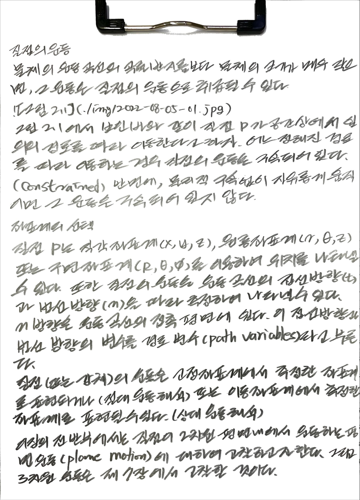
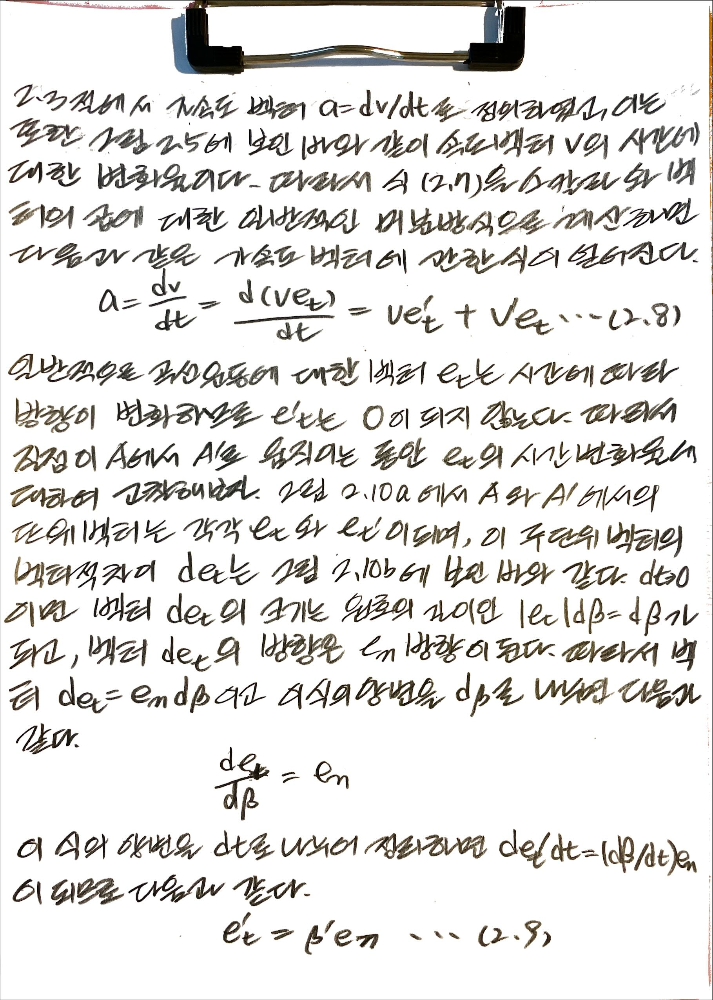
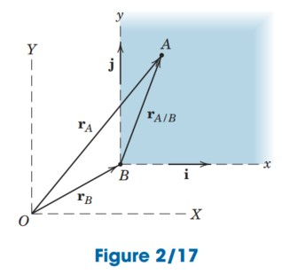
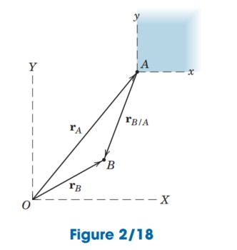
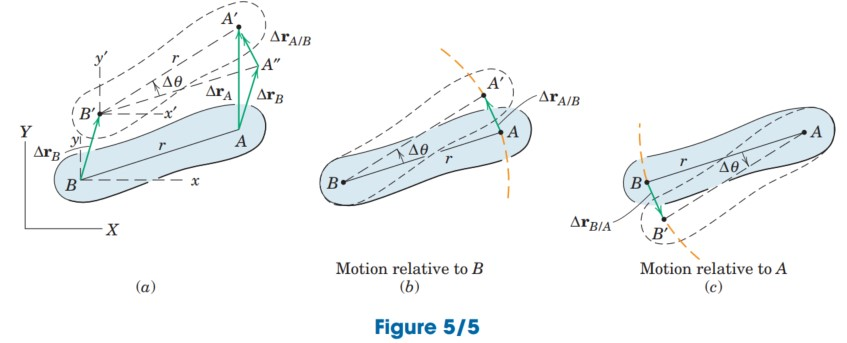

# book: Dynamics

- J.L Meriam, L.G Kraige, J.N Bolton, ...
- http://www.kocw.net/home/cview.do?cid=3732f38ae2ffbb35

## 1. 동역학의 개요

(아래 포함)

### 1.2 기본 개념

(아래 포함)

## 2. 질점의 운동학

(아래 포함)

### 2.1 서론

### 2.2 직선운동

### 2.3 평면 곡선 운동

### 2.4 직각좌표계 (x-y)

### 2.5 법선 접선 좌표계 (n-t)

### 2.6 극좌표계 (r - $\theta$ )

### 2.7 3차원 공간곡선운동

### 2.8 상대운동(축의 병진이동)

### 2.9 연결된 질점의 구속운동

## 5. 강체의 평면 운동학 (Plane Kinematics of Rigid Bodies)

### 5.1 서론 (introduction)

### 5.2 회전 (rotation)

(아래 포함)

### 5.3 절대운동 (absolute motion)

### 5.4 상대 속도 (relative velocity)

### 5.5 영속도의 순간중심 (instantaneous center of zero velocity)

### 5.6 상대가속도 (relative acceleration)

### 5.7 회전축에 대한 운동 (Motion relative to rotating axes)

