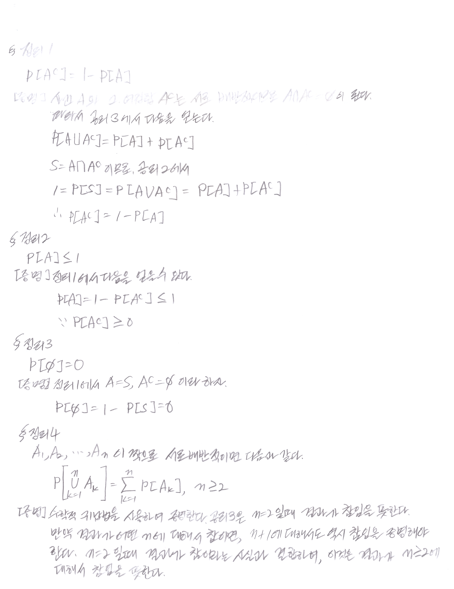
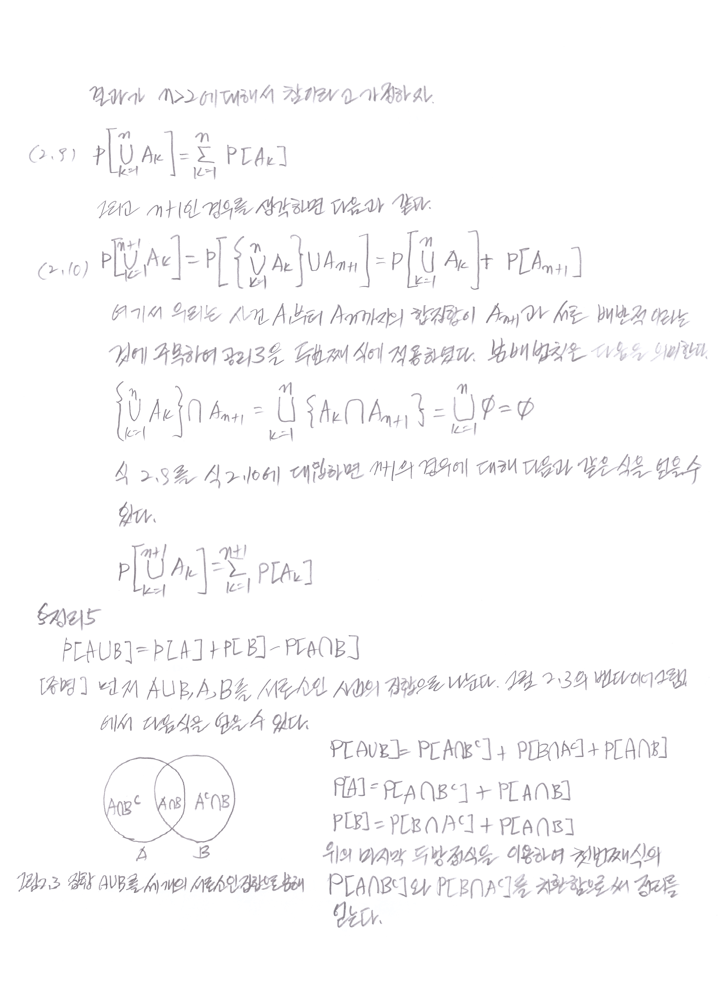
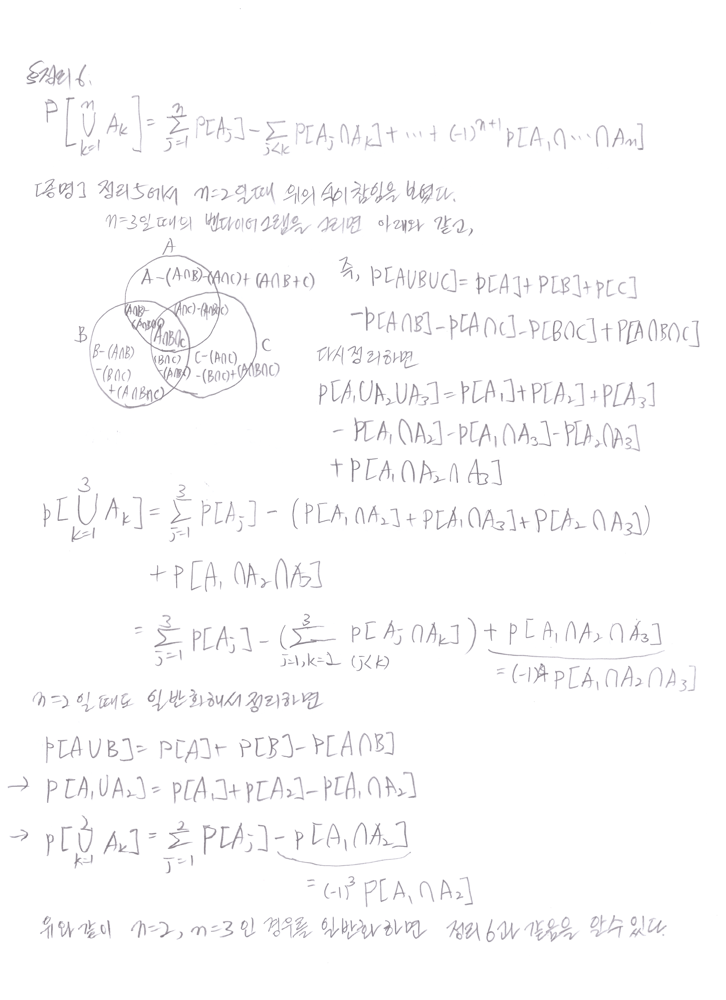
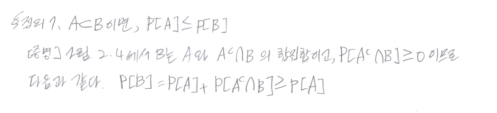

# book: Probability, Statistics, and Random Processes for Electrical Engineeering 3rd
- Albrto Leon-Garcia
- http://www.kocw.net/home/cview.do?cid=33b341dd3b50640d

## Chapter 1. Probability models in electrical and computer engineering

### Notation

- $\exists$ : exist
- $\forall$ : all, arbitrary(임의의), since(그런데)
- A s.t(such that) B: B를 만족하는 A
- & (and), or, $\therefore$ (therefore), $\because$ (because)
- def: definition, thm: theorem, sol: solution, pf: proof
- $\mathbb{N}$ : 자연수 집합, $\mathbb{Z}$ : 정수 집합, $\mathbb{Q}$ : 유리수 집합, $\mathbb{R}$ : 실수, $\mathbb{C}$ : 복소수

#### 1.1 분석과 설계 도구로서의 수리적 모델(모형)

모델은 실제 상황을 근사적으로 표현한 것이다. 수학적 모델은 관측 현상이 측정 가능할 때 쓰인다.

- 수학 모형
    + deterministic model(결정모형): exact outcome
        * circuit theory[e.g. 키르히호프의 방정식]
    + probability model(확률모형): unpredictablee outcome

#### 1.2 결정 모델

결정모델에서는 실험이 수해오디는 조건이 실험의 정확한 결과를 결정한다.

#### 1.3 확률모델

우리가 관심을 갖는 많은 시스템은 예측 불가능한 변이와 불규칙성을 나타내는 현상을 수반한다. 우리는 같은 조건에서 실험을 반복할 때 결과가 예측 불가능한 식으로 다양하게 나오는 실험일 경우 이것을 확률 실험이라 정의한다. 

## Chapter 2. Basic concepts of probability theroy

### 2.1 확률 실험의 기술

확률 실험은 실험이 같은 조건에서 반복될 때 그 결과가 예측할 수 없는 방식으로 변하는 실험이다. 

#### 2.1.1 표본 공간 (sample space)

확률실험의 표본공간 S는 모든 가능한 결과들의 집합으로 정의된다.

##### Note

For a set S, 
if S: finite set or $\mathbb{N} \Rightarrow S$

###### Countable set

- $\mathbb{N}$
- $\mathbb{Z}$

###### Uncountable set

- $\mathbb{R}$
- $\mathbb{Q}$
- $\mathbb{C}$

##### 표본공간의 분류

- 표본공간의 원소의 수에 따른 분류
    + 유한 표본 공간
    + 무한 표본 공간
        * 가산 무한 표본 공간
        * 비가산 무한 표본 공간

- 연속/불연속에 따른 분류
    + 이산 표본 공간
        * 유한 표본 공간
        * 가산 무한 표본 공간
    + 연속 표본 공간
        * 비가산 무한 표본 공간

#### 2.1.2 사건(event)

사건은 표본 공간의 부분집합

- 공사건(null event)
- 확실한 사건
- 불가능한 사건

#### 2.1.3 집합이론의 복습

skip

#### 2.1.4 사건 클래스

사건의 클래스는 사건들(집합들)의 모임(집합)을 의미한다. 즉, '집합들의 집합'을 말한다.

유한  표본 공간(finite sample space) $S = \\{1, 2, \cdots, k\\}$ 에 대해, 보통 S의 모든 부분집합을 사건이라고 한다. 이러한 사건의 클래스를 S의 멱집합(power set)이라고 부르고, S로 나타낼 것이다. 이진수 $i_1, i_2, \cdots, i_k$ 로 S의 모든 가능한 부분집합을 나타낼 수 있고, $2^k$ 개의 항을 가진 S의 멱집합을 구할 수 있다. 이러한 이유로 멱집합은 $S = 2^S$ 로도 나타낸다.

### 2.2 확률의 공리

확률은 실험이 수행될 때 사건들이 얼마나 '일어날 가능성이 있는지'를 나타내는, 사건에 할당되는 수다 확률 실험에 대한 확률법칙은 사건 클래스 $\mathscr{F}$ 에 속한 실험의 사건에 확률을 할당하는 규칙이다. 따라서 확률법칙은 집합(사건)에 수를 할당하는 함수가 된다. 확률의 공리(the axioms of probability)는 확률법칙이 이러한 특성을 만족해야 한다고 공식적으로 말한다.

- 공리 1. $0 /leq P[A]$
- 공리 2. $P[S] = 1$
- 공리 3. $A \cap B = \phi$ 이면 $P[A \cup B] = P[A] + P[B]$
- 공리 3'. 사건 $A_1, A_2, \cdots$ 이 모든 $i \neq j$ 에 대해 $A_i \cap A_j = \phi$ 인 일련의 사건이라면, $P\left[\cup_{k=1}^{\infty}A_k\right] = \sum_{k=1}^{\infty}P[A_k]$

