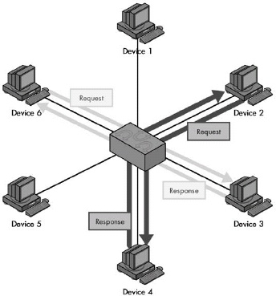
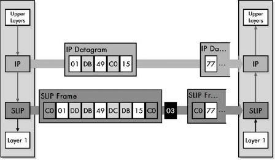
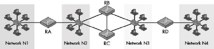
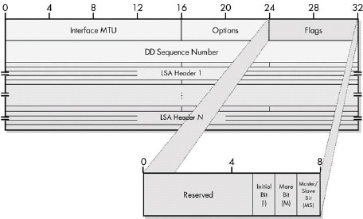
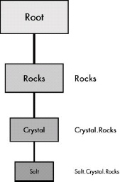

# Book: The TCP/IP guide by Charles M. Kozierok

## Chapter 1. Networking Introduction, Characteristics, and Types
A networking protocol defines a set of rules, algorithms, messages, and other mechanisms that enables software and hardware in networked devices to communicate effectively. A protocol usually describes a means for communication between corresponding entities at the same OSI Reference Model layer in two or more devices.

### Circuit switching

Figure 1-1. Circuit switching In a circuit-switched network, before communication can occur between two devices, a circuit is established between them. This is shown as a darker line for the conduit of data from Device A to Device B, and a matching lighter line from B back to A. Once it's set up, all communication between these devices takes place over this circuit, even though there are other possible ways that data could conceivably be passed over the network of devices between them. Contrast this diagram to Figure 1-2.

### Packet switching

Figure 1-2. Packet switching In a packet-switched network, no circuit is set up prior to sending data between devices. Blocks of data, even from the same file or communication, may take any number of paths as they journey from one device to another. Compare this to Figure 1-1.

One way that networking technologies are categorized is based on the path used to carry data between devices. In circuit switching, a circuit is first established and then used to carry all data between devices. In packet switching, no fixed path is created between devices that communicate; it is broken into packets, each of which may take a separate path from sender to recipient.

### Connection-Oriented and Connectionless Protocols
A connection-oriented protocol is one in which a logical connection is first established between devices prior to data being sent. In a connectionless protocol, data is just sent without a connection being created.

Circuit-switched networking technologies are inherently connection-oriented, but not all connection-oriented technologies use circuit switching. Logical connection-oriented protocols can be implemented on top of packet-switching networks to provide higher-layer services to applications that require connections.

### Messages: Packets, Frames, Datagrams, and Cells
Communication between devices on packet-switched networks is based on items most generically called messages. These pieces of information also go by other names such as packets, datagrams, frames, and cells, which often correspond to protocols at particular layers of the OSI Reference Model. The formal OSI terms for messages are protocol data unit (PDU) and service data unit (SDU).

### Message Formatting: Headers, Payloads, and Footers

Figure 1-3. Network message formatting In the most general of terms, a message consists of a data payload that will be communicated, bracketed by a set of header and footer fields. The data of any particular message sent in a networking protocol will itself contain an encapsulated higher-layer message containing a header, data, and a footer. This "nesting" can occur many times as data is passed down a protocol stack. The header is found in most protocol messages; the footer only in some.

The general format of a networking message consists of a header, followed by the data or payload of the message, followed optionally by a footer. Header and footer information is functionally the same except for its position in the message; footer fields are only sometimes used, especially in cases where the data in the field is calculated based on the values of the data being transmitted.

### Message Addressing and Transmission Methods: Unicast, Broadcast, and Multicast

Figure 1-4. Unicast, multicast, and broadcast message addressing and transmission The three basic types of addressing and message delivery in networking are illustrated in this simplified LAN. Device 6 is sending a unicast message to Device 2, shown as the dark, heavy arrow. Device 4 is sending a multicast message to multicast group X, shown as the medium-weight arrows. In this case, that group includes Devices 1 and 3, which are highlighted. Finally, Device 5 is sending a broadcast message, which goes to all other devices on the LAN, shown as the thin, faint arrows.

Three basic methods are used to address and transmit data between networked devices. A unicast transmission goes from one device to exactly one other; this is the most common method used for most message transactions. A broadcast transmission is sent from one device to all connected devices on a network. A multicast transmission is addressed and sent to a select group of devices.

### Network Structural Models and Client-Server and Peer-to-Peer Networking
Networks are usually configured to share resources using one of two basic structural models. In a peer-to-peer network, each device is an equal, and none are assigned particular jobs. In a client-server network, however, devices are assigned particular roles—a small number of powerful computers are set up as servers and respond to requests from the other devices, which are clients. Client-server computing also refers to the interaction between complementary protocol elements and software programs. It's rising in popularity due to its prevalence in TCP/IP and Internet applications.

Figure 1-5. Peer-to-peer networking In this model, each device on the network is treated as a peer, or equal. Each device can send requests and responses, and none are specifically designated as performing a particular role. This model is more often used in very small networks. Contrast this with Figure 1-6.

Figure 1-6. Client-server networking In the client-server model, a small number of devices are designated as servers and equipped with special hardware and software that allows them to interact efficiently and simultaneously with multiple client machines. Though the clients can still interact with each other, most of the time they send requests of various sorts to the server, and the server sends back responses to them. Contrast this with the peer-to-peer networking example in Figure 1-5.

### Types and Sizes of Networks
Networks are often divided by size and general communication method into three classes. Local area networks (LANs) generally connect proximate devices, usually using cables. Wireless LANs (WLANs) are like cabled LANs but use radio frequency or light technology to connect devices without wires. Wide area networks (WANs) connect distant devices or LANs to each other. Campus area networks (CANs) and metropolitan area networks (MANs) fall between LANs and WANs in terms of overall size. Personal area networks (PANs) are like very small LANs and often appear as wireless PANs (WPANs).

### Segments, Networks, Subnetworks, and Internetworks
Several terms are often used to describe the relative sizes of networks and parts of networks. The most basic term is network itself, which can refer to most anything, but often means a set of devices connected using an OSI layer 2 technology. A subnetwork is a part of a network (or internetwork), as is a segment, though the latter often has a more specific meaning in certain technologies. An internetwork refers either generically to a very large network, or specifically, to a set of layer 2 networks connected using routers at layer 3.

### The Internet, Intranets, and Extranets
The generic noun internet is a short form for the word internetwork, while the proper noun Internet refers to the global internetwork of TCP/IP networks that we all know and use. The term intranet refers to an internal network that uses TCP/IP technologies as the Internet does. An extranet is like an intranet that is extended to individuals or organizations outside the company. All these terms can be used ambiguously, so you must take care to determine exactly what they mean in any given context.

## Chapter 5. GENERAL OSI REFERENCE MODEL ISSUES AND CONCEPTS

### History of the OSI Reference Model
The Open Systems Interconnection Reference Model (OSI Reference Model or OSI model) was originally created as the basis for designing a universal set of protocols called the OSI protocol suite. This suite never achieved widespread success, but the model became a very useful tool for both education and development. The model defines a set of layers and a number of concepts for their use that make understanding networks easier.

### General Reference Model Issues
#### The Benefits of Networking Models
Networking models such as the OSI Reference Model provide a framework for breaking down complex internetworks into components that can more easily be understood and utilized. The model defines networking functions not as a large, complicated whole, but as a set of layered, modular components, each of which is responsible for a particular function. The result is better comprehension of network operations, improved performance and functionality, easier design and development, and the ability to combine different components in a way that's best suited to the needs of the network.

#### Why Understanding the OSI Reference Model Is Important to You
While many people scoff at the notion of studying the OSI Reference Model, understanding it is very helpful in making sense of networking protocols and technologies. The model is theoretical, but its concepts are employed regularly to describe the operation of real-world networks.

#### How to Use the OSI Reference Model
It is just as much a mistake to assign too much importance to the OSI Reference Model as too little. While the model defines a framework for understanding networks, not all networking components, protocols, and technologies will necessarily fall into the model's strict layering architecture. There are cases in which trying to use the model to describe certain concepts can lead to less clarity rather than more. You should remember that the OSI model is a tool and should be used accordingly.

### Key OSI Reference Model Concepts
#### OSI Reference Model Networking Layers, Sublayers, and Layer Groupings
The most fundamental concept in the OSI Reference Model is the division of networking functions into a set of layers, from layer 1 at the bottom to layer 7 at the top. As you go up the layer stack, you move away from concrete, hardware-specific functions to ones that are increasingly abstract, until you reach the realm of user applications at layer 7. The seven layers are sometimes divided into groupings: the lower layers (1 through 3) and the upper layers (4 through 7). There is some disagreement on whether layer 4 is a lower or upper layer.

Figure 5-1. OSI Reference Model layers The OSI Reference Model divides networking functions into a stack of seven layers, numbered 1 through 7 from the bottom up, and sometimes divided into two layer groupings—the lower layers and the upper layers.

The four lower layers of the OSI model are most often discussed individually, because the boundaries between them are reasonably clear-cut. In contrast, the lines between the session, presentation, and application layers are somewhat blurry. As a result, sometimes protocols span two or even all three of these layers; this is especially true of TCP/IP application protocols, since the TCP/IP model treats layers 5 through 7 as a single layer.

#### Data Encapsulation, Protocol Data Units (PDUs), and Service Data Units (SDUs)

Figure 5-5. OSI Reference Model data encapsulation Each protocol creates a protocol data unit (PDU) for transmission, each of which includes headers required by that protocol and data to be transmitted. This data becomes the service data unit (SDU) of the next layer below it.

The message used to communicate information for a particular protocol is called its protocol data unit (PDU) in OSI model terminology. That PDU is passed down to the next lower layer for transmission; since that layer is providing the service of handling that PDU, it is called the lower layer's service data unit (SDU). The SDU is encapsulated into that layer's own PDU and, in turn, sent to the next lower layer in the stack, proceeding until the physical layer is reached. The process is reversed on the recipient device. In summary, a layer N PDU is a layer N-1 SDU, which is encapsulated into a layer N-1 PDU.

## Chapter 6. OSI REFERENCE MODEL LAYERS
### Physical Layer (Layer 1)
The lowest layer in the OSI Reference Model is the physical layer. It is the realm of networking hardware specifications, and is the place where technologies that perform data encoding, signaling, transmission, and reception functions reside. The physical layer is closely related to the data link layer.

### Data Link Layer (Layer 2)
The second OSI Reference Model layer is the data link layer. This is where most LAN and wireless LAN technologies are defined. Layer 2 is responsible for logical link control (LLC), media access control (MAC), hardware addressing, error detection and handling, and defining physical layer standards. It is often divided into the LLC and MAC sublayers based on the IEEE 802 Project that uses that architecture.

### Network Layer (Layer 3)
The OSI Reference Model's third layer is the network layer. This is one of the most important layers in the model; it is responsible for the tasks that link together individual networks into internetworks. Network layer functions include internetwork-level addressing, routing, datagram encapsulation, fragmentation and reassembly, and certain types of error handling and diagnostics. The network layer and transport layer are closely related to each other.

### Transport Layer (Layer 4)
The fourth and middle OSI Reference Model layer is the transport layer. This layer represents the transition point between the lower layers that deal with data delivery issues, and the higher ones that work with application software. The transport layer is responsible for enabling end-to-end communication between application processes, which it accomplishes in part through the use of process-level addressing and multiplexing or demultiplexing. Transport layer protocols are responsible for segmenting application data into blocks for transmission and may be either connection-oriented or connectionless. Protocols at this layer also often provide data delivery management services such as reliability and flow control.

### Session Layer (Layer 5)
The fifth layer in the OSI Reference Model layer is the session layer. As its name suggests, it is the layer intended to provide functions for establishing and managing sessions between software processes. Session layer technologies are often implemented as sets of software tools called application program interfaces (APIs), which provide a consistent set of services that allow programmers to develop networking applications without needing to worry about lower-level details of transport, addressing, and delivery.

### Presentation Layer (Layer 6)
The sixth OSI model layer is the presentation layer. Protocols at this layer take care of manipulation tasks that transform data from one representation to another, such as translation, compression, and encryption. In many cases, no such functions are required in a particular networking stack; if so, there may not be any protocol active at layer 6, so layer 7 may deal with layer 5.

### Application Layer (Layer 7)
The application layer is the seventh and highest layer in the OSI Reference Model. Application protocols that implement specific user applications and other high-level functions are defined at this layer. Since they are at the top of the stack, application protocols are the only ones that do not provide services to a higher layer; they use services provided by the layers below.

## Chapter 8. TCP/IP PROTOCOL SUITE AND ARCHITECTURE

### TCP/IP History and Development
TCP/IP was initially developed in the 1970s as part of an effort to define a set of technologies to operate the fledgling Internet. The name TCP/IP came about when the original Transmission Control Program (TCP) was split into the Transmission Control Protocol (TCP) and Internet Protocol (IP). The first modern versions of these two key protocols were documented in 1980 as TCP version 4 and IP version 4, respectively.

### Important Factors in the Success of TCP/IP
While TCP/IP is not the only internetworking protocol suite, it is definitely the most important one. Its unparalleled success is due to a wide variety of factors. These include its technical features, such as its routing-friendly design and scalability, its historical role as the protocol suite of the Internet, and its open standards and development process, which reduce barriers to acceptance of TCP/IP protocols.

### TCP/IP Architecture and the TCP/IP Model
The architecture of the TCP/IP protocol suite is often described in terms of a layered reference model called the TCP/IP model, DARPA model, or DoD model. The TCP/IP model includes four layers: the network interface layer (responsible for interfacing the suite to the physical hardware on which it runs), the Internet layer (where device addressing, basic datagram communication, and routing take place), the host-to-host transport layer (where connections are managed and reliable communication is ensured), and the application layer (where end-user applications and services reside). The first three layers correspond to layers 2 through 4 of the OSI Reference Model respectively; the application layer is equivalent to OSI layers 5 to 7.

### TCP/IP Protocols

Figure 8-3. TCP/IP protocols This diagram shows all the TCP/IP protocols covered in this book, arranged by TCP/IP and OSI Reference Model layer (with the exception of the administration utilities).

## Chapter 9. TCP/IP SERIAL LINE INTERNET PROTOCOL (SLIP) AND POINT-TO-POINT PROTOCOL (PPP) OVERVIEW AND FUNDAMENTALS

### SLIP versus PPP
SLIP and PPP provide layer 2 connectivity for TCP/IP implementations that run directly over a physical layer link without a layer 2 technology. While SLIP is simpler, PPP is favored due to its many features and capabilities.

### Serial Line Internet Protocol (SLIP)
SLIP provides a layer 2 framing service for IP datagrams but no other features or capabilities.

SLIP was designated nonstandard because it was developed as a very rudimentary, stopgap measure to provide layer 2 framing when needed. SLIP is so simple that there really isn't much to standardize. Too, it has so many deficiencies that the Internet Engineering Task Force (IETF) apparently didn't want to formalize it as a standard. RFC 1055 specifically mentions various problems with SLIP (as I'll discuss later in this chapter) and the fact that work was already under way to define PPP as a more capable successor to SLIP.

#### SLIP Data Framing Method and General Operation
SLIP does the following:
1. Breaks an IP datagram into bytes
2. Sends the END character (value 192) after the last byte of the datagram; in better implementations, it sends the END character before the first byte as well
3. Replaces any byte to be sent in the datagram that is 192 with 219 220
4. Replaces any byte to be sent that is 219 with 219 221

Figure 9-1. Operation of the Serial Line Internet Protocol (SLIP) SLIP's only function is to frame data from layer 3 (usually IP datagrams) by surrounding them with END characters and replacing special characters as needed.

#### Problems and Limitations of SLIP
- SLIP's maximum supported datagram size is not standardized and depends on each implementation.
- SLIP doesn't provide any way of detecting or correcting errors in transmissions.
- SLIP offers no way for the two devices to communicate control information that may be required to manage the link.
- Since SLIP includes no headers of its own, it is not possible to identify that SLIP is being used.
- Devices do need some way of learning each other's IP addresses for routing at layer 3. SLIP provides no method for this.
- SLIP provides no compression features.
- SLIP lacks even basic security features, with no means for authenticating connections or encrypting data.

### Point-to-Point Protocol (PPP) Overview and Fundamentals

Figure 9-2. PPP location in the TCP/IP architecture PPP is the interface between the IP and a physical link such as a serial line or dial-up networking connection. This corresponds to layer 2 in the OSI Reference Model.

PPP is a complete link layer protocol suite for devices using TCP/IP. It provides framing, encapsulation, authentication, quality monitoring, and other features that enable robust operation of TCP/IP over a variety of physical layer connections.

#### General Operation
1. **Link Setup and Configuration**: Before the two devices can exchange information, they must make contact and set up a link between them. During link setup, the devices agree on all the parameters needed to manage the operation of the link. LCP begins this process and invokes the help of support protocols as needed, for options like authentication. Once the link is set up, in order to complete link setup, the appropriate NCP is called for whatever layer 3 technology is being carried on the link.
2. **Link Operation**: The devices use the link to send datagrams. Each device transmits by encapsulating layer 3 datagrams and sending them down to layer 1 to be transmitted. Each device receives by taking PPP frames sent up from its own physical layer, stripping off the PPP header and passing the datagram up to layer 3. Where appropriate, optional protocols are used at this stage to offer features such as compression (CCP).
3. **Link Termination**: When either device decides that it no longer wants to communicate, it terminates the link.

Figure 9-3. Overview of PPP operation In simplest terms, PPP consists of only three basic steps: link setup, link operation, and link termination.

#### PPP Link Setup and Phases

Figure 9-4. PPP phases A PPP connection follows a mainly linear sequence of transitions from the Link Dead Phase through the Link Open Phase.

## Chapter 13. ADDRESS RESOLUTION AND THE TCP/IP ADDRESS RESOLUTION PROTOCOL (ARP)

Figure 13-1. Why address resolution is necessary Even though conceptually the client and server are directly connected at layer 3, in reality, information passing between them goes over multiple layer 2 links. In this example, a client on the local network is accessing a server somewhere on the Internet. Logically, this connection can be made directly between the client and server, but in reality, it is a sequence of physical links at layer 2. In this case, there are six such links, most of them between routers that lie between the client and server. At each step, the decision of where to send the data is made based on a layer 3 address, but the actual transmission must be performed using the layer 2 address of the next intended recipient in the route.

Address resolution is required because internetworked devices communicate logically using layer 3 addresses, but the actual transmissions between devices take place using layer 2 (hardware) addresses.

### Address Resolution Through Direct Mapping

Figure 13-2. Address resolution through direct mapping With a small hardware address size, you can easily map each hardware address to a layer 3 address. As you can see in this figure, when the hardware address is small, it is easy to define a mapping that directly corresponds to a portion of a layer 3 address. In this example, an 8-bit MAC address, such as the one used for ARCNet, is mapped to the last byte of the device's IP address, thereby making address resolution a trivial matter.

When the layer 2 address is smaller than the layer 3 address, it is possible to define a direct mapping between them so that the hardware address can be determined directly from the network layer address. This makes address resolution extremely simple, but reduces flexibility in how addresses are assigned.

Figure 13-3. Address resolution problems with large hardware address size Direct mapping is impossible when the layer 2 address is larger in size than the layer 3 address.

### Dynamic Address Resolution

Figure 13-4. Dynamic address resolution The device that wants to send data broadcasts a request asking for a response with a hardware address from the other device. Device A needs to send data to Device B, but knows only its IP address (IPB) and not its hardware address. Device A broadcasts a request asking to be sent the hardware address of the device using the IP address IPB. Device B responds back to Device A directly with the hardware address.

Dynamic address resolution is usually implemented using a special protocol. A device that knows only the network layer address of another device can use this protocol to request the other device's hardware address.

### TCP/IP Address Resolution Protocol (ARP)
ARP was developed to facilitate dynamic address resolution between IP and Ethernet and can now be used on other layer 2 technologies as well. It works by allowing an IP device to send a broadcast on the local network, and it requests a response with a hardware address from another device on the same local network.

#### ARP General Operation

Figure 13-5. Address Resolution Protocol (ARP) transaction process ARP works by having the source device broadcast a request to find the destination, which responds using a reply message. ARP caches are also consulted and updated as needed.

ARP is a relatively simple request-and-reply protocol. The source device broadcasts an ARP Request that's looking for a particular device based on the device's IP address. That device responds with its hardware address in an ARP Reply message.

#### ARP Message 
##### ARP Message Format

Figure 13-6. ARP message format

|Field Name |Size (Bytes) |Description |
|:---        |:---          |:---         |
|HRD |2 |Hardware Type: This field specifies the type of hardware used for the local network transmitting the ARP message; thus, it also identifies the type of addressing used. Some of the most common values for this field are shown in Table 13-2. |
|PRO |2 |Protocol Type: This field is the complement of the Hardware Type field, specifying the type of layer 3 addresses used in the message. For IPv4 addresses, this value is 2048 (0800 hex), which corresponds to the EtherType code for IP. |
|HLN |1 |Hardware Address Length: Specifies how long hardware addresses are in this message. For Ethernet or other networks using IEEE 802 MAC addresses, the value is 6. |
|PLN |1 |Protocol Address Length: Again, the complement of the preceding field; specifies how long protocol (layer 3) addresses are in this message. For IPv4 addresses, this value is 4. |
|OP |2 |Opcode: This field specifies the nature of the ARP message being sent. The first two values (1 and 2) are used for regular ARP. Numerous other values are also defined to support other protocols that use the ARP frame format, such as RARP, as shown in Table 13-3. Some protocols are more widely used than others. |
|SHA |Variable, equals value in HLN field |Sender Hardware Address: The hardware (layer 2) address of the device sending this message, which is the IP datagram source device on a request, and the IP datagram destination on a reply. |
|SPA |Variable, equals value in PLN field |Sender Protocol Address: The IP address of the device sending this message. |
|THA |Variable, equals value in HLN field |Target Hardware Address: The hardware (layer 2) address of the device this message is being sent to. This is the IP datagram destination device on a request, and the IP datagram source on a reply. |
|TPA |Variable, equals value in PLN field |Target Protocol Address: The IP address of the device this message is being sent to. |

##### ARP Hard Type(HRD) Field Values
|Hardware Type (HRD) Value |Hardware Type |
|:---  |:--- |
|1 |Ethernet (10 Mb) |
|6 |IEEE 802 Networks |
|7 |ARCNeT |
|15 |Frame Relay |
|16 |Asynchronous Transfer Mode (ATM) |
|17 |HDLC |
|18 |Fibre Channel |
|19 |Asynchronous Transfer Mode (ATM) |
|20 |Serial Line |

##### ARP Opcode (OP) Field Values
|Opcode |ARP Message Type |
|:--- |:--- |
|1 |ARP Request |
|2 |ARP Reply |
|3 |RARP Request |
|4 |RARP Reply |
|5 |DRARP Request |
|6 |DRARP Reply |
|7 |DRARP Error |
|8 |InARP Request |
|9 |InARP Reply |

### Proxy ARP
Since ARP relies on broadcasts for address resolution, and broadcasts are not propagated beyond a physical network, ARP cannot function between devices on different physical networks. When such operation is required, a device, such as a router, can be configured as an ARP proxy to respond to ARP requests on the behalf of a device on a different network.

Figure 13-7. ARP Proxy operation These two examples show how a router acting as an ARP proxy returns its own hardware address in response to requests by one device for an address on the other network. In this small internetwork shown, a single router connects two LANs that are on the same IP network or subnet. The router will not pass ARP broadcasts, but has been configured to act as an ARP proxy. In this example, Device A and Device D are each trying to send an IP datagram to the other, and so each broadcasts an ARP Request. The router responds to the request sent by Device A as if it were Device D, giving to Device A its own hardware address (without propagating Device A's broadcast). It will forward the message sent by Device A to Device D on Device D's network. Similarly, it responds to Device D as if it were Device A, giving its own address, then forwarding what Device D sends to it over to the network where Device A is located.

### TCP/IP Address Resolution for IP Multicast Addresses
IP multicast addresses are resolved to IEEE 802 (Ethernet) MAC addresses using a direct mapping technique that uses 23 of the 28 bits in the IP multicast group address.

Figure 13-8. Mapping of multicast IP Addresses to IEEE 802 multicast MAC addresses Multicast IP addresses are mapped to IEEE 802 multicast MAC addresses by copying the IANA multicast OUI value (01-00-5E) to the top 24 bits, setting the 25th bit to zero, and copying the bottom 23 bits of the multicast address to the remaining 23 bits. To create a 48-bit multicast IEEE 802 (Ethernet) address, the top 24 bits are filled in with the IANA's multicast OUI, 01-00-5E. The 25th bit is zero, and the bottom 23 bits of the multicast group are put into the bottom 23 bits of the MAC address. This leaves 5 bits (shown hatched) that are not mapped to the MAC address, meaning that 32 different IP addresses may have the same mapped multicast MAC address.

### TCP/IP Address Resolution for IP Version 6
Address resolution in IPv6 uses the new Neighbor Discovery (ND) Protocol instead of the Address Resolution Protocol (ARP). A device trying to send an IPv6 datagram sends a Neighbor Solicitation message to get the address of another device, which responds with a Neighbor Advertisement. When possible, to improve efficiency, the request is sent using a special type of multicast address rather than broadcast.

## Chapter 14. REVERSE ADDRESS RESOLUTION AND THE TCP/IP REVERSE ADDRESS RESOLUTION PROTOCOL (RARP)
The Reverse Address Resolution Protocol (RARP) is the earliest and simplest protocol that's designed to allow a device to obtain an IP address for use on a TCP/IP network. It is based directly on ARP and works in basically the same way, but in reverse: A device sends a request containing its hardware address, and a device set up as an RARP server responds back with the device's assigned IP address

Figure 14-1. Operation of the Reverse Address Resolution Protocol (RARP) RARP works like ARP but in reverse; a device broadcasts its hardware address and an RARP server responds with its IP address. Here, instead of Device A providing the IP address of another device and asking for its hardware address, it is providing its own hardware address and asking for an IP address it can use. The answer, in this case, is provided by Device D, which is serving as an RARP server for this network.

### RARP General Operation

Figure 14-2. Reverse Address Resolution Protocol (RARP) operation RARP consists of the exchange of one broadcast request message and one unicast reply message.

The importance of host configuration has increased dramatically since the early 1980s. Many organizations assign IP addresses dynamically even for hosts that have disk storage, because of the many advantages this provides in administration and because of the efficient use of address space. For this reason, RARP has been replaced by two more capable technologies that operate at higher layers in the TCP/IP protocol stack: BOOTP and DHCP.

## Chapter 15. INTERNET PROTOCOL VERSIONS, CONCEPTS, AND OVERVIEW
### IP Overview and Key Operational Characteristics

Figure 15-1. The main function of IP: internetwork datagram delivery IP's overall responsibility is to deliver data between devices on unconnected networks. This figure shows how IP delivers datagrams from one device to another over an internetwork; in this case, a distant client and server communicate with each other by passing IP datagrams over a series of interconnected networks.

While the Internet Protocol has many functions and characteristics, it can be boiled down to one primary purpose: the delivery of datagrams across an internetwork of connected networks.

### IP Versions and Version Numbers
Version 4 of the Internet Protocol (IP) is actually the first version that was widely deployed and is currently the one in widespread use.

## Chapter 16. IPV4 ADDRESSING CONCEPTS AND ISSUES
### IP Addressing Overview and Fundamentals

Figure 16-1. IP interfaces for common network devices Regular hosts have one interface; routers usually have more than one; and switches have none (because they operate at layer 2).

IP addresses serve the dual function of device identification and routing. Each network interface requires one IP address, which is network specific. IP addresses can be either statically or dynamically allocated, and come in unicast, multicast, and broadcast forms.

### IP Address Size, Address Space, and Notation
IP addresses are 32-bit binary numbers, which can be expressed in binary, hexadecimal, or decimal form. Most commonly, they are expressed by dividing the 32 bits into four bytes and converting each to decimal, then separating these numbers with dots to create dotted decimal notation.

Figure 16-2. IP address binary, hexadecimal, and dotted decimal representations The binary, hexadecimal, and decimal representations of an IP address are all equivalent.

Since IP addresses are 32 bits long, the total address space of IPv4 is 232 or 4,294,967,296 addresses. However, not all of these addresses can be used, for a variety of reasons.

### IP Basic Address Structure and Main Components

Figure 16-3. Basic IP address division: network ID and host ID This diagram shows one of the many ways to divide an IP address into a network ID and host ID.

Figure 16-4. Mid-octet IP address division IP addresses need not be divided between network ID and host ID on octet boundaries. The division here is into a 20-bit network ID and a 12-bit host ID.

The basic structure of an IP address consists of two components: the network ID and host ID. The dividing point of the 32-bit address is not fixed, but depends on a number of factors and can occur in a variety of places, including in the middle of a dotted-decimal octet.

### IP Addressing Categories and IP Address Adjuncts
An essential factor in determining how an IP address is interpreted is the addressing scheme in which it is used. The three methods, arranged in increasing order of age, complexity, and flexibility, are classful addressing, subnetted classful addressing, and classless addressing.

### Number of IP Addresses and Multihoming
A host with more than one IP network interface is said to be multihomed. A multihomed device can have multiple connections to the same network, to different networks, or both. A host connected to two networks can be configured to function as a router.

### IP Address Management and Assignment Methods and Authorities

Figure 16-5. Multihomed devices on an IP internetwork This internetwork consists of two LANs, A (above) and B (below). LAN A has a multihomed workstation, shown with two IP network interface "circles." The two LANs are connected together through a multihomed, shared server that has been configured to route traffic between them. Note that this server also handles all traffic passing between LAN B and the Internet (since the Internet connection is in LAN A only).

## Chapter 17. CLASSFUL (CONVENTIONAL) ADDRESSING
### IP Classful Addressing Overview and Address Classes
#### IP Address Classes and Class Characteristics and Uses
|IP Address Class |Fraction of Total IP Address Space |Number of Network ID Bits |Number of Host ID Bits |Intended Use |
|:--- |:--- |:--- |:--- |:--- |
|Class A |1/2 |8 |24 |Unicast addressing for very large organizations with hundreds of thousands or millions of hosts to connect to the Internet |
|Class B |1/4 |16 |16 |Unicast addressing for medium to large organizations with many hundreds to thousands of hosts to connect to the Internet |
|Class C |1/8 |24 |8 |Unicast addressing for smaller organizations with no more than about 250 hosts to connect to the Internet |
|Class D |1/16 |n/a |n/a |IP multicasting |
|Class E |1/16 |n/a |n/a |Reserved for experimental use |

Figure 17-1. Division of IPv4 address space into classes

The classful IP addressing scheme divides the IP address space into five classes, A through E, of differing sizes. Classes A, B, and C are the most important ones, designated for conventional unicast addresses and taking up seven-eighths of the address space. Class D is reserved for IP multicasting, and Class E is reserved for experimental use.

### IP Classful Addressing Network and Host Identification and Address Ranges

Figure 17-2. Class determination algorithm for classful IP addresses The simplicity of the classful IP addressing can be seen in the very uncomplicated algorithm used to determine the class of an address.

#### IP Address Class Bit Patterns, First-Octet Ranges, and Address Ranges
|IP Address Class |First Octet of IP Address |Lowest Value of First Octet (Binary) |Highest Value of First Octet (Binary) |Range of First Octet Values (Decimal) |Octets in Network ID/Host ID |Theoretical IP Address Range |
|:--- |:--- |:--- |:--- |:--- |:--- |:--- |
|Class A |0xxx xxxx |0000 0001 |0111 1110 |1 to 126 |1 / 3 |1.0.0.0 to 126.255.255.255 |
|Class B |10xx xxxx |1000 0000 |1011 1111 |128 to 191 |2 / 2 |128.0.0.0 to 191.255.255.255 |
|Class C |110x xxxx |1100 0000 |1101 1111 |192 to 223 |3 / 1 |192.0.0.0 to 223.255.255.255 |
|Class D |1110 xxxx |1110 0000 |1110 1111 |224 to 239 |— |224.0.0.0 to 239.255.255.255 |
|Class E |1111 xxxx |1111 0000 |1111 1111 |240 to 255 |— |240.0.0.0 to 255.255.255.255 |

Figure 17-3. IP address class bit assignments and network/host ID sizes This illustration shows how the 32 bits of IP address are assigned for each of the five IP address classes. Classes A, B, and C are the normal classes used for regular unicast addresses; each has a different dividing point between the network ID and host ID. Classes D and E are special and are not divided in this manner.

In the classful IP addressing scheme, the class of an IP address is identified by looking at the first one, two, three, or four bits of the address. This can be done both by humans working with these addresses and routers making routing decisions. The use of these bit patterns means that IP addresses in different classes fall into particular address ranges that allow an address's class to be determined by looking at the first byte of its dotted decimal address.

### IP Address Class A, B, and C Network and Host Capacities

#### IP Address Class Network and Host Capacities
|IP Address Class |Total # of Bits for Network ID/Host ID |First Octet of IP Address |# of Network ID Bits Used To Identify Class |Usable # of Network ID Bits |Number of Possible Network IDs |# of Host IDs Per Network ID |
|:--- |:--- |:--- |:--- |:--- |:--- |:--- |
|Class A |8/24 |0xxx xxxx |1 |8-1 = 7 |27-2 = 126 |224-2 = 16,277,214 |
|Class B |16/16 |10xx xxxx |2 |16-2 = 14 |214 = 16,384 |216-2 = 65,534
|Class C |24/8 |110x xxxx |3 |24-3 = 21 |221 = 2,097,152 |28-2 = 254 |

In the classful IP addressing scheme, a Class A network contains addresses for about 16 million network interfaces; a Class B network contains about 65,000; and a Class C network contains 254.

#### IP Addresses with Special Meanings
When the network ID or host ID of an IP address is replaced by a pattern of all ones or all zeros, the result is an address with a special meaning. Examples of such addresses include "all hosts" broadcast addresses and addresses that refer to a specific host or a whole network.

##### IP Address Patterns with Special Meanings
|Network ID |Host ID |Class A Example |Class B Example |Class C Example |Special Meaning and Description |
|:--- |:--- |:--- |:--- |:--- |:--- |
|Network ID |Host ID |77.91.215.5 |154.3.99.6 |227.82.157.160 |Normal Meaning: Refers to a specific device. |
|Network ID |All Zeros |77.0.0.0 |154.3.0.0 |227.82.157.0 |The Specified Network: This notation, with a 0 at the end of the address, refers to an entire network. |
|All Zeros |Host ID |0.91.215.5 |0.0.99.6 |0.0.0.160 |Specified Host on This Network: This addresses a host on the current or default network when the network ID is not known or when it doesn't need to be explicitly stated. |
|All Zeros |All Zeros |0.0.0.0 | | |Me: Used by a device to refer to itself when it doesn't know its own IP address. (Alternatively, "this host," or "the current/default host.") The most common use is when a device attempts to determine its address using a host-configuration protocol like DHCP. May also be used to indicate that any address of a multihomed host may be used. |
|Network ID |All Ones |77.255.255.255 |154.3.255.255 |227.82.157.255 |All Hosts on the Specified Network: Used for broadcasting to all hosts on the local network. |
|All Ones |All Ones |255.255.255.255 | | |All Hosts on the Network: Specifies a global broadcast to all hosts on the directly connected network. Note that there is no address that would imply sending to all hosts everywhere on the global Internet, since this would be very inefficient and costly. |

The missing combination from this table is that of the network ID being all ones and the host ID normal. Semantically, this would refer to "all hosts of a specific ID on all networks," which doesn't really mean anything useful in practice, so it's not used. Note also that, in theory, a special address where the network ID is all zeros and the host ID is all ones would have the same meaning as the all-ones limited broadcast address. The latter is used instead, however, because it is more general, not requiring knowledge of where the division is between the network ID and the host ID.

#### IP Reserved, Private, and Loopback Addresses
Private address blocks were created to allow private IP Internets to be created using addresses that were guaranteed not to conflict with public IP addresses. They are commonly used in internetworks that aren't connected to the global Internet; devices using them can also access the global Internet by using NAT.

#### Loopback Addresses
Portions of the IP address space are set aside for reserved, private, and loopback addresses.

#### IP Multicast Addressing

##### IP Multicast Address Ranges and Uses
|Range Start Address |Range End Address |Description |
|:--- |:--- |:--- |
|224.0.0.0 |224.0.0.255 |Reserved for special well-known multicast addresses |
|224.0.1.0 |238.255.255.255 |Globally scoped (Internetwide) multicast addresses. |
|239.0.0.0 |239.255.255.255 |Administratively scoped (local) multicast addresses |

Figure 17-4. IP Multicast address ranges and uses All multicast addresses begin with 1110. The well-known group has zeros for the first 20 bits of the multicast group address, with 8 bits available to define 255 special multicast addresses. Multicast addresses starting with 1110 1111 are locally scoped; all other addresses are globally scoped (this includes addresses starting with 1110 0000 other than the 255 well-known addresses).

##### Well-Known Multicast Addresses
|Range Start Address |Description |
|:--- |:--- |
|224.0.0.0 |Reserved; not used |
|224.0.0.1 |All devices on the subnet |
|224.0.0.2 |All routers on the subnet |
|224.0.0.3 |Reserved |
|224.0.0.4 |All routers using DVMRP |
|224.0.0.5 |All routers using OSPF |
|224.0.0.6 |Designated routers using OSPF |
|224.0.0.9 |Designated routers using RIP-2 |
|224.0.0.11 |Mobile agents (for Mobile IP) |
|224.0.0.12 |DHCP server/relay agent |

#### Problems with Classful IP Addressing

Figure 17-5. The main problem with classful addressing In this scale diagram, each square represents 50 available addresses. Since a Class C address has only 254 addresses, and a Class B contains 65,534 addresses, an organization with 5,000 hosts is caught in the middle. It can only choose to either waste 90 percent of a Class B address or use 20 different Class C networks.

## Chapter 18. IP SUBNET ADDRESSING (SUBNETTING) CONCEPTS
Subnet addressing adds an additional hierarchical level to how IP addresses are interpreted by dividing an organization's IP network into subnets. This allows each organization to structure its address space to match its internal physical networks, rather than being forced to treat them a flat block. This solves a number of problems with the original classful addressing scheme, but requires changes to how addressing and routing work, as well as modifications to several TCP/IP protocols.

### IP Subnetting: Three-Level Hierarchical IP Subnet Addressing
A classful network is subnetted by dividing its host ID portion, leaving some of the bits for the host ID while allocating others to a new subnet ID. These bits are then used to identify individual subnets within the network, into which hosts are assigned.

Figure 18-1. Subnetting Class B network We begin with the Class B network 154.71.0.0, which has 16 bits in its host ID block. We then subnet this network by dividing the host ID into a subnet ID and host ID. In this case, 5 bits have been allocated to the subnet ID, leaving 11 bits for the host ID.

### IP Subnet Masks, Notation, and Subnet Calculations
The subnet mask is a 32-bit binary number that accompanies an IP address. It is created so that it has a one bit for each corresponding bit of the IP address that is part of its network ID or subnet ID, and a zero for each bit of the IP address's host ID. The mask thus tells TCP/IP devices which bits in that IP address belong to the network ID and subnet ID, and which are part of the host ID.

To use a subnet mask, a device performs a boolean AND operation between each bit of the subnet mask and each corresponding bit of an IP address. The resulting 32-bit number contains only the network ID and subnet ID of the address, with the host ID cleared to zero.

#### Subnet Mask Notation

Figure 18-2. Determining the subnet mask of a subnetted network The Class B network from Figure 18-1 is shown at the top, with 5 bits assigned to the subnet ID and 11 bits left for the host ID. To create the subnet mask, you fill in a 32-bit number with 1 for each network ID and subnet ID bit, and 0 for each host ID bit. You can then convert this to dotted decimal.

#### Applying the Subnet Mask: An Example

Figure 18-3. Determining the subnet ID of an IP address through subnet masking Subnet masking involves performing a boolean AND between each corresponding bit in the subnet mask and the IP address. The subnet mask can be likened to a physical mask; each 1 in it lets the corresponding bit of the IP address show through, while each 0 blocks the corresponding IP address bit. In this way the host ID bits of the address are stripped so the device can determine the subnet to which the address belongs.

The subnet mask is often expressed in dotted decimal notation for convenience, but is used by computers as a binary number and usually must be expressed in binary to understand how the mask works and the number of subnet ID bits it represents.

### IP Default Subnet Masks for Address Classes A, B, and C

Figure 18-4. Default subnet masks for Class A, Class B, and Class C networks

Each of the three IP unicast and broadcast address classes, A, B, and C, has a default subnet mask defined that has a one for each bit of the class's network ID, a zero for each bit of its host ID, and no subnet ID bits. The three default subnet masks are 255.0.0.0 for Class A, 255.255.0.0 for Class B, and 255.255.255.0 for Class C.

### IP Custom Subnet Masks
The fundamental trade-off in subnetting is that each addition of a bit to the subnet ID (and thus, subtraction of that bit from the host ID) doubles the number of subnets, and approximately halves the number of hosts in each subnet. Each subtraction of a bit from the subnet ID (and addition of that bit to the host ID) does the opposite.

Figure 18-5. Custom subnet masks for Class C networks Since there are host ID bits in a Class C network address, there are six different ways that the network can be subnetted. Each corresponds to a different custom subnet mask, which is created by changing the allocated subnet ID bits from zero to one.

The number of hosts allowed in each subnet is the binary power of the number of host ID bits remaining after subnetting, less two. The reduction by two occurs because the all-zeros and all-ones host IDs within each subnet are reserved for two special meaning addresses: to refer to the subnetwork itself and to refer to its local broadcast address. In some implementations, the number of subnets is also reduced by two because the all-zeros and all-ones subnet IDs were originally not allowed to be used.

### IP Subnet Identifiers, Subnet Addresses, and Host Addresses
The subnet identifier of a subnet is just its subnet ID. The subnet address of a subnet is determined by substituting its subnet ID into the subnet bits of the overall network address.

## Chapter 21. INTERNET PROTOCOL DATAGRAM ENCAPSULATION AND FORMATTING

Figure 21-1. IP datagram encapsulation The upper-layer message is packaged into a TCP or UDP message, which becomes the payload of an IP datagram. The IP datagram is then passed down to layer 2, where it is encapsulated in a LAN, WAN, or WLAN frame. It is then converted to bits and transmitted at the physical layer.

### IP Datagram General Format
#### Internet Protocol Version 4 (IPv4) Datagram Format
|Field Name |Size (Bytes) |Description |
|:--- |:--- |:--- |
|Version |1/2 (4 bits) |Identifies the version of IP used to generate the datagram. For IPv4, this is the number 4. This field ensures compatibility between devices that may be running different versions of IP. In general, a device running an older version of IP will reject datagrams created by newer implementations, under the assumption that the older version may not be able to interpret the newer datagram correctly. |
|IHL |1/2 (4 bits) |Specifies the length of the IP header, in 32-bit words. This includes the length of any options fields and padding. The normal value of this field when no options are used is 5 (5 32-bit words = 5*4 = 20 bytes). Contrast this with the longer Total Length field in this table. |
|TOS |1 |A field designed to carry information to provide quality-of-service features, such as prioritized delivery for IP datagrams. This has not been as widely used as originally defined, and its meaning has been redefined for use by a technique called Differentiated Services (DS), as discussed in the "IP Datagram Type of Service (TOS) Field" section of this chapter. |
|TL |2 |Specifies the total length of the IP datagram, in bytes. Since this field is 16 bits wide, the maximum length of an IP datagram is 65,535 bytes, though most are much smaller. |
|Identification |2 |This field contains a 16-bit value that is common to each of the fragments belonging to a particular message; for datagrams originally sent unfragmented, it is still filled in so it can be used if the datagram must be fragmented by a router during delivery. The recipient uses this field to reassemble messages without accidentally mixing fragments from different messages. This is needed because fragments may arrive from multiple messages mixed together, since IP datagrams can be received out of order from any device. (See the discussion of IP message fragmentation in Chapter 22.) |
|Flags |3/8 (3 bits) |Three control flags, two of which are used to manage fragmentation (as described in the topic on fragmentation), and one that is reserved. |
|Fragment Offset |1 5/8 (13 bits) |When fragmentation of a message occurs, this field specifies the offset, or position, in the message where the data in this fragment goes in units of eight bytes (64 bits). The first fragment has an offset of 0. (See the discussion of fragmentation in Chapter 27 for a description of how the field is used.) |
|TTL |1 |This specifies how long the datagram is allowed to live on the network, in router hops. Each router decrements the value of the TTL field (reduces it by one) prior to transmitting it. If the TTL field drops to zero, the datagram is assumed to have taken too long a route and is discarded. (See the "IP Datagram Time to Live (TTL) Field" section later in this chapter for more information.) |
|Protocol |1 |Identifies the higher-layer protocol (generally either a transport layer protocol or encapsulated network layer protocol) carried in the datagram. |
|Header Checksum |2 |A checksum is computed over the header to provide basic protection against corruption in transmission. This is not the more complex cyclic redundancy check (CRC) code that's typically used by data link layer technologies such as Ethernet; it's just a 16-bit checksum. It is calculated by dividing the header bytes into words (a word is two bytes) and then adding them together. Only the header is checksummed; not the data. At each hop, the device receiving the datagram does the same checksum calculation, and if there is a mismatch, it discards the datagram as damaged. |
|Source Address |4 |This is the 32-bit IP address of the originator of the datagram. Note that even though intermediate devices such as routers may handle the datagram, they do not normally put their address into this field—the address is always that of the device that originally sent the datagram. |
|Destination Address |4 |This is the 32-bit IP address of the intended recipient of the datagram. Again, even though devices such as routers may be the intermediate targets of the datagram, this field is always used to specify the ultimate destination. |
|Options |Variable |One or more of several types of options may be included after the standard headers in certain IP datagrams, as discussed later in this chapter, in the "IP Datagram Options and Option Format" section. |
|Padding |Variable |If one or more options are included, and the number of bits used for them is not a multiple of 32, enough 0 bits are added to pad out the header to a multiple of 32 bits (four bytes). |
|Data |Variable |This is the data that will be transmitted in the datagram. It is either an entire higher-layer message or a fragment of one. |

#### IPv4 Flags Subfields
|Value (Hexadecimal) |Value (Decimal) |Protocol |
|:--- |:--- |:--- |
|00 |0 |Reserved |
|01 |1 |ICMP |
|02 |2 |IGMP |
|03 |3 |GGP |
|04 |4 |IP-in-IP Encapsulation |
|06 |6 |TCP |
|08 |8 |EGP |
|11 |17 |UDP |
|32 |50 |Encapsulating Security Payload (ESP) Extension Header |
|33 |51 |Authentication Header (AH) Extension Header |

IPv4 datagram format This diagram shows the all-important IPv4 datagram format. The first 20 bytes are the fixed IP header, followed by an optional Options section, and a variable-length Data area. Note that the Type of Service field is shown as originally defined in the IPv4 standard.

#### Original Definition of IPv4 Type of Service (TOS) Field
|Subfield Name |Size (Bytes) |Description |
|:--- |:--- |:--- |
|Precedence |3/8 (3 bits) |A field indicating the priority of the datagram. There were eight defined values, from lowest to highest priority:<ul><li>000: Routine<li/><li>001: Priority</li><li>010: Immediate</li><li>011: Flash</li><li>100: Flash Override</li><li>101: CRITIC/ECP</li><li>110: Internetwork Control</li><li>111: Network Control</li></ul> |
|D |1/8 (1 bit) |Set to 0 to request normal delay in delivery; set to 1 if a low delay delivery is requested. |
|T |1/8 (1 bit) |Set to 0 to request normal delivery throughput; set to 1 if higher throughput delivery is requested. |
|R |1/8 (1 bit) |Set to 0 to request normal reliability in delivery; set to 1 if higher reliability delivery is  requested. |
|Reserved |2/8 (2 bits) |Not used. |

### IP Datagram Options and Option Format

#### IPv4 Option Format
|Subfield Name |Size (Bytes) |Description |
|:--- |:--- |:--- |
|Option Type |1 |The Option Type subfield is divided into three subsubfields. |
|Option Length |0 or 1 |For variable-length options, indicates the size of the entire option, including all three subfields shown here, in bytes. |
|Option Data |0 or variable |For variable-length options, contains data to be sent as part of the option. |

#### IPv4 Options: Option Type Subfields
|Sub-Subfield Name |Size (Bytes) |Description |
|:--- |:--- |:--- |
|Copied Flag |1/8 (1 bit) |This bit is set to 1 if the option is intended to be copied into all fragments when a datagram is fragmented; it is cleared to 0 if the option should not be copied into fragments. |
|Option Class |2/8 (2 bits) |Specifies one of four potential values that indicate the general category into which the option belongs. In fact, only two of the values are used: 0 is for Control options, and 2 for Debugging and Measurement. |
|Option Number |5/8 (5 bits) |Specifies the kind of option. 32 different values can be specified for each of the two option classes. Of these, a few are more commonly employed. |

Figure 21-3. IPv4 Options field format This diagram shows the full field format for an IPv4 option. Note that a few simple options may consist of only the Option Type subfield, with the Option Length and Option Data subfields omitted.

#### Common IPv4 Options
|Option Class |Option Number |Length (Bytes) |Option Name |Description |
|0 |0 |1 |End of Options List |An option containing just a single zero byte, used to mark the end of a list of options. |
|0 |1 |1 |No Operation |A "dummy option" used as internal padding to align certain options on a 32-bit boundary when required. |
|0 |2 |11 |Security |An option provided for the military to indicate the security classification of IP datagrams. |
|0 |3 |Variable |Loose Source Route |One of two options for source routing of IP datagrams. |
|0 |7 |Variable |Record Route |Allows the route used by a datagram to be recorded within the header for the datagram itself. If a source device sends a datagram with this option in it, each router that handles the datagram adds its IP address to this option. The recipient can then extract the list of IP addresses to see the route taken by the datagram. Note that the length of this option is set by the originating device. It cannot be enlarged as the datagram is routed, and if it fills up before it arrives at its destination, only a partial route will be recorded. |
|0 |9 |Variable |Strict Source Route |One of two options for source routing of IP datagrams. |
|2 |4 |Variable |Timestamp |Works similar to the Record Route option, but each device puts in a timestamp, so the recipient can see how long it took for the datagram to travel between routers. As with the Record Route option, the length of this option is set by the originating device and cannot be enlarged by intermediate devices. |
|2 |18 |12 |Traceroute |Used in the enhanced implementation of the traceroute utility, as described in RFC 1393. Also see Chapter 33, which discusses ICMP traceroute messages. |

Each IPv4 datagram has a 20-byte mandatory header and may also include one or more options. Each option has its own field format, and most are variable in size.

## Chapter 22. IP DATAGRAM SIZE, FRAGMENTATION, AND REASSEMBLY

### IP Datagram Size, MTU, and Fragmentation Overview
The size of the largest IP datagram that can be transmitted over a physical network is called that network's maximum transmission unit (MTU). If a datagram is passed from a network with a high MTU to one with a low MTU, it must be fragmented to fit the other network's smaller MTU.

Figure 22-1. IP maximum transmission unit (MTU) and fragmentation In this simple example, Device A is sending to Device B over a small internetwork consisting of one router and two physical links. The link from Device A to the router has an MTU of 3,300 bytes, but from the router to Device B, it is only 1,300 bytes. Thus, any IP datagrams larger than 1,300 bytes will need to be fragmented.

Figure 22-2. IPv4 datagram fragmentation. This example illustrates a two-step fragmentation of a large IP datagram. The boxes represent datagrams or datagram fragments and are shown to scale. The original datagram is 12,000 bytes, represented by the large, gray box. To transmit this data over the first local link, Device A splits it into four fragments, shown on the left. The first router must fragment each of these into smaller fragments to send them over the 1,300-byte MTU link, as shown on the bottom. Note that the second router does not reassemble the 1,300-byte fragments, even though its link to Device B has an MTU of 3,300 bytes. (The "IP Fragmentation Process" section later in this chapter describes the process by which the fragments in this example are created.)

### IP Message Fragmentation Process

Figure 22-3. IPv4 datagram fragmentation process In this diagram, the MF and Fragment Offset fields of each fragment are shown for reference. The Data fields are shown to scale (the length of each is proportional to the number of bytes in the fragment).

When an MTU requirement forces a datagram to be fragmented, it is split into several smaller IP datagrams, each containing part of the original. The header of the original datagram is changed into the header of the first fragment, and new headers are created for the other fragments. Each is set to the same Identification value to mark them as part of the same original datagram. The Fragment Offset of each is set to the location where the fragment belongs in the original. The More Fragments field is set to 1 for all fragments but the last, to let the recipient know when it has received all the fragments.

### IP Message Reassembly
Reassembly is complete when the entire buffer has been filled and the fragment with the More Fragments bit set to 0 is received, indicating that it is the last fragment of the datagram. The reassembled datagram is then processed in the same way as a normal, unfragmented datagram. On the other hand, if the timer for the reassembly expires with any of the fragments missing, the message cannot be reconstructed. The fragments are discarded, and an ICMP Time Exceeded message is generated. Since IP is unreliable, it relies on higher-layer protocols such as the Transmission Control Protocol (TCP) to determine that the message was not properly received and then retransmit it.

## Chapter 23. IP ROUTING AND MULTICASTING

### IP Datagram Delivery

Figure 23-1. Direct and indirect (routed) delivery of IP datagrams This diagram shows three examples of IP datagram delivery. The first transmission (#1, dark arrow) shows a direct delivery between two devices on the local network. The second (#2, light arrow) shows indirect delivery within the local network, between a client and server separated by a router. The third (#3, medium arrow) shows a more distant indirect delivery, between a client on the local network and a server across the Internet.

The delivery of IP datagrams is divided into two categories: direct and indirect. Direct delivery is possible when two devices are on the same physical network. When they are not, indirect delivery, more commonly called routing, is required to get the datagrams from the source to the destination. A device can tell which type of delivery is required by looking at the IP address of the destination, in conjunction with supplemental information such as the subnet mask, which tells the device what network or subnet it is on.

### IP Routing Concepts and the Process of Next-Hop Routing
Indirect delivery of IP datagrams is accomplished using a process called next-hop routing, where each message is handed from one router to the next until it reaches the network of the destination. The main advantage of this is that each router needs to know only which neighboring router should be the next recipient of a given datagram, rather than needing to know the exact route to every destination network.

Figure 23-2. IP datagram next-hop routing This is the same diagram as that shown in Figure 23-1, except it explicitly shows the hops taken by each of the three sample transmissions. The direct delivery of the first transmission has only one hop (remember that the switch doesn't count because it is invisible at layer 3). The local indirect delivery passes through one router, so it has two hops. The Internet delivery has six hops. (Actual Internet routes can be much longer.)

### IP Routes and Routing Tables
A router make decisions about how to route datagrams using its internal routing table. The table contains entries specifying to which router datagrams should be sent in order to reach a particular network.

Figure 23-3. IP routing and routing tables This diagram shows a small, simple internetwork consisting of four LANs each served by a router. The routing table for each lists the router to which datagrams for each destination network should be sent. Notice that due to the triangle, R1, R2, and R3 can send to each other. However, R2 and R3 must send through R1 to deliver to R4, and R4 must use R1 to reach either of the others.

### IP Multicasting
IP multicasting allows special applications to be developed where one device sends information to multiple devices, across a private internetwork or the global Internet. It is more complex than conventional unicast IP and requires special attention, particularly in the areas of addressing and routing.

## Chapter 28. IP NETWORK ADDRESS TRANSLATION (NAT) PROTOCOL

### IP NAT Overview
IP Network Address Translation (IP NAT or NAT) is a technique that allows an organization to set up a network using private addresses, while still allowing for communication on the public Internet. A NAT-capable router translates private to public addresses and vice versa as needed. This allows a small number of public IP addresses to be shared among a large number of devices and provides other benefits as well, but it also has some drawbacks.

### IP NAT Address Terminology
- **Inside Address**: Any device on the organization's private network that is using NAT is said to be on the inside network. Thus, any address that refers to a device on the local network in any form is called an inside address.
- **Outside Address**: The public Internet—that is, everything outside the local network—is considered the outside network. Any address that refers to a public Internet device is an outside address.
- **Local Address**: This term describes an address that appears in a datagram on the inside network, whether it refers to an inside or outside address.
- **Global Address** This term describes an address that appears in a datagram on the outside network, again whether it refers to an inside or outside address.

A NAT router translates local addresses to global ones and vice versa. Thus, an inside local address is translated to an inside global address (and vice versa) and an outside local address is translated to an outside global address (and vice versa).

Figure 28-1. IP Network Address Translation (NAT) terminology Hopefully this diagram will help you to better understand the whole "inside/outside/local/global" thing.

## IP NAT Static and Dynamic Address Mappings
### Static Mappings
A static mapping represents a permanent, fixed relationship defined between a global and a local representation of the address of either an inside or an outside device. For example, you can use a static translation if you want the internal device with an inside local address of 10.0.0.207 to always use the inside global address of 194.54.21.10. Whenever 10.0.0.027 initiates a transaction with the Internet, the NAT router will replace that address with 194.54.21.10.

### Dynamic Mappings
With dynamic mapping, global and local address representations are generated automatically by the NAT router, which is used as needed and then discarded. The most common way that this is employed is in allowing a pool of inside global addresses to be shared by a large number of inside devices.

## IP NAT Unidirectional (Traditional/Outbound) Operation
### Operation of Unidirectional (Traditional/Outbound) NAT
|Step # |Description |Datagram Type |Datagram Source Address |Datagram Destination Address |
|:--- |:--- |:--- |:--- |:--- |
|1 |Inside Client Generates Request and Sends to NAT Router: Device 10.0.0.207 generates an HTTP request that is eventually passed down to IP and encapsulated in an IP datagram. The source address is itself, 10.0.0.207, and the destination is 204.51.16.12. The datagram is sent to the NAT-capable router that connects the organization's internal network to the Internet. |Request (from inside client to outside server) |10.0.0.207 (inside local) |204.51.16.12 (outside local) |
|2 |NAT Router Translates Source Address and Sends to Outside Server: The NAT router realizes that 10.0.0.207 is an inside local address and knows it must substitute an inside global address in order to let the public Internet destination respond. It consults its pool of addresses and sees the next available one is 194.54.21.11. It changes the source address in the datagram from 10.0.0.207 to 194.54.21.11. The destination address is not translated in traditional NAT. In other words, the outside local address and outside global address are the same. |The NAT router puts the mapping from 10.0.0.207 to 194.54.21.11 into its translation table. It sends out the modified datagram, which is eventually routed to the server at 204.51.16.12. |194.54.21.11 (inside global) 204.51.16.12 (outside global) |
|3 |Outside Server Generates Response and Sends Back to NAT Router: The server at 204.51.16.12 generates an HTTP response. It has no idea that NAT was involved; it sees 194.54.21.11 in the request sent to it, so that's where it sends back the response. It is then routed back to the original client's NAT router. |Response (from outside server to inside client) |204.51.16.12 (outside global) |194.54.21.11 (inside global) |
|4 |NAT Router Translates Destination Address and Delivers Datagram to Inside Client: The NAT router sees 194.54.21.11 in the response that arrived from the Internet. It consults its translation table and knows this datagram is intended for 10.0.0.207. This time, the destination address is changed but not the source. It then delivers the datagram back to the originating client. |204.51.16.12 (outside local) |10.0.0.207 (inside local) |

Figure 28-2. Operation of unidirectional (traditional/outbound) NAT You can see the four steps in this process by following the steps in clockwise order. Translated addresses are shown in bold. Refer to Table 28-1 and Figure 28-1 for an explanation of the four address types.

### IP NAT Bidirectional (Two-Way/Inbound) Operation
The basic process (highly simplified) is as follows:
1. The outside device sends a DNS request using the name of the device on the inside network it wishes to reach. For example, it might be www.ilikenat.com.
2. The DNS server for the internal network resolves the www.ilikenat.com name into an inside local address for the device that corresponds to this DNS entry.
3. The inside local address is passed to NAT and used to create a dynamic mapping between the inside local address of the server being accessed from the outside, and an inside global address. This mapping is put into the NAT router's translation table.
4. When the DNS server sends back the name resolution, it tells the outside device the inside global (public) address mapped in the previous step, not the inside local (private) address of the server being sought.

Figure 28-3. Operation of bidirectional (two-way/inbound) NAT This figure is very similar to Figure 28-2, except that the transaction is in reverse, so start at the upper right and go counterclockwise. Translated addresses are shown in bold. Table 28-2 contains a complete explanation of the four steps. Refer to Figure 28-1 for an explanation of address types.

In traditional NAT, a transaction must begin with a request from a client on the local network, but in bidirectional (two-way/inbound) NAT, it is possible for a device on the public Internet to access a local network server. This requires the use of either static mapping or DNS to provide to the outside client the address of the server on the inside network. Then the NAT transaction is pretty much the same as in the unidirectional case, except in reverse: The incoming request has its destination address changed from inside global to inside local; the response has its source changed from inside local to inside global.

### IP NAT Port-Based (Overloaded) Operation
Port-Based or overloaded NAT is an enhancement of regular NAT that allows a large number of devices on a private network to simultaneously share a single inside global address by changing the port numbers used in TCP and UDP messages.

In Port-Based NAT, the NAT router translates the source address and port of an outgoing request from inside local to inside global form. It then transforms the destination address and port of the response from inside global to inside local. The outside local and outside global addresses are the same in both request and reply.

Figure 28-4. Operation of Port-Based (overloaded) NAT This figure is very similar to Table 28-3, except that the source and destination port numbers have been shown, since they are used in this type of NAT. Translated addresses and ports are in bold. Table 28-3 contains a complete explanation of the four steps in Port-Based NAT. Refer to Figure 28-1 for an explanation of address types.

### IP NAT Overlapping/Twice NAT Operation
#### Operation of Overlapping NAT/Twice NAT
|Step # |Description |Datagram Type |Datagram Source Address |Datagram Destination Address |
|:--- |:--- |:--- |:--- |:--- |
|1 |Inside Client Generates Request and Sends to NAT Router: Device 18.0.0.18 generates a request using the destination 172.16.44.55, which it got from the (NAT-intercepted) DNS query for www.twicenat.mit.edu. The datagram is sent to the NAT router for the local network. |Request (from inside client to outside server) |18.0.0.18 (inside local) |172.16.44.55 (outside local) |
|2 |NAT Router Translates Source Address and Destination Address and Sends to Outside Server: The NAT router makes two translations. First, it substitutes the 18.0.0.18 address with a publicly registered address, which is 194.54.21.12 for this example. It then translates the bogus 172.16.44.55 back to the real MIT address for www.twicenat.mit.edu. It routes the datagram to the outside server. | |194.54.21.12 (inside global) |18.1.2.3 (outside global) |
|3 |Outside Server Generates Response and Sends Back to NAT Router: The MIT server at 18.1.2.3 generates a response and sends it back to 194.54.21.12, which causes it to arrive back at the NAT router. |Response (from outside server to inside client) |18.1.2.3 (outside global) |194.54.21.12 (inside global) |
|4 |NAT Router Translates Source Address and Destination Address and Delivers Datagram to the Inside Client: The NAT router translates back the destination address to the actual address that's being used for the inside client, as in regular NAT. It also substitutes back in the 172.16.44.55 value it is using as a substitute for the real address of www.twicenat.mit.edu. | |172.16.44.55 (outside local) |18.0.0.18 (inside local) |

### IP NAT Compatibility Issues and Special Handling Requirements

Figure 28-5. Operation of Overlapping NAT/Twice NAT This figure is very similar to Figure 28-2, except that as you can see, the NAT router translates both source and destination addresses each time (shown in bold). Table 28-4 contains a complete explanation of the four steps in overlapping NAT. Refer to Figure 28-1 for an explanation of address types.

## Chapter 30. INTERNET PROTOCOL MOBILITY SUPPORT (MOBILE IP)

### Mobile IP Overview, History, and Motivation

#### The Problem with Mobile Nodes in TCP/IP

Figure 30-1. The main problem with mobile devices on IP internetworks In this example, a mobile device (the notebook PC) has been moved from its home network in London to another network in Tokyo. A remote client (upper left) decides to send a datagram to the mobile device. However, it has no idea the device has moved. Since it sends by using the mobile node's home address, 71.13.204.20, its request is routed to the router responsible for that network, which is in London. The mobile device isn't there, so the router can't deliver it. Mobile IP solves this problem by giving mobile devices and routers the capability to forward datagrams from one location to another.

The basic problem with supporting mobile devices in IP internetworks is that routing is performed using the IP address. This means the IP address of a device is tied to the network where that the device is located. If a device changes networks, data sent to its old address cannot be delivered by conventional means. Traditional work-arounds, such as routing by the full IP address or changing IP addresses manually, often create more problems.

#### The Solution: Mobile IP
Mobile IP solves the problems associated with devices that change network locations by setting up a system whereby datagrams sent to the mobile node's home location are forwarded to it wherever it may be located. It is particularly useful for wireless devices, but can be used for any device that moves between networks periodically.

### Mobile IP Concepts and General Operation

Figure 30-2. General operation of Mobile IP This diagram is similar to Figure 30-1, except that it shows Mobile IP implemented. The mobile node's home router serves as home agent, and the router in Tokyo serves as the foreign agent. The mobile has been assigned a temporary "care-of" address to use while in Tokyo (which in this case is a co-located care-of address, meaning that it is assigned directly to the mobile node. Figure 30-3 shows the same example using the other type of care-of address). In step 1, the remote client sends a datagram to the mobile using its home address, as in normal TCP/IP. It arrives in London as usual. In step 2, the home agent encapsulates that datagram in a new one and sends it to the mobile node in Tokyo.

Mobile IP operates by setting up the TCP/IP equivalent of a mail-forwarding system. A router on a mobile node's home network serves as the mobile device's home agent, and one on its current network acts as the foreign agent. The home agent receives datagrams destined for the mobile's normal IP address and forwards them to the mobile node's current location, either directly or by sending the datagrams to the foreign agent. The home agent and foreign agent are also responsible for various communication and setup activities that are required for Mobile IP to work.

### Mobile IP Addressing: Home and Care-Of Addresses

Figure 30-3. Mobile IP operation with a foreign agent care-of address This diagram is similar to Figure 30-2, except that instead of the mobile node having a co-located (distinct) IP address, here the mobile node is using a foreign agent care-of address. This means that the node's care-of address is actually that of the foreign agent itself. Step 1 is the same as in Figure 30-2, but in step 2, the home agent forwards not to the mobile node directly, but to the foreign agent (since that router is the one whose IP address the mobile is using). In step 3, the foreign agent strips off the home agent's packaging and delivers the original datagram to the mobile node. This is typically done using whatever layer 2 (LAN or WLAN) technology connects the mobile node and foreign agent.

In Mobile IP, each mobile device uses a temporary care-of address while on a foreign network. A co-located care-of address is one that is assigned directly to the mobile node and enables direct delivery of datagrams to the node. The alternative is to use a foreign agent care-of address. In this situation, the mobile node actually uses the IP address of the foreign agent. Datagrams are sent to the foreign agent, which delivers them to the mobile node.

In Mobile IP, co-located care-of addresses have the advantage of flexibility, but require each device to have a unique IP address on the remote network. Foreign agent care-of addresses have the chief advantage of allowing many mobile devices on a foreign network without each requiring a distinct IP address.

### Mobile IP Agent Discovery
Mobile IP Agent Discovery is the process by which a mobile node determines where it is located and establishes contact with a home or foreign agent. To indicate their capabilities, routers that can function as agents regularly send Agent Advertisement messages, which are modified versions of regular Router Advertisements. To request the sending of an Advertisement, a mobile node can also send an Agent Solicitation, which is the same as a regular Router Solicitation.

Figure 30-4. Mobile IP Mobility Agent Advertisement Extension format This extension appears after the normal fields of a Router Advertisement message, as shown in Chapter 33.

#### Mobile IP Mobility Agent Advertisement Extension Format
|Field Name |Size (Bytes) |Description |
|:--- |:--- |:--- |
|Type |1 |Identifies the Agent Advertisement extension type. For the Mobility Agent Advertisement Extension, it is set to 16. |
|Length |1 |Length of the extension in bytes, excluding the Type and Length fields. Thus, it is equal to 6 plus 4 for each care-of address in the message. |
|Sequence Number |2 |A sequential counter is set to zero when the router initializes and then incremented for each advertisement sent out. |
|Registration Lifetime |2 |The maximum length of time, in seconds, that the agent is willing to accept for registration requests. A value of 65,535 (all ones) means infinite. Note that this field is for registration only and has no relation to the regular Lifetime field in the regular Router Advertisement part of the message. |
|Flags |1 |A one-byte field containing several informational flags that convey specific information about the agent's capabilities and status. There are seven one-bit flags, which, when set, convey the meanings shown in Table 30-2. |
|Reserved |1 |Sent as zero and ignored by recipient. |
|Care-Of Addresses |Variable (4 per address) |Zero or more addresses provided by a foreign agent for a mobile node to use as a foreign agent care-of address. A foreign agent must always provide at least one address in its advertisement. A router that cannot act as a foreign agent will typically omit this field. |

#### Mobile IP Mobility Agent Advertisement Extension Flags
|Subfield Name |Size (Bytes) |Description |
|:--- |:--- |:--- |
|R |1/8 (1 bit) |Registration Required: The mobile node must register through the foreign agent, even when using a co-located care-of address. |
|B |1/8 (1 bit) |Busy: The agent is currently too busy to accept further registrations from mobile nodes. |
|H |1/8 (1 bit) |Home Agent: The agent is willing to function as a home agent on this link (it will forward datagrams, and so on). Note that a device can offer services as both a home agent and a foreign agent. |
|F |1/8 (1 bit) |Foreign Agent: The agent is willing to function as a foreign agent. Again, a device can act as both a home agent and a foreign agent simultaneously.
|M |1/8 (1 bit) |Minimal Encapsulation: The agent can receive tunneled datagrams using minimal encapsulation. |
|G |1/8 (1bit) |GRE Encapsulation: The agent can receive tunneled datagrams using GRE encapsulation. |
|r |1/8 (1 bit) |Reserved: Not used; sent as zero. |
|T |1/8 (1 bit) |Reverse Tunneling: The agent supports reverse tunneling. |

#### Mobile IP Prefix-Lengths Extension Format
|Field Name |Size (Bytes) |Description |
|Type |1 |Identifies the Agent Advertisement extension type. For the Prefix-Lengths Extension, it is set to 19. |
|Length |1 |Length of the extension in bytes, excluding the Type and Length fields. Thus, it is equal to the number of prefix lengths (since each takes 1 byte). |
|Prefix Lengths |Variable (1 per length) |One prefix length number for each router address in the regular, Router Advertisement portion of the Agent Advertisement. |

Figure 30-5. Mobile IP Prefix-Lengths Extension format This extension appears after the normal fields of a Router Advertisement message, as shown in Chapter 33.

### Mobile IP Home Agent Registration and Registration Messages
Mobile IP home agent registration is the process by which a mobility binding is created between a home agent and a traveling mobile node to enable datagram forwarding to be performed. The mobile node that sends a Registration Request message performs registration, and the home agent returns a Registration Reply. The foreign agent may be required to act as a middleman in order to facilitate the transaction, but is otherwise not involved.

#### Mobile IP Registration Request Message Format
|Field Name |Size (Bytes) |Description |
|:--- |:--- |:--- |
|Type |1 |Identifies the registration message type. For a request, this field is 1. |
|Flags |1 |A one-byte field containing several informational flags that convey specific requests that are being made by the mobile node to the home agent. When set, the flags conveys the meanings shown in Table 30-5. |
|Lifetime |2 |Length of time, in seconds, that the mobile node requests from the home agent for this registration. | 
|Home Address |4 |The home (normal) IP address of the mobile node when on its home network. Uniquely identifies the device regardless of how the request is conveyed to the home agent. |
|Home Agent |4 |The IP address of the device acting as the mobile node's home agent. |
|Care-Of Address |4 |The IP address being used by the mobile node as its care-of address. |
|Identification |8 |A 64-bit number that uniquely identifies the Registration Request and is used to match requests to replies. It also provides protection against replay attacks; see the section on Mobile IP security issues later in this chapter for more information.
|Extensions |Variable |Extension fields are included here for authentication of the request. Other extensions may also be included. | 

#### Registration Request Flags
|Subfield Name |Size (Bytes) |Description
|:--- |:--- |:--- |
|S |1/8 (1 bit) |Simultaneous Bindings: Mobile node requests that prior mobility bindings be retained in addition to the one in the current request. |
|B |1/8 (1 bit) |Broadcast Datagrams: Mobile node requests that broadcasts on the home network be forwarded to it. |
|D |1/8 (1 bit) |Decapsulation by Mobile Node: Mobile node is telling the home agent that it will itself decapsulate encapsulated datagrams, as opposed to a foreign agent. In other words, when this is one, the mobile node is using a co-located care-of address; when zero, it is using a foreign agent care-of address. |
|M |1/8 (1 bit) |Minimal Encapsulation: Mobile node requests that home agent use minimal encapsulation for forwarded datagrams. |
|G |1/8 (1 bit) |GRE Encapsulation: Mobile node requests that home agent use GRE encapsulation for forwarded datagrams. |
|r |1/8 (1bit) |Reserved: Not used; sent as zero. |
|T |1/8 (1 bit) |Reverse Tunneling: Mobile node requests that reverse tunneling be used by the home agent. |
|x |1/8 (1 bit) |Reserved: Not used; sent as zero. |

Figure 30-6. Mobile IP Registration Request message format This message is carried in the payload of a User Datagram Protocol (UDP) message, the headers of which are not shown.

#### Mobile IP Registration Reply Message Format
|Field Name |Size (Bytes) |Description |
|:--- |:--- |:--- |
|Type |1 |Identifies the registration message type. For a reply, this field is 3. |
|Code |1 |Indicates the result of the registration request. This field is set to 0 if the registration was accepted, 1 if it was accepted but simultaneous bindings were requested and are not supported. If the registration was denied, a different reason code is provided that indicates the reason for the rejection, as well as whether it was the home agent or foreign agent that denied it. |
|Lifetime |2 |If the registration was accepted, this represents the length of time in seconds until the registration expires. This may be a different value than the mobile node requested. |
|Home Address |4 |The home (normal) IP address of the mobile node when it's on its home network. Uniquely identifies the device regardless of how the request is conveyed to the home agent so that the message can be delivered to it if the same foreign agent serves multiple mobile nodes. |
|Home Agent |4 |The IP address of the device acting as the mobile node's home agent. |
|Identification |8 |A 64-bit number that uniquely identifies the Registration Reply and is matched to the Identification field of the request that precipitated it. |
|Extensions |Variable |Extension fields are included here for the authentication of the reply. Other extensions may also be included. |

Figure 30-7. Mobile IP Registration Reply Message format This message is carried in the payload of a UDP message, the headers of which are not shown.

### Mobile IP Data Encapsulation and Tunneling
Once Mobile IP is set up and operational, it works by having the home agent encapsulate and tunnel received datagrams to the mobile node. The mobile device normally sends datagrams directly to Internet hosts, which respond back to the mobile's home agent, which forwards those datagrams to the mobile node. This means a request/reply communication takes three transmissions.

Figure 30-8. Mobile IP encapsulation and tunneling This example illustrates how a typical request/reply message exchange in Mobile IP results in a triangle of communication. In step 1, the mobile node sends a request to a remote server somewhere on the Internet. It uses its own home address as the source for this request, so in step 2, the reply goes back to the home agent. Step 3 consists of the home agent tunneling the reply back to the mobile node.

An optional feature called reverse tunneling may be used in certain cases, such as when a network does not allow outgoing datagrams with a foreign source IP address. When enabled, rather than sending datagrams directly, the mobile node tunnels all transmissions back to the home agent, which sends them on the Internet.

### Mobile IP and TCP/IP Address Resolution Protocol (ARP) Operation
In theory, problems can occur with hosts on the mobile node's home network that are trying to send datagrams to the host at layer 2. To address these issues, the home agent is required to use proxy ARP to direct such devices to send to the home agent so they can be forwarded. It must also use gratuitous ARP to update any existing ARP caches to that effect.

Figure 30-9. ARP proxying by Mobile IP home agent The home agent must take special steps to deal with transmissions from devices on the local network to the mobile node. In this example (using short hardware addresses for simplicity), the hardware address of the mobile node is 48 and the home agent is 63. A local client on the home network with hardware address 97 sends an ARP Request to find out the hardware address of the mobile node. The home agent responds on the mobile's behalf, specifying not hardware address 48 but rather its own address: 63. The client will thus send to the home agent, which can then forward the data to the mobile node on the foreign network.

### Mobile IP Efficiency Issues

Figure 30-10. A Mobile IP inefficiency worst-case scenario This diagram shows the worst possible case of Mobile IP inefficiency. When a device on the foreign network where the mobile is located tries to send data to the mobile device. The sender here, 210.4.79.11, uses the mobile node's home address so that the transmission must be routed all the way back to London, and then forwarded back to Tokyo, even though the two devices might be sitting on the same desk!

Since datagrams are sent to a Mobile IP at its home address, each datagram sent to the mobile device must first go back to its home network and then be forwarded to its current location. The level of inefficiency that results depends on how far the sender is from the mobile's home network. The worst case actually occurs if the sender and mobile are on the same foreign network, in which case each transmission must make a round-trip to the mobile's home network and then back again.

## Chapter 31. ICMP Concepts and General operation
In TCP/IP, diagnostic, test, and error-reporting functions at the internetwork layer are performed by the Internet Control Message Protocol (ICMP), which is like IP's "administrative assistant." The original version, now called ICMPv4, is used with IPv4, and the newer ICMPv6 is used with IPv6.

### The ICMP Message-Passing Service
ICMP is not like most other TCP/IP protocols in that it does not perform a specific task. It defines a mechanism by which various control messages can be transmitted and received to implement a variety of functions.

### ICMP Error Reporting Limited to the Datagram Source
ICMP error-reporting messages sent in response to a problem seen in an IP datagram can be sent back only to the originating device. Intermediate devices cannot be the recipients of an ICMP message because their addresses are normally not carried in the IP datagram's header.

### ICMP Message Classes
ICMP messages are divided into two general categories: error messages that are used to report problem conditions, and informational messages that are used for diagnostics, testing, and other purposes.

### ICMP Message Types
A total of 256 different possible message types can be defined for each of ICMPv4 and ICMPv6. The Type field that appears in the header of each message specifies the kind of ICMP message. In ICMPv4, there is no relationship between Type value and message type. In ICMPv6, error messages have a Type value of 0 to 127, and informational messages have a Type value of 128 to 255.

### Limitations on ICMP Message Responses
In order to prevent excessive numbers of ICMP messages from being sent on a network, a special set of rules governs when and how they may be created. Most of these are designed to eliminate situations in which very large numbers of ICMP error messages would be generated in response to certain occurrences.

### ICMP Message Processing Conventions
A device receiving an ICMP message is not required to take action unless a protocol using a message type dictates a specific response to a particular message type. In particular, devices are not mandated to perform any specific task when receiving an ICMP error message.

### Original Datagram Inclusion in ICMP Error Messages
Each kind of ICMP message contains data unique to that message type, but all messages are structured according to a common ICMP message format. ICMP error messages always include in their message body field some portion of the original IP datagram that resulted in the error being generated.

## Chapter 32. ICMPV4 ERROR MESSAGE TYPES AND FORMATS

### ICMPv4 Destination Unreachable Messages
ICMPv4 Destination Unreachable messages are used to inform a sending device of a failure to deliver an IP datagram. The message's Code field provides information about the nature of the delivery problem.

### ICMPv4 Source Quench Messages
ICMPv4 Source Quench messages are sent by a device to request that another reduce the rate at which it is sending datagrams. The messages are a rather crude method of flow control compared to more capable mechanisms such as those provided by TCP.

What's interesting about the Source Quench format is that it is basically a null message. It tells the source that the destination is congested but provides no specific information about that situation, nor does it specify what exactly the destination wants the source to do other than cut back on its transmission rate in some way. There is also no method for the destination to signal a source that it is no longer congested, and that the source should resume its prior sending rate. This means the response to a Source Quench message is left up to the device that receives it. Usually, a device will cut back its transmission rate until it no longer receives the messages, and then it may try to slowly increase the rate again.

### ICMPv4 Time Exceeded Messages
ICMPv4 Time Exceeded messages are sent in two different time-related circumstances. The first is if a datagram's Time to Live (TTL) field is reduced to zero, causing it to expire and the datagram to be dropped. The second is when all the pieces of a fragmented message are not received before the expiration of the recipient's reassembly timer.

### ICMPv4 Redirect Messages

Figure 32-5. Host redirection using an ICMP Redirect message In this example, Host H1 sends to Router R1 a datagram destined for Network N2. However, Router R1 notices that Router R2 is on the same network and is a more direct route to Network N2. It forwards the datagram on to Router R2, but also sends an ICMP Redirect message back to Host H1 to tell it to use Router R2 next time.

A router uses ICMPv4 Redirect messages to inform a host of a preferred router that will be used for future datagrams that are sent to a particular host or network. They are not used to alter routes between routers.

### ICMPv4 Parameter Problem Messages
The ICMPv4 Parameter Problem message is a generic catchall that can be used to convey an error of any type in an IP datagram. A special Pointer field is normally used to indicate to the message's recipient where the problem was in the original datagram.

## Chapter 33. ICMPV4 INFORMATIONAL MESSAGE TYPES AND FORMATS
The other class of ICMP messages contains those messages that are informational. They are not sent in response to some issue with a regular IP datagram, but are used on their own to implement various support functions for IP. Informational messages are used for testing and diagnostic purposes, as well as for allowing devices to share critical information that they need to function correctly.

### ICMPv4 Echo (Request) and Echo Reply Messages
ICMPv4 Echo (Request) and Echo Reply messages are used to facilitate network reachability testing. A device can test its ability to perform basic communication with another one by sending an Echo message and waiting for an Echo Reply message to be returned by the other device. **The ping utility (Chatper 88), a widely used diagnostic tool in TCP/IP internetworks, makes use of these messages.**

### ICMPv4 Timestamp (Request) and Timestamp Reply Messages
The creators of TCP/IP recognized that certain applications might not work properly if there were too much differential between the system clocks of a pair of devices. To support this requirement, they created a pair of ICMP messages that allow devices to exchange system time information.

In practice, even with these three timestamp fields, it is difficult to coordinate system clocks over an internetwork, especially a large one like the Internet. The main problem is that the amount of time it takes to send a datagram between any pair of devices varies from one datagram to the next. And again, since IP is unreliable, it's possible that the time for a datagram to be received could be infinite. In fact, it might be lost or dropped by a router.

### ICMPv4 Router Advertisement and Router Solicitation Messages
ICMP Router Advertisement messages are sent regularly by IP routers to inform hosts of their presence and characteristics. This way, hosts know to use them for delivery of datagrams to distant hosts. A host that is new to a network and wants to find out immediately what routers are present may send a Router Solicitation message, which will prompt listening routers to send out Router Advertisement messages.

### ICMPv4 Address Mask Request and Reply Messages
To function properly in a subnetting environment, each host must know the subnet mask that corresponds to each address it is assigned. Without the mask, it cannot properly interpret IP addresses. Just as in determining the identity of a local router, a host can be informed of the local network's subnet mask either manually or automatically. The manual method is to simply manually assign the subnet mask to each host. The automatic method makes use of a pair of ICMP messages designed for subnet mask determination, which were defined in RFC 950, the same standard that defined subnetting itself.

### ICMPv4 Traceroute Messages
ICMP Traceroute messages were designed to provide a more capable way of implementing the traceroute (tracert) utility. However, most TCP/IP implementations still use ICMP Time Exceeded messages for this task.

## Chapter 34. ICMPV6 ERROR MESSAGE TYPES AND FORMATS

### ICMPv6 Destination Unreachable Messages
ICMPv6 Destination Unreachable messages are used in the same manner as the ICMPv4 Destination Unreachable messages: to inform a sending device of a failure to deliver an IP datagram. The message's Code field provides information about the nature of the delivery problem (though the Code values are different from those in ICMPv4).

### ICMPv6 Packet Too Big Messages
In IPv6, routers are not allowed to fragment datagrams that are too large to send over a physical link to which they are connected. An oversized datagram is dropped, and an ICMPv6 Packet Too Big message is sent back to the datagram's originator to inform it of this occurrence.

### ICMPv6 Time Exceeded Messages
Like their ICMPv4 namesakes, ICMPv6 Time Exceeded messages are sent in two different time-related circumstances. The first is if a datagram's Hop Limit field is reduced to zero, thereby causing it to expire and the datagram to be dropped. The second is when all the pieces of a fragmented message are not received before the recipient's reassembly timer expires.

### ICMPv6 Parameter Problem Messages
The ICMPv6 Parameter Problem message is a generic error message that can be used to convey an error of any type in an IP datagram. The Pointer field is used to indicate where the problem was in the original datagram to the recipient of the message.

## Chapter 35. ICMPV6 INFORMATIONAL MESSAGE TYPES AND FORMATS

### ICMPv6 Echo Request and Echo Reply Messages
ICMPv6 Echo Request and Echo Reply messages are used to facilitate network reachability testing. A device tests its ability to communicate with another by sending it an Echo Request message and waiting for an Echo Reply in response. The ping utility, a widely used diagnostic tool in TCP/IP internetworks, makes use of these messages.

### ICMPv6 Router Advertisement and Router Solicitation Messages
ICMPv6 Router Advertisement messages are sent regularly by IPv6 routers to inform hosts of their presence and characteristics, and to provide hosts with parameters that they need to function properly on the local network. A host that wants to find out immediately which routers are present may send a Router Solicitation message, which will prompt listening routers to send out Router Advertisements.

### ICMPv6 Neighbor Advertisement and Neighbor Solicitation Messages
ICMPv6 Neighbor Advertisement and Neighbor Solicitation messages are similar in many ways to the Router Advertisement and Router Solicitation messages. However, rather than being used to communicate parameters from routers to hosts, they are used for various types of communication between hosts on a physical network, such as address resolution, next-hop determination, and neighbor unreachability detection.

### ICMPv6 Redirect Messages
ICMPv6 Redirect messages are used by a router to inform a host of a better router to use for future datagrams that were sent to a particular host or network. They are not used to alter routes between routers, however.

### ICMPv6 Router Renumbering Messages
The renumbering feature in IPv6 is of particular interest to network administrators, since it has the potential to make large network migrations and merges much simpler. In August 2000, the IETF published RFC 2894, "Router Renumbering for IPv6," which describes a similar technique that allows routers in an autonomous system to be renumbered by giving them new prefixes (network identifiers).

### ICMPv6 Informational Message Options
Each of the five ICMPv6 informational message types defined and used by the protocol has an Options field into which one or more options may be inserted.

Each option has its own structure of subfields based on the classic type, length, and value triplet used in many message formats. The Type subfield indicates the option type, and the Length field indicates its length, so that the device processing the option can determine where it ends. The value may be contained in one or more fields, which hold the actual information for which the option is being used.

## Chapter 37. OVERVIEW OF KEY ROUTING PROTOCOL CONCEPTS
Large, modern TCP/IP internetworks can contain thousands of routers. To better manage routing in such an environment, routers are grouped into constructs called autonomous systems (ASes), each of which consists of a group of routers managed independently by a particular organization or entity.

Interior routing protocols are used to share routing information within an autonomous system; each AS may use a different interior routing protocol because the system is, as the name says, autonomous. Exterior routing protocols convey routing data between ASes; each AS must use the same exterior protocol to ensure that it can communicate.

Figure 37-1. TCP/IP autonomous system (AS) routing architecture This diagram shows a simplified Internet organized into three ASes, each of which is managed independently from the others. Communication within each AS is done using an interior routing protocol chosen by that AS's administrators (thin links). Communication between ASes must be done using a common exterior routing protocol (thick links). Internal routers are shown in lighter text, and border routers are shown in black text.

## Chapter 38. ROUTING INFORMATION PROTOCOL (RIP, RIP-2, AND RIPNG)
The Routing Information Protocol (RIP) is one of the oldest and most popular interior routing protocols. With each router, it uses a distance-vector algorithm that maintains a table, which indicates how to reach various networks in the AS and the distance to it in hops. RIP is popular because it is well established and simple, but it has a number of important limitations.

The original version of RIP has the fewest features and is now called RIP-1. RIP-2 was created to add support for classless addressing and other capabilities. RIPng is the version created for compatibility with IPv6.

Figure 38-1. Sample RIP AS This is an example of a simple AS that contains four physical networks and four routers.

1. Router RA sends out an RIP message containing the entry {N1,1} on each of the networks to which it is connected. There are no other routers on Network N1, so nothing happens there. But Routers RB and RC are on Network N2, so they receive the information.
2. Routers RB and RC will look in their routing tables to see if they already have entries for Network N1. Assuming neither does, they will each create a routing table entry {N1,2} for Router RA. This means, "I can reach Network N1 at a cost of 2 hops by sending to Router RA."
3. Routers RB and RC will each send their own routing tables out over the networks to which they are connected: Networks N2 and N3. This will contain the entry {N1,2}. Router RA will receive that message on Network N2 but will ignore it, since it knows it can reach Network N1 directly (cost of 1, which is less than 2). But Router RD will receive the message on Network N3.
4. Router RD will examine its routing table, and seeing no entry for Network N1, it will add the entry {N1,3} for Routers RB or RC. Either one will work, so whichever is chosen depends entirely on whether Router RD received information about Network N1 first from Router RB or Router RC.
5. Router RD will send the entry {N1,3} on Network N4, but there are no other routers there to hear it.

Routing information is propagated between routers in RIP using a simple algorithm. On a regular basis, each router sends out RIP messages that specify which networks it can reach and how many hops it takes to reach them. Other routers directly connected to that one know that they can then reach those networks through that router at a cost of one additional hop. So if Router A sends a message saying it can reach Network X for a cost of N hops, every other router that connects directly to Router A can reach Network X for a cost of N+1 hops. It will put that information into its routing table, unless it knows of an alternate route through another router that has a lower cost.

Figure 38-2. Propagation of network routing information using RIP This composite diagram illustrates the five steps in propagating route information about Network N1 from Router RA to the rest of the AS. In step 1, the information is sent from Router RA to both of its connected networks. In step 2, it reaches Routers RB and RC, which then know they can reach Network N1 through Router RA at a cost of one additional hop. In step 3, these two routers send this information on their networks, and in step 4, it reaches Router RD. In step 5, Router RD sends out the information, but no other routers are around to receive it.

RIP uses two basic message types: the RIP Request and RIP Response. Both are sent using the User Datagram Protocol (UDP). RIP Response messages, despite their name, are used both for routine periodic routing table updates as well as to reply to RIP Request messages. Requests are sent only in special circumstances, such as when a router first joins a network.

Figure 38-3. The RIP counting to infinity problem This composite diagram shows part of the AS illustrated previously in Figure 38-1. The top panel (1) shows the normal state of the network, with Router RB able to reach Network N1 through Router RA at a cost of 2. In panel 2, the link between Router RA and Network N1 is broken. Router RA changes its cost to reach Network N1 to 16 (RIP infinity). In panel 3, before Router RA can send out this update to Router RB, it receives a routine RIP message from Router RB indicating that Network N1 can be reached for a cost of 2. Router RA is then fooled into thinking that it can use Router RB as an alternate route to Network N1, even though Router RB's information originally came from Router RA in the first place. In panel 4, Router RA then sends this bogus information out, which is received by Router RB in panel 5. Router RB then increases its cost to 4, and on its next cycle will send this to Router RA, which will increase its cost to 5, and so on. This cycle will continue, with both routers "counting to infinity" (cost of 16).

One of the most important problems with the operation of RIP is slow convergence, which describes the fact that it can take a long time for information about changes to a network to propagate between routers. One specific instance of this problem is the counting to infinity problem, in which out-of-date information causes many bogus RIP messages to be exchanged between routers about an unreachable network.

Figure 38-4. RIP problem solving using split horizon with poisoned reverse The top panel in this diagram (1) shows the same example as in Figure 38-3. In panel 2, as before, the link between Router RA and Network N1 is broken, just as Router RB is ready to send out its routine update. However, the split horizon with poisoned reverse feature means it sends different messages on its two links. On the network that connects it to Router RA, it sends a route advertisement with a cost of 16. In panel 3, Router RA receives this, which it will discard, ensuring no counting to infinity problem occurs. On Router RA's next cycle, it will update Router RB to tell it that Network N1 is no longer reachable.

Four special features represent changes to RIP operation that ameliorate or eliminate the problems with the operation of the basic protocol. Split horizon and split horizon with poisoned reverse prevent a router from sending invalid route information back to the router from which it originally learned the route. Triggered updates reduce the slow convergence problem by causing the immediate propagation of changed route information. Finally, the hold down feature may be used to provide robustness when information about a failed route is received.

### RIP Version-Specific Message Formats and Features
#### RIP Version 1 (RIP-1) Message Format and Features
RIP-1 was the first version of RIP and is the simplest in terms of operation and features. The bulk of an RIP-1 message consists of sets of RIP entries that specify route addresses and the distance to the route in hops.

##### RIP-1 Message Format
|Field Name |Size (Bytes) |Description |
|:--- |:--- |:--- |
|Command |1 |Command Type: Identifies the type of RIP message being sent. A value of 1 indicates an RIP Request, while 2 means an RIP Response. Originally, three other values and commands were also defined: 3 and 4 for the Traceon and Traceoff commands, and 5, which was reserved for use by Sun Microsystems. These are obsolete and no longer used. |
|Version |1 |Version Number: Set to 1 for RIP version 1. |
|Must Be Zero |2 |Field reserved; value must be set to all zeros. |
|RIP Entries |20 to 500, in increments of 20 |The body of an RIP message consists of 1 to 25 sets of RIP entries. These entries contain the actual route information that the message is conveying. Each entry is 20 bytes long and has the subfields shown in the below RIP-1 RIP Entries table. |

##### RIP-1 RIP Entries
|Subfield Name |Size (Bytes) |Description |
|:--- |:--- |:--- |
|Address Family Identifier |2 |A fancy name for a field that identifies the type of address in the entry. The routers are using IP addresses, for which this field value is 2. |
|Must Be Zero |2 |Field reserved; value must be set to all zeros. |
|IP Address |4 |The address of the route the routers are sending information about. No distinction is made between addresses of different types of devices in RIP, so the address can be for a network, a subnet, or a single host. It is also possible to send an address of all zeros, which is interpreted as the default route for other devices on the network to use for reaching routes with no specified routing entries. This is commonly used to allow a network to access the Internet. |
|Must Be Zero |4 |Field reserved; value must be set to all zeros. | 
|Must Be Zero |4 |Field reserved; value must be set to all zeros. (Yes, two of them in a row.) |
|Metric |4 |The distance for the network indicated by the IP address in the IP Address field. Values of 1 to 15 indicate the number of hops to reach the network, while a value of 16 represents infinity (an unreachable destination). See the general discussion of the RIP algorithm earlier in this chapter for more information about the use of metrics. |

Figure 38-5. RIP-1 message format The RIP-1 message format can contain up to 25 RIP entries. Here, RIP entry 1 is shown with each of its constituent subfields.

#### RIP Version 2 (RIP-2) Message Format and Features
RIP-2 is the most recent version of RIP used in IPv4. It includes a number of enhancements over the original RIP-1, including support for subnet masks and classless addressing, explicit next-hop specification, route tagging, authentication, and multicast. For compatibility, it uses the same basic message format as RIP-1, putting the extra information required for its new features into some of the unused fields of the RIP-1 message format.

##### RIP-2 Message Format
|Field Name  |Size (Bytes) |Description |
|:--- |:--- |:--- |
|Command |1 |Command Type: Identifies the type of RIP message being sent. A value of 1 indicates an RIP Request, while 2 means an RIP Response. |
|Version |1 |Version Number: Set to 2 for RIP version 2. |
|Must Be Zero |2 |Field reserved; value must be set to all zeros. |
|Route Table Entries (RTEs) |20 to 500, in increments of 20 |As with RIP-1, the body of an RIP-2 message consists of 1 to 25 sets of route information. In RIP-2 these are labeled Route Table Entries, or RTEs. Each RTE is 20 bytes long and has the subfields shown in the below RIP-2 Route Table Entries table. |

##### RIP-2 Route Table Entries (RTEs)
|Subfield Name |Size (Bytes) |Description |
|:--- |:--- |:--- |
|Address Family Identifier |2 |Same meaning as for RIP-1; value is 2 to identify IP addresses. |
|Route Tag |2 |Additional information to be carried with this route. |
|IP Address |4 |Same as in RIP-1: the address of the route the router is sending information about. No distinction is made between the address of different types of devices in RIP, so the address can be for a network, a subnet, or a single host. It is also possible to send an address of all zeros, which is interpreted as the default route, as in RIP-1. |
|Subnet Mask |4 |The subnet mask associated with this address. |
|Next Hop |4 |Address of the device to use as the next hop for the network advertised in this entry. |
|Metric |4 |The distance for the network indicated by the IP address, as in RIP-1. Values of 1 to 15 indicate the number of hops to reach the network (as described in the discussion of the RIP algorithm earlier in this chapter), while a value of 16 represents infinity (an unreachable destination). |

Figure 38-6. RIP-2 message format The RIP entries of RIP-1 are called Route Table Entries (RTEs) in RIP-2; the message format can contain up to 25. The format of RTE 1 is shown here with each of its subfields (the others are summarized to save space).

#### RIPng (RIPv6) Message Format and Features
RIPng is the version of RIP that was developed for use on IPv6 internetworks. It is technically a distinct protocol from RIP-1 and RIP-2, but is very similar to both. It retains the enhancements to RIP made in RIP-2, making changes to these features and to the RIP message format wherever needed for compatibility with IPv6.

##### RIPng Message Format
|Field Name |Size (Bytes) |Description |
|:--- |:--- |:--- |
|Command |1 |Command Type: Identifies the type of RIPng message being sent. A value of 1 indicates an RIPng Request, while 2 means an RIPng Response.a |
|Version |1 |Version Number: Set to 1 (not 6, since this is the first version of the new protocol RIPng). |
|Must Be Zero |2 |Field reserved; value must be set to all zeros. |
|Route Table Entries (RTEs) |Variable |The body of an RIPng message consists of a variable number of Route Table Entries (RTEs) that contain information about routes. Each entry is 20 bytes long and has the subfields shown in the below RIPng RTEs table. |

##### RIPng RTEs
|Subfield Name |Size (Bytes) |Description |
|:--- |:--- |:--- |
|IPv6 Prefix |16 |The 128-bit IPv6 address of the network whose information is contained in this RTE. |
|Route Tag |2 |Additional information to be carried with this route, as defined in RIP-2. |
|Prefix Len |1 |The number of bits of the IPv6 address that is the network portion (the remainder being the host portion). This is the number that normally would appear after the slash when specifying an IPv6 network address. It is analogous to an IPv4 subnet mask. See the description of IPv6 prefix notation in Chapter 25 for more details. |
|Metric |1 |The distance for the network indicated by the IP address, as in RIP-1. Values of 1 to 15 indicate the number of hops to reach the network (as described in the general discussion of the RIP algorithm earlier in this chapter) while a value of 16 represents infinity (an unreachable destination). |

The maximum number of RTEs in RIPng is not restricted to 25 as it is in RIP-1 and RIP-2. It is limited only by the maximum transmission unit (MTU) of the network over which the message is being sent.

## Chapter 39. OPEN SHORTEST PATH FIRST (OSPF)
Open Shortest Path First (OSPF) was developed in the late 1980s to provide a more capable interior routing protocol for larger or more complex ASes that were not being served well by RIP. It uses the dynamic shortest path first, or link-state, routing algorithm, with each router maintaining a database containing information about the state and topology of the internetwork. As changes to the internetwork occur, routers send out updated state information, which allows each router to dynamically calculate the best route to any network at any point in time. OSPF is a complement to RIP in that RIP is simple but limited, whereas OSPF is more capable but more complicated.

### OSPF Basic Topology and the Link-State Database (LSDB)

Figure 39-1. Sample OSPF AS This is the same AS that you looked at in RIP (as shown in Figure 38-1 in Chapter 38), but with the addition of a link between the two Routers RB and RC.

In basic OSPF topology, each of the routers running OSPF is considered a peer of the others. Each maintains a link-state database (LSDB) that contains information about the topology of the entire AS. Each link between a router and network or between two routers is represented by an entry in the LSDB that indicates the cost to send data over the link. The LSDB is updated regularly through the exchange of OSPF link-state advertisements (LSAs).

### OSPF Hierarchical Topology
To allow for better control and management over larger internetworks, OSPF allows a large AS to be structured into a hierarchical form. Contiguous routers and networks are grouped into areas that connect together using a logical backbone. These areas act as the equivalent of smaller ASes within the larger AS, yielding the same benefits of localized control and traffic management that ASes provide for a large internetwork between organizations.

Figure 39-2. Sample OSPF hierarchical topology AS This is the same AS you saw in Figure 39-1, but it's arranged into OSPF hierarchical topology. The AS has been split evenly into Area 1 and Area 2. Area 0 contains Routers RB and RC, which are area border routers for both Area 1 and Area 2 in this very simple example.

### OSPF Route Determination Using SPF Trees
To determine what routes it should use to reach networks in its AS, a router generates a shortest-path first tree (SPF tree) from its LSDB. This tree contains the same basic information as the LSDB, but presents it from the point of view of the router doing the calculation, so that router can see the costs of various paths to different networks.

Figure 39-3. Sample OSPF AS with Costs This is the same sample AS that is shown in Figure 39-1, but with costs assigned to each of the links between routers and networks. Costs between routers and networks are applied only in the direction from the router to the network.

Figure 39-4. OSPF route determination using the SPF algorithm This diagram shows graphically how a router, in this case Router RC, determines the best path to various networks. The arrows here represent not the transfer of data, but rather the examination of various links from a router to other routers or networks. In panel 1, Router RC examines its LSDB and determines the cost for each of its directly linked devices. In panel 2, the second level of the SPF tree is constructed by adding to those numbers the costs of all routers/networks that connect to the routers/networks found in panel 1. (The black arrows represent looking back in the direction we came from in the prior step, which we don't pursue.) In panel 3 the process continues, resulting in the determination of a cost of 5 for Router RC to reach Network N1 and 10 to reach Network N4.

Figure 39-5. OSPF calculated SPF tree This is a graphical representation of the SPF tree calculated in Figure 39-4, showing only the final results of the calculation process.

### OSPF General Operation
The operation of OSPF involves five message types. Hello messages establish contact between routers. Database Description messages initialize a router's LSDB. Routine LSDB updates are sent using Link State Update messages, which are acknowledged using Link State Acknowledgments. A device may also request a specific update using a Link State Request message.

### OSPF Message Formats
#### OSPF Common Header Format
|Field Name |Size (Bytes) |Description |
|:--- |:--- |:--- |
|Version # |1 |Set to 2 for OSPF version 2.
|Type |1 |Indicates the type of OSPF message:  <ul><li>1 = Hello</li><li>2 = Database Description</li><li>3 = Link State Request</li><li>4 = Link State Update</li><li>5 = Link State Acknowledgment</li></ul>|
|Packet Length |2 |The length of the message, in bytes, including the 24 bytes of this header. |
|Router ID |4 |The ID of the router that generated this message (generally its IP address on the interface over which the message was sent). |
|Area ID |4 |An identification of the OSPF area to which this message belongs, when areas are used. |
|Checksum |2 |A 16-bit checksum computed in a manner similar to a standard IP checksum. The entire message is included in the calculation except for the Authentication field. |
|AuType |2 |Indicates the type of authentication used for this message: <ul><li>0 = No Authentication</li><li>1 = Simple Password Authentication</li><li>2 = Cryptographic Authentication</li></ul>|
|Authentication |8 |A 64-bit field used for authentication of the message, as needed. |

Figure 39-6. OSPF common header format Following this header, the body of the message includes a variable number of fields that depend on the message type. Each of the message formats is described in detail in RFC 2328. Since some are quite long, I will describe their fields only briefly here.

#### OSPF Hello Message Format
|Field Name |Size (Bytes) |Description |
|:--- |:--- |:--- |
|Network Mask |4 |The subnet mask of the network the router is sending to. |
|Hello Interval |2 The number of seconds this router waits between sending Hello messages. |
|Options |1 |Indicates which optional OSPF capabilities the router supports. |
|Rtr Pri |1 |Indicates the router's priority, when electing a backup designated router. |
|Router Dead Interval |4 |The number of seconds a router can be silent before it is considered to have failed. |
|Designated Router |4 |The address of a router designated for certain special functions on some networks. Set to zeros if there is no designated router. |
|Backup Designated Router |4 |The address of a backup designated router. Set to all zeros if there is no backup designated router. |
|Neighbors |Multiple of 4 |The addresses of each router from which this router has received Hello messages recently. |

Figure 39-7. OSPF Hello message format

#### OSPF Database Description Message Format
|Field Name |Size (Bytes) |Description |
|:--- |:--- |:--- |
|Interface MTU |2 |The size of the largest IP message that can be sent on this router's interface without fragmentation. |
|Options |1 |Indicates which of several optional OSPF capabilities the router supports. |
|Flags |1 |Special flags used to indicate information about the exchange of Database Description messages, as shown in the below table. |
|DD Sequence Number |4 |Used to number a sequence of Database Description messages so that they are kept in order. |
|LSA Headers |Variable |Contains LSA headers, which carry information about the LSDB. See the "OSPF Link State Advertisements and the LSA Header Format" section later in this chapter for more information about LSAs. Please add correct cross-ref info. |

#### OSPF Database Description Message Flags
|Subfield Name |Size (Bytes) |Description |
|:--- |:--- |:--- |
|Reserved |5/8 (5 bits) |Reserved: Sent and received as zero. |
|I |1/8 (1 bit) |I-Bit: Set to 1 to indicate that this is the first (initial) in a sequence of Database Description messages. |
|M |1/8 (1 bit) |M-Bit: Set to 1 to indicate that more Database Description messages follow this one. |
|MS |1/8 (1 bit) |MS-Bit: Set to 1 if the router sending this message is the master in the communication, or 0 if it is the slave. |

Figure 39-8. OSPF Database Description message format

#### OSPF Link State Request Message Format
|Field Name |Size (Bytes) |Description |
|:--- |:--- |:--- |
|LS Type |4 |The type of LSA being sought. |
|Link State ID |4 |The identifier of the LSA, usually the IP address of either the router or network linked. |
|Advertising Router |4 |The ID of the router that created the LSA whose update is being sought. |

Figure 39-9. OSPF Link State Request Message format

#### OSPF Link State Update Message Format
|Field Name |Size (Bytes) |Description |
|:--- |:--- |:--- |
|#LSAs |4 |The number of LSAs included in this message. |
|LSAs |Variable |One or more LSAs. See the "OSPF Link State Advertisements and the LSA Header Format" section later in this chapter for more details. |

Figure 39-10. OSPF Link State Update message format

#### OSPF Link State Acknowledgment Message Format
|Field Name |Size (Bytes) |Description |
|:--- |:--- |:--- |
|LSA Headers |Variable |Contains LSA headers that identify the LSAs acknowledged. |

Figure 39-11. OSPF Link State Acknowledgment message format

#### OSPF Link State Advertisements and the LSA Header Format
|Subfield Name |Size (Bytes) |Description |
|:--- |:--- |:--- |
|LS Age |2 |The number of seconds elapsed since the LSA was created. |
|Options |1 |Indicates which of several optional OSPF capabilities the router supports. |
|LS Type |1 |Indicates the type of link this LSA describes, as shown in Table 39-12.
|Link State ID |4 |Identifies the link. This usually is the IP address of either the router or the network the link represents. | 
|Advertising Router |4 |The ID of the router originating the LSA. |
|LS Sequence Number |4 |A sequence number used to detect old or duplicate LSAs. |
|LS Checksum |2 |A checksum of the LSA for data corruption protection. |
|Length |2 |The length of the LSA, including the 20 bytes of the header. |

#### OSPF Link State Advertisement Header LS Types
|Value |Link Type |Description |
|1 |Router-LSA |Link to a router. |
|2 |Network-LSA |Link to a network. |
|3 |Summary-LSA (IP Network) |When areas are used, summary information is generated about a network. |
|4 |Summary-LSA (ASBR)  |When areas are used, summary information is generated about a link to an AS boundary router. |
|5 |AS-External-LSA |An external link outside the AS. |

Figure 39-12. OSPF Link State Advertisement header format

## Chapter 40. BORDER GATEWAY PROTOCOL (BGP/BGP-4)
The exterior routing protocol used in modern TCP/IP internetworks is the Border Gateway Protocol (BGP). Initially developed in the late 1980s as a successor to the Exterior Gateway Protocol (EGP), BGP has been revised many times; the current version is 4, so BGP is also commonly called BGP-4. BGP's primary function is the exchange of network reachability information between ASes to allow each AS on an internetwork to send messages efficiently to every other one.

BGP supports an arbitrary topology of ASes. Each AS using BGP assigns one or more routers to implement the protocol. These devices then exchange messages to establish contact with each other and share information about rates through the internetwork using the Transmission Control Protocol (TCP). BGP employs a sophisticated path vector route calculation algorithm that determines routes from path attributes that describe how different networks can be reached.

Figure 40-1. Sample BGP topology and designations

Each router configured to use BGP is called a BGP speaker; these devices exchange route information using the BGP messaging system. Routers that connect only to other routers in the same AS are called internal routers, while those that connect to other ASes are border routers. Neighboring BGP speakers in the same AS are called internal peers, while those in different ASes are external peers.

One important issue in BGP is how to handle the flow of traffic between ASes. Each AS in a BGP internetwork is either a stub AS if it connects to only one other AS, or a multihomed AS if it connects to two or more others. BGP allows the administrators of a multihomed AS to establish routing policies that specify under what conditions the AS is willing to handle transit traffic (messages sent over the AS whose source and destination are both external to that AS).

The routine operation of BGP requires BGP speakers to store, update, select, and advertise routing information. The central data structure used for this purpose is the BGP Routing Information Base (RIB). The RIB actually consists of three sections: a set of input databases (Adj-RIBs-In) that hold routing information received from peers; a local database (Loc-RIB) that contains the router's current routes; and a set of output databases (Adj-RIBs-Out) used by the router to send its routing information to other routers.

### BGP Path Attributes and Algorithm Overview
Unlike simpler routing protocols that store only limited information about how to reach a network, BGP stores detailed information about complete routes to various networks. This information takes the form of path attributes that describe various characteristics of a path (route) through the ASes that connect a router to a destination network.

#### Summary of BGP Path Attributes
|BGP Path Attribute |Classification |Attribute Type Value |Description |
|:--- |:--- |:--- |:--- |
|Origin |Well-Known Mandatory |1 |Specifies the origin of the path information. This attribute indicates whether the path came originally from an interior routing protocol, the older exterior routing protocol, or some other source. |
|AS_Path |Well-Known Mandatory |2 |A list of AS numbers that describes the sequence of ASes through which this route description has passed. This is a critically important attribute, since it contains the actual path of ASes to the network. It is used to calculate routes and to detect routing loops. |
|Next_Hop |Well-Known Mandatory |3 |The next-hop router to be used to reach this destination. |
|Multi_Exit_Disc (MED) |Optional Non-Transitive |4 |When a path includes multiple exit or entry points to an AS, this value may be used as a metric to discriminate between them (that is, choose one exit or entry point over the others). |
|Local_Pref |Well-Known Discretionary |5 |Used in communication between BGP speakers in the same AS to indicate the level of preference for a particular route. |
|Atomic_Aggregate |Well-Known Discretionary |6 |In certain circumstances, a BGP speaker may receive a set of overlapping routes whereby one is more specific than the other. For example, consider a route to the network 34.15.67.0/24 and to the network 34.15.67.0/26. The latter network is a subset of the former, which makes it more specific. If the BGP speaker uses the less-specific route (in this case, 34.15.67.0/24), it sets this path attribute to a value of 1 to indicate that this was done. |
|Aggregator |Optional Transitive |7 |Contains the AS number and BGP ID of the router that performed route aggregation; used for troubleshooting. |

### BGP Route Determination and the BGP Decision Process
The method used by a BGP speaker to determine what new routes to accept from its peers and what routes to advertise back them is called the BGP decision process. It is a complex algorithm in three phases that involves the computation of the best route based on both preexisting and incoming path information.

As an exterior routing protocol, BGP operates at the AS level. Its routes are calculated based on paths between ASes, not individual routers. Since BGP, by definition, does not know the internal structure of routers within an AS, it cannot know for certain the cost to send a datagram across a given AS. This means that BGP cannot always guarantee that it will select the absolute lowest-cost route between any two networks.

### BGP General Operation and Messaging
BGP is implemented through the exchange of four different message types between BGP speakers. A BGP session begins with a TCP connection being established between two routers and each sending an Open message to the other. BGP Update messages are the primary mechanism by which routing information is exchanged between devices. Small BGP Keepalive messages are used to maintain communication between devices between periods when they need to exchange information. Finally, Notification messages are used for problem reporting.

### BGP Detailed Messaging, Operation, and Message Formats

#### BGP General Message Format
|Field Name |Size (Bytes) |Description |
|:--- |:--- |:--- |
|Marker |16 |This large field at the start of each BGP message is used for synchronization and authentication. |
|Length |2 |The total length of the message in bytes, including the fields of the header. The minimum value of this field is 19 for a Keepalive message; it may be as high as 4096. |
|Type |1 |Indicates the BGP message type: <ul><li>1 = Open</li><li>2 = Update</li><li>3 = Notification</li><li>4 = Keepalive</li></ul>|
|Message Body/Data Portion |Variable |Contains the specific fields used to implement each message type for Open, Update, and Notification messages. |

Figure 40-2. BGP general message format

All four BGP message types use a general message format that contains three fixed header fields—Marker, Length, and Type—and room for a message body that differs for each message type. The large Marker field is used to denote the start of a new BGP message, and it is also used to facilitate the BGP authentication method.

#### BGP Open Message Format
|Field Name |Size (Bytes) |Description |
|:--- |:--- |:--- |
|Marker |16 |This large field at the start of each BGP message is used for synchronization and authentication. |
|Length |2 |The total length of the message in bytes, including the fields of the header. Open messages are variable in length. |
|Type |1 |BGP message type; value is 1 for Open messages. |
|Version |1 |Indicates the BGP version the sender of the Open message is using. This field allows devices to reject connections with devices using versions that they may not be capable of understanding. The current value is 4, for BGP-4, and is used by most, if not all, current BGP implementations. |
|My Autonomous System |2 |Identifies the AS number of the sender of the Open message. AS numbers are centrally managed across the Internet in a manner similar to how IP addresses are administered. |
|Hold Time |2 |The number of seconds that this device proposes to use for the BGP hold timer, which specifies how long a BGP peer will allow the connection to be left silent between receipt of BGP messages. A BGP device may refuse a connection if it doesn't like the value that its peer is suggesting; usually, however, the two devices agree to use the smaller of the values suggested by each device. The value must be at least 3 seconds, or 0. If 0, this specifies that the hold timer is not used. See the Keepalive message discussion later in this chapter for more on how the hold timer is used. | 
|BGP Identifier |4 |Identifies the specific BGP speaker. You'll recall that IP addresses are associated with interfaces, not devices, so each router will have at least two IP addresses. Normally, the BGP identifier is chosen as one of these addresses. Once chosen, this identifier is used for all BGP communications with BGP peers. This includes BGP peers on the interface from which the identifier was chosen, and also BGP peers on other interfaces as well. So, if a BGP speaker with two interfaces has addresses IP1 and IP2, it will choose one as its identifier and use it on both of its interfaces. |
|Opt Parm Len |1 |The number of bytes used for Optional Parameters (see the following entry). If 0, no optional parameters are in this message. |
|Optional Parameters |Variable |Allows the Open message to communicate any number of extra parameters during BGP session setup. Each parameter is encoded using a rather standard type/length/value triple, as shown in the below table. |

#### BGP Open Message Optional Parameters
|Subfield Name | |Size (Bytes) |Description |
|:--- |:--- |:--- |
|Parm Type |1 |Parameter Type: The type of the optional parameter. At present, only one value is defined, 1, for Authentication Information. |
|Parm Length |1 |Parameter Length: Specifies the length of the Parameter Value subfield (thus, this value is the length of the entire parameter, less 2). |
|Parm Value |Variable |Parameter Value: The value of the parameter being communicated. |

BGP sessions begin with each peer in a connection sending the other a BGP Open message. The purpose of this message is to establish contact between devices, identify the sender of the message and its AS, and negotiate important parameters that dictate how the session will be conducted.

Figure 40-3. BGP Open message format

#### BGP Update Message Format
|Field Name |Size (Bytes) |Description |
|:--- |:--- |:--- |
|Marker |16 |This large field at the start of each BGP message is used for synchronization and authentication. |
|Length |2 |The total length of the message in bytes, including the fields of the header. Update messages are variable in length. |
|Type |1 |BGP message type; value is 2 for Update messages. |
|Unfeasible Routes Length |2 |The length of the Withdrawn Routes field, in bytes. If 0, no routes are being withdrawn and the Withdrawn Routes field is omitted. |
|Withdrawn Routes |Variable |Specifies the addresses of networks for which routes are being withdrawn from use. Each address is specified using the two subfields. The 1-byte Length field is the number of bits in the IP address Prefix subfield that are significant. The variable-length Prefix subfield is the IP address prefix of the network whose route is being withdrawn. If the number of bits in the prefix is not a multiple of 8, this field is padded with zeros so that it falls on a byte boundary. The length of this field is 1 byte if the preceding Length field is 8 or less; 2 bytes if it is 9 to 16; 3 bytes if it is 17 to 24; and 4 bytes if it is 25 or greater. |
|Total Path Attribute Length |2 |The length of the Path Attributes field, in bytes. If 0, indicates no route is being advertised in this message, so Path Attributes and Network Layer Reachability Information are omitted. |
|Path Attributes |Variable |Describes the path attributes of the route advertised. Since some attributes require more information than others, attributes are described using a flexible structure that minimizes message size compared to using fixed fields that would often be empty. Unfortunately, it also makes the field structure confusing. Each attribute has the subfields shown in the below table. |
|Network Layer Reachability Information (NLRI) |Variable |Contains a list of IP address prefixes for the route being advertised. Each address is specified using the same general structure as the one used for Withdrawn Routes. The 1-byte Length subfield is the number of bits in the Prefix subfield that are significant. The variable-length Prefix subfield is the IP address prefix of the network whose route is being advertised. If the number of bits in the prefix is not a multiple of 8, this field is padded with zeros so that it falls on a byte boundary. The length of this field is 1 byte if the preceding Length field is 8 or less; 2 bytes if it is 9 to 16; 3 bytes if it is 17 to 24; and 4 bytes if it is25 or greater. Unlike most of the other fields in the Update message, the length of the NLRI field is not explicitly stated. It is computed from the overall message Length field, minus the lengths of the other fields that are explicitly specified. |

#### BGP Update Message Path Attributes
|Subfield Name | |Size (Bytes) |Description |
|:--- |:--- |:--- |
|Attribute Type |2 |Defines the type of attribute and describes it. This subfield itself has a two-level substructure, with Attribute Type flags and Attribute Type codes, so it won't even fit it here! |
|Attribute Length |1 or 2 |The length of the attribute in bytes. This field is normally 1 byte, thereby allowing for fields with a length up to 255 bytes. For longer attributes, the Extended Length flag is set (see Table 40-9), indicating that this Attribute Length field is 2 bytes, for attributes up to 65,535 bytes. |
|Attribute Value |Variable |The value of the attribute. The size and meaning of this field depends on the type of path attribute. For example, for an Origin attribute, it is a single integer value indicating the origin of the route; for an AS_Path attribute, this field contains a variable-length list of the ASes in the path to the network. |

Figure 40-4. BGP Update message format This diagram shows the complete BGP Update message format, including a set of withdrawn routes, path attributes, and NLRI entries. The exploded view shows the substructure of the Attribute Type subfield of the Path Attributes.

#### BGP Update Message Attribute Flags
|Sub-Sub-Subfield Name |Size (Bytes) |Description |
|:--- |:--- |:--- |
|Optional |1/8 (1 bit) |Set to 1 for optional attributes; 0 for well-known attributes. |
|Transitive |1/8 (1 bit) |Set to 1 for optional transitive attributes; 0 for optional nontransitive attributes. Always set to 1 for well-known attributes. |
|Partial |1/8 (1 bit) |When 1, indicates that information about an optional transitive attribute is partial. This means that since it was optional and transitive, one or more of the routers that passed the path along did not implement that attribute but was forced to pass it along, so information about it may be missing (not supplied by the routers that didn't recognize it but just passed along). If 0, it means information is complete. This bit has meaning only for optional transitive attributes; for well-known or nontransitive attributes, it is 0. |
|Extended Length |1/8 (1 bit) |Set to 1 for long attributes to indicate that the Attribute Length field is 2 bytes in size. Normally 0, meaning the Attribute Length field is a single byte. |
|Reserved |4/8 (4 bits) |Set to 0 and ignored. |

#### BGP Update Message Attribute Type Codes
|Value |Attribute Type |
|:--- |:--- |
|1 |Origin |
|2 |AS_Path |
|3 |Next_Hop |
|4 |Multi_Exit_Disc (MED) |
|5 |Local_Pref |
|6 |Atomic_Aggregate |
|7 |Aggregator |

The most important message type in BGP is the Update message, which is used to send detailed information about routes between BGP devices. It uses a complex structure that allows a BGP speaker to efficiently specify new routes, update existing ones, and withdraw routes that are no longer valid. Each message may include the full description of one existing route and may also withdraw from use a list of multiple routes.

#### BGP Keepalive Message Format
|Field Name |Size (Bytes) |Description |
|:--- |:--- |:--- |
|Marker |16 |This large field at the start of each BGP message is used for synchronization and authentication. |
|Length |2 |The total length of the message in bytes, including the fields of the header. Keepalive messages are fixed in length at 19 bytes.
|Type |1 |BGP message type; value is 4 for Keepalive messages. |

Figure 40-5. BGP Keepalive message format

BGP Keepalive messages are sent periodically during idle periods when no real information needs to be sent between connected BGP speakers. They serve only to keep the session alive, and thus contain only a BGP header and no data.

#### BGP Notification Message Format
|Field Name |Size (Bytes) |Description |
|:--- |:--- |:--- |
|Marker |16 |This large field at the start of each BGP message is used for synchronization and authentication. |
|Length |2 |The total length of the message in bytes, including the fields of the header. Notification messages are variable in length. |
|Type |1 |BGP message type; value is 3 for Notification messages. |
|Error Code |1 |Specifies the general class of the error. Table 40-13 shows the possible error types with a brief description of each. |
|Error Subcode |1 |Provides a more specific indication of the cause of the error for three of the Error Code values. |
|Data |Variable |Contains additional information to help diagnose the error. Its meaning depends on the type of error specified in the Error Code and Error Subcode fields. In most cases, this field is filled in with whatever bad value caused the error to occur. For example, for "Message Header Error / Bad Message Type," the value of the bad Type field is placed here. |

Figure 40-6. BGP Notification message format

#### BGP Notification Message Error Codes
|Error Code Value |Code Name |Description |
|:--- |:--- |:--- |
|1 |Message Header Error |A problem was detected either with the contents or length of the BGP header. The Error Subcode field provides more details on the nature of the problem. |
|2 |Open Message Error |A problem was found in the body of an Open message. The Error Subcode field describes the problem in more detail. Note that authentication failures or the inability to agree on a parameter such as hold time are included here. |
|3 |Update Message Error |A problem was found in the body of an Update message. Again, the Error Subcode field provides more information. Many of the problems that fall under this code are related to issues detected in the routing data or path attributes sent in the Update message, so these messages provide feedback about such problems to the device sending the erroneous data. |
|4 |Hold Timer Expired |A message was not received before the hold time expired. See the description of the Keepalive message earlier in this chapter for details on this timer. |
|5 |Finite State Machine Error |The BGP finite state machine refers to the mechanism by which the BGP software on a peer moves from one operating state to another based on events (see the TCP finite state machine description in Chapter 47 for some background on this concept). If an event occurs that is unexpected for the state the peer is currently in, it will generate this error. |
|6 |Cease |Used when a BGP device wants to break the connection to a peer for a reason not related to any of the error conditions described by the other codes. |

#### BGP Notification Message Error Subcodes
|Error Type |Error Subcode Value |Subcode Name |Description |
|:--- |:--- |:--- |:--- |
|Message Header Error (Error Code 1) |1 |Connection Not Synchronized |The expected value in the Marker field was not found, indicating that the connection has become unsynchronized. See the description of the Marker field in BGP Notification Message Format. |
| |2 |Bad Message Length |The message was less than 19 bytes, greater than 4096 bytes, or not consistent with what was expected for the message type. |
| |3 |Bad Message Type |The Type field of the message contains an invalid value. |
|Open Message Error (Error Code 2) |1 |Unsupported Version Number |The device does not "speak" the version number its peer is trying to use. |
| |2 |Bad Peer AS |The router doesn't recognize the peer's AS number or is not willing to communicate with it. |
| |3 |Bad BGP Identifier |The BGP Identifier field is invalid. |
| |4 |Unsupported Optional Parameter |The Open message contains an optional parameter that the recipient of the message doesn't understand. |
| |5 |Authentication Failure |The data in the Authentication Information optional parameter could not be authenticated. |
| |6 |Unacceptable Hold Time |The router refuses to open a session because the proposed hold time its peer specified in its Open message is unacceptable. |
|Update Message Error (Error Code 3) |1 |Malformed Attribute List |The overall structure of the message's path attributes is incorrect, or an attribute has appeared twice. |
| |2 |Unrecognized Well-Known Attribute |One of the mandatory well-known attributes was not recognized. |
| |3 |Missing Well-Known Attribute |One of the mandatory well-known attributes was not specified. |
| |4 |Attribute Flags Error |An attribute has a flag set to a value that conflicts with the attribute's type code. |
| |5 |Attribute Length Error |The length of an attribute is incorrect. |
| |6 |Invalid Origin Attribute |The Origin attribute has an undefined value. |
| |7 |AS Routing Loop |A routing loop was detected. |
| |8 |Invalid Next_Hop Attribute |The Next_Hop attribute is invalid. |
| |9 |Optional Attribute Error |An error was detected in an optional attribute. |
| |10 |Invalid Network Field |The Network Layer Reachability Information field is incorrect. |
| |11 |Malformed AS_Path |The AS_Path attribute is incorrect. |

BGP Notification messages are used for error reporting between BGP peers. Each message contains an Error Code field that indicates what type of problem occurred. For certain Error Code fields, an Error Subcode field provides additional details about the specific nature of the problem. Despite these field names, Notification messages are also used for other types of special nonerror communication, such as terminating a BGP connection.

## Chapter 41. OTHER ROUTING PROTOCOLS
### TCP/IP Gateway-to-Gateway Protocol (GGP)
The Gateway-to-Gateway Protocol (GGP) was used to communicate route information between core routers on the early Internet. It is a distance-vector protocol that operates in a manner that's very similar to RIP. Each router periodically sends out its routing table to neighboring routers so that each router can learn the cost, in hops, to reach every network in the AS. GGP is now considered a historical protocol and is no longer part of TCP/IP.

### The HELLO Protocol (HELLO)
The HELLO Protocol was used on very early routers on the precursors of the Internet to exchange routing information. It is a distance-vector protocol like RIP and GGP, but differs because it uses calculated delay instead of hop count as a metric. Like GGP, it is now considered a historical protocol and is no longer part of TCP/IP.

### Interior Gateway Routing Protocol (IGRP)
In the 1980s, Cisco Systems created the Interior Gateway Routing Protocol (IGRP) as an improvement over the industry standard protocol, RIP. Like RIP, IGRP is a distance-vector protocol, but it includes several enhancements. Most important, it eliminates the 15-hop limit between routers and provides the ability to use metrics other than hop count to determine optimal routes.

### Enhanced Interior Gateway Routing Protocol (EIGRP)
Developed in the 1990s, the Enhanced Interior Gateway Routing Protocol (EIGRP) is an improved version of Cisco's IGRP. It is similar to IGRP in many respects, but it uses a more sophisticated route calculation method called the Diffusing Update Algorithm (DUAL). EIGRP also includes several features that make it more intelligent with regard to how it computes routes; it borrows concepts from link-state routing protocols and uses more efficient partial updates, rather than sending out entire routing tables.

### TCP/IP Exterior Gateway Protocol (EGP)
The Exterior Gateway Protocol (EGP) was the first TCP/IP exterior routing protocol and was used with GGP on the early Internet. It functions in a manner similar to BGP. For example, an EGP router makes contact with neighboring routers and exchanges routing information with them. A mechanism is also provided to maintain a session and report errors. EGP is more limited than BGP in capability and is now considered a historical protocol.

## Chapter 42. OVERVIEW AND COMPARISON OF TCP AND UDP
Many TCP/IP applications require different transport requirements, thus two TCP/IP transport layer protocols are necessary. The Transmission Control Protocol (TCP) is a full-featured, connection-oriented protocol that provides the acknowledged delivery of data while managing traffic flow and handling issues such as congestion and transmission loss. The User Datagram Protocol (UDP), in contrast, is a much simpler protocol that concentrates only on delivering data in order to maximize the speed of communication when the features of TCP are not required.

Most typical applications, especially ones that send files or messages, require that data be delivered reliably, and therefore use TCP for transport. The loss of a small amount of data usually is not a concern to applications that use UDP or that use their own application-specific procedures for dealing with potential delivery problems.

### Summary Comparison of UDP and TCP
|Characteristic/Description |UDP |TCP |
|:--- |:--- |:--- |
|General Description |Simple, high-speed, low-functionality wrapper that interfaces applications to the network layer and does little else |Full-featured protocol that allows applications to send data reliably without worrying about network layer issues |
|Protocol Connection Setup |Connectionless; data is sent without setup |Connection-oriented; connection must be established prior to transmission |
|Data Interface to Application |Message-based; the application sends data in discrete packages |Stream-based; the application sends data with no particular structure |
|Reliability and Acknowledgments |Unreliable, best-effort delivery without acknowledgments |Reliable delivery of messages; all data is acknowledged |
|Retransmissions |Not performed; application must detect lost data and retransmit if needed |Delivery of all data is managed, and lost data is retransmitted automatically |
|Features Provided to Manage Flow of Data |None |Flow control using sliding windows; window size adjustment heuristics; congestion-avoidance algorithms |
|Overhead |Very low |Low, but higher than UDP |
|Transmission Speed |Very high |High, but not as high as UDP |
|Data Quantity Suitability |Small to moderate amounts of data (up to a few hundred bytes) |Small to very large amounts of data (up to a few gigabytes) |
|Types of Applications That Use the Protocol |Applications where data delivery speed matters more than completeness, where small amounts of data are sent, or where multicast/broadcast are used |Most protocols and applications sending data that must be received reliably, including most file and message transfer protocols |
Well-Known Applications and Protocols |Multimedia applications, DNS, BOOTP, DHCP, TFTP, SNMP, RIP, NFS (early versions) |FTP, Telnet, SMTP, DNS, HTTP, POP, NNTP, IMAP, BGP, IRC, NFS (later versions) |

## Chapter 43. TCP AND UDP ADDRESSING: PORTS AND SOCKETS
TCP/IP is designed to allow many different applications to send and receive data simultaneously using the same IP software on a given device. To accomplish this, it is necessary to multiplex transmitted data from many sources as it is passed down to the IP layer. As a stream of IP datagrams is received, it is demultiplexed and the appropriate data passed to each application software instance on the receiving host.

Figure 43-1. Process multiplexing and demultiplexing in TCP/IP In a typical machine that is running TCP/IP, there are many different protocols and applications running simultaneously. This example shows four different applications communicating between a client and server machine. All four are multiplexed for transmission using the same IP software and physical connection; received data is demultiplexed and passed to the appropriate application. IP, TCP, and UDP provide a way of keeping the data from each application distinct.

### TCP/IP Ports: TCP/UDP Addressing
TCP/IP transport layer addressing is accomplished by using TCP and UDP ports. Each port number within a particular IP device identifies a particular software process.

Figure 43-2. TCP/IP process multiplexing/demultiplexing using TCP/UDP ports A more concrete version of Figure 43-1, this figure shows how TCP and UDP ports accomplish software multiplexing and demultiplexing. Again there are four different TCP/IP applications communicating, but this time I am showing only the traffic going from the client to the server. Two of the applications use TCP, and two use UDP. Each application on the client sends messages using a specific TCP or UDP port number. The server's UDP or TCP software uses these port numbers to pass the datagrams to the appropriate application process.

Application process multiplexing and demultiplexing in TCP/IP is implemented using the IP Protocol field and the UDP/TCP Source Port and Destination Port fields. Upon transmission, the Protocol field is given a number to indicate whether TCP or UDP was used, and the port numbers are filled in to indicate the sending and receiving software process. The device receiving the datagram uses the Protocol field to determine whether TCP or UDP was used and then passes the data to the software process that the destination port number indicates.

### TCP/IP Application Assignments and Server Port Number Ranges
To allow client devices to establish connections to TCP/IP servers more easily, server processes for common applications use universal server port numbers. Clients are preprogrammed to know to use the port numbers by default.

IANA manages port-number assignments to ensure universal compatibility around the global Internet. The numbers are divided into three ranges: well-known port numbers used for the most common applications, registered port numbers for other applications, and private/dynamic port numbers that can be used without IANA registration.

### TCP/IP Client (Ephemeral) Ports and Client/Server Application Port Use
Well-known and registered port numbers are needed for server processes since a client must know the server's port number to initiate contact. On the other hand, client processes can use any port number. Each time a client process initiates a UDP or TCP communication, the TCP/IP software assigns it a temporary, or ephemeral, port number to use for that conversation. The TCP/IP software assigns these port numbers in a pseudo-random way because the exact number that the software uses is not important as long as each process has a different number.

Figure 43-3. TCP/IP client/server application port mechanics This highly simplified example shows how clients and servers use port numbers for a request.reply exchange. The client is making an HTTP request and sends it to the server at HTTP's well-known port number, 80. Its port number for this exchange is the pseudo-randomly selected port 3022. The server sends its reply back to that port number, which it reads from the request.

In most TCP/IP client/server communications, the client uses a random ephemeral port number and sends a request to the appropriate reserved port number at the server's IP address. The server sends its reply back to whatever port number it finds in the Source Port field of the request.

### TCP/IP Sockets and Socket Pairs: Process and Connection Identification
The overall identifier of a TCP/IP application process on a device is the combination of its IP address and port number, which is called a socket.

Each device may have multiple TCP connections active at any given time. Each connection is uniquely identified using the combination of the client socket and server socket, which in turn contains four elements: the client IP address and port, and the server IP address and port.

### Common TCP/IP Applications and Well-Known and Registered Port Numbers

#### Common TCP/IP Well-Known Port Numbers and Applications
|Port# |TCP/UDP |Keyword |Protocol Abbreviation |Application or Protocol Name/Comments |
|:--- |:--- |:--- |:--- |:--- |
|7 |TCP + UDP |echo |— |Echo Protocol |
|9 |TCP + UDP |discard |— |Discard Protocol |
|11 |TCP + UDP |systat |— |Active Users Protocol |
|13 |TCP + UDP |daytime |— |Daytime Protocol |
|17 |TCP + UDP |qotd |QOTD |Quote of the Day Protocol |
|19 |TCP + UDP |chargen |— |Character Generator Protocol |
|20 |TCP |ftp-data |FTP (data) |File Transfer Protocol (default data port) |
|21 |TCP |ftp |FTP (control) |File Transfer Protocol (control/commands) |
|23 |TCP |telnet |— |Telnet Protocol |
|25 |TCP |smtp |SMTP |Simple Mail Transfer Protocol |
|37 |TCP + UDP |time |— |Time Protocol |
|43 |TCP |nicname |— |Whois Protocol (also called Nicname) |
|53 |TCP + UDP |domain |DNS |Domain Name Server (Domain Name System) |
|67 |UDP |bootps |BOOTP/DHCP |Bootstrap Protocol/Dynamic Host Configuration Protocol (server) |
|68 |UDP |bootpc |BOOTP/DHCP |Bootstrap Protocol/Dynamic Host Configuration Protocol (client) |
|69 |UDP |tftp |TFTP |Trivial File Transfer Protocol |
|70 |TCP |gopher |— |Gopher Protocol |
|79 |TCP |finger |— |Finger User Information Protocol |
|80 |TCP |http |HTTP |Hypertext Transfer Protocol (World Wide Web) |
|110 |TCP |pop3 |POP |Post Office Protocol (version 3) |
|119 |TCP |nntp |NNTP |Network News Transfer Protocol |
|123 |UDP |ntp |NTP |Network Time Protocol |
|137 |TCP + UDP |netbios-ns |— |NetBIOS (Name Service) |
|138 |UDP |netbios-dgm |— |NetBIOS (Datagram Service) |
|139 |TCP |netbios-ssn |— |NetBIOS (Session Service) |
|143 |TCP |imap |IMAP |Internet Message Access Protocol |
|161 |UDP |snmp |SNMP |Simple Network Management Protocol |
|162 |UDP |snmptrap |SNMP |Simple Network Management Protocol (Trap) |
|179 |TCP |bgp |BGP |Border Gateway Protocol |
|194 |TCP |irc |IRC |Internet Relay Chat |
|443 |TCP |https |HTTP over SSL |Hypertext Transfer Protocol over Secure Sockets Layer |
|500 |UDP |isakmp |IKE |IPsec Internet Key Exchange |
|520 |UDP |router |RIP |Routing Information Protocol (RIP-1 and RIP-2) |
|521 |UDP |ripng |RIPng |Routing Information Protocol - Next Generation |

## Chapter 44. TCP/IP USER DATAGRAM PROTOCOL (UDP)
The User Datagram Protocol (UDP) was developed for use by application protocols that do not require reliability, acknowledgment, or flow control features at the transport layer. It is designed to be simple and fast. It provides only transport layer addressing (in the form of UDP ports), an optional checksum capability, and little else.

### UDP Operation
UDP is probably the simplest protocol in all of TCP/IP. It takes application layer data that has been passed to it, packages it in a simplified message format, and sends it to IP for transmission.

### UDP Message Format

Figure 44-1. UDP message format

#### Table 44-1. UDP Message Format
|Field Name |Size (Bytes) |Description |
|:--- |:--- |:== |
|Source Port |2 |The 16-bit port number of the process that originated the UDP message on the source device. This will normally be an ephemeral (client) port number for a request that a client sends to a server or a well-known/registered (server) port number for a reply that a server sends to a client. (See Chapter 43 for details.) |
|Destination Port |2 |The 16-bit port number of the process that is the ultimate intended recipient of the message on the destination device. This will usually be a well-known/registered (server) port number for a client request or an ephemeral (client) port number for a server reply. (See Chapter 43 for details.) |
|Length |2 |The length of the entire UDP datagram, including both header and Data fields. |
|Checksum |2 |An optional 16-bit checksum computed over the entire UDP datagram plus a special pseudo header of fields. See below for more information. |
|Data |Variable |The encapsulated higher-layer message that will be sent. |

Figure 44-2. UDP pseudo header format

UDP packages application layer data into a very simple message format that includes only four header fields. One of these is an optional Checksum field. When the Checksum field is used, the checksum is computed over both the real header and a pseudo header of fields from the UDP and IP headers, in a manner that's very similar to the way the TCP checksum is calculated.

### UDP Common Applications and Server Port Assignments
A protocol uses UDP instead of TCP in two situations. The first is when an application values timely delivery over reliable delivery, and when TCP's retransmission of lost data would be of limited or even no value. The second is when a simple protocol can handle the potential loss of an IP datagram itself at the application layer using a timer/retransmit strategy, and when the other features of TCP are not required. Applications that require multicast or broadcast transmissions also use UDP, because TCP does not support those transmissions.

#### Table 44-2. Common UDP Applications and Server Port Assignments
|Port# |Keyword |Protocol |Comments |
|:--- |:--- |:--- |:--- |
|53 |domain |Domain Name Server (DNS) |Uses a simple request/reply messaging system for most exchanges (but also uses TCP for longer ones). |
|67 and 68 |bootps/bootpc |Bootstrap Protocol (BOOTP) and Dynamic Host Configuration Protocol (DHCP) |Host configuration protocols that consist of short request and reply exchanges. |
|69 |tftp |Trivial File Transfer Protocol (TFTP) |TFTP is a great example of a protocol that was specifically designed for UDP, especially when you compare it to regular FTP. The latter protocol uses TCP to establish a session between two devices and then makes use of its own large command set and TCP's features in order to ensure the reliable transfer of possibly very large files. In contrast, TFTP is designed for the quick and easy transfer of small files. To avoid file corruption, TFTP includes simple versions of some of TCP's features, such as acknowledgments. |
|161 and 162 |snmp |Simple Network Management Protocol |An administrative protocol that uses relatively short messages. |
|520 and 521 |router/ripng |Routing Information Protocol (RIP-1, RIP-2, RIPng) |Unlike more complex routing protocols like BGP, RIP uses a simple request/reply messaging system, doesn't require connections, and does require multicasts/broadcasts. This makes it a natural choice for UDP. If a routing update is sent due to a request and is lost, it can be replaced by sending a new request. Routine (unsolicited) updates that are lost are replaced in the next cycle. |
|2049 |nfs |Network File System |NFS is an interesting case. Since it is a file-sharing protocol, you would think that it would use TCP instead of UDP, but it was originally designed to use UDP for performance reasons. There were many people who felt that this was not the best design decision, and later versions moved to the use of TCP. The latest version of NFS uses only TCP. |

## Chapter 45. TCP OVERVIEW, FUNCTIONS, AND CHARACTERISTICS
The primary transport layer protocol in the TCP/IP protocol suite is the Transmission Control Protocol (TCP). TCP is a connection-oriented, acknowledged, reliable, full-featured protocol designed to provide applications with a reliable way to send data using the unreliable Internet Protocol (IP). It allows applications to send bytes of data as a stream of bytes and automatically packages them into appropriately sized segments for transmission. It uses a special sliding window acknowledgment system to ensure that its recipient receives all data, handles necessary retransmissions, and provides flow control so that each device in a connection can manage the rate at which other devices send data to it.

### TCP Standards
#### Table 45-1. Supplementary TCP Standards
|RFC # |Name |Description |
|:--- |:--- |:--- |
|813 |Window and Acknowledgment Strategy in TCP |Discusses the TCP sliding window acknowledgment system, describes certain problems that can occur with it, and offers methods to correct them. |
|879 |The TCP Maximum Segment Size and Related Topics |Discusses the important maximum segment size (MSS) parameter that controls the size of TCP messages, and then relates this parameter to IP datagram size. |
|896 |Congestion Control in IP/TCP Internetworks |Talks about congestion problems and how you can use TCP to handle them. Note the interesting inversion of the normal protocol suite name: IP/TCP. |
|1122 |Requirements for Internet Hosts — Communication Layers |Describes important details of how TCP should be implemented on hosts. |
|1146 |TCP Alternate Checksum Options |Specifies a mechanism for having TCP devices use an alternative method of checksum generation. |
|1323 |TCP Extensions for High Performance |Defines extensions to TCP for high-speed links and new TCP options. |
|2018 |TCP Selective Acknowledgment Options |An enhancement to basic TCP functionality that allows TCP devices to selectively specify specific segments for retransmission. |
|2581 |TCP Congestion Control |Describes four algorithms used for congestion control in TCP networks: slow start, congestion avoidance, fast retransmit, and fast recovery. |
|2988 |Computing TCP's Retransmission Timer |Discusses issues related to setting the TCP retransmission timer, which controls how long a device waits for acknowledgment of sent data before retransmitting it. |

TCP provides reliable communication only by detecting failed transmissions and resending them. It cannot guarantee any particular transmission, because it relies on IP, which is unreliable. All it can do is keep trying if an initial delivery attempt fails.

To summarize TCP's key characteristics, we can say that it is connection-oriented, bidirectional, multiply connected, reliable, acknowledged, stream-oriented, and flow-managed.

## Chapter 46. TRANSMISSION CONTROL PROTOCOL (TCP) FUNDAMENTALS AND GENERAL OPERATION
TCP is designed to have applications send data to it as a stream of bytes, rather than requiring fixed-size messages to be used. This provides maximum flexibility for a wide variety of uses, because applications don't need to worry about data packaging and can send files or messages of any size. TCP takes care of packaging these bytes into messages called segments.

Figure 46-1. TCP data stream processing and segment packaging TCP is different from most protocols because it does not require applications that use it to send data to it in messages. Once a TCP connection is set up, an application protocol can send TCP a steady stream of bytes that does not need to conform to any particular structure. TCP packages these bytes into segments that are sized based on a number of different parameters. These segments are passed to IP, where they are encapsulated into IP datagrams and transmitted. The receiving device reverses the process: Segments are removed from IP datagrams, and then the bytes are taken from the segments and passed up to the appropriate recipient application protocol as a byte stream.

Since TCP works with individual bytes of data rather than discrete messages, it must use an identification scheme that works at the byte level to implement its data transmission and tracking system. This is accomplished by assigning a sequence number to each byte that TCP processes.

Since applications send data to TCP as a stream of bytes as opposed to prepackaged messages, each application must use its own scheme to determine where one application data element ends and the next begins.

### TCP Sliding Window Acknowledgment System

Figure 46-2. Operation of an unreliable protocol In a system such as the one that IP uses, if a message gets to its destination, that's great; otherwise, nobody will have a clue. Some external mechanism is needed to take care of the lost message, unless the protocol doesn't really care whether a few bits and pieces are missing from its message stream.

Figure 46-3. Basic reliability: positive acknowledgment with retransmission (PAR) This diagram shows one of the most common and simple techniques for ensuring reliability. Each time Device A sends a message, it starts a timer. Device B sends an acknowledgment back to Device A when it receives a message, so that Device A knows that it successfully transmitted the message. If a message is lost, the timer goes off, and Device A retransmits the data. Note that only one message can be outstanding at any time, making this system rather slow.

A basic technique for ensuring reliability in communications uses a rule that requires a device to send back an acknowledgment each time it successfully receives a transmission. If a device doesn't acknowledge the transmission after a period of time, its sender retransmits the acknowledgment. This system is called positive acknowledgment with retransmission (PAR). One drawback with this basic scheme is that the transmitter cannot send a second message until after the first device has acknowledged the first.

The basic PAR reliability scheme can be enhanced by identifying each message to be sent, so multiple messages can be in transit at once. The use of a send limit allows the mechanism to also provide flow control capabilities, by allowing each device to control the rate at which other devices send data to it.

Figure 46-4. Enhanced PAR This diagram shows two enhancements to the basic PAR scheme from Figure 46-3. First, each message now has an identification number; each can be acknowledged individually, so more than one message can be in transit at a given time. Second, Device B regularly communicates to Device A a send limit parameter, which restricts the number of messages Device A can have outstanding at once. Device B can adjust this parameter to control the flow of data from Device A.

Figure 46-5. Conceptual division of TCP transmission stream into categories

The TCP sliding window system is a variation on the enhanced PAR system, with changes made to support TCP's stream orientation. Each device keeps track of the status of the byte stream that it needs to transmit. The device keeps track by dividing the byte streams into four conceptual categories: bytes sent and acknowledged, bytes sent but not yet acknowledged, bytes not yet sent but that can be sent immediately, and bytes not yet sent that cannot be sent until the recipient signals that it is ready for them.

The send window is the key to the entire TCP sliding window system. It represents the maximum number of unacknowledged bytes that a device is allowed to have outstanding at one time. The usable window is the amount of the send window that the sender is still allowed to send at any point in time; it is equal to the size of the send window less the number of unacknowledged bytes already transmitted.

Figure 46-6. TCP transmission stream categories and send window terminology This diagram shows the same categories as the ones in Figure 46-5, except that it shows the send window as well. The black box is the overall send window (categories 2 and 3 combined); the light gray box represents the bytes already sent (category 2), and the dark gray box is the usable window (category 3).

Figure 46-7. TCP stream categories and window after sending usable window bytes This diagram shows the result of the device sending all the bytes that it is allowed to transmit in its usable window. It is the same as Figure 46-6, except that all the bytes in category 3 have moved to category 2. The usable window is now zero and will remain so until it receives an acknowledgment for bytes in category 2.

Figure 46-8. Sliding the TCP send window After receiving acknowledgment for bytes 32 to 36, the bytes move from category 2 to 1 (shown in dark shading). The send window shown in Figure 46-7 slides right by 5 bytes; shifting 5 bytes from category 4 to 3, and opening a new usable window.

When a device gets an acknowledgment for a range of bytes, it knows the destination has successfully received them. It moves them from the "sent but unacknowledged" to the "sent and acknowledged" category. This causes the send window to slide to the right, allowing the device to send more data.

TCP acknowledgments are cumulative and tell a transmitter that the receiving device successfully received all the bytes up to the sequence number indicated in the acknowledgment. Thus, if the receiving device receives bytes out of order, the device cannot acknowledge them until all the preceding bytes are received.

### TCP Ports, Connections, and Connection Identification
Each device can handle simultaneous TCP connections to many different processes on one or more devices. The socket numbers of the devices in the connection, called the connection's endpoints, identify each connection. Each endpoint consists of the device's IP address and port number, so the four-way communication between client IP address and port number, and server IP address and port number identifies each connection.

### TCP Common Applications and Server Port Assignments
#### Table 46-1. Common TCP Applications and Server Port Assignments
|Port# |Keyword |Protocol |Comments |
|:--- |:--- |:--- |:--- |
|20 and 21 |ftp-data/ftp |File Transfer Protocol (FTP, data and control) |Used to send large files, so it is ideally suited for TCP. |
|23 |telnet |Telnet Protocol |Interactive session-based protocol. Requires the connection-based nature of TCP. |
|25 |smtp |Simple Mail Transfer Protocol (SMTP) |Uses an exchange of commands, and sends possibly large files between devices. |
|53 |domain |Domain Name Server (DNS) |An example of a protocol that uses both UDP and TCP. For simple requests and replies, DNS uses UDP. For larger messages, especially zone transfers, DNS uses TCP. |
|70 |gopher |Gopher Protocol |A messaging protocol that has been largely replaced by the WWW. |
|80 |http |Hypertext Transfer Protocol (HTTP/World Wide Web) |The classic example of a TCP-based messaging protocol. |
|110 |pop3 |Post Office Protocol (POP version 3) |Email message retrieval protocols that use TCP to exchange commands and data. |
|119 |nntp |Network News Transfer Protocol (NNTP) |Used for transferring NetNews (Usenet) messages, which can be lengthy. |
|139 |netbios-ssn |NetBIOS Session Service |A session protocol, clearly better suited to TCP than UDP. |
|143 |imap |Internet Message Access Protocol (IMAP) |Another email message retrieval protocol. |
|179 |bgp |Border Gateway Protocol (BGP) |While interior routing protocols like RIP and OSPF use either UDP or IP directly, BGP runs over TCP. This allows BGP to assume reliable communication even as it sends data over potentially long distances. |
|194 |irc |Internet Relay Chat (IRC) |IRC is like Telnet in that it is an interactive protocol that is strongly based on the notion of a persistent connection between a client and server. |
|2049 |nfs |Network File System (NFS) |NFS was originally implemented using UDP for performance reasons. Given that it is responsible for large transfers of files and given UDP's unreliability, NFS was probably not the best idea, so developers created TCP versions. The latest version of NFS uses TCP exclusively. |
|6000–6063 |TCP |x11 |Used for the X Window graphical system. Multiple ports are dedicated to allow many sessions. |

## Chapter 47. TCP BASIC OPERATION: CONNECTION ESTABLISHMENT, MANAGEMENT, AND TERMINATION

### TCP Operational Overview and the TCP Finite State Machine (FSM)
Many computer scientists use the finite state machine (FSM) to describe the operation of a protocol or algorithm. The FSM describes the different actions that a piece of software takes over time by defining a finite number of operating states, events that can cause transitions between states, and actions taken in response to events.

#### Table 47-1. TCP Finite State Machine (FSM) States, Events, and Transitions
|State |State Description |Event and Transition |
|:--- |:--- |:--- |
|CLOSED |The default state that each connection starts in before the process of establishing it begins. The state is called "fictional" in the standard because this state represents the situation in which there is no connection between devices. It either hasn't been created yet or has just been destroyed (if that makes sense). |Passive Open: A server begins the process of connection setup by doing a passive open on a TCP port. At the same time, it sets up the data structure (transmission control block, or TCB) that it needs in order to manage the connection. It then transitions to the LISTEN state. |
| | |Active Open, Send SYN: A client begins the connection setup by sending a SYN message, and it sets up a TCB for this connection. It then transitions to the SYN-SENT state. |
|LISTEN |A device (normally a server) is waiting to receive a SYN message from a client. It has not yet sent its own SYN message. |Receive Client SYN, Send SYN+ACK: The server device receives a SYN from a client. It sends back a message that contains its own SYN and acknowledges the one it received. The server moves to the SYN-RECEIVED state. |
|SYN-SENT |The device (normally a client) has sent a SYN message and is waiting for a matching SYN from the other device (usually a server). |Receive SYN, Send ACK: If the device that has sent its SYN message receives a SYN from the other device but not an ACK for its own SYN, it acknowledges the SYN it receives and then transitions to SYN-RECEIVED in order to wait for the acknowledgment to its own SYN. |
| | |Receive SYN+ACK, Send ACK: If the device that sent the SYN receives both an acknowledgment to its SYN and a SYN from the other device, it acknowledges the SYN received and then moves straight to the ESTABLISHED state. |
|SYN-RECEIVED |The device has received a SYN (connection request) from its partner and sent its own SYN. It is now waiting for an ACK to its SYN in order to finish the connection setup. |Receive ACK: When the device receives the ACK to the SYN that it sent, it transitions to the ESTABLISHED state. |
|ESTABLISHED |The steady state of an open TCP connection. Both devices can exchange data freely once both devices in the connection enter this state. This will continue until they close the connection. |Close, Send FIN: A device can close the connection by sending a message with the FIN bit sent, and then it can transition to the FIN-WAIT-1 state. |
| | |Receive FIN: A device may receive a FIN message from its connection partner asking that the connection be closed. It will acknowledge this message and transition to the CLOSE-WAIT state. |
|CLOSE-WAIT |The device has received a close request (FIN) from the other device. It must now wait for the application on the local device to acknowledge this request and generate a matching request. |Close, Send FIN: The application using TCP, having been informed that the other process wants to shut down, sends a close request to the TCP layer on the machine on which it is running. TCP then sends a FIN to the remote device that already asked to terminate the connection. This device now transitions to LAST-ACK. |
|LAST-ACK |A device that has already received a close request and acknowledged has sent its own FIN and is waiting for an ACK to this request. |Receive ACK for FIN: The device receives an acknowledgment for its close request. We have now sent our FIN and had it acknowledged, and received the other device's FIN and acknowledged it, so we go straight to the CLOSED state. |
|FIN-WAIT-1 |A device in this state is waiting for an ACK for a FIN it has sent, or is waiting for a connection termination request from the other device. |Receive ACK for FIN: The device receives an acknowledgment for its close request. It transitions to the FIN-WAIT-2 state. |
| | |Receive FIN, Send ACK: The device does not receive an ACK for its own FIN, but receives a FIN from the other device. It acknowledges it and then moves to the CLOSING state. |
|FIN-WAIT-2 |A device in this state has received an ACK for its request to terminate the connection and is now waiting for a matching FIN from the other device. |Receive FIN, Send ACK: The device receives a FIN from the other device. It acknowledges it and then moves to the TIME-WAIT state. |
|CLOSING |The device has received a FIN from the other device and has sent an ACK for it, but has not yet received an ACK for its own FIN message. |Receive ACK for FIN: The device receives an acknowledgment for its close request. It transitions to the TIME-WAIT state. |
|TIME-WAIT |The device has now received a FIN from the other device and acknowledged it, and sent its own FIN and received an ACK for it. We are finished, except for waiting to ensure the ACK is received and preventing potential overlap with new connections. (See the "TCP Connection Termination" section later in this chapter for more details on this state.) |Timer Expiration: After a designated wait period, the device transitions to the CLOSED state. |

The TCP finite state machine (FSM) describes the sequence of steps that both devices take in a TCP session as they establish, manage, and close the connection. Each device may take a different path through the states, because under normal circumstances, the operation of the protocol is not symmetric—one device initiates connection establishment or termination, and the other responds.

Figure 47-1. The TCP finite state machine (FSM) This diagram illustrates the simplified TCP FSM. The shadings are not an official part of the definition of the FSM; I have added them to show more clearly the sequences the two devices took to open and close a link. For establishment and termination, there is a regular sequence, in which the initiating and responding devices go through different states, and a simultaneous sequence, in which each uses the same sequence.

### TCP Connection Preparation
A client process initiates a TCP connection by performing an active Open, sending a SYN message to a server. A server process using TCP prepares for an incoming connection request by performing a passive Open. For each TCP session, both devices create a data structure, called a transmission control block (TCB), that is used to hold important data related to the connection.

### TCP Connection Establishment Process: The Three-Way Handshake
The normal process of establishing a connection between a TCP client and server involves the following three steps: The client sends a SYN message. The server sends a message that combines an ACK for the client's SYN and contains the server's SYN. And the client sends an ACK for the server's SYN. This is called the TCP three-way handshake.

#### Table 47-2. TCP Three-Way Handshake Connection Establishment Procedure

|Client | | |Server | | |
|:--- |:--- |:--- |:--- |:--- |:--- |
|Start State |Action |Move to State |Start State |Action |Move to State |
|CLOSED |The client cannot do anything until the server has performed a passive Open and is ready to accept a connection. |—  |CLOSED |The server performs a passive Open, creating a TCB for the connection and readying itself for the receipt of a connection request (SYN) from a client. |LISTEN |
|CLOSED |Step 1 Transmit: The client performs an active Open, creating a TCB) for the connection and sending a SYN message to the server. |SYN-SENT |LISTEN |The server waits for contact from a client. |— |
|SYN-SENT |The client waits to receive an ACK to the SYN that it has sent, as well as the server's SYN. |— |LISTEN |Step 1 Receive, Step 2 Transmit: The server receives the SYN from the client. It sends a single SYN+ACK message back to the client that contains an ACK for the client's SYN, as well as the server's own SYN. |SYN-RECEIVED |
|SYN-SENT |Step 2 Receive, Step 3 Transmit: The client receives from the server the SYN+ACK containing the ACK to the client's SYN, and the SYN from the server. It sends the server an ACK for the server's SYN. The client is now finished with the connection establishment. |ESTABLISHED |SYN-RECEIVED |The server waits for an ACK to the SYN it sent previously. |— |
|ESTABLISHED |The client is waiting for the server to finish connection establishment so they can operate normally. | |SYN-RECEIVED |Step 3 Receive: The server receives the ACK to its SYN and is now finished with connection establishment. |ESTABLISHED |
|ESTABLISHED |The client is ready for normal data transfer operations. | |ESTABLISHED |The server is ready for normal data transfer operations. | |

Figure 47-2. TCP three-way handshake connection establishment procedure This diagram illustrates how a client and server establish a conventional connection. It shows how the three messages sent during the process and how each device transitions from the CLOSED state through intermediate states until the session is in the ESTABLISHED state.

#### Table 47-3. TCP Simultaneous Open Connection Establishment Procedure
|Client A | | |Client B | | |
|:--- |:--- |:--- |:--- |:--- |:--- |
|Start State |Action |Move to State |Start State |Action |Move to State |
|CLOSED |Client A Step 1 Transmit: Client A performs an active Open, creating a TCB and sending a SYN to the server. |SYN-SENT |CLOSED |Client B Step 1 Transmit: Client B performs an active Open, creating a TCB and sending a SYN to the server. |SYN-SENT |
|SYN-SENT |Client B Step 1 Receive and Step 2 Transmit: Client A receives Client B's SYN and sends it an ACK. It is still waiting for an ACK to its own SYN. |SYN-RECEIVED |SYN-SENT |Client A Step 1 Receive and Step 2 Transmit: Client B receives Client A's SYN and sends it an ACK. It is still waiting for an ACK to its own SYN. |SYN-RECEIVED |
|SYN-RECEIVED |Client A Step 2 Receive: Client A receives the ACK from Client B for its SYN and finishes connection establishment. |ESTABLISHED |SYN-RECEIVED |Client B Step 2 Receive: Client B receives the ACK from Client A for its SYN and finishes connection establishment. |ESTABLISHED |

Figure 47-3. TCP simultaneous open connection establishment procedure This diagram shows what happens when two devices try to open a connection to each other at the same time. In this case, instead of a three-way handshake, each sends a SYN and receives an ACK. They each follow the same sequence of states, which differs from both sequences in the normal three-way handshake.

If one device setting up a TCP connection sends a SYN and then receives a SYN from the another device before it acknowledges its SYN, the two devices perform a simultaneous OPEN, which consists of the exchange of two independent SYN and ACK message sets. The end result is the same as the conventional three-way handshake, but the process of getting to the ESTABLISHED state is different.

### TCP Connection Establishment Sequence Number Synchronization and Parameter Exchange
As part of the process of connection establishment, each of the two devices in a TCP connection informs the other of the sequence number it plans to use for its first data transmission. Each device informs the other by putting the preceding sequence number in the Sequence Number field of its SYN message. The other device confirms this by incrementing that value and putting it into the Acknowledgment Number field of its ACK message, telling the other device that it is the sequence number it is expecting for the first data transmission. This process is called sequence number synchronization.

Figure 47-4. TCP sequence number synchronization This diagram illustrates the same three-way handshake connection establishment procedure that I introduced in Figure 47-2, except this time I have shown the Sequence Number and Acknowledgment Number fields in each message, so that you can see how each of the two devices use them to establish initial sequence numbers for data exchange.

### TCP Connection Management and Problem Handling
TCP includes a special connection reset feature that allows devices to deal with problem situations, such as half-open connections or the receipt of unexpected message types. To use the feature, the device detecting the problem sends a TCP segment with the RST (reset) flag set to 1. The receiving device either returns to the LISTEN state, if it was in the process of connection establishment, or closes the connection and returns to the CLOSED state pending a new session negotiation.

### TCP Connection Termination
A TCP connection is terminating using a special procedure by which each side independently closes its end of the link. The connection normally begins with one of the application processes signaling to its TCP layer that the session is no longer needed. That device sends a FIN message to tell the other device that it wants to end the connection, which the other device acknowledges. When the responding device is ready, it too sends a FIN that the other device acknowledges; after waiting a period of time for the device to receive the ACK, the device closes the session.

#### Table 47-4. TCP Connection Termination Procedure
|Client | | |Server | | |
|:--- |:--- |:--- |:--- |:--- |:--- |
|Start State |Action |Transitions to State |Start State |Action |Transitions to State |
|ESTABLISHED |Client Close Step 1 Transmit: The application using TCP signals that the connection is no longer needed. The client TCP sends a segment with the FIN bit set to request that the connection be closed. |FIN-WAIT-1 |ESTABLISHED |At this stage the server is still in normal operating mode. |— |
|FIN-WAIT-1 |The client, having sent a FIN, is waiting for a device to acknowledge it and for the server to send its own FIN. In this state, the client can still receive data from the server but will no longer accept data from its local application to be sent to the server. |— |ESTABLISHED |Client Close Step 1 Receive and Step 2 Transmit: The server receives the client's FIN. It sends an ACK to acknowledge the FIN. The server must wait for the application using it to be told that the other end is closing, so the application here can finish what it is doing. |CLOSE-WAIT |
|FIN-WAIT-1 |Client Close Step 2 Receive: The client receives the ACK for its FIN. It must now wait for the server to close. |FIN-WAIT-2 |CLOSE-WAIT |The server waits for the application process on its end to signal that it is ready to close. |— |
|FIN-WAIT-2 |The client is waiting for the server's FIN. |— |CLOSE-WAIT |Server Close Step 1 Transmit: The server's TCP receives a notice from the local application that it is done. The server sends its FIN to the client. |LAST-ACK |
|FIN-WAIT-2 |Server Close Step 1 Receive and Step 2 Transmit: The client receives the server's FIN and sends back an ACK. |TIME-WAIT |LAST-ACK |The server is waiting for an ACK for the FIN that it sent. |— |
|TIME-WAIT |The client waits for a period of time equal to double the maximum segment life (MSL) time; this wait ensures that the ACK it sent was received. |— |LAST-ACK |Server Close Step 2 Receive: The server receives the ACK to its FIN and closes the connection. |CLOSED |
|TIME-WAIT |The timer expires after double the MSL time. |CLOSED |CLOSED |The connection is closed on the server's end. | 
|CLOSED |The connection is closed. | |CLOSED |The connection is closed. | |

 
Figure 47-5. TCP connection termination procedure This diagram shows the conventional termination procedure for a TCP session, with one device initiating termination and the other responding. In this case, the client initiates; it sends a FIN, which the server acknowledges. The server waits for the server process to be ready to close and then sends its FIN, which the client acknowledges. The client waits for a period of time in order to ensure that the device receives its ACK, before proceeding to the CLOSED state.

#### Table 47-5. TCP Simultaneous Connection Termination Procedure
|Client | | |Server | | |
|:--- |:--- |:--- |:--- |:--- |:--- |
|Start State |Action |Transitions to State |Start State |Action |Transitions to State |
|ESTABLISHED |Client Close Step 1 Transmit: The application using TCP signals that the connection is no longer needed. The TCP on the client sends the next segment with the FIN bit set, indicating a request to close the connection. |FIN-WAIT-1 |ESTABLISHED |Server Close Step 1 Transmit: Before the server can receive the FIN that the client sent, the application on the server also signals a close. The server also sends a FIN. |FIN-WAIT-1 |
|FIN-WAIT-1 |Server Close Step 1 Receive and Step 2 Transmit: The client has sent a FIN and is waiting for it to be acknowledged. Instead, it receives the FIN that the server sends. It acknowledges the server's close request with an ACK and continues to wait for its own ACK. |CLOSING |FIN-WAIT-1 |Client Close Step 1 Receive and Step 2 Transmit: The server has sent a FIN and is waiting for it to be acknowledged. Instead, it receives the FIN that the client sends. It acknowledges the client's close request with an ACK and continues to wait for its own ACK. |CLOSING |
|CLOSING |Client Close Step 2 Receive: The client receives the ACK for its FIN. |TIME-WAIT |CLOSING |Server Close Step 2 Receive: The server receives the ACK for its FIN. |TIME-WAIT |
|TIME-WAIT |The client waits for a period of time equal to double the MSL time. This gives enough time to ensure that the ACK it sent to the server was received. |— |TIME-WAIT |The server waits for a period of time equal to double the MSL time. This gives enough time to ensure the ACK it sent to the client was received. |— |
|TIME-WAIT |The timer expires after double the MSL time. |CLOSED |TIME-WAIT |The timer expires after double the MSL time. |CLOSED |
|CLOSED |The connection is closed. |— |CLOSED |The connection is closed. |— |

Figure 47-6. TCP simultaneous connection termination procedure Under certain circumstances, both devices may decide to terminate a connection simultaneously, or nearly simultaneously. In this case, each sends a FIN and, before getting an ACK for it, receives the other device's FIN. Each acknowledges the other's FIN and waits for a period of time before closing the connection. Note the transition through the CLOSING state, which is used only as part of simultaneous termination.

Just as two devices can simultaneously open a TCP session, they can terminate it simultaneously as well. In this case, a different state sequence is followed, with each device responding to the other's FIN with an ACK, then waiting for receipt of its own ACK, and pausing for a period of time to ensure that the other device received its ACK before ending the connection.

## Chapter 48. TCP MESSAGE FORMATTING AND DATA TRANSFER

### TCP Message (Segment) Format

#### Table 48-1. TCP Segment Format
|Field Name |Size (Bytes) |Description
|:--- |:--- |:--- |
|Source Port |2 |This is the 16-bit port number of the process that originated the TCP segment on the source device. This will normally be an ephemeral (client) port number for a request sent by a client to a server, or a well-known/registered (server) port number for a reply from a server to a client. |
|Destination Port |2 |This is the 16-bit port number of the process that is the ultimate intended recipient of the message on the destination device. This will usually be a well-known/registered (server) port number for a client request, or an ephemeral (client) port number for a server reply. |
|Sequence Number |4 |For normal transmissions, this is the sequence number of the first byte of data in this segment. In a connection request (SYN) message, this carries the ISN of the source TCP. The first byte of data will be given the next sequence number after the contents of this field, as described in Chapter 47. |
|Acknowledgment Number |4 |When the ACK bit is set, this segment is serving as an acknowledgment (in addition to other possible duties), and this field contains the sequence number the source is next expecting the destination to send. See the "TCP Sliding Window Data Transfer and Acknowledgment Mechanics" section later in this chapter for details. |
|Data Offset |1/2 (4 bits) |This specifies the number of 32-bit words of data in the TCP header. In other words, this value times four equals the number of bytes in the header, which must always be a multiple of four. It is called a data offset since it indicates by how many 32-bit words the start of the data is offset from the beginning of the TCP segment. |
|Reserved |3/4 (6 bits) |This field is 6 bits reserved for future use; sent as zero. |
|Control Bits |3/4 (6 bits) |TCP does not use a separate format for control messages. Instead, certain bits are set to indicate the communication of control information. The 6 bits are described in Table 48-2. |
|Window |2 |This indicates the number of octets of data the sender of this segment is willing to accept from the receiver at one time. This normally corresponds to the current size of the buffer allocated to accept data for this connection. In other words, this field is the current receive window size for the device sending this segment, which is also the send window for the recipient of the segment. See the "TCP Sliding Window Data Transfer and Acknowledgment Mechanics" section later in this chapter for details. |
|Checksum |2 |This is a 16-bit checksum for data integrity protection, computed over the entire TCP datagram, plus a special pseudo header of fields. It is used to protect the entire TCP segment against errors in transmission as well as errors in delivery. Optional alternate checksum methods are also supported. |
|Urgent Pointer |2 |This is used in conjunction with the URG control bit for priority data transfer (see Table 48-2). This field contains the sequence number of the last byte of urgent data. See the "TCP Priority Data Transfer: Urgent Function" section later in this chapter for details. |
|Options |Variable |TCP includes a generic mechanism for including one or more sets of optional data in a TCP segment. Each of the options can be either one byte in length or variable in length. The first byte is the Option-Kind subfield, and its value specifies the type of option, which in turn indicates whether the option is just a single byte or multiple bytes. Options that are many bytes consist of three fields, which are described in Table 48-3. |
|Padding |Variable |If the Options field is not a multiple of 32 bits in length, enough zeros are added to pad the header so it is a multiple of 32 bits. |
|Data |Variable |This is the bytes of data being sent in the segment. |

#### Table 48-2. TCP Segment Control Bits
|Subfield Name |Size (Bytes) |Description |
|:--- |:--- |:--- |
|URG |1/8 (1 bit) |Urgent bit: When set to 1, indicates that the priority data transfer feature has been invoked for this segment, and that the Urgent Pointer field is valid. |
|ACK  |1/8 (1 bit) |Acknowledgment bit: When set to 1, indicates that this segment is carrying an acknowledgment, and the value of the Acknowledgment Number field is valid and carrying the next sequence expected from the destination of this segment. |
|PSH |1/8 (1 bit) |Push bit: The sender of this segment is using the TCP push feature, requesting that the data in this segment be immediately pushed to the application on the receiving device. |
|RST |1/8 (1 bit) |Reset bit: The sender has encountered a problem and wants to reset the connection. |
|SYN |1/8 (1 bit) |Synchronize bit: This segment is a request to synchronize sequence numbers and establish a connection; the Sequence Number field (see Table 48-1) contains the ISN of the sender of the segment. |
|FIN |1/8 (1 bit) |Finish bit: The sender of the segment is requesting that the connection be closed. |

Figure 48-1. TCP segment format

#### Table 48-3. TCP Segment Option Subfields
|Subfield Name |Size (Bytes) |Description |
|:--- |:--- |:--- |
|Option-Kind |1 |This specifies the option type. |
|Option-Length |1 |This is the length of the entire option in bytes, including the Option-Kind and Option-Length fields. |
|Option-Data |Variable |This field contains the option data itself. In at least one oddball case, this field is omitted (making Option-Length equal to 2). |

#### Table 48-4. Some TCP Options
|Option-Kind |Option-Length |Option-Data |Description |
|:--- |:--- |:--- |:--- |
|0 |— |— |End of Option List: A single-byte option that marks the end of all options included in this segment. This needs to be included only when the end of the options doesn't coincide with the end of the TCP header. |
|1 |— |— |No-Operation: A "spacer" that can be included between options to align a subsequent option on a 32-bit boundary if needed. |
|2 |4 |Maximum Segment Size Value |Maximum Segment Size: Conveys the size of the largest segment the sender of the segment wishes to receive. Used only in connection request (SYN) messages. |
|3 |3 |Window Size Shift Bits aWindow Scale: Implements the optional window scale feature, which allows devices to specify much larger window sizes than would be possible with the normal Window field. The value in Option-Data specifies the power of 2 that the Window field should be multiplied by to get the true window size the sender of the option is using. For example, if the value of Option-Data is 3, this means values in the Window field should be multiplied by 8, assuming both devices agree to use this feature. This allows very large windows to be advertised when needed on high-performance links. See the "TCP Sliding Window Data Transfer and Acknowledgment Mechanics" section later in this chapter for details. |
|4 |2 |— |Selective Acknowledgment Permitted: Specifies that this device supports the selective acknowledgment (SACK) feature. This was implemented as a 2-byte option with no Option-Data field, instead of a single-byte option like End of Option List or No-Operation. This was necessary because it was defined after the original TCP specification, so an explicit option length needed to be indicated for backward compatibility. |
|5 |Variable |Blocks of Data Selectively Acknowledged |Selective Acknowledgment: Allows devices supporting the optional selective acknowledgment feature to specify noncontiguous blocks of data that have been received so they are not retransmitted if intervening segments do not show up and need to be retransmitted. |
|14 |3 |Alternate Checksum Algorithm |Alternate Checksum Request: Lets a device request that a checksum-generation algorithm other than the standard TCP algorithm be used for this connection. Both devices must agree to the algorithm for it to be used. |
|15 |Variable |Alternate Checksum |Alternate Checksum: If the checksum value needed to implement an alternate checksum is too large to fit in the standard 16-bit Checksum field, it is placed in this option. |

### TCP Checksum Calculation and the TCP Pseudo Header

#### Table 48-5. TCP Pseudo Header for Checksum Calculations
|Field Name |Size (Bytes) |Description |
|:--- |:--- |:--- |
|Source Address |4 |This is the 32-bit IP address of the originator of the datagram, taken from the IP header. |
|Destination Address |4 |This is the 32-bit IP address of the intended recipient of the datagram, also from the IP header. |
|Reserved |1 |This consists of 8 bits of zeros. |
|Protocol |1 |This is the Protocol field from the IP header. This indicates the higher-layer protocol that is carried in the IP datagram. Of course, we already know that this protocol is TCP. So, this field will normally have the value 6. |
|TCP Length |2 |This is the length of the TCP segment, including both header and data. Note that this is not a specific field in the TCP header; it is computed.

Figure 48-2. TCP pseudo header for checksum calculation

Figure 48-3. TCP header checksum calculation To calculate the TCP segment header's Checksum field, the TCP pseudo header is first constructed and placed, logically, before the TCP segment. The checksum is then calculated over both the pseudo header and the TCP segment. The pseudo header is then discarded.

TCP checksums are computed over not just the TCP segment, but also over a TCP pseudo header that contains the length of the TCP segment as well as the IP Source Address, Destination Address, and Protocol fields. Since these fields are part of the checksum, if the segment is received by the wrong device or has the incorrect Protocol field or segment length, it will be rejected. The technique is clever because the checksum can provide this protection, even though the pseudo header itself is not actually transmitted.

### TCP Maximum Segment Size (MSS)
TCP is designed to restrict the size of the segments it sends to a certain maximum limit, to reduce the likelihood that segments will need to be fragmented for transmission at the IP level. The TCP maximum segment size (MSS) specifies the maximum number of bytes in the TCP segment's Data field, regardless of any other factors that influence segment size. The default MSS for TCP is 536 bytes, which is calculated by starting with the minimum IP MTU of 576 bytes and subtracting 20 bytes each for the IP and TCP headers.

Devices can indicate that they wish to use a different MSS value from the default by including a Maximum Segment Size option in the SYN message they use to establish a connection. Each device in the connection may use a different MSS value.

### TCP Sliding Window Data Transfer and Acknowledgment Mechanics
The TCP sliding windows scheme uses three pointers that keep track of which bytes are in each of the four transmit categories. SND.UNA points to the first unacknowledged byte and indicates the start of Transmit Category 2; SND.NXT points to the next byte of data to be sent and marks the start of Transmit Category 3. SND.WND contains the size of the send window; it is added to SND.NXT to mark the start of Transmit Category 4. Adding SND.WND to SND.UNA and then subtracting SND.NXT yields the current size of the usable transmit window.

Figure 48-4. TCP transmission categories, send window, and pointers This diagram is the same as Figure 46-6 (in Chapter 46), but shows the TCP send pointers. SND.UNA points to the start of Transmit Category 2, SND.NXT points to the start of Transmit Category 3, and SND.WND is the size of the send window. The size of the usable window (the hatched rectangle) can be calculated as shown from those three pointers.

Figure 48-5. TCP receive categories and pointers This diagram is the complement of Figure 48-4, showing how the categories are set up for the receiving device. Categories 1 and 2 have been combined since there is no differentiation between "received and unacknowledged" and "received and acknowledged." This example shows the state of the receiving device prior to receipt of the 14 bytes that in Figure 48-4 have already been sent.

A set of receive (RCV) pointers is maintained by each device. These receive pointers are the complement of the send (SND) pointers. A device's send pointers keep track of its outgoing data, and its receive pointers keep track of the incoming data. The two receive pointers are RCV.NXT, which indicates the number of the next byte of data expected from the other device, and RCV.WND, which is the size of the receive window for that device. The RCV.WND of one device equals the SND.WND of the other device on the connection.

Three essential fields in the TCP segment format are used to implement the sliding windows system. The Sequence Number field indicates the number of the first byte of data being transmitted. The Acknowledgment Number is used to acknowledge data received by the device sending this segment. The Window field tells the recipient of the segment the size to which it should set its send window.

Figure 48-6. TCP transaction example showing the server's send pointers The transaction of Table 48-6 from the perspective of the server. See Figure 48-7 for the client's pointers.

Figure 48-7. TCP transaction example showing client's send pointers The transaction of Table 48-6 from the perspective of the client. See Figure 48-6 for the server's pointers.

### TCP Immediate Data Transfer: Push Function
TCP includes a special push function to handle cases where data given to TCP needs to be sent immediately. An application can send data to its TCP software and indicate that it should be pushed. The segment will be sent right away rather than being buffered. The pushed segment's PSH control bit will be set to 1 to tell the receiving TCP that it should immediately pass the data up to the receiving application.

### TCP Priority Data Transfer: Urgent Function
To deal with situations where a certain part of a data stream needs to be sent with a higher priority than the rest, TCP incorporates an urgent function. When critical data needs to be sent, the application signals this to its TCP layer, which transmits it with the URG bit set in the TCP segment, bypassing any lower-priority data that may have already been queued for transmission.

## Chapter 49. TCP RELIABILITY AND FLOW CONTROL FEATURES

### TCP Segment Retransmission Timers and the Retransmission Queue
To provide basic reliability for sent data, each device's TCP implementation uses a retransmission queue. Each sent segment is placed in the queue and a retransmission timer started for it. When an acknowledgment is received for the data in the segment, it is removed from the retransmission queue. If the timer goes off before an acknowledgment is received, the segment is retransmitted and the timer restarted.

TCP uses a cumulative acknowledgment system. The Acknowledgment Number field in a segment received by a device indicates that all bytes of data with sequence numbers less than that value have been successfully received by the other device. A segment is considered acknowledged when all of its bytes have been acknowledged; in other words, when an Acknowledgment Number containing a value larger than the sequence number of its last byte is received.

Figure 49-1. TCP transaction example with retransmission This diagram illustrates a simple transaction and shows the server's send pointers and client's receive pointers. The server sends three segments to the client in rapid succession, setting a retransmission timer for each. Parts 1 and 2 are received, and the client sends an acknowledgment for them. Upon receipt of this ACK, Parts 1 and 2 are taken off the retransmission queue. However, Part 3 is lost in transit. When Part 4 is received, the client cannot acknowledge it; this would imply receipt of the missing Part 3. Eventually, the retransmission timer for Part 3 expires and it is retransmitted, at which time both Part 3 and Part 4 are acknowledged.

### TCP Noncontiguous Acknowledgment Handling and Selective Acknowledgment (SACK)
TCP's acknowledgment system is cumulative. This means that if a segment is lost in transit, no subsequent segments can be acknowledged until the missing one is retransmitted and successfully received.

Figure 49-2. TCP aggressive retransmission example This example is the same as that shown in Figure 49-1, except that here the server is taking an "aggressive" approach to retransmitting lost segments. When Segment 3 times out, both Segments 3 and 4 are retransmitted, and their retransmission timers restarted. (In this case, Segment 4 already arrived, so this extra transmission was not useful.)

There are two approaches to handling retransmission in TCP. In the more conservative approach, only the segments whose timers expire are retransmitted. This saves bandwidth, but it may cause performance degradation if many segments in a row are lost. The alternative is that when a segment's retransmission timer expires, both it and all subsequent unacknowledged segments are retransmitted. This provides better performance if many segments are lost, but it may waste bandwidth on unnecessary retransmissions.

The optional TCP selective acknowledgment feature provides a more elegant way of handling subsequent segments when a retransmission timer expires. When a device receives a noncontiguous segment, it includes a special Selective Acknowledgment (SACK) option in its regular acknowledgment that identifies noncontiguous segments that have already been received, even if they are not yet acknowledged. This saves the original sender from needing to retransmit them.

Figure 49-3. TCP retransmission with selective acknowledgment (SACK) This is the example from Figures Figure 49-1 and Figure 49-2, changed to use the optional selective acknowledge feature. After receiving Parts 1, 2, and 4 of the file, the client sends an acknowledgment for 1 and 2 that includes a SACK for Part 4. This tells the server not to resend Part 4 when Part 3's timer expires.

### TCP Adaptive Retransmission and Retransmission Timer Calculations
TCP uses an adaptive retransmission scheme that automatically adjusts the amount of time to which retransmission timers are set, based on the average amount of time it takes to send segments between devices. This helps avoid retransmitting potentially lost segments too quickly or too slowly.

### TCP Window Size Adjustment and Flow Control
Figure 49-4. TCP window size adjustments and flow control This diagram shows three message cycles, each of which results in the server reducing its receive window. In the first cycle, the server reduces it from 360 to 260 bytes, so the client's usable window can increase by only 40 bytes when it gets the server's acknowledgment. In the second and third cycles, the server reduces the window size by the amount of data it receives, which temporarily freezes the client's send window size, halting it from sending new data.

The TCP sliding window system is used not just for ensuring reliability through acknowledgments and retransmissions, but it is also the basis for TCP's flow control mechanism. By increasing or reducing the size of its receive window, a device can raise or lower the rate at which its connection partner sends it data. In the case where a device becomes extremely busy, it can even reduce the receive window to zero. This will close the window and halt any further transmissions of data until the window is reopened.

### TCP Window Management Issues

Figure 49-5. The problem with shrinking the TCP window In this modification of the example of Figure 49-4, the client begins with a usable window size of 360 bytes. It sends a 140-byte segment and then a short time thereafter sends one of 180 bytes. The server is busy, however, and when it receives the first transmission, it decides to reduce its buffer to 240 bytes. It holds the 140 bytes just received and reduces its receive window all the way down to 100 bytes. When the client's 180-byte segment arrives, there is room for only 100 of the 180 bytes in the server's buffer. When the client gets the new window size advertisement of 100, it will have a problem, because it already has 180 bytes sent but not acknowledged.

A phenomenon called shrinking the window occurs when a device reduces its receive window so much that its partner device's usable transmit window shrinks in size (meaning that the right edge of its send window moves to the left). Since this can result in data already in transit needing to be discarded, devices must instead reduce their receive window size more gradually.

A device that reduces its receive window to zero is said to have closed the window. The other device's send window is thus closed; it may not send regular data segments. It may, however, send probe segments to check the status of the window, thus making sure it does not miss notification when the window reopens.

### TCP Silly Window Syndrome

Figure 49-6. TCP silly window syndrome (SWS) This diagram shows one example of how the phenomenon known as TCP silly window syndrome can arise. The client is trying to send data as fast as possible to the server, which is very busy and cannot clear its buffers promptly. Each time the client sends data, the server reduces its receive window. The size of the messages the client sends shrinks until it is sending only very small, inefficient segments. Note that in this diagram, I have shown the server's buffer fixed in position, rather than sliding to the right, as in the other diagrams in this chapter. This way, you can see the receive window decreasing in size more easily.

The basic TCP sliding window system sets no minimum size on transmitted segments. Under certain circumstances, this can result in a situation where many small, inefficient segments are sent, rather than a smaller number of large ones. Affectionately termed silly window syndrome (SWS), this phenomenon can occur either as a result of a recipient advertising window sizes that are too small or a transmitter being too aggressive in immediately sending out very small amounts of data.

Modern TCP implementations incorporate a set of SWS avoidance algorithms. When receiving, devices are programmed not to advertise very small windows, waiting instead until there is enough room in the buffer for one of a reasonable size. Transmitters use Nagle's algorithm to ensure that small segments are not generated when there are unacknowledged bytes outstanding.

### TCP Congestion Handling and Congestion Avoidance Algorithms
TCP flow control is an essential part of regulating the traffic flow between TCP devices, but takes into account only how busy the two TCP endpoints are. It is also important to take into account the possibility of congestion of the networks over which any TCP session is established, which can lead to inefficiency through dropped segments. To deal with congestion and avoid contributing to it unnecessarily, modern TCP implementations include a set of Congestion Avoidance algorithms that alter the normal operation of the sliding window system to ensure more efficient overall operation.

## Chapter 50. NAME SYSTEM ISSUES, CONCEPTS, AND TECHNIQUES

### Name System Overview

Figure 50-1. Internetwork access without a name system When there is no name system, a user must know the address of any device he or she wishes to access on the internetwork. Since most of us have limited memories for numbers, this means each access must be preceded by an inefficient, tedious, manual address lookup.

Figure 50-2. Internetwork access with a name system

Networking name systems are important because they allow devices to be assigned efficient numeric addresses, while still enabling humans to access them using names that are easier to remember. Name systems become more important as you increase the size of the network, the address, or the user base. They are also more essential when the user base is limited in skill or experience.

Figure 50-3. Name system functions

A name system consists of three theoretical high-level functions: the name space, which describes how names are created and organized; the name registration technique, which is used to set up relationships between names and addresses; and the name resolution method, which is responsible for translating names to addresses.

### Name Spaces and Name Architectures

Figure 50-4. Flat name architecture (flat name space) This diagram shows an example of a flat name architecture. There is no structure that organizes the names or dictates how they must be constructed. Logically, each device is a peer of each of the others.

Figure 50-5. Hierarchical name architecture (structured name space)

The two most common types of name architecture are the flat name space and the hierarchical name space. Names in a flat name space are all peers with no relationship. In a hierarchical architecture, a multiple-level structure is used to organize names in a specific way. The flat system is simpler and satisfactory for small networks. The hierarchical name space is more flexible and powerful, and better suited to larger networks and internetworks.

### Name Registration Methods, Administration, and Authorities
Name registration is the process by which names are linked to addresses in a name system. It encompasses activities such as central registry authority designation and delegation, and name space structure management. The most common methods of name registration, in order of both increasing capability and complexity, are manual table maintenance, broadcast registration, and database registration.

### Name Resolution Techniques and Elements
Name resolution is arguably the most important of the main functional elements of a name system, because it is the part of the system that actually converts names into addresses. The two main components of name resolution are name resolvers, which act as clients in the resolution process, and name servers. The three main name resolution methods—table-based, broadcast, and client/server—correspond closely to the table, broadcast, and database methods of name registration.

### Efficiency, Reliability, and Other Name Resolution Considerations
Since name resolution is the part of a name system that is used most often, it is here that we must pay careful attention to implementation issues. The two most important ones are efficiency and reliability. Efficiency is essential due to the many thousands or millions of resolutions performed every day on a large system. Reliability is a consideration because users of the name system quickly come to rely on it, so we must make sure it is robust.

## Chapter 51. TCP/IP NAME SYSTEMS OVERVIEW AND THE HOST TABLE NAME SYSTEM

### The TCP/IP Host Table Name System
The host table name system was the original mechanism used for implementing names on the early Internet. It consists simply of a set of tables containing mappings between names and addresses maintained on each machine in the internetwork. When a name needs to be resolved, the table is consulted to determine the appropriate address. This system is extremely simple, but not very capable and not well suited to a large global Internet, which is why it was eventually abandoned in favor of DNS.

Even though the host table name system is not the primary mechanism used for TCP/IP naming, it is still used in two circumstances. The first is to implement a basic name system in a small local TCP/IP internetwork. The second is as an adjunct to DNS, where it allows manual mappings to be created that override the DNS process when needed.

## Chapter 52. DOMAIN NAME SYSTEM (DNS) OVERVIEW, FUNCTIONS, AND CHARACTERISTICS

### DNS Components and General Functions

Figure 52-1. DNS functions DNS consists of three main functional categories: name space, name registration, and name servers/resolution. Each of these consists of a number of specific tasks and responsibilites.

As a complete name system, DNS provides numerous capabilities that implement each of the three basic name system functions. The DNS name space is hierarchical and is organized using a multilevel structure with particular naming rules. The DNS name registration system is based on the idea of a hierarchy of domains and registration authorities responsible for them. DNS name resolution is similarly hierarchical, and it is designed around interaction between name resolver and name server software components that consult databases of DNS resource records and communicate using a special messaging protocol to answer client queries.

## Chapter 53. DNS NAME SPACE, ARCHITECTURE, AND TERMINOLOGY
### DNS Domains and the DNS Hierarchical Name Architecture

Figure 53-1. Example of a global hierarchical domain architecture This diagram shows an example of hierarchical architecture, based on political divisions. The United Nations is an umbrella organization representing (to one extent or another) all of the world's nations. It is the root of the tree; underneath it we find individual nations. Each nation then is further subdivided in a manner it chooses. For example, Canada has provinces and territories, and the United States has individual states. These can be further subdivided in any number of ways.

The DNS name space is arranged into a hierarchy of domains shaped like an inverted tree. It is structurally similar to the directory structure of a file system, with a root that contains domains, each of which can contain subdomains and so forth.

### DNS Structural Elements and Terminology

Figure 53-2. DNS tree-related and domain-related terminology The top of the DNS name space is the root of the tree, and it has no name. Under the root comes any number of top-level domains (TLDs). Within each of these can be placed second-level domains, then within those subdomains, and so forth. Some of the tree terminology used in DNS is also shown here. The portion of the tree with the light shading is one branch; the darker area highlights a smaller subbranch within that branch. The darkest nodes within that area are the leaves of that smaller branch of the tree.

The top of the DNS name space is the root. Under the root come top-level domains, and within these are second-level domains and then subdomains. In theory, any number of levels of subdomains can be created. A branch is any contiguous portion of the DNS tree. A leaf is a domain with nothing underneath it in the structure, and it usually represents a single device.

Figure 53-3. DNS name space "family tree" This diagram is similar to Figure 53-2, but the nodes are labeled to show the family-oriented terminology sometimes used in DNS. In this case, the names are relative to the interior node shown in the darker shade. The domain immediately above it is its parent node. Other nodes on the same level are siblings, and subdomains within it are children of that node.

The domain above a given domain in the DNS name space is called its parent domain. Domains at the same level within the same parent are siblings. Subdomains are called children of that domain.

A DNS name space must be arranged as a true topological tree. This means each domain can have only one parent, and no loops are permitted in the structure.

### DNS Labels, Names, and Syntax Rules
Each node in the DNS name space is identified by a label. Each label must be unique within a parent domain, but it does not need to be unique across domains. This enables each domain to have local control over the names of subdomains, without causing any conflicts in the full domain names created on a global level.

Figure 53-4. DNS labels and domain name construction Each node in the DNS name space has a label (except the root, whose label is null). The domain name for a node is constructed simply by placing in order the sequence of labels from the top of the tree down to the individual domain, going from right to left, separating each label with a dot (period).

A domain name is a string of text that uniquely identifies a particular node in the name space. The domain name for a node is constructed by concatenating in right-to-left order all the labels in the branch of the DNS tree, starting from the top of the tree down to the particular node, separating each by a dot (period).

### Absolute (Fully Qualified) and Relative (Partially Qualified) Domain Name Specifications
A fully qualified domain name (FQDN) is a complete domain name that uniquely identifies a node in the DNS name space by giving the full path of labels from the root of the tree down to that node. It defines the absolute location of a domain. In contrast, a partially qualified domain name (PQDN) specifies only a portion of a domain name. It is a relative name that has meaning only within a particular context. The partial name must be interpreted within that context to fully identify the node.

## Chapter 54. DNS NAME REGISTRATION, PUBLIC ADMINISTRATION, ZONES, AND AUTHORITIES
### DNS Hierarchical Authority Structure and the Distributed Name Database
The name space of the public Internet is managed by a hierarchy of authorities that is similar in structure to the hierarchical DNS name space, though not identical. The top of the hierarchy is centrally managed by IANA/ICANN, which delegates authority to other organizations for registering names in various other parts of the hierarchy. The information about name registrations is maintained in resource records stored in various locations, which form a distributed name database on the Internet.

### DNS Organizational (Generic) TLDs and Authorities

Figure 54-1. Internet DNS organizational (generic) TLDs There are 15 generic TLDs currently defined for the Internet. They are shown here in alphabetical order, with the original TLDs shown in light shading and the new ones added in 2001/2002 in darker shading.

#### Table 54-1. Internet DNS Organizational (Generic) Top-Level Domains
|Generic TLD |Abbreviation For |Authority |Description |
|.AERO |Aerospace |Société Internationale de Télécommunications Aéronautiques (SITA) |Used for members of the aerospace industry, such as airlines and airports. (Yes, that is French!) |
|.ARPA |Address and Routing Parameter Area |IANA/ ICANN |First defined as a temporary domain for migration from the older host table system, the ARPA of course originally stood for the Advanced Research Projects Agency, creators of the predecessors of the Internet. Today, the .ARPA domain is used for internal Internet management purposes; the expanded name shown in this table was, I believe, chosen to fit the acronym. The best-known use of this domain is for reverse DNS lookups. |
|.BIZ |Business |NeuLevel, Inc. |Used for businesses. Intended as a competitor to .COM. |
|.COM |Commercial Organizations |VeriSign, Inc. |Originally intended for corporations and other commercial interests, .COM is also widely used for other purposes, including small businesses and even individuals who like the popularity of the .COM domain. |
|.COOP |Cooperative Associations |Dot Cooperation, LLC |Used for cooperative associations. |
|.EDU |Education |Educause |Originally intended for all types of educational organizations, .EDU is now used only for degree-granting higher-education institutions accredited in the US. Other educational institutions such as public schools usually use the country code TLDs. |
|.GOV |Government |U.S. General Services Administration | Reserved for the U.S. federal government. |
|.INFO |Information |Afilias, Ltd. |A very generic TLD designed for information resources of various sorts. It is unrestricted, in that anyone can register any sort of organization in .INFO. It's also positioned as an alternative to .COM. |
|.INT |International |IANA .int Domain Registry |Used only for large organizations established by international treaty. |
|.MIL |Military |U.S. DoD Network Information Center |Reserved for the U.S. military. |
|.MUSEUM |Museum |Museum Domain Management Association |Take a guess. See http://index.museum for a complete list of museums using this TLD. |
|.NAME |Names |Global Name Registry |In the original generic hierarchy, there was no place set aside for individuals to register names for themselves, so people would create domains like jonesfamily.org. This was not ideal, so .NAME was created as a place for individuals and families to register a domain for their names. .NAME also competes with the country code TLDs. |
|.NET |Network |VeriSign, Inc. |This was supposed to be used only for Internet service providers (ISPs) and other organizations working intimately with the Internet or networking. Due to the exhaustion of name spaces in .COM and .ORG, many .NET domains are registered to other organizations, however. |
|.ORG |Organizations |Public Interest Registry |Originally intended for organizations not fitting into the other generic TLDs, .ORG quickly became associated with professional and nonprofit organizations. It is possible, however, to have a for-profit company use an .ORG name. |
|.PRO |Professional |RegistryPro |Reserved for credentialed professionals such as lawyers and doctors. |

One of the two ways in which the Internet's DNS name space is divided is using a set of generic TLDs. These TLDs are intended to provide a place for all companies and organizations to be named based on their organization type. There were originally six such domains, but this has been expanded so that there are now 15.

### DNS Geopolitical (Country Code) TLDs and Authorities
Due to the limitations of the generic TLDs, a set of country code top-level domains was created. This geopolitical hierarchy allows each nation on earth to set up its own name system based on its own requirements and to administer it in the manner it sees fit. The IANA determines what is a country based on official decisions made by ISO.

### DNS Name Space Administrative Hierarchy Partitioning: DNS Zones of Authority

Figure 54-2. DNS zones of authority Cuts can be made between nodes in the DNS name tree to create an arbitrary hierarchy of name authorities. This example shows the DNS tree branch for googleplex.edu, with each zone indicated using a different shading. IANA/ICANN is responsible for the root domain, and a separate authority named Educause takes care of .EDU. The third zone covers much of googleplex.edu, except that a cut has been made between googleplex and compsci to create an independent zone of authority for compsci.googleplex.edu.

The DNS name registration hierarchy is divided into regions called zones of authority. Each zone represents an area that is administered independently and consists of a contiguous segment of the DNS name tree.

### DNS Private Name Registration
Once an organization registers a particular domain name, it becomes the owner of that name and can decide whether and how to create a substructure within that domain. If an organization wants objects in the domain to be accessible on the public Internet, it must structure its domain to be consistent with Internet DNS standards. Alternately, it can create a purely private domain using any structure and rules it prefers.