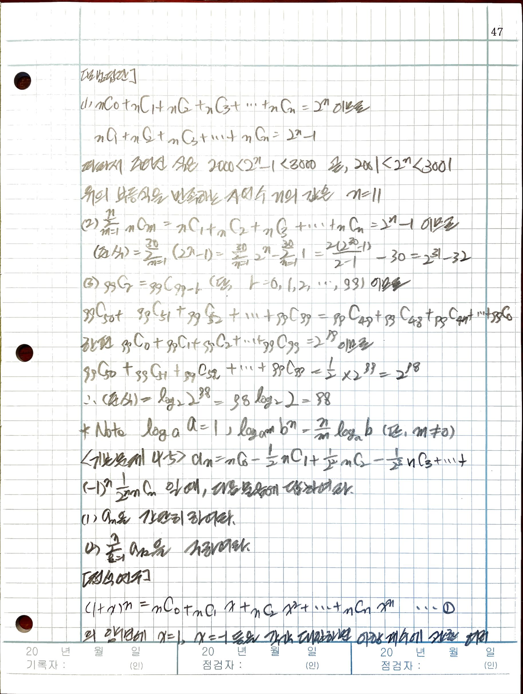

# book: 일반 수학의 정석; 확률과 통계

## 2. 순열

### 2.3 같은 것이 있는 순열

#### 원순열

 

 

## 3. 조합

### 3.1. 조합

#### 3.1.1 순열과 조합의 차이점

#### 3.1.2 nCr 를 계산하는 방법 (I)

#### 3.1.3 nCr 를 계산하는 방법 (II)

### 3.2. 중봅 조합

#### 3.2.1 중복 조합

#### 3.2.2 nHr 를 계산하는 방법

## 4. 이항정리

### 4.1 이항정리

#### 4.1.1 이항 정리와 일반항

#### 4.1.2 파스칼의 삼각형

 

### 4.2 이항 계수의 성질

