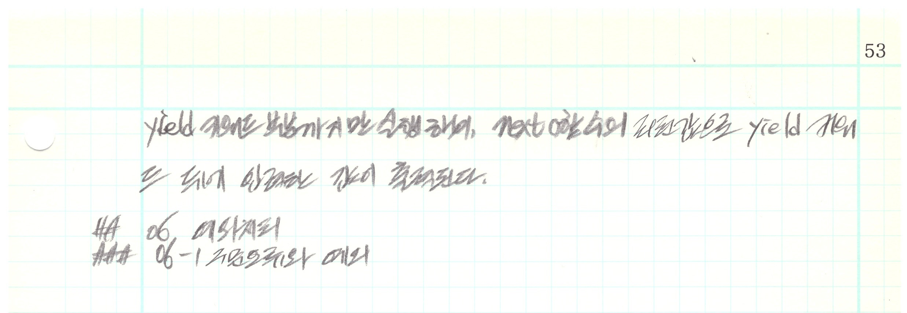
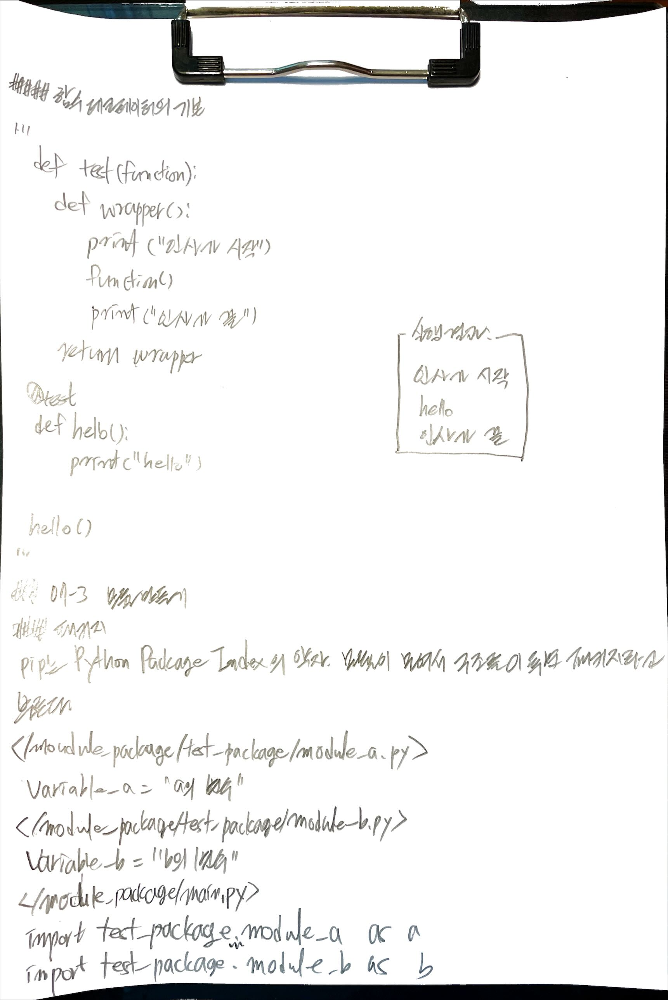

# Book: 혼자 공부하는 파이썬

## 04. 반복문

### 04-4 문자열, 리스트, 딕셔너리와 관련된 기본 함수

#### List slicing: ```[start:end] or [start:end:step]```

```python
a = [1, 2, 3, 4, 5]
print(a[0:3])
print(a[3:0]) # no item in the condition
print(a[3:0:-1])
print(a[3::-1])
print(a[::2])
print(a[:])
print(a[::-1])
print(a[::-2])
```
Output:
```text
[1, 2, 3]
[]
[4, 3, 2]
[4, 3, 2, 1]
[1, 3, 5]
[1, 2, 3, 4, 5]
[5, 4, 3, 2, 1]
[5, 3, 1]
```
##### 이터레이터

```for 반복자 in 반복할 수 있는 것```

반복할 수 있는 것을 프로그래밍 용어로 이터러블(iterable)이라고 한다; 리스트, 딕셔너리, 문자열 튜플
이터러블 중에서 next() 함수를 적용해 하나씩 꺼낼 수 있는 요소를 이터레이터라고 한다.

```python
numbers = [1, 2, 3, 4, 5]
r_num = reversed(numbers)
srebmun = numbers[::-1]

print(numbers[::-1])
print(srebmun)
print("reversed: ", r_num)

print(next(r_num))
print(next(r_num))
print(next(r_num))
print(next(r_num))
print(next(r_num))

print(iter(numbers))
print(next(iter(numbers)))
print(next(iter(numbers)))
print(next(iter(numbers)))
print(next(iter(numbers)))
print(next(iter(numbers)))

iter_numbers = iter(numbers)
print(iter_numbers)
print(next(iter_numbers))
print(next(iter_numbers))
print(next(iter_numbers))
print(next(iter_numbers))
print(next(iter_numbers))
```
output:
```text
[5, 4, 3, 2, 1]
[5, 4, 3, 2, 1]
reversed:  <list_reverseiterator object at 0x7fba213c85e0>
5
4
3
2
1
<list_iterator object at 0x7fba213c8af0>
1
1
1
1
1
<list_iterator object at 0x7fba213c8af0>
1
2
3
4
5
```

## 05 함수

### 05-3 함수 고급

#### 람다








