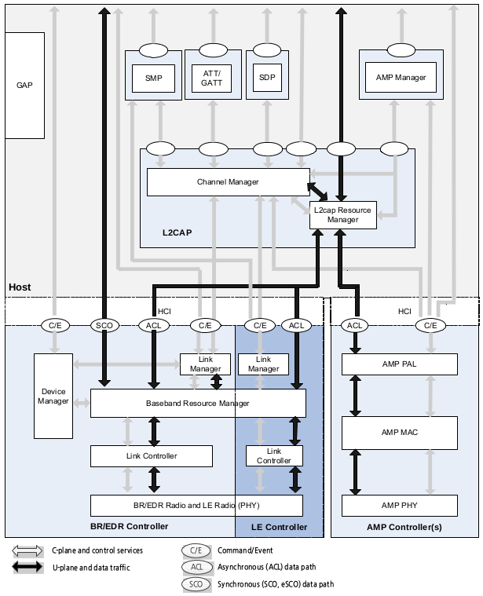
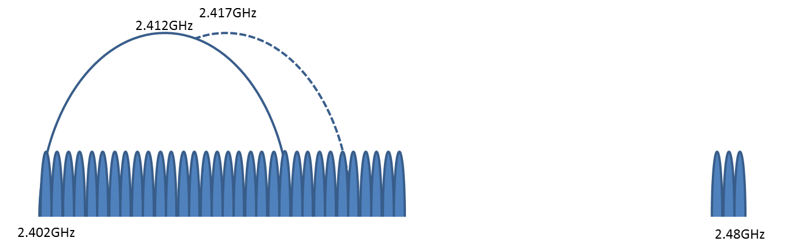
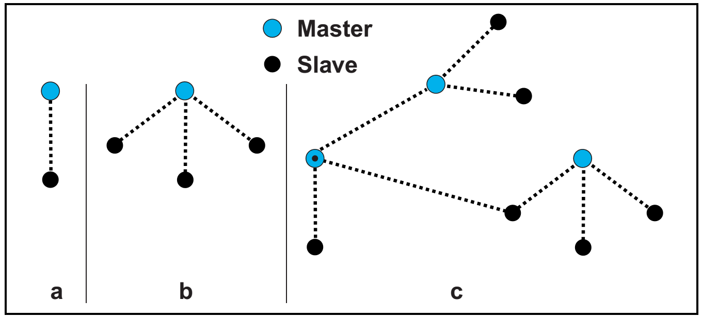
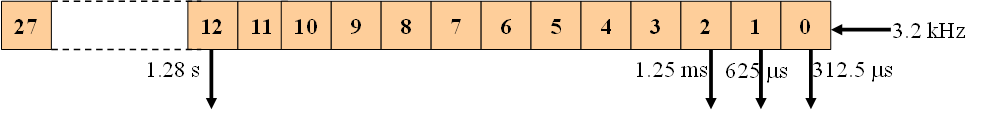
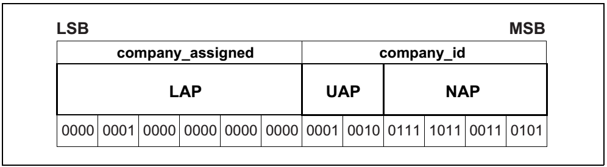
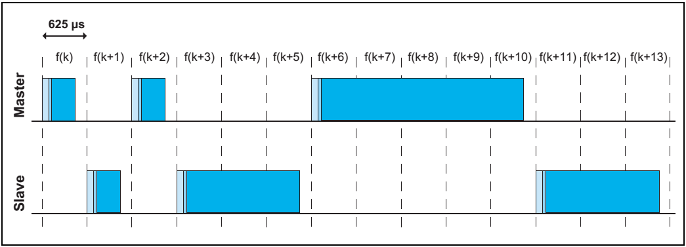
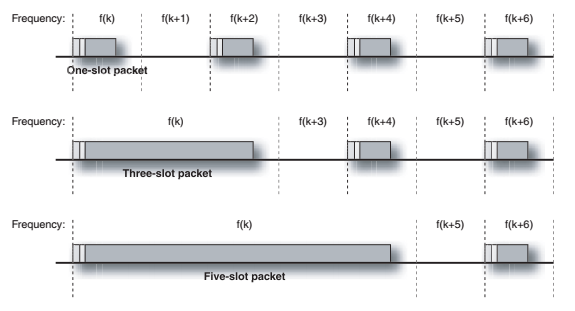
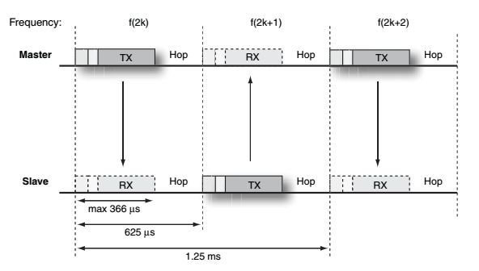
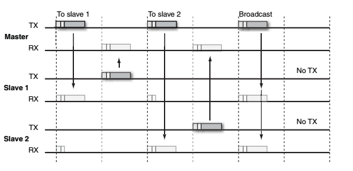
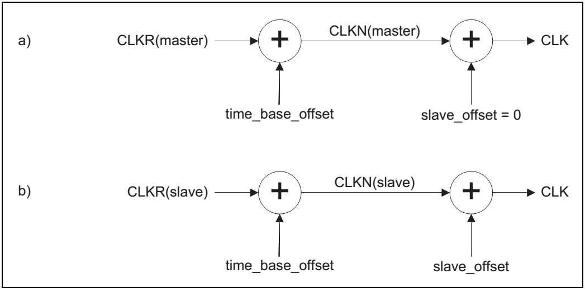

# bt

# Architecture

# Radio Frequency

* Operating in the unlicensed 2.4GHz ISM band
* Using TDD(Time Division Duplex) scheme
* Using pseudo random hopping sequence through 79 channels
* 1MHz bandwidth
* GFSK(Gaussian Frequency Shift Keying) and data rate 1Mbps for Basic Rate
* QPSK, 8PSK and data rate 2Mbps, 3Mbps for Enhanced Data Rate

# Baseband
* Defining physical channels
* Defining physical links
* Defining logical transports
* Defining logical links
 
## Piconets

* a. Piconets with a single slave operation
* b. A multi-slave operation
* c. A scatternet operation

# General Description
## Bluetooth Clock

The clock shall tick in units of 312.5us (i.e. half a time slot), giving a clock rate of 3.2kHz.

	312.5us = 1 / 3200 sec
 
The clock has a cycle of about a day. 
If the clock is implemented with a counter, a 28-bit counter is required that shall wrap around at 228-1.

	23.3 hours = (228-1)x312.5us

### Clock definitions
* CLKR: Reference clock
  * CLKR is reference clock driven by the free running system clock. CLKN may be offset from the reference clock by a timing offset. In STANDBY and in Park, Hold, Sniff and Connectionless Slave Broadcast modes the reference clock may be driven by a low power oscillator (LPO) with worst case accuracy (+/-250ppm). Otherwise, the reference clock shall be driven by the reference crystal oscillator with worst case accuracy of +/-20ppm.
* CLKN: native clock
* CLKE: estimated clock
* CLK: master clock

## Bluetooth Device Address (BD_ADDR)

BD_ADDR is consists of
* Lower Address Part (LAP)
* Upper Address Part (UAP)
* Non-significant Address Part (NAP)

### Lower Address Part
Reserved for dedicated inquiry of specific classes of devices.
9E8B00(1001 1110 1000 1011 0000 0000) ~ 
9E8B3F(1001 1110 1000 1011 0011 1111)

# Physical Channels
## Basic Piconet Physical Channel
### Time Slots
The basic piconet physical channel is divided into time slots, each 625us in length.
The time slots are numbered according to the most significant 27 bits of the Bluetooth clock CLK28-1 of the piconet master.
The slot numbering ranges from 0 to 227-1 and cyclic with a cycle length of 227.
The time slot number is denoted as k.

The packet start shall be aligned with the slot start. Packets may extend over up to file time slots.
The master transmission shall always start at even numbered time slots.
The slave transmission shall always start at odd numbered time slots.

아래의 그림이 multi-slot packet을 더 잘 설명해 준다.

각 패킷은 전송을 위해 최대 366us만큼 안테나를 할당받을 수 있고, 그래서 한 슬롯의 최대 패킷 길이는 366비트이다. 나머지 256us는 홉 시퀀스의 다음 번 주파수로 변경하는데 쓰인다.

Slave가 여러개인 경우에는 아래와 같이 동작한다.

### Piconet Clocks

