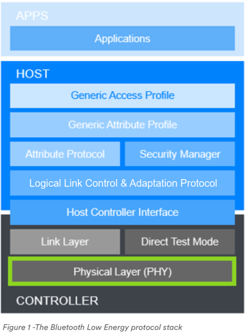
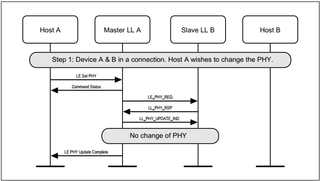
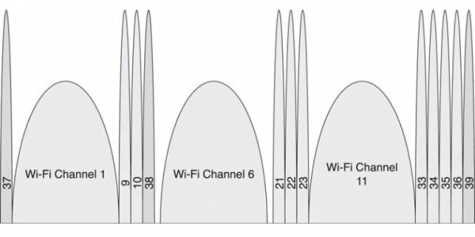
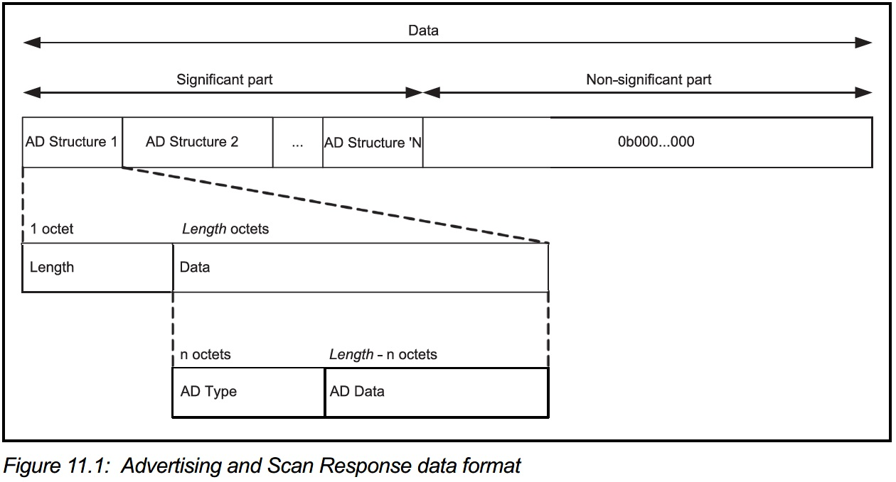
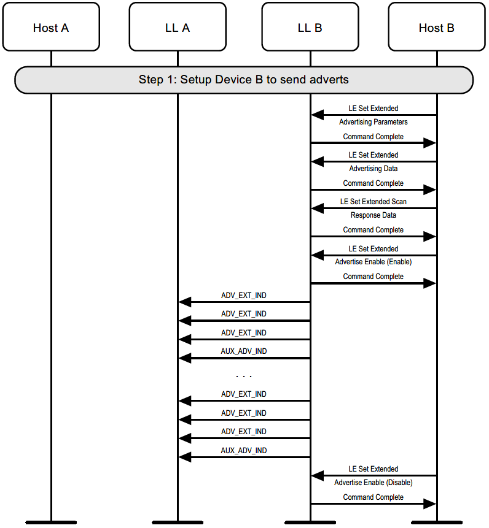
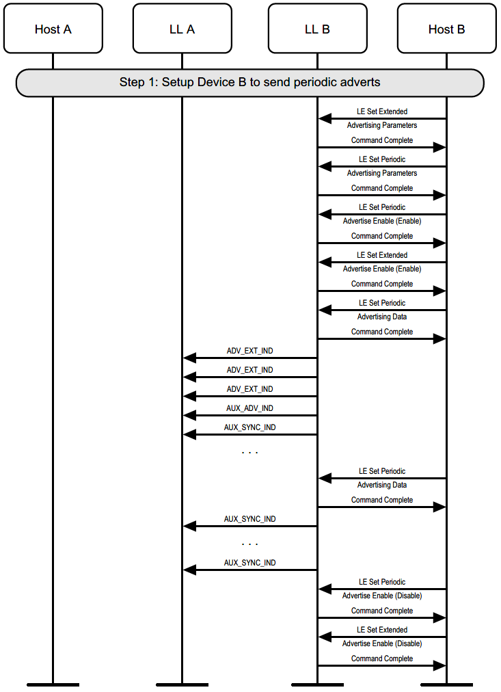

# BT 5.x overview



BT 5.0에 두 가지 PHY가 추가되어 3 종류의 PHY 중 선택이 가능해졌다. 
이 3 종류의 PHY는 아래와 같다.

* LE 1M 
* LE 2M 
* LE Coded 

## LE 1M 

Bluetooth 4.x에서 사용했던 PHY이며 Gaussian Frequency Shift Keying (GFSK) 모듈레이션을 사용하는 심볼레이트가 1Ms/s인 PHY이다. 

## LE 2M 

LE 2M PHY는 2Ms/s의 심볼레이트를 가졌다. 

읽을꺼리: https://punchthrough.com/crash-course-in-2m-bluetooth-low-energy-phy/ 

### 문제 정의 

1Msps(sample per second)을 사용할 경우 전력 소모와 throughput 문제가 제기 되었다. BR/EDR/WLAN과 COEX를 사용하는 디바이스(mobile phone)의 경우 같은 안테나를 사용한다면 time domain에서 짧은 패킷의 경우 더 많이 송출 interleave를 수행하게 되어 많은 전력 소모와 throughput 문제를 야기시켰다. 

이 문제가 2Msps를 정의하기 된 이유이다. 2Msps를 사용할 경우 평균 전력 소모를 감소시키고 효과적으로 throughput을 증가시킬 수 있다. 
 
### Comparing with 1M 


## LE Coded 

LE Coded PHY를 통해 Tx power를 늘리지 않아도 거의 4배 정도의 Range 이득이 생긴다.  

### 문제 정의 

현재 통신 거리는 낮은 throughput 어플리케이션에서도 통신의 신뢰를 확보하려면 상대적으로 짧아야 한다. 그래서 1 Msps의 제한을 갖고 있지만 LE Coded PHY로 기존의 BLE PHY 대비 명목상 12dB의 sensitivity 증가를 갖도록 할 수 있다. 


| LE Coded PHY   | Symbol rate  | Error detection | Error Correction | Range multiplier | PDU length | Minimum packet time | Maximum packet time | Maximum throughput |
| :------------- | :----------- | :-------------- | :--------------- | :--------------- | :--------- | :------------------ | :------------------ | :----------------- |
| 125kbps (S=2)  | 1M symbols/s | CRC             | FEC              | 2                | 0-257B     | 720 us              | 17040 us            | 382 kbps           |
| 500 kbps (S=8) | 1M symbols/s | CRC             | FEC              | 4                | 0-257B     | 462 us              | 4542 us             | 112 kbps           |

[출처: https://www.silabs.com/whitepapers/bluetooth-5-refined-for-the-iot](https://www.silabs.com/whitepapers/bluetooth-5-refined-for-the-iot)

## PHY Update 

### Master initiated PHY Update procedure 

1. master requests a change of PHY, PHY changed in at least one direction 


2. PHY not changed (either because slave doesn't specify PHYs that the master prefers, or because the master concludes that the current PHYs are still best)


3. master requests a change of PHY, slave does not support the feature


### Slave initiated PHY Update procedure 

1. slave requests a change of PHY, PHY changed in at least one direction


2. PHY not changed (either because slave doesn't specify PHYs that the master prefers, or because the master concludes that the current PHYs are still best) 


3. slave requests a change of PHY, master does not support the feature 


### Autonomous master-initiated PHY Update procedure 

1. master requests a change of PHY, slave accepts, PHY changed in at least one direction


2. master requests a change of PHY, PHY not changed (either because slave doesn't specify PHYs that the master prefers, or because the master concludes that the current PHYs are still best)


### Master and slave crossover PHY Update procedure 

master and slave request a change of PHY concurrently


## Advertising extensions

BLE physical channels는 Primary channels와 Secondary channels로 구분된다.

* Primary channels는 Advertisement channels로 37, 38, 39의 채널 번호를 갖고 있고, Wi-Fi channel과 over-wrap 되는 것을 피하도록 위치되어 있다.
* Secondary channels는 37, 38, 39를 제외한 채널들로 데이터 통신(connection event)에 이용된다.




BT 4.x에서 advertising packet은 37 octets 길이를 갖고 있는데 헤더 6 octets을 빼면 최대 31 octets만을 payload로 이용할 수 있었다.

BT 5.0에서 advertising packet은 0~36 채널(Secondary channels)에 offloading 하여 최대 255 octets까지 보낼 수 있게 됐다.


### Advertising and Scan Response Data format
	BT 5.2. Vol3, Part C Generic Access Profile 중 11 장 정리



AD Type은 [SIG의 Assigned Number 중 GAP 관련 페이지](https://www.bluetooth.com/specifications/assigned-numbers/generic-access-profile/)에 정의되어 있다.

| Name                            | Actual data length in bytes | Description                                                                                                                  |
| :------------------------------ | :-------------------------- | :--------------------------------------------------------------------------------------------------------------------------- |
| Flags                           | 1(extensible)               | Used to set limited or general discovery mode, as described in Discovery                                                     |
| Local Name                      | variable                    | Partial or complete user-readable local name in UTF-8                                                                        |
| Appearance                      | 2                           | A 16-bit value describing the type of device sending the advertising packet                                                  |
| TX Power Level                  | 1                           | The power level in dBm used to transmit the advertising packet, useful to calculate path loss at the observer or central end |
| Service UUID                    | variable                    | A complete or partial list of GATT services offered by the device sending the packet (as a GATT server)                      |
| Slave Connection Interval Range | 4                           | A suggestion to the central about the connection interval range that best fits this peripheral                               |
| Service Solicitation            | variable                    | A list of GATT services supported by the device sending the packet (as a GATT client)                                        |
| Service Data                    | variable                    | A UUID representing a GATT service and its associated data                                                                   |
| Manufacturer Specific Data      | variable                    | Freely formattable data, to be used at the discretion of the implementation                                                  |

* Advertising data는 advertising event나 periodic advertising event로 전송된다.
* Host Advertising data는 아래 패킷의 AdvData field에 실린다.
	* ADV_IND
	* ADV_NONCONN_IND
	* ADV_SCAN_IND
	* AUX_ADV_IND
	* AUX_CHAIN_IND
* Additional Controller Advertising Data는 아래 패킷의 ACAD field에 실린다.
	* AUX_ADV_IND
	* AUX_SYNC_IND
	* AUX_SCAN_RSP
* Periodic Advertising data는 아래 패킷의 AdvData field에 실린다.
	* AUX_SYNC_IND
	* AUX_CHAIN_IND
* Scan Response data는 아래 field에 실린다.
	* SCAN_RSP 패킷의 ScanRspData field
	* AUX_SCAN_RSP의 AdvData field
* 만약 AUX_ADV_IND, AUX_SYNC_IND나 AUX_SCAN_RSP의 AdvData field에 데이터가 모두 들어가지 않는다면 AUX_CHAIN_IND 패킷이 남은 데이터를 보내기 위해 이용된다.

### 2.3.4.5. AuxPtr (aux_ptr)
Secondary channels로 전송되는 advertising payload는 Primary channel의 ADV packet에 새로 추가된 extended header의 AuxPtr field로 가리킨다.

```c
extended_header {
    u8 extended_header_flag;
    u8 adv_address[6];
    u8 target_address[6];
    u8 rfu;
    u8 adv_data_info[2];
    u8 aux_ptr[3];
    u8 sync_info[18];
    u8 tx_power;
    u8 additional_controller_advertising_data[extended_header_length-(1+(additional field size as specified))];
}
```

```c
aux_ptr {
    bit channel_index[6];
    bit clock_accuracy;
    bit offset_unit;
    bit aux_offset[13];
    bit aux_phy[3];
}
```

#### offset_unit
| Value | Units |
| :---- | :---- |
| 0     | 30us  |
| 1     | 300us |

#### aux_phy
| Value     | PHY used                |
| :-------- | :---------------------- |
| 000b      | LE 1M                   |
| 001b      | LE 2M                   |
| 010b      | LE Coded                |
| 011b~111b | Reserved for future use |

#### clock_accuracy
| CA Value | Advertiser's Clock Accuracy |
| :------- | :-------------------------- |
| 0        | 51ppm ~ 500ppm              |
| 1        | 0ppm ~ 50ppm                |

## Advertising packet chaining
255 octets 보다 큰 데이터를 보낼 때에는 advertising packet chaining feature를 통해 보낼 수 있다.


### 2.3.4.9 Host Adverising Data
Host에서 설정한 advertising data. Fragmention을 지원하고 fragmentation 이전의 데이터가 1650 octets을 초과해서는 안된다.

## Advertising sets
* Advertising set는 ID로 패킷을 구분하는 기능을 한다. 
* 각 advertising set는 advertising interval이나 PDU type과 같은 자신만의 advertising parameters를 갖고 있다.
* Host는 초기에 advertising set와 각각의 파라미터들을 Controller에게 알리기만 하고, 이후에는 Controller의 Link Layer에서 알아서 한다.

### 2.3.4.4. AdvDataInfo (adv_data_info) 
```c
adv_data_info {
    bit advertising_data_id[12];
    bit advertising_set_id[4];
}
```
* **advertising_set_id**: advertising set을 구별하기 위한 ID
* **advertising_data_id**: AdvData 내의 데이터 콘텐츠가 이전에 보낸 AdvData와 중복되는지 여부를 구분하는 ID


## Periodic advertising
BT 5.0에서 GAP(Generic Access Profile)에서 동기 모드와 비동기 모드를 지원한다. 동기 모드로 동작할 때 Periodic Advertising Synchronization Establishment procedure가 수행된다. 동기화 모드로 동작할 때 Periodic advertising은 timing과 timing offset 정보를 포함하는 SyncInfo라는 새로운 헤더 필드를 갖게 된다. 이를 위해 AUX_SYNC_IND가 추가되었다.

### 2.3.4.6 SyncInfo
```c
sync_info {
    bit sync_packet_offset[13];
    bit offset_units;
    bit rfu[2];
    u8 interval[2];
    bit channel_map[37];
    bit sleep_clock_accuracy[3];
    u8 access_address[4];
    u8 crc_init[3];
    u8 event_counter[2];
}
```
### AUX_SYNC_IND 전송 윈도 


## Burden은 줄이고 인식 성능은 향상
BT 4.x에서는 같은 데이터를 primary channel을 통해 반복해서 세번씩 전송해야 했으나, BT 5.0에서는 헤더만 반복 시키고 실제 데이터는 secondary channel을 통해 보냄으로써 burden을 줄일 수 있게 되었다.


이와 같이 burden이 줄어들게 되어 minimum Advertising Interval이 100ms에서 20ms로 줄어들게 되었다. 이것은 Scaning device가 더 빨리 Advertising packet을 인식하게 되는 효과를 발생시켰다.

## Advertising using ADV_EXT_IND


## Periodic advertising


