# BT 5.x overview

## PHY


BT 5.0에 두 가지 PHY가 추가되어 3 종류의 PHY 중 선택이 가능해졌다. 
이 3 종류의 PHY는 아래와 같다.

* LE 1M 
* LE 2M 
* LE Coded 

## LE 1M 

Bluetooth 4.x에서 사용했던 PHY이며 Gaussian Frequency Shift Keying (GFSK) 모듈레이션을 사용하는 심볼레이트가 1Ms/s인 PHY이다. 

## LE 2M 

LE 2M PHY는 2Ms/s의 심볼레이트를 가졌다. 

읽을꺼리: https://punchthrough.com/crash-course-in-2m-bluetooth-low-energy-phy/ 

### 문제 정의 

1Msps(sample per second)을 사용할 경우 전력 소모와 throughput 문제가 제기 되었다. BR/EDR/WLAN과 COEX를 사용하는 디바이스(mobile phone)의 경우 같은 안테나를 사용한다면 time domain에서 짧은 패킷의 경우 더 많이 송출 interleave를 수행하게 되어 많은 전력 소모와 throughput 문제를 야기시켰다. 

이 문제가 2Msps를 정의하기 된 이유이다. 2Msps를 사용할 경우 평균 전력 소모를 감소시키고 효과적으로 throughput을 증가시킬 수 있다. 
 
### Comparing with 1M 

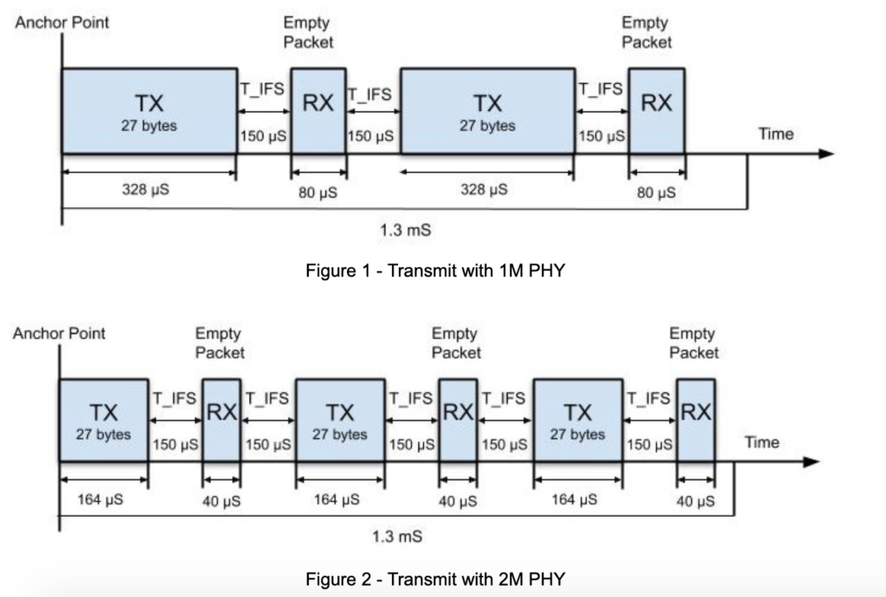

## LE Coded 

LE Coded PHY를 통해 Tx power를 늘리지 않아도 거의 4배 정도의 Range 이득이 생긴다.  

### 문제 정의 

현재 통신 거리는 낮은 throughput 어플리케이션에서도 통신의 신뢰를 확보하려면 상대적으로 짧아야 한다. 그래서 1 Msps의 제한을 갖고 있지만 LE Coded PHY로 기존의 BLE PHY 대비 명목상 12dB의 sensitivity 증가를 갖도록 할 수 있다. 


| LE Coded PHY   | Symbol rate  | Error detection | Error Correction | Range multiplier | PDU length | Minimum packet time | Maximum packet time | Maximum throughput |
| :------------- | :----------- | :-------------- | :--------------- | :--------------- | :--------- | :------------------ | :------------------ | :----------------- |
| 125kbps (S=2)  | 1M symbols/s | CRC             | FEC              | 2                | 0-257B     | 720 us              | 17040 us            | 382 kbps           |
| 500 kbps (S=8) | 1M symbols/s | CRC             | FEC              | 4                | 0-257B     | 462 us              | 4542 us             | 112 kbps           |

[출처: https://www.silabs.com/whitepapers/bluetooth-5-refined-for-the-iot](https://www.silabs.com/whitepapers/bluetooth-5-refined-for-the-iot)

## PHY Update 

### Master initiated PHY Update procedure 

1. master requests a change of PHY, PHY changed in at least one direction 


2. PHY not changed (either because slave doesn't specify PHYs that the master prefers, or because the master concludes that the current PHYs are still best)


3. master requests a change of PHY, slave does not support the feature
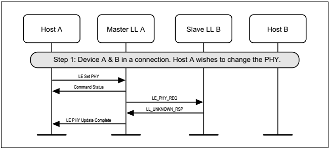

### Slave initiated PHY Update procedure 

1. slave requests a change of PHY, PHY changed in at least one direction
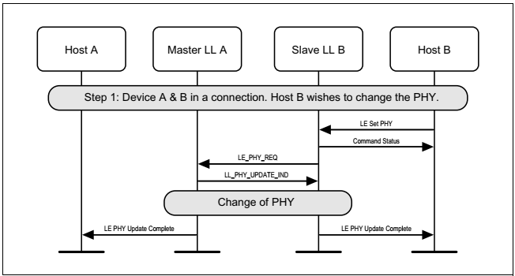

2. PHY not changed (either because slave doesn't specify PHYs that the master prefers, or because the master concludes that the current PHYs are still best) 


3. slave requests a change of PHY, master does not support the feature 
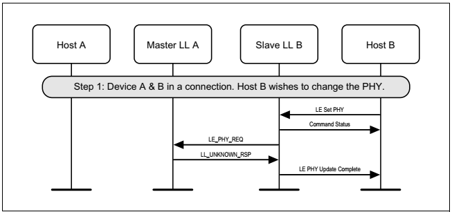

### Autonomous master-initiated PHY Update procedure 

1. master requests a change of PHY, slave accepts, PHY changed in at least one direction


2. master requests a change of PHY, PHY not changed (either because slave doesn't specify PHYs that the master prefers, or because the master concludes that the current PHYs are still best)


### Master and slave crossover PHY Update procedure 

master and slave request a change of PHY concurrently


## Advertising extensions

BLE physical channels는 Primary channels와 Secondary channels로 구분된다.

* Primary channels는 Advertisement channels로 37, 38, 39의 채널 번호를 갖고 있고, Wi-Fi channel과 over-wrap 되는 것을 피하도록 위치되어 있다.
* Secondary channels는 37, 38, 39를 제외한 채널들로 데이터 통신(connection event)에 이용된다.


BT 4.x에서 advertising packet은 37 octets 길이를 갖고 있는데 헤더 6 octets을 빼면 최대 31 octets만을 payload로 이용할 수 있었다.

BT 5.0에서 advertising packet은 0~36 채널(Secondary channels)에 offloading 하여 최대 255 octets까지 보낼 수 있게 됐다.


### Advertising and Scan Response Data format
	BT 5.2. Vol3, Part C Generic Access Profile 중 11 장 정리


AD Type은 [SIG의 Assigned Number 중 GAP 관련 페이지](https://www.bluetooth.com/specifications/assigned-numbers/generic-access-profile/)에 정의되어 있다.

| Name                            | Actual data length in bytes | Description                                                                                                                  |
| :------------------------------ | :-------------------------- | :--------------------------------------------------------------------------------------------------------------------------- |
| Flags                           | 1(extensible)               | Used to set limited or general discovery mode, as described in Discovery                                                     |
| Local Name                      | variable                    | Partial or complete user-readable local name in UTF-8                                                                        |
| Appearance                      | 2                           | A 16-bit value describing the type of device sending the advertising packet                                                  |
| TX Power Level                  | 1                           | The power level in dBm used to transmit the advertising packet, useful to calculate path loss at the observer or central end |
| Service UUID                    | variable                    | A complete or partial list of GATT services offered by the device sending the packet (as a GATT server)                      |
| Slave Connection Interval Range | 4                           | A suggestion to the central about the connection interval range that best fits this peripheral                               |
| Service Solicitation            | variable                    | A list of GATT services supported by the device sending the packet (as a GATT client)                                        |
| Service Data                    | variable                    | A UUID representing a GATT service and its associated data                                                                   |
| Manufacturer Specific Data      | variable                    | Freely formattable data, to be used at the discretion of the implementation                                                  |

* Advertising data는 advertising event나 periodic advertising event로 전송된다.
* Host Advertising data는 아래 패킷의 AdvData field에 실린다.
	* ADV_IND
	* ADV_NONCONN_IND
	* ADV_SCAN_IND
	* AUX_ADV_IND
	* AUX_CHAIN_IND
* Additional Controller Advertising Data는 아래 패킷의 ACAD field에 실린다.
	* AUX_ADV_IND
	* AUX_SYNC_IND
	* AUX_SCAN_RSP
* Periodic Advertising data는 아래 패킷의 AdvData field에 실린다.
	* AUX_SYNC_IND
	* AUX_CHAIN_IND
* Scan Response data는 아래 field에 실린다.
	* SCAN_RSP 패킷의 ScanRspData field
	* AUX_SCAN_RSP의 AdvData field
* 만약 AUX_ADV_IND, AUX_SYNC_IND나 AUX_SCAN_RSP의 AdvData field에 데이터가 모두 들어가지 않는다면 AUX_CHAIN_IND 패킷이 남은 데이터를 보내기 위해 이용된다.

### 2.3.4.5. AuxPtr (aux_ptr)
Secondary channels로 전송되는 advertising payload는 Primary channel의 ADV packet에 새로 추가된 extended header의 AuxPtr field로 가리킨다.

```c
extended_header {
    u8 extended_header_flag;
    u8 adv_address[6];
    u8 target_address[6];
    u8 rfu;
    u8 adv_data_info[2];
    u8 aux_ptr[3];
    u8 sync_info[18];
    u8 tx_power;
    u8 additional_controller_advertising_data[extended_header_length-(1+(additional field size as specified))];
}
```

```c
aux_ptr {
    bit channel_index[6];
    bit clock_accuracy;
    bit offset_unit;
    bit aux_offset[13];
    bit aux_phy[3];
}
```

#### offset_unit

| Value | Units |
| :---- | :---- |
| 0     | 30us  |
| 1     | 300us |

#### aux_phy

| Value     | PHY used                |
| :-------- | :---------------------- |
| 000b      | LE 1M                   |
| 001b      | LE 2M                   |
| 010b      | LE Coded                |
| 011b~111b | Reserved for future use |

#### clock_accuracy

| CA Value | Advertiser's Clock Accuracy |
| :------- | :-------------------------- |
| 0        | 51ppm ~ 500ppm              |
| 1        | 0ppm ~ 50ppm                |

## Advertising packet chaining
255 octets 보다 큰 데이터를 보낼 때에는 advertising packet chaining feature를 통해 보낼 수 있다.


### 2.3.4.9 Host Adverising Data
Host에서 설정한 advertising data. Fragmention을 지원하고 fragmentation 이전의 데이터가 1650 octets을 초과해서는 안된다.

## Advertising sets
* Advertising set는 ID로 패킷을 구분하는 기능을 한다. 
* 각 advertising set는 advertising interval이나 PDU type과 같은 자신만의 advertising parameters를 갖고 있다.
* Host는 초기에 advertising set와 각각의 파라미터들을 Controller에게 알리기만 하고, 이후에는 Controller의 Link Layer에서 알아서 한다.

### 2.3.4.4. AdvDataInfo (adv_data_info) 
```c
adv_data_info {
    bit advertising_data_id[12];
    bit advertising_set_id[4];
}
```
* **advertising_set_id**: advertising set을 구별하기 위한 ID
* **advertising_data_id**: AdvData 내의 데이터 콘텐츠가 이전에 보낸 AdvData와 중복되는지 여부를 구분하는 ID


## Periodic advertising
BT 5.0에서 GAP(Generic Access Profile)에서 동기 모드와 비동기 모드를 지원한다. 동기 모드로 동작할 때 Periodic Advertising Synchronization Establishment procedure가 수행된다. 동기화 모드로 동작할 때 Periodic advertising은 timing과 timing offset 정보를 포함하는 SyncInfo라는 새로운 헤더 필드를 갖게 된다. 이를 위해 AUX_SYNC_IND가 추가되었다.

### 2.3.4.6 SyncInfo
```c
sync_info {
    bit sync_packet_offset[13];
    bit offset_units;
    bit rfu[2];
    u8 interval[2];
    bit channel_map[37];
    bit sleep_clock_accuracy[3];
    u8 access_address[4];
    u8 crc_init[3];
    u8 event_counter[2];
}
```
### AUX_SYNC_IND 전송 윈도 
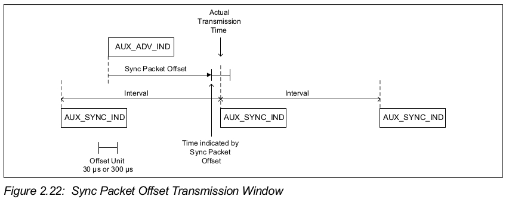

## Burden은 줄이고 인식 성능은 향상
BT 4.x에서는 같은 데이터를 primary channel을 통해 반복해서 세번씩 전송해야 했으나, BT 5.0에서는 헤더만 반복 시키고 실제 데이터는 secondary channel을 통해 보냄으로써 burden을 줄일 수 있게 되었다.
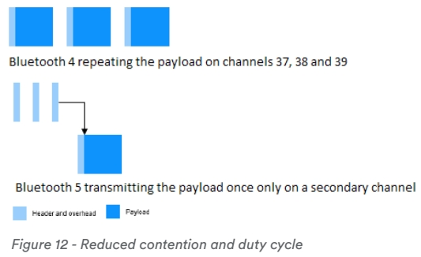

이와 같이 burden이 줄어들게 되어 minimum Advertising Interval이 100ms에서 20ms로 줄어들게 되었다. 이것은 Scaning device가 더 빨리 Advertising packet을 인식하게 되는 효과를 발생시켰다.

## Advertising using ADV_EXT_IND


## Periodic advertising


## Bluetooth Direction Finding

### About Bluetooth Direction Finding
최초의 무선 방향 찾기 작업은 19 세기 말 Heinrich Hertz와 같은 개척자들에 의해 수행되었다. 초기 시스템은 다양한 방향을 가리키는 안테나로 측정했을 때 신호의 강도를 비교하여 작동했다. 가장 강한 신호 강도가 측정된 방향이 신호의 시작 방향으로 간주되었다.
20 세기 동안 현장에서 작업이 계속되었으며 특히 신호 위상 비교와 관련된 새로운 방법이 도입되어 훨씬 더 나은 결과를 제공했다.
Bluetooth Core Spec v5.1에는 고정밀 방향 찾기를 지원하는 새로운 기능이 도입되었다. 컨트롤러 사양이 향상되어 안테나 어레이가 통합된 특수 하드웨어를 사용하여 수신된 무선 신호의 방향 계산을 지원할 수 있게 되었다. HCI (Host Controller Interface)도 수정되어 컨트롤러가 수집한 데이터를 스택의 상위 계층에서 방향 계산을 할 수 있게 되었다.

#### Two Direction Finding Methods
Bluetooth 방향 찾기는 각각 동일한 기본 기반을 활용하는 두 가지 고유한 아키텍처 또는 방법을 제공합니다. 두 가지 방법 중 첫 번째는 Angle of Arrival(AoA)라고하며 두 번째는 Angle of Departure(AoD)라고 한다.
각각의 경우 특수한 방향 찾기 신호가 한 장치에서 전송되고, 다른 장치에서 수신된 그 신호의 방향을 계산한다.

AoA를 사용하는 수신기는 아래 그림과 같이 다중 안테나 어레이를 갖는다.

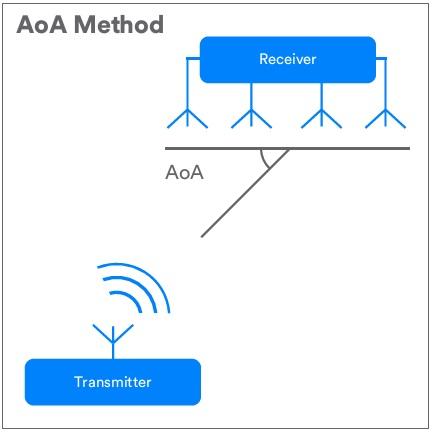

AoD를 사용하면 아래 그림과 같이 안테나 어레이가 포함된 송신 장치를 만든다.


### Direction Finding Theory
Bluetooth 방향 찾기는 전파의 기본 속성 중 일부를 활용하여 방향 찾기 계산에 사용할 수 있는 데이터를 수집한다.
응용 프로그램은 삼각법과 안테나 배열 설계에 대한 정보를 포함하는 데이터를 계산에 사용한다.
블루투스 방향 찾기와 관련된 파동 속성에 대한 설명은 다음과 같다.

#### Wave Cycle
웨이브는 최대 및 최소 진폭의 반복 패턴을 갖는다. 진폭이 0에서 최고점을 통과하여 내려 가고 진폭이 0에서 최저점을 통과하여 다시 올라가며 웨이브가 반복되는 것을 웨이브 사이클이라고 한다. 웨이브 사이클의 개념은 아래의 그림과 같다.


#### Wavelength
아래 그림처럼 파장은 전체 웨이브 사이클의 시작과 끝 사이의 거리이다. 주파수에 의해, 블루투스의 파장은 약 12.5cm이다.

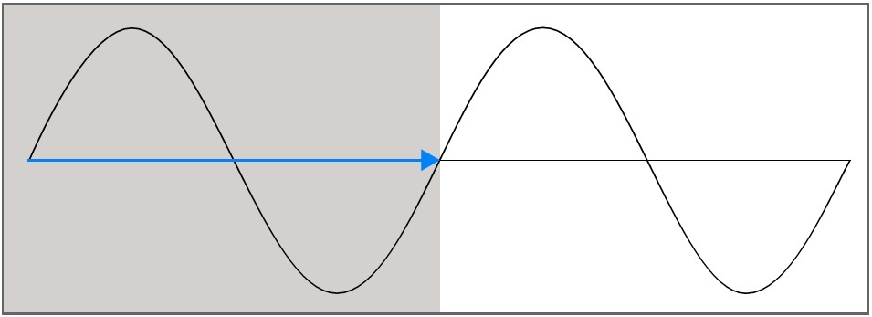

#### Frequency
Bluetooth는 2.40GHz ~ 2.41GHz의 ISM (산업 과학 및 의료) 대역에서 운용된다.
Bluetooth LE (Low Energy)는 이 대역을 각각 2MHz 폭의 40 개 채널로 나눈다. 연결 시, 장치는 적응형 주파수 호핑 알고리즘에 의해 구동되는 주파수 변경과 함께 사용 가능한 채널 중 37 개를 사용한다. 비 연결 시나리오에서 Bluetooth Core Specification v5.0에 도입된 확장 advertising을 사용할 때 40 개의 모든 무선 채널이 사용된다. 결과적으로 Bluetooth를 사용하는 통신에는 하나의 고정 주파수가 아닌 다양한 주파수가 포함된다. 블루투스 방향 찾기에 중요한 요소인 파장은 사용하는 주파수에 따라 달라진다.


#### Phase
웨이브가 안테나를 통과 할 때 측정되는 웨이브 사이클의 특정 지점을 위상이라고 한다. 위상은 웨이브 사이클 시작 시 0부터 웨이브 사이클 종료 시 360도 또는 2π 라디안까지의 각도로 측정된다. 아래 그림은 위상의 개념을 보여준다.


#### Using Phase to Determine Signal Direction
송신기가 신호를 방출 할 때 장벽이나 신호를 방해 할 수 있는 다른 요인이 없는 경우, 신호는 송신기에서 빛의 속도로 3 차원으로 퍼져 나간다. 그것의 경로는 팽창하는 구체와 같고, 그 구체의 표면에 있는 웨이브는 전송에 포함된 에너지가 더 크고 더 큰 표면적에 걸쳐 퍼짐에 따라 꾸준히 감소하는 진폭을 가지고 있다. 구체의 크기가 커지면 송신기에서 멀어진다.
이 아이디어를 단순화하면, 돌을 던질 때 물 웅덩이에 나타나는 잔물결과 같은 원형 경로를 추적하는 신호를 사용하여 3 차원이 아닌 2 차원으로 생각하는 것이 더 쉽다.
신호의 경로에 안테나가 배치되어 있다고 상상하면 웨이브가 지나갈 때 해당 웨이브의 위상은 0도에서 360도까지 지속적으로 변한다.
주어진 시간 (t)에서 위상을 측정하고 그 값을 p1이라고 부르자.
첫번째 안테나를 통과하는 원의 원주에 있는 어딘가의 신호 경로에 다른 안테나를 배치하면, 두번째 안테나는 송신기로부터 첫번째 안테나까지의 거리와 완전히 동일한 거리를 갖는다.
각 안테나를 통과하는 웨이브는 동일한 주파수를 가지므로 파장도 동일하고, 첫번째 안테나와 동시에 두번째 안테나에서 웨이브의 위상(p2)을 측정하면 그 위상은 p1와 동일해야 한다. 아래의 그림 참조.

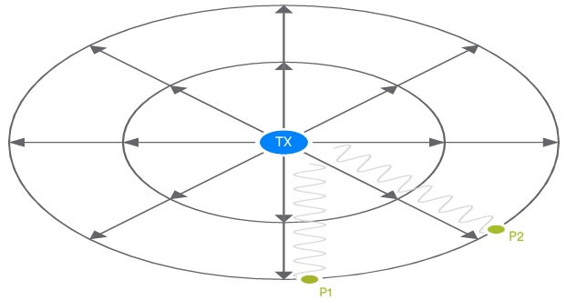

이제 안테나 1에서 송신기까지의 거리와 안테나 2에서 송신기까지의 거리의 차이가 파장의 정확한 배수가 되지 않도록 주의하여 두 번째 안테나를 송신기에 더 가깝게 이동하는 경우, 시간 (t)에서 p1과 p2를 측정하면 두 안테나 각각에서 서로 다른 위상 값을 얻을 수 있다.

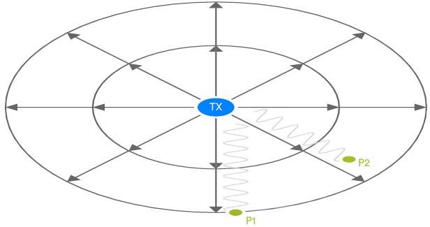

두 안테나 사이의 거리 (직선), 위상차 (p2-p1) 및 신호의 파장을 알고 있다면 기본 삼각법을 사용하여 아래 그림처럼 신호 각도를 계산할 수 있다.


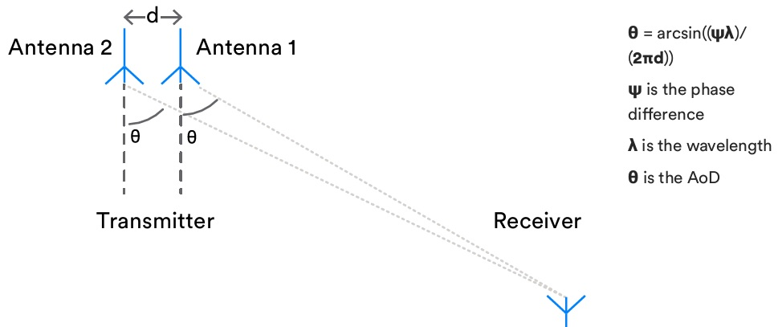

### Sampling
Bluetooth 방향 찾기는 특별히 공식화된 방향 찾기 신호를 사용한다. 이러한 신호 중 하나를 수신하는 장치는 In-phase and Quadrature Sampling 또는 간단히 IQ Sampling으로 알려진 프로세스에서 정확한 간격으로 여러 위상 및 진폭 측정을 수행한다. 단일 IQ 샘플은 일련의 데카르트 좌표로 표시되는 파동의 진폭과 위상 각도로 구성된다. 응용은 직교 표현을 위상 각도와 진폭 값을 산출하는 해당 극좌표로 변환 할 수 있다.

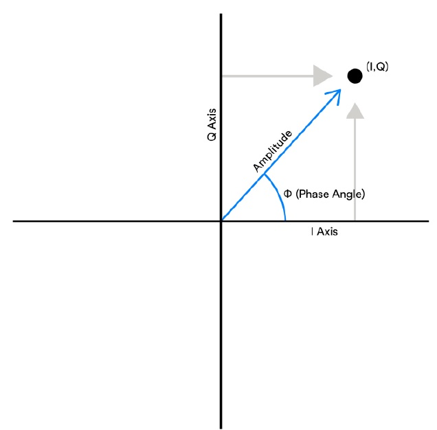

안테나 어레이가 있는 장치에서 IQ 샘플링을 수행 할 때 캡처 된 각 샘플은 어레이의 특정 안테나에 속해야 한다.
AoA의 경우 수신기에는 안테나 어레이가 포함되어 있으며 적절한 순서로 각 안테나에서 IQ 샘플링을 수행한다.
AoD의 경우 안테나 어레이가 포함된 송신기이지만 단일 안테나에서 IQ 샘플링을 수행하고 측정을 수행하고 방향 계산에 원격 송신기의 안테나 어레이 설계 세부 사항을 사용하여 속성을 부여하는 것은 여전히 수신기이다. 따라서 AoD가 작동하려면 송신기의 안테나 배열에 대한 세부 정보를 수신기에 제공하는 방법이 필요하다. 이를 수행하는 방법을 정의하는 프로파일은 향후 Bluetooth SIG (Special Interest Group)에서 게시 할 것이다.

### Antenna Arrays
안테나 어레이는 다양한 디자인과 안테나 수를 가질 수 있다. 다양한 디자인의 장단점에 대한 논의는 이 백서의 범위를 벗어나지만, 디자인이 다를 수 있는 방식에 대한 이해는 IQ 샘플 데이터에서 신호의 방향을 계산할 때 안테나 어레이를 정의하는 정보의 필요성을 이해하는 데 도움이 될 것이다. 아래의 그림은 몇 가지 안테나 어레이 설계의 예를 보여준다.


ULA와 같은 단순한 선형 설계를 통해 신호에서 단일 각도를 계산할 수 있다. 더 복잡한 안테나 어레이 설계를 통해 2 개 또는 3 개의 각도를 유도 할 수 있다. 예를 들어, 참조 평면을 기준으로 신호의 고도와 방위각을 모두 계산해야 하는 경우가 많다. 아래 그림 참조.


이러한 각도로 설명된 선의 교차점을 사용하여 센티미터 단위로 측정된 높은 정확도로 수신기 장치의 위치를 정확하게 찾을 수 있다.

### Bluetooth Direction Finding Signals
#### What is a direction finding signal?
새로운 블루투스 방향 찾기 신호는 블루투스 방향 찾기가 작동하는 방식의 필수적인 부분이다.
방향 찾기 신호는 IQ 샘플링을 적용 할 수 있는 일정한 신호 재료의 소스를 제공한다. 두 개의 연결된 장치 간의 방향 찾기를 위해 새로운 링크 계층 PDU가 정의되었으며, 연결없는 방향 찾기를 위해 방향 찾기 목적으로 기존 advertising PDU를 사용하는 방법이 정의되었다. 각각의 경우 PDU에는 CTE (Constant Tone Extension)라는 추가 데이터가 추가된다. 

#### The Constant Tone Extension
CTE는 각각 이진수 1로 표현되는 일련의 심볼로만 구성된다. CTE 내에 포함 된 심볼의 수는 스택의 상위 계층에 의해 설정 될 수 있으므로 샘플링 능력이 매우 다양할 수 있는 수신기에 의해 수행되는 IQ 샘플링에 적합한 양의 데이터와 시간을 정할수 있다.

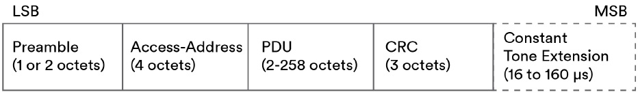

#### Frequency Deviation
선택한 무선 채널 내에서 Bluetooth는 두 가지 주파수를 사용한다. 하나는 디지털 0을 나타내고 다른 하나는 디지털 1을 표현한다. 이 두 주파수는 채널의 중심 주파수에서 주파수 편차라고 하는 값을 더하거나 빼서 도달한다.
주파수를 변경하면 파장도 변경되며 파장은 IQ 샘플에서 방향을 계산하는 데 중요한 요소이다. 이러한 이유로 CTE는 디지털 1로만 구성되고, 그 말은 즉, 전체 CTE가 하나의 주파수로 전송되고 따라서 일정한 파장을 갖게 된다는 것이다.

#### Error detection, security and whitening
CTE는 Cyclic Redundancy Check(CRC) 계산에 포함되지 않고, Message Integrity Check(MIC) 계산에 포함되지 않으며, Whitening 처리에 포함되지 않는다.

### Connectionless vs Connection-Oriented Direction Finding
Bluetooth LE 컨트롤러에 대한 Bluetooth Core Specification v5.1 방향 찾기 개선 사항을 통해 AoA 및 AoD를 각각 Connectoin-Oriented 또는 Connectionless 통신에 사용할 수 있다. 그러나 일반적인 사용 사례의 경우 AoD는 연결없는 통신에 사용되고 AoA는 연결을 통해 사용된다. 이는 Bluetooth SIG가 향후 출시 할 프로파일에 반영 될 것이다.
표 1은 AoA/AoD 및 Connectionless/Connectoin-Oriented 통신의 네 가지 가능한 순열을 보여준다다. 모두 유효하며 모든 경우에 Bluetooth LE 컨트롤러에서의 지원은 선택 사항이다.

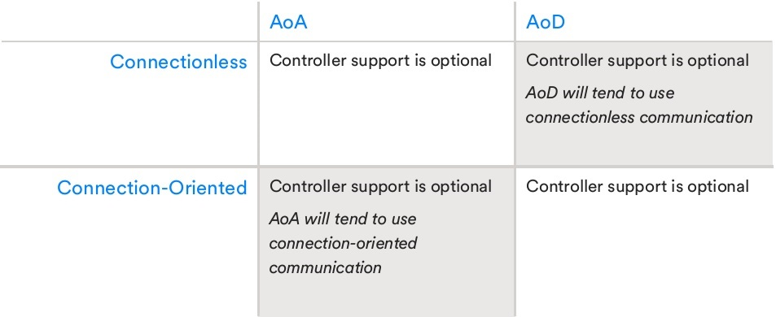

Connectionless 방향 찾기는 Bluetooth 주기적 advertising을 사용하며 CTE는 표준 ADV_EXT_IND PDU에 추가된다.
Connectoin-Oriented 방향 찾기는 LL_CTE_REQ PDU에 대한 응답으로 연결을 통해 전송되는 새로운 LL_CTE_RSP 패킷을 사용하여 CTE를 전달한다.
두 경우 모두 IQ 샘플링이 시작되고 CTE 포함 패킷이 생성되기 전에 완료해야 하는 다양한 설정 및 구성 단계가 있다. 호스트는 호스트 컨트롤러 인터페이스 (HCI) 명령을 사용하여 이 단계를 완료한다.

### The Host Controller Interface
HCI는 호스트가 방향 찾기 CTE 생성 및 수신을 위해 컨트롤러를 구성 할 수 있는 인터페이스를 제공한다. 세부 사항은 Connectionless 또는 Connection-Oriented 통신을 사용할지 여부에 따라 다르다.

#### HCI and Connectionless Scenarios
Connectionless 시나리오에서 advertising 장치의 호스트는 CTE를 사용하여 주기적으로 확장된 advertising 패킷을 생성하기 위해 여러 컨트롤러 초기화 단계를 수행해야 한다:

1. Configure extended advertising
2. Configure periodic advertising
3. Configure CTE transmission
4. Enable CTE advertising
5. Enable periodic advertising
6. Enable extended advertising
7. Set the advertising data

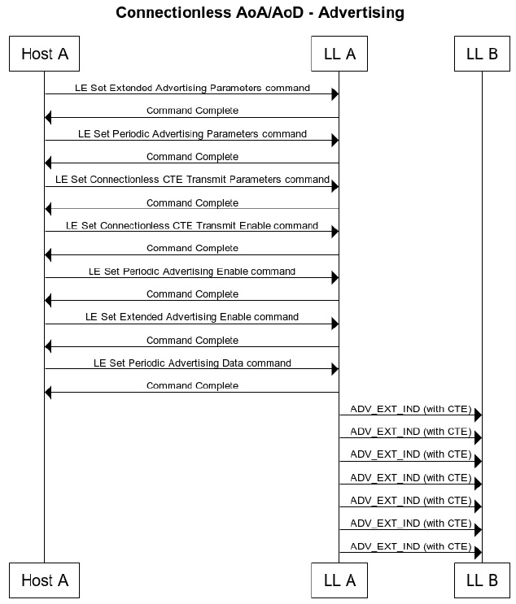

advertising 장치가 전송한 CTE 데이터를 수신하고 샘플링하려는 스캔 장치는 4 개의 컨트롤러 구성 단계를 완료한 다음 호스트에서 IQ 샘플 데이터를 수신하고 처리해야 한다:

1. Configure extended scanning
2. Start extended scanning
3. Synchronize with received periodic advertising sync packets
4. Enable connectionless IQ sampling


#### HCI and Connection-Oriented Scenarios
Connection-Oriented 시나리오에서 마스터 또는 슬레이브 장치는 다른 장치에 Constant Tone Extension을 포함하는 LL_CTE_RSP PDU를 전송하도록 요청할 수 있다. 요청은 CTE 생성을 구성하는 여러 매개 변수가 포함 된 LL_CTE_REQ PDU를 전송하여 이루어진다.
원격 장치가 CTE를 지원하지 않는 경우 LL_UNKNOWN_RSP PDU로 응답하고 로컬 장치는 현재 연결을 사용하여 LL_CTE_REQ PDU를 다시 보내지 않는다.

The requesting host device will proceed by:
1. Configuring CTE receive parameters in the controller
2. Enabling CTE requests in the controller
3. Receiving and processing IQ reports
4. Disabling CTE request transmission when no longer required

The responding host will proceed by:
1. Configuring CTE transmit parameters in the controller
2. Enabling CTE responses in the controller
3. Receiving and responding to LL_CTE_REQ PDUs from the other device

CTE 요청은 요청하는 호스트에 의해 한번만 구성 및 활성화 하면 되고 CTE 응답은 응답하는 호스트에 의해 한번만 구성 및 활성화 하면 된다. 그 후 LL_CTE_REQ 및 LL_CTE_RSP PDU는 요청이 비활성화 될 때까지 교환된다. CTE 응답이 활성화되기 전에 LL_CTE_REQ가 수신되면 LL_REJECT_EXT_IND PDU와 함께 거부된다.


#### Obtaining Antenna Array Information
HCI에는 호스트가 컨트롤러에서 지원하는 안테나에 대한 정보를 얻을 수있는 새로운 명령인 LE Read Antenna Information도 있다. 원격 장치에서 안테나 어레이에 대한 정보를 얻는 절차는 향후 프로파일에서 정의된다.

#### Parameters
새로운 HCI 명령은 호스트에게 CTE 콘텐츠와 CTE 생성 및 IQ 샘플링 수행을 위한 절차를 다양한 측면에서 구성 할 수있는 기능을 제공한다.


#### Device Roles and Responsibilities
장치가 안테나 어레이를 사용하는 경우 엄격한 타이밍 규칙에 따라 HCI 구성 명령에 지정된 패턴에 따라 안테나 스위칭을 사용해야 한다. IQ 샘플링을 수행 할 때 유사하게 엄격한 타이밍 규칙이 적용되지만 구성에 따라 약간의 변형이 가능하다. 이러한 규칙이 적용되는 방법과 어떤 장치에 어떤 규칙이 적용되는지는 AoA 또는 AoD가 사용되는지 여부와 장치가 송수신 중인지 여부에 따라 다르다.
안테나 스위칭은 안테나 어레이가 포함된 장치에 적용된다. AoD 방식을 사용하는 경우 송신 장치, AoA를 수행 할 때 수신 장치이다. 반대로, 안테나 어레이를 포함하지 않는 전송 장치는 안테나 스위칭 없이 지속적으로 Constant Tone Extension을 전송한다.
IQ 샘플링은 포함된 안테나 수에 관계없이 항상 수신 장치에서 수행된다.
아래의 표는 안테나 스위칭 및 IQ 샘플링과 관련하여 장치의 역할과 책임에 대한 간단한 요약을 제공한다.


#### Timing
CTE를 처리 할 때 스위칭과 샘플링을 모두 관리하는 타이밍 규칙은 Bluetooth core spec v5.1에 정의되어 있다. 개념적으로 CTE 처리 시간은 초기 4µs guard period, 8µs reference period, 스위치 슬롯, 샘플 슬롯 또는 스위치 및 샘플 슬롯 쌍의 시퀀스로 나뉜다. 샘플링은 샘플 슬롯 동안 발생하고 안테나는 스위치 슬롯 동안 전환된다.
AoD의 경우 CTE를 전송할 때 안테나 스위칭이 필요하지만 수신시에는 필요하지 않다. AoA를 사용하고 CTE를 수신 할 때 HCI 명령을 통해 호스트에서 제공한 구성에 따라 안테나 전환이 발생한다. 전송할 때 안테나 전환은 필요하지 않다.
많은 통신 시스템에서 사용되는 gaurd period는 인접한 전송 사이에 간격을 두어 서로 간섭하지 않도록 설계된 기술이다.
reference period 동안 1µs 간격으로 첫 번째 안테나에서 8 x IQ 샘플이 수집된다. reference period 동안 안테나 전환이 발생하지 않는다. 호스트는 8 개의 기준 샘플을 사용하여 신호의 주파수와 이로부터 파장을 추정 할 수 있다. 이를 통해보다 정확한 각도 계산을 수행 할 수 있다.

샘플과 스위치 슬롯의 길이는 1µs 또는 2µs이다. 2µs 슬롯 지원은 필수이며 1µs 지원은 선택 사항dl다. HCI 구성은 컨트롤러에서 사용할 슬롯 길이를 나타낸다.

Bluetooth core spec v5.1에 따라 아래의 표는 사용중인 전송 대 수신 장치 역할 및 AoA 대 AoD 방법에 따라 CTE에 타이밍 규칙이 적용되는 방식을 보여준다.

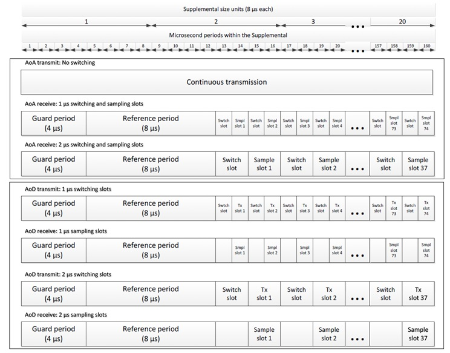

아래의 표는 사용 가능한 옵션을 동일한 데이터로 요약하여 보여준다.


### Choices of PHY
Bluetooth 방향 찾기는 LE 1M 또는 LE 2M PHY 중 하나를 사용할 수 있지만 LE Coded PHY는 사용할 수 없다.

### Developing specifications (update: 2020-12-31)
아래의 표준은 아직 draft 상태이거나 review 중인 상태이다.

|Release |Development Type    |Group   |Hidden Titles  |
|:-------|:-------------------|:-------|:--------------|
|ATP 1.0.0   |New     |Direction Finding Working Group (df)    |Asset Tracking Profile (ATP) [ATP 1.0.0]  |
|ATS 1.0.0   |New     |Direction Finding Working Group (df)    |Asset Tracking Service (ATS) [ATS 1.0.0]  |
|Constant Tone Extension Service |New |Direction Finding Working Group (df) |Constant Tone Extension Service [Constant Tone Extension Service (CTES 1.0)]  |
|Indoor Positioning Service (IPS)    |Enhancement    |Direction Finding Working Group (df)    |IPS 1.0.1  |
|IPP 1.0.0   |New |Direction Finding Working Group (df) |Indoor Positioning Profile (IPP) [IPP 1.0.0]  |
|IPS 1.1.0   |Enhancement |Direction Finding Working Group (df) |Enhancements for Indoor Positioning Service (IPS) IPS 1.1.0  |
|Ranging Service (RAS) 1.0.0 |New |Direction Finding Working Group (df) |Ranging Service (RAS) [Ranging Service (RAS) 1.0.0]  |