# BT 5.x overview

## PHY

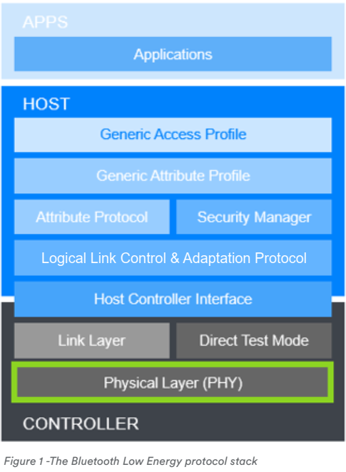

We can select a PHY between 3 types of PHYs since the additional 2 PHYs have been defined in BT 5.0.

The 3 PHYs are below.

* LE 1M 
* LE 2M 
* LE Coded 

## LE 1M 

It has been used in BT 4.x, and it adopted Gaussian Frequency Shift Keying(GFSK) modulation and its symbol-rate is 1Ms/s(sample per second).

## LE 2M 

LE 2M PHY adopts 2Ms/s symbol-rate.

Read this good article: https://punchthrough.com/crash-course-in-2m-bluetooth-low-energy-phy/ 

### Problem definition

When using 1Msps (sample per second), power consumption and throughput problems were raised. 

In the case of a device (mobile phone) using BR/EDR/WLAN and COEX, if the same antenna is used, more transmission interleave is performed for short packets in the time domain. It causes a lot of power consumption and throughput problems. 

This problem is the reason why SIG defined 2Msps. If 2Msps is used, average power consumption can be reduced and throughput can be effectively increased. 

### Comparing with 1M 

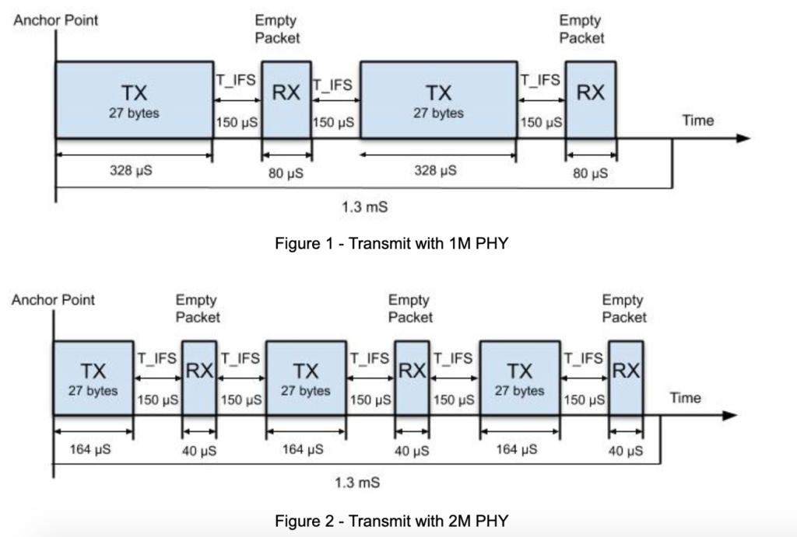

## LE Coded 

Even without increasing Tx power, through LE Coded PHY, the range gain is almost 4 times.

### Problem definition 

The current communication distance should be relatively short to secure communication reliability even in low throughput applications. So, although it has a limit of 1 Msps, it is possible to have a nominal 12dB increase in sensitivity compared to the existing BLE PHY with LE Coded PHY.

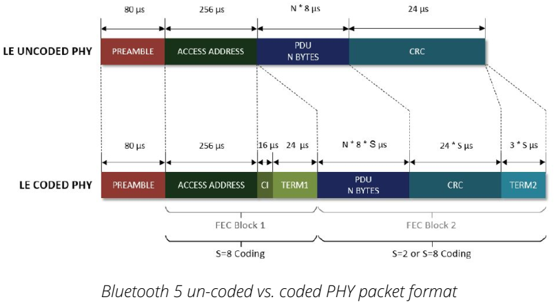

| LE Coded PHY   | Symbol rate  | Error detection | Error Correction | Range multiplier | PDU length | Minimum packet time | Maximum packet time | Maximum throughput |
| :------------- | :----------- | :-------------- | :--------------- | :--------------- | :--------- | :------------------ | :------------------ | :----------------- |
| 125kbps (S=8)  | 1M symbols/s | CRC             | FEC              | 2                | 0-257B     | 720 us              | 17040 us            | 382 kbps           |
| 500 kbps (S=2) | 1M symbols/s | CRC             | FEC              | 4                | 0-257B     | 462 us              | 4542 us             | 112 kbps           |

[Source: https://www.silabs.com/whitepapers/bluetooth-5-refined-for-the-iot](https://www.silabs.com/whitepapers/bluetooth-5-refined-for-the-iot)

## PHY Update 

### Master initiated PHY Update procedure 

1. master requests a change of PHY, PHY changed in at least one direction 
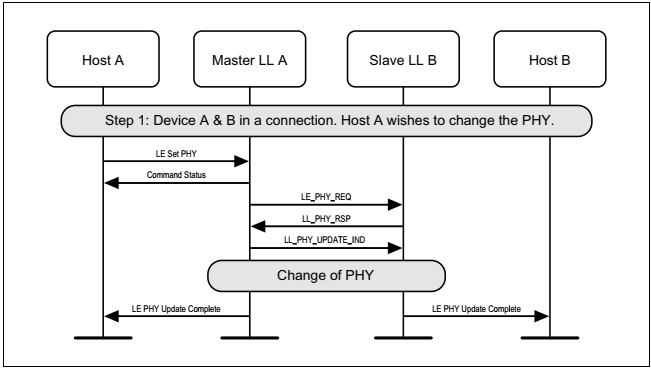

2. PHY not changed (either because slave doesn't specify PHYs that the master prefers, or because the master concludes that the current PHYs are still best)
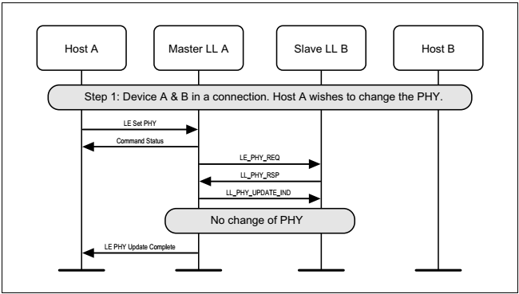

3. master requests a change of PHY, slave does not support the feature
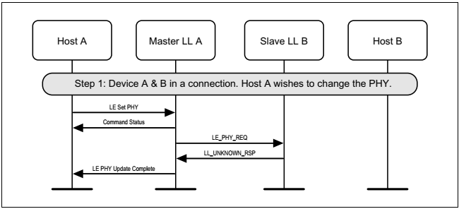

### Slave initiated PHY Update procedure 

1. slave requests a change of PHY, PHY changed in at least one direction
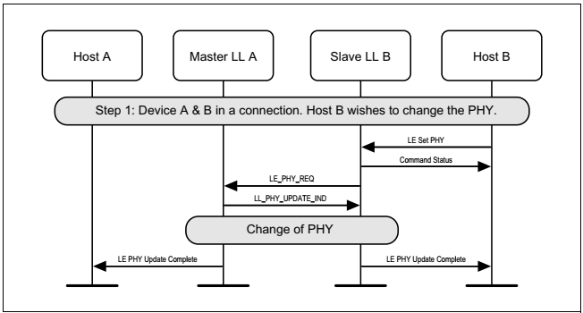

2. PHY not changed (either because slave doesn't specify PHYs that the master prefers, or because the master concludes that the current PHYs are still best) 
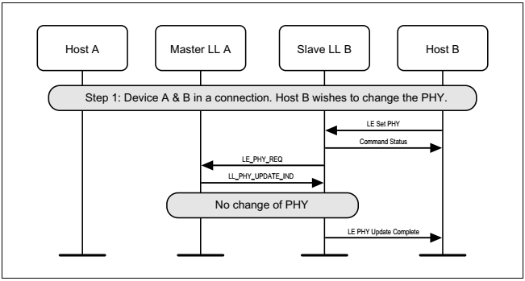

3. slave requests a change of PHY, master does not support the feature 
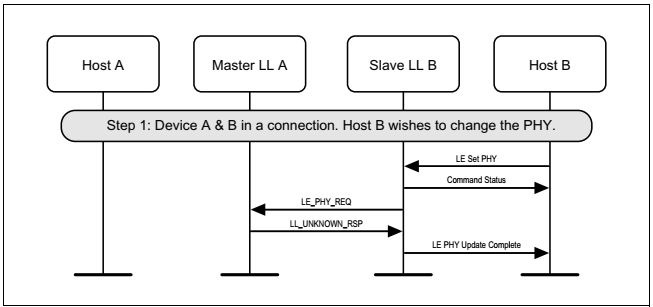

### Autonomous master-initiated PHY Update procedure 

1. master requests a change of PHY, slave accepts, PHY changed in at least one direction

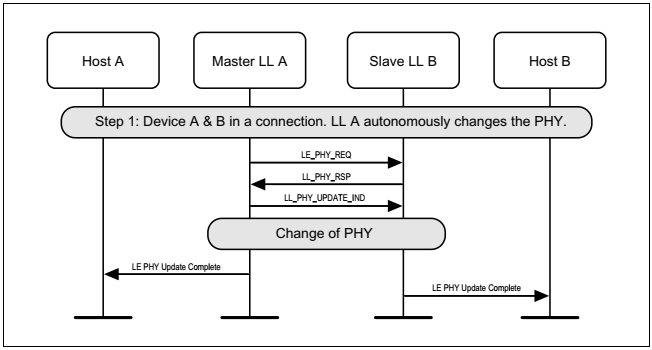

2. master requests a change of PHY, PHY not changed (either because slave doesn't specify PHYs that the master prefers, or because the master concludes that the current PHYs are still best)

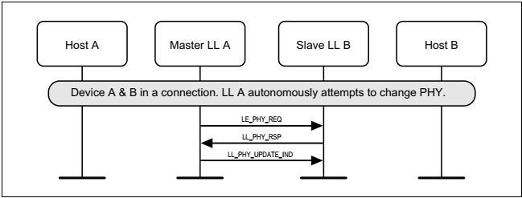

### Master and slave crossover PHY Update procedure 

master and slave request a change of PHY concurrently

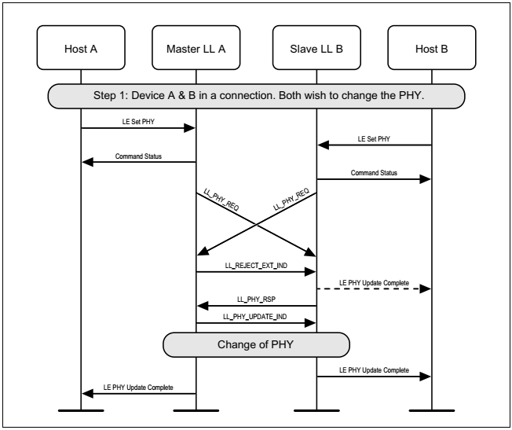

## Advertising extensions

BLE physical channels are classified to Primary channels and Secondary channels.

* Primary channels are Advertisement channels and have channel numbers 37, 38, 39, and are positioned to avoid over-wrap with Wi-Fi channels.
* Secondary channels are channels other than 37, 38, and 39 and are used for data communication (connection event).

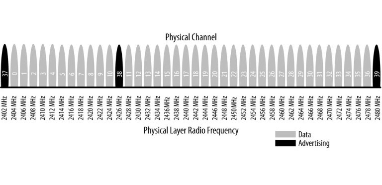
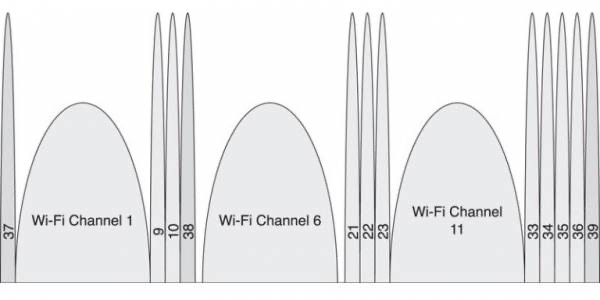

In BT 4.x, advertising packet has a length of 37 octets, and if 6 octets in the header are subtracted, only 31 octets can be used as payload.

In BT 5.0, advertising packet can be sent up to 255 octets by offloading 0 to 36 channels (Secondary channels).


### Advertising and Scan Response Data format
```text
BT 5.2. Vol3, Part C Generic Access Profile, Chapter 11
```

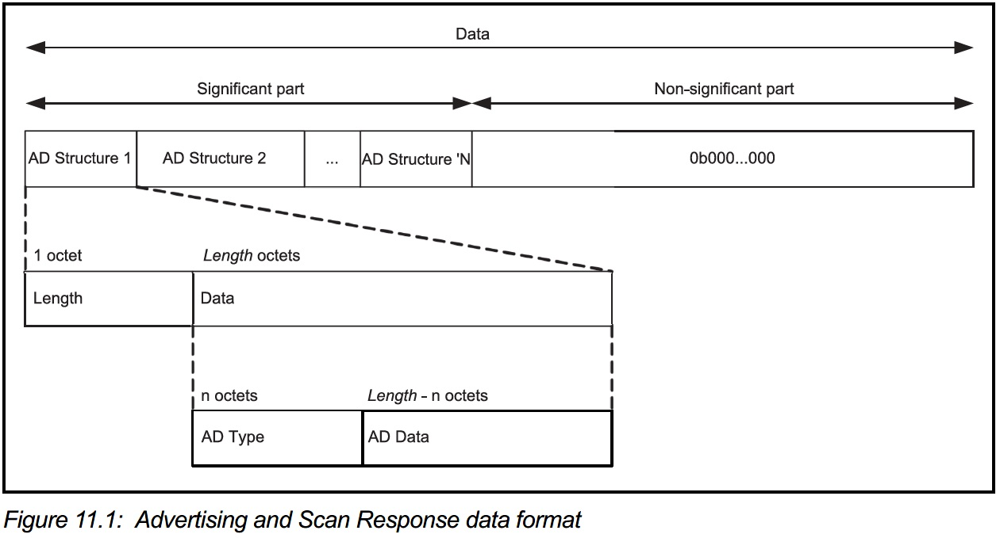

AD Types are defined in [GAP related page on SIG's Assigned Number](https://www.bluetooth.com/specifications/assigned-numbers/generic-access-profile/).

| Name                            | Actual data length in bytes | Description                                                                                                                  |
| :------------------------------ | :-------------------------- | :--------------------------------------------------------------------------------------------------------------------------- |
| Flags                           | 1(extensible)               | Used to set limited or general discovery mode, as described in Discovery                                                     |
| Local Name                      | variable                    | Partial or complete user-readable local name in UTF-8                                                                        |
| Appearance                      | 2                           | A 16-bit value describing the type of device sending the advertising packet                                                  |
| TX Power Level                  | 1                           | The power level in dBm used to transmit the advertising packet, useful to calculate path loss at the observer or central end |
| Service UUID                    | variable                    | A complete or partial list of GATT services offered by the device sending the packet (as a GATT server)                      |
| Slave Connection Interval Range | 4                           | A suggestion to the central about the connection interval range that best fits this peripheral                               |
| Service Solicitation            | variable                    | A list of GATT services supported by the device sending the packet (as a GATT client)                                        |
| Service Data                    | variable                    | A UUID representing a GATT service and its associated data                                                                   |
| Manufacturer Specific Data      | variable                    | Freely formattable data, to be used at the discretion of the implementation                                                  |

* Advertising data is carried on advertising event or periodic advertising event.
* Host Advertising data is loaded in the AdvData field of the packet below.
	* ADV_IND
	* ADV_NONCONN_IND
	* ADV_SCAN_IND
	* AUX_ADV_IND
	* AUX_CHAIN_IND
* Additional Controller Advertising Data is carried in the ACAD field of the packet below.
	* AUX_ADV_IND
	* AUX_SYNC_IND
	* AUX_SCAN_RSP
* Periodic Advertising data is carried in the AdvData field of the packet below.
	* AUX_SYNC_IND
	* AUX_CHAIN_IND
* Scan Response data is loaded in the field below.
	* SCAN_RSP 패킷의 ScanRspData field
	* AUX_SCAN_RSP의 AdvData field
* If all data could not be included in the AdvData field of AUX_ADV_IND, AUX_SYNC_IND, or AUX_SCAN_RSP, the AUX_CHAIN_IND packet is used to transmit the remaining data.

### 2.3.4.5. AuxPtr (aux_ptr)
The advertising payload transmitted to the secondary channels is indicated by the AuxPtr field of the extended header newly added to the ADV packet of the primary channel.

```c
extended_header {
    u8 extended_header_flag;
    u8 adv_address[6];
    u8 target_address[6];
    u8 rfu;
    u8 adv_data_info[2];
    u8 aux_ptr[3];
    u8 sync_info[18];
    u8 tx_power;
    u8 additional_controller_advertising_data[extended_header_length-(1+(additional field size as specified))];
}
```

```c
aux_ptr {
    bit channel_index[6];
    bit clock_accuracy;
    bit offset_unit;
    bit aux_offset[13];
    bit aux_phy[3];
}
```

#### offset_unit

| Value | Units |
| :---- | :---- |
| 0     | 30us  |
| 1     | 300us |

#### aux_phy

| Value     | PHY used                |
| :-------- | :---------------------- |
| 000b      | LE 1M                   |
| 001b      | LE 2M                   |
| 010b      | LE Coded                |
| 011b~111b | Reserved for future use |

#### clock_accuracy

| CA Value | Advertiser's Clock Accuracy |
| :------- | :-------------------------- |
| 0        | 51ppm ~ 500ppm              |
| 1        | 0ppm ~ 50ppm                |

## Advertising packet chaining
When sending data larger than 255 octets, it can be sent using the advertising packet chaining feature.


### 2.3.4.9 Host Adverising Data
Advertising data set by Host. Supports fragmentation and the data before fragmentation shall not exceed 1650 octets.

## Advertising sets
* Advertising set functions to classify packets by ID.
* Each advertising set has its own advertising parameters such as advertising interval and PDU type.
* The host initially informs the controller about the advertising set and each parameter, and the link layer in the controller handles this.

### 2.3.4.4. AdvDataInfo (adv_data_info) 
```c
adv_data_info {
    bit advertising_data_id[12];
    bit advertising_set_id[4];
}
```
* **advertising_set_id**: ID to identify advertising set
* **advertising_data_id**: ID to identify whether the data content within the AdvData is a duplicate of the previously sent AdvData.


## Periodic advertising
In BT 5.0, GAP (Generic Access Profile) supports synchronous mode and asynchronous mode. When operating in synchronous mode, the Periodic Advertising Synchronization Establishment procedure is performed. When operating in synchronization mode, periodic advertising has a new header field called SyncInfo that contains timing and timing offset information. For this purpose, AUX_SYNC_IND has been added.

### 2.3.4.6 SyncInfo
```c
sync_info {
    bit sync_packet_offset[13];
    bit offset_units;
    bit rfu[2];
    u8 interval[2];
    bit channel_map[37];
    bit sleep_clock_accuracy[3];
    u8 access_address[4];
    u8 crc_init[3];
    u8 event_counter[2];
}
```
### AUX_SYNC_IND transmission window 
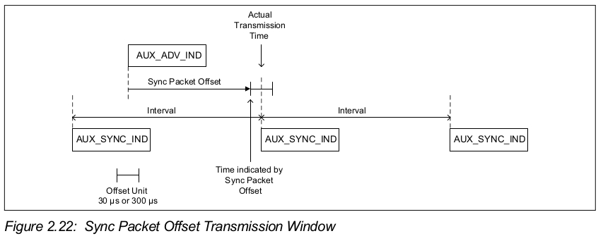

## Reduces Burden and Improves Recognition Performance
In BT 4.x, the same data had to be repeatedly transmitted three times through the primary channel, but in BT 5.0, only the header is repeated and the actual data is transmitted through the secondary channel to reduce the burden.

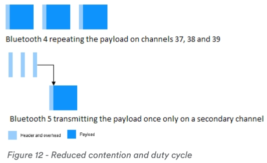

As the burden is reduced in this way, the minimum advertising interval is reduced from 100ms to 20ms. This has the effect that the scanning device recognizes the advertising packet more quickly.

## Advertising using ADV_EXT_IND
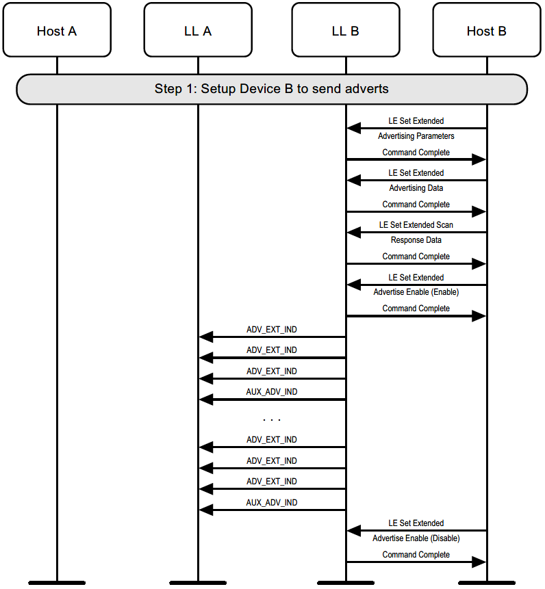

## Periodic advertising
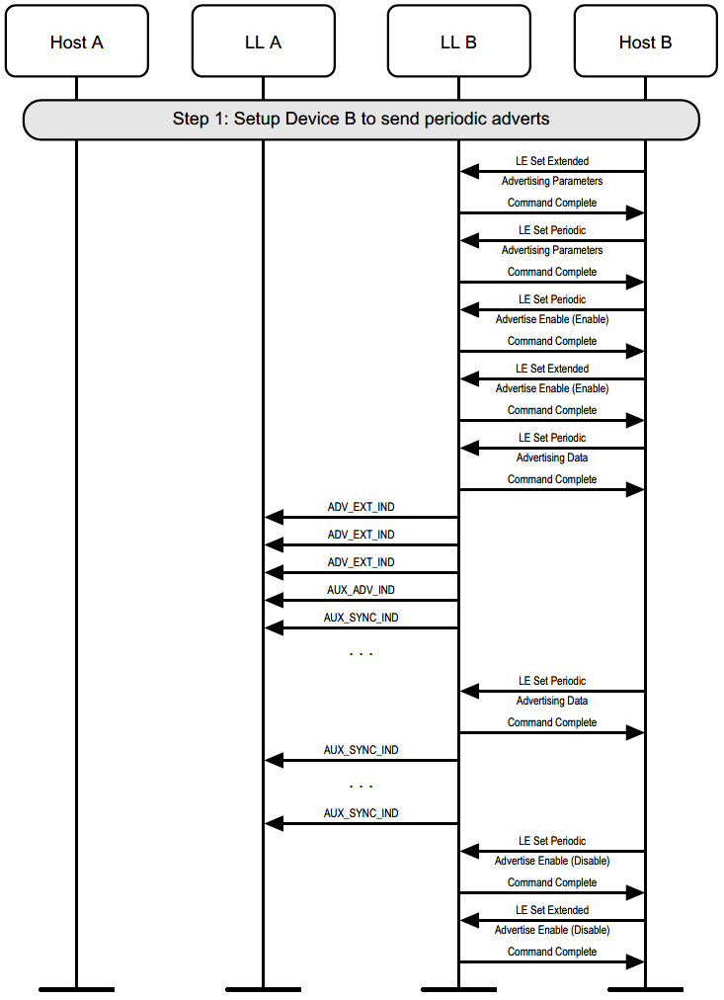

## Bluetooth Direction Finding

### About Bluetooth Direction Finding
The first wireless direction finding work was done by pioneers such as Heinrich Hertz at the end of the 19th century. Early systems worked by comparing the strength of the signal when measured with antennas pointing in different directions. The direction in which the strongest signal strength was measured was considered as the starting direction of the signal.
During the 20th century, work continued in the field, and new methods were introduced, especially those relating to signal phase comparison, which gave much better results.
Bluetooth Core Spec v5.1 introduces a new function to support high-precision direction finding. The controller specification has been improved to allow the antenna array to support the calculation of the direction of the received radio signal using special hardware integrated. The HCI (Host Controller Interface) has also been modified so that the data collected by the controller can be directional in the upper layers of the stack.

#### Two Direction Finding Methods
Bluetooth direction finding offers two distinct architectures or methods, each leveraging the same underlying foundation. Of the two methods, the first is called Angle of Arrival (AoA) and the second is called Angle of Departure (AoD).
In each case, a special direction finding signal is transmitted from one device and the direction of the signal received from another device is calculated.

A receiver using AoA has a multi-antenna array as shown in the figure below.

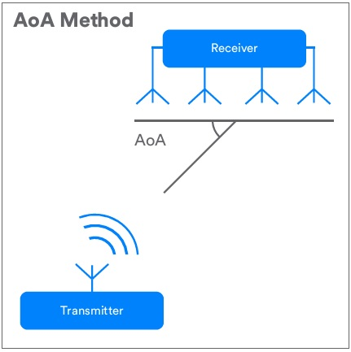

With AoD, a transmitting device with an antenna array is made as shown in the figure below.

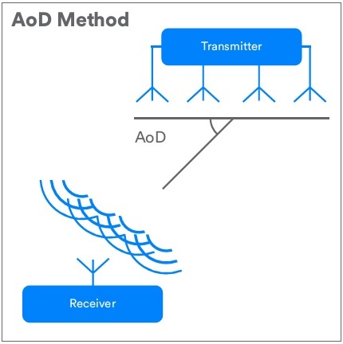

### Direction Finding Theory
Bluetooth direction finding leverages some of the basic properties of radio waves to gather data that can be used in direction finding calculations.
The application uses trigonometry and calculation data containing information about antenna array design.
The description of wave properties related to Bluetooth direction finding is as follows.

#### Wave Cycle
The wave has a repeating pattern of maximum and minimum amplitude. The repetition of a wave with an amplitude of zero, passing through the highest point, and then rising again, of amplitude zero, passing through the lowest point, is called a wave cycle. The concept of a wave cycle is shown in the figure below.

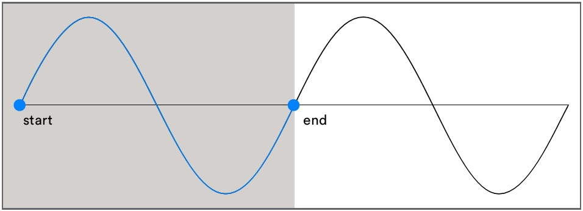

#### Wavelength
Wavelength is the distance between the start and end of the entire wave cycle, as shown in the figure below. By frequency, the wavelength of Bluetooth is about 12.5 cm.

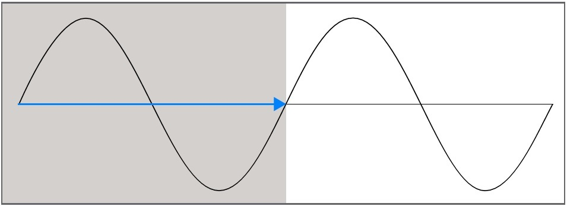

#### Frequency
Bluetooth operates in the ISM (Industrial Science and Medical) band from 2.40 GHz to 2.41 GHz.
Bluetooth LE (Low Energy) divides this band into 40 channels, each 2 MHz wide. Upon connection, the device uses 37 of the available channels with frequency changes driven by an adaptive frequency hopping algorithm. All 40 radio channels are used when using the extended advertising introduced in Bluetooth Core Specification v5.0 in a connectionless scenario. As a result, communication using Bluetooth involves multiple frequencies rather than one fixed frequency. The wavelength, which is an important factor in Bluetooth direction finding, depends on the frequency being used.

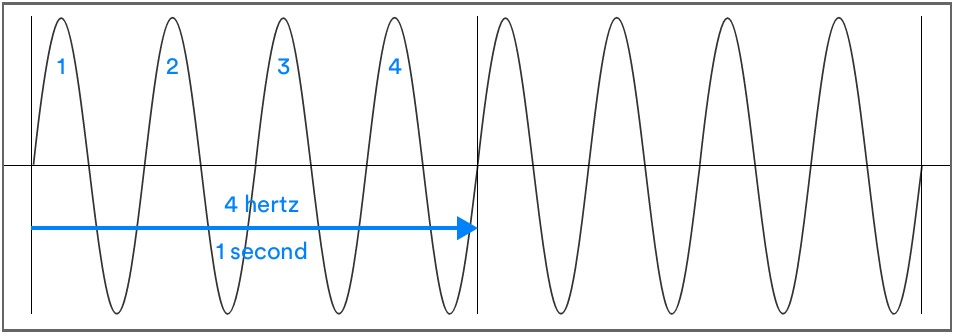

#### Phase
The specific point in the wave cycle that is measured as the wave passes through the antenna is called the phase. Phase is measured in degrees from 0 at the beginning of the wave cycle to 360 degrees or 2π radians at the end of the wave cycle. The figure below shows the concept of phase.

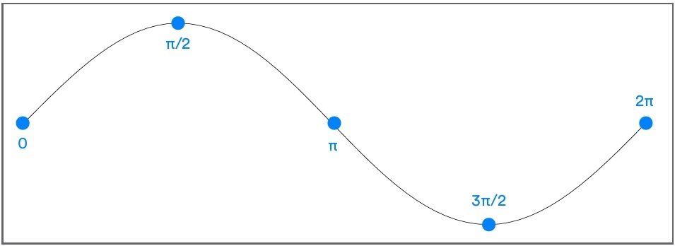

#### Using Phase to Determine Signal Direction
When a transmitter emits a signal, the signal spreads out in three dimensions at the speed of light, provided there are no barriers or other factors that can interfere with the signal. Its path is like an expanding sphere, and the waves at the surface of that sphere have a steadily decreasing amplitude as the energy contained in the transmission is larger and spreads over a larger surface area. As the sphere grows in size, it moves away from the transmitter.
Simplifying this idea, it's easier to think in two dimensions rather than three, with signals that trace circular paths, such as ripples that appear in a pool of water when a stone is thrown.
If you imagine an antenna placed in the path of a signal, the phase of that wave changes continuously from 0 to 360 degrees as it passes.
Let's measure the phase at a given time (t) and call that value p1.
If you place another antenna in the signal path somewhere on the circumference of the circle passing through the first antenna, the second antenna has a distance exactly equal to the distance from the transmitter to the first antenna.
Since the wave passing through each antenna has the same frequency, the wavelength is the same, and when the phase (p2) of the wave is measured at the second antenna at the same time as the first antenna, the phase must be the same as p1. See picture below.

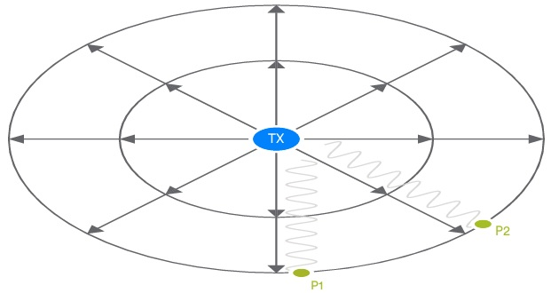

Now measure p1 and p2 at time (t) if the second antenna is moved closer to the transmitter taking care that the difference between the distance from antenna 1 to the transmitter and from antenna 2 to the transmitter is not an exact multiple of the wavelength Then, different phase values can be obtained from each of the two antennas.

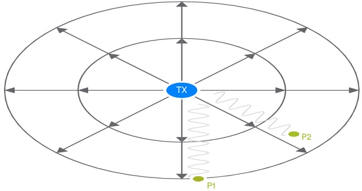

If you know the distance (straight line) between the two antennas, the phase difference (p2-p1), and the wavelength of the signal, you can use basic trigonometry to calculate the signal angle as shown in the figure below.

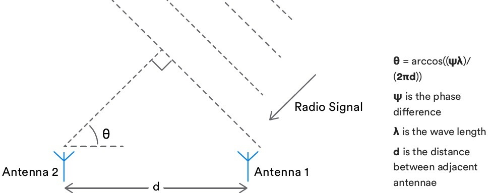

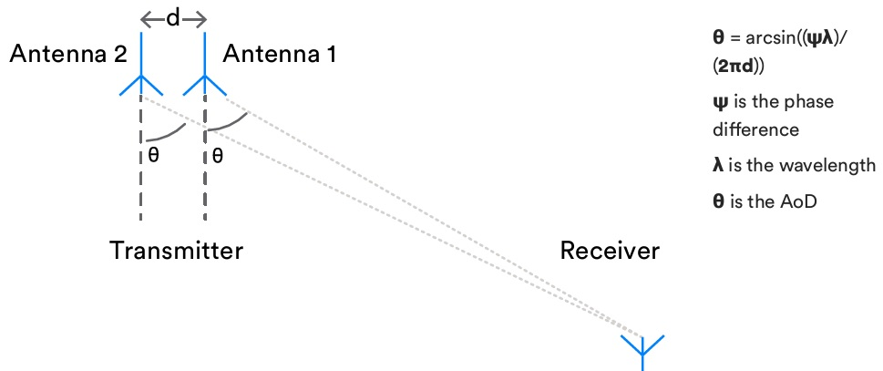

### Sampling
Bluetooth direction finding uses specially formulated direction finding signals. A device receiving one of these signals makes multiple phase and amplitude measurements at precise intervals in a process known as In-phase and Quadrature Sampling, or simply IQ Sampling. A single IQ sample consists of the amplitude and phase angle of a wave expressed in a series of Cartesian coordinates. Applications can transform the orthogonal representation into corresponding polar coordinates yielding phase angle and amplitude values.

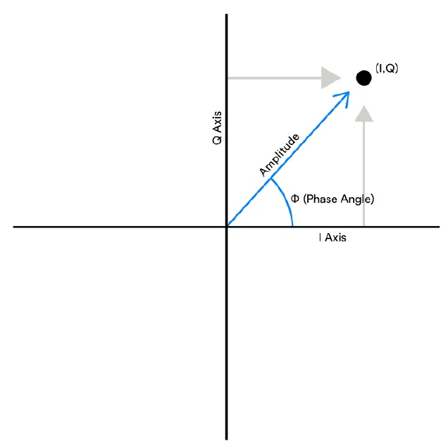

When performing IQ sampling on a device with an antenna array, each captured sample must belong to a specific antenna in the array.
For AoA, the receiver contains an array of antennas and performs IQ sampling at each antenna in the appropriate order.
In the case of AoD, it is a transmitter with an antenna array, but it is still the receiver that performs IQ sampling on a single antenna, performs measurements, and attributes using the remote transmitter's antenna array design details for direction calculation. So, for AoD to work, we need a way to provide the receiver with details about the transmitter's antenna arrangement. A profile defining how to do this will be published by the Bluetooth Special Interest Group (SIG) in the future.

### Antenna Arrays
Antenna arrays may have various designs and number of antennas. A discussion of the pros and cons of various designs is beyond the scope of this white paper, but an understanding of how designs may differ will help understand the need for information defining an antenna array when calculating the direction of a signal from IQ sample data. will be The figure below shows some examples of antenna array designs.

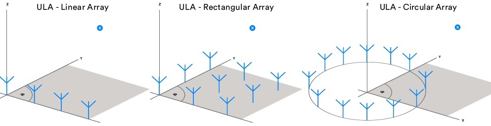

A simple linear design like ULA allows you to compute a single angle from the signal. Two or three angles can be derived with more complex antenna array designs. For example, it is often necessary to calculate both the elevation and azimuth of a signal relative to a reference plane. See picture below.

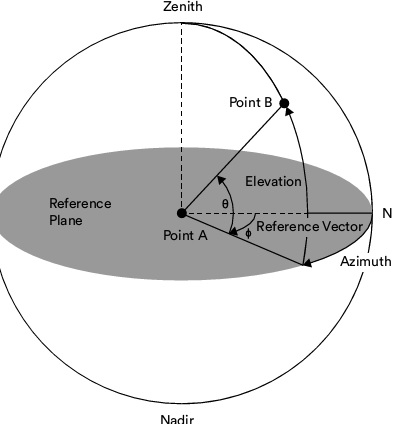

The intersection of the lines described at these angles can be used to accurately locate the receiver device with high accuracy measured in centimeters.

### Bluetooth Direction Finding Signals
#### What is a direction finding signal?
The new Bluetooth direction finding signal is an essential part of how Bluetooth direction finding works.
The direction finding signal provides a constant source of signal material to which IQ sampling can be applied. A new link layer PDU is defined for direction finding between two connected devices, and a method using the existing advertising PDU for direction finding for connectionless direction finding is defined. In each case, additional data called CTE (Constant Tone Extension) is added to the PDU.

#### The Constant Tone Extension
A CTE consists only of a series of symbols, each represented by a binary one. The number of symbols contained within a CTE can be set by the upper layers of the stack, thus setting the right amount of data and time for IQ sampling performed by receivers whose sampling capabilities can vary widely.

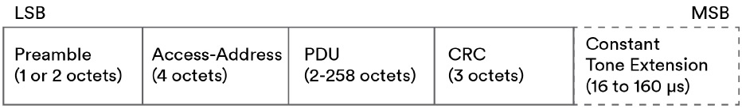

#### Frequency Deviation
Within the selected radio channel, Bluetooth uses two frequencies. One represents digital 0 and the other represents digital 1. These two frequencies are reached by adding or subtracting a value called the frequency deviation from the center frequency of the channel.
Changing the frequency also changes the wavelength, and the wavelength is an important factor in calculating the direction in the IQ sample. For this reason, the CTE consists only of digital ones, which means that the entire CTE is transmitted on one frequency and thus has a constant wavelength.

#### Error detection, security and whitening
CTE is not included in Cyclic Redundancy Check (CRC) calculation, Message Integrity Check (MIC) calculation, and whitening processing.

### Connectionless vs Connection-Oriented Direction Finding
Bluetooth Core Specification v5.1 direction finding enhancements for Bluetooth LE controllers enable AoA and AoD to be used for Connectoin-Oriented or Connectionless communication respectively. However, for a typical use case, AoD is used for connectionless communication and AoA is used over connection. This will be reflected in the profiles that the Bluetooth SIG will release in the future.
Table 1 shows the four possible permutations of AoA/AoD and Connectionless/Connectoin-Oriented communication. All are valid and in all cases support in Bluetooth LE controllers is optional.

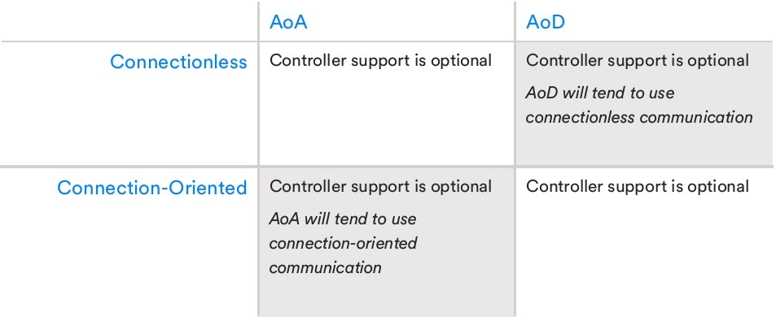

Connectionless direction finding uses Bluetooth periodic advertising and the CTE is added to the standard ADV_EXT_IND PDU.
Connectoin-Oriented direction finding delivers the CTE using a new LL_CTE_RSP packet transmitted over the connection in response to the LL_CTE_REQ PDU.
In either case, there are various setup and configuration steps that must be completed before the IQ sampling begins and the CTE containing packet is generated. The host completes this step using the Host Controller Interface (HCI) command.

### The Host Controller Interface
HCI provides an interface through which the host can configure the controller to generate and receive direction finding CTEs. The details depend on whether you want to use Connectionless or Connection-Oriented communication.

#### HCI and Connectionless Scenarios
In a connectionless scenario, the advertising device's host must perform several controller initialization steps to generate periodic extended advertising packets using the CTE:

1. Configure extended advertising
2. Configure periodic advertising
3. Configure CTE transmission
4. Enable CTE advertising
5. Enable periodic advertising
6. Enable extended advertising
7. Set the advertising data

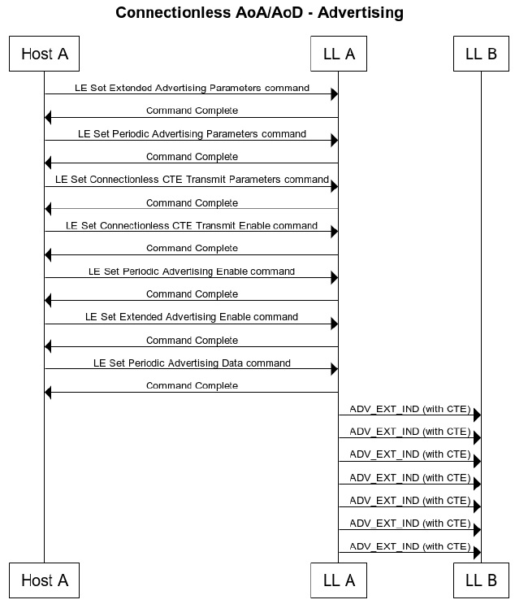

A scanning device that wants to receive and sample the CTE data sent by the advertising device must complete the four controller configuration steps and then receive and process the IQ sample data from the host:

1. Configure extended scanning
2. Start extended scanning
3. Synchronize with received periodic advertising sync packets
4. Enable connectionless IQ sampling

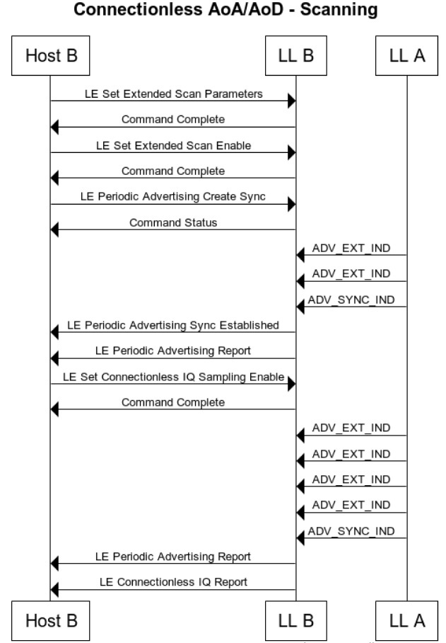

#### HCI and Connection-Oriented Scenarios
In a Connection-Oriented scenario, a master or slave device may request another device to transmit an LL_CTE_RSP PDU containing Constant Tone Extension. The request is made by sending an LL_CTE_REQ PDU containing several parameters that constitute the CTE generation.
If the remote device does not support CTE, it responds with an LL_UNKNOWN_RSP PDU and the local device does not send back an LL_CTE_REQ PDU using the current connection.

The requesting host device will proceed by:
1. Configuring CTE receive parameters in the controller
2. Enabling CTE requests in the controller
3. Receiving and processing IQ reports
4. Disabling CTE request transmission when no longer required

The responding host will proceed by:
1. Configuring CTE transmit parameters in the controller
2. Enabling CTE responses in the controller
3. Receiving and responding to LL_CTE_REQ PDUs from the other device

The CTE request needs to be configured and activated only once by the requesting host, and the CTE response needs to be configured and activated only once by the responding host. The LL_CTE_REQ and LL_CTE_RSP PDUs are then exchanged until the request is deactivated. If LL_CTE_REQ is received before the CTE response is activated, it is rejected with an LL_REJECT_EXT_IND PDU.

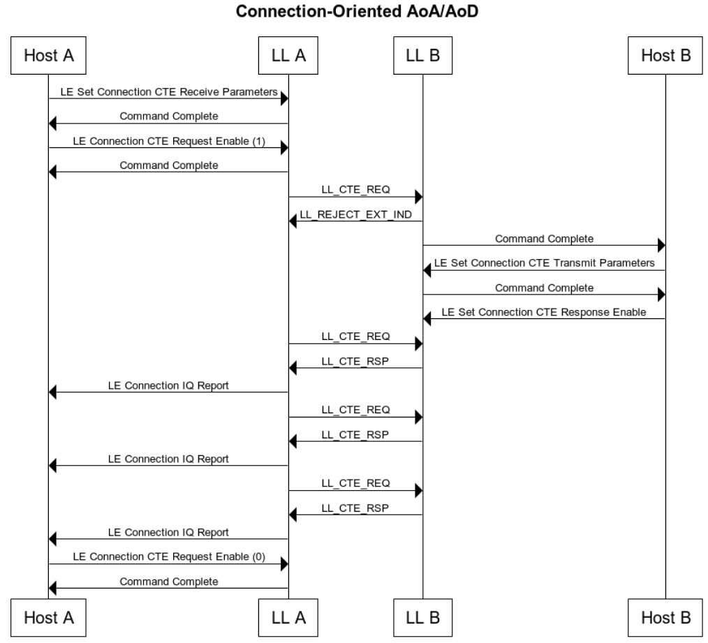

#### Obtaining Antenna Array Information
HCI also has a new command, LE Read Antenna Information, that allows the host to get information about the antennas supported by the controller. The procedure for obtaining information about the antenna array from a remote device will be defined in a future profile.

#### Parameters
The new HCI commands give the host the ability to configure various aspects of the CTE content and procedures for generating CTEs and performing IQ sampling.

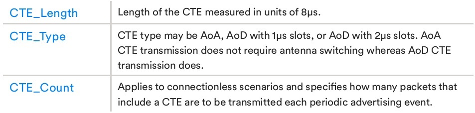

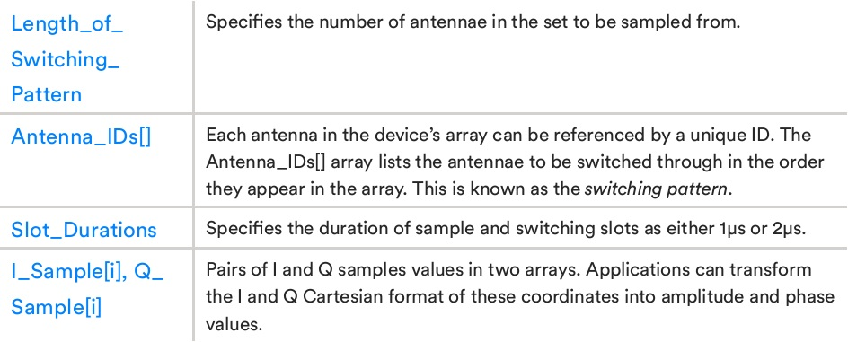

#### Device Roles and Responsibilities
If the device uses an antenna array, strict timing rules require that antenna switching be used according to the pattern specified in the HCI configuration command. Similar strict timing rules apply when performing IQ sampling, but with some variations depending on configuration. How these rules apply and which rules apply to which device depends on whether AoA or AoD is being used and whether the device is transmitting or receiving.
Antenna switching applies to devices that contain an antenna array. It is a transmitting device when using AoD, and a receiving device when performing AoA. Conversely, a transmitting device that does not include an antenna array continuously transmits constant tone extension without antenna switching.
IQ sampling is always performed at the receiving device regardless of the number of antennas included.
The table below provides a brief summary of the roles and responsibilities of devices with respect to antenna switching and IQ sampling.

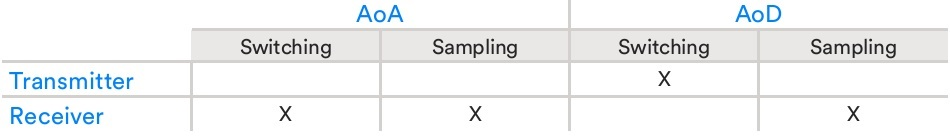

#### Timing
Timing rules governing both switching and sampling when processing CTE are defined in Bluetooth core spec v5.1. Conceptually, the CTE processing time is divided into an initial 4 µs guard period, an 8 µs reference period, a switch slot, a sample slot, or a sequence of switch and sample slot pairs. Sampling occurs during the sample slot and the antenna is switched during the switch slot.
For AoD, antenna switching is required when transmitting the CTE, but not required when receiving. When using AoA and receiving a CTE, antenna switching occurs according to the configuration provided by the host via the HCI command. Antenna switching is not required when transmitting.
The gaurd period used in many communication systems is a technology designed not to interfere with each other by spacing between adjacent transmissions.
8 x IQ samples are collected from the first antenna at 1 µs intervals during the reference period. Antenna switching does not occur during the reference period. The host can use the 8 reference samples to estimate the frequency of the signal and the wavelength from it. This allows for more accurate angle calculations.

Sample and switch slots are either 1 µs or 2 µs in length. 2µs slot support is mandatory and 1µs support is optional. The HCI configuration indicates the slot length to be used by the controller.

According to the Bluetooth core spec v5.1, the table below shows how the timing rules are applied to the CTE according to the transmission versus reception device role being used and the AoA versus AoD method.

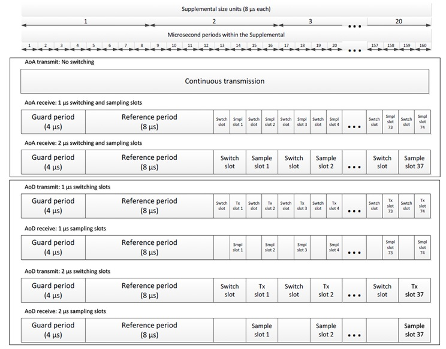

The table below summarizes the available options with the same data.

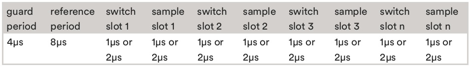

### Choices of PHY
Bluetooth direction finding can use either the LE 1M or LE 2M PHY, but not the LE Coded PHY.

### Developing specifications (update: 2020-12-31)
The standards below are still in draft or under review.

|Release |Development Type    |Group   |Hidden Titles  |
|:-------|:-------------------|:-------|:--------------|
|ATP 1.0.0   |New     |Direction Finding Working Group (df)    |Asset Tracking Profile (ATP) [ATP 1.0.0]  |
|ATS 1.0.0   |New     |Direction Finding Working Group (df)    |Asset Tracking Service (ATS) [ATS 1.0.0]  |
|Constant Tone Extension Service |New |Direction Finding Working Group (df) |Constant Tone Extension Service [Constant Tone Extension Service (CTES 1.0)]  |
|Indoor Positioning Service (IPS)    |Enhancement    |Direction Finding Working Group (df)    |IPS 1.0.1  |
|IPP 1.0.0   |New |Direction Finding Working Group (df) |Indoor Positioning Profile (IPP) [IPP 1.0.0]  |
|IPS 1.1.0   |Enhancement |Direction Finding Working Group (df) |Enhancements for Indoor Positioning Service (IPS) IPS 1.1.0  |
|Ranging Service (RAS) 1.0.0 |New |Direction Finding Working Group (df) |Ranging Service (RAS) [Ranging Service (RAS) 1.0.0]  |
