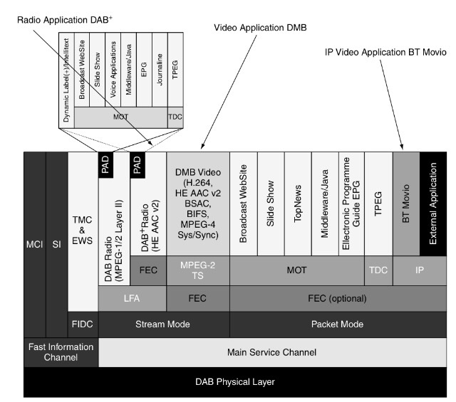
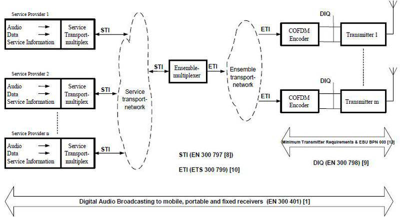

# dab

## Spec. study
[ETSI DAB specificaitons](http://portal.etsi.org/broadcast/dab.asp)

### DAB system standards and guidelines

  * EN 300 401 v1.4.1 : "main DAB" standard
  * TR 101 496 : main guideline document. 3개의 문서로 나누어짐(TR 101 496-1,2,3).
  * TS 100 756 : register table, signaling value를 정의
  * TS 102 367 : CAS(conditional access system) 설명
  * TS 101 757 : 테스트 절차와 테스트 비트스트림에 대해 설명
  * EN 301 700 : FM-RDS service를 tuning 할 수 있는 서비스 정보를 DAB receiver에 알려주는 방법 설명

### DAB receiver standards and documents

  * EN 50248: characteristics of DAB receivers
  * EACEM TR-004 : EMC directive; DAB receiver를 위한 EMC test의 specific reference, requirement, method 그리고 test condition을 정의한다.
  * EN 50255 : DAB receiver와 data decoder들간의 인터페이스를 설명.
  * EN 50320 : DAB receiver를 제어하기 위한 command set을 설명. 이 command set은 서로 다른 물리적 버스 시스템 상에서 이용되는 것을 지향함.
  * TR 101 758 : 만족스러운 DAB system 운용을 위해 호환 receiver 감도와 필수 필드를 추출하는 강도에 대한 일반적인 원칙에 대해 설명.

### DAB transmission and network standards and documents

  * EN 300 797 : STI(service transport interface)를 통해 DAB service component, service information, control information의 전송을 위한 표준화된 방법을 제공한다.
  * TS 101 860 : EN 300 797에서 정의된 기능의 구현과 이용에 대한 가이드
  * EN 300 798 : DAB SFN에서 각 송신 사이트에 위치된 전통적인 DAB 채널 코딩에서 이용된다. 이 표준은 DAB OFDM generator의 두 개(baseband processing equipment, RF modulator) 주요 요소에 알맞는 인터페이스 특성을 설명한다.
  * ETS 300 799 : 앙상블 멀티플렉서와 SFN 전송 사이트에 위치한 DAB 변조 장치 사이에 DAB 신호 배치 방법을 정의한다.
  * "MINIMUM requirements for Terrestrial DAB Transmitters" : EN 300 401에 따르는 지상파 DAB 전송기의 최소 요구사항 모음
  * EBU BPN 003 : 네트워크 개념과 지상파 DAB 망 계획에 대한 설명을 위한 주 파라미터들을 고려한다.

### Additional DAB standards and documents for data transmission

  * EN 301 234 : DAB 시스템에서 이용하는 다양한 종류의 데이터를 브로드캐스팅 할 수 있게 하는 MOT protocol을 정의
  * TR 101 497 : MOT version 1.xx의 가이드를 제공. version 2.11과 이후 버전의 MOT specification과는 관계없다.
  * TS 101 498 : 서비스들에 대한 정보를 제공하기 위한 콘텐트 포맷으로 HTML을 이용할 수 있도록 DAB broadcast Web Site application에 대해 정의한다.
  * TS 101 499 : 이미지의 포맷 정보와 함께 슬라이드 이미지를 전송하기 위해 요구되는 기술들을 정의; MOT SlideShow; User Application Specification;
  * TS 101 759 : Eureka Project 147에 의해 만들어진 이 스펙은 DAB 전송 구간 내에서 투명하게 데이터를 전달하기 위해 요구된 기술들을 정의한다. 이 데이터는 특별한 DAB 전송 bearer의 어떤 다른 파라미터들에 관련될 필요가 없다.
  * ES 201 735 : DAB packet mode 서비스 컴포넌트에서 IP diagram을 전송하는 방법 기술
  * ES 201 736 : local interactive service, one-way interactive service, two-way interactive service로 정의된 서비스들에서 이용되는 프로토콜 스택을 정의한다. 그리고 DAB cell들 사이에 핸드오버와 비슷한 기능과 세션들의 구축을 위한 PSSC(Personal DAB Service Session Control) 프로토콜을 정의한다.
  * ES 201 737 : Global System for Mobile communication(GSM), Public Switched Telecommunications System(PSTN), Integrated Services Digital Network(ISDN) 그리고 Digital Enhanced Cordless Telecommunications(DECT)를 통한 Interaction Channel 구성을 정의
  * TS 101 993 : java를 위한 APIs
  * TS 102 818 : EPG(Electronic Programme Guide)를 위한 XML scheme data model
  * TS 102 371 : 수신기의 데이터 저장 용량 범위의 윤곽을 잡고 전송 비트레이트를 감소시키기 위한 DAB 전송 채널 내의 압축된 EPG(Electronic Programme Guide) 데이터를 명세
  * TS 102 368 : DAB 전송 채널을 통한 TMC data의 전송과 signaling 명세
  * TS 102 427 : RS FEC를 포함하여, DAB MSC stream data sub-channel 내에 MPEG 2 TS를 encapsulate 하는 방법 명세
  * TS 102 428 : DAB를 통한 video 서비스를 제공하는 사용자 응용에 대한 명세
  * TS 102 980 : DL plus 명세
  * TS 103 736 : Rules of implementation; Service Information Features;