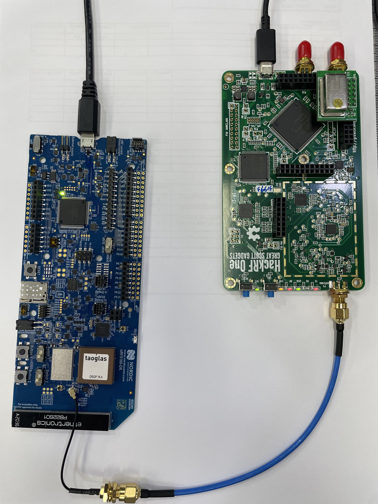
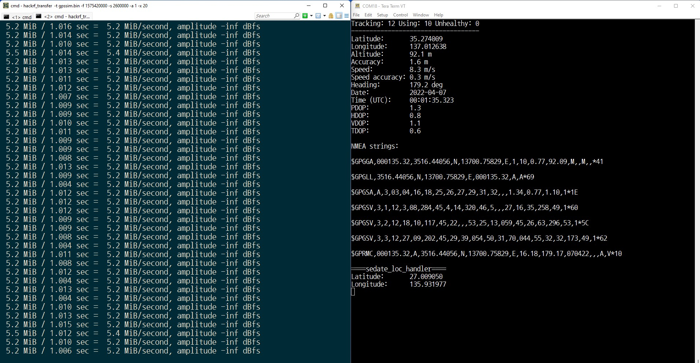

# GPS test environment

## HackRF One
I'm using official HackRF One

- https://greatscottgadgets.com/hackrf/one/

### Software installation

- https://downloads.myriadrf.org/builds/PothosSDR/

## TCXO
HackRF One requires TCXO for precised GPS signal transmitting: https://github.com/osqzss/gps-sdr-sim/issues/305

- https://www.aliexpress.com/item/4000181103275.html works

## GPS test signal generator
https://github.com/osqzss/gps-sdr-sim.git

### Build the software
This could be built on MSYS64 of my PC.
The build was failed in my Cygwin and Visual studio; no idea of the reason.

```
NVLSI+styo@DESKTOP-UEH6C9P MINGW64 /c/working/gps-sdr-sim
$ make -f Makefile
gcc -O3 -Wall -D_FILE_OFFSET_BITS=64   -c -o gpssim.o gpssim.c
gcc gpssim.o -lm -o gps-sdr-sim
```

### Usage of the software

```
NVLSI+styo@DESKTOP-UEH6C9P MINGW64 /c/working/gps-sdr-sim
$ ./gps-sdr-sim.exe
Usage: gps-sdr-sim [options]
Options:
  -e <gps_nav>     RINEX navigation file for GPS ephemerides (required)
  -u <user_motion> User motion file (dynamic mode)
  -g <nmea_gga>    NMEA GGA stream (dynamic mode)
  -c <location>    ECEF X,Y,Z in meters (static mode) e.g. 3967283.154,1022538.181,4872414.484
  -l <location>    Lat,Lon,Hgt (static mode) e.g. 35.681298,139.766247,10.0
  -t <date,time>   Scenario start time YYYY/MM/DD,hh:mm:ss
  -T <date,time>   Overwrite TOC and TOE to scenario start time
  -d <duration>    Duration [sec] (dynamic mode max: 300, static mode max: 86400)
  -o <output>      I/Q sampling data file (default: gpssim.bin)
  -s <frequency>   Sampling frequency [Hz] (default: 2600000)
  -b <iq_bits>     I/Q data format [1/8/16] (default: 16)
  -i               Disable ionospheric delay for spacecraft scenario
  -v               Show details about simulated channels
```

### GPS satellite information update
As below commentary copied from its GitHub README, the start time could be updated.

```
The user specifies the GPS satellite constellation through a GPS
broadcast ephemeris file. The daily GPS broadcast ephemeris file 
(brdc) is a merge of the individual site navigation files into 
one. The archive for the daily file is:

https://cddis.nasa.gov/archive/gnss/data/daily

These files are then used to generate the simulated pseudorange 
and Doppler for the GPS satellites in view. This simulated range 
data is then used to generate the digitized I/Q samples for the 
GPS signal.
```

### Generating GPS signal stream file
**-b 8** is required for HackRF One.

#### Circle

```
NVLSI+styo@DESKTOP-UEH6C9P MINGW64 /c/working/gps-sdr-sim
$ ./gps-sdr-sim.exe -b 8 -e brdc0970.22n -u circle.csv
Start time = 2014/12/20,00:00:00 (1823:518400)
Duration = 300.0 [sec]
01   75.5  19.0  23842014.1  17.4
02  278.2   8.6  25211959.5  16.6
03   44.8  38.2  22161310.3  11.1
06  298.1  43.4  21779609.4   9.6
09  144.3  29.1  22867978.9  13.9
10  222.8  34.6  22165342.9  11.6
11   98.7   7.0  25049095.4  24.3
12  326.9   5.0  25187588.2  16.5
17  350.8  83.8  20316661.5   7.3
20   47.2  49.4  21274204.2   9.3
23  106.0  35.7  22595053.5  12.2
28  201.9  27.9  22755566.1  13.5
32   43.1   2.2  25691385.0  25.0
Time into run = 300.0
Done!
Process time = 57.3 [sec]
```

#### Location

```
gps-sdr-sim.exe -b 8 -e brdc2430.22n -l 37.3047,127.0335,3000
option b
option e
option l
Using static location mode.
Start time = 2022/08/31,00:00:00 (2225:259200)
Duration = 1000.0 [sec]
01   75.0   4.5  25343386.2  13.5
03   43.6  25.0  23136068.3   7.5
04   87.1  26.0  23193080.1   7.5
06  299.4  52.4  21256312.0   4.2
09  127.8  26.7  23093746.5   7.2
11  272.8  23.4  23392806.8   6.3
12  319.8  13.7  24122774.8   7.8
14  185.6  20.7  23557403.7   7.4
17  105.0  69.9  20736512.1   3.8
19  344.7  74.6  20123359.4   3.6
28  209.0  41.3  22055241.8   4.9
Time into run = 1000.0
Done!
Process time = 393.8 [sec]
```

### Transmitting GPS signal stream on air
After generating simulating signal, I can use my HackRF One device with the below command.

```
styo@DESKTOP-UEH6C9P c:\working\gps-sdr-sim
$ hackrf_transfer -t gpssim.bin -f 1575420000 -s 2600000 -a 1 -x 20
```

## Test




It works!