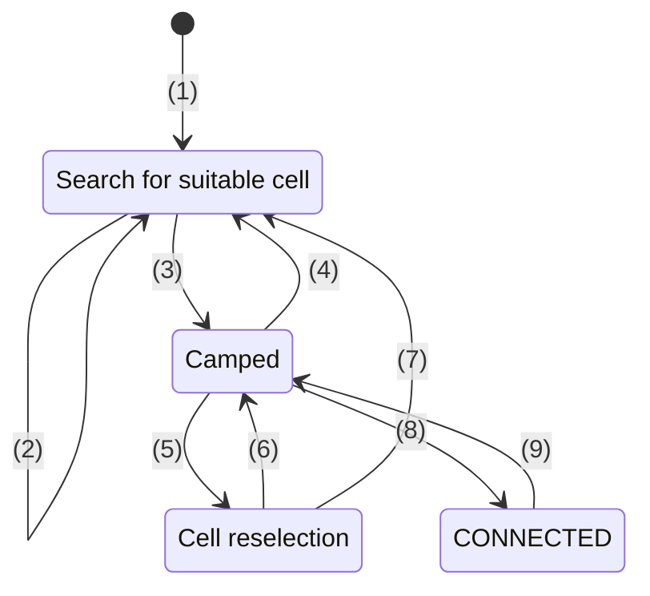

# UE behavior in IDLE mode

```mermaid
stateDiagram
	state "Search for suitable cell" as s1
	state "Camped" as s2
	state "Cell reselection" as s3
	[*] --> s1 : (1)
	s1 --> s1 : (2)
	s1 --> s2 : (3)
	s2 --> s1 : (4)
	s2 --> s3 : (5)
	s3 --> s2 : (6)
	s3 --> s1 : (7)
	s2 --> CONNECTED : (8)
	CONNECTED --> s2 : (9)
	

```

