# Mastering 5G NR PHY

## Technical specifications
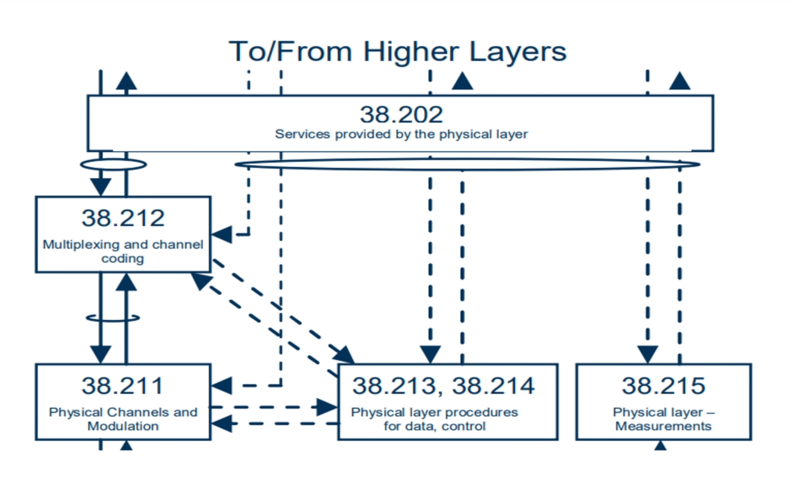
## CRC (Cyclic Redundancy Check)
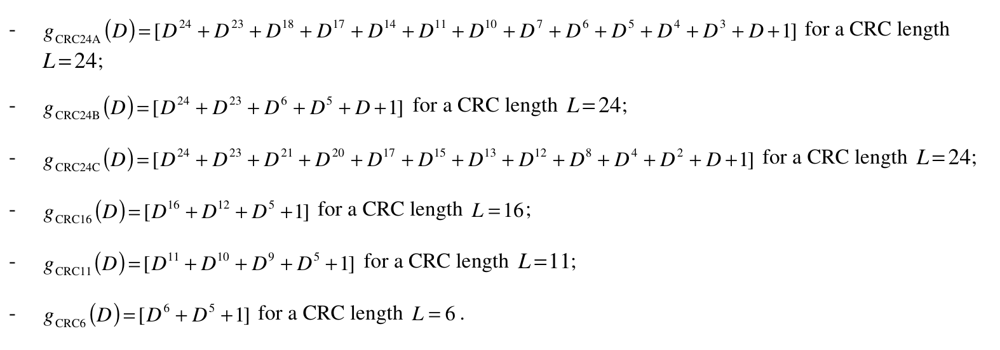
## Channel Coding
- LDCP는 계산량이 많은데 비해 복잡도가 작고 앞단의 아웃풋을 뒷단의 인풋으로 하는 피드백 구조로 만들기가 쉽고 큰 데이터를 처리하는데 이득이 있어서 PUSCH, PDSCH와 같이 데이터 채널을 코딩하는데 사용됩니다.
- Pollar는 작은 데이터를 처리하는데 이득이 있어서 PUCCH 등 control data를 코딩하는데 사용됩니다.
## Rate matching

## Modulations
### π/2-BPSK (Pi/2-Binary Phase Shift Keying) Modulation

#### 기본 BPSK
일반 BPSK에서는 심볼이 두 가지 위상을 가집니다:

$$
s_k = 
\begin{cases}
+1, & \text{if bit = 0}\\
-1, & \text{if bit = 1}
\end{cases}
$$

즉, 위상은 **0°** 또는 **180°(π rad)** 이고, 신호는 다음과 같이 표현됩니다:

$$
s(t) = A \cos(2\pi f_c t + \phi_k)
$$

여기서  
- A: 진폭  
- $f_c$: 반송파 주파수  
- $\phi_k$ = 0 또는 $\pi$

---

#### π/2-BPSK의 개념
π/2-BPSK에서는 **심볼마다 위상을 π/2(=90°)만큼 회전**시킵니다.

즉, 단순히 +1, −1을 사용하는 대신 각 심볼의 위상이 이전 심볼에서 π/2만큼 이동합니다.

$$
s_k = a_k \cdot e^{j\theta_k}
$$
$$
\theta_k = \theta_{k-1} + \frac{\pi}{2} \cdot (2a_k - 1)
$$

결과적으로 신호의 궤적이 I-Q 평면에서 **(1, 0) → (0, 1) → (−1, 0) → (0, −1)** 형태로 순환하게 됩니다.

---

#### I/Q 신호 형태

| 심볼 순서 | I 성분 | Q 성분 | 위상 |
|------------|---------|---------|------|
| 1 | +1 | 0 | 0° |
| 2 | 0 | +1 | 90° |
| 3 | −1 | 0 | 180° |
| 4 | 0 | −1 | 270° |
| 5 | +1 | 0 | 360° (=0°) |

**👉 특징:** I-축만 사용하는 BPSK와 달리, π/2-BPSK는 I와 Q축을 번갈아 사용하여 위상이 부드럽게 회전합니다.

---

#### 장점

✅ **DC 성분 제거** → 송신 신호의 스펙트럼 중심 왜곡이 적음  
✅ **지속적인 위상 변화** → 송신 필터링 용이, PAPR 감소  
✅ **I/Q 불균형에 강함**  
✅ **5G NR, LTE Uplink 등에서 효율적**

---

#### 5G / LTE에서의 적용 예시

- **LTE Uplink DMRS**, **5G NR PUSCH DMRS**는 π/2-BPSK 기반 시퀀스를 사용  
- SC-FDMA(Uplink)에서 **π/2-BPSK 변조 후 DFT-Spread OFDM 전송**  
- **Bluetooth LE** 등에서도 유사한 위상 회전 구조를 활용

---

#### 시각적 예시 (I/Q 평면)


위상이 심볼마다 시계 방향 또는 반시계 방향으로 **90°씩 회전**하며, 신호가 원을 그리듯 이동합니다.
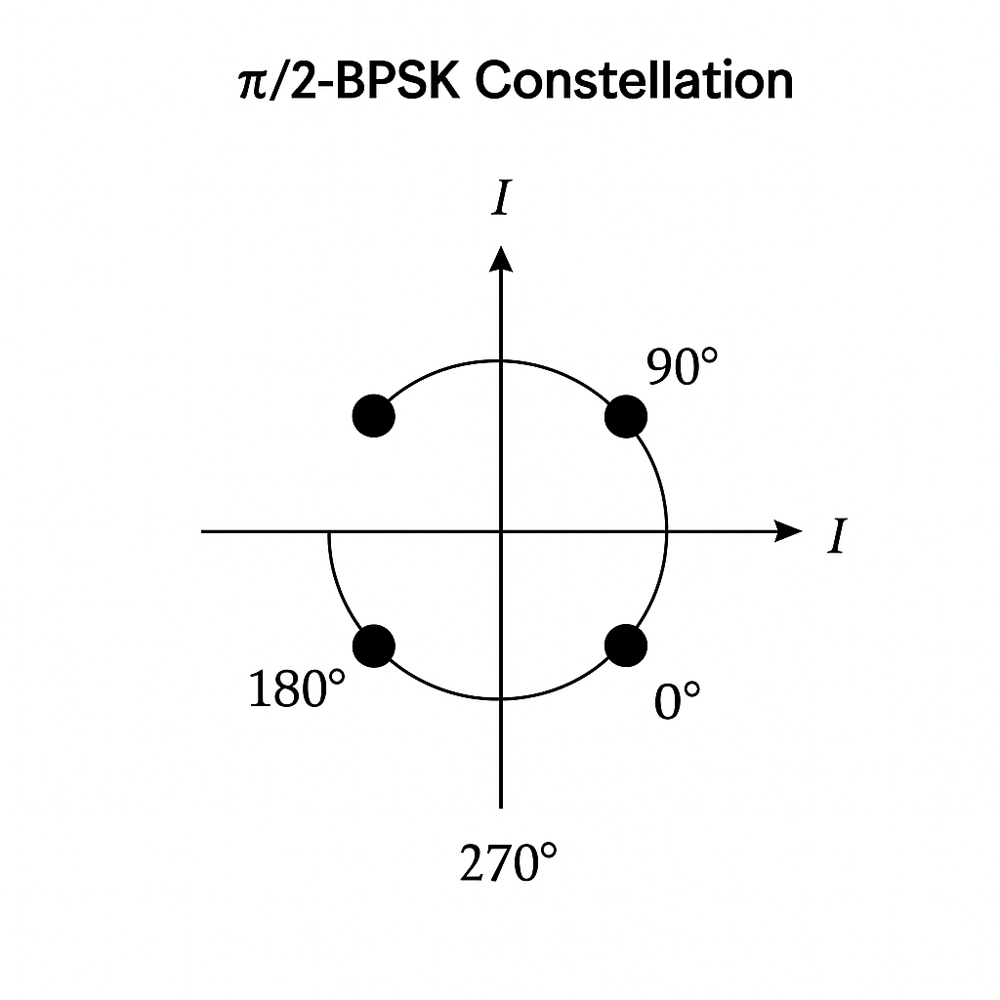

---

## 요약 비교

| 항목 | BPSK | π/2-BPSK |
|------|------|-----------|
| 위상 변화 | 0°, 180° | 매 심볼마다 ±90° 회전 |
| 신호 성분 | I-축만 사용 | I, Q 축 모두 사용 |
| DC 성분 | 존재 | 거의 없음 |
| PAPR | 높음 | 낮음 |
| 주요 응용 | 단순 디지털 통신 | LTE/5G Uplink, Bluetooth LE 등 |

---

## 요약 문장
> π/2-BPSK는 BPSK의 단순성과 위상 연속성을 결합하여, **DC 성분을 줄이고 송신 효율을 개선한 변조 방식**이다.  
> LTE와 5G NR의 업링크 전송에서 널리 사용된다.

### OFDM (Orthogonal Frequency Division Multiplexing)

#### 기본 개념
- 하나의 고속 데이터 스트림을 여러 개의 저속 **직교 부반송파(sub-carrier)** 로 분할하여 전송하는 다중화 방식
- 여러 주파수 채널을 동시에 사용하는 **디지털 변조 기술**

---

#### 필요성
- 다중경로 페이딩 및 주파수 선택적 감쇠 문제를 해결
- 각 부채널을 평탄한(frequency-flat) 채널로 간주 가능
- 복잡한 이퀄라이저 불필요

---

#### 직교성 (Orthogonality)
- 부반송파 간 주파수 간격: `Δf = 1/T`
- 서로의 스펙트럼이 겹치더라도 간섭 없음 (내적 = 0)
- 하나의 신호가 1일 때 나머지 신호들은 모두 0

---

#### 송신 과정
1. 직렬 데이터 → 병렬 분할  
2. QPSK / 16QAM 등으로 변조  
3. **IFFT**로 부반송파 합성  
4. **Cyclic Prefix (CP)** 추가  
5. 아날로그 변환 후 송신

---

#### 수신 과정
1. CP 제거  
2. **FFT**로 부반송파 분리  
3. 복호화 및 병렬→직렬 변환  
4. 원래 데이터 복원

---

#### 장점
- 다중경로 페이딩에 강함  
- 높은 스펙트럼 효율  
- FFT 기반 구현 용이  
- 간섭 최소화

---

#### 단점
- 높은 PAPR (Peak-to-Average Power Ratio)  
- 주파수 오차와 위상 잡음에 민감  
- 정밀한 동기화 필요

---

#### 적용 사례
- **Wi-Fi (IEEE 802.11a/g/n/ac/ax)**  
- **LTE / 5G NR**  
- **DVB-T / DAB**  
- **Power Line Communication**

---

#### 요약
> **OFDM은** 고속 데이터를 여러 직교 부반송파로 나누어 전송하는 기술로,  
> **다중경로 환경에 강하고 효율적인 현대 무선 통신의 핵심 기술**이다.

## Multipath Propagation
### 다중경로 전파 (Multipath Propagation)
- 무선 신호가 **건물, 지면, 차량, 나무 등** 다양한 장애물에 반사·회절·산란되며  
  **여러 경로(multiple paths)** 로 수신기에 도달하는 현상입니다.
- 이로 인해 신호가 시간 지연을 가지며 겹치고 간섭하게 되어,  
  **페이딩(Fading)** 또는 **Multipath Fading** 이 발생합니다.

#### Multipath의 주요 원인
- **Reflection (반사)**: 벽, 지면 등에서 반사  
- **Diffraction (회절)**: 장애물 모서리를 돌아감  
- **Scattering (산란)**: 작은 입자나 불규칙한 표면에 의한 퍼짐  

#### Multipath로 인한 문제
- **ISI (Inter-Symbol Interference)**: 심볼 간 간섭  
- **주파수 선택적 페이딩 (Frequency-Selective Fading)**  
- **수신 신호 품질 저하 및 에러율 증가**

---

### OFDM이 Multipath 문제를 해결하는 방법
1. **부대역 분할 (Subcarrier Division)**  
   - 전체 대역폭을 여러 개의 좁은 서브채널로 나누어,  
     각 부채널을 **거의 평탄한 채널(frequency-flat channel)** 로 만듭니다.  
   - 따라서 복잡한 채널 이퀄라이저가 필요하지 않습니다.

2. **Cyclic Prefix (순환 접두사, CP)**  
   - OFDM 심볼 앞부분에 심볼 끝부분 일부를 복사하여 붙입니다.  
   - 이렇게 하면 Multipath로 인한 지연이 CP 길이 이내일 경우,  
     **ISI(심볼 간 간섭)** 을 방지할 수 있습니다.  
   - 또한, 채널을 **순환(convolution)** 형태로 만들어 FFT 처리가 가능해집니다.

3. **직교성 유지 (Orthogonality)**  
   - 부반송파 간 간섭을 제거하여 Multipath 환경에서도 안정적인 전송이 가능하게 합니다.

---

### 송신 과정 (Transmitter)
1. 입력 데이터 직렬 → 병렬 분할  
2. QPSK / 16QAM 변조  
3. **IFFT** 로 부반송파 합성  
4. **Cyclic Prefix** 추가  
5. D/A 변환 후 송신

---

### 수신 과정 (Receiver)
1. CP 제거  
2. **FFT** 로 부반송파 분리  
3. 복호화 및 병렬 → 직렬 변환  
4. 원래 데이터 복원

---

### 장점
- Multipath Fading에 강함  
- 높은 스펙트럼 효율  
- FFT/IFFT로 구현 용이  
- 간섭 최소화

---

### 단점
- 높은 PAPR (Peak-to-Average Power Ratio)  
- 주파수 오차 및 위상 잡음에 민감  
- 정밀한 동기화 필요

---

### 요약
> **Multipath Propagation** 은 신호가 여러 경로로 전파되어 간섭을 일으키는 현상이며,  
> **OFDM** 은 이를 **부반송파 분할과 Cyclic Prefix** 로 효과적으로 해결하는  
> **현대 무선 통신의 핵심 기술**이다.

## Cyclic Prefix (CP)

### 정의
- OFDM 심볼의 **마지막 일부를 복사하여 심볼 앞부분에 붙이는 구간**
- Multipath 환경에서의 **ISI(Inter-Symbol Interference)** 를 방지하기 위한 보호 구간

---

### 역할
- **Multipath로 인한 시간 지연**을 흡수하여 ISI 방지
- CP 길이가 채널 지연 스프레드보다 길면, 지연 신호는 CP 안에서만 존재
- 본 심볼에는 간섭이 발생하지 않음

---

### 수학적 의미
- 선형 컨볼루션(linear convolution)을 **순환 컨볼루션(circular convolution)** 으로 변환
- FFT 기반 등화를 가능하게 함 → 간단하고 효율적인 주파수 영역 처리

---

### 동작 과정
1. IFFT로 OFDM 심볼 생성  
2. 심볼의 마지막 일부를 복사  
3. 복사된 부분을 앞에 추가 → CP 생성  
4. 수신기에서는 CP 제거 후 FFT 수행

---

### CP 길이 선택
- 채널 지연보다 길게 설정해야 함  
- 너무 길면 효율 저하 → 일반적으로 1/4, 1/8, 1/16, 1/32 사용  
- 예: LTE는 **Normal CP / Extended CP** 선택 가능

---

### 장점
- ISI 제거  
- 주파수 영역 등화 용이  
- 직교성 유지

### 단점
- 전송 효율 감소 (CP 구간은 데이터가 아님)

---

### 개념도
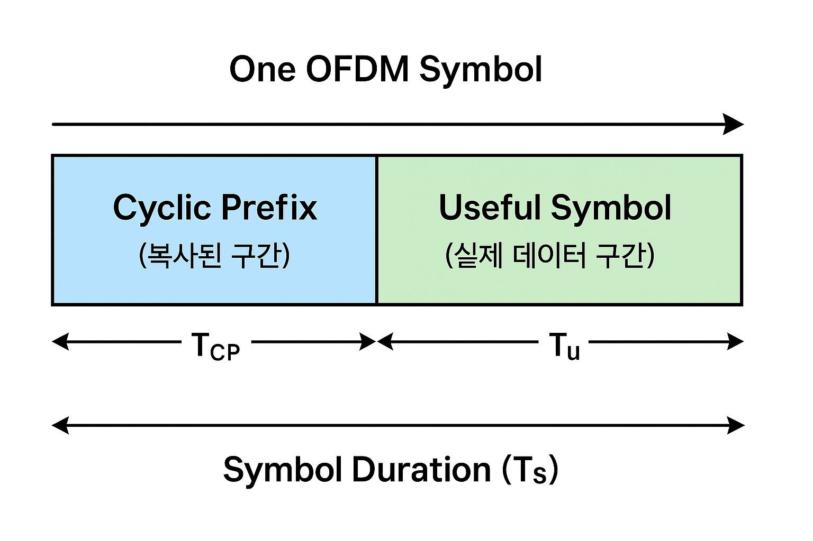

## 📡 5G NR / LTE 자원 단위 정리

### Resource Block (RB)
- 시간-주파수 평면의 **기본 자원 단위**
- 구성: 12 subcarriers × 1 slot
- 약 180 kHz × 0.5 ms (LTE 기준)
- 데이터 전송의 최소 단위

---

### Common Resource Block (CRB)
- 전체 시스템 대역폭 기준의 RB 인덱스
- 예: 100 MHz 시스템에 275 CRB 존재
- 전역 좌표로 RB 위치 표현

---

### Physical Resource Block (PRB)
- 특정 BWP 내에서 실제로 할당되는 자원
- UE 입장에서 실제 사용되는 자원 단위
- CRB 중 BWP 범위 내에 속한 블록만 PRB로 매핑

---

### Bandwidth Part (BWP)
- 전체 대역폭 중 일부를 단말이 사용하는 구간
- 전력 절감 및 유연한 대역폭 운용 목적
- 한 UE는 최대 4개의 BWP를 구성 가능
- 각 BWP는 자체 PRB 집합을 가짐

---

### 관계
System Bandwidth  
└── CRB (전체 대역 기준)  
　　└── BWP (단말이 사용하는 구간)  
　　　　└── PRB (실제 할당 자원)

---

### 요약
| 용어  | 기준       | 설명                      |
| --- | -------- | ----------------------- |
| RB  | 기본 단위    | 12 subcarriers × 1 slot |
| CRB | 전체 대역 기준 | 시스템 전체 RB 위치            |
| PRB | BWP 기준   | 실제 단말에 할당되는 RB          |
| BWP | 주파수 대역   | 단말이 사용하는 부분 대역          |


## SSB (Signal Synchronization Block)
### 개요 — SSB란 무엇인가?**

**SSB (Synchronization Signal Block)** 은  
단말(UE, User Equipment)이 **5G 기지국(gNB)** 을 처음 인식하고 동기화하기 위해 수신하는 **기본 물리 신호 묶음**입니다.

즉, UE가 "이 근처에 어떤 5G 셀이 있고, 어디 주파수·타이밍으로 동작 중인지" 를 알아내기 위한 **셀 탐색(Synchronization & Cell Identification)** 용 신호입니다.

---

### SSB 구성 요소**

SSB는 아래 **세 가지 신호**로 구성됩니다.

| 구성요소                                 | 약어   | 역할                                                                   |
| ------------------------------------ | ---- | -------------------------------------------------------------------- |
| **Primary Synchronization Signal**   | PSS  | 셀 ID 그룹 내 **셀 식별(0~2)** 및 타이밍 동기                                     |
| **Secondary Synchronization Signal** | SSS  | **셀 그룹 ID (0~335)** 및 프레임 동기 정보 제공                                   |
| **Physical Broadcast Channel**       | PBCH | 시스템 파라미터 전달 (예: Subcarrier Spacing, Cell ID, System Frame Number, 등) |

즉,

> **SSB = PSS + SSS + PBCH**

---

### **역할 정리**

|항목|설명|
|---|---|
|**PSS**|단말이 셀의 **시간 동기**를 잡고, 소그룹 내 Cell ID(0~2)를 인식|
|**SSS**|단말이 **프레임 동기**를 맞추고, 셀 그룹 ID(0~335)를 파악|
|**PBCH**|단말이 **시스템 파라미터 (MIB 등)** 을 디코딩하여 초기 접속 절차를 시작|

---

### **SSB의 주파수 및 시간 배치**

5G NR은 다양한 Subcarrier Spacing (SCS)에 따라 **SSB의 위치와 주기(period)** 가 다릅니다.

|Subcarrier Spacing|사용 대역|SSB 주기|SSB 개수 (Beam 수)|
|---|---|---|---|
|15 kHz / 30 kHz|FR1 (Sub-6GHz)|기본 20 ms|최대 4개|
|120 kHz|FR2 (mmWave)|기본 20 ms|최대 64개|

- **FR1**: 저주파(Sub-6GHz) — 일반적으로 광범위 커버리지용
- **FR2**: 고주파(mmWave) — 빔포밍 기반 고속 데이터용

---

### **Beamforming과 SSB의 관계**

5G는 빔포밍(Beamforming)을 사용하기 때문에,  
기지국은 **여러 방향(beam)** 으로 SSB를 순차적으로 전송합니다.

이를 **SS Burst Set** 이라고 부르며,  
한 세트 내에서 여러 개의 **SS Block (SSB)** 이 **각기 다른 빔 방향**으로 송신됩니다.

예를 들어:

- gNB가 8개의 빔 방향을 갖는다면 → 8개의 SSB를 주기적으로 송신
- 단말은 이 중 **수신 세기가 가장 강한 빔 방향**을 선택하여 동기화

---

### **셀 탐색(Cell Search) 절차**

1. **PSS 탐색 → 타이밍 동기 획득**
2. **SSS 탐색 → 프레임 동기 및 Cell ID 획득**
3. **PBCH 디코딩 → MIB 수신 및 시스템 정보 획득**
4. **RACH(Random Access Channel)** 절차로 셀에 접속

---

### **SSB 구조 (시간-주파수 평면)**
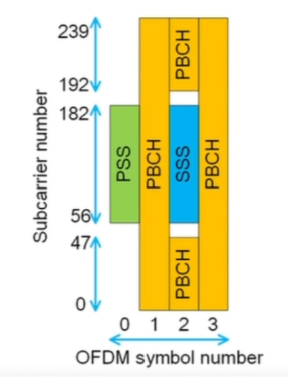
```
Frequency 
↑
│
│   ┌───────────────┐
│   │     PBCH      │  ← Physical Broadcast Channel
│   ├──────┬────────┤
│   │ PSS  │  SSS   │  ← Synchronization Signals
│   └──────┴────────┘
│──────────────────────────→ Time
```

- 총 4 OFDM Symbols (시간축)
- 240 Subcarriers (주파수축)
- 전체적으로 약 1 RB(=12 subcarriers) × 20 RB = 240 subcarriers

---

### **주요 파라미터 요약**

|항목|설명|
|---|---|
|구성|PSS + SSS + PBCH|
|주기|일반적으로 20 ms (configurable: 5, 10, 20 ms)|
|Subcarrier Spacing|FR1: 15/30 kHz, FR2: 120/240 kHz|
|빔 수|FR1 ≤ 4, FR2 ≤ 64|
|목적|셀 탐색, 동기화, 시스템 정보 획득|

---

### **핵심 요약**

> **SSB (Synchronization Signal Block)** 는 5G NR에서 단말이 처음 셀을 인식하고  
> 시간·주파수 동기를 맞춘 뒤 시스템 정보를 얻는 신호 묶음으로,  
> **PSS, SSS, PBCH** 로 구성되며 **빔포밍 기반 다방향 송신 구조**를 가집니다.

## SSBurst
### **SS Burst란 무엇인가?**

**SS Burst (Synchronization Signal Burst)** 는  
5G 기지국(gNB)이 일정한 주기마다 **하나 이상의 SSB(Synchronization Signal Block)** 를 묶어서 **한 세트로 송신하는 구조**입니다.

즉,

> 여러 방향(beam)으로 송신되는 **SSB들의 집합(Set)** 이 바로 **SS Burst** 입니다.

---

### **SSB vs SS Burst vs SS Burst Set**

|구분|구성 요소|의미|관계|
|---|---|---|---|
|**SSB (Synchronization Signal Block)**|PSS + SSS + PBCH|단일 방향(beam)으로 송신되는 기본 블록|단위 신호|
|**SS Burst**|여러 개의 SSB 묶음|일정 주기(20 ms 등) 내에 연속적으로 송신되는 여러 SSB|빔 탐색용 묶음|
|**SS Burst Set**|여러 SS Burst 묶음|더 큰 주기 내에서 반복되는 SS Burst들의 모음|전체 커버리지 탐색 단위|

---

### **왜 SS Burst가 필요한가?**

5G는 **Massive MIMO + Beamforming** 을 기반으로 하므로,  
기지국이 **여러 방향(beam)** 으로 신호를 송신해야 합니다.

따라서 하나의 SSB만으로는 모든 방향의 단말을 커버할 수 없기 때문에,  
기지국은 한 주기(예: 20 ms) 동안 여러 방향으로 SSB를 **순차적으로 송신**합니다.  
이렇게 전송되는 모든 SSB들의 묶음이 바로 **SS Burst** 입니다.

---

### **SS Burst의 시간적 구조**

#### 예시 (FR1, Sub-6GHz)

- SSB는 4개까지 포함 가능
- 각 SSB는 서로 다른 빔 방향에 해당
- 하나의 SS Burst 주기: 기본 20 ms
- 각 SSB는 약 5 ms 간격으로 송신됨

#### 예시 (FR2, mmWave)

- SSB는 최대 64개까지 포함 가능
- 매우 짧은 빔 간격으로 송신
- 여전히 하나의 SS Burst 주기는 20 ms
- 이후 동일 패턴으로 반복됨
    

---

### **SSB Index와 Beam Index**

각 SSB는 고유의 **SSB Index (0 ~ 63)** 를 가집니다.  
이 인덱스는 곧 **Beam Index (빔 방향)** 과 1:1로 대응합니다.

즉,

- `SSB #0` → 빔 방향 #0
- `SSB #1` → 빔 방향 #1
- ...
- `SSB #63` → 빔 방향 #63

UE는 모든 SSB를 탐색해 **가장 강한 빔 방향을 선택**합니다.

---

### **SS Burst의 프레임 내 배치 (Time–Frequency Structure)**

```
Time →
┌──────────────────────────────────────┐
│ SSB#0 │ SSB#1 │ SSB#2 │ SSB#3 │ ...  │← 하나의 SS Burst(20 ms 주기)
└──────────────────────────────────────┘
```

- 각 SSB는 서로 다른 빔 방향으로 송신
- 여러 SSB로 구성된 SS Burst가 주기적으로 반복됨
- 전체적으로 **SS Burst Set** 이라는 상위 구조로 관리됨

---

### **주요 파라미터 요약**

|항목|설명|
|---|---|
|**구성**|여러 개의 SSB (최대 64개)|
|**주기**|기본 20 ms (configurable: 5, 10, 20 ms)|
|**역할**|Beam 탐색 및 셀 검색 (Cell Search) 지원|
|**SSB 간 간격**|FR1: 최대 4개, FR2: 최대 64개|
|**관련 파라미터 (3GPP 명시)**|`ssbPeriodicityServingCell`, `ssbSubcarrierSpacing`, `ssb-PositionsInBurst` 등|

---

### **셀 탐색에서의 관계 요약**

```
SS Burst Set
└── SS Burst (주기적으로 반복)
　　└── 여러 SSB (서로 다른 빔 방향)
　　　　└── PSS + SSS + PBCH
```
즉,
> **SSB는 빔 단위 신호, SS Burst는 빔 집합, SS Burst Set은 반복 주기 단위 구조** 입니다.

---
### **핵심 요약**

> **SS Burst** 는 5G NR에서 기지국이 **여러 빔 방향으로 송신하는 SSB들의 묶음**이며,  
> 단말(UE)은 이 SS Burst를 탐색하여 **가장 강한 빔 방향**을 선택하고  
> **초기 동기화 및 셀 접속 절차**를 시작합니다.
 
## PBCH and PBCH DMRS
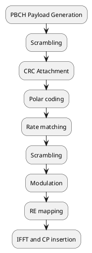
```plantuml
@startuml
:PBCH Payload Generation;
:Scrambling;
:CRC Attachment;
:Polar coding;
:Rate matching;
:Scrambling;
:Modulation;
:RE mapping;
:IFFT and CP insertion;
@enduml
```
### PSS, SSS, PBCH and DMRS mapping in SSB
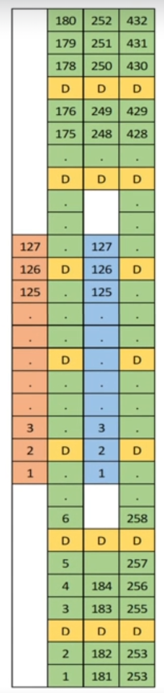
위 그림에서 숫자는 Subcarrier number이고 D는 DMRS입니다. DMRS는 그림에서와 같이 PBCH에 존재하며 그 위치는 다음과 같이 결정됩니다.
### 📡 DMRS 위치의 수학적 표현 (5G NR)

#### 기본 정의
- DMRS는 SSB 내 PBCH 구간에 존재.
- 위치와 시퀀스는 **SSB Index**와 **Cell ID**의 함수로 결정됨.

---

#### 시퀀스 초기화 식 (3GPP TS 38.211 §7.4.1.4)
$$
c_{init} = 2^{11} \times \left\lfloor \frac{N_{ID}^{cell}}{4} \right\rfloor + ( N_{ID}^{cell} \bmod 4 ) + 8 \times i_{SSB}
$$
→ DMRS 시퀀스는 $N_{ID}^{cell}$  과 $i_{SSB}$ 의 함수.

---

#### 주파수 위치
$$f_{DMRS} = f_{carrier\_center} + k_{SSB}(i_{SSB}) + k_{DMRS,offset}$$
- $k_{SSB}(i_{SSB}) \text{ : SSB Index별 subcarrier offset}$
- $k_{DMRS,offset} \text{ : PBCH 내부의 DMRS 서브캐리어 오프셋}$

---

#### 시간 위치
- 고정된 3번째 OFDM Symbol (symbol index = 2)

---

#### 요약
| 항목     | 의존 변수                        | 설명                    |
| ------ | ---------------------------- | --------------------- |
| 시퀀스 위상 | $$ N_{ID}^{cell}, i_{SSB} $$ | Gold sequence 초기화     |
| 주파수 위치 | $$ i_{SSB} $$                | 빔별 Subcarrier offset  |
| 시간 위치  | 고정                           | SSB의 세 번째 OFDM symbol |

> 따라서 DMRS의 위치와 시퀀스는 모두 **SSB Index와 Physical Cell ID의 함수**로 표현 가능하다.

## PRB (Physical Resource Block)
### **PRB란 무엇인가?**

> **PRB (Physical Resource Block)** 는  
> 시간(time)과 주파수(frequency) 영역에서 **단말(UE)에 실제로 할당되는 최소 물리 자원 단위**입니다.

즉,

> “무선 자원을 얼마나, 어디에 줄 것인가”를 결정할 때 기지국이 사용하는 **기본 단위 블록**이에요.

---

### **PRB의 기본 구조**

| 영역         | 구성 요소                        | 설명                                    |
| ---------- | ---------------------------- | ------------------------------------- |
| **주파수 영역** | 12 subcarriers               | Subcarrier Spacing (SCS)에 따라 대역폭이 결정됨 |
| **시간 영역**  | 1 slot (기본: 14 OFDM symbols) | 전송 단위 시간                              |
| **결과적으로**  | 12 subcarriers × 14 symbols  | = 168 Resource Elements (REs)         |

---

### **PRB의 대역폭 계산**

각 PRB는 12개의 서브캐리어를 포함하므로, PRB 하나의 주파수 폭은 다음과 같습니다.

| Subcarrier Spacing (SCS) | PRB 대역폭  |
| ------------------------ | -------- |
| 15 kHz                   | 180 kHz  |
| 30 kHz                   | 360 kHz  |
| 60 kHz                   | 720 kHz  |
| 120 kHz                  | 1440 kHz |

> 따라서 5G NR은 SCS에 따라 **PRB 폭이 달라집니다.**

---

### **PRB의 역할**

| 역할                 | 설명                                    |
| ------------------ | ------------------------------------- |
| **자원 할당 단위**       | gNB가 UE에게 자원을 스케줄링할 때 “몇 개의 PRB”로 할당  |
| **MCS 결정 기준**      | 한 PRB 내 신호 품질(SINR)을 기준으로 변조 및 부호율 결정 |
| **DMRS 배치 기준**     | 참조신호(DMRS)는 PRB 구조에 맞춰 배치됨            |
| **HARQ/CSI 보고 단위** | PRB 단위로 CQI, PMI, RI 등의 채널 정보를 보고     |

---

### **PRB vs RB vs CRB의 관계**

| 용어                                | 기준       | 설명                          |
| --------------------------------- | -------- | --------------------------- |
| **RB (Resource Block)**           | 일반적 표현   | 시간–주파수 자원의 기본 블록 (이론적 개념)   |
| **CRB (Common Resource Block)**   | 전체 대역 기준 | 시스템 전체 대역에서의 RB 인덱스 (절대 위치) |
| **PRB (Physical Resource Block)** | BWP 기준   | UE에 실제 할당된 물리적 RB (상대 위치)   |

📘 **요약:**

> **PRB = 실제 무선자원 단위** (BWP 내에서 UE가 사용하는 자원)  
> **CRB = 시스템 전체 기준의 절대 위치**  
> **RB = 개념적 단위 (공통 용어)**

---

### **PRB의 시간–주파수 평면 구조 (개념도)**

```
Frequency ↑
│
│   ┌──────────────────────────────────────────────┐
│   │              12 Subcarriers (Δf)             │
│   ├──────────────────────────────────────────────┤
│   │                                              │
│   │                PRB (1 Slot)                  │
│   │     14 OFDM Symbols × 12 Subcarriers         │
│   │                                              │
│   └──────────────────────────────────────────────┘
│──────────────────────────────────────────────→ Time
```

- **세로축:** 주파수 (12 subcarriers)
- **가로축:** 시간 (1 slot = 14 OFDM symbols)
- 그 내부의 한 칸(1 subcarrier × 1 symbol)이 **Resource Element (RE)**

---

### **PRB 개수 예시 (대역폭에 따른 PRB 수)**

|대역폭|15 kHz SCS|30 kHz SCS|60 kHz SCS|120 kHz SCS|
|---|---|---|---|---|
|5 MHz|25 PRB|11 PRB|–|–|
|10 MHz|52 PRB|24 PRB|–|–|
|20 MHz|106 PRB|51 PRB|24 PRB|–|
|100 MHz|–|273 PRB|135 PRB|66 PRB|

> 즉, **PRB 수 = 주파수 대역폭 / (12 × SCS)**  
> (단, 보호대역(guard band) 제외)

---

### **PRB는 실제 전송 자원 단위**

PRB 내부에는 다양한 신호가 매핑됩니다.

|종류|설명|
|---|---|
|**PDSCH / PUSCH**|실제 사용자 데이터 전송|
|**DMRS**|복조 기준신호|
|**PTRS / CSI-RS / SRS**|채널 품질 측정 신호|
|**Control (PDCCH / PUCCH)**|제어 정보|

즉, PRB는 “데이터 + 참조 신호 + 제어 신호”가 함께 존재하는 **물리적 전송 자원 단위**입니다.

---

### **핵심 요약**

| 항목      | 설명                                   |
| ------- | ------------------------------------ |
| **정의**  | 시간–주파수 영역의 최소 물리 자원 단위               |
| **구성**  | 12 Subcarriers × 1 Slot (14 Symbols) |
| **대역폭** | SCS에 따라 180~1440 kHz                 |
| **기준**  | BWP 내 상대 위치                          |
| **역할**  | 스케줄링, 채널 추정, 데이터 전송의 기본 단위           |
| **수량**  | 시스템 대역폭과 SCS에 따라 다름                  |
## PDCCH

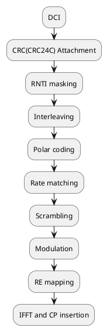
```plantuml
@startuml
:DCI;
:CRC(CRC24C) Attachment;
:RNTI masking;
:Interleaving;
:Polar coding;
:Rate matching;
:Scrambling;
:Modulation;
:RE mapping;
:IFFT and CP insertion;
@enduml
```
### **PDCCH란 무엇인가?**

> **PDCCH (Physical Downlink Control Channel)** 는  
> 단말(UE)에게 **다운링크 및 업링크 전송 자원 할당 정보를 전달하는 제어 채널**입니다.

즉,

> “지금부터 이 PRB, 이 MCS, 이 타이밍으로 데이터를 보내줄게.”  
> “이 타이밍에 업링크로 데이터 보내.”  
> 이런 명령이 모두 **PDCCH** 를 통해 전송됩니다.
### **PDCCH의 주요 역할**

|역할|설명|
|---|---|
|**1. Scheduling Information**|어떤 PRB에 데이터가 실리는지 (PDSCH/PUSCH 자원 할당)|
|**2. MCS Configuration**|변조방식(QPSK, 16QAM, 64QAM, 256QAM 등)과 부호율 정보|
|**3. HARQ Control**|재전송 명령 (ACK/NACK), HARQ 프로세스 번호 전달|
|**4. Timing Control**|전송 타이밍 지연 설정|
|**5. Beam & BWP Info**|사용 중인 빔이나 Bandwidth Part 변경 정보|

---

### **PDCCH의 계층 구조**

PDCCH는 **다른 채널들과 달리 “Control 영역”** 에 존재하며,  
논리/전송/물리 채널로 아래처럼 매핑됩니다.

|계층|채널 이름|역할|
|---|---|---|
|Logical Channel|DCCH (Dedicated Control Channel)|UE별 제어 논리 채널|
|Transport Channel|DCI (Downlink Control Information)|제어정보 패킷 형태|
|Physical Channel|**PDCCH**|실제 무선상으로 전송되는 제어 신호|

즉,

> UE는 PDCCH를 수신하고 내부에서 DCI를 디코딩하여 실제 제어명령을 해석합니다.

---

### **PDCCH 구조 (Time–Frequency Plane)**

PDCCH는 **CORESET (Control Resource Set)** 영역 안에서 전송됩니다.

```
Frequency ↑
│
│   ┌────────────────────────────┐
│   │        CORESET             │ ← Control Resource Set
│   │ ┌───────────┬───────────┐  │
│   │ │  PDCCH #1 │  PDCCH #2 │  │ ← 여러 UE의 제어 정보
│   │ └───────────┴───────────┘  │
│   └────────────────────────────┘
│──────────────────────────────→ Time
```

- **CORESET**: PDCCH가 존재할 수 있는 “물리적 영역”
    
- **PDCCH**: CORESET 내부의 일부 RE(Resource Element)에 매핑
    
- **PDSCH**: CORESET 이후의 “Data 영역”에 존재
    

---

### **CORESET과 PDCCH의 관계**

|구성 요소|약어|설명|
|---|---|---|
|**CORESET (Control Resource Set)**|CORESET|PDCCH가 위치할 수 있는 시간–주파수 영역|
|**Search Space (SS)**|UE가 PDCCH를 탐색하는 후보 영역||
|**CCE (Control Channel Element)**|PDCCH를 구성하는 기본 단위 (6 REGs = 72 REs)||
|**DCI (Downlink Control Information)**|실제 제어정보 비트 시퀀스 (스케줄링 정보 포함)||

➡️ 요약 관계

`CORESET → Search Space → CCE → PDCCH → DCI`

---

### **Downlink/Uplink 제어 예시**

|목적|PDCCH가 전달하는 내용|수신 후 단말 동작|
|---|---|---|
|**Downlink Scheduling**|“PDSCH 할당 정보”|UE가 데이터 수신|
|**Uplink Grant**|“PUSCH 자원 정보”|UE가 업링크 송신|
|**HARQ ACK/NACK**|“재전송 요청 여부”|UE가 재전송 수행|
|**BWP/Beam 변경**|“활성화할 BWP, Beam ID”|UE가 전송 설정 변경|

---

### **PDCCH의 물리적 구성 단위**

|단위|구성|설명|
|---|---|---|
|**RE (Resource Element)**|1 subcarrier × 1 symbol|최소 자원 단위|
|**REG (Resource Element Group)**|12 REs|OFDM 상 한 Subcarrier 그룹|
|**CCE (Control Channel Element)**|6 REGs = 72 REs|PDCCH의 기본 구성 블록|
|**Aggregation Level (L)**|CCE의 묶음 단위 (1, 2, 4, 8, 16)|신호 강도에 따라 가변|

즉,

> PDCCH는 여러 CCE로 구성되고,  
> 각 CCE는 6개의 REG (=72 REs)로 구성됩니다.

---

### **PDCCH 관련 파라미터 (3GPP 38.211/38.213)**

|파라미터|설명|
|---|---|
|**n_CCE**|사용된 Control Channel Element 개수|
|**L (Aggregation Level)**|CCE 묶음 크기|
|**DCI Format**|DCI 0_0, 1_0, 1_1 등 (전송 타입별 제어 포맷)|
|**CORESET ID**|CORESET 식별 번호|
|**SearchSpace ID**|탐색 공간 식별 번호|

---

### **예시 (Downlink Scheduling Flow)**

1. gNB가 UE에 PDSCH 자원을 할당해야 함  
2️. DCI(포맷 1_0) 생성  
3️. DCI를 CCE에 매핑하여 PDCCH로 전송  
4️. UE가 Search Space에서 해당 PDCCH를 탐색 및 디코딩  
5️. DCI 정보로 PDSCH 위치·MCS·HARQ 설정  
6️. PDSCH에서 데이터 수신

---

### **핵심 요약**

| 항목        | 설명                                        |
| --------- | ----------------------------------------- |
| **이름**    | PDCCH (Physical Downlink Control Channel) |
| **역할**    | 자원 할당, HARQ, BWP/Beam 제어 등                |
| **위치**    | CORESET 영역 내                              |
| **기본 단위** | CCE (Control Channel Element)             |
| **탐색 방식** | Search Space 기반                           |
| **전송 정보** | DCI 포맷 (0_0, 1_0, 1_1 등)                  |

## DCIs
### **DCI란 무엇인가?**

> **DCI (Downlink Control Information)** 는  
> 단말(UE)에게 **무선자원 스케줄링과 제어 명령을 전달하는 정보 포맷**입니다.

즉,

> **PDCCH가 껍질(shell)** 이라면,  
> **DCI는 그 안에 들어 있는 핵심 제어 메시지(payload)** 입니다.

---

### **DCI의 역할**

|역할|설명|
|---|---|
|**다운링크 스케줄링**|UE에게 어떤 PRB, 어떤 MCS로 데이터를 수신해야 하는지 알려줌|
|**업링크 스케줄링 (UL Grant)**|UE에게 업링크 전송용 자원을 할당|
|**HARQ 제어**|재전송(ACK/NACK) 및 프로세스 번호 제어|
|**파워 제어**|전송 전력 보정 지시|
|**BWP / Beam 제어**|활성화할 Bandwidth Part 및 빔 정보|
|**CSI 요청**|채널 상태 정보(CQI/PMI/RI) 보고 명령|

---

### **DCI의 전송 구조**

DCI는 **PDCCH를 통해 전송**됩니다.  
아래 구조로 계층이 연결되어 있어요:

`CORESET → Search Space → PDCCH → DCI`

즉:

- **PDCCH** = 물리 계층 전송 신호
- **DCI** = 그 안에 담긴 제어 정보 (bit field format)

---

### **DCI의 주요 포맷 (5G NR 기준)**

DCI에는 여러 포맷이 정의되어 있습니다.  
각 포맷은 **전송 방향**(DL/UL)과 **전송 타입**(공유, 공용, 특정 UE)에 따라 달라집니다.

| DCI 포맷               | 방향  | 역할 / 설명                                      |
| -------------------- | --- | -------------------------------------------- |
| **Format 0_0**       | UL  | UL-SCH 자원 할당 (기본 UL grant)                   |
| **Format 0_1**       | UL  | Configured Grant 방식 자원 할당                    |
| **Format 1_0**       | DL  | DL-SCH 자원 할당 (기본 DL scheduling)              |
| **Format 1_1**       | DL  | Semi-persistent scheduling (SPS) 또는 고급 DL 설정 |
| **Format 2_0~2_3**   | DL  | Power Control, CSI 요청 등 기타 제어용               |
| **Format 3_0 / 3_1** | DL  | Group-based scheduling / Power offset 제어     |
| **Format 4_0**       | DL  | Beam activation / deactivation               |

|           | Fallback DCIs | Non-fall DCIs |
| --------- | ------------- | ------------- |
| **PUSCH** | DCI 0_0       | DCI 0_1       |
| **PDSCH** | DCI 1_0       | DCI 1_1       |
- DCI 0_1와 DCI 1_1의 크기가 DCI 0_0과 DCI 1_1 보다 큽니다.
- DCI 0_1과 DCI 1_1은 zero padding이 삽입됩니다.
- DCI 0_0과 DCI 1_0은 single layer 입니다.
- DCI 0_1과 DCI 1_1은 multi layer 입니다.


---

### **DCI의 주요 필드 구성**

예시: **DCI Format 1_0 (Downlink Scheduling)**

|필드명|설명|
|---|---|
|**Carrier Indicator**|다중 캐리어 사용 시 어떤 Carrier인지 표시|
|**Bandwidth Part (BWP) Indicator**|활성화할 BWP ID|
|**Resource Allocation**|PRB 자원 할당 정보 (bitmap 또는 type1/2)|
|**MCS (Modulation and Coding Scheme)**|변조방식 및 부호율|
|**HARQ Process Number**|현재 HARQ 버퍼 식별자|
|**New Data Indicator (NDI)**|새 데이터 전송 여부 표시|
|**Redundancy Version (RV)**|HARQ 재전송 시 부호율 패턴|
|**Power Control Commands**|전송 전력 보정 값|
|**Time-domain Resource Assignment**|어떤 슬롯/심볼에 전송할지|
|**DMRS Configuration**|참조 신호 패턴|
|**CSI Request**|채널 상태 보고 요청|

> ⚠️ 각 DCI 포맷마다 비트 필드 구성이 다르며,  
> 실제 비트 길이는 DCI Format + Bandwidth + RNTI 종류에 따라 달라집니다.

---

### **DCI의 인코딩 및 디코딩 과정**

#### [1] gNB (송신측)

1. MAC/RRC 계층에서 스케줄링 정보 생성
2. DCI 포맷에 따라 비트 필드 구성
3. CRC 추가 및 **RNTI (Radio Network Temporary Identifier)** 마스킹
4. DCI를 **PDCCH에 매핑**
5. OFDM 변조 → 무선 전송

#### [2] UE (수신측)

1. Search Space 내에서 PDCCH 탐색
2. CRC 마스크를 통해 자신에게 해당하는 DCI 확인
3. DCI 비트 디코딩 및 해석
4. 자원 재구성 및 데이터 수신 준비 (PDSCH 또는 PUSCH)

---

### **RNTI (Radio Network Temporary Identifier)**

- DCI는 **CRC**를 **RNTI로 마스킹**하여 UE 구분을 수행합니다.
- RNTI의 종류에 따라 DCI의 목적이 달라짐:

|RNTI 종류|용도|
|---|---|
|**C-RNTI**|개별 UE 전용 제어|
|**SI-RNTI**|시스템 정보(SIB) 전송|
|**P-RNTI**|페이징(Paging) 메시지|
|**RA-RNTI**|랜덤 액세스 (RACH) 응답|
|**TC-RNTI**|일시적인 연결 중 식별자|

---

### **DCI 전송의 시간적 관계**

```
Slot n:
 ├─ PDCCH (DCI Format 1_0) → PDSCH Scheduling
 ├─ PDCCH (DCI Format 0_0) → PUSCH Grant
Slot n+k:
 └─ PDSCH/PUSCH 실제 데이터 전송
```

즉,

> DCI는 **데이터 전송보다 먼저(slot advance)** 전송되어  
> UE가 미리 전송 자원을 준비하도록 합니다.

---

### **DCI와 PDCCH 관계 요약**

|항목|설명|
|---|---|
|**PDCCH**|DCI가 담기는 물리 채널|
|**DCI**|자원 및 제어 정보 (bit field)|
|**CORESET**|PDCCH가 존재할 수 있는 시간–주파수 영역|
|**Search Space**|UE가 자신에게 해당하는 DCI를 찾는 후보 영역|

---

### **핵심 요약**

| 항목         | 설명                                           |
| ---------- | -------------------------------------------- |
| **DCI 정의** | 무선자원 제어 정보 (Scheduling, HARQ, Power, CSI 등)  |
| **전송 채널**  | PDCCH (물리 채널)                                |
| **포맷 종류**  | Format 0_x (UL), 1_x (DL), 2_x~4_x (Control) |
| **기본 단위**  | 비트 필드 구조, CRC 마스크(RNTI)                      |
| **수신 절차**  | UE가 Search Space 내 PDCCH를 탐색 후 DCI 디코딩       |
| **결과**     | UE는 DCI 기반으로 PDSCH/PUSCH 송수신 수행              |

----
## CORESET 

### **CORESET이란 무엇인가?**

> **CORESET (Control Resource Set)** 은  
> 5G NR에서 **PDCCH(Physical Downlink Control Channel)** 가 전송될 수 있는  
> **시간–주파수 영역(time-frequency region)** 을 정의한 영역입니다.

즉,

> “PDCCH는 아무 곳에나 존재하지 않고, 정해진 CORESET 안에서만 존재할 수 있습니다.”

---

### **CORESET의 역할**

| 역할                 | 설명                                |
| ------------------ | --------------------------------- |
| **제어 신호 위치 정의**    | PDCCH가 놓일 수 있는 시간–주파수 영역 정의       |
| **제어 자원 분리**       | 다른 채널(PDSCH 등)과의 간섭 방지            |
| **유연한 스케줄링**       | 주파수, 시간, 심볼 개수, RE 패턴을 자유롭게 구성 가능 |
| **UE별 맞춤 제어공간 제공** | 각 UE에게 다른 CORESET을 할당할 수 있음       |

---

### **CORESET의 구성 요소**

CORESET은 **시간 영역(OFDM symbol 수)** 과 **주파수 영역(Resource Block 수)** 으로 정의됩니다.

|항목|설명|
|---|---|
|**시간 영역**|1, 2, 또는 3 OFDM symbols|
|**주파수 영역**|6의 배수로 구성된 RB 단위 (예: 24, 48, 96 RB 등)|
|**RE(Resource Element)**|Subcarrier × Symbol 단위|
|**REG(Resource Element Group)**|12 RE = 1 REG|
|**CCE(Control Channel Element)**|6 REG = 1 CCE|

- 1 REG에는 12개의 RE가 있지만 그 중 3개에는 DMRS가 있으므로 9개의 RE가 있습니다.
- 1 CCE는 6 REG입니다.


---

### **CORESET과 PDCCH의 관계**

`CORESET → REG → CCE → PDCCH → DCI`

- **CORESET**: 제어 신호가 존재할 수 있는 물리적 “그릇”
- **REG**: 12 RE로 구성된 작은 그룹
- **CCE**: PDCCH의 기본 구성 블록 (6 REG = 72 RE)
- **PDCCH**: 실제 제어 정보가 매핑되는 채널
- **DCI**: PDCCH에 담기는 제어 정보 (payload)

---

### **CORESET의 주요 파라미터 (3GPP 38.211 §7.3.2.2)**

|파라미터|의미|설명|
|---|---|---|
|**CORESET ID**|식별 번호|0~11까지 식별 가능 (RRC로 구성됨)|
|**Duration**|심볼 개수|1, 2, 3 OFDM symbols 중 하나|
|**Frequency Domain Resources**|주파수 영역|6 RB 단위로 정의된 bitmap|
|**CCE-to-REG mapping**|매핑 방식|Interleaved 또는 Non-interleaved|
|**DMRS Configuration**|참조신호 패턴|PDCCH 복조용 DMRS 포함|

---

### **CORESET의 시간–주파수 구조 (예시)**

```
Frequency 
↑
│
│   ┌─────────────────────────────────────────────┐
│   │                 CORESET                     │
│   │ ┌───────────────┬───────────────┬─────────┐ │
│   │ │   PDCCH UE#1  │   PDCCH UE#2  │ PDCCH#3 │ │
│   │ └───────────────┴───────────────┴─────────┘ │
│   └─────────────────────────────────────────────┘
│────────────────────────────────────────────────→ Time
│                (1~3 OFDM Symbols)
```

- CORESET의 크기(시간×주파수)는 유연하게 설정 가능
- 한 CORESET 내부에 여러 UE의 PDCCH가 존재할 수 있음
- CORESET은 PDSCH (데이터 채널) 이전에 항상 전송됨

---

### **Search Space와 CORESET의 관계**

CORESET은 **물리적 영역**,  **Search Space** 는 UE가 그 영역 안에서 “어디를 탐색할지”를 정의한 **논리적 영역**입니다.

| 구성 요소                     | 설명                                          |
| ------------------------- | ------------------------------------------- |
| **CORESET**               | PDCCH가 실제 존재할 수 있는 물리 자원 영역                 |
| **Search Space (SS)**     | UE가 해당 CORESET 내에서 DCI를 탐색하는 후보 영역          |
| **Aggregation Level (L)** | CCE 묶음 크기 (1, 2, 4, 8, 16)                  |
| **SearchSpaceSet**        | 여러 Search Space 묶음 (예: Common, UE-specific) |

👉 관계 요약:

```
CORESET (물리 영역)
 └── Search Space (탐색 후보)
      └── CCE (PDCCH 구성 단위)
           └── DCI (제어정보)
```

---

### **CORESET의 종류**

|구분|이름|특징|
|---|---|---|
|**CORESET #0**|공통 (Common)|셀 탐색 및 시스템 정보용 (SI-RNTI, RA-RNTI 등)|
|**CORESET #1~11**|전용 (UE-specific)|UE별 동적 자원 제어용 (C-RNTI 기반)|

📘 예시:

- **CORESET #0**: SSB 이후의 초기 PDCCH 전송용
- **CORESET #1**: 연결 이후 스케줄링용

---

### **CORESET 내 REG/CCE 매핑**

CORESET 내 PDCCH 자원은 REG 단위로 구성되며,  
이들은 **Interleaved** 또는 **Non-interleaved** 방식으로 CCE에 매핑됩니다.

|매핑 방식|설명|
|---|---|
|**Non-Interleaved**|연속된 REG를 묶어 하나의 CCE 구성 (단순, 고신뢰)|
|**Interleaved**|REG를 주파수 전반에 퍼뜨려 페이딩에 강함 (분산형)|

---

### **DCI 수신 절차에서 CORESET의 역할**

1️. UE는 RRC 메시지로 CORESET 구성을 수신  
2️. Search Space 구성을 통해 탐색 영역 설정  
3. CORESET 내에서 PDCCH 탐색 수행  
4️. CRC 마스크로 자신의 RNTI 확인  
5️. 해당 DCI 해석 → 자원 할당 수행

---

### **핵심 요약**

| 항목        | 설명                                             |
| --------- | ---------------------------------------------- |
| **정의**    | PDCCH가 전송될 수 있는 시간–주파수 영역                      |
| **구성 단위** | REG → CCE → PDCCH                              |
| **시간 길이** | 1~3 OFDM symbols                               |
| **주파수 폭** | 6 RB 단위, bitmap으로 정의                           |
| **매핑 방식** | Interleaved / Non-interleaved                  |
| **역할**    | PDCCH 및 DCI의 전송 영역 제공                          |
| **종류**    | Common (CORESET#0), UE-specific (CORESET#1~11) |

---
## CORESET의 크기
### **기본 관계식**

5G NR에서 다음과 같은 관계가 항상 성립합니다:
$$
N_{CCE} = \frac{N_{REG}}{6}​​
$$
즉,

- 1 CCE = 6 REG
- 1 REG = 12 RE (Resource Elements)
- 따라서
$$
\text{1 CCE} = 6×12 = \text{72 RE}
$$
---

### **REG 개수 계산식**

CORESET 내의 **REG 개수 (N_REG)** 는 다음과 같이 계산됩니다:
$$
N_{REG} = N_{RB}^{CORESET} × N_{sym}^{CORESET}​
$$

| 기호                     | 의미                    | 설명                |
| ---------------------- | --------------------- | ----------------- |
| $$N_{RB}^{CORESET}$$​  | 주파수 방향의 RB 개수         | CORESET 폭 (6의 배수) |
| $$N_{sym}^{CORESET}$$​ | 시간 방향의 OFDM symbol 개수 | 1, 2, 또는 3        |

---

### **따라서, CORESET 내 CCE 수는**

$$
N_{CCE} = \frac{N_{RB}^{CORESET} × N_{sym}^{CORESET}}{6}​​
$$

---

### 📊 **4️⃣ 예시 계산**

|CORESET 구성 (주파수 × 시간)|REG 수|CCE 수 (N_CCE)|
|---|---|---|
|24 RB × 1 symbol|24|4|
|24 RB × 2 symbols|48|8|
|48 RB × 2 symbols|96|16|
|48 RB × 3 symbols|144|24|
|96 RB × 2 symbols|192|32|
|96 RB × 3 symbols|288|48|
|144 RB × 3 symbols|432|72|

---

### **실제 예시 (3GPP NR 표준에서 자주 쓰는 CORESET 크기)**

|CORESET ID|시간 길이|RB 폭|총 CCE 개수|설명|
|---|---|---|---|---|
|CORESET #0|2 symbols|48 RB|16 CCE|초기 접속용 (공통)|
|CORESET #1|2 symbols|96 RB|32 CCE|일반 DL 스케줄링용|
|CORESET #2|3 symbols|48 RB|24 CCE|UE 전용 PDCCH 영역|
|CORESET #3|1 symbol|24 RB|4 CCE|소형 셀 또는 협대역 제어용|

---

### **요약 도식**

```
CORESET (time × frequency)
 └── REG (12 RE)
     └── 6 REG = 1 CCE
         └── 여러 CCE로 PDCCH 구성
```

---

## **핵심 요약**

| 항목             | 설명                                                       |
| -------------- | -------------------------------------------------------- |
| **1 CCE**      | 6 REG = 72 RE                                            |
| **1 REG**      | 12 RE                                                    |
| **CCE 개수 계산식** | $$N_{CCE} = (N_{RB}^{CORESET} × N_{sym}^{CORESET}) / 6$$ |
| **CORESET 길이** | 1–3 OFDM Symbols                                         |
| **CORESET 폭**  | 6 RB 단위 (최대 275 RB, 표준 상 최대 48 CCE 정도 권장)                |
| **예시**         | CORESET (48 RB × 2 sym) = 16 CCE                         |

## Search Space

### **Search Space란 무엇인가?**

> **Search Space (SS)** 는  
> 단말(UE)이 **PDCCH(=DCI가 들어있는 제어 신호)** 를 **탐색할 후보 영역(candidate region)** 을 의미합니다.

즉,

> “CORESET이 PDCCH가 실제 _존재할 수 있는 물리적 영역_”이라면,  
> “Search Space는 UE가 _그 영역 안에서 자신에게 해당하는 제어정보를 찾아보는 논리적 영역_”이에요.

---

### **핵심 개념 비교**

|구분|역할|설명|
|---|---|---|
|**CORESET**|물리적 영역|PDCCH가 실제 존재할 수 있는 시간–주파수 자원 (OFDM symbols × RB)|
|**Search Space (SS)**|논리적 영역|UE가 CORESET 내에서 PDCCH/DCI를 _탐색하는 후보 집합_|

즉 👇

```
CORESET (물리적 컨테이너)
 └── Search Space (탐색 후보 구역)
      └── 여러 Candidate CCE 묶음
           └── PDCCH (DCI 포함)
```

---

### **Search Space의 주요 역할**

|역할|설명|
|---|---|
|**PDCCH 탐색 후보 정의**|UE가 어떤 CCE 집합에서 PDCCH를 디코딩할지 결정|
|**제어 채널 충돌 방지**|여러 UE가 같은 CORESET을 공유할 때 충돌 방지|
|**다양한 제어 시나리오 지원**|공통 제어(시스템 정보, 페이징 등)와 UE 전용 제어 모두 지원|
|**Aggregation Level 관리**|CCE 묶음 크기를 정의 (1, 2, 4, 8, 16 CCE 단위)|

---

### **Search Space의 주요 파라미터**

3GPP TS 38.213 §10.1 에 정의된 주요 설정 요소입니다:

| 파라미터                        | 설명                                                    |
| --------------------------- | ----------------------------------------------------- |
| **SearchSpace ID**          | Search Space 식별자                                      |
| **CORESET ID**              | 연결된 CORESET 식별자 (Search Space는 항상 하나의 CORESET과 연결됨)   |
| **n_CandidatesPerAggLevel** | 각 Aggregation Level별 후보 개수 (예: 2, 4, 8 등)             |
| **Aggregation Level (L)**   | CCE 묶음 크기 (1, 2, 4, 8, 16)                            |
| **Monitoring Slots**        | PDCCH 탐색이 수행되는 슬롯 위치                                  |
| **RNTI Type**               | 어떤 RNTI로 CRC 마스크가 되는지 (예: C-RNTI, SI-RNTI, RA-RNTI 등) |

---

### **Search Space의 종류**

5G NR에는 크게 **두 종류**의 Search Space가 있습니다.

|종류|이름|설명|
|---|---|---|
|**Common Search Space (CSS)**|공통 탐색 영역|시스템 공용 메시지(SIB), 페이징, 랜덤 액세스 응답 등|
|**UE-Specific Search Space (USS)**|전용 탐색 영역|특정 UE의 DL/UL 스케줄링, HARQ 등|

📘 **예시**

- **CSS**: SI-RNTI, P-RNTI, RA-RNTI, C-RNTI (초기용)
- **USS**: C-RNTI, TC-RNTI (연결된 단말용)

---

### **Aggregation Level (L)**

Search Space 내에서 PDCCH는 **하나 이상의 CCE 묶음(Aggregation Level)** 로 전송됩니다.

|Aggregation Level (L)|사용 CCE 개수|설명|
|---|---|---|
|1|1 CCE|좋은 채널 상태 (짧은 제어 메시지)|
|2|2 CCE|중간 채널 상태|
|4|4 CCE|약한 채널 환경|
|8 / 16|8 / 16 CCE|매우 약한 채널 환경, 높은 신뢰 필요|

단말은 Search Space 내의 여러 후보 중 하나가 자신에게 해당하는 DCI일 수 있으므로,  
각 Aggregation Level별 후보를 **blind decoding** 해야 합니다.

---

### **Blind Decoding (맹목 디코딩)**

- UE는 Search Space 내에서 가능한 모든 CCE 조합(aggregation level 후보)에 대해  
    PDCCH를 시도적으로 디코딩합니다.
    
- DCI의 CRC를 RNTI로 마스크 해제하여  
    **자신의 RNTI와 일치하는지 확인**합니다.
    

즉 👇

> UE는 Search Space 내 여러 위치에서 "혹시 나한테 온 PDCCH 있나?" 하고 전부 검사(blind decoding)합니다.

---

### **Search Space 구성 예시**

|파라미터|예시 값|
|---|---|
|연결된 CORESET|CORESET #1|
|Duration|2 OFDM symbols|
|Aggregation Levels|{2, 4, 8}|
|Candidates per Level|{4, 2, 1}|
|RNTI Type|C-RNTI|
|Monitoring Slots|Slot 0, 2, 4, …|

➡️ 이 경우 UE는 Slot 0, 2, 4 등에서  
CORESET#1 내 지정된 후보 CCE 위치에서만 PDCCH를 탐색합니다.

---

### **Search Space와 CORESET 관계 정리**

| 개념               | 의미        | 역할                  |
| ---------------- | --------- | ------------------- |
| **CORESET**      | 물리적 제어 영역 | PDCCH가 실제 배치되는 공간   |
| **Search Space** | 논리적 탐색 영역 | UE가 PDCCH를 찾는 후보 구간 |
| **PDCCH**        | 물리 채널     | DCI를 실어서 전송         |
| **DCI**          | 제어 정보     | 스케줄링·HARQ·MCS 정보 등  |

📘 관계 구조:

```
CORESET
 └── Search Space
      └── CCE Candidates
           └── PDCCH (contains DCI)
```

---

### **핵심 요약**

| 항목                    | 설명                                                        |
| --------------------- | --------------------------------------------------------- |
| **정의**                | CORESET 내에서 UE가 PDCCH/DCI를 탐색하는 논리적 후보 영역                 |
| **유형**                | Common Search Space (CSS), UE-Specific Search Space (USS) |
| **Aggregation Level** | 1, 2, 4, 8, 16 CCE 단위                                     |
| **탐색 방식**             | Blind Decoding (RNTI 기반 CRC 확인)                           |
| **CORESET과의 관계**      | Search Space는 항상 하나의 CORESET과 연결                          |
| **역할**                | PDCCH 충돌 방지 및 제어 효율 향상                                    |

---
## Blind decoding

이 개념은 단말(UE)이 **“자신에게 해당하는 제어 메시지(DCI)가 어디 있는지 모를 때, 그것을 어떻게 찾는가”** 하는 문제의 핵심입니다.

---

### **Blind Decoding이란 무엇인가?**

> **Blind Decoding (맹목 디코딩)** 은  
> 단말(UE)이 **Search Space 내의 모든 가능한 위치, 크기, 포맷 후보에 대해 PDCCH(DCI)** 를  **시도적으로(decoding attempt)** 디코딩하여,  
> **자신에게 해당하는 제어 메시지를 찾아내는 과정**입니다.

즉 👇

> UE는 “PDCCH가 어디에 있고, 어떤 형식(DCI format)으로 왔는지 미리 모른다.”  
> 그래서 “가능한 모든 후보를 일일이 시도해보며(맹목적으로) 자신에게 온 메시지를 찾는” 겁니다.

---

### **왜 Blind Decoding이 필요한가?**

5G NR의 제어 채널 구조는 매우 유연합니다.

- PDCCH는 **CORESET** 내 임의의 위치에 배치될 수 있고,
- 크기(=Aggregation Level)도 1, 2, 4, 8, 16 CCE 등 다양하며,
- DCI 포맷도 여러 가지(예: 0_0, 1_0, 1_1 등)가 존재하죠.

따라서 UE는 수신 시점에 다음을 **모릅니다**:

1. DCI가 **존재하는지 여부**
2. 존재한다면 **어디에 위치하는지**
3. **얼마나 많은 CCE를 사용하는지 (Aggregation Level)**
4. **어떤 DCI 포맷인지**
    

👉 그래서 UE는 “모든 가능한 후보 조합”을 **맹목적으로 디코딩**해서 확인해야 합니다.

---

### **Blind Decoding의 과정 요약**

1️. UE는 **Search Space** 설정에 따라 후보 위치(=CCE 집합)들을 알고 있음.  
2️. 각 후보에 대해, 가능한 **Aggregation Level** (1, 2, 4, 8, 16)을 적용.  
3️. 각각의 후보 CCE 묶음에 대해 **DCI 디코딩 시도** 수행.  
4️. 디코딩된 DCI의 **CRC를 RNTI로 마스크 해제**.  
5️. CRC 결과가 자신의 RNTI와 일치하면 → 성공!  
6️. 일치하지 않으면 → 다음 후보로 이동.

---

### **절차 도식**

```
Search Space 내 여러 후보 CCE 집합들
 ├─ 후보 #1 (L=2 CCE) → 디코딩 → CRC=RNTI? → No
 ├─ 후보 #2 (L=4 CCE) → 디코딩 → CRC=RNTI? → No
 ├─ 후보 #3 (L=8 CCE) → 디코딩 → CRC=RNTI? → ✅ Yes → DCI 수신 성공
 └─ 후보 #4 (L=2 CCE) → 스킵
```

> UE는 자신에게 해당하는 DCI를 찾을 때까지 여러 번 디코딩을 반복합니다.  
> 이 모든 과정이 **Blind Decoding**입니다.

---

### **Blind Decoding의 입력 정보**

|항목|설명|
|---|---|
|**CORESET 구성**|PDCCH가 존재할 수 있는 물리적 영역 (RB × Symbol 수)|
|**Search Space 구성**|탐색 후보 CCE 집합 정의|
|**Aggregation Level (L)**|CCE 묶음 크기 (1, 2, 4, 8, 16)|
|**DCI 포맷 후보**|(예: 0_0, 1_0, 1_1 등)|
|**RNTI 목록**|CRC 비교용 (C-RNTI, SI-RNTI, RA-RNTI 등)|

---

### **Blind Decoding 시도 횟수 예시**

만약 UE가 다음과 같은 Search Space를 모니터링한다면:

|Aggregation Level|후보 수 (n_cand)|
|---|---|
|1|6|
|2|6|
|4|4|
|8|2|

👉 총 **18개의 후보 PDCCH** 를 Blind Decoding 해야 함.  
(각 후보마다 CRC check 포함)

> 💡 단말의 디코딩 복잡도는 Search Space 구성(후보 개수, Aggregation Level 수)에 비례합니다.

---

### **CRC와 RNTI의 역할**

- 모든 DCI는 전송 전 **CRC 마스크(masking)** 처리가 됩니다.
- 마스크용 키가 바로 **RNTI (Radio Network Temporary Identifier)** 입니다.
- UE는 디코딩 결과의 CRC를 각 RNTI 후보로 마스크 해제해보고, 일치하면 “이건 내 거”라고 판단합니다.

|RNTI 종류|용도|
|---|---|
|**C-RNTI**|UE 전용 스케줄링|
|**SI-RNTI**|시스템 정보(SIB)|
|**RA-RNTI**|랜덤 액세스 응답|
|**P-RNTI**|페이징|
|**TC-RNTI**|임시 연결용|

---

### **성공 판정 조건**

DCI 디코딩 후, 다음 조건을 만족해야 “성공한 Blind Decoding”입니다:

1. CRC 마스크 해제 후 결과가 특정 RNTI와 일치
2. DCI 포맷이 규격에 맞게 파싱 가능
3. DCI 필드 내의 자원 할당 정보가 유효한 범위

---

### **Blind Decoding 복잡도 줄이기**

UE는 전력 소모를 줄이기 위해 **Monitoring Config** 를 통해 Blind Decoding 횟수를 제한합니다.

- **SearchSpaceSetConfig** (RRC에서 전달): 후보 개수, aggregation level 제한
- **Monitoring Slot Periodicity**: 매 슬롯마다가 아니라 주기적으로 탐색
- **Aggregation Level 선택적 모니터링**: 약한 채널에서는 큰 L만 사용

---

### **핵심 요약**

| 항목         | 설명                                             |
| ---------- | ---------------------------------------------- |
| **정의**     | UE가 PDCCH/DCI 위치·형식을 모를 때 모든 후보를 시도적으로 디코딩     |
| **이유**     | PDCCH 위치, 크기, 포맷이 가변적이기 때문                     |
| **탐색 영역**  | Search Space 내 후보 CCE 집합                       |
| **검증 방식**  | CRC + RNTI 일치 여부                               |
| **복잡도 요인** | Aggregation Level, 후보 개수, DCI 포맷 수             |
| **최적화 방법** | Search Space 설정, 주기적 모니터링, UE capability 기반 제한 |

---

## PDSCH와 PUSCH
### PDSCH과 PUSCH의 기본 구조

PDSCH에는 **최대 두 개의 전송 블록(Transport Block, TB)** 이 존재할 수 있습니다.  
반면, PUSCH에서는 **하나의 체인(chain)** 에 **오직 하나의 전송 블록**만 존재합니다.

즉, PDSCH에서는 두 개의 TB를 처리할 수 있고,  
PUSCH에서는 하나만 처리됩니다.
### Transport

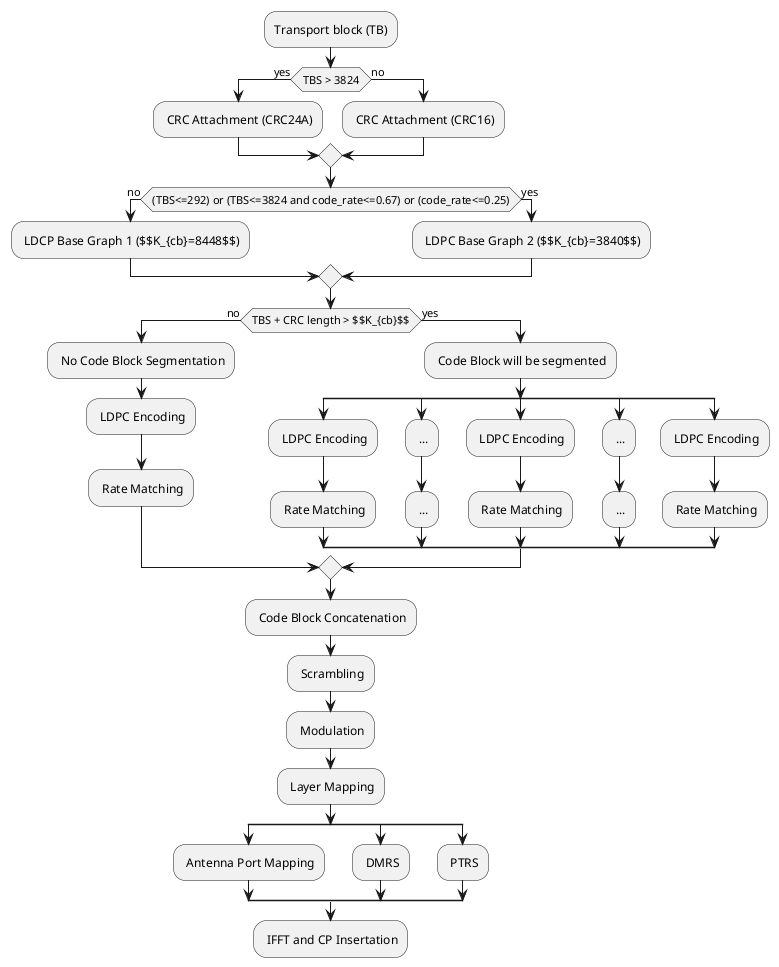
```plantuml
@startuml
:Transport block (TB);
if (TBS > 3824) then (yes)
	: CRC Attachment (CRC24A);
else (no)
	: CRC Attachment (CRC16);
endif
if ((TBS<=292) or (TBS<=3824 and code_rate<=0.67) or (code_rate<=0.25)) then (no)
	: LDCP Base Graph 1 ($$K_{cb}=8448$$);
else (yes)
	: LDPC Base Graph 2 ($$K_{cb}=3840$$);
endif
if (TBS + CRC length > $$K_{cb}$$) then (no)
	: No Code Block Segmentation;
	: LDPC Encoding;
	: Rate Matching;
else (yes)
	: Code Block will be segmented;
	split
		: LDPC Encoding;
		: Rate Matching;
	split again
		: ...;
		: ...;
	split again
		: LDPC Encoding;
		: Rate Matching;
	split again
		: ...;
		: ...;
	split again
		: LDPC Encoding;
		: Rate Matching;
	end split
endif
: Code Block Concatenation;
: Scrambling;
: Modulation;
: Layer Mapping;
split
	: Antenna Port Mapping;
split again
	: DMRS;
split again
	: PTRS;
end split
: IFFT and CP Insertation;
@enduml
```


---

#### CRC 부착 (CRC Attachment)

MAC 계층에서 전송 블록을 받으면, 이 TB의 크기는 매우 작을 수도, 매우 클 수도 있습니다.  
TB 크기에 따라 **어떤 CRC(Cyclic Redundancy Check)** 를 사용할지 결정합니다.

- TB 크기 > 3824 → **CRC24A 사용**
- TB 크기 ≤ 3824 → **CRC16 사용**

CRC가 클수록 에러 검출 확률이 높기 때문에,  
큰 TB에는 큰 CRC를 사용하는 것이 좋습니다.

---

#### 코드 블록 분할 (Code Block Segmentation)

CRC를 부착한 후, TB를 여러 개의 **코드 블록(Code Block)** 으로 나눕니다.  
이렇게 나누는 이유는 **디코더 복잡도를 줄이기 위해서**입니다.

분할 방법은 다소 복잡합니다.  
먼저 **LDPC Base Graph**를 선택합니다.  
LDPC에는 **Base Graph 1**과 **Base Graph 2** 두 가지가 있습니다.

- **Base Graph 1:** 큰 TB에 사용됨 (46×68 크기)
- **Base Graph 2:** 작은 TB에 사용됨 (42×52 크기)

이 행렬(matrix)은 **LDPC 부호화 시 사용되는 패리티 체크 행렬**로,  
“Low Density”(즉, 1의 개수가 매우 적음) 형태입니다.

---
##### Base Graph 선택 조건:

다음 조건 중 하나라도 참이면 → **Base Graph 2 사용**

- TB 크기 ≤ 292 bit
- TB 크기 ≤ 3824이고, 코드율(Code Rate) ≤ 0.67
- 코드율 ≤ 1/4

그 외의 경우 → **Base Graph 1 사용**

Base Graph별 코드 블록 최대 크기는:

- BG1 → 8448
- BG2 → 3840

---

#### 코드 블록 분할 및 CRC 부착

만약 TB+CRC의 크기가 위 코드 블록 최대 크기(Kcb)를 초과하면,  
TB를 여러 개의 코드 블록으로 나눕니다.

예시:  
TB+CRC = 10,000 bit, Kcb = 8448 → 2개의 코드 블록으로 나눔.  
각 블록의 크기는 5000 + 24(CRC) = **5024 bit**.

각 코드 블록에는 **CRC24B**가 추가됩니다.  
분할이 없는 경우에는 이 CRC를 추가하지 않습니다.

---

#### LDPC 부호화 (LDPC Encoding)

각 코드 블록은 LDPC 부호화 모듈을 통과합니다.  
LDPC 인코더의 입력 길이는 $K_b * Z_c$로 정의되며,  
$Z_c$는 **리프팅 사이즈(lifting size)** 입니다.

BG1의 경우: Kb = 22  
조건식: $22 \times  Z_c >= \text{코드 블록 크기}$

예를 들어, $CB_{size} = 5024$ → 최소 Zc ≈ 240

BG2의 경우 Kb는 TB 크기에 따라 6, 8, 9, 10 중 하나가 됩니다.

입출력 크기:

- BG1 → 입력 $22_{Zc}$, 출력 $66_{Zc}$ (코드율 1/3)
- BG2 → 입력 $10_{Zc}$, 출력 $50_{Zc}$ (코드율 1/5)

부족한 비트는 **Filler bits(null bits)** 로 채워서  
입력 크기를 맞춥니다.

---

#### Rate Matching (속도 맞춤)

LDPC 후에는 **Rate Matching**이 수행됩니다.  
PDSCH → 항상 **LBRM (Limited Buffer Rate Matching)**  
PUSCH → LBRM 또는 **Full Buffer Rate Matching** 중 선택 가능

그 후, 모든 코드 블록은 순서대로 **Concatenation(연결)** 되어 하나의 비트 시퀀스로 합쳐집니다.

---

#### Scrambling (스크램블링)

비트 시퀀스는 **랜덤화(randomization)** 되어,  
다른 사용자나 셀에서의 간섭을 줄입니다.

초기화 식:

- **PDSCH:** $n_{RNTI} * 2^{15} + 9*2^{14} * \text{(codeword index)} + n_{ID}$
- **PUSCH:** $n_{RNTI} * 2^{15} + n_{ID}$

UCI(User Control Information) 비트는 별도의 스크램블링을 사용합니다.

---

#### Modulation (변조)

- PDSCH → QPSK, 16QAM, 64QAM, 256QAM
- PUSCH → 위 4가지 + (Transform Precoding 활성화 시) π/2 BPSK

---

#### Layer Mapping (계층 매핑)

- PDSCH: 최대 8개 레이어
- PUSCH: 최대 4개 레이어

각 코드워드(codeword)는 독립적으로 레이어에 매핑됩니다.  
레이어 수에 따라 심볼이 번갈아가며 배치됩니다.  
(예: 2레이어일 때 L0 → 짝수, L1 → 홀수 심볼)

---

#### 안테나 포트 매핑 및 자원 블록 매핑

이 부분은 매우 복잡하므로, 별도의 영상에서 다룬다고 합니다.  
(DMRS와 연관됨)

---
### Reception
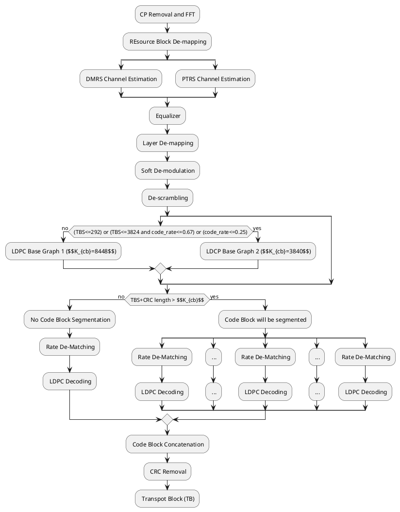
```plantuml
@startuml
:CP Removal and FFT;
: REsource Block De-mapping;
split
	: DMRS Channel Estimation;
split again
	: PTRS Channel Estimation;
end split
: Equalizer;
: Layer De-mapping;
: Soft De-modulation;
: De-scrambling;
split
	if ((TBS<=292) or (TBS<=3824 and code_rate<=0.67) or (code_rate<=0.25)) then (no)
		: LDPC Base Graph 1 ($$K_{cb}=8448$$);
	else (yes)
		: LDCP Base Graph 2 ($$K_{cb}=3840$$);
	endif
split again
end split
if (TBS+CRC length > $$K_{cb}$$) then (no)
	: No Code Block Segmentation;
	: Rate De-Matching;
	: LDPC Decoding;
else (yes)
	: Code Block will be segmented;
	split
		: Rate De-Matching;
		: LDPC Decoding;
	split again
		: ...;
		: ...;
	split again
		: Rate De-Matching;
		: LDPC Decoding;
	split again
		: ...;
		: ...;
	split again
		: Rate De-Matching;
		: LDPC Decoding;
	end split
endif
: Code Block Concatenation;
: CRC Removal;
: Transpot Block (TB);
@enduml
```
---
#### 수신단 처리 (Receiver Processing)

수신단은 송신단의 반대 순서로 동작합니다.

1. DMRS 복조 후 채널 추정
2. Equalizer (ZF, MMSE 등) 적용
3. Layer De-mapping
4. Soft Demodulation (LLR 값 생성)
5. Descrambling
6. Code Block Segmentation 복원
7. Rate Dematching
8. LDPC 디코딩
9. Code Block 재조합 및 CRC 검사

마지막으로 CRC24A를 제거하면 **최종 Transport Block** 이 복원됩니다.

## Transport Block Size Calculation

### **개요 — TBS란 무엇인가?**

> **TBS (Transport Block Size)** 는  한 번의 **PDSCH (Downlink)** 또는 **PUSCH (Uplink)** 전송에서  물리계층(PHY)이 상위계층(MAC)으로부터 받아 처리할 수 있는 **데이터 비트의 양**을 의미합니다.

즉,

> “한 번 전송에 실릴 수 있는 payload 크기(비트 단위)”입니다.

---

### **TBS 계산의 주요 입력 변수**

TBS는 아래 값들에 의해 결정됩니다 👇

| 항목                 | 의미                             | 단위      | 설명                                 |
| ------------------ | ------------------------------ | ------- | ---------------------------------- |
| $$N_{PRB}$$​       | 할당된 Physical Resource Block 개수 | 개       | 주파수 자원 폭                           |
| $$N_{symb}$$​      | 사용된 OFDM symbol 개수             | 개       | 시간 자원 길이                           |
| $$N_{sc}$$​        | 서브캐리어 개수 (12)                  | 개       | PRB당 subcarrier 수                  |
| $$N_{RE}^{used}$$​ | 실제 데이터용 RE 개수                  | 개       | DMRS, CSI-RS 등 제외한 RE 수            |
| $$Q_m$$​           | 변조 차수 (Modulation Order)       | bit/sym | QPSK=2, 16QAM=4, 64QAM=6, 256QAM=8 |
| R                  | 코드율 (Coding Rate)              | -       | LDPC / Polar 부호율                   |
| $$N_{layer}$$​     | 계층(layer) 수                    | 개       | MIMO 전송 시 병렬 스트림 수                 |
| $$N_{OH}$$​        | 오버헤드 비트                        | -       | (예: UCI 포함 시 6 등)                  |

---

### **기본 개념 공식**

우선, 전송 가능한 총 비트 수의 근사값은 다음과 같습니다 👇
$$
N_{info} = N_{PRB} × N_{sc} × N_{symb} × Q_m × R × N_{layer}​
$$
하지만 실제 표준(3GPP 38.214 / 38.212)에서는  **비트 단위 rounding, segmentation, lookup table** 등을 포함해 아래 절차로 계산합니다.

---

### **TBS Calculation Step-by-Step (3GPP TS 38.214 §5.1.3.2)**

#### **Step 1️: 유효 RE 계산**

- $N_{RE}^{PRB} = N_{sc}^{PRB} × N_{symb}^{slot} - N_{DMRS}^{PRB} - N_{OH}$
- $N_{sc}^{PRB} = 12$
- $N_{symb}^{slot} \text{ = 실제 데이터 심볼 개수 (보통 14 - DMRS 심볼 수)}$
- $N_{DMRS}^{PRB}​ \text{ = DMRS가 차지하는 RE 수}$
- $N_{OH} \text{​ = 기타 오버헤드 (기본적으로 0, 경우에 따라 6)}$

---

#### **Step 2️: 전체 자원 RE 계산**

$$N_{RE}^{total} = N_{PRB} × N_{RE}^{PRB}$$​

---

#### **Step 3️: 초기 비트수 계산**

$$N_{info}^{init} = N_{RE}^{total} × Q_m × R$$

---

#### **Step 4️: 3GPP 표준 TBS Table 적용**

실제 TBS는 위 단순 계산값을 직접 쓰지 않고,  
3GPP에서 정의된 **TBS lookup table** 에 따라 정규화(rounding)합니다.

- 작은 전송 (≤ 3824 bits):  
    → 직접 계산식 적용 (integer rounding)
- 큰 전송 (> 3824 bits):  
    → 아래 표준화된 “TBS table index”를 기반으로 근사값 선택

즉, 다음 절차를 따릅니다:

$$N_{info}^{’} = \text{TBS\_table}(N_{info}^{init})$$

---

#### **Step 5️: 계층 수 반영**

$$TBS = N_{info}^{’} × N_{layer}$$​

---

### **실제 예시 (Downlink PDSCH)**

| 파라미터              | 값                      | 설명                      |
| ----------------- | ---------------------- | ----------------------- |
| $$N_{PRB}$$​      | 50                     | 10 MHz 대역에서 약 50 PRB    |
| $$N_{symb}$$​     | 12                     | 슬롯당 14심볼 중 2개는 DMRS로 사용 |
| $$Q_m$$​          | 6                      | 64QAM                   |
| $$R$$             | 0.5                    | 코드율 1/2                 |
| $$N_{layer}$$​    | 2                      | MIMO 2×2                |
| $$N_{RE}^{PRB}$$​ | 12×12 - DMRS(12) = 132 |                         |

계산:

$$N_{RE}^{total} = 50 × 132 = 6600$$
$$N_{info} = 6600 × 6 × 0.5 × 2 = 39600 \text{ bits}$$
즉,  
한 슬롯(1 ms)당 약 **39.6 kb** 데이터 전송이 가능.

---

### **LTE와 NR의 차이점**

|항목|LTE|5G NR|
|---|---|---|
|**Modulation**|최대 64QAM|최대 256QAM|
|**Code rate**|고정 표준 범위 (≈ 0.93)|유연한 LDPC rate|
|**Table 방식**|고정 테이블 기반|2가지 TBS Table (normal, high SE)|
|**Multiple layers**|최대 4|최대 8|

5G NR에서는 **“TBS Table 1”** (normal) 과 **“TBS Table 2”** (high spectral efficiency) 두 종류를 선택 가능합니다.

---

### **TBS Table 개요 (3GPP 38.214, Table 5.1.3.2-1)**

|Index|NinfoN_{info}Ninfo​ (bit)|Index|NinfoN_{info}Ninfo​ (bit)|
|---|---|---|---|
|0|24|9|328|
|10|408|20|1560|
|30|5048|40|20000|
|50|40832|60|119192|
|75|382400|...|...|

즉, 실제 시스템에서는 연속적인 계산값을 이 테이블에 매핑하여 사용합니다.

---

### **PUSCH의 경우 (Uplink)**

PUSCH도 기본적으로 **같은 계산 로직**을 따릅니다.  
단, 추가 고려 항목이 있습니다:

|항목|설명|
|---|---|
|**UCI (Uplink Control Information)**|HARQ-ACK, CSI 보고 등 제어 비트 포함 시 오버헤드 발생|
|**DMRS Pattern**|Uplink은 Type1/Type2 패턴 선택에 따라 DMRS RE 수 다름|
|**Code Rate**|PUSCH에서는 실제 유효 코드율이 더 낮음|
|**Transform Precoding (DFT-s-OFDM)**|Release 15에서는 optional, RE 매핑 방식 다름|

따라서 PUSCH에서는 **오버헤드(OH)** 항이 더 크게 반영됩니다.

---

### **핵심 요약**

| 항목          | 의미                                                      | 설명                       |
| ----------- | ------------------------------------------------------- | ------------------------ |
| **TBS**     | Transport Block Size                                    | 한 전송에서 전송 가능한 비트 수       |
| **적용 채널**   | PDSCH / PUSCH                                           | Downlink / Uplink 데이터 채널 |
| **기준 요소**   | PRB, Symbol 수, Modulation, Code Rate, Layers            |                          |
| **계산식(근사)** | $$TBS ≈ N_{PRB} × N_{symb} × 12 × Q_m × R × N_{layer}$$ |                          |
| **표준 규격**   | 3GPP TS 38.214 §5.1.3.2, §6.1.4                         |                          |

## Precoding for MIMO

### **기본 개념**

> **Precoding** 이란,  
> 여러 송신 안테나를 이용할 때 **데이터 스트림을 안테나 신호로 변환하기 위한 행렬 연산**입니다.

즉,

> “기지국이 여러 안테나를 통해 데이터를 어떻게 섞어서(phase + amplitude control) 송신할 것인가?”를 결정하는 과정이에요.

수식으로 표현하면 👇  
$$  
\mathbf{x} = \mathbf{W} , \mathbf{s}  
$$

| 기호    | 의미                                  |
| ----- | ----------------------------------- |
| **s** | 데이터 스트림 벡터 $(N_layer × 1)$          |
| **W** | Precoding Matrix $(N_TX × N_layer)$ |
| **x** | 송신 안테나별 신호 벡터 $(N_TX × 1)$          |

---

## **Precoding의 목적**

|목적|설명|
|---|---|
|**1. Beamforming**|여러 안테나의 위상/진폭을 조합해 원하는 방향으로 전력 집중|
|**2. Interference Suppression**|다중 UE 간 간섭 최소화|
|**3. Spatial Multiplexing**|병렬 스트림 전송으로 전송량(throughput) 극대화|
|**4. Diversity Gain**|전파 페이딩에 강한 송신 신호 구성|

---

### **MIMO 전송 구조**

### 단순화된 블록도

```
            +-------------------+
   Data --> |  Layer Mapper     | --> s₁,s₂,…  
            +-------------------+
                      │
                      ▼
            +-------------------+
            |  Precoder (W)     | --> x₁,…,xₙ  (N_TX 안테나)
            +-------------------+
                      │
                  Radio Tx → 채널 → 수신기
```

- **Layer Mapper**: 전송 계층 수 $(N_{layer})$ 결정
- **Precoder**: 각 스트림을 안테나 신호로 변환
- **Channel Matrix H**: 무선 경로
- **Receiver**: 수신 Combining / Equalization 수행
    

---

### **MIMO 전송 모드와 Precoding**

|전송 모드|특징|Precoding 전략|
|---|---|---|
|**Transmit Diversity**|여러 안테나로 같은 데이터 전송|고정 precoding (예: Alamouti)|
|**Spatial Multiplexing**|서로 다른 데이터 스트림 병렬 전송|동적 precoding (채널 피드백 필요)|
|**Beamforming**|동일 데이터를 특정 방향으로 집중|단일 precoding 벡터 (Rank 1)|
|**MU-MIMO**|여러 UE 동시 서비스|각 UE 별 precoder로 간섭 억제|
|**SU-MIMO**|단일 UE에 복수 스트림|동일 precoder 행렬 공유|

---

### **Precoding Matrix (수학적 형태)**

$$  
\mathbf{W} =  
\begin{bmatrix}  
w_{11} & w_{12} & \cdots & w_{1L} \\  
w_{21} & w_{22} & \cdots & w_{2L} \\  
\vdots & \vdots & \ddots & \vdots \\  
w_{N_T1} & w_{N_T2} & \cdots & w_{N_TL}  
\end{bmatrix}  
$$

- $(N_T)$: 송신 안테나 수
- (L): Layer 수
- 각 열은 한 Layer의 빔 형태를 나타냄.
- 각 행은 송신 안테나 별 가중치(weight).

---

### **Precoding Matrix Index (PMI)**

- 실제 5G 시스템에서 precoding 행렬 자체를 보내지 않고,  
    단말(UE)은 **PMI (Precoding Matrix Indicator)** 라는 인덱스만 피드백합니다.
- gNB는 그 인덱스에 해당하는 행렬을 표준 Lookup Table (PMI Codebook)에서 선택해 사용합니다.

|피드백 항목|의미|
|---|---|
|**RI (Rank Indicator)**|Layer 수|
|**PMI**|Precoding Matrix Index|
|**CQI**|Channel Quality Indicator (MCS 결정용)|

---

### **Precoding 전략의 구분**

|구분|설명|
|---|---|
|**Codebook-based Precoding**|UE가 표준 코드북 내 행렬 중 하나를 선택(PMI 보고) → gNB 적용|
|**Non-codebook Precoding**|gNB가 직접 채널 정보를 추정하고 가중치 계산 (예: Massive MIMO)|
|**Hybrid Beamforming**|아날로그(phase shifter) + 디지털(baseband) precoding 조합|

---

### **Massive MIMO Precoding 예시**

- gNB 안테나 수 ≫ Layer 수
    
- **Hybrid precoding** 사용:  
    $$
    \mathbf{W} = \mathbf{W}_{RF} \times \mathbf{W}_{BB}  
    $$
    
    - $( \mathbf{W}_{RF} )$: Analog beamforming (phase control)
    - $( \mathbf{W}_{BB} )$: Digital baseband precoding

이 방식으로 수십 개의 빔을 동시에 형성하면서,  
특정 UE 방향으로 에너지를 집중시킬 수 있어요.

---

### **수신단(UE)에서의 Combining**

UE는 수신 신호를 역방향 으로 **Combining Matrix (V)** 를 이용해 처리합니다.

$$  
\hat{\mathbf{s}} = \mathbf{V}^{H} \mathbf{y}  
$$

- 송신단 precoding $( \mathbf{W} )$
- 수신단 combining $( \mathbf{V} )$  
    → 결국 채널 행렬 $( \mathbf{H} )$ 와 곱해져  
    $( \mathbf{V}^H \mathbf{H} \mathbf{W} )$ 의 대각화가 이상적 목표입니다.

---

### **핵심 요약**

| 항목        | 설명                                                    |
| --------- | ----------------------------------------------------- |
| **정의**    | MIMO에서 데이터 스트림을 송신 안테나 신호로 변환하기 위한 가중 행렬              |
| **수식**    | $\mathbf{x} = \mathbf{W} \mathbf{s}$                  |
| **입력**    | Layer 데이터 벡터 s                                        |
| **출력**    | 송신 안테나 신호 x                                           |
| **종류**    | Beamforming, Spatial Multiplexing, Diversity, MU-MIMO |
| **제어정보**  | PMI, RI, CQI                                          |
| **표준 문서** | 3GPP TS 38.211 §7.3, 38.214 §6.3.1                    |
### 추가: 수식의 이해


$$
\begin{align}
Y_1&=H_{11}\cdot X_1+\omega_1+H_{21}\cdot X_2+\omega_2 \\
Y_2&=H_{12}\cdot X_1+\omega_1+H_{22}\cdot X_2+\omega_2 \\
\binom{Y_1}{Y_2}&=\begin{pmatrix}H_{11}&H_{21}\\H_{12}&H_{22}\\\end{pmatrix}\cdot\binom{X_1}{X_2}+\binom{\omega_1}{\omega_2} \\
Y &= H \cdot X + \omega
\end{align}
$$
여기에서 H는 채널 상태 변수이고 $\omega$는 잡음입니다. H 행렬은 송신된 신호가 수신기에서 어떻게 변화하는지를 나타내며, 각 송신 안테나와 수신 안테나 쌍에 대해 위상과 진폭을 표시하는 요소들로 구성됩니다. 상태 변수는 매우 빠른 시간에 자주 변경됩니다.

## PRACH (Physical Random Access Channel)

**PRACH(물리 랜덤 액세스 채널)**은 UE가 gNB에 처음 접속할 때, 혹은 핸드오버/재접속 시 **랜덤 액세스(RA) 절차를 시작하기 위한 물리 계층 채널**입니다.

UE는 PRACH를 사용해 **Preamble(프리앰블)**을 전송하여 gNB가 UE의 존재를 알고, UL 동기화, 빔 선택, 자원 할당을 할 수 있게 됩니다.

---

### PRACH의 주요 목적

#### **1) 초기 접속(Initial Access)**

UE가 처음 셀에 붙을 때 PRACH Preamble(MSG1)을 보냅니다.  
gNB는 MSG2(RAR)로 Timing Advance와 UL Grant를 주어 UL 동기화가 이루어집니다.

#### **2) 빔 관리(Beam Management)**

특히 mmWave(FR2)에서 매우 중요합니다.  
SSB 빔 방향을 기준으로 UE는 **해당 SSB에 대응하는 PRACH 자원(RO)을 선택**해 전송합니다.

#### **3) 핸드오버 및 재접속(RRC Re-establishment)**

HO-RACH 또는 재접속 시 동일한 RA 절차를 다시 수행합니다.

---

### NR PRACH Preamble 종류

NR은 **두 가지 계열의 Preamble**을 사용합니다.

#### **장형(LRA, Long Preamble)**

- 839포인트 Zadoff–Chu 기반
- 긴 CP → 대형 셀(매크로, Rural) 용
- LTE와 유사하지만 NR은 훨씬 더 유연한 설정 가능

#### **단형(SRA, Short Preamble)**

- 짧은 DFT-s-OFDM 기반
- 하나의 슬롯에 **여러 개의 Preamble** 배치 가능
- TDD, FR2(mmWave), Urban Small Cell 환경에 최적화

NR은 LTE보다 **Preamble 종류·길이·자원 배치가 훨씬 더 다양**합니다.

---

### FR1 vs FR2 환경에서의 PRACH

|구분|주파수|특징|Preamble 유형|
|---|---|---|---|
|**FR1**|6GHz 이하|일반 LTE와 유사한 환경|장형 + 단형|
|**FR2**|24~52GHz|빔포밍 필수, Path Loss 큼|단형만 사용|

특히 FR2에서는 **SSB 빔 스위핑 + PRACH 빔 기반 RA**가 핵심입니다.

---

### NR Random Access 4-단계 절차

NR은 기본적으로 **4-Step RA 절차**를 사용합니다.

#### **Msg1: PRACH Preamble 전송**

- UE가 RO(Random Access Occasion)에서 Preamble 선택 후 송신
- gNB는 Timing Advance 측정

#### **Msg2: Random Access Response (RAR)**

- TA(UL Timing Advance)
- UL Grant
- Temporary C-RNTI  주소가 포함됨

#### **Msg3: RRC 계층 메시지 전송**

- UL Grant로 UL-SCH(PUSCH) 통해 UE ID 등 전송

#### **Msg4: Contention Resolution**

- gNB가 충돌 해결
- UE는 자신의 ID가 포함된 메시지를 확인하면 액세스 성공

NR은 필요에 따라 **2-Step RA**도 지원하지만, 대부분의 셀에서는 여전히 4-Step을 사용합니다.

---

### 빔포밍 기반 PRACH(Beam-based PRACH)

5G NR의 핵심 차별점은 바로 **빔 기반 PRACH**입니다.

- gNB는 SSB를 여러 빔 방향으로 송출(Beam sweeping)
- UE는 가장 강한 SSB Beam 선택
- 그 SSB와 매핑된 PRACH 자원에 Msg1을 송신
- gNB도 빔 기반으로 Msg2/Msg4 응답

→ **FR2(mmWave)에서 접속 성공률을 끌어올리는 핵심 기술**

---

### PRACH 주요 RRC 파라미터 (TS 38.331)

gNB는 RRC 메시지로 PRACH 자원을 설정합니다. 핵심 파라미터:

- `prach-ConfigurationIndex`
- `rach-ConfigCommon` / `rach-ConfigDedicated`
- `msg1-FDM` (1~8개의 주파수 도메인 레이어)
- `zeroCorrelationZoneConfig`
- `ssb-perRACH-OccasionAndCB-PreamblesPerSSB`
- `ra-ResponseWindow`

NR은 CBRA(SI 기반)와 CFRA(UE별 전용 RA 자원) 모두 지원합니다.

---

### LTE 대비 NR PRACH 차이점

|항목|LTE|NR|
|---|---|---|
|Preamble 타입|긴 ZC 기반만|장형+단형, 매우 유연|
|빔포밍|거의 없음|필수 (특히 FR2)|
|FDM 자원|제한적|Msg1-FDM으로 최대 8개 FDM 가능|
|FR2 지원|X|O|
|SSB 매핑|없음|SSB 기반 RO 매핑 필수|

NR PRACH는 빔포밍·FR2·스몰셀 환경에 맞춰 **대폭 확장된 구조**입니다.

---

### 참고할 3GPP TS 문서

- **38.211** – 물리 채널 및 변조(→ PRACH 형식 정의)
- **38.212** – 채널 코딩/멀티플렉싱
- **38.213** – 물리 레이어 절차(→ RA Flow)
- **38.331** – RRC 규격(PRACH 설정 포함)

---

### PRACH 포맷 A1 / A2 / B1 / B2 / C0 / C2 비교표

(3GPP TS 38.211 기반 요약)

5G NR PRACH는 **Short Sequence** 계열(SRA)에서 A/B/C 시리즈를 사용합니다.  
이는 **슬롯 내 자원 배치, CP 길이, 서브캐리어 간격, 반복 횟수**가 다릅니다.

#### NR Short PRACH Format 비교표

|포맷|특징|Subcarrier spacing|기저 OFDM 심볼 수|반복(Repetition)|적용 환경|
|---|---|---|---|---|---|
|**A1**|가장 짧은 PRACH 포맷 중 하나|15 kHz|1|4|소형 셀, FR1|
|**A2**|A1보다 반복 적음|30 kHz|1|2|TDD/Urban|
|**B1**|CP 길이 증가|15 kHz|2|4|중간 셀|
|**B2**|B1의 30 kHz 버전|30 kHz|2|2|TDD, 빔기반|
|**C0**|더 넓은 BW, 짧은 길이|60 kHz|1|1|**FR2 mmWave**|
|**C2**|C0보다 CP 더 짧음|120 kHz|1|1|**FR2 mmWave**|

📌 핵심 요약

- **A/B 시리즈 = 주로 FR1**
- **C 시리즈 = FR2 전용**
- SCS가 커질수록 세그먼트 길이 ↓, 빔 기반 RA에 최적화
- 반복(Repetition)은 Coverage 보완용

---

### RA 4-Step 프로시저 시퀀스 다이어그램

아래는 **3GPP NR RA 절차 전체**입니다.

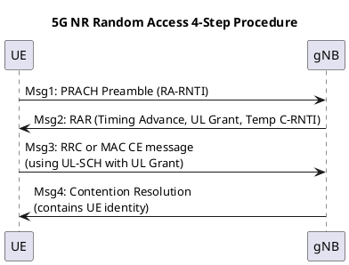
```plantuml
@startuml
title 5G NR Random Access 4-Step Procedure

UE -> gNB: Msg1: PRACH Preamble (RA-RNTI)
gNB -> UE: Msg2: RAR (Timing Advance, UL Grant, Temp C-RNTI)

UE -> gNB: Msg3: RRC or MAC CE message\n(using UL-SCH with UL Grant)
gNB -> UE: Msg4: Contention Resolution\n(contains UE identity)

@enduml
```

📌 설명 요약

- **Msg1**: UE가 RO에서 PRACH 전송
- **Msg2**: TA + UL Grant + Temporary C-RNTI
- **Msg3**: UL-SCH로 ID/RRC 메시지 전송
- **Msg4**: UE-Identifier 포함 → 충돌 해결

---

### FR2 SSB – PRACH 매핑 구조 그림 (텍스트 기반 구조도)

FR2(mmWave)는 **SSB Beam sweeping**과 **PRACH Beam 매핑**이 필수입니다.

```
gNB:  
 ┌─────────────────────────────────────────┐
 │   SSB Beam 1 → PRACH Occasion #1        │
 │   SSB Beam 2 → PRACH Occasion #2        │
 │   SSB Beam 3 → PRACH Occasion #3        │
 │   ...                                   │
 │   SSB Beam N → PRACH Occasion #N        │
 └─────────────────────────────────────────┘

UE:
1) 모든 SSB 신호 수신 후 RSRP 측정
2) 가장 강한 SSB Beam 선택
3) 해당 SSB에 대응하는 PRACH RO에서 Preamble 전송
```

📌 핵심 메커니즘

- FR2는 빔 방향성을 반드시 사용해야 함
- 각 SSB는 특정 **RACH Occasion**과 매핑
- Msg2/Msg4도 동일 빔으로 답신해야 RA 성공률이 높음

---

### RACH 디버깅 로그 해석

(실제 L2/L1 로거 기반 정리)

#### **Msg1 (PRACH 전송 로그)**

- TX Time / RO index
- Preamble Index
- SSB index와의 매핑
- TX power, TA estimate

예시 로그 해석:

```
PRACH: RO=5, PreambleID=23, SSB=7, Power=18 dBm
```

→ UE가 SSB#7 기반으로 RO#5에서 23번 preamble을 전송한 상황

---

#### **Msg2 (RAR 수신 로그)**

RAR 내용:

- `TimingAdvance`
- `UL Grant` (RB start, size, MCS)
- `Temporary C-RNTI`

예시:

```
RAR: TA=36, ULGrant:RB(12,4), TempCRNTI=0x1234
```

---

#### **Msg3 전송 로그**

- PUSCH으로 UL message 송신
- UL Grant 기반 RB/MCS 확인 필요

예시:

```
Msg3: UL-SCH Tx, T-CRNTI=0x1234, RB=12-16, MCS=4
```

---

#### **Msg4 (Contention Resolution)**

Msg4에 UE ID가 포함되면 성공  
예시:

```
CR: MAC CE UE-ID Match
```

---

### RACH 실패 원인 분석 (전문가용)

5G NR RACH 실패는 크게 **동기화 / 빔 / 자원 / HARQ / 전력** 실패로 나뉩니다.

---

#### 1) Beam Mismatch (FR2에서 매우 흔함)

##### 원인

- UE가 SSB#7에서 PRACH 보냈는데
- gNB가 Msg2를 다른 빔으로 송신함

##### 증상

- Msg1 OK → Msg2 미수신
- RAR timeout

##### 해결

- Beam correspondence 개선
- SSB–PRACH 매핑 재설정

---

#### 2) RO (Random Access Occasion) mismatch

##### 원인

- UE가 잘못된 시간/주파수의 PRACH RO 사용
- RRC-config 오해석 또는 gNB misalignment

##### 증상

- Msg1 detection 실패
- UE는 연속적으로 재시도(Msg1 반복)

---

#### 3) Timing Advance 실패

##### 원인

- gNB가 TA를 너무 작게/크게 보냄
- UE의 MSG3가 UL 영역 밖으로 벗어남

##### 증상

- gNB가 Msg3 디코딩 실패
- Msg4 없음 → Contention timeout

---

#### 4) 전력 부족 (Power Limited UE)

##### 원인

- UE가 PRACH Power ramp-up 한계 도달
- FR2에서 특히 발생

##### 증상

- Msg1 미검출
- PRACH MaxPower error

---

#### 5) Collision (Contention)

##### 원인

- 두 UE가 동일 Preamble 사용

##### 증상

- Msg2 수신 OK
- Msg3 충돌 → Msg4에서 UE-ID mismatch

---

#### 6) UL Grant 문제

##### 원인

- RAR의 UL Grant 자원이 PUSCH 구성과 충돌
- 주파수 경계 문제

##### 증상

- Msg3 디코딩 실패

---

### PRACH 모든 포맷 (A/B/C 시리즈) 전체 테이블

5G NR PRACH 포맷은 크게:

- **Long sequence:** `0, 1, 2, 3` (LTE 계열, L_RA = 839, 대형 셀, FR1) ([NXG Connect](https://www.nxgconnect.com/post/5g-sa-rach-procedure-a-technical-deep-dive?utm_source=chatgpt.com "5G SA RACH Procedure– A Technical Deep Dive"))
- **Short sequence:** `A1, A2, A3, B1, B2, B3, B4, C0, C2` (L_RA = 139, 소형/빔기반/FR2 포함) ([NXG Connect](https://www.nxgconnect.com/post/5g-sa-rach-procedure-a-technical-deep-dive?utm_source=chatgpt.com "5G SA RACH Procedure– A Technical Deep Dive"))

여기서는 요청하신 **A/B/C 시리즈만** 요약합니다. (정확한 샘플 길이·심볼 수는 38.211 Table 6.3.3.1-2 참고.)

> ⚠️ 아래 SCS/용도는 **대표적인 매핑** 기준이며, 실제 지원 조합은 `prach-ConfigurationIndex`에 따라 달라질 수 있습니다. ([mathworks.com](https://www.mathworks.com/help/5g/ug/5g-nr-prach-configuration.html?utm_source=chatgpt.com "5G NR PRACH Configuration - MATLAB & Simulink"))

|포맷|시퀀스 길이 L_RA|대표 SCS (Δf_RA)|구조(심볼/반복) 개념|특징/용도 (대표)|
|---|---|---|---|---|
|**A1**|139|15 kHz|짧은 preamble 1개 + 반복 다수|FR1, 소형/노멀 셀, 커버리지↑|
|**A2**|139|30 kHz|A1보다 짧은 반복|TDD, 약간 더 좁은 커버리지, 짧은 TTI|
|**A3**|139|60 kHz|더 짧은 길이, 고 SCS|레이턴시 민감, 고속/밀집 환경|
|**B1**|139|15 kHz|2 심볼 구조 + 반복|중간 크기 셀, 다소 큰 지연 스프레드 대응|
|**B2**|139|30 kHz|B1의 30kHz 버전|TDD Urban, 빔 기반 RA 용이|
|**B3**|139|60 kHz|B2보다 더 짧은 TTI|고밀도, 고속 핸드오버|
|**B4**|139|120 kHz|초고 SCS, 짧은 preamble|FR2 edge 용도로도 사용 가능|
|**C0**|139|60 kHz|단일 짧은 preamble|**FR2 mmWave** 대표 포맷|
|**C2**|139|120 kHz|C0보다 더 짧은 유효 길이|빔포밍 전제 초근거리/초소형 셀|

핵심 정리:

- A 시리즈: **짧고 반복 위주**, 소형/일반 셀
- B 시리즈: **2심볼 구조**, 지연 스프레드 조금 더 커버
- C 시리즈: **FR2 중심, 초고 SCS**, 빔 기반 mmWave RA에 최적화

---

### FR2 빔 기반 RA 상세 구조

#### (1) 개념 구조 (ASCII 다이어그램)

```text
[Downlink 방향]

gNB
 ├─ SSB Beam #0  ──► UE (측정)
 ├─ SSB Beam #1  ──► UE (측정)
 ├─ SSB Beam #2  ──► UE (측정)
 └─ ...
UE
 ├─ 모든 SSB RSRP/RSRQ 측정
 ├─ Best Beam = SSB #k 선택
 └─ "SSB #k ↔ PRACH RO(#k)" 매핑 테이블 사용

[Uplink 방향]

UE
 └─ SSB #k에 대응되는
    PRACH Occasion(시간/주파수/빔)에서
    Short PRACH (예: C0/C2) 전송 (Msg1)

gNB
 ├─ 동일 Beam #k Rx 빔포밍으로 PRACH 검출
 ├─ Timing Advance, Power, Beam ID 추출
 └─ 같은 Beam #k로 Msg2/Msg4 전송
```

포인트:

- **"SSB index ↔ RACH Occasion ↔ Beam index" 매핑**이 FR2 RA의 핵심
- Beam이 틀리면 (=beam mismatch) Msg2가 안 들어와서 RA 실패 확률 급상승

---

#### (2) 빔 기반 RA 시퀀스

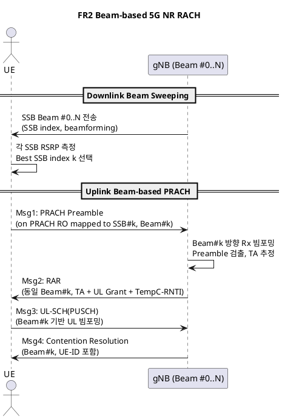
```plantuml
@startuml
title FR2 Beam-based 5G NR RACH

actor UE
participant "gNB (Beam #0..N)" as gNB

== Downlink Beam Sweeping ==
gNB -> UE: SSB Beam #0..N 전송\n(SSB index, beamforming)

UE -> UE: 각 SSB RSRP 측정\nBest SSB index k 선택

== Uplink Beam-based PRACH ==
UE -> gNB: Msg1: PRACH Preamble\n(on PRACH RO mapped to SSB#k, Beam#k)

gNB -> gNB: Beam#k 방향 Rx 빔포밍\nPreamble 검출, TA 추정

gNB -> UE: Msg2: RAR\n(동일 Beam#k, TA + UL Grant + TempC-RNTI)

UE -> gNB: Msg3: UL-SCH(PUSCH)\n(Beam#k 기반 UL 빔포밍)

gNB -> UE: Msg4: Contention Resolution\n(Beam#k, UE-ID 포함)

@enduml
```

---

### RACH 성공률 분석 메트릭 (factory log 스타일)

운영/팩토리 환경에서 **RACH 품질 지표(KPI)**를 설계할 때 자주 쓰는 방식입니다.

#### (1) 기본 지표 정의

1. **RACH_Attempt**
    - RA 프로시저 시작 시도 수 (Msg1 전송 기준 카운트)
2. **RACH_Detected_Msg1**
    - gNB가 PRACH preamble을 검출한 수
3. **RACH_RAR_Success**
    - UE가 유효한 RAR(Msg2)을 수신한 수
4. **RACH_Msg3_Success**
    - gNB가 Msg3 PUSCH를 정상 디코딩한 건수
5. **RACH_CR_Success (Full Success)**
    - Msg4 Contention Resolution까지 끝난 “완전히 성공한 RA” 수

---

#### (2) KPI 예시 수식

- **Preamble Detection Rate**  
$$
P_{det} = \frac{RACH\_Deetected\_Msg1}{RACH\_{Attempt}}
$$
- **RAR Success Rate**  
$$
    P_{RAR} = \frac{RACH\_RAR\_Success}{RACH\_Detected\_Msg1}  
$$ 
- **Msg3 Decode Success Rate**  
$$
    P_{M3} = \frac{RACH\_Msg3\_Success}{RACH\_RAR\_Success}  
$$
- **End-to-End RA Success Rate**  
$$ 
    P_{RA} = \frac{RACH\_CR\_Success}{RACH\_Attempt}
$$ 

추가로, 아래처럼 **Slice / Beam / Format 별**로 쪼개서 보는 게 실제 팩토리에서 많이 씁니다:

- `RACH_SuccessRate[format=A1/A2/…]`
- `RACH_SuccessRate[beamIndex]`
- `RACH_SuccessRate[FR1 vs FR2]`
- `RACH_SuccessRate[CBRA vs CFRA]`

---

### (3) 예시 “공장 로그” 스타일 요약 테이블

```text
Day, Cell, FR, Format, Beam, Attempts, CR_Success, RA_SuccessRate
2025-11-14, Cell01, FR1, A1, -,   10500, 10290, 98.0%
2025-11-14, Cell01, FR2, C0, B7,  8000,  7200, 90.0%
2025-11-14, Cell01, FR2, C2, B3,  4000,  3200, 80.0%
...
```

이렇게 보면:

- **특정 Beam(C2, B3)**에서만 RA 성공률이 떨어지는지
- **특정 포맷(C2)**에서만 떨어지는지  
    직관적으로 잡을 수 있습니다.

---

### 실제 gNB/UE 로그 예제 기반 디버깅 튜토리얼

완전 단순화한 예제 로그를 하나 만들어서, **실패 원인을 추적하는 과정**을 보여드리겠습니다.

#### (1) 시나리오: FR2, C0 포맷, Beam mismatch 의심 케이스

##### gNB PRACH 검출 로그

```text
[GNODEB][RACH] DETECT: Cell=1, SSB=7, Beam=7,
  PreambleID=23, TA=32, RxPwr=-92 dBm
```

→ gNB는 **SSB#7 / Beam7** 방향에서 Preamble 23 검출

##### gNB RAR 송신 로그

```text
[GNODEB][RAR] TX: Cell=1, Beam=5,  // (주의) Beam5로 Tx
  RA-RNTI=0x12C3, TempC-RNTI=0x1234,
  TA=32, ULGrant=RB(24,6), MCS=4
```

→ 설정상은 **Beam7** 방향으로 보내야 하는데 구현/설정 문제로 **Beam5**로 나가는 버그

##### UE 로그

```text
[UE][RACH] Msg1: Sent, SSB=7, RO=15, PreambleID=23
[UE][RACH] Waiting for RAR (Window=3 slots)...
[UE][RACH] RAR timeout, no valid RAR detected
[UE][RACH] Backoff 20ms, reattempt count=1
```

→ UE는 빔 #7 방향만 모니터링하는데, gNB가 빔 #5로 RAR을 보내니까 **RAR을 못 봄 → Timeout**

##### 디버깅 포인트

- gNB 측:
    - **SSB index ↔ Beam index ↔ RACH Occasion ↔ RAR Beam index** 매핑 테이블 확인
    - 빔 인덱스 오프셋/버그 여부 확인
- UE 측:
    - 다른 빔도 모니터링하도록 설계할 것인지(벤더 구현 choice)

---

#### (2) 시나리오: Msg3 디코딩 실패 (TA 문제)

```text
[GNODEB][RACH] DETECT: PreambleID=11, TA=12
[GNODEB][RAR] TX: TA=12, ULGrant=RB(30,4)
[UE][RACH] Rx RAR OK, apply TA=12
[UE][PUSCH] Msg3 TX: using TA=12
[GNODEB][PUSCH] Msg3 CRC FAIL (TA error suspected)
[UE][RACH] No Contention Resolution, RA fail, reattempt
```

- 서브프레임/슬롯 레벨에서 TA가 실제 채널과 mismatch → Msg3 UL 심볼이 경계에서 엇나가 PUSCH 디코딩 실패
- 이런 경우엔:
    - TA 추정 알고리즘 (L1) 확인
    - multi-path delay spread 환경에서의 PRACH 포맷 선택 재검토 (다른 포맷 B1/B2 등)

---

### RA 시퀀스 타이밍 다이어그램 (슬롯/심볼 단위)

#### (1) FR1 예: μ = 1 (30 kHz), 14심볼/슬롯 기준

아주 단순화한 텍스트 타이밍입니다.

```text
시간 축 (슬롯 단위, DL/UL mixed TDD 가정)

Slot n
 ├─ DL: SSB 송신 (심볼 0~3)
 ├─ DL: PDCCH/PDSCH
 └─ UL: 공백 또는 다른 UL

Slot n+1
 ├─ UL: PRACH RO 위치 (예: 심볼 2~3)
 │       → Msg1: PRACH Preamble 전송
 └─ 나머지 UL 자원 비워두거나 PUSCH

Slot n+2 ~ n+K
 ├─ DL: RAR Window
 │       → gNB가 이 기간 중 PDCCH+PDSCH로 Msg2(RAR) 송신
 │          (RA-RNTI 기반 검색)
 └─ UE: RAR 수신 대기

Slot n+L
 ├─ UL: UL Grant (RAR에 있던 RB/MCS) 기반
 │       → Msg3: PUSCH 전송
 └─ DL: 다른 트래픽

Slot n+M
 ├─ DL: Msg4 (CR) 포함 PDCCH+PDSCH
 │      → UE ID 매칭되면 RACH 성공
 └─ 이후: 정상 RRC 절차 진행
```

핵심 파라미터:
- **PRACH Occasions**: `prach-ConfigurationIndex`에 의해 특정 슬롯/심볼에 매핑
- **RAR Window**: `ra-ResponseWindow` (예: 3, 5, 10 슬롯)
- **Msg3 시점**: RAR 내 UL Grant가 지정하는 슬롯/심볼

---

#### (2) FR2 예: μ = 3 (120 kHz), C0/C2 포맷

FR2에서는 슬롯이 훨씬 짧고(0.125ms 단위), PRACH와 SSB가 빔 단위로 매핑됩니다.

```text
Slot s (DL)
 ├─ 여러 Beam에 대해 SSB Burst (Beam sweeping)
 └─ UE는 모든 SSB 측정 후 SSB#k 선택

Slot s+Δ1 (UL)
 ├─ Beam k에 대응하는 PRACH RO (C0/C2)
 │    → Msg1 전송 (짧은 preamble, 고 SCS)
 └─ 다른 빔용 RO는 다른 시간/주파수에 존재

Slot s+Δ2 .. s+Δ2+W
 ├─ DL Beam k: Msg2(RAR) 송신
 └─ UE: 동일 빔에서 PDCCH/PDSCH 모니터링

이후
 ├─ Beam k 기반 PUSCH (Msg3)
 └─ Beam k 기반 PDSCH (Msg4)
```

→ FR2에서는 **슬롯/심볼 타이밍 + 빔/SSB 매핑**이 함께 맞아야 하므로,  
RA 실패 분석 시 **Time + Beam + Format**을 동시에 봐야 합니다.

---
## PUCCH (Physical Uplink Control Channel)
PUCCH는 **단말(UE)** 이 **기지국(gNB)** 에게 제어 정보를 보내는 **핵심 채널**입니다.  
즉, 데이터 채널(PUSCH)이 아닌 **“제어 신호만을 전송”** 하는 채널이에요.

---

### ** PUCCH란 무엇인가?**

> **PUCCH (Physical Uplink Control Channel)** 는  
> 단말(UE)이 gNB로 **제어 정보(Uplink Control Information, UCI)** 를 전송하는 **물리 업링크 제어 채널**입니다.

즉,

> “UE → gNB로 ACK/NACK, CSI, Scheduling Request 같은 신호를 보내는 통로”입니다.

---

### ** PUCCH의 주요 기능 (Uplink Control Information)**

|제어 정보 종류|약어|설명|
|---|---|---|
|**HARQ Acknowledgement**|HARQ-ACK|다운링크 데이터(PDSCH)에 대한 수신 응답 (ACK/NACK)|
|**Scheduling Request**|SR|UE가 업링크 전송 자원을 요청|
|**Channel State Information**|CSI|채널 품질(CQI, PMI, RI 등)을 보고|
|**Hybrid 정보 조합**|UCI|위의 여러 정보를 하나로 합쳐 전송 가능|

> 즉, PUCCH은 **ACK/NACK + SR + CSI** 등을 단독 또는 조합으로 전송할 수 있습니다.

---

### ** PUCCH vs PUSCH 비교**

|구분|**PUCCH**|**PUSCH**|
|---|---|---|
|**용도**|제어 정보 전송|사용자 데이터 전송|
|**전송 시점**|슬롯 끝, 짧은 기간|슬롯 전체, 긴 기간|
|**데이터 종류**|ACK/NACK, SR, CSI 등|사용자 데이터, HARQ 재전송|
|**대역폭**|적음 (1~16 RB)|큼 (여러 PRB 할당 가능)|
|**변조 방식**|BPSK, QPSK|QPSK ~ 256QAM|
|**코드율**|낮음 (신뢰성 중시)|높음 (전송량 중시)|

---

### ** PUCCH의 구성 요소**

PUCCH 전송은 항상 다음 요소로 정의됩니다 👇

|항목|설명|
|---|---|
|**Resource Block (RB)**|PUCCH가 점유하는 주파수 폭|
|**Symbol Duration**|점유하는 OFDM symbol 수|
|**Cyclic Prefix (CP)**|긴/짧은 CP 설정|
|**DMRS**|복조 참조신호 포함 (Demodulation Reference Signal)|
|**Mapping Type**|주파수/시간 배치 방식 (format에 따라 다름)|

---

### ** PUCCH Format (형식)**

5G NR에서는 전송되는 제어정보의 크기(UCI bits)에 따라 **5가지 형식**으로 구분됩니다.

|**형식**|**UCI 길이**|**특징**|**전송 자원(Time–Freq)**|
|---|---|---|---|
|**Format 0**|1~2 bits|짧은 ACK/NACK (mini-slot)|1~2 symbols, 1 RB|
|**Format 1**|1~2 bits (긴 버전)|긴 시간에 반복 전송|4~14 symbols, 1 RB|
|**Format 2**|3~170 bits|중간 크기 (CSI 포함 가능)|1~2 RB, 4~14 symbols|
|**Format 3**|170~300 bits|대용량 CSI 보고|여러 RB, 4~14 symbols|
|**Format 4**|다수의 UCI 조합|다중 UCI 보고용|여러 RB, 4~14 symbols|

📘 **요약**

- Format 0~1: 짧고 간단한 제어 (ACK/NACK, SR)
    
- Format 2~4: CSI 등 긴 제어정보
    

---

### ** PUCCH Mapping (시간–주파수 배치)**

PUCCH는 **PUCCH Resource** 라는 구조로 할당됩니다.  
이 자원은 PUCCH Format에 따라 배치 방식이 다릅니다.

### 예시 (시간–주파수 평면)

```
Frequency ↑
│
│  +----------------------------+
│  |         PUCCH Format 1     |  (4–14 symbols)
│  +----------------------------+
│  |      DMRS 포함 (중간)      |
│  +----------------------------+
│──────────────────────────────→ Time
```

- Format 0: 짧은 mini-slot (1~2 symbols)
    
- Format 1~4: 긴 duration (4~14 symbols)
    
- DMRS는 항상 중간 symbol에 위치하여 복조 기준 제공
    

---

### ** PUCCH 자원(Resource) 구성 파라미터**

PUCCH 자원은 RRC를 통해 구성됩니다.  
3GPP 38.213 §9.2.1에 정의된 주요 파라미터는 다음과 같습니다.

|파라미터|의미|
|---|---|
|**PUCCH Resource ID**|UE에 할당된 PUCCH 식별 번호|
|**Format Type**|0~4|
|**Start PRB**|주파수 시작 위치|
|**n_Symb**|사용 심볼 수|
|**Start Symbol Index**|시간 시작 위치|
|**DMRS Position**|DMRS 심볼 위치|
|**Group Hopping / Sequence Hopping**|주파수 다양성 제공|
|**Spreading Factor (SF)**|코드 확산 정도|

---

### ** 변조 및 스프레딩**

PUCCH은 UCI bit 수에 따라 다른 변조를 사용합니다.

|전송 비트 수|변조 방식|
|---|---|
|1~2 bits|BPSK|
|≥3 bits|QPSK|
|다중 비트 + 확산|OCC (Orthogonal Cover Code) 적용|

또한 **frequency hopping** 또는 **sequence hopping**을 적용하여 채널 페이딩에 강하게 설계됩니다.

---

### ** 예시 — HARQ ACK 전송 절차**

1️. UE가 PDSCH 수신  
2️. CRC → Pass → ACK, Fail → NACK  
3️. UCI = 1 bit로 생성  
4️. gNB가 미리 구성한 **PUCCH Format 0 Resource**에 맵핑  
5️. BPSK 변조 → DMRS 포함 → 송신  
6️. gNB는 해당 PUCCH 자원에서 ACK/NACK 수신 및 복조

---

### ** 핵심 요약**

|항목|설명|
|---|---|
|**이름**|PUCCH (Physical Uplink Control Channel)|
|**역할**|UE → gNB 제어정보 전송 (HARQ-ACK, SR, CSI 등)|
|**위치**|Uplink 주파수 대역 내|
|**변조 방식**|BPSK / QPSK|
|**포맷 수**|5가지 (Format 0~4)|
|**DMRS 포함 여부**|항상 포함|
|**참조 문서**|3GPP TS 38.211 §6.3.2, 38.213 §9.2|

---
## CSI-RS (Channel State Information Reference Signal)

CSI-RS는 “기지국(gNB)이 단말(UE)에게 보내는 **채널 상태 측정용 신호**”입니다.  
즉, **UE가 채널 품질을 평가하고 피드백(예: CQI, PMI, RI)을 보낼 수 있도록 하는 기준 신호**예요.

---

### 🧭 **정의**

> **CSI-RS (Channel State Information Reference Signal)** 는  
> **UE가 무선 채널 상태(Channel State Information)** 를 추정할 수 있도록  
> gNB가 다운링크 방향으로 전송하는 **참조 신호(Reference Signal)** 입니다.

즉,

> “이 신호를 통해 단말이 현재 무선 채널이 얼마나 좋은지, 어떤 빔이 최적인지 판단한다.”

---

### **CSI-RS의 주요 목적**

|목적|설명|
|---|---|
|**① 채널 품질 측정 (CQI)**|UE가 SNR·SINR 측정 후 MCS 결정에 활용|
|**② 빔 관리 (Beam Management)**|빔 스위칭, 트래킹, 리포팅|
|**③ PMI 계산 (Precoding Matrix Indicator)**|UE가 최적 precoder 선택|
|**④ RI 결정 (Rank Indicator)**|다중 스트림 수 결정|
|**⑤ 링크 적응 (Link Adaptation)**|gNB가 전송 파라미터 최적화 (MCS, Layer 수 등)|

---

### **CSI-RS와 DMRS의 차이**

|구분|**CSI-RS**|**DMRS**|
|---|---|---|
|**목적**|채널 품질 측정, 피드백용|복조(demodulation)용|
|**전송 주체**|gNB → UE|gNB → UE (DL), UE → gNB (UL)|
|**수신자**|UE|데이터 수신 UE|
|**전송 시점**|주기적 / 비주기적|데이터 전송 시 항상 포함|
|**참조 범위**|전체 채널 (beam별, 주파수별)|해당 PDSCH / PUSCH에 국한|

📘 요약:
- **DMRS**: 데이터 신호 복조용
- **CSI-RS**: 채널 품질 측정 및 피드백용

---

### **CSI-RS 전송 유형 (3GPP 38.211 §7.4.1.5)**

|종류|약어|설명|
|---|---|---|
|**Periodic CSI-RS**|P-CSI-RS|주기적으로 전송 (예: 5ms마다)|
|**Semi-periodic CSI-RS**|SP-CSI-RS|특정 시점에만 반복|
|**Aperiodic CSI-RS**|A-CSI-RS|필요 시 on-demand로 전송 (DCI를 통해 트리거됨)|

> 💡 **P-CSI-RS**는 채널 모니터링용,  
> **A-CSI-RS**는 빔 측정·추적용으로 자주 사용됩니다.

---

### **CSI-RS 자원(Resource) 구성**

CSI-RS는 **시간–주파수–공간(안테나)** 3차원 영역에서 정의됩니다.

|파라미터|설명|
|---|---|
|**Resource ID**|CSI-RS 자원의 식별 번호|
|**Density (주파수 밀도)**|1, 2, 4, 8 Subcarriers마다 1개 RE|
|**Time Domain Position**|심볼 위치 (예: slot 내 symbol 2)|
|**Resource Mapping**|RE 맵핑 패턴 (CDM type, row, column 등)|
|**CDM (Code Division Multiplexing)**|다중 UE 구분용 코드 확산 방식|
|**Power Control**|전송 전력 보정 (dBm 단위)|

---

### **시간–주파수 구조 예시**

```
Frequency 
↑
│
│  Subcarriers →  ■ : CSI-RS RE
│
│  ┌────────────────────────────────┐
│  │■■  ■■  ■■  ■■  ■■  ■■  ■■  ■■  │ ← CSI-RS 자원 패턴 (density = 2)
│  ├────────────────────────────────┤
│  │          PDSCH (Data)          │
│  └────────────────────────────────┘
│──────────────────────────────────────→ Time (OFDM Symbols)
```

- CSI-RS는 PDSCH 위나 그 주변의 특정 RE(Resource Element)에 삽입됨.
- UE는 이 신호를 수신하여 채널 응답(Amplitude, Phase)을 측정합니다.

---

### **CSI Measurement and Reporting 절차**

1️. **gNB → UE**: CSI-RS 전송  
2️. **UE**: CSI-RS 수신 후 채널 추정  
3️. **UE → gNB**: 피드백 보고 (PUSCH 또는 PUCCH)

|보고 항목|의미|
|---|---|
|**CQI**|Channel Quality Indicator (채널 품질)|
|**PMI**|Precoding Matrix Indicator (최적 빔 선택)|
|**RI**|Rank Indicator (MIMO 스트림 수)|
|**CSI-RS Resource Indicator**|사용한 CSI-RS 자원 ID|

---

### **CSI-RS의 역할 in Beam Management**

5G NR에서 빔포밍은 **SSB(SS Burst)** 와 **CSI-RS** 기반으로 수행됩니다.

|단계|역할|
|---|---|
|**초기 빔 탐색 (SSB)**|셀 검색 및 초기 빔 선택|
|**정밀 빔 추적 (CSI-RS)**|채널 업데이트 및 빔 트래킹|
|**빔 유지 (Tracking)**|주기적 CSI-RS 수신 및 보고로 빔 유지|

즉,

> SSB는 coarse alignment,  
> CSI-RS는 fine adjustment 역할을 합니다.

---

### **CSI-RS 자원 타입 (Type 0 / Type 1 / Type 2)**

|타입|특징|용도|
|---|---|---|
|**Type 0**|고정된 주파수 패턴, 공용 사용|셀 브로드캐스트용|
|**Type 1**|유연한 주파수·시간 배치|UE-specific 측정용|
|**Type 2**|고밀도 RE 패턴|고정밀 빔 측정용 (Massive MIMO)|

---

### **수식적 표현**

CSI-RS는 주파수 도메인에서 다음과 같이 모델링됩니다:

$$
r(k) = h(k) \cdot x_{CSI-RS}(k) + n(k)  
$$

- $r(k)$: 수신 신호
- $h(k)$: 채널 응답 (CSI 추정 대상)
- $x_{CSI-RS}(k)$ 송신된 참조 신호
- $n(k)$: 잡음

UE는 $h(k) = \frac{r(k)}{x_{CSI-RS}(k)}$ 로 추정하여  
채널 응답 벡터를 계산합니다.

---

### **핵심 요약**

| 항목        | 설명                                                   |
| --------- | ---------------------------------------------------- |
| **정의**    | 채널 품질 측정을 위한 다운링크 참조 신호                              |
| **전송 방향** | gNB → UE                                             |
| **목적**    | CQI/PMI/RI 피드백, 빔 관리, 링크 적응                          |
| **전송 유형** | Periodic / Semi-periodic / Aperiodic                 |
| **RE 밀도** | 1, 2, 4, 8 Subcarrier 간격                             |
| **차이점**   | DMRS는 복조용, CSI-RS는 측정용                               |
| **표준 문서** | 3GPP TS 38.211 §7.4.1.5, 38.214 §5.2.1, 38.213 §10.2 |

---

### **CDM이란 무엇인가?**

> **CDM (Code Division Multiplexing)** 은  
> 여러 CSI-RS 신호(서로 다른 안테나 포트에서 송신되는)를  
> **서로 다른 코드(직교 코드)** 로 구분하여  
> **동일한 시간–주파수 자원(RE)** 위에 **중첩(multiplexing)** 하는 방법입니다.

즉,

> 시간이나 주파수를 따로 나누지 않고, **코드로 분리**하는 방식이에요.

---

### **왜 CDM이 필요한가?**

5G NR에서는 하나의 셀에서 **다수의 안테나 포트(N ports)** 가 CSI-RS를 송신할 수 있습니다.  
그런데,  
만약 각 포트가 서로 다른 주파수나 시간에 송신하면 **자원 낭비(resource inefficiency)** 가 발생하죠.

그래서!

> **CDM을 이용하면 동일한 RE(시간+주파수) 위에서도 여러 포트의 신호를 서로 구분하여 송신 가능**합니다.

---

### **CDM의 핵심 원리**

CDM은 기본적으로 **직교 코드(orthogonal code)** 를 사용합니다.

예를 들어, 두 개의 안테나 포트가 있을 때

- 포트 1: ( +1, +1 )
- 포트 2: ( +1, -1 )

이렇게 두 코드 벡터를 사용하면, 수신단에서는 상호 직교(orthogonal)하므로  
각 포트의 CSI-RS를 간섭 없이 복원할 수 있습니다.

수식으로 표현하면 👇  
$$
\text{Received signal} = c_1 \cdot x_1 + c_2 \cdot x_2  
$$ 
여기서

- $c_i$: 직교 코드 (예: [1, 1], [1, -1])
- $x_i$: 포트 i의 신호

수신단은 코드 상관(correlation)을 통해 각 포트 신호를 분리합니다.

---

### **CDM 적용 방식 (3GPP 38.211 §7.4.1.5.3)**

CDM은 두 가지 주요 방식으로 적용됩니다.

|구분|방식|설명|
|---|---|---|
|**CDM-Type 1**|**Time-domain spreading (TDM-CDM)**|시간 축에서 직교 코드 적용|
|**CDM-Type 2**|**Frequency-domain spreading (FDM-CDM)**|주파수 축에서 직교 코드 적용|

---

#### (1) **CDM-Type 1: Time-domain CDM**

- 같은 주파수 RE에서 서로 다른 심볼(slot 내 다른 symbol)에 서로 다른 직교코드 적용
    
- 예:
    - Symbol 2 → Port1 코드 `[+1, +1]`
    - Symbol 3 → Port2 코드 `[+1, -1]`

이 방식은 시간축 자원을 두 심볼 이상 사용할 수 있을 때 사용됩니다.

```
Time →
│
│ Symbol 2:  +1  +1
│ Symbol 3:  +1  -1
│
│ Frequency ↑
```

→ 두 포트가 서로 다른 코드 시퀀스로 전송되어 상호 간섭하지 않음.

---

#### 🔹 (2) **CDM-Type 2: Frequency-domain CDM**

- 같은 OFDM symbol 내에서 **인접한 subcarrier** 간에 직교코드를 적용.
- 예: 4개 서브캐리어(12kHz 간격)에 Walsh 코드 사용.

```
Frequency →
│
│ +1  +1  +1  +1   (Port 1)
│ +1  -1  +1  -1   (Port 2)
│ +1  +1  -1  -1   (Port 3)
│ +1  -1  -1  +1   (Port 4)
```

→ 포트 간 간섭이 없으며, 같은 시간 RE 내에서 병렬 CSI-RS 송신 가능.

---

### **CDM Grouping 개념**

CDM을 실제 구현할 때는 포트를 “그룹” 단위로 묶습니다.  
3GPP에서는 다음과 같은 구조를 정의합니다 👇

|Group ID|포트 수|CDM 타입|설명|
|---|---|---|---|
|**Group 0**|2|Type 1|Time-domain CDM|
|**Group 1**|4|Type 2|Frequency-domain CDM|
|**Group 2**|8|Type 2|고밀도 MIMO용|

- 한 CSI-RS 자원 내에 여러 CDM Group 존재 가능
- 각 Group은 서로 다른 직교 코드 세트를 사용

---

### **예시: 4포트 CSI-RS 전송**

|포트 번호|코드 시퀀스|구분|
|---|---|---|
|Port 3000|`[+1, +1, +1, +1]`|Group 0|
|Port 3001|`[+1, -1, +1, -1]`|Group 0|
|Port 3002|`[+1, +1, -1, -1]`|Group 1|
|Port 3003|`[+1, -1, -1, +1]`|Group 1|

→ 결과적으로 같은 심볼, 같은 주파수 자원을 사용하지만,  
각 포트는 코드로 구분되어 UE는 간섭 없이 채널 추정 가능.

---

### **CDM 적용 후 CSI-RS 수신 모델**

$$ 
y(k) = \sum_{i=1}^{N_p} h_i(k) , c_i(k) , x_i(k) + n(k)  
$$

- $N_p$: 포트 개수
- $h_i(k)$: 채널 응답
- $c_i(k)$: CDM 코드 (직교 시퀀스)
- $x_i(k)$: 송신된 CSI-RS 심볼
- $n(k)$: 잡음

UE는 $c_i(k)$ 와의 상관 연산으로 $h_i(k)$ 를 추정합니다.

---

### **CDM 적용 시 장점**

|항목|설명|
|---|---|
|**주파수 자원 절약**|여러 포트를 동일 RE에 중첩 가능|
|**직교성 유지**|포트 간 간섭 거의 없음|
|**고효율 빔 측정**|다수 빔을 동시에 측정 가능|
|**MIMO scalability**|대규모 안테나(64T64R)에도 적용 용이|

---

### **요약 구조 도식**

```
           CSI-RS Ports (e.g., 4)
                   │
          ┌───────────────────────┐
          │ CDM (Code Orthogonal) │
          └───────────────────────┘
                   │
       Shared REs (same time/frequency)
                   │
             UE decodes via
          Correlation (CDM codes)
```

---

### **핵심 요약**

|항목|설명|
|---|---|
|**정의**|여러 CSI-RS 포트를 코드로 구분하여 동일 자원에 다중화|
|**목적**|자원 효율 향상, 다중 빔 채널 추정 지원|
|**방식**|Time-domain / Frequency-domain CDM|
|**코드 종류**|Walsh–Hadamard 직교 코드|
|**이점**|포트 간 간섭 없음, 높은 스펙트럼 효율|
|**표준 문서**|3GPP TS 38.211 §7.4.1.5.3|

---
## CSI Interference Measurement

### **기본 개념**

> **CSI Interference Measurement** 는  
> 단말(UE)이 **다운링크 간섭(interference)과 잡음(noise)** 의 세기를 측정하여  
> **채널 상태 정보(Channel State Information, CSI)** 보고 시  
> 정확한 CQI (Channel Quality Indicator)를 계산하기 위한 과정입니다.

즉 👇

> “UE가 신호 세기(S)뿐만 아니라, 주변 간섭(I+N)까지 측정해서  
> 실제 사용 가능한 **SINR = S / (I+N)** 을 평가하는 과정”이에요.

---

### **CSI 측정 구성요소**

5G NR에서 CSI를 구성하는 세 가지 주요 측정 항목이 있습니다.

|구성 요소|약어|설명|
|---|---|---|
|**CSI-RS Resource**|Reference Signal|신호 세기(Signal Power) 측정용|
|**CSI-IM Resource**|Interference Measurement|간섭/잡음 전력 측정용|
|**CSI Resource Set**|조합된 세트|특정 CSI-RS + CSI-IM 묶음 구성|

---

### **CSI-RS vs CSI-IM**

|구분|**CSI-RS (Channel Measurement)**|**CSI-IM (Interference Measurement)**|
|---|---|---|
|**측정 대상**|유효 신호 (Signal Power, S)|간섭 + 잡음 (Interference + Noise, I+N)|
|**용도**|채널 응답 추정, PMI/RI 계산|SINR 계산 시 분모(I+N) 산출|
|**전송 내용**|참조 신호|아무 신호 없음 (RE가 비워짐)|
|**표현 형태**|실제 RS 전송|Muted Resource (비어 있는 RE)|
|**표준 문서**|3GPP 38.211 §7.4.1.5|3GPP 38.211 §7.4.1.6|

즉 👇

> **CSI-RS**는 “채널의 신호 세기(S)”를 측정하고,  
> **CSI-IM**은 “그 신호가 없는 상태의 간섭 전력(I+N)”을 측정합니다.

이 두 값을 함께 사용해서 SINR을 계산합니다.

---

### **CSI 간섭 측정의 수학적 표현**

UE는 다음 식으로 **SINR (Signal-to-Interference-plus-Noise Ratio)** 을 계산합니다:

$$ 
\text{SINR} = \frac{P_{\text{CSI-RS}}}{P_{\text{CSI-IM}}}  
$$

| 항목                  | 의미                                  |
| ------------------- | ----------------------------------- |
| $P_{\text{CSI-RS}}$ | 특정 CSI-RS RE에서 측정한 평균 신호 전력         |
| $P_{\text{CSI-IM}}$ | CSI-IM (muted RE) 구간에서 측정한 간섭+잡음 전력 |

---

### **CSI Interference Measurement Resource (CSI-IM)**

> **CSI-IM (Interference Measurement Resource)** 는  
> “특정 RE(Resource Element)를 비워둔(Muted)” 상태로 구성되어,  
> UE가 이 RE의 **배경 간섭 전력**을 측정할 수 있도록 정의된 자원입니다.

CSI-IM은 **PDSCH 데이터나 CSI-RS가 전송되지 않는 RE** 를 지정합니다.  
이 영역의 전력 세기는 곧 “간섭 + 잡음”입니다.

#### 예시 (Time–Frequency grid)

```
Frequency 
↑
│
│  ■■■■■■■■■■■■■■■■■■■■■■■  → CSI-RS 자원 (신호 전송 영역)
│  ▓▓▓▓▓▓▓▓▓▓▓▓▓▓▓▓▓▓▓▓▓▓▓▓  → CSI-IM 자원 (muted, 간섭 측정)
│──────────────────────────→ Time
```

---

### **CSI Resource Set 구성**

CSI Interference Measurement은 항상 **CSI Resource Set** 의 일부로 정의됩니다.

| 구성요소                    | 설명                            |
| ----------------------- | ----------------------------- |
| **CSI-RS Resource Set** | 채널 품질 측정용 자원 그룹               |
| **CSI-IM Resource Set** | 간섭 측정용 자원 그룹                  |
| **CSI Report Config**   | 두 자원을 매핑하여 CQI/PMI/RI 계산 시 사용 |

즉 👇

```
CSI Resource Set = { CSI-RS + CSI-IM }
```

---

### **실제 측정 절차**

1️. **gNB → UE**: RRC(Reconfiguration)로 CSI-RS & CSI-IM 자원 설정  
2️. **UE**:
  - CSI-RS 구간에서 신호 세기 (P_S) 측정
  - CSI-IM 구간에서 간섭 (P_I) 측정  
3️. **UE**: SINR = ( P_S / P_I ) 계산  
4️. **UE → gNB**: CQI, PMI, RI 보고 (PUCCH/PUSCH 경로)

---

### **CSI-IM의 전송 유형 (3GPP TS 38.211 §7.4.1.6)**

|유형|이름|설명|
|---|---|---|
|**Type 0**|Full bandwidth|전체 대역에서 muted|
|**Type 1**|Frequency-selective|특정 RB 그룹만 muted|
|**Type 2**|Beam-specific|특정 빔 패턴에 해당하는 RE만 muted|

이를 통해 UE는 “대역별” 또는 “빔별” 간섭 레벨을 구분 측정할 수 있습니다.

---

### **측정 결과의 활용**

CSI Interference Measurement 결과는 다음과 같은 **링크 적응(Link Adaptation)** 에 활용됩니다.

|항목|역할|
|---|---|
|**CQI (Channel Quality Indicator)**|MCS(Modulation and Coding Scheme) 선택 기준|
|**PMI (Precoding Matrix Indicator)**|최적 빔 방향 선택|
|**RI (Rank Indicator)**|다중 스트림 수 결정|
|**Beam Management**|간섭 낮은 빔 유지, 재선택|

즉,

> CSI-RS는 “신호 강도”,  
> CSI-IM은 “간섭 강도”를 알려주어  
> **CQI = f(SINR)** 계산의 기반을 제공합니다.

---

### **예시 수치**

| 구분                  | 값 (dBm) | 설명         |
| ------------------- | ------- | ---------- |
| $P_{\text{CSI-RS}}$ | -70 dBm | 유효 신호 세기   |
| $P_{\text{CSI-IM}}$ | -90 dBm | 간섭 + 잡음 세기 |
| **SINR**            | 20 dB   | 채널 품질 우수   |

이 값을 기반으로 UE는 예: CQI = 13 (64QAM, Code Rate≈0.6)으로 보고할 수 있습니다.

---

### **핵심 요약**

|항목|설명|
|---|---|
|**정의**|UE가 간섭 + 잡음을 측정하기 위한 CSI 자원 구성|
|**측정 방식**|Muted RE를 이용하여 I+N 전력 추정|
|**결합 대상**|CSI-RS (신호 세기)|
|**결과 계산**|SINR = P(CSI-RS) / P(CSI-IM)|
|**활용**|CQI/PMI/RI 계산, 빔 관리, 링크 적응|
|**표준 문서**|3GPP TS 38.211 §7.4.1.6, 38.214 §5.2.1, 38.213 §10.2|

---
## CQI, PMI, RI

### CSI-RS 기반 CSI Reporting Overview

```
gNB  →  UE
   ↓
[ CSI-RS Transmission ]
   ↓
UE 측정 및 계산:
   ├── CQI : Channel Quality Indicator
   ├── PMI : Precoding Matrix Indicator
   └── RI  : Rank Indicator
   ↓
[ CSI Report (PUSCH/PUCCH) ]
   ↓
gNB가 MCS, Beam, Layer 결정
```

즉 👇

- **CQI** = 채널의 “품질(얼마나 깨끗한가)”
- **PMI** = 채널의 “방향(어떤 빔이 최적인가)”
- **RI** = 채널의 “용량(몇 개의 독립 스트림을 보낼 수 있는가)”

---

### CQI (Channel Quality Indicator)

#### 개념

> **CQI**는 UE가 측정한 채널의 **품질(SINR)** 을 바탕으로,  
> gNB에게 **적절한 MCS(Modulation & Coding Scheme)** 를 추천하는 인덱스입니다.

즉,

> “현재 이 채널에서는 어느 정도의 변조와 부호율로 데이터를 전송할 수 있습니까?”  
> 라는 질문에 대한 답이에요.

---

#### 계산 절차

1️. UE는 CSI-RS와 CSI-IM으로부터 채널 품질(SINR)을 계산:
  
$$
\text{SINR} = \frac{P_{\text{CSI-RS}}}{P_{\text{CSI-IM}}}  
$$

2️. UE는 3GPP 표준의 **CQI → MCS 매핑 테이블**을 사용해 적절한 CQI 값을 선택.

|**CQI Index**|**Modulation**|**Code Rate (×1024)**|**Spectral Efficiency (bps/Hz)**|
|---|---|---|---|
|1|QPSK|78|0.15|
|5|16QAM|490|1.48|
|9|64QAM|616|2.73|
|11|64QAM|772|3.32|
|13|256QAM|873|4.52|
|15|256QAM|948|5.55|

예를 들어 👇

- UE가 **SINR = 20 dB** 측정 → **CQI = 13 (256QAM, code rate 0.87)**
- gNB는 CQI=13에 해당하는 **MCS index** 로 데이터 전송

---

#### 특징

|항목|설명|
|---|---|
|**측정 기반**|CSI-RS + CSI-IM SINR|
|**보고 주기**|주기적 또는 비주기적|
|**보고 단위**|RB 그룹 단위 (Subband CQI도 가능)|
|**역할**|Downlink MCS 결정 (전송 효율 vs 신뢰성)|

---

### PMI (Precoding Matrix Indicator)

#### 개념

> **PMI**는 UE가 CSI-RS를 통해 채널 응답을 추정하고,  
> 그 결과로 **가장 성능이 좋은 Precoding Matrix**(즉, 빔 방향/위상 조합)의 인덱스를 보고하는 값입니다.

즉 👇

> “현재 채널에서는 어떤 precoding vector로 신호를 전송해야 가장 잘 들릴까요?”

---

#### 계산 과정

1️. UE는 gNB가 송신한 CSI-RS를 수신하고, 채널 응답 행렬 $\mathbf{H}$ 추정:  

$$
\mathbf{H} =  
\begin{bmatrix}  
h_{11} & h_{12} & \cdots & h_{1N_T} \  
h_{21} & h_{22} & \cdots & h_{2N_T}  
\end{bmatrix}  
$$

$N_T$ : 송신 안테나 수

2️. 표준화된 **Codebook**(3GPP 정의)을 이용해 후보 precoding 행렬 $\mathbf{W}_i$ 들 중에서  
다음 목표를 만족하는 행렬을 선택:  

$$
\mathbf{W}_{opt} = \arg\max_{i} | \mathbf{H} \mathbf{W}_i |^2  
$$

3️. 그 행렬의 인덱스 = **PMI (Precoding Matrix Indicator)**  
→ UE는 PMI index만 gNB로 보고  
→ gNB는 해당 precoder를 적용해 전송

---
#### PMI 구조

PMI는 일반적으로 두 단계 구조로 되어 있습니다.

|PMI 구성|의미|설명|
|---|---|---|
|**Wideband PMI**|전 대역 공통|전체 주파수 대역에 동일한 precoder 적용|
|**Subband PMI**|주파수별|RB 그룹 단위로 서로 다른 precoder 적용|

이렇게 하면 주파수 선택적 페이딩 환경에서도 최적 빔 조정이 가능합니다.

---

#### 특징

|항목|설명|
|---|---|
|**입력 데이터**|CSI-RS를 통해 추정된 채널 행렬 (H)|
|**출력**|최적 precoder의 index (PMI)|
|**보고 주기**|주기적 또는 on-demand|
|**역할**|빔포밍 / MIMO 전송 방향 결정|
|**표준 문서**|3GPP TS 38.214 §5.2.2 / 38.211 §7.4.1.5|

---

### RI (Rank Indicator)

#### 개념

> **RI (Rank Indicator)** 는  
> 현재 채널 상태에서 **몇 개의 독립 스트림(Layer)** 을 병렬로 전송할 수 있는지를 나타내는 값이에요.

즉 👇

> “현재 MIMO 채널이 병렬로 몇 개의 독립 경로를 허용합니까?”

---

#### 계산 원리

RI는 **채널 행렬 H의 유효 rank**(즉, 독립 공간 채널 수)에 기반합니다.

1️. UE는 CSI-RS를 통해 채널 행렬 ( H ) 추정  
2️. SVD(특이값 분해) 수행:  

$$  
H = U \Sigma V^H  
$$ 

3️. 행렬 $\Sigma$ 의 대각 원소(특이값) 중 유효한 개수(count)가 rank입니다.

$$
RI = \text{rank}(H)  
$$

4️. UE는 rank에 해당하는 layer 수(1~8)를 보고합니다.

---

#### 예시

|환경|채널 특성|RI|설명|
|---|---|---|---|
|LOS 단일 경로|강한 상관|RI = 1|단일 스트림만 가능|
|다중 반사 + 풍부한 다중경로|낮은 상관|RI = 2~4|병렬 MIMO 스트림 가능|
|Massive MIMO 셀 중심|완전 독립|RI = 8|고차 MIMO 전송 가능|

---

#### 특징

|항목|설명|
|---|---|
|**입력 데이터**|CSI-RS 기반 채널 응답 (H)|
|**결과 값**|전송 가능한 Layer 수|
|**보고 단위**|전 대역 또는 Subband 단위|
|**역할**|MIMO Rank 결정 (전송 효율 최적화)|

---

### CQI / PMI / RI 간의 관계

|항목|역할|상호 의존 관계|
|---|---|---|
|**CQI**|채널 품질 → MCS 결정|CQI는 PMI·RI 결과에 종속됨 (SINR 기반)|
|**PMI**|채널 방향 → Precoding 결정|PMI는 RI와 함께 MIMO 구조 결정|
|**RI**|공간 자원 수 → Layer 결정|RI는 PMI 후보 공간의 차원 결정|

즉 👇

> 먼저 **RI** (몇 개의 스트림?),  
> 그다음 **PMI** (어떤 빔?),  
> 마지막 **CQI** (어떤 변조/부호율?)  
> 순서로 계산되고 보고됩니다.

```
CSI-RS 측정 → RI 결정 → PMI 선택 → CQI 계산 → CSI Report
```

---

### 실제 예시

|항목|결과|
|---|---|
|채널 상태|2×2 MIMO, SINR = 15 dB|
|추정 결과|RI = 2, PMI = [2,0], CQI = 10|
|gNB 동작|MIMO Rank 2, 64QAM, Code Rate ≈ 0.6 로 전송|

---

### **핵심 요약**

|항목|의미|역할|계산 기준|
|---|---|---|---|
|**CQI**|Channel Quality Indicator|채널 품질 (MCS 결정)|SINR 기반|
|**PMI**|Precoding Matrix Indicator|빔 방향 / precoder 선택|Codebook 기반|
|**RI**|Rank Indicator|MIMO 계층 수 결정|채널 행렬 Rank 기반|

---
## SRS(Sound Reference Signal)

이 신호는 uplink 방향의 **채널 추정, 빔 결정, uplink 스케줄링** 에 필수적인 역할을 합니다.

---

### **정의**

> **SRS (Sounding Reference Signal)** 은  
> UE(단말)가 gNB(기지국)로 주기적으로 전송하는 **업링크 참조 신호**로,  
> gNB가 **업링크 채널 상태(UL CSI)** 를 추정하는 데 사용됩니다.

즉 👇

> “UE가 채널 상태를 탐색(Sounding)하기 위해 보내는 신호”  
> — 이름 그대로, **Sounding Reference Signal**.

---

### **역할 및 목적**

|기능|설명|
|---|---|
|**① Uplink Channel Quality Estimation**|gNB가 UE의 업링크 채널 응답 추정|
|**② Uplink Scheduling**|PUSCH 자원 할당 시 채널 기반 스케줄링|
|**③ Uplink Beamforming / Beam Management**|UL 빔 방향 추정 및 선택|
|**④ Reciprocity-based DL Beamforming**|TDD 모드에서 UL–DL 채널 상호성 이용|
|**⑤ Multi-UE Interference Coordination**|다수 UE 간 간섭 회피|

즉 👇

> gNB는 SRS를 보고 “이 UE는 이 주파수에서 채널이 좋다 → 이쪽으로 UL 자원 할당하자”  
> 이렇게 판단합니다.

---

### **전송 방향과 역할 관계**

|방향|참조 신호|목적|
|---|---|---|
|**Downlink**|CSI-RS|UE가 DL 채널 상태 측정 (CQI/PMI/RI)|
|**Uplink**|SRS|gNB가 UL 채널 상태 측정 (Scheduling, Beamforming)|

즉,

> CSI-RS ↔ Downlink 측정용  
> SRS ↔ Uplink 측정용

---

### **SRS 전송 구조**

SRS는 **시간–주파수 자원 그리드** 내에서  
특정한 RE(Resource Element) 위치에 전송됩니다.

#### 예시 구조:

```
Frequency 
↑
│
│  +-----------------------------+
│  |   SRS Symbols (e.g. 1~4)    |
│  +-----------------------------+
│──────────────────────────────→ Time
```

- 시간축: 슬롯 내 마지막 심볼 쪽에 위치 (보통 마지막 1~4 symbols)
- 주파수축: Subcarrier 단위로 연속 또는 주기적 간격 (comb 구조)
- 각 UE는 고유의 SRS 자원(시작 RB, comb offset 등)을 할당받음

---

### **주요 파라미터 (3GPP TS 38.211 §6.4.1.4)**

| 파라미터                    | 의미                        |
| ----------------------- | ------------------------- |
| **SRS Periodicity (T)** | 전송 주기 (예: 2, 5, 10 ms 등)  |
| **SRS Offset (Δ)**      | 슬롯 오프셋                    |
| **Bandwidth (B)**       | 사용 주파수 폭 (PRB 단위)         |
| **Comb Size (K)**       | Subcarrier 간격 (2, 4, 8 등) |
| **Sequence Length (M)** | Zadoff–Chu 시퀀스 길이         |
| **Cyclic Shift (α)**    | 다중 UE 구분용 위상 이동           |
| **Port Number (nSRS)**  | 송신 안테나 포트 수 (1~4)         |

---

### **SRS 신호 구조 (수학적 표현)**

SRS는 **Zadoff–Chu(ZC)** 기반의 CAZAC(Constant Amplitude Zero Auto-Correlation) 시퀀스를 사용합니다.

$$
x_{m}(n) = e^{-j \frac{\pi m n (n+1)}{N_{ZC}}}  
$$

| 기호       | 설명                                |
| -------- | --------------------------------- |
| $N_{ZC}$ | Zadoff–Chu 시퀀스 길이                 |
| $m$      | 루트 인덱스                            |
| $n$      | 샘플 인덱스                            |
| **특징**   | 위상만 바뀌고, 진폭이 일정 → PAPR 낮음, 자기상관 0 |

---

### **Frequency-domain Mapping**

SRS는 comb 형태로 주파수 축에 배치됩니다.

예를 들어,

- Comb = 2 → 매 2번째 Subcarrier마다 전송
- Comb = 4 → 매 4번째 Subcarrier마다 전송

```
Frequency →
|■| |■| |■| |■| |■|     (Comb = 2)
```

이 구조를 통해 UE 간의 주파수 자원을 **부분 공유**하면서도  
서로 간섭 없이 다중화할 수 있습니다.

---

### **다중 UE 간 SRS Multiplexing 방법**

여러 UE가 동시에 SRS를 보낼 때, 다음 방법으로 구분됩니다:

| 구분                     | 방식  | 설명                           |
| ---------------------- | --- | ---------------------------- |
| **Frequency Division** | FD  | 서로 다른 RB 사용                  |
| **Time Division**      | TD  | 서로 다른 심볼 사용                  |
| **Code Division**      | CD  | 다른 ZC root / cyclic shift 사용 |
| **Comb Division**      | CDM | 서로 다른 comb offset 사용         |

이 조합으로 수십 개 UE가 동시에 SRS 전송 가능해요.

---

### **SRS 유형 (SRS Type 0 ~ 3)**

|**SRS Type**|**특징**|**용도**|
|---|---|---|
|**Type 0**|단일 UE용, 고정된 자원|기본 SRS|
|**Type 1**|다중 UE 공유 가능, 자원 효율적|Scheduling & Beamforming|
|**Type 2**|대역폭 hopping 지원|Wideband SRS|
|**Type 3**|Group-based, Multi-port SRS|Massive MIMO 빔 추적|

---

### **활용 예시**

#### **Uplink Scheduling**

- gNB가 여러 UE의 SRS 수신 후,
    - 주파수별 SNR 계산
    - 가장 좋은 RB를 해당 UE에 할당 (frequency-domain scheduling)

#### **UL Beamforming**

- gNB가 SRS를 여러 빔 방향으로 측정
    - "어느 빔에서 신호 세기가 가장 좋은가?"
    - → 최적 UL 빔 선택

#### **TDD Reciprocity**

- TDD 모드에서는 UL/DL 채널이 동일하므로
    - UL SRS로 DL 채널도 유추 가능
    - → DL 빔포밍 성능 향상

---

### **SRS의 시간–주파수 예시**

```text
Frequency 
↑
│
│  +----------------------------+
│  |  SRS (Comb = 2)            |  ← 특정 RB 대역
│  +----------------------------+
│  |  다른 UE의 SRS (Comb=4)     |
│  +----------------------------+
│──────────────────────────────→ Time
│          Slot 끝 (symbol 12–13)
```

---
### **핵심 요약**

| 항목         | 설명                                   |
| ---------- | ------------------------------------ |
| **정의**     | UE가 gNB로 채널 추정을 위해 전송하는 업링크 참조 신호    |
| **목적**     | UL CSI 측정, Scheduling, Beamforming   |
| **전송 시기**  | 주기적 / 반주기적 / 비주기적                    |
| **자원 구조**  | Comb 구조, ZC 시퀀스 기반                   |
| **다중화 방식** | Time / Frequency / Code / Comb       |
| **표준 문서**  | 3GPP TS 38.211 §6.4.1.4, 38.214 §6.2 |

---
## PTRS (Phase Tracking Reference Signal)
### **정의**

> **PTRS (Phase Tracking Reference Signal)** 은  
> **위상 오차(Phase Error)** 를 추적하고 보정하기 위해  
> PDSCH (DL) 또는 PUSCH (UL) 전송 시 함께 삽입되는 참조 신호입니다.

즉 👇

> “위상 보정용 DMRS” 라고 생각하면 됩니다.  
> 채널 전체의 진폭/위상 정보를 추정하는 DMRS와 달리,  
> PTRS는 **위상 변동만 고해상도로 추적**합니다.

---

### **왜 PTRS가 필요한가?**

5G NR은 **대용량 데이터 전송 (e.g. 256QAM)** 과 **대형 FFT 기반 OFDM** 을 사용합니다.  
이때 다음 문제가 발생합니다 👇

|원인|결과|
|---|---|
|**Oscillator Phase Noise**|각 Subcarrier 간 위상 불균형|
|**CFO (Carrier Frequency Offset)**|심볼 간 위상 누적|
|**TDD/Carrier Aggregation Offset**|UL/DL 간 주파수 오차 발생|

➡️ 이런 위상 오차는 고차 변조에서 **EVM (Error Vector Magnitude)** 을 크게 악화시킵니다.  
그래서 3GPP는 이를 실시간으로 추적하기 위해 **PTRS** 를 정의했습니다.

---

### **PTRS vs DMRS 비교**

|항목|**DMRS**|**PTRS**|
|---|---|---|
|**목적**|채널 응답(H) 추정 (진폭 + 위상)|위상 오차 추적|
|**적용 범위**|채널 전체|특정 영역 (주파수/시간 저밀도)|
|**밀도**|상대적으로 낮음|고밀도 (심볼마다 가능)|
|**추정 대상**|복소 채널 응답|공통 위상 오차 (CPE)|
|**적용 신호**|PDSCH / PUSCH|PDSCH / PUSCH|
|**표준 문서**|3GPP TS 38.211 §7.4.1.1|3GPP TS 38.211 §7.4.1.2|

요약하자면 👇

> DMRS는 **채널 측정**,  
> PTRS는 **위상 보정**.

---

### **PTRS의 위치 (Time–Frequency Grid)**

PTRS는 **OFDM Symbol–Subcarrier grid** 상의 특정 RE(Resource Element)에 주기적으로 삽입됩니다.

예시 구조 👇

```
Frequency 
↑
│
│   ■ = DMRS   ● = PTRS
│
│  Symbol 2: ■ ■ ■ ■ ■ ■
│  Symbol 3: ●   ●   ●   (PTRS)
│────────────────────────────→ Time
```

- PTRS는 특정 Subcarrier 간격(frequency density)과  특정 Symbol 간격(time density)에 따라 반복 전송됩니다.
- 보통 DMRS보다 더 자주(시간적으로) 삽입되며,  주파수 축에서는 훨씬 희소하게 배치됩니다.

---

### **PTRS 밀도 (Density) 파라미터**

PTRS의 시간·주파수 간격은 gNB가 RRC에서 설정합니다.

|파라미터|설명|
|---|---|
|**Time density**|심볼마다 삽입할지, N번째 심볼마다 삽입할지 (1, 2, 4 등)|
|**Frequency density**|몇 개의 RB마다 한 번 삽입할지 (1, 2, 4, 8 등)|
|**PTRS Resource Offset**|기준 시작 위치 (시간/주파수 기준)|
|**PTRS Power Control**|전송 전력 보정 (dBm 단위)|

📘 예시:

- Time density = 1 → 매 OFDM 심볼마다 PTRS 전송
- Frequency density = 4 → 4 RB마다 1개 PTRS 삽입

---

### **PTRS 수학적 표현**

위상 추적의 목적은 **공통 위상 오차(CPE)** 를 보정하는 것입니다.

수신 신호 모델은 다음과 같습니다:

$$
y(k, n) = H(k, n) \cdot x(k, n) \cdot e^{j\phi(n)} + n(k, n)  
$$

| 기호             | 의미                |
| -------------- | ----------------- |
| $k$            | Subcarrier index  |
| $n$            | OFDM Symbol index |
| $H(k, n)$      | 채널 응답             |
| $x(k, n)$      | 송신 신호             |
| $e^{j\phi(n)}$ | 시간에 따른 공통 위상 오차   |
| $n(k, n)$      | 잡음                |

UE는 PTRS를 이용해 $\phi(n)$을 추정하고,  모든 데이터 심볼에 동일한 위상 보정 $e^{-j\hat{\phi}(n)}$ 을 적용합니다.

---

### **Downlink vs Uplink PTRS**

|방향|위치|목적|
|---|---|---|
|**DL-PTRS**|PDSCH 내부|UE가 위상 보정 수행|
|**UL-PTRS**|PUSCH 내부|gNB가 위상 보정 수행|

💡 즉,

- **DL PTRS**: UE가 PDSCH 신호의 위상 오차를 추적
- **UL PTRS**: gNB가 UE의 송신 위상 오차를 추적

---

### **PTRS Multiplexing**

PTRS는 DMRS 및 데이터 심볼과 **frequency-division multiplexing (FDM)** 방식으로 공존합니다.  
즉, PTRS가 차지하는 RE는 데이터가 사용하지 않습니다.

```
Frequency 
↑
│
│  DMRS: ▣
│  PTRS: ●
│  Data: □
│
│  ▣□●□▣□●□  (하나의 RB 내)
```

---

### **PTRS 전송 조건**

PTRS는 모든 전송에 항상 존재하는 것은 아닙니다.  
아래 조건일 때만 사용됩니다 👇

|조건|이유|
|---|---|
|고차 변조 (64QAM, 256QAM)|위상 오차 민감|
|대형 FFT (Wideband)|주파수별 위상 왜곡 증가|
|고속 이동 (High Doppler)|위상 드리프트 증가|
|비이상적 오실레이터 환경|Phase Noise 심함|

즉,  
**256QAM + 고속 UE + 대역폭 넓은 경우 → PTRS 필수.**

---

### **DL-PTRS 예시 (시간–주파수 배치)**

```
      Time →
┌─────────────────────────────┐
│ DMRS   Data   Data   Data   │ Symbol 1
│ PTRS   Data   Data   PTRS   │ Symbol 2
│ Data   Data   Data   Data   │ Symbol 3
└─────────────────────────────┘
        ↑     ↑
        │     │
      PTRS    PTRS (주파수 간격 일정)
```

---

### **성능 영향**

|항목|PTRS 있음|PTRS 없음|
|---|---|---|
|**EVM (Error Vector Magnitude)**|↓ 낮음 (정확)|↑ 높음|
|**BLER (Block Error Rate)**|↓ 개선됨|↑ 악화됨|
|**Phase Drift Compensation**|가능|불가능|
|**256QAM 안정성**|확보|불안정|

---

### ** 핵심 요약**

|항목|설명|
|---|---|
|**이름**|PTRS (Phase Tracking Reference Signal)|
|**목적**|위상 오차 추적 및 보정|
|**적용 채널**|PDSCH / PUSCH|
|**밀도 설정**|시간 / 주파수 간격 configurable|
|**사용 조건**|고차 변조, 고속 이동, 대역폭 넓은 경우|
|**표준 문서**|3GPP TS 38.211 §7.4.1.2, 38.214 §5.1.6|

---
## SDL(Supplimentary Downlink)와 SUL(Supplimentary Uplink)

### **기본 개념**

|구분|약어|전체 이름|의미|
|---|---|---|---|
|**SDL**|Supplementary Downlink|보조 다운링크 대역|**DL 용량 확장용 추가 주파수 대역**|
|**SUL**|Supplementary Uplink|보조 업링크 대역|**UL 커버리지 보완용 추가 주파수 대역**|

즉 👇

> SDL → **데이터 다운로드**가 많은 환경에서 **DL 용량 확장용**  
> SUL → **업링크 전송이 약한 단말**을 위해 **UL 커버리지 향상용**

---

### **왜 필요한가?**

5G NR은 다양한 주파수 대역을 사용합니다.  
그런데 **DL과 UL 특성**이 다르기 때문에 이런 보완 구조가 필요합니다.

|구분|DL|UL|
|---|---|---|
|**사용 대역폭**|넓음 (대용량 데이터 전송)|좁음 (단말 송신 전력 제한)|
|**송신 전력**|gNB 높음 (수십 W)|UE 낮음 (200~250 mW)|
|**도달 거리**|멀리 감|짧음 (전송 약함)|
|**트래픽 비중**|다운로드 많음|업로드 적음|

➡️ 따라서,

- DL이 부족하면 → **SDL** 로 보완
- UL이 약하면 → **SUL** 로 커버리지 확장

---

### **일반적인 주파수 구조**

#### **기본 주파수 페어**

- 일반적으로 NR은 FDD나 TDD 방식으로 UL/DL 페어를 구성합니다.

```
DL: 3.5 GHz  ←→  UL: 3.6 GHz
```

#### **SDL / SUL 추가 시**

- DL 또는 UL 방향에 추가적인 “보조 대역”이 할당됩니다.

```
SDL: 2.1 GHz (추가 Downlink only band)
DL: 3.5 GHz
UL: 3.6 GHz
SUL: 700 MHz (추가 Uplink only band)
```

이렇게 하면,

- **SDL**: Downlink throughput 향상
- **SUL**: Uplink 커버리지 확장

---

### **SDL (Supplementary Downlink)**

#### 개념

> SDL은 **Downlink-only** 주파수 대역을 추가로 사용하는 구조입니다.  
> 즉, **기지국만 송신**, 단말은 수신만 하는 대역이에요.

#### 특징

|항목|설명|
|---|---|
|**용도**|DL 용량 확장 (Throughput up)|
|**전송 방향**|gNB → UE (DL only)|
|**물리 채널**|PDCCH, PDSCH 등 DL 채널만 포함|
|**예시 대역**|FR1: n28(700 MHz), n77(3.7 GHz)|
|**활용 상황**|다운로드 트래픽이 많은 환경 (e.g. 스트리밍, 데이터 집중 지역)|

#### 예시 구조

```
   Frequency ↑
   ┌───────────────┬───────────────┐
   │   SDL Band    │  Primary DL   │
   │ (DL only)     │   + UL pair   │
   └───────────────┴───────────────┘
                   ↑
                 UE Rx
```

➡️ UE는 기본 DL뿐 아니라 SDL에서도 데이터를 수신할 수 있어  
**전체 DL 용량이 증가**합니다.

---

### **SUL (Supplementary Uplink)**

#### 개념

> SUL은 **Uplink-only** 주파수 대역을 추가로 사용하는 구조입니다.  
> 즉, **UE만 송신**, gNB는 수신만 하는 대역이에요.

#### 특징

|항목|설명|
|---|---|
|**용도**|UL 커버리지 확장 (Coverage up)|
|**전송 방향**|UE → gNB (UL only)|
|**물리 채널**|PUSCH, PUCCH, SRS 등 UL 채널만 포함|
|**예시 대역**|FR1: n80 (800 MHz), n81 (900 MHz)|
|**활용 상황**|셀 경계, 농촌 지역, 지하실 등 UL 신호 약한 환경|

#### 예시 구조

```
   Frequency ↑
   ┌───────────────┬───────────────┐
   │  Primary UL   │    SUL Band   │
   │  + DL pair    │   (UL only)   │
   └───────────────┴───────────────┘
                   ↑
                 UE Tx
```

➡️ UE는 낮은 주파수의 SUL 대역에서 전송함으로써  
**경로 손실(Path loss)** 이 작아지고,  
**UL 커버리지**가 개선됩니다.

---

### **SDL & SUL 동작 원리**

|구분|Primary Cell (PCell)|Secondary Cell (SCell)|
|---|---|---|
|**SDL / SUL 대역**|Secondary Cell로 구성|Primary Cell과 연동|
|**전송 방식**|DL-only / UL-only|Control Plane은 PCell에서 유지|
|**제어 정보 (DCI, PUCCH)**|여전히 PCell에서 수행|Data만 SDL/SUL 대역 사용|

즉 👇

> SUL/SDL 대역은 **데이터 전송 전용(SCell)** 으로 사용되고,  
> **제어 신호는 기존 PCell** 을 통해 관리됩니다.

---

### **SDL / SUL 주파수 예시 (3GPP FR1 기준)**

|대역|용도|주파수 범위|비고|
|---|---|---|---|
|n28|SDL/SUL 공용|703–748 / 758–803 MHz|700 MHz 저대역|
|n77|SDL|3300–4200 MHz|대용량 DL|
|n80|SUL|832–862 MHz|UL-only|
|n81|SUL|880–915 MHz|UL-only|
|n90|SDL|2496–2690 MHz|DL-only|

---

### **기술적 효과**

|기능|효과|
|---|---|
|**SDL 추가**|DL 용량 확장 (throughput ↑)|
|**SUL 추가**|UL 신호 품질 향상 (coverage ↑)|
|**Dual connectivity**|여러 주파수 대역 동시 운용|
|**TDD/FDD 보완**|비대칭 트래픽 구조 최적화|

---

### **실제 활용 예시**

|환경|문제|해결|
|---|---|---|
|**도심 스트리밍 구역**|DL 트래픽 집중|SDL 추가로 DL 속도 향상|
|**농촌, 외곽 지역**|UL 신호 약함, 업로드 불안정|SUL 추가로 커버리지 확대|
|**산업용 IoT**|업링크 주기적 데이터 송신|저주파 SUL로 안정성 확보|

---

### **핵심 요약**

|항목|SDL|SUL|
|---|---|---|
|**Full Name**|Supplementary Downlink|Supplementary Uplink|
|**전송 방향**|gNB → UE|UE → gNB|
|**역할**|DL 용량 확장|UL 커버리지 보강|
|**물리 채널**|PDSCH, PDCCH|PUSCH, PUCCH, SRS|
|**운용 형태**|DL-only SCell|UL-only SCell|
|**활용 주파수**|고주파 대역 (용량↑)|저주파 대역 (커버리지↑)|
|**표준 문서**|3GPP TS 38.300 §4.3.2, TS 38.101-1 §5.2||

---
## RSRP(Reference Signal Received Power)

**RSRP(Reference Signal Received Power)** 는 LTE와 5G NR 망에서 단말(UE)이 기지국(gNB/eNB)로부터 수신하는 **참조 신호(Reference Signal)의 평균 수신 전력**을 의미합니다.  
셀 선택, 핸드오버, 커버리지 품질 판단의 기본 지표로 가장 널리 사용됩니다.

---

### 개념

RSRP는 **참조 신호(Resource Element, RE)** 에 포함된 **순수한 신호 전력만을 측정**한 값입니다.  
즉, 셀의 Reference Signal이 차지하는 RE들에서 각각의 전력을 측정한 뒤, 그 평균값을 취한 것입니다.

참고로 RSRP는 전체 대역폭 전력을 측정하는 RSSI나, 신호 대 간섭비를 나타내는 SINR/SIR과는 성격이 다릅니다.

---

### 측정 대상

- LTE
	- cell-specific Reference Signal (CRS)
- 5G NR
	- SSB(SSB/SS Burst)의 SSS/PSS는 RSRP 대상이 아니며,
	- **CSI-RS 또는 SSB 내의 PBCH DMRS** 등이 RSRP 측정에 사용됩니다.

즉, 표준에서 “reference signal for RSRP” 로 정의한 RS만 대상으로 삼습니다.

---

### RSRP의 특징

- **단위:** dBm
- **범위:** 약 –140 dBm ~ –44 dBm
- 값이 **높을수록(0에 가까울수록)** 신호가 강하다는 의미
- 셀 경계에서는 일반적으로 –110 dBm 이하로 내려갑니다.
- 경로 손실(Path Loss), 거리, 장애물, 주파수 대역폭, 빔포밍 영향 등 모든 환경 요소가 반영됩니다.

---

### 측정 방식

UE는 다음과 같은 절차로 RSRP를 산출합니다.

1. 기준이 되는 Reference Signal RE 위치의 수신 전력 측정
2. 여러 RE에 대한 측정값을 평균
3. 평균 전력을 dBm 단위로 표현

수학적으로는 다음처럼 표현할 수 있습니다.

$$
\text{RSRP} = \frac{1}{N} \sum_{i=1}^{N} P_{\text{RS}}(i)  
$$

여기서

- $N$ : 측정에 사용된 RS RE의 개수
- $P_{\text{RS}}(i)$ : i번째 RS RE의 수신 전력

---

### RSRP의 활용

RSRP는 네트워크에서 매우 중요한 역할을 합니다.

- **셀 선택 및 재선택(Cell selection/reselection)**  
    UE는 가장 RSRP가 높은 셀을 우선적으로 선택함.
- **핸드오버(Handover) 판단**  
    Neighbor cell RSRP가 특정 threshold를 넘거나 serving cell보다 높아지면 HO 트리거.
- **커버리지 분석 및 네트워크 최적화**  
    약한 RSRP 값은 커버리지 홀(coverage hole) 또는 건물 내부 감쇠를 나타냄.
- **빔 관리(Beam management, NR)**  
    UE는 SSB 또는 CSI-RS에서 RSRP를 측정해 가장 강한 빔을 선택.

---

### RSRP, RSRQ, SINR 비교

|지표|의미|목적|
|---|---|---|
|**RSRP**|순수 RS 전력|셀 신호 강도|
|**RSRQ**|RSRP / RSSI|신호 품질|
|**SINR**|S / (I+N)|실효 데이터 품질|

핵심은 다음과 같습니다.

- **RSRP는 신호 세기(Strength)**
- **SINR은 전송 품질(Quality)**
- **RSRQ는 둘의 중간 개념**

---
## RSRQ
**RSRQ (Reference Signal Received Quality)** 는 LTE와 5G NR에서 셀의 **“신호 품질”** 을 나타내는 대표적인 무선 품질 지표입니다.

RSRP가 “신호 세기(얼마나 크냐)”라면,  
RSRQ는 “그 신호가 **잡음·간섭에 비해 얼마나 깨끗하냐**”를 보는 값입니다.

---
### 개념

RSRQ는 아주 간단히 말하면:

> **참조 신호(RS)의 세기(RSRP)가 전체 수신 전력(RSSI)에 비해 어느 정도 비율을 차지하는가**

를 나타내는 값입니다.

같은 RSRP라도,

- 주변 간섭이 많아 RSSI가 크게 나오면 → RSRQ는 나빠짐
- 주변 간섭이 적어 RSSI가 작으면 → RSRQ는 좋아짐

그래서 RSRQ는 **“셀 신호가 얼마나 깨끗하게 들리는지”** 를 판단하는 척도입니다.

---
### 수학적 정의

표준에서 RSRQ는 아래와 같이 정의됩니다.

$$
\text{RSRQ} = \frac{N \cdot \text{RSRP}}{\text{RSSI}}  
$$

여기서

- $\text{RSRP}$: Reference Signal Received Power
- $\text{RSSI}$: 수신된 전체 전력 (신호 + 간섭 + 잡음, 특정 RB 범위에서의 총 전력)
- $N$: RSSI 측정에 사용된 **Resource Block(RB) 개수**

직관적으로 보면,

- 분자: “유효 신호” (RSRP × RB 개수)
- 분모: “전체 전력” (유효 신호 + 간섭 + 잡음)

이기 때문에 **비율이 클수록 품질이 좋다**는 의미가 됩니다.
실제 보고값은 dB로 표현되며, 로그를 취해 사용합니다.

---
### RSRP, RSSI와의 관계

각 지표의 의미를 다시 정리하면:

- **RSRP**: 특정 Reference Signal RE들에서 측정된 **평균 신호 전력**
- **RSSI**: 측정 대역(예: 특정 RB 범위)의 **전체 수신 전력**
    - 여기에는
        - Serving cell의 RS
        - 데이터(PDSCH 등)
        - 다른 셀 간섭
        - 잡음(thermal noise)  
            모두 포함됩니다.
- **RSRQ**: 두 값의 비

예를 들어,

- RSRP = –90 dBm
- RSSI = –80 dBm
- N = 10 RB

이라면, 대략적으로 (단순화해서 dB 변환 생략하고)  
유효 신호가 전체 전력 중 작은 비율이므로 → RSRQ가 낮게 나옵니다.

---
### 측정 방법 (UE 관점)

UE는 다음과 같은 과정으로 RSRQ를 구합니다.

1. **RSRP 측정**
    - 정의된 Reference Signal (LTE CRS, NR CSI-RS/SSB 관련 등)의 RE들에서 전력을 측정
    - 여러 심볼과 RB에 대해 평균을 취해 RSRP 도출
2. **RSSI 측정**
    - 동일한 대역(연속된 RB 범위)에서 수신된 전체 전력을 합산
    - 여기에는 신호 + 간섭 + 잡음이 모두 포함
3. **N (RB 개수) 파악**
    - 측정 범위에 포함된 RB 개수를 사용
4. 위 공식에 따라 RSRQ 계산  
    $$
    \text{RSRQ} = \frac{N \cdot \text{RSRP}}{\text{RSSI}}  
    $$

실제 단말은 이 값을 내부적으로 선형 값으로 계산한 후,  
표준에 정의된 **RSRQ 레벨(step)** 중 하나로 양자화해서 보고(RRC 측정 보고 등)합니다.

---
### 값의 범위와 해석

RSRQ는 일반적으로 **dB 단위**로 표현되며, 대략 다음 정도 범위를 가집니다.

- 대략 **–3 dB ~ –19 dB** 선에서 많이 관측
- 값이 **0에 가까울수록 품질이 좋고**,  
    값이 **–20 dB 쪽으로 갈수록 품질이 나쁩니다.**

정성적으로 보면:

|RSRQ (대략적)|의미|
|---|---|
|–3 ~ –7 dB|매우 양호 (간섭 적고 신호 깨끗함)|
|–7 ~ –11 dB|보통, 서비스 가능한 수준|
|–11 ~ –15 dB|품질 저하, 셀 경계 또는 간섭 심한 환경|
|–15 dB 이하|열악, 데이터 속도 급감/끊김 가능|

(정확한 구간은 구현/사업자 정책마다 조금씩 다릅니다.)

---
### RSRQ의 활용

RSRQ는 단독으로 쓰이기보다는 **RSRP, SINR** 과 함께 쓰입니다.

대표적인 활용은 다음과 같습니다.

- **셀 선택 및 재선택 보조 지표**
    - RSRP가 높은 셀이라도, 간섭이 심하면 RSRQ가 나빠질 수 있음
    - 네트워크는 RSRP와 RSRQ를 함께 고려하여 “어느 셀에 접속할지” 결정
- **핸드오버 조건 판단**
    - HO 트리거 조건에 “Neighbor cell의 RSRP + RSRQ” 조합을 사용
    - Serving cell의 RSRP는 괜찮은데 RSRQ가 계속 나쁘다면 → 간섭 또는 부하로 인한 품질 저하 → 핸드오버 후보 고려
- **간섭 상황 판단**
    - RSRP는 괜찮은데 RSRQ만 나쁘게 떨어지는 경우 → 인접 셀 또는 동일 주파수 간섭이 많다는 의미
    - 네트워크 최적화(PCI 계획, 파워 튜닝, 안테나 Tilt 조정 등)에 활용
- **품질 기반 스케줄링**
    - DL 스케줄링 시, RSRQ/SINR 기반 CQI 결정에 간접적으로 반영

---
### RSRQ, RSRP, SINR 비교 정리

RSRP만 가지고는 “신호가 얼마나 강한지”만 알 수 있고,  그 신호가 간섭에 얼마나 찌들어 있는지는 알 수 없습니다.

그래서 RSRQ와 SINR을 같이 봅니다.

|지표|보는 것|직관적인 의미|
|---|---|---|
|**RSRP**|절대 신호 전력|“기지국 신호가 얼마나 세냐”|
|**RSRQ**|신호 / 전체 전력 비율|“간섭 포함 환경에서 신호가 얼마나 깨끗하냐”|
|**SINR**|S / (I+N)|실제 데이터 전송 가능 품질|

- RSRP 좋음 + RSRQ 좋음 → 이상적인 좋은 셀
- RSRP 좋음 + RSRQ 나쁨 → 강한 간섭, 혹은 매우 혼잡한 셀
- RSRP 나쁨 + RSRQ 괜찮음 → 거리는 멀지만 주변 간섭은 적은 외곽/시골 환경에 많음

이렇게 조합을 보면 현장의 무선 상태를 꽤 잘 해석할 수 있습니다.

---
## HARQ

### HARQ 기본 개념

HARQ(Hybrid Automatic Repeat reQuest)는 말 그대로

- **ARQ (상위 계층 재전송, 오류 → 통째로 다시 보내기)**  
    와
- **FEC (Forward Error Correction, 채널 부호를 통한 오류 정정)**

을 **하이브리드**로 결합한 메커니즘입니다.

핵심 포인트:

1. 수신단에서 디코딩 실패 시 **즉시 재전송 요청** (ACK/NACK)
2. 이전에 받은 데이터와 **소프트 정보(LLR)를 버리지 않고 누적**해서 다시 디코딩
3. 따라서 같은 전송 리소스로도 **BLER 감소** + **스루풋 향상**

LTE/NR 모두 HARQ는 **PHY/MAC 경계에서 동작하는 L1.5 수준의 메커니즘**으로 보는 게 직관적입니다.

---
### Stop-and-Wait 기반의 다중 HARQ 프로세스

HARQ는 기본적으로 **Stop-and-Wait ARQ**(한 번 전송 → ACK/NACK 기다림)를 기반으로 합니다.  
그런데 그것만 쓰면 RTT 동안 대역이 놀게 되니, **여러 개의 HARQ 프로세스를 병렬로 돌립니다.**

- 각 **HARQ Process** = 하나의 “논리적인 Stop-and-Wait 채널”
- 하나의 TB(Transport Block)는 항상 **하나의 HARQ process ID**에 묶입니다.
- LTE Downlink: 보통 8개 프로세스
- NR: TTI/슬롯 구조, 듀플렉스에 따라 8~16개 이상 유연하게 구성

요약하면:

- “같은 HARQ Process ID” → **같은 TB의 재전송/버전**
- “다른 HARQ ID” → **독립적인 TB**

---
### Soft Combining과 Chase Combining / Incremental Redundancy

HARQ의 가장 중요한 특징은 **소프트 결합(soft combining)** 입니다.

수신단(UE 또는 gNB)에서:

1. 첫 번째 전송 디코딩 실패 → “소프트 버퍼(LLR buffer)”에 저장
2. 재전송 수신 → 새 LLR과 기존 LLR을 **additive**하게 결합
3. 결합 결과로 다시 디코딩 (BLER 더 낮아짐)

소프트 결합 방식은 크게 두 가지:

1. **Chase Combining (CC)**
    - 같은 코드워드(같은 비트/심벌)를 다시 전송
    - 수신 측은 단순히 SNR 올리는 효과 (MRC처럼 작동)
    - 구현 단순, redundancy pattern 고정
2. **Incremental Redundancy (IR)**
    - 첫 번째 전송: 코드워드 일부 (예: systematic bits + 일부 parity)
    - 재전송: 다른 parity bits, 다른 puncturing 패턴
    - 수신 측은 전체 코딩된 비트들을 점점 채워 넣으며 디코딩 가능
    - 코드 이득(코드율 점진적 하향) → CC보다 좋은 성능

LTE/NR의 PDSCH/PUSCH HARQ는 사실상 **IR 기반 HARQ**라고 보면 됩니다.  
RV(Redundancy Version: 0,1,2,3 등)를 바꿔서 서로 다른 패턴의 parity를 보냅니다.

---
### HARQ에서 중요한 필드: NDI, RV, HARQ Process ID

DCI(Downlink Control Information) 안에는 HARQ 관련 필드가 있습니다.

- **HARQ Process ID**
    - 이 TB가 어떤 HARQ 프로세스에 매핑되는지 지정
    - 수신 측 소프트 버퍼 index와 1:1 대응
- **NDI (New Data Indicator)**
    - 0/1 토글 비트
    - 값이 **변하면 → 새로운 TB**, 값이 **그대로면 → 재전송**
    - 수신 측은 NDI를 보고 “소프트 버퍼를 초기화할지 / 누적할지” 결정
- **RV (Redundancy Version)**
    - 0,1,2,3 등
    - 어떤 puncturing 패턴 / parity 부분을 보낼지 선택
    - IR-HARQ에서 매우 중요

MAC은 DCI 생성 시 **HARQ ID, NDI, RV**를 어떻게 설정할지 결정하고,  
PHY는 그 정보에 따라 실제 Coded bit selection / mapping을 수행합니다.

---
### Downlink HARQ 동작 (gNB → UE)

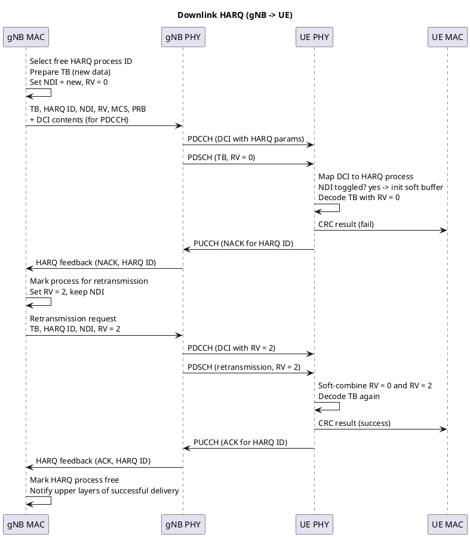
```plantuml
@startuml
title Downlink HARQ (gNB -> UE)

participant "gNB MAC" as gMAC
participant "gNB PHY" as gPHY
participant "UE PHY" as uPHY
participant "UE MAC" as uMAC

gMAC -> gMAC: Select free HARQ process ID\nPrepare TB (new data)\nSet NDI = new, RV = 0
gMAC -> gPHY: TB, HARQ ID, NDI, RV, MCS, PRB\n+ DCI contents (for PDCCH)

gPHY -> uPHY: PDCCH (DCI with HARQ params)
gPHY -> uPHY: PDSCH (TB, RV = 0)

uPHY -> uPHY: Map DCI to HARQ process\nNDI toggled? yes -> init soft buffer\nDecode TB with RV = 0
uPHY -> uMAC: CRC result (fail)
uPHY -> gPHY: PUCCH (NACK for HARQ ID)

gPHY -> gMAC: HARQ feedback (NACK, HARQ ID)
gMAC -> gMAC: Mark process for retransmission\nSet RV = 2, keep NDI

gMAC -> gPHY: Retransmission request\nTB, HARQ ID, NDI, RV = 2
gPHY -> uPHY: PDCCH (DCI with RV = 2)
gPHY -> uPHY: PDSCH (retransmission, RV = 2)

uPHY -> uPHY: Soft-combine RV = 0 and RV = 2\nDecode TB again
uPHY -> uMAC: CRC result (success)
uPHY -> gPHY: PUCCH (ACK for HARQ ID)

gPHY -> gMAC: HARQ feedback (ACK, HARQ ID)
gMAC -> gMAC: Mark HARQ process free\nNotify upper layers of successful delivery

@enduml
```

크게 보면 다음 단계로 나눌 수 있습니다.

#### 1. MAC (gNB) 측

1. 상위 계층(PDCP/RLC)으로부터 내려온 데이터 SDU들을 **MAC PDU/SDU → TB** 로 구성
2. TB를 전송하기 위해 **빈 HARQ process ID** 를 하나 선택
    - 이 process에 이미 미해결 TB가 있으면 새 TB 못 씀 (Stop-and-Wait 특성)
3. HARQ 관련 파라미터 결정:
    - HARQ Process ID
    - NDI = 토글(새 데이터이므로)
    - RV = 0 (첫 전송)
    - MCS, PRB, 시간 위치 등
4. 이 정보를 담아 **DCI (예: NR의 Format 1_0)** 생성
5. MAC → PHY 로 TB 및 DCI 전달 (전송 요청)

#### 2. PHY (gNB) 측

1. MAC에서 내려온 TB를 채널 코딩 (LDPC/Polar 등)
2. RV, rate matching, scrambling, modulation(M-QAM), layer mapping, precoding, mapping 수행
3. PDSCH로 무선 전송
4. 동일 슬롯/기대 슬롯에 맞춰 **PUCCH/PUCCH-ACK 자원 구성** (HARQ-ACK 자원 준비)
    

#### 3. PHY (UE) 측

1. DCI (PDCCH) 디코딩
    - 여기서 HARQ Process ID, NDI, RV, MCS, PRB 등을 해석
2. 해당 TB에 할당된 **HARQ 소프트 버퍼** 선택
3. NDI 체크:
    - NDI가 **이전 값과 다르면 (new)** → 소프트 버퍼 초기화
    - NDI가 **동일하면 (reTx)** → 기존 LLR과 새 LLR 결합
4. PDSCH 디코딩 수행 (소프트 정보 + FEC 디코딩)
5. CRC 체크:
    - OK → ACK 생성
    - Fail → NACK 생성
6. PHY에서 **HARQ-ACK(1비트 또는 여러 비트)** 를 PUCCH 또는 PUSCH에 실어 전송

#### 4. MAC (gNB) 측에서의 ACK/NACK 처리

1. gNB PHY가 UE로부터 PUCCH/PUSCH의 HARQ-ACK 디코딩
    
2. HARQ-ACK 결과를 MAC HARQ 엔티티에 전달
    
3. MAC은 Process ID 기반으로 테이블 업데이트:
    
    - ACK → 해당 HARQ process **완료**, 소프트 버퍼/상태 해제, 상위 계층에 “성공” 보고
        
    - NACK → 재전송 필요 상태로 표시, 스케줄러에게 재전송 요청
        

재전송 시:

- 같은 HARQ Process ID
- NDI는 그대로 (재전송이기 때문에 change 없음)
- RV 값을 바꾸어(예: 0→2→3→1) incremental redundancy 제공
- (간단하게 구현하려면 Chase처럼 같은 RV 반복도 가능하나, 표준 권고는 IR)

---
### Uplink HARQ 동작 (UE → gNB)

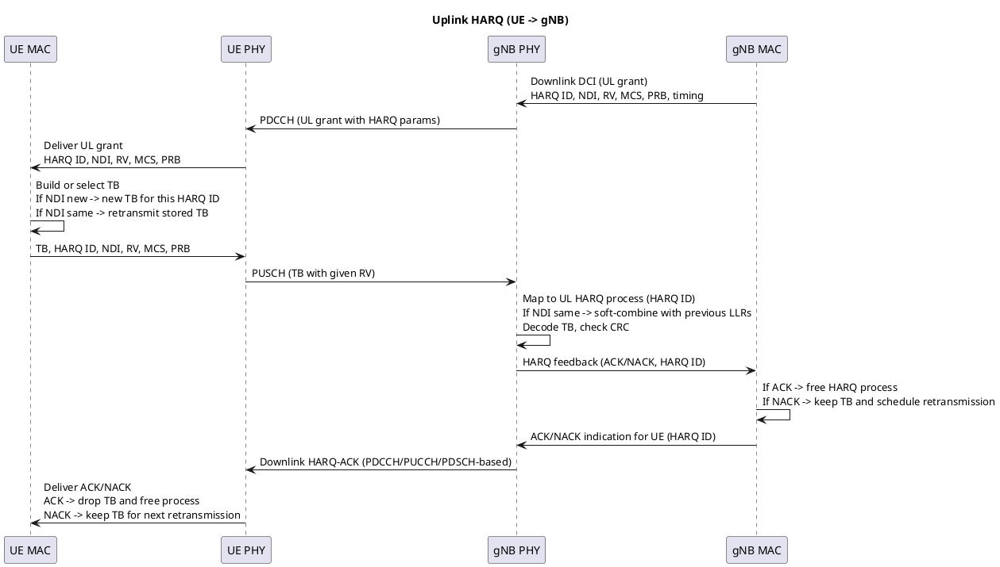
```plantuml
@startuml
title Uplink HARQ (UE -> gNB)

participant "UE MAC" as uMAC
participant "UE PHY" as uPHY
participant "gNB PHY" as gPHY
participant "gNB MAC" as gMAC

gMAC -> gPHY: Downlink DCI (UL grant)\nHARQ ID, NDI, RV, MCS, PRB, timing
gPHY -> uPHY: PDCCH (UL grant with HARQ params)

uPHY -> uMAC: Deliver UL grant\nHARQ ID, NDI, RV, MCS, PRB
uMAC -> uMAC: Build or select TB\nIf NDI new -> new TB for this HARQ ID\nIf NDI same -> retransmit stored TB
uMAC -> uPHY: TB, HARQ ID, NDI, RV, MCS, PRB
uPHY -> gPHY: PUSCH (TB with given RV)

gPHY -> gPHY: Map to UL HARQ process (HARQ ID)\nIf NDI same -> soft-combine with previous LLRs\nDecode TB, check CRC
gPHY -> gMAC: HARQ feedback (ACK/NACK, HARQ ID)

gMAC -> gMAC: If ACK -> free HARQ process\nIf NACK -> keep TB and schedule retransmission

gMAC -> gPHY: ACK/NACK indication for UE (HARQ ID)
gPHY -> uPHY: Downlink HARQ-ACK (PDCCH/PUCCH/PDSCH-based)
uPHY -> uMAC: Deliver ACK/NACK\nACK -> drop TB and free process\nNACK -> keep TB for next retransmission

@enduml
```

Uplink에서는 **역할이 반대로** 됩니다.

#### 1. MAC (UE) 측

1. 상위 계층 데이터 → MAC에서 UL TB 구성
2. gNB로부터 받은 UL Grant (UL용 DCI) 안의
    - HARQ process ID
    - NDI
    - RV  
        를 확인
3. NDI가 토글되었으면 → 새 TB를 해당 process에 매핑  
    NDI가 동일하면 → 재전송 TB로 인식
4. TB를 PHY에 전달하면서 해당 HARQ Process와 연관시킴

#### 2. PHY (UE) 측
1. TB를 받아 채널 코딩 + rate matching (RV 반영) + 변조
2. PUSCH 자원에 맵핑 후 송신

#### 3. PHY (gNB) 측

1. PUSCH 수신 및 디코딩
2. DCI에서 받은 HARQ Process ID 기반으로 **gNB 측 UL HARQ 소프트 버퍼** 선택
3. NDI 비교:
    - change → 새 TB → 소프트 버퍼 초기화
    - same → 재전송 → LLR soft combining
4. CRC 결과에 따라 ACK/NACK 결정
5. HARQ-ACK을 Downlink 제어 채널(예: PDCCH/PHICH(구-LTE) 또는 PDSCH/PUCCH 등)에 실어서 UE로 전송

#### 4. MAC (UE) 측

1. PHY에서 받은 ACK/NACK 결과를 HARQ 엔티티에 전달
2. ACK → UL HARQ process 완료, 상위 계층에 성공 보고  
    NACK → 동일 TB를 재전송 큐에 유지, 다음 UL Grant 때 재전송

---
### MAC–PHY 간 HARQ 프로세스 구조

HARQ를 MAC 관점, PHY 관점에서 나눠 보면 다음과 같이 이해할 수 있습니다.

#### MAC 쪽(HARQ Entity)

- 프로세스 테이블 관리
    - 상태: IDLE, ACTIVE, WAIT_ACK, RETX_PENDING 등
    - 각 process에 연결된 TB 버퍼 (상위 계층 데이터 보관)
- 재전송 정책
    - 최대 전송 횟수 (예: 4회, 8회)
    - 타임아웃 / 실패 시 RLC ARQ 또는 상위 계층에 오류 보고
- NDI, RV, process ID, MCS를 조합해 DCI 생성 요청
- 스케줄러와 연동
    - “이 process NACK 났으니, 다음 서브프레임에 다시 스케줄링 필요” 같은 요청

#### PHY 쪽(HARQ Soft Buffer)

- 프로세스 별 소프트 버퍼 (LLR) 관리
    - 프로세스 ID에 대응되는 soft-combining 메모리
- RV에 따른 rate matching / bit selection
- Chase/IR HARQ 소프트 합성
- FEC 디코딩, CRC 체크
- HARQ-ACK 비트 생성 및 보고

요약하면:

- **MAC HARQ Entity**:  
    “어떤 TB가 어떤 process ID로, 몇 번째 전송인지, 언제 재전송할지”를 관리
- **PHY HARQ Entity**:  
    “해당 TB에 대한 실제 물리계층 재전송/소프트 결합/디코딩”을 수행

---
### 간단한 시간 흐름 예시 (Downlink IR-HARQ)

1. 서빙 gNB MAC
    - Process 3 선택, NDI 토글, RV=0 설정
    - TB 구성 후 PHY에 전달 → DCI+PDSCH 송신
2. UE PHY
    - DCI에서 HARQ ID=3, NDI(new), RV=0 확인
    - Process 3 soft buffer 초기화 후 디코딩
    - CRC fail → NACK 생성, PUCCH로 전송
3. gNB PHY
    - NACK 수신 → MAC에 전달
4. gNB MAC
    - Process 3 상태를 “RETX_PENDING”
    - 다음 스케줄 기회에 같은 TB 재사용, NDI 그대로, RV=2로 변경
    - DCI 생성 후 PHY에 재전송 요청
5. UE PHY
    - 다시 DCI 수신 (HARQ ID=3, NDI same, RV=2)
    - 기존 LLR + 새 LLR 결합 → 디코딩 성공
    - ACK 전송
6. gNB MAC
    - Process 3 완료로 상태 변경, TB 메모리 해제

이게 “프로세스 관점 HARQ” 의 가장 전형적인 시퀀스입니다.

---
### HARQ 관련 DCI 필드

#### 개요

5G NR에서 HARQ 재전송 제어는 **DCI(Downlink Control Information)** 의 일부 필드로 제어됩니다.  
특히 다음 3개 필드는 HARQ 동작의 핵심입니다.

- HARQ Process Number
- NDI (New Data Indicator)
- RV (Redundancy Version)

DCI Format 1_0 (DL), DCI Format 0_1 (UL) 등에서 공통적으로 사용됩니다.

---
#### HARQ Process Number (HARQ 프로세스 번호)

##### 기능

HARQ Process Number는 **이 TB가 어떤 HARQ 프로세스에 속하는지를 정의**합니다.  
UE 또는 gNB의 HARQ 소프트버퍼 인덱스를 직접 지정하는 역할입니다.

- TB는 항상 HARQ 프로세스 번호 하나에 귀속됨.
- 수신단은 이 번호를 보고 “어떤 soft-buffer에 LLR을 적재할 것인지”를 결정.

##### 비트 길이

HARQ Process Number는 **비트 길이가 고정된 것이 아니라**,  
**슬롯 구조, 듀플렉스(TDD/FDD), mini-slot 여부, 1slot/2slot 스케줄링** 에 따라 달라집니다.

NR에서 일반적인 HARQ Process 비트 길이 예:

- 4비트 → 16개의 HARQ 프로세스 지원
- 3비트 → 8개 HARQ 프로세스
- 5비트 → 최대 32개 프로세스도 구성 가능(특히 URLLC mini-slot에서 증가 가능)

즉, 비트 수는 네트워크 구성에 따라 **3~5비트** 정도가 일반적입니다.

##### 값의 의미

- 0~(N-1)
- 각 번호는 하나의 HARQ stop-and-wait 채널

---
#### NDI (New Data Indicator)

##### 기능

NDI는 TB가 **새로운 데이터인지(New)**,  
아니면 **재전송(Retx)** 인지를 UE가 판단하도록 해주는 1비트 플래그입니다.

- **NDI 토글(0→1 또는 1→0)**: 새로운 TB
- **NDI 동일값 유지**: 재전송(TB 동일)

즉, UE는 NDI를 비교하여:

- 값이 바뀌면 → 소프트버퍼 초기화 (New Transmission)
- 값이 그대로면 → 소프트버퍼 유지 후 재전송 LLR 결합

##### 비트 길이

항상 **1비트**.

##### 주의사항

- DL/UL 공통 구조
- HARQ process number별로 **독립적으로 토글** 관리됨  
    하나의 HARQ process에서의 NDI 토글이 다른 process에 영향을 주지 않음

##### 예시

HARQ Proc 3에서

|이전 NDI|새 NDI|의미|
|---|---|---|
|0|1|New TB|
|1|0|New TB|
|0|0|Retx|
|1|1|Retx|

즉, NDI는 “toggle bit” 그 자체입니다.

---
#### RV (Redundancy Version)

##### 기능

RV는 HARQ Incremental Redundancy(IR) 재전송을 위한 **부호 비트 선택 패턴**을 정의합니다.

- 첫 전송 → RV = 0
- 재전송 → RV = 1, 2, 3 중 하나
- LDPC 또는 Polar rate matching에서 어떤 parity subset을 전송할지 결정
- IR-HARQ 성능의 핵심 파라미터

##### 비트 길이

RV는 **2비트(고정)**.

RV 비트는 그대로 0~3의 값을 가짐.

##### 의미(Downlink/UL 공통)

|RV 값|의미|
|---|---|
|0|첫 전송에 적합한 기본 버전|
|1|IR용 parity subset 1|
|2|IR용 parity subset 2|
|3|IR용 parity subset 3|

상용망에서는 일반적으로  
0 → 2 → 3 → 1 순서로 재전송 스케줄링하는 경우가 많음 (네트워크 구현 차이 존재).

##### RV=0이 아닌 다른 값으로 첫 전송을 하는 경우

표준상 가능하지만, 일반적인 MCS/rate matching 요구조건 때문에 거의 사용되지 않음.

---
#### Downlink DCI Format 1_0 예시 (HARQ 관련 필드만 발췌)

Downlink DCI Format 1_0 (PDSCH 스케줄링) 내부의 HARQ 관련 필드는 다음처럼 구성됩니다.

|필드|비트 길이|의미|
|---|---|---|
|HARQ Process Number|3~5비트|HARQ 소프트버퍼 ID|
|New Data Indicator (NDI)|1비트|새 TB 여부|
|Redundancy Version (RV)|2비트|IR 버전|

실제 DCI는 이 외에도:

- MCS
- Frequency domain assignment
- Time domain assignment
- DMRS additional info
- Antenna port info  
    등 수십 비트가 포함됩니다.

---
#### Uplink DCI Format 0_1 예시 (HARQ 관련 필드만 발췌)

UL Grant (UE에 PUSCH 스케줄링)에서도 동일한 방식으로 포함됩니다.

|필드|비트 길이|의미|
|---|---|---|
|HARQ Process Number|3~5비트|UL HARQ 소프트버퍼 ID|
|NDI|1비트|새 UL TB 여부|
|RV|2비트|UL IR version|

UL에서도 NDI는 **UE가 TB 소프트버퍼를 초기화할지 유지할지**를 결정하는 핵심 신호입니다.

---
#### 필드 간 동작 관계

##### 첫 전송

- HARQ process = X
- NDI = toggle (new)
- RV = 0  
    → UE는 soft buffer X를 초기화하고 RV0 기반으로 디코딩

##### 재전송

- HARQ process = X
- NDI = same
- RV = 2,3 또는 다른 버전  
    → UE는 soft buffer X에 soft-combining 수행

---
#### HARQ 필드 요약

|필드|비트|역할|
|---|---|---|
|HARQ Process Number|약 3~5bit|TB가 매핑될 소프트버퍼 ID|
|NDI|1bit|New TB / Retx 구분 (toggle)|
|RV|2bit|IR HARQ를 위한 redundancy version|

## CBG Based HARQ
### 개념  
5G NR에서는 한 번에 전송하는 전송 블록(TB, Transport Block)을 LDPC 부호화를 위해 여러 개의 코드 블록(Code Block, CB)으로 쪼갭니다.  
이때, **HARQ 재전송의 단위를 TB 전체가 아니라 몇 개 CB를 묶은 단위로 세분화한 것이 CBG(Code Block Group)** 이고,  
이 CBG 단위를 기준으로 동작하는 HARQ를 **CBG-based HARQ** 라고 부릅니다.

- 기존 TB-based HARQ
	- TB 전체를 하나의 HARQ 단위로 보고,
	- CRC도 TB 단위,
	- ACK/NACK도 TB 단위 (한 비트)  
	    → TB 안에 일부 CB만 깨져도 TB 통째로 재전송해야 함.
- CBG-based HARQ
	- TB를 여러 CBG로 나누고,
	- CBG별로 CRC/성공 여부를 판단,
	- ACK/NACK을 CBG 단위로 보고  
	    → 깨진 CBG만 골라서 선택적 재전송 가능 (Partial HARQ retransmission).

요약하면, **TB 하나를 여러 개의 “부분 HARQ 단위”로 나눠서 더 세밀하게 재전송하는 방식**입니다.

#### TB / CB / CBG 구조  
TB가 PHY에서 처리될 때 구조는 다음과 같이 됩니다.

1. TB (Transport Block)
    - MAC에서 만들어지는 단일 데이터 블록
2. CB (Code Block)
    - LDPC 부호화 전에 TB가 여러 CB로 분할
    - 각 CB는 자체 CRC (CB-CRC)를 가짐
3. CBG (Code Block Group)
    - 여러 CB를 묶은 그룹
    - 예: TB가 12 CB → 3 CBG, 각 CBG에 4 CB씩
    - CBG 개수와 구성은 MCS, TB size, 설정에 따라 달라짐

수신단에서는

- CB 단위로 디코딩 후 CB-CRC를 보고 CB 성공/실패 판단
- 그 결과를 CBG 단위로 합산해서 ``“CBG #i 성공/실패”``를 얻습니다.

#### CBG-based HARQ 동작 방식 개요

1. gNB에서 TB를 구성하고 LDPC 인코딩 → 여러 CB → CBG 단위로 전송
2. UE는 각 CB를 디코딩하고, 각 CB-CRC 결과를 보고 CBG 단위 성공/실패 판단
3. UE는 UCI (PUCCH 또는 PUSCH 상의 UCI)에
    - TB 기반 ACK/NACK (1비트) 또는
    - CBG 기반 ACK/NACK 비트맵 (여러 비트)  
        를 실어 보냄
4. gNB는 CBG-ACK 비트맵을 보고,
    - 성공한 CBG는 그대로 유지
    - 실패한 CBG만 선택적으로 재전송하도록 DCI에서 “어떤 CBG를 재전송할지” 마스크로 전달
5. UE는 재전송된 CBG에 해당하는 CB들만 soft combining 하고 다시 디코딩해서 TB 전체를 복원.

#### TB-based HARQ vs CBG-based HARQ  
##### TB-based HARQ

- 장점: 단순, UCI 오버헤드 적음, 구현 용이
- 단점: 일부만 깨져도 TB 전체 재전송 → 비효율

##### CBG-based HARQ

- 장점: 깨진 CBG만 재전송 → 주파수/전송 효율 향상, 특히 큰 TB에서 효과 큼
- 단점:
    - UCI에서 CBG-ACK 비트가 늘어나므로 오버헤드 증가
    - gNB/UE 양쪽 모두 구현 복잡도 증가
    - 스케줄러도 더 복잡 (어떤 CBG만 재전송할지 관리 필요)

#### UE 수신 측 처리 상세

1. PDSCH 수신 후
    - DCI에서 이 전송이 TB-based인지 CBG-based인지, CBG 개수, 구성 정보를 알고 있음
    - 각 CB에 대해 LDPC 디코딩 → CB-CRC 체크
2. CBG 성공/실패 판단
    - CBG i 에 속한 CB들 중 하나라도 실패 → CBG i 실패
    - 모두 성공 → CBG i 성공
3. UCI 생성
    - TB-based HARQ: TB 전체 기준 ACK/NACK 1비트
    - CBG-based HARQ: 각 CBG마다 1비트 ACK/NACK → 비트맵 형태  
        예: CBG0 OK, CBG1 NG, CBG2 OK → 101 또는 010 등 사양 정의에 따른 순서
4. PUCCH/PUSCH로 CBG-ACK 전송

#### gNB 측 재전송 스케줄링

1. gNB는 UE의 CBG-ACK/CBG-NACK 비트맵을 수신
2. HARQ 프로세스 테이블에서 해당 TB의 각 CBG 상태 업데이트
    - CBG0: ACK → 완료
    - CBG1: NACK → 재전송 대상
    - CBG2: ACK → 완료
3. 재전송 DCI 구성
    - 동일 TB, 동일 HARQ Process ID
    - NDI는 유지 (재전송)
    - RV는 바꾸거나 유지 (IR 패턴 전략에 따라)
    - DCI 내 CBG Transmission Information 필드(마스크)로  
        “어떤 CBG를 재전송하는지” 비트마스크로 표시
4. PHY에 재전송 요청
    - PHY는 해당 TB의 CBG1 관련 비트들만 선택해 재전송용 코드워드 조립 (rate matching)
    - 나머지 CBG는 재전송하지 않음

#### UE 재전송 수신 시 처리

1. DCI에서 CBG mask를 확인
    - 어느 CBG가 재전송되는지 알고 있음
2. 재전송 수신된 CBG에 해당하는 CB들에 대해서만
    - 기존 soft buffer와 새 LLR을 soft combining
3. TB 복호 및 CB-CRC/CBG 상태 다시 체크
    - 모든 CBG 성공 시 TB 성공으로 판단, 상위 계층에 전달
    - 실패한 CBG가 또 남으면 추가 재전송 진행

#### DCI 필드 측면에서 CBG 관련 포인트

3GPP 명칭을 모두 풀지는 않고 개념 위주로 보면:

- TB-level HARQ만 사용하는 경우:
    - DCI에 HARQ ID, NDI, RV만 있으면 됨
- CBG-based HARQ를 사용하는 경우:
    - DCI에 “CBG Transmission Information” 또는 유사한 마스크 필드 포함
    - 예: 4 CBG 구성 → 4비트 마스크 (1 = 전송/재전송, 0 = 전송 안 함)
    - 재전송 시 해당 마스크로 “어떤 CBG를 포함하는 PDSCH인지” UE에게 알려줌
#### Downlink CBG-based HARQ 

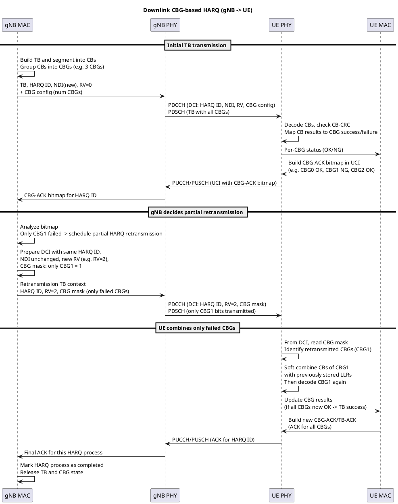
```plantuml
@startuml
title Downlink CBG-based HARQ (gNB -> UE)

participant "gNB MAC" as gMAC
participant "gNB PHY" as gPHY
participant "UE PHY" as uPHY
participant "UE MAC" as uMAC

== Initial TB transmission ==

gMAC -> gMAC: Build TB and segment into CBs\nGroup CBs into CBGs (e.g. 3 CBGs)
gMAC -> gPHY: TB, HARQ ID, NDI(new), RV=0\n+ CBG config (num CBGs)
gPHY -> uPHY: PDCCH (DCI: HARQ ID, NDI, RV, CBG config)\nPDSCH (TB with all CBGs)

uPHY -> uPHY: Decode CBs, check CB-CRC\nMap CB results to CBG success/failure
uPHY -> uMAC: Per-CBG status (OK/NG)
uMAC -> uPHY: Build CBG-ACK bitmap in UCI\n(e.g. CBG0 OK, CBG1 NG, CBG2 OK)
uPHY -> gPHY: PUCCH/PUSCH (UCI with CBG-ACK bitmap)

gPHY -> gMAC: CBG-ACK bitmap for HARQ ID

== gNB decides partial retransmission ==

gMAC -> gMAC: Analyze bitmap\nOnly CBG1 failed -> schedule partial HARQ retransmission
gMAC -> gMAC: Prepare DCI with same HARQ ID,\nNDI unchanged, new RV (e.g. RV=2),\nCBG mask: only CBG1 = 1

gMAC -> gPHY: Retransmission TB context\nHARQ ID, RV=2, CBG mask (only failed CBGs)
gPHY -> uPHY: PDCCH (DCI: HARQ ID, RV=2, CBG mask)\nPDSCH (only CBG1 bits transmitted)

== UE combines only failed CBGs ==

uPHY -> uPHY: From DCI, read CBG mask\nIdentify retransmitted CBGs (CBG1)
uPHY -> uPHY: Soft-combine CBs of CBG1\nwith previously stored LLRs\nThen decode CBG1 again
uPHY -> uMAC: Update CBG results\n(if all CBGs now OK -> TB success)

uMAC -> uPHY: Build new CBG-ACK/TB-ACK\n(ACK for all CBGs)
uPHY -> gPHY: PUCCH/PUSCH (ACK for HARQ ID)
gPHY -> gMAC: Final ACK for this HARQ process

gMAC -> gMAC: Mark HARQ process as completed\nRelease TB and CBG state

@enduml
```


---

## HARQ-ACK Codebook
### 개요

5G NR에서 UE는 PDSCH 수신 후 HARQ ACK/NACK을 gNB에 보고합니다.  
이때 단순히 “ACK=1, NACK=0”을 보내는 것이 아니라,  
**PDSCH 스케줄링 구조와 HARQ 프로세스 구성에 따라 다양한 Ack/Nack 비트 조합이 필요**합니다.

NR은 LTE 대비 훨씬 복잡한 스케줄링(dual-slot scheduling, multi-carrier, multi-HARQ, multi-PDSCH 등)을 지원하므로  
UE는 이를 표현하기 위해 **Ack/Nack Codebook** 개념을 사용합니다.

UCI(Uplink Control Information) 안의 HARQ-ACK payload는  
“어떤 PDSCH에 대한 ACK인지, 순서는 어떻게 되는지, Carrier/MIMO Layer가 어떻게 매핑되는지”  
등을 모두 반영한 정렬(ordering) 규칙을 가지고 있습니다.

이 정렬 규칙으로 만든 비트열을 바로 **HARQ-ACK Codebook** 이라고 부릅니다.

---

### HARQ-ACK Codebook의 목적

- 여러 PDSCH가 서로 다른 슬롯에서 전송될 수 있음
- Carrier가 여러 개일 수 있음 (CA)
- HARQ Process가 여러 개 동시 활성화됨
- 각 PDSCH마다 HARQ-ACK이 존재

이 모든 정보를 **UE → gNB**로 전달하기 위해서는  
HARQ-ACK 비트들이 일정 규칙에 따라 나열된 **코드북(codebook)** 형태가 필요합니다.

---

### 코드북을 구성하는 요소

HARQ-ACK Codebook은 다음 정보들을 반영하여 생성됩니다.

1. Cell/Carrier Index
2. Slot Index
3. HARQ Process ID
4. PDSCH 전송 여부 및 순서
5. 비연속 DL 할당(복수 PDSCH)
6. TB 단위 또는 CBG 단위 Ack/Nack (CBG-HARQ 사용 시 더 많은 비트 필요)

NR에서는 3GPP 38.212에서 코드북 생성 규칙을 세세하게 정의하고 있습니다.

---

### HARQ-ACK Codebook의 비트 구조

각 PDSCH 스케줄링마다 대응되는 Ack/Nack 1비트(또는 CBG 기반이면 n비트)를 생성하고  
**정해진 ordering 규칙**에 따라 하나의 비트열로 정렬한 후,  
UCI PUCCH/PUSCH로 전송합니다.

예) 동일 슬롯에서 PDSCH 2개 수신 → Ack/Nack 2비트  
예) Carrier 2개 + PDSCH 3개씩 → 6개 비트  
예) CBG 기반 HARQ 사용 → 각 CBG마다 1비트 ACK 필요 → 비트 수 증가

---

### Codebook Ordering Rule (핵심 개념)

Ack/Nack 비트 정렬 순서는 아래 기준으로 정의됩니다.

1. 우선순위: Carrier → Slot → PDSCH → HARQ process
2. 동일 슬롯, 동일 캐리어의 여러 PDSCH가 있을 경우
    - 시간 도메인 패턴 (K1, K2 scheduling offset)을 기준으로 정렬
3. CBG 기반 HARQ가 활성화된 경우
    - 해당 PDSCH Ack 대신 CBG Ack 비트열이 codebook에 삽입됨

이 ordering 규칙에 따라 **HARQ-ACK Codebook bitstring** 이 만들어지고  
이 bitstring이 UCI의 HARQ-ACK payload가 됩니다.

---

### HARQ 절차와 Codebook 관계

1. UE는 PDSCH를 받음
2. PHY는 PDSCH 디코딩 후 TB/CBG 성공 여부 판단
3. UE MAC/UCI 엔티티는
    - 어떤 HARQ 프로세스인지
    - 어떤 캐리어/슬롯인지
    - 어떤 CBG인지를 기준으로 codebook bitstring을 생성
4. 생성된 bitstring을 PUCCH 또는 PUSCH에 실어 gNB로 전송
5. gNB는 동일 코드북 규칙으로 비트열을 해석하여
    - 어떤 HARQ process 성공/실패인지
    - 어떤 TB 또는 CBG가 재전송 필요한지를 판단

---

### 슬롯 타임라인 기반 PDSCH → HARQ-ACK Codebook 흐름

아래는 한 슬롯 안에서 다음 슬롯에 ACK/NACK이 보고되는 과정을 타임라인 형식으로 모델링한 UML입니다.

- 상단: gNB
- 하단: UE
- 시간: 왼쪽→오른쪽 (slot 기반)
- 하나의 PDSCH 또는 복수개의 PDSCH 수신 → HARQ-ACK Codebook 생성 → UCI로 보고
    

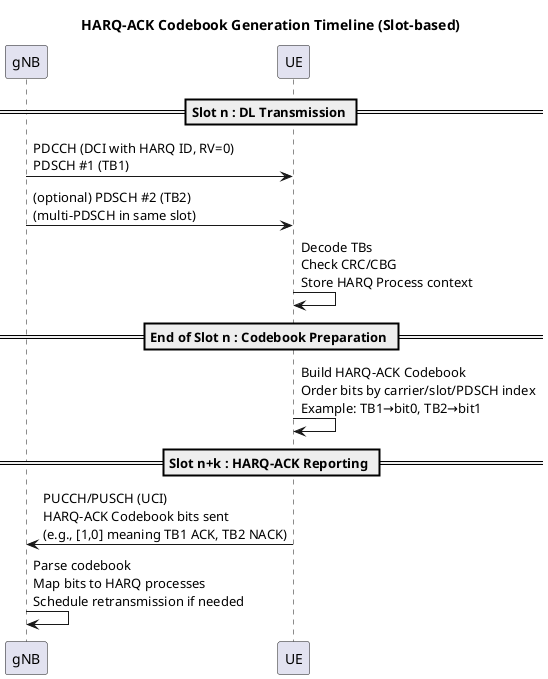
```plantuml
@startuml
title HARQ-ACK Codebook Generation Timeline (Slot-based)

participant "gNB" as gNB
participant "UE" as UE

== Slot n : DL Transmission ==

gNB -> UE: PDCCH (DCI with HARQ ID, RV=0)\nPDSCH #1 (TB1)
gNB -> UE: (optional) PDSCH #2 (TB2)\n(multi-PDSCH in same slot)

UE -> UE: Decode TBs\nCheck CRC/CBG\nStore HARQ Process context

== End of Slot n : Codebook Preparation ==

UE -> UE: Build HARQ-ACK Codebook\nOrder bits by carrier/slot/PDSCH index\nExample: TB1→bit0, TB2→bit1

== Slot n+k : HARQ-ACK Reporting ==

UE -> gNB: PUCCH/PUSCH (UCI)\nHARQ-ACK Codebook bits sent\n(e.g., [1,0] meaning TB1 ACK, TB2 NACK)

gNB -> gNB: Parse codebook\nMap bits to HARQ processes\nSchedule retransmission if needed

@enduml
```

---

## 다이어그램 해설

- Slot n:  
    gNB가 여러 PDSCH(TB 단위 또는 CBG 단위)를 UE에 전송
- Slot n 끝:  
    UE는 decoding 결과(ACK/NACK 또는 CBG ACK)를 기반으로  
    **HARQ-ACK Codebook bitstring 생성**
- Slot n+k:  
    UE는 UCI 자원(PUCCH 또는 PUSCH)에서 그 bitstring을 gNB로 전송
- gNB는 동일한 codebook ordering 알고리즘으로 bitstring을 해석  
    대응되는 HARQ process들의 성공/실패 판단 및 재전송 스케줄링 수행

---

## CBG 기반 Ack/Nack codebook 사용례

전제부터 정리하면:

- 하나의 PDSCH는 하나의 TB(Transport Block)를 전송
- 그 TB는 여러 CB(Code Block)로 나뉨
- 여러 CB를 묶어 CBG(Code Block Group)를 구성
- CBG 기반 HARQ에서는  
    “TB 당 1비트 ACK” 대신  
    “CBG 당 1비트 ACK” 을 보냄
- UCI(HARQ-ACK codebook)는  
    “PDSCH 순서 + 각 PDSCH의 CBG 순서”로 비트열을 만든 것

아래 예제들은 이 원리를 숫자로 보여주는 거라고 생각하시면 됩니다.

---

### 예제 1: 단일 PDSCH, 1개 TB, 3개 CBG

가장 기본적인 상황입니다.

**가정**

- 슬롯 n에서 PDSCH 하나 전송
- 그 안에 TB 하나
- 이 TB가 3개의 CBG로 구성: CBG0, CBG1, CBG2
- UE가 디코딩 결과 다음과 같이 나왔다고 가정:

|CBG Index|포함 CB들|디코딩 결과|
|---|---|---|
|CBG0|CB0, CB1|성공|
|CBG1|CB2, CB3|실패|
|CBG2|CB4, CB5|성공|

**CBG별 Ack/Nack 비트 정의**

- 관례적으로
    - ACK = 1
    - NACK = 0  
        라고 하겠습니다. (반대로 쓰는 구현도 있으나 예시용으로 고정)

그러면 CBG별 비트는:

- CBG0 → 1
- CBG1 → 0
- CBG2 → 1

**Codebook 비트열 생성**

- 이 PDSCH에 대한 CBG 기반 HARQ-ACK codebook은  
    CBG index 오름차순으로 나열한다고 두면:

$$  
\text{HARQ-ACK codebook} = [b_0, b_1, b_2] = [1, 0, 1]  
$$

- 이 3비트가 UCI에서 이 PDSCH에 대한 HARQ-ACK payload가 됩니다.
- gNB 입장에서는:
    - bit0=1 → CBG0 OK
    - bit1=0 → CBG1 NG (재전송 필요)
    - bit2=1 → CBG2 OK

**TB 단위 관점**

- TB 관점에서 보면 “하나라도 0(NACK)이 있으면 TB 미완료”로 보게 됩니다.
- 따라서 TB 성공/실패: 실패
- gNB는 재전송 시 “CBG1만 재전송”하도록 DCI의 CBG mask를 설정할 수 있습니다.

---

### 예제 2: 한 슬롯에 PDSCH 2개, 각 TB에 CBG 여러 개

이제 조금 복잡한 상황입니다.

**가정**

- 같은 슬롯 n에서 UE가 두 개의 PDSCH를 받았다고 가정:
    - PDSCH#1 → TB1 → CBG 2개 (CBG0, CBG1)
    - PDSCH#2 → TB2 → CBG 3개 (CBG0, CBG1, CBG2)

**디코딩 결과**

- TB1:
    - CBG0: 성공 → 1
    - CBG1: 성공 → 1
- TB2:
    - CBG0: 성공 → 1
    - CBG1: 실패 → 0
    - CBG2: 실패 → 0

**PDSCH별 CBG Ack 비트**

- PDSCH#1 (TB1): [1, 1]
- PDSCH#2 (TB2): [1, 0, 0]

**Codebook 비트열 구성 규칙 (개념적)**

- 우선 PDSCH 단위로 순서를 정합니다.  
    (표준에서는 캐리어, 시간, 하향 할당 순서를 기반으로 정렬하지만, 여기선 단순화해서 “PDSCH#1 → PDSCH#2 순”으로 두겠습니다.)
- 각 PDSCH에 대해 CBG index 오름차순으로 비트를 붙입니다.

그러면 최종 HARQ-ACK codebook bitstring은:

$$
\text{codebook} = [\underbrace{1,1}_{\text{PDSCH\#1}},\ \underbrace{1,0,0}_{\text{PDSCH\#2}}]
$$

즉:

- bit0: PDSCH#1, CBG0 → ACK
- bit1: PDSCH#1, CBG1 → ACK
- bit2: PDSCH#2, CBG0 → ACK
- bit3: PDSCH#2, CBG1 → NACK
- bit4: PDSCH#2, CBG2 → NACK

이 5비트가 UCI의 HARQ-ACK payload가 됩니다.

gNB 해석

- gNB도 동일한 ordering 규칙을 알고 있으므로,
    
    - bit0, bit1 → TB1의 CBG0,1
    - bit2~4 → TB2의 CBG0~2  
        를 그대로 매핑해서 각 CBG의 성공/실패 판단을 할 수 있습니다.
- TB1 요약: [1,1] → 모두 ACK → TB1 완료
- TB2 요약: [1,0,0] → 일부 NACK → TB2 미완료 → CBG1, CBG2만 재전송 대상

---

### 예제 3: CBG 기반 Ack/Nack과 TB 기반 Ack/Nack 비교

위의 예제2 상황에서:

- TB1를 TB 기반 HARQ로만 본다면: TB1 ACK (1비트)
- TB2를 TB 기반 HARQ로만 본다면: TB2 NACK (1비트)

즉 TB-based라면:

- HARQ-ACK codebook = [1, 0] (2비트)로 끝났을 겁니다.

하지만 CBG-based라서:

- TB1: 2비트
- TB2: 3비트
- 총 5비트 codebook이 필요하게 된 것
- 대신 재전송은 TB2의 CBG1,2만 전송하면 되므로 무선 자원 효율은 좋아짐

정리하면,

- UCI 측면: 비트 수 증가 (오버헤드 ↑)
- PDSCH 측면: 재전송 자원 절약 (효율 ↑)

이라는 트레이드오프를 숫자로 볼 수 있습니다.

---

간단 수식 형태 요약 (개념만)

- PDSCH i 가 ( N_{CBG}^{(i)} ) 개의 CBG를 가진다고 하면,
- 전체 HARQ-ACK codebook 길이:

$$ 
N_{\text{HARQ-ACK bits}} = \sum_{i=1}^{N_{\text{PDSCH}}} N_{CBG}^{(i)}  
$$

- 각 비트는 다음과 같이 매핑 (개념적):
$$
b_{k} \leftrightarrow \text{(PDSCH index i, CBG index j)}  
$$

이렇게 매핑 규칙(코드북)을 UE와 gNB가 공유하고 있기 때문에,  
gNB는 단순한 비트열을 받아도 “어느 PDSCH의 어느 CBG가 실패했는지”를 정확하게 복원할 수 있습니다.

---
## TA(Timing Advance)

### 개요

5G NR에서 Timing Advance(TA)는 **UE의 업링크 송신 시간을 조절하는 메커니즘**입니다.  
NR은 OFDM 기반 다중접속을 사용하므로, 여러 UE의 업링크 신호가 gNB의 FFT 윈도 안에서 **정확히 시간 정렬**되어야 합니다.  
TA는 바로 이 **시간 정렬(time alignment)** 을 위해 존재합니다.

간단하게 말하면:

- UE는 gNB가 보내주는 TA 명령을 보고
- 자기 송신 타이밍을 **앞으로 당기거나(advance)** 또는 **지연시키고**
- 여러 UE가 동시에 업링크를 보내도 서로 간섭 없이 gNB가 정확히 FFT 윈도에 맞춰 수신할 수 있게 해줍니다.

---

### Timing Advance가 필요한 이유

OFDM은 **직교성(Orthogonality)** 에 기반합니다.  
UE들이 제각각 시간 위치가 어긋나면 다음 문제들이 발생합니다.

- FFT 윈도에 신호가 반쯤 밀려 들어오면서 **ISI/ICI 증가**
- 인접 UE 간 **subcarrier 간섭**
- PUSCH/PUCCH/PRACH 오차 증가
- gNB의 수신기 Equalizer 동작 악화

LTE와 마찬가지로 NR에서도 **UL 신호 정렬은 필수적인 L1 기능**입니다.

---

### Timing Advance 명령의 구조

Timing Advance는 NR에서 **단계(step) 단위 ΔTA** 로 제공되며, UE는 이 값을 기반으로 **타이밍 보정량**을 계산합니다.

NR Timing Advance 기본 식(개념):

$$
T_{\text{TA}} = N_{\text{TA}} \cdot T_{\text{c}}  
$$

여기서

- $N_{\text{TA}}$ : TA index (gNB가 명령하는 값)
- $T_{\text{c}} = \frac{1}{4096 \times \text{scs}_0}$: NR 기본 시간 단위

즉, TA는 **하위 계층에서 정의된 매우 미세한 시간 단위**로 UE 송신 시점을 조절합니다.

---

### Timing Advance Message 종류

NR에서는 두 가지 종류의 TA 명령이 있습니다.

#### Initial TA

- PRACH(Random Access) 과정에서 gNB가 UE에게 보냄
- RAR(Random Access Response) 안에 TA 정보 포함
- UE가 처음 UL을 송신하는 시점의 초기 시간 정렬

#### TA update (TA Command / TA MAC CE)

- 연결 이후 gNB가 **지속적으로 시간 오차를 측정**하여 UE에게 정기적으로 보냄
- MAC CE (Timing Advance Command) 형식
- UE 위치 변화, 이동성, 채널 변화에 따라 계속 업데이트 필요

---

### TA가 어떻게 측정되는가?

gNB는 UL 수신 신호(PUSCH/PUCCH/SRS)를 보고,  
수신된 심볼의 도착 타이밍이 **기준보다 앞/뒤로 얼마나 어긋났는지**를 분석합니다.

주요 참조 신호:

- PUSCH DMRS
- PUCCH DMRS
- SRS(Sounding Reference Signal)

이들 신호는 정확한 주파수·시간 위치에 있기 때문에  
gNB는 correlation 기반으로 UE UL 신호의 도착 타임을 매우 정밀하게 측정할 수 있습니다.

---

### TA Update 동작 과정 상세

1. UE가 UL 신호를 송신
2. gNB가 신호 도착 시간의 오프셋 측정
3. 오프셋이 기준 윈도(타이밍 얼라인 범위)를 벗어나면 TA 명령 생성
4. gNB → UE 방향으로 MAC CE(Timing Advance Command) 전송
5. UE는 명령 받는 순간(또는 설정된 시점)에 즉시 UL 송신 타이밍을 조정
6. gNB는 새 타이밍을 기반으로 다시 UL 수신
7. 필요한 경우 반복하여 TA loop 유지

이 과정을 **TA Control Loop** 또는 **Closed-loop Timing Synchronization** 라고 부릅니다.

---

### TA와 주파수(서브캐리어 간격) 관계

NR에서는 다양한 Subcarrier Spacing(SCS: 15/30/60/120/240 kHz)를 사용합니다.  
SCS가 커지면 OFDM 심볼 길이가 짧아지고,  
타이밍 오차 허용 범위(cyclic prefix 여유)가 줄어들기 때문에,  
더 정밀한 Timing Advance가 필요합니다.

예:

- SCS = 15 kHz → CP 길이 길어서 TA 오차 허용 범위 크다
- SCS = 120 kHz → CP 짧아서 몇 백 ns만 어긋나도 문제가 된다

NR은 이러한 다양한 SCS를 지원하기 위해  
**TA 단위도 LTE보다 더 높은 정밀도**를 가지도록 설계되어 있습니다.

---

### TA가 적용되는 채널들

Timing Advance는 UE의 모든 UL 채널에 적용됩니다:

- PUSCH
- PUCCH
- PRACH (TA는 초기 RA 과정에서 설정)
- SRS
- CSI-PUCCH

즉, UL 방향 신호는 **공통된 TA 보정값을 사용**해 모두 동일한 시간 기준으로 맞춥니다.

---

### TA Loop의 안정성 및 보정 주기

NR에서 TA는 일반적으로 다음 조건에서 업데이트됩니다.

- UE 이동 (특히 고속 이동)
- gNB–UE 거리 변화
- 위상 변화·채널 변화 (특히 TDD 모드)
- SRS 기반 측정이 일정 한계점을 넘는 경우
- PUSCH/PUCCH 도착 타이밍이 기준에서 벗어난 경우

TA update 주기는 보통:

- 몇 ms 단위 (상황에 따라)
- UE가 셀 경계로 이동할 때 더 자주
- SRS가 주기적이면 SRS 기반으로 자주 조절 가능

---

### 프런트홀·Beamforming과 TA의 관계

Massive MIMO 및 Beamforming에서도 TA는 중요합니다.

- 여러 빔이나 여러 패널에서 UE의 SRS 도착 시간 기반으로 적절한 빔 alignment가 이루어지므로
- TA가 틀어지면 DMRS 추정·빔포밍 정확도도 떨어짐
- URLLC에서는 작은 TA 오차도 E2E latency에 영향

TA는 기본적으로 “한 UE의 UL 타이밍을 전체 빔에 공통 적용”하고,  
그 위에 각 빔/패널 별 위상 보정(precoder baseband phase compensation)이 추가됩니다.

---

### NR의 Timing Advance 정확도

NR은 LTE보다 훨씬 다양한 주파수 대역과 SCS에서 동작하므로  
TA의 정밀도는 매우 높습니다.

- μ = 0 (SCS=15 kHz) → TA granularity ~520 ns
- μ = 3 (SCS=120 kHz) → TA granularity 매우 낮음(수십 ns 수준)

이 정밀도 때문에 NR에서는 셀 크기가 커도 효율적으로 UL 동기를 유지할 수 있습니다.

---

### Timing Advance 절차를 슬롯 타임라인 기반으로 시각화

아래 다이어그램은  UE가 PUSCH/SRS를 전송하고 gNB가 타이밍 오프셋을 측정한 뒤  TA 명령을 UE에게 보내고 UE가 적용하는 흐름을  슬롯 기반으로 시각화한 것입니다.

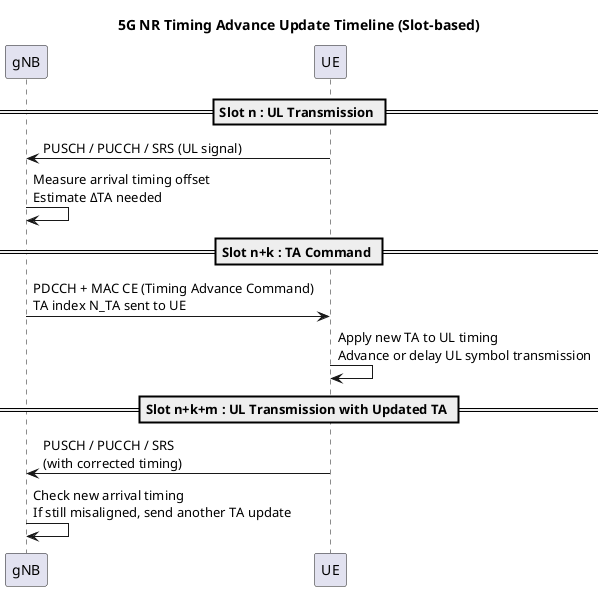
```plantuml
@startuml
title 5G NR Timing Advance Update Timeline (Slot-based)

participant "gNB" as gNB
participant "UE" as UE

== Slot n : UL Transmission ==

UE -> gNB: PUSCH / PUCCH / SRS (UL signal)
gNB -> gNB: Measure arrival timing offset\nEstimate ΔTA needed

== Slot n+k : TA Command ==

gNB -> UE: PDCCH + MAC CE (Timing Advance Command)\nTA index N_TA sent to UE

UE -> UE: Apply new TA to UL timing\nAdvance or delay UL symbol transmission

== Slot n+k+m : UL Transmission with Updated TA ==

UE -> gNB: PUSCH / PUCCH / SRS\n(with corrected timing)

gNB -> gNB: Check new arrival timing\nIf still misaligned, send another TA update

@enduml
```

---

## RAR(Random Access Response) 내 TA 계산 방식

### 개요

5G NR에서 UE는 PRACH를 전송해 셀에 처음 접속합니다.  
gNB는 PRACH의 **도착 시간(Time of Arrival)** 을 측정하여 UE가 얼마나 “멀리/가까이” 있는지 계산하고, 그 보정값을 **RAR(Random Access Response)** 안의 **Timing Advance Command** 필드로 UE에게 전달합니다.

RAR 내 TA는 UE에게 주는 **초기 Timing Advance**이며, 이후 연결 유지 중에는 TA MAC CE 업데이트로 세밀하게 보정됩니다.

---

### RAR의 구조 내에서 Timing Advance Command

RAR은 MAC PDU 형태로 보내지며, 다음과 같은 필드를 포함합니다.

- RAPID (Random Access Preamble ID)
- Timing Advance Command
- UL Grant
- Temporary C-RNTI

여기서 Timing Advance Command는 다음과 같이 표현됩니다:

- **11비트 필드** (N_TA)
- 의미: “UE UL 전송 타이밍을 앞으로 당겨라(advance) 또는 뒤로 밀어라”
- 이 11비트 값으로 UE는 Ta를 계산하여 UL 타이밍에 바로 적용

---

### gNB가 TA를 계산하는 원리

핵심은 **PRACH의 도착 시간 offset(Δt)** 를 gNB가 측정하는 것입니다.

1. UE는 PRACH preamble을 전송
2. gNB는 해당 preamble의 correlation peak를 검출
3. correlation peak의 위치를 기준 PRACH window와 비교하여
    - UE 신호가 조금 늦게 왔는가
    - UE 신호가 조금 일찍 왔는가를 판단
4. 이 offset을 TA 값(11비트)로 양자화해 RAR에 넣어 보냄
5. UE는 이 값을 적용하여 이후 UL 송신을 조정

위 행동은 LTE와 매우 유사하지만, NR은 여러 PRACH format과 SCS 기반 timing 구조가 달라서 계산식이 약간 확장됩니다.

---

### RAR TA 계산 공식

RAR 안에서 UE가 적용해야 할 Timing Advance 값은 다음과 같이 정의됩니다.

$$ 
T_{\text{TA}} = N_{\text{TA}} \cdot T_\text{c}  
$$

여기서

- $N_{\text{TA}}$  : RAR의 Timing Advance Command (11비트)
- $T_\text{c} = \frac{1}{4096 \cdot f_{\text{scs0}}}$
- $f_{\text{scs0}} = 15\text{kHz}$ 기준 SCS0 reference

즉, TA는 NR의 base time unit((T_c))의 배수로 제공됩니다.

LTE의 기본 단위(16 Ts)와 유사하지만, NR에서는 (T_c) 기반으로 더 일반화됨.

---

### gNB가 Δt(도착 지연)를 N_TA로 변환하는 과정

도착 시간 error = $\Delta t$

PRACH 포맷과 SCS에 따라 correlation peak가 기준보다 Δt만큼 늦거나 일찍 오면,

$$  
N_{\text{TA}} = \text{round}\left( \frac{\Delta t}{T_c} \right)  
$$

이렇게 계산한 값을 11비트 범위 안에서 보냅니다.

Δt는 **셀 반경에 따라 매우 다양**할 수 있으며:

- 셀 중심 → Δt ≈ 0
- 셀 경계 (수 km 이상) → Δt 수십 μs
- FR2의 소형 셀 → Δt 매우 작아도 정밀 보정 필요

NR에서는 이를 고려한 다양한 PRACH 포맷이 지정되어 있음.

---

### UE가 RAR Timing Advance 적용하는 방식

UE는 RAR을 디코딩하면 즉시 다음 단계처럼 적용합니다.

1. $N_{TA}$ 값을 수신
2. TimingAdvance = $N_{TA}$ × Tc 계산
3. 이후 UL 전송(PUSCH/PUCCH/SRS/PRACH msg3)은 이 TimingAdvance만큼 **앞당겨서 송신**
4. 이후 gNB에서 TA MAC CE가 오면 추가 수정

RAR TA는 “초기 동기 맞추기” 이므로 필수이며, 그 뒤 이어지는 Msg3(PUSCH) 송신 타이밍은 반드시 이 TA 적용 결과를 반영해야 합니다.

---

### PRACH 포맷과 TA 범위 관계

PRACH 포맷마다 cyclic shift와 OFDM symbol 수가 달라서 커버 가능한 타이밍 오프셋 범위가 다릅니다.

예시 개념:

- 장거리 셀(FR1 Macro) → 대형 PRACH 포맷 사용 → 넓은 TA range
- mmWave FR2 → 근거리 셀 → PRACH 기호 짧기 때문에 TA 범위 작음

gNB는 PRACH를 통해 UE 위치를 대략적으로 파악하고 그에 맞게 Timing Advance를 계산합니다.

---

### Timing Advance Command 값의 실제 크기

$N_{TA}$는 11비트 → 0~2047 범위

TA의 최대 거리 환산은 다음과 같이 계산:

$$
\text{거리} \approx \frac{c \cdot (N_{\text{TA}} T_c)}{2}  
$$

(왕복 지연 기반)

- c: 빛의 속도
- $T_c$ : NR base time unit

NR FR1 셀은 수 km까지 커버 가능하며 TA 값만으로도 충분한 range가 나옵니다.

---

### RAR Timing Advance 동작

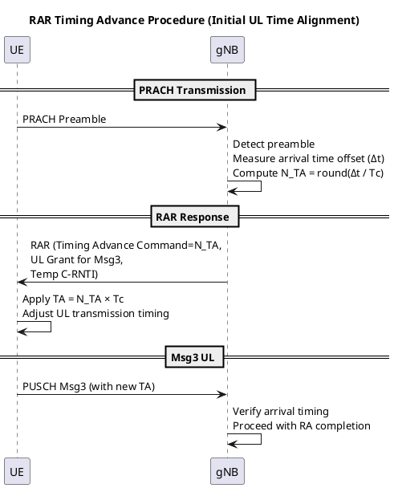
```plantuml
@startuml
title RAR Timing Advance Procedure (Initial UL Time Alignment)

participant "UE" as UE
participant "gNB" as gNB

== PRACH Transmission ==
UE -> gNB: PRACH Preamble
gNB -> gNB: Detect preamble\nMeasure arrival time offset (Δt)\nCompute N_TA = round(Δt / Tc)

== RAR Response ==
gNB -> UE: RAR (Timing Advance Command=N_TA,\nUL Grant for Msg3,\nTemp C-RNTI)

UE -> UE: Apply TA = N_TA × Tc\nAdjust UL transmission timing

== Msg3 UL ==
UE -> gNB: PUSCH Msg3 (with new TA)
gNB -> gNB: Verify arrival timing\nProceed with RA completion

@enduml
```

---

## TDD NR에서 DL/UL 전환과 Timing Advance 관계

### 개요

TDD NR(Time Division Duplex)에서는 **하향(DL)과 상향(UL) 전송이 시간축에서 번갈아 나타납니다.**  
이 때문에 UE의 UL 신호는 DL→UL 전환 시점에 정확히 **지정된 심볼 위치에 도착해야** 합니다.  
Timing Advance(TA)는 바로 이 **DL/UL 전환 경계에 맞춰 UE UL 도착 타이밍을 보정**하는 핵심 메커니즘입니다.

한마디로 요약하면:

> **TDD에서는 DL→UL 전환 순간이 "공통 기준 시간" 역할을 하고,  
> UE는 TA를 이용해 UL 송신을 정확히 그 기준에 맞추도록 강제로 조정된다.**

---

### DL/UL 전환이 왜 TA와 강하게 연결되는가

TDD 구조에서는 다음 이유 때문에 TA가 훨씬 더 중요해집니다.

1. DL과 UL이 동일한 주파수를 시간으로 나눠 사용
2. UL 수신 윈도우가 매우 짧음
3. 전환 시점(Guard Period 포함) 이후 첫 UL 심볼에 **수 μs 이하의 오차도 허용 안 됨**
4. 만약 UE UL 신호가 이 경계를 벗어나면:
    - gNB의 FFT 윈도에 걸쳐 들어와서 ISI/ICI 증가
    - guard period 침범 → DL/UL 간 Cross-link Interference(CLI) 발생
    - 같은 셀/다른 UE 간 UL 간섭 증가

즉, **DL→UL 전환점은 모든 UE가 공유하는 "시간 기준선"** 이고, UE는 TA로 그 기준선에 UL 신호를 정밀하게 align해야 합니다.

---

### TDD에서 TA가 적용되는 방식

UE가 TA를 적용하면 다음과 같은 효과가 있습니다.

- UE는 UL을 _조금 더 일찍_ 전송함
- gNB는 UL을 **DL→UL 전환 후 FFT 윈도 중앙에 가깝게** 수신
- UE 간 도착 타이밍을 같은 기준에 맞춰 정렬
- gNB의 UL 공통 수신 타이밍을 유지 가능

즉, TDD에서는 "TA = UE가 UL을 얼마나 미리 보내느냐"를 결정하는 값입니다.

---

### 전환 경계(Guard Period, GP)와 TA 관계

TDD NR 프레임에는 일반적으로 다음이 포함됩니다:

- DL 심볼들
- UL 심볼들
- DL→UL 또는 UL→DL 전환을 위한 Guard Period(GP)

UE의 실제 UL 심볼 도착은 다음 범위 내에 있어야 합니다.

$$
[\text{UL symbol start} - \text{CP margin},\quad \text{UL symbol start} + \text{timing error margin}]  
$$

TA는 UE의 송신 시점을 이 윈도우 안으로 강제로 맞추는 역할입니다.

**만약 TA가 부족하면:**  
UL 신호가 늦게 도착 → GP/UL 전환 이후 뒤쪽으로 밀림 → FFT 윈도와 불일치 → ICI/ISI 증가

**TA가 너무 크면:**  
UL 신호가 너무 일찍 도착 → DL 구간을 침범하여 DL→UL 전환 직전에 도착 → DL과 충돌하여 CLI 발생

즉, TDD에서는 TA가 정확하지 않으면 **DL/UL 전환 안정성 자체가 깨집니다.**

---

### UE 이동성(속도)에 따른 TDD TA의 영향

고속 이동 UE(예: 기차, 고속도로)에서는:

- UE–gNB 거리 변화 → 전파 지연 변화
- PRACH/SRS 기반 TA 측정이 적절히 따라가지 않으면 UL 도착 시점이 전환 경계에서 벗어남
- 특히 고 SCS(60/120 kHz) 환경에서는 CP가 매우 짧아서 TA 오차 허용범위 작음

그래서 TDD + 고속 UE 환경에서는:

- SRS 주기를 더 짧게
- TA MAC CE 빈도를 더 높게
- 높은 정밀도로 TA tracking

하는 것이 필수입니다.

---

### TDD에서 PUSCH/PUCCH/SRS의 TA 적용

TDD에서는 UE UL 신호 전체가 **하나의 공통 TA**로 조정됩니다.

- PUSCH
- PUCCH
- SRS
- (필요 시 PRACH Msg3 포함)

모두 같은 TA 값을 사용하므로 gNB는 어떤 UL 신호로든 UE의 도착 타이밍을 추정해 TA를 갱신할 수 있습니다.

---

### 실제 gNB Perspective에서의 DL/UL 전환과 TA

gNB는 UL 신호를 다음과 같은 시간축 구조에서 수신합니다.

```
| DL | DL | DL | GP | UL | UL |
              ↑
          Boundary (DL→UL)
```

gNB는 UL 신호가 Boundary 이후 일정 시간(FFT window 시작)에 정확히 도착해야 디코딩할 수 있으므로:

1. UL 신호 도착 시점을 측정
2. Boundary 기준 얼만큼 앞/뒤로 밀렸는지 계산
3. Timing Advance MAC CE 또는 Timing Advance RAR로 보정

특히 GP 구간이 짧은 Slot Format(예: Slot Format 28, 30 등)을 사용하면  
TA 정밀도 요구가 매우 높아집니다.

---

### UL Timing이 어긋나면 발생하는 문제

UL 도착 시점이 아래처럼 어긋나면:

**UL 도착이 늦음(타이밍 부족)**

- UL 신호가 예정된 OFDM 심볼보다 뒤에 도착
- FFT window 내 위치가 틀어짐
- ISI/ICI 증가
- 디코딩 BLER 악화
- gNB는 TA를 증가시키라는 근거로 사용

**UL 도착이 빠름(타이밍 과도)**

- UL 신호가 DL→UL 전환 직전 구간으로 침입
- DL과 충돌 (동일 주파수)
- CLI (Cross link interference) 발생
- TDD 동기 깨짐
- 전체 셀/섹터 UL 성능 저하

따라서 TA는 **너무 크거나 작아도 안 되고, 정확한 “sweet spot”** 에 있어야 합니다.

---

### Slot 기반 DL/UL 전환 + TA 보정

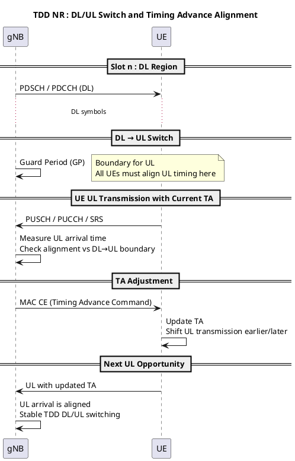
```plantuml
@startuml
title TDD NR : DL/UL Switch and Timing Advance Alignment

participant "gNB" as gNB
participant "UE" as UE

== Slot n : DL Region ==
gNB -> UE: PDSCH / PDCCH (DL)
... DL symbols ...

== DL → UL Switch ==
gNB -> gNB: Guard Period (GP)
note right: Boundary for UL\nAll UEs must align UL timing here

== UE UL Transmission with Current TA ==
UE -> gNB: PUSCH / PUCCH / SRS
gNB -> gNB: Measure UL arrival time\nCheck alignment vs DL→UL boundary

== TA Adjustment ==
gNB -> UE: MAC CE (Timing Advance Command)
UE -> UE: Update TA\nShift UL transmission earlier/later

== Next UL Opportunity ==
UE -> gNB: UL with updated TA
gNB -> gNB: UL arrival is aligned\nStable TDD DL/UL switching

@enduml
```

---

### 결론

- TDD NR에서는 DL→UL 전환 경계가 UL 타이밍의 “절대 기준점”으로 작동한다.
- UE는 TA를 이용해 UL 신호를 이 경계에 정확하게 맞춰야 한다.
- TA가 틀어지면 DL/UL 간 간섭(CLI) 또는 UL 디코딩 실패가 발생한다.
- NR은 다양한 SCS와 매우 짧은 심볼길이를 가지므로 TA 정밀도가 LTE보다 훨씬 더 중요하다.
- gNB는 UL 신호 도착 시간을 지속적으로 모니터링하여 TA를 업데이트한다.

---

## SRS 기반 TA tracking의 상세 알고리즘

### 개요

SRS(Sounding Reference Signal)는 UE가 주기적 또는 비주기적으로 송신하는 **UL reference signal**입니다.  
gNB는 SRS를 통해 다음을 추정할 수 있습니다:

- 채널 응답(Amplitude/Phase/Frequency)
- 도플러/시간 변화
- 빔포밍/UL 스케줄링 정보
- **UL 도착 타이밍(Time of Arrival, ToA)** ← Timing Advance 추정의 핵심

SRS는 UE가 **CP 경계·OFDM symbol grid에 정확히 맞춰 송신하는 신호**이므로,  
gNB는 correlation 기반으로 UE의 ToA 오류를 매우 정밀하게 측정할 수 있습니다.

그 ToA – 기준 타임라인 = **Timing Error**  
gNB는 이 Timing Error를 기반으로 TA MAC CE(Timing Advance Command)를 UE에게 내려 보냅니다.

---

### SRS 기반 TA Tracking이 필요한 이유

- PRACH 기반 TA는 "초기 TA"일 뿐 → 이후 UE 이동/채널 변화에 따라 계속 drift 발생
- SRS는 반복적으로 UL 채널을 측정할 수 있음
- SRS는 PUSCH 없이도 UL 타이밍 추정을 가능하게 함
- 특히 TDD에서는 UL 타이밍 드리프트가 DL/UL 전환에 큰 영향을 주므로 SRS 기반 TA가 매우 중요

---

### SRS 기반 TA Tracking 전체 흐름

1. UE가 SRS 송신
2. gNB는 SRS를 FFT 윈도 내에서 수신
3. correlation peak → ToA(Time of Arrival) 계산
4. expected arrival time과 비교하여 timing error Δt 계산
5. Δt가 허용 범위 범위를 벗어나면 TA update 필요
6. Δt → $N_{TA}$로 양자화
7. TA MAC CE 전송
8. UE는 TA 적용
9. gNB는 다음 SRS에서 다시 확인 (closed-loop tracking)

---

### 단계별 상세 알고리즘 (gNB 수신 관점)

#### 1. SRS Reception

UE는 특정 리소스(시간/주파수/포트/comb)에 맞춰 SRS를 송신합니다.  
gNB는 UL 필터링/FFT 이후 다음을 얻습니다:

$$
Y[k] = \text{received SRS on subcarrier } k  
$$

---

#### 2. SRS Correlation

SRS는 알려진 시퀀스(주로 Zadoff-Chu 또는 골드 계열)를 사용하므로  
gNB는 다음과 같은 correlation을 수행합니다.

$$
C[n] = \sum_k Y[k] \cdot S_{\text{SRS}}^*[k] \cdot e^{-j\frac{2\pi kn}{N}}  
$$

여기서

- $S_{\text{SRS}}$ : 송신 SRS 시퀀스
- $n$ : 시간축 샘플 인덱스

이 correlation peak의 위치 $n_{\text{peak}}$가 실제 도착 시점입니다.

---

#### 3. ToA(Time of Arrival) 추정

$$
t_{\text{arrival}} = \frac{n_{\text{peak}}}{F_s}  
$$

$F_s$ = sampling rate (= SCS에 따라 변함)

SRS는 높은 bandwidth로 전송 가능하기 때문에,  
ToA 오차가 **수십~수백 ns 단위까지 정밀하게 측정** 가능합니다.

---

#### 4. Expected Arrival Time과 비교

gNB는 모든 UE의 UL 신호가 도착해야 하는 기준 시간 (t_{\text{ref}}) 를 알고 있습니다.

Timing Error:

$$
\Delta t = t_{\text{arrival}} - t_{\text{ref}}  
$$

- Δt > 0 : “신호가 늦게 도착” → UL timing 부족
- Δt < 0 : “신호가 일찍 도착” → UL timing 과도

---

#### 5. Timing Error를 TA 단위로 변환

TA는 NR base time unit ((T_c)) 단위로 전달됩니다.

$$
N_{\text{TA}} = \text{round}\left( \frac{\Delta t}{T_c} \right)  
$$

이 값이 TA Command의 핵심입니다.

---

#### 6. Threshold 기반 TA 업데이트 결정

TA는 매번 보내지 않고,  
다음 조건일 때만 보냅니다:

1. $|\Delta t| > \Delta t_{\text{th}}$ (TA threshold 초과)
2. TDD 슬롯에서 UL 도착이 boundary 근처로 이동되는 경우
3. 고속 UE (도플러 큰 경우) → Δt 변화가 크면 더 자주 보냄
4. SRS 품질(SNR)이 충분히 높아 오차가 신뢰 가능한 경우

예시:

- FR1 일반 셀: Δt_th ≈ (0.1~0.2 * CP 길이)
- FR2 mmWave: Δt_th ≈ CP의 5~10% (매우 엄격)

---

#### 7. TA Command(MAC CE) 생성

MAC CE의 TA 명령 구조는 다음과 같습니다:

- TA index $N_{TA}$
- UL Grant가 있을 수도 있음
- HARQ에 영향 없음 (타이밍만 조정)

UE는 이 TA 값을 현재 TA에 누적 형태로 적용합니다.

---

#### 8. UE에서 TA 적용

UE는 다음 슬롯 이후부터 UL 송신 시점을 다음과 같이 변경합니다.

$$
t_{\text{UL,new}} = t_{\text{UL,old}} - N_{\text{TA}} T_c  
$$

(advance = 더 일찍 송신한다는 의미)

---

#### 9. Loop Iteration (Closed-loop TA Tracking)

TA는 한 번으로 끝나지 않습니다.

- UE 이동 → Δt 변화
- 채널 위상 변화 → 도착 시간 변화
- Beamforming panel 변경 → alignment error

SRS가 올 때마다 Δt를 재추정하며 TA loop는 반복됩니다.

---

### TDD 환경에서의 추가 동작

SRS 기반 TA tracking은 TDD에서 더욱 중요합니다.

- DL→UL 경계가 UL timing 기준
- UE가 조금만 늦거나 빨라도 전환 경계에서 충돌 발생
- 특히 high SCS (60/120 kHz)에서 CP 매우 짧아 정밀 TA 필수

SRS는 PUSCH가 없는 슬롯에서도 UL timing을 잡을 수 있기 때문에 **TDD 셀에서는 거의 필수적인 TA tracking reference**입니다.

---

### gNB Scheduler 관점의 TA tracking 알고리즘

gNB는 UL Scheduling 전에 다음을 고려합니다:

1. 최근 SRS 도착타이밍 → Δt 계산
2. UL 자원 스케줄링할 때
    - Δt가 큰 UE는 PUSCH resource edge에 배치하지 않음
    - Δt가 안정된 UE는 작은 guard 여유로도 배치 가능
3. Δt가 지속적으로 drift되면
    - TA MAC CE 전송
4. Δt가 threshold를 오래 벗어나면
    - TA lost alignment → RLF(Radio Link Failure) 트리거 가능

---

### SRS 기반 TA Tracking 절차

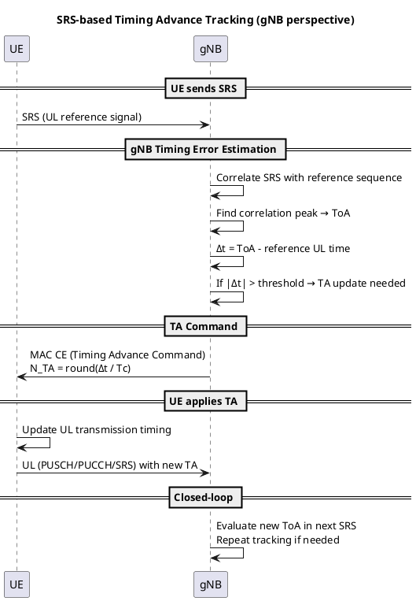
```plantuml
@startuml
title SRS-based Timing Advance Tracking (gNB perspective)

participant "UE" as UE
participant "gNB" as gNB

== UE sends SRS ==
UE -> gNB: SRS (UL reference signal)

== gNB Timing Error Estimation ==
gNB -> gNB: Correlate SRS with reference sequence
gNB -> gNB: Find correlation peak → ToA
gNB -> gNB: Δt = ToA - reference UL time
gNB -> gNB: If |Δt| > threshold → TA update needed

== TA Command ==
gNB -> UE: MAC CE (Timing Advance Command)\nN_TA = round(Δt / Tc)

== UE applies TA ==
UE -> UE: Update UL transmission timing
UE -> gNB: UL (PUSCH/PUCCH/SRS) with new TA

== Closed-loop ==
gNB -> gNB: Evaluate new ToA in next SRS\nRepeat tracking if needed

@enduml
```

---
## SRS + DMRS 조합 기반 Joint Timing Advance Estimation Algorithm

### 개요

NR에서는 **SRS**(UL 채널 전반을 측정하기 위한 전송)과  
**DMRS**(PUSCH/PUSCH용 UL demodulation reference)를 모두 사용할 수 있습니다.

각각의 특징은 다음과 같습니다:

- SRS: **넓은 대역**, 긴 sequence, 고정 위상의 레퍼런스 → 타이밍(TOA) 측정에 매우 정밀
- DMRS: **PUSCH/PUCCH 바로 곁에 존재**, 데이터 전송 시 항상 있음 → 실시간 tracking 가능

gNB는 다음 문제를 해결해야 합니다:

- SRS는 주기적이라 TA를 “시점별로”만 정확히 얻을 수 있다.
- DMRS는 고정된 심볼 내 narrow-band correlation이어서 **순수 TA 오차만으로는 noisy**
- 반대로 DMRS는 SRS 주기 사이의 시간에 발생하는 미세 drift를 추적할 수 있다.

그래서 상용 gNB에서는 **SRS+DMRS 를 조합한 Joint TA Tracking 알고리즘**을 사용한다.

---

### 왜 Joint Estimation이 필요한가

SRS 단독의 문제

- SRS 주기가 보통 1–20 ms.
- SRS가 없는 구간에서는 UE 이동성이나 위상 드리프트를 추적할 수 없음.
- Massive MIMO에서는 수백 µs만 어긋나도 precoding mismatch 발생.

DMRS 단독의 문제

- DMRS는 송신 대역폭이 PUSCH와 동일하며 대역폭이 좁을 수 있다.
- 짧은 sequence → timing resolution 낮음.
- PUSCH 없는 슬롯에서는 DMRS도 없음.

따라서 실제 gNB는 다음과 같은 조합이 필요함:

- **SRS로 절대 TA baseline을 얻고**
- **DMRS로 SRS 간 간격의 미세 drift를 추적**

이를 Kalman Filter 또는 Weighted Combination 형태로 구현한다.

---

### Joint TA Estimation의 핵심 원리

Joint TA Estimation은 본질적으로 시그널 2개의 타이밍 오차를 결합하는 문제다.

Notation:

- $\Delta t_{\text{SRS}}$ = SRS-derived timing error
- $\Delta t_{\text{DMRS}}$ = DMRS-derive4d timing error
- $\Delta t_{\text{joint}}$ = 최종 TA error estimate

Joint estimation 기본식(개념적 형태):

$$
\Delta t_{\text{joint}} = \alpha \Delta t_{\text{SRS}} + (1 - \alpha) \Delta t_{\text{DMRS}}  
$$

여기서 α는 다음을 고려한 weight:

- SNR(SRS, DMRS)
- SRS bandwidth (큰 대역폭 → 높은 정확도)
- DMRS symbol spacing (tracking 필요성)
- UE 이동성 (속도가 빠르면 DMRS weight ↑)

이 식은 실제 구현에서는 Kalman Filter 방식으로 변형됨.

---

### 단계별 Joint TA Tracking 알고리즘 (상용 gNB 수준 설명)

#### 1. SRS 기반 Coarse TA Estimation

- 주기적으로 들어오는 SRS를 use
- wideband correlation 후 correlation peak 찾기

$$
\Delta t_{\text{SRS}} = t_{\text{arrival,SRS}} - t_{\text{ref}}  
$$

특징

- error variance 매우 낮음
- 가장 신뢰할 수 있는 TA 정보
- 업데이트 주기가 느림 (ms 단위)

---

#### 2. DMRS 기반 Fine Tracking

DMRS는 PUSCH·PUCCH에 항상 포함되므로, slot 단위로 TA를 추정할 수 있다.

UL demodulation 시:

$$
\Delta t_{\text{DMRS}} = f\left(\arg \max (Y[k] \cdot S_{\text{DMRS}}^*[k])\right)  
$$

특징

- short correlation → noise 많음
- band-limited → timing resolution 낮음
- UE 이동 시 매우 유용한 drift 추적 가능
- PUSCH 없는 슬롯에서는 사용 불가

---

### 3. Drift Modeling (속도 기반 TA 변화 모델)

UE 이동성(v)와 carrier frequency(f_c)를 고려하면 Timing drift는 도플러 + 거리 변화에 의해 아래처럼 모델링 가능:

$$
\Delta t_{\text{drift}}(t) \approx \frac{v}{c}  
$$

gNB는 UE의 이동 속도 추정(도플러 기반)을 바탕으로 DMRS 기반 TA가 어느 방향으로 drift할지를 예측한다.

---

#### 4. Kalman Filter 기반 Joint Estimation

상용 Massive MIMO gNB는 거의 모두 Kalman Filter를 사용한다.

State vector:

$$
x(t) =  
\begin{bmatrix}  
\Delta t(t) \  
\Delta t'(t)  
\end{bmatrix}  
$$

- Δt(t): timing offset
- Δt'(t): drift rate (속도 기반)

Prediction:

$$
x(t|t-1) = A x(t-1)  
$$

SRS update(고신뢰 high-SNR measurement):

$$
z_{\text{SRS}} = \Delta t_{\text{SRS}}  
$$

DMRS update(저신뢰 high-rate measurement):

$$
z_{\text{DMRS}} = \Delta t_{\text{DMRS}}  
$$

이 두 measurement를 Kalman gain으로 가중 결합:

$$
x(t) = x(t|t-1) + K (z - H x(t|t-1))  
$$

결과:

- SRS가 들어오는 시점에서는 Δt가 크게 안정화
- SRS 없는 구간에서는 DMRS로 drift를 지속적으로 보정

---

#### 5. TA Command Decision Logic

최종 estimate:

$$ 
\Delta t_{\text{joint}} = x_1(t)  
$$

TA threshold:

$$
|\Delta t_{\text{joint}}| > \Delta t_{\text{th}}  
$$

이면 TA MAC CE 전송.

---

### Multi-panel Massive MIMO에서의 Joint TA

Massive MIMO에서는 각 패널(또는 sub-array)이 각기 다른 RF chain, different calibration offset을 가짐.

Joint TA estimation은 다음과 같은 의미를 가진다:

- SRS 기반 TA → panel 공통 baseline timing alignment
- DMRS 기반 TA → panel 간 위상 drift tracking
- Joint estimation이 없으면 multi-panel coherent combining 실패

따라서 multi-panel beamforming에서 SRS 단독보다는 SRS+DMRS joint tracking이 필수적이다.

---

## SRS + DMRS Joint TA Tracking

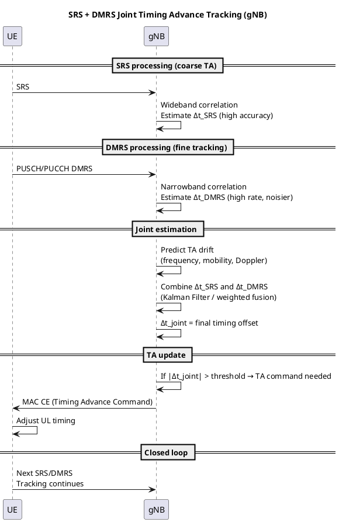
```plantuml
@startuml
title SRS + DMRS Joint Timing Advance Tracking (gNB)

participant "UE" as UE
participant "gNB" as gNB

== SRS processing (coarse TA) ==
UE -> gNB: SRS
gNB -> gNB: Wideband correlation\nEstimate Δt_SRS (high accuracy)

== DMRS processing (fine tracking) ==
UE -> gNB: PUSCH/PUCCH DMRS
gNB -> gNB: Narrowband correlation\nEstimate Δt_DMRS (high rate, noisier)

== Joint estimation ==
gNB -> gNB: Predict TA drift\n(frequency, mobility, Doppler)
gNB -> gNB: Combine Δt_SRS and Δt_DMRS\n(Kalman Filter / weighted fusion)
gNB -> gNB: Δt_joint = final timing offset

== TA update ==
gNB -> gNB: If |Δt_joint| > threshold → TA command needed
gNB -> UE: MAC CE (Timing Advance Command)
UE -> UE: Adjust UL timing

== Closed loop ==
UE -> gNB: Next SRS/DMRS\nTracking continues

@enduml
```

---
## Massive MIMO 빔포밍과 TA 관계

### 개요

Massive MIMO와 Timing Advance(TA)는 완전히 다른 기능처럼 보이지만, NR에서는 서로 **매우 강하게 결합**되어 있습니다.  
이유는 다음 한 문장으로 요약됩니다.

> Massive MIMO는 UE별 위상(phase)·시간(time)·공간(angle) 정렬을 기반으로 동작하는데,  
> UL Timing이 맞지 않으면 UL 채널 추정(CSI)이 왜곡되며,  
> 결과적으로 빔포밍(precoding) 자체가 틀어진다.

즉, TA 오차는 곧 **채널 추정 오차 → 빔포밍 오차 → Beam Misalignment** 로 이어집니다.

---

### UL 기반 채널 추정이 Massive MIMO에서 가지는 의미

TDD 기반 Massive MIMO에서는 **UL–DL 채널 상호성(reciprocity)** 을 이용합니다.

UL에서 SRS/DMRS를 받고 → 그 채널을 그대로 DL precoder 생성에 사용합니다.

이 말은 즉:

UL 채널 = DL channel (up to calibration)

따라서 UL 채널을 안정적으로 추정하려면 UL 신호가 **정확한 시간 축(OFDM grid)에 정렬**되어 있어야 합니다.  
TA 오차가 생기면 채널 추정이 다음과 같이 망가집니다.

- correlation peak shift
- subcarrier-dependent phase rotation
- DMRS가 FFT grid에서 벗어나 ICI 발생
- multi-panel 위상 alignment 불가
- CSI가 panel마다 불일치

Massive MIMO에서는 수십~수백 안테나가 같은 UL 채널을 기반으로 precoding을 계산해야 하므로, **1 UE의 작은 TA 오차가 전체 precoding 정확도에 영향을 미칩니다.**

---

### TA 오차 → 채널 추정 왜곡 수식적 설명

UL 신호가 Δt만큼 지연되면, 주파수 영역에서 다음과 같이 위상 변화가 생깁니다.

$$
Y[k] = X[k] \cdot e^{-j 2\pi k \Delta t / T_{\text{sym}}}  
$$

즉:

- 모든 서브캐리어에 **선형 phase ramp** 발생
- SRS/DMRS로 얻는 채널 $H[k]$ 또한 잘못된 phase ramp 포함
- 이는 Multi-antenna precoder 계산 시 치명적

Massive MIMO의 Zero-Forcing(ZF), MMSE precoder는 채널의 절대 phase alignment에 매우 민감하므로 TA 오차는 곧 precoder 계산 오류로 이어집니다.

---

### Massive MIMO의 기억해야 할 핵심 성질

Massive MIMO에서 precoding matrix (W) 는 다음처럼 계산됩니다.

$$
W = f(H)  
$$

즉, **UL 채널 (H)** 만으로 precoder가 결정됩니다.

UL TA 오차 → H가 왜곡 → W가 틀어짐 → DL 빔이 엉뚱한 방향으로 나감

특히 FR2(mmWave)의 경우:

- 매우 좁은 빔 폭
- 매우 짧은 CP
- 시간 정렬 오차 tolerable margin 매우 작음

따라서 TA tracking 없이 Massive MIMO Precoding은 제대로 동작할 수 없습니다.

---

### Multi-panel/Multi-beam 환경에서 TA가 가져오는 영향

Massive MIMO는 하나의 안테나 패널이 아니라 여러 패널을 사용합니다.  
각 패널은 서로 다른 RF chain + phase offset + calibration 값을 가집니다.

TA 오차가 발생하면:

1. 패널 간 채널 phase alignment가 깨짐
2. UL 채널 추정이 panel별 상이해짐
3. Multi-panel coherent beamforming 불가
4. 빔 방향이 틀어지거나 side-lobe가 증가함
5. DL SNR 급감

이 문제는 FR2의 “방향성 빔포밍(beam-scanning)” 환경에서 특히 심각합니다.  
mmWave에서는 빔이 ±1~3°만 틀어져도 Link가 끊어질 수 있습니다.

---

### Massive MIMO Beamforming에서 TA가 특히 중요한 이유 정리

1. Massive MIMO는 UL 채널 기반 precoding (TDD reciprocity)을 사용한다.
2. UL 채널은 **정확한 timing alignment** 없이는 정확히 추정할 수 없다.
3. TA 오차 → DMRS/SRS 도착 시점 mismatch → CSI 왜곡
4. CSI 왜곡 → 잘못된 precoding → 빔 misalignment
5. 빔 misalignment → DL throughput 하락, BLER 상승, Beam Failure 가능
6. TDD 모드에서는 DL/UL 경계가 timing 기준선이므로 TA 오차 허용치가 작다.
7. FR2에서는 CP·sym 길이가 짧아서 TA 오차 허용도 거의 없다.

즉:

> Massive MIMO가 “제대로 beamforming” 하려면  
> UE UL 타이밍(TA) 정렬이 필수 조건이다.

---

### Massive MIMO Precoding과 TA 관계

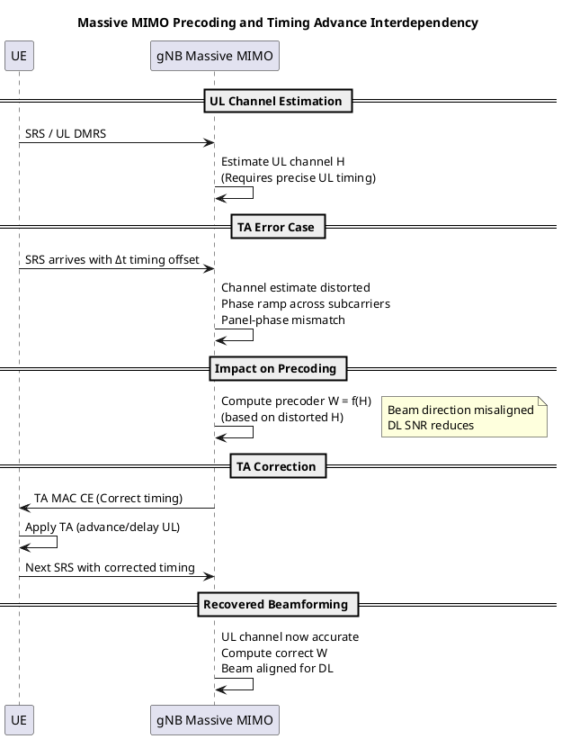
```plantuml
@startuml
title Massive MIMO Precoding and Timing Advance Interdependency

participant "UE" as UE
participant "gNB Massive MIMO" as gNB

== UL Channel Estimation ==
UE -> gNB: SRS / UL DMRS
gNB -> gNB: Estimate UL channel H\n(Requires precise UL timing)

== TA Error Case ==
UE -> gNB: SRS arrives with Δt timing offset
gNB -> gNB: Channel estimate distorted\nPhase ramp across subcarriers\nPanel-phase mismatch

== Impact on Precoding ==
gNB -> gNB: Compute precoder W = f(H)\n(based on distorted H)
note right: Beam direction misaligned\nDL SNR reduces

== TA Correction ==
gNB -> UE: TA MAC CE (Correct timing)
UE -> UE: Apply TA (advance/delay UL)
UE -> gNB: Next SRS with corrected timing

== Recovered Beamforming ==
gNB -> gNB: UL channel now accurate\nCompute correct W\nBeam aligned for DL

@enduml
```

---

### 실제 현장에서 나타나는 현상 예

Massive MIMO 현장에서 TA가 불안정하면 다음 현상이 자주 보입니다.

- DL Beamforming gain이 불안정하게 출렁임
- UE의 DL throughput이 일정하게 나오지 않고 스파이크 발생
- SRS 기반 scheduling이 불안정
- 사용자 속도 증가 시 Beam Failure 훨씬 쉽게 발생
- mmWave에서 beam switch 빈도가 증가
- Multi-user MIMO(MU-MIMO)에서 interference cancellation(ZF)이 잘 안 됨

특히 MU-MIMO는 여러 UE의 채널 정렬이 동시에 필요하므로 **TA 오차가 있는 UE 한 명이 전체 사용자에 영향을 줄 수 있습니다.**

---
## Multi-beam PRACH에서 PRACH Rx Beam 형성과 Timing Advance(TA) 계산의 관계

### 개요

5G NR에서 PRACH(Random Access Channel)는 UE가 셀에 처음 접속할 때 사용하는 UL 신호입니다.  
FR2(밀리미터파) 또는 Massive MIMO FR1 환경에서는 gNB가 **여러 개의 수신 빔(RX beams)** 을 사용하여 PRACH preamble을 동시에 모니터링합니다.

Multi-beam 환경에서는:

- UE가 어떤 빔 방향에 위치하는지
- PRACH가 어떤 빔으로 수신될 수 있는지
- PRACH 도착 시간(Time of Arrival)이 어떤 빔에서 어떻게 측정되는지

이 모든 것이 **TA 계산에 직접적으로 연결**됩니다.

즉, Multi-beam PRACH에서는:

> **PRACH가 어느 빔에서 가장 강하게/가장 일찍 검출되는지**가  
> Timing Advance 추정의 기준이 된다.

---

### Multi-beam PRACH 수신 구조

Massive MIMO 또는 mmWave에서 gNB는 다음과 같은 구조로 PRACH를 수신합니다.

1. gNB는 여러 수신 빔 패턴을 미리 정의함
2. 동일 시간에 **N개의 빔을 병렬적으로 활성화**하여 PRACH preamble을 탐지
3. 각 빔마다 독립적으로 correlation(zadoff-chu) 수행
4. 각 beam에서 peak amplitude, delay(peak position) 측정
5. gNB는 어느 빔의 correlation peak가
    - 가장 높고,
    - SNR이 높고,
    - Delay가 유효한지를 평가하여 **최종 PRACH Beam + ToA(Time-of-Arrival) 선택**

이 때 **선택된 ToA가 바로 TA 계산의 입력**이 된다.

---

### 왜 “특정 beam의 ToA”를 선택해야 하는가

UE는 특정 공간 방향(AoA)으로 존재합니다.  
multi-beam PRACH에서:

- Beam A는 UE 방향과 정렬 → 강한 신호, 정확한 ToA
- Beam B는 UE 방향과 비정렬 → 신호 약함, multipath peak 생길 수 있음
- Beam C는 noise 또는 side-lobe peak → 잘못된 ToA

따라서:

$$
TA \propto \text{ToA from MOST VALID PRACH Rx Beam}  
$$

이것이 핵심입니다.

---

### Multi-beam PRACH에서 ToA 선택 기준

gNB는 일반적으로 다음 우선순위로 PRACH beam을 선택합니다.

1. Correlation peak amplitude가 최대인 beam
2. SNR이 일정 threshold 이상
3. Peak shape이 유효한(ZC sequence correlation 특성 부합) beam
4. Peak index가 PRACH window 내부에 있는 beam
5. Delay spread나 multipath 영향이 낮은 beam
6. Multi-beam consistency(주변 beam들과 delay/slope 비교)

이 과정을 통해 최종 “BEST beam”을 선택하고, 그 beam에서 나온 ToA 값을 TA 계산에 사용합니다.

---

### Multi-path 환경에서의 문제

UE 신호가 multipath를 가진 경우:
- Beam #1: LOS 경로 peak (ToA 정확)
- Beam #2: NLOS 반사 경로 peak (ToA 늦음)
- Beam #3: side-lobe 잡음 peak (ToA 의미 없음)

만약 gNB가 가장 세기가 큰 multipath peak를 선택하면  
TA가 잘못 계산됩니다 (UE UL timing이 엉망됨).

그래서 Multi-beam PRACH에서는 반드시 다음 처리가 필요합니다:

- LOS 추정 또는 earliest valid peak detection
- multi-beam consistency filtering
- absolute vs relative peak filtering

실제 상용 gNB에서는 ToA smoothing이나 multi-beam weighted peak selection을 수행합니다.

---

### TA 계산에 사용되는 ToA는 “Beam-dependent”

시험·벤더 장비에서 공통적으로 보이는 점:

- 동일한 UE PRACH라도 Rx beam마다 ToA가 약간 다르다.  
    (beam마다 spatial filtering 영향 + multipath 영향 때문)

예:

|Beam|Peak Power|ToA Index|
|---|---|---|
|Beam 0|높음|105|
|Beam 1|최고|101 ← 채택해야 하는 beam|
|Beam 2|낮음|113|
|Beam 3|side-lobe|78|

이 경우 선택된 beam = Beam 1  
TA 계산도 Beam 1의 ToA index 101 기반으로 수행.

---

### TA 계산 과정 (Multi-beam 상황의 실제 과정)

위 ToA index가 선택되면 TA는 다음과 같이 계산됩니다.

1. 선택된 beam의 ToA index = (n_{\text{peak}})
2. 실제 도착 시간:

$$ 
t_{\text{arrival}} = \frac{n_{\text{peak}}}{F_s}  
$$

3. 기준 도착 시간 t_ref 와 비교:

$$
\Delta t = t_{\text{arrival}} - t_{\text{ref}}  
$$

4. TA index:

$$
N_{\text{TA}} = \text{round} \left( \frac{\Delta t}{T_c} \right)  
$$

이때 T_c는 NR base time unit.

즉, **Multi-beam PRACH에서 TA는 beam 선택 과정의 결과물**입니다.

---

### Multi-beam PRACH에서 중요 포인트

다음 세 가지가 TA 정확도에 직접 영향을 줍니다:

1. **어떤 beam을 선택했는가**
2. **그 beam에서 LA 기준으로 어느 peak를 선택했는가**
3. **peak detection이 multipath를 잘 제거했는가**

특히 FR2에서는:

- NLOS 경로가 강할 수 있음
- Beamwidth 좁음
- 빔 스위칭이 빈번
- UE 방향이 조금만 변해도 best beam이 달라짐

따라서 Multi-beam PRACH에서는 **beam selection 알고리즘이 TA 정확도의 핵심**입니다.

---

## Multi-beam PRACH + TA

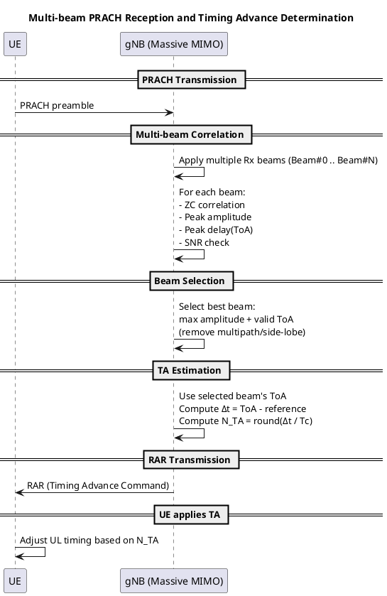
```plantuml
@startuml
title Multi-beam PRACH Reception and Timing Advance Determination

participant "UE" as UE
participant "gNB (Massive MIMO)" as gNB

== PRACH Transmission ==
UE -> gNB: PRACH preamble

== Multi-beam Correlation ==
gNB -> gNB: Apply multiple Rx beams (Beam#0 .. Beam#N)
gNB -> gNB: For each beam:\n- ZC correlation\n- Peak amplitude\n- Peak delay(ToA)\n- SNR check

== Beam Selection ==
gNB -> gNB: Select best beam:\nmax amplitude + valid ToA\n(remove multipath/side-lobe)

== TA Estimation ==
gNB -> gNB: Use selected beam's ToA\nCompute Δt = ToA - reference\nCompute N_TA = round(Δt / Tc)

== RAR Transmission ==
gNB -> UE: RAR (Timing Advance Command)

== UE applies TA ==
UE -> UE: Adjust UL timing based on N_TA

@enduml
```

---

### 실제 필드에서 발생하는 케이스

Multi-beam PRACH에서 TA과 beam alignment가 서로 영향을 주는 현상:

- beam mismatch → PRACH가 side-lobe에서 수신 → ToA 오류 → TA 오류 → UL 타이밍 더욱 불안정
- UE가 빔 경계에 있을 경우 PRACH가 여러 beam에서 감지될 수 있음 → 적절한 beam 선택 필요
- mmWave 환경에서는 multipath peak가 LOS peak보다 크게 나타나 TA 오차가 커지는 경우 존재
- 일부 gNB 구현은 PRACH detection 이후 바로 “beam refinement”를 위해 SRS를 요청함 → TA 안정화 용도

---
### 결론

- Multi-beam PRACH에서는 “어느 beam에서 PRACH peak를 선택하느냐”가 TA 정확도를 좌우한다.
- 선택된 beam의 correlation peak 위치(Time of Arrival)가 TA 계산의 직접 입력이다.
- 빔 선택 오류나 multipath peak 선택 오류는 TA 오류 → UL timing misalignment → SRS/DMRS 추정 오류 → Beamforming 불안정으로 이어진다.
- Massive MIMO/FR2 환경에서는 Multi-beam PRACH + SRS 기반 TA 정교화를 필수로 사용한다.
 