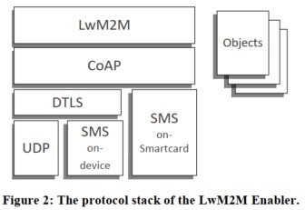
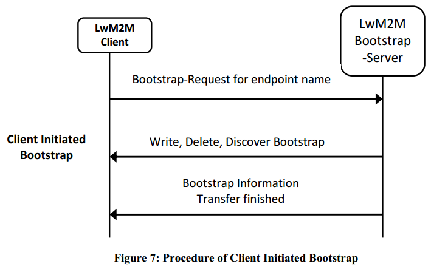
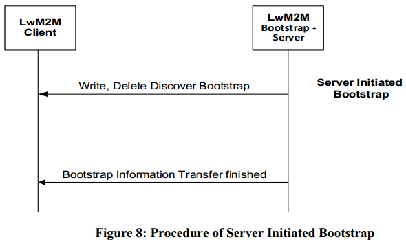
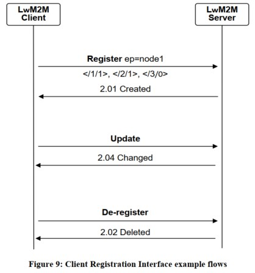
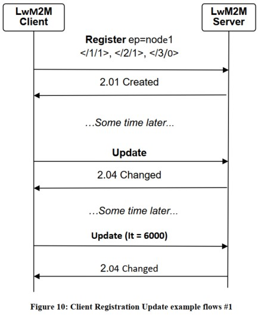
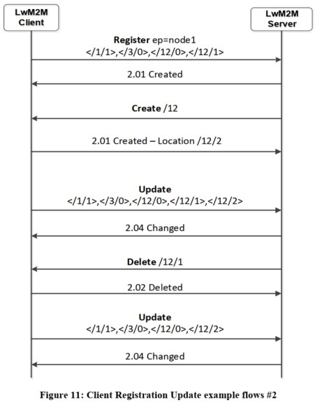

# Lightweight Machine to Machine Technical Specification
OMA LwM2M technical Spec released v.1.2 at 11.10.2020 but the version of 1.0.2 explains easier and more detail than v.1.2. So, I'm studying v.1.0.2. first.

## 4. Introduction
- Two components
    + Server
    + Client
- Four Interfaces
    + Bootstrap
    + Client Registration
    + Device management and service enablement
    + Information Reporting

The protocol stack of the LwM2M Enabler.


## 5. Interfaces
- Bootstrap
    + Bootstrap-Request (client to server: Uplink)
    + Write, Discover, Delete (server to client: Downlink)
    + Bootstrap-Finish (server to client: Downlink)
- Client Registration
    + Register, Update, De-register (client to server: Uplink)
- Device Management and Service Enablement
    + Read, Write, Execute, Create, Delete, Write Attribute, Discover (Server to client: Downlink)
- Information Reporting
    + Observe, Cancel Observation (server to client: Downlink)
    + Notify (client to server: Uplink)

### 5.1. Attributes
#### Rules
- the value of an O-Attribute MAY only be set at the Object level
- the value of an OI-Attribute MAY be set at the Object Instance level, and at the Object level.
    + precedence rules:
        * 1: when set at both levels, the value of the OI-Attribute set at Object Instance level will prevail.
        * 2: when the attribute value is set at the Object level, the scope of the OI-Attribute value extends to all the Instances of that Object, as long as the Rule 1 is respected.
- an R-Attribute MAY be set at 3 different levels: the Resource level, the Object Instance level and the Object level.
    + precedence rules:
        * 3: when set at the Resource level, the value of an R-Attribute prevails for that Resource whatever a value for this R-Attribute is also specified at an upper level (Object or Object Instance level).
        * 4: when set at the object Instance level, the scope of an R-Attribute value extends to all the Resources of that Object Instance as long as the Rule 3 is repected.
        * 5: when set at the Object level, the scope of an R-Attribute value extends to all the resources of any Instance of that Object, as long as the Rule 4 is respected.

### 5.2. Bootstrap Interface
The Bootstrap Interface is used to provision essential information into the LwM2M Client to enable the LwM2M Client to perform the operation "Register" with one or more LwM2M Servers.

4 bootstrap modes:
- Factory Bootstrap
- Bootstrap from Smartcard
- Client Initiated Bootstrap
- Server Initiated Bootstrap

#### 5.2.2. Bootstrap Information
- The LwM2M Server Bootstrap Information
    + LwM2M Server Account
    + Additional Object Instances (e.g., Access Control, Connectivity Monitoring Object)
- The LwM2M Bootstrap-Server Bootstrap Information
    + LwM2M Bootstrap-Server Account (Security Object instance)

#### 5.2.3. Bootstrap Modes
- **Factory Bootstrap**: the LwM2M Client has been configured with the necessary Bootstrap Information prior to deployment of the device.
- **Bootstrap from Smartcard**: the LwM2M Client is configured with the bootstrap data contained in the Smartcard.
- **Client Initiated Bootstrap**:


- **Server Initiated Bootstrap**:


#### 5.2.7. Bootstrap Commands
##### 5.2.7.1. BOTTSTRAP-REQUEST
Client initiated Bootstrap with this operation.

| Parameter | Required | Default | Notes |
|:---        |:---       |:---      |:---    |
|```/bs?ep={endpoint Client Name}``` |yes | - |Indicates the LwM2M Client's "Endpoint Name" in order to allow the LwM2M Bootstrap to provision the Bootstrap Information for the LwM2M Client |

##### 5.2.7.2. BOOTSTRAP-FINISH
To terminate the Bootstrap Sequence previously initiated.

| Parameter | Required | Default | Notes |
|:---        |:---       |:---      |:---    |
|```/bs``` |yes | - | - |

##### 5.2.7.3. BOOTSTRAP DISCOVER
To discover which LwM2M Objects and Object Instances are supported by a certain LwM2M Client.

| Parameter | Required | Default | Notes |
|:---        |:---       |:---      |:---    |
|Object ID |no | - |Indicates the Object. (/ means all Objects) |

##### 5.2.7.4. BOOTSTRAP WRITE

| Parameter | Required | Default | Notes |
|:---        |:---       |:---      |:---    |
|Object ID |yes | - |Indicates the Object |
|Object Instance ID |no | - |Indicates the Object Instance to write |
|Resource ID |no | - |Indicates the Resource to write. The payload is the new value for the Resource. If no Resource ID is indicated, then the value included payload is an Object Instance containing the Resource values. |
|New Value |yes | - |The new value included in the payload to update the Object Instance(s) or Resource |

##### 5.2.7.5. BOOTSTRAP DELETE

| Parameter | Required | Default | Notes |
|:---        |:---       |:---      |:---    |
|Object ID |no | - |Indicates the Object from which Object Instance will be deleted; if no Object ID is indicated, all existing Object Instances (except the LwM2M Bootstrap-Server Account and the Instance of the Device Object) in the LwM2M Client will be delted. |
|Object Instance ID |no | - |Indicates the Object Instance to delete. If no Object Instance ID is indicated, then all Instnaces of the designated object (Object ID MUST be provided) are deleted.

### 5.3. Client Registration Interface



#### 5.3.1. Register
After the LwM2M Device is turned on and the bootstrap procedure has been completed, the LwM2M Client MUST perform a "Register" operation to each LwM2M Server that the LwMeM Client has a Server Object Instance.

| Parameter | Required | Default | Notes |
|:---        |:---       |:---      |:---    |
|Endpoint Client Name |yes | - |See section 6.3 |
|Lifetime |yes | - |Indicates the expected lifetime of the registration for this LwM2M client. This value MUST be the same as the value held in the Resource named "Lifetime" of the corresponding instance of Server Object (ID#1):/1/x/1. |
|LwM2M Version |yes | - |Indicates the version of the LwM2M Enabler that the LwM2M Client supports. The LwM2M version number reported MUST correspond to the apporved version number of this document. |
|Binding Mode |no | U |Indicates current binding and Queue mode of the LwM2M Client. This value MUST be the same as the value held in the Resource named "Binding" of the corresponding instance of Server Object (ID#1):1/x/7. The valid values of the parameter are listed in the Section 5.3.1.1. |
|SMS Number |no | - |The value of this parameter is the MSISDN where the LwM2M Client can be reached for use with the SMS binding. |
|Objects and Object Instances |yes | - |The list of Objects supported and Object Instances available on the LwM2M Client (Security Object ID:0 MUST not be part of this list). |

##### 5.3.1.1. Behaviour with Current Transport Binding and Mode

| Current Transport Binding and Mode | Behaviour |
|:---                                 |:---        |
|U(UDP) |The LwM2M Server expects that the LwM2M Client is reachable via the UDP binding at any time. The LwM2M Server MUST send requests to a LwM2M Client using the UDP binding. The LwM2M Client MUST send the response to such a request over the UDP binding. This is the normal default mode of operation. |
|UQ(UDP with Queue Mode) |The Server MUST queue all requests to the LwM2M Client, sending requests via UDP when the LwM2M Client is on-line as described in Section 8.4. Queue Mode Operation. The LwM2M Server MUST send requests to a LwM2M Client using the UDP binding. The LwM2M Client MUST send the response to such a request over the UDP binding. |
|S(SMS) |The LwM2M Server expects that the LwM2M Client is reachable via the SMS binding at any time. The LwM2M Server MUST send requests to a LwM2M Client using the SMS binding. The LwM2M Client MUST send the response to such a request over the SMS binding. |
|SQ(SMS with Queue Mode) |The Server MUST queue all requests to the LwM2M Client, sending requests via SMS when the LwM2M Client is on-line as described in Section 8.4. Queue Mode Operation. Requests MUST be sent to the LwM2M Client using the SMS binding. The LwM2M Client MUST send the response to such a request over the SMS binding. |
|US(UDP and SMS) |The LwM2M Server expects that the LwM2M Client is reachable via the UDP binding at any time. The LwM2M Server expects that the LwM2M Client is reachable via the SMS binding at any time. If the LwM2M Server sends requests to a LwM2M Client using the UDP binding, The LwM2M Client MUST send the response to such a request over the UDP binding. If the LwM2M Server sends requests to a LwM2M Client using the SMS binding, The LwM2M Client MUST send the immediate response to such a request over the SMS binding. |
|UQS(UDP with Queue Mode and SMS) |The Server MUST queue all requests to the LwM2M Client, sending requests via UDP when the LwM2M Client is on-line as described in Section 8.4. Queue Mode Operation. The LwM2M Server expects that the LwM2M Client is reachable via the SMS binding at any time. If the LwM2M Server sends requests to a LwM2M Client using the UDP binding, The LwM2M Client MUST send the response to such a request over the UDP binding. If the LwM2M Server sends requests to a LwM2M Client using the SMS binding, The LwM2M Client MUST send the immediate response to such a request over SMS binding. The LwM2M Server MAY request the LwM2M Clinet to perform "Update" operation via UDP by sending "Execute" operation on "Registration Update Trigger" Resource via SMS. |

#### 5.3.2. Update
Periodically or based on certain events within the LwM2M Client or initiated by the LwM2M Server, the LwM2M Client updates its registration information with a LwM2M Server by sending an "Update" operation to the LwM2M Server.

| Parameter | Required |
|:---        |:---       |
|Lifetime |no |
|Binding Mode |no |
|SMS Number |no |
|Objects and Object Instances |no |





#### 5.3.3. De-register
When a LwM2M Client determines that it no longer requires to be available to a LwM2M Server (e.g., LwM2M Device factory reset), the LwM2M Client SHOULD send a "De-register" operation to the LwM2M Server.

