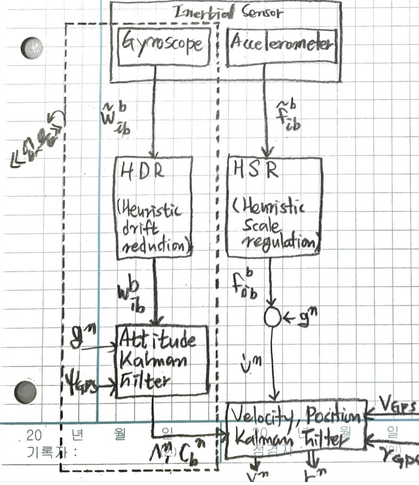
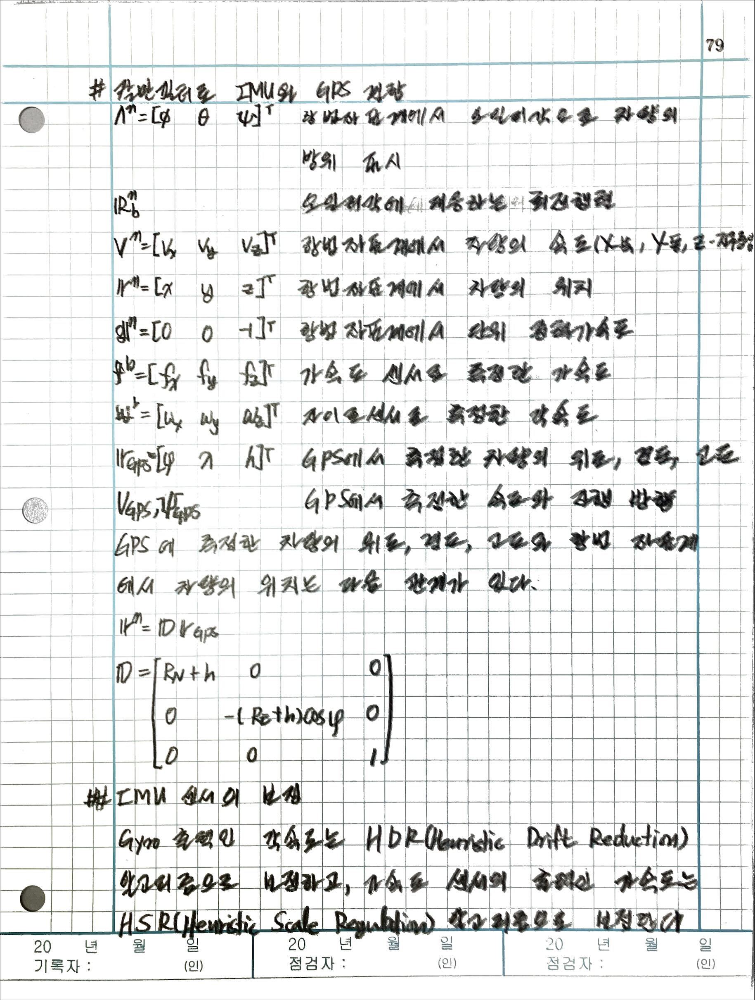
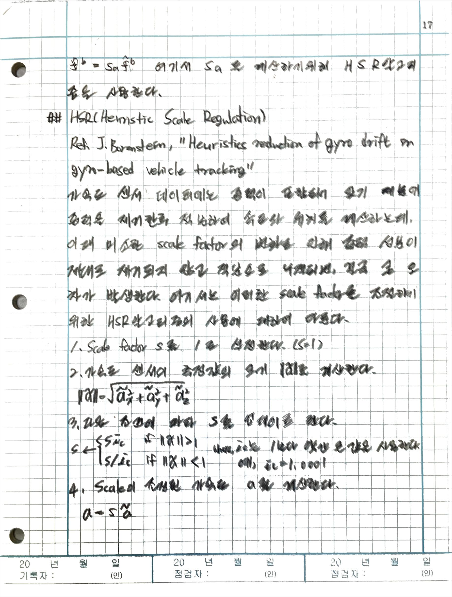
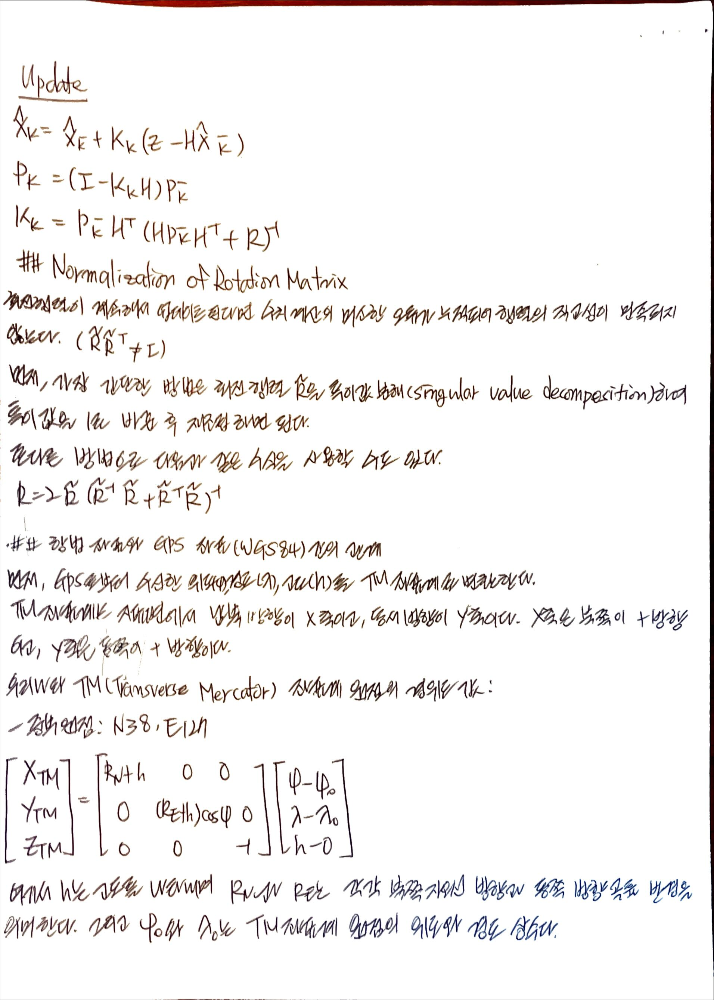
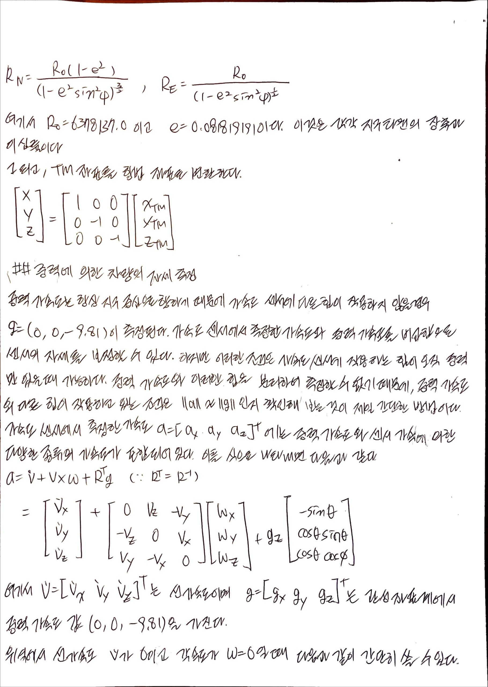
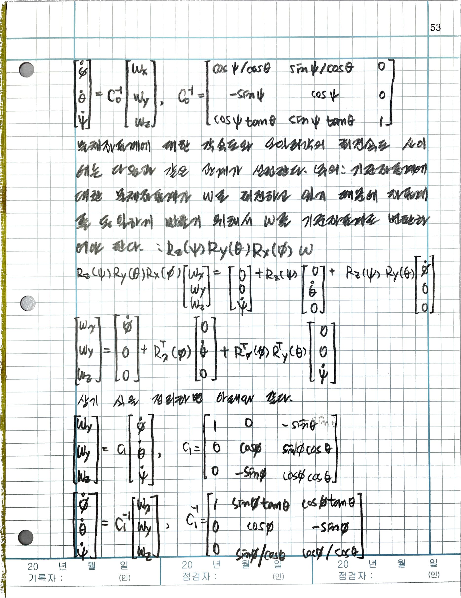

# paper: Kalman Filter로 IMU와 GPS 결합

- KITECH 양광웅
- 지구 자전효과와 중력 모델을 고려하지 않은 INS 설계

## My comments

This paper was refered by below paper(A study on the GPS/INS integration and GPS compensation algorithm based on the particle filter). Especially, the algorithm for fusing accelerator and GPS was just copied. The writer had presented his study to Ulsan university and the writer of the below paper was a student in Ulsan, so it's reasonable to guess that they had shared the knowledges.

It uses the extended Kalman filter so that I will not use the filter.



## IMU 센서의 보정



## HSR (Heuristic Scale Regulation)



I modified the original codes written by paper's writer.

```c
double s = 1;
const double threshold = 0.01;
const double i_c = 1.0001;

void hsr(double a[3])
{
    int i;
    double a_abs;

    for (i=0; i<3; i++) {
        a[i] *= s;
    }

    a_abs = sqrt(a[0]*a[0] + a[1]*a[1] + a[2]*a[2]) - 1.0;

    if (-threshold < a_abs && a_abs < threshold) {
        if (a > 0.)
            s /= i_c;
        else if (a < 0.)
            s *= i_c;
    }
}
```

## Map system tranformation
This codes was written by paper's writer.

```c
#include "StdAfx.h"
#include <math.h>

//Bessel 1841 ellipsoid datum
// e_squre(e^2) = 2*f - f*f;
static const double a = 6377397.155;
static const double e_squre = 0.006674372227347433;
static const double e_prime_squre= 0.006719218794659982;

// TM 계산을 위한 계수들, A-F;
static const double nTMScaleFacter = 1.0;
static const double nKatecScaleFacter = 0.9999;

static const double A = 1.005037306048555;
static const double B = 0.005047849240300;
static const double C = 0.000010563786831;
static const double D = 0.000000020633322;
static const double E = 0.000000000038865;
static const double F = 0.000000000000075;

#ifndef M_PI
#define M_PI        3.14159265358979323846  // pi 
#endif

inline double Deg2Rad(double Degree)
{
    return Degree*M_PI/180.;
}

inline double Rad2Deg(double Radian)
{
    return Radian*180./M_PI;
}

// TM -> 경위도
void _TM2Bessel(double tm_x, double tm_y, double lonOrg, double latOrg, double *lon, double *lat)
{
    // TM -> Bessel

    double x = tm_x;
    double y = tm_y;

    // phi_prime을 계산하기 위한 초기치 산정....
    double for_calcult_phi1 = x / (a*(1.-e_squre)*A);
    double phi1 = Deg2Rad(latOrg) + for_calcult_phi1;
    // phi1 값을 이용해서 iteration 수행.....
    double phi0 = Deg2Rad(latOrg);

    while(1) {
        double B1 = a*(1-e_squre)*(A*(phi1-phi0) 
            - 1./2. *B*(sin(2. *phi1) - sin(2.*phi0)) 
            + 1./4. *C*(sin(4. *phi1) - sin(4.*phi0))
            - 1./6. *D*(sin(6. *phi1) - sin(6.*phi0)) 
            + 1./8. *E*(sin(8. *phi1) - sin(8.*phi0))
            - 1./10.*F*(sin(10.*phi1) - sin(10.*phi0)));

        double phi2 = phi1 + (x - B1) / (a*(1.-e_squre)*A);

        if(fabs(x - B1) < 0.00000001) break;
        else phi1 = phi2;
    }

    double W1 = sqrt(1.-e_squre*pow(sin(phi1),2.));
    double N1 = a / W1;
    double M1 = a * (1.- e_squre) / pow(W1,3.);
    M1 = 635604.152;
    double eta1_squre = e_prime_squre*pow(cos(phi1),2.);
    double t1 = tan(phi1);

    double t1_squre = t1*t1;

    double phi_b1 = t1/(2. *pow(N1,2.))*(1.+eta1_squre);
    double phi_b2 = t1/(24. *pow(N1,4.))*(5. + 3. *t1_squre +6.*eta1_squre -6*t1_squre*eta1_squre-3.*pow(eta1_squre,2.)-9.*t1_squre*pow(eta1_squre,2.));
    double phi_b3 = t1/(720. *pow(N1,6.))*(61. + 90. *t1_squre +45.*pow(eta1_squre,2.)+107.*eta1_squre-162.*t1_squre*eta1_squre-45.*pow(t1_squre,2.)*eta1_squre); 
    double phi_b4 = t1/(40320.*pow(N1,8.))*(1385.+3633.*t1_squre +4095.*pow(eta1_squre,2.) +1575*pow(eta1_squre,3.)); 

    double lambda_b1 = 1./(N1*cos(phi1));
    double lambda_b2 = 1. /6. * 1./(pow(N1,3.)*cos(phi1))*(1.+2.*pow(t1,2.)+eta1_squre);
    double lambda_b3 = 1./120 * 1./(pow(N1,5.)*cos(phi1))*(5.+28.*t1_squre+24.*pow(t1_squre,2.)+6.*eta1_squre+8.*t1_squre*eta1_squre);
    double lambda_b4 = 1./5040.* 1./(pow(N1,7.)*cos(phi1))*(61.+662.*t1_squre+1320.*pow(t1_squre,2.) + 720.*pow(t1_squre,3.));

    double phi = phi1 
        - phi_b1*pow(y,2.) 
        + phi_b2*pow(y,4.) 
        - phi_b3*pow(y,6.) 
        + phi_b4*pow(y,8.);


    double lambda = lambda_b1*y 
        - lambda_b2*pow(y,3.) 
        + lambda_b3*pow(y,5.)
        - lambda_b4*pow(y,7.);

    // 계산된 라디안 값을 백분 Degree로 바꾸어줌....
    *lat = Rad2Deg(phi); 
    *lon = Rad2Deg(lambda)+lonOrg;
}

// 경위도 -> TM
void _Bessel2TM(double lon, double lat, double lonOrg, double latOrg, double *tm_x, double *tm_y)
{
    // Bessel -> TM

    double phi = Deg2Rad(lat);
    double lambda= Deg2Rad(lon);

    double phi_0 = Deg2Rad(latOrg); // 원점. 

    double for_B = a*(1-e_squre)*(A*(phi-phi_0) 
        - 1./2. *B*(sin(2. *phi) - sin(2. *phi_0)) 
        + 1./4. *C*(sin(4. *phi) - sin(4. *phi_0))
        - 1./6. *D*(sin(6. *phi) - sin(6. *phi_0)) 
        + 1./8. *E*(sin(8. *phi) - sin(8. *phi_0))
        - 1./10.*F*(sin(10.*phi) - sin(10.*phi_0)));

    //계산을 위한 값들....
    double t = tan(phi);
    double eta = sqrt(e_prime_squre)*cos(phi); // eta_squre(eta^2 = e_prime_squre* cos^2 phi
    double N = a / sqrt(1 - e_squre * pow(sin(phi),2.));

    //Gauss-Kruger Projection 식.....
    double Delta_lambda = lambda - Deg2Rad(lonOrg);

    double x = for_B + pow(Delta_lambda,2.) / 2. * N * sin(phi) * pow(cos(phi),1.)
        + pow(Delta_lambda,4.) / 24. * N * sin(phi) * pow(cos(phi),3.)*(5.- pow(t,2.) + 9.*pow(eta,2.) + 4.*pow(eta,4.))
        + pow(Delta_lambda,6.) / 720. * N * sin(phi) * pow(cos(phi),5.)*(61. - 58.*pow(t,2) + pow(t,2.) + 270. * pow(eta,2) - 330 * pow(t,2) * pow(eta,2))
        + pow(Delta_lambda,8.) / 40320.* N * sin(phi) * pow(cos(phi),7.)*(1385. - 3111.*pow(t,2.) + 543. * pow(t,4.) - pow(t,6.));


    double y = Delta_lambda * N * cos(phi)
        + pow(Delta_lambda,3.) / 6. * N * pow(cos(phi),3.)*(1-pow(t,2.) + pow(eta,2.))
        + pow(Delta_lambda,5.) / 120. * N * pow(cos(phi),5.)*(5.- 18.*pow(t,2.) + pow(t,4.) + 14.* pow(eta,2.) - 58.*pow(t,2.)*pow(eta,2))
        + pow(Delta_lambda,7.) / 5040. * N * pow(cos(phi),7.)*(61. - 479.*pow(t,2) + 179.*pow(t,4.) - pow(t,6.));

    *tm_x = nTMScaleFacter*x; 
    *tm_y = nTMScaleFacter*y;
}

void Bessel2TM (double alt, double lon, double lat, double lonOrg, double latOrg, double *tm_x, double *tm_y)
{
    double R0 = 6378137.0;  // 지구 장축 길이
    double e = 0.081819191; // 이심률
    
    double phi = Deg2Rad(lat);
    double den = sqrt(1 - e*e*sin(phi)*sin(phi));
    double RN = R0*(1 - e*e)/(den*den*den);
    double RE = R0/den;

    // 우리나라 TM(Transverse Mercator) 좌표계 원점들의 경위도 값
    // x-축 : 남북 방향, 북쪽이 +
    // y-축 : 동서 방향, 동쪽이 +
    *tm_x = (RN + alt)*Deg2Rad(lat - latOrg);
    *tm_y = (RE + alt)*Deg2Rad(lon - lonOrg)*cos(phi);
}
```

## Normalization of Rotation Matrix

## 항법 좌표와 GPS 좌표(WGS84) 간의 관계



## 중력에 의한 차량의 자세 측정






## Euler angles

