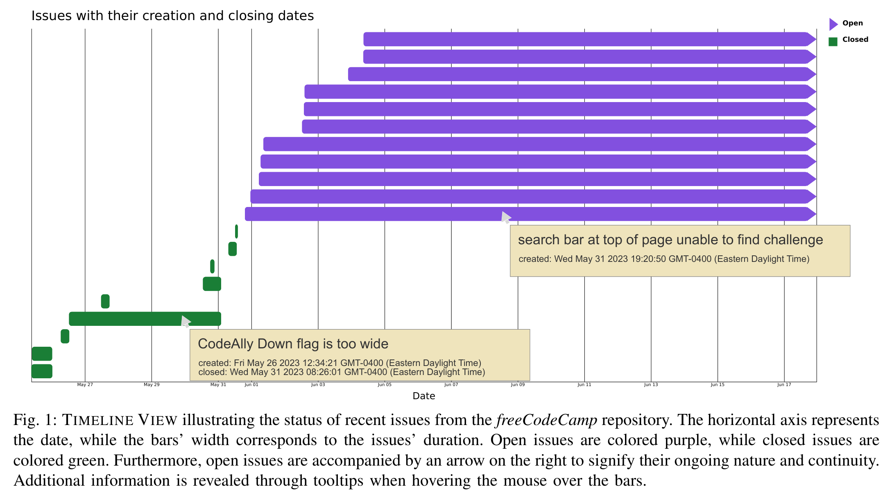
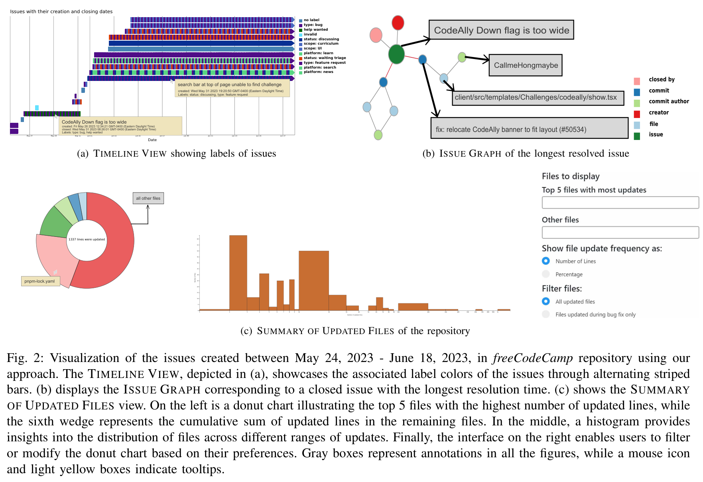
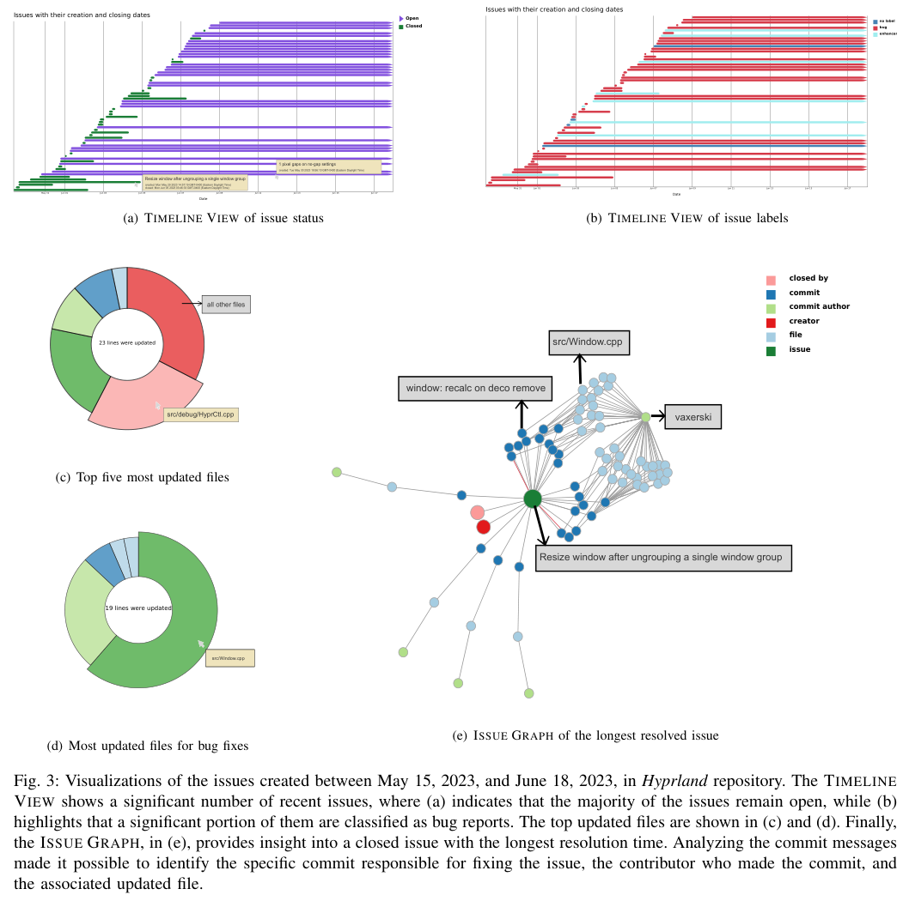
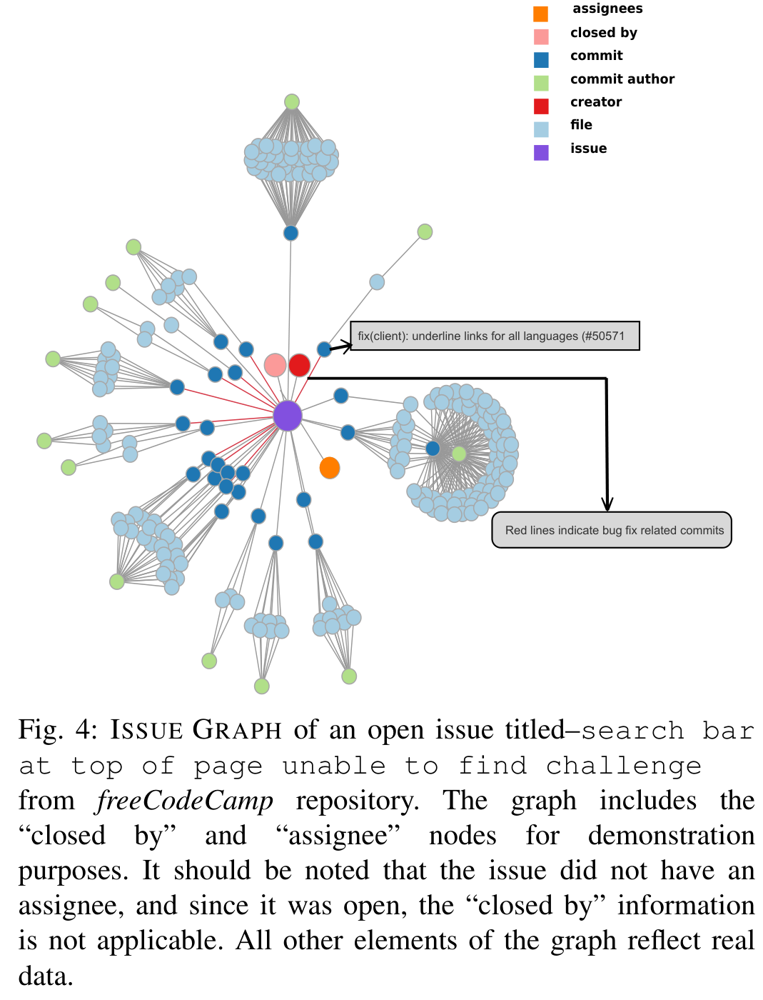
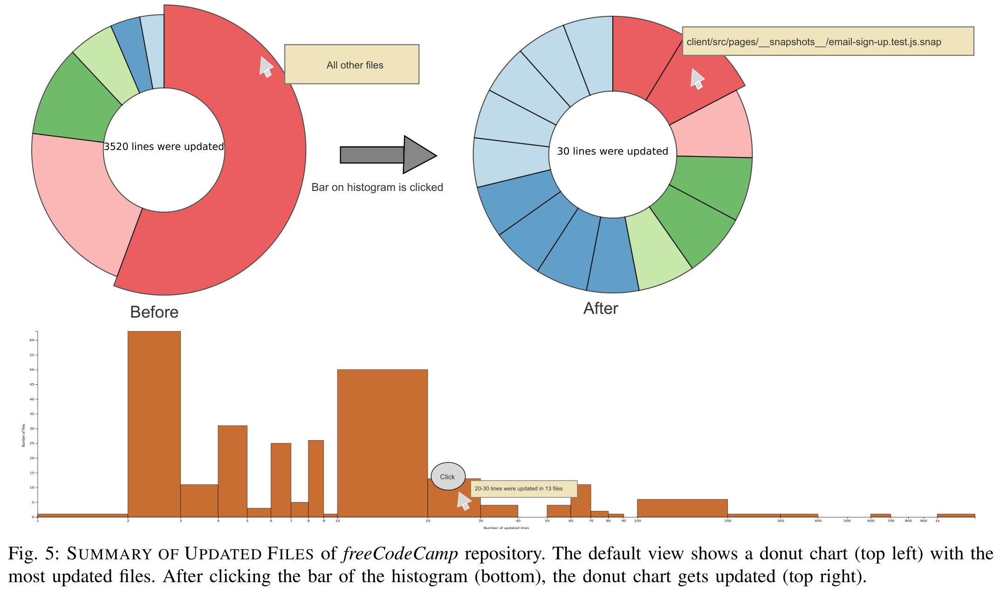
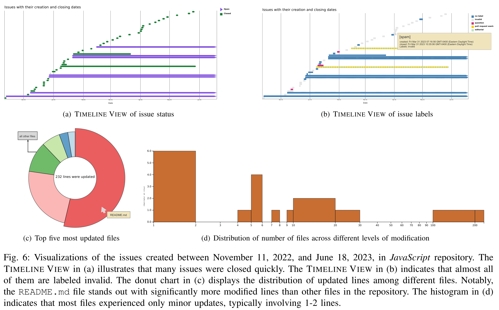
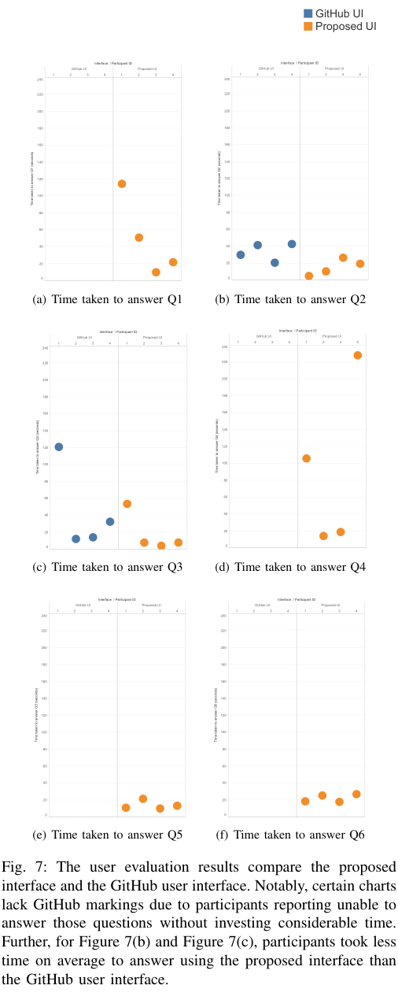

# (paper) Visual Analysis of GitHub Issues to Gain Insights
- [https://arxiv.org/pdf/2407.20900](./data/\(paper\) Visual Analysis of GitHub Issues to Gain Insights.pdf)
- Rifat Ara Proma
    + Scientific Computing and Imaging Institute
    + University of Utah
    + Salt Lake City, UT, USA
    + proma@sci.utah.edu
- Paul Rosen
    + Scientific Computing and Imaging Institute
    + University of Utah
    + Salt Lake City, UT, USA
    + prosen@sci.utah.edu

## Abstract
버전 관리 시스템은 소프트웨어 개발에 필수적이며, GitHub는 이슈 추적 및 풀 리퀘스트를 포함한 종합적인 프로젝트 관리 도구 덕분에 인기 있는 온라인 플랫폼으로 떠오르고 있다. 그러나 GitHub는 이슈와 커밋 간의 직접적인 연결 고리가 없어서 개발자들이 특정 이슈가 어떻게 해결되는지 이해하기 어렵다. GitHub의 Insights 페이지는 저장소 데이터를 시각화하지만, 이슈 및 커밋 관련 데이터를 텍스트 형식으로 표현하여 이슈 관리를 빠르게 평가하는 데에 어려움을 준다.

이 논문은 이슈 타임라인에 대한 통찰을 제공하고 이슈와 관련된 다양한 요소를 드러내는 시각화를 생성하는 프로토타입 웹 애플리케이션을 제시한다. 이 애플리케이션은 이슈의 생명 주기에 중점을 두고 프로젝트 개발 패턴에 대한 사용자의 이해를 높이기 위해 중요한 정보를 시각화한다. 우리는 세 개의 오픈 소스 GitHub 저장소를 대상으로 한 사례 연구를 통해 우리의 접근 방식의 효과를 입증한다. 또한, 프로토타입의 효율성과 신속성을 검증하기 위해 사용자 평가를 실시하였다.

Video URL : https://youtu.be/bFrMGfwax68
Index Terms—GitHub mining, issue tracking, source code, visual analytics

## I. INTRODUCTION
개발자 간 협업은 소프트웨어 개발에서 가장 중요한 작업 중 하나입니다. Git과 같은 분산 버전 관리 시스템은 프로그래머가 소스 코드를 저장하고, 협업하며, 작업을 추적할 수 있게 합니다. GitHub는 2024년 2월 기준 1억 명 이상의 개발자와 4억 2천만 개 이상의 저장소를 보유한 가장 널리 사용되는 온라인 Git 기반 플랫폼 중 하나입니다 [1]. GitHub는 이슈 추적, 풀 리퀘스트 등 여러 유용한 기능을 제공하여 협업 개발 프로세스를 더 쉽게 만듭니다. 특히 이슈 추적은 완료된 작업, 해야 할 작업, 그리고 누가 어떤 작업을 하고 있는지를 추적하는 데 도움이 됩니다. 이는 버그 보고, 기능 요청, 개선 사항 등 여러 목적으로 사용됩니다.

GitHub 데이터 마이닝 분야에는 저장소의 주제 예측 [2], 사용자 행동 이해 [3], 소프트웨어 결함 예측 [4] 등 다양한 응용 프로그램과 함께 많은 기존 연구가 있습니다. 많은 기존 연구에서는 GitHub의 다양한 측면을 강화하기 위해 데이터 시각화를 사용할 것을 제안했습니다 [5]–[7]. 이 논문에서는 현재 GitHub 인터페이스에서 문제를 식별하고 데이터 시각화를 사용하여 이를 해결하려고 시도했습니다.

GitHub의 여러 기능에도 불구하고, 저장소에 대한 통찰력을 제공하는 시각화를 활용하는 인사이트 페이지를 포함하여 이슈, 커밋 및 기타 활동에 관한 정보의 표현은 주로 텍스트 형식입니다. 이 형식은 패턴을 식별하고 더 깊은 통찰력을 추출하는 능력을 제한할 수 있습니다. 데이터 시각화는 차트를 통해 추가 데이터의 의미를 효과적으로 전달합니다. GitHub의 이슈와 커밋을 시각화하면 의미 있는 정보를 추출하여 소프트웨어 프로젝트의 패턴과 문제를 분석하는 데 사용할 수 있습니다. 예를 들어, 시각적 표현은 이슈 해결 시간의 추세를 강조하고, 소프트웨어의 어떤 구성 요소가 버그에 가장 취약한지, 그리고 개별 개발자의 기여도를 더 명확하게 추적할 수 있습니다.

이 논문은 여러 시각화를 통해 GitHub 이슈 데이터를 표시하는 프로토타입 웹 애플리케이션을 제시합니다. 각각의 시각화는 저장소 이슈 및 관련 커밋에 대한 다양한 유형의 통찰력을 제공하여 다음과 같은 작업을 수행합니다:

- 이슈가 얼마나 오랫동안 열려 있었는지와 해결하는 데 걸린 시간을 포함하여 이슈의 지속 시간을 이해하는 데 도움을 줌;
- 할당된 레이블을 기반으로 다양한 유형의 이슈에 대한 통찰력 얻기;
- 이슈를 해결하는 커밋 좁히기;
- 이슈를 해결하기 위해 업데이트된 파일 확인;
- 이슈를 해결하기 위해 더 많이 업데이트되는 파일 확인.

우리의 접근 방식은 개발자가 개발 프로세스에서 병목 현상을 신속하게 식별하고, 코드베이스의 고위험 영역을 인식하며, 팀 기여의 역학을 이해할 수 있도록 돕는 것을 목표로 합니다. 결과적으로 더 전략적인 계획 수립과 더 효과적인 이슈 관리를 지원합니다.

우리는 세 개의 공개 저장소에 대한 데이터를 수집하고 우리의 애플리케이션을 사용하여 접근 방식을 평가했습니다. 또한, 제안된 솔루션의 효율성을 검증하기 위해 네 명의 참가자를 대상으로 소규모 전문가 사용자 연구를 수행했습니다. 연구는 개발자가 우리의 시각화를 사용하여 저장소에 대한 질문에 답하도록 했으며, 받은 피드백은 우리의 도구가 GitHub 데이터의 해석 및 실행 능력을 크게 향상시킨다는 것을 나타냈습니다. 이 검증은 버전 관리 시스템에 데이터 시각화를 통합하는 실질적인 이점이 있음을 강조하며, 이는 추가 연구 및 개발을 위한 유망한 방향임을 나타냅니다.

## II. RELATED WORK
GitHub의 인기가 확산되고 오픈 API가 제공됨에 따라, 여러 기존 연구에서는 이를 다양한 목적으로 활용하기 위해 여러 측면을 분석했습니다. 이 섹션에서는 GitHub 프로젝트를 분석하고 데이터 시각화를 사용하여 일부 측면을 향상시키는 이전 연구에 대해 논의합니다.

### A. Analysis of GitHub Projects
기존의 많은 연구에서는 GitHub 저장소에 대한 데이터를 수집하여 사용자 경험을 향상시키는 데 사용합니다. Zhou 등 [2]은 GitHub 저장소의 주제를 예측하고 사용자에게 인기 있는 저장소를 맞춤형으로 추천해주는 GHTRec 서비스를 제안했습니다. GitHub 데이터를 분석하면 사용자 행동과 협업자 간의 의사소통 패턴을 이해하는 데 도움이 될 수 있습니다 [3], [8]. 또한 결함 데이터를 감지하고 프로젝트 성공에 영향을 미치는 요인을 파악할 수 있습니다 [4].

이러한 접근 방식은 소프트웨어 개발 및 테스트 팀이 개발 주기를 단축하는 데 유용할 수 있습니다. GitHub 데이터를 분석하면 Java와 같은 프로그래밍 언어를 향상시킬 가능성도 있습니다. Lemay [9]는 공개적으로 사용할 수 있는 Java 소스 코드를 검사하여 Java 언어의 사용성 문제를 추론할 수 있음을 보여주었습니다. Zhang 등 [10]도 GitHub의 60개 Java 저장소에서 9,476개의 경쟁 풀 리퀘스트를 연구하여 여러 풀 리퀘스트가 동일한 코드를 어떻게 업데이트하는지 분석했습니다.

연구자들은 또한 GitHub을 향상시키기 위해 기계 학습 기반 접근 방식을 탐구했습니다. Montandon 등 [11]은 오픈 소스 개발자의 기술 역할을 자동으로 인식하는 방법을 제안하여 교차 기능 팀을 구성하는 데 도움이 될 수 있습니다. Ticket Tagger [12]는 또한 기계 학습 기법을 사용하여 이슈 제목과 설명을 평가하고 각 이슈에 자동으로 레이블을 할당했습니다. 그러나 기존의 이러한 연구들은 GitHub의 다양한 측면을 향상시키기 위해 데이터 시각화를 활용하는 것을 탐구하지 않았습니다.

### B. Visualization of GitHub Projects
기존의 일부 연구에서는 다양한 목적을 달성하기 위해 GitHub에서 가져온 데이터를 시각화하는 것을 탐구했습니다. Dubey 등 [5]은 GitHub에서 수집한 저장소 매개 변수를 시각화하여 GitHub에서 가장 인기 있는 도메인과 언어를 식별했습니다. Celinska 등 [7]은 개발자가 애플리케이션에 사용할 프로그래밍 언어를 선택할 수 있도록 지원하기 위해 GitHub에서 사용되는 프로그래밍 언어의 가중 네트워크를 시각화했습니다. 시각화는 또한 GiLA [6]와 같은 도구에서 레이블을 기반으로 이슈를 분류하고 개발자 위치와 사용 기술을 분석하는 데 사용되었습니다 [13].

웹 기반 도구인 ChangeViz는 Gasparini 등 [14]에 의해 제안되어 개발자가 GitHub 풀 리퀘스트를 더 잘 이해할 수 있도록 돕습니다. 이 도구는 GitHub의 기존 인터페이스와 STACKSPLORER [15]의 시각화 접근 방식을 결합합니다. Højelse 등 [16]이 제안한 또 다른 시각화 도구는 계층적으로 구성된 Git 저장소의 진화를 분석하기 위한 여러 보기를 제공합니다. MyGitIssues [17]는 데이터 시각화 접근 방식을 사용하여 특정 GitHub 저장소의 이슈를 나열하는 웹 애플리케이션입니다. WebSockets 및 WebHooks와 같은 기술의 지원으로 여러 저장소를 더 쉽게 관리할 수 있습니다. Fiechter 등 [18]은 인터랙티브 시각적 분석 도구인 이슈 테일즈라는 접근 방식을 도입하여 시각화를 통해 이슈를 제시하는 작업도 수행했습니다. 이 도구는 관련 커밋, 풀 리퀘스트, 관련 이슈 등 모든 GitHub 이슈와 관련된 이벤트 및 행위자를 분석할 수 있게 합니다. 그러나 다양한 이슈 유형과 그 타임라인에 대한 전체적인 개요를 제공하는 방법은 없습니다. GitHub의 이슈 관련 행동도 Liao 등 [19]에 의해 시각화 기술을 통해 조사되었습니다. 그들의 분석은 더 나은 이슈 처리 관행을 위해 이슈 레이블링과 이슈 관련 행동 분석의 중요성을 강조했습니다. 그들은 이슈 커밋의 시간 분포가 프로젝트의 생명 주기에 대체로 대응하는 개발 모델을 유지한다고 언급했습니다.

GitHub 데이터 마이닝 및 시각화에 관한 많은 연구가 진행되어 특히 GitHub 이슈 이해에 중점을 두었습니다. 그러나 기존 접근 방식은 여러 이슈를 한눈에 파악할 수 있는 인터페이스와 관련된 커밋 및 파일 변경을 식별하기 위한 인터랙티브 기능이 부족합니다. 이는 저장소 내의 트렌드를 식별하는 능력을 제한합니다. 우리는 개발자가 이슈 트렌드에 대한 더 깊은 통찰력을 얻고 저장소를 더 효과적으로 탐색할 수 있도록 인터랙티브 시각화 인터페이스를 개발하여 이 간극을 채우고자 했습니다. 이 논문은 개발자가 저장소 내 이슈 및 커밋 관리를 이해하는 데 도움을 주기 위해 GitHub 이슈를 시각화하는 방법을 제안합니다.

## III. OUR APPROACH
GitHub 이슈를 평가하기 위한 기존 도구의 격차를 해결하기 위해, 우리는 D3.js[20]를 사용하여 시각화를 생성하는 웹 기반 분석 도구를 개발했습니다. 프로토타입 웹 애플리케이션의 코드는 GitHubDataViz1에서 액세스할 수 있습니다. 웹 애플리케이션은 GitHub Issue Analyzer2에서 액세스할 수도 있습니다.

### A. Design Considerations
이 연구의 목표는 개발자가 저장소를 더 잘 평가하고 개발 동향을 이해할 수 있도록 유용한 자원을 만드는 것이었습니다. 초기에는 현재 GitHub 이슈가 시각적 형식으로 이슈를 탐색할 수 없음을 확인하고, 이를 향상시킬 수 있는 일련의 시각화를 제안했습니다. 제안된 시각화 도구가 개발자가 저장소에서 이슈와 관련된 커밋을 분석할 수 있도록 하기 위해, 우리는 두 명의 소프트웨어 엔지니어와 인터뷰를 통해 그들의 요구 사항을 이해했습니다. 인터뷰는 개방형으로 진행되었으며, 현재 GitHub 인터페이스를 어떻게 활용하여 저장소를 관리하는지 물었습니다. 구체적으로, 오랫동안 열려 있는 이슈를 어떻게 식별하고, 특정 이슈를 해결한 방법, 과정 중에 변경된 파일, 이 작업들을 효율적으로 수행하는 데 도움이 되는 사항을 물었습니다. 그 후, 우리가 설계한 시각화 솔루션을 보여주고 피드백을 요청했습니다. 이 인터뷰는 시각화 솔루션의 설계를 형성하는 데 중요한 역할을 했습니다. 소프트웨어 엔지니어는 설계 과정 내내 적극적으로 참여하여 귀중한 통찰력과 피드백을 제공했습니다. 그들의 전문 지식과 피드백을 반영하여, 결과적으로 시각화 도구가 그들의 필요와 선호에 맞도록 했습니다. 이러한 협력적인 접근 방식은 저장소 내의 이슈 및 관련 커밋에 관한 의미 있는 통찰력을 추출하는 도구를 만들 수 있게 했습니다.

우리는 이슈, 커밋, 업데이트된 파일에 관한 정보를 시각화할 수 있는 상호작용 인터페이스 모음을 설계하는 것을 목표로 했습니다. 다음 작업들을 다루기 위함입니다:

T0: 저장소 내 이슈 타임라인을 표시하고, 각 상태에서의 상태와 지속 시간을 보여줌.
T1: 저장소에 존재하는 이슈 유형에 대한 명확한 이해를 제공함.
T2: 이슈의 다양한 측면을 간결하게 시각화하고, 개발자가 특정 이슈와 관련된 커밋 및 해결 과정에서 수정된 파일을 식별할 수 있도록 함.
T3: 저장소 내 파일 업데이트 빈도를 이해하는 시각화를 제공하며, 특히 버그 수정에 중점을 둠.

논문의 나머지 부분에서는 소프트웨어 기능이나 평가가 이러한 작업 중 하나를 지원할 때, 작업 식별자를 괄호 안에 표시하여 지정했습니다. 이러한 목표를 다룸으로써, 우리의 시각화 도구는 저장소 분석의 효과성과 효율성을 향상시키고자 합니다.

### B. Data Collection
이 프로젝트를 위해 GitHub 저장소에서 관련 데이터를 추출하는 맞춤형 Python 스크립트를 개발했습니다. 이 스크립트는 제목, 담당자, 레이블, 열고 닫은 시간, 생성자 및 닫은 사용자, 커밋 메시지, 커밋 타임스탬프, 업데이트된 파일, 커밋 작성자 등의 이슈 세부 정보를 포함한 최근 활동 정보를 가져왔습니다. 구체적으로, 이 스크립트는 지정된 저장소에 중점을 두었습니다.

우리는 GitHub API를 사용하여 가장 최근의 100개 이슈에 대한 정보를 가져왔습니다. 그 후, 분석과 무관한 풀 리퀘스트로 식별된 이슈를 필터링했습니다. 또한, GitHub 사용자 인터페이스의 Commits 페이지에 접근하기 위해 GitHub API를 활용하여 페이지의 Newer 탭에 있는 모든 커밋에 대한 정보를 가져왔습니다. Python 스크립트는 API를 활용하여 원하는 데이터를 CSV 파일에 저장했습니다. 이 데이터는 나중에 시각화를 생성하는 기반이 됩니다.

### C. Interfaces
우리가 구축한 도구는 3개의 주요 보기로 구성되어 있습니다. 처음에는 사용자가 저장소를 선택할 수 있는 옵션을 제공합니다. 선택 후, TIMELINE VIEW가 표시되며(그림 1 참조), 최근 이슈와 해당 상태(열림 또는 닫힘)를 보여줍니다. 사용자는 드롭다운 버튼을 사용하여 보기를 전환하고 이슈에 연결된 레이블을 표시할 수 있어 유연성을 향상시킵니다. TIMELINE VIEW 내의 막대를 클릭하면 사용자는 ISSUE GRAPH 내의 관련 이슈를 조사할 수 있습니다(그림 2(b) 참조). 마지막으로, 왼쪽 상단 모서리에 위치한 버튼을 사용하여 SUMMARY OF UPDATED FILES 보기로 전환할 수 있습니다(그림 2(c) 참조). 다음 섹션에서는 이러한 각 인터페이스의 기능과 특징을 설명하는 종합적인 논의를 제공합니다.

1) TIMELINE VIEW (그림 1 및 그림 2(a) 참조): 각 GitHub 이슈의 지속 시간을 시각화하기 위해 Gantt 차트를 생성했습니다. Gantt 차트는 작업 일정을 표시하는 데 효과적이기 때문입니다 [21] (T0). 그림 1 및 그림 2(a)에 나와 있듯이, 각 이슈는 막대로 표시되며, 가로 축은 날짜에 해당하고 막대의 너비는 이슈가 열려 있었던 일수를 나타냅니다. 열려 있는 이슈는 보라색으로 표시되며, 닫힌 이슈는 녹색으로 표시되어 GitHub의 기본 색상 체계와 일치합니다. 열려 있는 이슈는 차트의 가장 오른쪽 섹션으로 확장되어 진행 중인 상태를 나타내며, 연속성을 나타내기 위해 화살표로 표시됩니다. 이슈 위에 마우스를 가져가면 이슈 제목, 생성 날짜, 닫힌 날짜 및 관련 레이블을 표시하는 도구 설명이 표시되어 추가적인 맥락 정보를 제공합니다.

TIMELINE VIEW는 또한 이슈 레이블을 색상으로 구분하여 표시하는 기능을 포함하고 있습니다 (T1). 그림 2(a)에 나와 있듯이, 왼쪽 상단의 드롭다운 메뉴를 사용하여 이 보기로 전환할 수 있습니다. 이러한 레이블의 색상과 이름은 분석 중인 저장소에 고유합니다. 이 보기는 저장소에 따라 색상 코딩이 다르며, 그림 2(a), 그림 3(b), 그림 6(b)에 나와 있듯이 각 저장소의 레이블과 관련된 정확한 색상을 사용합니다. 이슈에 레이블이 없는 경우 "steelblue" 색상이 할당되며, 범례는 이를 "no label"로 표시합니다. 특정 저장소가 여러 레이블에 동일한 색상을 사용할 수 있으며, 이는 그림 2(a)에 나와 있습니다. 예를 들어, type: bug와 type: feature request는 모두 같은 보라색을 사용합니다. 동일한 색상을 가진 다른 레이블을 가진 두 이슈를 구별하기 위해 도구 설명에 레이블을 추가했습니다. 이슈에 여러 레이블이 있는 경우, 각 레이블의 색상을 나타내기 위해 교차 줄무늬 패턴을 사용했습니다.

2) ISSUE GRAPH (그림 2(b) 참조): TIMELINE VIEW의 막대를 클릭하면, 이슈와 관련된 속성을 표시하는 포스 다이렉티드 그래프가 생성됩니다 (T2). 그림 2(b)에 나와 있듯이, 포스 다이렉티드 그래프를 선택한 이유는 미적 [22]이며, 이슈와 관련 요소 간의 연결을 자연스럽게 표현할 수 있는 능력 때문입니다. 그러나 GitHub는 커밋 또는 풀 리퀘스트가 수동으로 연결되거나 특정 키워드가 풀 리퀘스트에 사용되어 특정 이슈를 닫는 데 사용되지 않는 한, 자동으로 커밋 또는 풀 리퀘스트와 이슈 간의 연결을 설정하지 않습니다 [23]. 개발자들은 종종 이러한 키워드를 사용하지 않거나, 풀 리퀘스트를 이슈와 수동으로 연결하지 않습니다. 따라서 특정 이슈의 해결에 기여한 커밋을 식별하기 위해, 검색 범위를 이슈의 열림 및 닫힌 날짜 사이에 이루어진 커밋으로만 좁힙니다. 추가로, 그래프에는 이슈 생성자, 담당자 및 닫은 사람과 같은 정보가 제공됩니다. 각 관련 커밋에 대해, 해당 커밋에서 수정된 파일을 나타내는 노드와 커밋 작성자를 나타내는 노드가 추가됩니다. 이슈 노드의 색상은 TIMELINE VIEW에서 사용된 이슈 색상과 일관되게 유지되며, 이슈의 상태를 반영합니다. 그래프에서 사용된 다른 색상은 ColorBrewer [24]를 사용하여 선택되었으며, 다양한 유형의 노드를 구별할 수 있도록 의도되었습니다. 그림 4는 보라색 노드로 표시된 열려 있는 이슈를 나타내는 ISSUE GRAPH를 보여줍니다. 설명 목적으로 "closed by" 노드를 그래프에 포함했지만, 이는 열려 있는 이슈에는 적용되지 않습니다. 유사하게, 이 특정 이슈에 담당자가 없는 경우에도 해당 노드를 추가하여 담당자가 있을 때 그래프가 어떻게 나타나는지를 보여줍니다. 이 두 노드를 제외하고, 모든 다른 차트 요소는 실제 데이터를 정확하게 반영합니다.

각 노드에 마우스를 가져가면, 사용자 이름, 파일, 커밋 메시지, 이슈 제목 등의 세부 정보를 표시하는 도구 설명이 나타납니다. 특히 이슈와 커밋을 연결하는 특정 가장자리는 빨간색으로 지정되어 GitHub의 버그 색상 체계와 일치합니다. 이러한 특정 커밋은 버그 수정으로 간주됩니다. 버그를 해결하는 커밋을 나타내기 위해 "fix"라는 키워드를 사용하는 것이 일반적입니다. 따라서 커밋 메시지에 해당 키워드가 포함되어 있는지 확인하여 버그 수정과 관련된 커밋인지 여부를 판단합니다. 포스 다이렉티드 그래프를 선택한 이유는 이슈 평가 중 자연스러운 클러스터 형성을 촉진하기 위함이었습니다. 이 그래픽 표현은 사용자가 노드를 드래그하여 그래프의 다양한 부분을 자유롭게 탐색할 수 있도록 하였습니다.

3) SUMMARY OF UPDATED FILES (그림 2(c) 참조): 이슈 TIMELINE VIEW에서 업데이트된 파일의 요약(SUMMARY OF UPDATED FILES)을 보여주는 보기로 전환할 수 있으며, 이는 문제 해결 과정에서 저장소 파일의 몇 줄이 업데이트되었는지를 보여주는 도넛 차트를 포함합니다 (T3). 그림 2(c)(왼쪽)에 표시된 것처럼 도넛 차트를 선택한 이유는 비율을 빠르게 식별할 수 있기 때문입니다 [25]. 차트는 기본적으로 도넛 차트에서 가장 많이 업데이트된 상위 5개 파일을 보여줍니다. 도넛 차트의 한 부분은 명시적으로 표시된 파일을 제외한 모든 다른 파일의 총 업데이트된 줄 수를 표시합니다. 이는 특정 파일의 업데이트 범위를 이해하는 데 도움이 됩니다. 그림 2(c)(오른쪽)에서 볼 수 있는 필터링 옵션을 사용하여 특정 파일을 추가하거나 제거하고 도넛 차트가 어떻게 변하는지를 분석할 수 있습니다. 버그 수정 중에만 업데이트된 파일을 볼 수 있는 옵션도 있어 사용자가 버그 수정을 위해 더 많이 업데이트된 파일을 식별할 수 있습니다. 각 쐐기에 마우스를 가져가면 파일 이름과 도넛의 중앙에 해당 파일에서 업데이트된 줄 수를 보여주는 도구 설명이 나타납니다. 이 차트에 사용된 색상은 ColorBrewer [24]를 사용하여 선택되었습니다.

히스토그램은 수정된 줄 수를 기준으로 업데이트된 파일 수를 보여줍니다. 그림 2(c)(중앙)에 표시된 것처럼, 히스토그램의 가로 축은 파일 수를 나타내며, 세로 축은 로그 스케일로 업데이트 빈도 범위를 나타냅니다. 히스토그램은 사용자에게 도넛 차트와 상호작용할 수 있는 기능도 제공합니다. 히스토그램의 막대 중 하나를 클릭하면, 도넛 차트는 해당 업데이트 빈도 범위의 파일을 보여주도록 업데이트됩니다. 그림 5에서 볼 수 있듯이, 이 기능은 사용자가 특정 업데이트 빈도의 파일을 탐색할 수 있는 유연성을 제공합니다. 히스토그램에 선택된 색상은 GitHub의 Insights 페이지에서 커밋 빈도를 표시하는 데 사용되는 색상과 일관성을 유지합니다.

## IV. CASE STUDIES
우리의 설계된 시각화의 효과를 검증하기 위해, GitHub에서 출처가 된 세 개의 공개 저장소에 대한 사례 연구를 수행했습니다: freeCodeCamp.org의 freeCodeCamp [26], Hypr Development의 Hyprland [27], 그리고 airbnb.org의 javascript [28]. freeCodeCamp 저장소는 코딩 학습을 지원하는 온라인 커뮤니티에 속해 있으며, Hyprland 저장소는 동적 타일링 Wayland 컴포지터와 관련이 있습니다. 반면, javascript 저장소는 airbnb.org에서 유지 관리되며 JavaScript 스타일 가이드로 사용됩니다. 이 저장소들은 프로그래밍 언어, 기여자 및 사용자 수, 저장소 관리 관행 등에서 차이를 보였습니다. 따라서 사례 연구는 다양한 시나리오에서 제안된 시각화 솔루션의 효능을 강조하는 데 기여했습니다.

### A. freeCodeCamp
저장소 데이터가 제안된 인터페이스에 로드되면, 애플리케이션의 첫 번째 페이지(그림 1 참조)에 TIMELINE VIEW(T0)에서 저장소의 이슈가 표시됩니다. 가장 오래 열린 이슈는 보라색으로 표시된 search bar at top of page unable to find challenge 이슈로, 17일 이상 열려 있었습니다. 가장 오래 닫힌 이슈는 녹색으로 표시된 CodeAlly Down flag is too wide 이슈로, 해결되는 데 5일이 걸렸습니다 (T0).

TIMELINE VIEW를 이슈의 레이블을 표시하도록 전환한 후(그림 2(a) 참조), 대부분의 이슈가 보라색으로 표시된 것을 알 수 있었습니다. 이는 대부분의 이슈가 버그 보고 또는 기능 요청이었음을 나타냅니다(T1). 도구 설명을 추가로 조사한 결과, 7개의 버그 유형 이슈와 8개의 기능 요청이 있음을 확인했습니다. 해결하는 데 가장 오래 걸린 CodeAlly Down flag is too wide 이슈는 버그 유형의 이슈였습니다. 레이블은 또한 해결에 도움이 필요함을 나타냈으며, 이로 인해 수정하는 데 더 오래 걸렸을 수 있습니다.

TIMELINE VIEW의 막대를 클릭하면 ISSUE GRAPH가 나타납니다. CodeAlly Down flag is too wide 이슈의 막대를 클릭했을 때, 그림 2(b)에 표시된 그래프 보기가 나타났습니다. 클릭된 이슈 기간 동안 두 개의 커밋만 이루어졌으며, 둘 다 메시지에 "fix" 키워드를 포함하고 있는 것을 볼 수 있습니다 (T2). 커밋 메시지를 추가로 조사한 결과, fix: relocate CodeAlly banner to fit layout (#50534) 커밋이 이 문제를 해결했을 가능성이 있음을 확인했습니다. GitHub 페이지에서 이를 수동으로 확인하여 이 커밋이 문제를 해결했음을 검증했습니다. ISSUE GRAPH는 또한 해당 커밋이 client/src/templates/Challenges/codeally/show.tsx 파일을 수정했으며, CallmeHongmaybe에 의해 작성되었음을 보여줍니다.

그림 4는 가장 오랫동안 열려 있던 이슈에 대한 ISSUE GRAPH를 보여줍니다. 그래프에 따르면 이 이슈가 열려 있는 동안 25개의 커밋이 이루어졌습니다. 이러한 커밋 메시지를 모두 확인한 결과, 이 커밋들 중 어느 것도 해당 이슈와 관련이 없는 것처럼 보였습니다. 그림 2(a)에 나와 있는 TIMELINE VIEW의 레이블 표시에서 해당 이슈가 아직 논의 중인 기능 요청임을 확인할 수 있었습니다. 이는 이 이슈가 오랫동안 열려 있었던 이유를 더 명확히 이해할 수 있게 합니다. ISSUE GRAPH의 또 다른 흥미로운 측면은 여러 커밋에 참여한 다수의 활동적인 개발자가 있는 것처럼 보인다는 점입니다. 또한, 이 그래프를 통해 여러 파일을 수정한 커밋을 식별하는 것이 더 쉬웠습니다.

SUMMARY OF UPDATED FILES 보기를 전환하는 버튼을 선택하면, 가장 많은 줄 수가 업데이트된 파일이 pnpm-lock.yaml파일이라는 것이 명확해집니다 (T3). 그림 2(c)(왼쪽)에 표시된 것처럼, 이 관찰은 freeCodeCamp 프로젝트가 활발히 유지되고 있으며, 패키지에 대한 업데이트가 자주 이루어져 새 버전이 통합된다는 점을 고려할 때 기대에 부합합니다. 그림 2(c)(중앙)에 제시된 히스토그램은 대부분의 파일이 2-3줄의 코드가 업데이트된 사소한 변경을 경험했음을 보여줍니다. 이 패턴은 저장소 내 대부분의 파일이 상대적으로 작은 수정 작업을 거쳤음을 시사합니다.

### B. Hyprland
Hyprland 저장소의 경우, 그림 3(a)에 시각적으로 나타난 이슈의 시간적 측면을 통해 저장소 내에서 최근에 열린 이슈가 눈에 띄게 많이 존재함을 알 수 있습니다. 특히 1 pixel gaps on no-gap settings이라는 제목의 이슈는 28일 이상 열려 있는 가장 오랜 기간 동안 유지되었습니다 (T0). TIMELINE VIEW를 레이블 표시로 전환했을 때(그림 3(b) 참조), 이 저장소의 모든 이슈가 하나의 레이블에 할당되어 있음을 알 수 있었으며, 이는 freeCodeCamp 저장소와 차별화되는 점입니다. 이 저장소는 주로 기본 GitHub 레이블을 활용하는 것이 눈에 띄었습니다. 또한, 상당한 비율의 이슈가 버그 보고와 관련이 있었습니다 (T1).

Resize window after ungrouping a single window group라는 제목의 버그 보고서는 해결하는 데 가장 오랜 시간이 걸린 이슈로 눈에 띄었습니다. TIMELINE VIEW에서 해당 막대를 선택하자, 그림 3(e)에 나와 있는 ISSUE GRAPH가 표시되었습니다. 그래프는 이슈 수명 주기에 대한 개요를 제공하며, 이 수명 주기 동안 총 25개의 커밋이 이루어졌음을 보여줍니다. 특히 사용자 vaxerski가 이 커밋 중 21개를 담당했습니다. 커밋 메시지를 확인한 결과, window: recalc on deco remove라는 메시지를 가진 특정 커밋이 이 문제를 해결할 잠재적인 해결책으로 나타났습니다 (T2). 그 중요성을 검증하기 위해 GitHub의 사용자 인터페이스를 사용하여 확인한 결과, 이 커밋이 문제 해결에 기여한 것을 확인했습니다. 그래프는 또한 해당 커밋이 src/Window.cpp 파일만 수정했으며, 작성자가 vaxerski 사용자임을 강조했습니다. 특히 그래프는 vaxerski 사용자가 저장소의 주요 기여자 중 하나로서 중요한 역할을 했음을 강조했습니다.

Hyprland 저장소의 SUMMARY OF UPDATED FILES 보기(그림 3(c) 참조)에서, src/debug/HyprCtl.cpp 파일이 23줄의 코드가 업데이트되어 저장소 내에서 가장 많이 업데이트된 파일로 나타났습니다(T3). 또한, 나머지 파일들을 모두 합쳐서 고려할 때, 총 30줄이 수정되었습니다. 버그 수정 커밋 동안 업데이트된 파일을 표시하는 필터를 적용한 결과, 그림 3(d)에 나와 있는 도넛 차트는 src/Windows.cpp 파일이 버그 수정 관련 커밋 동안 19줄이 업데이트되었음을 보여주었습니다.

### C. Javascript
javascript 저장소의 TIMELINE VIEW는 그림 6(a)에 표시되어 있습니다. 이 보기에서, 여러 최근 이슈가 짧은 시간 내에 해결되었음을 알 수 있습니다 (T0). 레이블 보기로 전환했을 때, 이슈 중 상당수가 invalid로 표시되었음을 관찰했습니다 (T1). 도구 설명을 통해 더 조사한 결과, 이러한 이슈가 스팸으로 표시되었음을 알게 되었습니다. 전체 50개의 이슈 중 28개가 스팸으로 표시되었으며, 이는 최근 저장소에 스팸 관련 문제가 급증했음을 나타냅니다. 그림 6(b)의 레이블 보기는 이러한 이슈 중 어느 것도 버그 보고서가 아니며, 상당수가 할당되지 않았음을 강조합니다.

그림 6(c)에 표시된 SUMMARY OF UPDATED FILES 보기는 README.md파일이 가장 자주 수정된 파일임을 강조하며, 232줄이 업데이트되었습니다. 그림의 녹색 섹션은 상위 5개의 업데이트된 파일을 제외한 모든 다른 파일에서 업데이트된 줄을 나타내며, 총 46줄을 차지했습니다. README.md와 나머지 파일 간의 큰 차이는 저장소가 주로 문서 업데이트에 중점을 두었음을 시사합니다 (T3). 그림 6(d)에 나와 있는 히스토그램은 저장소 내 대부분의 파일이 1-2줄이 업데이트된 사소한 변경을 겪었음을 나타냅니다. 그러나 두 파일은 100-232줄이 업데이트된 더 큰 수의 수정을 경험했습니다.

## V. USER EVALUATION
제안된 시각화가 III-A에서 설명한 작업을 기존 GitHub 인터페이스와 비교하여 얼마나 효과적으로 달성하는지 평가하기 위해, 우리는 소프트웨어 개발자 2명과 컴퓨터 공학 및 공학을 전공하는 대학원생 2명을 포함한 4명의 참가자를 대상으로 소규모 사용자 평가를 수행했습니다. 소프트웨어 개발자 중 한 명은 개발 과정에 참여한 적이 있으며, 다른 한 명은 평가 이전에 도구에 대한 노출이 전혀 없었습니다. 모든 참가자는 GitHub 사용 경험이 있었습니다. 효과성을 측정하는 데 있어 우리는 주로 제안된 시각화와 기존 GitHub UI를 사용하여 특정 질문에 답하는 데 걸리는 시간을 중심으로 평가했습니다.

### A. Evaluation Design
참가자들에게 연구 목적에 대한 간단한 개요를 제공하는 온라인 인터뷰를 진행했습니다. 또한, 참가자들이 할당된 작업과 다른 저장소에서 제안된 웹 도구를 사용하는 방법에 대한 데모를 제공했습니다. 추가로, 실제 GitHub 사용자 인터페이스(UI)의 중요한 기능들을 보여주었습니다. 여기에는 다양한 매개변수를 기반으로 이슈를 정렬하는 방법, 레이블 확인, 특정 이슈 및 저장소의 커밋 페이지에 대한 정보 접근, 파일 업데이트 관련 세부 정보 검색 등이 포함되었습니다. 참가자가 제안된 웹 도구와 GitHub UI를 사용하는 데 편안함을 느낀 후, 우리는 평가를 진행했습니다.

평가를 위해, 참가자들은 제안된 인터페이스를 사용하여 주어진 저장소에 대한 질문을 답하는 작업과 GitHub UI를 사용하여 다른 저장소에 대한 동일한 질문을 답하는 작업을 수행했습니다. 이 접근 방식은 편향을 최소화하고 학습 패턴을 비교할 수 있도록 설계되었습니다. 성능을 평가하기 위해, 우리는 참가자가 제안된 인터페이스와 GitHub UI를 사용하여 각 질문에 답하는 데 걸리는 시간을 타이머로 측정했습니다. 질문이 제시되면 타이머가 시작되고 참가자가 답을 찾으면 타이머가 멈췄습니다.

평가 과정에서 freeCodeCamp와 Hyprland라는 두 개의 저장소를 선택했습니다. 두 명의 참가자는 우리가 제안한 인터페이스를 사용하여 freeCodeCamp 저장소와 상호 작용했으며, Hyprland 저장소는 GitHub UI를 사용했습니다. 반대로, 다른 두 명의 참가자는 저장소를 바꾸어 Hyprland에 대해 제안된 인터페이스를 사용하고, freeCodeCamp에 대해서는 GitHub UI를 사용했습니다. 참가자들은 III-A에 정의된 작업을 수행하는 데 제안된 인터페이스의 효과성을 측정하기 위해 설계된 일련의 질문에 답하도록 요청받았습니다. 질문은 다음과 같습니다:

Q1: 해결하는 데 가장 오래 걸린 닫힌 이슈는 무엇입니까? 누가 열었습니까? 누가 닫았습니까? 
Q2: 가장 오랫동안 열려 있는 이슈는 무엇입니까? 
Q3: 이 저장소에서 가장 많은 레이블이 붙은 이슈는 무엇입니까? 
Q4: 해결하는 데 가장 오래 걸린 버그 관련 이슈는 무엇입니까? 누가 열었습니까? 누가 닫았습니까? 어떤 커밋이 이를 해결했습니까? 
Q5: 가장 많이 업데이트된 파일은 무엇입니까? 
Q6: 버그 수정을 위해 가장 많이 업데이트된 파일은 무엇입니까?

### B. Results
그림 7에 참가자들이 질문에 답하는 데 걸린 시간이 표시되어 있습니다. 그림 7(a), 그림 7(d), 그림 7(e), 그림 7(f)에 GitHub의 누락된 값은 참가자가 인터페이스를 사용하여 질문에 답하는 데 상당한 시간이 걸릴 것이라고 보고했기 때문에 답을 제공할 수 없음을 나타냅니다. 그러나 답변한 질문들은 모두 정확했습니다. Q1과 Q4의 경우, 참가자들은 GitHub UI가 이슈를 닫는 데 걸린 시간을 표시하지 않는다고 보고했습니다. 따라서 각 이슈를 수동으로 계산해야 했습니다. 또한, GitHub는 특정 이슈가 열리거나 닫힌 시간을 표시하기 위해 "지난주", "2주 전" 등과 같은 용어를 사용하여 정확한 기간을 파악하는 데 어려움을 줍니다. Q5와 Q6의 경우, 참가자들은 저장소 내 각 파일을 수동으로 검사하여 업데이트된 줄 수를 확인해야 했으며, 이는 세심한 파일 추적이 필요합니다. 이러한 번거로운 과정은 합리적인 시간 내에 답변을 제공하기 어렵게 만듭니다. 그러나 Q2와 Q3의 경우, 참가자들은 평균적으로 GitHub UI보다 제안된 인터페이스를 사용할 때 더 적은 시간이 걸렸습니다.

## VI. CONCLUSION & FUTURE WORK
이 논문은 프로그래머가 저장소를 분석할 수 있도록 설계된 일련의 시각화를 소개합니다. 특히 이슈와 해당 커밋에 중점을 둡니다. 목적은 프로그래머가 프로젝트 품질을 향상시키기 위해 의미 있는 통찰력을 쉽게 도출할 수 있도록 하는 것입니다.

사례 연구와 사용자 평가를 통해, 이 시각화가 정보를 효과적으로 제공하여 사용자가 신속하게 귀중한 통찰력을 얻을 수 있음을 확인했습니다. 우리의 접근 방식의 주목할 만한 기능 중 하나는 버그 수정을 위해 업데이트된 파일을 식별하는 능력입니다. 이 기능은 저장소 내 모든 레이블의 업데이트를 포함하도록 확장할 수 있습니다. 또한, 현재 시스템이 파일 수준에서 업데이트를 감지하는 동안, 더 발전된 로직을 도입하여 함수나 코드 수준에서 업데이트를 식별하면 이러한 요소와 이슈 간의 관계를 더 깊이 이해할 수 있게 될 것입니다.

앞으로의 연구에서는 이슈와 관련된 댓글을 분석하여 추가적인 귀중한 통찰력을 도출할 계획입니다. 이러한 통찰력은 시각화를 통해 제공되어 더 효율적이고 신속한 탐색 수단을 제공할 것입니다. GitHub 이슈는 다시 열릴 가능성이 있다는 점에 주목할 필요가 있으며, 우리의 현재 접근 방식은 다시 열린 이슈를 식별하거나 감지하는 시나리오를 고려하지 않습니다. 또한, 현재 인터페이스는 사용자가 특정 시간 간격 내의 이슈를 볼 수 있는 기능이 부족하다는 점을 인정합니다. 이러한 기능을 통합하고 더 광범위한 대규모 사용자 평가를 통해 이를 검증하는 것이 우리의 향후 계획에서 중요한 측면입니다.

전문 소프트웨어 개발자를 설계 및 평가 과정에 참여시키는 것은 소프트웨어 개발 분야에서 제안된 접근 방식의 사용 가능성을 입증합니다. 그들의 의견을 반영하여 디자인을 개선하고 특정 요구 사항에 맞게 조정할 수 있었습니다. 우리는 이 도구가 프로그래밍 커뮤니티가 프로젝트를 종합적으로 이해하고 개선 영역을 식별하는 데 큰 잠재력이 있다고 강하게 믿습니다.

고화질 버전의 모든 그림은 다음 링크에서 확인할 수 있습니다: https://osf.io/bx8hs/?view_only=4cab290284e542708c4c4b100de12de2.

## REFERENCES
- [1] “Github - wikipedia,” https://en.wikipedia.org/wiki/GitHub, accessed: June 2, 2023.
- [2] Y. Zhou, J. Wu, and Y. Sun, “Ghtrec: A personalized service to recommend github trending repositories for developers,” in IEEE International Conference on Web - Services (ICWS), 2021, pp. 314–323.
- [3] F. Chatziasimidis and I. Stamelos, “Data collection and analysis of github repositories and users,” in International Conference on Information, Intelligence, - Systems and Applications (IISA), 2015, pp. 1–6.
- [4] V. Suhag, S. K. Dubey, and B. K. Sharma, “Software defect data collection framework for github,” in International Conference on Cloud Computing, Data Science, and - Engineering (Confluence), 2022, pp. 82–87.
- [5] S. Dubey, B. Balaji, D. Rao, D. Rao et al., “Data visualization on github repository parameters using elastic search and kibana,” in International Conference on - Trends in Electronics and Informatics (ICOEI), 2018.
- [6] J. L. C. Izquierdo, V. Cosentino, B. Rolandi, A. Bergel, and J. Cabot, “Gila: Github label analyzer,” in IEEE International Conference on Software Analysis, - Evolution, and Reengineering (SANER), 2015, pp. 479–483.
- [7] D. Celi´nska and E. Kopczy´nski, “Programming languages in github: a visualization in hyperbolic plane,” in AAAI Conference on Web and Social Media, 2017.
- [8] M. Ortu, T. Hall, M. Marchesi, R. Tonelli, D. Bowes, and G. Destefanis, “Mining communication patterns in software development: A github analysis,” in - International Conference on Predictive Models and Data Analytics in Software Engineering, 2018, pp. 70–79.
- [9] M. J. Lemay, “Understanding java usability by mining github repositories,” in Workshop on Evaluation and Usability of Programming Languages and Tools (PLATEAU), - 2019.
- [10] X. Zhang, Y. Chen, Y. Gu, W. Zou, X. Xie, X. Jia, and J. Xuan, “How do multiple pull requests change the same code: A study of competing pull requests in - github,” in IEEE International Conference on Software Maintenance and Evolution (ICSME), 2018, pp. 228–239.
- [11] J. E. Montandon, M. T. Valente, and L. L. Silva, “Mining the technical roles of github users,” Information and Software Technology, vol. 131, p. 106485, 2021.
- [12] R. Kallis, A. Di Sorbo, G. Canfora, and S. Panichella, “Predicting issue types on github,” Science of Computer Programming, vol. 205, p. 102598, 2021.
- [13] D. Rusk and Y. Coady, “Location-based analysis of developers and technologies on github,” in International Conference on Advanced Information Networking and - Applications Workshops, 2014, pp. 681–685.
- [14] L. Gasparini, E. Fregnan, L. Braz, T. Baum, and A. Bacchelli, “Changeviz: Enhancing the github pull request interface with method call information,” in IEEE - Conference on Software Visualization (VIS-SOFT), 2021, pp. 115–119.
- [15] T. Karrer, J.-P. Kr¨amer, J. Diehl, B. Hartmann, and J. Borchers, “Stacksplorer: Call graph navigation helps increasing code maintenance efficiency,” in ACM - Symposium on User Interface Software and Technology(UIST), 2011, pp. 217–224.
- [16] K. Højelse, T. Kilbak, J. Røssum, E. J¨apelt, L. Merino, and M. Lungu, “Git-truck: Hierarchy-oriented visualization of git repository evolution,” in IEEE - Conference on Software Visualization (VISSOFT), 2022, pp. 131–140.
- [17] I. Ristemi, M. A. Trpkovska, and B. Cico, “Mygitissues web application as a solution in dealing with issues on github,” in Mediterranean Conference on Embedded - Computing (MECO), 2019, pp. 1–4.
- [18] A. Fiechter, R. Minelli, C. Nagy, and M. Lanza, “Visualizing github issues,” in IEEE Conference on Software Visualization (VISSOFT), 2021, pp. 155–159.
- [19] Z. Liao, D. He, Z. Chen, X. Fan, Y. Zhang, and S. Liu, “Exploring the characteristics of issue-related behaviors in github using visualization techniques,” IEEE - Access, vol. 6, pp. 24 003–24 015, 2018.
- [20] M. Bostock, V. Ogievetsky, and J. Heer, “D3 data-driven documents,” IEEE Transactions on Visualization and Computer Graphics, vol. 17, no. 12, pp. 2301–2309, - 2011.
- [21] S. Luz and M. Masoodian, “Comparing static gantt and mosaic charts for visualization of task schedules,” in 2011 15th International Conference on Information - Visualisation. IEEE, 2011, pp. 182–187.
- [22] W. Huang, P. Eades, S.-H. Hong, and H. B.-L. Duh, “Effects of curves on graph perception,” in 2016 IEEE Pacific Visualization Symposium (PacificVis). IEEE, 2016, - pp. 199–203.
- [23] “Github docs,” https://docs.github.com/en/issues/tracking-your-work-with-issues/linking-a-pull-request-to-an-issue, accessed: June 17, 2023.
- [24] M. Harrower and C. A. Brewer, “Colorbrewer. org: an online tool for selecting colour schemes for maps,” The Cartographic Journal, vol. 40, no. 1, pp. 27–37, 2003.
- [25] G. J. Quadri and P. Rosen, “A survey of perception-based visualization studies by task,” IEEE transactions on visualization and computer graphics, vol. 28, no. - 12, pp. 5026–5048, 2021.
- [26] “Github: freecodecamp/freecodecamp,” https://github.com/freeCodeCamp, accessed: June 17, 2023.
- [27] “Github: hyprwm / hyprland,” https://github.com/hyprwm/Hyprland, accessed: June 17, 2023.
- [28] “Github: airbnb / javascript,” https://github.com/airbnb/javascrip, accessed: June 10, 2024.

