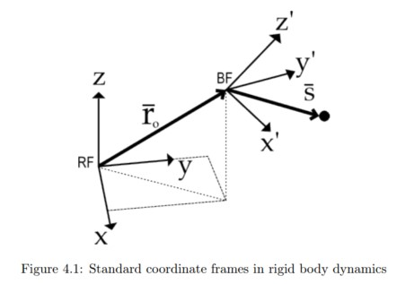
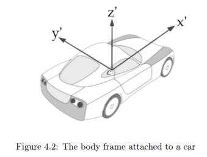
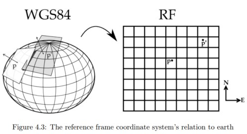
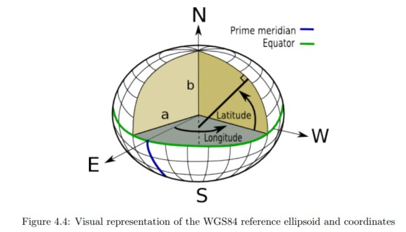

# thesis: sensor fusion of GPS and accelerometer data for estimation of vehicle dynamics

- http://www.diva-portal.org/smash/get/diva2:716774/FULLTEXT01.pdf
- Master's thesis; School of engineering sciences in Royal Institute of Technology Sweden 2014

## 4. Mathematical model of sensor data

### 4.1. Rigid body model of a car

```text
This is based on Dynamics. 
```

A car is a suitable system to model with rigid body dynamics. An extensive description on how to apply such theory is provided in [4] and [5] , here we will assume that the reader is somewhat familiar with the concepts and thus present the main results without derivation.



In rigid body dynamics there are two coordinate systems defined. We have a fixed coordinate system, called the reference frame (RF) and we have a coordinate system attached to the rigid body called the body frame (BF). In general the rigid body is free to move and rotate in space. For any particular point $\bar{s}$ in BF, the acceleration from the kinematics of the body is a combination of the translational acceleration of the origin in BF and the rotation of the body. This is described by the rigid body equations of motion:

- 4.1

$$
\begin{aligned}
\bar{r} &= \bar{r}_ o + \bar{s}\\\ \
\dot{\bar{r}} &= \dot{\bar{r}}_ o + \bar{\omega} \times \bar{s}\\\ \
\ddot{\bar{r}} &= \ddot{\bar{r}}_ o 2\bar{\omega} \times \dot{\bar{s}} + \dot{\bar{\omega}} \times \bar{s} + \bar{\omega} \times (\bar{\omega} \times \bar{s})
\end{aligned}
$$

Where $\bar{r}_ o$ is the vector to the origin of BF, $\bar{s}$ is a local vector to the point s expressed in BF and $\bar{\omega}$ is the angular velocity vector, as seen in figure 4.1. Since we only have planar positions available, we will restrict the rigid body’s center of mass to planar motion.

The accelerometer installed in the TEM unit measures the net acceleration in a particular point. This is not just the pure accelerations given in equation 4.1, but also gravity and any other external disturbances may be present. We will model the car as a rigid body moving directly above the ground, but with no direct contact. The vibrations resulting from the suspension’s interaction with the ground will thus be contained in a noise term. We adopt the following model for the acceleration:

- 4.2

$$
\bar{a}_ {measured} (t) = \bar{a}_ {center} (t) + \bar{a}_ {rotation} (t) + \bar{a}_ {gravity} (t) + \bar{\xi}(t)
$$

Where each term represents

- 4.3

$$
\begin{aligned}
\bar{a}_ {measured}(t) &\quad &\text{the acceleration measured by the TEM}\\\ \
\bar{a}_ {center}(t) &= \ddot{\bar{r}}_ o\quad &\text{the center of mass acceleration, from eq. 4.1}\\\ \
\bar{a}_ {rotation}(t) &= 2\bar{\omega} \times \dot{\bar{s}} + \dot{\bar{\omega}} \times \bar{s} + \bar{\omega} \times (\bar{\omega} \times \bar{s})\quad &\text{the rotational acceleration, from eq. 4.1}\\\ \
\bar{a}_ {gravity}(t) &= [0,0,-9.82]\quad &\text{the gravitational acceleration, assumed constant}\\\ \
\bar{\xi}(t) &\quad &\text{disturbances such as vibrations and measurement noise}
\end{aligned}
$$

The purpose of this model is that each of these terms can be interpreted to provide interesting information on the car dynamics. The term $\bar{a}_ {center}(t)$ gives us the necessary information to find the trajectory of the car and the velocity. In general, the term $\bar{a}_ {gravity}(t)$ is not necessarily constant in relation to the car and can be used to find the orientation of the car, as it represents a static reference in RF. The term $\bar{\xi}(t)$ can give indications on the current road conditions, as the interactions between the suspension and the road will be disturbances in the proposed rigid body model.



### 4.2 Defining the Coordinate Systems RF(reference frame) and BF(body frame)

We will now define the coordinate systems that are used to analyze our rigid body model. The body frame BF is straight forward. It is a carteesian system with its origin at the car’s center of mass, as seen in figure 4.2. In general there is also a third coordinate system defined by the axes of the accelerometer. We will assume, without loss of generality, that the accelerometer is aligned with BF. This is no restriction
as the alignment is a constant rotation matrix that can be determined when installating the TEM.

Our reference frame RF is constructed based on the standard GPS coordinate system called WGS84 [6]. The foundation of the WGS84 coordinate system is the reference ellipsoid, which is an earth centered earth fixed (ECEF) approximation of the earth’s surface. Any point p on the reference ellipsoid is given by its coordinates longitude θ and latitude φ. The RF coordinate system is obtained by mapping the ellipsoid surface to a plane, as illustrated in figure 4.3.



#### 4.2.1 Longitude and Latitude Coordinates

The reference ellipsoid in WGS84 is defined by its semi and major axis a and b, centered about an ECEF carteesian coordinate system, as illustrated in figure 4.4.



Let $R_N$ be a line that is normal to the ellipsoid surface and extend this line until it intersects the vertical
axis. The angle between the equatorial plane and $R_N$ is the latitude coordinate φ. The angle between $R_N$ and the prime meridian axis is the longitude coordinate θ. We emphasize that with this definition, the coordinates are not defined to emanate from the origin.

A consequence of how the coordinates are defined is that in order to analyze distance changes on the surface, we will need to define two radii of curvature. An infinitesimal change in distance in the north and east direction respectively is given by

- 4.4

$$
\begin{aligned}
dN &= R_Md\phi\\\
dE &= R_Nd\theta
\end{aligned}
$$

In these equations $R_N$ is as previously defined, and is called the radius of the prime vertical. The radius $R_M$ is called the radius of the prime meridian and is the radius of the sphere that is tangent to the ellipsoid at the particular point of interest. We emphasize that both radii will change as a function of the latitude φ, and will thus not be constant.

## References
- [1] Harbor Research inc. 2011, Next Generation Platform Innovation In M2M [white paper]. Retrieved from http://www.verizonenterprise.com/resources/whitepapers/wp_next_generation_platform_innovation_in_m2m_en-xg.pdf
- [2] LogicIO, CX1 pro-c, http://www.logicio.com/rtcu_products.htm
- [3] Albert Krohn et. al., Inexpensive and Automatic Calibration for acceleration Sensors, Telecooperation Office - Universität Karlsruhe, 2004.
- [4] Reza N. Jazar, Vehicle dynamics - Theory and applications, Springer, third edition, 2009
- [5] Oliver M. O’Reilly, Engineering dynamics: a primer, Springer, second edition, 2010, Chapter 8-9.
- [6] Department of defense, World geodetic system 1984 - it’s definition and relationships with local geodetic systems, National Imagery and Mapping Agency (NIMA), third edition, January 2000, section 2.
- [7] Clynch James R., Earth coordinates, Retrieved from http://clynchg3c.com/Technote/geodesy/radiigeo.pdf
- [8] Steven W. Smith, The Scientist and Engineer’s Guide to Digital Signal Processing, California Technical Publishing, 2nd edition, 1999, chapter 15.
- [9] David Baraff, An introduction ot physically based modeling, Carnegie Mellon University, 1997.
- [10] Frere P.E.M, Problems with using accelerometers to measure angular rate in automobiles, Sensors and Actuators A: Physical, Volume 27, Issues 1–3, May 1991, Pages 819–824
- [11] Defence mapping agency, The universal grids: Universal Transverse Mercator (UTM) and Universal Polar Stereographic (UPS), 1989, chapter 2.
- [12] Chair of statistics, Time series analysis - Examples with SAS, University of Würzburg, version 2012.August.01, 2012, chapter 1-3.
- [13] Clynch James R., Datums - Map coordinate reference frames, Retrieved from http://clynchg3c.com/Technote/maps/Datum_i.pdf
- [14] Clynch James R., Earth coordinates, Retrieved from http://clynchg3c.com/Technote/geodesy/coorddef.pdf