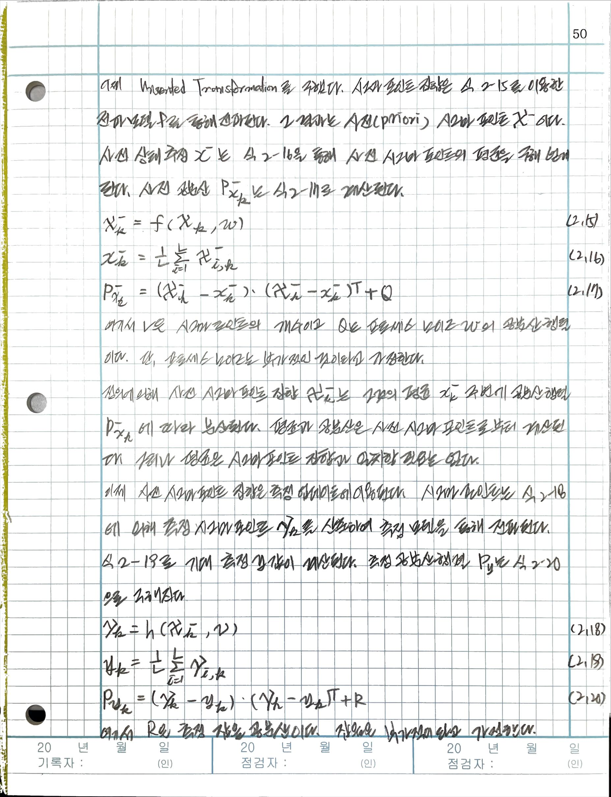
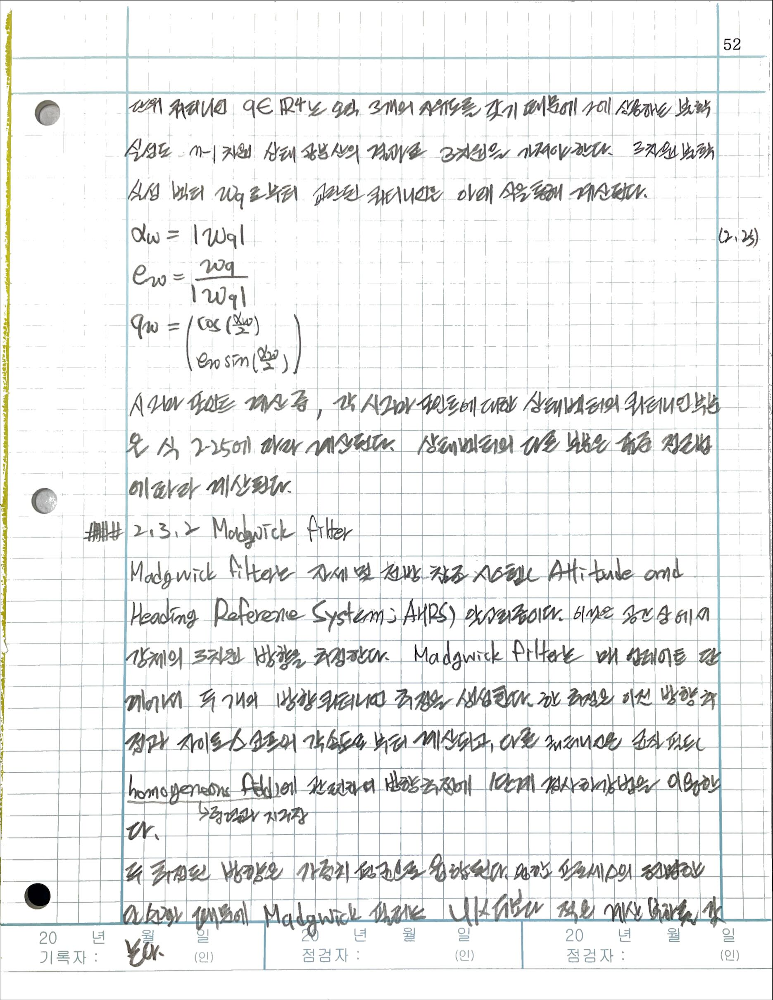

# thesis: Motion tracking in field sports using GPS and IMU

- M. Roobeek, Delft university of technology

## 1. Introduction

### 1.2 Background

## 2. Methods and materials

### 2.2. Sensors

#### 2.2.1 Inertial Measurement Unit(IMU)

### 2.3 Filters

#### 2.3.1 Unscented Kalman Filter (UKF)

##### Unscented Transformation

##### Update formular

##### Handling quaternions in the unscented tranformation

#### 2.3.2 Madgwick filter

##### Orientation from angular velocity

##### Orientation from a homogeneous field

##### Orientation from a homogeneous field

##### Fusion process

### 2-4 Models

#### 2-4-1 Linear Kalmann filter

#### 2-4-2 Translation UKF

#### 2-4-3 Rotation UKF

#### 2-4-4 Full state

#### 2-4-5 Filter Configuration

